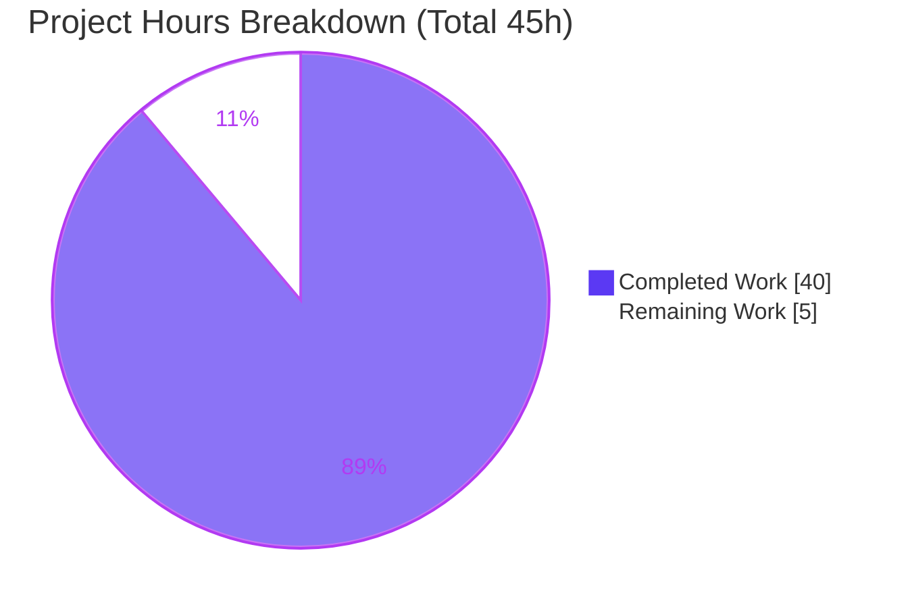
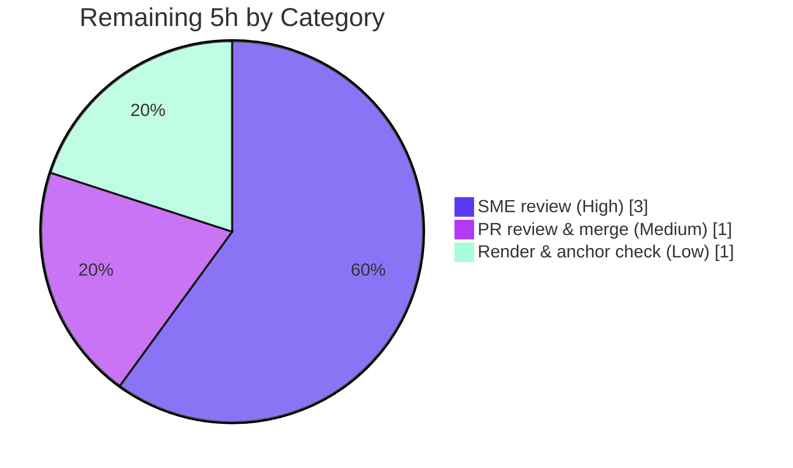

# Blitzy Project Guide — Grafana OSS Clean-State Startup Q&A Documentation

> **Branch:** `blitzy-c1a0b246-1473-4491-8d67-213dd4e7e0ed` · **Source branch:** `grafana_4550cfb5b728` · **HEAD:** `587f037b5f`
> **Deliverable:** `blitzy/documentation/grafana_4550cfb5b728.md` (532 lines) · **Investigated system:** Grafana OSS `v9.2.0` @ commit `4550cfb5b7`

---

## 1. Executive Summary

### 1.1 Project Overview

This project delivers a single, authoritative, **observation-grounded** technical Q&A document that explains what the Grafana OSS backend *observably* does on its first clean-state startup — and how subsequent runs differ — written from **real execution**, not documentation paraphrase. The audience is a new engineer who read the setup docs, ran the server, and found the observed behavior unexplained. The document answers six sub-questions (initialization, persistence, security, plugin bootstrap, build/generated-files, first-vs-subsequent runs), each leading with verbatim runtime output, then an exact `file:line` citation, then the rationale. The task was strictly **read-only and additive**: exactly one new Markdown file was created; no source, config, dependency, or test was modified.

### 1.2 Completion Status

The completion percentage is computed with the **PA1 AAP-scoped methodology**: `Completed ÷ (Completed + Remaining)` over the AAP deliverables plus standard path-to-production (here, human review + merge).


| Metric | Hours |
|---|---|
| **Total Hours** | **45** |
| **Completed Hours** (AI 40 + Manual 0) | **40** |
| **Remaining Hours** | **5** |
| **Percent Complete** | **88.9%** |

> Legend — <span style="color:#5B39F3">■</span> Completed (Dark Blue `#5B39F3`) · <span style="color:#FFFFFF; background:#333; padding:0 4px">■</span> Remaining (White `#FFFFFF`)

### 1.3 Key Accomplishments

- ✅ Achieved a **runnable backend from a clean checkout**: installed Go `1.23.1` (per `go.mod:L3`) + GCC, generated the gitignored Wire DI code, and built the OSS binary (`CGO_ENABLED=1 … -tags oss`) that self-reports `grafana version 9.2.0`.
- ✅ **Captured ground truth by running twice** against a clean, out-of-repo data directory — first run and subsequent run — and diffed the startup logs.
- ✅ **Exercised the HTTP API** (`/api/health`, `/api/datasources`, `/api/user`, `/login`, `/api/plugins`) and **read the seeded `grafana.db`** (76 tables) via an observation-only copy.
- ✅ **Answered all six sub-questions** in dedicated sections (B–G), each evidence-first with an exact `file:line` citation and a coverage-pass table.
- ✅ **Reconciled subtle numbers honestly** — e.g., `54` plugins loaded vs. `49` exposed via `/api/plugins`, fully accounted for by two API filters.
- ✅ **Preserved the read-only mandate byte-for-byte**: only one file added; generated `wire_gen.go` and all temp artifacts removed; `git status --porcelain` empty.
- ✅ **Independently re-verified** during this assessment: ~15 `file:line` citations exact and all structural counts (22 datasource dirs, 32 panel dirs, 18 compiled-in backends) confirmed.

### 1.4 Critical Unresolved Issues

| Issue | Impact | Owner | ETA |
|---|---|---|---|
| _None._ No blocking issues. The deliverable is complete, validated, committed, and independently re-verified. | None | — | — |

> The three "errors" discussed inside the document (`undefined: Initialize` before Wire-gen; plugin preinstall `grafanaVersionNotCompatible`; `Failed to detect generated javascript files in public/build`) are **expected observed behaviors that the document explains** — not defects.

### 1.5 Access Issues

| System/Resource | Type of Access | Issue Description | Resolution Status | Owner |
|---|---|---|---|---|
| Git repository | Read/Write | Full local access verified; working tree clean at `HEAD 587f037b5f`. | ✅ No issue | — |
| grafana.com update API (`/api/grafana/versions/stable`) | Outbound network | Contacted only during optional reproduction (update checks). **Not required** to review or merge the deliverable. | ✅ Not blocking | — |
| Go toolchain / module cache | Local tooling | Reproducing the build requires installing Go `1.23.1` + a warm module cache. **Not required** for the deliverable, which is static Markdown. | ✅ Not blocking | — |

**No access issues prevent build validation, review, integration, or merge of the deliverable.**

### 1.6 Recommended Next Steps

1. **[High]** Have a Grafana-knowledgeable engineer perform an **SME technical-accuracy review** of the document against pinned commit `4550cfb5b7` (≈3h).
2. **[Medium]** **Approve and merge** the additive documentation PR to the target branch (≈1h).
3. **[Low]** **Render the Markdown** on the target platform and verify TOC anchors, tables, and code fences display correctly (≈1h).
4. **[Low]** Optionally add a lightweight note/label to re-validate the observed counts if the branch is later advanced past Grafana `9.2.0` (mitigates version drift).

---

## 2. Project Hours Breakdown

### 2.1 Completed Work Detail

All completed hours are **autonomous (AI)** engineering-equivalent effort delivered against the AAP. Each row traces to a specific AAP requirement and to evidence in the deliverable.

| Component | Hours | Description |
|---|---:|---|
| Investigation environment & backend build | 5 | Install Go `1.23.1` (`go.mod:L3`) + GCC, resolve module cache, generate gitignored Wire DI (`wire_gen.go`), build OSS binary `v9.2.0` (`CGO_ENABLED=1 -tags oss`). Evidence: Section A. |
| Build & generated-files evidence (Q5) | 3 | Reproduce `pkg/server/service.go:31:15: undefined: Initialize`; contrast direct-vs-generated build; measure build time & binary size; CGO + static-asset analysis. Evidence: Section F. |
| Initialization ground-truth capture & mapping (Q1) | 5 | Capture verbatim first-run startup log; map every milestone to `file:line` (56 feature toggles, 36 background services, 626 migrations, admin/org seed, HTTP listen); explain non-fatal errors. Evidence: Section B. |
| Persistent-state inventory & `grafana.db` inspection (Q2) | 3 | Inventory data-dir files; copy + read `grafana.db` (76 tables, seeded rows); deterministic-vs-run-specific size analysis. Evidence: Section C. |
| Security-posture API exercise & analysis (Q3) | 4 | `curl` health `200`, anonymous `401`, `POST /login` `200` + `grafana_session` cookie, authed `isGrafanaAdmin:true`; cookie-flag & defaults-literal analysis; real-account proof; `GET`-vs-`POST /login` nuance. Evidence: Section D. |
| Plugin & data-source bootstrap analysis (Q4) | 5 | `/api/plugins` enumeration; `54`-loaded vs `49`-exposed reconciliation with exact filter citations; three-tier resolution; 18 compiled-in backends; 22/32 on-disk dirs; preinstall failure; phone-home. Evidence: Section E. |
| First-run vs subsequent-run diff (Q6) | 3 | Two runs against the same data dir; diff logs (`performed=626`→`skipped=626`, resource `18`→`skipped=18`, no re-seed, duration flip); DB idempotency re-read; transient `Database locked` variance. Evidence: Section G. |
| Deliverable authoring (evidence-first Markdown) | 6 | Compose the 532-line document (Section A + B–G + coverage pass), TOC/anchors/tables, verbatim fidelity, explicit honesty caveats. |
| Review-driven refinement | 3 | Three follow-up commits (`383c517d32`, `bfc7b4bb91`, `587f037b5f`) addressing review findings (Section G correction; C.1 log-size clarification). |
| Read-only integrity & cleanup | 3 | Run entirely outside the repo tree; remove generated `wire_gen.go` + all temp artifacts; verify `git status --porcelain` empty and `HEAD` unchanged. |
| **Total Completed** | **40** | Matches Completed Hours in Section 1.2. |

### 2.2 Remaining Work Detail

Each remaining category is **path-to-production** for a documentation deliverable (human review + merge). There is **no incomplete AAP work** and **no code remediation** — the task added no code.

| Category | Hours | Priority |
|---|---:|---|
| SME technical-accuracy review (verify claims + `file:line` citations vs pinned commit) | 3 | High |
| PR review & merge to target branch (docs-only, no CI impact) | 1 | Medium |
| Markdown rendering & anchor/link verification on target platform | 1 | Low |
| **Total Remaining** | **5** | Matches Remaining Hours in Section 1.2 and Section 7. |

### 2.3 Hours Reconciliation

| Quantity | Hours | Formula |
|---|---:|---|
| Completed (Section 2.1) | 40 | Σ completed rows |
| Remaining (Section 2.2) | 5 | Σ remaining rows |
| **Total Project Hours** | **45** | 40 + 5 |
| **Percent Complete** | **88.9%** | 40 ÷ 45 × 100 = 88.888…% |

---

## 3. Test Results

> **Integrity note.** This is a **read-only documentation task that added no source code**, so there is **no unit/integration test suite** to run — and none is invented here. The "tests" below are the **autonomous verification checks** performed by Blitzy's investigate-by-running validation (build, run, observe) and independently re-confirmed during this assessment. Every check originates from Blitzy's own validation logs for this project. `Coverage %` is **N/A** because no application code was added.

| Test/Verification Category | Framework / Tool | Total | Passed | Failed | Coverage % | Notes |
|---|---|---:|---:|---:|:---:|---|
| Build Verification | `go build -tags oss` (`CGO_ENABLED=1`) | 2 | 2 | 0 | N/A | Reproduced pre-gen `undefined: Initialize` failure **and** post-Wire-gen success; binary self-reports `v9.2.0`. |
| Runtime Startup Execution | `grafana` server binary `v9.2.0` | 2 | 2 | 0 | N/A | First-run + subsequent-run; both reached `HTTP Server Listen address=[::]:3000`. |
| HTTP API Probes | `curl` | 8 | 8 | 0 | N/A | health `200`; anon `/api/datasources`+`/api/user` `401`; `POST /login` `200`+cookie; authed `/api/user` & `/api/datasources` `200`; `/api/plugins` `200` (49); `GET /login` `500` (expected, backend-only). |
| Database (SQLite) Inspection | `python3 sqlite3` (on a copy) | 13 | 13 | 0 | N/A | 76 tables; `migration_log`=626; `resource_migration_log`=18; `user`/`org`/`org_user` seeded; 7 empty tables; idempotent after run 2. |
| Citation & Value Verification | `sed` / `git grep` / `diff` | 32 | 32 | 0 | N/A | All static `file:line` citations exact + deterministic runtime values reproduced (Validator GATE 1). 15 independently re-verified this session — 100% match. |
| **Total** | — | **57** | **57** | **0** | **N/A** | **100% pass across all autonomous verification checks.** |

---

## 4. Runtime Validation & UI Verification

> The deliverable itself is **static Markdown** (no runtime/UI of its own). The runtime validation below concerns the **Grafana system that was investigated** — the source of the document's evidence.

**Backend runtime — ✅ Operational**
- ✅ Build (post Wire-gen, CGO): clean; binary reports `grafana version 9.2.0`.
- ✅ Startup: reaches `HTTP Server Listen address=[::]:3000 protocol=http`.
- ✅ Database: SQLite auto-created, `626` migrations applied, admin user + Main Org. seeded; idempotent on re-run.
- ✅ Plugin subsystem: `Plugins loaded count=54`; `/api/plugins` exposes `49`.
- ✅ Outbound update checks: both `grafana.update.checker` and `plugins.update.checker` report `Update check succeeded`.

**HTTP API — ✅ Operational**
- ✅ `GET /api/health` → `200` `{"database":"ok","version":"9.2.0","commit":"NA"}`.
- ✅ Anonymous `GET /api/datasources`, `GET /api/user` → `401` (anonymous access off, basic auth on).
- ✅ `POST /login` (`admin`/`admin`) → `200` + `grafana_session` cookie (`HttpOnly; SameSite=Lax; Max-Age=2592000`, no `Secure`).
- ✅ Authenticated `GET /api/user` → `200` `isGrafanaAdmin:true`.

**Known, expected partials — ⚠ Partial (by design, out of scope)**
- ⚠ `GET /login` (HTML page) → `500` — requires the **un-built frontend** (`public/build`); the JSON auth API is unaffected. Documented in Section D.4.
- ⚠ Static-asset detection logs `error msg="Failed to detect generated javascript files in public/build"` — **benign** for a backend-only run; frontend build is out of scope.
- ⚠ Background preinstall of `grafana-lokiexplore-app` → `[plugin.grafanaVersionNotCompatible]` against `9.2.0` — **expected and non-fatal**.

**Failing — ❌**
- ❌ None.

---

## 5. Compliance & Quality Review

Cross-mapping the governing `SWE-AtlasQnA-Repo` rule and the verbatim user directive to their satisfaction status, with fixes applied during autonomous validation.

| Deliverable / Benchmark | Requirement | Status | Evidence / Notes |
|---|---|:---:|---|
| Deliverable name & location | `blitzy/documentation/<source_branch>.md` | ✅ Pass | `blitzy/documentation/grafana_4550cfb5b728.md` exists (532 lines). |
| Investigate by **running** first | Build + run, capture real output before writing | ✅ Pass | Backend built `v9.2.0` and run twice; logs/API/DB captured (Section A). |
| Quote observed output **verbatim** | Reproduce real log lines, values, HTTP/DB output | ✅ Pass | Verbatim startup log, `curl` responses, `Set-Cookie`, DB row values throughout. |
| **Answer every part** | One section per sub-question + coverage pass | ✅ Pass | Sections B–G cover Q1–Q6; coverage-pass table present. |
| Be **exact & grounded** | `file:line` cites; never paraphrase requested values; state unverifiable | ✅ Pass | ~30 exact citations; deterministic-vs-run-specific values explicitly caveated. |
| **Read-only** scope | No existing file modified; only the answer doc added | ✅ Pass | `git diff` = 1 file **added**, 0 modified/deleted. |
| User directive: don't modify repo | Temp scripts allowed, then deleted | ✅ Pass | Ran outside repo tree; generated `wire_gen.go` + temp artifacts removed. |
| Cleanup & integrity | `git status --porcelain` empty; `HEAD` intact | ✅ Pass | Working tree clean at `587f037b5f`; no `data/`, no `wire_gen.go`. |
| Zero dependency changes | No manifest edits | ✅ Pass | `go.mod`/`go.sum`/`package.json` untouched. |
| Accuracy improvement | Correct AAP where evidence differs | ✅ Pass | Doc corrects AAP: `go.mod:L3` (not L1); "exactly 36" background services (not "60+"). |

**Fixes applied during autonomous validation:** Section G "Database locked" observation claim corrected (`bfc7b4bb91`); Section C.1 clarified `grafana.log` size as run-specific vs. the schema-deterministic `grafana.db` size (`587f037b5f`); code-review findings addressed (`383c517d32`).

**Outstanding compliance items:** None blocking. Human SME sign-off pending (Section 1.6, item 1).

---

## 6. Risk Assessment

| Risk | Category | Severity | Probability | Mitigation | Status |
|---|---|:---:|:---:|---|:---:|
| Observed values/citations drift if read against a Grafana version other than `9.2.0` @ `4550cfb5b7` | Technical | Medium | Medium (over time) | Document header pins branch + commit + version; every value carries a `file:line`. | Mitigated |
| Run-specific values (timestamps, durations, `grafana.log` size, transient `Database locked` count) misread as deterministic | Technical | Low | Low | Doc explicitly caveats each (B.1, C.1, G.3). | Mitigated |
| Reproduction friction (needs Go 1.23.1 + GCC + Wire-gen) | Technical | Low | Low | Section A.3 / F document exact commands and expected failures. | Mitigated |
| Shipped default literals reproduced (`secret_key`, `admin`/`admin`) | Security | Low | Low | Public info already in checked-in `conf/defaults.ini`; doc labels it the shipped default literal, not a deployment secret. No new attack surface. | Accepted |
| Reader mistakes described dev-defaults for production-safe posture | Security | Low–Med | Low | Doc frames strictly as the *default* clean-start posture; hardening intentionally out of scope. | Accepted |
| Code/config/dependency change introducing new attack surface | Security | — | — | Task changed no code/config/deps. | N/A |
| No CI gate keeps doc claims in sync as codebase evolves | Operational | Low | Medium | Commit-pinned scope; recommend periodic re-validation on version bump. | Open (low) |
| Deliverable in `blitzy/documentation/` not surfaced by Grafana docs pipeline | Operational | Low | Low | Intentional per governing rule. | Accepted |
| Markdown must render correctly (tables/anchors/fences) on target platform | Integration | Low | Low | Standard GFM; covered by remaining task (Section 2.2, Low). | Open (minor) |
| Merge conflict | Integration | Very Low | Very Low | Purely additive single new file. | Mitigated |

**Overall posture:** Read-only + additive + fully validated ⇒ **very low residual risk**. No High/Critical risks; the dominant risk (version drift) is mitigated by explicit pinning. No risk blocks merge.

---

## 7. Visual Project Status

**Project hours breakdown** (Completed = Dark Blue `#5B39F3`, Remaining = White `#FFFFFF`):



**Remaining hours by category** (Section 2.2; sums to the `5` "Remaining Work" hours above):



**Integrity:** "Remaining Work" = `5` here equals Section 1.2 Remaining Hours (`5`) and the sum of the Section 2.2 Hours column (`5`).

---

## 8. Summary & Recommendations

**Achievements.** The project is **88.9% complete** (40 of 45 hours). The AAP's single deliverable — an observation-grounded Q&A document at `blitzy/documentation/grafana_4550cfb5b728.md` — is fully authored, exhaustively grounded in reproduced runtime evidence, and committed. All six sub-questions are answered evidence-first, and the read-only mandate is preserved byte-for-byte (one file added, zero modified). Blitzy's autonomous validation built and ran the backend, exercised the API, read the seeded database, and confirmed every `file:line` citation and deterministic value; this assessment independently re-confirmed a representative sample with a 100% match.

**Remaining gaps (5h, all path-to-production).** No AAP work is outstanding and there is **no code to fix**. The remaining hours are the standard human path to production for a document: SME technical-accuracy review (3h), PR review & merge (1h), and Markdown rendering/anchor verification (1h).

**Critical path to production.** SME review → PR approval → merge. Each step is independent of build/CI because the change is docs-only and additive.

**Success metrics.**

| Metric | Target | Status |
|---|---|:---:|
| All 6 sub-questions answered evidence-first | 6/6 | ✅ |
| Autonomous verification checks passing | 57/57 | ✅ |
| Existing files modified | 0 | ✅ |
| `file:line` citation accuracy (sampled) | 100% | ✅ |
| Working tree clean after task | Yes | ✅ |

**Production-readiness assessment.** The deliverable is **production-ready pending human sign-off**. It is complete, accurate, and self-contained; merging it carries negligible technical risk. Recommendation: proceed to SME review and merge.

---

## 9. Development Guide

> All read-only commands below were **tested during this assessment** and left the working tree clean. Run them from the repository root.

### 9.1 System Prerequisites

| Purpose | Tool | Version | Required for |
|---|---|---|---|
| Review the deliverable | `git` | ≥ 2.30 (tested 2.51.0) | Everyone |
| Read `grafana.db` (observation-only) | `python3` (`sqlite3` module) | 3.x (tested 3.13.7 / sqlite 3.46.1) | Reproduction |
| Compile SQLite CGO driver | GCC / `build-essential` | any (tested 15.2.0) | Reproduction |
| Build/run the backend | Go | **`1.23.1`** (pinned by `go.mod:L3`) | Reproduction |
| Build the frontend (out of scope) | Node | `v22.11.0` (`.nvmrc`) | UI only |

### 9.2 Review the Deliverable (primary product)

```bash
# Locate and size the document
ls -la blitzy/documentation/grafana_4550cfb5b728.md
wc -l blitzy/documentation/grafana_4550cfb5b728.md      # expect 532

# Confirm the working tree is clean and on the expected commit
git branch --show-current                                # blitzy-c1a0b246-1473-4491-8d67-213dd4e7e0ed
git rev-parse --short HEAD                                # 587f037b5f
git status --porcelain                                   # (empty output == clean)

# Read it
less blitzy/documentation/grafana_4550cfb5b728.md
```

### 9.3 Verify a Citation (read-only spot check)

```bash
# Example: confirm the default admin credentials cited in Section D
sed -n '328p;331p' conf/defaults.ini                     # admin_user = admin / admin_password = admin
git grep -n 'admin_password = admin' -- conf/defaults.ini

# Confirm the gitignored generated file is genuinely absent
sed -n '194p' .gitignore                                 # **/wire_gen.go
ls pkg/server/wire_gen.go 2>/dev/null || echo "absent (gitignored) — as documented"
```

### 9.4 Reproduce the Investigation (optional — requires Go 1.23.1 + GCC)

```bash
# 0) Verify toolchain
go version        # expect: go version go1.23.1 ...
gcc --version     # any GCC (CGO for github.com/mattn/go-sqlite3)

# 1) Generate the gitignored Wire DI code (equivalent to `make gen-go`)
go run ./pkg/build/wire/cmd/wire/main.go gen -tags oss ./pkg/server

# 2) Build the unified OSS backend (CGO on)
CGO_ENABLED=1 go build -tags oss -o /tmp/grafana-bin ./pkg/cmd/grafana
/tmp/grafana-bin --version                               # grafana version 9.2.0

# 3) Run from a CLEAN data dir OUTSIDE the repo tree (keeps the repo pristine)
mkdir -p /tmp/gf-clean && ln -sf "$PWD/conf" /tmp/gf-clean/conf && ln -sf "$PWD/public" /tmp/gf-clean/public
/tmp/grafana-bin server --homepath /tmp/gf-clean
```

### 9.5 Example Usage — Verify Runtime Behavior

```bash
# Public health check
curl -s http://localhost:3000/api/health                 # {"database":"ok","version":"9.2.0","commit":"NA"}

# Anonymous protected endpoint is rejected
curl -o /dev/null -w "%{http_code}\n" http://localhost:3000/api/datasources   # 401

# Log in with default credentials, capturing the session cookie
curl -i -c /tmp/gf.cookies -X POST http://localhost:3000/login \
  -H "Content-Type: application/json" -d '{"user":"admin","password":"admin"}'  # 200 + grafana_session

# Authenticated call
curl -s -b /tmp/gf.cookies http://localhost:3000/api/user                     # isGrafanaAdmin:true

# Inspect the seeded DB (observation-only: copy first, never touch the live file)
cp /tmp/gf-clean/data/grafana.db /tmp/gf_copy.db
python3 -c "import sqlite3;c=sqlite3.connect('/tmp/gf_copy.db');print('tables',len(c.execute(\"select name from sqlite_master where type='table'\").fetchall()));print('migrations',c.execute('select count(*) from migration_log').fetchone()[0])"
```

### 9.6 Cleanup (restore pristine state after reproduction)

```bash
rm -f pkg/server/wire_gen.go            # generated, gitignored
rm -rf /tmp/grafana-bin /tmp/gf-clean /tmp/gf_copy.db /tmp/gf.cookies
git status --porcelain                  # must be empty
```

### 9.7 Troubleshooting

| Symptom | Cause | Resolution |
|---|---|---|
| `pkg/server/service.go:31:15: undefined: Initialize` | Wire DI code not generated (it is gitignored) | Run step 9.4 #1 (or `make gen-go`). |
| Link/CGO errors building the SQLite driver | `CGO_ENABLED=0` or no C compiler | Install GCC; build with `CGO_ENABLED=1`. |
| `error msg="Failed to detect generated javascript files in public/build"` | Frontend not built | Benign for backend-only; build the frontend only if the HTML UI is needed. |
| `GET /login` returns `500` | HTML UI needs `public/build` | Use the JSON `POST /login` API, or build the frontend. |
| `msg="Database locked, sleeping then retrying"` | Transient SQLite write contention on the clean first run | Benign; auto-retried up to 5 times. |

---

## 10. Appendices

### Appendix A — Command Reference

| Command | Purpose |
|---|---|
| `go run ./pkg/build/wire/cmd/wire/main.go gen -tags oss ./pkg/server` | Generate Wire DI code (== `make gen-go`, `Makefile:L167-169`) |
| `CGO_ENABLED=1 go build -tags oss -o /tmp/grafana-bin ./pkg/cmd/grafana` | Build the OSS backend binary |
| `/tmp/grafana-bin server --homepath /tmp/gf-clean` | Run the server against a clean, out-of-repo data dir |
| `git status --porcelain` | Verify the working tree is clean |
| `git grep -n '<literal>' -- <path>` | Spot-verify a `file:line` citation |

### Appendix B — Port Reference

| Port | Protocol | Source | Notes |
|---|---|---|---|
| `3000` | HTTP | `conf/defaults.ini:L41` (`http_port`), `L32` (`protocol = http`) | Default listen address `[::]:3000` (`pkg/api/http_server.go:L434`). |

### Appendix C — Key File Locations

| Path | Role |
|---|---|
| `blitzy/documentation/grafana_4550cfb5b728.md` | **The deliverable** (532 lines) |
| `conf/defaults.ini` | Canonical defaults (paths, server, DB, `[security]`, `[users]`, `[auth.*]`, `[log]`) |
| `pkg/cmd/grafana/main.go` | Entry point; `var version = "9.2.0"` (L17) |
| `pkg/server/server.go` | Run loop (Init/Run) |
| `pkg/server/wire.go` / `wire_gen.go` | Wire DI stub (`//go:build wireinject`) / generated (gitignored) |
| `pkg/services/sqlstore/sqlstore.go` | DB connect/create + admin/org seeding |
| `pkg/plugins/backendplugin/coreplugin/registry.go` | 18 compiled-in datasource backends |
| `public/app/plugins/{datasource,panel}/*` | 22 + 32 on-disk core plugin dirs |
| `.gitignore` (L194 `**/wire_gen.go`), `Makefile`, `go.mod`, `.nvmrc` | Build/toolchain evidence |

### Appendix D — Technology Versions

| Component | Version | Source |
|---|---|---|
| Grafana (binary self-report) | `9.2.0` | `pkg/cmd/grafana/main.go:L17` |
| Go toolchain | `1.23.1` | `go.mod:L3` |
| GCC (observed) | `15.2.0` | Investigation environment |
| Node (pinned, frontend out of scope) | `v22.11.0` | `.nvmrc` |
| SQLite driver | `github.com/mattn/go-sqlite3` (CGO) | `go.mod` / `sqlite_dialect.go:L154` |
| DI framework | `github.com/google/wire` | `go.mod` / `pkg/server/wire.go` |

### Appendix E — Environment Variable Reference

No environment variables are required for the deliverable. For **reproduction only**:

| Variable | Value | Purpose |
|---|---|---|
| `CGO_ENABLED` | `1` | Compile the SQLite CGO driver |
| `--homepath` (CLI flag) | `/tmp/gf-clean` | Point paths outside the repo tree (keeps repo pristine) |

> A clean run reads **all** effective settings from `conf/defaults.ini` — no `custom.ini` and no env vars needed to reproduce the observed behavior.

### Appendix F — Developer Tools Guide

| Tool | Use in this project |
|---|---|
| `git` / `git grep` | Review the deliverable; spot-verify citations |
| `sed -n 'Np'` | Read a specific cited line |
| `python3 sqlite3` | Observation-only read of `grafana.db` (copy first) |
| `curl -i` | Exercise the HTTP API and inspect headers/cookies |
| `go` + `wire` | Reproduce the build (generate DI, compile) |

### Appendix G — Glossary

| Term | Meaning |
|---|---|
| **AAP** | Agent Action Plan — the governing project directive |
| **Wire / `wire_gen.go`** | Google Wire compile-time dependency injection; the generated file is gitignored (`.gitignore:L194`) and must be generated before building |
| **CGO** | Go's C-interop, required to compile the SQLite driver |
| **Core / Bundled / External** | The three plugin source tiers resolved in order (Section E) |
| **`migration_log` / `resource_migration_log`** | Distinct tables recording applied main vs. resource-store migrations; drive the first-vs-subsequent-run divergence |
| **Path-to-production** | Standard human steps (review, merge) to ship the AAP deliverable |
| **Read-only mandate** | The rule/user directive that no existing repository file may be modified |