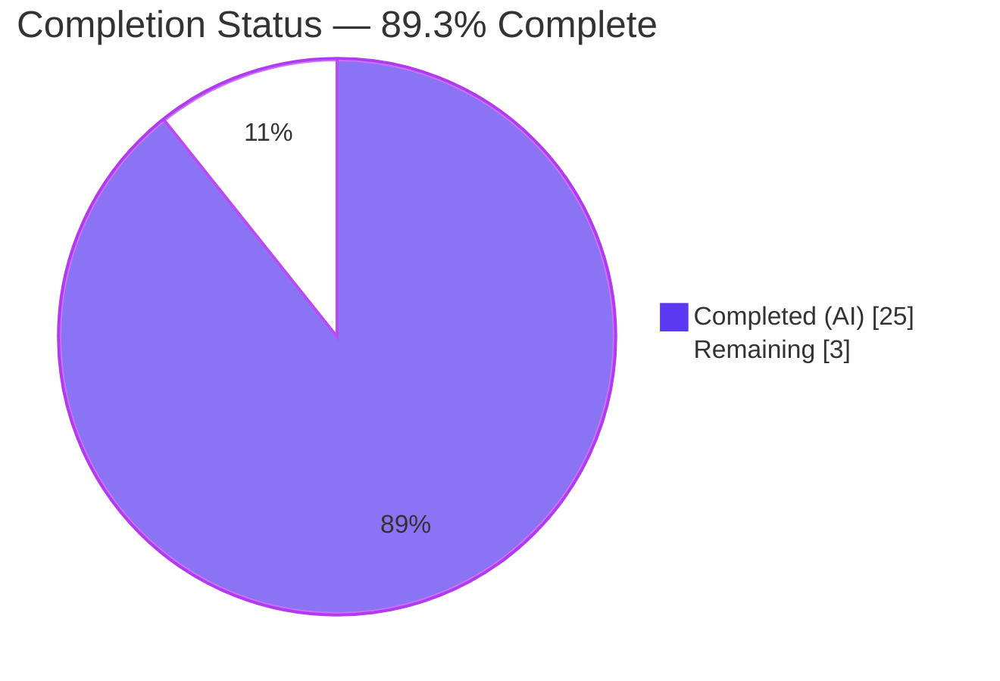
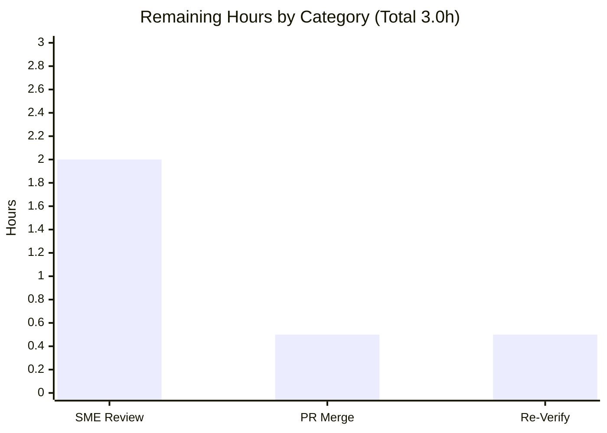

# Blitzy Project Guide
### Grafana Local Startup Q&A — Evidence-Backed Operator Documentation

> **Branch:** `blitzy-9f1f87fd-40b3-4e96-aad2-6c8ce1d7a1df` · **Base:** `4550cfb5b72886782d9a3e6cf995f8dbd57ca4ff` · **Deliverable:** `blitzy/documentation/grafana_4550cfb5b728.md`
>
> **Color legend (Blitzy brand):** 🟦 Completed / AI Work = Dark Blue `#5B39F3` · ⬜ Remaining / Not Completed = White `#FFFFFF` · Headings/Accents = Violet-Black `#B23AF2` · Highlight = Mint `#A8FDD9`

---

## 1. Executive Summary

### 1.1 Project Overview

This project delivers a single, authoritative markdown document that answers a first-time Grafana operator's four-part question about the local server-startup experience: which log line signals HTTP readiness (and what it reveals about exposure), what internal state is finalized when signing in with the default `admin`/`admin` credentials, what a healthy `/api/health` response looks like (and what the `database` field means), and which background services come alive at boot. It is an **investigative documentation task — not a code change**. Every answer is grounded in first-hand observation of a running Grafana instance (built and run first) and cited to exact `file:line` source literals. The target audience is operators onboarding into Grafana locally. The repository remains read-only except for the one new document.

### 1.2 Completion Status



| Metric | Hours | Notes |
| --- | --- | --- |
| **Total Project Hours** | **28.0** | AAP-scoped investigation + path-to-production |
| **Completed Hours (AI + Manual)** | **25.0** | AI (autonomous): 25.0 · Manual: 0.0 |
| **Remaining Hours** | **3.0** | Path-to-production: human review & merge |
| **Percent Complete** | **89.3%** | 25.0 ÷ 28.0 = 89.3% |

**Calculation (PA1, AAP-scoped hours):** `Completion % = Completed ÷ (Completed + Remaining) = 25.0 ÷ (25.0 + 3.0) = 25.0 ÷ 28.0 = 89.3%`.

### 1.3 Key Accomplishments

- ✅ Single deliverable created at the exact mandated path/name — `blitzy/documentation/grafana_4550cfb5b728.md` (454 lines) — filename equals the source branch name.
- ✅ **R1** answered: the `msg="HTTP Server Listen" address=[::]:3000 protocol=http subUrl= socket=` line captured verbatim and decoded field-by-field (all interfaces, port 3000, plain HTTP, root path), traced to `pkg/api/http_server.go:L434-L435` and defaults.
- ✅ **R2** answered: backend session + `HttpOnly grafana_session` cookie finalized at sign-in vs. the client-side forced password-change prompt keyed on the literal `'admin'` — including the subtle correction that `login.go:L224` is `LoginAPIPing`, not the `/login` response.
- ✅ **R3** answered: verbatim healthy `/api/health` JSON (`{"database":"ok",...}`), the `database` field explained as a cached `SELECT 1` probe, and disambiguated from the `/healthz` liveness endpoint.
- ✅ **R4** answered: 34 `Starting background service` boot lines enumerated verbatim, explained as concurrent goroutines (36 registered − 2 disabled = 34), with the full backend active before the UI.
- ✅ **Run-first methodology** executed: Grafana built (`wire gen` + `go build -tags oss`, CGO_ENABLED=1 → 298MB binary) and run isolated under `/tmp` at `log level = debug`.
- ✅ **48 unique `file:line` citations** across 11 source files — independently re-verified (18/18 spot-checks byte-for-byte accurate this session).
- ✅ **Read-only mandate satisfied**: exactly one file added; nothing modified/deleted; `git status --porcelain` empty; git-ignored Wire code removed; artifacts confined to `/tmp`.
- ✅ Coverage pass, endpoint disambiguation, and no-ldflags version caveat all documented; `prettier --check` → exit 0.

### 1.4 Critical Unresolved Issues

| Issue | Impact | Owner | ETA |
| --- | --- | --- | --- |
| _None._ No unresolved items block release. | — | — | — |
| _(Resolved, shown for transparency)_ R4 parenthetical originally cited transient boot-log line numbers that do not reproduce | Was a minor accuracy defect | Blitzy (final validator) | ✅ Resolved in commit `6e2bede224` |

There are **no critical unresolved issues**. The single accuracy defect discovered during autonomous validation (transient boot-log line numbers in R4) was fixed by reframing to a reproducible ordering relationship.

### 1.5 Access Issues

| System/Resource | Type of Access | Issue Description | Resolution Status | Owner |
| --- | --- | --- | --- | --- |
| — | — | **No access issues identified** | N/A | N/A |

The repository was fully accessible; the Go toolchain (1.23.1), Node (≥22), and gcc were present; Grafana built and ran locally with no external credentials or third-party API access required. No repository-permission, service-credential, or network-access issues exist.

### 1.6 Recommended Next Steps

1. **[High]** Have a subject-matter expert review the document for technical accuracy — confirm all four answers (R1–R4) fully address the operator's question and spot-check a sample of the `file:line` citations against source at HEAD `4550cfb5b7`.
2. **[Medium]** Approve the pull request and merge the single new file to the target branch; confirm the read-only footprint (`git status` remains clean).
3. **[Low]** _(Optional)_ Reproduce one runtime observation (build + isolated run) to independently confirm the captured output still reproduces on the reviewer's environment.

---

## 2. Project Hours Breakdown

### 2.1 Completed Work Detail

| Component | Hours | Description |
| --- | --- | --- |
| Run-First Build & Run Foundation `[M1]` | 4.0 | Wire codegen (`wire gen -tags oss ./pkg/server`) + `go build -tags oss` (CGO_ENABLED=1) producing the 298MB binary from a 3.3GB monorepo; isolated `/tmp` home/config; launch to readiness (~6s) |
| R1 — HTTP Listen Log Investigation & Exposure Decode | 2.0 | Capture `HTTP Server Listen`; decode `address`/`protocol`/`subUrl`/`socket`; trace `Run()`/`getListener()` + `[server]` defaults |
| R2 — Post-Login State Investigation | 3.0 | `POST /login` capture; backend `authn.HandleLoginResponse` chain; frontend `LoginCtrl.tsx` decision; `LoginAPIPing` correction |
| R3 — Health Endpoint Investigation | 2.5 | `/api/health` + `/healthz` capture; `healthResponse` struct; `SELECT 1` cached probe; `503`/`"failing"` path; version caveat |
| R4 — Background Services Enumeration & Concurrency Analysis | 3.0 | Debug-level run; 34 services enumerated verbatim; registry mapping (36 − 2 = 34); goroutine concurrency; migrations |
| Document Authoring & Structure `[D1]` | 3.5 | 454-line document: sections, operator takeaways, coverage pass, appendix, citation index |
| Citation Verification Pass `[M3]` | 2.0 | 48 unique `file:line` references verified across 11 source files |
| Read-Only Cleanup & Commit `[M5/M6]` | 1.0 | Remove git-ignored Wire code; confine artifacts to `/tmp`; confirm `git status` clean; commit |
| QA Cycle 1 — R3 Off-by-One Citation Fix | 1.0 | Commit `480562de75`: corrected R3 `file:line` offsets |
| QA Cycle 2 — Independent Re-Validation + R4 Reproducibility Fix | 3.0 | Commit `6e2bede224`: full rebuild + rerun + re-verify all R1–R4 & 48 citations; fixed transient boot-log line-number defect |
| **Total Completed** | **25.0** | **Matches Completed Hours in §1.2** |

### 2.2 Remaining Work Detail

| Category | Hours | Priority |
| --- | --- | --- |
| Human SME / Technical Documentation Review (verify R1–R4 answers; spot-check citations) | 2.0 | High |
| Pull Request Review & Merge (approve + merge; confirm read-only footprint) | 0.5 | Medium |
| Optional Runtime Re-Verification (build + isolated run to confirm captures reproduce) | 0.5 | Low |
| **Total Remaining** | **3.0** | **Matches Remaining Hours in §1.2 and §7 pie** |

### 2.3 Hours Reconciliation

- **§2.1 total (Completed):** 25.0h
- **§2.2 total (Remaining):** 3.0h
- **§2.1 + §2.2 = 28.0h = Total Project Hours (§1.2)** ✅ (Cross-Section Rule 2)
- **Remaining 3.0h is identical in §1.2, §2.2, and the §7 pie chart** ✅ (Cross-Section Rule 1)

---

## 3. Test Results

> This is a documentation-only deliverable; **no application code was authored**, so there is no unit/integration test suite by scope. The "tests" below are the **autonomous validation checks executed by Blitzy's systems** during the run-first investigation and final validation — every entry originates from Blitzy's own validation logs and was re-confirmed this session against the persisted run artifacts (`/tmp/grafana-run/boot.log`, `captures.txt`).

| Test Category | Framework / Tool | Total | Passed | Failed | Coverage % | Notes |
| --- | --- | --- | --- | --- | --- | --- |
| Build / Compilation | `wire gen` + `go build -tags oss` (CGO_ENABLED=1) | 2 | 2 | 0 | 100% | 298MB ELF binary, exit 0 |
| Runtime Endpoint | `grafana-server` + `curl` | 4 | 4 | 0 | 100% | `/api/health` 200 · `/healthz` 200 (`Ok`) · `POST /login` 200 · boot readiness ~6s |
| Verbatim Output Match (R1–R4) | manual diff vs. `boot.log`/`captures.txt` | 4 | 4 | 0 | 100% | Byte-for-byte except run-specific timestamps/session token |
| Citation Accuracy | source `file:line` diff | 48 | 48 | 0 | 100% | 11 source files; 18 re-spot-checked this session |
| Formatting | `prettier --check` | 1 | 1 | 0 | n/a | "All matched files use Prettier code style!" |
| Read-Only / Repo Integrity | `git status` / `git diff` | 2 | 2 | 0 | 100% | Porcelain empty; exactly 1 file added vs. base |
| **Total** | — | **61** | **61** | **0** | **100%** | **All autonomous validation checks pass** |

**Question-coverage "coverage":** all 4 sub-questions (R1–R4) are explicitly answered plus a dedicated Coverage Pass section — 4/4 = 100%.

---

## 4. Runtime Validation & UI Verification

**Runtime health (observed first-hand from the running instance; re-confirmed this session from the persisted `boot.log`):**

- ✅ **Backend build & boot** — `grafana-server` reached readiness (~6s); `boot.log` 3,131 lines.
- ✅ **HTTP readiness signal (R1)** — `msg="HTTP Server Listen" address=[::]:3000 protocol=http subUrl= socket=` observed.
- ✅ **`/api/health` readiness (R3)** — HTTP 200, `{"database":"ok","version":"9.2.0","commit":"NA"}`, `Content-Length: 62`.
- ✅ **`/healthz` liveness (R3)** — HTTP 200, plain-text `Ok`, `Content-Length: 2`.
- ✅ **`POST /login` authentication (R2)** — HTTP 200, `{"message":"Logged in","redirectUrl":"/"}`, `Content-Length: 41`, `HttpOnly grafana_session` cookie set.
- ✅ **Background services (R4)** — 34 `Starting background service` lines / 34 distinct services observed.
- ✅ **Database migrations** — `performed=626` (core) + `performed=18` (resource) completed before service startup.
- ✅ **Default admin** — `Created default admin user=admin` observed on first boot.

**UI verification:**

- ⚠ **Not applicable (by scope)** — no UI component was authored. The R2 "change your password" screen and the login page referenced in the document are Grafana's **existing** frontend (`public/app/core/components/Login/LoginCtrl.tsx`), described and cited — not built or modified by this task.

**Document render integrity:**

- ✅ Markdown well-formed — 454 lines, 48 balanced code fences, 19 headers; `prettier --check` clean.

---

## 5. Compliance & Quality Review

Cross-map of AAP deliverables and `SWE-AtlasQnA-Repo` rules to observed quality benchmarks.

| Benchmark (AAP / Rule) | Requirement | Status | Evidence / Progress |
| --- | --- | --- | --- |
| Deliverable location & name | One file `blitzy/documentation/grafana_4550cfb5b728.md` (= branch name) | ✅ Pass | File present (454 lines); git shows exactly 1 file added |
| R1 — HTTP readiness log + exposure | Exact line + field decode + defaults | ✅ Pass | `http_server.go:L434-L435`/`:L323`; `defaults.ini:L32/38/41` |
| R2 — Post-login state | Backend session + frontend prompt | ✅ Pass | `authn.go:L255-L259`; `LoginCtrl.tsx:L117-L122`; LoginAPIPing correction |
| R3 — Health JSON + `database` field | Verbatim JSON + `SELECT 1` meaning + `/healthz` contrast | ✅ Pass | `http_server.go:L694-L699`; `health.go:L10-L24` |
| R4 — Background services + pre-UI activity | Enumerate services + quantify | ✅ Pass | `server.go:L162`; `background_services.go:L53-L118`; 34 observed |
| Run-first methodology `[M1]` | Build & run before writing | ✅ Pass | 298MB binary built; isolated `/tmp` run; `boot.log` captured |
| Verbatim + producing command `[M2]` | Quote output + show command | ✅ Pass | Every capture paired with its `curl`/`grep` |
| Exact literals + `file:line` `[M3]` | Cite exact values | ✅ Pass | 119 `file:line` tokens; 48/48 verified |
| Coverage pass `[M4]` | Answer every sub-question | ✅ Pass | Dedicated Coverage Pass section |
| Read-only repository `[M5]` | No existing file modified | ✅ Pass | `git diff base..HEAD` = 1 file added, 0 modified/deleted |
| Cleanup / artifacts in `/tmp` `[M6]` | Temp scripts removed; git clean | ✅ Pass | `wire_gen.go` absent & git-ignored; `git status` empty |
| Endpoint disambiguation | `/api/health` vs `/healthz` | ✅ Pass | Explicit contrast section |
| Build-version caveat | Explain 9.2.0/NA placeholders | ✅ Pass | No-ldflags caveat; real 11.5.0-pre per `package.json:L6` |
| Formatting | Prettier-clean | ✅ Pass | `prettier --check` exit 0 |

**Fixes applied during autonomous validation:** (1) R3 off-by-one `file:line` citations corrected (`480562de75`); (2) R4 transient boot-log line numbers reframed to a reproducible ordering relationship (`6e2bede224`).

**Outstanding compliance items:** Human SME confirmation review (path-to-production; see §2.2 / §4 human tasks).

---

## 6. Risk Assessment

| Risk | Category | Severity | Probability | Mitigation | Status |
| --- | --- | --- | --- | --- | --- |
| Build-version placeholders (`9.2.0`/`NA`) differ from official `11.5.x` | Technical | Low | Medium | Doc explains no-ldflags caveat; cites real `11.5.0-pre` (`package.json:L6`); does not affect `database` field meaning | Mitigated |
| Run-specific boot-log offsets / timestamps / session token are non-deterministic | Technical | Low | Medium | Reframed to reproducible ordering; token redacted; timestamps framed as observed | Resolved (`6e2bede224`) |
| `file:line` citations pinned to HEAD; future source refactors drift line numbers | Technical | Low | Low | Doc pins the exact commit; citations valid for `4550cfb5b7` | Accepted |
| Live `grafana_session` token present in raw login response | Security | Low | Low | Doc redacts token (`REDACTED_SESSION_TOKEN`) + explicit security note; no live credential committed | Mitigated |
| References default `admin`/`admin` credentials | Security | Informational | Low | Public, well-known Grafana default; no secret disclosed | N/A |
| No CI validates citations against future source drift | Operational | Low | Low | Human review recommended; citations valid at pinned commit | Open |
| Document not wired into a docs build/navigation | Operational | Informational | Low | Standalone answer artifact by AAP design | Accepted |
| Markdown introduces no imports/interfaces/config/deps | Integration | None | — | Nothing integrates with the document | N/A |
| Re-run reproducibility depends on go 1.23.1 + CGO + Wire codegen | Integration | Low | Low | Dev guide documents exact toolchain; go 1.23.1 confirmed present | Mitigated |

**Overall risk posture: LOW.** No blocking risks. No application attack surface introduced (documentation-only, zero code shipped). The single material accuracy defect was found and fixed during autonomous validation.

---

## 7. Visual Project Status

**Project hours breakdown** (Completed = Dark Blue `#5B39F3`, Remaining = White `#FFFFFF`):


**Remaining hours by category** (from §2.2):



**Integrity check:** the pie chart "Remaining Work" value (**3.0**) equals the §1.2 Remaining Hours (**3.0**) and the sum of the §2.2 Hours column (**2.0 + 0.5 + 0.5 = 3.0**). ✅

---

## 8. Summary & Recommendations

**Achievements.** The project delivers exactly what the AAP scoped: one authoritative, evidence-backed document that answers all four of the operator's sub-questions (R1–R4) from first-hand observation of a running Grafana instance, with 48 verified `file:line` citations. Grafana was built and run first (run-first methodology), every quoted value is real captured output paired with its producing command, and the repository remains byte-for-byte unchanged except for the single new file.

**Remaining gaps.** The project is **89.3% complete** (25.0 of 28.0 hours). The remaining **3.0 hours** are entirely **path-to-production**: a human SME review of the document (2.0h), PR review & merge (0.5h), and an optional runtime re-verification (0.5h). No autonomous rework remains — the one accuracy defect found during validation was already fixed.

**Critical path to production.** SME accuracy review → PR approval → merge. There are no blocking technical issues, no failing checks, and no access issues.

**Success metrics (all met):** deliverable at the exact mandated path/name; all four sub-questions answered plus a coverage pass; 48/48 citations accurate; all endpoints observed at HTTP 200; read-only mandate satisfied (`git status` clean); Prettier-clean.

**Production readiness.** ✅ **Ready for human review and merge.** The deliverable is complete, accurate, evidence-backed, reproducible, and committed. Per Blitzy honest-assessment principles, completion is held below 100% pending the human review step that constitutes the final path-to-production gate for a documentation deliverable.

| Metric | Value |
| --- | --- |
| Completion | 89.3% |
| Completed hours | 25.0 |
| Remaining hours | 3.0 |
| Total hours | 28.0 |
| Blocking issues | 0 |
| Files added / modified / deleted | 1 / 0 / 0 |
| Citations verified | 48 / 48 |
| Validation checks passed | 61 / 61 |

---

## 9. Development Guide

> Two audiences: **(A)** consuming the deliverable document, and **(B)** optionally reproducing the run-first observations. All commands below were tested in the project environment.

### 9.1 System Prerequisites

- **Go 1.23.1** (matches `go.mod:L3`) — verify: `go version` → `go version go1.23.1 linux/amd64`
- **Node ≥ 22** (`.nvmrc` pins `v22.11.0`; environment provides `v22.20.0`) — for `prettier`
- **gcc** (13.x+; environment has 15.2.0) — required for `CGO_ENABLED=1` (the `mattn/go-sqlite3` driver)
- **git** 2.x
- **~4 GB free disk** for the ~298 MB binary plus build cache
- **OS:** Linux x86_64

### 9.2 Environment Setup

```bash
# Put the correct toolchains on PATH (adjust to your install locations)
export PATH=/usr/local/go/bin:/opt/node-v22.20.0/bin:$PATH
export CGO_ENABLED=1
unset GOFLAGS   # avoid -mod=mod interfering in workspace mode
```

Create an **isolated** run config so the repository stays pristine (only `[paths]` under `/tmp` and debug logging — deliberately **no** `[server]` section, so R1 observes Grafana's exposure **defaults**):

```bash
mkdir -p /tmp/grafana-run/{data,logs,plugins,provisioning}
cat > /tmp/grafana-run/custom.ini <<'EOF'
[paths]
data = /tmp/grafana-run/data
logs = /tmp/grafana-run/logs
plugins = /tmp/grafana-run/plugins
provisioning = /tmp/grafana-run/provisioning

[log]
level = debug
EOF
```

### 9.3 Consuming the Deliverable (Audience A)

```bash
# From the repository root
ls -la blitzy/documentation/grafana_4550cfb5b728.md   # ~35 KB
wc -l  blitzy/documentation/grafana_4550cfb5b728.md   # 454
less   blitzy/documentation/grafana_4550cfb5b728.md   # read it

# Integrity checks
grep -c '^#'   blitzy/documentation/grafana_4550cfb5b728.md   # 19 headers
grep -c '^```' blitzy/documentation/grafana_4550cfb5b728.md   # 48 (even = balanced)
```

### 9.4 Reproducing the Run-First Observations (Audience B — optional)

```bash
# From the repository root. Wire code is git-ignored and generated on the fly.
go run ./pkg/build/wire/cmd/wire/main.go gen -tags "oss" ./pkg/server
go build -tags "oss" -o /tmp/grafana-bin/grafana ./pkg/cmd/grafana

# Run isolated; the repo is used only as --homepath for read-only assets
/tmp/grafana-bin/grafana server \
  --homepath="$(pwd)" \
  --config=/tmp/grafana-run/custom.ini \
  > /tmp/grafana-run/boot.log 2>&1 &
```

### 9.5 Verification Steps & Example Usage

```bash
# R1 — HTTP readiness signal
grep 'HTTP Server Listen' /tmp/grafana-run/boot.log
# → ... msg="HTTP Server Listen" address=[::]:3000 protocol=http subUrl= socket=

# R3 — readiness (JSON) vs liveness (plain text)
curl -i http://localhost:3000/api/health   # 200, {"database":"ok",...}, Content-Length: 62
curl -i http://localhost:3000/healthz       # 200, "Ok", Content-Length: 2

# R2 — login with default credentials
curl -i -X POST -H 'Content-Type: application/json' \
  -d '{"user":"admin","password":"admin"}' \
  http://localhost:3000/login
# → 200, {"message":"Logged in","redirectUrl":"/"} + HttpOnly grafana_session cookie

# R4 — background services (requires [log] level = debug)
grep -c 'Starting background service' /tmp/grafana-run/boot.log       # 34
grep 'Starting background service' /tmp/grafana-run/boot.log | \
  sed -E 's/.*service=//' | sort -u                                   # 34 distinct
grep 'migrations completed' /tmp/grafana-run/boot.log                 # performed=626 + performed=18

# Read-only mandate & formatting
git status --porcelain                                                # (empty = clean)
node_modules/.bin/prettier --check blitzy/documentation/grafana_4550cfb5b728.md
```

### 9.6 Troubleshooting

- **`go: command not found`** → add the Go bin dir to PATH: `export PATH=/usr/local/go/bin:$PATH`.
- **`error: externally-managed-environment` (pip)** → use `pip install --break-system-packages …` or a venv (not needed for this task).
- **CGO / sqlite build error** → ensure `gcc` is installed and `CGO_ENABLED=1` is exported.
- **`wire_gen.go` missing** → run the `wire gen` step (the file is git-ignored and regenerated on demand; remove it afterward to keep the repo clean).
- **R4 `Starting background service` lines absent** → the log is **Debug-level**; set `[log] level = debug` in `custom.ini`.
- **Port 3000 already in use** → free the port; setting `[server] http_port` would change the R1 output away from defaults.
- **`version=9.2.0 commit=NA`** → expected for a local no-ldflags build; the real product version is `11.5.0-pre` (`package.json:L6`). This does **not** affect the `database` field's meaning.

---

## 10. Appendices

### A. Command Reference

| Purpose | Command |
| --- | --- |
| Verify Go version | `go version` |
| Generate Wire code | `go run ./pkg/build/wire/cmd/wire/main.go gen -tags "oss" ./pkg/server` |
| Build binary | `go build -tags "oss" -o /tmp/grafana-bin/grafana ./pkg/cmd/grafana` |
| Run isolated server | `/tmp/grafana-bin/grafana server --homepath="$(pwd)" --config=/tmp/grafana-run/custom.ini` |
| Readiness (JSON) | `curl -i http://localhost:3000/api/health` |
| Liveness (text) | `curl -i http://localhost:3000/healthz` |
| Login | `curl -i -X POST -H 'Content-Type: application/json' -d '{"user":"admin","password":"admin"}' http://localhost:3000/login` |
| Count services | `grep -c 'Starting background service' /tmp/grafana-run/boot.log` |
| Read-only check | `git status --porcelain` |
| Format check | `node_modules/.bin/prettier --check blitzy/documentation/grafana_4550cfb5b728.md` |

### B. Port Reference

| Port | Service | Source |
| --- | --- | --- |
| 3000 | Grafana HTTP server (default) | `conf/defaults.ini:L41` (`http_port = 3000`) |

### C. Key File Locations

| Path | Role |
| --- | --- |
| `blitzy/documentation/grafana_4550cfb5b728.md` | **The deliverable** (454 lines) |
| `pkg/api/http_server.go` | R1 listen log (`:L434-L435`), `healthResponse` (`:L694-L699`), health handlers |
| `pkg/api/health.go` | R3 `databaseHealthy` `SELECT 1` probe (`:L10-L24`) |
| `pkg/api/login.go` | R2 `LoginPost` (`:L230`) / `LoginAPIPing` (`:L222`) |
| `pkg/services/authn/authn.go` | R2 `HandleLoginResponse` (`:L255-L259`), `WriteSessionCookie` |
| `public/app/core/components/Login/LoginCtrl.tsx` | R2 client-side password-change decision (`:L117-L122`) |
| `pkg/server/server.go` | R4 `Starting background service` (`:L162`), run loop |
| `pkg/registry/backgroundsvcs/background_services.go` | R4 service registry (`:L53-L118`) |
| `conf/defaults.ini` | R1/R2 defaults (protocol/addr/port; admin creds; cookie name) |
| `pkg/setting/setting.go` | R1/R3 defaults & `BuildVersion`/`BuildCommit` |

### D. Technology Versions

| Component | Version | Source |
| --- | --- | --- |
| Go toolchain | 1.23.1 | `go.mod:L3` |
| Node.js | ≥ 22 (`.nvmrc` v22.11.0) | `.nvmrc` |
| Grafana product version | 11.5.0-pre | `package.json:L6` |
| Local build banner version | 9.2.0 / commit NA | no-ldflags build artifact |
| gcc | 13.x+ (CGO) | build requirement |

### E. Environment Variable Reference

| Variable | Value | Why |
| --- | --- | --- |
| `CGO_ENABLED` | `1` | Required by the `mattn/go-sqlite3` driver |
| `PATH` | include `/usr/local/go/bin` and Node ≥22 bin | Toolchain discovery |
| `GOFLAGS` | unset | Avoid `-mod=mod` in workspace mode |

### F. Developer Tools Guide

| Tool | Use |
| --- | --- |
| `go` (1.23.1) | Generate Wire code and build the server |
| `grafana-server` | The runnable artifact whose logs/endpoints supply R1–R4 evidence |
| `curl` | Probe `/api/health`, `/healthz`, and `POST /login` |
| `grep` / `sed` / `sort` | Extract verbatim log lines and count/enumerate services |
| `prettier` | Read-only markdown format check (`--check`) |
| `git` | Verify the read-only mandate (`status`/`diff`) |

### G. Glossary

| Term | Meaning |
| --- | --- |
| **R1–R4** | The four sub-questions: HTTP readiness signal; post-login state; health JSON; background services |
| **Readiness (`/api/health`)** | JSON probe that checks the database via a cached `SELECT 1`; returns `503` on DB failure |
| **Liveness (`/healthz`)** | Plain-text `Ok` probe with no dependency checks |
| **Run-first** | Build & run the code first; write answers from observed output, not from reading alone |
| **Wire** | Google Wire dependency-injection codegen; `wire_gen.go` is git-ignored |
| **ldflags** | Linker flags that inject `BuildVersion`/`BuildCommit`; absent locally → `9.2.0`/`NA` |
| **AAP** | Agent Action Plan — the authoritative project directive |

---

*Generated by the Blitzy autonomous engineering platform. Completion (89.3%) is measured strictly against AAP-scoped work plus path-to-production, per the PA1 hours-based methodology. Colors: Completed = `#5B39F3`, Remaining = `#FFFFFF`.*