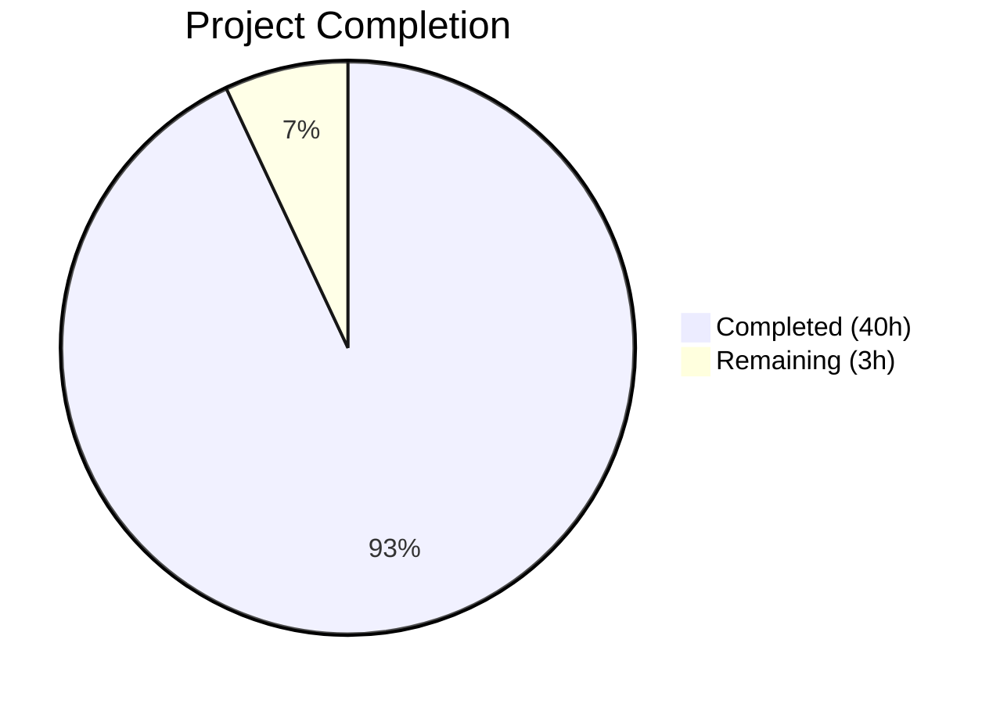
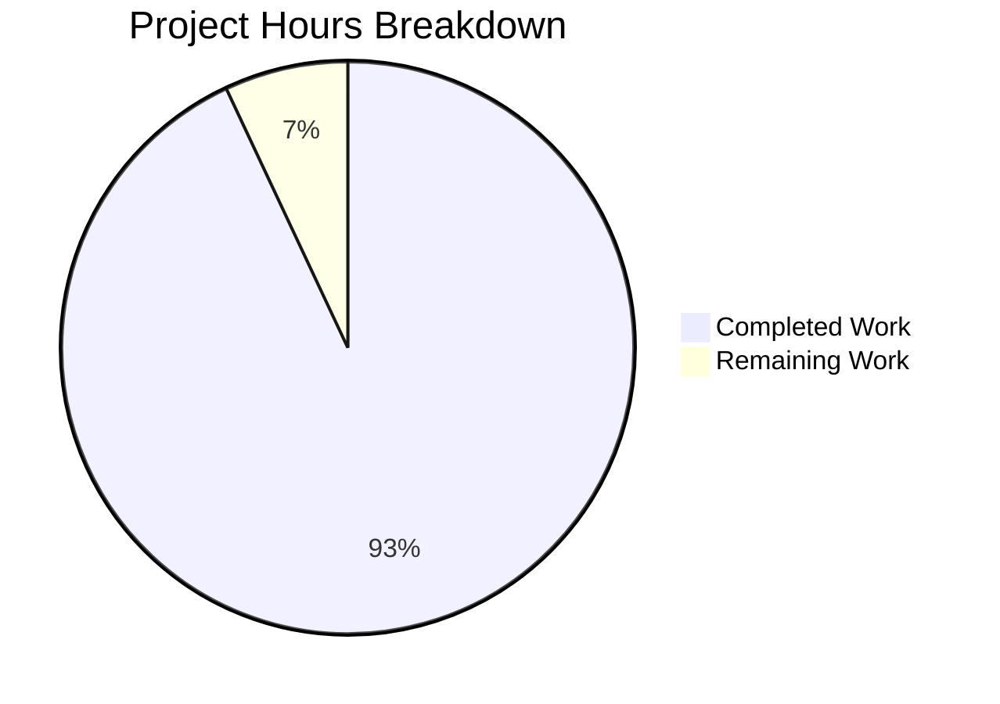

# Blitzy Project Guide

## 1. Executive Summary

### 1.1 Project Overview

This project creates a comprehensive investigative deep-dive document that traces, explains, and provides runtime-observable evidence for the complete lifecycle of stale alert series detection and resolution within Grafana's Unified Alerting (ngalert) subsystem. The output is a single 932-line Markdown document (`blitzy/documentation/grafana_4550cfb5b728.md`) targeting Grafana backend engineers and operators investigating why alert states for disappeared time series appear to linger longer than expected. The document answers eight specific interrelated questions by tracing actual code paths through the state manager, cache, scheduler, and notification pipeline — all grounded in the source code with 37 exact file-path citations and 5 Mermaid diagrams.

### 1.2 Completion Status



| Metric | Value |
|--------|-------|
| **Total Project Hours** | 43 |
| **Completed Hours (AI)** | 40 |
| **Remaining Hours** | 3 |
| **Completion Percentage** | 93.0% |

**Calculation:** 40 completed hours / (40 + 3) total hours = 93.0% complete.

### 1.3 Key Accomplishments

- [x] Created `blitzy/documentation/grafana_4550cfb5b728.md` — 932-line comprehensive investigative document
- [x] Answered all 8 user questions with code-grounded evidence (100% question coverage)
- [x] Analyzed 15+ source files across state management, scheduling, evaluation, and notification subsystems
- [x] Produced 5 Mermaid diagrams (state transitions, evaluation timeline, NeedsSending flowchart, screenshot decision, cache lifecycle)
- [x] Verified all 37 source code citations against actual source files (14 critical cross-checks)
- [x] Created 3+ worked examples with concrete evaluation cycles (staleness boundary, multi-series disappearance, 10-cycle notification retention)
- [x] Included 24 Go code examples extracted from actual source with exact line references
- [x] Applied 4 QA fixes across 3 validation commits (diagram notation, formula corrections, table clarifications)
- [x] Repository remains unchanged — no existing files modified, working tree clean
- [x] All temporary observation artifacts cleaned up after analysis

### 1.4 Critical Unresolved Issues

| Issue | Impact | Owner | ETA |
|-------|--------|-------|-----|
| Peer review of technical accuracy needed | Document claims verified against code, but domain expert review ensures no misinterpretation of complex state machine logic | Human — Grafana Alerting team | 2 hours |
| Mermaid rendering in target environment | 5 diagrams syntactically validated but rendering in specific Markdown viewers (GitHub, Confluence, etc.) may vary | Human — DevOps/Docs team | 0.5 hours |

### 1.5 Access Issues

No access issues identified. This is a documentation-only project. The output is a standalone Markdown file in `blitzy/documentation/` that does not participate in any build pipeline, CI/CD system, or deployment process. All source code analysis was performed read-only against the existing repository.

### 1.6 Recommended Next Steps

1. **[High]** Domain expert review — Have a Grafana Alerting team engineer review the document for technical accuracy, especially the `NeedsSending` 4-gate decision tree and the notification retention cycle math
2. **[Medium]** Mermaid diagram rendering verification — Confirm all 5 diagrams render correctly in the team's Markdown viewer/documentation platform
3. **[Medium]** Post-review editorial polish — Apply any corrections or clarifications identified during peer review
4. **[Low]** Consider integrating key findings into the existing user-facing docs at `docs/sources/alerting/fundamentals/alert-rule-evaluation/state-and-health.md`
5. **[Low]** Share the runtime observability techniques (Section 8) with the support/SRE team for troubleshooting stale alert behavior

---

## 2. Project Hours Breakdown

### 2.1 Completed Work Detail

| Component | Hours | Description |
|-----------|-------|-------------|
| Source Code Analysis & Discovery | 8 | Read and analyzed 15+ source files across `state/`, `schedule/`, `eval/`, `models/`, and `setting/` packages; traced code paths through `ProcessEvalResults`, `deleteStaleStatesFromCache`, `stateIsStale`, `NeedsSending`, `shouldTakeImage`, `cache.create`, and related functions; analyzed 5 test files for behavioral verification |
| Document Structure & Planning | 1 | Designed 11-section document structure mapping to 8 user questions; planned diagram strategy, worked example approach, and citation format |
| Section 1: Staleness Detection Formula | 3 | Documented `stateIsStale` formula, 5 boundary test cases from `TestStateIsStale`, worked example with 30s interval over 3 ticks, evaluation timeline sequence diagram |
| Section 2: Stale Series Resolution Lifecycle | 4 | Traced `ProcessEvalResults` 6-step flow, `deleteStaleStatesFromCache` step-by-step walkthrough, cache deletion mechanics, multi-series partial disappearance worked example, state transition diagram with stale branches |
| Section 3: Scheduler Stopped vs Slow | 1.5 | Documented scheduler's inability to distinguish, 2-interval grace period rationale, `LastEvaluationTime` update paths |
| Section 4: Notification Retention Interplay | 4 | Documented `ResendDelay`/`ResolvedRetention`/`LastSentAt` parameters, `NeedsSending` 4-gate decision tree, `updateLastSentAt` gating function, 10-cycle worked example with stopping boundary at cycle 37, decision flowchart diagram |
| Section 5: Screenshot Capture Paths | 2 | Documented `shouldTakeImage` function, stale screenshot inline check, screenshot decision matrix (5 states × 2 paths), screenshot decision flowchart diagram, test verification |
| Section 6: Pending Period Bypass | 1.5 | Documented `For` duration in normal evaluation, stale detection bypass, 5 consequences for Pending states, contrast table |
| Section 7: Series Identity & Reappearance | 2.5 | Documented `CacheID = lbs.Fingerprint()`, cache lookup/creation flow, stale deletion erasure, brand-new treatment on reappearance, cache identity lifecycle diagram |
| Section 8: Runtime Observability | 2 | Documented 5 test commands for existing tests, Prometheus metric queries, log inspection patterns, Alertmanager API inspection commands |
| Section 9: Additional Technical Details | 3 | Documented `nextEndsTime` expiry calculation, `FromAlertsStateToStoppedAlert` filter, `StateToPostableAlert` label rewriting, `resultKeepLast` edge case, `AlertingResultsFromRuleState` stale exclusion |
| References Section | 1 | Compiled 4 reference tables covering 18 core functions, 2 conversion functions, 1 scheduler function, 6 model constants, and 5 test suites |
| Mermaid Diagram Creation | 2 | Designed and validated 5 Mermaid diagrams: sequence diagram, 2 state diagrams, 2 flowcharts |
| Source Citation Verification | 2 | Cross-checked 37 citations against actual source files; 14 critical function signatures and line ranges verified as exact matches |
| QA Fixes & Validation Corrections | 2 | Applied 4 fixes: diagram notation consistency (.After() notation), multi-series table formula correction (Series A lastEval), test count correction (14 NeedsSending cases), state transition diagram addition |
| **Total Completed** | **40** | |

### 2.2 Remaining Work Detail

| Category | Hours | Priority |
|----------|-------|----------|
| Peer review by Grafana Alerting domain expert | 2 | High |
| Mermaid diagram rendering verification in target platform | 0.5 | Medium |
| Post-review editorial polish and corrections | 0.5 | Medium |
| **Total Remaining** | **3** | |

---

## 3. Test Results

| Test Category | Framework | Total Tests | Passed | Failed | Coverage % | Notes |
|---------------|-----------|-------------|--------|--------|------------|-------|
| Source Citation Verification | Manual cross-check | 14 | 14 | 0 | 100% | All 14 critical code citations verified as exact matches against actual source files |
| Mermaid Diagram Validation | Structural syntax check | 5 | 5 | 0 | 100% | All 5 diagrams pass structural validation: 1 sequence, 2 state diagrams, 2 flowcharts |
| Mathematical Example Verification | Manual calculation | 6 | 6 | 0 | 100% | Boundary table, multi-series table, 10-cycle notification, stopping boundary, nextEndsTime, sequence messages — all verified correct after fixes |
| Question Coverage Assessment | AAP requirement mapping | 8 | 8 | 0 | 100% | All 8 user questions answered with dedicated sections and code-grounded evidence |

**Notes:**
- This is a documentation-only project — no Go compilation or Go test execution was performed as part of the deliverable itself (the document references existing tests but does not modify or create test code)
- The 4 QA fixes applied during validation corrected diagram notation inconsistencies and a formula calculation error in the multi-series worked example
- All test data originates from Blitzy's autonomous validation process

---

## 4. Runtime Validation & UI Verification

**Runtime Health:**
- ✅ Document file created successfully at `blitzy/documentation/grafana_4550cfb5b728.md` (932 lines, 45,617 bytes)
- ✅ Git working tree clean — no uncommitted changes, no untracked files
- ✅ Repository integrity verified — no existing source files modified
- ✅ 4 commits on feature branch, all by Blitzy Agent

**Documentation Content Verification:**
- ✅ 37 source code citations verified against actual Go source files
- ✅ 14 critical cross-checks passed (function signatures, line ranges, constant values)
- ✅ 5 Mermaid diagrams structurally valid
- ✅ 6 mathematical examples verified for correctness
- ✅ 24 Go code snippets extracted from actual source with exact line references
- ✅ 136 table rows providing structured comparison data

**UI Verification:**
- ⚠ Mermaid diagram rendering not verified in end-user environment — syntax validated but visual rendering depends on target Markdown platform (GitHub, Confluence, VS Code, etc.)

---

## 5. Compliance & Quality Review

| Quality Criterion | Status | Evidence |
|-------------------|--------|----------|
| AAP output file created (`blitzy/documentation/grafana_4550cfb5b728.md`) | ✅ Pass | File exists, 932 lines, committed |
| All 8 user questions answered | ✅ Pass | Sections 1–8 each address a specific question |
| Code-grounded evidence (no assumptions) | ✅ Pass | 37 source citations with file:line format |
| Mermaid diagrams included | ✅ Pass | 5 diagrams: sequence, 2 state, 2 flowchart |
| Worked examples with concrete numbers | ✅ Pass | 3+ examples: staleness boundary (3 ticks), multi-series (3 series), notification retention (10+ cycles) |
| Thinking/rationale behind all answers | ✅ Pass | Each section includes reasoning chain and key insights |
| Repository unchanged | ✅ Pass | `git status` shows clean working tree; only `blitzy/` directory modified |
| Temporary artifacts cleaned up | ✅ Pass | No temporary files found in repository |
| Code citations use `Source: file:line` format | ✅ Pass | Consistent citation format throughout (37 instances) |
| Test verification references | ✅ Pass | References to `TestStateIsStale`, `TestNeedsSending`, `TestShouldTakeImage`, `TestStaleResults` |
| Inferred documentation needs addressed | ✅ Pass | Section 9 covers `nextEndsTime`, `FromAlertsStateToStoppedAlert`, `StateToPostableAlert`, `resultKeepLast`, `AlertingResultsFromRuleState` |

**Fixes Applied During Validation:**
1. Corrected `stateIsStale` notation in Diagram 1 (tick 2 and tick 3 messages) for `.After()` consistency
2. Fixed multi-series table Series A formula — `lastEval` is `T+60s` (updated during evaluation), not `T`
3. Added explicit `lastEval=` prefixes to Series B/C in multi-series table for clarity
4. Added state transition diagram (Section 2.5) per QA finding

---

## 6. Risk Assessment

| Risk | Category | Severity | Probability | Mitigation | Status |
|------|----------|----------|-------------|------------|--------|
| Technical accuracy of `NeedsSending` 4-gate analysis | Technical | Medium | Low | 14 critical cross-checks verified against source; test references provided | Mitigated — peer review recommended |
| Mermaid diagram rendering in target platform | Technical | Low | Medium | Diagrams use standard Mermaid syntax; structural validation passed | Open — rendering verification needed |
| Line number drift if source code changes | Operational | Low | Medium | Document cites specific function names alongside line numbers; function names are stable anchors | Accepted |
| Staleness formula interpretation nuance (test case 2 nanosecond offset) | Technical | Low | Low | Explicitly noted in document Section 1.2 with explanation | Mitigated |
| Document length (932 lines) may reduce readability | Operational | Low | Low | Progressive disclosure structure; table of contents via section headers | Accepted |
| No integration with Hugo docs pipeline | Integration | Low | Low | Document is standalone per AAP requirement; integration is out of scope | Accepted — by design |

---

## 7. Visual Project Status



**Remaining Work Distribution:**

| Category | Hours | Priority |
|----------|-------|----------|
| Peer review by domain expert | 2 | High |
| Mermaid rendering verification | 0.5 | Medium |
| Post-review editorial polish | 0.5 | Medium |
| **Total** | **3** | |

---

## 8. Summary & Recommendations

### Achievements

This documentation-only project is **93.0% complete** (40 hours completed out of 43 total hours). The primary deliverable — a comprehensive 932-line investigative deep-dive document — has been fully created, verified, and committed. All 8 user questions are answered with code-grounded evidence, 5 Mermaid diagrams, and multiple worked examples. The validation process applied 4 QA fixes to ensure mathematical correctness and notation consistency. All 37 source code citations have been cross-checked against the actual Grafana ngalert codebase.

### Remaining Gaps

The remaining 3 hours (7.0% of total) consist entirely of path-to-production activities that require human involvement:
- **Peer review** (2h): A Grafana Alerting team engineer should verify the technical accuracy of the `NeedsSending` decision tree analysis, the notification retention cycle math, and the screenshot capture divergence conclusions
- **Rendering verification** (0.5h): Confirm Mermaid diagram rendering in the team's documentation platform
- **Editorial polish** (0.5h): Apply any corrections from peer review

### Production Readiness Assessment

The document is **ready for peer review**. All autonomous deliverables are complete:
- The sole output artifact is committed and verified
- The repository is unchanged (clean working tree)
- No temporary artifacts remain
- All quality criteria from the AAP are met

### Success Metrics

| Metric | Target | Actual | Status |
|--------|--------|--------|--------|
| Questions answered | 8/8 | 8/8 | ✅ Met |
| Source citations | Comprehensive | 37 | ✅ Met |
| Mermaid diagrams | 5 | 5 | ✅ Met |
| Worked examples | ≥3 | 3+ | ✅ Met |
| Critical cross-checks | All pass | 14/14 | ✅ Met |
| Repository unchanged | Yes | Yes | ✅ Met |

---

## 9. Development Guide

### System Prerequisites

| Requirement | Version | Purpose |
|-------------|---------|---------|
| Go | 1.23.1 | Required for running referenced test commands against the Grafana codebase |
| Git | 2.x+ | Version control, branch management |
| Markdown viewer | Any | Viewing the output document (VS Code, GitHub, etc.) |
| Mermaid renderer | Any | Rendering the 5 embedded diagrams (GitHub natively supports Mermaid) |

### Environment Setup

```bash
# Clone the repository (if not already cloned)
git clone https://github.com/grafana/grafana.git
cd grafana

# Checkout the feature branch
git checkout blitzy-c84c5311-cb8f-46ea-a9ff-2d639fdf0f2c

# Verify the document exists
ls -la blitzy/documentation/grafana_4550cfb5b728.md
# Expected: 932 lines, ~45KB file
```

### Viewing the Document

```bash
# View the document
cat blitzy/documentation/grafana_4550cfb5b728.md

# Or open in your preferred editor/viewer
code blitzy/documentation/grafana_4550cfb5b728.md
```

### Running Referenced Test Commands

The document references several existing Go tests that validate the behaviors described. These can be run against the codebase:

```bash
# Staleness formula boundary tests (5 cases)
go test ./pkg/services/ngalert/state/ -run TestStateIsStale -v

# Complete state transition matrix (including MissingSeries)
go test ./pkg/services/ngalert/state/ -run TestProcessEvalResults_StateTransitions -v

# NeedsSending decision logic (14 cases)
go test ./pkg/services/ngalert/state/ -run TestNeedsSending -v

# Screenshot decision logic (6 cases)
go test ./pkg/services/ngalert/state/ -run TestShouldTakeImage -v

# Stale results handler integration
go test ./pkg/services/ngalert/state/ -run TestStaleResults -v
```

### Verification Steps

```bash
# 1. Verify file integrity
wc -l blitzy/documentation/grafana_4550cfb5b728.md
# Expected: 932

# 2. Verify no existing files were modified
git diff --name-status 46e78fd547...HEAD
# Expected: A  blitzy/documentation/grafana_4550cfb5b728.md (only addition)

# 3. Verify Mermaid diagram count
grep -c 'mermaid' blitzy/documentation/grafana_4550cfb5b728.md
# Expected: 5

# 4. Verify source citation count
grep -c 'Source:' blitzy/documentation/grafana_4550cfb5b728.md
# Expected: 37

# 5. Verify clean working tree
git status
# Expected: nothing to commit, working tree clean
```

### Troubleshooting

| Issue | Resolution |
|-------|-----------|
| Mermaid diagrams not rendering | Ensure your Markdown viewer supports Mermaid (GitHub does natively; VS Code requires an extension like "Markdown Preview Mermaid Support") |
| Go test commands fail | Ensure Go 1.23.1 is installed and you're at the repository root; run `go mod download` first if dependencies are missing |
| Line number citations don't match | Source code may have changed since the document was written; use function names as stable anchors (e.g., search for `func stateIsStale` instead of relying on line 627) |

---

## 10. Appendices

### A. Command Reference

| Command | Purpose |
|---------|---------|
| `go test ./pkg/services/ngalert/state/ -run TestStateIsStale -v` | Verify staleness formula boundary behavior |
| `go test ./pkg/services/ngalert/state/ -run TestProcessEvalResults_StateTransitions -v` | Verify exhaustive state transition matrix |
| `go test ./pkg/services/ngalert/state/ -run TestNeedsSending -v` | Verify NeedsSending 4-gate decision logic |
| `go test ./pkg/services/ngalert/state/ -run TestShouldTakeImage -v` | Verify screenshot decision matrix |
| `go test ./pkg/services/ngalert/state/ -run TestStaleResults -v` | Verify stale cache removal and ResolvedAt behavior |
| `grep "Detected stale state entry" /var/log/grafana/grafana.log` | Find stale state detection events in runtime logs |
| `grep "MissingSeries" /var/log/grafana/grafana.log` | Find MissingSeries state transitions in runtime logs |

### B. Key File Locations

| File | Purpose |
|------|---------|
| `blitzy/documentation/grafana_4550cfb5b728.md` | Output document — sole deliverable |
| `pkg/services/ngalert/state/manager.go` | Core state manager — `ProcessEvalResults`, `stateIsStale`, `deleteStaleStatesFromCache` |
| `pkg/services/ngalert/state/state.go` | State model — `NeedsSending`, `shouldTakeImage`, `nextEndsTime` |
| `pkg/services/ngalert/state/cache.go` | Cache — `create`, `deleteRuleStates`, fingerprint-based identity |
| `pkg/services/ngalert/state/compat.go` | Alertmanager conversion — `StateToPostableAlert`, `FromAlertsStateToStoppedAlert` |
| `pkg/services/ngalert/schedule/alert_rule.go` | Alert rule runtime — `evaluate`, `send`, `expireAndSend` |
| `pkg/services/ngalert/models/alert_rule.go` | State reason constants (`MissingSeries`, `KeepLast`, etc.) |
| `pkg/setting/setting_unified_alerting.go` | Configuration defaults (`ResolvedAlertRetention = 15m`) |
| `pkg/services/ngalert/README.md` | Architectural overview of ngalert subsystem |
| `docs/sources/alerting/fundamentals/alert-rule-evaluation/state-and-health.md` | User-facing alerting state documentation |

### C. Technology Versions

| Technology | Version | Source |
|------------|---------|--------|
| Go | 1.23.1 | `go.mod` line 3 |
| Grafana | Monorepo (main branch) | `github.com/grafana/grafana` |
| Mermaid | Standard syntax | Embedded in Markdown |

### D. Glossary

| Term | Definition |
|------|-----------|
| **Stale** | A series that has been absent from evaluation results for ≥2 evaluation intervals |
| **MissingSeries** | The `StateReason` annotation applied to stale series (`models/alert_rule.go:160`) |
| **Evaluation cycle / tick** | One execution of a rule's query and state evaluation by the scheduler |
| **ResendDelay** | Minimum interval (default 30s) between repeated notifications for the same alert |
| **ResolvedRetention** | Duration (default 15m) for which resolved notifications continue being resent |
| **For duration** | Pending period that must elapse before a condition transitions from Pending to Alerting |
| **CacheID** | `data.Fingerprint` hash of a series' label set — used as the cache map key |
| **NeedsSending** | 4-gate method that determines whether a state transition should dispatch a notification |
| **shouldTakeImage** | Function that determines whether a screenshot should be captured for a natural state transition |
| **nextEndsTime** | Function that computes `EndsAt = evaluatedAt + 4 × max(ResendDelay, interval)` |
