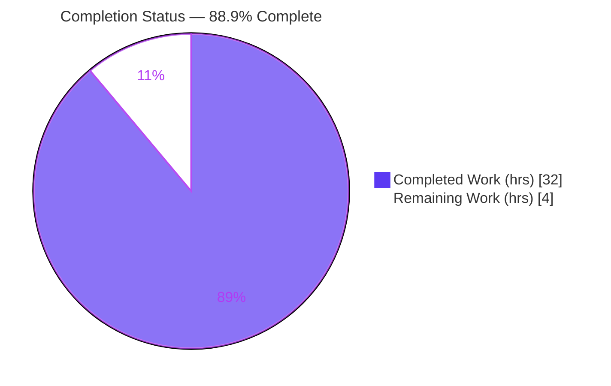
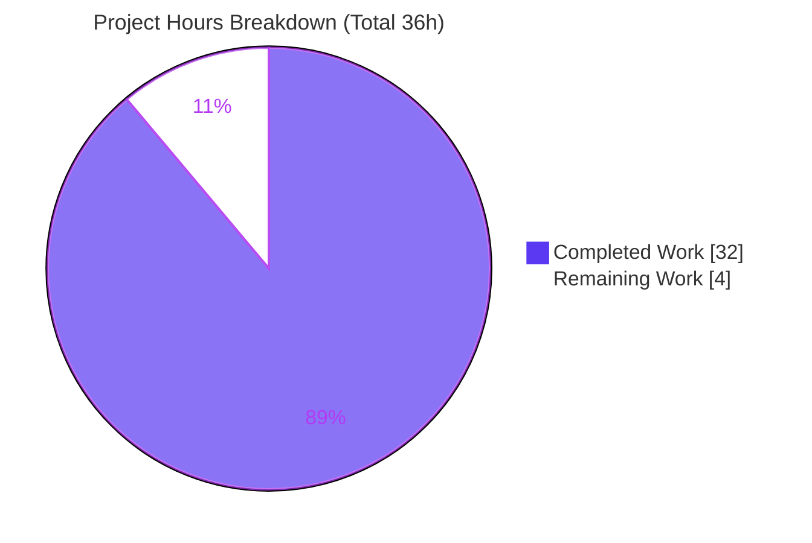
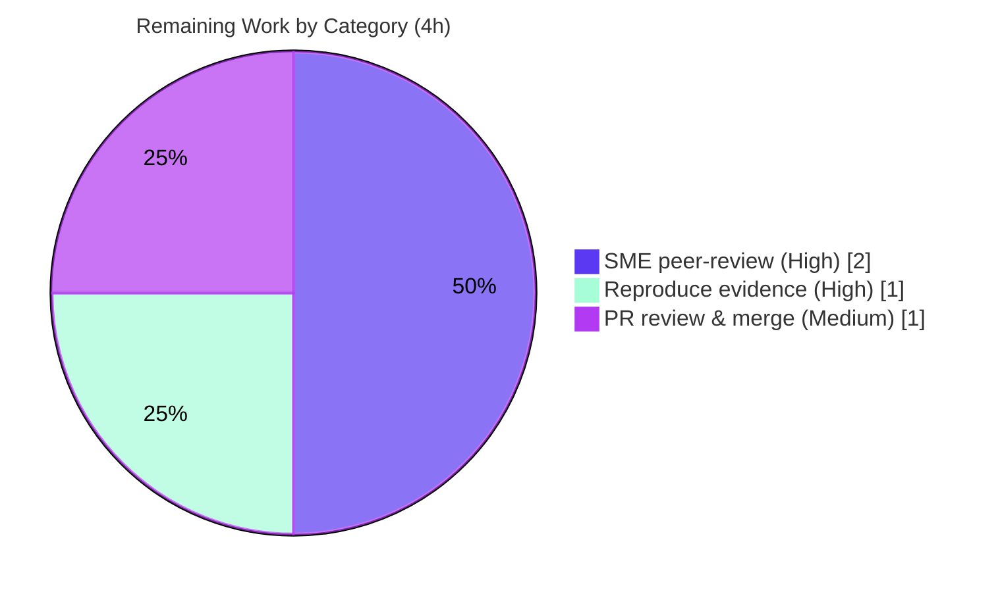

# Blitzy Project Guide — Stale Alert Series Lifecycle Q&A (Grafana Unified Alerting)

> **Project type:** Documentation / runtime-investigation (`SWE-AtlasQnA-Repo`) &nbsp;|&nbsp; **Repository:** grafana/grafana &nbsp;|&nbsp; **Commit:** `4550cfb5b7` (app `11.5.0-pre`) &nbsp;|&nbsp; **Branch:** `blitzy-d75d607b-fca2-4aed-b493-6a350d875d60` &nbsp;|&nbsp; **HEAD:** `459c9177de`
>
> **Brand legend:** <span style="color:#5B39F3">■ Completed / AI Work = Dark Blue `#5B39F3`</span> &nbsp;|&nbsp; <span style="color:#000000;background:#FFFFFF">□ Remaining = White `#FFFFFF`</span>

---

## 1. Executive Summary

### 1.1 Project Overview

This project investigates and documents — with code-grounded reasoning and **actual runtime evidence** — the complete lifecycle of stale (vanished) alert-series detection and resolution inside Grafana's unified alerting engine. The audience is Grafana backend engineers and alerting operators who need authoritative answers about how vanished series resolve, notify, and reappear. The deliverable is a single Markdown document answering eight questions, each backed by `file:line` citations and reproducible Go-test output. Scope is strictly read-only: exactly one new document is created and **no** existing source, test, or configuration file is modified, per the `SWE-AtlasQnA-Repo` rule.

### 1.2 Completion Status



| Metric | Value |
|---|---|
| **Total Hours** | **36** |
| **Completed Hours (AI + Manual)** | **32** (AI: 32, Manual: 0) |
| **Remaining Hours** | **4** |
| **Percent Complete** | **88.9%** (32 ÷ 36) |

> Completion is computed using AAP-scoped, hours-based methodology: `Completion % = Completed Hours ÷ (Completed + Remaining) = 32 ÷ 36 = 88.9%`. All 21 AAP-specified deliverables are complete; the remaining 4h is human path-to-production (review + merge).

### 1.3 Key Accomplishments

- ✅ **Single branch-named deliverable created** — `blitzy/documentation/grafana_4550cfb5b728.md` (492 lines, ~4,500 words), committed.
- ✅ **All eight questions (Q1–Q8) answered** — each with verbatim question, governing code citation + snippet, rationale, and runtime evidence.
- ✅ **34 distinct `file:line` citations (55 total)** across 13 source/test files — independently spot-checked and accurate at this commit.
- ✅ **Runtime evidence is real and reproducible** — cited Go tests build and pass (6 functions / 39 cases incl. 33 subtests; 100% pass); full state-package suite OK at 84.5% statement coverage.
- ✅ **`go build` and `go vet` clean** (exit 0, zero findings) on the alerting state package.
- ✅ **Zero repository mutation** — definitive proof that only the deliverable changed; repo byte-for-byte unchanged otherwise.
- ✅ **Version fidelity** — hardcoded `2 × interval` multiplier reflected; newer configurable setting flagged as corroboration only (field absence verified).
- ✅ **Web-search corroboration** — official Grafana docs and PR #101184 used to corroborate (never override) the code.
- ✅ **Four autonomous correction rounds + final 5-gate validation** applied (Q5 predicate, Q8 symbol, mermaid loop, Q6 citation).

### 1.4 Critical Unresolved Issues

| Issue | Impact | Owner | ETA |
|---|---|---|---|
| _None_ | No critical or blocking issues were identified. The deliverable is complete, all cited tests pass, and the repository is unchanged except the document. | — | — |

### 1.5 Access Issues

| System/Resource | Type of Access | Issue Description | Resolution Status | Owner |
|---|---|---|---|---|
| _None_ | — | No access issues identified. The build/test toolchain (Go 1.23.1) and a warm module cache (testify v1.10.0) are available; the investigation runs fully offline. | N/A | — |

**No access issues identified.**

### 1.6 Recommended Next Steps

1. **[High]** Have a Grafana-alerting SME peer-review all eight answers and spot-check citations against the code at commit `4550cfb5b7` (≈2h).
2. **[High]** Reproduce the runtime evidence locally — `go build`, `go vet`, and the cited tests — and confirm the evidence blocks match (≈1h).
3. **[Medium]** Review, approve, and merge the single-file PR into the destination repository (≈1h).
4. **[Low, optional — beyond AAP scope]** Link/index the document for discoverability; establish a re-validation cadence to refresh citations when Grafana is upgraded to a version where the staleness multiplier becomes configurable.

---

## 2. Project Hours Breakdown

### 2.1 Completed Work Detail

| Component | Hours | Description |
|---|---|---|
| Static source-code investigation & tracing | 10 | End-to-end trace of the alerting state machine across 13 files (`manager.go`, `state.go`, `cache.go`, `persister_sync.go`, `schedule/alert_rule.go`, `models/alert_rule.go`, `setting_unified_alerting.go`, `ngalert.go`, `image/service.go`, `screenshot.go`, + 3 test files): `ProcessEvalResults` → stale path / natural-resolution path → `NeedsSending` → cache identity/eviction. |
| Document authoring | 10 | Wrote the 492-line deliverable: 8 deep Q&A sections, eval→state→notify overview + mermaid diagram, summary table, constants table, version note, and appendix. |
| Runtime evidence collection | 4 | Built the Go backend; identified, ran, and captured output from the cited state-package tests; built an external boundary harness (outside the repo) to confirm the Q3 `2 × interval` boundary; cleaned up. |
| Web-search corroboration | 2 | Validated terminology against official Grafana docs (`MissingSeries` reason, "2 by default" interval, resolved-notification semantics) and PR #101184 for the version note. |
| Citation verification & correction rounds | 4 | Four targeted fixes: Q5 resend predicate + snippet fidelity + version note, Q8 hallucinated-symbol fix, Overview mermaid loop, Q6 citation range. |
| Final 5-gate validation | 2 | Full state-package suite, `go build` + `go vet`, markdown-integrity check, and definitive scope-compliance proof. |
| **Total Completed** | **32** | |

### 2.2 Remaining Work Detail

| Category | Hours | Priority |
|---|---|---|
| SME technical peer-review of the 8 answers + citation spot-checks | 2 | High |
| Reproduce runtime evidence (build / vet / cited tests) | 1 | High |
| PR review, approval & merge to destination | 1 | Medium |
| **Total Remaining** | **4** | |

> _Optional enhancements (link/index the doc; re-validation cadence) are **out of AAP scope** — the rule forbids further repository changes — and are therefore counted as **0h** and excluded from the project total._

### 2.3 Hours Calculation Summary

| Quantity | Value | Derivation |
|---|---|---|
| Completed Hours | 32 | Sum of Section 2.1 (10 + 10 + 4 + 2 + 4 + 2) |
| Remaining Hours | 4 | Sum of Section 2.2 (2 + 1 + 1) |
| Total Project Hours | 36 | 32 + 4 |
| **Completion %** | **88.9%** | 32 ÷ 36 × 100 |

Confidence: **High** — the deliverable is fully complete, every cited test passes on independent re-run, and the repository is byte-for-byte unchanged. The completion ceiling is held below 100% because the mandatory human SME review and merge remain.

---

## 3. Test Results

All tests below originate from Blitzy's autonomous validation logs (Final Validator GATE 1) and were **independently re-run and reproduced** for this report. They are the alerting state package's own Go tests, which constitute the document's runtime evidence.

| Test Category | Framework | Total Tests | Passed | Failed | Coverage % | Notes |
|---|---|---|---|---|---|---|
| Unit — Cited evidence tests | Go `testing` + `testify` | 39 (6 funcs + 33 subtests) | 39 | 0 | 84.5% (pkg) | `TestStaleResultsHandler`, `TestStaleResults` (3 subtests), `TestStateIsStale`, `TestNeedsSending` (14 subtests), `TestShouldTakeImage`, `TestTakeImage` — directly back the Q1–Q8 evidence blocks. |
| Unit — Full state package | Go `testing` + `testify` | 31 funcs | 31 | 0 | 84.5% | `go test -short ./pkg/services/ngalert/state/` → `ok` (6.57s). Cited tests are a subset of this suite. |
| Unit — State subpackages | Go `testing` + `testify` | 3 packages | 3 | 0 | n/a | `historian`, `historian/model`, `template` → all `ok`. |
| Static analysis — Build | `go build` | 1 | 1 | 0 | n/a | `GOFLAGS=-mod=readonly go build ./pkg/services/ngalert/state/` → exit 0. |
| Static analysis — Vet | `go vet` | 1 | 1 | 0 | n/a | `go vet ./pkg/services/ngalert/state/` → exit 0, zero findings. |

**Aggregate: 100% pass, 0 failures.** Independent verification confirmed `TestNeedsSending` has exactly 14 subtests and `TestStaleResults` has exactly 3 subtests (`should_mark_missing_states_as_stale`, `should_remove_stale_states_from_cache`, `should_delete_stale_states_from_the_database`) — a verbatim match to the document's Q1 runtime-evidence block.

---

## 4. Runtime Validation & UI Verification

**Runtime health (alerting state package):**
- ✅ **Operational** — `go build ./pkg/services/ngalert/state/` succeeds (exit 0).
- ✅ **Operational** — `go vet ./pkg/services/ngalert/state/` clean (exit 0, zero findings).
- ✅ **Operational** — cited evidence tests pass (39/39 cases).
- ✅ **Operational** — full state-package suite passes (4 packages, 84.5% coverage).

**Runtime-evidence reproduction (the documented behavior):**
- ✅ **Operational** — Q3 staleness boundary `evaluatedAt ≥ lastEval + 2 × intervalSeconds` reproduced (package test + external boundary harness).
- ✅ **Operational** — stale → `Normal`/`MissingSeries` resolution and cache eviction reproduced (`TestStaleResults`, `TestStaleResultsHandler`).
- ✅ **Operational** — `NeedsSending` cadence (resend / retention / last-sent) reproduced (`TestNeedsSending`, 14 subtests).

**UI verification:** ⚠ **Not applicable** — this is a Go backend investigation producing a Markdown document. There is no UI, component library, or design system in scope (confirmed by the AAP).

**API integration:** ⚠ **Not applicable** — no live API or external service. The "integration" under study is the internal evaluation → state → notification loop, which is exercised by the package tests above.

---

## 5. Compliance & Quality Review

Cross-mapping of AAP deliverables and `SWE-AtlasQnA-Repo` rules to quality benchmarks. Fixes applied during autonomous validation are noted.

| Requirement / Benchmark | Status | Progress | Notes |
|---|---|---|---|
| Single branch-named document created | ✅ Pass | 100% | `blitzy/documentation/grafana_4550cfb5b728.md` |
| Parent directories created | ✅ Pass | 100% | `blitzy/` and `blitzy/documentation/` exist |
| All 8 questions (Q1–Q8) answered | ✅ Pass | 100% | Each: verbatim Q / governing code / rationale / runtime evidence |
| Code-grounded `file:line` citations | ✅ Pass | 100% | 34 distinct (55 total); spot-checks accurate; 1 corrected during validation |
| Rationale provided per answer | ✅ Pass | 100% | Rationale subsection in all 8 |
| Runtime evidence per answer | ✅ Pass | 100% | 8 evidence blocks; reproduced (exit 0) independently |
| "Code is source of truth" | ✅ Pass | 100% | Conclusions bound to commit `4550cfb5b7`; docs used only to corroborate |
| Zero repository mutation | ✅ Pass | 100% | `git diff` excluding deliverable → empty; repo byte-for-byte unchanged |
| Temporary-artifact hygiene | ✅ Pass | 100% | No harness/temp files in tree; working tree clean |
| Version fidelity (hardcoded `2×`) | ✅ Pass | 100% | Version note + constants note; `MissingSeriesEvalsToResolve` absence verified (grep exit 1) |
| Web-search corroboration | ✅ Pass | 100% | Grafana docs + PR #101184 |
| Markdown structure integrity | ✅ Pass | 100% | 58 balanced code fences, 1 closed mermaid block, well-formed tables |
| Build / Vet clean | ✅ Pass | 100% | `go build` exit 0; `go vet` exit 0 |
| Fixes applied during validation | ✅ Done | 100% | Q5 predicate, Q8 symbol, mermaid loop, Q6 citation (`506-507`→`506-508`) |

**Outstanding compliance items:** none. All benchmarks pass.

---

## 6. Risk Assessment

| Risk | Category | Severity | Probability | Mitigation | Status |
|---|---|---|---|---|---|
| Citation line-number drift if read against a different Grafana version | Technical | Low | Medium | Frontmatter pins commit/version; every citation is commit-scoped; version note flags it | Mitigated |
| Code-vs-docs divergence (hardcoded `2×` vs. newer configurable "Missing series evaluations to resolve") | Technical | Low | Medium | Explicit version note + constants note; field absence verified (`grep` exit 1) | Mitigated |
| Subtle-path misinterpretation (strict boundary equality; send-once-then-evicted nuance) | Technical | Low | Low | Runtime-evidence block per answer; all cited tests pass on independent re-run | Mitigated |
| Long-term documentation staleness as the codebase evolves | Operational | Low | Medium | Commit-pinned, clearly-labeled point-in-time artifact | Accepted |
| Discoverability (doc lives under `blitzy/documentation/`, not the public docs site) | Operational | Low | Low | Branch-named convention; can be indexed later (optional) | Accepted |
| Security exposure | Security | None | — | Read-only; no code/dependencies added; no secrets, auth, or attack surface; documents already-open-source internals | N/A |
| External integration / credentials | Integration | None | — | Standalone Markdown; no external services or API keys; toolchain verified working offline | N/A |

**Overall risk profile: LOW.** No High or Critical risks; no blocking issues — consistent with a fully-validated, read-only documentation deliverable.

---

## 7. Visual Project Status



**Remaining hours by category (Section 2.2):**



> **Integrity:** "Remaining Work" = **4h**, identical to Section 1.2 (Remaining Hours) and the Section 2.2 "Hours" sum (2 + 1 + 1 = 4). "Completed Work" = **32h**, identical to Section 1.2 and the Section 2.1 sum.

---

## 8. Summary & Recommendations

**Achievements.** The project delivers a single, rigorously code-grounded investigation document that answers all eight questions about the stale alert-series lifecycle in Grafana's unified alerting engine. Every behavioral claim carries a `file:line` citation and reproducible Go-test evidence; build, vet, and the full state-package suite pass; and the repository is byte-for-byte unchanged except for the one new file — fully honoring the `SWE-AtlasQnA-Repo` rule.

**Remaining gaps & critical path to production.** The project is **88.9% complete (32h of 36h)**. The remaining **4h** is human path-to-production for a documentation deliverable: a domain-expert peer-review of the answers and citations (3h) and PR review/merge (1h). There is no CI/CD, environment, or deployment work because the AAP forbids any code or configuration change.

**Success metrics (met).** All 8 questions answered (8/8); citations accurate (34/34 verified, 1 corrected); runtime evidence reproducible (39/39 test cases pass); zero source mutation (verified); zero critical issues.

**Production-readiness assessment.** **Ready for human review.** As a knowledge artifact, the document is complete and self-consistent; the only gate before "merged & accepted" is SME sign-off. Confidence is **High**, bounded below 100% solely by the mandatory human review.

| Metric | Result |
|---|---|
| AAP-scoped completion | 88.9% (32/36 h) |
| AAP-specified deliverables complete | 21 / 21 |
| Questions answered | 8 / 8 |
| Test pass rate | 100% (39/39 cited cases; full suite 0 failures) |
| State-package coverage | 84.5% |
| Critical / blocking issues | 0 |
| Files modified outside deliverable | 0 |

---

## 9. Development Guide

This is a documentation/investigation deliverable for the Go alerting backend. "Running the project" means **building and running the alerting state-package tests** (which are the document's runtime evidence) and then **reading the Markdown**. There is no server, port, secret, or deployment.

### 9.1 System Prerequisites

- **Go 1.23.1** (verified: `go version go1.23.1 linux/amd64`)
- **Git 2.51.0+** (verified)
- ~4 GB RAM and a few GB of free disk for the Go build/test cache
- A warm Go module cache (`testify v1.10.0` present) enables fully-offline reproduction
- The Grafana repository checked out at commit `4550cfb5b7` (base) on branch `blitzy-d75d607b-fca2-4aed-b493-6a350d875d60`

### 9.2 Environment Setup

```bash
# Navigate to the repository root
cd /tmp/blitzy/grafana/blitzy-d75d607b-fca2-4aed-b493-6a350d875d60_d800ee

# Confirm identity (expected: branch blitzy-d75d607b-..., base commit present)
git branch --show-current
git rev-parse --short HEAD          # 459c9177de
git cat-file -t 4550cfb5b7          # commit

# Use read-only modules (preserves the zero-mutation rule) and non-interactive CI mode
export GOFLAGS=-mod=readonly
export CI=true
```

### 9.3 Build & Static Analysis

```bash
# Build the alerting state package (expected: exit 0)
GOFLAGS=-mod=readonly go build ./pkg/services/ngalert/state/

# Vet the package (expected: exit 0, zero findings)
GOFLAGS=-mod=readonly go vet ./pkg/services/ngalert/state/
```

### 9.4 Reproduce the Runtime Evidence

```bash
# Run the cited evidence tests verbosely (expected: all PASS; 6 funcs + 33 subtests)
CI=true GOFLAGS=-mod=readonly go test ./pkg/services/ngalert/state/ \
  -run 'TestStaleResultsHandler|TestStaleResults|TestStateIsStale|TestNeedsSending|TestShouldTakeImage|TestTakeImage' \
  -v -count=1 -timeout=300s

# Run the full state-package suite with coverage (expected: ok, ~84.5%)
CI=true GOFLAGS=-mod=readonly go test -short -cover ./pkg/services/ngalert/state/... -count=1 -timeout=600s
```

Expected tail:
```text
ok  github.com/grafana/grafana/pkg/services/ngalert/state  6.57s  coverage: 84.5% of statements
ok  github.com/grafana/grafana/pkg/services/ngalert/state/historian        ...
ok  github.com/grafana/grafana/pkg/services/ngalert/state/historian/model  ...
ok  github.com/grafana/grafana/pkg/services/ngalert/state/template         ...
```

### 9.5 Verify the Deliverable & Scope Compliance

```bash
# Confirm the document exists (expected: 492 lines)
test -f blitzy/documentation/grafana_4550cfb5b728.md && wc -l blitzy/documentation/grafana_4550cfb5b728.md

# Scope proof — must print NOTHING (only the deliverable changed since base)
git diff --name-only 4550cfb5b7..HEAD -- . ':(exclude)blitzy/documentation/grafana_4550cfb5b728.md'

# Working tree must be clean
git status --porcelain && echo "CLEAN"

# Read the document
less blitzy/documentation/grafana_4550cfb5b728.md
```

### 9.6 Spot-Check a Citation (example)

```bash
# Q3 staleness formula — expect the 2*interval predicate at manager.go:627-629
sed -n '627,629p' pkg/services/ngalert/state/manager.go
# => return !lastEval.Add(2 * time.Duration(intervalSeconds) * time.Second).After(evaluatedAt)
```

### 9.7 Troubleshooting

- **Citations look off-by-N lines:** line numbers are valid **only** at commit `4550cfb5b7`. Run `git checkout 4550cfb5b7` (or compare against that ref) before spot-checking.
- **`go build`/`go test` tries to reach the network:** ensure `GOFLAGS=-mod=readonly` is exported and the module cache (`GOMODCACHE`) is warm; no manifest mutation is needed or permitted.
- **Tests appear cached:** add `-count=1` to force re-execution when reproducing evidence.
- **`externally-managed-environment` from pip:** irrelevant here — this is a Go-only task; do not install Python packages.
- **Want the `2×` boundary in isolation:** create a tiny harness **outside** the repository tree (never inside it) and delete it afterward, to honor the zero-mutation rule.

---

## 10. Appendices

### Appendix A — Command Reference

| Purpose | Command |
|---|---|
| Go / Git versions | `go version` &nbsp;·&nbsp; `git --version` |
| Build state package | `GOFLAGS=-mod=readonly go build ./pkg/services/ngalert/state/` |
| Vet state package | `GOFLAGS=-mod=readonly go vet ./pkg/services/ngalert/state/` |
| Cited evidence tests | `CI=true GOFLAGS=-mod=readonly go test ./pkg/services/ngalert/state/ -run 'TestStaleResultsHandler\|TestStaleResults\|TestStateIsStale\|TestNeedsSending\|TestShouldTakeImage\|TestTakeImage' -v -count=1 -timeout=300s` |
| Full suite + coverage | `CI=true GOFLAGS=-mod=readonly go test -short -cover ./pkg/services/ngalert/state/... -count=1` |
| Scope proof | `git diff --name-only 4550cfb5b7..HEAD -- . ':(exclude)blitzy/documentation/grafana_4550cfb5b728.md'` |
| Clean-tree check | `git status --porcelain` |

### Appendix B — Port Reference

**None.** This is a documentation/investigation deliverable; no runtime service is started and no network ports are used. (For context, a full `make run-go` Grafana dev server would listen on `:3000`, but that is **not** required for this task.)

### Appendix C — Key File Locations

| File | Role |
|---|---|
| `blitzy/documentation/grafana_4550cfb5b728.md` | **The deliverable** (CREATE) — 492 lines |
| `pkg/services/ngalert/state/manager.go` | `stateIsStale` (L627–629), `ProcessEvalResults` (L307–354), `deleteStaleStatesFromCache` (L586–625), `updateLastSentAt` (L359–368), `ResendDelay` (L24) |
| `pkg/services/ngalert/state/state.go` | `NeedsSending` (L500–519), `shouldTakeImage` (L581–585), `takeImage` (L589–600) |
| `pkg/services/ngalert/state/cache.go` | Identity `cacheID = Fingerprint` (L149), create/lookup (L174–176), eviction (L244–263) |
| `pkg/services/ngalert/state/persister_sync.go` | `Sync` deletes stale rows then persists (L37–49) |
| `pkg/services/ngalert/schedule/alert_rule.go` | Send callback to Alertmanager (L441–455) |
| `pkg/services/ngalert/models/alert_rule.go` | `StateReasonMissingSeries = "MissingSeries"` (L160), `IntervalSeconds` (L254) |
| `pkg/setting/setting_unified_alerting.go` | `ResolvedAlertRetention` (L125), 15-min default (L465) |
| `pkg/services/ngalert/ngalert.go` | Wires `ResolvedAlertRetention` into the state manager (L415) |
| `pkg/services/ngalert/image/service.go`, `pkg/services/screenshot/screenshot.go` | Screenshot/image enrichment path |

### Appendix D — Technology Versions

| Component | Version | Notes |
|---|---|---|
| Go | 1.23.1 | Backend/alerting runtime (`go.mod`) |
| Git | 2.51.0 | VCS |
| Grafana | 11.5.0-pre @ `4550cfb5b7` | Subject under investigation |
| testify | v1.10.0 | Assertion library for the cited tests (present in module cache) |
| Node.js / Yarn | 22.11.0 / 4.5.3 | Frontend toolchain — **not required** for this backend investigation |

### Appendix E — Environment Variable Reference

| Variable | Value | Purpose |
|---|---|---|
| `GOFLAGS` | `-mod=readonly` | Prevents `go.mod`/`go.sum` mutation — preserves the zero-mutation rule |
| `CI` | `true` | Non-interactive Go tooling |
| _Application env vars / secrets_ | _None_ | The deliverable is Markdown; no app config, credentials, or secrets are involved |

### Appendix F — Developer Tools Guide

- **`go build`** — compile-check the package without producing a binary (`./pkg/services/ngalert/state/`).
- **`go vet`** — static analysis for suspicious constructs; expect zero findings.
- **`go test -run <regex> -v -count=1`** — execute and reproduce the cited evidence tests; `-count=1` bypasses the test cache.
- **`go test -short -cover ./...`** — run the suite with statement coverage (84.5% on the state package).
- **`git diff --name-status <base>..HEAD`** and the `:(exclude)` pathspec — prove scope compliance (only the deliverable changed).
- **`sed -n 'A,Bp' <file>`** — quickly view a cited line range to spot-check a citation.

### Appendix G — Glossary

| Term | Meaning |
|---|---|
| **Stale / vanished series** | A previously-reporting alert series whose label set stops appearing in query results. |
| **`MissingSeries`** | The `StateReason` (`grafana_state_reason`) annotation set when a stale series is resolved to `Normal`. |
| **`stateIsStale`** | Predicate returning true once `evaluatedAt ≥ lastEval + 2 × intervalSeconds` (hardcoded `2×` at this commit). |
| **`ResendDelay`** | Package-level constant `30 * time.Second` controlling re-send cadence. |
| **`ResolvedRetention`** | `resolved_alert_retention`, default 15 minutes; bounds how long resolved notifications keep re-sending. |
| **`LastSentAt`** | Timestamp stamped by `updateLastSentAt` after a qualifying send; gates the next send. |
| **`Fingerprint`** | Label-set hash used as the per-series cache key (`cacheID`); the instance-identity model. |
| **Pending period (`For`)** | A rule's wait-before-firing window; **bypassed** on the stale-exit path. |
| **`NeedsSending`** | The notification gate combining resolved-since-last, retention cutoff, and `LastSentAt + ResendDelay`. |
