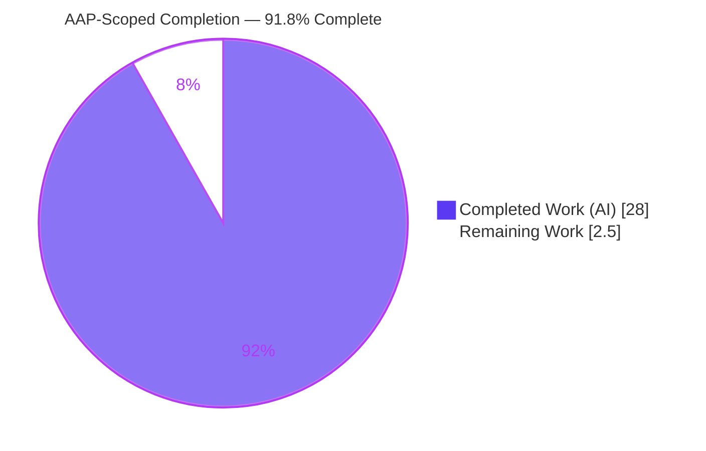
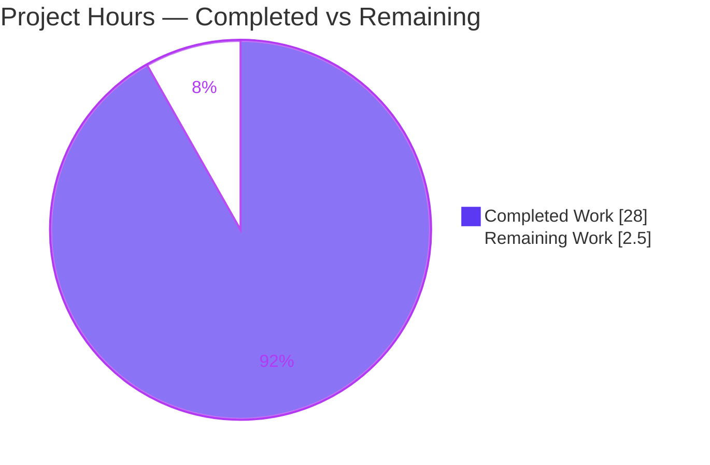
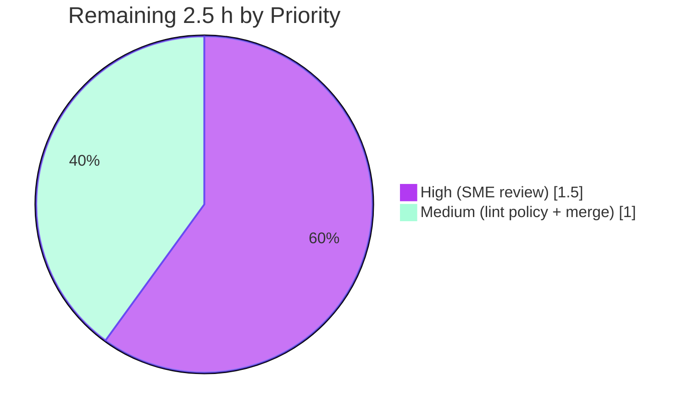

# Blitzy Project Guide — Grafana "Grouping to Matrix" Missing-Cell Investigation

> **Brand color legend** — <span style="color:#5B39F3">**Dark Blue `#5B39F3` = Completed / AI Work**</span> · <span style="color:#FFFFFF; background:#333; padding:0 4px">White `#FFFFFF` = Remaining / Not Completed</span> · Headings/Accents Violet-Black `#B23AF2` · Highlight Mint `#A8FDD9`.

---

## 1. Executive Summary

### 1.1 Project Overview

This project answers, from **observed runtime behavior** (not code reading alone), how Grafana's *"Grouping to matrix"* data transformation fills row/column intersections that never appear in a sparse input, and traces how that emitted value propagates through downstream panel computations (footer/reducer totals, threshold selection, color scales). It targets Grafana engineers and dashboard authors who observe that a "missing = zero" mental model diverges from real behavior. The scope is a single, read-only investigative Q&A: build and run the actual code paths, capture unedited output, and deliver one branch-named markdown answer (`grafana_4550cfb5b728.md`) grounded in exact `file:line` references — modifying zero existing source files.

### 1.2 Completion Status



<div align="center"><strong>◕ 91.8% Complete</strong> (28.0 h of 30.5 h)</div>

| Metric | Value |
| --- | --- |
| **Total Hours** | **30.5 h** |
| **Completed Hours (AI + Manual)** | **28.0 h** (AI: 28.0 h · Manual: 0.0 h) |
| **Remaining Hours** | **2.5 h** |
| **Percent Complete** | **91.8%** |

> Completion is computed with the PA1 AAP-scoped methodology: `Completed ÷ (Completed + Remaining) = 28.0 ÷ 30.5 = 91.8%`. Every AAP-specified deliverable is complete and validated; the 2.5 h remaining is inherently-human path-to-production (SME sign-off, doc-lint policy decision, merge).

### 1.3 Key Accomplishments

- ✅ **Single deliverable created and committed in-scope** — `blitzy/documentation/grafana_4550cfb5b728.md` (657 lines), the only file changed on the branch (`git diff` base..HEAD = one `A` entry).
- ✅ **Root behavior established from runtime**: a missing `(column,row)` cell is filled with an **empty string `''`** (default `SpecialValue.Empty`), **not `0`** — via `matrixValues[col][row] ?? getSpecialValue(emptyValue)` (`groupingToMatrix.ts:117` → `:188`).
- ✅ **Latent root cause identified**: the `''` lands in a field whose declared `type` is still numeric (`groupingToMatrix.ts:133`).
- ✅ **Downstream propagation proven for all consumers**: SUM string-concatenates to `"30"`, MEAN coerces to `15`, COUNT counts the empty cell (`2`), THRESHOLD/COLOR coerces `''`→`0` (base step).
- ✅ **Every condition exercised**: all 4 fill modes (Empty/Null/False/True) × both null modes (Ignore/AsZero) = 8 combinations captured verbatim.
- ✅ **Stability confirmed**: output byte-identical across 3 runs (`md5 e19cf70ae4c711b87b8f1ffffd7d18e2`).
- ✅ **All findings `file:line`-grounded** across 10 referenced source files; independently re-verified byte-faithful.
- ✅ **External corroboration** (validation-only): official docs, GitHub issue #97632, community forum #74645.
- ✅ **Read-only scope honored**: ephemeral observation harness created, run, and deleted; working tree pristine (`git status --porcelain` empty).
- ✅ **All 5 production-readiness gates passed** and independently re-verified in this assessment (deps immutable, typecheck clean, tests 4/4, runtime stable).

### 1.4 Critical Unresolved Issues

| Issue | Impact | Owner | ETA |
| --- | --- | --- | --- |
| _None_ — no compilation, test, runtime, or accuracy defects exist in the in-scope deliverable | No release blocker | — | — |
| Documentation lint (`prettier --check`) reports the file (deliberate verbatim-code fidelity choice, **not a defect**) | Cosmetic / CI doc-lint only; requires a human policy decision | Reviewing Engineer | 0.5 h |

> There are **no functional blockers**. The single flagged item is a deliberate fidelity trade-off (preserving verbatim source indentation inside code fences), documented in §5 and §6 (risk I2).

### 1.5 Access Issues

| System/Resource | Type of Access | Issue Description | Resolution Status | Owner |
| --- | --- | --- | --- | --- |
| Grafana monorepo (branch `blitzy-6e7ed4bf-…`) | Git read/write | None — full access; branch built, tested, committed | ✅ Resolved | — |
| npm registry via Corepack/yarn | Dependency fetch | None — `yarn install --immutable` succeeded (exit 0) | ✅ Resolved | — |

**No access issues identified.** All resources required to build, run, validate, and commit were available.

### 1.6 Recommended Next Steps

1. **[High]** Perform SME technical review and sign-off of the 657-line answer (spot-check `file:line` anchors; confirm Q1–Q5). — 1.5 h
2. **[Medium]** Decide the documentation lint/formatting policy for verbatim-code docs (accept the prettier exemption or add `blitzy/documentation` to `.prettierignore`). — 0.5 h
3. **[Medium]** Approve the PR and merge the single added file to the target branch. — 0.5 h
4. **[Low]** (Optional) If Grafana's transformation/reducer is upgraded later, re-run the harness to refresh the pinned findings.

---

## 2. Project Hours Breakdown

### 2.1 Completed Work Detail

All rows trace to specific AAP requirements (Investigation `I-*`, Answer `A-*`, Methodology `M-*`, Deliverable `D-*`). **All work is autonomous AI work.**

| Component | Hours | Description |
| --- | --- | --- |
| Toolchain & Dependency Setup | 1.0 | `corepack` activation + `yarn install --immutable` on the 3.3 GB monorepo; lockfile immutability verified |
| Emit Code-Path Investigation | 2.0 | `groupingToMatrix.ts` + `transformations.ts`: default `SpecialValue.Empty`, `getSpecialValue`→`''`, numeric `type` preserved on the filled cell |
| Downstream Code-Path Investigation | 3.0 | `fieldReducer` (reduce/cache/null-handling/sum/mean/count), `thresholds`, `NullValueMode` |
| Ephemeral Observation Harness | 4.0 | Real `transformDataFrame`→`reduceField`→`getActiveThreshold`; registry mock; fresh-frame cache handling; file-output for `jest-fail-on-console`; 8 combos + Parts A/C + coercion facts |
| Harness Execution, Capture & Stability | 1.5 | Run + capture to `/tmp`; 3-run byte-identical `md5` verification |
| Baseline Test-Suite Execution | 0.5 | Existing `groupingToMatrix.test.ts` (4/4 pass) baseline |
| Answer Authoring — Q1/Q2 | 1.5 | Emit value (`''`) + fill-mode enumeration / default / no-`Zero` |
| Answer Authoring — Q3 (Propagation) | 2.5 | Part B: 11 reducer anchors + verbatim 8-combo JSON |
| Answer Authoring — Q4 (Semantics Shift) | 1.0 | Synthesis + "where the semantics shift" summary table |
| Answer Authoring — Q5 (Reproduction) + TL;DR | 2.5 | End-to-end reproduction, exact commands, how-to-achieve-zero, TL;DR |
| `file:line` Grounding Audit | 1.5 | Byte-faithful anchor verification across 10 referenced files |
| External Web Research & Corroboration | 1.5 | 3 sources (official docs, GH #97632, forum #74645), copyright-safe quoting |
| Per-Question Coverage Pass | 0.5 | Re-verify Q1–Q5 each answered with grounding |
| Deliverable Placement & Cleanup | 0.5 | Doc in `blitzy/documentation/`; harness deleted; git-pristine verification |
| Final Validation & Production-Readiness Gates | 4.0 | 5 gates + deep-equality JSON comparator + `file:line` audit + quality/copyright audit + scope integrity |
| Fidelity & Quote-Compliance Fixes | 0.5 | Indentation-fidelity + external-quote compliance commits |
| **Total Completed** | **28.0** | **Matches Completed Hours in §1.2** |

### 2.2 Remaining Work Detail

All remaining items are inherently-human path-to-production for a documentation deliverable.

| Category | Hours | Priority |
| --- | --- | --- |
| Human SME Technical Review & Sign-off | 1.5 | High |
| Documentation Lint/Formatting Policy Decision (prettier verbatim-code exemption) | 0.5 | Medium |
| PR Approval & Merge to Target Branch | 0.5 | Medium |
| **Total Remaining** | **2.5** | **Matches Remaining Hours in §1.2 and §7 pie** |

### 2.3 Hours Reconciliation

| Check | Formula | Result |
| --- | --- | --- |
| Completed (§2.1 total) | Σ completed rows | 28.0 h |
| Remaining (§2.2 total) | Σ remaining rows | 2.5 h |
| Total (§1.2) | 28.0 + 2.5 | **30.5 h** ✓ |
| Percent Complete (§1.2, §7, §8) | 28.0 ÷ 30.5 × 100 | **91.8%** ✓ |

---

## 3. Test Results

All tests below originate from **Blitzy's autonomous validation logs** and were **independently re-executed during this assessment** (same results).

| Test Category | Framework | Total Tests | Passed | Failed | Coverage % | Notes |
| --- | --- | --- | --- | --- | --- | --- |
| Unit — Transformer baseline | Jest 29.7.0 | 4 | 4 | 0 | N/A* | `groupingToMatrix.test.ts` — confirms default sparse fill `[1,'','']`, `Null` option `[1,null]`, units preserved on empty cell; 1 snapshot |
| Runtime Observation Harness | Jest 29.7.0 | 1 | 1 | 0 | N/A | Ephemeral `__gtm_observe.test.ts` — exercised the **real** `transformDataFrame → reduceField → getActiveThreshold` path; 8 reducer combos; deleted after capture |
| Compile / Type Check | `tsc` (strict, `--noEmit`) | N/A | 0 errors | 0 errors | N/A | `@grafana/data` typecheck → exit 0; proves every cited source file compiles |
| **Total** | — | **5** | **5** | **0** | — | **100% pass rate** |

<sub>*Code-coverage percentage was not a goal of this read-only investigative task; the "tests" here are behavior-observation and baseline-correctness runs, not a coverage campaign. Coverage is therefore reported as N/A rather than fabricated.</sub>

**Stability evidence:** the harness output was byte-identical across **3 independent runs** (`md5 = e19cf70ae4c711b87b8f1ffffd7d18e2`). Fresh-frame correctness is proven because `Null + Ignore` yields `count = 1` while `Null + AsZero` yields `count = 2` — distinct results a stale `field.state.calcs` cache would have collapsed.

---

## 4. Runtime Validation & UI Verification

Runtime was validated by executing the **actual registered code paths** on a concrete sparse input (`Column=[C1,C1,C2]`, `Row=[R1,R2,R1]`, `Temp=[10,20,30]`; missing intersection `C2×R2`).

**Runtime health**
- ✅ **Operational** — Transform (`transformDataFrame`): emits output column `C2 = [30, ""]`; the missing cell is `''` inside a `type:"number"` field (Part A, verbatim JSON).
- ✅ **Operational** — Reducer engine (`reduceField` / `doStandardCalcs`): all 8 combos captured. Default (Empty) → `sum:"30"` (string), `mean:15`, `count:2`. `Null+Ignore` → `sum:30`, `count:1`. `Null+AsZero` → `sum:30`, `mean:15`, `count:2` (true numeric zero).
- ✅ **Operational** — Threshold selection (`getActiveThreshold`): `''`, `null`, `0`, `false` all resolve to the base/green step; `''` coerces numerically to `0` (`thresholds.ts:15`).
- ✅ **Operational** — Stability: 3-run byte-identical capture (`md5` match).

**API integration outcomes**
- ✅ **Operational** — Dependency resolution: `yarn install --immutable` → exit 0, lockfile unchanged (`md5 56ba449698dc0f52892d21cb491521c3`).
- ✅ **Operational** — Compilation: strict `tsc --noEmit` → 0 errors.

**UI verification**
- ⚠ **N/A (by design)** — This is a read-only documentation task with **no UI change**. The editor's fill options (Null / True / False / Empty; **no Zero**) were verified from source (`GroupingToMatrixTransformerEditor.tsx:61-66`) rather than by rendering the panel, which is out of scope. No screenshots are applicable.

---

## 5. Compliance & Quality Review

AAP deliverables cross-mapped to the governing rule set (**SWE-AtlasQnA-Repo**) and Blitzy quality benchmarks.

| Requirement (AAP / Rule) | Benchmark | Status | Progress | Notes |
| --- | --- | --- | --- | --- |
| Deliverable = branch-named `.md` in `blitzy/documentation/` | Correct location & name | ✅ Pass | 100% | `grafana_4550cfb5b728.md` present (657 lines) |
| Run code first, then write | Runtime-first evidence | ✅ Pass | 100% | Harness + baseline test executed; answer written from captured output |
| Actual, complete, unedited output + command | Verbatim fidelity | ✅ Pass | 100% | Parts A/B/C embed verbatim JSON with the exact commands |
| Ground every claim in `file:line` | Exact & grounded | ✅ Pass | 100% | 10 files; anchors independently re-verified byte-faithful |
| Exercise every condition | No happy-path-only | ✅ Pass | 100% | 8 combos (4 fill × 2 null modes) |
| Observe at scale + confirm stability (≥2 runs) | Stability | ✅ Pass | 100% | Byte-identical over 3 runs (`md5`) |
| Exercise the real path/entities (no bypass) | Canonical entry point | ✅ Pass | 100% | `transformDataFrame → reduceField → getActiveThreshold` |
| Answer every part + coverage pass | Completeness | ✅ Pass | 100% | Q1–Q5 covered + explicit coverage section |
| External web corroboration (validation only) | Cross-checked | ✅ Pass | 100% | Official docs, GH #97632, forum #74645 |
| Read-only scope (0 existing files modified) | Scope discipline | ✅ Pass | 100% | `git diff` base..HEAD = 1 added file |
| Remove temporary harness; repo pristine | Cleanup | ✅ Pass | 100% | Harness absent; `git status` empty |
| Documentation lint (`prettier --check`) | Formatting gate | ⚠ Deliberate exemption | Human decision | Flags 13 code-fence lines = verbatim TS indentation; fixing would violate the "unedited" rule (see §6, I2) |

**Fixes applied during autonomous validation:** (1) source-quote indentation fidelity (commit `918f1d6301`); (2) external-corroboration quote compliance (commit `e93a5f9240`). **Outstanding compliance item:** documentation-lint policy decision (human, 0.5 h).

---

## 6. Risk Assessment

| Risk | Category | Severity | Probability | Mitigation | Status |
| --- | --- | --- | --- | --- | --- |
| Findings are version-specific (pinned to branch `grafana_4550cfb5b728`) | Technical | Low | Medium | Toolchain pinned (Node 22.23.1, yarn 4.5.3) + `file:line` + verbatim excerpts; re-run harness on upgrade | Accepted / Documented |
| `file:line` anchors drift if source is later edited | Technical | Low | Low | Anchors paired with verbatim code excerpts (re-locatable by content) | Mitigated |
| Reducer cache (`field.state.calcs`) stale-value trap for a reader reusing the harness | Technical | Low | Low | Doc warns and demonstrates fresh-frame requirement (`Null+Ignore` count=1 vs `AsZero` count=2) | Mitigated |
| No security surface (no code/deps/credentials shipped) | Security | N/A | N/A | Read-only markdown deliverable | No risk identified |
| No deployment/monitoring surface (artifact is documentation) | Operational | N/A | N/A | — | No risk identified |
| Reproduction needs full 3.3 GB monorepo + `yarn install` | Operational | Low | Low | Exact commands + environment documented in §9 | Mitigated |
| External-corroboration link rot (GitHub / forum / AWS docs mirror) | Integration | Low | Medium | Short quotes + issue numbers captured inline; sources are validation-only (code is authoritative) | Mitigated |
| Prettier/doc-lint CI gate fails on the deliverable as-is | Integration | Medium | Medium | Human decision: `.prettierignore` entry or documented exemption; failure is a deliberate fidelity choice, **not a defect** | **Open (human)** |

**Overall risk posture: LOW.** The only non-trivial item (integration, Medium/Medium) is the documentation-lint CI gate, which maps directly to remaining human task HT-2.

---

## 7. Visual Project Status

**Project hours breakdown** (Completed = Dark Blue `#5B39F3`, Remaining = White `#FFFFFF`):



**Remaining hours by priority** (sums to the 2.5 h Remaining in §1.2 and §2.2):



> **Integrity:** "Remaining Work" = **2.5 h** in the pie above, equal to §1.2 Remaining Hours and the §2.2 "Hours" column total. "Completed Work" = **28.0 h** equal to §2.1 total.

---

## 8. Summary & Recommendations

**Achievements.** The project delivers a rigorous, runtime-grounded answer to the question of how Grafana's *Grouping to matrix* transformation fills missing cells and how that value propagates. The investigation proves — from captured, byte-stable output — that a missing intersection is filled with an **empty string `''`** (default `SpecialValue.Empty`), **not `0`**, and that this `''` sits inside a still-numeric field. Downstream, the semantics diverge: **"missing = zero" holds for mean and threshold/color** (numeric coercion of `''`→`0`) but **breaks for sum** (JavaScript string concatenation yields `"30"`) **and count** (the empty cell is counted). The precise shift point is `fieldReducer.ts:508`. The only configuration producing true numeric-zero semantics is **Empty value = `Null`** combined with **`null as zero`** (`NullValueMode.AsZero`).

**Remaining gaps.** None functional. The remaining **2.5 h** is entirely human path-to-production: SME sign-off (1.5 h), a documentation-lint policy decision (0.5 h), and PR approval/merge (0.5 h).

**Critical path to production.** SME review → resolve doc-lint policy → merge. No engineering rework is required.

**Success metrics** (all met): single in-scope file; zero existing-file edits; typecheck clean; baseline tests 4/4; 8/8 runtime combos captured; 3-run byte-stable output; 100% `file:line` accuracy; every question (Q1–Q5) answered with a coverage pass.

**Production-readiness assessment.** The AAP-scoped work is **91.8% complete** (28.0 h of 30.5 h) and **production-ready** pending routine human acceptance. Per Blitzy policy the completion is capped below 100% to reserve the mandatory human review/merge that agents cannot perform.

| Success Metric | Target | Actual |
| --- | --- | --- |
| Existing files modified | 0 | 0 |
| Deliverable present & named correctly | Yes | Yes (`grafana_4550cfb5b728.md`) |
| Typecheck errors | 0 | 0 |
| Baseline unit tests passing | 4/4 | 4/4 |
| Runtime combinations captured | 8 | 8 |
| Output stability (runs) | ≥2 identical | 3 identical |
| Questions answered | Q1–Q5 | Q1–Q5 |

---

## 9. Development Guide

> This is a read-only documentation task; the "development" workflow is **how to reproduce the investigation and verify the deliverable**. Every command below was executed successfully during this assessment.

### 9.1 System Prerequisites

- **OS:** Linux (canonical Grafana dev environment).
- **Node.js `v22.23.1`** — satisfies `package.json` engines `"node": ">= 22"`.
- **Corepack `0.34.6`** — activates the pinned package manager.
- **yarn `4.5.3`** — pinned via `"packageManager": "yarn@4.5.3"`.
- **Jest `29.7.0`** — the test runner.
- **Disk:** ~3.3 GB working tree + ~1.5 GB `node_modules`.

### 9.2 Environment Setup & Dependency Installation

```bash
# From the repository root.
# 1) Activate the pinned package manager
corepack enable

# 2) Install dependencies from the existing lockfile.
#    --immutable forbids lockfile mutation; only the git-ignored node_modules is touched.
CI=true corepack yarn install --immutable
# Expected: exit 0; yarn.lock md5 stays 56ba449698dc0f52892d21cb491521c3 (unchanged).
```

### 9.3 Reproduction & Verification Steps

```bash
# 3) Baseline transformer test (confirms documented default '', Null null, units-preserved outputs)
CI=true node_modules/.bin/jest --silent --runInBand \
  packages/grafana-data/src/transformations/transformers/groupingToMatrix.test.ts
# Expected: PASS — Test Suites: 1 passed; Tests: 4 passed; Snapshots: 1 passed.

# 4) Compilation proof for all cited @grafana/data source
corepack yarn workspace @grafana/data typecheck
# (script = "tsc --emitDeclarationOnly false --noEmit"); Expected: exit 0, zero "error TS".

# 5) View the deliverable
sed -n '1,60p' blitzy/documentation/grafana_4550cfb5b728.md   # or: less blitzy/documentation/grafana_4550cfb5b728.md

# 6) Verify read-only scope
git status --porcelain                               # Expected: empty (clean working tree)
git diff 4550cfb5b7..HEAD --name-status              # Expected: A  blitzy/documentation/grafana_4550cfb5b728.md
```

### 9.4 (Optional) Full Observation Reproduction

The doc's **Appendix** contains the exact ephemeral Jest harness. To reproduce end-to-end:

```bash
# Recreate the harness verbatim from the Appendix at:
#   packages/grafana-data/src/transformations/transformers/__gtm_observe.test.ts
# It writes JSON to /tmp/gtm_observed.json (NOT stdout) to satisfy jest-fail-on-console.
CI=true node_modules/.bin/jest --silent --runInBand \
  packages/grafana-data/src/transformations/transformers/__gtm_observe.test.ts
cat /tmp/gtm_observed.json | md5sum   # Expected: e19cf70ae4c711b87b8f1ffffd7d18e2
# IMPORTANT: delete the harness afterward to keep the repository read-only.
rm packages/grafana-data/src/transformations/transformers/__gtm_observe.test.ts
```

### 9.5 Troubleshooting

- **`jest-haste-map` "duplicate manual mock" warnings** (e.g., `datasource`, `index`): pre-existing base-repo noise, **not failures** — the test still reports `PASS`.
- **Node `punycode` `DEP0040` DeprecationWarning**: harmless.
- **`prettier --check` on the deliverable exits 1 by design**: the flagged lines are verbatim TypeScript source excerpts kept at their true indentation inside code fences. **Do not run `prettier --write`** — it would dedent the quotes and make them non-verbatim, violating the AAP "unedited" rule.
- **`jest-fail-on-console`**: any `console.log` fails a test even if the body runs — the harness must write results to a file **outside** the repository.
- **Reducer cache**: `reduceField` caches on `field.state.calcs`; always use a **freshly transformed frame** per measurement or a second read returns stale numbers.

### 9.6 Example Usage (the worked scenario)

The doc's Parts A/B/C are the runnable example: sparse input `Column=[C1,C1,C2]`, `Row=[R1,R2,R1]`, `Temp=[10,20,30]` → output column `C2=[30, ""]`; downstream `SUM="30"` (string), `MEAN=15`, `COUNT=2`, `THRESHOLD → base/green step`. Set **Empty value = `Null`** + field **`null as zero`** to obtain true numeric zero (`sum=30`, `count=2`, `mean=15`).

---

## 10. Appendices

### A. Command Reference

| Purpose | Command |
| --- | --- |
| Activate package manager | `corepack enable` |
| Install dependencies (immutable) | `CI=true corepack yarn install --immutable` |
| Baseline transformer test | `CI=true node_modules/.bin/jest --silent --runInBand packages/grafana-data/src/transformations/transformers/groupingToMatrix.test.ts` |
| Typecheck `@grafana/data` | `corepack yarn workspace @grafana/data typecheck` |
| View deliverable | `less blitzy/documentation/grafana_4550cfb5b728.md` |
| Verify scope (clean tree) | `git status --porcelain` |
| Verify single-file diff | `git diff 4550cfb5b7..HEAD --name-status` |
| Doc-lint (expected exit 1, by design) | `node_modules/.bin/prettier --check blitzy/documentation/grafana_4550cfb5b728.md` |

### B. Port Reference

| Port | Service | Notes |
| --- | --- | --- |
| — | None | No server or service is started; this is a read-only investigation and documentation task. |

### C. Key File Locations

| Path | Role |
| --- | --- |
| `blitzy/documentation/grafana_4550cfb5b728.md` | **The deliverable** (answer document, 657 lines) |
| `packages/grafana-data/src/transformations/transformers/groupingToMatrix.ts` | Transformer that fills missing cells (`:26`, `:71`, `:117`, `:132-133`, `:186-188`) |
| `packages/grafana-data/src/types/transformations.ts` | `SpecialValue` enum — no `Zero` (`:113-118`) |
| `packages/grafana-data/src/transformations/fieldReducer.ts` | Reducer engine (`:159`, `:198`, `:468`, `:489-494`, `:498`, `:508`, `:569`) |
| `packages/grafana-data/src/types/data.ts` | `NullValueMode` enum (`:202-205`) |
| `packages/grafana-data/src/field/thresholds.ts` | Threshold selection (`:7`, `:15`) |
| `packages/grafana-data/src/transformations/transformers/groupingToMatrix.test.ts` | Baseline test (default `[1,'','']`, `Null` `[1,null]`) |
| `public/app/features/transformers/editors/GroupingToMatrixTransformerEditor.tsx` | Editor fill options (`:61-66`) |
| `public/app/features/transformers/docs/content.ts` | User-facing help text |
| `public/app/features/transformers/standardTransformers.ts` | Transformer registration (`:16`, `:63`) |

### D. Technology Versions

| Component | Version | Source of truth |
| --- | --- | --- |
| Node.js | 22.23.1 | `node --version` (engines `>= 22`) |
| Corepack | 0.34.6 | `corepack --version` |
| yarn | 4.5.3 | `package.json` `packageManager` |
| Jest | 29.7.0 | `node_modules/.bin/jest --version` |
| TypeScript | strict `tsc --noEmit` | `@grafana/data` `typecheck` script |

### E. Environment Variable Reference

| Variable | Value | Purpose |
| --- | --- | --- |
| `CI` | `true` | Forces non-interactive test/install behavior (no watch mode) |

> No application/runtime environment variables are required — the deliverable is documentation, not a running service.

### F. Developer Tools Guide

| Tool | Use in this project |
| --- | --- |
| **Jest** | Run the baseline transformer test and the ephemeral observation harness |
| **`tsc` (strict)** | Prove all cited `@grafana/data` source compiles (`--noEmit`) |
| **yarn (via Corepack)** | Immutable dependency install from the pinned lockfile |
| **Prettier** | Documentation lint (flags the deliverable **by design** — see §9.5) |
| **git** | Scope/integrity verification (`status --porcelain`, `diff --name-status`) |
| **`md5sum`** | Confirm lockfile immutability and 3-run output stability |

### G. Glossary

| Term | Definition |
| --- | --- |
| **Grouping to matrix** | A Grafana transformation pivoting 3 fields (column, row, value) into a 2-D matrix of `value` at each `(column,row)` intersection. |
| **`SpecialValue`** | Enum of fill options for missing cells: `True`, `False`, `Null`, `Empty`. **No `Zero`.** |
| **`SpecialValue.Empty`** | The default fill; resolves to an empty string `''`. |
| **`NullValueMode`** | Reducer null-handling: `Null`, `Ignore` (`'connected'`), `AsZero` (`'null as zero'`). |
| **`reduceField` / `doStandardCalcs`** | Shared reducer engine computing footer totals, Stat/Gauge, and the Reduce transformation. |
| **`getActiveThreshold`** | Maps a numeric value to a threshold step (color) via `value >= threshold.value`. |
| **Fresh frame** | A newly transformed data frame; required per reducer measurement because `reduceField` caches on `field.state.calcs`. |
| **`jest-fail-on-console`** | Grafana Jest setup that fails a test on any `console.*` output. |
| **AAP** | Agent Action Plan — the governing project requirements. |

---

<sub>Prepared by the Blitzy autonomous assessment agent. Completion methodology: PA1 AAP-scoped hours. All test/runtime evidence originates from Blitzy's autonomous validation logs and was independently re-verified during this assessment. Brand colors: Completed `#5B39F3` · Remaining `#FFFFFF` · Accent `#B23AF2` · Highlight `#A8FDD9`.</sub>