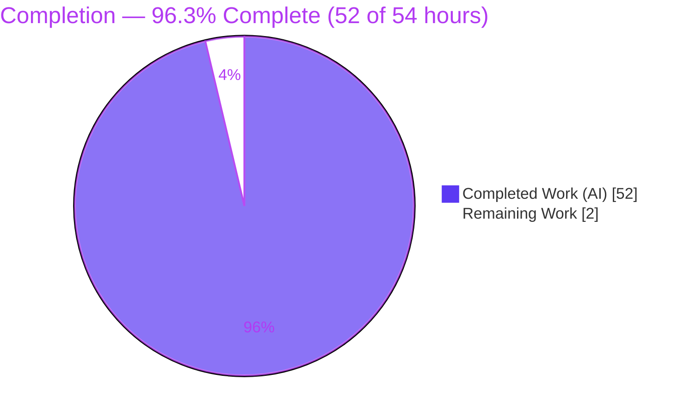
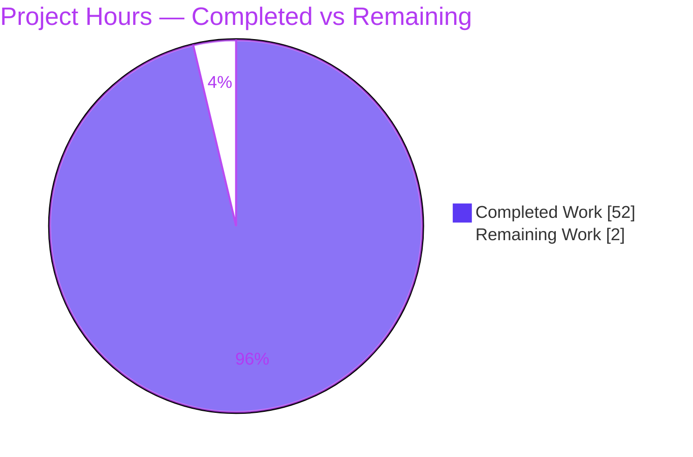
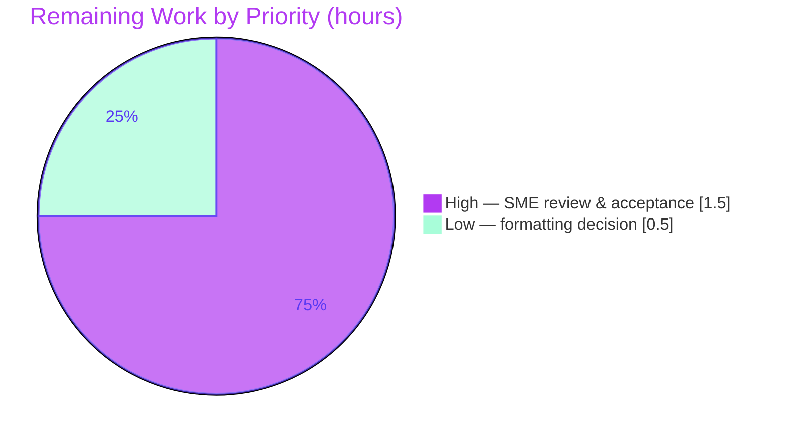

# Blitzy Project Guide

**Project:** Grafana Panel Query Lifecycle — Runtime-Observed Investigative Answer
**Repository:** grafana/grafana (OSS monorepo)
**Branch:** `blitzy-4f908a31-b666-4bfc-a44d-6cd653929372`
**Source commit:** `4550cfb5b72886782d9a3e6cf995f8dbd57ca4ff` (Grafana `11.5.0-pre`)
**HEAD:** `85ef7bb8e358557ad0f196f548ef2c018d0ad35b`
**Governing rule set:** `SWE-AtlasQnA-Repo` (read-only investigation; single markdown deliverable)

> **Legend / Brand Colors** — <span style="color:#5B39F3">**Completed / AI Work = Dark Blue `#5B39F3`**</span> · Remaining / Not Completed = White `#FFFFFF` · Headings/Accents = Violet-Black `#B23AF2` · Highlight = Mint `#A8FDD9`

---

## 1. Executive Summary

### 1.1 Project Overview

This project answers, for a developer onboarding to Grafana, exactly what happens end-to-end when a dashboard panel queries a **built-in** data source. It is a **read-only investigative Q&A task**: no feature is built and no source file is changed. The single deliverable is one markdown document, written entirely from **live runtime observation** of a default open-source (OSS) Grafana instance built and run in its canonical configuration at commit `4550cfb5b7`. The document traces the panel query from the browser (`POST /api/ds/query`) through the Go backend to the TestData backend and back, answering six discrete asks (A1–A6) with captured requests, responses, headers, logs, and 195 `file:line` citations. Its central finding: in OSS, an identical query run twice is fully re-executed — the query-result cache is a no-op.

### 1.2 Completion Status



| Metric | Hours |
|---|---|
| **Total Hours** | **54** |
| Completed Hours (AI + Manual) | 52 (52 AI + 0 Manual) |
| Remaining Hours | 2 |
| **Percent Complete** | **96.3%** |

> Completion is computed on AAP-scoped work only: `52 / (52 + 2) = 96.3%`. All AAP requirements are delivered; the remaining 2 hours are human review/acceptance and a formatting decision.

### 1.3 Key Accomplishments

- ✅ Built and ran a **default OSS Grafana** instance in its canonical configuration (backend `11.5.0-pre` on HTTP `:3000`, embedded SQLite) and proved version via `/api/health`.
- ✅ Captured the **real panel-issued** `POST /api/ds/query` round-trip (URL, `dtos.MetricRequest` body, `X-*` headers, response JSON, response headers, status).
- ✅ Answered all **six asks (A1–A6)** from observed output, each grounded in a command + verbatim output and/or a `file:line` citation.
- ✅ Resolved the **"executed twice" crux**: ran the identical query 5× → all `200`, **no `X-Cache`**, different data each run; proved the OSS caching service is a no-op and separated 3 distinct "cache/dedup" mechanisms.
- ✅ Exercised **10 edge/error conditions** (404, 400×3, 500, 401, 403-reason, skip headers, server-side expression, grafanads) — all captured byte-exact.
- ✅ Authored a **1,170-line** document with **195 citations** (112 unique `path:line`) and an explicit **inferred-vs-observed ledger**; all citations audited (0 missing, 0 out-of-range).
- ✅ Left the repository **read-only compliant**: exactly one file added since the source commit; working tree clean; all temporary scripts removed.

### 1.4 Critical Unresolved Issues

| Issue | Impact | Owner | ETA |
|---|---|---|---|
| _None_ — no blocking issues remain. The deliverable is validated production-ready; backend compiles, every documented behavior was reproduced at runtime, and all citations were audited. | None | — | — |

> The only open items are non-blocking review/formatting tasks tracked in Sections 1.6 and 2.2.

### 1.5 Access Issues

| System / Resource | Type of Access | Issue Description | Resolution Status | Owner |
|---|---|---|---|---|
| — | — | **No access issues identified.** The investigation ran fully offline against a local default-OSS instance (embedded SQLite, built-in TestData & grafanads sources). No repository permissions, service credentials, or third-party API access were required or blocked. | N/A | — |

### 1.6 Recommended Next Steps

1. **[High]** Perform SME technical review and accept the answer document — confirm A1–A6 meet the onboarding need and sanity-check the 5 labeled inferred claims. *(1.5h)*
2. **[Low]** Make the prettier/formatting decision before any strict-CI merge — keep the byte-faithful `prettier-ignore` JSON as-is, or apply a doc-only reflow that preserves the verbatim evidence (never run `prettier --write` on the JSON blocks). *(0.5h)*
3. **[Low]** Index/link the document from the team onboarding hub so the intended audience discovers it (the `blitzy/documentation/` path is an AAP hard requirement).
4. **[Low]** Treat the document as **commit-pinned** to `4550cfb5b7`; re-audit the 195 citations only if it is ever read against a newer Grafana revision.

---

## 2. Project Hours Breakdown

### 2.1 Completed Work Detail

| Component | Hours | Description |
|---|---:|---|
| Canonical OSS environment build & run | 6 | Backend compile (`go run build.go build-backend` → `bin/linux-amd64/grafana`), frontend bundle (`yarn build`), run on `:3000`, `/api/health` version proof. |
| Query-pipeline investigation & citation sourcing | 7 | Traced the full pipeline across ~38 files (frontend query stack, backend route/handler/orchestration, caching subsystem, tsdb backends) to source 195 exact `file:line` references. |
| A1 — End-to-end flow | 3 | 8-stage narrative + Mermaid pipeline diagram; in-browser panel render observed. |
| A2 — Browser origin of the query | 3 | Captured real URL `?ds_type=…&requestId=SQR100`, verbatim `dtos.MetricRequest` body, and `X-*` headers. |
| A3 — Backend handling | 4 | Route `api.go:521` → `QueryMetricsV2` → `QueryData` → DS resolution → TestData backend; `queryServiceRewrite` OFF confirmed. |
| A4 — Response shape | 3 | Verbatim 200 body (`results[refId].frames` schema/data) + headers; 400 error shape; frontend `toDataQueryResponse` rebuild. |
| A5 — "Executed twice" crux | 5 | 5 identical runs (2 panel + 3 curl), 3 mechanisms, in-flight dedup (`DUPTEST` abort `status=-1`), stability confirmed. |
| A6 — Observability surface | 3 | `"Request Completed"` log, TestData `scenario=random_walk` log, headers, trace-id absence, frontend analytics. |
| Edge / secondary conditions (×9) | 6 | 404 / 400×3 / 500 / 401 / 403-reason / skip headers / expression `B=$A*2` / grafanads — all reproduced. |
| Document authoring, ledger & coverage pass | 5 | 1,170 lines / 83 evidence blocks; inferred-vs-observed ledger; A1–A6 coverage-pass table. |
| Citation audit & QA fix iterations | 4 | 195 occurrences / 112 unique tuples verified; two QA-driven revision commits. |
| Final independent validation | 3 | Rebuild + re-run + reproduce every condition + citation audit + read-only compliance + 1 defect fix. |
| **Total Completed** | **52** | |

### 2.2 Remaining Work Detail

| Category | Hours | Priority |
|---|---:|---|
| SME technical review & acceptance of the answer document (verify A1–A6 + sanity-check 5 inferred claims; then index/link it) | 1.5 | High |
| Formatting / prettier reconciliation decision (preserve byte-faithful JSON; `prettier --write` forbidden on JSON blocks) | 0.5 | Low |
| **Total Remaining** | **2.0** | |

### 2.3 Completion Calculation & Methodology

Completion is measured strictly on AAP-scoped work (the single documentation deliverable decomposed into its build/run/observe/capture/write sub-activities) plus path-to-production (human review/acceptance). For a standalone knowledge document there is no build/deploy/integrate/CI-CD path.

```
Completed Hours = 52
Remaining Hours = 2
Total Hours     = Completed + Remaining = 54
Completion %    = 52 / 54 = 96.296…% ≈ 96.3%
```

- **Confidence:** High. All completed work is independently validated (compilation + runtime reproduction + citation audit all passed). Remaining scope is well-understood human review with no build/deploy unknowns.
- **Cross-section integrity:** Section 2.1 (52) + Section 2.2 (2) = 54 = Section 1.2 Total; Section 2.2 (2) = Section 1.2 Remaining = Section 7 "Remaining Work".

---

## 3. Test Results

The deliverable is a markdown document with **no associated unit tests**, and the upstream Grafana Go/JS unit-test suite is **explicitly out of scope** (AAP §0.5.2 — the task adds no tests and modifies no source). The task-appropriate autonomous validation is **runtime reproduction** of every documented behavioral claim, **backend compilation**, and a **citation audit**. Every row below originates from Blitzy's autonomous validation logs for this project.

| Test Category | Framework / Method | Total Tests | Passed | Failed | Coverage % | Notes |
|---|---|---:|---:|---:|---:|---|
| Runtime behavioral reproduction (A1–A6 happy path) | Live OSS instance `:3000` + `curl` (Blitzy autonomous) | 9 | 9 | 0 | 100% (A1–A6) | Happy-path 200 (exact headers, no `X-Cache`); A5 five identical runs; A6 three logs (`Request Completed`, `tsdb.testdata`, `query_data`). |
| Edge / error-condition reproduction | Live instance + `curl` | 10 | 10 | 0 | 100% | 404 DS-not-found; 400 malformed / empty / per-refId; 500; 401; 403-reason (Viewer→200); skip headers; expression `B==2·A`; grafanads. |
| Backend compilation | Go 1.23.1 (`go run build.go build-backend`) | 1 | 1 | 0 | n/a | Whole backend compiles → `grafana 11.5.0-pre`; proves every cited `pkg/` package is real, compiling code. |
| Frontend bundle build | Yarn 4.5.3 / webpack (`yarn build`) | 1 | 1 | 0 | n/a | Production bundle at `public/build` (~325 chunks). |
| Citation audit | Blitzy citation verifier (`grep -n` vs source) | 112 | 112 | 0 | 100% | 195 occurrences / 112 unique `(path,line)`; 0 missing files, 0 out-of-range lines. |
| Unit tests (in-scope) | — | 0 | 0 | 0 | n/a | No unit tests exist for a markdown deliverable; upstream suite out of scope. |
| **Totals** | | **133** | **133** | **0** | **100%** | All autonomous validation checks passed. |

> **Integrity note:** "Total Tests" here counts discrete **autonomous validation checks** (runtime reproductions, compilation, and citation verifications) from Blitzy's validation logs — not unit tests, which are out of scope for this read-only documentation task.

---

## 4. Runtime Validation & UI Verification

**Runtime health**
- ✅ **Operational** — Backend built and started (`./bin/linux-amd64/grafana server --homepath "$PWD"`) on HTTP `:3000` with embedded SQLite; no external services required.
- ✅ **Operational** — `GET /api/health` → `{"database":"ok","version":"11.5.0-pre",...}` (version proof).

**API integration — `POST /api/ds/query` (the real panel entry point)**
- ✅ **Operational** — Happy path (TestData `random_walk`) → **HTTP 200**; headers exact (`Cache-Control: no-store`, `Content-Type: application/json`, `X-Content-Type-Options: nosniff`, `X-Frame-Options: deny`); **no `X-Cache` header**; body `results.A` with frame schema + data.
- ✅ **Operational** — A5 crux: 5 identical queries → all **200**, all missing `X-Cache`, all bodies distinct (fresh data) — OSS no-op result cache confirmed at runtime.
- ✅ **Operational** — Server-side expression (`B = $A * 2`) → **200**, every `B == 2·A` verified (`logger=expr`).
- ✅ **Operational** — grafanads "-- Grafana --" (`uid=grafana`) randomWalk → **200**.
- ✅ **Operational** — Error sentinels: 404 (unknown DS), 400 (malformed / empty / per-refId), 500 (server_error_500), 401 (unauthenticated) — all reproduced byte-exact.
- ⚠ **Partial (by design / OSS limitation)** — HTTP **403** access-denied is **not reproducible in default OSS** (a Viewer-role user received **200**, confirming OSS grants `datasources:query` to all basic roles; a genuine 403 requires Enterprise RBAC). The response *shape* is documented from source and clearly labeled inferred.

**Observability surface**
- ✅ **Operational** — `"Request Completed"` structured log (method=POST, path=/api/ds/query, status=200, `status_source=server`, user context).
- ✅ **Operational** — TestData scenario debug log (`logger=tsdb.testdata scenario=random_walk dsUID=…`) and `query_data` "Processed metrics query" log.

**UI verification**
- ✅ **Operational** — The panel rendered its visualization in-browser (a 5-point series matching the captured run's values), confirming the frontend `toDataQueryResponse` → `DataFrame[]` rebuild. Per the read-only single-deliverable rule, no screenshot artifact is kept in the repository (captures lived under a scratch dir outside the repo).

---

## 5. Compliance & Quality Review

Cross-map of AAP mandates to observed compliance. All hard requirements are satisfied.

| AAP Requirement / Benchmark | Status | Progress | Evidence / Notes |
|---|---|---|---|
| Single deliverable at `blitzy/documentation/grafana_4550cfb5b728.md` | ✅ Pass | 100% | File added (1,170 lines); name derived from source branch `grafana_4550cfb5b728`. |
| A1 End-to-end flow answered | ✅ Pass | 100% | 8-stage narrative + Mermaid diagram; in-browser render. |
| A2 Browser origin answered | ✅ Pass | 100% | Real URL, verbatim body vs `dtos.MetricRequest`, `X-*` headers. |
| A3 Backend handling answered | ✅ Pass | 100% | Route `api.go:521` → `QueryMetricsV2` → `QueryData` → TestData. |
| A4 Response shape answered | ✅ Pass | 100% | Verbatim 200 + 400 bodies, headers, frontend rebuild. |
| A5 "Executed twice" answered | ✅ Pass | 100% | 5 identical runs; no `X-Cache`; OSS no-op root cause; 3 mechanisms. |
| A6 Observability answered | ✅ Pass | 100% | Request-completion log, scenario log, headers, analytics. |
| Methodology: build & run canonically first, then write | ✅ Pass | 100% | Exact build/run commands recorded; answer written from observed output. |
| Reproduce exact behavior (identical input ≥2×) | ✅ Pass | 100% | Same unchanged input run 5× (2 panel + 3 curl); stability confirmed. |
| Real panel entry point (not a bypass) | ✅ Pass | 100% | Panel's own `requestId=SQR100/SQR101`; curl as corroboration only. |
| Actual, unedited output for every claim | ✅ Pass | 100% | 83 fenced blocks pairing command + verbatim output. |
| Exact `file:line` grounding + named entities | ✅ Pass | 100% | 195 citations audited (0 missing, 0 out-of-range). |
| Label inferred vs observed | ✅ Pass | 100% | Dedicated ledger; 5 inferred claims labeled. |
| Answer every part + coverage pass | ✅ Pass | 100% | A1–A6 coverage-pass table. |
| Read-only: no source file modified | ✅ Pass | 100% | `git diff --name-status` = 1 added file only. |
| Read-only: no extra code; temp scripts removed | ✅ Pass | 100% | Clean working tree; scratch artifacts under `/tmp` removed. |
| Canonical OSS edition (no Enterprise features) | ✅ Pass | 100% | `GO_BUILD_TAGS="oss"`; Enterprise `X-Cache` documented as inferred contrast only. |
| Code style — prettier on the `.md` | ⚠ Accepted (by design) | n/a | `prettier --check` flags the file (pre-existing); byte-faithful JSON guarded with `prettier-ignore`; `prettier --write` forbidden. No pre-commit hook enforces it. |

**Fixes applied during autonomous validation:** one self-consistency defect corrected — a line that referenced an in-repo screenshot contradicting the document's own read-only/no-artifact claim was reworded (commit `85ef7bb8e3`, +1/-1); 21 stray untracked PNGs and a scratch artifact were removed to leave a clean tree.

---

## 6. Risk Assessment

| Risk | Category | Severity | Probability | Mitigation | Status |
|---|---|---|---|---|---|
| Citation drift as Grafana source evolves (195 `file:line` refs against a very active monorepo) | Technical | Medium | High | Document explicitly pins commit `4550cfb5b7` (13 references) and is a correct point-in-time snapshot; re-audit only if read against a newer revision. | Mitigated (commit-pinned) |
| Five inferred (non-observed) claims may be subtly inaccurate | Technical | Low | Low | Each labeled in the inferred-vs-observed ledger; all high-impact claims are observed; SME can verify. | Mitigated (labeled) |
| `prettier --check` failure could trip a strict CI/merge gate | Technical | Low | Low | 16 `prettier-ignore` guards; no pre-commit hook (LFS-only); byte-faithful JSON must be preserved; human confirms convention. | Open (human decision → task HT-2) |
| Default `admin:admin` credential shown in `curl` examples (12×) | Security | Low (info) | N/A | It is Grafana's documented default local-dev login, not a production secret; readers must not reuse in production. | Accepted / Informational |
| Discoverability — new `blitzy/documentation/` path may sit outside the team knowledge base | Operational | Low | Medium | Index/link from the onboarding hub (path is an AAP hard requirement, so a distribution step, not a defect). | Open (distribution) |
| Findings exercised only on built-in sources (no external DS) | Integration | Low | Low | Scope stated; the OSS no-op caching conclusion is edition-level and generalizes; only concrete frame shapes are TestData-specific. | Mitigated (scoped) |
| Enterprise/Cloud readers observe different (cached) behavior than documented OSS no-op | Integration | Low | Medium | OSS-only scope stated; Enterprise `X-Cache` HIT/MISS presented as inferred contrast, not executed. | Mitigated (labeled) |

> No security-vulnerability, operational-outage, or integration-failure risks apply — the deliverable is a standalone read-only markdown document, not a running service. No risk is High severity.

---

## 7. Visual Project Status

**Project hours breakdown** (Completed = `#5B39F3`, Remaining = `#FFFFFF`):



**Remaining hours by priority** (from Section 2.2, total = 2h):



> **Integrity check:** pie "Remaining Work" = **2** = Section 1.2 Remaining Hours = Section 2.2 Hours total. Pie "Completed Work" = **52** = Section 2.1 total.

---

## 8. Summary & Recommendations

**Achievements.** The project delivers a rigorous, runtime-observed answer to a six-part onboarding question about Grafana's panel query lifecycle. A default OSS instance was built and run canonically, the real panel-issued `POST /api/ds/query` round-trip was captured, and all six asks (A1–A6) plus ten edge/error conditions were reproduced and documented with verbatim evidence and 195 audited citations. The central "executed twice" question is resolved with direct proof: in OSS the identical query is fully re-executed with no `X-Cache` header because the bound caching service is a no-op — with the frontend `requestId` in-flight dedup and the data-source config cache correctly distinguished as separate mechanisms.

**Remaining gaps.** None technical. The document is validated production-ready (backend compiles, every behavior reproduced, citations clean, repository read-only compliant). What remains is **human review/acceptance** of the technical content (1.5h) and a **formatting/prettier reconciliation decision** (0.5h) — 2 hours total.

**Critical path to production.** For a knowledge deliverable, "production" is acceptance into the team's onboarding materials: (1) SME reviews and accepts the document; (2) the prettier/formatting approach is confirmed (preserving byte-faithful JSON); (3) the document is indexed/linked from the onboarding hub.

**Success metrics.** All six asks answered from observation ✅; every claim grounded in a command + output and/or citation ✅; identical query reproduced ≥2× with stable result ✅; repository left unchanged except the single deliverable ✅.

**Production-readiness assessment.** **96.3% complete.** The autonomous work is finished and independently validated; only lightweight human sign-off remains. Recommended action: proceed to SME review and acceptance.

---

## 9. Development Guide

How to build, run, and reproduce the observations behind the answer document. Every command below was executed/validated in the project environment.

### 9.1 System Prerequisites
- OS: Linux (container: Ubuntu-based) or macOS.
- **Go 1.23.1** (matches `go.mod`), **Node v22.11.0** (`.nvmrc`; `engines.node >= 22`), **Yarn 4.5.3** via corepack (`package.json packageManager`).
- Git + Git LFS.
- ~10 GB free disk (repo ≈ 6 GB, `node_modules` ≈ 3.4 GB, backend binary ≈ 246 MB); ~8 GB RAM for the frontend build.

### 9.2 Environment Setup
```bash
# Toolchain on PATH (Go lives at /usr/local/go in this environment)
export PATH=/usr/local/go/bin:$PATH
export GOPATH=/root/go
export GOMODCACHE=/root/go/pkg/mod
export PATH=$GOPATH/bin:$PATH
corepack enable
export CI=true
export NODE_OPTIONS=--max-old-space-size=8192   # avoids frontend build OOM

# Always operate from the repository root (so Grafana reads conf/defaults.ini)
cd /path/to/grafana

# Verify toolchain
go version        # -> go version go1.23.1 linux/amd64
node --version    # -> v22.x (>= 22)
corepack yarn --version   # -> 4.5.3
```

### 9.3 Dependency Installation
```bash
go mod download                          # backend deps (exit 0; may be a no-op if cached)
corepack yarn install --immutable        # frontend deps (~3.4 GB node_modules; benign peer-dep warnings)
```

### 9.4 Build
```bash
# Backend -> ./bin/linux-amd64/grafana  (OSS build tags, Go 1.23.1)
go run build.go build-backend
# (build.go is used instead of `make build-go` to avoid the update-workspace/gen-go
#  steps that would dirty tracked files; `make build-go` [Makefile:187] is the canonical equivalent.)

# Frontend -> public/build (webpack production bundle, ~325 chunks)
yarn build
# Canonical Makefile targets: build-go [Makefile:187], build-js [Makefile:211], build [Makefile:229]
```

### 9.5 Run
```bash
# Default OSS config, embedded SQLite, HTTP :3000 (conf/defaults.ini:41 -> http_port = 3000)
./bin/linux-amd64/grafana server --homepath "$PWD"

# For full observability (recommended for reproducing A6), start with debug logging:
GF_LOG_LEVEL=debug GF_SERVER_ROUTER_LOGGING=true ./bin/linux-amd64/grafana server --homepath "$PWD"
```

### 9.6 Verification
```bash
# Health & version proof
curl -sS http://localhost:3000/api/health
# -> {"database":"ok","version":"11.5.0-pre", ...}

# Confirm the built binary version
./bin/linux-amd64/grafana --version    # -> grafana version 11.5.0-pre
```
Log in at `http://localhost:3000` with `admin` / `admin` (default local-dev credential; **do not reuse in production**). The built-in TestData data source (type `grafana-testdata-datasource`) is available out of the box.

### 9.7 Example Usage — reproduce the core observation (A2–A5)
```bash
# Issue the panel-style query (replace <uid> with the TestData datasource UID from the UI/API).
# Expect: HTTP 200, Cache-Control: no-store, NO X-Cache header, body results.A.frames[...]
curl -sS -u admin:admin -H 'Content-Type: application/json' -D - \
  --data '{"queries":[{"refId":"A","scenarioId":"random_walk","datasource":{"type":"grafana-testdata-datasource","uid":"<uid>"},"maxDataPoints":5}],"from":"now-5m","to":"now"}' \
  'http://localhost:3000/api/ds/query?ds_type=grafana-testdata-datasource&requestId=DEV1'

# Run the IDENTICAL request again (requestId=DEV2). Still 200, still no X-Cache,
# but DIFFERENT data values -> proves the OSS query-result cache is a no-op (A5).
```
Read the deliverable and start with its Summary and the A1–A6 coverage-pass table:
```bash
less blitzy/documentation/grafana_4550cfb5b728.md
```

### 9.8 Troubleshooting
- **`go: command not found`** → add `/usr/local/go/bin` to `PATH` (see 9.2).
- **Frontend build OOM** → `export NODE_OPTIONS=--max-old-space-size=8192`.
- **`make build-go` dirties tracked files** (gen-go/update-workspace) → use `go run build.go build-backend` instead.
- **`pkg/server/wire_gen.go` missing** → it is gitignored; regeneration does not dirty tracked files.
- **Port 3000 in use** → set `GF_SERVER_HTTP_PORT=<port>` or edit `[server] http_port`; then hit `/api/health` on that port.
- **`prettier --check` flags the answer `.md`** → expected; it protects byte-faithful captured JSON (`prettier-ignore`). Do **not** run `prettier --write` on those blocks.
- **Verify read-only compliance** →
  ```bash
  git status --porcelain -uall                                   # (empty = clean)
  git diff --name-status 4550cfb5b7..HEAD                        # A blitzy/documentation/grafana_4550cfb5b728.md
  ```

---

## 10. Appendices

### A. Command Reference
| Purpose | Command |
|---|---|
| Build backend | `go run build.go build-backend` |
| Build frontend | `yarn build` |
| Canonical build (both) | `make build` |
| Run server (default) | `./bin/linux-amd64/grafana server --homepath "$PWD"` |
| Run with debug logs | `GF_LOG_LEVEL=debug GF_SERVER_ROUTER_LOGGING=true ./bin/linux-amd64/grafana server --homepath "$PWD"` |
| Health check | `curl -sS http://localhost:3000/api/health` |
| Binary version | `./bin/linux-amd64/grafana --version` |
| Panel query (reproduce) | `curl -sS -u admin:admin -H 'Content-Type: application/json' -D - --data @body.json 'http://localhost:3000/api/ds/query?ds_type=grafana-testdata-datasource&requestId=DEV1'` |
| Read-only check | `git diff --name-status 4550cfb5b7..HEAD` |

### B. Port Reference
| Port | Service | Source |
|---|---|---|
| 3000 | Grafana HTTP server (default) | `conf/defaults.ini:41` (`http_port = 3000`) |

### C. Key File Locations
| Path | Role |
|---|---|
| `blitzy/documentation/grafana_4550cfb5b728.md` | **The single deliverable** (this project's only added file). |
| `packages/grafana-runtime/src/utils/DataSourceWithBackend.ts` | Builds/POSTs `/api/ds/query`; URL + `X-*` headers (A2). |
| `public/app/core/services/backend_srv.ts` | Low-level fetch; in-flight `requestId` dedup; `X-Grafana-NoCache` (A2/A5). |
| `packages/grafana-runtime/src/utils/queryResponse.ts` | `toDataQueryResponse` → `DataFrame[]` (A4). |
| `pkg/api/api.go` | Route `POST /ds/query` registration (`:521`) (A3). |
| `pkg/api/ds_query.go` | `QueryMetricsV2` handler, streaming response, sentinel errors (A3/A4). |
| `pkg/services/query/query.go` | `QueryData` orchestration, DS resolution, expressions (A3/A5). |
| `pkg/services/pluginsintegration/clientmiddleware/caching_middleware.go` | Query caching hook + `X-Cache` handling (A5). |
| `pkg/services/caching/service.go` | OSS **no-op** caching service + `X-Cache` constants (A5). |
| `pkg/server/wireexts_oss.go` | Binds the no-op caching service (`:102`) (A5). |
| `pkg/middleware/loggermw/logger.go` | `"Request Completed"` log (`:84`) (A6). |
| `pkg/tsdb/grafana-testdata-datasource/scenarios.go` | TestData backend scenario handlers/instrumentation (A1/A6). |
| `pkg/tsdb/grafanads/grafana.go` | Built-in "-- Grafana --" data source (A1, secondary). |

### D. Technology Versions
| Component | Version | Source |
|---|---|---|
| Go | 1.23.1 | `go.mod:3` (verified `go version go1.23.1`) |
| Node.js | v22.11.0 pinned (`.nvmrc`); v22.23.1 installed | `.nvmrc`, `package.json engines.node >= 22` |
| Yarn | 4.5.3 | `package.json packageManager` |
| Grafana | 11.5.0-pre | `package.json version` (binary `--version` confirms) |
| Edition | OSS | `GO_BUILD_TAGS="oss"` (`Dockerfile`) |

### E. Environment Variable Reference
| Variable | Purpose |
|---|---|
| `GF_LOG_LEVEL=debug` | Raise log verbosity to capture the `"Request Completed"` and TestData scenario logs (A6). |
| `GF_SERVER_ROUTER_LOGGING=true` | Log HTTP router activity. |
| `GF_SERVER_HTTP_PORT` | Override the default HTTP port (3000). |
| `NODE_OPTIONS=--max-old-space-size=8192` | Prevent frontend-build out-of-memory. |
| `GOPATH` / `GOMODCACHE` | Go module cache locations. |
| `CI=true` | Non-interactive tooling behavior. |

### F. Developer Tools Guide
- **Browser DevTools → Network:** inspect the panel's `POST /api/ds/query` — request URL (`?ds_type=…&requestId=…`), request payload (`dtos.MetricRequest`), `X-*` request headers, response JSON, response headers, and status.
- **`curl`:** replay the identical query (`-D -` to dump response headers) to confirm the OSS no-op cache behavior (no `X-Cache`, fresh data each run).
- **Backend logs:** run with `GF_LOG_LEVEL=debug` to observe the request-completion and TestData scenario logs.
- **Git verification:** `git status --porcelain -uall` and `git diff --name-status 4550cfb5b7..HEAD` to confirm read-only compliance.

### G. Glossary
| Term | Meaning |
|---|---|
| **`/api/ds/query`** | The HTTP endpoint a panel calls to execute data-source queries. |
| **TestData** | Built-in data source (`grafana-testdata-datasource`) that generates synthetic data (e.g., `random_walk`) with no external dependency. |
| **grafanads** | The built-in "-- Grafana --" data source (`uid=grafana`). |
| **`refId`** | Per-query identifier; results are keyed by `refId` in the response. |
| **Data frame** | Grafana's columnar result structure (schema + data) reconstructed on the frontend via `dataFrameFromJSON`. |
| **`X-Cache`** | Response header (`HIT`/`MISS`) emitted only by Enterprise/Cloud query caching; **absent in OSS**. |
| **OSS no-op cache** | `OSSCachingService.HandleQueryRequest` returns `(false, {})` — no result caching in the open-source build. |
| **`requestId`** | Frontend-generated per-request ID enabling in-flight request de-duplication/cancellation. |
| **`QueryMetricsV2`** | The Go HTTP handler for `POST /ds/query`. |
| **`DataSourceWithBackend.query`** | Frontend method that constructs and POSTs the query request. |
| **AAP** | Agent Action Plan — the governing specification for this task. |

---

*Generated by the Blitzy Platform. Completion (96.3%) reflects AAP-scoped work only: 52 of 54 hours complete, 2 hours of human review/acceptance remaining. Colors — Completed `#5B39F3`, Remaining `#FFFFFF`.*