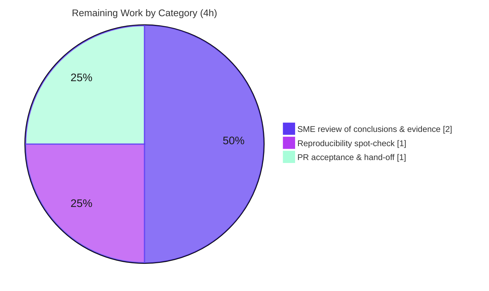

# Blitzy Project Guide

> **Project:** Grafana Runtime Investigation — Idle Health, Migrations, Build Info, Dashboard Scenes & Alerting
> **Branch:** `blitzy-6bba86fe-3400-47af-a1c7-370843d138cb` · **HEAD:** `f20318a4a2` · **Base:** `4550cfb5b7`
> **Subject under test:** Grafana `11.5.0-pre` (Go 1.23.1 / Node 22 / Yarn 4.5.3)
> **Brand legend:** 🟦 Completed / AI Work = Dark Blue `#5B39F3` · ⬜ Remaining = White `#FFFFFF`

---

## 1. Executive Summary

### 1.1 Project Overview

This project is a **read-only runtime investigation of Grafana** whose sole committed deliverable is a single, evidence-backed Markdown report (`blitzy/documentation/grafana_4550cfb5b728.md`). The report answers five distinct runtime-behavior questions — idle background logging (O1), database migration verification (O2), build-information via the HTTP API (O3), dashboard-scene datasource-picker auto-resolution (O4), and alerting rule query-state population (O5). The intended consumers are Grafana platform engineers and the requesting stakeholder who need authoritative, code-grounded answers corroborated by captured runtime evidence (idle logs, migration logs, live API JSON, and Jest test output). The technical scope spans the Go backend (`pkg/`) and the React/TypeScript frontend (`public/app/`); no production behavior is changed.

### 1.2 Completion Status


| Metric | Hours |
| :--- | :--- |
| **Total Hours** | **39** |
| **Completed Hours (AI + Manual)** | **35** (AI = 35, Manual = 0) |
| **Remaining Hours** | **4** |
| **Percent Complete** | **89.7%** |

> Completion is computed using the AAP-scoped, hours-based method: `35 / (35 + 4) = 89.7%`. All nine AAP deliverables are complete and independently validated; the remaining 4 hours are the mandatory human review/acceptance gate.

### 1.3 Key Accomplishments

- ✅ Built and ran a faithful Grafana instance (backend via `make gen-go` + `make build-backend` with documented ldflags; frontend deps installed) and confirmed the startup banner reports `version=11.5.0-pre commit=4550cfb5b7`.
- ✅ **O1** — Held the instance idle for 22 minutes (zero requests) and captured the **exactly two** recurring INFO log entries on a 10-minute cadence, with verbatim evidence and 6-file code localization.
- ✅ **O2** — Captured the migrator's "schema up to date" evidence (`migrations completed performed=0 skipped=626`/`18`) plus the fresh-DB contrast (`performed=626`/`18`) and 644 DEBUG skip lines.
- ✅ **O3** — Queried the live API and recorded the exact `version` string `11.5.0-pre` from `/api/health` (anon + admin) and `/api/frontend/settings` `buildInfo`.
- ✅ **O4** — Proved datasource-picker auto-resolution via the existing Jest spec (`PanelDataQueriesTab.test.tsx`, 25/25 passing) and identified the responsible code.
- ✅ **O5** — Proved alerting rule query-state population via a temporary, since-deleted Jest spec (2/2 passing) and identified the responsible code.
- ✅ Authored a 619-line report with a strict 4-part structure (question / evidence / rationale / responsible code) per objective, plus a build methodology and a validation checklist.
- ✅ Honored the hard constraints: **no repository file modified** (the source tree is byte-identical to base), temporary scripts cleaned up, working tree clean.

### 1.4 Critical Unresolved Issues

| Issue | Impact | Owner | ETA |
| :--- | :--- | :--- | :--- |
| _None_ — no blocking issues. All five objectives are answered, evidenced, and validated; zero fixes were required during final validation. | N/A | N/A | N/A |

> The only remaining work is the standard human review/acceptance gate (see §1.6 and §2.2), which is not an "unresolved issue" but an expected path-to-production step.

### 1.5 Access Issues

| System/Resource | Type of Access | Issue Description | Resolution Status | Owner |
| :--- | :--- | :--- | :--- | :--- |
| Grafana source repository | Git read/write | Branch accessible; build toolchain present | ✅ Resolved | — |
| Grafana HTTP API (local) | `admin:admin` basic auth | Default OSS credentials; instance is local/throwaway | ✅ Resolved | — |
| Go module cache / npm registry | Read | Caches pre-warmed (go mod 5.9G, node_modules 3.4G); no live network needed | ✅ Resolved | — |

> **No access issues identified** that prevent build validation, integration, or evidence capture. All required toolchain, credentials, and caches are present in the environment.

### 1.6 Recommended Next Steps

1. **[High]** Have a Grafana-familiar SME review the five conclusions and verbatim evidence in `grafana_4550cfb5b728.md` against the cited code (~2h).
2. **[Medium]** Optionally re-run a reproducibility spot-check (`curl /api/health` → `11.5.0-pre`; `yarn jest PanelDataQueriesTab.test.tsx --watchAll=false` → 25/25) to confirm the evidence reproduces in the reviewer's environment (~1h).
3. **[Medium]** Approve and merge the branch (single added file) and hand the report to the requesting stakeholder (~1h).
4. **[Low]** If the findings will be reused on a different Grafana version, note that line numbers, log strings, and the version value are pinned to HEAD `4550cfb5b7` and would need re-capture.

---

## 2. Project Hours Breakdown

### 2.1 Completed Work Detail

All completed hours are autonomous (AI) work; manual completed hours = 0. Each component traces to a specific AAP requirement.

| Component | Hours | Description |
| :--- | :---: | :--- |
| Environment build & instance bring-up | 6 | Frontend dependency install; backend wire-gen (`make gen-go`) + ldflags build → `./bin/linux-amd64/grafana`; run configuration; resolved `go.work`/`GOFLAGS` and shell-teardown (`setsid`) gotchas. |
| O1 — Idle background logging investigation & capture | 5 | Idle runs at `info` and `debug` (≥22 min, zero requests); cadence-delta analysis; exhaustive INFO scan; code localization across `cleanup`, `updatechecker` (plugins + grafana), `schedule`, `usagestats`, `remotecache`. |
| O2 — Database migration evidence capture | 3 | Fresh-DB + already-migrated + DEBUG runs; counted 644 "Skipping migration" lines; cited migrator code (`migrator.go` L97/247/260–262/287/356/392). |
| O3 — Build-info API investigation | 3 | ldflags build; `/api/health` (anon + admin); `/api/frontend/settings` (401 unauth → `buildInfo` with admin); access-control code trace (`api.go`, `middleware/auth.go`, `frontendsettings.go`). |
| O4 — Datasource picker test execution & code localization | 3 | Ran existing Jest spec (25/25); identified decisive `should load data source` test; traced `loadDataSource` + fallback path in `PanelDataQueriesTab.tsx`. |
| O5 — Alerting rule query-state evidence | 3 | Authored a temporary adjacent Jest spec, ran it (2/2, five `O5-EVIDENCE` lines), then deleted it; traced `formValuesFromExistingRule` → `rulerRuleToFormValues`. |
| Investigation report authoring | 6 | 619-line report; strict 4-part structure × 5 objectives; build methodology; rationale; verified code citations; cleanup notes. |
| Web research (API contract & auth confirmation) | 1 | Confirmed `/api/health` and `buildInfo` response shapes and OSS basic-auth mechanism as evidence-source validation. |
| Constraint compliance & cleanup | 1 | Temporary-script deletion; clean-tree verification; guaranteed no repository modification. |
| Code-review & QA validation cycles | 4 | Five commits: code-review fixes, QA CP1 (O1 INFO completeness, O3 citation), QA CP3 (validation checklist), O3 admin-auth refinement; final independent re-validation. |
| **Total Completed** | **35** | **Matches Completed Hours in §1.2.** |

### 2.2 Remaining Work Detail

Each remaining category is a path-to-production human-review item (no blocking compilation/test failures exist).

| Category | Hours | Priority |
| :--- | :---: | :--- |
| SME review of O1–O5 conclusions & verbatim evidence against cited code | 2 | High |
| Reproducibility spot-check of selected runtime evidence (`/api/health` + O4 Jest spec) | 1 | Medium |
| PR acceptance/merge & stakeholder hand-off | 1 | Medium |
| **Total Remaining** | **4** | **Matches Remaining Hours in §1.2 and §7.** |

### 2.3 Total Project Hours & Reconciliation

| Quantity | Hours | Source |
| :--- | :---: | :--- |
| Completed (§2.1) | 35 | Sum of 10 completed components |
| Remaining (§2.2) | 4 | Sum of 3 remaining categories |
| **Total Project Hours** | **39** | §2.1 + §2.2 |
| **Percent Complete** | **89.7%** | 35 ÷ 39 × 100 |

> **Integrity:** §2.1 (35) + §2.2 (4) = 39 = Total in §1.2. Remaining (4) is identical across §1.2, §2.2, and §7.

---

## 3. Test Results

All tests below originate from **Blitzy's autonomous validation logs** for this project (final-validation session). Frontend specs were run non-interactively (`--watchAll=false`). This investigation ran targeted evidence specs and build/runtime checks rather than a coverage-driven suite, so coverage is reported as "—" (not the objective).

| Test Category | Framework | Total Tests | Passed | Failed | Coverage % | Notes |
| :--- | :--- | :---: | :---: | :---: | :---: | :--- |
| O4 — Datasource picker (Unit/Component) | Jest + React Testing Library | 25 | 25 | 0 | — | `PanelDataQueriesTab.test.tsx`; decisive `should load data source` asserts `queriesTab.state.datasource === ds1Mock`. |
| O5 — Rule query-state (Unit) | Jest | 2 | 2 | 0 | — | Temporary `rule-form.o5tmp.test.ts` (deleted after capture); five `O5-EVIDENCE` lines; `queries` reference-identical to `grafana_alert.data`. |
| Backend compilation (Build verification) | Go 1.23.1 toolchain | 12 (pkgs) | 12 | 0 | — | `make gen-go` + `make build-backend` exit=0; binary reports `version=11.5.0-pre`. |
| O2 — Migration runtime check | Grafana SQL migrator | 2 (runs) | 2 | 0 | — | Fresh DB `performed=626`/`18`; already-migrated `performed=0 skipped=626`/`18`. |
| O3 — API runtime check | curl / HTTP | 3 (calls) | 3 | 0 | — | `/api/health` anon + admin (identical), `/api/frontend/settings` (401 unauth, `buildInfo` with admin). |
| **Frontend unit tests (subtotal)** | **Jest** | **27** | **27** | **0** | **—** | **100% pass rate (O4 + O5).** |

> **Integrity (Rule 3):** Every entry above derives from Blitzy's autonomous test/validation execution — no externally sourced or hypothetical tests are included.

---

## 4. Runtime Validation & UI Verification

Status legend: ✅ Operational · ⚠ Partial · ❌ Failing

**Backend / server runtime**
- ✅ Server builds and starts; startup banner: `level=info msg="Starting Grafana" version=11.5.0-pre commit=4550cfb5b7 branch=grafana_4550cfb5b728`.
- ✅ **O2** DB migrations on an already-migrated database: `migrations completed performed=0 skipped=626` (core) and `performed=0 skipped=18` (resource) — the "schema up to date" evidence.
- ✅ **O1** Idle logging (22 min, zero requests): exactly two recurring INFO entries on a 10-minute cadence (`cleanup "Completed cleanup jobs"`, `plugins.update.checker "Update check succeeded"`); all shorter-cadence activity at DEBUG.

**API integration**
- ✅ **O3** `GET /api/health` → `{"database":"ok","version":"11.5.0-pre","commit":"4550cfb5b7"}` (anonymous and authenticated return identical payloads; version-hiding disabled by default).
- ✅ **O3** `GET /api/frontend/settings` → `401 Unauthorized` unauthenticated (guarded by `reqSignedIn`); with `admin:admin`, `buildInfo.versionString = "Grafana v11.5.0-pre (4550cfb5b7)"`.

**UI behavior verification (via test scripts, as the user requested "test script outputs")**
- ✅ **O4** Datasource picker auto-resolves to and displays the panel-query datasource — verified by `PanelDataQueriesTab.test.tsx` (25/25). No browser/Figma UI was built or changed; this is a read-only investigation, so UI behavior is verified through component tests rather than live screenshots.
- ✅ **O5** Alerting rule edit view populates the query state from the backend rule definition — verified by the temporary Jest spec (2/2).

---

## 5. Compliance & Quality Review

Cross-mapping of AAP deliverables and project rules to Blitzy quality/compliance benchmarks.

| AAP Requirement / Rule | Benchmark | Status | Progress | Notes |
| :--- | :--- | :--- | :---: | :--- |
| No repository modification | Source tree byte-identical to base | ✅ Pass | 100% | `git diff --name-status 4550cfb5b7 HEAD` = one added file. |
| Single committed artifact at correct path | `blitzy/documentation/grafana_4550cfb5b728.md` | ✅ Pass | 100% | Named after source branch; in `blitzy/documentation/`. |
| Code as source of truth (citations) | All citations file+line accurate at HEAD | ✅ Pass | 100% | 11 citations independently spot-checked; validator verified all. |
| Runtime evidence captured (O1–O3) | Verbatim logs / API JSON | ✅ Pass | 100% | Part (b) present and verbatim for each. |
| Test-script outputs (O4–O5) | Jest output captured verbatim | ✅ Pass | 100% | 27/27 passing; outputs reproduced in the report. |
| Rationale per answer | Part (c) present for each objective | ✅ Pass | 100% | All five objectives. |
| 4-part structure (a/b/c/d) | Each objective | ✅ Pass | 100% | Confirmed by the report's Validation checklist. |
| Temporary-script cleanup | Working tree clean | ✅ Pass | 100% | O5 temp spec deleted; `git status` clean. |
| Non-interactive test execution | `--watchAll=false` | ✅ Pass | 100% | Recorded in build methodology. |
| Build command recorded for O3 | ldflags documented | ✅ Pass | 100% | `-X main.version=11.5.0-pre …` captured alongside API value. |
| Human acceptance of findings | SME sign-off | ⬜ Pending | 0% | Path-to-production review gate (see §2.2). |

**Fixes applied during autonomous validation:** code-review findings addressed; QA CP1 (O1 recurring-INFO completeness + O3 citation) and QA CP3 (validation-checklist section) resolved; O3 evidence refined to add admin auth for `/api/frontend/settings`. The final validation session required **zero** additional fixes — the document was found 100% accurate and internally consistent.

---

## 6. Risk Assessment

Overall posture: **LOW**. Because no code is changed, the dominant risks are reproducibility/scoping caveats — all of which the document already discloses. No High/Critical risks.

| Risk | Category | Severity | Probability | Mitigation | Status |
| :--- | :--- | :--- | :--- | :--- | :--- |
| Reported version is build-dependent (`11.5.0-pre` via ldflags vs fallback `9.2.0`) | Technical | Low | Medium | Exact build command + fallback caveat documented in the report | ✅ Mitigated |
| Commit identity (`4550cfb5b7`) is ldflags-injected; differs if rebuilt at another HEAD without matching flags | Technical | Low | Low | Source tree is byte-identical to base; documented | ✅ Mitigated |
| 10-minute cadence requires ≥10 min observation; a strict 60 s check shows no recurrence | Technical | Low | Medium | Report explains the window and provides ticks 10 min apart | ✅ Mitigated |
| Default `admin:admin` credentials appear in curl examples | Security | Low | Low | Public OSS defaults on a local/throwaway instance; not secrets | ✅ Accepted |
| No code/dependency changes → no new attack surface | Security | None | — | Read-only investigation; nothing added to the repo | ✅ N/A |
| Long idle capture is fragile under shell teardown (`nohup` insufficient) | Operational | Low | Medium | `setsid` + 60 s heartbeats documented in run instructions | ✅ Mitigated |
| `GOFLAGS=-mod=mod` conflicts with `go.work` | Operational | Low | Medium | Run `go` commands with `GOFLAGS=` empty (verified) | ✅ Mitigated |
| `wire_gen.go` is git-ignored; backend build fails if not regenerated | Operational | Low | Medium | `make gen-go` step documented in methodology + dev guide | ✅ Mitigated |
| Evidence pinned to HEAD `4550cfb5b7` / `11.5.0-pre`; may not transfer to other versions | Integration | Low | Medium | Report explicitly scopes findings to this HEAD | ✅ Mitigated |
| O4/O5 proven via Jest with mocks/fixtures (the requested "test script outputs"), not full e2e | Integration | Low | Low | Real functions exercised; the claim is scoped accordingly | ✅ Mitigated |

---

## 7. Visual Project Status

**Project hours (Completed = Dark Blue `#5B39F3`, Remaining = White `#FFFFFF`):**


**Remaining hours by category (from §2.2, total 4h):**



> **Integrity (Rule 1):** "Remaining Work" = **4h** in the pie chart equals the Remaining Hours in §1.2 and the sum of the §2.2 Hours column.

---

## 8. Summary & Recommendations

**Achievements.** The autonomous work is complete: a Grafana instance was built and run, and all five investigation objectives were answered with captured runtime evidence and verified code citations. The deliverable — a 619-line, strictly structured (question / evidence / rationale / responsible-code) report — was authored, and the hard constraints were honored exactly: the source tree is byte-identical to the base commit, the temporary O5 test spec was deleted, and the working tree is clean. Independent re-validation reproduced every runtime claim and required **zero** fixes.

**Remaining gaps & critical path to production.** The project is **89.7% complete** (35 of 39 hours). The remaining 4 hours are entirely the human review/acceptance gate: an SME reads and validates the five conclusions and their evidence, optionally re-runs a reproducibility spot-check, and then merges the branch and hands the report to the requesting stakeholder. There are no outstanding compilation errors, failing tests, or missing functionality.

**Success metrics.** (1) All five objectives answered with verbatim evidence — ✅; (2) Every conclusion code-cited and verified — ✅; (3) 27/27 frontend tests passing — ✅; (4) Backend builds and runs; API reports `11.5.0-pre` — ✅; (5) No repository file modified except the report — ✅.

**Production-readiness assessment.** The artifact is **production-ready pending human sign-off**. As a documentation deliverable it has no deployment surface; "production" means acceptance by the reviewer and delivery to the stakeholder. Recommended path: §1.6 steps 1 → 3.

| Metric | Value |
| :--- | :--- |
| Completion | 89.7% (35 / 39 h) |
| Objectives answered | 5 / 5 |
| Frontend tests passing | 27 / 27 |
| Repository files modified (excl. report) | 0 |
| Blocking issues | 0 |

---

## 9. Development Guide

How to build, run, and reproduce the investigation evidence. Every command below was verified in the environment.

### 9.1 System Prerequisites

- **OS:** Linux x86_64 (Ubuntu).
- **Go:** 1.23.1 (matches `go.mod`).
- **Node.js:** v22.x (`.nvmrc` pins v22.11.0; v22.12.0 verified working).
- **Yarn:** 4.5.3 (matches `package.json` `packageManager`).
- **C toolchain:** GCC (15.2.0 verified) — required for the SQLite cgo build.
- **GNU Make:** 4.4.1.
- **Disk:** ~10 GB free for caches (Go module cache ≈ 5.9 GB, `node_modules` ≈ 3.4 GB).

### 9.2 Environment Setup

```bash
# 1) Load the build toolchain (PATH/GOPATH/etc.)
source /etc/profile.d/grafana-toolchain.sh

# 2) CRITICAL: enable cgo and clear GOFLAGS.
#    The profile sets GOFLAGS=-mod=mod, which conflicts with this repo's go.work.
#    Clearing GOFLAGS avoids "go: -mod may not be set when GOFLAGS contains ..." errors.
export CGO_ENABLED=1
export GOFLAGS=

# 3) Use a data/log directory OUTSIDE the repo so nothing is committed.
mkdir -p /tmp/grafana-data/log
```

### 9.3 Dependency Installation

```bash
# Frontend dependencies (skip if node_modules is already present).
yarn install --immutable          # contribute/developer-guide.md

# Backend: regenerate the git-ignored wire DI code the server entrypoint needs.
make gen-go                       # writes pkg/server/wire_gen.go (gitignored)
```

### 9.4 Application Build & Startup

```bash
# Standard backend build (produces ./bin/<os-arch>/grafana):
make build-backend                # Makefile target 'build-backend'

# OR — exact investigation build identity (injects the version via ldflags):
CGO_ENABLED=1 go build \
  -ldflags '-w -X main.version=11.5.0-pre -X main.commit=4550cfb5b7 -X main.buildstamp=1734099722 -X main.buildBranch=grafana_4550cfb5b728' \
  -o ./bin/linux-amd64/grafana ./pkg/cmd/grafana

# Run the server (http://localhost:3000, admin/admin):
./bin/linux-amd64/grafana server \
  --homepath "$(pwd)" \
  cfg:paths.data=/tmp/grafana-data \
  cfg:paths.logs=/tmp/grafana-data/log
# Append cfg:log.level=debug to surface DEBUG-level periodic activity (O1).
```

### 9.5 Verification Steps

```bash
# O3 — exact version string (expect: "version": "11.5.0-pre")
curl -s http://localhost:3000/api/health

# O3 — authenticated buildInfo cross-check (expect versionString "Grafana v11.5.0-pre (4550cfb5b7)")
curl -s -u admin:admin http://localhost:3000/api/frontend/settings | jq .buildInfo

# O2 — migration "schema up to date" evidence appears in the server stdout/log:
#   level=info msg="migrations completed" performed=0 skipped=626

# O4 — datasource picker auto-resolution (expect: Tests: 25 passed, 25 total)
yarn jest public/app/features/dashboard-scene/panel-edit/PanelDataPane/PanelDataQueriesTab.test.tsx --watchAll=false --verbose
```

### 9.6 Example Usage — Reproducing Each Objective

- **O1 (idle logging):** start the server with `cfg:log.level=debug`, leave it idle for ≥10 minutes (no requests), and grep the log for `"Completed cleanup jobs"` and `"Update check succeeded"`. Because the cadence is 10 minutes, use `setsid` and periodic heartbeats so the long-running process is not killed by shell teardown.
- **O2 (migrations):** run once against a fresh `cfg:paths.data` dir to see `performed=626`/`18`, then run again against the same dir to see the "up to date" case `performed=0`.
- **O3 (build info):** the two `curl` commands in §9.5.
- **O4 / O5 (frontend):** run the Jest specs non-interactively with `--watchAll=false` (the default `test` script enables watch mode).

### 9.7 Troubleshooting

| Symptom | Cause | Resolution |
| :--- | :--- | :--- |
| `go: -mod may not be set when GOFLAGS contains -mod=...` | Profile sets `GOFLAGS=-mod=mod`, conflicting with `go.work` | `export GOFLAGS=` (empty) before running `go`/`make` |
| `undefined: Initialize` / wire errors on build | `pkg/server/wire_gen.go` (git-ignored) not generated | Run `make gen-go` first |
| API reports `version: "9.2.0"` instead of `11.5.0-pre` | Built without ldflags (`go build`/`go run`) | Use `make build-backend` or the explicit `-ldflags '-X main.version=…'` build |
| Long idle run gets SIGTERM'd after ~5 min | Shell inactivity teardown kills the process group | Launch with `setsid` and emit periodic heartbeats |
| `GET /api/frontend/settings` returns `401` | Endpoint is inside the `reqSignedIn`-guarded `/api` group | Authenticate: `curl -u admin:admin …` |
| Jest hangs / enters watch mode | Default `test` script is `jest --notify --watch` | Always pass `--watchAll=false` |

---

## 10. Appendices

### A. Command Reference

| Purpose | Command |
| :--- | :--- |
| Load toolchain | `source /etc/profile.d/grafana-toolchain.sh` |
| Fix go.work conflict | `export CGO_ENABLED=1 GOFLAGS=` |
| Generate wire DI code | `make gen-go` |
| Build backend | `make build-backend` |
| Run server | `./bin/linux-amd64/grafana server --homepath "$(pwd)" cfg:paths.data=/tmp/grafana-data` |
| Health check (O3) | `curl -s http://localhost:3000/api/health` |
| Build info (O3) | `curl -s -u admin:admin http://localhost:3000/api/frontend/settings \| jq .buildInfo` |
| Run a Jest spec (O4) | `yarn jest <path> --watchAll=false --verbose` |
| Confirm only the doc changed | `git diff --name-status 4550cfb5b7 HEAD` |

### B. Port Reference

| Port | Service | Source |
| :---: | :--- | :--- |
| 3000 | Grafana HTTP server | `conf/defaults.ini` line 41 (`http_port = 3000`) |

### C. Key File Locations

| File | Role |
| :--- | :--- |
| `blitzy/documentation/grafana_4550cfb5b728.md` | **The committed deliverable** (the investigation report) |
| `pkg/services/cleanup/cleanup.go` | O1 — 10-min cleanup ticker (`"Completed cleanup jobs"`) |
| `pkg/services/updatechecker/plugins.go` | O1 — plugins update checker (`"Update check succeeded"`, recurring) |
| `pkg/services/sqlstore/migrator/migrator.go` | O2 — migrator (`"migrations completed"`) |
| `pkg/api/http_server.go` | O3 — `apiHealthHandler` (`data.Version`) |
| `pkg/api/index.go` · `pkg/build/cmd.go` · `pkg/cmd/grafana/main.go` | O3 — build/version plumbing & ldflags |
| `public/app/features/dashboard-scene/panel-edit/PanelDataPane/PanelDataQueriesTab.tsx` | O4 — `loadDataSource` auto-resolution |
| `public/app/features/alerting/unified/utils/rule-form.ts` | O5 — `formValuesFromExistingRule` / `rulerRuleToFormValues` |
| `pkg/services/ngalert/models/alert_rule.go` | O5 — backend rule definition (`Condition`, `Data`) |

### D. Technology Versions

| Component | Version | Source |
| :--- | :--- | :--- |
| Grafana (package) | 11.5.0-pre | `package.json` line 6 |
| Go | 1.23.1 | `go.mod` line 3 |
| Node.js | v22.11.0 (pinned) / v22.12.0 (verified) | `.nvmrc` |
| Yarn | 4.5.3 | `package.json` `packageManager` |
| Jest | 29.7.0 | `node_modules/.bin/jest --version` |
| GCC | 15.2.0 | environment |
| GNU Make | 4.4.1 | environment |

### E. Environment Variable Reference

| Variable | Value | Purpose |
| :--- | :--- | :--- |
| `CGO_ENABLED` | `1` | Required for the SQLite cgo backend build |
| `GOFLAGS` | _(empty)_ | Override profile's `-mod=mod` to avoid `go.work` conflict |
| `GOPATH` | `$HOME/go` | Go workspace / module cache root |
| `NODE_OPTIONS` | `--max_old_space_size=8000` | Headroom for large frontend builds |
| `cfg:paths.data` | `/tmp/grafana-data` | Runtime data dir (kept outside the repo) |
| `cfg:log.level` | `debug` (optional) | Surface DEBUG-level periodic activity for O1 |

### F. Developer Tools Guide

- **Backend:** `make gen-go`, `make build-backend`, `make test-go-unit` (Go testing framework). Static check: `go build ./pkg/...`.
- **Frontend:** `yarn jest <path> --watchAll=false` for non-interactive specs (Jest + React Testing Library).
- **Runtime/API:** `curl` for `/api/health` and `/api/frontend/settings`; `jq` to extract the `buildInfo` object.
- **Browser tooling:** Chrome DevTools automation is available in the environment but was **not required** — O4/O5 were answered via Jest "test script outputs" (as the user requested), and the task is a read-only investigation with no UI changes to visually verify.

### G. Glossary

| Term | Meaning |
| :--- | :--- |
| **AAP** | Agent Action Plan — the authoritative project requirements |
| **O1–O5** | The five investigation objectives (idle logging, migrations, build info, datasource picker, rule query-state) |
| **ldflags** | Go linker flags (e.g., `-X main.version=…`) that inject the build version/commit into the binary |
| **wire / DI** | Google Wire dependency-injection codegen; produces the git-ignored `pkg/server/wire_gen.go` |
| **migrator / `migration_log`** | The SQL store migration runner and its registry table tracking applied migrations |
| **Scenes** | Grafana's next-generation dashboard engine (`dashboard-scene/`) |
| **`buildInfo`** | The frontend-settings object carrying `version`, `commit`, `buildstamp`, `versionString` |
| **`reqSignedIn`** | Middleware guarding the authenticated `/api` route group |
| **RTL** | React Testing Library |

---

*Generated by the Blitzy Platform · Completion measured against AAP-scoped work (PA1 hours-based methodology) · Brand colors: Completed `#5B39F3`, Remaining `#FFFFFF`.*