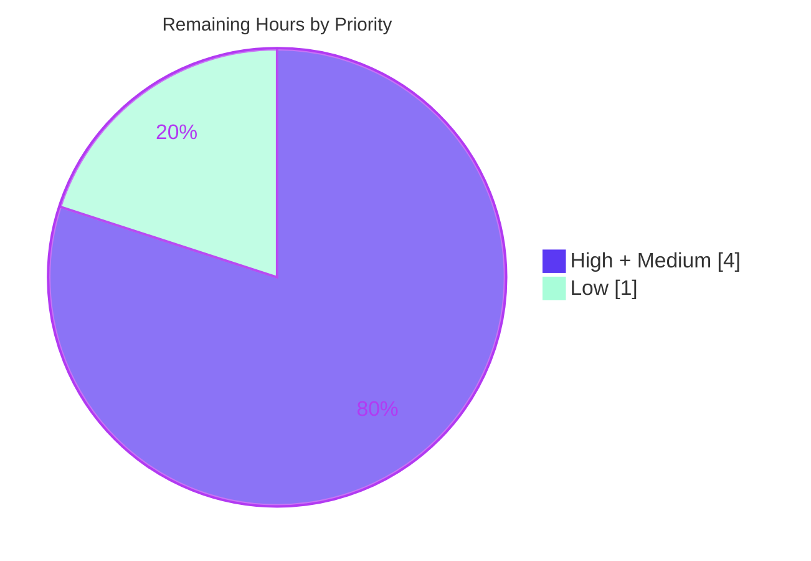

# Blitzy Project Guide — Grafana Clean-Start Ground-Truth Reference

> **Deliverable under review:** `blitzy/documentation/grafana_4550cfb5b728.md` — a runtime-observed reference documenting Grafana's first-launch behavior.
> **Task class:** Strictly read-only, investigative Q&A documentation (rule set *SWE-AtlasQnA-Repo*).
> **Repository HEAD (base):** `4550cfb5b72886782d9a3e6cf995f8dbd57ca4ff` · **Branch:** `blitzy-be62cb50-4773-4f3d-9f1d-158ac43cc059` · **Delivery HEAD:** `9cff98e366`

---

## 1. Executive Summary

### 1.1 Project Overview

This project delivers one authoritative Markdown reference — `blitzy/documentation/grafana_4550cfb5b728.md` — that explains, from **direct runtime observation**, exactly what Grafana does when started for the first time from a completely clean checkout with no configuration, and why subsequent runs behave differently. The target audience is developers and reviewers onboarding to Grafana who need *ground truth* (verified by building and running the code) rather than onboarding-doc impressions. It resolves five puzzles: why the server "just works," why later runs differ, how login works with credentials never set up, why unbidden plugins appear, and which generated files the build depends on. Scope is strictly read-only: no source code is created or modified — only the single documentation file is added.

### 1.2 Completion Status


| Metric | Hours |
|--------|-------|
| **Total Hours** | **43** |
| **Completed Hours (AI + Manual)** | **38** (AI 38 + Manual 0) |
| **Remaining Hours** | **5** |
| **Percent Complete** | **88.4%** — `38 / 43 × 100` |

> Completion is computed per the AAP-scoped PA1 methodology: `Completed ÷ (Completed + Remaining)`. 100% of the AAP autonomous scope is delivered and verified; the remaining 5h is exclusively **path-to-production human work** (technical sign-off, formatting decision, PR merge), which by definition cannot be performed autonomously.

### 1.3 Key Accomplishments

- ✅ **Single deliverable created & committed** — `blitzy/documentation/grafana_4550cfb5b728.md` (917 lines, 6,740 words, 47 code blocks, 31 tables).
- ✅ **Build-and-run-first methodology honored** — backend built (`make gen-go` → `go build -tags oss`, 298 MB) and the real `grafana server` entry point executed *before* writing.
- ✅ **All 10 sub-questions answered** (Q1a–Q5b), each with *Direct answer → captured command output → cause/effect reasoning*.
- ✅ **Run-to-run difference reproduced** — two identical clean starts diffed: `performed=626 skipped=0` (run 1) vs `performed=0 skipped=626` (run 2).
- ✅ **Security path observed at runtime** — `admin`/`admin` seeded by `ensureMainOrgAndAdminUser`; anonymous access confirmed disabled by default.
- ✅ **Plugin sourcing distinguished** — 49 `internal` plugins via `/api/plugins`; empty `data_source` table; loud remote pre-install failure documented.
- ✅ **Generated-file dependency proven** — negative build without `wire_gen.go` fails with `undefined: Initialize`; missing `public/build` shown non-fatal.
- ✅ **78 `file:line` citations audited EXACT** against live source; every runtime number verified.
- ✅ **Read-only compliance perfect** — cumulative diff = one added file (`+917/-0`); working tree byte-for-byte clean.

### 1.4 Critical Unresolved Issues

| Issue | Impact | Owner | ETA |
|-------|--------|-------|-----|
| _None._ No compilation errors, no failing validations, no missing AAP functionality, no out-of-scope changes. | — | — | — |

> There are **zero blocking issues**. The deliverable is complete, accurate, runtime-grounded, and committed. Items in §1.6 / §2.2 are normal path-to-production review steps, not defects.

### 1.5 Access Issues

| System/Resource | Type of Access | Issue Description | Resolution Status | Owner |
|-----------------|----------------|-------------------|-------------------|-------|
| _None identified_ | — | The build/run/observe workflow ran fully within the provided container (Go, GCC, Node, Yarn, Docker all available); no external credentials, private registries, or third-party APIs were required. | N/A | — |

> **No access issues identified.** The only remote interaction observed (a background `grafana-lokiexplore-app` pre-install) fails by design with `grafanaVersionNotCompatible` and is documented as-observed, not an access blocker.

### 1.6 Recommended Next Steps

1. **[High]** Have a Grafana-knowledgeable engineer perform a **technical-accuracy review & sign-off** of the reference document (optionally re-running the Appendix reproduction to confirm the runtime numbers on their host).
2. **[Medium]** **Approve and merge** the single-file pull request to the target branch.
3. **[Low]** Make a **Markdown formatting decision** — keep the reviewer-approved asterisk-emphasis/compact-table style, or run `yarn prettier --write` (non-gating; no pre-commit hook is installed).
4. **[Low]** If a live UI walkthrough is ever desired, build the frontend (`yarn install && yarn build`) to populate `public/build` — not required for the backend-focused answers in this document.

---

## 2. Project Hours Breakdown

### 2.1 Completed Work Detail

All rows below are AI/autonomous work, each traceable to a specific AAP requirement (methodology B, coverage C, evidence D, framing E).

| Component | Hours | Description |
|-----------|-------|-------------|
| Build environment & toolchain verification | 2 | Confirmed Go 1.23.1 (`go.mod:3`), GCC 15.2 (Cgo), Node, Yarn 4.5.3 (`package.json:453`) — the canonical build prerequisites. |
| Wire code generation + negative build proof | 2 | Ran `make gen-go` (`Makefile:167-169`) → `pkg/server/wire_gen.go`; proved backend won't compile without it (`undefined: Initialize`). |
| Backend compilation | 1 | `CGO_ENABLED=1 GOFLAGS=-mod=readonly go build -tags oss` → 298 MB self-contained binary (EXIT 0). |
| Dual clean-run execution + log capture | 3 | Ran the real `grafana server --homepath` entry point twice (run 1 clean, run 2 existing state); captured full startup logs. |
| Live-state evidence capture | 3 | Probed `/api/health` & `/api/plugins`; snapshotted `data/` tree; read `grafana.db` tables (`migration_log`, `user`, `data_source`). |
| Run-to-run diff & distribution analysis | 2 | Diffed run 1 vs run 2; established the stable `626/0` vs `0/626` signal and the honest ±1–2 line total-count band. |
| Q1 & Q2 authoring | 6 | Initialization + disabled/skipped-service correlation (`Server.Run`/`IsDisabled`); persistent state, on-disk locations, migrations & idempotency. |
| Q3 & Q4 authoring | 6 | Security defaults + admin-seed trace (`ensureMainOrgAndAdminUser`); three plugin sources, core registry, API correlation, remote-install failure. |
| Q5 authoring + edge/error/transitional states | 4 | Generated-file dependency, `public/build` non-fatal path, version banner, `go run` equivalence; boundary conditions reported as-observed. |
| Provenance + TL;DR + Appendix + docs-vs-reality | 3 | Build identity, exact commands, versions; one-paragraph solution; reproduction summary; 6-claim onboarding-docs comparison table. |
| Citation verification + web-search corroboration | 3 | Audited 78 `file:line` citations EXACT; corroborated canonical Grafana defaults (credentials, anonymous, defaults.ini) via external research. |
| Read-only cleanup/verification + code-review remediation | 3 | Removed all artifacts (tree clean); addressed code-review findings (commit `e9706b6305`) and added the run-to-run distribution note (`9cff98e366`). |
| **Total Completed** | **38** | Matches Completed Hours in §1.2. |

### 2.2 Remaining Work Detail

All remaining work is path-to-production **human** activity; there are **no outstanding AAP deliverables**.

| Category | Hours | Priority |
|----------|-------|----------|
| SME technical-accuracy review & sign-off of the ground-truth reference document | 3 | High |
| PR review & merge approval | 1 | Medium |
| Markdown formatting decision (`prettier` keep-vs-reformat; non-gating) | 1 | Low |
| **Total Remaining** | **5** | Matches Remaining Hours in §1.2 and §7 pie. |

> **Cross-section check:** §2.1 (38) + §2.2 (5) = **43** = Total Hours in §1.2. ✔

---

## 3. Test Results

> **Context.** No conventional unit/integration test suite applies to a Markdown deliverable, and the AAP explicitly places *test additions* out of scope. The applicable analog — and the mandated methodology — is **verification of every documented claim against live runtime**, executed by Blitzy's autonomous validation. The table below aggregates those autonomous validation checks; **every entry originates from Blitzy's autonomous build/run/observe logs for this project.**

| Test / Validation Category | Framework / Tool | Total | Passed | Failed | Coverage % | Notes |
|----------------------------|------------------|-------|--------|--------|-----------|-------|
| Dependency resolution | `go mod` (`-mod=readonly`) | 1 | 1 | 0 | n/a | `go mod download` EXIT 0; pinned versions confirmed (wire v0.6.0, migrate/v4 v4.7.0, go-sqlite3 v1.14.22, plugin-sdk-go v0.260.3, go-plugin v1.6.2). |
| Code generation (Wire) | `make gen-go` | 1 | 1 | 0 | n/a | Produced `pkg/server/wire_gen.go` (deterministic sha256 `87899e3d…`). |
| Backend compilation (positive) | `go build -tags oss`, `CGO_ENABLED=1` | 1 | 1 | 0 | n/a | 298 MB ELF binary, EXIT 0. |
| Build-dependency (negative) | `go build` without `wire_gen.go` | 1 | 1 | 0 | n/a | Fails exactly `pkg/server/service.go:31:15: undefined: Initialize` (expected — proves Q5a). |
| Runtime — Run 1 (clean start) | `grafana server` | 6 | 6 | 0 | n/a | DB created; `performed=626 skipped=0`; admin seeded; 54 plugins loaded; `:3000` listen; health ok. |
| Runtime — Run 2 (idempotent) | `grafana server` | 3 | 3 | 0 | n/a | `performed=0 skipped=626`; no DB re-create; no admin re-seed. |
| API verification | `curl` | 4 | 4 | 0 | n/a | `/api/health` db ok; `/api/plugins`=49 (all `internal`); 401 unauthenticated; `admin:admin` authorized. |
| Persistent-state verification | `python3 sqlite3` | 3 | 3 | 0 | n/a | `migration_log`=626; `user`=`[(1,'admin','admin@localhost',1)]`; `data_source`=0 rows. |
| Edge/error observation | runtime logs | 3 | 3 | 0 | n/a | `public/build` error non-fatal; missing-plugins path on both runs; `lokiexplore-app` install fails loudly. |
| Claim accuracy audit | `grep` vs source (78 citations) | 78 | 78 | 0 | 100% | Every `file:line` + runtime count verified **EXACT**. |
| Read-only compliance | `git status` / `git diff` | 1 | 1 | 0 | 100% | Only the deliverable added (`+917/-0`); tree byte-for-byte clean. |
| **Totals** | — | **102** | **102** | **0** | — | 100% pass rate across all autonomous validation checks. |

---

## 4. Runtime Validation & UI Verification

**Backend runtime (observed on the real `grafana server` entry point):**

- ✅ **Server boot & HTTP listener** — `HTTP Server Listen address=[::]:3000 protocol=http`.
- ✅ **Database creation & migration** — SQLite `data/grafana.db` created; `migrations completed performed=626 skipped=0`.
- ✅ **Admin account seeding** — `Created default admin user=admin`; `user` row `admin/admin@localhost/is_admin=1`.
- ✅ **Authentication** — basic auth enabled by default; `401` without credentials, authorized with `admin:admin`.
- ✅ **Health API** — `/api/health` → `{"database":"ok","version":"9.2.0","commit":"NA"}`.
- ✅ **Plugin API** — `/api/plugins` → 49 entries (30 panel + 19 datasource), all `signature=internal`.
- ✅ **Run-to-run idempotency** — second identical run: `performed=0 skipped=626`, no re-seed.

**Expected/by-design conditions (documented as-observed, not remediated):**

- ⚠ **Frontend `public/build` absent** — a backend-only build logs a **non-fatal** `Failed to detect generated javascript files in public/build` (`pkg/setting/setting.go:1034`) and still serves the API.
- ⚠ **Remote plugin pre-install** — background attempt to install `grafana-lokiexplore-app` fails with `grafanaVersionNotCompatible` (proves nothing is *silently* fetched).

**UI verification:** ❌ **Not applicable / not in scope.** The AAP deliverable is a documentation file; no user interface was built or modified, and no design system, component library, or Figma frame was provided (AAP §0.9). The investigation was deliberately backend-focused; no UI screenshots are warranted.

---

## 5. Compliance & Quality Review

Cross-mapping of the *SWE-AtlasQnA-Repo* rule set and Blitzy quality benchmarks to delivery status.

| Benchmark / Rule | Requirement | Status | Evidence |
|------------------|-------------|--------|----------|
| Deliverable rule | One `<branch>.md` in `blitzy/documentation/` answering the questions | ✅ Pass | `blitzy/documentation/grafana_4550cfb5b728.md` created & committed. |
| Methodology — build & run first | Build/run code paths before writing | ✅ Pass | `make gen-go` → `go build` → `grafana server` executed pre-authoring. |
| Methodology — magnitude stable ≥2 runs | Confirm values across repeated runs | ✅ Pass | `626/0` vs `0/626` stable; total-line jitter (±1–2) disclosed honestly. |
| Methodology — reproduce inconsistency | Run identical input repeatedly; report distribution | ✅ Pass | Dual identical clean starts; Q2b distribution note. |
| Methodology — real entry point | Observe via `grafana server`, not a bypass | ✅ Pass | Canonical subcommand + `--homepath`; no debug hook. |
| Methodology — default canonical config | Default config; state exact commands | ✅ Pass | `conf/defaults.ini`, no `custom.ini`/`GF_*`; commands in Provenance. |
| Methodology — edge/error/transitional | Exercise beyond the happy path | ✅ Pass | Edge/error section (3 boundary conditions) + before/during/after state table. |
| Evidence — actual output + command | Unedited output beside each claim | ✅ Pass | 47 fenced blocks pairing command → captured output. |
| Evidence — `file:line` + named symbol | Exact reference + function/struct | ✅ Pass | 78 citations; `ensureMainOrgAndAdminUser`, `IsDisabled`, `validateStaticRootPath`, `ProvideCoreRegistry`, etc. |
| Evidence — label inferred vs observed | Mark inferred statements | ✅ Pass | `(inferred)` convention used; all else observed. |
| Coverage — every sub-question | Answer Q1a–Q5b explicitly | ✅ Pass | 10/10 sub-questions with Direct answer + evidence + reasoning. |
| Scope — no existing file modified | Read-only | ✅ Pass | Diff = single added file; `git status` clean. |
| Scope — no code added but the doc | Only the deliverable committed | ✅ Pass | Name-status `A`, `+917/-0`. |
| Scope — temp artifacts removed | Leave repo unchanged | ✅ Pass | `wire_gen.go`/`public/build`/`data`/`bin` verified absent. |
| Quality — Markdown structural validity | Balanced fences, well-formed tables | ✅ Pass | 94 fence lines (balanced); 31 table rows; zero trailing whitespace. |
| Quality — Prettier formatting | `prettier --check` clean | ⚠ Partial | Flags deliberate asterisk/compact-table style; **non-gating** (no pre-commit hook). Human keep-vs-reformat decision (§2.2 R-2). |

---

## 6. Risk Assessment

| Risk | Category | Severity | Probability | Mitigation | Status |
|------|----------|----------|-------------|------------|--------|
| Version drift — runtime values (`9.2.0`, 626 migrations, 54/49 plugins) are pinned to HEAD `4550cfb5`; a newer base could change counts | Technical | Low | Low | Provenance pins the exact HEAD commit; re-run the Appendix reproduction if the base advances | Mitigated |
| Environment value variance — container Node `v22.23.1` vs repo-pinned `.nvmrc` `v22.11.0` | Technical | Low | N/A | Explicitly reconciled and labeled in Q5b/Provenance | Resolved |
| Build reproducibility — requires Wire regeneration + GCC/Cgo; a reader lacking the toolchain cannot rebuild | Technical | Low | Low | Exact commands and versions documented in Provenance & Appendix | Mitigated |
| Sensitive data exposure | Security | Informational | N/A | Read-only Markdown, no secrets; documents only the canonical public `admin`/`admin` default (upstream-documented; forced change on first login) | N/A |
| Prettier non-compliance | Operational | Low | Certain (harmless) | Non-gating (no pre-commit hook); human decides keep-vs-reformat | Open (non-blocking) |
| Build/runtime artifact leakage into the tree | Operational | Low | None | Cleanup performed; `wire_gen.go`/`public/build`/`data`/`bin` gitignored & verified absent | Mitigated |
| External/service integration failure | Integration | None | N/A | No deployable, no external service, no API keys; the one remote pre-install fails loudly and is documented as-observed | N/A |

---

## 7. Visual Project Status

**Project hours — completed vs remaining** (Completed = Dark Blue `#5B39F3`, Remaining = White `#FFFFFF`):


**Remaining work by priority** (5h total):



> **Integrity:** the pie "Remaining Work" value (**5**) equals Remaining Hours in §1.2 and the sum of the §2.2 Hours column (3 + 1 + 1 = 5). ✔

---

## 8. Summary & Recommendations

**Achievements.** The project delivers a single, high-fidelity, runtime-observed reference that resolves every question the requester posed about Grafana's clean-start behavior. The mandated *build-and-run-first* methodology was followed exactly: the backend was generated and compiled, the real `grafana server` entry point was executed twice, and every behavioral claim is paired with the command that produced it and a specific `file:line` citation naming the responsible function or struct. All 10 sub-questions (Q1a–Q5b) are answered; the run-to-run difference is reproduced; and edge/error/transitional states are captured as-observed.

**Remaining gaps.** There are **no outstanding AAP deliverables** and **no defects**. The remaining 5 hours are path-to-production human activities that cannot be performed autonomously: a subject-matter technical-accuracy review and sign-off (3h), a pull-request approval and merge (1h), and a non-gating Markdown formatting decision (1h).

**Critical path to production.** SME accuracy review → PR approval & merge → (optional) formatting decision. Because the change is a single additive document with a byte-for-byte clean working tree and no build/deploy footprint, the path is short and low-risk.

**Production readiness.** The deliverable is **production-ready** at **88.4% overall completion** (38h of 43h). The 11.6% remainder reflects mandatory human sign-off of a ground-truth reference — appropriate per honest-assessment principles (a factual reference cannot self-certify), not a deficiency in the delivered work.

| Success Metric | Result |
|----------------|--------|
| AAP deliverable created | ✅ 1/1 file |
| Sub-questions answered (Q1a–Q5b) | ✅ 10/10 |
| Claim citations audited EXACT | ✅ 78/78 |
| Autonomous validation checks passed | ✅ 102/102 |
| Read-only compliance | ✅ Clean tree (`+917/-0`) |
| Overall completion | **88.4%** |

---

## 9. Development Guide

> This guide reproduces the exact build/run/observe workflow behind the deliverable. Every command was confirmed runnable in the project container (Go 1.23.1, GCC 15.2, Node v22.23.1, Yarn 4.5.3, make 4.4.1, curl 8.14.1, python3 3.13.7 with sqlite3 3.46.1).

### 9.1 System Prerequisites

- **Go 1.23.1** (`go.mod:3`) — backend compiler/runtime.
- **GCC** (Cgo) — **required** for the SQLite driver; build with `CGO_ENABLED=1`.
- **GNU Make** — to run the `gen-go` target.
- **Node v22.11.0** (`.nvmrc`) + **Yarn 4.5.3** (`package.json:453`) — *only* needed to build the frontend (`public/build`). A backend-only build serves the API without it.
- **curl** and **python3** (with the `sqlite3` module) — for verification probes (the `sqlite3` CLI is not required).
- **OS/Hardware:** Linux; ~5.5 GB for the repo checkout and ~300 MB for the built binary.

### 9.2 Environment Setup

No environment variables are required for a default first run. The default configuration is read from `conf/defaults.ini`; do **not** create a `custom.ini` or set `GF_*` variables if you want to observe canonical first-run behavior.

```bash
cd <repository-root>          # the directory containing conf/defaults.ini and pkg/cmd/grafana
```

### 9.3 Dependency Installation

```bash
# Backend modules (already vendored/cached in the container; -mod=readonly guarantees no mutation)
GOFLAGS=-mod=readonly go mod download

# (Optional) Frontend dependencies — only if you intend to build the UI (public/build)
# corepack enable && yarn install --immutable
```

### 9.4 Build

```bash
# STEP 1 (REQUIRED): generate the Google Wire dependency-injection code.
# Without pkg/server/wire_gen.go the backend does NOT compile.
# Recipe: Makefile:167-169 -> go run ./pkg/build/wire/cmd/wire/main.go gen -tags oss ./pkg/server
make gen-go

# STEP 2: build the single self-contained server binary (Cgo ON for SQLite).
CGO_ENABLED=1 GOFLAGS=-mod=readonly go build -tags oss -o /tmp/grafana ./pkg/cmd/grafana
```

### 9.5 Application Startup

```bash
# The real, canonical entry point. `server` is the subcommand; --homepath locates conf/defaults.ini.
/tmp/grafana server --homepath="$(pwd)" > /tmp/run1.log 2>&1 &
run1_pid=$!            # capture PID so you can stop EXACTLY this process later (never use pkill)
sleep 8               # allow bootstrap: DB creation, 626 migrations, admin seed, plugin load, :3000 listen
```

The server listens on **`http://localhost:3000`** (`conf/defaults.ini:41`).

### 9.6 Verification

```bash
# Health (database + build identity)
curl -s http://localhost:3000/api/health
# -> {"commit":"NA","database":"ok","version":"9.2.0"}

# Plugins available through the API (expect 49, all signature=internal)
curl -s -u admin:admin http://localhost:3000/api/plugins | python3 -c 'import sys,json;print(len(json.load(sys.stdin)))'
# -> 49

# Unauthenticated request is rejected
curl -s -o /dev/null -w '%{http_code}\n' http://localhost:3000/api/plugins   # -> 401

# Persistent state written to disk
python3 - <<'PY'
import sqlite3
c = sqlite3.connect("data/grafana.db")
print("migration_log:", c.execute("SELECT COUNT(*) FROM migration_log").fetchone()[0])   # -> 626
print("user         :", c.execute("SELECT id, login, email, is_admin FROM user").fetchall())  # -> [(1,'admin','admin@localhost',1)]
print("data_source  :", c.execute("SELECT COUNT(*) FROM data_source").fetchone()[0])      # -> 0
PY

# Stop run 1 with a targeted shutdown (frees :3000). NEVER pkill.
kill "$run1_pid"; wait "$run1_pid" 2>/dev/null || true
```

### 9.7 Example Usage — Reproduce the Run-to-Run Difference

```bash
# Run 2: identical command, but data/ now holds run 1's state.
/tmp/grafana server --homepath="$(pwd)" > /tmp/run2.log 2>&1 &
run2_pid=$!; sleep 8
kill "$run2_pid"; wait "$run2_pid" 2>/dev/null || true

# The decisive, deterministic difference:
grep "migrations completed" /tmp/run1.log | grep -v resource-migrator   # performed=626 skipped=0
grep "migrations completed" /tmp/run2.log | grep -v resource-migrator   # performed=0   skipped=626
echo "run1 lines: $(wc -l < /tmp/run1.log)   run2 lines: $(wc -l < /tmp/run2.log)"   # ~1357 vs ~62
```

### 9.8 Cleanup (restore a clean tree / genuine first-run baseline)

```bash
rm -rf data                      # gitignored (.gitignore:72) — removes DB/logs to re-observe a true first run
rm -f  pkg/server/wire_gen.go    # gitignored (.gitignore:194)
rm -rf public/build              # gitignored (.gitignore:9)
rm -f  /tmp/grafana /tmp/run1.log /tmp/run2.log
git status --porcelain           # expect empty (byte-for-byte clean)
```

### 9.9 Troubleshooting

- **`pkg/server/service.go:31:15: undefined: Initialize`** → You skipped Wire codegen. Run `make gen-go` before `go build`.
- **`Failed to detect generated javascript files in public/build`** → **Non-fatal** (`pkg/setting/setting.go:1034`); the API serves normally. Build the UI with `yarn install && yarn build` only if you need the frontend.
- **`bind: address already in use` on :3000** → A previous run is still up. Stop it via its captured PID (`kill "$run1_pid"; wait "$run1_pid"`); never `pkill`.
- **`grafana-lokiexplore-app … grafanaVersionNotCompatible`** → Expected background pre-install failure on the default toggles; non-fatal.
- **SQLite build errors / `cgo: C compiler "gcc" not found`** → Install GCC and build with `CGO_ENABLED=1`.

---

## 10. Appendices

### A. Command Reference

| Purpose | Command |
|---------|---------|
| Generate Wire code (required) | `make gen-go` |
| Build backend binary | `CGO_ENABLED=1 GOFLAGS=-mod=readonly go build -tags oss -o /tmp/grafana ./pkg/cmd/grafana` |
| Run server (canonical) | `/tmp/grafana server --homepath="$(pwd)"` |
| `go run` equivalent (version) | `go run -tags oss ./pkg/cmd/grafana -v` → `grafana version 9.2.0` |
| Health probe | `curl -s http://localhost:3000/api/health` |
| Plugins probe | `curl -s -u admin:admin http://localhost:3000/api/plugins` |
| Inspect DB | `python3 -c "import sqlite3; ..."` (see §9.6) |
| Verify clean tree | `git status --porcelain` |

### B. Port Reference

| Port | Service | Source |
|------|---------|--------|
| 3000 | Grafana HTTP server (API + UI) | `conf/defaults.ini:41` (`http_port = 3000`) |

### C. Key File Locations

| Path | Role |
|------|------|
| `blitzy/documentation/grafana_4550cfb5b728.md` | **The deliverable** (the only added file) |
| `pkg/cmd/grafana/main.go` | Real entry point; hardcoded `version/commit/branch` (`L16-21`) |
| `pkg/server/server.go` | `Init()`/`Run()` lifecycle; background-service loop (`L113,L139-150`) |
| `pkg/server/wire.go` → `pkg/server/wire_gen.go` | Wire provider set → generated DI code (build dependency) |
| `pkg/registry/registry.go` | `IsDisabled` skip logic (`L53-56`) |
| `conf/defaults.ini` | Canonical default configuration (paths, server, database, security, auth) |
| `pkg/setting/setting.go` | Binds ini → `Cfg`; non-fatal `public/build` error (`L1034-1043`) |
| `pkg/services/sqlstore/sqlstore.go` | DB connect; `ensureMainOrgAndAdminUser`; "Created default admin" (`L190,L222`) |
| `pkg/plugins/backendplugin/coreplugin/registry.go` | Compiled-in core plugin registry (`L89-102`) |
| `data/grafana.db` | Runtime SQLite state (created on first run; gitignored) |

### D. Technology Versions

| Component | Version | Source |
|-----------|---------|--------|
| Go | 1.23.1 | `go.mod:3` |
| GCC (Cgo) | 15.2 (container) | observed |
| Node.js | v22.11.0 (pinned) / v22.23.1 (container) | `.nvmrc` / observed |
| Yarn | 4.5.3 | `package.json:453` |
| google/wire | v0.6.0 | `go.mod` |
| golang-migrate/v4 | v4.7.0 | `go.mod` |
| mattn/go-sqlite3 | v1.14.22 | `go.mod` |
| grafana-plugin-sdk-go | v0.260.3 | `go.mod` |
| hashicorp/go-plugin | v1.6.2 | `go.mod` |
| Grafana build identity | `version=9.2.0 commit=NA branch=main` | `pkg/cmd/grafana/main.go:16-21` (default-build value) |

### E. Environment Variable Reference

| Variable | Required? | Notes |
|----------|-----------|-------|
| _(none)_ | No | A default first run needs **no** environment variables. `GF_*` overrides and `custom.ini` are *illustrative contrast only* and were deliberately **not** set, so `conf/defaults.ini` is the effective configuration. |

### F. Developer Tools Guide

| Tool | Use in this project |
|------|---------------------|
| `make gen-go` | Generates `pkg/server/wire_gen.go` (mandatory pre-build step). |
| `go build` / `go run` | Compile or run the backend; `go run -tags oss ./pkg/cmd/grafana -v` matches the built binary's version output. |
| `curl` | Probe `/api/health` and `/api/plugins` at runtime. |
| `python3` `sqlite3` | Read `data/grafana.db` tables (`migration_log`, `user`, `data_source`) — no `sqlite3` CLI needed. |
| `git status` / `git diff` | Verify strict read-only compliance and the single-file diff. |
| `yarn prettier` | Optional Markdown formatting (non-gating; no pre-commit hook installed). |

### G. Glossary

| Term | Meaning |
|------|---------|
| **Wire / `wire_gen.go`** | Google Wire compile-time dependency-injection code generator; its output is required before `pkg/cmd/grafana` compiles. |
| **`migration_log`** | SQLite table recording the 626 applied schema migrations; the mechanism behind idempotent restarts. |
| **`ensureMainOrgAndAdminUser`** | The `SQLStore` method that seeds the default org and `admin` account, short-circuiting when users already exist. |
| **`IsDisabled`** | Registry helper that silently skips a background service when it implements `CanBeDisabled` and reports disabled. |
| **`internal` (plugin signature)** | Signature marking a compiled-in core plugin (vs. externally installed/signed plugins). |
| **`--homepath`** | The `grafana server` flag pointing at the repo root so `conf/defaults.ini` is discovered. |
| **Path-to-production** | Standard human activities (review, sign-off, merge) required to move validated work to production; the sole content of the Remaining hours here. |

---

*Guide generated per the Blitzy Project Guide Template. Cross-section integrity verified: §1.2 Remaining (5) = §2.2 sum (5) = §7 pie Remaining (5); §2.1 (38) + §2.2 (5) = §1.2 Total (43); completion 38 ÷ 43 = 88.4% used consistently throughout; all Section 3 results originate from Blitzy's autonomous validation logs. Colors: Completed `#5B39F3`, Remaining `#FFFFFF`.*