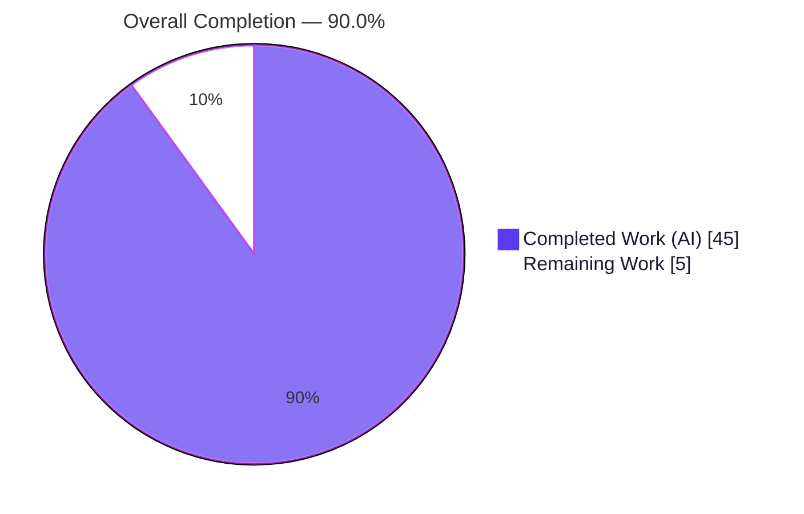
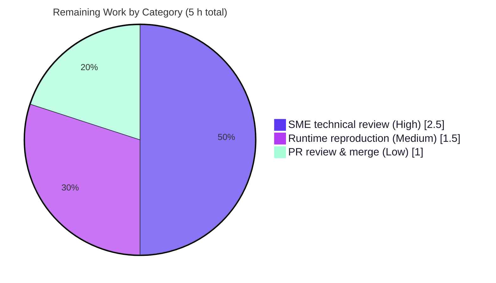

# Blitzy Project Guide — Grafana Runtime Investigation (`grafana_4550cfb5b728`)

## 1. Executive Summary

### 1.1 Project Overview

This project delivers a single, evidence-grounded technical answer document — `blitzy/documentation/grafana_4550cfb5b728.md` — that definitively answers five runtime-behavior questions about Grafana at head commit `4550cfb5b72886782d9a3e6cf995f8dbd57ca4ff` ("Upgrade scenes to v5.32.0"). It is a strictly **read-only investigation**: the backend was built and run canonically, the frontend Jest suites were executed, and every behavioral claim is backed by actual captured runtime output plus exact `file:line` code references. The audience is Grafana maintainers and reviewers who need authoritative, reproducible answers about idle logging, database migrations, the build/version API, the dashboard-scene datasource picker, and alerting rule-edit query state. No production code was created or modified.

### 1.2 Completion Status



| Metric | Value |
|--------|-------|
| **Total Hours** | 50 |
| **Completed Hours (AI + Manual)** | 45 (45 AI + 0 Manual) |
| **Remaining Hours** | 5 |
| **Percent Complete** | **90.0%** |

> Completion is computed on AAP-scoped hours only: `Completed ÷ (Completed + Remaining) = 45 ÷ 50 = 90.0%`. All autonomous investigation, authoring, and cleanup work is complete and validated; the remaining 5 hours are human path-to-production activities (SME technical review, independent reproduction, and merge).

### 1.3 Key Accomplishments

- ✅ **Sole deliverable authored, committed, and validated** — `blitzy/documentation/grafana_4550cfb5b728.md` (1,131 lines, 120 balanced code fences, 97 `file:line` citations, 16 observed-vs-inferred labels).
- ✅ **All five questions answered with direct-answer-first + captured runtime evidence** — Q1 (idle logs), Q2 (migration), Q3 (version), Q4 ("YES"), Q5 ("YES").
- ✅ **Backend built canonically** via `make gen-go` → `make build-backend` (ldflags `-X main.version=11.5.0-pre`); binary self-reports `11.5.0-pre`.
- ✅ **Runtime evidence reproduced** — server boots under unmodified `conf/defaults.ini`; `/api/health` returns `11.5.0-pre`; migrator reports `performed=626`+`18` (first boot) and `performed=0` (second boot).
- ✅ **Frontend suites green** — Q4 `PanelDataQueriesTab.test.tsx` 25/25 passed; Q5 temporary spec 6/6 passed (created, captured, then deleted).
- ✅ **Read-only integrity perfect** — all 20 REFERENCE source files byte-for-byte unchanged; working tree clean; no temp artifacts left in the tree.

### 1.4 Critical Unresolved Issues

| Issue | Impact | Owner | ETA |
|-------|--------|-------|-----|
| _None blocking._ All five gates passed; deliverable committed and scope-compliant. | No release blocker. | — | — |
| Q1 contention-line (`sqlstore.transactions` "Database locked…") is inherently non-deterministic at the 10-minute cleanup boundary (present in run iB, absent in iA). | Informational only — already transparently documented as contention-dependent; core Q1 answer unaffected. | Human SME (verification) | Within HT-1 (2.5 h) |

### 1.5 Access Issues

| System/Resource | Type of Access | Issue Description | Resolution Status | Owner |
|-----------------|----------------|-------------------|-------------------|-------|
| — | — | **No access issues identified.** The investigation ran entirely within the local checkout using the bundled toolchain (Go 1.23.1, Node, Yarn 4.5.3); no external credentials, registries, or third-party services were required. | N/A | — |

### 1.6 Recommended Next Steps

1. **[High]** Perform SME technical review of the five answers and spot-check a sample of the 97 `file:line` citations at commit `4550cfb5b7` (HT-1, 2.5 h).
2. **[Medium]** Independently reproduce the runtime observations — build, boot, `curl /api/health`, run Q4/Q5 Jest — accepting the documented Q1 contention non-determinism (HT-2, 1.5 h).
3. **[Low]** Review the PR for scope compliance (single file added, 20 REFERENCE files unchanged), then approve and merge (HT-3, 1.0 h).

---

## 2. Project Hours Breakdown

### 2.1 Completed Work Detail

| Component | Hours | Description |
|-----------|-------|-------------|
| Backend build & toolchain foundation | 5 | Wire code generation (`make gen-go` → gitignored `pkg/server/wire_gen.go`), canonical backend build (`make build-backend`, ldflags `-X main.version=11.5.0-pre`), and frontend/test dependency provenance (immutable Yarn install, Jest 29.7.0). |
| Q1 — Idle recurring logs investigation | 9 | Multi-run (info + debug, ~12 min) idle observation; enumeration of every recurring emitter; 10-minute INFO tickers + 10 DEBUG sub-minute emitters; contention-line iA/iB non-determinism analysis; correlation to responsible code. |
| Q2 — DB migration check investigation | 4 | First boot (`performed=626`+`18`), second boot (`performed=0`, `skipped=626`/`18`), debug per-migration skip reconciliation to 644; responsible code + cause→effect. |
| Q3 — Build/version via API investigation | 5 | `/api/health`, `/api/frontend/settings` `buildInfo`, startup banner, `/healthz`, `401` unauth, `hide_version` contrast, and canonical-vs-`go run` build-method dependency (`11.5.0-pre` vs `9.2.0`). |
| Q4 — Datasource-picker Jest investigation | 4 | Ran `PanelDataQueriesTab.test.tsx` (25 tests); analyzed all three datasource resolution branches; traced responsible code; direct answer "YES". |
| Q5 — Rule-edit query-state Jest investigation | 4 | Authored/ran/deleted a temporary spec (6 tests) exercising `rulerRuleToFormValues`/`formValuesFromExistingRule` incl. boundary cases; traced responsible code; direct answer "YES". |
| Answer-document assembly | 8 | Assembled the 1,131-line document: methodology, per-question direct answers, embedded commands + captured output, 97 `file:line` citations, cause→effect, and observed-vs-inferred discipline. |
| QA remediation & runtime re-verification | 4 | ≥5 QA-driven rounds across 8 commits: F1–F3 re-verification, idempotent/reproducible procedure, provenance redaction, and the Q1-b contention correction. |
| Cleanup & repository-integrity verification | 2 | Removed all temporary scripts/tests; verified the 20 REFERENCE files byte-for-byte unchanged and the working tree clean. |
| **Total Completed** | **45** | |

### 2.2 Remaining Work Detail

| Category | Hours | Priority |
|----------|-------|----------|
| SME technical review of Q1–Q5 answers + citation spot-check | 2.5 | High |
| Runtime reproduction / independent verification (build, boot, `curl`, Jest) | 1.5 | Medium |
| PR review, scope-compliance confirmation & merge | 1.0 | Low |
| **Total Remaining** | **5.0** | |

> **Integrity check:** Section 2.1 (45 h) + Section 2.2 (5 h) = **50 h** = Total Project Hours (Section 1.2). Remaining hours (5 h) are identical in Sections 1.2, 2.2, and 7.

---

## 3. Test Results

All tests below originate from Blitzy's autonomous validation logs for this project (Jest 29.7.0, `jest.config.js`), executed non-interactively with `--ci --watchAll=false`.

| Test Category | Framework | Total Tests | Passed | Failed | Coverage % | Notes |
|---------------|-----------|-------------|--------|--------|------------|-------|
| Q4 — Panel-edit datasource picker (component/unit) | Jest 29.7.0 + RTL | 25 | 25 | 0 | n/a¹ | Existing suite `PanelDataQueriesTab.test.tsx`; exercises all 3 datasource resolution branches (existing-ref, last-used, unknown-ref→default). |
| Q5 — Alerting rule-form conversion (unit) | Jest 29.7.0 | 6 | 6 | 0 | n/a¹ | **Temporary** spec (created → run → deleted) exercising `rulerRuleToFormValues`/`formValuesFromExistingRule`, incl. empty-data, undefined-data, missing-discriminator throw, and hidden-query normalization boundary cases. |
| **Total** | **Jest 29.7.0** | **31** | **31** | **0** | **n/a¹** | **100% pass rate.** |

¹ Coverage percentage was not computed: these are targeted behavioral suites run without `--coverage`. Branch/scenario coverage is complete for the questions asked — Q4 covers all three resolution branches; Q5 covers the ordinary populated case plus four boundary cases.

**Non-test runtime gates (see Section 4):** backend build exited `0`; server booted under `conf/defaults.ini`; migrations executed; idle logs captured across ≥2 runs.

---

## 4. Runtime Validation & UI Verification

**Backend runtime (Q1–Q3), observed on a canonical build under unmodified `conf/defaults.ini`:**

- ✅ **Canonical build** — `make gen-go` → `make build-backend` exited `0`; `./bin/linux-amd64/grafana --version` → `grafana version 11.5.0-pre`.
- ✅ **Server boot** — starts on loopback under embedded SQLite; reaches "HTTP Server Listen"/`/api/health` readiness (observed ready in ~4 s during independent re-verification).
- ✅ **Q2 migrations** — first boot `performed=626` (`migrator`) + `18` (`resource-migrator`); second boot `performed=0`, `skipped=626`/`18` (schema up-to-date signal).
- ✅ **Q3 `/api/health`** — returns `{"database":"ok","version":"11.5.0-pre","commit":…}`.
- ✅ **Q3 `/api/frontend/settings`** — `buildInfo.version = "11.5.0-pre"`.
- ✅ **Q3 `/healthz`** — returns `Ok`; unauthenticated protected route → `401`; `hide_version=true` drops the version field.
- ✅ **Q1 idle logs** — no recurring INFO in the first 60 s (direct answer); 10-minute INFO tickers (`plugins.update.checker`, `cleanup`) confirmed across two runs; 10 DEBUG sub-minute emitters enumerated.
- ⚠ **Q1 contention line** — `sqlstore.transactions` "Database locked, sleeping then retrying" is contention-triggered and **non-deterministic** at the cleanup boundary (present iB, absent iA); reliable at startup/shutdown. Documented as such.

**Frontend UI-state verification (Q4–Q5) — verified programmatically via Jest (no browser UI was built or altered):**

- ✅ **Q4 datasource picker** — Operational. The picker resolves to and displays the datasource already defined in the panel's existing queries (`queryRunner.state.datasource`); last-used/default are fallbacks. Proven by 25/25 passing tests.
- ✅ **Q5 rule-edit query state** — Operational. The backend rule definition's `grafana_alert.data` populates the form's `queries` state on edit-view open. Proven by 6/6 passing tests.

_No web UI, screenshots, or browser automation are applicable — Q4/Q5 concern observed UI-state behavior verified through unit tests, per the AAP._

---

## 5. Compliance & Quality Review

Cross-mapping of AAP deliverables and the five user Rules to Blitzy quality benchmarks.

| AAP / Rule Requirement | Benchmark | Status | Progress | Notes |
|------------------------|-----------|--------|----------|-------|
| Sole deliverable at mandated path `blitzy/documentation/grafana_4550cfb5b728.md` | Correct artifact & location | ✅ Pass | 100% | Exists; committed; only tracked change. |
| Q1 — enumerate every recurring idle-log emitter with captured output | Complete & precise answering | ✅ Pass | 100% | Direct answer + Q1-a…e + coverage; ≥2 runs; info+debug. |
| Q2 — capture startup output confirming schema up-to-date | Observed-output discipline | ✅ Pass | 100% | Both boots; `performed=0` signal; skip reconciliation. |
| Q3 — report exact version string via API with evidence | Canonical build/config | ✅ Pass | 100% | `11.5.0-pre` via health/frontend-settings/banner; build-method caveat stated. |
| Q4 — test-script output + responsible code; lead with yes/no | Faithful instruction-following | ✅ Pass | 100% | "YES"; 25/25; `file:line` trace. |
| Q5 — test-script output + responsible code; lead with yes/no | Faithful instruction-following | ✅ Pass | 100% | "YES"; 6/6 temp spec; `file:line` trace. |
| Rule 1 — Run-first persistent investigation | Real entry points, ≥2-run stability | ✅ Pass | 100% | All values from running server / real Jest functions. |
| Rule 2 — Exhaustive condition & evidence coverage | Full unedited output per condition | ✅ Pass | 100% | Complete captured output beside each claim. |
| Rule 3 — Observed-vs-inferred discipline | Label inferred statements | ✅ Pass | 100% | 16 "inferred" labels present. |
| Rule 4 — Complete, precise, grounded answering | Direct-answer-first, `file:line` | ✅ Pass | 100% | 5 direct-answer leads; 97 citations. |
| Main Rule — read-only; clean up temp artifacts | Repo unchanged except deliverable | ✅ Pass | 100% | 20 REFERENCE files unchanged; Q5 temp spec removed; tree clean. |
| No dependency changes | Manifests untouched | ✅ Pass | 100% | `go.mod`, `package.json`, `.nvmrc` unmodified. |

**Fixes applied during autonomous validation:** the Q1-b contention line was corrected from "never appears at the cleanup boundary" to "non-deterministic at the cleanup boundary (iB present, iA absent)" after a fresh run surfaced it — strengthening reproducibility (commit `30aa7fefeb`). Prior QA rounds resolved citation accuracy, idempotency of the procedure, and redaction of volatile build provenance.

**Outstanding quality items:** none autonomous. Human SME sign-off on technical correctness is the remaining gate (HT-1).

---

## 6. Risk Assessment

| Risk | Category | Severity | Probability | Mitigation | Status |
|------|----------|----------|-------------|------------|--------|
| Q1 contention line (`Database locked…`) non-deterministic at cleanup boundary | Technical | Low | Medium | Documented explicitly as contention-dependent; both iA/iB runs shown; core Q1 answer unaffected | Mitigated / Documented |
| `file:line` citations could drift if read against a different Grafana version | Technical | Low | Low | Document pins commit `4550cfb5b7` and confirms source byte-for-byte unchanged | Mitigated |
| Q1 60 s window is recurrence-free (sparse/negative) — could read as incomplete | Technical | Low | Low | Leads with the direct negative answer; extends to ~12 min + debug capture | Mitigated |
| No production/dependency/auth changes → no new attack surface; provenance redacted | Security | Informational | Low | Loopback-only runs; paths off-tree; volatile provenance redacted (no secrets) | N/A (no security-impacting change) |
| Build order: `make gen-go` must precede `make build-backend` | Operational | Low | Medium | Development Guide (Section 9) documents exact order | Mitigated |
| Jest default `test` script runs watch mode (hangs automation) | Operational | Low | Low | Guide mandates `--ci --watchAll=false`; never bare `yarn test` | Mitigated |
| Pre-existing `jest-haste-map` duplicate-mock warnings | Integration | Informational | — | Unrelated monorepo state; no effect on results; labeled as pre-existing | Documented / Accepted |
| Node version delta (env `v22.23.1` vs `.nvmrc v22.11.0`) | Integration | Low | Low | `.nvmrc` left unmodified; `v22.23.x` satisfies engine | Mitigated / Documented |

**Overall risk posture: LOW.** No blocking risks. As a read-only documentation deliverable with zero production-code changes, the classic technical/security/operational/integration risk surfaces are largely inapplicable; the only residual is the transparently-documented Q1 contention non-determinism.

---

## 7. Visual Project Status


**Remaining hours by category (Section 2.2):**



> **Integrity check:** the pie chart "Remaining Work" (5) equals Section 1.2 Remaining Hours (5) and the sum of the Section 2.2 "Hours" column (2.5 + 1.5 + 1.0 = 5). "Completed Work" (45) equals Section 1.2 Completed Hours and the Section 2.1 total.

---

## 8. Summary & Recommendations

**Achievements.** The project is **90.0% complete** on an AAP-scoped basis (45 of 50 hours). Every requirement in the Agent Action Plan has been delivered: the single mandated answer document exists, is committed, and comprehensively answers all five runtime questions with direct-answer-first structure, embedded commands and captured output, 97 `file:line` citations, and rigorous observed-vs-inferred labeling. The backend was built and run canonically (reporting `11.5.0-pre`), the frontend Jest suites pass (25/25 and 6/6), and the repository's read-only integrity is perfect — all 20 investigated source files are byte-for-byte unchanged and no temporary artifacts remain.

**Remaining gaps.** The outstanding 5 hours are entirely **human path-to-production** activities: SME technical review of the answers, independent reproduction of the runtime observations, and PR review/merge. There is no remaining engineering or authoring work.

**Critical path to production.** SME review (HT-1) → independent reproduction (HT-2) → PR merge (HT-3). None is blocking; all are verification/acceptance gates.

**Success metrics.**

| Metric | Target | Actual |
|--------|--------|--------|
| Questions answered with runtime evidence | 5 / 5 | 5 / 5 ✅ |
| Jest tests passing | 100% | 31 / 31 (100%) ✅ |
| REFERENCE source files unchanged | 20 / 20 | 20 / 20 ✅ |
| Tracked changes beyond the deliverable | 0 | 0 ✅ |
| Direct-answer leads / inferred labels | 5 / present | 5 / 16 ✅ |

**Production readiness assessment.** The deliverable is **production-ready pending human acceptance**. Because it is a documentation artifact, "production" means the answers are reviewed for correctness by a Grafana SME and the document is merged. Recommended action: proceed with HT-1 → HT-2 → HT-3.

---

## 9. Development Guide

This guide reproduces the investigation environment. All commands were executed successfully in the validation environment (Linux/amd64) and are copy-pasteable. Run from the repository root.

### 9.1 System Prerequisites

- **OS:** Linux (amd64) — validated on Ubuntu-class containers.
- **Go:** 1.23.1 (matches `go.mod`). Verify: `go version` → `go version go1.23.1 linux/amd64`.
- **Node.js:** `v22.11.0` per `.nvmrc` (`v22.23.x` also satisfies the engine). Verify: `node --version`.
- **Yarn:** 4.5.3 (repo-bundled). Verify: `CI=true yarn --version` → `4.5.3`.
- **Tooling:** `make`, `git`, `curl`, `python3` (used only for a free-port helper). ~2 GB free disk for `node_modules` + the backend binary.

### 9.2 Environment Setup

```bash
# From the repository root; no environment variables are required for a canonical run.
# The default config (conf/defaults.ini) uses embedded SQLite and http_port=3000.
node --version          # expect v22.x (nvm use  # if using nvm)
go version              # expect go1.23.1
```

### 9.3 Dependency Installation

```bash
# Frontend/test dependencies (node_modules is gitignored — the tracked tree is untouched):
CI=true yarn install --immutable

# Backend Go modules are fetched implicitly by the build; to pre-fetch:
go mod download
```

### 9.4 Backend Build (order matters)

```bash
# 1) Generate wire code FIRST (writes the gitignored pkg/server/wire_gen.go):
make gen-go

# 2) Canonical backend build (injects the version via ldflags -X main.version):
make build-backend

# 3) Verify the binary self-reports the canonical version:
./bin/linux-amd64/grafana --version
# expected: grafana version 11.5.0-pre
```

### 9.5 Application Startup (safe, loopback-only, self-terminating)

```bash
set -o pipefail
WORK="$(mktemp -d)"; chmod 700 "$WORK"           # off-tree workspace for data/logs/plugins
PORT=$(python3 -c 'import socket;s=socket.socket();s.bind(("127.0.0.1",0));print(s.getsockname()[1]);s.close()')

timeout 90s ./bin/linux-amd64/grafana server --homepath . --config conf/defaults.ini \
    cfg:server.http_addr=127.0.0.1 cfg:server.http_port="$PORT" cfg:log.level=info \
    cfg:paths.data="$WORK/data" cfg:paths.logs="$WORK/logs" cfg:paths.plugins="$WORK/plugins" \
    > "$WORK/server.log" 2>&1 &
PID=$!

# Readiness: poll /api/health (no blind sleep)
for _ in $(seq 1 80); do curl -sf -m3 "http://127.0.0.1:$PORT/api/health" >/dev/null 2>&1 && break; sleep 1; done
```

### 9.6 Verification Steps

```bash
# Q3 — version via API (expect "version": "11.5.0-pre"):
curl -s "http://127.0.0.1:$PORT/api/health"
# {"database":"ok","version":"11.5.0-pre","commit":"..."}

curl -s "http://127.0.0.1:$PORT/healthz"          # expect: Ok

# Q2 — migration confirmation from the startup log:
grep -E 'logger=(migrator|resource-migrator) .*(Starting DB migrations|migrations completed)' "$WORK/server.log"
# first boot:  ... migrations completed performed=626 skipped=0 ...
#              ... migrations completed performed=18  skipped=0 ...
# second boot: ... migrations completed performed=0  skipped=626 ...

# Scoped teardown — kill ONLY the captured PID, then remove the workspace:
kill "$PID" 2>/dev/null; wait "$PID" 2>/dev/null; rm -rf "$WORK"
```

### 9.7 Frontend Tests (Q4 & Q5)

```bash
# Q4 — existing suite (expect: Tests: 25 passed, 25 total):
CI=true yarn jest \
  public/app/features/dashboard-scene/panel-edit/PanelDataPane/PanelDataQueriesTab.test.tsx \
  --ci --watchAll=false --verbose

# Q5 — the existing conversion suite (rule-form.test.ts). The investigation additionally used a
# TEMPORARY spec (embedded verbatim in the deliverable) that was created, run, then DELETED:
CI=true yarn jest \
  public/app/features/alerting/unified/utils/rule-form.test.ts \
  --ci --watchAll=false --verbose
```

### 9.8 Example Usage — reproduce the answers

- **Q1:** boot as in 9.5 with `cfg:log.level=info`, idle ≥60 s with zero requests, then `grep` the log for recurring INFO lines; repeat with `cfg:log.level=debug` to surface sub-minute emitters. Confirm stability across ≥2 runs.
- **Q3 build-method caveat:** `go run ./pkg/cmd/grafana server` (no ldflags) reports the fallback `9.2.0`; only the canonical `make build-backend` reports `11.5.0-pre`.

### 9.9 Troubleshooting

- **Build fails referencing missing `wire_gen.go`** → run `make gen-go` before `make build-backend`.
- **Jest hangs / never exits** → you invoked watch mode. Always use `--ci --watchAll=false`; never the bare `yarn test` script.
- **`/api/health` reports `9.2.0` instead of `11.5.0-pre`** → you ran `go run` without ldflags. Use the canonical `make build-backend` binary.
- **`bind: address already in use`** → use the dynamic free-port helper shown in 9.5 instead of a fixed port.
- **`jest-haste-map: duplicate manual mock found` warnings** → pre-existing, unrelated monorepo state; harmless and expected.
- **Server writes `data/` into the repo** → ensure `cfg:paths.data/logs/plugins` are redirected under `$WORK` as shown; never run without those overrides.

---

## 10. Appendices

### Appendix A — Command Reference

| Purpose | Command |
|---------|---------|
| Verify Go | `go version` |
| Verify Node | `node --version` |
| Verify Yarn | `CI=true yarn --version` |
| Install frontend deps | `CI=true yarn install --immutable` |
| Generate wire code | `make gen-go` |
| Build backend | `make build-backend` |
| Binary version | `./bin/linux-amd64/grafana --version` |
| Run server (canonical) | `./bin/linux-amd64/grafana server --homepath . --config conf/defaults.ini` |
| Q4 tests | `CI=true yarn jest <PanelDataQueriesTab.test.tsx> --ci --watchAll=false` |
| Q5 tests | `CI=true yarn jest <rule-form.test.ts> --ci --watchAll=false` |
| Scope check | `git diff --name-status 4550cfb5b72886782d9a3e6cf995f8dbd57ca4ff HEAD` |
| Clean-tree check | `git status --porcelain` |

### Appendix B — Port Reference

| Port | Service | Notes |
|------|---------|-------|
| 3000 | Grafana HTTP server (default, `conf/defaults.ini`) | Investigation used a **dynamic loopback port** (`127.0.0.1:<free>`) instead, to avoid conflicts and public exposure. |

### Appendix C — Key File Locations

| Path | Role |
|------|------|
| `blitzy/documentation/grafana_4550cfb5b728.md` | **The sole deliverable** (five-question answer document). |
| `conf/defaults.ini` | Canonical run configuration (`level=info` `:1074`, `mode` `:1071`, `http_port=3000`). |
| `pkg/services/sqlstore/migrator/migrator.go` | Q2 — migration log lines (`:247`, `:262`, `:287`). |
| `pkg/api/http_server.go` | Q3 — `apiHealthHandler` (`:710`), version source. |
| `pkg/cmd/grafana/main.go` | Q3 — fallback `var version = "9.2.0"` (`:17`). |
| `pkg/build/cmd.go` | Q3 — canonical ldflags `-X main.version` (`:247`). |
| `public/app/features/dashboard-scene/panel-edit/PanelDataPane/PanelDataQueriesTab.tsx` | Q4 — `loadDataSource()` (`:63`/`:71`/`:106`). |
| `public/app/features/alerting/unified/utils/rule-form.ts` | Q5 — `rulerRuleToFormValues` (`:365`), `queries: ga.data` (`:402`), `formValuesFromExistingRule` (`:916`). |
| `bin/linux-amd64/grafana` | Canonically-built backend binary (gitignored). |

### Appendix D — Technology Versions

| Technology | Version | Source |
|------------|---------|--------|
| Go | 1.23.1 | `go.mod:3` |
| Node.js | v22.11.0 (pinned); v22.23.1 (env) | `.nvmrc` |
| Yarn | 4.5.3 | repo-bundled |
| Jest | 29.7.0 | `package.json` / `jest.config.js` |
| Grafana (canonical build) | 11.5.0-pre | `package.json:6` (via ldflags) |
| Grafana (`go run` fallback) | 9.2.0 | `pkg/cmd/grafana/main.go:17` |
| @grafana/scenes | ^5.32.0 | `package.json` (head commit upgrade) |

### Appendix E — Environment Variable Reference

| Variable | Value | Purpose |
|----------|-------|---------|
| `CI` | `true` | Forces non-interactive Yarn/Jest (no watch mode). |
| `cfg:server.http_addr` | `127.0.0.1` | Loopback-only bind (run override, not an env var). |
| `cfg:paths.{data,logs,plugins}` | `$WORK/...` | Redirects writable paths off the git tree (run override). |

_No secrets or credentials are required; a canonical run needs no `.env` file._

### Appendix F — Developer Tools Guide

- **Wire (DI codegen):** `make gen-go` regenerates `pkg/server/wire_gen.go` (gitignored). Required before the first backend build.
- **Jest (non-interactive):** always `--ci --watchAll=false`; add `--verbose` for per-test output, `--listTests <file>` to confirm discovery.
- **Git scope verification:** `git diff --name-status <base> HEAD` should show exactly `A blitzy/documentation/grafana_4550cfb5b728.md`; `git status --porcelain` should be empty.
- **Safe server lifecycle:** `mktemp -d` workspace + `timeout` + captured PID + `trap` teardown; poll `/api/health` for readiness; never a broad `pkill`.

### Appendix G — Glossary

| Term | Definition |
|------|------------|
| **AAP** | Agent Action Plan — the authoritative statement of project scope and requirements. |
| **REFERENCE file** | A source file investigated read-only (never modified) to produce evidence and citations. |
| **Canonical build** | The Grafana build via `make build-backend`, injecting the version through ldflags (`11.5.0-pre`). |
| **Migrator `performed`/`skipped`** | Counts of migrations executed vs. recognized-as-already-applied; `performed=0` signals an up-to-date schema. |
| **Contention line** | The non-periodic `sqlstore.transactions` "Database locked, sleeping then retrying" log emitted under SQLite write-lock contention. |
| **Observed vs. inferred** | Blitzy discipline: runtime-captured facts (observed) are distinguished from source-reading deductions (inferred, explicitly labeled). |