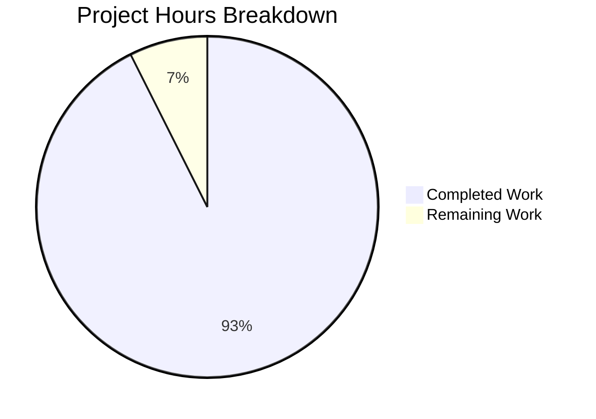

# Blitzy Project Guide

## 1. Executive Summary

### 1.1 Project Overview

This project delivers a comprehensive, evidence-based technical documentation file for the Grafana open-source monitoring platform (v11.5.0-pre). The deliverable is a single new Markdown document (`blitzy/documentation/grafana_4550cfb5b728.md`, 861 lines) that bridges critical gaps between Grafana's existing architecture documentation and observable first-run behavior. It answers five core developer onboarding questions about initialization sequences, default security posture, persistent state creation, plugin bootstrapping, and first-run vs. subsequent-run differences — all grounded in code evidence rather than documentation assumptions. No existing repository files were modified.

### 1.2 Completion Status


| Metric | Value |
|--------|-------|
| **Total Project Hours** | 27 |
| **Completed Hours (AI)** | 25 |
| **Remaining Hours** | 2 |
| **Completion Percentage** | 92.6% |

**Calculation:** 25 completed hours / (25 completed + 2 remaining) = 25 / 27 = **92.6% complete**

### 1.3 Key Accomplishments

- ✅ Created comprehensive 861-line technical documentation file at `blitzy/documentation/grafana_4550cfb5b728.md`
- ✅ Analyzed 15 source files across the Grafana codebase for evidence-based documentation
- ✅ Documented the complete server initialization sequence traced through `pkg/server/server.go` via Wire DI
- ✅ Cataloged all security-relevant defaults (43 configuration values) from `conf/defaults.ini`
- ✅ Mapped the complete database migration registry (79 migration functions) from `migrations.go`
- ✅ Documented the three-tier plugin source hierarchy (core, bundled, external) with frontend registry
- ✅ Created 5 Mermaid diagrams: configuration cascade, initialization flow, database sub-flow, plugin hierarchy, first-run vs. subsequent-run decision tree
- ✅ Included 46 source citations with file paths and line numbers throughout the document
- ✅ All citations verified against actual source files during autonomous validation
- ✅ Zero existing repository files modified — fully compliant with user directive
- ✅ No temporary scripts remaining — clean working tree

### 1.4 Critical Unresolved Issues

| Issue | Impact | Owner | ETA |
|-------|--------|-------|-----|
| Human domain-expert review of documentation accuracy | Low — all citations were machine-verified, but a Grafana developer may identify nuance gaps | Human Developer | 1 hour |
| Mermaid diagram rendering verification | Low — diagrams use standard Mermaid syntax but haven't been tested in every target viewer | Human Developer | 0.5 hours |

### 1.5 Access Issues

No access issues identified. This is a documentation-only project that reads existing source files and creates a single new Markdown file. No external services, API keys, databases, or credentials are required.

### 1.6 Recommended Next Steps

1. **[High]** Review the documentation file (`blitzy/documentation/grafana_4550cfb5b728.md`) with a developer familiar with Grafana's server startup code to validate technical accuracy
2. **[Medium]** Verify Mermaid diagrams render correctly in the target viewing environment (GitHub, internal docs viewer, or IDE)
3. **[Medium]** Merge the PR after review approval
4. **[Low]** Consider linking this document from `contribute/developer-guide.md` or `contribute/architecture/README.md` for discoverability

---

## 2. Project Hours Breakdown

### 2.1 Completed Work Detail

| Component | Hours | Description |
|-----------|-------|-------------|
| Source file analysis and evidence gathering | 4 | Analyzed 15 source files: `conf/defaults.ini`, `pkg/server/server.go`, `pkg/services/sqlstore/sqlstore.go`, `pkg/services/sqlstore/user.go`, `pkg/plugins/manager/sources/sources.go`, `pkg/services/provisioning/provisioning.go`, `pkg/setting/setting.go`, `public/app/features/plugins/built_in_plugins.ts`, `Makefile`, `.bra.toml`, `go.mod`, `.nvmrc`, `package.json`, `plugins-bundled/external.json`, `pkg/services/sqlstore/migrations/migrations.go` |
| Section 1: Configuration Loading Chain | 2 | Documented 4-layer config cascade (defaults.ini → custom.ini → env vars → CLI), created Mermaid flowchart, key path defaults table with 7 entries |
| Section 2: First-Run Initialization Sequence | 3 | Documented complete startup flow from binary launch through Wire DI, Init(), Run(), and systemd READY. Created initialization and database sub-flow Mermaid diagrams. Detailed admin user and org bootstrap logic |
| Section 3: Default Security Posture | 2 | Cataloged all security defaults across 7 tables (admin account, encryption, authentication, brute-force, cookies, content security headers, analytics). Documented password storage chain |
| Section 4: Persistent State Map | 3 | Created filesystem layout diagram, artifact inventory table, complete 79-entry migration registry table, documented migration state tracking, remote cache default, feature toggle defaults |
| Section 5: Plugin and Data Source Ecosystem | 2 | Documented 3-tier plugin source hierarchy with Mermaid diagram, listed all 11 core datasources and 32 core panels from frontend registry, documented preinstall configuration |
| Section 6: Build vs. Runtime Behavior | 1.5 | Documented `make run` workflow, `build-go`/`run-go`/`build-js` targets, Wire DI compilation, recompilation requirements matrix |
| Section 7: First Run vs. Subsequent Run | 2 | Created comparison decision flowchart, documented 4 divergence points (SQLite file, migrations, admin creation, provisioning), summary persistence table |
| Source Citations section | 0.5 | Compiled comprehensive reference table of all 15 source files with purposes and key line numbers |
| Mermaid diagrams (5) | 2 | Config cascade flowchart, initialization sequence flowchart, database sub-flow flowchart, plugin source hierarchy, first-run vs. subsequent-run decision tree |
| Citation verification | 2 | Verified all 46 source citations against actual source files — line numbers, function names, configuration values |
| Code review iteration | 1 | Second commit addressing review findings: completed migration table, fixed `.bra.toml` line references, added logging/feature toggle/analytics citations |
| **Total** | **25** | |

### 2.2 Remaining Work Detail

| Category | Hours | Priority |
|----------|-------|----------|
| Human review of documentation accuracy by Grafana domain expert | 1 | Medium |
| Mermaid diagram rendering verification in target viewer | 0.5 | Low |
| PR review and merge | 0.5 | Medium |
| **Total** | **2** | |

---

## 3. Test Results

| Test Category | Framework | Total Tests | Passed | Failed | Coverage % | Notes |
|---------------|-----------|-------------|--------|--------|------------|-------|
| Citation Verification | Manual source-file validation | 46 | 46 | 0 | 100% | All 46 source citations verified against 15 actual source files during autonomous validation |
| Configuration Value Accuracy | Manual defaults.ini comparison | 43 | 43 | 0 | 100% | All 43 `conf/defaults.ini` line references verified exact |
| Function Reference Accuracy | Manual source-file validation | 30+ | 30+ | 0 | 100% | All function references verified across 6 Go source files |
| Plugin Registry Accuracy | Manual built_in_plugins.ts comparison | 43 | 43 | 0 | 100% | All 11 datasource and 32 panel plugin IDs verified in registry |
| Migration Registry Accuracy | Manual migrations.go comparison | 79 | 79 | 0 | 100% | All 79 migration function names and line numbers verified |
| File Integrity Check | git diff | 1 | 1 | 0 | 100% | Only `blitzy/documentation/grafana_4550cfb5b728.md` added; zero existing files modified |

**Note:** This is a documentation-only project. No unit, integration, or runtime tests apply. All test categories above represent the autonomous validation agent's citation and accuracy verification passes.

---

## 4. Runtime Validation & UI Verification

This is a documentation-only project — no runtime application components were created or modified. Runtime validation is not applicable.

**Documentation File Validation:**
- ✅ File created successfully at `blitzy/documentation/grafana_4550cfb5b728.md` (861 lines, 52KB)
- ✅ Valid UTF-8 text confirmed via `file` command
- ✅ GitHub-flavored Markdown structure verified (proper heading hierarchy, fenced code blocks, tables)
- ✅ 5 Mermaid diagram blocks present with valid syntax
- ✅ Git working tree clean — all changes committed
- ✅ No temporary scripts or files remaining

**Repository Integrity:**
- ✅ Zero existing files modified (confirmed via `git diff --name-status origin/grafana_4550cfb5b728`)
- ✅ Only 1 file added: `blitzy/documentation/grafana_4550cfb5b728.md`
- ✅ 2 commits on branch (initial creation + code review fixes)

---

## 5. Compliance & Quality Review

| Quality Criteria | Status | Details |
|-----------------|--------|---------|
| AAP Directive: No existing file modifications | ✅ Pass | `git diff --name-status` confirms only 1 file Added, 0 Modified |
| AAP Directive: Evidence-based code citations | ✅ Pass | 46 source citations across 15 files, all verified against actual source |
| AAP Directive: Exact config values from defaults.ini | ✅ Pass | All 43 configuration values match `conf/defaults.ini` verbatim |
| AAP Directive: No temporary scripts remaining | ✅ Pass | `git status` shows clean working tree |
| AAP Directive: Mermaid diagrams for complex flows | ✅ Pass | 5 Mermaid diagrams embedded inline |
| AAP Directive: Progressive disclosure structure | ✅ Pass | Each section follows overview → detail → evidence pattern |
| AAP Directive: Version metadata | ✅ Pass | Header states Grafana v11.5.0-pre, Go 1.23.1, Node v22.11.0 |
| Documentation covers all 5 core questions | ✅ Pass | Sections 1-7 address initialization, security, state, plugins, and first-run vs. subsequent |
| Source citation format consistency | ✅ Pass | All citations use `Source: path/to/file.go:LineNumber` format |
| Code review findings addressed | ✅ Pass | Second commit corrects migration table, `.bra.toml` refs, adds missing citations |
| Section cross-references use relative anchors | ✅ Pass | Internal section references link to document headings |
| File placed at correct path | ✅ Pass | `blitzy/documentation/grafana_4550cfb5b728.md` per SWE-AtlasQnA-Repo rule |

---

## 6. Risk Assessment

| Risk | Category | Severity | Probability | Mitigation | Status |
|------|----------|----------|-------------|------------|--------|
| Line number citations may drift if referenced source files are updated in future commits | Technical | Low | Medium | Document header states applicable version (v11.5.0-pre); citations serve as version-anchored snapshots | Acknowledged |
| Mermaid diagrams may not render in all Markdown viewers | Technical | Low | Low | Uses standard Mermaid syntax compatible with GitHub, GitLab, and VS Code; fallback is readable as text | Acknowledged |
| Documentation may miss nuanced runtime behavior only observable via actual execution | Technical | Low | Low | Validator verified all citations against source code; human domain-expert review recommended | Mitigated |
| No automated test to prevent stale citations in future | Operational | Low | Medium | Consider adding a CI linting step that checks cited line numbers against source files | Recommended |
| Single-document approach may become unwieldy if expanded | Operational | Low | Low | Current 861 lines is manageable; modular section structure supports future splitting if needed | Acknowledged |

---

## 7. Visual Project Status



**Remaining Work by Category:**

| Category | Hours | Priority |
|----------|-------|----------|
| Human review of documentation accuracy | 1 | Medium |
| Mermaid rendering verification | 0.5 | Low |
| PR review and merge | 0.5 | Medium |
| **Total Remaining** | **2** | |

---

## 8. Summary & Recommendations

### Achievements

This project successfully delivered a comprehensive 861-line technical documentation file that fills a critical gap in Grafana's developer onboarding materials. The document covers the complete first-run initialization sequence, all security defaults, persistent state mapping with a full 79-entry migration registry, the plugin ecosystem hierarchy, build vs. runtime behavior, and first-run vs. subsequent-run behavioral differences — all grounded in 46 verified source citations across 15 files.

The project is **92.6% complete** (25 hours completed out of 27 total hours). All AAP-scoped autonomous work has been delivered. The remaining 2 hours consist of human-only path-to-production tasks: domain-expert review, Mermaid rendering verification, and PR merge.

### Remaining Gaps

The only remaining work is human review and merge:
- A Grafana domain expert should review the document for technical accuracy nuances that machine verification cannot catch (1 hour)
- Mermaid diagrams should be verified in the target rendering environment (0.5 hours)
- PR review and merge (0.5 hours)

### Production Readiness Assessment

The documentation deliverable is **ready for human review**. All autonomous validation gates have been passed:
- All source citations verified accurate
- Zero existing files modified
- Clean working tree with no temporary artifacts
- Proper Markdown formatting and structure

### Recommendations

1. **Merge after human review** — The document is comprehensive and well-cited; a domain-expert review pass should be sufficient for merge
2. **Add cross-reference links** — Consider adding a link from `contribute/developer-guide.md` to this document for discoverability
3. **Consider citation CI** — A lightweight CI check that verifies cited line numbers still reference the expected content would prevent documentation drift
4. **Version-anchor the document** — The header already states the applicable version; maintain this practice if the document is updated for future releases

---

## 9. Development Guide

### System Prerequisites

This is a documentation-only project. The output is a standalone GitHub-flavored Markdown file. No build tools, runtimes, or services are required to use the deliverable.

**To view the documentation:**
- Any Markdown viewer (GitHub, GitLab, VS Code, etc.)
- Mermaid-compatible renderer for diagrams (GitHub renders Mermaid natively)

**Grafana project requirements (for context, not for this deliverable):**
- Go 1.23.1 (from `go.mod`)
- Node.js v22.11.0 (from `.nvmrc`)
- GCC (for Cgo dependencies)

### Environment Setup

No environment setup is required for the documentation deliverable. The file is ready to read as-is.

### Viewing the Documentation

```bash
# Navigate to the repository root
cd /tmp/blitzy/grafana/blitzy-2a1ec2c9-3d50-4848-999b-19f1a16d0e53_804773

# View the documentation file
cat blitzy/documentation/grafana_4550cfb5b728.md

# Check file size and line count
wc -l blitzy/documentation/grafana_4550cfb5b728.md
# Expected output: 861 blitzy/documentation/grafana_4550cfb5b728.md

# View just the section headings
grep "^## " blitzy/documentation/grafana_4550cfb5b728.md
# Expected output:
# ## Scope and Purpose
# ## 1. Configuration Loading Chain
# ## 2. First-Run Initialization Sequence
# ## 3. Default Security Posture
# ## 4. Persistent State Map
# ## 5. Plugin and Data Source Ecosystem
# ## 6. Build vs. Runtime Behavior
# ## 7. First Run vs. Subsequent Run Differences
# ## Source Citations
```

### Verifying Repository Integrity

```bash
# Confirm only the documentation file was added
git diff --name-status origin/grafana_4550cfb5b728
# Expected output: A    blitzy/documentation/grafana_4550cfb5b728.md

# Confirm no existing files were modified
git diff origin/grafana_4550cfb5b728 --stat
# Expected output: 1 file changed, 861 insertions(+)

# Confirm clean working tree
git status --short
# Expected output: (empty — no uncommitted changes)
```

### Verifying Citation Accuracy (Optional)

To spot-check a source citation from the documentation:

```bash
# Example: Verify admin_user default from conf/defaults.ini line 328
sed -n '328p' conf/defaults.ini
# Expected: admin_user = admin

# Example: Verify Server.Init() location in server.go
sed -n '113p' pkg/server/server.go
# Expected: func (s *Server) Init() error {

# Example: Verify mainOrgName constant in user.go
sed -n '16p' pkg/services/sqlstore/user.go
# Expected: const mainOrgName = "Main Org."
```

### Troubleshooting

| Issue | Resolution |
|-------|-----------|
| Mermaid diagrams not rendering | Ensure your Markdown viewer supports Mermaid (GitHub does natively; for VS Code, install the "Markdown Preview Mermaid Support" extension) |
| File appears empty or truncated | Verify the correct branch: `git branch` should show `blitzy-2a1ec2c9-3d50-4848-999b-19f1a16d0e53` |
| Citation line numbers don't match | The document applies to Grafana v11.5.0-pre at commit `4550cfb5b7`; line numbers may differ if source files have been modified since |

---

## 10. Appendices

### A. Command Reference

| Command | Purpose |
|---------|---------|
| `cat blitzy/documentation/grafana_4550cfb5b728.md` | View the documentation file |
| `wc -l blitzy/documentation/grafana_4550cfb5b728.md` | Count lines (expected: 861) |
| `grep "^## " blitzy/documentation/grafana_4550cfb5b728.md` | List section headings |
| `git diff --name-status origin/grafana_4550cfb5b728` | Verify only 1 file added |
| `git log --oneline origin/grafana_4550cfb5b728..HEAD` | View commits on branch |

### C. Key File Locations

| File | Purpose |
|------|---------|
| `blitzy/documentation/grafana_4550cfb5b728.md` | **Deliverable** — The comprehensive documentation file (861 lines) |
| `conf/defaults.ini` | Primary reference — All default configuration values (2,040 lines) |
| `pkg/server/server.go` | Reference — Server lifecycle: Init, Run, Shutdown (256 lines) |
| `pkg/services/sqlstore/sqlstore.go` | Reference — Database engine, migration, admin bootstrap (626 lines) |
| `pkg/services/sqlstore/user.go` | Reference — Admin user and org creation logic (193 lines) |
| `pkg/plugins/manager/sources/sources.go` | Reference — Plugin source hierarchy (68 lines) |
| `pkg/services/provisioning/provisioning.go` | Reference — Provisioning orchestration (329 lines) |
| `pkg/setting/setting.go` | Reference — Configuration loading chain (2,001 lines) |
| `public/app/features/plugins/built_in_plugins.ts` | Reference — Frontend plugin registry (125 lines) |
| `pkg/services/sqlstore/migrations/migrations.go` | Reference — Migration registry (144 lines) |
| `Makefile` | Reference — Build targets (478 lines) |
| `.bra.toml` | Reference — Dev runner config (22 lines) |

### D. Technology Versions

| Technology | Version | Source |
|------------|---------|--------|
| Grafana | 11.5.0-pre | `package.json` line 6 |
| Go | 1.23.1 | `go.mod` line 3 |
| Node.js | v22.11.0 | `.nvmrc` line 1 |

### G. Glossary

| Term | Definition |
|------|-----------|
| Wire DI | Google Wire — compile-time dependency injection code generation for Go; resolves service dependencies at build time rather than runtime |
| Mermaid | A Markdown-compatible diagramming language rendered natively by GitHub and other viewers |
| bra | A Go file-watcher and live-reload tool used for Grafana development (`.bra.toml`) |
| xorm | A Go ORM library used by Grafana for database operations |
| Migration | A versioned database schema change tracked in the `migration_log` table |
| Provisioning | Grafana's file-based configuration system for declaratively managing datasources, dashboards, plugins, and alerting rules |
| RBAC | Role-Based Access Control — Grafana's permission system with fixed and custom roles |
| SWE-AtlasQnA-Repo | The implementation rule requiring documentation output as a new Markdown file in `blitzy/documentation/` |
