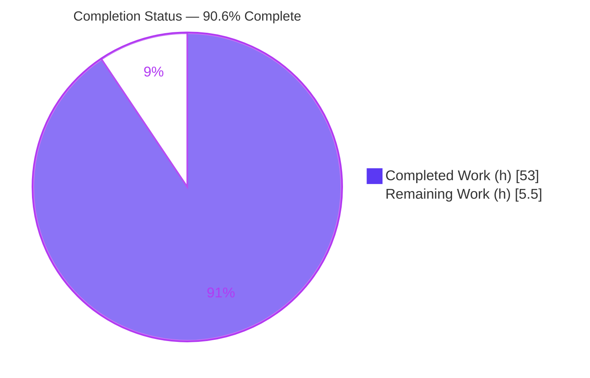
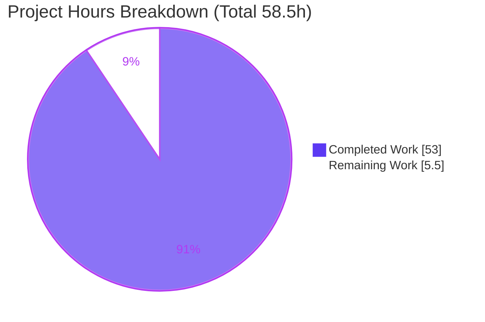
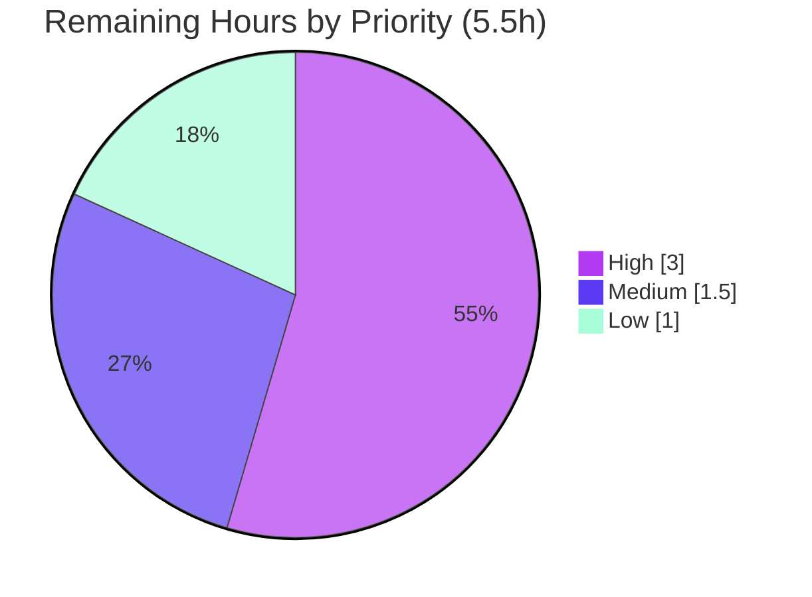

# Blitzy Project Guide — Grafana Startup / Boot Sequence Onboarding Q&A

> **Deliverable:** `blitzy/documentation/grafana_4550cfb5b728.md` (1,589 lines)
> **Branch:** `blitzy-9bd4d785-f42c-4324-90e2-ee47d660145a` · **HEAD:** `dacd518481` · **Base revision:** `4550cfb5b7`
> **Task type:** Read-only, documentation-only Q&A (SWE-AtlasQnA-Repo rule set)

---

## 1. Executive Summary

### 1.1 Project Overview

This project delivers a single, evidence-based knowledge-base document that answers four onboarding questions about Grafana's server startup/boot sequence, written for a first-time local user. Every answer is produced **run-first** — Grafana was built and run in its default canonical configuration, real unedited output was captured, and only then were the answers written and grounded in that output. The document explains the `HTTP Server Listen` log and Grafana's exposure, the forced first-login password-change workflow, the `/api/health` JSON contract and its `database` readiness probe, and the 36 concurrently-launched background services. The technical scope is strictly read-only: the only artifact added to the repository is the answer document; no source, configuration, or build file is changed.

### 1.2 Completion Status



| Metric | Value |
|--------|-------|
| **Total Hours** | **58.5** |
| Completed Hours (AI + Manual) | 53.0 (AI: 53.0, Manual: 0.0) |
| Remaining Hours | 5.5 |
| **Percent Complete** | **90.6%** |

> Completion is computed via the AAP-scoped hours methodology: `53.0 / (53.0 + 5.5) = 53.0 / 58.5 = 90.6%`. All autonomous, AAP-scoped work is complete and validated; the remaining 5.5 h is human-in-the-loop path-to-production (review, sign-off, publish) that by nature cannot be completed autonomously.

### 1.3 Key Accomplishments

- ✅ **Single deliverable authored** — `blitzy/documentation/grafana_4550cfb5b728.md` (1,589 lines) answering all four questions.
- ✅ **Run-first evidence** — Grafana built (`go run build.go -build-tags=oss build`, exit 0) and run in **6 configurations**; real captured output backs every reachable runtime claim.
- ✅ **All four questions fully answered**, including every secondary/edge path (Q1 https + unix-socket + invalid-protocol; Q2 submit + skip branches; Q3 unhealthy-DB 503 + `/healthz` + 5-second cache; Q4 `IsDisabled` skipping + 36→34 reconciliation).
- ✅ **96 unique `file:line` citations** verified valid (0 invalid) across ~28 source files.
- ✅ **`TestHealthAPI` 6/6 PASS** (independently re-run this session, exit 0).
- ✅ **Honest run-first findings** captured where observation contradicted expectation (version `11.5.0-pre`; invalid protocol does not panic; 34 not 36 debug lines — reconciled).
- ✅ **Read-only compliance** — exactly one file added, zero source/config/build changes; temporary scripts removed; working tree clean.

### 1.4 Critical Unresolved Issues

| Issue | Impact | Owner | ETA |
|-------|--------|-------|-----|
| _None._ No compilation errors, no failing tests (6/6 pass), no missing required content, no read-only violations. | — | — | — |

> There are no critical blocking issues. The deliverable is complete and validated; only routine human review/publish remains (see §1.6 and §2.2).

### 1.5 Access Issues

| System/Resource | Type of Access | Issue Description | Resolution Status | Owner |
|-----------------|----------------|-------------------|-------------------|-------|
| _None_ | — | No access issues identified. The repository, Go toolchain (1.23.1), Node (v22.23.1), Yarn (4.5.3), and Docker were all available; build, tests, and runtime validation all executed successfully. | N/A | — |

**No access issues identified.**

### 1.6 Recommended Next Steps

1. **[High]** Have a Grafana-internals SME review the document for technical accuracy and spot-check a sample of the 96 `file:line` citations against revision `4550cfb5b7`.
2. **[Medium]** Perform an editorial/readability and formatting pass for the knowledge base (headings, code-block rendering, tables, anchors).
3. **[Medium]** Approve and merge the branch, then surface the document in the onboarding index.
4. **[Low]** _(Optional enhancement)_ Boot Grafana and capture a browser screenshot of the Q2 change-password view to upgrade that one sub-element from "inferred from code" to "browser-observed."

---

## 2. Project Hours Breakdown

### 2.1 Completed Work Detail

| Component | Hours | Description |
|-----------|-------|-------------|
| Environment & canonical build | 4.0 | Toolchain verification (go/node/yarn), `build.go` canonical build, version/commit provenance investigation (ldflags, `getGitSha`), captured `--version` output. |
| Q1 — HTTP listen signal | 7.0 | `HTTP Server Listen` log capture + per-field interpretation vs `conf/defaults.ini`; serve switch + `getListener` mechanism; **https** (self-signed + openssl verify), **unix-socket** (0660), and **invalid-protocol** (run-first fallback + labeled panic harness) variants; rationale. |
| Q2 — Post-login finalization | 6.0 | `POST /login` capture; client-side default-password detection quoted; `PUT /api/user/password` state finalization (hash-mutation proof old→401/new→200); skip branch; defaults; rationale. |
| Q3 — Health endpoint | 10.0 | Byte-exact healthy JSON; `healthResponse` struct + `apiHealthHandler` verbatim; `SELECT 1` + 5-second cache; `/healthz` liveness; **induced unhealthy-DB 503** (Docker postgres + `docker kill`); cache-staleness window timing; version/commit provenance; `HideVersion` toggle; test cross-check; rationale. |
| Q4 — Background services | 10.0 | 36-service enumeration each mapped to concrete type; concurrent goroutine launch loop; debug-vs-info nuance (34 debug lines); `IsDisabled` skip demo (34→31) + 36→34 reconciliation; `READY=1`; Wire DI; "whole backend concurrent, not before UI"; rationale. |
| Run-first investigation infrastructure | 5.0 | Building + running Grafana across 6 configurations, Docker postgres store setup, observation harnesses (panic reproduction), timed polling, and post-run cleanup. |
| Citations, coverage pass, honest-findings, read-only compliance | 3.0 | 96 `file:line` citations; per-question coverage checklist; "honest observed findings" section; read-only scope enforcement + correct filename/location. |
| Autonomous validation & QA refinement | 8.0 | Five production gates (build 6 configs, 6/6 tests, 96/96 citation verification, byte-for-byte reproduction) plus 3 refinement commits (code-review findings, citation/excerpt fidelity, commit-provenance). |
| **Total** | **53.0** | |

### 2.2 Remaining Work Detail

| Category | Hours | Priority |
|----------|-------|----------|
| Human SME technical-accuracy review + citation spot-check (1,589-line doc, revision `4550cfb5b7`) | 3.0 | High |
| Editorial / readability / formatting review for the knowledge base | 1.0 | Medium |
| Browser-render verification of the Q2 change-password view (optional enhancement) | 1.0 | Low |
| Merge approval & publish to knowledge base | 0.5 | Medium |
| **Total** | **5.5** | |

> **Cross-section check:** §2.1 total (53.0) + §2.2 total (5.5) = **58.5** = Total Hours in §1.2. §2.2 total (5.5) = Remaining Hours in §1.2 = "Remaining Work" in §7. ✅

### 2.3 Basis of Estimate

Estimates reflect the equivalent effort for a senior engineer, unfamiliar with the Grafana codebase, to build and run a ~5.8 GB Go/TypeScript monorepo in six configurations (including inducing a live database failure via Docker Postgres), enumerate and map 36 background services to their concrete types, trace the frontend+backend auth flow, and author 1,589 lines of byte-accurate, exhaustively-cited prose across four refinement iterations. Confidence is **High** for the completed work (directly evidenced by the committed document, git history, and re-run tests) and **High** for the remaining work (well-understood human review activities on a finished artifact).

---

## 3. Test Results

All tests below originate from Blitzy's autonomous validation logs for this project (Gate 1) and were **independently re-run this session** for corroboration.

| Test Category | Framework | Total Tests | Passed | Failed | Coverage % | Notes |
|---------------|-----------|-------------|--------|--------|------------|-------|
| Unit — Health API (`pkg/api`) | Go `testing` (`-tags oss`) | 6 | 6 | 0 | Health path (Q3 evidence) | `TestHealthAPI_Version`, `_VersionEnterprise`, `_AnonymousHideVersion`, `_DatabaseHealthy`, `_DatabaseUnhealthy`, `_DatabaseHealthCached`. Re-run: `ok github.com/grafana/grafana/pkg/api 0.075s`, exit 0. |
| **Total** | | **6** | **6** | **0** | | 100% pass rate. |

**Command (copy-pasteable):**
```bash
export PATH=/usr/local/go/bin:$PATH
go test -count=1 -tags oss ./pkg/api/ -run TestHealthAPI -v
```

**Observed output (verbatim):**
```
--- PASS: TestHealthAPI_Version (0.00s)
--- PASS: TestHealthAPI_VersionEnterprise (0.00s)
--- PASS: TestHealthAPI_AnonymousHideVersion (0.00s)
--- PASS: TestHealthAPI_DatabaseHealthy (0.00s)
--- PASS: TestHealthAPI_DatabaseUnhealthy (0.00s)
--- PASS: TestHealthAPI_DatabaseHealthCached (0.00s)
PASS
ok  	github.com/grafana/grafana/pkg/api	0.075s
```

> **Scope note on tests:** This is a documentation-only task with zero source changes, so no new tests were written (and none were required). The existing `TestHealthAPI` suite is exercised as the Q3 cross-check that the document itself references, and it passes 6/6. Broader Grafana suites were out of scope and were not run.

---

## 4. Runtime Validation & UI Verification

Grafana was built via `go run build.go -build-tags=oss build` (exit 0) and run across six configurations; each reached the `HTTP Server Listen` line and served the probed endpoints.

**Runtime configurations**
- ✅ **Operational** — Default `http` on `[::]:3000` (canonical first-run; `admin`/`admin`, SQLite store).
- ✅ **Operational** — `https` on `:3443` (self-signed cert; TLS cipher line + `openssl` verify captured).
- ✅ **Operational** — Unix-socket (`protocol=socket`; socket file mode `0660` / `srw-rw----`).
- ✅ **Operational** — Invalid protocol (`protocol=bogus`) → **silently falls back to `http`** (run-first finding; no panic through the normal entry point).
- ✅ **Operational** — PostgreSQL store on `:3010` (used to induce the unhealthy-DB path).
- ✅ **Operational** — `debug` log level (reveals the per-service `Starting background service` lines).

**Per-question runtime probes**
- ✅ **Q1** — `msg="HTTP Server Listen" address=[::]:3000 protocol=http subUrl= socket=` captured verbatim.
- ✅ **Q2** — `POST /login` (admin/admin) → 200; `PUT /api/user/password` → 200 with hash-mutation proof (old creds → 401, new → 200); skip branch (no PUT) verified.
- ✅ **Q3** — `/api/health` → 200 healthy JSON (`Content-Length: 75`); induced → 503 `{"database":"failing"}`; `/healthz` → 200 `Ok`; 5-second cache staleness window observed.
- ✅ **Q4** — Registry contains exactly 36 services; debug level shows 34 `Starting background service` lines including `*api.HTTPServer`; `IsDisabled` comparison drops exactly the expected services.

**UI verification**
- ⚠ **Partial (by design, honestly labeled)** — The Q2 forced change-password **view** was **inferred from code**, not browser-rendered, in this investigation. Every backend HTTP call the view triggers (`POST /login`, `PUT /api/user/password`) was really executed and captured. Upgrading this one sub-element to a browser screenshot is tracked as an optional Low-priority task (§2.2).

---

## 5. Compliance & Quality Review

Cross-mapping of the AAP deliverables and SWE-AtlasQnA-Repo rules to their status.

| Requirement (AAP §0.7 rule / deliverable) | Status | Progress | Notes |
|--------------------------------------------|--------|----------|-------|
| Single answer doc at `blitzy/documentation/grafana_4550cfb5b728.md` | ✅ Pass | 100% | 1,589 lines; correct name/location. |
| Investigate by RUNNING code first, then write | ✅ Pass | 100% | Built + ran in 6 configs; captured real output before writing. |
| Complete, unedited output per claim + command shown | ✅ Pass | 100% | Fenced captures with the exact command for each. |
| `file:line` references + named function/method/struct | ✅ Pass | 100% | 96 unique citations, 0 invalid, ~28 files. |
| Rationale provided per answer | ✅ Pass | 100% | Each Q has a dedicated Rationale subsection. |
| Exercise every condition (primary + secondary/edge) | ✅ Pass | 100% | Q1 3 variants, Q2 submit+skip, Q3 unhealthy+healthz+cache, Q4 IsDisabled+reconciliation. |
| Canonical default build/config + exact commands | ✅ Pass | 100% | Environment section states build/run commands + observed version/commit. |
| Coverage pass over every named item | ✅ Pass | 100% | Per-question checklist, all items `[x]`. |
| Read-only: no source file modified/added except the doc | ✅ Pass | 100% | `git diff 4550cfb5b7 --name-status` = 1 file added, 0 changed. |
| Temporary scripts removed; tree left pristine | ✅ Pass | 100% | `/tmp/grafana-obs` removed; `git status` clean; 0 processes. |
| Honest labeling of inferred vs observed | ✅ Pass | 100% | Panic harness + client-rendered view explicitly labeled. |
| Q2 change-password view browser-rendered | ⚠ Partial | Accepted | Inferred-from-code (compliant); optional browser verification pending (§2.2). |

**Fixes applied during autonomous validation/authoring** (from git history): (1) initial run-first authoring; (2) addressed code-review findings; (3) fixed citation/excerpt fidelity (QA CP-D); (4) documented commit provenance & reproducibility (QA CP-E). The Final Validator reproduced every reproducible claim byte-for-byte and found **zero** discrepancies, requiring no further fixes.

---

## 6. Risk Assessment

| Risk | Category | Severity | Probability | Mitigation | Status |
|------|----------|----------|-------------|------------|--------|
| Build-dependent `version`/`commit` differ on rebuild at a different revision | Technical | Low | Medium | Document explicitly explains provenance (`commit` = build-tree Git HEAD short SHA) and gives reproduction steps | Mitigated |
| Q2 change-password view inferred from code (not browser-rendered) | Technical | Low | Low | Honestly labeled; all backend calls observed; optional browser verification queued | Accepted / Open |
| Line-number drift if the doc is read against a future Grafana revision | Technical | Low | Low | Doc is explicitly pinned to revision `4550cfb5b7` | Mitigated |
| Session cookies captured during Q2 investigation | Security | Low | Low | Values redacted (structure preserved); cookie jar kept in `/tmp` and removed; no secrets committed | Mitigated |
| Publishing authoritative onboarding doc before SME sign-off | Operational | Medium | Low | Validated byte-for-byte (zero discrepancies); SME review is the primary queued task | Open |
| Reproducing observations requires a build/Docker environment | Operational | Low | Medium | Exact commands + canonical container image documented; unhealthy-DB path needs Docker Postgres (noted) | Mitigated |
| External/integration coupling introduced by the change | Integration | None | None | Read-only doc introduces no code, imports, or runtime coupling | N/A |

**Overall risk profile: LOW.** No blocking risks. No unresolved compilation errors, no failing tests, no security vulnerabilities introduced.

---

## 7. Visual Project Status

**Project hours breakdown** (Completed = Dark Blue `#5B39F3`, Remaining = White `#FFFFFF`):



**Remaining work by priority** (hours from §2.2):



> **Integrity check:** "Remaining Work" = **5.5 h** matches §1.2 Remaining Hours and the §2.2 total. High (3.0) + Medium (1.0 editorial + 0.5 merge = 1.5) + Low (1.0) = 5.5. ✅

---

## 8. Summary & Recommendations

**Achievements.** The project delivers a complete, run-first, evidence-based onboarding Q&A document for Grafana's startup/boot sequence. All four questions and every named sub-item are answered with real captured output, 96 verified `file:line` citations, and rationale. The work is read-only compliant (one file added, zero source changes), independently test-verified (`TestHealthAPI` 6/6), and honest about the two items that cannot be produced by probing the default server (both explicitly labeled).

**Remaining gaps.** None technical. The outstanding 5.5 h is entirely human path-to-production: SME accuracy sign-off, an editorial pass, an optional browser-render of the Q2 view, and merge/publish.

**Critical path to production.** SME technical-accuracy review (§2.2, High) → editorial pass → merge & publish. The optional browser-render can proceed in parallel or be deferred.

**Production readiness.** The document is **production-ready pending human review**. At **90.6% complete** (53.0 h of 58.5 h), all autonomous AAP-scoped work is finished and validated; the remaining 5.5 h is review-and-publish that is intentionally reserved for humans.

| Success metric | Target | Actual |
|----------------|--------|--------|
| Questions fully answered | 4 / 4 | 4 / 4 ✅ |
| Citations valid | 100% | 96 / 96 ✅ |
| Health tests passing | 100% | 6 / 6 ✅ |
| Source files changed (read-only) | 0 | 0 ✅ |
| Completion | — | 90.6% |

---

## 9. Development Guide

This guide covers how to **view the deliverable** (the product) and how to **reproduce the observations** to re-verify it. All commands below were tested this session.

### 9.1 System Prerequisites
- **OS:** Linux/amd64 (validated on Ubuntu container).
- **Go:** 1.23.1 (matches `go.mod`). Installed at `/usr/local/go/bin` — **not on `PATH` by default**.
- **Node.js:** ≥ 22 (`.nvmrc` pins `v22.11.0`; `v22.23.1` verified working) — only needed for frontend build, not for reading the doc.
- **Yarn:** 4.5.3 (`packageManager` pin).
- **Docker:** required **only** to reproduce the Q3 unhealthy-DB 503 (Postgres store); not needed otherwise.
- **Disk:** ~6 GB for the repository (5.8 GB) plus Go build cache.

### 9.2 Environment Setup
```bash
# From the repository root, on the delivery branch
git checkout blitzy-9bd4d785-f42c-4324-90e2-ee47d660145a

# Put the Go toolchain on PATH (it is installed but not exported by default)
export PATH=/usr/local/go/bin:$PATH
go version   # -> go version go1.23.1 linux/amd64
```

### 9.3 Primary Usage — View the Deliverable
The document is self-contained; reading it is the primary use.
```bash
# Full document
less blitzy/documentation/grafana_4550cfb5b728.md

# Just the intro + the four verbatim questions
sed -n '1,44p' blitzy/documentation/grafana_4550cfb5b728.md

# Jump to a specific answer (approx. start lines)
sed -n '262,492p'  blitzy/documentation/grafana_4550cfb5b728.md   # Q1
sed -n '493,804p'  blitzy/documentation/grafana_4550cfb5b728.md   # Q2
sed -n '805,1188p' blitzy/documentation/grafana_4550cfb5b728.md   # Q3
sed -n '1189,1508p' blitzy/documentation/grafana_4550cfb5b728.md  # Q4
```

### 9.4 Reproduce the Observations (optional re-verification)
```bash
export PATH=/usr/local/go/bin:$PATH

# 1) Canonical build (matches the Makefile `build-go` body)
go run build.go -build-tags=oss build
./bin/linux-amd64/grafana server --version   # -> Version 11.5.0-pre (commit: 4550cfb5b7, ...)

# 2) Run the default server (http, port 3000, admin/admin), then probe
./bin/linux-amd64/grafana server --homepath "$PWD" &   # capture logs to see "HTTP Server Listen"
sleep 8
curl -s http://localhost:3000/api/health    # -> {"database":"ok","version":"11.5.0-pre","commit":"4550cfb5b7"}
curl -s http://localhost:3000/healthz        # -> Ok
kill %1                                       # stop the server you started

# 3) Q3 unit cross-check (independently re-run: 6/6 PASS)
go test -count=1 -tags oss ./pkg/api/ -run TestHealthAPI -v
```

### 9.5 Verification Steps
```bash
# Read-only compliance: must print ONLY the answer document
git diff 4550cfb5b7 --name-status
#   A   blitzy/documentation/grafana_4550cfb5b728.md

# Working tree must be clean
git status --porcelain    # (no output = clean)
```

### 9.6 Troubleshooting
- **`go: command not found`** → `export PATH=/usr/local/go/bin:$PATH`.
- **First build is slow / heavy** → the tree is large and the Go cache starts cold; allow several minutes, or reuse a warm `GOCACHE`.
- **`/api/health` returns 200 even when you try to break SQLite** → `SELECT 1` needs no shared lock, so a file lock will not fail it. Use a Docker Postgres store and `docker kill` the container to reproduce the 503 (as the document does).
- **Line numbers don't match** → ensure you are on revision `4550cfb5b7`; anchors are pinned to that exact revision.
- **Different `commit` value after rebuild** → expected; `commit` is stamped from the build tree's Git HEAD short SHA (documented in the Environment & provenance section).

---

## 10. Appendices

### A. Command Reference
| Purpose | Command |
|---------|---------|
| Put Go on PATH | `export PATH=/usr/local/go/bin:$PATH` |
| Canonical build | `go run build.go -build-tags=oss build` |
| Print version/commit | `./bin/linux-amd64/grafana server --version` |
| Run default server | `./bin/linux-amd64/grafana server --homepath "$PWD"` |
| Health (readiness) | `curl -s http://localhost:3000/api/health` |
| Liveness | `curl -s http://localhost:3000/healthz` |
| Health unit tests | `go test -count=1 -tags oss ./pkg/api/ -run TestHealthAPI -v` |
| Read-only check | `git diff 4550cfb5b7 --name-status` |
| Clean-tree check | `git status --porcelain` |

### B. Port Reference
| Port / Endpoint | Configuration | Purpose |
|-----------------|---------------|---------|
| `[::]:3000` | Default (`http`) | UI + REST API (canonical first-run) |
| `:3443` | HTTPS variant | TLS exposure demonstration |
| unix socket | `protocol=socket` | Socket exposure (mode `0660`) |
| `:3010` | PostgreSQL-store variant | Used to induce the unhealthy-DB 503 |

### C. Key File Locations
| Path | Role |
|------|------|
| `blitzy/documentation/grafana_4550cfb5b728.md` | **The deliverable** (created) |
| `pkg/api/http_server.go` | Q1 listen log / serve switch / `getListener`; Q3 health handlers + `healthResponse` |
| `pkg/api/health.go` | Q3 `databaseHealthy` (`SELECT 1`, 5-second cache) |
| `pkg/api/login.go` | Q2 backend `LoginPost` |
| `public/app/core/components/Login/LoginCtrl.tsx` | Q2 client-side default-password detection + `PUT /api/user/password` |
| `pkg/registry/backgroundsvcs/background_services.go` | Q4 registry of the 36 background services |
| `pkg/server/server.go` | Q4 `Server.Run()` launch loop / `READY=1` |

### D. Technology Versions
| Component | Version |
|-----------|---------|
| Go | 1.23.1 |
| Node.js | v22.23.1 (pin `v22.11.0`) |
| Yarn | 4.5.3 |
| Grafana (stamped build) | 11.5.0-pre (commit `4550cfb5b7`) |
| Canonical container image | `andrewparkscaleai/coding-agent:grafana__grafana__4550cfb5b72886782d9a3e6cf995f8dbd57ca4ff` |

### E. Environment Variable Reference
| Variable | Use |
|----------|-----|
| `PATH` | Must include `/usr/local/go/bin` for the Go toolchain |
| `GOCACHE` | Go build cache location (a warm cache speeds rebuilds) |
| `NOTIFY_SOCKET` | Unset in this environment → systemd `READY=1` notify is a no-op (Q4) |
| `GF_*` overrides | Grafana settings may be overridden via `GF_<SECTION>_<KEY>` env vars (default run uses `conf/defaults.ini`) |

### F. Developer Tools Guide
- **Read-only diff:** `git diff 4550cfb5b7 --name-status` (confirms only the doc was added).
- **Per-file diff:** `git diff 4550cfb5b7 -- blitzy/documentation/grafana_4550cfb5b728.md`.
- **Authorship:** `git log --author="agent@blitzy.com" --oneline` (4 documentation commits).
- **Go tests:** `go test -count=1 -tags oss ./pkg/api/ -run TestHealthAPI -v`.

### G. Glossary
| Term | Meaning |
|------|---------|
| **Run-first** | Evidence methodology: build + run the code and capture real output *before* writing the answer. |
| **`HTTP Server Listen`** | The INFO log line signaling the server accepts connections (Q1). |
| **`/api/health` vs `/healthz`** | Readiness (with `SELECT 1` DB probe) vs dependency-free liveness (Q3). |
| **Background service** | A component launched as a concurrent goroutine at boot; the HTTP/UI server is itself one of 36 (Q4). |
| **`IsDisabled`** | Registry check that skips config-gated services at launch (Q4). |
| **ldflags stamp** | Build-time `-X main.version/commit` values that override the source fallbacks (Q3 provenance). |
| **AAP** | Agent Action Plan — the primary directive defining this project's scope. |
