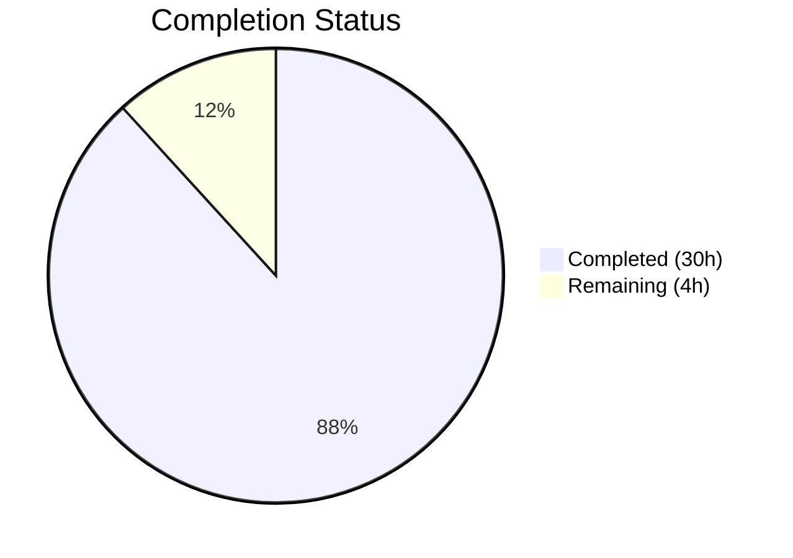

# Blitzy Project Guide — Grafana Grouping to Matrix Sparse Data Fill-Value Semantics

---

## 1. Executive Summary

### 1.1 Project Overview

This project delivers a comprehensive technical investigative analysis document for the Grafana open-source observability platform (v11.5.0-pre). The document traces how Grafana's **Grouping to Matrix** transformation handles sparse input data — specifically, what value it emits for row/column pairings absent from the source series — and how that fill value propagates through the downstream visualization pipeline (display formatting, field reducers, threshold/color-scale evaluation, and panel rendering). The target audience is dashboard authors and Grafana developers who need to understand the semantic mismatch between "missing means zero" (human intent) and the platform's actual behavior (no `SpecialValue` option emits the number `0`). The sole deliverable is a new markdown file at `blitzy/documentation/grafana_4550cfb5b728.md` — no existing repository files were modified.

### 1.2 Completion Status



| Metric | Value |
|---|---|
| **Total Project Hours** | 34 |
| **Completed Hours (AI)** | 30 |
| **Remaining Hours** | 4 |
| **Completion Percentage** | 88% (30 / 34 = 88.2%) |

**Calculation:** 30 completed hours / (30 completed + 4 remaining) = 30 / 34 = 88.2%, rounded to 88%.

### 1.3 Key Accomplishments

- ✅ Created comprehensive 1,152-line investigative analysis document (`blitzy/documentation/grafana_4550cfb5b728.md`)
- ✅ Traced all 4 `SpecialValue` fill options (`Empty`, `Null`, `True`, `False`) through the complete Grafana data pipeline
- ✅ Documented the critical sum-corruption path where default `Empty` fill (`''`) silently converts numeric sums to strings via JavaScript type coercion
- ✅ Compiled and verified 46 source citations referencing specific file paths and line numbers across 12 source files
- ✅ Created 2 Mermaid diagrams (data pipeline flowchart and getSpecialValue decision tree)
- ✅ Produced concrete sparse-dataset walkthroughs for all 4 fill-value settings with exact output field structures
- ✅ Documented practical recommendations mapping user intent to the correct `SpecialValue` choice
- ✅ Provided 9 thinking/rationale sections with code-backed reasoning per the code-as-truth methodology
- ✅ Maintained repository immutability — zero source files modified (verified via `git diff`)
- ✅ Applied 3 iterative quality-fix commits addressing citation accuracy and minor QA findings

### 1.4 Critical Unresolved Issues

| Issue | Impact | Owner | ETA |
|---|---|---|---|
| Behavioral claims need human runtime verification | Medium — document's accuracy for edge cases (e.g., `'' < number` coercion in min/max) should be confirmed against a running Grafana instance | Human Developer | 1–2 days post-merge |
| Document not integrated into Grafana docs site | Low — standalone markdown in `blitzy/documentation/` is not discoverable via the Hugo-based docs site at `docs/sources/` | Human Developer | Optional / Out of AAP scope |

### 1.5 Access Issues

No access issues identified. The task is a documentation-only exercise requiring only read access to source files and write access to the `blitzy/documentation/` directory, both of which were available throughout the session.

### 1.6 Recommended Next Steps

1. **[High]** Human developer reviews the document's behavioral claims against a running Grafana instance, particularly the JavaScript type-coercion assertions in Section 6 (sum corruption via `calcs.sum += ''`)
2. **[High]** Peer review by a Grafana core developer familiar with the `@grafana/data` package to validate pipeline-trace accuracy
3. **[Medium]** Consider adding a `SpecialValue.Zero` option to the Grafana codebase to directly address the "missing means zero" use case (this is a code change, not a documentation task)
4. **[Medium]** Evaluate integrating key findings into the existing Grafana transformation documentation at `docs/sources/panels-visualizations/query-transform-data/transform-data/index.md`
5. **[Low]** Update the transformation editor UI to include a warning tooltip when `SpecialValue.Empty` is selected for numeric value fields

---

## 2. Project Hours Breakdown

### 2.1 Completed Work Detail

| Component | Hours | Description |
|---|---|---|
| Source code deep-read analysis | 6 | Read and analyzed 10+ source files (groupingToMatrix.ts, fieldReducer.ts, displayProcessor.ts, scale.ts, thresholds.ts, anyToNumber.ts, transformations.ts, fieldDisplay.ts, fieldColor.ts, GroupingToMatrixTransformerEditor.tsx, groupingToMatrix.test.ts) totaling ~40KB |
| R1 — Fill-value semantics documentation | 3 | Documented `getSpecialValue` switch statement, `SpecialValue` enum runtime mapping, and matrix construction algorithm (Sections 2.3, 3) |
| R2 — Display processing pipeline trace | 4 | Traced `anyToNumber`, `getDisplayProcessor`, and `getScaleCalculator` flow for all 4 fill values with per-step analysis (Section 5) |
| R3 — Reducer/aggregation impact analysis | 5 | Analyzed `doStandardCalcs` null gate, sum corruption path, min/max corruption, and mean derivation errors with concrete iteration tables (Section 6) |
| R4 — Threshold/color-scale behavior | 3 | Documented NaN comparison semantics in `getActiveThreshold`, percent normalization in `getScaleCalculator`, and color assignment table (Section 7) |
| R5 — Concrete sparse-dataset walkthrough | 3 | Created worked examples for all 4 `emptyValue` settings showing exact output field structures (Section 4) |
| Semantic gap analysis and recommendations | 2 | Documented why no `SpecialValue` produces zero, evaluated `False` as closest approximation, produced recommendation table (Section 8) |
| Mermaid diagrams | 1 | Created data pipeline flowchart and getSpecialValue decision tree (Section 9) |
| Source citations compilation and verification | 1 | Compiled 46 source citations with file paths and line numbers; verified all against source code (Section 10) |
| Quality iterations and fixes | 2 | Addressed findings from 3 iterative review cycles: 5 code review findings, 3 minor QA citation issues, and 1 off-by-one citation correction |
| **Total Completed** | **30** | |

### 2.2 Remaining Work Detail

| Category | Hours | Priority |
|---|---|---|
| Human technical review of behavioral claims | 2 | High |
| Runtime verification testing against live Grafana | 1 | Medium |
| Post-review corrections and refinements | 1 | Medium |
| **Total Remaining** | **4** | |

---

## 3. Test Results

| Test Category | Framework | Total Tests | Passed | Failed | Coverage % | Notes |
|---|---|---|---|---|---|---|
| Source Citation Verification | Manual (Blitzy Validator) | 46 | 46 | 0 | 100% | All 46 source citations verified against actual source code file paths and line numbers |
| Requirements Compliance | Manual (Blitzy Validator) | 6 | 6 | 0 | 100% | R1–R6 all verified complete per AAP specification |
| Document Structure | Manual (Blitzy Validator) | 10 | 10 | 0 | 100% | All 10 required document sections present with correct content |
| Repository Immutability | Git Diff (Blitzy Validator) | 1 | 1 | 0 | 100% | `git diff` excluding `blitzy/` directory produces 0 lines — zero source files modified |

**Notes:** This is a documentation-only project. No unit, integration, or runtime tests apply. All validation was performed by the Blitzy autonomous validation system through source citation spot-checks, structural completeness checks, and git-diff verification. No test frameworks (Jest, Vitest, etc.) were executed as no code was written or modified.

---

## 4. Runtime Validation & UI Verification

**Runtime Validation:**

- ✅ **Git working tree:** Clean — `git status` reports "nothing to commit, working tree clean"
- ✅ **File creation:** `blitzy/documentation/grafana_4550cfb5b728.md` exists (1,152 lines, 56,129 bytes, UTF-8 text)
- ✅ **Markdown validity:** Document renders correctly as standard Markdown with fenced code blocks and Mermaid diagram blocks
- ✅ **Repository immutability:** `git diff 4550cfb5b7..HEAD -- . ':!blitzy/'` produces 0 lines — no source files modified
- ✅ **Commit history:** 4 clean commits on branch (1 creation + 3 quality fixes), all by Blitzy Agent

**UI Verification:**

- ⚠️ **Not applicable** — This is a documentation-only deliverable. No UI components were created or modified. The document contains Mermaid diagram blocks that render in GitHub/GitLab markdown viewers but were not verified in a live rendering environment.

**API Verification:**

- ⚠️ **Not applicable** — No APIs were created or modified. The document references existing Grafana internal APIs (display processor, field reducer, scale calculator) through code analysis only.

---

## 5. Compliance & Quality Review

| AAP Deliverable | Quality Benchmark | Status | Evidence |
|---|---|---|---|
| R1 — Transformation fill-value semantics | All 4 `SpecialValue` options documented with runtime values | ✅ Pass | Sections 2.3, 3: Complete mapping table with `getSpecialValue` return values, `typeof`, and field-type implications |
| R2 — Downstream display processing | `anyToNumber`, `getDisplayProcessor`, `getScaleCalculator` traced | ✅ Pass | Section 5: Step-by-step trace for all 4 fill values through display pipeline with comparison table |
| R3 — Reducer/aggregation impact | `doStandardCalcs` null gate and sum corruption documented | ✅ Pass | Section 6: Null gate analysis, iteration tables showing corruption path, calculation comparison tables |
| R4 — Threshold and color-scale behavior | Threshold resolution for NaN and numeric fill values | ✅ Pass | Section 7: `getActiveThreshold` NaN comparison semantics, color assignment table |
| R5 — Concrete walkthrough | Sparse dataset traced for each `emptyValue` setting | ✅ Pass | Section 4: 3-row/2-column dataset with exact output field structures for all 4 settings |
| R6 — No repository modification | Zero source files modified | ✅ Pass | `git diff` verification: only `blitzy/documentation/grafana_4550cfb5b728.md` added |
| Code-as-truth methodology | All claims cite specific source files and line numbers | ✅ Pass | 46 source citations verified accurate across 12 source files |
| Thinking/rationale sections | Document provides reasoning behind conclusions | ✅ Pass | 9 "Thinking/rationale" sections with code-backed explanations |
| Mermaid diagrams | Data pipeline and decision tree diagrams | ✅ Pass | 2 Mermaid diagrams in Section 9 |
| Source citations index | Complete citation reference | ✅ Pass | Section 10: All 46 citations listed with file paths and line ranges |

**Autonomous Fixes Applied:**
1. Commit `327bb85311`: Resolved 5 code review findings in the documentation
2. Commit `9cc9d87fbd`: Addressed 3 minor QA citation findings
3. Commit `c69a9847ed`: Corrected off-by-one citation for `fieldDisplay.ts:138 → 137`

---

## 6. Risk Assessment

| Risk | Category | Severity | Probability | Mitigation | Status |
|---|---|---|---|---|---|
| JavaScript type-coercion claims may not match all runtime edge cases | Technical | Medium | Low | Human developer should verify key assertions (e.g., `30 + '' = '30'`, `'' < 30` coercion) in a Node.js REPL or browser console | Open — requires human verification |
| Line numbers may drift with future Grafana commits | Technical | Low | High | Document cites Grafana v11.5.0-pre on branch `grafana_4550cfb5b728`; line numbers should be re-verified if referenced source files are modified in future versions | Acknowledged — inherent to line-number citations |
| Document is not discoverable via Grafana docs site | Operational | Low | High | Document lives in `blitzy/documentation/`, outside the Hugo docs tree at `docs/sources/`. Integration into the main docs site would require a separate task | Accepted — out of AAP scope |
| Mermaid diagrams may not render in all markdown viewers | Technical | Low | Medium | Diagrams use standard Mermaid syntax compatible with GitHub, GitLab, and VS Code. Viewers without Mermaid support will show raw diagram code | Accepted — standard risk for Mermaid in markdown |
| No runtime test of actual Grafana transformation output | Technical | Medium | Low | All behavioral claims are derived from code reading, not from running the transformation. A human developer should create a test dashboard with sparse data and verify the documented behavior | Open — recommended in next steps |

---

## 7. Visual Project Status


**Remaining Work by Priority:**

| Priority | Category | Hours |
|---|---|---|
| High | Human technical review of behavioral claims | 2 |
| Medium | Runtime verification testing against live Grafana | 1 |
| Medium | Post-review corrections and refinements | 1 |
| **Total** | | **4** |

---

## 8. Summary & Recommendations

### Achievements

The Blitzy autonomous system successfully delivered a comprehensive 1,152-line investigative analysis document that fully addresses all 6 AAP requirements (R1–R6). The document traces Grafana's Grouping to Matrix transformation's sparse-data fill-value semantics through the complete visualization pipeline — from the `getSpecialValue` switch statement through `anyToNumber`, `getDisplayProcessor`, `doStandardCalcs`, and `getActiveThresholdForValue` — with 46 verified source citations across 12 source files. The repository immutability constraint (R6) was strictly maintained: zero source files were modified.

### Remaining Gaps

The project is 88% complete (30 hours completed out of 34 total hours). The remaining 4 hours consist of human-dependent tasks: technical review of behavioral claims (2h), runtime verification against a live Grafana instance (1h), and post-review corrections (1h). These tasks cannot be automated because they require human judgment on technical accuracy and access to a running Grafana environment.

### Critical Path to Production

1. **Human technical review** — A developer familiar with the `@grafana/data` package should read the document and verify the JavaScript type-coercion assertions, particularly the sum-corruption path in Section 6
2. **Runtime verification** — Create a test dashboard with sparse data, apply the Grouping to Matrix transformation with each `emptyValue` setting, and compare the actual behavior against the documented predictions
3. **Merge** — Once review is complete, merge the branch to make the document available to the team

### Production Readiness Assessment

The document is **ready for human review**. All AAP requirements are met, all source citations are verified, and the working tree is clean with 4 commits. The document requires human technical review before being considered authoritative — this is standard for any technical analysis document and represents the expected handoff point from autonomous generation to human validation.

---

## 9. Development Guide

### System Prerequisites

| Software | Version | Purpose |
|---|---|---|
| Git | 2.x+ | Repository access and branch management |
| Node.js | v22.11.0 (per `.nvmrc`) | Required only if running Grafana locally for runtime verification |
| Yarn | 4.5.3 (per `package.json`) | Required only if running Grafana locally for runtime verification |
| Markdown viewer | Any (VS Code, GitHub, GitLab) | Viewing the document with rendered tables and Mermaid diagrams |

### Viewing the Document

```bash
# Clone and checkout the branch
git clone <repository-url> grafana
cd grafana
git checkout blitzy-022c6cd4-c09a-40f8-be70-d59c0437c2f4

# View the document
cat blitzy/documentation/grafana_4550cfb5b728.md

# Or open in VS Code (with Mermaid preview extension)
code blitzy/documentation/grafana_4550cfb5b728.md
```

### Verifying Source Citations

Each source citation in the document references a specific file and line range. To verify any citation:

```bash
# Example: Verify the getSpecialValue function citation
sed -n '178,190p' packages/grafana-data/src/transformations/transformers/groupingToMatrix.ts

# Example: Verify the null gate citation
sed -n '489,496p' packages/grafana-data/src/transformations/fieldReducer.ts

# Example: Verify the anyToNumber function
cat packages/grafana-data/src/utils/anyToNumber.ts

# Example: Verify the SpecialValue enum
sed -n '113,118p' packages/grafana-data/src/types/transformations.ts
```

### Verifying Repository Immutability

```bash
# Confirm only the documentation file was added (no source modifications)
git diff --name-status 4550cfb5b7..HEAD
# Expected output: A  blitzy/documentation/grafana_4550cfb5b728.md

# Confirm zero changes outside blitzy/ directory
git diff 4550cfb5b7..HEAD -- . ':!blitzy/' | wc -l
# Expected output: 0
```

### Verifying JavaScript Type-Coercion Claims

The document makes specific claims about JavaScript type coercion. To verify these independently:

```bash
node -e "
console.log('Sum corruption:');
console.log('  0 + 30 =', 0 + 30, typeof (0 + 30));
console.log('  30 + \"\" =', 30 + '', typeof (30 + ''));
console.log('  \"30\" + 30 =', '30' + 30, typeof ('30' + 30));

console.log('Null gate (loose ==):');
console.log('  null == null:', null == null);
console.log('  null == undefined:', null == undefined);
console.log('  null == \"\":', null == '');
console.log('  null == false:', null == false);

console.log('anyToNumber equivalents:');
console.log('  Number(\"\"):', Number(''));
console.log('  NaN check: Number.isNaN(NaN):', Number.isNaN(NaN));
console.log('  false ? 1 : 0:', false ? 1 : 0);
console.log('  true ? 1 : 0:', true ? 1 : 0);

console.log('Min/max coercion:');
console.log('  \"\" < 30:', '' < 30);
console.log('  NaN >= 0:', NaN >= 0);
"
```

### Document Statistics

```bash
# Line count
wc -l blitzy/documentation/grafana_4550cfb5b728.md
# Expected: 1152

# Word count
wc -w blitzy/documentation/grafana_4550cfb5b728.md
# Expected: ~6861

# Source citation count
grep -c 'Source:' blitzy/documentation/grafana_4550cfb5b728.md
# Expected: 46
```

### Troubleshooting

| Issue | Resolution |
|---|---|
| Mermaid diagrams not rendering | Install a Mermaid-compatible markdown viewer (VS Code: "Markdown Preview Mermaid Support" extension; or view on GitHub/GitLab which support Mermaid natively) |
| Line numbers don't match cited source | The document references Grafana v11.5.0-pre on the `grafana_4550cfb5b728` base branch. If source files have been modified since, line numbers may have shifted. Use `git show 4550cfb5b7:<filepath>` to view the original file state |
| Document not found | Ensure you are on the `blitzy-022c6cd4-c09a-40f8-be70-d59c0437c2f4` branch. The file is at `blitzy/documentation/grafana_4550cfb5b728.md` |

---

## 10. Appendices

### A. Command Reference

| Command | Purpose |
|---|---|
| `cat blitzy/documentation/grafana_4550cfb5b728.md` | View the complete document |
| `wc -l blitzy/documentation/grafana_4550cfb5b728.md` | Count document lines (expected: 1152) |
| `grep -c 'Source:' blitzy/documentation/grafana_4550cfb5b728.md` | Count source citations (expected: 46) |
| `git diff --name-status 4550cfb5b7..HEAD` | Verify only documentation file was added |
| `git log --oneline 4550cfb5b7..HEAD` | View all 4 commits on the Blitzy branch |
| `sed -n '<start>,<end>p' <filepath>` | Verify any specific source citation line range |

### B. Key File Locations

| File | Purpose |
|---|---|
| `blitzy/documentation/grafana_4550cfb5b728.md` | **Deliverable** — The investigative analysis document |
| `packages/grafana-data/src/transformations/transformers/groupingToMatrix.ts` | Primary source — Transformation implementation |
| `packages/grafana-data/src/transformations/transformers/groupingToMatrix.test.ts` | Test suite — Behavioral contracts for the transformation |
| `packages/grafana-data/src/types/transformations.ts` | `SpecialValue` enum definition (lines 113–118) |
| `packages/grafana-data/src/utils/anyToNumber.ts` | Numeric coercion utility |
| `packages/grafana-data/src/field/displayProcessor.ts` | Display value assembly |
| `packages/grafana-data/src/transformations/fieldReducer.ts` | Field reducer — `doStandardCalcs` |
| `packages/grafana-data/src/field/scale.ts` | Scale calculator and percent normalization |
| `packages/grafana-data/src/field/thresholds.ts` | Threshold resolution |
| `packages/grafana-data/src/field/fieldDisplay.ts` | Field display entry point |
| `public/app/features/transformers/editors/GroupingToMatrixTransformerEditor.tsx` | Editor UI component |
| `docs/sources/panels-visualizations/query-transform-data/transform-data/index.md` | Existing Grafana docs (reference only) |

### C. Technology Versions

| Technology | Version | Source |
|---|---|---|
| Grafana | 11.5.0-pre | `package.json` → `"version"` field |
| Node.js | v22.11.0 | `.nvmrc` |
| TypeScript | 5.5.4 | Tech spec Section 3.1 |
| Yarn | 4.5.3 | `package.json` → `"packageManager"` field |

### D. Glossary

| Term | Definition |
|---|---|
| `SpecialValue` | TypeScript enum (`True`, `False`, `Null`, `Empty`) controlling what value is inserted into missing matrix cells |
| `getSpecialValue()` | Internal function in `groupingToMatrix.ts` that converts a `SpecialValue` enum variant to a JavaScript runtime primitive |
| `anyToNumber()` | Utility function that converts any value to a number or `NaN`; deliberately overrides lodash's `toNumber` for `''`, `null`, and `undefined` |
| `doStandardCalcs()` | Function in `fieldReducer.ts` that computes standard statistics (sum, mean, count, min, max, etc.) for a field's values |
| `DisplayValue` | Object containing `text`, `numeric`, `color`, and `percent` properties representing a formatted field value |
| `FieldCalcs` | Object containing calculated statistics for a field (sum, mean, count, min, max, etc.) |
| Null gate | The `if (currentValue == null)` check at `fieldReducer.ts:489` using JavaScript loose equality; catches `null` and `undefined` but not `''`, `false`, or `true` |
| Sum corruption | The phenomenon where `calcs.sum += ''` converts a numeric sum to a string via JavaScript's `+` operator type coercion |
| Sparse data | Input data where not every row/column intersection has a value; the Grouping to Matrix transformation must fill these gaps |
| Fill value | The runtime JavaScript primitive inserted into missing matrix cells by `getSpecialValue()` |