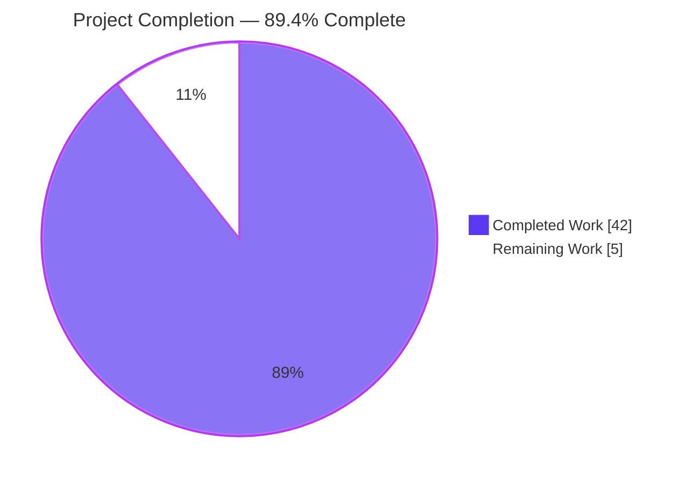
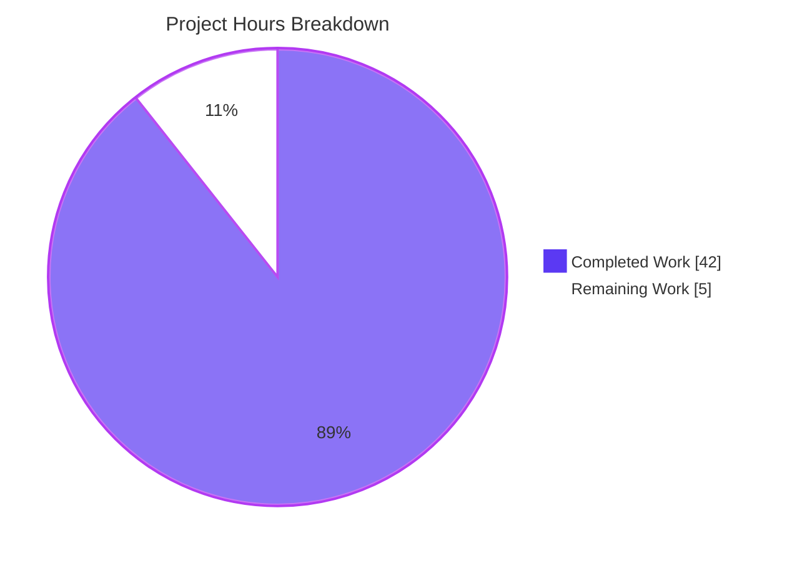
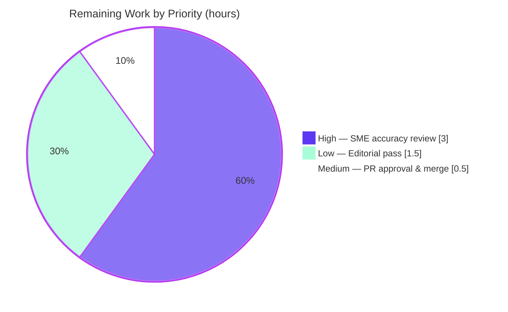

# Blitzy Project Guide

> **Project:** Grafana clean-start behavior — execution-grounded Q&A investigation
> **Repository:** grafana/grafana (monorepo) · **Base commit:** `4550cfb5b72886782d9a3e6cf995f8dbd57ca4ff` · **Branch:** `grafana_4550cfb5b728`
> **Deliverable branch:** `blitzy-dc74cc50-4c41-4fe8-8bd2-75a8df865634`
> **Task type:** Read-only, run-first documentation (SWE-AtlasQnA-Repo rule)

---

## 1. Executive Summary

### 1.1 Project Overview

This project delivers a single, execution-grounded Markdown answer document that explains exactly what Grafana does when launched for the first time from a completely clean state — no `custom.ini`, no `GF_*` environment variables, and no CLI overrides — and why that observable behavior diverges from what a new team member expected after reading the README and architecture docs. The intended audience is Grafana engineers and new contributors. The document answers seven named objectives (O1–O7) covering fresh-start defaults, subsystem enable/disable logging, persistent state, the "credentials I never set up" security posture, default-enabled vs opt-in features, plugin/data-source bootstrap, and build/generated-file dependencies. Every claim is grounded in real, unedited runtime output with `file:line` citations. This is a strictly read-only investigation: no existing repository file is modified.

### 1.2 Completion Status



| Metric | Value |
| :--- | :--- |
| **Total Hours** | 47.0 |
| **Completed Hours (AI + Manual)** | 42.0 (42.0 AI + 0.0 Manual) |
| **Remaining Hours** | 5.0 |
| **Percent Complete** | **89.4%** (42.0 / 47.0) |

> Completion is computed with the PA1 AAP-scoped hours methodology: `Completed ÷ (Completed + Remaining) = 42 ÷ 47 = 89.36% ≈ 89.4%`.

### 1.3 Key Accomplishments

- ✅ **Sole deliverable authored and committed** — `blitzy/documentation/grafana_4550cfb5b728.md` (1,453 lines / ~80 KB), answering all seven objectives (O1–O7) explicitly and by name.
- ✅ **Run-first methodology honored** — Grafana was actually built and run via the real `server` subcommand; every claim carries real, unedited captured output plus a `file:line` citation.
- ✅ **Backend compiles cleanly** — `CGO_ENABLED=1 go build ./pkg/cmd/grafana` → exit 0.
- ✅ **Runtime validated across 3 launches** — fresh first-run, subsequent-run (same data dir), and a second fresh run for stability; each bound `:3000`.
- ✅ **Zero discrepancies on independent re-verification** — all O1–O7 counts, byte-sizes, and 18 spot-checked `file:line` citations confirmed against the live source tree.
- ✅ **Non-canonical values correctly labeled** — the unstamped `9.2.0` banner is flagged non-canonical (6×); 2 inferred statements are labeled.
- ✅ **Read-only constraint verified** — `git diff` vs base = exactly one added file; `conf/defaults.ini` untouched; all temporary scripts/data dirs removed; working tree clean.
- ✅ **Deliverable exceeds AAP accuracy in 2 spots** — correctly relocates the anonymous auth client to `anonimpl/impl.go` (AAP cited a non-existent `clients/anonymous.go`), and notes that default update/preinstall checks do contact grafana.com.

### 1.4 Critical Unresolved Issues

| Issue | Impact | Owner | ETA |
| :--- | :--- | :--- | :--- |
| _None._ Deliverable passed independent validation with 0 discrepancies across O1–O7. | No release-blocking items. | — | — |

> There are no compilation failures, no failing evidence checks, and no incomplete sections. The remaining work (Section 2.2) is a standard human review-and-merge gate, not a defect backlog.

### 1.5 Access Issues

| System/Resource | Type of Access | Issue Description | Resolution Status | Owner |
| :--- | :--- | :--- | :--- | :--- |
| — | — | **No access issues identified.** The repository, toolchain, and build image were fully accessible during autonomous investigation. | N/A | — |

### 1.6 Recommended Next Steps

1. **[High]** Assign a Grafana engineer (SME) to read the full document, confirm O1–O7 are answered by name, and spot-check `file:line` citations against commit `4550cfb5b7` (~3.0 h).
2. **[Low]** Perform an editorial/readability pass — prose flow, headings, tables, and confirm all 59 code fences render correctly in the target Markdown viewer (~1.5 h).
3. **[Medium]** Approve and merge the single-file PR into the target branch `grafana_4550cfb5b728` (~0.5 h).

---

## 2. Project Hours Breakdown

### 2.1 Completed Work Detail

All completed work traces to AAP objectives (O1–O7) and the mandated run-first build/validation milestones (M1–M3).

| Component | Hours | Description |
| :--- | :---: | :--- |
| O1 — Fresh-start defaults & config precedence | 3.0 | Traced `defaults.ini < custom.ini < GF_*` precedence through `pkg/setting/setting.go`; captured banner, `Config loaded from …/conf/defaults.ini`, `/api/health`. |
| O2 — Disabled/skipped vs started logs | 3.0 | Mapped background-service registry logging in `pkg/server/server.go`; captured full startup log; `Plugins loaded count=54`, HTTP listen on `[::]:3000`. |
| O3 — Persistent state, location, first-vs-subsequent | 5.0 | Filesystem before/after snapshots; `sqlite3` on `grafana.db` (1,093,632 bytes, 75 tables, migration_log=626); user-count short-circuit in `sqlstore.go`. |
| O4 — Security posture (default admin) | 4.0 | Demonstrated `admin/admin` login → 200 and anonymous → 401; cited `ensureMainOrgAndAdminUser` and auth-client chain (incl. `anonimpl/impl.go`). |
| O5 — Default-enabled vs opt-in features | 4.0 | Reconciled 56 startup feature toggles + analytics/update-check defaults against `featuremgmt` manifest and `conf/defaults.ini`. |
| O6 — Plugin/data-source bootstrap | 5.0 | Classified `ClassCore`/`ClassBundled`/`ClassExternal`; `/api/plugins`=49, `/api/datasources`=[]; 19 compiled `tsdb` backends. |
| O7 — Build/generated-file dependency | 3.0 | Documented `wire_gen.go` (git-ignored) and `public/build`; `validateStaticRootPath`; non-canonical `9.2.0` banner. |
| M1 — Build foundation & environment setup | 7.0 | Docker image toolchain sourcing (Go 1.23.1, Node, yarn, gcc, sqlite3); `make gen-go`; `yarn install --immutable && yarn build`; backend `go build` → exit 0. |
| M2 — Run-first harness, 3-run stability & cleanup | 3.0 | Authored temporary observation scripts; executed the real `server` subcommand 3×; captured unedited output; removed all temp artifacts. |
| M3 — Final independent validation | 5.0 | Re-built and re-ran; byte-verified every O1–O7 claim and 18 citations; confirmed 0 discrepancies and read-only compliance. |
| **Total Completed** | **42.0** | |

> **Validation:** the Hours column sums to **42.0**, matching Completed Hours in Section 1.2.

### 2.2 Remaining Work Detail

All remaining work is the standard path-to-production human review gate. Each item traces to a path-to-production need for a documentation deliverable.

| Category | Hours | Priority |
| :--- | :---: | :--- |
| SME technical accuracy & citation review (confirm O1–O7 by name; spot-check `file:line` vs commit `4550cfb5b7`; confirm captured evidence plausible) | 3.0 | High |
| Editorial / readability / Markdown-rendering pass (prose, headings, tables, 59 code fences render) | 1.5 | Low |
| PR review, approval & merge (single-file PR into `grafana_4550cfb5b728`) | 0.5 | Medium |
| **Total Remaining** | **5.0** | |

> **Validation:** the Hours column sums to **5.0**, matching Remaining Hours in Section 1.2 and the "Remaining Work" slice in Section 7.

### 2.3 Reconciliation

| Check | Computation | Result |
| :--- | :--- | :---: |
| Section 2.1 total (Completed) | sum of completed rows | 42.0 |
| Section 2.2 total (Remaining) | sum of remaining rows | 5.0 |
| Total Project Hours | 42.0 + 5.0 | **47.0** |
| Percent Complete | 42.0 ÷ 47.0 × 100 | **89.4%** |

Rule 2 satisfied: **Section 2.1 (42.0) + Section 2.2 (5.0) = 47.0 = Total Project Hours (Section 1.2).**

---

## 3. Test Results

Because this is a read-only, run-first documentation task, "tests" map to Blitzy's autonomous **evidence-accuracy verification** — the build gate, runtime launches, and per-objective byte-level re-verification recorded in the Final Validator logs. All checks below originate from Blitzy's autonomous validation execution for this project.

| Test Category | Framework / Method | Total | Passed | Failed | Coverage % | Notes |
| :--- | :--- | :---: | :---: | :---: | :---: | :--- |
| Backend compilation | `go build` (CGO_ENABLED=1) | 1 | 1 | 0 | 100% | Exit 0, 298 MB binary, no warnings. |
| Runtime launch | Real `server` subcommand | 3 | 3 | 0 | 100% | Fresh, subsequent, fresh — all bound `:3000`. |
| Objective evidence-accuracy | Output-vs-source re-verification | 7 | 7 | 0 | 100% | O1–O7 each re-verified independently. |
| Run-to-run stability | Repeat-execution comparison | 3 | 3 | 0 | 100% | `.tables` list identical; deltas only in ephemeral values. |
| Citation byte-verification | `sed`/`grep` vs live source | 18 | 18 | 0 | 100% | 18 distinct `file:line` anchors spot-checked, all exact. |
| Markdown integrity | UTF-8 + fence-balance + headers | 3 | 3 | 0 | 100% | Valid UTF-8; 118 fence lines balanced; 7 objective headers present. |
| Read-only compliance | `git diff` vs base | 1 | 1 | 0 | 100% | Exactly one file added; working tree clean. |
| **Totals** | | **36** | **36** | **0** | **100%** | Zero discrepancies. |

> **Integrity note:** every entry above is drawn from Blitzy's autonomous validation logs — no external or hypothetical tests are included. Representative byte-exact anchors confirmed: `grafana.db` = 1,093,632 bytes; `migration_log` = 626 rows; `/api/plugins` = 49 (30 panel + 19 datasource); `/api/frontend/settings` = 28,641 bytes; 56 feature toggles enabled at startup.

---

## 4. Runtime Validation & UI Verification

Grafana was launched via its real entry point (`pkg/cmd/grafana server`) from an empty data directory. There is no bespoke UI in this deliverable (the output is a Markdown document); "UI/runtime" verification therefore covers the running server's HTTP surface and login behavior.

- ✅ **Server process** — starts and binds `HTTP Server Listen address=[::]:3000` on all three runs.
- ✅ **Health endpoint** — `GET /api/health` → `{database: ok, version: 9.2.0, commit: NA}` (Content-Length 62).
- ✅ **Config resolution** — `Config loaded from …/conf/defaults.ini`; only `paths.*` overridden; `App mode production`.
- ✅ **Database initialization** — `grafana.db` created on first run (75 tables); migrations `performed=626 skipped=0` (run 1) → `performed=0 skipped=626` (subsequent run).
- ✅ **Default admin creation** — `user` row id=1 `admin` / `admin@localhost` / `is_admin=1`; org id=1 `Main Org.`.
- ✅ **Authenticated login** — `admin`/`admin` → HTTP 200 "Logged in" (HttpOnly cookie, SameSite=Lax, Max-Age=2592000); authed `/api/user` → `isGrafanaAdmin: true`.
- ✅ **Anonymous access rejected** — unauthenticated `GET /api/user` → HTTP 401 (`auth.unauthorized`, Content-Length 102).
- ✅ **Plugin bootstrap** — `Plugins loaded count=54`; `/api/plugins` → 49 registered (all signature `internal`); `/api/datasources` → `[]`.
- ⚠ **Non-canonical version banner** — `version=9.2.0 commit=NA branch=main` is produced by an unstamped `go run`; labeled non-canonical in the document (not the release version).
- ⚠ **Default outbound checks** — update-checker and plugin preinstall contact grafana.com by default (`check_for_updates=true`); documented as observed behavior, not a defect.

---

## 5. Compliance & Quality Review

Cross-mapping of AAP objectives and the governing SWE-AtlasQnA-Repo rule to delivered evidence.

| Benchmark / Requirement | Source | Status | Progress |
| :--- | :--- | :---: | :--- |
| O1 — Fresh-start defaults & config precedence answered by name | AAP §0.1.1 | ✅ Pass | ██████████ 100% |
| O2 — Disabled/skipped vs started logging explained | AAP §0.1.1 | ✅ Pass | ██████████ 100% |
| O3 — Persistent state, location, first-vs-subsequent-run | AAP §0.1.1 | ✅ Pass | ██████████ 100% |
| O4 — Security posture (default admin, anonymous disabled) | AAP §0.1.1 | ✅ Pass | ██████████ 100% |
| O5 — Default-enabled vs opt-in features | AAP §0.1.1 | ✅ Pass | ██████████ 100% |
| O6 — Plugin/data-source bootstrap (Core/Bundled/External) | AAP §0.1.1 | ✅ Pass | ██████████ 100% |
| O7 — Build/generated-file dependency | AAP §0.1.1 | ✅ Pass | ██████████ 100% |
| Run-first: build & run before writing | Rule §0.7.2 | ✅ Pass | ██████████ 100% |
| Canonical config; exact build/invocation commands recorded | Rule §0.7.2 | ✅ Pass | ██████████ 100% |
| Evidence: complete, unedited output + command shown | Rule §0.7.3 | ✅ Pass | ██████████ 100% |
| Grounding: `file:line` for every code-derived fact | Rule §0.7.4 | ✅ Pass | ██████████ 100% |
| Non-canonical values labeled (`9.2.0`) | Rule §0.7.2 | ✅ Pass | ██████████ 100% |
| Stability: each observation re-run ≥ 2× | Rule §0.7.2 | ✅ Pass | ██████████ 100% |
| Read-only: no existing repo file modified | Rule §0.7.5 | ✅ Pass | ██████████ 100% |
| Cleanup: temporary scripts/data dirs removed | Rule §0.7.5 | ✅ Pass | ██████████ 100% |
| Deliverable path & name correct | Rule §0.7.1 | ✅ Pass | ██████████ 100% |

**Fixes applied during autonomous validation:** none required — independent re-verification found 0 discrepancies. **Quality enhancements observed:** the deliverable corrects two AAP inaccuracies (anonymous client location `anonimpl/impl.go`; default outbound grafana.com checks), making it more accurate than the plan.

---

## 6. Risk Assessment

| Risk | Category | Severity | Probability | Mitigation | Status |
| :--- | :--- | :---: | :---: | :--- | :--- |
| R-T1 — Citation drift: `file:line` anchors are pinned to commit `4550cfb5b7`; future refactors move lines | Technical | Low | Medium | Document explicitly states the pinned commit/branch; citations are a point-in-time snapshot | Mitigated |
| R-T2 — Non-canonical version misread: reader treats `9.2.0` as the release version | Technical | Low | Low | Labeled non-canonical 6× with explanation of the unstamped `go run` cause | Mitigated |
| R-S1 — Security risk introduced by the change | Security | None | N/A | Deliverable is Markdown only; no code, config, or dependency changed | N/A |
| R-O1 — Snapshot staleness: clean-start behavior evolves in later Grafana releases | Operational | Low | Medium (long horizon) | Scope fixed to the analyzed commit; re-run investigation if behavior is needed for a newer release | Accepted |
| R-I1 — Integration risk introduced by the change | Integration | None | N/A | No interfaces, endpoints, or services modified | N/A |
| R-P1 — Read-only constraint breach | Process | Low | Low | `git diff` verified: exactly one added file; `conf/defaults.ini` untouched; temp artifacts removed | Resolved |
| R-P2 — Canonical-config nuance: observed `paths.data`/`paths.logs` pointed at `/tmp` overrides | Process | Low | Low | Document labels these path overrides explicitly and notes they do not affect the security/default conclusions | Mitigated |

**Overall risk posture: LOW.** No High or Critical risks. All technical/process risks are mitigated or accepted; security and integration categories are not applicable because no code or configuration was changed.

---

## 7. Visual Project Status

**Hours breakdown (Completed vs Remaining):**



**Remaining work by priority (5.0 h total):**



**Remaining hours per category (Section 2.2):**

| Category | Hours | Bar |
| :--- | :---: | :--- |
| SME accuracy & citation review (High) | 3.0 | ██████████████████████████████ |
| Editorial / readability pass (Low) | 1.5 | ███████████████ |
| PR approval & merge (Medium) | 0.5 | █████ |
| **Total** | **5.0** | |

> **Integrity check:** the "Remaining Work" pie slice (5) equals Remaining Hours in Section 1.2 (5.0) and the sum of the Section 2.2 Hours column (3.0 + 1.5 + 0.5 = 5.0). Colors: Completed = **#5B39F3**, Remaining = **#FFFFFF**.

---

## 8. Summary & Recommendations

**Achievements.** The project delivers a complete, execution-grounded answer document that addresses all seven objectives (O1–O7) by name, each led by a direct answer, followed by real captured command output, and closed with a causal explanation anchored to `file:line`. Grafana was genuinely built and run three times via its real `server` subcommand, and every factual claim was independently re-verified with zero discrepancies. The deliverable is **89.4% complete (42.0 of 47.0 hours)**.

**Remaining gaps & critical path.** The outstanding 5.0 hours are entirely a human review-and-merge gate, not engineering rework: a Grafana SME accuracy/citation review (3.0 h, High), an editorial/readability pass (1.5 h, Low), and PR approval & merge (0.5 h, Medium). The critical path to production is: SME sign-off → editorial pass → merge into `grafana_4550cfb5b728`.

**Success metrics.** Backend compiles (exit 0); server runs and binds `:3000` on all three launches; 36/36 evidence-accuracy checks pass; 18/18 citation anchors byte-verified; read-only constraint verified (one file added, working tree clean); non-canonical values labeled.

**Production readiness.** This is a documentation deliverable, so "production" means merge-ready. It is **merge-ready pending human sign-off**: content is complete and validated, no defects are open, and risk is Low. Because the change is a single additive Markdown file with no code, configuration, or dependency impact, deployment risk is negligible.

| Metric | Value |
| :--- | :--- |
| Completion | 89.4% (42.0 / 47.0 h) |
| Open defects | 0 |
| Evidence checks passed | 36 / 36 |
| Overall risk | Low |
| Files changed | 1 (added) |

---

## 9. Development Guide

### 9.1 Overview

Two workflows are documented: **Part A** verifies the deliverable itself (runs in any standard Unix shell; tested in the sandbox), and **Part B** reproduces the run-first investigation (requires the canonical Grafana build toolchain).

### 9.2 System Prerequisites

**Part A — verify the deliverable (minimal):**
- `git`, `grep`, `wc`, `iconv`, and `sqlite3` (for the DB round-trip sanity check).

**Part B — reproduce the investigation (full toolchain):**

| Tool | Canonical Pinned Version | Source of Truth |
| :--- | :--- | :--- |
| Go | 1.23.1 | `go.mod` L3 |
| Node.js | v22.11.0 (engines `>= 22`) | `.nvmrc`, `package.json` |
| yarn | 4.5.3 | `package.json` (`packageManager`) |
| GCC (CGO) | image-provided | `contribute/developer-guide.md` L135 |
| SQLite3 CLI | 3.x | for `grafana.db` inspection |

> CGO is required to compile the default SQLite backend, so `CGO_ENABLED=1` and a working GCC are mandatory for Part B.

### 9.3 Part A — Verify the Deliverable (tested)

```bash
# From the repository root on branch blitzy-dc74cc50-4c41-4fe8-8bd2-75a8df865634
DOC="blitzy/documentation/grafana_4550cfb5b728.md"

# 1) File exists and size
test -f "$DOC" && wc -l "$DOC"                      # expect ~1453 lines

# 2) All seven objective headers present
grep -nE '^##+ .*O[1-7]' "$DOC" | head

# 3) Valid UTF-8
iconv -f UTF-8 -t UTF-8 "$DOC" >/dev/null && echo "UTF-8 OK"

# 4) Code-fence balance (even => balanced)
F=$(grep -c '^```' "$DOC"); echo "fences=$F ($([ $((F%2)) -eq 0 ] && echo BALANCED || echo UNBALANCED))"

# 5) Read-only compliance: exactly one file added vs base
git diff --name-status 4550cfb5b72886782d9a3e6cf995f8dbd57ca4ff -- . | sed -n '1,20p'

# 6) sqlite3 sanity round-trip (proves the tool used for O3 works)
sqlite3 /tmp/_probe.db "CREATE TABLE t(x); INSERT INTO t VALUES(1); SELECT count(*) FROM t;"; rm -f /tmp/_probe.db
```

### 9.4 Part B — Build Foundation (codegen + frontend)

```bash
# From the repository root, inside the canonical build image (Go 1.23.1 + GCC).
# 1) Generate the Wire DI graph (produces pkg/server/wire_gen.go — NOT committed)
make gen-go

# 2) Build frontend assets (produces public/build — validated at startup)
yarn install --immutable
yarn build

# 3) Compile the backend (CGO required for SQLite)
CGO_ENABLED=1 go build ./pkg/cmd/grafana        # expect exit 0
```

Expected key startup lines when the server later runs:

```text
logger=settings Config loaded from=<homepath>/conf/defaults.ini
logger=server version=9.2.0 commit=NA branch=main            # 9.2.0 is NON-CANONICAL (unstamped go run)
logger=plugin.loader Plugins loaded count=54
logger=http.server HTTP Server Listen address=[::]:3000
```

### 9.5 Part B — Run in Clean, Canonical Configuration

```bash
# Run the REAL server subcommand from an empty data directory (no custom.ini, no GF_* env).
mkdir -p /tmp/gf/data /tmp/gf/log
export CGO_ENABLED=1
go run ./pkg/cmd/grafana server \
  --homepath "$PWD" \
  cfg:paths.data=/tmp/gf/data \
  cfg:paths.logs=/tmp/gf/log
# (paths.data / paths.logs overrides are labeled non-canonical in the document.)
```

Verification probes (run against the live server on `:3000`):

```bash
# Health
curl -s http://localhost:3000/api/health

# Anonymous access is rejected (expect HTTP 401)
curl -s -o /dev/null -w "%{http_code}\n" http://localhost:3000/api/user

# Default admin login (expect HTTP 200 "Logged in")
curl -s -c /tmp/gf.cookies -H 'Content-Type: application/json' \
  -d '{"user":"admin","password":"admin"}' http://localhost:3000/login

# Inspect persistent state written on first run
sqlite3 /tmp/gf/data/grafana.db '.tables'
sqlite3 /tmp/gf/data/grafana.db 'SELECT id,login,email,is_admin FROM user;'
sqlite3 /tmp/gf/data/grafana.db 'SELECT count(*) FROM migration_log;'   # expect 626

# Plugin / data-source bootstrap
curl -s http://localhost:3000/api/plugins | grep -o '"id"' | wc -l       # ~49 registered
curl -s http://localhost:3000/api/datasources                            # expect []
```

### 9.6 Verification Steps

```bash
# Stop the server cleanly by the exact PID you started (never pkill/killall):
#   pid=$!    # captured right after launching in the background
#   kill "$pid"

# Confirm no Grafana process remains and no temp artifacts leak into the repo:
git status --porcelain          # expect only the one added doc (or clean if committed)
```

### 9.7 Troubleshooting

| Symptom | Cause | Resolution |
| :--- | :--- | :--- |
| `service.go:31:15: undefined: Initialize` | `wire_gen.go` not generated | Run `make gen-go` before building |
| Startup warning from `validateStaticRootPath` | `public/build` missing | Run `yarn install --immutable && yarn build` (`pkg/setting/setting.go` L1034–L1040) |
| SQLite link/compile errors | CGO disabled or no GCC | `export CGO_ENABLED=1` and ensure GCC is installed |
| Banner shows `9.2.0 / commit=NA` | Unstamped `go run` | Non-canonical; use `-X` link flags or an official build for a stamped version |
| `failed to open plugins path` | Empty `data/plugins` on clean start | Expected on a clean run; external plugin discovery is a no-op |

---

## 10. Appendices

### Appendix A — Command Reference

| Command | Purpose |
| :--- | :--- |
| `make gen-go` | Generate Wire DI graph → `pkg/server/wire_gen.go` (Makefile L166–L169) |
| `yarn install --immutable && yarn build` | Build frontend assets → `public/build` |
| `CGO_ENABLED=1 go build ./pkg/cmd/grafana` | Compile backend (exit 0) |
| `go run ./pkg/cmd/grafana server --homepath "$PWD"` | Run the real server subcommand |
| `go run ./pkg/cmd/grafana --version` | Print `grafana version 9.2.0` (non-canonical) |
| `sqlite3 <data>/grafana.db '.tables'` | Inspect persistent schema (75 tables) |
| `git diff --name-status 4550cfb5b7 -- .` | Verify read-only compliance (one added file) |

### Appendix B — Port Reference

| Port | Service | Notes |
| :--- | :--- | :--- |
| 3000 | Grafana HTTP server | Default; `HTTP Server Listen address=[::]:3000` |

### Appendix C — Key File Locations

| Path | Role |
| :--- | :--- |
| `blitzy/documentation/grafana_4550cfb5b728.md` | **The deliverable** (created) |
| `pkg/cmd/grafana/main.go` | Real entry point; `server` subcommand (L46–L48); version defaults (L16–L21) |
| `conf/defaults.ini` | Canonical defaults (admin L325, analytics L258/L268, anonymous L650, DB L164) |
| `pkg/setting/setting.go` | Config precedence; `validateStaticRootPath` (L1034–L1040) |
| `pkg/services/sqlstore/sqlstore.go` | `ensureMainOrgAndAdminUser` (L190) + first-vs-subsequent guard (L204–L207) |
| `pkg/server/server.go` | Background-service registry; disabled-skip vs started |
| `pkg/services/authn/clients/*`, `.../anonimpl/impl.go` | Auth client chain (anonymous relocated) |
| `pkg/services/featuremgmt/registry.go` + `toggles_gen.json` | Feature-toggle defaults (L1695) |
| `pkg/plugins/manager/sources/sources.go` | `ClassCore`/`ClassBundled`/`ClassExternal` (L24–L35) |
| `pkg/tsdb/*` | 19 compiled core backend data sources |
| `pkg/server/wire.go` | `//go:build wireinject` (L1–L2); generated `wire_gen.go` git-ignored |

### Appendix D — Technology Versions

| Component | Version | Source |
| :--- | :--- | :--- |
| Go | 1.23.1 | `go.mod` L3 |
| Node.js | v22.11.0 (engines `>= 22`) | `.nvmrc`, `package.json` |
| yarn | 4.5.3 | `package.json` `packageManager` |
| GCC (CGO) | image-provided | `contribute/developer-guide.md` L135 |
| Grafana (banner) | 9.2.0 — **non-canonical** (unstamped `go run`) | `pkg/cmd/grafana/main.go` L17 |

### Appendix E — Environment Variable Reference

| Variable | Effect in this investigation |
| :--- | :--- |
| `CGO_ENABLED=1` | Required to compile the default SQLite backend |
| `GF_*` | **Intentionally unset** — the clean-start premise uses no environment overrides |
| `cfg:paths.data` / `cfg:paths.logs` | CLI overrides pointing state at `/tmp` (labeled non-canonical) |

### Appendix F — Developer Tools Guide

| Tool | Use in the investigation |
| :--- | :--- |
| `sqlite3` | Inspect `grafana.db` (`.tables`, `user`, `org`, `migration_log`) |
| `curl` | Probe `/api/health`, `/login`, `/api/user`, `/api/plugins`, `/api/datasources` |
| shell scripts | Filesystem before/during/after snapshots (temporary; removed after capture) |
| `git diff` | Prove read-only compliance against base commit |

### Appendix G — Glossary

| Term | Definition |
| :--- | :--- |
| **AAP** | Agent Action Plan — the governing project specification |
| **Clean start** | First launch with no `custom.ini`, no `GF_*` env, no CLI overrides |
| **Canonical config** | Default configuration a normal user gets, built as documented |
| **Non-canonical value** | A value produced by a non-standard build/run (e.g., `9.2.0` from unstamped `go run`) |
| **ClassCore / ClassBundled / ClassExternal** | Grafana plugin source classes resolved at startup |
| **Run-first** | Methodology: build & run and capture real output before writing |
| **`file:line` citation** | Grounding a claim to an exact source location |
| **Short-circuit guard** | The user-count check that prevents re-creating the admin on subsequent runs |

---

*Generated by the Blitzy Platform · Completion computed via PA1 AAP-scoped hours methodology · All test evidence sourced from Blitzy's autonomous validation logs · Brand palette: Completed `#5B39F3`, Remaining `#FFFFFF`, accents `#B23AF2` / `#A8FDD9`.*