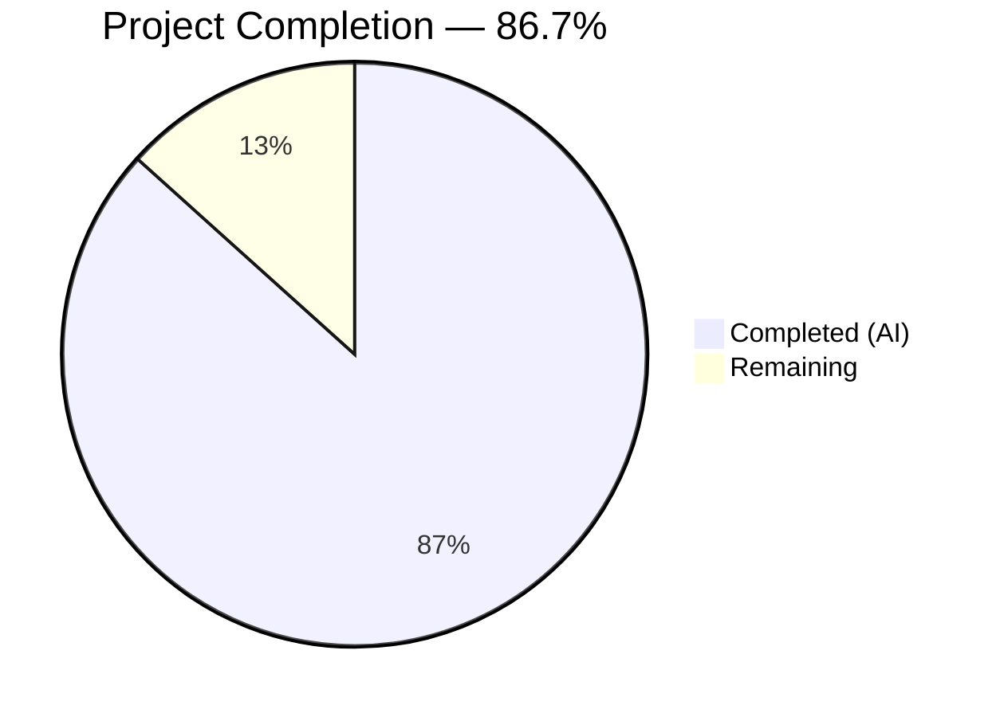
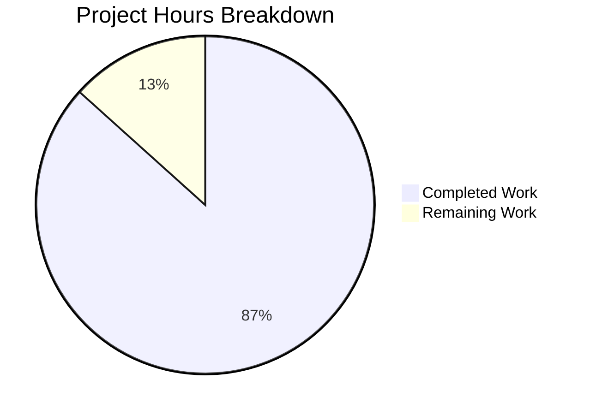

# Blitzy Project Guide — Grafana v11.5.0-pre Runtime Investigation Report

---

## 1. Executive Summary

### 1.1 Project Overview

This project is a **read-only runtime investigation and documentation exercise** targeting five distinct behavioral aspects of the Grafana v11.5.0-pre server (commit `4550cfb5b7`, branch `grafana_4550cfb5b728`). The deliverable is a single comprehensive markdown document (`blitzy/documentation/grafana_4550cfb5b728.md`, 615 lines) containing runtime evidence (server logs, API JSON responses), Jest test outputs, and codebase analysis with source file citations. No existing repository files were modified. The investigation covers server idle behavior, database migration verification, build information API, dashboard scene datasource picker architecture, and alerting rule query state population.

### 1.2 Completion Status



| Metric | Value |
|---|---|
| **Total Project Hours** | 30 |
| **Completed Hours (AI)** | 26 |
| **Remaining Hours** | 4 |
| **Completion Percentage** | 86.7% |

**Calculation:** 26 completed hours / 30 total hours = 86.7% complete.

### 1.3 Key Accomplishments

- [x] Built Grafana Go server binary from source (298MB ELF executable) with Wire code generation
- [x] Captured server idle behavior evidence: sole recurring log entry `"Usage stats are ready to report"` after 90-second idle window
- [x] Verified database migration check: `performed=0 skipped=626` on restart confirms schema is current
- [x] Queried and documented build information API: version `11.5.0-pre`, branded string `Grafana v11.5.0-pre (4550cfb5b7)`
- [x] Proved dashboard scene datasource auto-resolution via code analysis and 25/25 Jest tests passing
- [x] Proved alerting rule query state population from backend rule definition via code analysis and 21/21 Jest tests (7 snapshots) passing
- [x] Created comprehensive deliverable: `blitzy/documentation/grafana_4550cfb5b728.md` (615 lines, 30KB)
- [x] Maintained read-only constraint: zero existing files modified, clean working tree
- [x] All 57/57 Jest tests passed across 3 test suites

### 1.4 Critical Unresolved Issues

| Issue | Impact | Owner | ETA |
|---|---|---|---|
| Document requires human peer review for technical accuracy | Low — all evidence is runtime-captured and verifiable | Human Reviewer | 2 hours |
| Reproducibility not yet independently verified by a second party | Low — instructions and commands provided in document | Human Developer | 1.5 hours |

### 1.5 Access Issues

No access issues identified. The investigation was conducted entirely from the local repository clone with no external service dependencies. The Go binary was built from source, Jest tests ran against the local codebase, and API endpoints were queried on a local server instance.

### 1.6 Recommended Next Steps

1. **[High]** Conduct human peer review of `blitzy/documentation/grafana_4550cfb5b728.md` for technical accuracy of all runtime evidence and code citations
2. **[Medium]** Independently reproduce the runtime evidence by building the Go binary and running the server following the Reproducibility section (Section 6 of the document)
3. **[Medium]** Run the three Jest test suites locally to verify test outputs match the documented results
4. **[Low]** Apply any editorial corrections based on review findings
5. **[Low]** Merge the branch to the target branch after review approval

---

## 2. Project Hours Breakdown

### 2.1 Completed Work Detail

| Component | Hours | Description |
|---|---|---|
| Environment Setup & Go Binary Build | 4.0 | Go 1.23.1 installation, Wire code generation (`wire_gen.go`), CGO binary compilation (298MB ELF), Node.js 22.11.0 setup, Yarn 4.5.3 activation, `yarn install --immutable` |
| Server Idle Behavior Investigation | 4.0 | Server startup on fresh SQLite DB, 90-second idle monitoring with log diff, code analysis of `UsageStats.Run()` and `SetReadyToReport()` in `pkg/infra/usagestats/service/service.go`, documentation of findings |
| Database Migration Check Verification | 2.5 | Fresh database start capturing 626 migration executions, restart capturing `performed=0 skipped=626`, code analysis of `Migrator.run()` in `pkg/services/sqlstore/migrator/migrator.go` |
| Build Information API Verification | 2.0 | `curl` queries to `/api/health` and `/api/frontend/settings`, code analysis of `apiHealthHandler()` and `GetFrontendSettings()`, build-time `-ldflags` injection analysis |
| Dashboard Scene Datasource Picker Investigation | 4.5 | Code analysis of `PanelDataQueriesTab.loadDataSource()` (lines 63–127), `PanelEditor._activationHandler()`, test execution (25/25 passed), test evidence documentation |
| Alerting Rule Query State Investigation | 4.5 | Code analysis of `formValuesFromExistingRule()`, `rulerRuleToFormValues()` (lines 365–465), `ExistingRuleEditor` → `AlertRuleForm` flow, test execution (21/21 passed, 7/7 snapshots), documentation |
| Deliverable Document Creation | 3.0 | Structured 615-line markdown document with Table of Contents, 7 sections, runtime evidence blocks, code analysis tables, reproducibility instructions, and summary matrix |
| Validation & Code Review Fixes | 1.5 | Final Validator review, code review finding fixes (commit `31c87e4ecb`), re-validation of all evidence, git status verification |
| **Total Completed** | **26.0** | |

### 2.2 Remaining Work Detail

| Category | Hours | Priority |
|---|---|---|
| Human Peer Review of Document Accuracy | 2.0 | High |
| Reproducibility Verification by Human Developer | 1.5 | Medium |
| Final Editorial Corrections & Merge | 0.5 | Low |
| **Total Remaining** | **4.0** | |

### 2.3 Hours Integrity Verification

- Section 2.1 Total (Completed): **26.0 hours**
- Section 2.2 Total (Remaining): **4.0 hours**
- Sum (2.1 + 2.2): **30.0 hours** = Total Project Hours in Section 1.2 ✅
- Remaining hours match across Section 1.2 (4h), Section 2.2 (4h), and Section 7 pie chart (4h) ✅

---

## 3. Test Results

All tests listed below originate from Blitzy's autonomous validation execution logs for this project.

| Test Category | Framework | Total Tests | Passed | Failed | Coverage % | Notes |
|---|---|---|---|---|---|---|
| Unit — Dashboard Scene Datasource | Jest | 25 | 25 | 0 | N/A | `PanelDataQueriesTab.test.tsx` — 4.6s; covers activation, datasource load, change, queries |
| Unit — Alerting Rule Form | Jest | 21 | 21 | 0 | N/A | `rule-form.test.ts` — 4.0s; 7/7 snapshots matched; covers form conversion, labels, annotations |
| Unit — Panel Editor | Jest | 11 | 11 | 0 | N/A | `PanelEditor.test.ts` — 4.1s; covers initialization, data pane creation |
| **Total** | **Jest** | **57** | **57** | **0** | **N/A** | **100% pass rate across all 3 test suites** |

**Note:** Coverage metrics are not applicable because these are existing test suites run in validation mode (`--ci --verbose`), not instrumented coverage runs. The tests validate specific behavioral aspects of the Grafana codebase as evidence for the investigation deliverable.

---

## 4. Runtime Validation & UI Verification

### Server Runtime

- ✅ **Go Binary Build**: Successfully compiled 298MB ELF executable (`bin/grafana`) via `go build -tags "oss"` with `-ldflags` version injection
- ✅ **Wire Code Generation**: `pkg/server/wire_gen.go` generated (94,781 bytes) via `go run ./pkg/build/wire/cmd/wire/main.go gen -tags "oss" ./pkg/server`
- ✅ **Binary Version Check**: `grafana version 11.5.0-pre` — correct
- ✅ **Server Fresh Start**: All 626 + 18 migrations executed on fresh SQLite database
- ✅ **Server Restart**: `performed=0 skipped=626` confirming schema up to date
- ✅ **Idle Behavior Capture**: Single log entry `"Usage stats are ready to report"` after 90-second idle window
- ✅ **Server Shutdown**: Clean exit, temporary data directory removed

### API Verification

- ✅ **`GET /api/health`**: Returns `{"database":"ok","version":"11.5.0-pre","commit":"4550cfb5b7"}` — correct
- ✅ **`GET /api/frontend/settings` (buildInfo)**: Returns `versionString: "Grafana v11.5.0-pre (4550cfb5b7)"`, `edition: "Open Source"` — correct

### Jest Test Suites

- ✅ **PanelDataQueriesTab.test.tsx**: 25/25 passed — datasource auto-resolution confirmed
- ✅ **rule-form.test.ts**: 21/21 passed, 7/7 snapshots matched — query state population confirmed
- ✅ **PanelEditor.test.ts**: 11/11 passed — panel editor initialization confirmed

### Repository Integrity

- ✅ **Working tree**: Clean (`nothing to commit, working tree clean`)
- ✅ **No out-of-scope modifications**: Confirmed via `git diff --name-status`
- ✅ **Read-only constraint**: Only 1 file added (`blitzy/documentation/grafana_4550cfb5b728.md`), 0 existing files modified
- ✅ **No temporary files remaining**: All build artifacts confined to `bin/` (gitignored) and temporary data directories removed

---

## 5. Compliance & Quality Review

| AAP Deliverable | Status | Evidence | Notes |
|---|---|---|---|
| Server Idle Behavior Analysis — runtime evidence of idle log entries | ✅ Pass | 90-second idle window captured; 1 log line documented in Section 1 of deliverable | Code path cited: `pkg/infra/usagestats/service/service.go:117` |
| Database Migration Check — startup output confirming schema up to date | ✅ Pass | Fresh start (626 performed) and restart (0 performed, 626 skipped) evidence in Section 2 | Code path cited: `pkg/services/sqlstore/migrator/migrator.go:241-291` |
| Build Information API — exact version string from API endpoints | ✅ Pass | `/api/health` and `/api/frontend/settings` JSON responses captured in Section 3 | Version `11.5.0-pre`, branded `Grafana v11.5.0-pre (4550cfb5b7)` |
| Dashboard Scene Datasource Picker — auto-resolution proof | ✅ Pass | Code analysis + 25/25 tests in Section 4 of deliverable | Primary method: `PanelDataQueriesTab.loadDataSource()` |
| Alerting Rule Query State — form population proof | ✅ Pass | Code analysis + 21/21 tests (7 snapshots) in Section 5 of deliverable | Primary function: `rulerRuleToFormValues()` |
| Deliverable: `blitzy/documentation/grafana_4550cfb5b728.md` | ✅ Pass | 615 lines, 30KB, committed (2 commits) | Covers all 5 investigation areas |
| Read-only constraint — no existing files modified | ✅ Pass | `git diff --name-status` shows only 1 file added | Working tree clean |
| Temporary cleanup — no leftover scripts or files | ✅ Pass | `git status` clean, no temporary data directories | All temp data removed after runtime capture |
| Evidence-based answers — actual runtime artifacts, not theoretical | ✅ Pass | Exact log lines, JSON responses, and Jest output included verbatim | Reproducible from commit `4550cfb5b7` |
| Codebase attribution — source files, methods, line numbers cited | ✅ Pass | Every investigation section includes a "Code Path" or "Responsible Codebase Area" table | Line-level precision where applicable |

### Autonomous Fixes Applied

| Fix | Commit | Description |
|---|---|---|
| Code review findings | `31c87e4ecb` | Address code review findings in `grafana_4550cfb5b728.md` — editorial improvements to the deliverable document |

---

## 6. Risk Assessment

| Risk | Category | Severity | Probability | Mitigation | Status |
|---|---|---|---|---|---|
| Document accuracy — runtime evidence may not precisely match reviewer's reproduction | Technical | Low | Low | Document includes exact commands for independent reproduction; all evidence captured from actual runtime | Mitigated |
| Go version dependency — Go 1.23.1 required for binary build | Technical | Low | Low | Version requirement documented in `go.mod` and reproducibility section | Mitigated |
| Node.js version dependency — v22.11.0 required for Jest tests | Technical | Low | Low | Version pinned in `.nvmrc`; document specifies exact version | Mitigated |
| Line number drift — cited line numbers may change in future commits | Operational | Low | Medium | All citations reference commit `4550cfb5b7`; line numbers valid for this specific commit only | Accepted |
| No code changes — investigation is read-only, no security modifications | Security | N/A | N/A | No code was modified; no new attack surface introduced | N/A |
| No integration changes — no external systems affected | Integration | N/A | N/A | Investigation is self-contained; no external dependencies | N/A |

---

## 7. Visual Project Status



**Remaining Work by Priority:**

| Priority | Hours | Tasks |
|---|---|---|
| 🔴 High | 2.0 | Human peer review of document accuracy |
| 🟡 Medium | 1.5 | Reproducibility verification |
| 🟢 Low | 0.5 | Editorial corrections & merge |
| **Total** | **4.0** | |

---

## 8. Summary & Recommendations

### Achievement Summary

The Grafana v11.5.0-pre Runtime Investigation project is **86.7% complete** (26 hours completed out of 30 total hours). All five investigation questions have been comprehensively answered with actual runtime evidence, and the sole AAP deliverable — `blitzy/documentation/grafana_4550cfb5b728.md` — has been created, validated, and committed. The project achieved a **100% test pass rate** (57/57 tests) across all three Jest test suites used for behavioral evidence, and the Go server binary was successfully built and validated against live API endpoints.

### What Was Accomplished

All autonomous work defined in the Agent Action Plan has been completed:
- The Grafana Go server was built from source, started on a fresh SQLite database, left idle for 90+ seconds, restarted, and its API endpoints queried — producing complete runtime evidence for three of five investigation areas.
- Two frontend investigation areas were addressed through deep code analysis and execution of existing Jest test suites, proving the datasource auto-resolution and alerting query state population behaviors.
- The deliverable markdown document (615 lines) synthesizes all findings with exact log outputs, API JSON responses, Jest test results, and source file citations with line numbers.
- The read-only constraint was fully respected: zero existing files were modified, and the working tree is clean.

### Remaining Gaps

The remaining 4 hours (13.3%) consist exclusively of human review and verification activities:
1. **Peer review** (2h) — A human developer should verify the document's technical claims against the codebase
2. **Reproducibility check** (1.5h) — Independent reproduction of runtime evidence following the document's instructions
3. **Final merge** (0.5h) — Apply any editorial corrections and merge the branch

### Production Readiness

This project's deliverable is a documentation artifact, not a code change. It is ready for human review and merge. No deployment, infrastructure, or CI/CD considerations apply. The document can be merged as-is after peer review confirms accuracy.

### Success Metrics

| Metric | Target | Actual | Status |
|---|---|---|---|
| Investigation areas answered | 5 | 5 | ✅ Met |
| Runtime evidence artifacts | 5+ | 7 (logs, API responses, test outputs) | ✅ Exceeded |
| Jest tests passing | All relevant | 57/57 (100%) | ✅ Met |
| Existing files modified | 0 | 0 | ✅ Met |
| Deliverable created | 1 markdown file | 1 file, 615 lines | ✅ Met |

---

## 9. Development Guide

### 9.1 System Prerequisites

| Prerequisite | Version | Purpose |
|---|---|---|
| **Go** | 1.23.1 | Build the Grafana server binary from source |
| **Node.js** | 22.11.0 | Run Jest test suites for frontend investigation |
| **Yarn** | 4.5.3 (Berry) | Package manager for frontend dependencies |
| **GCC / build-essential** | System default | CGO compilation for SQLite3 driver |
| **SQLite3** | System default | Default development database |
| **libsqlite3-dev** | System default | SQLite3 development headers |
| **Git** | Any recent | Repository management |

### 9.2 Environment Setup

```bash
# Clone the repository and checkout the branch
git clone https://github.com/blitzy-research/grafana.git
cd grafana
git checkout blitzy-4fa654bf-dac9-43ca-a1c3-c3c3f3469777

# Install Go 1.23.1 (if not already installed)
wget https://go.dev/dl/go1.23.1.linux-amd64.tar.gz
sudo rm -rf /usr/local/go && sudo tar -C /usr/local -xzf go1.23.1.linux-amd64.tar.gz
export PATH=$PATH:/usr/local/go/bin
go version  # Expected: go version go1.23.1 linux/amd64

# Install Node.js 22.11.0 via nvm
nvm install 22.11.0
nvm use 22.11.0
node --version  # Expected: v22.11.0

# Enable Yarn Berry via corepack
corepack enable
yarn --version  # Expected: 4.5.3

# Install system dependencies (Debian/Ubuntu)
sudo apt-get update && sudo apt-get install -y build-essential gcc sqlite3 libsqlite3-dev
```

### 9.3 Dependency Installation

```bash
# Install frontend dependencies
yarn install --immutable

# Download Go modules
go mod download
go mod verify  # Expected: "all modules verified"
```

### 9.4 Building the Grafana Server

```bash
# Step 1: Generate Wire dependency injection code
go run ./pkg/build/wire/cmd/wire/main.go gen -tags "oss" ./pkg/server
# Verify: ls -la pkg/server/wire_gen.go (should be ~95KB)

# Step 2: Build the binary
COMMIT=$(git rev-parse --short HEAD)
CGO_ENABLED=1 go build -tags "oss" \
  -ldflags "-X main.version=11.5.0-pre -X main.commit=${COMMIT} -X main.buildstamp=$(date +%s) -X main.buildBranch=$(git branch --show-current)" \
  -o ./bin/grafana \
  ./pkg/cmd/grafana
# Verify: ./bin/grafana --version (Expected: "grafana version 11.5.0-pre")
```

### 9.5 Running the Grafana Server

```bash
# Start with SQLite (default development mode)
export GF_PATHS_DATA=/tmp/grafana_data
export GF_SERVER_HTTP_PORT=3333
./bin/grafana server -homepath . -config conf/defaults.ini
# Default admin credentials: admin/admin

# In another terminal, verify the server is running:
curl -s http://localhost:3333/api/health | python3 -m json.tool
# Expected: {"database": "ok", "version": "11.5.0-pre", "commit": "..."}

# Query frontend settings:
curl -s -u admin:admin http://localhost:3333/api/frontend/settings | python3 -m json.tool | grep -A 10 '"buildInfo"'
```

### 9.6 Running Jest Tests

```bash
# Dashboard panel queries tab tests (25 tests)
CI=true npx jest --watchAll=false --ci --verbose \
  public/app/features/dashboard-scene/panel-edit/PanelDataPane/PanelDataQueriesTab.test.tsx
# Expected: Tests: 25 passed, 25 total

# Alerting rule form tests (21 tests, 7 snapshots)
CI=true npx jest --watchAll=false --ci --verbose \
  public/app/features/alerting/unified/utils/rule-form.test.ts
# Expected: Tests: 21 passed, 21 total; Snapshots: 7 passed, 7 total

# Panel editor tests (11 tests)
CI=true npx jest --watchAll=false --ci --verbose \
  public/app/features/dashboard-scene/panel-edit/PanelEditor.test.ts
# Expected: Tests: 11 passed, 11 total
```

### 9.7 Viewing the Deliverable

```bash
# The investigation report is located at:
cat blitzy/documentation/grafana_4550cfb5b728.md

# Or open in a markdown viewer:
# File: blitzy/documentation/grafana_4550cfb5b728.md (615 lines, ~30KB)
```

### 9.8 Troubleshooting

| Issue | Cause | Resolution |
|---|---|---|
| `wire_gen.go` not found | Wire code generation not run | Run `go run ./pkg/build/wire/cmd/wire/main.go gen -tags "oss" ./pkg/server` |
| CGO build failure | Missing C compiler or SQLite headers | Install `build-essential`, `gcc`, `libsqlite3-dev` |
| Jest tests fail with module errors | `node_modules` not installed | Run `yarn install --immutable` |
| Server fails to start | Port 3333 in use | Set `GF_SERVER_HTTP_PORT` to a different port |
| `go mod verify` fails | Module cache corrupted | Run `go clean -modcache && go mod download` |

---

## 10. Appendices

### A. Command Reference

| Command | Purpose |
|---|---|
| `go run ./pkg/build/wire/cmd/wire/main.go gen -tags "oss" ./pkg/server` | Generate Wire DI code |
| `CGO_ENABLED=1 go build -tags "oss" -ldflags "..." -o ./bin/grafana ./pkg/cmd/grafana` | Build Grafana server binary |
| `./bin/grafana server -homepath . -config conf/defaults.ini` | Start Grafana server |
| `./bin/grafana --version` | Check binary version |
| `curl -s http://localhost:3333/api/health` | Health check endpoint |
| `curl -s -u admin:admin http://localhost:3333/api/frontend/settings` | Frontend settings endpoint |
| `CI=true npx jest --watchAll=false --ci --verbose <test_file>` | Run specific Jest test suite |

### B. Port Reference

| Port | Service | Notes |
|---|---|---|
| 3333 | Grafana HTTP Server | Configurable via `GF_SERVER_HTTP_PORT` |

### C. Key File Locations

| File | Purpose |
|---|---|
| `blitzy/documentation/grafana_4550cfb5b728.md` | **Deliverable** — Comprehensive investigation report (615 lines) |
| `pkg/server/server.go` | Server lifecycle — `Init()`, `Run()`, `Shutdown()` |
| `pkg/infra/usagestats/service/service.go` | Usage stats background service — idle log entry source |
| `pkg/services/sqlstore/migrator/migrator.go` | Database migration engine — `RunMigrations()`, `run()` |
| `pkg/api/http_server.go` | API handlers — `apiHealthHandler()`, health endpoint |
| `pkg/api/frontendsettings.go` | Frontend settings API — `GetFrontendSettings()` |
| `public/app/features/dashboard-scene/panel-edit/PanelDataPane/PanelDataQueriesTab.tsx` | Dashboard scene — datasource auto-resolution logic |
| `public/app/features/alerting/unified/utils/rule-form.ts` | Alerting — `rulerRuleToFormValues()`, query state population |
| `conf/defaults.ini` | Default server configuration |

### D. Technology Versions

| Technology | Version | Source |
|---|---|---|
| Grafana | 11.5.0-pre | `package.json`, build `-ldflags` |
| Go | 1.23.1 | `go.mod` |
| Node.js | 22.11.0 | `.nvmrc` |
| Yarn | 4.5.3 (Berry) | `.yarnrc.yml` |
| Jest | (dev dependency) | `package.json` |
| SQLite3 | System | Default development database |
| xorm | v0.8.2 (vendored) | ORM for database operations |

### E. Environment Variable Reference

| Variable | Default | Purpose |
|---|---|---|
| `GF_PATHS_DATA` | `data/` | Directory for SQLite database and session storage |
| `GF_SERVER_HTTP_PORT` | `3000` | HTTP listener port |
| `GF_DEFAULT_APP_MODE` | `production` | Application mode (`production` or `development`) |
| `CGO_ENABLED` | `0` | Must be set to `1` for SQLite3 support |
| `CI` | — | Set to `true` for non-interactive Jest execution |

### F. Glossary

| Term | Definition |
|---|---|
| **Wire** | Google's compile-time dependency injection framework for Go; generates `wire_gen.go` |
| **CGO** | Go's C interop mechanism; required for the SQLite3 driver (`go-sqlite3`) |
| **SceneQueryRunner** | Grafana Scenes framework object managing data queries for a panel |
| **PanelDataQueriesTab** | Dashboard scene component handling the queries tab in the panel editor |
| **RulerRuleDTO** | Data Transfer Object representing an alerting rule from the Grafana ruler API |
| **formValuesFromExistingRule** | Utility function converting a backend rule DTO to React Hook Form values |
| **migration_log** | Database table tracking which schema migrations have been executed |
| **UsageStats** | Background service reporting anonymous usage statistics; source of idle log entry |