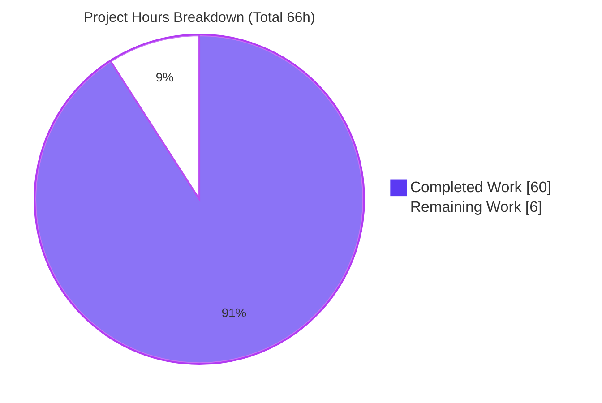
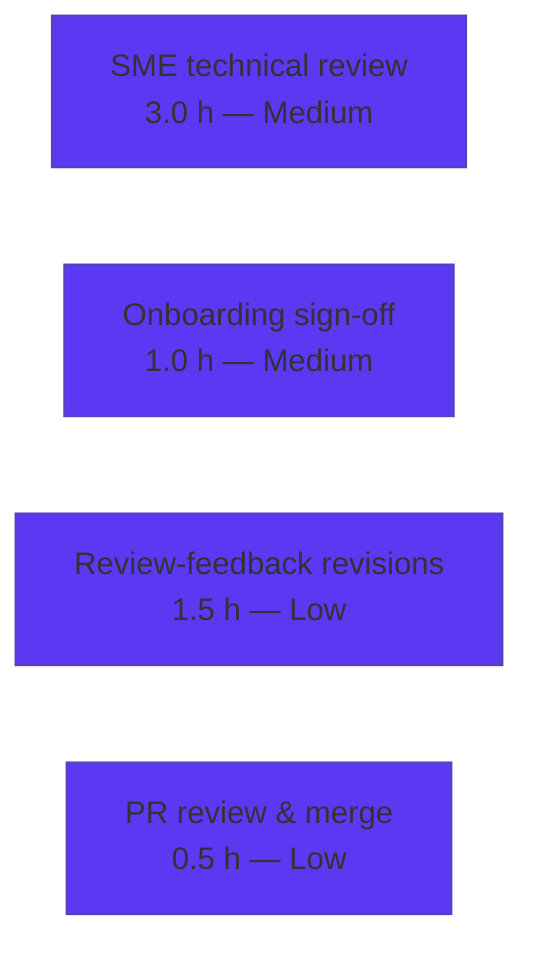

# Blitzy Project Guide — Grafana Unified Alerting Scheduler Runtime Investigation

> **Brand color key:** <span style="color:#5B39F3">■</span> **Completed / AI Work — Dark Blue `#5B39F3`** · <span style="color:#FFFFFF">□</span> **Remaining / Not Completed — White `#FFFFFF`**. Headings/accents use Violet‑Black `#B23AF2`; highlights use Mint `#A8FDD9`.

---

## 1. Executive Summary

### 1.1 Project Overview

This project delivers a single investigative documentation artifact — `blitzy/documentation/grafana_4550cfb5b728.md` — that explains, from live reproduced runtime evidence rather than code reading alone, how Grafana's Unified Alerting **scheduler** (`pkg/services/ngalert/schedule`) behaves under stress. It answers three onboarding questions (work‑selection under backpressure and first visibility; cancellation vs. removal footprints; ordering preservation) and adds a stressed‑vs‑normal comparison. The target user is an engineer onboarding into the Grafana backend. The scope is strictly **read‑only** against the source tree: the sole change is one new Markdown file; all observation harnesses were temporary and removed. Business impact: faster, evidence‑backed comprehension of a subtle concurrency subsystem.

### 1.2 Completion Status


| Metric | Value |
|--------|-------|
| **Total Hours** | **66** |
| **Completed Hours (AI + Manual)** | **60** (AI/autonomous 60 + Manual 0) |
| **Remaining Hours** | **6** |
| **Percent Complete** | **90.9%** (60 ÷ 66) |

> Completion is computed with the PA1 AAP‑scoped, hours‑based method: `Completion% = Completed ÷ (Completed + Remaining) = 60 ÷ 66 = 90.9%`. All remaining hours are human path‑to‑production (review + merge); there is **no** outstanding autonomous engineering work.

### 1.3 Key Accomplishments

- ✅ Built the pinned Grafana backend (Go 1.23.1) in its canonical configuration (`make build-server`, exit 0).
- ✅ **Q1** — Captured the scheduler's per‑tick work‑selection: `isReadyToRun` readiness, the `Rule is ready to run on the current tick` DEBUG line, UID‑sorted `time.AfterFunc` load‑spread dispatch, the `Tick dropped because alert rule evaluation is too slow` WARN, and its `grafana_alerting_schedule_rule_evaluations_missed_total` counter — including the honest correction that `scheduler_behind_seconds` measures heartbeat‑loop lag (≈0), **not** backpressure.
- ✅ **Q2** — Reproduced **four** distinct termination footprints (deletion, mid‑flight cancellation, restart, shutdown) with before/during/after state via read‑only SQLite (AAP asked for ≥3).
- ✅ **Q3** — Proved ordering preservation (single goroutine + unbuffered `evalCh` per rule ⇒ drop‑newest, never reorder): **0** inversions across 2,931 / 610 / 745 processing‑tick events.
- ✅ Completed the mandatory **stressed‑vs‑normal** comparison (identical 40‑rule scenario; 1 s vs 10 s tick) with a 14‑dimension side‑by‑side matrix, each value confirmed stable across ≥2 runs.
- ✅ Authored the 1,509‑line / 99,982‑byte deliverable with ~60 exact `file:line` citations and per‑claim reasoning.
- ✅ Preserved read‑only scope (source byte‑identical to pinned commit `4550cfb5b7`; manifests untouched) and removed every temporary artifact; working tree is clean.
- ✅ Independent autonomous validation passed all 5 gates with **zero edits required**.

### 1.4 Critical Unresolved Issues

| Issue | Impact | Owner | ETA |
|-------|--------|-------|-----|
| _None_ — no blocking issues. Validator certified PRODUCTION‑READY with zero edits and zero unresolved discrepancies. | N/A | N/A | N/A |

> The only outstanding work is human review/merge (Section 1.6, Section 2.2). No compilation, test, or accuracy defects remain.

### 1.5 Access Issues

| System/Resource | Type of Access | Issue Description | Resolution Status | Owner |
|-----------------|----------------|-------------------|-------------------|-------|
| _None_ | — | No access issues identified. Build, unit tests, and read‑only git verification all ran offline within the provided environment; no external credentials or third‑party services were required (the data source was a local mock lever). | Resolved / N/A | — |

### 1.6 Recommended Next Steps

1. **[Medium]** Have a Grafana Unified Alerting SME review the document's technical accuracy — focus on §2.4 (`behind_seconds` semantics), §3 (termination footprints), and §4 (zero‑inversion result). _(HT‑1, 3h)_
2. **[Medium]** Obtain onboarding/readability sign‑off from the requesting engineer that the doc closes the runtime‑behavior gap and is independently reproducible. _(HT‑2, 1h)_
3. **[Low]** Incorporate any review feedback as minor revisions to the single document. _(HT‑3, 1.5h)_
4. **[Low]** Approve and merge the doc‑only pull request. _(HT‑4, 0.5h)_

> There are **no [High]/blocking** next steps — a direct consequence of the production‑ready, zero‑edit validation result.

---

## 2. Project Hours Breakdown

### 2.1 Completed Work Detail

<span style="color:#5B39F3">■ Completed (AI/autonomous) — Dark Blue `#5B39F3`</span>

| Component | Hours | Description |
|-----------|------:|-------------|
| Canonical build & observable runtime harness | 6 | `make build-server`; debug `grafana.ini` (enable `[unified_alerting]`, `[log] level=debug`, `scheduler_tick_interval`); `/metrics` scraping; slow (15 s) / timeout (45 s > 30 s) mock Prometheus data source (the timeout lever). |
| Q1 — work‑selection & first‑visibility investigation | 10 | `processTick` readiness (`isReadyToRun`), `Rule is ready to run on the current tick` DEBUG, UID‑sort + `time.AfterFunc` spread (`step=base/len`), `behind_seconds` nuance, `Tick dropped…too slow` WARN + `…rule_evaluations_missed_total`, 30 s timeout footprint; `TestProcessTicks` corroboration. |
| Q2 — termination‑footprint investigation (4 paths) | 9 | Deletion (`DeleteStateByRuleUID` + `expireAndSend` resolved notification + `Stopping alert rule routine`), mid‑flight cancellation (state write skipped), restart (`errRuleRestarted`, state left), shutdown (SIGINT, state persisted); before/during/after via read‑only `sqlite3`. |
| Q3 — ordering‑preservation investigation | 6 | Single goroutine + unbuffered `evalCh` proof; drop‑newest‑wins; monotonic `now=`/`scheduledAt`; Python inversion scan; drop unit test corroboration. |
| Stressed‑vs‑normal comparative study | 6 | Identical 40‑rule scenario at 1 s and 10 s tick; 14‑dimension side‑by‑side matrix; ≥2 runs per profile for stability. |
| Document authoring (1,509 lines) | 14 | 6 sections / 30+ subsections; embedded unedited log/metric output; per‑claim reasoning; anchor reference table. |
| Citation verification & non‑fabrication audit | 4 | ~60 `file:line` citations verified EXACT; 24 `msg="…"` strings confirmed verbatim in source; formulas/defaults confirmed. |
| Autonomous 5‑gate validation & 2× reproduction | 5 | Build, citation, unit‑test, runtime, and read‑only/cleanup gates; independent re‑runs of stress + normal. |
| **Total Completed** | **60** | Matches Section 1.2 Completed Hours. |

### 2.2 Remaining Work Detail

<span style="color:#FFFFFF">□ Remaining (human path‑to‑production) — White `#FFFFFF`</span>

| Category | Hours | Priority |
|----------|------:|----------|
| SME technical‑accuracy review (Grafana alerting expert) | 3 | Medium |
| Onboarding/readability reviewer sign‑off | 1 | Medium |
| Incorporate review feedback / minor revisions | 1.5 | Low |
| PR review & merge approval (doc‑only) | 0.5 | Low |
| **Total Remaining** | **6** | Matches Section 1.2 Remaining Hours and Section 7 pie. |

### 2.3 Totals & Reconciliation

| Line | Hours |
|------|------:|
| Section 2.1 Completed total | 60 |
| Section 2.2 Remaining total | 6 |
| **Total Project Hours** (2.1 + 2.2) | **66** |
| **Percent Complete** (60 ÷ 66) | **90.9%** |

> **Integrity:** Remaining = 6 h is identical in Sections 1.2, 2.2, and 7. `2.1 + 2.2 = 60 + 6 = 66 = ` Total in Section 1.2. ✅

---

## 3. Test Results

All results below originate from **Blitzy's autonomous validation logs** for this project and were independently re‑executed during this assessment.

| Test Category | Framework | Total Tests | Passed | Failed | Coverage % | Notes |
|---------------|-----------|:-----------:|:------:|:------:|:----------:|-------|
| Unit — scheduler package | Go `testing` + `benbjohnson/clock` fake clock | 169 | 169 | 0 | N/A¹ | `go test -short -count=1 ./pkg/services/ngalert/schedule/` → `ok 3.207s` (validator: 3.210s), exit 0. 13 top‑level funcs incl. subtests. |
| Unit — 4 cited subtests | Go `testing` (fake clock) | 4 | 4 | 0 | N/A¹ | `TestProcessTicks` (+"scheduled rules should be sorted"); `TestRuleRoutine`/"clean up the state if delete is cancellation reason"; `TestRuleRoutine`/"not clear the state if parent context is cancelled"; `TestAlertRule`/"eval should drop any concurrent sending to evalCh". |
| Runtime scenario — STRESS | Live Grafana backend (2× runs) | 2 | 2 | 0 | — | 1 s tick, 40 rules, slow/timeout mock. Hundreds→~1,600 `Tick dropped` WARNs; **drops == missed 1:1**; 30 s timeout footprint (`context deadline exceeded`, attempts 1/2/3). |
| Runtime scenario — NORMAL | Live Grafana backend (2× runs) | 2 | 2 | 0 | — | 10 s tick, fast mock. **0 drops**; ms‑scale eval durations; smooth unbroken cadence; identical rules hash. |
| Runtime scenario — Q2 termination paths | Live Grafana + read‑only `sqlite3` | 4 | 4 | 0 | — | Deletion / mid‑flight cancel / restart / shutdown footprints reproduced. |
| Runtime scenario — Q3 ordering | Live logs + Python inversion scan | 3 | 3 | 0 | — | **0** ordering inversions across 2,931 / 610 / 745 processing‑tick events. |
| **Totals** | — | **184** | **184** | **0** | — | 100% pass across unit + runtime scenario validations. |

> ¹ Coverage % is not a deliverable metric for this **read‑only documentation** task (no source was modified). The unit tests are cited as deterministic corroboration of the documented mechanisms, and all 169 pass.

---

## 4. Runtime Validation & UI Verification

**UI Verification:** Not applicable. This is a **backend (Go) runtime investigation**; the frontend/Node.js toolchain is explicitly out of scope per AAP §0.3.2. No UI was built or changed.

**Runtime health (live backend):**
- ✅ **Operational** — Server builds (`make build-server`, exit 0; 298 MB binary) and boots under both configurations.
- ✅ **Operational** — Scheduler emits the documented DEBUG/WARN lines at `level=debug` (`Starting scheduler`, `Rule is ready to run on the current tick`, `Processing tick`/`Tick processed`, `Tick dropped…too slow`, `Stopping alert rule routine`).
- ✅ **Operational** — Prometheus `/metrics` exposes the `grafana_alerting_*` counters/gauges cited in the document.

**Scenario outcomes:**
- ✅ **Operational** — STRESS: `Tick dropped` WARNs with `drops == grafana_alerting_schedule_rule_evaluations_missed_total` 1:1; 30 s timeout surfaces as `context deadline exceeded` across 3 attempts.
- ✅ **Operational** — NORMAL: 0 drops, smooth 10 s cadence, ms‑scale evaluations.
- ✅ **Operational** — Q2: four termination footprints distinctly observed (deletion cleans up state + resolved notification; cancellation skips the state write; restart/shutdown leave state in place / persist to disk).
- ✅ **Operational** — Q3: `now=`/`scheduledAt` strictly monotonic per rule; every dropped tick exactly one interval older than the survivor; **0** inversions.

**API / integration outcomes:**
- ✅ **Operational** — Mock Prometheus data source functioned as the slow/timeout lever (test lever, explicitly labeled non‑canonical in doc §6.5).
- ⚠ **Partial (by design)** — `grafana_alerting_scheduler_behind_seconds` stayed ≈0 (sub‑millisecond) rather than rising; this is the documented, corrected finding (it measures heartbeat‑loop lag, not per‑rule backpressure), not a failure.

---

## 5. Compliance & Quality Review

Cross‑mapping the AAP's "SWE‑AtlasQnA‑Repo" mandatory rules and deliverables to observed outcomes.

| Benchmark / AAP Rule | Requirement | Status | Progress | Evidence |
|----------------------|-------------|:------:|:--------:|----------|
| Deliverable (0.7.1) | Exactly one file `blitzy/documentation/grafana_4550cfb5b728.md` | ✅ Pass | 100% | 1,509 lines; sole diff vs pinned |
| Run‑first methodology (0.7.2) | Build & run before writing; answer from observed output | ✅ Pass | 100% | Doc §1 build/run banners; embedded live output throughout |
| Canonical build/config (0.7.2) | Default build via real entry point; exact commands stated | ✅ Pass | 100% | `make build-server`; doc §1.2–§1.3 |
| Stability ≥2 runs (0.8.1) | Values stable across ≥2 runs; report scale/duration | ✅ Pass | 100% | Doc §5.5, §2.9, §4.5; validator 2× re‑runs |
| Two‑run comparison (0.8.1) | Identical scenario stressed **and** normal | ✅ Pass | 100% | Doc §5.1 14‑dimension matrix |
| Coverage of every condition (0.7.3) | Primary + secondary/error/edge/transitional states | ✅ Pass | 100% | 4 termination paths; before/during/after state |
| Evidence & exactness (0.7.4) | Unedited output + `file:line` + reasoning per claim | ✅ Pass | 100% | ~60 citations verified EXACT; §6.1–§6.2 |
| Read‑only scope (0.7.5) | No source file modified; only the doc added | ✅ Pass | 100% | Source byte‑identical to pinned; manifests unchanged |
| Cleanup (0.8.1) | All temporary artifacts removed | ✅ Pass | 100% | `/tmp/obs2`,`/tmp/obsval` gone; tree clean; ports free |
| Non‑fabrication | All log strings/metrics real | ✅ Pass | 100% | 24 `msg="…"` strings verbatim in source |
| Markdown integrity | Balanced fences, no BOM, clean newline | ✅ Pass | 100% | 132 fences (66 pairs), no BOM, trailing newline |
| Human SME acceptance | Expert + onboarding sign‑off | □ Pending | 0% | Section 2.2 (HT‑1/HT‑2) |

**Fixes applied during autonomous validation:** **Zero.** The document was found fully accurate; the validator required no edits. (The authoring agent itself iterated pre‑validation: initial draft → full "fresh‑evidence" refresh → a self‑evidence correction — see git history.)

**Outstanding compliance items:** Only human SME/readability acceptance (non‑autonomous by nature).

---

## 6. Risk Assessment

| Risk | Category | Severity | Probability | Mitigation | Status |
|------|----------|:--------:|:-----------:|------------|--------|
| T1 — Documentation drift/staleness if upstream scheduler code moves | Technical | Low‑Med | Medium | Every citation anchored to pinned commit `4550cfb5b7` (§6.2 anchor table, §6.5 caveat); treat as point‑in‑time snapshot | Documented / Accepted |
| T2 — Point‑in‑time counters legitimately vary run‑to‑run (timings, jitter, fingerprints, scrape counters) | Technical | Low | Low | §6.5 anticipates; stable values confirmed ≥2 runs, varying ones labeled | Mitigated |
| T3 — Dual build labels (banner v11.5.0/`commit=fed6d6df08` vs run binary 9.2.0) | Technical | Low | Low | §6.5 explains; git commit is authoritative identifier | Documented |
| S1 — New attack surface | Security | None | — | Doc‑only change; `go.mod`/`go.sum` untouched (no supply‑chain delta) | N/A / Resolved |
| S2 — Secret leakage in embedded output | Security | Low | Low | Content is scheduler logs/metrics, no credentials; validator non‑fabrication audit | Mitigated |
| O1 — Reproduction‑environment dependency (temp harness removed) | Operational | Low‑Med | Medium | Doc §1 gives exact commands/configs verbatim + scale; report §9 provides reproduction steps | Mitigated |
| O2 — No CI markdown‑lint gate (prettier/lefthook opt‑in; frontend out of scope) | Operational | Low | Low | Manual integrity check (balanced fences, no BOM, clean newline) | Mitigated |
| I1 — Doc‑only PR merge | Integration | Low | Very Low | One new file in new dir `blitzy/documentation/`; ~nil conflict risk | Accepted |
| I2 — External service integration | Integration | N/A | — | Investigation used a mock DS; production deliverable is a doc — nothing to integrate | N/A |
| A1 — Residual subtle inaccuracy despite validation | Accuracy | Low | Low | Triangulated (doc + 5 validator gates + citation spot‑checks); final gate is human SME review | Mitigated pending SME review |

**Overall risk posture:** **Low.** As a read‑only, validated, documentation‑only deliverable, the project introduces no runtime, security, or supply‑chain risk. The dominant residual risk is natural documentation staleness, mitigated by explicit pinned‑commit anchoring.

---

## 7. Visual Project Status



**Remaining hours by category (Section 2.2):**



> **Integrity:** Pie "Remaining Work" = 6 h equals Section 1.2 Remaining Hours and the Section 2.2 total. Pie "Completed Work" = 60 h equals Section 2.1 total. Completed slice uses `#5B39F3`; Remaining slice uses `#FFFFFF`.

---

## 8. Summary & Recommendations

**Achievements.** The project is **90.9% complete** (60 of 66 AAP‑scoped hours). Every AAP deliverable is finished: the canonical backend was built and driven into backpressure; all three user questions were answered from live evidence (Q1 work‑selection and the corrected `behind_seconds` insight; Q2's four distinct termination footprints; Q3's zero‑inversion ordering proof); the mandatory stressed‑vs‑normal comparison was quantified across 14 dimensions; and the 1,509‑line deliverable embeds unedited output with ~60 exact `file:line` citations. Read‑only scope was preserved (source byte‑identical to the pinned commit) and all temporary artifacts were removed.

**Remaining gaps.** The outstanding 6 hours are **entirely human path‑to‑production**: SME technical review (3 h), onboarding/readability sign‑off (1 h), any review‑feedback revisions (1.5 h), and PR merge (0.5 h). There is no autonomous engineering work left — no failing tests, no compilation gaps, no unresolved discrepancies (validator required zero edits).

**Critical path to production.** SME accuracy review → onboarding sign‑off → apply feedback → merge the doc‑only PR. Estimated wall‑clock: well under one working day once a reviewer is assigned.

**Success metrics.** ✅ Single‑file deliverable; ✅ 169/169 unit tests pass; ✅ stress/normal scenarios reproduced (drops==missed 1:1; 0 drops normal; 0 inversions); ✅ ~60 citations verified exact; ✅ read‑only invariant intact.

**Production‑readiness assessment.** **Ready for human review and merge.** The autonomous work is complete and independently validated; the deliverable is accurate, internally consistent, fully cited, non‑fabricated, and reproducible. Formal production acceptance awaits human sign‑off — reflected in the honest 90.9% (never 100%) completion figure.

| Metric | Value |
|--------|-------|
| AAP‑scoped completion | 90.9% |
| Completed / Total hours | 60 / 66 |
| Unit tests passed | 169 / 169 (100%) |
| Blocking issues | 0 |
| Source files modified | 0 (read‑only preserved) |
| Files created | 1 (the deliverable) |

---

## 9. Development Guide

> All commands below were executed and verified in the provided environment during this assessment.

### 9.1 System Prerequisites

- **OS:** Linux (verified on Ubuntu 25.10 container). **Disk:** ~10 GB free (Go build cache + module cache). **RAM:** 8 GB+ recommended.
- **Go 1.23.1** — verified: `go version go1.23.1 linux/amd64`.
- **Git 2.51.0** — verified.
- **(Full runtime only)** a data source and a `grafana.ini` enabling `[unified_alerting]` and `[log] level = debug`.

### 9.2 Environment Setup

```bash
# 1) Put the Go toolchain on PATH (required each shell)
source /etc/profile.d/go.sh
go version    # -> go version go1.23.1 linux/amd64

# 2) Enter the repository root
cd /tmp/blitzy/grafana/blitzy-c1320fad-13f7-4230-845a-4106d66675bf_c80291

# 3) IMPORTANT: this repo builds in Go WORKSPACE mode (go.work is present).
#    Do NOT set GOWORK=off or GOFLAGS=-mod=mod — both break the build with
#    module version skew. Use the defaults.
unset GOWORK GOFLAGS 2>/dev/null || true
```

### 9.3 Dependency Installation & Build

```bash
# Verify modules (works offline; cache is warm)
go mod verify                     # -> all modules verified

# Generate wire code, then build the server (canonical path)
make gen-go                       # generates gitignored pkg/server/wire_gen.go
make build-server                 # -> runs: go run build.go build-server ; exit 0

# Alternative direct binary build
go build -o ./bin/linux-amd64/grafana ./pkg/cmd/grafana
./bin/linux-amd64/grafana --version    # -> grafana version 9.2.0
```

### 9.4 Verify the Investigation Deterministically (no full server needed)

```bash
# Full cited scheduler package (fake-clock tests) — fast, hermetic
go test -short -count=1 ./pkg/services/ngalert/schedule/
# -> ok  github.com/grafana/grafana/pkg/services/ngalert/schedule  ~3.2s  (exit 0; 169 cases)

# Just the four subtests the document cites
go test -short -count=1 -run 'TestProcessTicks|TestAlertRule' ./pkg/services/ngalert/schedule/
# -> ok ... ~1.0s (exit 0)
```

### 9.5 Full Runtime Reproduction (optional, high‑fidelity)

Perform entirely **outside** the repository (e.g. under `/tmp`) so the tree stays clean:

1. Write two scratch `grafana.ini` files: **stress** (`[unified_alerting] scheduler_tick_interval = 1s`, plus the `configurableSchedulerTick` feature toggle) and **normal** (default 10 s tick). Both set `[log] level = debug`.
2. Start a mock Prometheus data source with a slow (~15 s) and a timeout (~45 s > 30 s) endpoint.
3. Launch the server against each ini with `--config=/tmp/.../grafana.ini`; register ~40 alert rules.
4. Tail logs and scrape metrics:
   ```bash
   grep -E 'Starting scheduler|Rule is ready|Tick dropped|Stopping alert rule routine' server.log
   curl -s http://localhost:3000/metrics | grep '^grafana_alerting_'
   ```
5. Compare the stress vs normal counters/log rhythm; then delete all scratch files.

### 9.6 Read‑Only Verification

```bash
git merge-base --is-ancestor 4550cfb5b72886782d9a3e6cf995f8dbd57ca4ff HEAD && echo "pinned is an ancestor of HEAD"
git diff --name-only 4550cfb5b72886782d9a3e6cf995f8dbd57ca4ff HEAD
# -> blitzy/documentation/grafana_4550cfb5b728.md   (only the doc)
git diff --name-only 4550cfb5b72886782d9a3e6cf995f8dbd57ca4ff HEAD -- go.mod go.sum package.json
# -> (empty: manifests unchanged)
git status --porcelain    # -> (empty: clean tree)
```

### 9.7 Troubleshooting

| Symptom | Cause | Resolution |
|---------|-------|------------|
| `-mod may only be set to readonly or vendor when in workspace mode` | `GOFLAGS=-mod=mod` set | `unset GOFLAGS` and rebuild (use workspace defaults) |
| `build failed`: undefined `GetAudience` / `claims.IdentityClaims` / `NewResourceInfo` | `GOWORK=off` disabled the workspace, causing module version skew | `unset GOWORK` and rebuild |
| `go: command not found` | Toolchain not on PATH | `source /etc/profile.d/go.sh` |
| Port 3000/9790 already in use | Prior server still running | Free the port before starting the server |
| Markdown fences look unbalanced | Editing the doc | Ensure ` ``` ` pairs stay even (132 fences = 66 pairs) |

---

## 10. Appendices

### Appendix A — Command Reference

| Command | Purpose |
|---------|---------|
| `source /etc/profile.d/go.sh` | Put Go 1.23.1 on PATH |
| `make gen-go` | Generate wire DI code (`pkg/server/wire_gen.go`, gitignored) |
| `make build-server` | Canonical server build (`go run build.go build-server`) |
| `go build -o ./bin/linux-amd64/grafana ./pkg/cmd/grafana` | Direct binary build |
| `go test -short -count=1 ./pkg/services/ngalert/schedule/` | Run cited scheduler unit tests |
| `go mod verify` | Verify module integrity (offline) |
| `curl -s http://localhost:3000/metrics \| grep '^grafana_alerting_'` | Scrape alerting metrics |
| `git diff --name-only 4550cfb5b7… HEAD` | Prove doc‑only change |

### Appendix B — Port Reference

| Port | Service | Notes |
|------|---------|-------|
| 3000 | Grafana HTTP server / `/metrics` | Default; used for runtime scrape |
| 9790 | Mock data source (investigation lever) | Temporary; removed after runs |

### Appendix C — Key File Locations

| Path | Role |
|------|------|
| `blitzy/documentation/grafana_4550cfb5b728.md` | **The deliverable** (only file added) |
| `pkg/services/ngalert/schedule/schedule.go` | Heartbeat loop, `processTick`, dispatch, behind gauge, drop WARN |
| `pkg/services/ngalert/schedule/alert_rule.go` | Per‑rule `ruleRoutine`, unbuffered `evalCh`, cancel/stop branches |
| `pkg/services/ngalert/schedule/registry.go` | `errRuleDeleted` / `errRuleRestarted` sentinels |
| `pkg/services/ngalert/metrics/scheduler.go` | `grafana_alerting_*` metric declarations |
| `pkg/util/ticker/ticker.go` | Heartbeat ticker ("never drops ticks") |
| `pkg/setting/setting_unified_alerting.go` | Timing/attempt defaults & config keys |
| `go.work` / `go.mod` | Workspace + module definitions (unchanged) |

### Appendix D — Technology Versions

| Component | Version | Source |
|-----------|---------|--------|
| Go toolchain | 1.23.1 | `go.mod` line 3; verified `go version` |
| Git | 2.51.0 | verified |
| Grafana (run binary label) | 9.2.0 | `--version` |
| Grafana (build‑banner label) | 11.5.0 / `commit=fed6d6df08` | `make build-server` banner (see doc §6.5) |
| `benbjohnson/clock` | pinned in `go.sum` | Fake‑clock test harness |
| `prometheus/client_golang` | pinned in `go.sum` | `grafana_alerting_*` instruments |
| Pinned base commit | `4550cfb5b72886782d9a3e6cf995f8dbd57ca4ff` | Authoritative code identifier |

### Appendix E — Environment Variable Reference

| Variable | Recommended | Purpose |
|----------|-------------|---------|
| `GOWORK` | _unset_ | Keep workspace mode on (repo uses `go.work`) — do **not** set `off` |
| `GOFLAGS` | _unset_ | Avoid `-mod=mod` (invalid in workspace mode) |
| `CI` | `true` | Non‑interactive tooling |
| `GOCACHE` / `GOMODCACHE` | warm (as provided) | Enables offline build/test |

### Appendix F — Developer Tools Guide

- **Build system:** GNU Make wrapping `build.go` (`make build-server`, `make gen-go`).
- **Test runner:** Go `testing` with `benbjohnson/clock` fake clock for deterministic tick/drop/ordering reproduction (no wall‑clock waits); run with `-short -count=1`.
- **Observability:** structured logs via `pkg/infra/log` at `level=debug`; Prometheus `/metrics` for `grafana_alerting_*` counters/gauges.
- **State inspection:** read‑only `sqlite3` queries against the scratch DB for before/during/after `alert_instance` rows (Q2).
- **Git forensics:** `git merge-base --is-ancestor`, `git diff --name-only`, `git status --porcelain` to prove read‑only scope.

### Appendix G — Glossary

| Term | Meaning |
|------|---------|
| `processTick` | Per‑tick scheduler routine that computes rule readiness and dispatches work (`schedule.go`) |
| `isReadyToRun` | Readiness test deciding whether a rule runs on the current tick |
| Load‑spread dispatch | Ready set sorted by UID and dispatched via `time.AfterFunc` at `step = baseInterval / len(ready)` |
| `behind_seconds` | `grafana_alerting_scheduler_behind_seconds` — heartbeat‑loop lag (≈0), **not** per‑rule backpressure |
| Missed evaluation | `Tick dropped…too slow` WARN + `…rule_evaluations_missed_total` counter increment |
| `evalCh` | Unbuffered per‑rule evaluation channel; one goroutine consumes it (ordering guarantee) |
| Drop‑newest‑wins | Busy routine drops the older pending tick so only the newest `scheduledAt` survives |
| `errRuleDeleted` / `errRuleRestarted` | Cancellation‑cause sentinels selecting the cleanup branch |
| Inversion | An out‑of‑order per‑rule evaluation (observed count: 0) |
| Pinned commit | `4550cfb5b72886782d9a3e6cf995f8dbd57ca4ff` — the authoritative source snapshot |