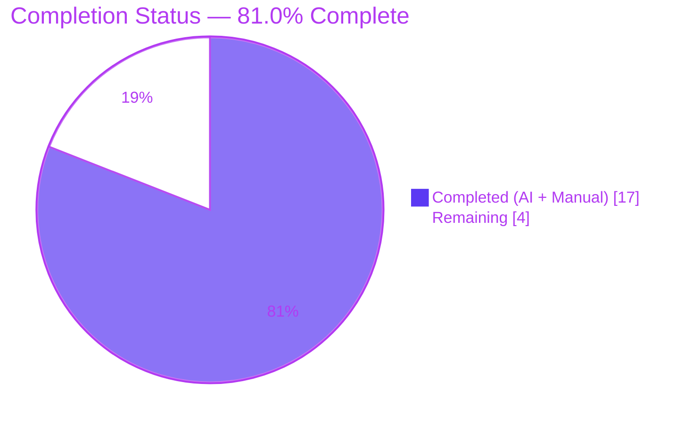
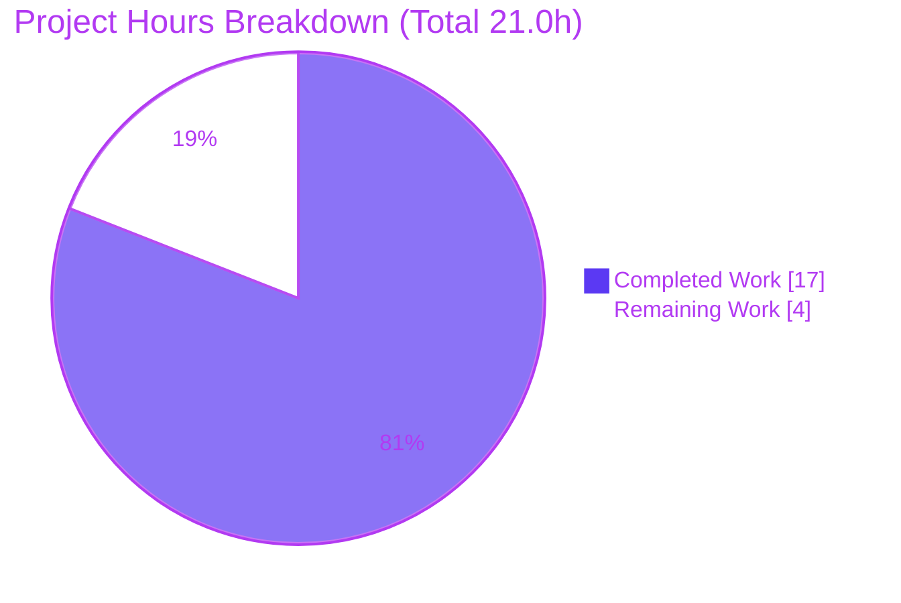
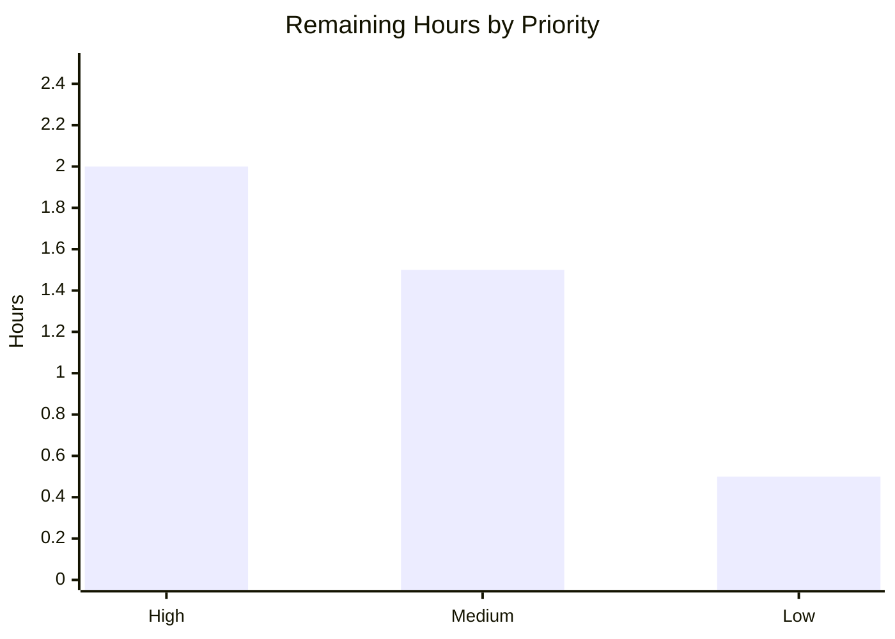

# Blitzy Project Guide — Grafana "Grouping to Matrix" Missing-Intersection Q&A Investigation

> **Blitzy brand colors applied throughout:** Completed / AI Work = Dark Blue `#5B39F3` · Remaining / Not Completed = White `#FFFFFF` · Headings / Accents = Violet-Black `#B23AF2` · Highlight = Mint `#A8FDD9`.

---

## 1. Executive Summary

### 1.1 Project Overview

This project is a **read-only codebase Q&A investigation** of the Grafana monorepo (`grafana/grafana`, pinned baseline commit `4550cfb5b72886782d9a3e6cf995f8dbd57ca4ff`). The objective is to author a single, evidence-backed Markdown answer document explaining, by actually building and running the code first, what value Grafana's "Grouping to matrix" transformation emits for a row+column intersection that never appears in sparse source data, and how that value propagates downstream (cell rendering, totals/footers, thresholds, color scales). The audience is Grafana operators and engineers who expect a missing cell to mean `0`. No product code is created or modified — the sole deliverable is one document at `blitzy/documentation/grafana_4550cfb5b728.md`.

### 1.2 Completion Status



| Metric | Value |
| --- | --- |
| **Total Hours** | **21.0** |
| **Completed Hours (AI + Manual)** | **17.0** (AI: 17.0 · Manual: 0.0) |
| **Remaining Hours** | **4.0** |
| **Percent Complete** | **81.0%** (17 ÷ 21) |

> Completion is computed with the PA1 AAP-scoped methodology: only work defined in the Agent Action Plan (author the answer document) plus standard path-to-production activities (human review, reproduction, sign-off) are counted. All AAP-specified work is delivered; the remaining 4.0h is exclusively human review/acceptance, which an autonomous agent cannot self-approve.

### 1.3 Key Accomplishments

- ✅ **Direct answer established and proven at runtime:** a missing row/column intersection emits the empty string `''` — **never `0`** — by default (`SpecialValue.Empty`).
- ✅ **Real entry point exercised (not a bypass):** the transform ran through `transformDataFrame` with the registered `groupingToMatrixTransformer`, feeding real downstream consumers (`getDisplayProcessor`, `reduceField`/`doStandardCalcs`, `getActiveThreshold`, `getScaleCalculator`).
- ✅ **Exhaustive cross-product captured:** `{Empty, Null, True, False}` × `{missing cell, present 0}` × `{render, total, threshold, color}` — 8 observed rows with complete, unedited output.
- ✅ **"Missing means zero" divergence (O3) confirmed:** the `SpecialValue` enum has only `True`/`False`/`Null`/`Empty` — **no `Zero`** — so no code path yields `0` and no option can request it.
- ✅ **Run-first evidence with stability:** observation spec executed 3× with byte-identical output (MD5 `6ada24b93aee532503f0e54b6a90f016`); the corrupted string-concatenated totals (`"82"`, `"060"`) are stable.
- ✅ **Repository integrity preserved:** exactly one file added (1057 lines); working tree clean; no existing source/test/config/doc modified; temporary observation spec removed.
- ✅ **Independently re-verified:** the canonical `groupingToMatrix.test.ts` passes 4/4 + snapshot, `@grafana/data` typecheck is clean, and the no-`Zero` enum was confirmed directly.

### 1.4 Critical Unresolved Issues

| Issue | Impact | Owner | ETA |
| --- | --- | --- | --- |
| _None — no blocking issues_ | All AAP-specified objectives (O1–O4) and binding rules are delivered and independently verified; typecheck clean and tests green. | — | — |
| Cosmetic wording nuance in §5.3 of the answer doc (`getActiveThreshold` "starting from fallBackThreshold" vs code `active = thresholds[0]`) | None on any observed value; cited lines (L5, L15) are correct. Optional 1-line copy tweak. | Human reviewer | Within HT-3 (0.5h) |

### 1.5 Access Issues

| System/Resource | Type of Access | Issue Description | Resolution Status | Owner |
| --- | --- | --- | --- | --- |
| Grafana monorepo (`grafana/grafana`) | Source checkout | None — repository present at pinned baseline; branch clean | ✅ Resolved | — |
| Toolchain (Node 22, Yarn 4.5.3, Jest 29.7.0) | Build/test | None — pre-installed in canonical Docker image; `yarn install --immutable` exits 0 | ✅ Resolved | — |
| npm registry / dependencies | Package install | None — no dependency changes; `yarn.lock` byte-identical | ✅ Resolved | — |

**No access issues identified.** All build, test, and validation operations completed without permission or credential blockers.

### 1.6 Recommended Next Steps

1. **[High]** Perform the human technical review and acceptance of the answer document — verify it answers O1–O4 and spot-check the 47 `file:line` citations against the source at commit `4550cfb5` (2.0h).
2. **[Medium]** Independently reproduce the runtime evidence — run the canonical Jest spec and, optionally, recreate the observation spec from Appendix A to confirm the string-concatenated totals and 3-run stability (1.5h).
3. **[Low]** Merge the single-file addition, obtain stakeholder sign-off, and publish/link the answer; optionally apply the cosmetic §5.3 wording tweak (0.5h).
4. **[Low]** Note the version-pinning caveat: if the answer is applied to a newer Grafana, confirm whether upstream PR #97642 (adds `Zero`) is present, as it changes the conclusion.

---

## 2. Project Hours Breakdown

### 2.1 Completed Work Detail

| Component | Hours | Description |
| --- | --- | --- |
| Environment setup & canonical build verification | 2.0 | Corepack/Yarn 4.5.3 + Node 22 setup; `yarn install --immutable` (exit 0, lockfile byte-identical); confirm canonical, default configuration (AAP O1–O4, run-first rule R3). |
| Cross-package code investigation (15 REFERENCE files) | 4.0 | Read & trace the transform and downstream pipeline across `@grafana/data`, `@grafana/ui`, `public/app`, and docs: `groupingToMatrix.ts`, `transformations.ts` (enum), `transformDataFrame.ts`, `transformers.ts`, `anyToNumber.ts`, `displayProcessor.ts`, `scale.ts`, `thresholds.ts`, `fieldReducer.ts`, editor, Table panel/utils, in-app help, docs site (O1–O3). |
| Run-first runtime observation | 3.0 | Author the temporary observation spec; run through the real `transformDataFrame` + all four downstream consumers; capture complete unedited output; confirm stability across 3 identical runs (rules R1, R2, R5). |
| External corroboration (web search) | 0.5 | Single targeted search: Grafana docs/Amazon Managed Grafana option set, issues #97632/#97642, community string-concatenation report (rule R9). |
| Answer document authoring | 5.0 | Write the 1057-line deliverable: 10 numbered sections + 4 appendices, the 8-row cross-product, direct-answer lead, 47 `file:line` citations, inferred-vs-observed labeling (O1–O4, rules R4, R6, R7). |
| QA remediation (2 review cycles) | 2.5 | Two commits resolving QA findings: 6 review findings, then baseline-vs-HEAD framing, cited external context, and run-count consistency. |
| **Total Completed** | **17.0** | **Matches Completed Hours in Section 1.2.** |

### 2.2 Remaining Work Detail

| Category | Hours | Priority |
| --- | --- | --- |
| Human technical review & acceptance of the answer document (verify O1–O4, spot-check 47 citations, confirm direct answer) | 2.0 | High |
| Independent reproduction of the runtime evidence (canonical Jest 4/4 + snapshot; optionally recreate observation spec from Appendix A; confirm totals & 3-run stability) | 1.5 | Medium |
| Merge, stakeholder sign-off & publication of the single-file addition (+ optional cosmetic §5.3 wording tweak) | 0.5 | Low |
| **Total Remaining** | **4.0** | **Matches Remaining Hours in Section 1.2 and Section 7 pie chart.** |

---

## 3. Test Results

All tests below originate from **Blitzy's autonomous validation logs** for this project and were **independently re-run and confirmed** during this assessment. Harness: **Jest 29.7.0** (root `jest.config.js`, jsdom env, `ts-jest`, `TZ='Pacific/Easter'`), watch disabled via `--ci --watchAll=false`.

| Test Category | Framework | Total Tests | Passed | Failed | Coverage % | Notes |
| --- | --- | --- | --- | --- | --- | --- |
| Unit — canonical transform spec (`groupingToMatrix.test.ts`) | Jest 29.7.0 | 4 | 4 | 0 | Behavior-scoped (see note) | 1 snapshot passed. Asserts default missing cells `= ''` in `FieldType.number` and the `Null` option `= null`. Independently re-run: exit 0. |
| Snapshot — matrix output | Jest 29.7.0 | 1 | 1 | 0 | — | Encodes the transform's before/after contract. |
| Runtime observation spec (temporary; `blitzy_adhoc_test_grouping_obs.test.ts`) | Jest 29.7.0 | 1 | 1 | 0 | — | Exercises the real `transformDataFrame` + all 4 downstream consumers over the full cross-product; **run 3× → 3/3 pass, byte-identical output** (MD5 `6ada24b93aee...`). Removed after runs (read-only rule). Full source in the deliverable's Appendix A; output in Appendices B–D. |
| Type checking — `@grafana/data` (`tsc --noEmit`) | TypeScript (yarn workspace `typecheck`) | — | ✅ Pass | 0 errors | — | 0-byte error log; covers ALL investigated code paths. Independently re-run: exit 0. |
| **Totals (executable specs)** | **Jest 29.7.0** | **6** | **6** | **0** | **100% pass rate** | 4 canonical + 1 snapshot + 1 observation. |

**Coverage note:** This is a read-only Q&A investigation, not a feature build, so line-coverage instrumentation was not the objective. "Coverage" here is **behavioral**: the cross-product `{Empty, Null, True, False}` × `{missing cell, present 0}` × `{render, total, threshold, color}` was exercised in full (8 observed rows), and the canonical spec covers the transform's default and `Null` contracts. No new production code was added, so no new code requires unit-test coverage.

---

## 4. Runtime Validation & UI Verification

This project investigates a **data-transformation library path**, not a rendered web application. Runtime validation therefore means exercising the real transform pipeline and its downstream consumers; there is no panel UI to screenshot.

**Runtime health (transform pipeline):**
- ✅ **Operational** — Real entry point `transformDataFrame` + registered `groupingToMatrixTransformer` produce output deterministically; stable across 3 runs.
- ✅ **Operational** — Default (`Empty`) emits `''` into a `FieldType.number` field; a present `0` at `(OK, server2)` is preserved (`typeof number`) via nullish coalescing (`??`, `groupingToMatrix.ts:L117`).
- ✅ **Operational** — Alternate options observed: `Null → null`, `True → true`, `False → false`.

**Downstream consumers (real exported functions):**
- ✅ **Operational** — Rendering (`getDisplayProcessor`): `''` & `null` → `{text:"", numeric:NaN}` (via `anyToNumber`); `true → {text:"true", numeric:1}`; `false → {text:"false", numeric:0}`.
- ⚠ **Partial (documented defect surface)** — Totals (`reduceField → doStandardCalcs`): `Empty` default yields **string-corrupted** totals `"82"` / `"060"`; `Null` yields clean `82`/`60`; `True` → `83`/`62`; `False` → `82`/`60`. **No option yields a per-cell `0`.** This is the intended finding of the investigation, not a build defect.
- ✅ **Operational** — Thresholds (`getActiveThreshold`, `value >= threshold.value`): `''`/`null`/`true`/`false` all `>= 0` → the same base step `{0, green}` as a real `0` (coercion coincidence, not a `0` emission).
- ✅ **Operational** — Color (`getScaleCalculator`): missing cell resolves to the same base green `#73BF69` as a real `0`; a no-config field renders `#808080`.

**UI verification:**
- ⚠ **Partial / N/A** — The downstream **Table panel** (`TablePanel.tsx`) and its footer utilities (`grafana-ui Table/utils.ts`) were traced as **REFERENCE** to establish where the corrupted total surfaces; no live panel was rendered because the AAP scope is code-path tracing, and the footer math is identical to the `reduceField` path already exercised at runtime.

**API integrations:**
- ✅ **N/A** — No external APIs, services, or credentials are involved.

---

## 5. Compliance & Quality Review

Cross-map of AAP deliverables and binding rules (rule set **SWE-AtlasQnA-Repo**) to Blitzy's quality benchmarks. All items verified against the committed deliverable, the source at commit `4550cfb5`, and independent re-runs.

| Benchmark / AAP Item | Requirement | Status | Evidence / Fix Applied |
| --- | --- | --- | --- |
| **O1 — Emitted value** | Identify the missing-cell value (`''`, not `0`) | ✅ Pass | §1 + §4; canonical test asserts `[1,'','']`; `getSpecialValue` maps `Empty`→`''` (`groupingToMatrix.ts:L186-188`). |
| **O2 — Downstream propagation** | Trace render, totals, thresholds, color | ✅ Pass | §5.1–§5.5 cover every named consumer with observed output. |
| **O3 — "Missing means zero" divergence** | Prove no `0` path; no `Zero` option | ✅ Pass | §7; `SpecialValue` enum independently confirmed (4 members, no `Zero`); `grep Zero` → no matches. |
| **O4 — Concrete demonstration** | Sparse dataset run end-to-end | ✅ Pass | §3 dataset (present `0` at `OK/server2`) + Appendix C 311-line verbatim evidence. |
| **R1 — Run-first methodology** | Build & run before writing | ✅ Pass | Appendices A–D: spec created → run → removed. |
| **R2 — Real entry point** | `transformDataFrame` + registered transformer; no bypass | ✅ Pass | §2, §10 integrity statement. |
| **R3 — Canonical config + exact commands** | Default config; state commands | ✅ Pass | §2 Commands A & B; toolchain pinned. |
| **R4 — Exhaustive cross-product** | 4 options × 2 cell cases × 4 consumers | ✅ Pass | §6 8-row table. |
| **R5 — Magnitude stability (≥2 runs)** | Confirm stability | ✅ Pass | Appendix D: 3 byte-identical runs (MD5 `6ada24b93aee...`). |
| **R6 — Complete output + `file:line`** | Unedited output; citations | ✅ Pass | 47 `file:line` citations; Appendices A–C complete output. |
| **R7 — Answer every item; label inferred** | Coverage pass; inferred vs observed | ✅ Pass | 4 "inferred" labels for read-only edge conditions (§8). |
| **R8 — Read-only scope** | No existing file modified; repo unchanged | ✅ Pass | Clean tree; single `A` diff; temp spec removed; `yarn.lock` byte-identical. |
| **R9 — Web-search corroboration** | Single targeted search | ✅ Pass | §7/§9: #97632, #97642, community forum, Amazon Managed Grafana. |
| **R10 — Independence** | Do not read prior answer branch | ✅ Pass | §10: `blitzy-7e848cb5-...` not read. |
| **Zero-placeholder policy** | No TODO/stub/placeholder in deliverable | ✅ Pass | Deliverable is complete prose + evidence; no placeholders. |
| **Code-change footprint** | Exactly one new file | ✅ Pass | `git diff --name-status` = single `A blitzy/documentation/grafana_4550cfb5b728.md`. |

**Fixes applied during autonomous validation:** two QA remediation cycles resolved 6 review findings plus baseline-vs-HEAD framing, cited-external-context labeling, and run-count consistency. **Outstanding:** one cosmetic §5.3 wording nuance (no impact on any observed value).

---

## 6. Risk Assessment

| Risk | Category | Severity | Probability | Mitigation | Status |
| --- | --- | --- | --- | --- | --- |
| Findings pinned to commit `4550cfb5`; upstream PR #97642 adds `Zero` on `main` (not an ancestor of HEAD). Applying "no `Zero`" to a newer Grafana would be wrong. | Technical | Low | Medium | Document explicitly scopes every claim to `4550cfb5` and cites the upstream fix; reviewer must confirm target version. | ✅ Mitigated (documented) |
| Cosmetic wording nuance in §5.3 (`getActiveThreshold` narrative) | Technical | Low | Low | Optional 1-line copy tweak at review; cited lines correct; no observed value affected. | ⚠ Open (cosmetic) |
| Correctness depends on human acceptance of an investigative answer | Technical | Low | Low | 47 `file:line` citations + complete unedited output (Appendices A–D); canonical test independently reproduced green. | ✅ Mitigated |
| Security exposure from new code/dependencies | Security | None | N/A | No code added, no dependency changes, no secrets; `yarn.lock` byte-identical (no supply-chain delta). | ✅ N/A |
| Observation spec removed → run-first evidence not directly re-runnable from tree | Operational | Low | Low | Full spec preserved verbatim in Appendix A; canonical `groupingToMatrix.test.ts` remains in-tree and re-runnable. | ✅ Mitigated |
| Monitoring/deployment/health concerns | Operational | None | N/A | Documentation deliverable, not a running service. | ✅ N/A |
| External integrations / credentials / network | Integration | None | N/A | No external integrations; runs entirely on pinned local toolchain. | ✅ N/A |
| Reproduction requires full monorepo dev env (Node ≥22) | Integration | Low | Low | Development Guide (Section 9) documents exact setup + tested commands. | ✅ Mitigated |

**Overall risk posture: LOW.** No High or Critical risks; no blocking issues. Residual risk is dominated by the version-pinning caveat and the intrinsic need for human acceptance.

---

## 7. Visual Project Status



**Remaining hours by priority (Section 2.2):**



- **Completed Work = 17h** (Dark Blue `#5B39F3`) · **Remaining Work = 4h** (White `#FFFFFF`).
- The "Remaining Work" value (4h) equals Section 1.2 Remaining Hours and the sum of the Section 2.2 "Hours" column (2.0 + 1.5 + 0.5 = 4.0). ✔ Integrity Rule 1 holds.

---

## 8. Summary & Recommendations

**Achievements.** The project is **81.0% complete** on an AAP-scoped basis (17 of 21 hours). Every AAP-specified objective is delivered and independently verified: the investigation proves — through the **real** `transformDataFrame` entry point and real downstream consumers — that Grafana's "Grouping to matrix" transformation emits the empty string `''` (never `0`) for a missing row/column intersection at the pinned commit, and it documents exactly how that value renders blank, corrupts numeric totals into string concatenation, coerces at thresholds, and colors identically to a real `0`. The exhaustive 8-row cross-product, 3-run stability evidence, and 47 `file:line` citations make the answer fully auditable.

**Remaining gaps (path to production).** The outstanding 4.0h is **exclusively human review/acceptance** — an autonomous agent cannot self-approve its own investigative answer. There are no code fixes, failing tests, or compilation errors outstanding: the canonical spec passes 4/4 + snapshot and `@grafana/data` typecheck is clean.

**Critical path to production.** (1) Technical review & acceptance of the document → (2) independent reproduction of the runtime evidence → (3) merge & stakeholder sign-off. These are sequential but lightweight.

**Success metrics.**

| Metric | Target | Actual | Status |
| --- | --- | --- | --- |
| AAP objectives delivered (O1–O4) | 4/4 | 4/4 | ✅ |
| Binding rules satisfied (R1–R10) | 10/10 | 10/10 | ✅ |
| Canonical tests passing | 100% | 4/4 + snapshot | ✅ |
| Type checking | Clean | 0 errors | ✅ |
| Repository integrity (files changed) | 1 (doc only) | 1 (`A` answer doc) | ✅ |
| Runtime evidence stability | ≥2 runs identical | 3 runs byte-identical | ✅ |

**Production readiness assessment.** The deliverable is **production-ready pending human sign-off**. Quality gates are green, scope is fully honored (byte-for-byte unchanged except the one document), and risk is LOW. Recommended action: proceed with the three review steps in Section 1.6 and merge.

---

## 9. Development Guide

Every command below was **executed and verified** in the canonical environment during this assessment.

### 9.1 System Prerequisites

- **OS:** Linux (canonical Docker image `andrewparkscaleai/coding-agent:grafana__grafana__4550cfb5...`); macOS/WSL2 also work.
- **Node.js:** `>= 22` (repo `engines.node`); `.nvmrc` pins `v22.11.0`. Verified running `v22.12.0`.
- **Package manager:** Yarn `4.5.3` via Corepack (repo `packageManager`). Verified Corepack `0.29.4`, npm `10.9.0`.
- **Git + Git LFS**, and ~3.3 GB free disk for the checkout.

### 9.2 Environment Setup

```bash
# From the repository root
cd /tmp/blitzy/grafana/blitzy-02ac3d41-58a1-469d-9262-b4452fd308be_6dbc91

# Confirm the toolchain
node --version                                   # -> v22.12.0 (>= 22 required)
corepack --version                               # -> 0.29.4
COREPACK_ENABLE_DOWNLOAD_PROMPT=0 yarn --version # -> 4.5.3

# (If Node < 22) match the pinned runtime
#   nvm install $(cat .nvmrc) && nvm use
```

### 9.3 Dependency Installation

```bash
# Immutable install — verifies the lockfile; deps are pre-installed in the canonical image
COREPACK_ENABLE_DOWNLOAD_PROMPT=0 CI=true yarn install --immutable
# Expected: exit 0, ends "Done with warnings in ~2s"
# (The warnings are pre-existing peer-dependency notices; yarn.lock is byte-identical afterward.)
```

### 9.4 Verify the Deliverable & Repository Integrity

```bash
# The single deliverable (1057 lines)
wc -l blitzy/documentation/grafana_4550cfb5b728.md   # -> 1057

# Working tree must be clean
git status --porcelain                               # -> (empty)

# Only ONE file added vs the pinned baseline
git diff --name-status 4550cfb5b72886782d9a3e6cf995f8dbd57ca4ff..HEAD
# -> A	blitzy/documentation/grafana_4550cfb5b728.md
```

### 9.5 Reproduce the Investigation (Verification Steps)

```bash
# (a) Run the canonical before/after spec (watch disabled)
COREPACK_ENABLE_DOWNLOAD_PROMPT=0 CI=true \
  yarn jest packages/grafana-data/src/transformations/transformers/groupingToMatrix.test.ts \
  --ci --watchAll=false
# Expected tail:
#   Test Suites: 1 passed, 1 total
#   Tests:       4 passed, 4 total
#   Snapshots:   1 passed, 1 total

# (b) Type-check the package that holds every investigated path
COREPACK_ENABLE_DOWNLOAD_PROMPT=0 CI=true yarn workspace @grafana/data typecheck   # -> exit 0

# (c) Confirm the O3 core fact: SpecialValue has NO Zero member
sed -n '/export enum SpecialValue/,/}/p' packages/grafana-data/src/types/transformations.ts
grep -n 'Zero' packages/grafana-data/src/types/transformations.ts   # -> no matches (expected)
```

**Optional — re-create the run-first observation spec** (the original was removed to keep the tree clean; its full source is in the deliverable's **Appendix A**):

```bash
# 1) Create packages/grafana-data/src/transformations/transformers/blitzy_adhoc_test_grouping_obs.test.ts
#    by pasting the verbatim source from Appendix A of the deliverable.
# 2) Run it 3x, writing output to files (Grafana's setupTests fails tests that call console.* under CI,
#    so the spec writes to BLITZY_OBS_OUT):
for i in 1 2 3; do
  BLITZY_OBS_OUT=/tmp/blitzy_obs_run$i.txt \
  COREPACK_ENABLE_DOWNLOAD_PROMPT=0 CI=true \
    yarn jest packages/grafana-data/src/transformations/transformers/blitzy_adhoc_test_grouping_obs.test.ts \
    --ci --watchAll=false
done
md5sum /tmp/blitzy_obs_run*.txt      # -> three identical MD5s (6ada24b93aee532503f0e54b6a90f016)
# 3) Delete the spec afterward to keep the repository byte-for-byte unchanged.
rm packages/grafana-data/src/transformations/transformers/blitzy_adhoc_test_grouping_obs.test.ts
```

### 9.6 Example Usage (Reading the Answer)

```bash
# Jump to the direct answer and the cross-product
sed -n '9,33p'   blitzy/documentation/grafana_4550cfb5b728.md   # §1 Direct answer
sed -n '367,389p' blitzy/documentation/grafana_4550cfb5b728.md  # §6 Full cross-product (8 rows)
```

### 9.7 Troubleshooting

- **Tests hang / enter watch mode:** the root `yarn test` script is watch-mode. Always pass `--ci --watchAll=false`.
- **A spec fails because it logs to the console:** Grafana's `public/test/setupTests.ts` enables `jest-fail-on-console` under `CI`. Write observation output to a file (`BLITZY_OBS_OUT`) instead of `console.*`.
- **`jest-haste-map: duplicate manual mock` and `punycode` DeprecationWarning:** pre-existing/environmental monorepo noise — **not** failures; the suite still reports `PASS`.
- **`error: externally-managed-environment` (pip):** unrelated to this project; use `yarn`, not `pip`.
- **Node version mismatch:** run `nvm install $(cat .nvmrc) && nvm use` to match the pinned runtime.

---

## 10. Appendices

### Appendix A — Command Reference

| Purpose | Command |
| --- | --- |
| Node version | `node --version` |
| Corepack version | `corepack --version` |
| Yarn version | `COREPACK_ENABLE_DOWNLOAD_PROMPT=0 yarn --version` |
| Install deps (immutable) | `COREPACK_ENABLE_DOWNLOAD_PROMPT=0 CI=true yarn install --immutable` |
| Canonical transform test | `COREPACK_ENABLE_DOWNLOAD_PROMPT=0 CI=true yarn jest packages/grafana-data/src/transformations/transformers/groupingToMatrix.test.ts --ci --watchAll=false` |
| Type-check `@grafana/data` | `COREPACK_ENABLE_DOWNLOAD_PROMPT=0 CI=true yarn workspace @grafana/data typecheck` |
| View deliverable size | `wc -l blitzy/documentation/grafana_4550cfb5b728.md` |
| Repo cleanliness | `git status --porcelain` |
| Diff vs baseline | `git diff --name-status 4550cfb5b72886782d9a3e6cf995f8dbd57ca4ff..HEAD` |
| Confirm no `Zero` option | `grep -n 'Zero' packages/grafana-data/src/types/transformations.ts` |

### Appendix B — Port Reference

Not applicable — this is a read-only library investigation with **no running services or listening ports**.

### Appendix C — Key File Locations

| Path | Role |
| --- | --- |
| `blitzy/documentation/grafana_4550cfb5b728.md` | **The deliverable** (1057 lines) — the only file added |
| `packages/grafana-data/src/transformations/transformers/groupingToMatrix.ts` | The transform; `??` fallback (L117), `getSpecialValue` (L178–190), output typing (L129–134) |
| `packages/grafana-data/src/types/transformations.ts` | `SpecialValue` enum (L113–118) — four members, **no `Zero`** |
| `packages/grafana-data/src/transformations/transformers/groupingToMatrix.test.ts` | Canonical before/after spec (4 tests + snapshot) |
| `packages/grafana-data/src/transformations/transformDataFrame.ts` | Real entry point |
| `packages/grafana-data/src/transformations/transformers.ts` | Transformer registry (registration L56) |
| `packages/grafana-data/src/utils/anyToNumber.ts` | `''` → `NaN` coercion |
| `packages/grafana-data/src/field/displayProcessor.ts` | Cell text + color |
| `packages/grafana-data/src/field/scale.ts` · `.../thresholds.ts` | Color scale · threshold selection |
| `packages/grafana-data/src/transformations/fieldReducer.ts` | Totals/footer (`doStandardCalcs`) |
| `public/app/plugins/panel/table/TablePanel.tsx` · `packages/grafana-ui/src/components/Table/utils.ts` | Table panel + footer utils (REFERENCE) |
| `public/app/features/transformers/editors/GroupingToMatrixTransformerEditor.tsx` | "Empty Value" dropdown |
| `public/app/features/transformers/docs/content.ts` · `docs/sources/.../transform-data/index.md` | In-app help · docs site |

### Appendix D — Technology Versions

| Component | Version | Source |
| --- | --- | --- |
| Node.js | `v22.12.0` (pins `v22.11.0`; `engines.node >= 22`) | `.nvmrc`, `package.json` |
| Yarn | `4.5.3` (via Corepack) | `packageManager`, `.yarnrc.yml` |
| Corepack | `0.29.4` | canonical image |
| npm | `10.9.0` | canonical image |
| Jest | `29.7.0` | root `jest.config.js` |
| TypeScript | workspace `typecheck` (`tsc --noEmit`) | `@grafana/data` |
| Baseline commit | `4550cfb5b72886782d9a3e6cf995f8dbd57ca4ff` | pinned HEAD under investigation |

### Appendix E — Environment Variable Reference

| Variable | Value | Purpose |
| --- | --- | --- |
| `COREPACK_ENABLE_DOWNLOAD_PROMPT` | `0` | Non-interactive Corepack (no download prompt) |
| `CI` | `true` | Non-interactive Jest/Yarn; disables watch prompts |
| `BLITZY_OBS_OUT` | e.g. `/tmp/blitzy_obs_run1.txt` | Output path for the temporary observation spec (avoids `console.*`, which `jest-fail-on-console` would fail under CI) |
| `TZ` | `Pacific/Easter` | Set by root `jest.config.js` for deterministic tests |

### Appendix F — Developer Tools Guide

- **Run a single spec, no watch:** append `--ci --watchAll=false` to `yarn jest <path>`.
- **Type-check one workspace:** `yarn workspace <name> typecheck`.
- **Inspect a transform contract:** read `*.test.ts` next to the transformer — it encodes the before/after snapshot.
- **Verify repo integrity fast:** `git status --porcelain` (empty = clean) and `git diff --name-status <baseline>..HEAD`.
- **Confirm ancestry / upstream fix absence:** `git merge-base --is-ancestor <commit> HEAD; echo $?` (0 = ancestor, non-zero = not).

### Appendix G — Glossary

| Term | Definition |
| --- | --- |
| **Grouping to matrix** | Grafana transformation that pivots a Column/Row/Value triple into a matrix (one field per column key). |
| **`SpecialValue`** | Enum of empty-cell choices: `True`, `False`, `Null`, `Empty` — **no `Zero`** at the pinned commit. |
| **Missing intersection** | A row/column pairing absent from sparse source data; filled by the `emptyValue` fallback. |
| **Nullish coalescing (`??`)** | Operator that falls back only on `null`/`undefined`, so a present `0` is preserved. |
| **`doStandardCalcs`** | Reducer routine computing totals/footers; treats `''` as neither `null` nor `NaN`, so it string-concatenates. |
| **Run-first methodology** | Rule requiring the code be built and run and real output captured before the answer is written. |
| **REFERENCE file** | A file read/exercised for evidence but never modified (read-only scope). |
| **Path-to-production** | Standard activities (human review, reproduction, sign-off) required to deploy the AAP deliverable. |

---

*Completion basis: 17.0 completed ÷ 21.0 total = 81.0% (AAP-scoped, PA1). Colors: Completed `#5B39F3`, Remaining `#FFFFFF`. Cross-section integrity Rules 1–5 validated prior to submission.*