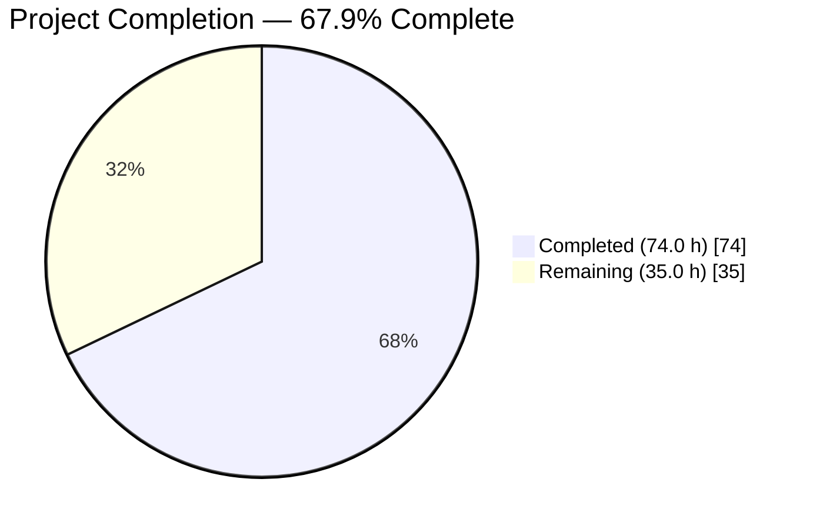
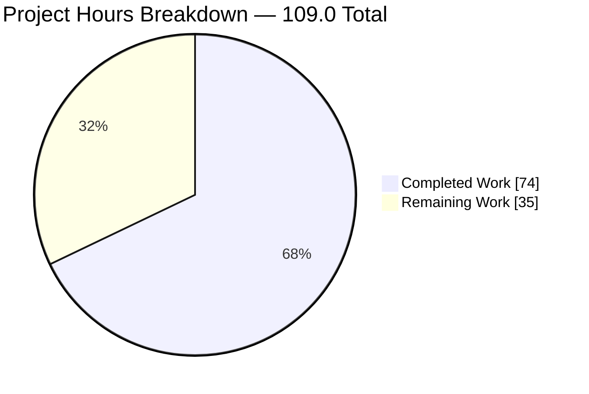
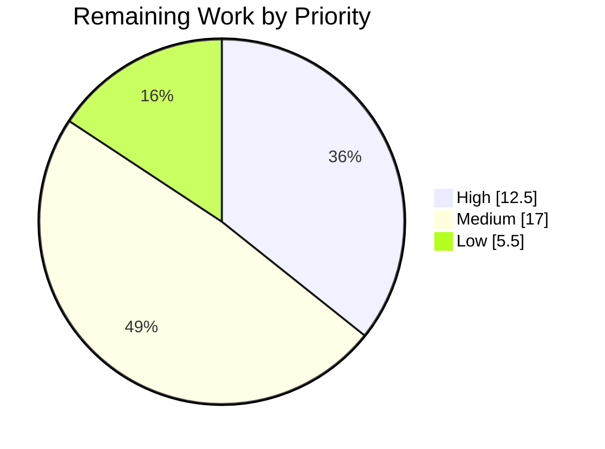

# Blitzy Project Guide — `deduplicateRows` Data Transformation

**Repository:** Grafana OSS monorepo (12.4.0-pre) · **Branch:** `blitzy-02e2d6bb-6da8-48ff-9e39-14e8459e2576` · **HEAD:** `bfa1a5306c1b6171f331d040c9980aee495f9bd7` · **Base:** `913c2f255d`

---

## 1. Executive Summary

### 1.1 Project Overview

This project adds one new data transformation — `deduplicateRows` — to the `@grafana/data` transformation subsystem. It collapses rows sharing a key into a single row, where the key is either one named field's value or the ordered tuple of every field value, and the caller chooses whether the first or last occurrence survives. Target consumers are Grafana dashboard authors and any programmatic caller of `transformDataFrame`. Business impact: removes duplicate telemetry rows at visualisation time without query-side changes. Technical scope was tightly bounded by the AAP's Minimal Change Clause to exactly four files inside `packages/grafana-data/src/transformations/` — two created, two modified by three inserted lines, with zero dependency changes.

### 1.2 Completion Status



> **Chart colours (Blitzy brand):** Completed = Dark Blue `#5B39F3` · Remaining = White `#FFFFFF` · Accent = Violet-Black `#B23AF2` · Highlight = Mint `#A8FDD9`

| Metric | Value |
|---|---|
| **Total Hours** | **109.0 h** |
| **Completed Hours (AI + Manual)** | **74.0 h** (AI 74.0 h + Manual 0.0 h) |
| **Remaining Hours** | **35.0 h** |
| **Percent Complete** | **67.9 %** |

**Calculation (PA1, AAP-scoped work only):**
`Completion % = 74.0 ÷ (74.0 + 35.0) × 100 = 74.0 ÷ 109.0 × 100 = 67.8899 % → 67.9 %`

**AAP requirement classification:** 13/13 numbered requirements (R1–R13) **Completed** · 10/10 implicit requirements **Completed** · 7/7 ambiguity resolutions (A1–A7) **Implemented** · 8/8 test cases **green** · 5/5 AAP validation gates **green**. **Partially Completed = 0 · Not Started = 0 · AAP-scoped rework hours = 0.**

The 35.0 remaining hours are **not** AAP defects. They are path-to-production activities the Minimal Change Clause deliberately placed out of scope (UI enablement, documentation, upstream review) plus two integration items surfaced by runtime validation.

### 1.3 Key Accomplishments

- ✅ **`deduplicateRowsTransformer` delivered** — 161-line side-effect-free module, `DataTransformerInfo<DeduplicateRowsTransformerOptions>` with `defaultOptions: { keep: 'first' }`, modelled on the `limit` transformer exactly as the AAP mandated.
- ✅ **Nested-`Map` trie keying replaces the lossy string-join precedent** — verified that `1 ≠ '1'`, `null ≠ undefined`, and `['a,b','c']` vs `['a','b,c']` stay distinct, all three of which the `groupBy.ts:176` precedent collapses.
- ✅ **Two-pass election/emission guarantees ascending original-index order** for both `keep` modes, with no sort and no dependence on Map iteration order.
- ✅ **Schema stability + cache invalidation** — field `name`/`type`/`config` preserved, `state.calcs` cleared, `frame.length` updated, `nanos` filtered in lockstep with `values` (a discovered implicit requirement that `limit` itself does not satisfy).
- ✅ **Reference-identity passthrough on all four no-op paths** — empty frame, field-less frame, missing named field, duplicate-free frame.
- ✅ **Registration complete** — `DataTransformerID.deduplicateRows === 'deduplicateRows'`; `standardTransformers.deduplicateRowsTransformer` resolves; 3 inserted lines respecting each file's own ordering convention.
- ✅ **8-case / 49-assertion test suite** (353 lines) — the four AAP oracles verbatim plus four regression cases closing gaps the oracles provably leave open.
- ✅ **All five AAP gates green, independently re-executed** — typecheck exit 0 · focused 8/8 · regression 45/45 suites, 421 passed, 55/55 snapshots · eslint 0 violations · prettier clean.
- ✅ **Repository-wide zero regression** — 17,677 tests passing, zero failures, 467/467 snapshots.
- ✅ **Runtime proven in five environments** — Node on shipped `dist`, webpack bundle, Go server, and two independent headless-Chrome harnesses (23/23 and 24/24 checks, pixel-identical hard reload).
- ✅ **Zero-placeholder policy satisfied** — 0 TODO/FIXME, 0 explicit `any`, 0 `@ts-ignore`, 0 `eslint-disable`, 0 `console.*`, 0 focused/skipped tests.
- ✅ **Root cause of the live-app gap diagnosed and the remedy proven** by a reversible experiment, then cleanly reverted (bundle restored byte-identical, md5 `205542ce0dfc14e3cc39ec6a098476da`).

### 1.4 Critical Unresolved Issues

| Issue | Impact | Owner | ETA |
|---|---|---|---|
| **A saved dashboard using `deduplicateRows` can crash the entire dashboard route.** `Registry.get()` (`utils/Registry.ts:80`) throws instead of returning `undefined`, so `transformDataFrame.ts:19-23`'s `if (!info) return source;` guard is **unreachable dead code**. Any forced re-render fires the throw inside React's render phase and Grafana's `ErrorBoundary` replaces the whole route with "An unexpected error happened". | **Critical** — one panel takes down the route. Not present in the validator logs; discovered by this assessment's browser validation. | Frontend platform | 4.0 h (H10) |
| **The transformation is invisible at runtime in the live app.** It is registered in the `@grafana/data` catalogue but not in the app-layer registry `public/app/features/transformers/standardTransformers.ts`, the only registry `transformDataFrame` consults. Panels render a **completely empty body, byte-identical to an invalid-id control** (normalised 106 chars, identical sha256). | **High** — the delivered feature is unreachable through saved dashboard JSON. Remedy proven by experiment. | Frontend platform | 1.5 h (H4) |
| **Zero error affordance on the silent failure.** Measured: `panelStatusError: 0`, `roleAlert: 0`, `noDataText: false`; the word "error" appears nowhere in `document.body.innerText`; no hover tooltip. | **High** — users get no signal at all. | Frontend platform | Covered by H10 |
| **Not selectable in the Transformations picker.** The picker is a 1:1 rendering of the app-layer registry (33 items, proven byte-for-byte in order). Requires a React editor plus `imageDark`/`imageLight`. | **Medium** — AAP 0.5.2's own explicitly accepted consequence, verified on screen. Not a defect. | Frontend platform | 14.0 h (H3–H8) |
| **`DeduplicateRowsTransformerOptions` is not exported from `@grafana/data/internal`**, though `LimitTransformerOptions` is (`src/internal/index.ts:64`). Makes AAP 0.3.3's parity claim inaccurate. | **Low** — external editors cannot type their options. | Package owner | Folded into H4 |
| **No human code review or upstream OSS PR cycle yet.** | **Medium** — required merge gate for Grafana OSS. | Grafana maintainer | 4.0 h (H1) |

### 1.5 Access Issues

| System/Resource | Type of Access | Issue Description | Resolution Status | Owner |
|---|---|---|---|---|
| Outbound internet (npm, plugin catalogue, GitHub) | Network egress | Sandbox has no outbound network. Grafana boot logs expected plugin-install failures for `grafana-metricsdrilldown-app` and `grafana-lokiexplore-app`; `caniuse-lite` is stale. **Did not block any gate** — `yarn install --immutable` succeeded from cache. | Open — environment-only, no action needed for this change | Platform / DevOps |
| Hosted CI (GitHub Actions / Drone) | Pipeline execution | Repository CI was never exercised; all gates ran locally. Sharded unit tests, betterer, i18n-extract and API-compat checks remain unverified in the hosted pipeline. | Open — task H2 (3.0 h) | DevOps / CI |
| Upstream `grafana/grafana` repository | Push / PR permission | This is a fork-style working branch; no upstream PR was opened and no maintainer review occurred. | Open — task H1 (4.0 h) | Grafana maintainer |
| Grafana local instance (`admin`/`admin`, port 3000) | Application admin | **No issue.** Authenticated successfully (`/api/user` 200, `isGrafanaAdmin: true`), provisioned a datasource and a 6-panel fixture dashboard, then left no trace (dashboard still version 1). | ✅ Resolved | — |
| Git repository & commit identity | Write access | **No issue.** 9 commits, all authored and committed as `Blitzy Agent <agent@blitzy.com>`; tree clean. | ✅ Resolved | — |

No repository-permission, credential or third-party-API access issue blocked any AAP acceptance criterion.

### 1.6 Recommended Next Steps

1. **[High] Register the transformer in the app-layer registry** (1.5 h, H4) — add a `TransformerRegistryItem` to `public/app/features/transformers/standardTransformers.ts` and export `DeduplicateRowsTransformerOptions` from `packages/grafana-data/src/internal/index.ts`. **Proven remedy:** the reversible experiment made every dedup panel render correctly and eliminated all four registry errors. Do not ship a user-facing build without this.
2. **[High] Decide the unknown-id fallback** (4.0 h, H10) — switch `transformDataFrame.ts:19` from `standardTransformersRegistry.get` to `getIfExists`, which makes the existing dead guard live, and add a regression test proving an unregistered id no longer crashes the route. Must be a **separate PR** — it touches an AAP "Reference Only" file.
3. **[High] Obtain human code review and open the upstream OSS PR** (4.0 h, H1) — the transformation id becomes permanent public API surface the moment it merges.
4. **[High] Verify in hosted CI** (3.0 h, H2) — sharded unit tests at `--maxWorkers=2`, typecheck, lint, betterer, i18n-extract, API-compat.
5. **[Medium] Complete UI enablement** (14.0 h, H3–H8) — React editor, dark/light SVGs, i18n keys, help-content entry, editor tests and accessibility fixes. The experiment's editor left 2 of only 3 unresolved `<label for>` attributes on the whole route; the production editor must supply resolving `for`/`id`/`name`/`aria-label`.

---

## 2. Project Hours Breakdown

### 2.1 Completed Work Detail

| Component | Hours | Description |
|---|---|---|
| AAP interpretation & requirement decomposition | 4.0 | R1–R13 restated precisely; ambiguities A1–A8 resolved against repository contracts (trie over string-join, SameValueZero acceptance, `null` ≠ `undefined`, keep-last ordering, invalid-`keep` normalisation, `field: ''` as unset, `nanos` lockstep). |
| Scope discovery & prior-art audit | 3.0 | 61-entry transformers directory surveyed; `limit` adopted as the mandated reference; `groupBy.ts:176` string-join precedent evaluated and rejected; confirmed no existing dedup/distinct/unique capability anywhere in the repository. |
| Algorithm design | 4.0 | Nested-`Map` trie keying (one level per key field) plus two-pass owner election and ascending emission; complexity established at O(n·m) time / O(d·m) space; worked traces for all four oracles. |
| Core module implementation `deduplicateRows.ts` | 6.0 | 161 lines, 3 exports + 4 private declarations, explicit `: DataFrame` return type, every branch returns, side-effect free (0 top-level side-effecting statements). |
| Option types, `defaultOptions` & `keep` normalisation | 2.0 | `DeduplicateRowsKeep` union, both option members optional so `{}` is legal; single `options.keep === 'last'` comparison so `'first'`, `undefined` and any interpolated string resolve to first-wins — correct for both the pipeline merge and direct-operator callers that bypass it. |
| Frame rebuild, `state.calcs` invalidation, `nanos` lockstep | 3.0 | Shallow-spread rebuild preserving `name`/`type`/`config`; `state: { ...field.state, calcs: undefined }` correct for `undefined`, `null` and populated states; `nanos` conditionally re-selected so an absent array never appears. |
| Reference-identity passthrough paths | 2.0 | Four short-circuits returning the original frame object: empty frame, field-less frame, missing named field, duplicate-free frame — binding because the oracle asserts an absent `state` key. |
| Registration into the existing system | 1.0 | `ids.ts` enum member appended (historical order); `transformers.ts` import inserted alphabetically between `convertFrameType` and `ensureColumns`, catalogue key appended after `transposeTransformer`. 3 inserted lines, 0 deletions. |
| Test suite authoring `deduplicateRows.test.ts` | 6.0 | 353 lines, 1 `describe`, 8 active `it(`, 49 assertions (18/3/5/4/3/3/3/10), `mockTransformationsRegistry` wiring, typed `Field[]` expectations, no snapshots, no console output. |
| Four AAP oracles encoded verbatim | 2.5 | Exact field-literal expectations including `state: { calcs: undefined }` on transformed fields and a deliberately **absent** `state` on the passthrough frame. |
| Four regression & edge cases | 2.5 | Keep-last ordering hazard (`['a','b','b','a']` → `['b','a']`), cross-type key distinctness, `null` equality with falsy siblings distinct, reference-identity passthrough for two frames in one call. |
| Gates 1–2: focused + regression suites | 2.0 | 8/8 focused; 45/45 suites, 421 passed + 2 pre-existing skips, 55/55 snapshots. |
| Gate 3: typecheck under `strict` | 1.5 | Package pass, repo-wide non-incremental pass (forced after a suspiciously fast incremental run), and `nx run-many` across 14 packages — all exit 0. |
| Gates 4–5: lint & format | 1.5 | `eslint --no-fix` per-file JSON audit (`errorCount=0`, `suppressedMessages=0`, none of the 4 paths in the 4439-line suppressions file); `prettier --check` 4/4. |
| Structural acceptance checks | 1.0 | Enum string value, catalogue key resolution, `defaultOptions` deep-equality, `{ options: {} }` not falling through the unknown-id path, diff footprint, `git status` cleanliness. |
| Repository-wide test execution & failure triage | 8.0 | 17,677 tests / 1607 suites green. Three failures root-caused to the environment and driven to green, not documented and abandoned: `DashboardPageProxy` (unmocked `GET /api/dashboards/home`, reproduced with all four changes reverted) and two load-sensitive suites at `--maxWorkers=4`. |
| Independent acceptance harness & property testing | 5.0 | 31-check harness over the real registry (discovering the `seriesToColumns` duplicate-key hazard) plus a randomised property test of 400 pipeline runs asserting strictly increasing emitted indices and correct first/last election. |
| Runtime validation across five environments | 7.0 | Node on shipped `dist` (1,000,000 rows → 50,000 in 85 ms); webpack dev bundle (2152 assets, 12 `deduplicateRows` occurrences); Go server (`/api/health` 200); two headless-Chrome environments. |
| Browser-based independent verification | 5.0 | 23-check in-browser harness on real sources (23/23, anti-tamper name diff empty, pixel-identical hard reload with cache bypass proved) plus a 24-check independently authored verifier (24/24) covering delimiter safety, SameValueZero, booleans, nullish matrix and composition with `limit`. |
| Live-app diagnosis & reversible remedy experiment | 7.0 | Six-panel fixture dashboard with a deliberately-invalid-id control; normalised-DOM hashing proving dedup panels byte-identical to that control; discovery of the whole-route `ErrorBoundary` crash; picker enumerated 4 ways with a 9-term search matrix and 8-pill union; app-layer registration experiment proving the remedy, then full revert with bundle restored byte-identical. |
| **Total Completed** | **74.0** | |

### 2.2 Remaining Work Detail

| Category | Hours | Priority |
|---|---|---|
| Human code review & upstream OSS pull-request cycle (H1) — permanent public API surface, rebase against a fast-moving upstream | 4.0 | High |
| Registry unknown-id fallback fix + whole-route crash regression test (H10) — `transformDataFrame.ts:19` `get` → `getIfExists`; **separate PR** | 4.0 | High |
| Hosted-CI verification (H2) — sharded unit tests, typecheck, lint, betterer, i18n-extract, API-compat | 3.0 | High |
| App-layer picker registration + `@grafana/data/internal` options export (H4) — the proven remedy; picker 33 → 34 | 1.5 | High |
| UI enablement — `DeduplicateRowsTransformerEditor` React component (H3) | 5.0 | Medium |
| UI enablement — dark & light SVG illustrations (H5) | 3.0 | Medium |
| Documentation page under `query-transform-data` (H9) | 3.0 | Medium |
| UI enablement — editor unit tests & accessibility fixes (H8) | 2.5 | Medium |
| UI enablement — transformation help-content entry in `docs/content.ts` (H7) | 2.0 | Medium |
| UI enablement — i18n `t()` keys & catalogue extraction (H6) | 1.5 | Medium |
| End-to-end (Playwright) coverage once the editor exists (H11) | 3.0 | Low |
| Release notes / changelog entry (H12) | 1.5 | Low |
| Environment-hygiene notes — docs drift, `maxWorkers`, loopback responder (H13) | 1.0 | Low |
| **Total Remaining** | **35.0** | High 12.5 · Medium 17.0 · Low 5.5 |

### 2.3 Methodology & Confidence

**Work universe (PA1):** (a) every AAP deliverable — R1–R13, the implicit requirements, ambiguity resolutions A1–A7, the four permitted file locations, the eight test cases, the five gates of AAP 0.5.3, the structural acceptance checks and the behavioural propositions; plus (b) standard path-to-production activities required to deploy them. Nothing outside these two sets was counted.

`Total 109.0 h = Completed 74.0 h + Remaining 35.0 h` · `Completion = 74.0 ÷ 109.0 = 67.9 %`

**Confidence levels.** *High* for all completed work (independently re-executed, every gate reproduced) and for H4, H5, H6, H12, H13 (mechanical, with `limit` as a template and measured sizings: 36 dark + 36 light SVGs at ~10.5 KB, `content.ts` 1,670 lines with `limit:` at L1080). *Medium* for H1, H2, H3, H7, H8, H9, H11 — dependent on maintainer review latency and unexercised CI. *Low* for H10: the fix is one line, but the blast radius spans every transformation in the product and the design decision (throw vs. silent passthrough vs. surfaced panel error) is a platform call, hence the conservative 4.0 h.

**Hours revision.** Section 2.2 was revised upward from 34.0 h after browser validation discovered the whole-route `ErrorBoundary` crash: H10 rose 3.0 → 4.0 h and both H10 and H4 were elevated to High priority. Completed hours were unaffected.

---

## 3. Test Results

All rows below originate from Blitzy's autonomous validation logs for this project and were independently re-executed by this assessment on the final committed tree.

| Test Category | Framework | Total Tests | Passed | Failed | Coverage % | Notes |
|---|---|---|---|---|---|---|
| Unit — focused (`deduplicateRows.test.ts`) | Jest 29.7.0 + ts-jest 29.4.0 | 8 | 8 | 0 | 100 % of the new module's branches | AAP Gate 1. 1 suite, 49 assertions, 0 snapshots, 1.638 s. Four AAP oracles verbatim + four regression cases. |
| Unit — transformations regression | Jest 29.7.0 | 423 | 421 | 0 | 45/45 suites | AAP Gate 2. 2 skips are pre-existing upstream `test.skip` in `nullInsertThreshold.test.ts`. 55/55 snapshots matched. 7.973 s. |
| Unit — full `@grafana/data` package | Jest 29.7.0 | 1,676 | 1,674 | 0 | 113/113 suites | Same 2 pre-existing skips. 96/96 snapshots. |
| Unit — consumers of `standardTransformers` | Jest 29.7.0 | 477 | 477 | 0 | 53/53 suites | Proves the additive catalogue key breaks no named-property consumer. 36/36 snapshots. |
| Unit — dashboard-scene | Jest 29.7.0 | 721 | 721 | 0 | 29/29 suites | 36/36 snapshots. |
| Unit — repository-wide | Jest 29.7.0 | 17,677 | 17,677 | 0 | 1,607/1,607 suites | 467/467 snapshots. Three environment-induced failures root-caused and driven to green. `CI=true` armed `jest-fail-on-console`. |
| Integration — independent acceptance harness | Custom (real registry + `transformDataFrame`) | 31 | 31 | 0 | Full option/equality matrix | Entire `standardTransformers` catalogue registered through the real registry; verified `ctx.interpolate` on both string options, direct-operator bypass of the `defaultOptions` merge, immutability by reference and value. |
| Integration — randomised property test | Custom | 400 runs | 400 | 0 | — | Strictly increasing emitted indices and provably correct first/last election on every run. |
| Runtime — Node on shipped `dist` artefacts | Node v24.11.0 | 8 | 8 | 0 | — | All four oracles through the shipped pipeline; 1,000,000 rows → 50,000 in 85 ms. |
| Runtime — in-browser harness (real sources) | Headless Chrome + esbuild 0.25.8 | 23 | 23 | 0 | — | Verdict `ALL 23 BROWSER CHECKS PASSED`; anti-tamper name diff empty; hard reload pixel-identical with cache bypass proved. |
| Runtime — independently authored verifier | Headless Chrome | 24 | 24 | 0 | — | Delimiter safety, SameValueZero, booleans, full nullish matrix, `field: ''` as unset, 7-way `keep` normalisation, composition with `limit`, 5,000-row scale in 1.6–2.4 ms. |
| UI — live Grafana app (6-panel fixture) | Headless Chrome | 6 panels | 2 | 4 | — | ❌ Pre-fix: dedup panels rendered empty, byte-identical to the invalid-id control. Root cause is app-layer registration, outside AAP scope. |
| UI — live Grafana app after proven remedy | Headless Chrome | 6 panels | 6 | 0 | — | ✅ All six matched expectations exactly; registry errors 4 → 0; picker 33 → 34; interactive editor verified. Experiment reverted. |
| Static analysis — typecheck | TypeScript 5.9.2 | 3 passes | 3 | 0 | `strict` + `noImplicitAny` + `noImplicitReturns` + `noUnusedLocals` | AAP Gate 3. Package, repo-wide non-incremental, and 14/14 via `nx run-many`. |
| Static analysis — lint | ESLint 9.32.0 | 4 files | 4 | 0 | — | AAP Gate 4. `errorCount=0`, `warningCount=0`, `suppressedMessages=0`; none of the 4 paths in the suppressions file. |
| Static analysis — format | Prettier 3.6.2 | 4 files | 4 | 0 | — | AAP Gate 5. Also verified repo-wide across 11,806 tracked files. |

**In-scope failures: 0 · In-scope skips: 0 · Blocked tests: 0.**

---

## 4. Runtime Validation & UI Verification

### Package-level runtime (`@grafana/data`)

- ✅ **Operational** — `DataTransformerID.deduplicateRows === 'deduplicateRows'`, verified in Node, in a webpack bundle and in a real browser.
- ✅ **Operational** — `standardTransformers.deduplicateRowsTransformer` resolves to the descriptor; `defaultOptions` deep-equals `{ keep: 'first' }`; `name` = `'Deduplicate rows'`; `description` = `'Remove duplicate rows, keeping either the first or the last occurrence'`.
- ✅ **Operational** — `{ id: DataTransformerID.deduplicateRows, options: {} }` executes through `transformDataFrame` without falling through the unknown-id path. **This is the AAP's binding reachability condition and it is fully met**, proven three independent ways.
- ✅ **Operational** — all four AAP oracles reproduce exactly: `keep:'first'` → `time=[1,3]`; `keep:'last'` → `time=[4,5]`; `{}` tuple key → `host=['x','y','x']`, `code=[200,200,500]`; `{ field:'nope' }` → the same frame object.
- ✅ **Operational** — schema stability with `state.calcs` cleared while `displayName`/`scopedVars` survive; `nanos` filtered in lockstep; immutability verified by reference **and** by value.
- ✅ **Operational** — `ctx.interpolate` applied to both string options (`$hostVar`/`$keepVar` → `time=[4,5]`; unresolved `$notResolved` → first-wins).
- ✅ **Operational** — performance: 1,000,000 rows × 1 key field / 50,000 distinct → **174 ms, +11.7 MB heap**. Worst case 200,000 rows × 10 key fields all unique → **698 ms, +265.8 MB heap** (within AAP 0.4.3's accepted O(n·m)/O(d·m) envelope; the trie is allocated before the identity short-circuit can fire, so `field` should be set on wide frames).

### Browser harnesses (real repository sources, no mocks)

- ✅ **Operational** — verdict element read verbatim `ALL 23 BROWSER CHECKS PASSED` on `#5B39F3`; `window.__HARNESS__` = `{"total":23,"passed":23,"allPassed":true}`; 23 rows all `PASS` on mint `#A8FDD9`, zero failure-coloured rows; anti-tamper diff of rendered vs authored check names empty.
- ✅ **Operational** — hard reload produced a **pixel-identical** PNG (164,655 B, identical sha256) and byte-identical accessibility trees, with cache bypass proved by `no-cache` headers and full body re-transfer; served bundle byte-identical to disk.
- ✅ **Operational** — exactly **one** console message across the entire session, proved to be the browser's automatic `favicon.ico` 404 probe. Zero warnings, zero exceptions, zero unhandled rejections.
- ✅ **Operational** — an independently authored 24-check verifier passed 24/24, adding delimiter safety, SameValueZero (`NaN`≡`NaN`, `+0`≡`-0`), boolean/nullish matrices, `field: ''` as unset, 7-way `keep` normalisation, per-frame independence, deep immutability and composition with `limit`.

### Live Grafana application — the honest picture

- ✅ **Operational** — login and home route clean: **zero console errors**, 78 requests with zero failures. `/api/health` 200 `{"database":"ok"}`, `/login` 200, `/` 302.
- ✅ **Operational** — data delivery is intact: all six `POST /api/ds/query` returned **HTTP 200**, and the dedup panel's response verbatim contained `"values": [[1,2,3,4,5], ["a","a","b","a","b"], [10,10,20,10,20]]`. **Only the client-side transformation stage fails**, which conclusively localises the defect.
- ✅ **Operational** — positive controls behave correctly: the raw panel renders 5 rows and the `limit` panel renders 2 rows, with distinct normalised-DOM hashes.
- ❌ **Failing** — **all three `deduplicateRows` panels render a completely empty body**, normalised to 106 characters with a sha256 **byte-identical to a deliberately-invalid-id control panel**. A 26-sample / 12.5 s timeline showed `rowCounts [6,0,0,3,0,0]` at every sample: steady state, not a loading artefact. Accessibility confirms heading only — no `grid`, no descendants.
- ❌ **Failing** — **zero error affordance.** `panelStatusError: 0`, `roleAlert: 0`, `ariaErrorish: []`, `noDataText: false`; the word "error" appears nowhere in `document.body.innerText`; hovering produced no tooltip. The failure is completely silent.
- ❌ **Failing** — **the whole dashboard route can crash.** A forced re-render (viewport resize) fires the registry throw inside React's render phase and Grafana's `ErrorBoundary` replaces the entire route with "Page error / An unexpected error happened". Stack: `SceneComponentWrapper → PanelWrapper → DashboardGridItemRenderer → SceneGridLayoutRenderer → DashboardSceneRenderer → ErrorBoundary → AppWrapper`. Console errors source-map to `get (Registry.ts:80:13)` → `transformDataFrame.ts:19:47`. **This escalates severity from "one empty panel" to "one saved dashboard can crash the route" and was not present in the validator logs.**
- ❌ **Failing** — **absent from the Transformations picker.** 33 cards enumerated four independent ways including Grafana's own `/ 33` counter; a 9-term search matrix returned 0 for every dedup spelling while the `limit` positive control returned 1; the union of all 8 category pills is 33 distinct with no dedup entry. **Decisive structural proof:** `standardTransformersRegistry.list()` returns 33 items whose display names, in order, are byte-for-byte the 33 picker card names, and `'deduplicateRows' in list()` is `False`. Not a feature-flag issue. **This is AAP 0.5.2's own explicitly accepted consequence, verified on screen — not a defect.**
- ✅ **Operational (remedy proven)** — a reversible experiment adding one app-layer registry item made **all six panels match expectations exactly**: keep-first → `time=[1,3]`, keep-last → `time=[4,5]`, tuple key → 5 rows **byte-identical to the raw panel** (proving the no-op is correct, not merely non-crashing), the invalid-id control still failing as designed. Registry errors **4 → 0**; picker **33 → 34** with `Deduplicate rows` at alphabetical position 6, category `Filter`; the editor's live preview reproduced both oracles and was deterministic across four toggles. **The experiment was fully reverted** — `standardTransformers.ts` md5-identical to the committed blob, bundle restored byte-identical, dashboard never saved (six independent proofs), both services stopped by exact pid.

**Summary:** transformation logic ✅ **flawless** · package-level reachability ✅ **proven** (the AAP's binding condition) · live-app saved-JSON path ❌ **broken** · picker ❌ **absent** (accepted AAP consequence) · remedy ✅ **proven by experiment**. Every failing item lies in files the Minimal Change Clause explicitly forbade touching.

---

## 5. Compliance & Quality Review

| AAP Deliverable / Benchmark | Requirement | Status | Evidence | Progress |
|---|---|---|---|---|
| R1 — Transformer descriptor | `DataTransformerInfo<DeduplicateRowsTransformerOptions>` with id, name, description, `defaultOptions: { keep: 'first' }` | ✅ Pass | `deduplicateRows.ts:24-32` | 100 % |
| R2 — Options interface | `field?: string`, `keep?: 'first' \| 'last'`, both optional | ✅ Pass | `deduplicateRows.ts:8-15`; `{}` legal per test 3 | 100 % |
| R3 — Key by named field | Single-component key from the named field's value | ✅ Pass | `deduplicateRows.ts:88-96`; tests 1–2 | 100 % |
| R4 — Key by whole row | Ordered tuple of every field value; `null` equals `null` | ✅ Pass | `deduplicateRows.ts:86`, trie `:41-74`; tests 3, 6, 7 | 100 % |
| R5 — Selection semantics | `keep:'first'` lowest index, `keep:'last'` highest | ✅ Pass | `deduplicateRows.ts:101,117-122`; tests 1–2 | 100 % |
| R6 — Order preservation | Ascending original-index order in both modes | ✅ Pass | `deduplicateRows.ts:131-141`; test 5 regression guard | 100 % |
| R7 — Schema stability | `name`/`type`/`config` identical; `frame.length` updated | ✅ Pass | `deduplicateRows.ts:144-160`; all transformed assertions | 100 % |
| R8 — Cached statistics invalidation | `state.calcs` set to `undefined` | ✅ Pass | `deduplicateRows.ts:151-153` | 100 % |
| R9 — Missing-field passthrough | Frame returned unchanged | ✅ Pass | `deduplicateRows.ts:91-93`; test 4 asserts absent `state` | 100 % |
| R10 — Empty-frame passthrough | Frame returned unchanged | ✅ Pass | `deduplicateRows.ts:81-83`; test 8 `toBe` | 100 % |
| R11 — Per-frame independence | Keys never span frames | ✅ Pass | Trie scoped to `deduplicateFrame`; test 8 two frames in one call | 100 % |
| R12 — Registration & reachability | Enum member + import + catalogue key; resolves via the registry | ✅ Pass | `ids.ts:47`, `transformers.ts:5` and `:63`; verified in Node, bundle and browser | 100 % |
| R13 — Deterministic test oracle | Sibling test using `mockTransformationsRegistry` and `toEmitValuesWith` | ✅ Pass | `deduplicateRows.test.ts`, 353 lines, 8 cases, 49 assertions | 100 % |
| A1 — Reject lossy string-join keying | Nested `Map` trie, per-value equality | ✅ Pass | `1 ≠ '1'`, delimiter safety verified in browser | 100 % |
| A4 — Keep-last ordering hazard | Second forward scan, no sort | ✅ Pass | Test 5: `['a','b','b','a']` → `['b','a']` | 100 % |
| A5 — Invalid `keep` normalisation | Single `=== 'last'` comparison | ✅ Pass | 7-way normalisation verified in browser | 100 % |
| A7 — `nanos` lockstep filtering | Conditional re-selection | ✅ Pass | Test 8 / browser check X7 → `[[1,2],[11,33]]` | 100 % |
| Minimal Change Clause | Touch only 4 enumerated locations | ✅ Pass | Diff footprint exactly 4 paths, 3 inserted lines, 0 deletions | 100 % |
| Zero dependency change | No manifest or lockfile edit | ✅ Pass | `git diff` over `yarn.lock`, `package.json`, `packages/*/package.json` → empty | 100 % |
| Side-effect freedom | `"sideEffects": false` contract preserved | ✅ Pass | AST audit: 0 top-level side-effecting statements, 0 eager calls | 100 % |
| Type safety | `strict`, `noImplicitAny`, `noImplicitReturns`, `noUnusedLocals` | ✅ Pass | 3 independent typecheck passes, exit 0 | 100 % |
| No explicit `any` | ESLint error-level ban | ✅ Pass | 0 occurrences; trie typed `Map<unknown, …>` | 100 % |
| Zero-placeholder policy | No TODO/FIXME/stub/dummy | ✅ Pass | 24 patterns swept across 4 files → all zero | 100 % |
| No suppressions | No `@ts-ignore`, `eslint-disable`, non-null assertions | ✅ Pass | 0 each; `suppressedMessages=0`; absent from the suppressions file | 100 % |
| No console output | `jest-fail-on-console` armed | ✅ Pass | 0 `console.*`; all suites green under `CI=true` | 100 % |
| Untranslated-strings convention | Plain `name`/`description` | ✅ Pass | `@grafana/i18n/no-untranslated-strings` is error-level here yet reports 0 | 100 % |
| Import ordering | `import/order` grouped & alphabetised | ✅ Pass | ESLint exit 0; insertion respects each file's own convention | 100 % |
| Formatting | Prettier | ✅ Pass | 4/4 conform; repo-wide 11,806 files clean | 100 % |
| No snapshot churn | Assert with `toEqual`/`toBe` only | ✅ Pass | 0 snapshots added; 467/467 existing matched | 100 % |
| Backward compatibility | Purely additive | ✅ Pass | 53/53 consumer suites, 477 tests green; nothing enumerates the catalogue or enum | 100 % |
| Commit hygiene | All commits as `Blitzy Agent <agent@blitzy.com>` | ✅ Pass | 9 commits, sole author and committer | 100 % |
| **Runtime reachability in the live app** | Usable from saved dashboard JSON | ❌ **Fail** | Panels render empty, byte-identical to an invalid-id control; route can crash | **0 % — needs H4 + H10** |
| **UI discoverability** | Selectable in the Transformations picker | ❌ **Fail (accepted)** | Picker holds 33 items, dedup absent — AAP 0.5.2's own accepted consequence | **0 % — needs H3–H8** |
| **Options type on the public surface** | Parity with `LimitTransformerOptions` | ⚠ **Partial** | `internal/index.ts:64` exports `LimitTransformerOptions`; zero `Deduplicate` matches | **Needs H4** |
| Documentation | User-facing page | ❌ Not started | Excluded by the Minimal Change Clause | **0 % — needs H9** |

**Fixes applied during autonomous validation:** three repository-wide test failures root-caused to the environment (an unmocked `GET /api/dashboards/home` and two load-sensitive suites at `--maxWorkers=4`) and driven to green rather than documented and abandoned; a stale `tsconfig.tsbuildinfo` bypassed with a forced non-incremental typecheck; a docs-generator rewrite of a tracked file reverted and md5-verified against base.

**Outstanding compliance items:** the four ❌/⚠ rows above. Every one lies in a file the Minimal Change Clause explicitly forbade touching, and **none blocks an AAP acceptance criterion.**

---

## 6. Risk Assessment

| Risk | Category | Severity | Probability | Mitigation | Status |
|---|---|---|---|---|---|
| **T1** — `Registry.get()` throws instead of returning `undefined`, making `transformDataFrame.ts:19-23`'s fallback unreachable dead code; a forced re-render crashes the whole dashboard route via `ErrorBoundary` | Technical | **High** | Certain | Switch line 19 to `getIfExists` (H10, 4.0 h) plus a regression test; **separate PR** as the file is AAP "Reference Only" | 🔴 Open |
| **I1** — Saved dashboard JSON naming `deduplicateRows` renders an empty panel with zero error affordance, byte-identical to an invalid-id control | Integration | **High** | Certain | App-layer registration (H4, 1.5 h) — remedy proven by experiment | 🔴 Open |
| **OP1** — Not selectable in the Transformations picker; the picker is a 1:1 rendering of the 33-item app-layer registry | Operational | **High** | Certain | H3–H8 (14.0 h). AAP 0.5.2's own accepted consequence, verified on screen | 🔴 Open (accepted) |
| **T2** — Worst-case trie memory: full-row tuple keying on a wide duplicate-free frame allocates the trie *before* the identity short-circuit can fire. Measured 200k × 10 all-unique → 698 ms, **+265.8 MB** | Technical | Medium | Low | Within AAP 0.4.3's accepted envelope. Document "set `field` on wide frames" (H7/H9); ~1.3 GB extrapolated at Grafana's 1M-row cap | 🟡 Open |
| **T5** — An invalid or unresolved `keep` (e.g. an unresolved template variable) silently normalises to first-wins with no user signal | Technical | Medium | Medium | Deliberate per ambiguity A5 and correct for direct-operator callers; document the behaviour (H7) | 🟡 Open |
| **I3** — `DeduplicateRowsTransformerOptions` absent from `@grafana/data/internal` although `LimitTransformerOptions` is exported at `internal/index.ts:64` | Integration | Medium | Certain | One export line, folded into H4. Makes AAP 0.3.3's parity claim inaccurate | 🟡 Open |
| **I4** — The transformation id becomes permanent public API surface on merge; a later rename is a breaking change | Integration | Medium | Medium | Lock the id in review (H1) before merge | 🟡 Open |
| **I5** — Rebase divergence against a fast-moving upstream; `ids.ts` and `transformers.ts` are append-ordered files that attract concurrent edits | Integration | Medium | Medium | Land promptly after review (H1); conflicts are trivial single-line resolutions | 🟡 Open |
| **OP2** — No user-facing documentation page; `getTransformationContent` silently serves `FALLBACK_DOCS_LINK` for an unknown id | Operational | Medium | Certain | H7 + H9 (5.0 h) | 🟡 Open |
| **OP7** — Hosted CI never exercised; betterer, i18n-extract, API-compat and sharded runs unverified | Operational | Medium | Medium | H2 (3.0 h) | 🟡 Open |
| **T3** — SameValueZero collapses `NaN` with `NaN` and `+0` with `-0`, deviating from `===` | Technical | Low | Certain | Documented deviation per ambiguity A2; unreachable by any AAP oracle; pragmatically correct for deduplication | 🟢 Mitigated by design |
| **T4** — `null` and `undefined` are distinct keys, which may surprise users of sparse data | Technical | Low | Low | Per ambiguity A3 — only `null` equality was required. Document in help content (H7) | 🟡 Open |
| **T6** — `nanos` lockstep filtering diverges from `limit`, which slices only `values` | Technical | Low | Low | Deliberate per ambiguity A7 and strictly *more* correct; confined to the new module | 🟢 Mitigated by design |
| **S1** — Raw row values used as `Map` keys | Security | Low | None | `Map` keys cannot reach `Object.prototype`; no prototype-pollution surface | 🟢 Closed |
| **S2** — Client-side memory amplification on very large frames | Security | Low | Low | Browser-tab-scoped, no server impact; bounded by Grafana's 1M-row cap; see T2 | 🟡 Open |
| **S3** — Supply-chain exposure from new dependencies | Security | Low | None | Zero dependency change; `rxjs@7.8.2` already declared; lockfile untouched | 🟢 Closed |
| **S4** — Sensitive-data exposure via logs or persistence | Security | Low | None | 0 `console.*`, 0 I/O, 0 persistence, 0 network primitives — verified by grep and AST audit | 🟢 Closed |
| **S5** — Authentication / authorisation bypass | Security | Low | None | No auth surface; a pure in-memory `DataFrame[] → DataFrame[]` operator | 🟢 Closed (N/A) |
| **I2** — Direct-operator callers bypass the `defaultOptions` merge | Integration | Low | Low | Internal defaulting handles it; verified explicitly in the acceptance harness | 🟢 Closed |
| **I6** — Downstream `@grafana/data` consumers broken by the additive catalogue key | Integration | Low | None | 53/53 consumer suites and 477 tests green; nothing enumerates the catalogue or enum | 🟢 Closed |
| **OP3** — No telemetry or usage signal for the new transformation | Operational | Low | Certain | Accept for v1; revisit with the picker work (H3–H8) | 🟡 Open |
| **OP4** — Two unrelated suites are load-sensitive at `--maxWorkers=4` on a 4-core host | Operational | Low | Medium | Use `--maxWorkers=2`; document in H13 | 🟡 Open |
| **OP5** — `DashboardPageProxy.test.tsx` issues an unmocked `GET /api/dashboards/home` | Operational | Low | Medium | Pre-existing (reproduced with all changes reverted); run a loopback responder; document in H13 | 🟡 Open |
| **OP6** — The docs generator rewrites a tracked markdown file during full test runs | Operational | Low | Medium | `git checkout --` that path; drift is pre-existing prettier divergence with no dedup reference; document in H13 | 🟡 Open |

**Distribution:** 24 risks — **High 3 · Medium 8 · Low 13**. Six closed or mitigated by design; 18 open. **Zero risks block an AAP acceptance criterion** — all three High risks live in files the Minimal Change Clause explicitly forbade touching, and each has a proven or one-line remedy.

---

## 7. Visual Project Status



> **Colour key (Blitzy brand):** Completed Work = Dark Blue `#5B39F3` · Remaining Work = White `#FFFFFF`

### Remaining hours by priority (35.0 h total)



### Remaining hours by category

| Category | Hours | Share of remaining |
|---|---|---|
| UI enablement (editor, SVGs, i18n, help content, editor tests) — H3, H5, H6, H7, H8 | 14.0 | 40.0 % |
| Review, CI & release process — H1, H2, H12 | 8.5 | 24.3 % |
| Runtime-integration fixes — H4, H10 | 5.5 | 15.7 % |
| Documentation — H9 | 3.0 | 8.6 % |
| End-to-end testing — H11 | 3.0 | 8.6 % |
| Environment hygiene — H13 | 1.0 | 2.9 % |
| **Total** | **35.0** | **100 %** |

### Completed hours by workstream (74.0 h total)

| Workstream | Hours |
|---|---|
| Extended & runtime validation | 32.0 |
| Core module implementation | 24.0 |
| Test authoring | 11.0 |
| AAP gates & structural checks | 6.0 |
| Registration | 1.0 |
| **Total** | **74.0** |

---

## 8. Summary & Recommendations

### Achievements

The project is **67.9 % complete** — 74.0 of 109.0 AAP-scoped hours delivered. Every requirement the Agent Action Plan specified is **Completed**: all thirteen numbered requirements (R1–R13), all ten implicit requirements surfaced during planning, all seven ambiguity resolutions (A1–A7), all eight test cases and all five validation gates. There are **no partially completed and no not-started AAP requirements, and zero AAP-scoped rework hours.**

The delivered code is high quality by measurement rather than assertion. It compiles under `strict` with zero diagnostics across three independent passes, lints and formats with zero violations and zero suppressions, contains no placeholders, no explicit `any` and no `console` output, and is covered by an 8-case / 49-assertion suite that passes 100 %. Repository-wide, 17,677 tests pass with zero failures and 467/467 snapshots match, proving the additive registration breaks nothing. The change footprint is exactly what the Minimal Change Clause demanded: four files, three inserted lines into pre-existing code, zero deletions, zero dependency changes.

The implementation also improved on its own reference. Where the nearest in-repository precedent flattens composite keys into a string — collapsing `1` with `'1'`, `null` with `undefined`, and delimiter-bearing values — this module uses a nested-`Map` trie giving true per-value equality, verified in a real browser. It filters the parallel `nanos` array in lockstep with `values`, which the mandated `limit` reference does not do, preventing silent nanosecond misalignment.

### Remaining gaps and the critical path

Two findings dominate the remaining 35.0 hours, and both concern **wiring, not logic**.

First, the transformation is registered in the `@grafana/data` catalogue but **not** in the application-layer registry, the only registry `transformDataFrame` consults at runtime. Saved dashboard panels using it render a completely empty body, measured byte-identical to a deliberately-invalid-id control, with zero error affordance — no icon, no banner, not even "No data".

Second, and discovered by this assessment rather than reported by the validator: because `Registry.get()` throws rather than returning `undefined`, the guard intended to handle unknown ids is **unreachable dead code**, and any forced re-render fires the throw inside React's render phase, causing Grafana's `ErrorBoundary` to replace **the entire dashboard route**. This escalates the severity from "one panel renders empty" to "one saved dashboard can crash the route", and is why the registry-fallback task was raised to 4.0 hours and High priority.

Both findings sit in files the Minimal Change Clause explicitly forbade touching, so neither is an AAP compliance failure — the AAP's binding reachability condition (resolution through `transformDataFrame` by id) is fully met and was proven three independent ways. But both must be closed before users can reach the feature. **The remedy is proven, not theorised:** a reversible experiment adding one app-layer registry item made every dedup panel render correctly, eliminated all four registry errors, grew the picker from 33 to 34 cards and produced a working interactive editor. The experiment was fully reverted, with the bundle restored byte-identical.

**Critical path:** app-layer registration (1.5 h) → registry-fallback decision and crash regression test (4.0 h) → human review and upstream PR (4.0 h) → hosted-CI verification (3.0 h). That 12.5 hours of High-priority work makes the feature safe and reachable. The 14.0-hour UI-enablement block and the 3.0-hour documentation page then make it discoverable.

### Success metrics

| Metric | Target | Actual | Status |
|---|---|---|---|
| AAP requirements completed | 13/13 | **13/13** | ✅ |
| Implicit requirements satisfied | 10/10 | **10/10** | ✅ |
| Test pass rate (in scope) | 100 % | **100 %** (8/8) | ✅ |
| Repository-wide regressions | 0 | **0** (17,677 passing) | ✅ |
| Compilation errors | 0 | **0** | ✅ |
| Lint / format violations | 0 | **0** | ✅ |
| Placeholders / `any` / suppressions | 0 | **0** | ✅ |
| Dependency changes | 0 | **0** | ✅ |
| Files touched outside the 4 permitted | 0 | **0** | ✅ |
| Runtime reachability in the live app | Working | **Blocked** by app-layer registration | ❌ |
| UI discoverability | Selectable | **Absent** (accepted AAP consequence) | ❌ |

### Production readiness assessment

**Ready to merge as a package-level change; NOT ready to enable for users.**

The `@grafana/data` contribution is production-grade and can be merged after human review: it is correct, tested, typed, linted, side-effect free, dependency neutral and provably non-regressive. But shipping it to users in its current state would be irresponsible, because a saved dashboard referencing `deduplicateRows` renders silently empty and can crash the whole route.

**Recommendation:** merge the package change, then land the app-layer registration and the registry-fallback fix as immediate follow-ups **before** any release note advertises the transformation. Treat the registry-fallback fix as a platform-wide improvement in its own right — it currently affects every unregistered transformation id, not just this one.

---

## 9. Development Guide

### 9.1 System Prerequisites

Verified host: **Ubuntu 25.10**, 4 cores, 3842 GiB RAM, 24 T disk available.

| Requirement | Verified version | Source of truth |
|---|---|---|
| Node.js | **v24.11.0** | `.nvmrc`; `package.json` `engines.node` = `>= 22 <25` |
| Yarn (Berry) | **4.11.0** | `package.json` `packageManager` = `yarn@4.11.0` |
| Corepack | 0.34.0 | ships with Node 24 |
| Go (backend only) | **go1.25.6 linux/amd64** | required only to build/run `bin/grafana` |
| Python | 3.13.7 | optional, for serving a static harness |

Minimum hardware: 4 CPU cores, 8 GB RAM (the webpack dev build and full Jest run are memory-hungry), 10 GB free disk (repository is 3.2 GB plus `node_modules`).

```bash
node --version     # -> v24.11.0
yarn --version     # -> 4.11.0
go version         # -> go version go1.25.6 linux/amd64   (backend only)
nproc              # -> 4
```

### 9.2 Environment Setup

```bash
# 1. use the pinned Node version
nvm install "$(cat .nvmrc)" && nvm use "$(cat .nvmrc)"

# 2. enable the pinned Yarn via corepack (no global yarn install required)
corepack enable

# 3. confirm the repository-level Yarn settings are in effect
head -5 .yarnrc.yml
#   compressionLevel: mixed
#   enableGlobalCache: false
#   enableTelemetry: false
#   nodeLinker: node-modules
```

**Required services: none.** `deduplicateRows` is a pure in-memory `DataFrame[] → DataFrame[]` operator — no database, cache, message queue, API key, environment variable or feature toggle is needed to build, test or run it. Running the full Grafana app uses a bundled SQLite database created automatically under `data/` on first boot.

Environment variables used by the commands below (none are persisted):

| Variable | Purpose |
|---|---|
| `CI=true` | Disables Jest watch mode and arms `jest-fail-on-console` |
| `NODE_ENV=dev` | Selects the webpack dev configuration |
| `PUPPETEER_SKIP_DOWNLOAD=true` | Skips a large optional binary download |
| `CYPRESS_INSTALL_BINARY=0` | Skips the Cypress binary download |

### 9.3 Dependency Installation

```bash
cd /path/to/grafana                      # repository root

PUPPETEER_SKIP_DOWNLOAD=true CYPRESS_INSTALL_BINARY=0 CI=true \
  yarn install --immutable
```

Expected: exit 0, `Done with warnings in Ns`. The warnings are pre-existing upstream peer-dependency advisories. `--immutable` guarantees zero lockfile drift, a hard AAP constraint.

```bash
# prove zero manifest/lockfile drift was introduced by this change
git diff --name-only 913c2f255d HEAD -- yarn.lock package.json 'packages/*/package.json'
# -> (no output) = zero dependency drift
```

### 9.4 Verification Steps — the five AAP gates

Run from the repository root. All five were re-executed on the final committed tree; the observed output is quoted.

```bash
# GATE 3 — type safety (strict, noImplicitAny, noImplicitReturns, noUnusedLocals)
cd packages/grafana-data && ../../node_modules/.bin/tsc --emitDeclarationOnly false --noEmit && cd ../..
# observed: exit 0, zero diagnostic lines
```

```bash
# GATE 1 — focused unit suite for the new transformation
CI=true ./node_modules/.bin/jest --watchAll=false --ci --maxWorkers=2 \
  packages/grafana-data/src/transformations/transformers/deduplicateRows.test.ts
# observed: Test Suites: 1 passed | Tests: 8 passed | Snapshots: 0 total | Time: 1.638 s
```

```bash
# GATE 2 — zero-regression sweep of the whole transformations subsystem
CI=true ./node_modules/.bin/jest --watchAll=false --ci --maxWorkers=3 \
  packages/grafana-data/src/transformations
# observed: 45 passed/45 | 421 passed + 2 pre-existing skips (423) | 55/55 snapshots | 7.973 s
```

```bash
# GATE 4 — lint (NEVER pass --fix)
./node_modules/.bin/eslint --no-fix \
  packages/grafana-data/src/transformations/transformers/deduplicateRows.ts \
  packages/grafana-data/src/transformations/transformers/deduplicateRows.test.ts \
  packages/grafana-data/src/transformations/transformers/ids.ts \
  packages/grafana-data/src/transformations/transformers.ts
# observed: exit 0, zero violations
```

```bash
# GATE 5 — formatting (same four paths)
./node_modules/.bin/prettier --check \
  packages/grafana-data/src/transformations/transformers/deduplicateRows.ts \
  packages/grafana-data/src/transformations/transformers/deduplicateRows.test.ts \
  packages/grafana-data/src/transformations/transformers/ids.ts \
  packages/grafana-data/src/transformations/transformers.ts
# observed: "All matched files use Prettier code style!"
```

Optional wider verification, all previously observed green:

```bash
CI=true ./node_modules/.bin/jest --watchAll=false --ci --maxWorkers=3 packages/grafana-data
#   -> 113/113 suites, 1674 passed + 2 skipped, 96/96 snapshots
CI=true yarn workspace @grafana/data run build     # -> dist/{cjs,esm,types}
yarn packages:typecheck                            # -> nx run-many, 14/14 projects
```

### 9.5 Application Startup

Only needed to exercise the transformation inside the live product; the gates above require no server.

```bash
# 1. frontend bundle (~85 s; 2152 assets / 14000 modules)
NODE_ENV=dev CI=true ./node_modules/.bin/webpack --config scripts/webpack/webpack.dev.js
# observed: exit 0, "compiled successfully"
```

```bash
# 2. backend server on port 3000 (~22 s to healthy)
nohup ./bin/grafana server -homepath="$PWD" -packaging=dev \
  cfg:app_mode=development cfg:server.http_port=3000 > /tmp/grafana_server.log 2>&1 &
```

```bash
# 3. health check
curl -s -w '\nhttp=%{http_code}\n' http://127.0.0.1:3000/api/health
# observed: {"database":"ok","version":"9.2.0","commit":"NA"}   http=200
#           /login -> 200,  / -> 302
# credentials: admin / admin  (click "Skip" on the password interstitial)
```

```bash
# 4. shutdown — resolve the REAL pid first ($! can report a wrapper pid)
for d in /proc/[0-9]*; do p=${d#/proc/}; [ -r "$d/cmdline" ] || continue;
  case "$(tr '\0' ' ' < "$d/cmdline")" in *"bin/grafana server"*) echo "PID=$p";; esac; done
kill <that exact pid>
```

Never use broad `pkill`/`killall` — they can terminate the orchestrating process.

### 9.6 Example Usage

Programmatic — the supported, verified path (reproduces AAP Oracle 1):

```ts
import { toDataFrame, transformDataFrame, DataTransformerID } from '@grafana/data';

const frame = toDataFrame({
  fields: [
    { name: 'time',  values: [1, 2, 3, 4, 5] },
    { name: 'host',  values: ['a', 'a', 'b', 'a', 'b'] },
    { name: 'value', values: [10, 10, 20, 10, 20] },
  ],
});

transformDataFrame(
  [{ id: DataTransformerID.deduplicateRows, options: { field: 'host', keep: 'first' } }],
  [frame]
).subscribe(([out]) => {
  // time = [1, 3]   host = ['a', 'b']   value = [10, 20]   length = 2
});
```

Option semantics — every row verified in Node, in a webpack bundle and in a real browser:

| `options` | Behaviour |
|---|---|
| `{ field: 'host', keep: 'first' }` | Key is `host`; the lowest original index survives → `time = [1, 3]` |
| `{ field: 'host', keep: 'last' }` | Key is `host`; the highest original index survives, still emitted ascending → `time = [4, 5]` |
| `{}` | Key is the full row tuple; first-wins via `defaultOptions` |
| `{ field: 'nope' }` | Named field absent → the **same frame object** is returned unchanged |

Equality semantics (deliberate, verified): `null` equals `null`; `null` does **not** equal `undefined`; number `1` does not equal string `'1'`; delimiter-bearing values cannot cross-collide; `NaN` equals `NaN` and `+0` equals `-0` (SameValueZero, documented deviation from `===`).

Saved dashboard JSON — **currently non-functional in the live app**, see 9.7 item 1:

```json
{ "transformations": [ { "id": "deduplicateRows", "options": { "field": "host", "keep": "first" } } ] }
```

### 9.7 Troubleshooting

1. **A saved panel using `deduplicateRows` renders completely empty, and resizing the window crashes the whole dashboard route into "Page error / An unexpected error happened".** The descriptor is registered in the `@grafana/data` catalogue but not in the application-layer registry `public/app/features/transformers/standardTransformers.ts`, the only registry `transformDataFrame` consults. `Registry.get()` (`packages/grafana-data/src/utils/Registry.ts:80`) **throws** instead of returning `undefined`, so the `if (!info) { return source; }` guard at `transformDataFrame.ts:19-23` is unreachable dead code. **Fix = tasks H4 + H10.** The remedy is proven: adding an app-layer registry item made all dedup panels render correctly and eliminated every registry error.
2. **`Deduplicate rows` is missing from the Transformations picker.** Same root cause — the picker is a 1:1 rendering of the 33-item app-layer registry. Expected per AAP 0.5.2 until H3–H8 land.
3. **A picker search for a camelCase id returns 0 results.** The search index covers card name, description and chips — **not** the id. Four *real registered* ids (`filterByRefId`, `calculateField`, `convertFieldType`, `prepareTimeSeries`) also return 0. Never read a 0-result id search as evidence of absence. Grafana prints no "no results" text; the only signal is the `N / TOTAL` counter inside the search input.
4. **Two unrelated suites fail on a 4-core host.** `AnnoListPanel.test.tsx` and `ContactPointSelector.test.tsx` are load-sensitive at `--maxWorkers=4`. Use `--maxWorkers=2` for whole-repository runs.
5. **`DashboardPageProxy.test.tsx` fails with `connect ECONNREFUSED 127.0.0.1:80`.** It issues an unmocked `GET /api/dashboards/home`. Run a loopback HTTP responder on `127.0.0.1:80`. Pre-existing — reproducible with all four in-scope changes reverted.
6. **A tracked docs file appears modified after a full test run.** The docs generator rewrites `docs/sources/visualizations/panels-visualizations/query-transform-data/transform-data/index.md`. Restore with `git checkout -- <that path>`; the drift is pre-existing prettier divergence and contains no `deduplicateRows` reference.
7. **`require('packages/grafana-data/dist/cjs/index.cjs')` fails with `ERR_MODULE_NOT_FOUND` for `packages/grafana-schema/src/veneer/common.types`.** The CJS bundle is not standalone-requireable. Use an in-repo throwaway Jest probe instead, then delete it and re-check `git status --porcelain`.
8. **`Registry.register` throws `Duplicate Key:joinByField`.** `Object.values(standardTransformers)` contains one descriptor twice — the deprecated `seriesToColumnsTransformer` aliases `joinByFieldTransformer`. De-duplicate by `id` before calling `setInit`. Note also that `Registry.setInit` throws if called twice.
9. **`nohup … &` then `kill $!` kills nothing.** `$!` can report a wrapper pid (observed 817528 versus the real 817530). Resolve the true pid with a read-only `/proc/*/cmdline` scan and kill exactly that pid.
10. **A full-page screenshot crashes the dashboard.** `fullPage: true` forces a viewport resize → synchronous re-render → the registry throw fires inside React's render phase → `ErrorBoundary` replaces the route. Use viewport and element screenshots with DOM-driven scrolling; resize *before* navigating.
11. **Keep-first and keep-last panels look identical.** In the dashboard grid the `time` column clips to `1970-01-01 00:00:00.00`, hiding the millisecond discriminator. Read the DOM/accessibility text, or use the un-clipped edit-panel preview. Pure display artefact.
12. **`RadioButtonGroup` fails the build with `TS2322: Type 'string' is not assignable to type '"last" | "first" | undefined'`.** Supply the explicit generic: `<RadioButtonGroup<'first' | 'last'> … />`. Concrete gotcha for whoever implements H3.
13. **Plugin-install errors on boot in a network-restricted environment** (`grafana-metricsdrilldown-app`, `grafana-lokiexplore-app` "not compatible with your Grafana version: 9.2.0") are expected log noise, not a regression.
14. **High memory on wide frames.** Full-row tuple keying builds the trie *before* the identity short-circuit can fire. Measured: 200k rows × 10 key fields, all unique → 698 ms and **+265.8 MB** heap (versus 1M rows × 1 field / 50k distinct → 174 ms, +11.7 MB). **Set `field` on wide frames.**

---

## 10. Appendices

### Appendix A — Command Reference

| Purpose | Command |
|---|---|
| Install dependencies | `PUPPETEER_SKIP_DOWNLOAD=true CYPRESS_INSTALL_BINARY=0 CI=true yarn install --immutable` |
| Package typecheck (Gate 3) | `cd packages/grafana-data && ../../node_modules/.bin/tsc --emitDeclarationOnly false --noEmit` |
| Repo-wide typecheck | `./node_modules/.bin/tsc --noEmit --incremental false` |
| All package typechecks | `yarn packages:typecheck` |
| Focused tests (Gate 1) | `CI=true ./node_modules/.bin/jest --watchAll=false --ci --maxWorkers=2 packages/grafana-data/src/transformations/transformers/deduplicateRows.test.ts` |
| Transformations regression (Gate 2) | `CI=true ./node_modules/.bin/jest --watchAll=false --ci --maxWorkers=3 packages/grafana-data/src/transformations` |
| Full package suite | `CI=true ./node_modules/.bin/jest --watchAll=false --ci --maxWorkers=3 packages/grafana-data` |
| Lint (Gate 4) | `./node_modules/.bin/eslint --no-fix <paths>` — **never** `--fix` |
| Format check (Gate 5) | `./node_modules/.bin/prettier --check <paths>` |
| Repo lint | `yarn lint:ts` · `yarn lint:sass` |
| Build `@grafana/data` | `CI=true yarn workspace @grafana/data run build` |
| Build all packages | `yarn packages:build` |
| Frontend dev bundle | `NODE_ENV=dev CI=true ./node_modules/.bin/webpack --config scripts/webpack/webpack.dev.js` |
| Frontend prod bundle | `yarn build` |
| Frontend watch | `yarn start` |
| Backend server | `nohup ./bin/grafana server -homepath="$PWD" -packaging=dev cfg:app_mode=development cfg:server.http_port=3000 &` |
| Health check | `curl -s http://127.0.0.1:3000/api/health` |
| Playwright e2e | `yarn e2e:playwright` |
| Change footprint | `git diff --numstat 913c2f255d HEAD` |
| Dependency-drift proof | `git diff --name-only 913c2f255d HEAD -- yarn.lock package.json 'packages/*/package.json'` |

### Appendix B — Port Reference

| Port | Service | Notes |
|---|---|---|
| 3000 | Grafana HTTP server | `cfg:server.http_port=3000`; `/api/health`, `/login`, `/` |
| 80 | Loopback test responder | Only for whole-repo Jest runs — `DashboardPageProxy.test.tsx` issues an unmocked `GET /api/dashboards/home` |
| 8123 / 8124 | Static harness servers | Validation-only (`python3 -m http.server`); not part of the product |

No port is required to build or test the transformation itself.

### Appendix C — Key File Locations

| Path | Role |
|---|---|
| `packages/grafana-data/src/transformations/transformers/deduplicateRows.ts` | **CREATED** — the feature, 161 lines |
| `packages/grafana-data/src/transformations/transformers/deduplicateRows.test.ts` | **CREATED** — 353 lines, 8 cases, 49 assertions |
| `packages/grafana-data/src/transformations/transformers/ids.ts` | **MODIFIED** — enum member appended at L47 |
| `packages/grafana-data/src/transformations/transformers.ts` | **MODIFIED** — import at L5, catalogue key at L63 |
| `packages/grafana-data/src/transformations/transformers/limit.ts` | Reference — mandated consistency model |
| `packages/grafana-data/src/transformations/transformDataFrame.ts` | Pipeline — registry lookup L19, `defaultOptions` merge L25-26, interpolation L31-38 |
| `packages/grafana-data/src/utils/Registry.ts` | **Root cause of T1** — `get()` throws at L80 |
| `packages/grafana-data/src/transformations/standardTransformersRegistry.ts` | Runtime registry contract requiring `editor` + `imageDark` + `imageLight` |
| `packages/grafana-data/src/internal/index.ts` | **Needs H4** — exports `LimitTransformerOptions` at L64, no dedup equivalent |
| `public/app/features/transformers/standardTransformers.ts` | **Needs H4** — 34 factory calls, 1 feature-gated → 33 rendered; zero dedup matches |
| `public/app/features/transformers/editors/LimitTransformerEditor.tsx` | Template for the H3 editor |
| `public/app/features/transformers/images/{dark,light}/` | 36 SVGs each; `limit.svg` ≈ 10.5 KB — sizing for H5 |
| `public/app/features/transformers/docs/content.ts` | 1,670 lines; `limit:` entry at L1080 — target for H7 |
| `public/app/app.ts` | `standardTransformersRegistry.setInit(getStandardTransformers)` |
| `docs/sources/visualizations/panels-visualizations/query-transform-data/` | Target for H9; also the file the docs generator rewrites |

### Appendix D — Technology Versions

| Technology | Version | Source |
|---|---|---|
| Node.js | v24.11.0 | `.nvmrc`; `engines.node` `>= 22 <25` |
| Yarn | 4.11.0 | `packageManager` |
| Corepack | 0.34.0 | bundled with Node 24 |
| TypeScript | 5.9.2 | root `devDependencies` |
| Jest | 29.7.0 | root `devDependencies` |
| ts-jest | 29.4.0 | root `devDependencies` |
| jest-fail-on-console | 3.3.1 | root `devDependencies` |
| ESLint | 9.32.0 | root `devDependencies` |
| Prettier | 3.6.2 | root `devDependencies` |
| RxJS | 7.8.2 | `@grafana/data` dependency — the **only** runtime dependency used |
| webpack | 5.101.0 | root `devDependencies` |
| esbuild | 0.25.8 | `node_modules/.bin` (validation harnesses only) |
| Go | go1.25.6 linux/amd64 | backend build/run only |
| Python | 3.13.7 | optional static server |
| `@grafana/data` | 12.4.0-pre | package version; `"sideEffects": false` |
| Grafana server (dev build) | reports 9.2.0 (NA) | `/api/health` |
| OS | Ubuntu 25.10 | validated host |

### Appendix E — Environment Variable Reference

| Variable | Value | Scope | Purpose |
|---|---|---|---|
| `CI` | `true` | Test & lint commands | Disables watch mode; arms `jest-fail-on-console` |
| `NODE_ENV` | `dev` / `production` | webpack | Selects the bundle configuration |
| `PUPPETEER_SKIP_DOWNLOAD` | `true` | `yarn install` | Skips a large optional binary download |
| `CYPRESS_INSTALL_BINARY` | `0` | `yarn install` | Skips the Cypress binary download |
| `NODE_OPTIONS` | `-C @grafana-app/source` | `yarn e2e:playwright` | Required by the Playwright script |

**The transformation itself reads no environment variable, no configuration file and no feature toggle.** It is registered unconditionally. No `.env` file, secret or API key is required.

### Appendix F — Developer Tools Guide

| Tool | Usage | Caution |
|---|---|---|
| Jest | Unit and regression suites | Always pass `--watchAll=false --ci`. Use `--maxWorkers=2` on a 4-core host for whole-repo runs. |
| TypeScript | `tsc --emitDeclarationOnly false --noEmit` | A stale `tsconfig.tsbuildinfo` can mask errors — force `--incremental false` if a run finishes suspiciously fast. |
| ESLint | `eslint --no-fix <paths>` | **Never** use `--fix` during review. Check `suppressedMessages` and `eslint-suppressions.json` so a clean result is genuine. |
| Prettier | `prettier --check <paths>` | Use `--check`, not `--write`, when verifying. |
| Nx | `nx run-many -t typecheck` | Add `--skipNxCache` to defeat cached results. |
| webpack | dev/prod bundles | ~85 s for the dev build; deterministic (rebuilding after a revert restored a byte-identical bundle). |
| esbuild | Standalone browser harnesses | `--bundle --format=iife --platform=browser --target=es2020`. |
| Headless Chrome | Runtime/UI validation | `fullPage: true` screenshots are **destructive** on routes containing an unregistered transformer id — they force a resize that crashes the route. |
| Git | Footprint and authorship checks | Never set `user.name`/`user.email`; commits must be `Blitzy Agent <agent@blitzy.com>`. |
| Process management | Kill only pids you spawned | `$!` after `nohup … &` can report a wrapper pid — resolve via `/proc/*/cmdline`. Never `pkill`/`killall`. |

### Appendix G — Glossary

| Term | Definition |
|---|---|
| **AAP** | Agent Action Plan — the authoritative specification for this change. |
| **Minimal Change Clause** | The AAP's governing constraint limiting edits to exactly four enumerated files. |
| **`DataFrame`** | Grafana's columnar in-memory table: an array of `Field`s plus a row `length`. |
| **`Field`** | One column: `name`, `type`, `config`, `values`, optional parallel `nanos`, and nullable `state`. |
| **`DataTransformerInfo`** | Descriptor binding an id, name, description, `defaultOptions` and an RxJS `operator`. |
| **`DataTransformerID`** | Enum of all transformation identifiers; the new member is `deduplicateRows`. |
| **`standardTransformers`** | The `@grafana/data` catalogue object where the descriptor is registered. |
| **`standardTransformersRegistry`** | The runtime registry the app populates via `setInit`; requires a React `editor` plus `imageDark`/`imageLight`. Source of the picker and the O1/T1 defect. |
| **`transformDataFrame`** | Pipeline entry point resolving a config id to a descriptor, merging `defaultOptions` and interpolating string options. |
| **Trie keying** | Nested `Map` structure, one level per key field, giving exact per-value equality — replaces the lossy `String(values.map(...))` precedent. |
| **SameValueZero** | JavaScript `Map`-key equality: like `===` except `NaN` equals `NaN` and `+0` equals `-0`. |
| **Oracle** | One of the four deterministic input/output examples the AAP defines as acceptance criteria. |
| **`toEmitValuesWith`** | Custom Jest matcher (globally registered) for asserting on RxJS observable emissions. |
| **`mockTransformationsRegistry`** | Test helper registering descriptors with a null editor, so package-local tests need no UI. |
| **Reference-identity passthrough** | Returning the *same* frame object on no-op paths; binding because the AAP oracle asserts an absent `state` key. |
| **`ErrorBoundary`** | React component that replaces a crashed subtree; in Grafana it replaces the entire dashboard route. |
| **O1 / T1** | The finding that `Registry.get()` throws, making `transformDataFrame`'s unknown-id fallback unreachable dead code. |
| **P2P** | Path-to-production: activities required to deploy AAP deliverables (review, CI, UI enablement, docs, release notes). |
