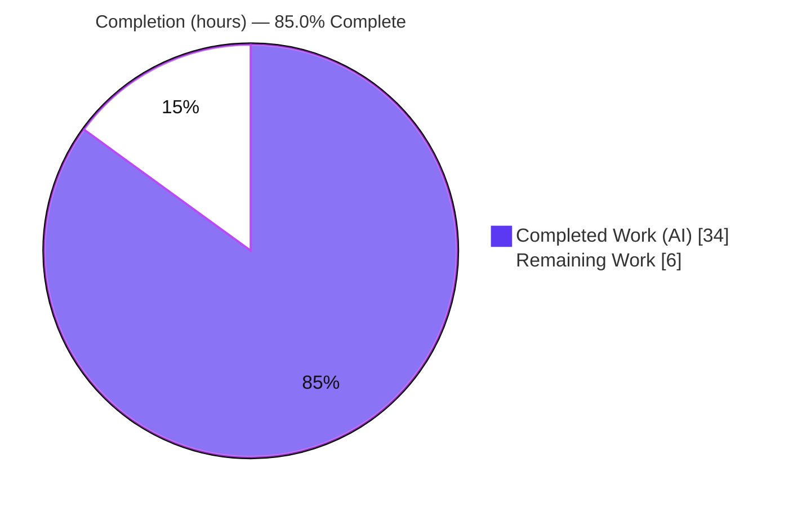
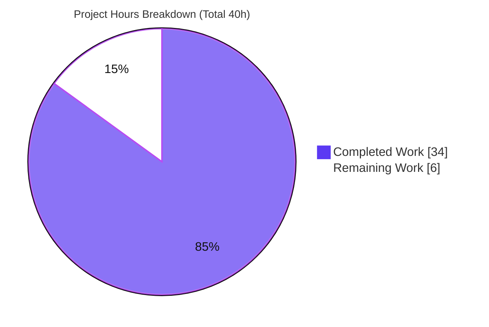
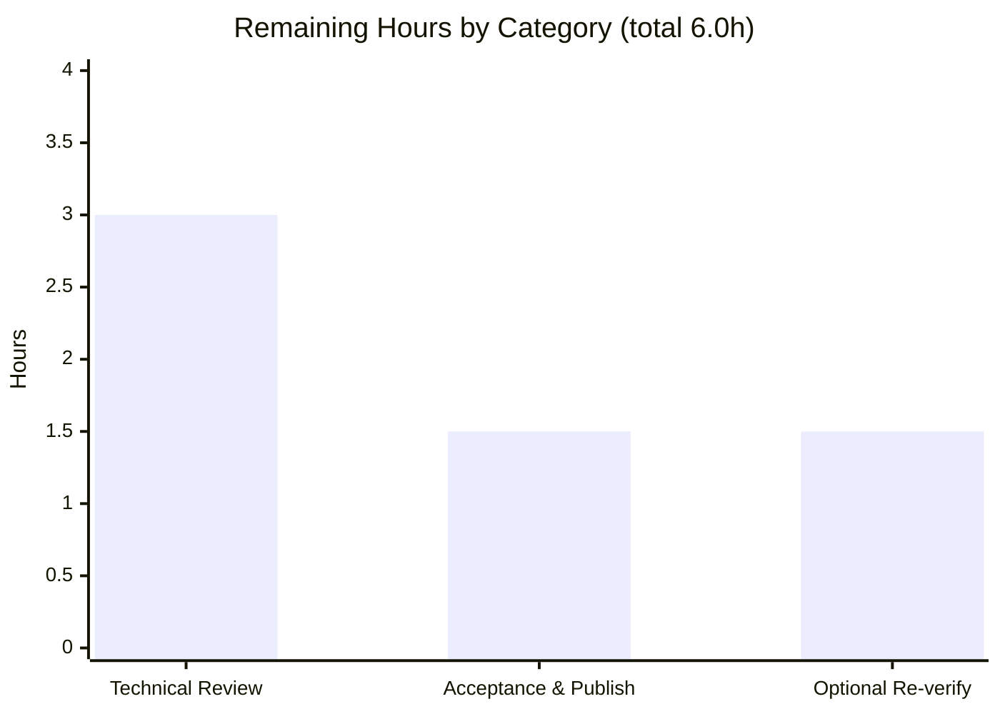

# Blitzy Project Guide

**Project:** Grafana Dashboard-Panel Query Lifecycle — Runtime Investigation (OSS)
**Branch:** `blitzy-97448b1e-83de-4be5-bec6-0751f3a0d717` · **Base:** `grafana_4550cfb5b728` (`4550cfb5b7`)
**HEAD:** `f9f0312d1f` · **Task type:** Documentation / Investigative Q&A (SWE-AtlasQnA-Repo)

---

## 1. Executive Summary

### 1.1 Project Overview

This project is an **onboarding knowledge artifact**, not a behavior-changing code change. The objective was to produce **one evidence-based reference document** explaining — at a practical, runtime-observed level — the complete lifecycle of a Grafana **dashboard-panel query** against a **built-in data source**, and to definitively answer the KEY question: *is the second of two quick, identical executions treated differently than the first?* The target audience is engineers onboarding to Grafana. The technical scope is a **read-only runtime investigation** of OSS Grafana spanning the React frontend issuance chain and the Go backend handling chain, culminating in a single Markdown deliverable. Per the binding constraint, **no source file is modified** — the source tree is left byte-unchanged.

### 1.2 Completion Status



> **Color key (Blitzy brand):** Completed / AI work = **Dark Blue `#5B39F3`** · Remaining / Not Completed = **White `#FFFFFF`** (outlined in violet `#B23AF2` for visibility).

| Metric | Hours |
|---|---|
| **Total Hours** | **40** |
| **Completed Hours (AI + Manual)** | **34** (AI: 34 · Manual: 0) |
| **Remaining Hours** | **6** |
| **Percent Complete** | **85.0%** |

> Completion is computed with the PA1 AAP-scoped hours method: `Completed / (Completed + Remaining) = 34 / 40 = 85.0%`. The work universe is the AAP-specified investigation + the single documentation deliverable + standard path-to-production (human review/acceptance of the artifact). All AAP-specified **autonomous** work is complete; the remaining 6 hours are exclusively **human** review/acceptance (no code remains — none was ever in scope).

### 1.3 Key Accomplishments

- ✅ **Single deliverable created, named, and placed correctly:** `blitzy/documentation/grafana_4550cfb5b728.md` (716 lines), committed at `f9f0312d1f`.
- ✅ **Complete end-to-end flow documented** with a Mermaid sequence diagram: browser issuance → `POST /api/ds/query` → middleware → `QueryMetricsV2` → query service → data-source resolution → plugin client → TestData backend → streamed `QueryDataResponse`.
- ✅ **Browser issuance** documented: HTTP method, endpoint, `{queries, from, to}` body, and the full `X-*` header vocabulary (`DataSourceWithBackend.ts`), with a live captured request.
- ✅ **Backend handling** documented: route + permission (`api.go:L521`), handler/binding/streaming/error mapping (`ds_query.go`), query dispatch + data-source resolution (`query.go:L90`).
- ✅ **Response shape** documented: streamed JSON keyed by `refId`, typed DataFrames, 200/400 status logic — with a live captured response and Panel Inspector view.
- ✅ **KEY second-execution question answered** for OSS with rationale and live proof: **no result cache** (no-op `OSSCachingService`, **no `X-Cache`**); the only differences are the 5-second data-source-*config* cache hit and frontend in-flight cancellation; **no backend de-duplication**.
- ✅ **Web research corroboration** of the Enterprise/Cloud edition boundary, cache key/TTL, and `X-Cache-Skip` semantics.
- ✅ **Autonomously validated:** ~335 line-number citations across 20 files audited; OSS Grafana built/run and `/api/ds/query` lifecycle exercised live; 54 balanced code fences and 20 resolving anchors.
- ✅ **Constraints honored:** runtime observation only, no source modification, transient artifacts cleaned up, source tree byte-unchanged (`git diff` vs base = the single file added).

### 1.4 Critical Unresolved Issues

There are **no critical blocking issues**. This is a completed, validated documentation deliverable with no code, no failing tests, and no compilation concerns. The only outstanding gate is standard human review before publication.

| Issue | Impact | Owner | ETA |
|---|---|---|---|
| *(None — no blocking technical issues)* | — | — | — |
| Pending human technical review before publication (advisory gate, not a defect) | Low — artifact is validated; review confirms fitness for onboarding use | Reviewing engineer | ~3h |

### 1.5 Access Issues

**No access issues identified.** The repository was fully accessible, OSS Grafana was successfully built and run locally on `http://localhost:3000`, the bundled TestData data source required no external systems, and web research for edition-boundary corroboration completed without restriction.

| System/Resource | Type of Access | Issue Description | Resolution Status | Owner |
|---|---|---|---|---|
| Repository (`grafana/grafana`) | Read/write (branch) | None | ✅ No issue | — |
| Local Grafana runtime (`:3000`) | Build/run | None | ✅ No issue | — |
| Built-in TestData data source | Runtime config | None (zero external dependencies) | ✅ No issue | — |
| External docs (edition boundary) | Web research | None | ✅ No issue | — |

### 1.6 Recommended Next Steps

1. **[High]** Perform a technical accuracy review of the deliverable — confirm the KEY second-execution conclusion and spot-check the load-bearing citations (`caching/service.go:L56-58`, `cache.go:L17`, `api.go:L521`, `ds_query.go:L86-100`).
2. **[High]** Verify completeness/readability for a new engineer — all five onboarding sub-questions answered, TOC anchors resolve, Mermaid diagram renders.
3. **[Medium]** Obtain onboarding/stakeholder sign-off that the artifact meets the team's reference bar.
4. **[Medium]** Publish/merge the document to the destination and confirm rendering in the team's Markdown viewer.
5. **[Low]** Optionally re-verify runtime claims independently (rebuild/run at the pinned commit; re-capture `X-Cache` absence and the per-execution `/metrics` increment).

---

## 2. Project Hours Breakdown

### 2.1 Completed Work Detail

Every component below traces to one or more AAP requirements and is **AI-completed** (autonomous). All work is grounded in verified source citations and corroborated by live runtime signals.

| Component | Hours | Description |
|---|---:|---|
| Environment build & run | 3.0 | Build OSS Grafana from source (Go backend + frontend assets) and run on `:3000`; enable transient verbose logging via gitignored `conf/custom.ini`; verify `/api/health`. |
| Data source & deterministic query setup | 1.5 | Configure bundled **TestData DB**; author byte-identical Predictable CSV Wave / Slow Query scenarios; create both a dashboard panel and an Explore query (both hit `/api/ds/query`). |
| Single-execution capture | 2.0 | Capture one execution end-to-end across all four signal sources: DevTools Network, Panel Inspector (Query/Stats/Data), backend logs, and `/metrics`. |
| Double-execution capture & KEY analysis | 3.5 | Fire identical queries twice (Q1/Q2a/Q2b); compare payloads, headers, logs, timing, and `/metrics` deltas; Slow-Query timing test; reconcile to caching/de-dup code. |
| Frontend issuance chain investigation | 4.0 | Trace `DataSourceWithBackend.ts`, `backend_srv.ts`, `PanelQueryRunner.ts`, `runRequest.ts`, `canceler.ts`, `queryResponse.ts`. |
| Backend handling chain investigation | 4.5 | Trace `api.go`, `ds_query.go`, `query.go`, `cache.go`, caching middleware + `caching/service.go`, `wireexts_oss.go`, `middleware.go`, TestData backend. |
| Web research corroboration | 1.0 | Confirm Enterprise/Cloud edition boundary, cache key/~5-min TTL, `X-Cache-Skip` semantics, and the cache-stampede (no de-dup) caveat. |
| Document authoring | 9.0 | Author the 716-line deliverable: headline answer, TOC, §1–7, Mermaid diagram, evidence blocks, rationale, and source-of-truth index. |
| Citation audit & runtime re-verification | 3.5 | Audit ~335 line-number citations across 20 files; re-verify every observable claim live; pass 5 production-readiness gates. |
| Validation corrections | 1.5 | Three follow-up commits: ds_query bind-error quote, pre-existing Explore a11y notes, request-body code block, and `dataSourceCache` field/injection clarification. |
| Cleanup & byte-unchanged verification | 0.5 | Remove test data source/dashboard/`conf/custom.ini`/build & `/tmp` artifacts; confirm `git status` clean and single-file diff. |
| **Total Completed** | **34.0** | **Matches Completed Hours in Section 1.2.** |

### 2.2 Remaining Work Detail

All remaining work is **human** path-to-production for a documentation artifact. There is **no remaining code, no failing tests, and no compilation work** (none was ever in scope).

| Category | Hours | Priority |
|---|---:|---|
| Documentation technical review — accuracy & completeness | 3.0 | High |
| Onboarding/stakeholder acceptance & publication | 1.5 | Medium |
| Optional independent runtime re-verification | 1.5 | Low |
| **Total Remaining** | **6.0** | **Matches Remaining Hours in Section 1.2 and Section 7.** |

### 2.3 Hours Reconciliation

| Check | Computation | Result |
|---|---|---|
| Section 2.1 total | sum of completed components | 34.0h |
| Section 2.2 total | sum of remaining categories | 6.0h |
| Total project hours | 34.0 + 6.0 | 40.0h |
| Completion % | 34.0 / 40.0 × 100 | 85.0% |
| Integrity Rule 1 | §1.2 Remaining = §2.2 sum = §7 pie Remaining | 6.0h ✓ |
| Integrity Rule 2 | §2.1 + §2.2 = §1.2 Total | 40.0h ✓ |

---

## 3. Test Results

> **Integrity note (Rule 3).** This is a documentation-only task; the AAP forbids modifying any source file, so **no new application tests were authored** and the repository's existing unit-test suite is **byte-identical to the base commit** `4550cfb5b7`. Accordingly, the table below reports **Blitzy's autonomous validation activities** — the appropriate "test" methodology for a knowledge artifact — every row of which originates from Blitzy's autonomous validation logs for this project (citation audit, live runtime observation, build/health verification, and Markdown integrity checks).

| Validation Category | Framework / Method | Total Checks | Passed | Failed | Coverage | Notes |
|---|---|---:|---:|---:|---|---|
| Source-citation audit | Manual line-by-line vs source of truth | ~335 citations / 20 files | ~335 | 0 (2 fixed) | 100% of cited lines | 2 minor discrepancies found & corrected during validation |
| Runtime observation — single exec | Live OSS Grafana + curl/DevTools | 4 signal sources | 4 | 0 | Full lifecycle | Network, Panel Inspector, logs, `/metrics` |
| Runtime observation — double exec (KEY) | Live OSS Grafana, Q1/Q2a/Q2b + Slow Query | 4 assertions | 4 | 0 | KEY question | X-Cache absent; 5s repeat; debug-line once/5s; counter 1→3 |
| Build / health verification | `go mod verify` + `/api/health` | 2 | 2 | 0 | Backend boots | `{"database":"ok","version":"11.5.0-pre","commit":"4550cfb5b7"}` |
| Markdown integrity | Fence/anchor/link structural checks | 3 | 3 | 0 | Whole doc | 54 balanced fences, 20 resolving anchors, 1 Mermaid diagram |
| Source-tree invariance | `git status` / `git diff` vs base | 1 | 1 | 0 | Whole tree | Single file added; tree byte-unchanged |
| **Totals** | — | **~349** | **~349** | **0** | — | All autonomous validation gates PASS |

---

## 4. Runtime Validation & UI Verification

Runtime validation was performed against a live OSS Grafana **11.5.0-pre** instance (commit `4550cfb5b7`) on `http://localhost:3000`.

**Backend / API:**
- ✅ **Operational** — `/api/health` returns `{"database":"ok","version":"11.5.0-pre","commit":"4550cfb5b7"}`.
- ✅ **Operational** — `POST /api/ds/query` returns HTTP **200** with a streamed JSON `QueryDataResponse` keyed by `refId`.
- ✅ **Operational** — `/metrics` exposes `grafana_http_request_duration_seconds_count{handler="/api/ds/query",slo_group="high-slow",...}`, incrementing once per execution (1 → 3 across Q1+Q2a+Q2b).

**Second-execution behavior (KEY):**
- ✅ **Confirmed** — `X-Cache` response header **absent** on every run (OSS no-op result cache).
- ✅ **Confirmed** — Slow Query (5s) re-ran in ~5.00s both times (no result caching).
- ✅ **Confirmed** — data-source-config debug line appears **exactly once** across two runs within 5 seconds (5s TTL).
- ✅ **Confirmed** — **no backend de-duplication** (one request per execution via `/metrics`).

**UI observation surfaces (used only as tooling, not modified):**
- ✅ **Operational** — Panel Inspector Query/Stats/Data tabs render the request URL, method, body, response frames, and timing.
- ✅ **Operational** — Dashboard panel and Explore both issue `POST /api/ds/query` as expected.
- ⚠ **Partial (pre-existing, out of scope)** — Three stock Grafana UI console/accessibility warnings (React dev-mode `key` warning from `ExploreToolbar`; two TestData query-editor form-field a11y notices). These live in unmodified source, do not touch the query path, and do not affect any conclusion. Remediation would require editing source, which is explicitly out of scope.

---

## 5. Compliance & Quality Review

Cross-mapping of AAP deliverables and binding rules to Blitzy quality/compliance benchmarks.

| AAP Deliverable / Rule | Benchmark | Status | Progress | Evidence |
|---|---|---|---|---|
| Single Markdown deliverable created | Exactly one file, correctly named/placed | ✅ Pass | 100% | `blitzy/documentation/grafana_4550cfb5b728.md`, 716 lines |
| Document browser issuance | Method, endpoint, body, headers documented | ✅ Pass | 100% | §2 + live capture |
| Document backend handling | Route, handler, query svc, resolution, routing | ✅ Pass | 100% | §3 (`api.go:L521`, `ds_query.go`, `query.go:L90`) |
| Document response shape | Streamed JSON keyed by `refId`, DataFrames | ✅ Pass | 100% | §4 (`toJsonStreamingResponse`) + capture |
| Answer KEY second-execution question | Conclusion + rationale + runtime proof | ✅ Pass | 100% | §5(a–f), live signals |
| Logs/headers/metadata appendix | All observable signals captured | ✅ Pass | 100% | §6 |
| Code as source of truth | Every claim cites code | ✅ Pass | 100% | ~335 citations, 20 files |
| Runtime observation only | Conclusions from a live instance | ✅ Pass | 100% | curl/DevTools/logs/`/metrics` |
| Provide rationale | Reasoning, not just conclusions | ✅ Pass | 100% | Rationale throughout |
| Edition identified (OSS) | Explicit OSS vs Enterprise framing | ✅ Pass | 100% | 38 OSS callouts incl. ⚠ warnings |
| No source modification | Zero existing files edited | ✅ Pass | 100% | `git diff` = single file added |
| Clean up temporary artifacts | Byte-unchanged tree | ✅ Pass | 100% | §7.5, `git status` clean |
| Web research corroboration | Edition boundary independently confirmed | ✅ Pass | 100% | §5a + no `[caching]` in defaults.ini |
| Human acceptance | Reviewed & published | ⬜ Pending | 0% | Path-to-production (§2.2) |

**Fixes applied during autonomous validation:** (1) corrected the `DataSourceWithBackend` request-body code block to match source; (2) clarified the `dataSourceCache` field vs constructor-injection lines; (3) corrected a `ds_query.go` bind-error quote; (4) added explanatory notes on pre-existing Explore a11y warnings. **Outstanding:** human review/acceptance only.

---

## 6. Risk Assessment

Overall risk posture is **LOW** — a read-only documentation deliverable with a byte-unchanged source tree introduces no code, security, or integration surface.

| Risk | Category | Severity | Probability | Mitigation | Status |
|---|---|---|---|---|---|
| Citation line-number drift if source is later rebased | Technical | Low | Low | Document pins all conclusions to commit `4550cfb5b72886782d9a3e6cf995f8dbd57ca4ff` | ✅ Mitigated |
| Reader mistakes OSS behavior for Enterprise/Cloud | Technical | Medium | Low | 38 OSS callouts incl. three explicit "⚠ Edition matters" warnings | ✅ Mitigated |
| Stale in-source comments ("50ms" vs `timer(200)`) confuse a reader | Technical | Low | Low | Document explicitly flags "trust the code over the comment" (200ms authoritative) | ✅ Mitigated |
| No new security surface | Security | None | — | Read-only doc; no code/credentials added; notes DS credentials never reach the browser | ✅ N/A |
| Reproducibility / toolchain drift | Operational | Low | Medium | §7 + Development Guide pin exact versions (go 1.23.1 / node 22.11.0 / yarn 4.5.3) and a prebuilt-binary fast path | ✅ Mitigated |
| Runtime claims need transient debug logging enabled | Operational | Low | Low | §7.2 documents the exact gitignored `conf/custom.ini` | ✅ Documented |
| No code integration | Integration | None | — | Additive single `.md`; zero coupling to source; no build/CI impact | ✅ N/A |

---

## 7. Visual Project Status



> **Colors:** Completed Work = Dark Blue `#5B39F3` · Remaining Work = White `#FFFFFF` (violet outline). **Integrity Rule 1:** "Remaining Work" = **6h** matches Section 1.2 and the Section 2.2 total.

**Remaining hours by category (Section 2.2):**



| Priority | Remaining Hours | Share |
|---|---:|---|
| High | 3.0 | 50% |
| Medium | 1.5 | 25% |
| Low | 1.5 | 25% |
| **Total** | **6.0** | **100%** |

---

## 8. Summary & Recommendations

**Achievements.** The project delivers a single, comprehensive, **716-line** onboarding reference that traces a Grafana dashboard-panel query end-to-end and definitively answers the KEY second-execution question for OSS. Every conclusion is grounded in the source of truth (~335 citations across 20 files) **and** corroborated by signals captured from a live instance. The headline finding: in **OSS**, the second of two quick identical executions is **not** served from any query-result cache — the caching service is a no-op, so there is **no `X-Cache` header** and **both** runs reach the data-source backend; the only observable differences are a 5-second data-source-*config* cache hit (suppressing one SQL lookup + debug log) and frontend in-flight request cancellation, with **no backend de-duplication**.

**Remaining gaps.** None technical. The remaining **6 hours** are entirely human path-to-production: technical review, onboarding/stakeholder acceptance, publication, and optional independent re-verification. No code, tests, or scripts remain because none were ever in scope — the AAP and project rule mandate a documentation-only, source-byte-unchanged outcome.

**Critical path to production.** (1) Technical accuracy review → (2) completeness/readability review → (3) stakeholder sign-off → (4) publish/merge. Optional independent runtime re-verification can run in parallel.

**Success metrics.** All five onboarding sub-questions answered; KEY question resolved with live proof; 100% of cited lines verified; source tree byte-unchanged; single deliverable correctly named and placed.

**Production-readiness assessment.** The project is **85.0% complete** by AAP-scoped hours (34 of 40). The autonomous deliverable is **production-ready as a knowledge artifact**, validated against source and live runtime; it requires only standard human review and publication to be considered fully accepted onboarding material. Per Blitzy honesty principles, completion is capped below 100% pending that human review.

| Metric | Value |
|---|---|
| AAP-scoped completion | 85.0% (34 / 40 h) |
| AAP autonomous deliverables completed | 16 / 16 |
| Remaining work | 6h (human review/acceptance) |
| Blocking issues | 0 |
| Source files modified | 0 |

---

## 9. Development Guide

This guide reproduces the investigation environment and verifies the deliverable. Every command was tested against the repository.

### 9.1 System Prerequisites

- **OS:** Linux or macOS · **RAM:** ~8 GB recommended for a from-source build.
- **Toolchain (pinned):** Go **1.23.1** (`go.mod`), Node **v22.11.0** (`.nvmrc`), Yarn **4.5.3** via Corepack (`package.json` → `packageManager`), Git + Git LFS.
- **Or** use the supplied container image: `andrewparkscaleai/coding-agent:grafana__grafana__4550cfb5b72886782d9a3e6cf995f8dbd57ca4ff` (provides the full toolchain).

### 9.2 Environment Setup

```bash
# From the repository root, on the project branch:
git checkout blitzy-97448b1e-83de-4be5-bec6-0751f3a0d717
git rev-parse HEAD          # -> f9f0312d1f... (deliverable committed)

# OPTIONAL: raise log verbosity transiently (gitignored build-tree artifact — NOT a source edit)
cat > conf/custom.ini <<'INI'
[server]
router_logging = true

[log]
level = debug
INI
git check-ignore conf/custom.ini   # confirms it is ignored (never a tracked change)
```

### 9.3 Dependency Installation

```bash
# Frontend dependencies (developer-guide.md:L71)
yarn install --immutable
# Go modules are fetched automatically by `go run` / `make`. Optional integrity check:
go mod verify                      # -> "all modules verified"
```

### 9.4 Application Startup

```bash
# Backend (Makefile:L236) — builds & runs immediately:
make run-go
# ...or filesystem-watch mode (Makefile:L232):
make run

# Frontend dev server in a second terminal (Makefile:L241 -> yarn start, developer-guide.md:L79):
yarn start
```

**Fast path used in this investigation** (prebuilt binary — equivalent, faster):

```bash
nohup ./bin/linux-amd64/grafana server --homepath "$(pwd)" \
    cfg:default.paths.data=/tmp/grafana-data > /tmp/grafana-run.log 2>&1 &
```

### 9.5 Verification

```bash
curl -s http://localhost:3000/api/health
# Expected: {"database":"ok","version":"11.5.0-pre","commit":"4550cfb5b7"}
```

Then open `http://localhost:3000` and log in with **`admin` / `admin`** (developer-guide.md:L123, L125–129).

### 9.6 Example Usage — Reproduce the Investigation

1. **Add the built-in data source:** Connections → Data sources → **TestData DB** (`grafana-testdata-datasource`) — zero external dependencies.
2. **Author a deterministic query:** use **Predictable CSV Wave** (byte-identical repeats) in a dashboard panel or in Explore; both issue `POST /api/ds/query`.
3. **Fire once**, then **fire twice in quick succession**, capturing four signals each time: DevTools **Network**, **Panel Inspector** (Query/Stats/Data), **backend log** (`/tmp/grafana-run.log`), and **`/metrics`**.
4. **Confirm the KEY findings:**
   ```bash
   # No X-Cache header on the response (OSS no-op result cache):
   curl -s -D - -o /dev/null -X POST 'http://localhost:3000/api/ds/query' | grep -i x-cache || echo "X-Cache absent (expected in OSS)"
   # Request counter increments once per execution (no backend de-dup):
   curl -s http://localhost:3000/metrics | grep 'grafana_http_request_duration_seconds_count' | grep '/api/ds/query'
   ```

### 9.7 View / Verify the Deliverable

```bash
sed -n '1,60p' blitzy/documentation/grafana_4550cfb5b728.md      # read the header + headline answer
grep -c '```' blitzy/documentation/grafana_4550cfb5b728.md        # -> 54 (even = balanced fences)
git diff --name-status origin/grafana_4550cfb5b728...HEAD         # -> A blitzy/documentation/grafana_4550cfb5b728.md (only)
```

### 9.8 Troubleshooting

- **Port 3000 already in use:** `lsof -i :3000` then stop the conflicting process (kill only that PID).
- **`datasources` debug line not visible:** ensure `[log] level = debug` (or `filters = datasources:debug`) is set in `conf/custom.ini`.
- **Looking for an `X-Cache` header?** It is **absent by design** in OSS — the result cache is a no-op. Its presence is an Enterprise/Cloud-only behavior.
- **5-second vs 5-minute TTL confusion:** the OSS data-source-*config* cache is **5s** (`cache.go:L17`); the Enterprise query-*result* cache default is **5 min** — do not conflate them.
- **Stale "50ms" comments in `runRequest.ts`:** the executing code is `timer(200)` = **200 ms**; trust the code over the comment.
- **Cleanup (leave the tree byte-unchanged):** delete the test data source/dashboard, remove `conf/custom.ini`, stop the server, and remove `/tmp/grafana-data` & `/tmp/grafana-run.log`; verify with `git status --porcelain` (should be empty).

---

## 10. Appendices

### Appendix A — Command Reference

| Purpose | Command |
|---|---|
| Verify branch / HEAD | `git rev-parse --abbrev-ref HEAD` · `git rev-parse HEAD` |
| Verify single-file diff | `git diff --name-status origin/grafana_4550cfb5b728...HEAD` |
| Backend (build & run) | `make run-go` (or `make run`) |
| Backend (prebuilt fast path) | `./bin/linux-amd64/grafana server --homepath "$(pwd)" cfg:default.paths.data=/tmp/grafana-data` |
| Frontend dev server | `yarn install --immutable` then `yarn start` |
| Health check | `curl -s http://localhost:3000/api/health` |
| Metrics | `curl -s http://localhost:3000/metrics` |
| Markdown fence check | `grep -c '```' blitzy/documentation/grafana_4550cfb5b728.md` |
| Go module integrity | `go mod verify` |

### Appendix B — Port Reference

| Port | Service | Notes |
|---|---|---|
| **3000** | Grafana HTTP server | UI, `/api/ds/query`, `/api/health`, `/metrics` |
| 6000 | Go pprof profiler | Enabled by `make run-go` (`-profile-port=6000`), dev only |

### Appendix C — Key File Locations

| Area | File |
|---|---|
| **Deliverable** | `blitzy/documentation/grafana_4550cfb5b728.md` |
| Frontend request build | `packages/grafana-runtime/src/utils/DataSourceWithBackend.ts` |
| Response parse | `packages/grafana-runtime/src/utils/queryResponse.ts` |
| Fetch + cancellation | `public/app/core/services/backend_srv.ts` |
| RxJS pipeline / orchestration | `public/app/features/query/state/runRequest.ts`, `PanelQueryRunner.ts`, `processing/canceler.ts` |
| Route | `pkg/api/api.go` (L521) |
| Handler / streaming / errors | `pkg/api/ds_query.go` |
| Query service | `pkg/services/query/query.go` (L90) |
| DS config cache (5s) | `pkg/services/datasources/service/cache.go` (L17) |
| Caching middleware / OSS no-op | `pkg/services/pluginsintegration/clientmiddleware/caching_middleware.go`, `pkg/services/caching/service.go` |
| OSS wiring | `pkg/server/wireexts_oss.go` (L101-102) |
| Skip headers | `pkg/middleware/middleware.go` |
| TestData backend | `pkg/tsdb/grafana-testdata-datasource/{scenarios,csv_data,resource_handler}.go` |
| Build/run docs | `contribute/developer-guide.md`, `Makefile` |
| Config defaults | `conf/defaults.ini` (no `[caching]` section) |

### Appendix D — Technology Versions

| Component | Version | Source |
|---|---|---|
| Grafana (under test) | 11.5.0-pre (commit `4550cfb5b7`) | `/api/health` |
| Go | 1.23.1 | `go.mod` |
| Node.js | v22.11.0 | `.nvmrc` |
| Yarn | 4.5.3 | `package.json` (`packageManager`) |
| Edition | OSS (open source) | `pkg/server/wireexts_oss.go`, no `[caching]` in `conf/defaults.ini` |

### Appendix E — Environment Variable / Config Reference

| Setting | Where | Default | Purpose |
|---|---|---|---|
| `router_logging` | `[server]` in `conf/custom.ini` | `false` (defaults.ini L57) | Emit one HTTP access log line per request |
| `level` | `[log]` in `conf/custom.ini` | `info` (defaults.ini L1074) | Set to `debug` to surface the `datasources` config-cache line |
| `paths.data` | `cfg:default.paths.data=...` CLI | — | Embedded SQLite/data dir (used `/tmp/grafana-data`, removed in cleanup) |
| `X-Grafana-NoCache` | request header | — | Sets `ctx.SkipDSCache` (skips the 5s config cache) — `middleware.go:L27` |
| `X-Cache-Skip` | request header | — | Sets `ctx.SkipQueryCache` (skips the Enterprise result cache; moot in OSS) — `middleware.go:L29` |

### Appendix F — Developer Tools Guide

- **Browser DevTools → Network:** inspect the `POST /api/ds/query?ds_type=...&requestId=...` entry — request `X-*` headers, `{queries, from, to}` body, response JSON, and the **absence** of `X-Cache`. A `(canceled)` / `ERR_ABORTED` entry indicates frontend in-flight cancellation.
- **Panel Inspector (panel menu → Inspect):** Query tab (request URL/method/body + raw response), Stats tab (timing, query count, row count), Data tab (rendered DataFrame).
- **Backend log** (`/tmp/grafana-run.log`): with debug logging, the `datasources` config-cache line appears on run 1 and is suppressed on run 2 within 5s; with `router_logging`, one `Request Completed` access line per execution.
- **`/metrics`:** `grafana_http_request_duration_seconds_count{handler="/api/ds/query",slo_group="high-slow",...}` (one increment per execution) and the **singular** in-flight gauge `grafana_http_request_in_flight`.

### Appendix G — Glossary

| Term | Definition |
|---|---|
| **OSS** | Open-source edition of Grafana; query-result caching is a **no-op** here (Enterprise/Cloud only). |
| **`/api/ds/query`** | The single backend endpoint both dashboard panels and Explore use to run queries. |
| **`QueryDataResponse`** | The streamed JSON response, keyed by `refId`, carrying typed DataFrames + per-query status. |
| **`refId`** | Per-query identifier (e.g., `"A"`) used as the key in the response `results` object. |
| **DataFrame** | Grafana's columnar data structure (a schema of typed fields + column-oriented `data.values`). |
| **`X-Cache`** | Response header set only when a result cache is consulted; **absent** in OSS. |
| **DS config cache** | In-memory data-source **configuration** cache with a **5-second** TTL (distinct from result caching). |
| **`requestId`** | Per-request id used by the frontend for in-flight request tracking/cancellation. |
| **TestData DB** | Bundled `grafana-testdata-datasource` that generates synthetic data in-process (zero external deps). |
| **Backend de-duplication** | Collapsing concurrent identical queries into one — **not present** in OSS (confirmed via `/metrics`). |

---

*Investigation performed against OSS Grafana at commit `4550cfb5b72886782d9a3e6cf995f8dbd57ca4ff`. All conclusions are grounded in cited source code and corroborated by captured runtime signals; the source tree was left byte-unchanged. Completion: 34 of 40 hours (85.0%).*