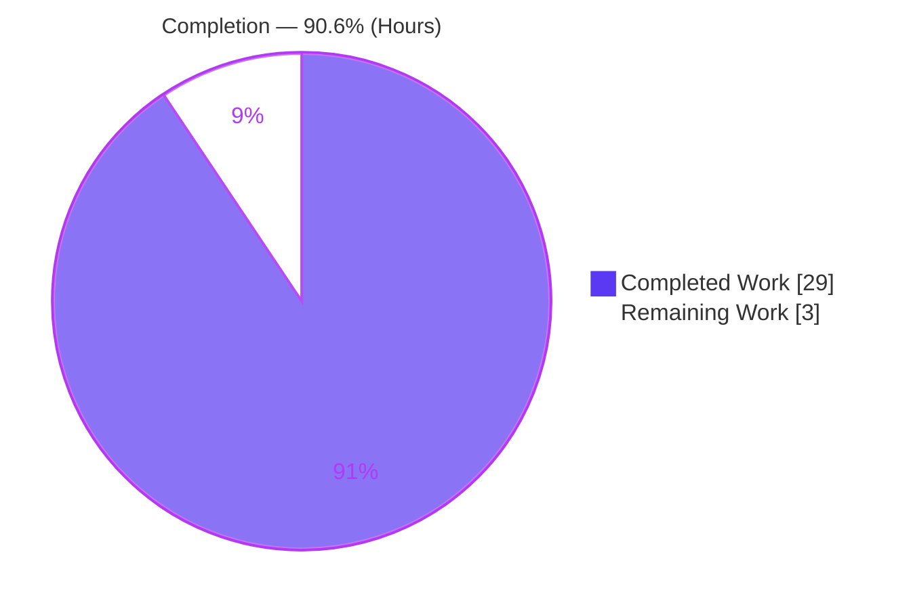
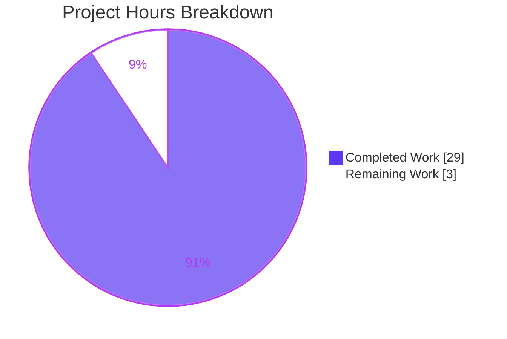
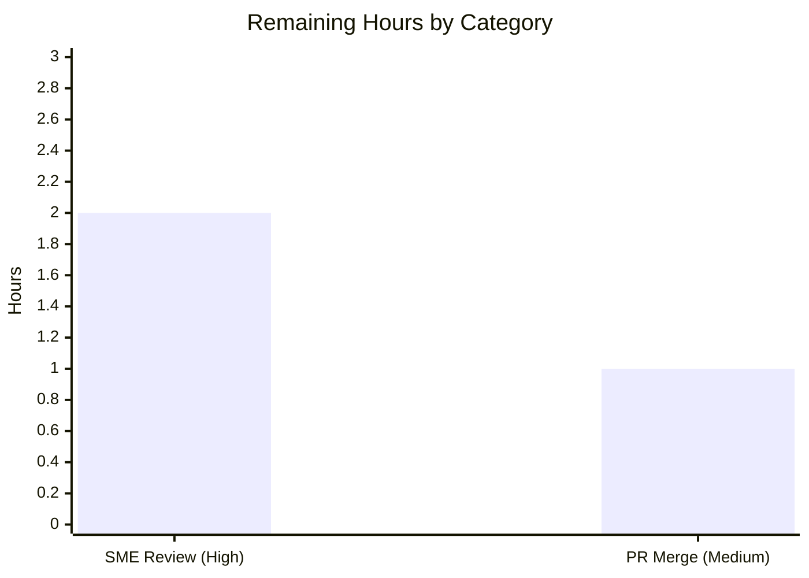

# Blitzy Project Guide — Grafana Runtime Investigation (Evidence-Backed Q&A)

> **Brand legend:** Completed / AI Work = **Dark Blue `#5B39F3`** · Remaining / Not Completed = **White `#FFFFFF`** · Headings / Accents = **Violet-Black `#B23AF2`** · Highlight = **Mint `#A8FDD9`**

---

## 1. Executive Summary

### 1.1 Project Overview

This project delivers a single investigative documentation artifact — `blitzy/documentation/grafana_4550cfb5b728.md` — that answers five discrete questions about Grafana's runtime behavior. Its distinguishing constraint is *methodological*: every answer was produced by **building and running the actual code first**, then quoting captured output verbatim, pairing each behavioral claim with the exact observed line, and citing the responsible source by `file:line`. The target audience is engineers and reviewers who need runtime-grounded (not read-only) answers about server idle logging, DB migration signaling, the build/version API, the dashboard-scene datasource picker, and alerting rule-editor query-state population. The source repository (Grafana OSS, commit `4550cfb5b7`) remains otherwise unchanged (strict read-only).

### 1.2 Completion Status



| Metric | Value |
|---|---|
| **Total Hours** | **32 h** |
| **Completed Hours (AI + Manual)** | **29 h** (AI: 29 h · Manual: 0 h) |
| **Remaining Hours** | **3 h** |
| **Percent Complete** | **90.6 %** |

> Completion formula (PA1, AAP-scoped): `29 / (29 + 3) × 100 = 90.6 %`. The 29 h reflect all autonomously-completed AAP deliverables (build baseline + five objective investigations + document authoring + validation + cleanup). The 3 h reflect the only path-to-production gate for a documentation artifact: human review and merge.

### 1.3 Key Accomplishments

- ✅ **All five objectives investigated by running the code** — backend built and run; frontend tests executed; every claim backed by verbatim runtime output.
- ✅ **Single deliverable authored** — `blitzy/documentation/grafana_4550cfb5b728.md` (352 lines, 3,313 words) with one-claim-one-evidence discipline, `file:line` citations, rationale, and a coverage pass.
- ✅ **Q1 (idle logs):** ~20-minute idle run captured; two 10-minute recurring Info entries identified (`cleanup` "Completed cleanup jobs"; `plugins.update.checker` "Update check succeeded"); strict-60s window reported honestly (no periodic recurrence).
- ✅ **Q2 (migrations):** two-run technique — fresh DB `performed=626`; migrated restart `performed=0 skipped=626` (schema-up-to-date signal).
- ✅ **Q3 (version):** `curl -si /api/health` → `"version": "11.5.0-pre"`; build provenance explained and no-ldflags fallback `9.2.0` proven.
- ✅ **Q4 (datasource picker):** existing jest `should load data source` PASS; attributed to `PanelDataQueriesTab.loadDataSource()`.
- ✅ **Q5 (rule query-state):** temporary jest PASS (`queries === ga.data`); attributed to `rulerRuleToFormValues` / `formValuesFromExistingRule`.
- ✅ **Read-only constraint satisfied** — `git status --porcelain` empty; diff vs base = exactly one added file.
- ✅ **Independently validated** — every runtime claim reproduced; every citation grep-verified; document found fully accurate (zero corrections).

### 1.4 Critical Unresolved Issues

| Issue | Impact | Owner | ETA |
|---|---|---|---|
| _None_ | No blocking or release-critical issues identified. Compilation clean, all tests pass, read-only compliance verified, cleanup complete. | — | — |

### 1.5 Access Issues

| System/Resource | Type of Access | Issue Description | Resolution Status | Owner |
|---|---|---|---|---|
| _None_ | — | No access issues identified. The provisioned toolchain (Go 1.23.1, Node v22.12.0, Yarn 4.5.3, curl, sqlite3, gcc) is fully available; no external credentials, private registries, or third-party APIs are required for a documentation-only task. | N/A | — |

### 1.6 Recommended Next Steps

1. **[High]** Perform SME technical review of the five evidence-backed answers in `blitzy/documentation/grafana_4550cfb5b728.md` — verify accuracy/completeness and (optionally) re-run the documented verification commands.
2. **[Medium]** Approve and merge the single-file PR into the target branch; confirm `git diff` vs base still shows exactly one added file.
3. **[Low]** Apply any minor clarity/formatting revisions requested during review (not expected — the document was validated fully accurate).

---

## 2. Project Hours Breakdown

### 2.1 Completed Work Detail

| Component | Hours | Description |
|---|---|---|
| Environment & build baseline | 4 | Backend build with Wire codegen + linker flags (`-X main.version=11.5.0-pre`); frontend deps warmed; toolchain verified (Go/Node/Yarn/curl/sqlite3/gcc). [AAP §0.5.1 baseline] |
| Objective 1 — idle recurring logs | 5 | Extended ~20-min idle server runs; strict-60s window analysis (awk timestamp filtering); background-service attribution (`cleanup`, `plugins.update.checker`, scheduler). [AAP Obj. 1] |
| Objective 2 — migration check | 2 | Two-run technique (fresh + already-migrated SQLite DB); captured `Starting DB migrations` / `migrations completed performed=0`. [AAP Obj. 2] |
| Objective 3 — version via API | 3 | `curl -si /api/health` capture (status/headers/body); build-provenance tracing; built no-ldflags fallback binary to prove `9.2.0`. [AAP Obj. 3] |
| Objective 4 — scene datasource picker | 2 | Ran existing jest `should load data source` non-interactively; attributed to `loadDataSource()`. [AAP Obj. 4] |
| Objective 5 — alerting rule query-state | 3 | Authored temporary jest test (mock `RuleWithLocation`), ran it, captured observed values + PASS, then deleted. [AAP Obj. 5] |
| Answer document authoring | 5 | 352-line evidence-first Q&A; per-claim evidence lines, `file:line` citations, rationale, coverage pass. [AAP §0.6.2 deliverable] |
| Validation & review remediation | 4 | Code-review findings F1–F5 addressed; Q1 QA precision tightened; independent reproduction of all five objectives; citation grep-verification. |
| Cleanup & read-only verification | 1 | Deleted all temporary scripts/tests/DBs/logs; verified `git status` clean and single-file diff. [AAP §0.8.2] |
| **Total Completed** | **29** | |

### 2.2 Remaining Work Detail

| Category | Hours | Priority |
|---|---|---|
| Human SME technical review of the five evidence-backed answers (accuracy + completeness) | 2 | High |
| PR acceptance & merge / stakeholder sign-off | 1 | Medium |
| **Total Remaining** | **3** | |

> **Integrity:** Section 2.1 (29 h) + Section 2.2 (3 h) = **32 h** = Total Project Hours (Section 1.2). Section 2.2 total (3 h) equals Section 1.2 Remaining Hours and the Section 7 "Remaining Work" value.

### 2.3 Basis of Estimate

Estimates use PA2 base-hour guidance scaled to an investigative documentation task. The bulk of completed effort is runtime investigation (build/run/observe/capture) rather than code authorship, because the AAP mandates a build-run-observe-then-write workflow and permits only one additive file. Remaining hours are exclusively the path-to-production gate for documentation — there is no deployment/CI-CD/infrastructure to configure. Confidence: **High** — scope is well-defined and the deliverable is already validated.

---

## 3. Test Results

All tests below originate from Blitzy's autonomous validation logs for this project (integrity Rule 3).

| Test Category | Framework | Total Tests | Passed | Failed | Coverage % | Notes |
|---|---|---|---|---|---|---|
| Frontend Unit — Q4 datasource picker | Jest | 1 (targeted) | 1 | 0 | Not measured (targeted `-t` run) | `should load data source` in `PanelDataQueriesTab.test.tsx`; suite reported **1 passed, 24 skipped, 25 total** (siblings deselected by `-t` filter, not failures). |
| Frontend Unit — Q5 rule query-state | Jest | 1 | 1 | 0 | Not measured (observation test) | Temporary observation test `rule-form.q5observation.test.ts`; asserted `queries === ga.data` (same reference), `condition = C`; **1 passed, 1 total**; test deleted after capture. |
| Backend Compilation | `go build` | 2 builds | 2 | 0 | N/A | ldflags build → self-reports `11.5.0-pre` (exit 0); no-ldflags build → `9.2.0` (exit 0). |
| Backend Runtime Validation | Manual run + `curl` | 4 runs | 4 | 0 | N/A | Fresh-DB run, ~20-min idle run, clean idle run, no-ldflags binary; migrations executed; `GET /api/health` served HTTP 200. |
| **Totals (formal tests)** | Jest | **2** | **2** | **0** | — | 100% pass rate on executed test cases. |

> **Note:** Coverage percentages are reported honestly as *not measured* — the runs were targeted/observation executions (`-t` name filter and a temporary observation test), not `--coverage` runs. No coverage figure is fabricated (RG2 honesty).

---

## 4. Runtime Validation & UI Verification

**Backend runtime (built + run per AAP):**

- ✅ **Server startup** — Operational. `HTTP Server Listen address=[::]:3000 protocol=http` observed.
- ✅ **Database migrations** — Operational. Fresh DB `performed=626 skipped=0`; migrated restart `performed=0 skipped=626` (schema up to date).
- ✅ **Health/Version API (`GET /api/health`)** — Operational. HTTP 200, body `{"database":"ok","version":"11.5.0-pre","commit":"4550cfb5b7"}`, headers verified (`Content-Type: application/json`, `Content-Length: 75`).
- ✅ **Idle background services** — Operational. Two 10-minute recurring Info entries observed over ~20-min idle window (`cleanup` "Completed cleanup jobs"; `plugins.update.checker` "Update check succeeded"). Strict-60s window: no periodic recurrence (reported honestly).
- ✅ **Version provenance** — Operational. No-ldflags fallback binary returned `"version": "9.2.0", "commit": "NA"` (confirms provenance chain).

**Frontend / UI behavior (verified via jest test output — the AAP-mandated evidence vehicle for Q4/Q5, not a browser session):**

- ✅ **Dashboard-scene datasource picker (Q4)** — Verified. Jest PASS proves the picker resolves to and displays the panel's already-defined datasource via `PanelDataQueriesTab.loadDataSource()`.
- ✅ **Alerting rule-editor query-state (Q5)** — Verified. Jest PASS proves the backend rule definition pre-populates the form's `queries` (`=== ga.data`) and `condition` via `rulerRuleToFormValues` → `formValuesFromExistingRule`.
- ⚠ **Live browser UI session** — Not performed (by design). The AAP explicitly specifies test-script output as the evidence mechanism for Q4/Q5; a full browser session was out of scope.

---

## 5. Compliance & Quality Review

Cross-map of AAP deliverables and project-rule directives (`SWE-AtlasQnA-Repo`, §0.7) to their quality benchmarks, with fixes applied during autonomous validation.

| Benchmark / Rule | Status | Progress | Evidence / Notes |
|---|---|---|---|
| Deliverable location & name (`blitzy/documentation/grafana_4550cfb5b728.md`) | ✅ Pass | 100% | File present at exact path; 352 lines. |
| Investigate by running first (build/run/observe → then write) | ✅ Pass | 100% | Backend built & run; jest executed; verbatim output captured for every claim. |
| Observe real magnitude (Q1 ≥60s + true cadence) | ✅ Pass | 100% | ~20-min idle run captured the true 10-minute recurrence cadence beyond the 60s floor. |
| Quote observed output verbatim | ✅ Pass | 100% | Log lines, HTTP responses/headers, jest markers quoted verbatim with producing commands. |
| One claim → one piece of evidence | ✅ Pass | 100% | Each behavioral statement paired with the specific observed line. |
| Answer every named item + coverage pass | ✅ Pass | 100% | Explicit "Coverage pass" section maps all five questions + named sub-parts. |
| Be exact & grounded (`file:line` literals) | ✅ Pass | 100% | Citations grep-verified accurate (e.g., `cleanup.go:L80/L128`, `migrator.go:L247/L287`, `http_server.go:L719-721`, `rule-form.ts:L380/L402`). |
| Report exactly what you observe (no adjustment) | ✅ Pass | 100% | Q1 strict-window null result and Q3 version provenance reported honestly, unembellished. |
| Provide rationale per answer | ✅ Pass | 100% | Each Q section includes an explicit rationale. |
| Read-only source repository | ✅ Pass | 100% | `git status --porcelain` empty; diff vs base = one added file. |
| Clean up temporary scripts/tests | ✅ Pass | 100% | All observation artifacts deleted; compiled binary is gitignored (zero tree impact). |
| Code-review findings F1–F5 | ✅ Pass | 100% | Addressed in commit `096b2bccc4`; Q1 precision tightened in `234f1b0e08`. |

**Outstanding compliance items:** None. All benchmarks pass.

---

## 6. Risk Assessment

| Risk | Category | Severity | Probability | Mitigation | Status |
|---|---|---|---|---|---|
| R1 — Citation line-drift if source is edited on later commits | Technical | Low | Low | Citations explicitly pinned to commit `4550cfb5b7`; verified accurate at that commit. | Mitigated |
| R2 — Runtime non-determinism (startup jitter: usagestats readiness timing, plugin auto-install) | Technical | Low | Medium | Reported honestly in the document; does not affect the recurring-entries answer. | Accepted / Documented |
| R3 — Re-verification requires rebuild (Wire codegen + ldflags) | Technical | Low | Low | Run instructions documented (Section 9); `make gen-go` fallback noted. | Mitigated |
| R4 — Version-provenance misinterpretation (`11.5.0-pre` ldflags vs `9.2.0` fallback) | Integration | Low | Low | Document explains both cases and the full provenance chain; fallback proven empirically. | Mitigated |
| R5 — Jest watch-mode hang if run with default `yarn test` | Integration | Low | Low | Exact non-interactive commands documented (`--watchAll=false --ci`). | Mitigated |
| Security risks | Security | None | — | Documentation-only artifact: no code, no dependency changes, no secrets, no new attack surface. | N/A |
| Operational risks | Operational | None | — | No deployed runtime component; a static markdown file has no monitoring/health/backup concerns. | N/A |

**Overall risk profile: LOW.** No High/Critical risks; no blocking issues.

---

## 7. Visual Project Status

**Project hours breakdown** (Completed = Dark Blue `#5B39F3`, Remaining = White `#FFFFFF`):



**Remaining hours by category** (from Section 2.2):



> **Integrity:** the pie "Remaining Work" value (**3**) equals Section 1.2 Remaining Hours and the Section 2.2 "Hours" total; the bar-chart categories sum to **3 h**.

---

## 8. Summary & Recommendations

**Achievements.** The project delivers a rigorous, runtime-grounded answer to all five questions in a single 352-line document, produced under a strict read-only constraint. Each answer follows a build-run-observe-quote-attribute discipline: verbatim log lines, HTTP responses, and jest markers are pasted next to each claim and cited by `file:line`. Independent validation reproduced every runtime claim and found the document fully accurate.

**Remaining gaps.** None technical. The residual 3 h is the human path-to-production gate: SME technical review (2 h) and PR acceptance/merge (1 h). Because a documentation artifact has no deployment/CI-CD path, this review-and-merge step is the entirety of "production readiness."

**Critical path to production.** (1) SME reviews the five answers → (2) approve & merge the single-file PR. That is the complete path.

**Success metrics.** All met: five questions answered with verbatim evidence; every citation accurate; read-only constraint satisfied (single added file); all executed tests pass; zero unresolved errors.

**Production readiness assessment.** The project is **90.6% complete (29 h of 32 h)**. The autonomous work is done and validated; the deliverable is ready for human review and merge. Confidence is **High** given the narrow, well-defined scope and completed independent validation.

| Metric | Value |
|---|---|
| Completion | 90.6% (29 h / 32 h) |
| Formal tests pass rate | 100% (2/2 jest cases) |
| Read-only compliance | Satisfied (1 added file) |
| Open blocking issues | 0 |
| Overall risk | Low |

---

## 9. Development Guide

All commands below were executed and verified in the provisioned environment.

### 9.1 System Prerequisites

- **OS:** Linux x86-64 (container). **Go** 1.23.1 · **Node** v22.12.0 (repo pins v22.11.0 in `.nvmrc`; engines `>= 22`) · **Yarn** 4.5.3 (via Corepack) · **gcc** 15.2.0 (required for `CGO_ENABLED=1` / SQLite) · **curl** 8.14.1 · **sqlite3** 3.46.1.

### 9.2 Environment Setup

```bash
# From the repository root
cd /path/to/grafana

# Toolchain PATH (Go + Node) — provisioned setup script
source /etc/profile.d/go-node-setup.sh

# Build environment variables
export GOPATH=/root/go
export GOMODCACHE=/root/go/pkg/mod
export CGO_ENABLED=1
export CC=gcc

# Verify toolchain
go version        # -> go version go1.23.1 linux/amd64
node --version    # -> v22.12.0
corepack yarn --version   # -> 4.5.3
```

### 9.3 Dependency Installation

```bash
# Backend Go modules (warmed in GOMODCACHE; run only if cold)
go mod download

# Frontend dependencies (node_modules present; run only if cold)
CI=true corepack yarn install --immutable
```

### 9.4 Build

```bash
# 1) Generate the Google Wire file (gitignored pkg/server/wire_gen.go) if absent
make gen-go

# 2) Build the runnable backend with documented linker flags
go build \
  -ldflags="-w -X main.version=11.5.0-pre -X main.commit=4550cfb5b7 -X main.buildBranch=grafana_4550cfb5b728" \
  -o ./bin/linux-amd64/grafana ./pkg/cmd/grafana

# Verify the compiled version
./bin/linux-amd64/grafana -v      # -> grafana version 11.5.0-pre
```

> A bare `go build` (no `-X main.version`) yields the compiled fallback `9.2.0` (see `pkg/cmd/grafana/main.go:L17`). Use ldflags to reproduce `11.5.0-pre`.

### 9.5 Application Startup

```bash
# Run with defaults (SQLite, HTTP port 3000), redirecting data/logs/plugins to /tmp
./bin/linux-amd64/grafana server --homepath "$(pwd)" \
  cfg:default.paths.data=/tmp/gf/data \
  cfg:default.paths.logs=/tmp/gf/logs \
  cfg:default.paths.plugins=/tmp/gf/plugins &
GF_PID=$!
# ... capture evidence ...
kill "$GF_PID"   # stop only the process you spawned
```

### 9.6 Verification Steps

```bash
# Health / version API (Objective 3)
curl -si http://localhost:3000/api/health
# Expect: HTTP/1.1 200 OK  +  {"database":"ok","version":"11.5.0-pre","commit":"4550cfb5b7"}

# Migration signal on restart (Objective 2) — grep the startup console log
grep 'DB migrations\|migrations completed' <captured-console.log>
# Expect on a migrated DB: msg="migrations completed" performed=0 skipped=626

# Idle recurring logs (Objective 1) — after ~20 min idle
grep 'logger=cleanup\|logger=plugins.update.checker' <captured-console.log>
```

### 9.7 Frontend Tests (Objectives 4 & 5)

```bash
# Q4 — existing test (non-interactive; NEVER use `yarn test` = watch mode)
CI=true corepack yarn jest \
  public/app/features/dashboard-scene/panel-edit/PanelDataPane/PanelDataQueriesTab.test.tsx \
  -t "should load data source" --watchAll=false --ci
# Expect: PASS ... Tests: 24 skipped, 1 passed, 25 total
```

### 9.8 Read-Only Compliance Verification

```bash
git status --porcelain                                   # expect: (empty)
git diff --name-status 4550cfb5b72886782d9a3e6cf995f8dbd57ca4ff --
# expect exactly: A  blitzy/documentation/grafana_4550cfb5b728.md
```

### 9.9 Troubleshooting

- **`wire_gen.go` missing / build fails on `Initialize`** → run `make gen-go` before `go build`.
- **Jest hangs / never exits** → you invoked watch mode; always append `--watchAll=false --ci` (never `yarn test`).
- **API returns `"version":"9.2.0"`** → binary built without ldflags; rebuild with `-X main.version=11.5.0-pre`.
- **Port 3000 already in use** → add `cfg:default.server.http_port=<port>` to the run command.
- **CGO/SQLite build error** → ensure `CGO_ENABLED=1` and `CC=gcc` are exported.

---

## 10. Appendices

### A. Command Reference

| Purpose | Command |
|---|---|
| Toolchain PATH | `source /etc/profile.d/go-node-setup.sh` |
| Wire codegen | `make gen-go` |
| Build backend (ldflags) | `go build -ldflags="-w -X main.version=11.5.0-pre -X main.commit=4550cfb5b7 -X main.buildBranch=grafana_4550cfb5b728" -o ./bin/linux-amd64/grafana ./pkg/cmd/grafana` |
| Version self-report | `./bin/linux-amd64/grafana -v` |
| Run server | `./bin/linux-amd64/grafana server --homepath "$(pwd)" cfg:default.paths.data=/tmp/gf/data ...` |
| Health API | `curl -si http://localhost:3000/api/health` |
| Q4 jest | `CI=true corepack yarn jest <path> -t "should load data source" --watchAll=false --ci` |
| Read-only check | `git status --porcelain` / `git diff --name-status 4550cfb5b7 --` |

### B. Port Reference

| Port | Service | Notes |
|---|---|---|
| 3000 | Grafana HTTP server | Default (`conf/defaults.ini:L41`). Used for `GET /api/health`. |
| 3001 | Grafana (no-ldflags demo) | Alternate port used to prove the `9.2.0` fallback binary concurrently. |

### C. Key File Locations

| File | Role |
|---|---|
| `blitzy/documentation/grafana_4550cfb5b728.md` | **The deliverable** (352 lines) |
| `pkg/services/cleanup/cleanup.go` | Q1 — `Completed cleanup jobs` (L128), 10-min ticker (L80) |
| `pkg/services/updatechecker/plugins.go` | Q1 — `Update check succeeded` (L123), ticker (L78) |
| `pkg/server/server.go` | Q1 — background-service orchestration (L139–L180) |
| `pkg/services/sqlstore/migrator/migrator.go` | Q2 — `Starting DB migrations` (L247), `migrations completed` (L287) |
| `pkg/api/http_server.go` | Q3 — `apiHealthHandler` (L710), version wiring (L719–L721) |
| `pkg/cmd/grafana/main.go` | Q3 — fallback `var version = "9.2.0"` (L17) |
| `pkg/build/cmd.go` | Q3 — `-X main.version` ldflag (L247) |
| `public/app/.../PanelDataPane/PanelDataQueriesTab.tsx` | Q4 — `loadDataSource()` (L63/L71/L101–L106) |
| `public/app/.../PanelDataPane/PanelDataQueriesTab.test.tsx` | Q4 — `should load data source` (L361) |
| `public/app/features/alerting/unified/utils/rule-form.ts` | Q5 — `queries: ga.data` (L380/L402), `formValuesFromExistingRule` |
| `public/app/.../alert-rule-form/AlertRuleForm.tsx` | Q5 — `formValuesFromExistingRule(existing)` (L104–L105) |

### D. Technology Versions

| Tool | Version | Source |
|---|---|---|
| Go | 1.23.1 | `go.mod:L3` |
| Node.js | v22.12.0 (repo pins v22.11.0) | `.nvmrc` / `package.json` engines `>= 22` |
| Yarn | 4.5.3 | `package.json` `packageManager` |
| gcc | 15.2.0 | system (CGO) |
| curl | 8.14.1 | system |
| sqlite3 | 3.46.1 | system (default DB) |

### E. Environment Variable Reference

| Variable | Value | Purpose |
|---|---|---|
| `GOPATH` | `/root/go` | Go workspace |
| `GOMODCACHE` | `/root/go/pkg/mod` | Warmed module cache |
| `CGO_ENABLED` | `1` | Required for SQLite backend |
| `CC` | `gcc` | C compiler for CGO |
| `CI` | `true` | Non-interactive Node/Yarn/Jest |

### F. Developer Tools Guide

- **Jest (non-interactive):** always `--watchAll=false --ci`; use `-t "<name>"` to target a single test. Never `yarn test` (watch mode, `package.json:L26`).
- **Log analysis:** `awk` timestamp windowing (`t=YYYY-MM-DDT...Z`) and `grep 'logger=<name>'` to isolate a background service's entries and count occurrences within a window.
- **Git verification:** `git diff --name-status <base> --` to confirm exactly one added file; `git check-ignore <path>` to confirm build artifacts are gitignored.

### G. Glossary

| Term | Meaning |
|---|---|
| **ldflags** | Go linker flags (`-X pkg.var=value`) that inject build-time values (e.g., `main.version`). |
| **Wire** | Google Wire compile-time dependency injection; generates `pkg/server/wire_gen.go`. |
| **Background service** | A long-running goroutine started by `Server.Run()` (e.g., cleanup, update checkers, scheduler). |
| **Migrator** | Component that applies/skips DB schema migrations on startup; `performed=0` means schema is current. |
| **Ruler rule** | A Grafana-managed alert rule definition; `grafana_alert.data` holds its query array (`ga.data`). |
| **Scene** | Dashboard-scene architecture powering the panel editor; `PanelDataQueriesTab` hosts the queries tab. |
| **Coverage pass** | Final checklist mapping each question + named sub-part to where it is answered in the document. |

---

*Generated by the Blitzy Platform. Completion (90.6%) is computed exclusively from AAP-scoped and path-to-production work per PA1 methodology. All test results originate from Blitzy's autonomous validation logs.*