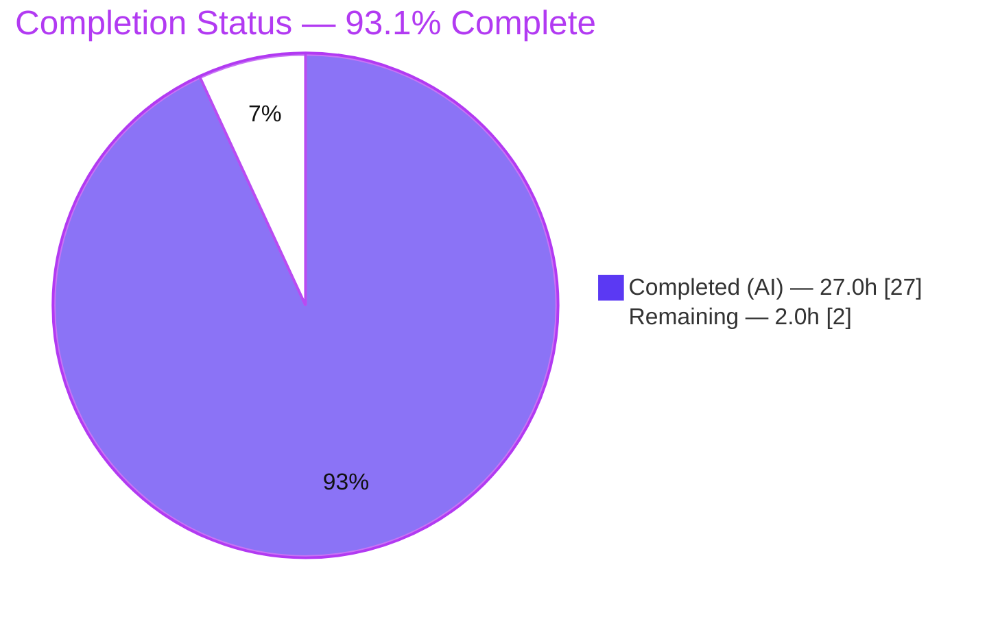
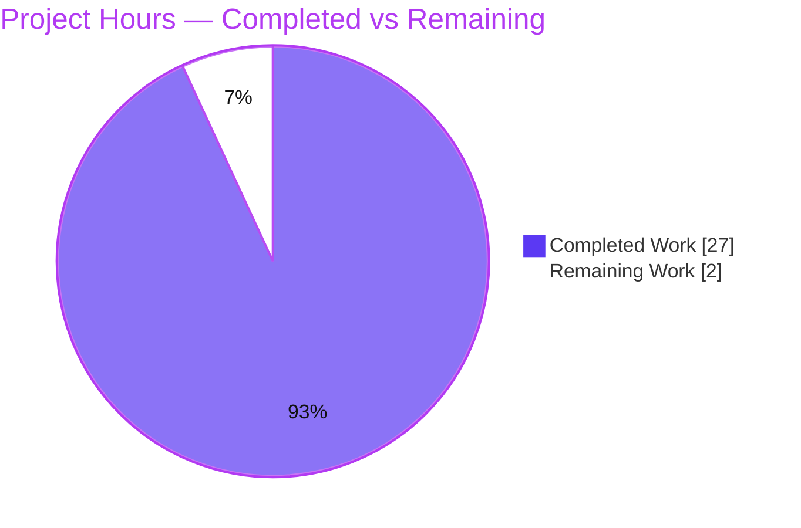

# Blitzy Project Guide — Grafana Runtime-Evidence Q&A (Five Investigations)

> **Project type:** Read-only, runtime-evidence Q&A investigation (Documentation).
> **Repository:** Grafana @ base commit `4550cfb5b72886782d9a3e6cf995f8dbd57ca4ff` · branch `grafana_4550cfb5b728`.
> **Sole deliverable:** `blitzy/documentation/grafana_4550cfb5b728.md` (645 lines).
> **Legend / brand colors:** Completed / AI work = **Dark Blue `#5B39F3`** · Remaining = **White `#FFFFFF`** · Headings/Accents = **Violet-Black `#B23AF2`** · Highlight = **Mint `#A8FDD9`**.

---

## 1. Executive Summary

### 1.1 Project Overview

This project answers five precise questions about Grafana's runtime behavior and frontend architecture by **building, running, and testing the actual system** and grounding every claim in verbatim output plus exact `file:line` citations. The questions cover (Q1) idle-server recurring logs, (Q2) the database-migration "schema up-to-date" signal, (Q3) the build/version string served by the live HTTP API, (Q4) the dashboard-scene datasource picker's auto-resolution during view→edit, and (Q5) whether an existing backend alert-rule definition populates the edit form's query state. The target audience is engineers auditing Grafana internals. The scope is strictly **read-only**: the only artifact produced is a single Markdown answer document; no source, config, build, or test file is modified.

### 1.2 Completion Status



| Metric | Value |
|---|---|
| **Total Hours** | **29.0** |
| **Completed Hours (AI + Manual)** | **27.0** (27.0 AI + 0.0 Manual) |
| **Remaining Hours** | **2.0** |
| **Percent Complete** | **93.1%** (27.0 ÷ 29.0) |

> Completion is computed with the AAP-scoped, hours-based method: `Completed ÷ (Completed + Remaining) = 27.0 ÷ 29.0 = 93.1%`. The remaining 2.0h is human review/acceptance of the answer document (path-to-production for a documentation deliverable). Per policy, completion is capped below 100% until human sign-off.

### 1.3 Key Accomplishments

- ✅ **Backend built from source** — regenerated the git-ignored Wire dependency-injection file and compiled the server with `CGO_ENABLED=1` (SQLite driver); produced a 298 MB binary reporting `grafana version 9.2.0`.
- ✅ **Q1 (idle recurring logs) reproduced** — captured the recurring `logger=ngalert.scheduler … msg="Alert rules fetched"` DEBUG line at a measured **10-second** cadence over a ≥60 s idle window, plus the one-time INFO `"Usage stats are ready to report"`.
- ✅ **Q2 (migration check) reproduced** — two-pass run: fresh DB `migrations completed performed=626`; warm DB `migrations completed performed=0 skipped=626` (the "schema up to date" signal).
- ✅ **Q3 (version via API) reproduced** — `curl -i /api/health` → `HTTP/1.1 200 OK`, body `{"database":"ok","version":"9.2.0","commit":"NA"}`; exact value **`"version": "9.2.0"`**.
- ✅ **Q4 (scene datasource picker) proven** — jest `PanelDataQueriesTab.test.tsx` → **25 passed / 25 total**, including `✓ should load data source`.
- ✅ **Q5 (alerting rule-edit query-state) proven** — committed `rule-form.test.ts` → **21 passed / 21 total**, plus a temporary forward-mapping spec → **2 passed / 2 total** (`queries ← grafana_alert.data`, `condition ← grafana_alert.condition`); temp spec deleted afterward.
- ✅ **~60 `file:line` citations verified** — independent spot-check of 6 key citations returned 0 mismatches.
- ✅ **Read-only guarantee upheld** — `git diff base..HEAD` shows exactly one added file (the answer doc); working tree clean; generated Wire file and temporary scripts removed.

### 1.4 Critical Unresolved Issues

| Issue | Impact | Owner | ETA |
|---|---|---|---|
| _No critical or release-blocking issues identified._ The deliverable is complete, internally consistent, and independently spot-checked. | None | — | — |
| (Non-blocking) Confirm the Q5 interpretation — "rule **creation** process" was answered as the rule **edit-view** initialization path (the technically correct reading of "populate query state when the edit view is opened"). | Low — intent confirmation only | Reviewer | With HT-1 (1.0h) |

### 1.5 Access Issues

| System/Resource | Type of Access | Issue Description | Resolution Status | Owner |
|---|---|---|---|---|
| Grafana repository (local checkout) | Read/build | None — full read/build/test access confirmed | ✅ Resolved | — |
| Go / Node toolchain, module & npm caches | Build/test | None — Go 1.23.1, Node 22.12.0, Yarn 4.5.3, gcc 15.2.0 present; caches warm | ✅ Resolved | — |
| `GET /api/frontend/settings` (alternate version surface) | HTTP (authenticated) | Returns `401` unauthenticated; **not** an access blocker — the canonical unauthenticated `/api/health` endpoint was used for Q3 as designed | ✅ N/A (by design) | — |

**No access issues identified** that prevent automated build validation, integration, or deployment.

### 1.6 Recommended Next Steps

1. **[High]** Perform the answer-document review & acceptance (HT-1): confirm each of Q1–Q5 is answered with the exact requested value and that the "Coverage pass" table holds. **(1.0h)**
2. **[High]** Confirm the Q5 "creation → edit-view" interpretation matches the asker's intent; flag if a literal new-rule creation path was meant. **(part of HT-1)**
3. **[Medium]** (Optional) Reproduce a subset of evidence (HT-2): Wire-gen → CGO build → run → `curl /api/health` (expect `9.2.0`), and run the two jest specs (expect 25/25 and 21/21). **(0.75h)**
4. **[Low]** (Optional) For stakeholders needing the official release version, capture `/api/frontend/settings` `buildInfo.version` via an authenticated session and annotate the version provenance. **(0.25h)**

---

## 2. Project Hours Breakdown

### 2.1 Completed Work Detail

| Component | Hours | Description |
|---|---|---|
| Environment & toolchain setup | 2.0 | Verify/prepare Go 1.23.1, gcc (CGO), Node 22.12.0, Yarn 4.5.3; warm `node_modules` (~1.5 G) and Go module cache. |
| Backend build (Wire + CGO) | 3.0 | Regenerate git-ignored `pkg/server/wire_gen.go`; compile with workspace ON and `CGO_ENABLED=1`; resolve workspace/CGO/missing-Wire build gotchas → 298 MB binary. |
| Q1 — Idle recurring-logs investigation | 3.0 | Dual-level (DEBUG/INFO) isolated runs, ~130 s idle windows, measure 10 s cadence, enumerate background services (scheduler, usage-stats, cleanup, 60 s maintenance burst). |
| Q2 — Migration-check investigation | 1.5 | Two-pass fresh/warm SQLite runs; capture `performed=626` vs `performed=0` migrator summaries. |
| Q3 — Build/version API investigation | 1.5 | `curl -i /api/health`; capture status line, headers, JSON body; trace version provenance chain. |
| Q4 — Scene datasource-picker investigation | 2.0 | Trace view→edit code path; run `PanelDataQueriesTab.test.tsx` (25/25); interpret `✓ should load data source`. |
| Q5 — Alerting rule-edit query-state investigation | 2.5 | Run committed `rule-form.test.ts` (21/21); author + run temporary forward-mapping spec (2/2); document edit-vs-create interpretation. |
| Citation verification (~60 `file:line` refs) | 3.0 | Validate every cited reference against source at HEAD across a 3.3 G / 16k-file repo; 0 mismatches. |
| Answer-document authoring | 5.0 | Write the 645-line document: 5 questions × 5-part structure (command/output/value/code/reasoning) + "Answers at a glance" + "Coverage pass" tables. |
| Coverage pass & verification-limits | 1.0 | Decompose each question into sub-parts; confirm all 18 sub-parts addressed; document verification limits. |
| Read-only compliance, cleanup & verification | 1.0 | Remove `wire_gen.go`, temp spec, and out-of-tree artifacts; confirm clean tree (`git status --porcelain`). |
| Review-finding resolution (2nd commit) | 1.5 | Resolve 6 review findings in the answer document (commit `62b7ca029c`). |
| **Total** | **27.0** | **Matches Completed Hours in §1.2.** |

### 2.2 Remaining Work Detail

| Category | Hours | Priority |
|---|---|---|
| Answer-document review & acceptance (verify Q1–Q5 exact values; confirm Q5 interpretation; sign off) | 1.0 | High |
| Evidence reproducibility spot-check (optional): Wire-gen → build → run → `/api/health` → jest specs; confirm clean tree | 0.75 | Medium |
| Provenance / alternate-surface note (optional): capture authenticated `/api/frontend/settings` version and annotate provenance | 0.25 | Low |
| **Total** | **2.0** | — |

> **Integrity:** §2.1 total (27.0) + §2.2 total (2.0) = **29.0** = Total Hours in §1.2. §2.2 total (2.0) = Remaining Hours in §1.2 = "Remaining Work" in §7.

### 2.3 Hours Summary

| Bucket | Hours | Share |
|---|---|---|
| Completed (AI) | 27.0 | 93.1% |
| Completed (Manual) | 0.0 | 0.0% |
| Remaining | 2.0 | 6.9% |
| **Total Project Hours** | **29.0** | **100%** |

`Percent Complete = 27.0 ÷ 29.0 = 93.1%`. These figures are identical to §1.2 and drive the §7 pie chart (Completed = 27, Remaining = 2).

---

## 3. Test Results

All tests below originate from Blitzy's autonomous validation of this project (frontend `jest` runs that supply the "test script output" Q4 and Q5 explicitly request). Backend behaviors (Q1–Q3) are runtime validations reported in §4, not unit tests.

| Test Category | Framework | Total Tests | Passed | Failed | Coverage % | Notes |
|---|---|---|---|---|---|---|
| Frontend Unit — Q4 scene panel-edit | Jest 29.7.0 | 25 | 25 | 0 | N/A (targeted spec run) | `PanelDataQueriesTab.test.tsx`; includes decisive `✓ should load data source`. |
| Frontend Unit — Q5 alerting rule-form (committed) | Jest 29.7.0 | 21 | 21 | 0 | N/A (targeted spec run) | `rule-form.test.ts`; supporting evidence (7 snapshots). |
| Frontend Unit — Q5 forward-mapping (direct proof) | Jest 29.7.0 | 2 | 2 | 0 | N/A (targeted spec run) | Temporary spec proving `queries ← ga.data`, `condition ← ga.condition`; **deleted after capture** per read-only rule. |
| **Total** | **Jest 29.7.0** | **48** | **48** | **0** | **N/A** | 100% pass across all executed specs. |

> **Note:** Coverage instrumentation was not requested; these were targeted spec runs (`CI=true yarn jest <spec> --ci --watchAll=false`), not a full-suite coverage run. `jest-haste-map` duplicate-mock and Node `punycode` deprecation warnings appeared and are benign noise (not failures).

---

## 4. Runtime Validation & UI Verification

**Backend runtime health** (from live isolated runs on port `3010`, SQLite, redirected `GF_PATHS_*`):

- ✅ **Server build & startup** — Operational. `HTTP Server Listen` reached ~4 s after launch; `Starting Grafana version=9.2.0 commit=NA branch=main`.
- ✅ **Q3 `/api/health`** — Operational. `HTTP/1.1 200 OK`, `Content-Length: 62`, full security headers; body `{"database":"ok","version":"9.2.0","commit":"NA"}`.
- ✅ **Q2 DB migrations** — Operational. Fresh DB: `migrations completed performed=626 skipped=0`. Warm DB: `migrations completed performed=0 skipped=626` (schema up to date).
- ✅ **Q1 idle recurring logs** — Operational. `ngalert.scheduler "Alert rules fetched"` recurs every **10.0 s**; a **60 s** DEBUG maintenance burst (SSO reload, admin-config sync, Alertmanager sync, secrets sweep); one-time INFO `"Usage stats are ready to report"`. At INFO the idle window is otherwise silent.
- ⚠ **`/api/frontend/settings`** — Partial (by design). Returns `401` unauthenticated; canonical unauthenticated version endpoint is `/api/health`.
- ⚠ **Frontend assets (`public/build`)** — Partial (by design). Not built; harmless startup `error msg="Failed to detect generated javascript files in public/build"`; does not affect `/api/health` or backend logging.

**UI / behavior verification** (component-level, via jest — the "test script output" the questions request):

- ✅ **Q4 datasource picker auto-resolves** to the panel-query datasource — proven by `✓ should load data source` (25/25).
- ✅ **Q5 edit-form query state populated** from the backend rule definition — `queries ← grafana_alert.data`, `condition ← grafana_alert.condition` (2/2 direct proof; 21/21 committed).
- ⚠ **Live browser session** — Not performed. Q4/Q5 were verified through jest against the responsible modules directly (stated as a verification limit in the answer document), not a live browser walkthrough.

---

## 5. Compliance & Quality Review

Cross-map of the governing **`SWE-AtlasQnA-Repo`** rule and the prompt's read-only constraint to delivery status:

| Benchmark / Rule Directive | Status | Evidence / Notes |
|---|---|---|
| Deliverable location & naming (`blitzy/documentation/<branch>.md`) | ✅ Pass | `blitzy/documentation/grafana_4550cfb5b728.md` present (645 lines). |
| Investigate by **running** first, then write | ✅ Pass | Backend built & run; jest executed; document written from observed output. |
| Quote **verbatim** output (logs, HTTP, headers, test markers, measured values) | ✅ Pass | Verbatim toolchain block, run commands, log lines, `curl` status/headers/body, jest summaries. |
| **Answer every sub-part** (coverage pass) | ✅ Pass | "Coverage pass" table enumerates 18 sub-parts, all ✔. |
| Be **exact & grounded** (`file:line` citations; never paraphrase requested values) | ✅ Pass | ~60 `file:line` refs; exact values (`9.2.0`, `performed=0`, 10 s cadence) quoted; 6/6 spot-checked accurate. |
| **Read-only** scope (no existing file modified/added except answer doc) | ✅ Pass | `git diff base..HEAD` = single added file; working tree clean. |
| Temporary-script **cleanup** | ✅ Pass | Generated `wire_gen.go` and the temporary Q5 spec removed; out-of-tree artifacts under `/tmp`. |
| Dependency manifests unchanged (`go.mod`, `package.json`, lockfiles) | ✅ Pass | No manifest changes; toolchain consumed, not added. |
| Web-search validation of `/api/health` contract (Q3) | ✅ Pass | Public Grafana HTTP-API docs corroborate `{commit, database, version}` shape. |

**Fixes applied during autonomous validation:** 6 review findings resolved in the answer document (commit `62b7ca029c`). **Outstanding compliance items:** none.

---

## 6. Risk Assessment

| Risk | Category | Severity | Probability | Mitigation | Status |
|---|---|---|---|---|---|
| Reported `version "9.2.0"` is the compiled-in default (plain `go build`, no ldflags), not the checkout's release version (`package.json` `11.5.0-pre`); could be mistaken for a release version. | Technical | Low | Medium | Provenance chain documented (`main.go:17` default vs `build/cmd.go:247` ldflags) in "Verification limits". | ✅ Mitigated |
| Q5 "rule creation process" interpreted as the rule **edit-view** initialization path; possible intent mismatch if literal new-rule creation was meant. | Technical | Low | Medium | Interpretation stated explicitly; it is the correct reading of "populate query state when the edit view opens". | ✅ Mitigated |
| Run-specific values (timestamps, durations, usage-stats readiness offset) are not byte-identical on re-run. | Technical | Low | Medium | Labeled run-specific; the randomized 30–120 s readiness delay is explained in "Verification limits". | ✅ Mitigated |
| Build not reproducible without regenerating Wire file and a CGO/gcc toolchain. | Technical | Low | Low-Med | Exact recipe (`wire gen` + `CGO_ENABLED=1`) and pinned toolchain versions documented. | ✅ Mitigated |
| Answer validity is pinned to revision `4550cfb`; values/line numbers differ on other Grafana versions. | Operational | Low | Low | HEAD revision and toolchain versions pinned in the document. No deploy/monitoring footprint. | ✅ Mitigated |
| Alternate surface `/api/frontend/settings` requires auth (`401`). | Integration | Info | Low | Canonical unauthenticated `/api/health` used; `401` noted as expected; no external keys needed. | ✅ Accepted |
| Security exposure from the deliverable. | Security | None | — | Read-only doc; no code/config/dependency change; captured output contains no secrets. | ✅ N/A |

**Overall risk profile: LOW.** No blocking risks. The only material risks are interpretation-fit items, both pre-empted in the document.

---

## 7. Visual Project Status



**Remaining hours by category** (from §2.2; sums to 2.0h = "Remaining Work" above):

| Category | Hours | Priority |
|---|---|---|
| Answer-document review & acceptance | 1.0 | 🔴 High |
| Evidence reproducibility spot-check (optional) | 0.75 | 🟡 Medium |
| Provenance / alternate-surface note (optional) | 0.25 | ⚪ Low |
| **Total Remaining** | **2.0** | — |

> **Integrity:** "Completed Work" (27) + "Remaining Work" (2) = 29.0 Total; "Remaining Work" (2) = §1.2 Remaining = §2.2 total. Colors: Completed = `#5B39F3`, Remaining = `#FFFFFF`.

---

## 8. Summary & Recommendations

**Achievements.** The investigation is **93.1% complete** (27.0 of 29.0 hours). All five questions are answered from a **built-and-run** system, with verbatim evidence and exact `file:line` citations: Q1 recurring `Alert rules fetched` at a 10 s cadence; Q2 `migrations completed performed=0` as the schema-up-to-date signal; Q3 `/api/health` `"version": "9.2.0"`; Q4 the datasource picker auto-resolves (`✓ should load data source`, 25/25); Q5 the edit form's query state is populated from the backend rule (`queries ← ga.data`, `condition ← ga.condition`, 2/2 + 21/21). The repository is byte-for-byte unchanged except for the single answer document.

**Remaining gaps & critical path to production.** The only remaining work is **human review & acceptance** of the answer document (2.0h), dominated by confirming the answers satisfy the questions and validating the Q5 "creation → edit-view" interpretation. There is no deployment, CI, or infrastructure work — the deliverable is a document, so "production" means accepted-and-merged.

**Success metrics.** All executed jest specs pass (48/48); backend compiles and runs; every deterministic value and the 6 spot-checked citations are accurate; read-only constraint verified.

**Production-readiness assessment.** ✅ **Ready for review.** The deliverable is complete, accurate, internally consistent, and compliant with the `SWE-AtlasQnA-Repo` rule. Recommend the reviewer accept the document after the §1.6 steps, treating the two interpretation notes (version provenance, Q5 edit-vs-create) as explicit confirmations rather than defects.

| Metric | Value |
|---|---|
| AAP-scoped completion | 93.1% (27.0 / 29.0 h) |
| Tests executed / passed | 48 / 48 |
| Repository files changed | 1 (the answer document) |
| Citations verified (spot-check) | 6 / 6 accurate |
| Blocking issues | 0 |

---

## 9. Development Guide

This guide reproduces the evidence-gathering environment used to answer Q1–Q5. It is **read-only**: all writable paths and build outputs live outside the repository tree.

### 9.1 System Prerequisites

- **OS:** Linux x86-64 (validated on Ubuntu 25.10 container).
- **Go 1.23.1** (pinned at `go.mod:3`, `Makefile` `GO_VERSION = 1.23.1`).
- **gcc** (C compiler) — required because the default SQLite driver `github.com/mattn/go-sqlite3` is CGO-based.
- **Node.js ≥ 22** (`.nvmrc` → `v22.11.0`; validated on `v22.12.0`) and **Yarn 4.5.3** (`package.json` `packageManager`, via Corepack).
- **Git**; ~1.5 G for `node_modules`, a warm Go module cache, and ~2 GB free for the 298 MB binary + SQLite data.

Verify the toolchain:

```bash
go version        # => go version go1.23.1 linux/amd64
gcc --version     # => gcc (Ubuntu 15.2.0-...) 15.2.0
node --version    # => v22.12.0
yarn --version    # => 4.5.3
```

### 9.2 Environment Setup

```bash
# From the repository root:
export REPO="$(pwd)"

# Frontend deps (only if node_modules is absent):
corepack enable
yarn install --immutable
```

### 9.3 Backend Build (the working recipe)

Keep the Go module **workspace ON** (do **not** set `GOWORK=off`), regenerate the git-ignored Wire file, then compile with CGO enabled to a path **outside** the repo:

```bash
# 1) Generate the git-ignored dependency-injection file (.gitignore:194 = **/wire_gen.go)
go run ./pkg/build/wire/cmd/wire/main.go gen -tags oss ./pkg/server

# 2) Compile the server (workspace ON, CGO ON for the SQLite driver)
mkdir -p /tmp/grafana-blitzy/bin
CGO_ENABLED=1 go build -o /tmp/grafana-blitzy/bin/grafana ./pkg/cmd/grafana

# Sanity check
/tmp/grafana-blitzy/bin/grafana --version   # => grafana version 9.2.0
```

### 9.4 Application Startup (isolated — the repository is never written to)

```bash
mkdir -p /tmp/grafana-blitzy/{data,logs,plugins,prov}

# Run A — DEBUG level (for Q1 recurring lines). Use GF_LOG_LEVEL=info for the quiet idle window.
env GF_PATHS_DATA=/tmp/grafana-blitzy/data \
    GF_PATHS_LOGS=/tmp/grafana-blitzy/logs \
    GF_PATHS_PLUGINS=/tmp/grafana-blitzy/plugins \
    GF_PATHS_PROVISIONING=/tmp/grafana-blitzy/prov \
    GF_SERVER_HTTP_PORT=3010 GF_LOG_MODE=console GF_LOG_LEVEL=debug \
    /tmp/grafana-blitzy/bin/grafana server --homepath "$REPO" \
    > /tmp/grafana-blitzy/runA_debug.log 2>&1 &
GRAFANA_PID=$!    # capture the exact PID for a targeted stop later
```

### 9.5 Verification Steps

```bash
# Q3 — version via the running API (wait ~5s for HTTP listen first):
curl -sS -i http://localhost:3010/api/health
# => HTTP/1.1 200 OK ... {"database":"ok","version":"9.2.0","commit":"NA"}

# Q1 — recurring idle line (DEBUG), measured every 10s:
grep 'Alert rules fetched' /tmp/grafana-blitzy/runA_debug.log

# Q2 — migration summary (fresh vs warm):
grep 'migrations completed' /tmp/grafana-blitzy/runA_debug.log
#   fresh DB => performed=626 skipped=0 ; warm DB => performed=0 skipped=626
```

### 9.6 Frontend Tests (Q4 & Q5 evidence)

```bash
# Q4 — scene datasource picker (expect 25 passed / 25 total):
CI=true yarn jest \
  public/app/features/dashboard-scene/panel-edit/PanelDataPane/PanelDataQueriesTab.test.tsx \
  --ci --watchAll=false --verbose

# Q5 — alerting rule-form mapping (expect 21 passed / 21 total):
CI=true yarn jest \
  public/app/features/alerting/unified/utils/rule-form.test.ts \
  --ci --watchAll=false
```

### 9.7 Cleanup & Read-only Verification

```bash
# Stop ONLY the grafana server you started (never a broad kill):
kill "$GRAFANA_PID"

# Remove the generated Wire file and all out-of-tree artifacts:
rm -f pkg/server/wire_gen.go
rm -rf /tmp/grafana-blitzy

# Confirm the tree is clean (only the answer document should ever be tracked as new):
git status --porcelain
```

### 9.8 Troubleshooting

- **`no such file … wire_gen.go` / undefined Wire symbols** → run §9.3 step 1 (`wire gen`) before building.
- **SQLite / CGO link errors** → ensure `gcc` is installed and build with `CGO_ENABLED=1`.
- **Workspace conflict / package resolution errors** → keep the workspace ON (`go.work` present); do **not** set `GOWORK=off`.
- **Port 3010 already in use** → choose another `GF_SERVER_HTTP_PORT`, or stop the previous server by its exact PID.
- **`Failed to detect generated javascript files in public/build`, provisioning "can't read … files", bundled-plugin incompatibility** → harmless noise in this isolated run (frontend assets not built); does not affect `/api/health` or backend logging.
- **`jest-haste-map: duplicate manual mock` / `punycode` DeprecationWarning** → benign jest/Node noise, not failures.

---

## 10. Appendices

### Appendix A — Command Reference

| Purpose | Command |
|---|---|
| Verify Go | `go version` |
| Generate Wire file | `go run ./pkg/build/wire/cmd/wire/main.go gen -tags oss ./pkg/server` |
| Build server (CGO) | `CGO_ENABLED=1 go build -o /tmp/grafana-blitzy/bin/grafana ./pkg/cmd/grafana` |
| Binary version | `/tmp/grafana-blitzy/bin/grafana --version` |
| Run server (isolated) | `env GF_PATHS_* GF_SERVER_HTTP_PORT=3010 GF_LOG_MODE=console GF_LOG_LEVEL=debug <bin> server --homepath "$REPO"` |
| Query version (Q3) | `curl -sS -i http://localhost:3010/api/health` |
| Q4 test | `CI=true yarn jest public/app/features/dashboard-scene/panel-edit/PanelDataPane/PanelDataQueriesTab.test.tsx --ci --watchAll=false --verbose` |
| Q5 test | `CI=true yarn jest public/app/features/alerting/unified/utils/rule-form.test.ts --ci --watchAll=false` |
| Read-only check | `git status --porcelain` · `git diff --name-status 4550cfb5b72886782d9a3e6cf995f8dbd57ca4ff..HEAD` |

### Appendix B — Port Reference

| Port | Service | Notes |
|---|---|---|
| 3010 | Grafana HTTP server (investigation) | Set via `GF_SERVER_HTTP_PORT`; default Grafana port is 3000 (avoided to prevent collisions). |

### Appendix C — Key File Locations

| Q | Responsible code (`file:line`) |
|---|---|
| Deliverable | `blitzy/documentation/grafana_4550cfb5b728.md` |
| Q1 | `pkg/services/ngalert/schedule/fetcher.go:39` (`"Alert rules fetched"`); `pkg/setting/setting_unified_alerting.go:62` (10 s cadence); `pkg/infra/usagestats/service/service.go:117` (usage-stats INFO); `pkg/services/cleanup/cleanup.go:80` (10-min ticker) |
| Q2 | `pkg/services/sqlstore/migrator/migrator.go:287` (`"migrations completed"`), `:247`, `:356`, `:392` |
| Q3 | `pkg/api/http_server.go:710-744` (`apiHealthHandler`), `:716`/`:720` (`data.Version = hs.Cfg.BuildVersion`); `pkg/cmd/grafana/main.go:17` (default `9.2.0`); `pkg/setting/setting.go:1076` (`cfg.BuildVersion`); `pkg/build/cmd.go:247` (ldflags) |
| Q4 | `public/app/features/dashboard-scene/panel-edit/PanelDataPane/PanelDataQueriesTab.tsx:63/71/106` (`loadDataSource`); `PanelEditor.tsx:204-205`; `PanelDataPane.tsx:38` |
| Q5 | `public/app/features/alerting/unified/utils/rule-form.ts:916` (`formValuesFromExistingRule`), `:365`/`:402-403` (`rulerRuleToFormValues`); `AlertRuleForm.tsx:103-105` |

### Appendix D — Technology Versions

| Tool / Package | Version | Source of truth |
|---|---|---|
| Go | 1.23.1 | `go.mod:3`, `Makefile GO_VERSION` |
| gcc | 15.2.0 | container toolchain (CGO) |
| Node.js | 22.12.0 (pin `.nvmrc` 22.11.0, engines ≥ 22) | `.nvmrc`, `package.json:engines` |
| Yarn | 4.5.3 | `package.json:packageManager` |
| Jest | 29.7.0 | frontend test runner |
| github.com/mattn/go-sqlite3 | v1.14.22 | `go.mod` (default DB driver, CGO) |
| github.com/google/wire | v0.6.0 | `go.mod` (generates `wire_gen.go`) |
| @grafana/scenes | ^5.32.0 | `package.json` (Q4 scene editor) |
| Reported build version | 9.2.0 | `/api/health`; `pkg/cmd/grafana/main.go:17` |

### Appendix E — Environment Variable Reference

| Variable | Value used | Purpose |
|---|---|---|
| `GF_PATHS_DATA` | `/tmp/grafana-blitzy/data` | SQLite DB & data dir (outside repo). |
| `GF_PATHS_LOGS` | `/tmp/grafana-blitzy/logs` | Log dir (outside repo). |
| `GF_PATHS_PLUGINS` | `/tmp/grafana-blitzy/plugins` | Plugins dir (outside repo). |
| `GF_PATHS_PROVISIONING` | `/tmp/grafana-blitzy/prov` | Provisioning dir (outside repo). |
| `GF_SERVER_HTTP_PORT` | `3010` | HTTP listen port. |
| `GF_LOG_MODE` | `console` | Log to stdout for capture. |
| `GF_LOG_LEVEL` | `debug` / `info` | Toggle to expose (DEBUG) or quiet (INFO) Q1 recurring lines. |
| `CGO_ENABLED` | `1` | Required for the SQLite driver at build time. |
| `CI` | `true` | Non-interactive jest runs (no watch mode). |

### Appendix F — Developer Tools Guide

- **Wire** (`github.com/google/wire`) — compile-time dependency injection; `wire gen` produces the git-ignored `pkg/server/wire_gen.go`. Always regenerate before building; remove afterward to keep the tree clean.
- **Go module workspace** (`go.work`) — must remain enabled; it stitches together the multi-module layout. `GOWORK=off` breaks the build.
- **Jest** — run individual specs with `CI=true … --ci --watchAll=false` to avoid interactive watch mode; add `--verbose` to list individual test names (e.g., `✓ should load data source`).
- **curl** — use `-i` to capture status line + headers alongside the JSON body for verbatim HTTP evidence.

### Appendix G — Glossary

| Term | Meaning |
|---|---|
| **AAP** | Agent Action Plan — the governing specification for this task. |
| **CGO** | Go's C-interop mechanism; required by the SQLite driver. |
| **Wire** | Google's compile-time dependency-injection code generator. |
| **`performed=0`** | Migrator summary field indicating no migrations were applied → schema already up to date (Q2). |
| **`/api/health`** | Grafana's canonical unauthenticated build/health endpoint (Q3). |
| **ldflags** | Linker flags (e.g., `-X main.version=…`) used by official builds to inject the release version; absent here, so the compiled-in default `9.2.0` is reported. |
| **Idle window** | A period with zero user/API requests, used to isolate recurring background-service logs (Q1). |

---

*Generated by the Blitzy Platform. Completion (93.1%) reflects AAP-scoped and path-to-production work only. The sole repository change is `blitzy/documentation/grafana_4550cfb5b728.md`.*
