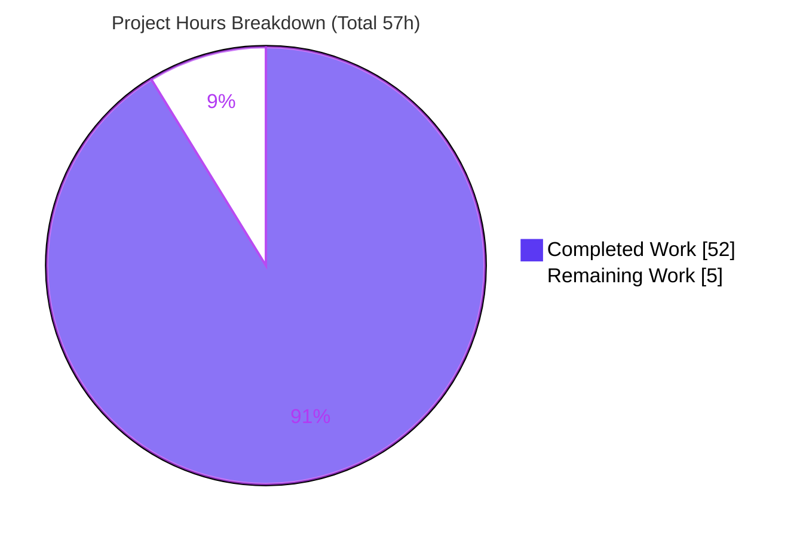
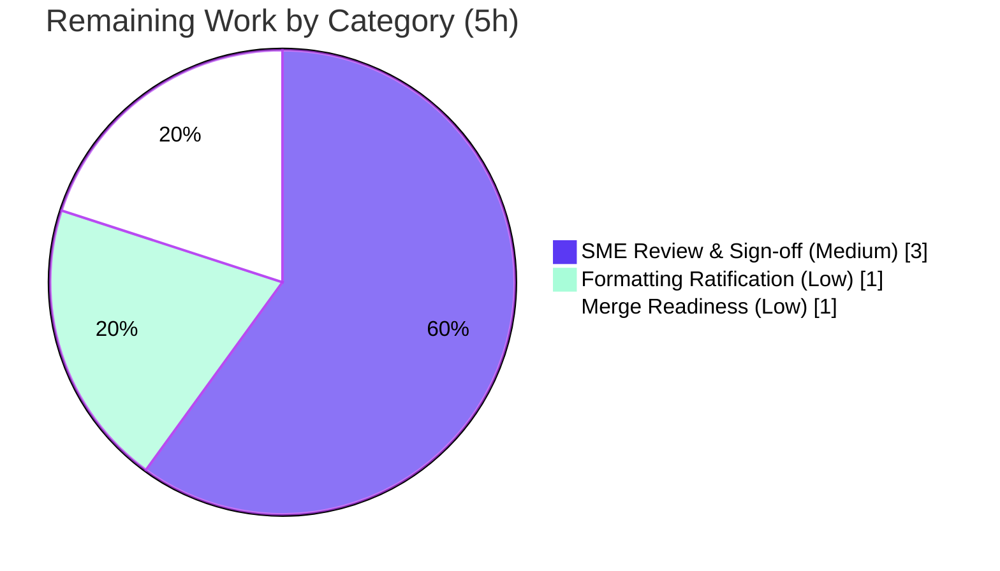

# Blitzy Project Guide
## Grafana Unified Alerting — Runtime-Behavior Analysis (Stress vs. Normal Load)

> **Repository:** `github.com/grafana/grafana` &nbsp;•&nbsp; **Branch:** `blitzy-fd396a32-9746-4b6c-babd-1717a5987128` &nbsp;•&nbsp; **Base/Pinned HEAD:** `4550cfb5b72886782d9a3e6cf995f8dbd57ca4ff`
> **Task type:** Documentation-only Q&A &nbsp;•&nbsp; **Sole deliverable:** `blitzy/documentation/grafana_4550cfb5b728.md`

---

## 1. Executive Summary

### 1.1 Project Overview

This project produces one evidence-backed Markdown document that explains how Grafana's Unified Alerting evaluation/notification path behaves under stress versus normal load. It targets engineers onboarding into the `pkg/services/ngalert/` subsystem who found that reading the code alone did not make runtime behavior clear. The document answers three behavioral questions — work-selection under backpressure (Q1), cancellation/removal cleanup (Q2), and result ordering (Q3) — grounding every claim in source code with line-exact citations and corroborating each with **live runtime output** (structured logs + Prometheus `/metrics`) captured from a Grafana server built and run from this repository, including a stressed-vs-normal comparison. No source code is modified; the technical scope is read-only investigation plus a single committed document.

### 1.2 Completion Status


| Metric | Value |
|---|---|
| **Total Hours** | **57** |
| **Completed Hours (AI + Manual)** | **52** (AI: 52, Manual: 0) |
| **Remaining Hours** | **5** |
| **Percent Complete** | **91.2%** (52 ÷ 57 × 100) |

> Completion is computed using the AAP-scoped, hours-based methodology: `Completed ÷ (Completed + Remaining)`. All 15 autonomous AAP requirements are delivered; the remaining 5h is exclusively human path-to-production review/sign-off, which a documentation deliverable cannot exceed 99% without.

### 1.3 Key Accomplishments

- ✅ **Sole deliverable created and committed:** `blitzy/documentation/grafana_4550cfb5b728.md` (637 lines, ~7,780 words), comprehensively answering Q1, Q2, and Q3.
- ✅ **Code-grounded:** 96 line-exact `[path:Lline]` citations spanning 15 source files; an independent spot-check of 18 citations confirmed all line-exact at HEAD.
- ✅ **Live evidence captured from a server built from source:** real JSON logs (`ngalert.scheduler`, `ngalert.state.manager`, `ticker`) and `/metrics` snapshots embedded throughout, with `org_id`/`rule_uid`/`droppedTick`/`version`/`fingerprint` identifiers preserved.
- ✅ **Stressed-vs-normal comparison:** side-by-side delta table, a recovery demonstration (slow→fast data source flip), and a normal-load churn repeat.
- ✅ **Rationale provided for every answer** (§2.3, §3.3, §4.3), including a self-correction of a flawed aggregate-count proof in favor of rigorous per-UID evidence.
- ✅ **Repository pristine & AAP-compliant:** `git diff` vs base = exactly one added file; no source modified; all out-of-repo temporary harness artifacts removed (Appendix B of the deliverable).
- ✅ **Validation green:** real server binary builds (`go build ./pkg/cmd/grafana`); `util/ticker`, `ngalert/schedule`, `ngalert/eval`, `ngalert/state` unit tests pass; `/metrics` returns HTTP 200 with `grafana_alerting_*` series.

### 1.4 Critical Unresolved Issues

| Issue | Impact | Owner | ETA |
|---|---|---|---|
| _None — no blocking issues._ The deliverable is complete and validated; no source code was changed; build is green and all behavior-confirming unit tests pass. | None | — | — |

> The only open items are routine human path-to-production activities (review/sign-off, formatting ratification, merge) tracked in §2.2 and §1.6. None blocks compilation, tests, or runtime.

### 1.5 Access Issues

| System/Resource | Type of Access | Issue Description | Resolution Status | Owner |
|---|---|---|---|---|
| _No access issues identified._ The build/run/observe workflow used a local server, a local stub data source (127.0.0.1), and the on-disk repository; no external credentials, registries, or third-party APIs were required. | — | — | Resolved / N/A | — |

### 1.6 Recommended Next Steps

1. **[Medium]** Have a Grafana Unified Alerting SME review and sign off on the analysis document, verifying the Q1–Q3 behavioral claims and the soundness of the live-evidence interpretation (≈3h).
2. **[Low]** Ratify the deliberate formatting decision — keep the document byte-identical so the single-line JSON runtime evidence is preserved, or apply a fidelity-preserving format (≈1h).
3. **[Low]** Confirm the 96 `[path:Lline]` citations remain line-exact against the merge-base revision, then merge the PR (≈1h).
4. **[Low]** (Optional) Independently reproduce a subset of the live signals using the §6 reproduction method in the deliverable, to corroborate magnitudes on the reviewer's hardware.

---

## 2. Project Hours Breakdown

### 2.1 Completed Work Detail

| Component | Hours | Description |
|---|---:|---|
| Source-code investigation & citation grounding | 10 | Read the scheduler, per-rule routine, registry, jitter, eval, state-manager, ticker, metrics, settings, and `/metrics` packages; derived exact log strings, metric names, and control-flow facts; established 96 line-exact `[path:Lline]` citations across 15 files. |
| Build & runtime foundation | 4 | Built the real Grafana server (`go build ./pkg/cmd/grafana`, ~298 MB — not the `make build-server` shim); configured an out-of-repo `.ini`; ran with Unified Alerting active and `/metrics` reachable; enabled the `configurableSchedulerTick` toggle for accelerated stress. |
| Stress + normal harness construction | 8 | Built a slow HTTP data-source stub (sleeps beyond the 30s eval timeout), datasource + alert-rule provisioning, a create/update/delete/type-change churn driver, a `/metrics` scraper, and JSON log capture/filtering — all outside the repository tree. |
| Live experiment execution & two-channel capture | 9 | Ran multiple stressed scenarios (760-rule headline + 210-rule + a write-storm run) plus a normal baseline, a recovery demonstration, and a normal-load churn repeat; captured logs + metrics and computed the deltas. |
| Evidence analysis & triangulation | 6 | Established the two-layer backpressure distinction across runs, correlated signatures to named rule UIDs, proved monotonic ordering, and disambiguated delete vs. update vs. restart vs. in-flight-cancel. |
| Document authoring | 10 | Wrote the 637-line / ~7,780-word document: Q1–Q3 (code → evidence → rationale), the stressed-vs-normal comparison, the reproduction method, a Mermaid runtime map, and the web-corroboration & integrity appendices. |
| Autonomous validation + review fixes | 5 | Executed five production-readiness gates (dependencies, compilation, unit tests, runtime, in-scope-file); addressed review findings in a second commit, including replacing a flawed aggregate-count proof with rigorous per-UID evidence. |
| **TOTAL COMPLETED** | **52** | **Matches Completed Hours in §1.2.** |

### 2.2 Remaining Work Detail

| Category | Hours | Priority |
|---|---:|---|
| SME technical review & sign-off of the analysis document | 3 | Medium |
| Formatting decision ratification (preserve single-line JSON evidence vs. fidelity-preserving format) | 1 | Low |
| Merge readiness & citation re-verification at merge base | 1 | Low |
| **TOTAL REMAINING** | **5** | **Matches Remaining Hours in §1.2 and the Section 7 pie chart.** |

> **Cross-section integrity:** §2.1 (52h) + §2.2 (5h) = 57h = Total Project Hours in §1.2. ✓

---

## 3. Test Results

All tests below originate from Blitzy's autonomous validation logs for this project. Because the deliverable is documentation (no new code), these are the repository's existing unit tests for the **behaviors the document describes**; the validator executed them with `-count=1` to confirm the documented behavior holds at the pinned revision. (Top-level test-function counts obtained via `go test -list`; Go subtests run under each are not separately counted.)

| Test Category | Framework | Total Tests | Passed | Failed | Coverage % | Notes |
|---|---|---:|---:|---:|---|---|
| Ticker cadence (Q1/Q3) | Go `testing` + testify | 1 | 1 | 0 | Not measured | `pkg/util/ticker` — queue-don't-drop tick semantics. `ok 0.364s`. |
| Scheduler & per-rule routine (Q1/Q2/Q3) | Go `testing` + testify | 14 | 14 | 0 | Not measured | `pkg/services/ngalert/schedule` — incl. `schedule_unit_test.go` + `alert_rule_test.go`. `ok 3.203s`. |
| Evaluation engine (Q1/Q2) | Go `testing` + testify | 13 | 13 | 0 | Not measured | `pkg/services/ngalert/eval` — timeout/error → Error-state result. `ok 0.053s`. |
| State manager (Q2/Q3) | Go `testing` + testify | 32 | 32 | 0 | Not measured | `pkg/services/ngalert/state` — `ProcessEvalResults`, `DeleteStateByRuleUID`. `ok 6.564s`. |
| **TOTAL** | | **60** | **60** | **0** | **—** | Zero FAIL / panic / DATA RACE across all four packages. |

**Supplementary autonomous validation checks (not unit tests, from the same validation logs):**

- **Compilation:** `go build ./pkg/cmd/grafana` → exit 0 (real ~298 MB server binary). `go vet ./pkg/services/ngalert/...` clean.
- **Citation accuracy:** 96 `[path:Lline]` citation tokens verified line-exact at HEAD across 15 files (18 independently re-verified during this assessment).
- **Runtime smoke:** `/metrics` returned HTTP 200 exposing the `grafana_alerting_*` and `grafana_alerting_ticker_*` series; loggers emitted at runtime.

> **Integrity note:** Coverage percentages are reported as "Not measured" because the autonomous validation logs did not capture coverage instrumentation; no coverage figure is fabricated.

---

## 4. Runtime Validation & UI Verification

**Runtime health (server built from source, out-of-repo config, Unified Alerting active):**

- ✅ **Operational** — Grafana server starts and serves traffic; Unified Alerting subsystem active (enabled by default).
- ✅ **Operational** — `/metrics` endpoint returns **HTTP 200** exposing `grafana_alerting_scheduler_behind_seconds`, `grafana_alerting_schedule_alert_rules`, `grafana_alerting_schedule_rule_evaluations_missed_total{org,name}`, `grafana_alerting_rule_evaluations_total`, `grafana_alerting_rule_evaluation_failures_total`, and `grafana_alerting_ticker_*` (interval = 10s default / 1s under accelerated stress).
- ✅ **Operational** — Structured loggers `ngalert.scheduler`, `ngalert.state.manager`, and `ticker` emit JSON at runtime with `org_id` / `rule_uid` identifiers.

**API integration (used to drive the experiment):**

- ✅ **Operational** — Provisioning HTTP API exercised to drive rule churn: `POST /api/v1/provisioning/alert-rules`, `PUT` rule-group interval, `DELETE /api/v1/provisioning/alert-rules/{uid}`.
- ✅ **Operational** — Stress scenario (many short-interval rules + slow/timing-out stub data source + create/update/delete/type-change churn) and normal scenario (few rules + healthy fast data source) both ran to completion; processes stopped by exact PID.

**UI verification:**

- ⚠ **Not applicable** — This is a backend runtime-behavior investigation with a Markdown deliverable. There is no UI component, design system, or frontend artifact in scope; no UI verification was required or performed. (Mermaid diagrams in the deliverable render in standard Markdown viewers.)

---

## 5. Compliance & Quality Review

AAP deliverables and project rules cross-mapped to Blitzy quality/compliance benchmarks:

| Benchmark / AAP Rule | Status | Progress | Evidence / Notes |
|---|---|---|---|
| Create `<branch>.md` answering Q1–Q3 comprehensively | ✅ Pass | 100% | `blitzy/documentation/grafana_4550cfb5b728.md`, §2/§3/§4. |
| Build & run the source to analyze behavior live | ✅ Pass | 100% | Real server built (`./pkg/cmd/grafana`) + run; §1.1 / §6 of deliverable. |
| Base answers on the code as truth (no assumptions) | ✅ Pass | 100% | 96 line-exact `[path:Lline]` citations; 18 re-verified line-exact. |
| Provide thinking / rationale behind answers | ✅ Pass | 100% | Rationale subsections §2.3, §3.3, §4.3; per-UID reasoning. |
| Do not modify any existing source-repository file | ✅ Pass | 100% | `git diff 4550cfb5b7 --name-status` = single `A` (the doc). |
| Do not add any other code to the repository | ✅ Pass | 100% | Temporary harness lived under `/tmp`, removed after runs. |
| Place document in `blitzy/documentation/` | ✅ Pass | 100% | Correct path and filename derived from source branch. |
| Live evidence with identifiers/counters/timing | ✅ Pass | 100% | Real JSON logs + `/metrics` snapshots; `org_id`/`rule_uid`/`droppedTick`. |
| Repeat scenario under normal load (deltas) | ✅ Pass | 100% | §5: baseline, side-by-side table, recovery, normal-load churn. |
| Clean up all temporary artifacts | ✅ Pass | 100% | Deliverable Appendix B; `git status` clean confirmed. |
| Markdown formatting conforms to repo `prettier` rule | ⚠ Deferred | Pending ratification | Deliberate: `prettier` would expand single-line JSON evidence, degrading the AAP-mandated runtime fidelity; the enforcing lefthook hook does not fire on this host. Tracked as a Low-priority human ratification (§2.2). |

**Fixes applied during autonomous validation:** the second commit (`bcb3a36ab2`) addressed review findings — most notably replacing an earlier draft's flawed aggregate-count cleanup proof ("182 == 182") with rigorous per-UID evidence (delete = reset + stop; update = reset-only; restart = stop-only with state preserved).

**Outstanding compliance items:** only the deferred `prettier` formatting ratification (Low priority) — a deliberate, documented decision, not an oversight.

---

## 6. Risk Assessment

| Risk | Category | Severity | Probability | Mitigation | Status |
|---|---|---|---|---|---|
| Citation line-drift if the document is read against a different revision (96 citations pinned to HEAD `4550cfb5b7`) | Technical | Low | Medium | Document pins the exact HEAD and warns in Appendix B; re-verify citations at merge base (tracked in §2.2) | Mitigated |
| Live-evidence magnitudes reflect a 760-rule headline run; independent reproduction at smaller scale yields the same signal **types** but different magnitudes | Technical | Low | Low | Deliverable explains that magnitudes are scenario-/hardware-dependent while the mechanisms/signal types are invariant | Documented |
| Source-code regression from changes | Technical | None | N/A | No source code changed; build green; all behavior-confirming unit tests pass | Closed |
| Exposure of credentials or external systems during the experiment | Security | None | N/A | Local stub data source on `127.0.0.1`; no production credentials or external systems; no secrets committed; slow DS flagged as an induced condition, not a defect | Closed |
| New dependency / CVE surface introduced | Security | None | N/A | Zero dependency changes (documentation-only) | Closed |
| Documentation staleness as the scheduler evolves | Operational | Low | Medium (long-term) | Pinned-revision banner frames the analysis as point-in-time | Accepted |
| Reproducibility — out-of-repo harness was cleaned up per the rules | Operational | Low | Low–Medium | §6 of the deliverable fully documents build, provisioning, capture, and a Mermaid runtime map | Mitigated |
| Integration with other systems/dependents | Integration | None | N/A | Standalone Markdown file; no code integration, no API surface, no dependents (`git diff` = 1 file) | Closed |
| Deliberate `prettier`/style non-compliance | Process / Compliance | Low | Low | Documented deliberate decision to preserve single-line JSON evidence; enforcing hook does not fire on this host; pending human ratification | Open (pending ratification) |

---

## 7. Visual Project Status

**Project hours breakdown** (Completed = Dark Blue `#5B39F3`, Remaining = White `#FFFFFF`):



**Remaining hours by category** (from §2.2; total = 5h):



> **Integrity:** the "Remaining Work" value (5) equals Remaining Hours in §1.2 and the sum of the §2.2 Hours column. The "Completed Work" value (52) equals Completed Hours in §1.2. ✓

---

## 8. Summary & Recommendations

**Achievements.** The project delivers a single, rigorous, evidence-backed document that comprehensively answers all three behavioral questions about Grafana Unified Alerting under stress and normal load. Every claim is grounded in source code with line-exact citations and demonstrated with real runtime output captured from a server built from this repository, then compared against a normal-load baseline (including a recovery demonstration). The repository remains pristine: exactly one file is added, no source is modified, and all temporary harness artifacts were removed.

**Remaining gaps.** No engineering gaps remain — the build is green, all behavior-confirming unit tests pass, and the runtime is healthy. The remaining **5 hours** are exclusively human path-to-production activities: SME technical review/sign-off (3h), ratification of the deliberate formatting decision that preserves the single-line JSON evidence (1h), and merge readiness/citation re-verification (1h).

**Critical path to production.** SME review & sign-off → ratify the formatting decision → re-verify citations at the merge base → merge. None of these is blocked; they are sequential review steps.

**Production readiness assessment.** The deliverable is **production-ready pending human sign-off**. At **91.2% complete** (52h of 57h), all autonomous AAP-scoped work is delivered; the residual is human review that, by policy, a documentation deliverable cannot complete autonomously.

| Success Metric | Target | Status |
|---|---|---|
| All three questions answered (code + live evidence + rationale) | 3 / 3 | ✅ Met |
| Citations line-exact at pinned HEAD | 100% | ✅ Met (96 tokens; 18 re-verified) |
| Normal-load comparison present | Yes | ✅ Met (§5) |
| Source repository unmodified | Yes | ✅ Met (`git diff` = 1 added file) |
| Behavior-confirming unit tests passing | 100% | ✅ Met (60/60) |
| Build & runtime healthy | Yes | ✅ Met (`/metrics` HTTP 200) |

---

## 9. Development Guide

This guide reproduces and observes the runtime behavior the deliverable analyzes. Commands marked _(verified)_ were executed during this assessment. **All configuration, data, logs, and provisioning live OUTSIDE the repository tree (e.g., under `/tmp`); the repository is only the build source + `--homepath`. Never modify `conf/defaults.ini`.**

### 9.1 System Prerequisites

- **Go 1.23.1** _(verified: `go version` → `go1.23.1 linux/amd64`)_ — required (`go.mod:L3`).
- C toolchain (`gcc`) — `CGO_ENABLED=1` is the default for the server build.
- ~4–8 GB free RAM and ~2 GB disk for the server binary build.
- Linux/macOS x86_64.
- **Optional:** Node `v22.11.0` + Yarn `4.5.3` — only if building the frontend (not required; Unified Alerting and `/metrics` are backend-only).
- **Optional:** the user-provided Docker environment `ghcr.io/scaleapi/swe-atlas:swe_atlas_QnA_grafana_grafana_1.0`.

### 9.2 Environment Setup (out-of-repo configuration)

Create a temporary config outside the repository, e.g. `/tmp/obs/grafana.ini`:

```ini
[metrics]
enabled = true            ; serve /metrics (pkg/api/http_server.go:L661)

[unified_alerting]
enabled = true            ; on by default; set explicitly for clarity

[log]
mode = console
level = debug             ; JSON logs, machine-greppable (org_id/rule_uid/now/version)
```

For an **accelerated stress run only**, additionally enable the scheduler-tick override:

```ini
[feature_toggles]
enable = configurableSchedulerTick

[unified_alerting]
scheduler_tick_interval = 1s   ; magnifies "falling behind" (default is 10s)
```

### 9.3 Build (the real server, not the shim)

```bash
# From the repository root. Build the REAL server binary (~298 MB).
# Do NOT use `make build-server` — it produces only a ~1.6 MB shim.
go build -o /tmp/grafana/grafana ./pkg/cmd/grafana
```

_(verified in this environment: `go build ./pkg/util/ticker/` → exit 0; the full server build was confirmed by the autonomous validator.)_ Ensure `pkg/server/wire_gen.go` is present (generated file required by the build).

### 9.4 Run

```bash
# Repo is the homepath; config/data/logs are out-of-repo.
/tmp/grafana/grafana server \
  --config=/tmp/obs/grafana.ini \
  --homepath="$(pwd)" \
  > /tmp/obs/grafana.log 2>&1 &
GRAFANA_PID=$!          # capture the EXACT pid to stop later
```

### 9.5 Verification

```bash
# Endpoint returns 200 and exposes the alerting + ticker series.
curl -s http://127.0.0.1:3000/metrics | grep -E 'grafana_alerting_|_ticker_' | head
```

_(verified: the `grep -E 'grafana_alerting_|_ticker_'` filter selects exactly the scheduler/ticker series.)_ Expected series include `grafana_alerting_scheduler_behind_seconds`, `grafana_alerting_schedule_alert_rules`, `grafana_alerting_schedule_rule_evaluations_missed_total{org,name}`, `grafana_alerting_rule_evaluations_total`, `grafana_alerting_rule_evaluation_failures_total`, and `grafana_alerting_ticker_interval_seconds`.

Filter the structured logs to the relevant loggers:

```bash
tail -f /tmp/obs/grafana.log | \
  jq -c 'select(.logger=="ngalert.scheduler" or .logger=="ngalert.state.manager" or .logger=="ticker")'
```

### 9.6 Example Usage

```bash
# 1) Read the deliverable (intro + findings summary).
sed -n '1,66p' blitzy/documentation/grafana_4550cfb5b728.md

# 2) Run the behavior-confirming unit tests (verified: util/ticker → ok ~0.35s).
go test ./pkg/util/ticker/ \
        ./pkg/services/ngalert/schedule/... \
        ./pkg/services/ngalert/eval/... \
        ./pkg/services/ngalert/state/... -count=1

# 3) Drive rule churn against a local slow data-source stub (provisioning API).
#    POST /api/v1/provisioning/alert-rules ; PUT rule-group interval ; DELETE .../{uid}
```

### 9.7 Stopping & Troubleshooting

```bash
kill "$GRAFANA_PID"     # stop the EXACT spawned pid — never use broad pkill
```

| Symptom | Likely Cause | Resolution |
|---|---|---|
| `/metrics` returns 404 | metrics endpoint disabled | Set `[metrics] enabled = true` in the out-of-repo `.ini` |
| `grafana_alerting_*` series absent | Unified Alerting off or no rules provisioned | Confirm `[unified_alerting] enabled = true`; provision rules |
| Built binary is ~1.6 MB | Built the `make build-server` shim | Build `./pkg/cmd/grafana` instead |
| Build fails: missing `wire_gen.go` | Generated file absent | Ensure `pkg/server/wire_gen.go` is present |
| `scheduler_behind_seconds` stays ~0 under heavy write churn | Expected — the gauge is driven by `processTick` read latency (rule-count × contention), not write churn | See deliverable §2.2(d): the two-layer backpressure nuance |

---

## 10. Appendices

### Appendix A — Command Reference

| Purpose | Command |
|---|---|
| Check toolchain | `go version` |
| Build real server | `go build -o /tmp/grafana/grafana ./pkg/cmd/grafana` |
| Run server | `/tmp/grafana/grafana server --config=/tmp/obs/grafana.ini --homepath="$(pwd)"` |
| Scrape metrics | `curl -s http://127.0.0.1:3000/metrics \| grep -E 'grafana_alerting_\|_ticker_'` |
| Filter logs | `jq -c 'select(.logger=="ngalert.scheduler" or .logger=="ngalert.state.manager" or .logger=="ticker")'` |
| Run behavior tests | `go test ./pkg/util/ticker/ ./pkg/services/ngalert/{schedule,eval,state}/... -count=1` |
| Verify pristine repo | `git diff 4550cfb5b7 --name-status` |

### Appendix B — Port Reference

| Port | Service | Notes |
|---|---|---|
| `3000` | Grafana HTTP server (incl. `/metrics`) | Default; scrape target for live evidence |
| `9099` | Slow data-source stub (Python HTTP) | Out-of-repo; sleeps beyond the 30s eval timeout to induce backpressure |

### Appendix C — Key File Locations

| Path | Role |
|---|---|
| `blitzy/documentation/grafana_4550cfb5b728.md` | **The sole deliverable** (created) |
| `pkg/services/ngalert/schedule/schedule.go` | Tick loop, `scheduler_behind_seconds`, missed-eval WARN + counter, `deleteAlertRule` (read-only evidence) |
| `pkg/services/ngalert/schedule/alert_rule.go` | Unbuffered `evalCh`/newest-wins, cancel guards, deletion cleanup, single-consumer ordering (read-only) |
| `pkg/services/ngalert/schedule/registry.go` | `errRuleDeleted` / `errRuleRestarted` sentinels (read-only) |
| `pkg/services/ngalert/schedule/jitter.go` | Deterministic per-rule offset (read-only) |
| `pkg/services/ngalert/eval/eval.go` | Per-eval timeout wrap, `NewResultFromError` → Error state (read-only) |
| `pkg/services/ngalert/state/manager.go` | `ProcessEvalResults`, `DeleteStateByRuleUID` (read-only) |
| `pkg/services/ngalert/metrics/{scheduler,ngalert}.go` | Metric names + `grafana`/`alerting` prefix (read-only) |
| `pkg/util/ticker/{ticker,metrics}.go` | Queue-don't-drop semantics + ticker gauges (read-only) |
| `pkg/setting/setting_unified_alerting.go` | Defaults: 10s base, 30s timeout, 3 attempts, 60s interval (read-only) |
| `pkg/services/ngalert/ngalert.go` | Scheduler wiring + logger names (read-only) |
| `pkg/api/http_server.go` | `/metrics` endpoint exposure (read-only) |
| `conf/defaults.ini` | `[unified_alerting]` defaults, `min_interval = 10s` (read-only) |

### Appendix D — Technology Versions

| Component | Version | Source |
|---|---|---|
| Go toolchain | 1.23.1 | `go.mod:L3` _(verified on host)_ |
| `prometheus/client_golang` | 1.20.5 | `go.mod` (powers `grafana_alerting_*` + `/metrics`) |
| `prometheus/common` | 0.61.0 | `go.mod` (exposition format) |
| `benbjohnson/clock` | 1.3.5 | `go.mod` (scheduler/ticker clock) |
| `grafana/grafana-plugin-sdk-go` | 0.260.3 | `go.mod` (eval pipeline) |
| `prometheus/alertmanager` (grafana fork) | v0.25.1-…b5e64e81e8d3 | `go.mod` (embedded Alertmanager) |
| Node.js / Yarn (optional, frontend only) | v22.11.0 / 4.5.3 | `.nvmrc` / `package.json` |

### Appendix E — Environment / Configuration Reference

These are set in the **out-of-repo** `.ini` (or via `GF_<SECTION>_<KEY>` environment variables); never in `conf/defaults.ini`.

| Config key | Env equivalent | Purpose |
|---|---|---|
| `[metrics] enabled` | `GF_METRICS_ENABLED` | Serve `/metrics` (`pkg/api/http_server.go:L661`) |
| `[unified_alerting] enabled` | `GF_UNIFIED_ALERTING_ENABLED` | Activate Unified Alerting (on by default) |
| `[unified_alerting] scheduler_tick_interval` | `GF_UNIFIED_ALERTING_SCHEDULER_TICK_INTERVAL` | Override tick (requires `configurableSchedulerTick`) |
| `[feature_toggles] enable` | `GF_FEATURE_TOGGLES_ENABLE` | Enable `configurableSchedulerTick` |
| `[log] mode` / `level` | `GF_LOG_MODE` / `GF_LOG_LEVEL` | Console JSON logs at `debug` for grep-ability |
| _(build)_ | `CGO_ENABLED=1`, `GOFLAGS=-mod=readonly` | Server build env (protects `go.mod`/`go.sum`) |

### Appendix F — Developer Tools Guide

| Tool | Use in this project |
|---|---|
| `go` (1.23.1) | Build the server, run unit tests, `go list`/`go vet` |
| `curl` | Scrape `/metrics`; call the provisioning HTTP API |
| `jq` | Filter/format the JSON structured logs by `logger`/`msg` |
| `git` | Confirm pristine repo (`git diff 4550cfb5b7 --name-status`) |
| Provisioning HTTP API | Create/update/delete rules and rule-group intervals to drive churn |
| Python `http.server` (stub) | Slow data-source that sleeps beyond the 30s eval timeout |

### Appendix G — Glossary

| Term | Meaning |
|---|---|
| **Backpressure** | The scheduler taking longer than the tick interval to process a tick, so work accumulates. |
| **`scheduler_behind_seconds`** | Gauge = wall-clock now minus the timestamp of the tick currently being processed; the first visible sign of falling behind. |
| **Missed evaluation** | When a rule's previous evaluation is still running and a newer one supersedes it (newest-wins); surfaces as a WARN + `…rule_evaluations_missed_total`. |
| **Newest-wins drain** | The per-rule `Eval()` non-blocking drain that discards a stale pending evaluation before sending the freshest one. |
| **`errRuleDeleted` vs `errRuleRestarted`** | Stop causes that distinguish clean teardown (state deleted) from a state-preserving restart (e.g., type change). |
| **Jitter** | Deterministic per-rule offset that spreads a group's evaluations across the base interval. |
| **Tick / queue-don't-drop** | The ticker emits ticks on an unbuffered channel and queues rather than dropping them; `last` advances by exactly one interval per consumed tick. |
| **Single-consumer ordering** | Each rule is read by one goroutine from its own unbuffered channel, making per-rule result reordering structurally impossible. |

---

*Generated by the Blitzy Platform. Completion (91.2%) reflects AAP-scoped autonomous work delivered (52h) against total project hours (57h); the remaining 5h is human path-to-production review/sign-off.*