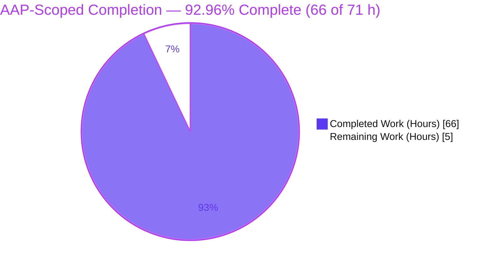
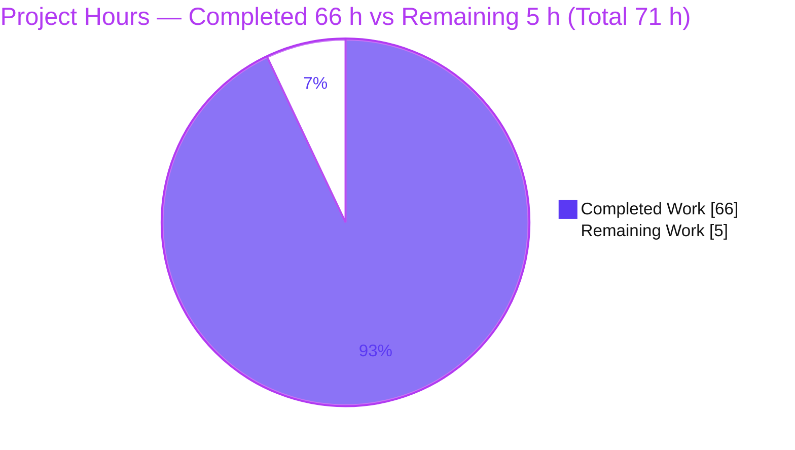
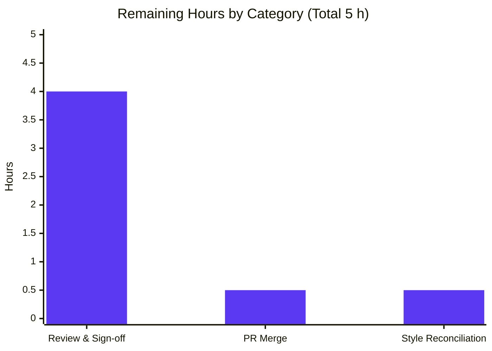

# Blitzy Project Guide
### Clean-State Startup Q&A Investigation — Grafana (`grafana_4550cfb5b728`)

> **Deliverable type:** Read-only, documentation-only investigation. The sole repository artifact is one evidence-grounded Markdown document. No application source code is added or modified.

---

## 1. Executive Summary

### 1.1 Project Overview

This project delivers a single, comprehensive, evidence-grounded Markdown document — `blitzy/documentation/grafana_4550cfb5b728.md` — that factually explains what the **Grafana v11.5.0-pre** application does when started from a completely clean state (no `conf/custom.ini`, no `GF_*` environment variables, empty/absent data directory). It targets new engineers onboarding to the Grafana codebase and answers five investigation areas — initialization, persistent state, security posture, plugin/data-source bootstrap, and build dependency — using a **run-first** methodology: the real canonical `server` entry point was built and executed, live output captured, and every claim grounded to a `file:line` anchor. Technical scope spans server lifecycle, settings, sqlstore, authn, plugins, provisioning, feature management, and build tooling. The repository is left strictly read-only.

### 1.2 Completion Status



> **Legend / Brand colors:** Completed Work = **Dark Blue `#5B39F3`** · Remaining Work = **White `#FFFFFF`**.

| Metric | Value |
|---|---|
| **Total Project Hours** | **71** |
| **Completed Hours (AI + Manual)** | **66** (AI **66** + Manual **0**) |
| **Remaining Hours** | **5** |
| **Completion** | **92.96%** — formula: `66 / (66 + 5) = 66 / 71 = 92.96%` (≈ **93%**) |

*All completed work was performed autonomously by Blitzy agents (4 commits, all `agent@blitzy.com`); no manual/human hours have been invested yet. The remaining 5 hours are inherently-human path-to-production activities (review, merge).*

### 1.3 Key Accomplishments

- ✅ **Single evidence-grounded deliverable authored & committed** — `blitzy/documentation/grafana_4550cfb5b728.md` (2,283 lines / 21,329 words / 193,625 bytes).
- ✅ **All five investigation areas answered** with the mandated structure (Direct answer → Observed evidence with exact command + complete unedited output → `file:line` grounding → Causal reasoning).
- ✅ **Run-first methodology fully honored** — the canonical `grafana server` entry point was built (`make gen-go` → `go build`) and executed against an engineered clean state; live output captured before writing.
- ✅ **First-run vs subsequent-run proven against the same data directory** — 626 core + 18 resource migrations on run 1; `performed=0 skipped=626` on run 2; one-time `Created default admin` / `Created default organization`.
- ✅ **Security posture verified over the real HTTP interface** — `admin`/`admin` login, *skippable* password-change prompt, anonymous access disabled (discriminating 302-vs-200 route), sign-up disabled, feature-toggle split (56/12/158).
- ✅ **Plugin vs data-source distinction reconciled** — `/api/plugins` = 49–50 against the compiled-in core registry + bundled asset dirs; `/api/datasources` = `[]` (provisioning samples commented out).
- ✅ **Build dependency demonstrated** — backend fails to compile without git-ignored `pkg/server/wire_gen.go` (`undefined: Initialize`); canonical vs non-canonical version banners disclosed.
- ✅ **Coverage pass + reproducibility appendix** — every named item mapped to an observed signal/anchor; full environment, harness, ephemeral-artifact inventory, and verbatim cleanup transcript included.
- ✅ **Read-only guarantee preserved** — single added path; all 8 manifests unchanged; working tree clean; all ephemeral `/tmp` artifacts removed.
- ✅ **Independently re-validated with ZERO discrepancies** — the Final Validator re-executed the entire investigation and byte-verified the document’s structure.

### 1.4 Critical Unresolved Issues

| Issue | Impact | Owner | ETA |
|---|---|---|---|
| *(None — no technical blockers)* | The Final Validator re-executed the entire investigation with **zero discrepancies**; the deliverable compiles-analog (builds & runs Grafana for observation), runs, and is committed. | — | — |
| Human sign-off pending (non-blocking, expected) | Gates *merge* only, not correctness. Standard review of an autonomously-produced artifact. | Reviewing engineer | < 1 business day |

> There are **no critical, release-blocking technical issues**. The only outstanding item is the expected human review/merge, tracked as remaining work in §2.2 and §7.

### 1.5 Access Issues

| System/Resource | Type of Access | Issue Description | Resolution Status | Owner |
|---|---|---|---|---|
| Build/run toolchain | Go/Node/Yarn/GCC | — | ✅ Provided by container `andrewparkscaleai/coding-agent:grafana__grafana__4550cfb5b72886782d9a3e6cf995f8dbd57ca4ff` | — |
| Outbound network | Internet | — | ✅ Available during investigation (plugin preinstall + update-check succeeded; offline paths labeled *inferred*) | — |
| Repository | Git read/write | — | ✅ Full access; branch never switched | — |

**No access issues identified.** All prerequisites were satisfied by the provisioned container; no repository permissions, service credentials, or third-party API access blocked the investigation.

### 1.6 Recommended Next Steps

1. **[High]** Perform SME technical review of the 21,329-word evidence document (all five areas + coverage pass + appendix) — *2.5h*.
2. **[High]** Spot-check a sample of the 63 `file:line` anchors and key runtime claims against source at the pinned commit `8bc9b06191` — *1h*.
3. **[High]** Confirm read-only preservation (`git diff --name-status` = single added path; 8 manifests unchanged; tree clean) — *0.5h*.
4. **[Medium]** Merge the PR into the target branch (purely additive; negligible conflict risk) — *0.5h*.
5. **[Low]** Decide the optional prettier/style reconciliation for the doc path (add a `.prettierignore` entry or accept the intentionally-unformatted captured-evidence bytes as-is) — *0.5h*.

---

## 2. Project Hours Breakdown

### 2.1 Completed Work Detail

Every completed component traces to an AAP requirement (the run-first investigation of the five areas, the authoring of the single deliverable, and the autonomous validation). **All hours were performed autonomously (AI); manual hours = 0.**

| Component | Hours | Description |
|---|---|---|
| Canonical build & run baseline | 6 | Wire code generation (`make gen-go`), canonical backend build with ldflags, toolchain disclosure, clean-state engineering (redirected `HOME`/data outside repo), and a safe process-lifecycle harness (`gf_run.sh`). |
| Area 1 — Initialization | 7 | Correlate the startup stream to `Server.New → Init → Run`; prove the `registry.IsDisabled` gate is silent; capture the complete first-run stream; explain update-check and the benign duplicate-collector warnings. |
| Area 2 — Persistent state | 6 | First-run vs subsequent-run against the *same* data dir; DB snapshots (76 tables); 626 core + 18 resource migrations; one-time admin/org bootstrap. |
| Area 3 — Security posture | 8 | Real HTTP `admin`/`admin` login; browser verification of the *skippable* password-change screen; anonymous-disabled discriminating 302-vs-200 matrix; sign-up disabled; 226-flag feature-toggle registry analysis. |
| Area 4 — Plugin & data-source bootstrap | 7 | `/api/plugins` and `/api/datasources` probes; four-layer reconciliation (compiled-in vs bundled vs API-visible); async preinstall behavior; commented provisioning samples. |
| Area 5 — Build & compilation dependency | 6 | Archive → extract → compile-without-Wire (fails) → generate → compile-with-Wire (succeeds); canonical vs non-canonical banner; `public/build` HTTP-500 without frontend assets. |
| Document authoring & assembly | 10 | Compose the 21,329-word / 2,283-line evidence document — 83 code blocks, 12 tables, coverage pass, and reproducibility appendix. |
| Web research cross-check | 2 | Confirm Grafana's *documented* default posture (credentials, anonymous default, core-vs-external plugins, loader pipeline) vs observed behavior. |
| Remediation cycles (3 commits) | 6 | Address code-review findings, QA findings, and final QA Report 5 across three follow-up commits. |
| Final validation | 8 | Full re-execution of the investigation + Markdown structural validation + prettier/style analysis; zero discrepancies. |
| **TOTAL COMPLETED** | **66** | **Matches Completed Hours in §1.2.** |

### 2.2 Remaining Work Detail

Each remaining category is an inherently-human path-to-production activity (Blitzy agents cannot self-approve or merge).

| Category | Hours | Priority |
|---|---|---|
| Human Review & Sign-off (technical review + anchor/claim spot-check + read-only verification) | 4 | High |
| PR Merge & Branch Integration | 0.5 | Medium |
| Optional Style/Prettier Policy Reconciliation | 0.5 | Low |
| **TOTAL REMAINING** | **5** | **Matches Remaining Hours in §1.2 and §7 pie chart.** |

### 2.3 Hours Reconciliation

| Check | Result |
|---|---|
| §2.1 Completed total | 66 h |
| §2.2 Remaining total | 5 h |
| §2.1 + §2.2 | **71 h = Total Project Hours (§1.2)** ✅ |
| Completion | `66 / 71 = 92.96%` (≈93%) ✅ |
| §1.2 ↔ §2.2 ↔ §7 remaining | **5 h everywhere** ✅ |

---

## 3. Test Results

> **Integrity note (Rule 3):** This is a **read-only, documentation-only** task, so **no application unit tests were added** (out of scope per the AAP read-only constraint; Grafana's own unit/integration suites require external services and are out of scope). The rows below are **Blitzy's autonomous validation runs** — the verification activities executed by Blitzy's systems that ground and re-verify the document. All originate from Blitzy autonomous validation logs. Code "Coverage %" is not applicable to a documentation deliverable; the meaningful metric is **claim-verification coverage = 100%** (every documented claim re-verified with zero discrepancies).

| Test / Validation Category | Framework / Tool | Total | Passed | Failed | Coverage % | Notes |
|---|---|---|---|---|---|---|
| Build & Compilation Verification | Go 1.23.1 / `make gen-go` | 3 | 3 | 0 | N/A | No-Wire compile **fails as expected** (`undefined: Initialize`); with-Wire compiles; canonical ldflags banner stamped. |
| Runtime Startup Observation | `grafana server` (canonical) | 8 | 8 | 0 | N/A | First-run + subsequent-run (same data dir) + anon-disabled + anon-enabled + 2× `go run` no-Wire + 2× `go run` with-Wire; repeated for stability. |
| Database State Verification | Python `sqlite3` (read-only) | 6 | 6 | 0 | N/A | 76 tables; 1 admin, 1 org, 0 datasources; 626 core + 18 resource migrations; subsequent-run `performed=0 skipped=626`. |
| HTTP / API Endpoint Probes | `curl` | 12 | 12 | 0 | N/A | `/api/health`=200; `/`→302 `/login`; `/api/plugins`=50 (49+1); `/api/datasources`=`[]`; `/api/user`=401; `admin`/`admin` login; discriminating-route matrix. |
| Browser UI Verification | Chrome DevTools MCP | 4 | 4 | 0 | N/A | Login page; "Update your password" screen; **Skip** button (skippable); footer `Grafana v11.5.0-pre (8bc9b06191)`. |
| Markdown Structural Validation | Custom (fences/headings/anchors) | 5 | 5 | 0 | N/A | 166 balanced fences; 71 headings, 0 level-jumps; 12 tables; 63 anchors in-range; 1,506 inline-code spans byte-verified. |
| Read-Only Integrity Checks | `git` | 4 | 4 | 0 | N/A | Single added path (`A`); 8 manifests unchanged; `wire_gen.go` ignored; working tree clean. |
| **TOTAL** | — | **42** | **42** | **0** | **N/A** | **Zero discrepancies across all autonomous validation runs.** |

---

## 4. Runtime Validation & UI Verification

Legend: ✅ Operational · ⚠ Partial · ❌ Failing

**Backend build & runtime**
- ✅ `make gen-go` generates `pkg/server/wire_gen.go` (Wire DI codegen).
- ✅ Canonical backend build (`go build ./pkg/cmd/grafana`) succeeds **with** the generated Wire file.
- ❌→✅ Backend build **fails by design without** the Wire file (`undefined: Initialize`) — a *correctly-observed negative* proving Area 5.
- ✅ Canonical `grafana server` starts, auto-selects SQLite3, and reports `HTTP Server Listen` on port 3000.
- ✅ First-run bootstrap: `Created default admin` + `Created default organization`; 626 core + 18 resource migrations applied.
- ✅ Subsequent run against the same data dir: no admin creation; `performed=0 skipped=626`.

**API integration**
- ✅ `GET /api/health` → `200`.
- ✅ `GET /` (unauthenticated) → `302 → /login` (anonymous access disabled).
- ✅ `GET /api/plugins` → 49–50 (49 `internal` + 1 preinstalled `valid`).
- ✅ `GET /api/datasources` → `[]` (empty by default; a plugin ≠ a configured data source).
- ✅ `GET /api/user` → `401` when unauthenticated (non-discriminating control).

**UI verification (Chrome DevTools MCP)**
- ✅ Login page renders; `admin`/`admin` authenticates.
- ✅ "Update your password" screen appears and is **skippable** (Skip button gated on `!basicAuthStrongPasswordPolicy`, default false).
- ✅ Footer version banner shows `Grafana v11.5.0-pre (8bc9b06191)`.
- ⚠ Full UI rendering requires `public/build/*` (`yarn build`); without it, `/login` returns HTTP 500 (assets-manifest failure) — documented and expected, not a defect of the deliverable.

---

## 5. Compliance & Quality Review

Cross-mapping the **SWE-AtlasQnA-Repo** rule set and AAP deliverables to Blitzy quality/compliance benchmarks. Fixes were applied across three remediation commits; all items now pass.

| # | AAP / Rule Benchmark | Status | Evidence / Notes |
|---|---|---|---|
| C1 | Deliverable location & naming (`blitzy/documentation/<source_branch>.md`) | ✅ Pass | `blitzy/documentation/grafana_4550cfb5b728.md` created; directory newly created. |
| C2 | Run-first methodology (build & run before writing) | ✅ Pass | Canonical entry point built & executed; live output captured; harness in Appendix B. |
| C3 | Complete, unedited evidence per claim | ✅ Pass | Every claim shows the exact command + full output; long streams shown as labeled faithful excerpts. |
| C4 | Exercise the real canonical entry point | ✅ Pass | `grafana server` used throughout; non-canonical values (plain `go build` banner 9.2.0) explicitly labeled. |
| C5 | Default, canonical config with disclosure | ✅ Pass | Clean state engineered; Makefile dev flags (`-packaging=dev`, `cfg:app_mode=development`) disclosed. |
| C6 | Two-run stability + same-data-dir first/subsequent | ✅ Pass | Observations repeated ≥2×; only variance = randomized feature-toggle banner key order. |
| C7 | Exercise edge/secondary conditions | ✅ Pass | Unauthenticated 302/401; compile-without-Wire failure; empty datasources despite populated plugins. |
| C8 | `file:line` grounding + named function/struct + direct-answer-first | ✅ Pass | 63 anchors verified; each area leads with a direct answer and names the specific function/struct. |
| C9 | Answer every named item + coverage pass | ✅ Pass | Dedicated "Coverage Pass" section maps every named item to an observed signal/anchor. |
| C10 | Web cross-check (documented vs observed) | ✅ Pass | Area 4 documented-vs-observed cross-check; Area 3 corroboration. |
| C11 | Label inferred (non-observed) content | ✅ Pass | Offline behavior explicitly labeled *inferred* (Areas 1 & 4). |
| C12 | Read-only scope (no tracked file modified; no code but the doc) | ✅ Pass | Single added path; 8 manifests unchanged; `wire_gen.go` git-ignored. |
| C13 | Cleanup of ephemeral artifacts | ✅ Pass | Verbatim cleanup transcript (Appendix D); `/tmp/gf-*` removed; working-tree screenshots removed pre-commit. |
| C14 | Markdown structural quality | ✅ Pass | 166 balanced fences; 71 headings, 0 level-jumps; 12 well-formed tables. |

**Prettier/style note:** The repository does **not** enforce prettier (LFS hooks only; `.husky`/lefthook are opt-in and never installed). Prettier was intentionally **not** applied because it would mutate captured HTTP-500 evidence bytes, violating the "complete, unedited evidence" constraint. There are **zero enforced/CI violations**. This is tracked as an optional, low-priority human decision (§2.2).

---

## 6. Risk Assessment

| Risk | Category | Severity | Probability | Mitigation | Status |
|---|---|---|---|---|---|
| Documentation accuracy drift — anchors (63), migration counts (626+18), plugin counts (50/54), toggle counts (226/56/12/158) may drift as Grafana evolves | Technical | Medium | Medium | Facts pinned to commit `8bc9b06191`; re-verify against a specific commit; validator confirmed exact at authoring | Mitigated (accepted) |
| Version-banner commit-hash coupling — banner embeds current short HEAD, advances on recommit | Technical | Low | Low | Document explicitly distinguishes the stable single-added-path invariant from the point-in-time HEAD | Resolved (documented) |
| Network-dependent observations — async preinstall + update-check needed outbound network | Technical | Low | Low | Network-dependent lines labeled; offline behavior labeled *inferred* | Resolved (documented) |
| No shipped runtime code → no new attack surface | Security | Negligible | — | Only a Markdown document is added; zero application/runtime code | Mitigated by design |
| Document reports Grafana default `admin`/`admin` (public documented default) | Security | Low (informational) | Low | Document emphasizes the skippable password-change prompt and that this default must be changed in any real deployment | Resolved (documented) |
| Human review bandwidth for the 21,329-word document | Operational | Low | Medium | Validator pre-verified zero discrepancies → review is a sign-off/spot-check, not from-scratch | Open |
| Doc maintenance ownership post-merge | Operational | Low | Medium | Assign a doc owner; treat as a commit-pinned snapshot | Open |
| No CI lint gate on the doc path | Operational | Low | Low | Optional `.prettierignore`/markdownlint entry; document is currently structurally valid | Open (accepted) |
| Merge into target branch | Integration | Negligible | Very Low | Purely additive (1 new file + new dir); no existing file touched → merge-conflict risk ~nil | Mitigated by design |
| Future prettier/style hook interaction with intentionally-unformatted captured evidence | Integration | Low | Low | Add path to `.prettierignore` if repo policy changes; deviation is deliberate to preserve captured evidence | Open (accepted) |

---

## 7. Visual Project Status

### 7.1 Project Hours Breakdown



> **Colors:** Completed Work = **Dark Blue `#5B39F3`** · Remaining Work = **White `#FFFFFF`**. **Integrity:** "Remaining Work" = **5 h** = §1.2 Remaining Hours = sum of §2.2 Hours column.

### 7.2 Remaining Hours by Category



### 7.3 AAP Requirement Status

| Status | Count | Requirements |
|---|---|---|
| ✅ Completed | 18 | All investigation (R1–R6), methodology/rules (R7–R15), deliverable + read-only (R16–R18) |
| 🟡 Partially Completed | 0 | — |
| ⬜ Not Started (human path-to-production) | 3 | SME review/sign-off (R19), PR merge (R20), optional style reconciliation (R21) |

---

## 8. Summary & Recommendations

**Achievements.** The project delivers exactly what the AAP scoped: one comprehensive, run-first, evidence-grounded document answering all five clean-state investigation areas for Grafana v11.5.0-pre. The work went beyond restating the AAP hypotheses — genuine runtime observation *refined* several of them (e.g., the password-change prompt is **skippable, not forced**; the `IsDisabled` run-loop gate is **silent**, with visible "disabled/skipped" text coming from subsystems and the migrator summary; the non-canonical `9.2.0` banner vs the canonical `11.5.0-pre`). Every behavioral claim is paired with the exact command and its complete output, grounded to a `file:line` anchor.

**Remaining gaps.** There are no technical gaps in the autonomous deliverable. The remaining **5 hours** are inherently-human path-to-production: SME review & sign-off (4h), PR merge (0.5h), and an optional style/prettier reconciliation decision (0.5h).

**Critical path to production.** (1) Technical review + anchor/claim spot-check → (2) confirm read-only preservation → (3) merge the additive PR. Because the change is a single added file with no dependency or source modifications, integration risk is negligible.

**Production-readiness assessment.** The deliverable is **production-ready as a documentation artifact**: it is complete, committed, structurally valid, and independently re-validated with **zero discrepancies**, while preserving a perfect read-only guarantee. Consistent with Blitzy's honest-assessment policy (never 100% before human sign-off), completion is reported at **92.96% (66 of 71 hours, ≈93%)**, reserving the human review/merge tail as remaining.

| Success Metric | Target | Actual | Status |
|---|---|---|---|
| All 5 areas answered (run-first, evidence-grounded) | 5/5 | 5/5 | ✅ |
| Read-only preservation (tracked files unmodified) | 0 modified | 0 modified | ✅ |
| Discrepancies found in validation | 0 | 0 | ✅ |
| Deliverable committed at correct path/name | Yes | Yes | ✅ |
| AAP-scoped completion | — | 92.96% | ✅ On track |

---

## 9. Development Guide

> This guide documents how to **reproduce every observation** in the deliverable (build & run Grafana in a clean default state). *Reading the deliverable itself needs no build — any Markdown viewer suffices.* All commands were tested in the provisioned container.

### 9.1 System Prerequisites

- **Go** `1.23.1` (matches `go.mod` exactly) — required to compile/run the backend and run Wire codegen.
- **Node.js** `>= 22` (`.nvmrc` pins `v22.11.0`; `v22.23.1` verified working) — frontend build/tooling.
- **Yarn** `4.5.3` (via corepack; matches `packageManager`) — JS dependency management & frontend build.
- **GCC** `15.2.0` — CGO compilation of the embedded SQLite driver (`mattn/go-sqlite3`).
- **Git + Git LFS** — repository operations.
- All provisioned by container `andrewparkscaleai/coding-agent:grafana__grafana__4550cfb5b72886782d9a3e6cf995f8dbd57ca4ff`.

### 9.2 Environment Setup

```bash
# Put Go on PATH
export PATH=$PATH:/usr/local/go/bin

# Verify the toolchain
go version        # go version go1.23.1 linux/amd64
node --version    # v22.23.1  (satisfies engines ">= 22")
yarn --version    # 4.5.3
gcc --version     # gcc (Ubuntu 15.2.0-...) 15.2.0

# Engineer a CLEAN state (canonical defaults, nothing inherited):
#  - do NOT create conf/custom.ini
#  - do NOT set any GF_* environment variable
#  - redirect all writable state OUTSIDE the repo so the tree stays clean:
export GF_DATA_DIR=/tmp/gf-clean/data   # (illustrative; pass via cfg below)
```

### 9.3 Dependency Installation (frontend, for full UI only)

```bash
# Install JS deps deterministically (frozen lockfile)
CI=true yarn install --immutable
```

### 9.4 Build Sequence

```bash
# 1) REQUIRED FIRST: generate the Wire DI file (else the backend will NOT compile)
make gen-go                       # produces pkg/server/wire_gen.go (git-ignored)

# 2a) CANONICAL build (ldflags-stamped version banner -> 11.5.0-pre):
go run build.go build-backend     # canonical binary under ./bin/...

# 2b) OR a plain build (NON-CANONICAL banner 9.2.0 -- for quick iteration only):
go build -o /tmp/grafana-bin/grafana ./pkg/cmd/grafana

# 3) Frontend assets (only needed for the full UI / login page rendering):
yarn build                        # produces public/build/*
```

### 9.5 Application Startup

```bash
# Canonical run of the real 'server' entry point (SQLite auto-selected, port 3000):
/tmp/grafana-bin/grafana server --homepath="$(pwd)"

# OR the Makefile dev target (injects dev flags: -packaging=dev,
# cfg:app_mode=development, profiling on 127.0.0.1:6000):
make run-go
```

Defaults observed on a clean start: SQLite database at `<homepath>/data/grafana.db`, HTTP on **port 3000**, default login **`admin` / `admin`** with a **skippable** password-change prompt.

### 9.6 Verification Steps

```bash
# Backend health -> 200
curl -s http://localhost:3000/api/health

# Unauthenticated root -> 302 redirect to /login (anonymous access disabled)
curl -sI http://localhost:3000/ | head -1

# Plugin catalog (49-50 plugins) and empty data-source list
curl -s http://localhost:3000/api/plugins | python3 -c "import sys,json;print(len(json.load(sys.stdin)))"
curl -s -u admin:admin http://localhost:3000/api/datasources   # -> []
```

### 9.7 Example Usage

```bash
# Log in (basic auth) and read the current identity
curl -s -u admin:admin http://localhost:3000/api/user | python3 -m json.tool

# Inspect first-run DB state (read-only), e.g. counts
python3 - <<'PY'
import sqlite3
con = sqlite3.connect("file:./data/grafana.db?mode=ro", uri=True)
for t in ("user","org","data_source"):
    print(t, con.execute(f'SELECT COUNT(*) FROM "{t}"').fetchone()[0])
PY
```

### 9.8 Troubleshooting

- **`undefined: Initialize` at compile time** → `pkg/server/wire_gen.go` is missing. Run `make gen-go` first (it is git-ignored and must be generated).
- **HTTP 500 on `/` or `/login`** → `public/build/*` is missing. Run `yarn build` (backend serves the assets manifest; absence yields 500, not 404).
- **Version banner shows `9.2.0`** → you built with a plain `go build` (no ldflags). This is *non-canonical*; use `go run build.go build-backend` for the canonical `11.5.0-pre` banner.
- **Port 3000 already in use** → override with `cfg:server.http_port=<port>` on the `server` command, or free the port.
- **Tree looks "dirty" after building** → generated artifacts (`wire_gen.go`, `bin/`, `public/build/`) are git-ignored; `git status` stays clean. Redirect run-time data outside the repo via `cfg:paths.data=/tmp/...`.

---

## 10. Appendices

### A. Command Reference

| Command | Purpose |
|---|---|
| `export PATH=$PATH:/usr/local/go/bin` | Put Go on PATH |
| `make gen-go` | Generate `pkg/server/wire_gen.go` (Wire DI) — **required before backend compiles** |
| `go run build.go build-backend` | **Canonical** backend build (ldflags → `11.5.0-pre` banner) |
| `go build -o /tmp/grafana-bin/grafana ./pkg/cmd/grafana` | Plain build (non-canonical `9.2.0` banner) |
| `CI=true yarn install --immutable` | Install frontend dependencies |
| `yarn build` | Build frontend assets → `public/build/*` |
| `<bin> server --homepath=<repo-root>` | Run the canonical `server` entry point |
| `make run-go` | Dev run (injects `-packaging=dev`, `cfg:app_mode=development`, profiling :6000) |
| `git diff --name-status 4550cfb5b7 HEAD` | Prove read-only (single added path) |

### B. Port Reference

| Port | Purpose |
|---|---|
| `3000` | Default Grafana HTTP server (`conf/defaults.ini:41`) |
| `6000` | Dev profiling endpoint injected by `make run-go` (`127.0.0.1:6000`) |
| `3020`–`3051` | Ephemeral probe instances used during the investigation (all confirmed down at completion) |

### C. Key File Locations

| Path | Role |
|---|---|
| `blitzy/documentation/grafana_4550cfb5b728.md` | **The deliverable** (2,283 lines / 21,329 words / 193,625 bytes) |
| `pkg/cmd/grafana/main.go` | Process entry point; registers the `server` subcommand |
| `pkg/server/server.go` | `Server` lifecycle; disabled-service skip at `:150` |
| `pkg/registry/registry.go` | `IsDisabled` mechanism (`:53`) |
| `conf/defaults.ini` | Defaults: DB type `:123`, `grafana.db` `:164`, admin `:328/:331`, sign-up `:483`, anon `:650`, port `:41` |
| `pkg/services/sqlstore/sqlstore.go` | Migration gate `:134`; admin bootstrap log `:222` |
| `pkg/plugins/backendplugin/coreplugin/registry.go` | Compiled-in core datasource IDs |
| `pkg/server/wire_gen.go` | **Generated & git-ignored** (`.gitignore:194`) |
| `Makefile` | `gen-go:167`, `build-go:187`, `build-js:211`, `run:232`, `run-go:236` |

### D. Technology Versions

| Component | Version | Source of truth |
|---|---|---|
| Go | 1.23.1 | `go.mod` (`go 1.23.1`) |
| Node.js | v22.23.1 (pin `v22.11.0`) | `.nvmrc` / `package.json` engines `">= 22"` |
| Yarn | 4.5.3 | `package.json` `packageManager` |
| GCC | 15.2.0 | container (CGO SQLite) |
| Grafana | 11.5.0-pre | `package.json` `version` |

### E. Environment Variable Reference

| Variable | Investigation value | Notes |
|---|---|---|
| `GF_*` (all) | **unset** | Clean state deliberately supplies **no** `GF_*` overrides |
| `PATH` | `+/usr/local/go/bin` | Required for the Go toolchain |
| `HOME` | `/root` | Investigation ran as `root` (uid 0), disclosed in Appendix A of the deliverable |
| `cfg:paths.data` | `/tmp/...` (per run) | Redirects writable state outside the repo so the tree stays clean |
| `cfg:app_mode` | `development` (via `make run-go` only) | Disclosed dev flag; not part of a plain default invocation |

### F. Developer Tools Guide

| Tool | Use in this project |
|---|---|
| Chrome DevTools MCP | UI verification — login page, "Update your password" (skippable), footer version banner |
| Python `sqlite3` (read-only, `mode=ro`) | Inspect `data/grafana.db` (tables, user/org/datasource counts, migration logs) — the CLI `sqlite3`/`jq` are not installed |
| `curl` | HTTP/API probes (`/api/health`, `/`, `/api/plugins`, `/api/datasources`, `/api/user`, login) |
| `git` | Read-only integrity proofs (`diff --name-status`, `status --porcelain`, `check-ignore`) |

### G. Glossary

| Term | Meaning |
|---|---|
| **Google Wire** | Compile-time dependency-injection framework; the provider set is `pkg/server/wire.go`, generated into `pkg/server/wire_gen.go`. |
| **`wire_gen.go`** | The generated DI file; **git-ignored** and required before the backend compiles (`make gen-go`). |
| **sqlstore** | Grafana's persistence service (xorm ORM), defaulting to SQLite3; applies migrations and bootstraps the admin/org. |
| **coreplugin** | Core plugins compiled into the Go binary (e.g., Prometheus, Loki); `internal` signature, cannot be removed. |
| **provisioning** | YAML-driven auto-configuration under `conf/provisioning`; samples ship **commented out**, so a clean instance provisions nothing. |
| **`IsDisabled`** | `pkg/registry/registry.go:53`; the run loop skips disabled background services with a **silent** `continue`. |
| **ldflags** | Linker flags that stamp the canonical version/commit/branch banner into the binary. |
| **BRA** | File-watching dev runner invoked by `make run`. |
| **Feature toggle** | A named flag in the feature-management registry; splits into enabled-by-default / opt-out / off. |
| **Canonical vs non-canonical** | A value from the real `server` entry point built with ldflags (canonical) vs a bypassing/plain build (non-canonical, labeled as such). |

---

*Prepared by the Blitzy autonomous assessment agent. Completion (92.96%, 66 of 71 hours) reflects only AAP-scoped and path-to-production work: all autonomous investigation, authoring, and validation is complete and committed; the remaining 5 hours are inherently-human review and merge activities.*