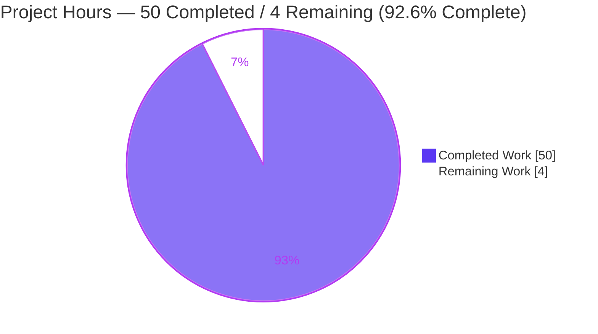

# Blitzy Project Guide — Grafana Runtime Investigation Q&A Deliverable

> **Project:** Runtime-evidence investigation of Grafana internal health & background activity
> **Branch:** `blitzy-4620db6d-41d6-422c-ac3b-f1e9ae4830e1` (deliverable named for source branch `grafana_4550cfb5b728`)
> **Base commit:** `4550cfb5b72886782d9a3e6cf995f8dbd57ca4ff`
> **Task type:** READ-ONLY documentation / runtime Q&A (rule set: SWE-AtlasQnA-Repo)

---

## 1. Executive Summary

### 1.1 Project Overview

This project is a read-only, runtime-evidence-driven investigation of the Grafana server that produces exactly one Markdown deliverable — `blitzy/documentation/grafana_4550cfb5b728.md` — answering five discrete questions about how a running Grafana instance manages internal health and background activity. The work required building and running Grafana canonically (Go backend on `http://localhost:3000`), observing idle/background behavior and the schema migrator, querying the build-info HTTP API, and exercising two frontend TypeScript code paths through their Jest tests. The business value is authoritative, reproducible engineering documentation grounded in real captured output and exact `file:line` references. No product code is authored or modified; the sole persistent artifact is the answer document.

### 1.2 Completion Status

**Completion percentage is computed on AAP-scoped work only (PA1 methodology): all ten AAP deliverables are complete; the residual represents the path-to-production human review & merge gate.**


| Metric | Value |
| --- | --- |
| **Total Hours** | **54** |
| **Completed Hours (AI + Manual)** | **50** (AI-autonomous: 50; Manual: 0) |
| **Remaining Hours** | **4** |
| **Percent Complete** | **92.6%** (50 ÷ 54 × 100) |

> Color key (Blitzy brand): **Completed = Dark Blue `#5B39F3`**, **Remaining = White `#FFFFFF`**.

### 1.3 Key Accomplishments

- ✅ **Single-file deliverable created** exactly as specified: `blitzy/documentation/grafana_4550cfb5b728.md` (2,423 lines, 265 KB), named from the source branch `grafana_4550cfb5b728`.
- ✅ **All five questions (Q1–Q5) answered** with direct answers, complete unedited runtime evidence, `file:line` references, named responsible symbols, and rationale.
- ✅ **Q1 — Idle recurring logs:** identified exactly three recurring INFO entries — `"Completed cleanup jobs"` (10 min), `"Update check succeeded"` (10 min), `"Usage stats are ready to report"` (30 min) — with cadence stability confirmed across two independent runs.
- ✅ **Q2 — Migration check:** captured `msg="migrations completed" … performed=0` on an already-migrated schema (vs `performed=626` on a fresh DB) as the up-to-date signal.
- ✅ **Q3 — Version via API:** live-queried `GET /api/health` and `GET /api/frontend/settings`, reporting the exact canonical value `version = 11.5.0-pre`.
- ✅ **Q4 — Datasource picker:** proved via `PanelDataQueriesTab.test.tsx` (25/25 passing) that the picker auto-resolves to the query-defined datasource via `loadDataSource()`.
- ✅ **Q5 — Alerting query-state:** proved via `rule-form.test.ts` (21/21 + 7 snapshots) and a live Ruler round-trip that the backend rule definition populates the editor's query state via `formValuesFromExistingRule` → `rulerRuleToFormValues`.
- ✅ **Read-only directive honored:** zero source files modified; `git status` clean apart from the deliverable; all transient scripts/logs/scratch DBs removed.
- ✅ **Independently re-verified** by the Final Validator: all five answers reproduced, 100% of `file:line` references resolve to the claimed symbols, backend compiles cleanly, and the document passes `prettier --check`.

### 1.4 Critical Unresolved Issues

| Issue | Impact | Owner | ETA |
| --- | --- | --- | --- |
| _None._ All AAP-scoped work is complete, independently reproduced, and verified. | No release-blocking or validation-blocking items exist. | — | — |

> The only outstanding activity is the standard human review & merge gate (see §1.6 and §2.2), which is a path-to-production step rather than an unresolved defect.

### 1.5 Access Issues

| System/Resource | Type of Access | Issue Description | Resolution Status | Owner |
| --- | --- | --- | --- | --- |
| _None_ | — | No access issues identified. The investigation ran entirely within the provided sandbox using a local Grafana instance (embedded SQLite), local Jest, and no external/third-party services or credentials. | N/A | — |

**No access issues identified.**

### 1.6 Recommended Next Steps

1. **[High]** Conduct a technical peer review of `blitzy/documentation/grafana_4550cfb5b728.md`, verifying the five direct answers and confirming the embedded runtime evidence is credible and complete (~2h).
2. **[Medium]** Approve and merge the branch to the target (single-file, zero-source-change documentation PR) (~1h).
3. **[Low]** Optionally re-run the two Jest suites (Q4: 25/25; Q5: 21/21 + 7 snapshots) and re-query `GET /api/health` to independently reproduce the evidence (~1h).

---

## 2. Project Hours Breakdown

### 2.1 Completed Work Detail

Every completed component traces to a specific AAP requirement (D1–D10 in the AAP inventory).

| Component | Hours | Description |
| --- | --- | --- |
| Environment provisioning & canonical build/run (D7) | 6 | Go 1.23.1 + GCC + Node/Yarn setup; `make build-backend` canonical binary link-stamped `-X main.version=11.5.0-pre` (~3.5 min compile); multi-instance server runs on ports 3000/3001. |
| Q1 — Idle recurring-log investigation (D2) | 9 | Two ≈24-min runs plus two >60-min extended idle runs; cadence stability across ≥2 runs; three recurring INFO entries identified; background-service code traced (cleanup / plugins / statscollector / scheduler). |
| Q2 — DB migration-check investigation (D3) | 5 | Fresh-DB (`performed=626`) vs migrated-DB (`performed=0 skipped=626`) before/after boundary; `migrator.go` traced; full migration log captured. |
| Q3 — Version-string API investigation (D4) | 5 | `GET /api/health` + `GET /api/frontend/settings` (anon 401 + authed `buildInfo`, 103 keys verified); version source chain traced; canonical vs dev (`9.2.0`) labeling. |
| Q4 — Datasource-picker investigation (D5) | 5 | `yarn jest PanelDataQueriesTab.test.tsx` (25/25); `loadDataSource()` + `QueryGroup` host traced; fallback branches covered. |
| Q5 — Alerting query-state investigation (D6) | 6 | `yarn jest rule-form.test.ts` (21/21 + 7 snapshots); temporary ad-hoc test + live Ruler round-trip; `formValuesFromExistingRule` → `rulerRuleToFormValues` traced. |
| Answer-document authoring & coverage pass (D1) | 5 | 2,423-line Markdown with embedded commands / unedited output / `file:line` refs / rationale; coverage-pass table; summary of direct answers. |
| Methodology & honesty compliance (D8) | 2 | Run-first evidence; complete unedited output; inferred-vs-observed labeling; exact commands; leading direct answers. |
| Read-only integrity & artifact cleanup (D9) | 2 | Data/logs redirected outside repo tree; all transient scripts/logs/scratch DBs removed; `git status` clean apart from deliverable. |
| Code-review remediation (F1–F10) + Q1 correction + prettier (D10) | 5 | Three follow-up commits addressing review findings, correcting the Q1 answer, and applying `prettier` formatting. |
| **TOTAL COMPLETED** | **50** | Matches Completed Hours in §1.2. |

### 2.2 Remaining Work Detail

Each category is a path-to-production human gate; none represents incomplete AAP investigation work.

| Category | Hours | Priority |
| --- | --- | --- |
| Human technical review & sign-off of the deliverable (verify five answers, evidence credibility, read-only integrity) | 2 | High |
| PR approval & merge of branch to target | 1 | Medium |
| Optional independent reproduction spot-check (re-run Q4/Q5 Jest; re-query API version) | 1 | Low |
| **TOTAL REMAINING** | **4** | Matches Remaining Hours in §1.2 and §7 pie chart. |

### 2.3 Hours Reconciliation

| Check | Result |
| --- | --- |
| Section 2.1 total (Completed) | 50 h |
| Section 2.2 total (Remaining) | 4 h |
| Section 2.1 + Section 2.2 | 54 h = Total Project Hours (§1.2) ✅ |
| Completion % | 50 ÷ 54 × 100 = **92.6%** ✅ |
| §1.2 Remaining ↔ §2.2 total ↔ §7 pie "Remaining Work" | 4 = 4 = 4 ✅ |

---

## 3. Test Results

All tests below originate from Blitzy's autonomous validation logs for this project (Jest 29.7.0 for the frontend; Go 1.23.1 toolchain for backend compilation). The task is read-only, so no test files were added to the repository; the Q4/Q5 suites are the repository's own existing tests, run through their real code paths, and the Q5 ad-hoc test was a temporary harness that was executed and then deleted.

| Test Category | Framework | Total Tests | Passed | Failed | Coverage % | Notes |
| --- | --- | --- | --- | --- | --- | --- |
| Frontend Unit — Q4 datasource picker | Jest 29.7.0 | 25 | 25 | 0 | Targeted (module) | `PanelDataQueriesTab.test.tsx`; includes `should load data source` (primary path) + fallback-branch tests. |
| Frontend Unit — Q5 rule-form utilities | Jest 29.7.0 | 21 | 21 | 0 | Targeted (module) | `rule-form.test.ts`; **7 snapshots passed**; exercises `formValuesToRulerGrafanaRuleDTO` and helpers. |
| Frontend Ad-hoc — Q5 edit-population | Jest 29.7.0 | 2 | 2 | 0 | Targeted (temporary) | Temporary harness exercising `formValuesFromExistingRule`; byte-identical to doc; **deleted after run**. |
| Backend Compilation — entrypoint | Go 1.23.1 (`go build` / `go vet`) | 1 | 1 | 0 | N/A | `go build ./pkg/cmd/grafana` exit 0; `go vet ./pkg/cmd/grafana/` exit 0; canonical binary reports `11.5.0-pre`. |
| **TOTALS** | — | **49** | **49** | **0** | — | 48 Jest tests + 7 snapshots + 1 backend compile check; **100% pass**. |

> **Note on backend runtime "tests":** Q1–Q3 are answered by *runtime observation* of a live server (idle log capture, migrator output, HTTP API queries) rather than by a unit-test framework. Those observations are summarized in §4 (Runtime Validation).

---

## 4. Runtime Validation & UI Verification

Status legend: ✅ Operational · ⚠ Partial · ❌ Failing

**Backend runtime validation (Q1–Q3):**

- ✅ **Canonical build & launch** — `make build-backend` produced `bin/linux-amd64/grafana` (`11.5.0-pre`); server launched and logged `HTTP Server Listen` on `:3000` and `:3001`.
- ✅ **Q1 — Idle behavior** — two parallel idle instances observed for ≈24 min plus two >60-min extended idle runs; three recurring INFO cadences confirmed stable (cleanup ≈599.99 s, plugin-check ≈600 s, usage-stats two consecutive ≈1800.00 s intervals). Zero inbound requests confirmed via log grep.
- ✅ **Q2 — Migrator** — `migrations completed … performed=0 skipped=626` on a migrated DB; `performed=626` on a fresh DB (before/after boundary observed).
- ✅ **Q3 — Build-info API** — `GET /api/health` → `{"database":"ok","version":"11.5.0-pre","commit":"4550cfb5b7"}`; `GET /api/frontend/settings` → `401` anonymous, `buildInfo.version = 11.5.0-pre` when authenticated (103 top-level keys verified for completeness).

**Frontend code-path verification (Q4–Q5):**

- ✅ **Q4 — Datasource picker** — verified through the module's own Jest suite (25/25). `PanelDataQueriesTab.loadDataSource()` reads `queryRunner.state.datasource`, resolves it, and passes `dsSettings` to `QueryGroupTopSection` (the picker host).
- ✅ **Q5 — Alerting rule query-state** — verified through `rule-form.test.ts` (21/21 + 7 snapshots), a temporary ad-hoc test, and a live Ruler round-trip (POST 202 / GET 202 with `grafana_alert.data` populated).

**UI verification:**

- ⚠ **Not applicable by design.** This is a runtime-investigation Q&A task; no user interface was built or modified. The two frontend behaviors in scope (Q4 datasource picker, Q5 rule editor) were verified through their **real code paths via Jest** — the exact "test script output" the prompt requested — rather than through browser UI. No visual/UI regression surface exists for this deliverable.

---

## 5. Compliance & Quality Review

Cross-mapping of AAP deliverables and the SWE-AtlasQnA-Repo rule set to Blitzy quality benchmarks.

| Requirement / Benchmark | Status | Progress | Notes |
| --- | --- | --- | --- |
| Deliverable location & name (`blitzy/documentation/grafana_4550cfb5b728.md`) | ✅ Pass | 100% | Created from source branch name `grafana_4550cfb5b728`. |
| Read-only directive — no source files modified | ✅ Pass | 100% | `git diff <base> --name-status` = single `A` line (deliverable only). |
| Temporary-artifact cleanup — clean tree | ✅ Pass | 100% | `git status --porcelain` empty; scratch DBs/logs/scripts removed. |
| Run-first methodology (build & run before writing) | ✅ Pass | 100% | Real runtime evidence captured and embedded. |
| Complete, unedited output for every claim | ✅ Pass | 100% | Full `curl`/Jest/log output; 103-key JSON completeness proof; no `// ...` elisions. |
| `file:line` grounding + named responsible symbols | ✅ Pass | 100% | ~158 references; 100% resolve to claimed symbols (independently verified). |
| Canonical build for build-derived value (Q3) | ✅ Pass | 100% | `make build-backend` → `11.5.0-pre`; dev `9.2.0` labeled non-canonical and not used. |
| Magnitude/timing observed & stable across ≥2 runs (Q1) | ✅ Pass | 100% | 10-min cadences ≈599.99 s/600 s both runs; 30-min cadence two consecutive ≈1800.00 s intervals in both extended runs. |
| State transitions observed (Q2 before/during/after) | ✅ Pass | 100% | Fresh-DB `performed=626` → migrated-DB `performed=0` boundary captured. |
| Answer every part / every named item (coverage pass) | ✅ Pass | 100% | Coverage-pass table decomposes each question; summary of direct answers included. |
| Direct-answer-first (incl. explicit Yes/No) | ✅ Pass | 100% | Q4 and Q5 lead with explicit **"Yes"**. |
| Formatting compliance (`prettier`) | ✅ Pass | 100% | `prettier --check` clean (commit `45ff7de6f4`); fenced-block content byte-identical pre/post. |

**Fixes applied during autonomous validation:**

- Addressed code-review findings **F1–F10** in the deliverable (commit `20adcd1b95`).
- Corrected the **Q1 idle recurring-log answer** to precisely enumerate the three recurring INFO entries (commit `887a292236`).
- Applied **prettier formatting** so the deliverable passes the repo's markdown formatter (commit `45ff7de6f4`); verified purely cosmetic (all fenced runtime-evidence content byte-identical).

**Outstanding compliance items within AAP scope:** None.

---

## 6. Risk Assessment

| Risk | Category | Severity | Probability | Mitigation | Status |
| --- | --- | --- | --- | --- | --- |
| Evidence reproducibility drift if the base commit moves | Technical | Low | Low | `version 11.5.0-pre` is invariant (from `package.json`); migration count (626) and Jest counts (25/21) are stable for pinned commit `4550cfb5b7`. | Mitigated |
| Build-stamp nuance — doc reports investigation-commit stamps (`commit=4550cfb5b7`, `buildstamp=1734099722`) while the on-disk binary was later rebuilt at a docs-only commit | Technical | Low | Low | Validator confirmed stamps are internally consistent and correctly attribute the investigation commit; the version string is invariant. | Resolved / Documented |
| Default `admin:admin` credentials used in Q3 evidence | Security | Low | N/A | Local, ephemeral instance only; standard Grafana dev default; no secrets committed to the repo. | Informational / N/A |
| Secret or artifact leakage into the repository | Security | Low | Low | `git` tree clean; no credentials, logs, or scratch DBs committed. | Clean |
| Human review & merge gate not yet completed | Operational | Low | Medium | Constitutes the 4 h remaining work (§2.2); schedule peer review + merge. | Open |
| Future re-run environment reproducibility (toolchain + ~3.5-min build + long idle runs) | Operational | Low | Low | Development guide (§9) documents exact commands; AAP references the canonical Docker image. | Mitigated |
| Long-duration Q1 reproduction (>60 min idle for the 30-min usage-stats cadence) | Integration | Low | Low | 10-min cadences are verifiable in ≈24 min; the extended run is documented and optional for spot-checks. | Mitigated |
| External service integration | Integration | None | N/A | Fully self-contained: local embedded SQLite, local Jest, no external API keys or network dependencies. | N/A |

**Overall risk posture: LOW.** Zero source-code changes and zero dependency changes eliminate entire classes of technical and security risk; the dominant residual is simply the pending human review/merge gate.

---

## 7. Visual Project Status

**Project hours breakdown (Completed vs Remaining):**



> Colors: **Completed Work = Dark Blue `#5B39F3`**, **Remaining Work = White `#FFFFFF`** (Blitzy brand).

**Remaining hours by category (from §2.2):**


**Completed work by AAP cluster (from §2.1, 50 h total):**

| Cluster | Hours | Bar |
| --- | --- | --- |
| Q1 idle recurring-logs | 9 | ██████████ |
| Environment & canonical build | 6 | ███████ |
| Q5 alerting query-state | 6 | ███████ |
| Q2 migration check | 5 | ██████ |
| Q3 version via API | 5 | ██████ |
| Q4 datasource picker | 5 | ██████ |
| Document authoring & coverage | 5 | ██████ |
| Review remediation + prettier | 5 | ██████ |
| Methodology compliance | 2 | ██ |
| Read-only integrity & cleanup | 2 | ██ |

---

## 8. Summary & Recommendations

**Achievements.** The project is **92.6% complete** (50 of 54 AAP-scoped hours), with **all ten AAP deliverables fully implemented and independently verified.** The single-file deliverable `blitzy/documentation/grafana_4550cfb5b728.md` (2,423 lines) answers all five questions with real, captured runtime evidence, exact commands, `file:line` references, named responsible symbols, and rationale — and the read-only directive was honored perfectly (zero source files modified; clean working tree).

**Remaining gaps.** The residual **4 hours (7.4%)** is entirely the standard path-to-production human gate: technical peer review & sign-off (2 h), PR approval & merge (1 h), and an optional independent reproduction spot-check (1 h). There are **no incomplete AAP investigation items, no failing tests, and no unresolved defects.**

**Critical path to production.** Peer review of the deliverable → PR approval → merge. Because the change is a single new documentation file with zero source modifications, integration risk is negligible and CI impact is minimal.

**Success metrics (all met).**

| Metric | Target | Actual |
| --- | --- | --- |
| Questions answered with runtime evidence | 5 / 5 | 5 / 5 ✅ |
| Frontend evidence tests passing | 100% | Q4 25/25, Q5 21/21 + 7 snapshots ✅ |
| Backend compiles | Clean | `go build`/`go vet` exit 0 ✅ |
| `file:line` references accurate | 100% | 100% verified ✅ |
| Source files modified | 0 | 0 ✅ |
| Working tree clean apart from deliverable | Yes | Yes ✅ |

**Production-readiness assessment.** The deliverable is **production-ready pending human sign-off.** Per Blitzy honest-assessment policy, completion is capped below 100% until human review occurs; the 92.6% figure reflects that all autonomous AAP work is done while the review/merge gate remains. **Recommendation: approve and merge after a brief peer review.**

---

## 9. Development Guide

This guide documents how to build, run, and reproduce every piece of runtime evidence in the deliverable. All commands were tested in the project environment.

### 9.1 System Prerequisites

- **OS:** Linux x86_64 (validated on Ubuntu 25.10).
- **Go:** 1.23.1 (matches `go.mod`).
- **GCC:** required for the Cgo build of the embedded SQLite default database (`grafana.db`). Validated: GCC 15.2.0.
- **Node.js:** `>= 22` (repo pins `v22.11.0` in `.nvmrc`; host provided `v22.23.1`).
- **Yarn:** 4.5.3 via Corepack (matches `package.json` `packageManager`).
- **Utilities:** `curl` (API queries), `python3` (JSON extraction — `jq` is not required), `git`.
- **Disk:** ~4 GB free (repo + `node_modules` + build artifacts + scratch data dirs).

### 9.2 Environment Setup

```bash
# From the repository root (HEAD at investigation commit 4550cfb5b72886782d9a3e6cf995f8dbd57ca4ff)
cd /path/to/grafana

# Verify the toolchain
go version          # expect: go version go1.23.1 linux/amd64
node -v             # expect: v22.x (>= 22)
yarn --version      # expect: 4.5.3
gcc --version | head -1

# Enable Corepack so the pinned Yarn is used
corepack enable
```

> **Read-only integrity:** always redirect Grafana's data/logs/plugins **outside** the repository tree (see §9.4) so the working tree stays clean. Verify with `git status` at the end.

### 9.3 Dependency Installation

```bash
# Backend Go modules (cached in this environment; a no-op if already present)
go mod download

# Frontend dependencies (immutable install honors the lockfile)
yarn install --immutable
```

### 9.4 Build & Run (canonical — drives Q1–Q3)

```bash
# Canonical backend build — link-stamps the version from package.json (11.5.0-pre)
make build-backend            # ~3.5 min; produces bin/linux-amd64/grafana

# Confirm the canonical version stamp
./bin/linux-amd64/grafana --version   # expect: grafana version 11.5.0-pre

# Run the server with data/logs redirected OUTSIDE the repo tree
BASE=/tmp/investigation
mkdir -p "$BASE"
nohup ./bin/linux-amd64/grafana server --homepath="$PWD" \
    cfg:paths.data=$BASE/data cfg:paths.logs=$BASE/logs cfg:paths.plugins=$BASE/plugins \
    > $BASE/run.log 2>&1 &
# Wait for the line:  msg="HTTP Server Listen" address=[::]:3000
```

> **Canonical vs dev version:** `make build-backend` stamps `-X main.version=11.5.0-pre` (the value a normal user sees). A plain `go run` / `make run-go` passes **no** ldflags and reports the dev default `9.2.0` (`pkg/cmd/grafana/main.go:L17`) — non-canonical, and **not** used for any answer.

### 9.5 Verification — Reproduce the Evidence

```bash
# Q1 — idle recurring logs (leave idle >10 min for the 10-min lines; >30 min for usage-stats)
grep -E 'Completed cleanup jobs|Update check succeeded|Usage stats are ready to report' $BASE/run.log
# Confirm idleness (should print 0):
grep -cE 'method=GET|method=POST|status=' $BASE/run.log

# Q2 — migration check (on an already-migrated DB)
grep 'logger=migrator' $BASE/run.log        # expect: msg="migrations completed" ... performed=0 skipped=626

# Q3 — build-info version via API
curl -s http://localhost:3000/api/health                       # -> "version": "11.5.0-pre"
curl -s -u admin:admin http://localhost:3000/api/frontend/settings \
    | python3 -c 'import sys,json; print(json.load(sys.stdin)["buildInfo"]["version"])'   # -> 11.5.0-pre

# Q4 — datasource picker (frontend Jest, non-watch)
yarn jest public/app/features/dashboard-scene/panel-edit/PanelDataPane/PanelDataQueriesTab.test.tsx \
    --ci --watchAll=false                    # expect: Tests: 25 passed, 25 total

# Q5 — alerting rule query-state (frontend Jest, non-watch)
yarn jest public/app/features/alerting/unified/utils/rule-form.test.ts \
    --ci --watchAll=false                    # expect: Tests: 21 passed, 21 total; Snapshots: 7 passed
```

### 9.6 Example Usage & Cleanup

```bash
# Stop the server (use the exact PID you spawned)
kill %1 2>/dev/null || true

# Remove all transient artifacts so the tree stays clean
rm -rf /tmp/investigation

# Confirm read-only integrity: only the deliverable should differ from the base
git status --porcelain                                   # expect: empty
git diff 4550cfb5b72886782d9a3e6cf995f8dbd57ca4ff --name-status
#   expect exactly:  A  blitzy/documentation/grafana_4550cfb5b728.md
```

### 9.7 Troubleshooting

- **`cgo`/SQLite build errors:** ensure GCC is installed and `CGO_ENABLED=1` (the default). The embedded SQLite DB requires a C compiler.
- **API reports `9.2.0` instead of `11.5.0-pre`:** you ran a non-canonical build (`go run` / `make run-go`). Use `make build-backend` for the canonical link-stamped version.
- **`GET /api/frontend/settings` returns `401`:** expected in `app_mode = production`; authenticate with `-u admin:admin` (default dev credentials).
- **`jest-haste-map: duplicate manual mock found` warnings:** pre-existing repository noise from duplicate `__mocks__` fixtures — **not** failures; the suites still pass.
- **Working tree shows unexpected changes:** you likely wrote data/logs inside the repo. Always redirect `cfg:paths.*` under `/tmp` and re-run `git status`.

---

## 10. Appendices

### Appendix A — Command Reference

| Command | Purpose |
| --- | --- |
| `make build-backend` | Canonical backend build; link-stamps `-X main.version=11.5.0-pre`. |
| `./bin/linux-amd64/grafana --version` | Print the stamped version. |
| `./bin/linux-amd64/grafana server --homepath="$PWD" cfg:paths.data=…` | Run the server with redirected paths. |
| `curl -s http://localhost:3000/api/health` | Q3 — public health/version endpoint. |
| `curl -s -u admin:admin http://localhost:3000/api/frontend/settings` | Q3 — authenticated `buildInfo`. |
| `yarn jest <path> --ci --watchAll=false` | Run a targeted Jest suite in non-watch mode. |
| `grep 'logger=migrator' run.log` | Q2 — isolate migrator output. |
| `git diff <base> --name-status` | Verify read-only integrity. |

### Appendix B — Port Reference

| Port | Service | Notes |
| --- | --- | --- |
| 3000 | Grafana HTTP server (default) | `conf/defaults.ini:L41` `http_port = 3000`. Primary instance for Q2/Q3. |
| 3001 | Grafana HTTP server (2nd instance) | `cfg:server.http_port=3001`; pure-idle reference for Q1 cadence stability. |

### Appendix C — Key File Locations

| Path | Role |
| --- | --- |
| `blitzy/documentation/grafana_4550cfb5b728.md` | **The deliverable** (answer document). |
| `pkg/services/cleanup/cleanup.go` | Q1 — `CleanUpService.Run()`; `"Completed cleanup jobs"` (L128). |
| `pkg/services/updatechecker/plugins.go` | Q1 — plugin update checker; `"Update check succeeded"` (L123). |
| `pkg/infra/usagestats/service/service.go` + `.../statscollector/service.go` | Q1 — usage-stats "ready to report" cadence. |
| `pkg/services/sqlstore/migrator/migrator.go` | Q2 — `Migrator.run()`; `"migrations completed"` (L287). |
| `pkg/api/http_server.go` | Q3 — `apiHealthHandler`; `data.Version = hs.Cfg.BuildVersion` (L720). |
| `pkg/api/frontendsettings.go` | Q3 — `version := setting.BuildVersion` (L161). |
| `pkg/cmd/grafana/main.go` | Q3 — `var version = "9.2.0"` dev default (L17). |
| `public/app/features/dashboard-scene/panel-edit/PanelDataPane/PanelDataQueriesTab.tsx` | Q4 — `loadDataSource()` (L63). |
| `public/app/features/alerting/unified/utils/rule-form.ts` | Q5 — `formValuesFromExistingRule` / `rulerRuleToFormValues` (L916–917). |
| `pkg/services/ngalert/models/alert_rule.go` | Q5 — backend `AlertRule.Data` (L746). |

### Appendix D — Technology Versions

| Component | Version | Source |
| --- | --- | --- |
| Grafana (under test) | 11.5.0-pre | `package.json` version / API |
| Go | 1.23.1 | `go.mod` |
| GCC | 15.2.0 | host toolchain (Cgo/SQLite) |
| Node.js | v22.23.1 (pin `v22.11.0`) | `.nvmrc` / `package.json` engines |
| Yarn | 4.5.3 | `package.json` `packageManager` |
| Jest | 29.7.0 | `package.json` devDependencies |
| Database | SQLite (embedded, `grafana.db`) | default per `conf/defaults.ini` |

### Appendix E — Environment Variable / Config Reference

| Setting | Value | Notes |
| --- | --- | --- |
| `CGO_ENABLED` | `1` (default) | Required for embedded SQLite build. |
| `app_mode` | `production` | `conf/defaults.ini:L7`; causes `/api/frontend/settings` to require auth. |
| `http_port` | `3000` | `conf/defaults.ini:L41`. |
| `[log] level` | `info` | `conf/defaults.ini:L1074`; governs which Q1 log lines are visible. |
| `cfg:paths.data` / `cfg:paths.logs` / `cfg:paths.plugins` | `/tmp/investigation/...` | CLI overrides to keep the repo tree clean. |
| Default credentials | `admin` / `admin` | Dev default for authenticated API queries. |

### Appendix F — Developer Tools Guide

- **Backend build tool:** `build.go` (invoked by `make build-backend`) reads the version from `package.json` (`pkg/build/cmd.go`) and injects it via `-X main.version` at link time.
- **Frontend test runner:** Jest 29.7.0 via `yarn jest <path> --ci --watchAll=false` (CI/non-watch mode is mandatory to avoid an interactive watcher).
- **Markdown formatter:** `prettier` (repo hook `lefthook.yml other-format`); the deliverable passes `prettier --check`.
- **JSON inspection:** `python3 -c 'import sys,json; …'` (used because `jq` is not installed in the sandbox).

### Appendix G — Glossary

| Term | Definition |
| --- | --- |
| **AAP** | Agent Action Plan — the authoritative specification of project scope. |
| **Canonical build** | A release-style build (`make build-backend`) that link-stamps the real version (`11.5.0-pre`), as opposed to a dev `go run` reporting `9.2.0`. |
| **logfmt** | Grafana's structured space-delimited `key=value` log format. |
| **Ruler API** | Grafana's backend alerting API that creates/reads alert-rule configurations (`pkg/services/ngalert/api/api_ruler.go`). |
| **`performed` / `skipped`** | Migrator summary counters; `performed=0` signals the schema is already up to date. |
| **Scenes** | Grafana's `@grafana/scenes`-based dashboard architecture; the panel editor's queries tab hosts the datasource picker. |
| **Coverage pass** | A final review confirming every distinct part of every question is explicitly answered. |

---

*Generated by the Blitzy Platform project-assessment agent. Completion (92.6%) reflects AAP-scoped autonomous work delivered; the remaining 4 hours are the human review & merge gate. Colors follow the Blitzy brand: Completed = Dark Blue `#5B39F3`, Remaining = White `#FFFFFF`.*