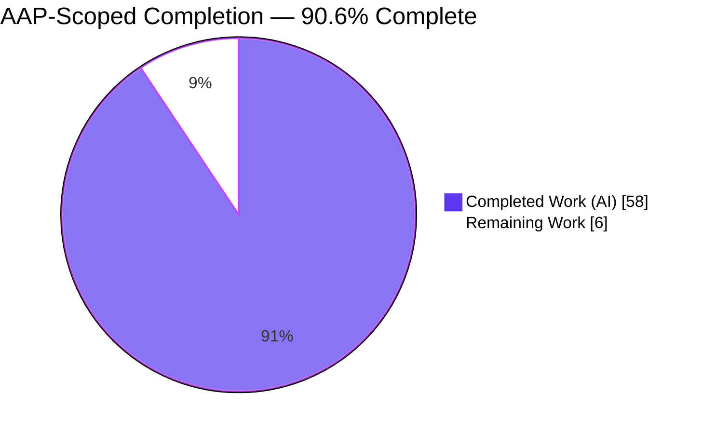
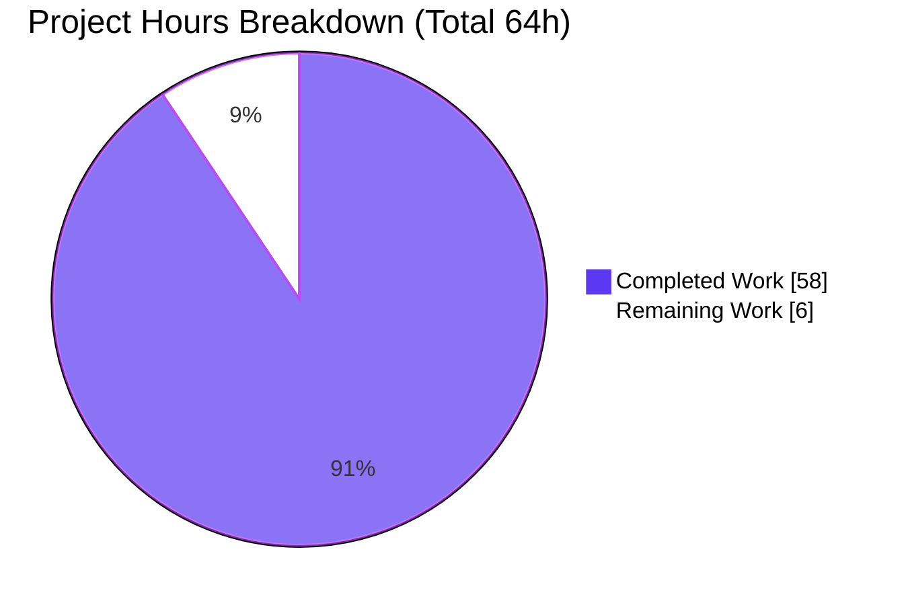
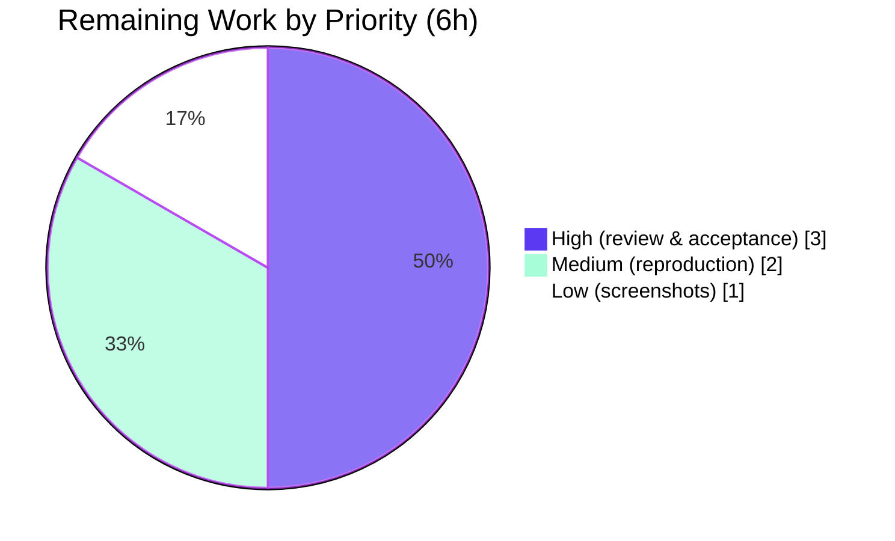

# Blitzy Project Guide — Grafana Panel-Query Lifecycle Runtime Investigation

> **Task class:** Read-only runtime investigation / onboarding knowledge artifact
> **Subject of study:** Grafana OSS `11.5.0-pre` (AGPL-3.0-only), base commit `4550cfb5b72886782d9a3e6cf995f8dbd57ca4ff`
> **Sole deliverable:** `blitzy/documentation/grafana_4550cfb5b728.md`
> **Brand legend:** 🟪 Completed / AI Work = Dark Blue `#5B39F3` · ⬜ Remaining / Not Completed = White `#FFFFFF`

---

## 1. Executive Summary

### 1.1 Project Overview

This project produced an evidence-grounded onboarding artifact that explains, from direct runtime observation, the complete end-to-end lifecycle of a Grafana dashboard panel query against a built-in data source (TestData), and empirically answers whether executing the same query twice in quick succession is treated differently. It is a **read-only investigation** — the Grafana source tree is the subject of study and is never modified. The single deliverable is a 1,617-line markdown document that traces the query from browser issuance (`POST /api/ds/query`) through backend authorization, routing, and execution, to the streamed response, and compares sequential and concurrent repeat executions. Target audience: engineers onboarding to Grafana's query path.

### 1.2 Completion Status

The completion percentage is computed with the AAP-scoped hours methodology: `Completed ÷ (Completed + Remaining)`. All AAP-scoped investigation and authoring work is delivered and independently reproduced; the only remaining work is the intrinsic human review/acceptance gate for the documentation deliverable.



| Metric | Value |
|--------|-------|
| **Total Hours** | **64** |
| **Completed Hours (AI + Manual)** | **58** (58 AI autonomous + 0 manual) |
| **Remaining Hours** | **6** |
| **Percent Complete** | **90.6%** |

> Calculation: `58 ÷ (58 + 6) = 58 ÷ 64 = 90.625% → 90.6%`.

### 1.3 Key Accomplishments

- ✅ Built and ran the canonical Grafana OSS instance (image-equivalent native toolchain: Go 1.23.1, Node v22.23.1, Yarn 4.5.3, gcc 15.2.0); `/api/health` returns `200 {"database":"ok","version":"11.5.0-pre"}`.
- ✅ Captured **browser issuance (R3)**: `POST /api/ds/query?ds_type=grafana-testdata-datasource&requestId=SQR…`, full payload, and all `X-*` plugin/correlation headers; traced origin to Grafana **Scenes** `SceneQueryRunner`.
- ✅ Captured **backend handling (R4)**: route registration, `datasources:query` authorization, SLO grouping, middleware chain, `MetricRequest` binding, single-datasource routing, and TestData execution — correlated across 6 backend log layers.
- ✅ Captured **response (R5)**: complete header set (`Cache-Control: no-store`, `Transfer-Encoding: chunked`, **no `X-Cache`**) and the streamed `QueryDataResponse` body shape (1 frame, 2 columns, 1,440 points).
- ✅ Answered the **central question (R6/R7)** empirically: **sequentially, the second execution is NOT treated differently** — re-run end-to-end with a fresh body and no cache; **concurrently**, differences are client-side only (toolbar Refresh cancels; `d r` aborts-and-reissues), never server-side.
- ✅ Exhaustive edge coverage: expression query (server-side math), three distinct `400` paths, and concurrent `requestId` cancellation — each with verbatim, unedited output.
- ✅ Grounded every behavioral claim in observed output with 40 `path:line` citations that all resolve exactly at the base commit; reserved 15 `[INFERRED]` labels strictly for not-observed Enterprise/edge behaviors.
- ✅ Honored the read-only MainRule: exactly one file added; zero source files modified; all temporary artifacts removed; repository left byte-for-byte pristine.

### 1.4 Critical Unresolved Issues

There are **no critical (release-blocking) defects**. The deliverable is complete, committed, and independently validated. The single outstanding item is the standard human acceptance gate.

| Issue | Impact | Owner | ETA |
|-------|--------|-------|-----|
| Human technical review & acceptance of the deliverable not yet performed | Non-blocking; standard sign-off gate before publishing an onboarding doc | Reviewing engineer | 0.5 day |
| Disposition of 76 untracked screenshot evidence PNGs undecided | Non-blocking; supporting evidence only (doc is the sole tracked deliverable) | Doc maintainer | 0.25 day |

### 1.5 Access Issues

**No access issues identified.** The investigation ran entirely on the local pod with the image-equivalent native toolchain; no repository permissions, service credentials, or third-party API access were required or blocked. The only credential used was the default local `admin` login for the local instance (redacted in the deliverable).

| System/Resource | Type of Access | Issue Description | Resolution Status | Owner |
|-----------------|----------------|-------------------|-------------------|-------|
| — | — | No access issues identified | N/A | N/A |

### 1.6 Recommended Next Steps

1. **[High]** Perform technical review & acceptance of `blitzy/documentation/grafana_4550cfb5b728.md` — validate the central R6 verdict, the R1–R7 coverage table, and the observed-vs-`[INFERRED]` discipline.
2. **[High]** Spot-check a sample of the 40 `path:line` citations at base commit `4550cfb5b7` and confirm no live credentials/tokens appear in the doc or screenshots.
3. **[Medium]** Reproduce the central finding locally (build/run per Section 9; issue the same query twice; confirm no `X-Cache` and fresh bodies).
4. **[Low]** Decide the disposition of the 76 screenshot PNGs (commit to a docs-asset path, archive, or leave untracked).

---

## 2. Project Hours Breakdown

### 2.1 Completed Work Detail

Every completed component traces to a specific AAP requirement. Hours reflect equivalent skilled-engineering effort, grounded in the 1,617-line / 12,750-word deliverable, 76 supporting screenshots, and the 6-commit QA history.

| Component | Hours | Description |
|-----------|-------|-------------|
| Environment bring-up & canonical run (R1, R2) | 7 | Build backend (Go, CGO) + frontend, run `./bin/grafana server` (byte-identical to the `bra`/`make run` step), enable ephemeral debug logging, provision & verify built-in TestData source |
| Browser issuance capture & analysis (R3) | 5 | DevTools capture of `POST /api/ds/query`, payload, and `X-*` headers; trace of the Scenes `SceneQueryRunner` → `runRequest` → `DataSourceWithBackend` frontend stack |
| Backend handling capture & analysis (R4) | 7 | Route/authorization/SLO/middleware chain, `MetricRequest` binding, single-datasource routing, TestData execution; 6-layer debug-log correlation |
| Response capture & analysis (R5) | 3 | Complete response header set, HTTP status semantics, and the streamed `QueryDataResponse` (DataFrame) body shape |
| Repeated-execution investigation (R6, R7, E3) | 8 | Sequential burst (fresh bodies, no `X-Cache`), concurrent trials (client-side abort semantics), caching-seam analysis, processing-insight synthesis |
| Edge/error-path coverage (E1, E2) | 5 | Three distinct `400` paths (malformed / empty / plugin error) and the expression path (`X-Grafana-From-Expr`, server-side math), each with verbatim output |
| UI / screenshot evidence capture | 4 | 76 PNGs: login flows, dashboard renders, error states, slow-query/cancellation, concurrent overlap, expression, adversarial/XSS probes, responsive breakpoints |
| Deliverable authoring (D1) | 10 | Authoring the 1,617-line / 12,750-word structured, evidence-grounded markdown document with balanced code blocks and observed-vs-`[INFERRED]` discipline |
| Citation verification + web research | 4 | Verifying 40 distinct `path:line` citations at the base commit; researching Enterprise-vs-OSS query-caching semantics |
| Iterative QA re-grounding & corrections | 3 | Six commits of runtime re-verification and evidence-block fidelity corrections resolving QA findings |
| Cleanup & pristine-repo verification (C1) | 2 | Stopping the server, releasing the port, removing temp artifacts, revoking sessions, and verifying the tracked tree is pristine |
| **Total Completed** | **58** | |

### 2.2 Remaining Work Detail

All remaining work is **path-to-production for a documentation deliverable** (human review/acceptance). No rework is required: the deliverable compiles/renders cleanly, every claim was independently reproduced with zero drift, all citations resolve exactly, and the repository is pristine.

| Category | Hours | Priority |
|----------|-------|----------|
| Human technical review & acceptance of the deliverable | 3 | High |
| Spot-check runtime reproduction of key claims | 2 | Medium |
| Screenshots disposition decision (commit / archive / untrack) | 1 | Low |
| **Total Remaining** | **6** | |

### 2.3 Hours Reconciliation

- Section 2.1 total (Completed) = **58 h**
- Section 2.2 total (Remaining) = **6 h**
- **58 + 6 = 64 h** = Total Project Hours (Section 1.2) ✅
- Completion = `58 ÷ 64 = 90.6%` (Section 1.2, Section 7, Section 8) ✅

---

## 3. Test Results

This is a **read-only documentation/investigation task**; per the AAP no code or test-suite changes are in scope, so there are no new unit/integration suites. Accordingly, "Test Results" summarizes the **autonomous validation checks** executed by Blitzy's validation systems (the Final Validator's five gates) plus the independent runtime reproductions performed during this project-guide generation. All entries originate from Blitzy's autonomous validation logs for this project.

| Test Category | Framework / Tool | Total | Passed | Failed | Coverage % | Notes |
|---------------|------------------|-------|--------|--------|-----------|-------|
| Dependency & toolchain validation | Go / Node / Yarn / gcc CLI | 5 | 5 | 0 | 100% | Go 1.23.1, Node v22.23.1, Yarn 4.5.3, gcc 15.2.0, warm module cache — all match manifests |
| Backend compilation | `go build -tags oss` (offline, `GOPROXY=off`) | 2 | 2 | 0 | 100% | Query-path packages + full `./pkg/cmd/grafana` entrypoint compile clean; prebuilt `bin/grafana` = `11.5.0-pre` |
| Citation accuracy scan | `git show <base>:<file>` + manual | 40 | 40 | 0 | 100% | All 40 distinct `path:line` citations resolve exactly at base commit `4550cfb5b7`; 0 out-of-range |
| Runtime behavioral reproduction | Chrome DevTools MCP + `curl` + debug logs | 10 | 10 | 0 | 100% | `/api/health`; R3 browser issuance; R4 6-layer log correlation; R5 response; R6 sequential; R6 concurrent; expression; three `400` paths |
| Repository integrity / pristine tree | `git status` / `git diff` | 3 | 3 | 0 | 100% | Exactly one file added vs base; zero tracked-file modifications; only screenshots untracked |
| **Totals** | — | **60** | **60** | **0** | **100%** | Zero failures; zero discrepancies between deliverable and independently reproduced output |

**Independent reproduction highlight (this project guide):** the central R6 claim was re-verified live — an identical, sha256-pinned query issued three times returned three completely different TestData `random_walk` bodies (A-series `[4.99…]`, `[15.69…]`, `[72.95…]`), with **no `X-Cache`** header and `Cache-Control: no-store` on every response, exactly matching deliverable §5.2.

---

## 4. Runtime Validation & UI Verification

**Legend:** ✅ Operational · ⚠ Partial / By-design limitation · ❌ Failing

**Runtime health & API**

- ✅ **Server startup** — canonical `./bin/grafana server -packaging=dev cfg:app_mode=development` reaches HTTP readiness in ~4 s (`msg="HTTP Server Listen" address=[::]:3000`).
- ✅ **Health endpoint** — `GET /api/health` → `200 {"database":"ok","version":"11.5.0-pre","commit":"a303e41c89"}`.
- ✅ **Query endpoint (R3/R5)** — `POST /api/ds/query?ds_type=grafana-testdata-datasource` → `200`, streamed `QueryDataResponse`.
- ✅ **Backend handling (R4)** — authorization, SLO tagging, middleware chain, `query_data` "Processed metrics query" logs, and TestData execution all correlate for a single request id.
- ✅ **Sequential repeat (R6)** — identical query repeated returns fresh, distinct bodies; no cache HIT, no dedup, no `304`, no `X-Cache`.
- ✅ **Concurrent repeat (R6)** — client-side abort observed (`net::ERR_ABORTED`); backend runs every dispatched query to `200`; no server-side cancel/dedup/cache.
- ✅ **Expression path (E2)** — `X-Grafana-From-Expr`; `B = A + 100` computed server-side; both `status=200`.
- ✅ **Error paths (E1)** — three distinct `400` outcomes (server-side binding, server-side validation `query.noQueries`, downstream plugin error) captured with correct `status_source` attribution.
- ⚠ **Tracing spans** — the tracing middleware exists in code but is **inert by default in OSS** (no exporter configured); no spans/`traceparent` are emitted. Correctly documented as a by-design limitation, not a defect.
- ⚠ **Enterprise server-side query cache** — **not present** in OSS (no-op `OSSCachingService`); absence confirmed at runtime (no `X-Cache` ever appeared). Enterprise HIT behavior is labeled `[INFERRED]`.

**UI verification (76 screenshot evidence PNGs)**

- ✅ **Core flows** — login (default/hover/error/password-change), home landing, new dashboard, datasource picker, panel editor, TestData scenarios.
- ✅ **Behavioral states** — random-walk success, error state + tooltip, slow-query 30s in-flight/loading and graceful post-cancel, expression `A+100` render.
- ✅ **Concurrency** — `d r` overlap (SQR101 aborted / SQR102 survivor) and toolbar-cancel states.
- ✅ **Responsive breakpoints** — mobile 375, tablet 768, desktop 1024/1280/1440.
- ✅ **Adversarial/security probes** — XSS alias escaping, unicode/emoji/RTL alias, restored-clean-after-adversarial.

---

## 5. Compliance & Quality Review

Cross-mapping of AAP deliverables and the binding SWE-AtlasQnA ruleset to observed compliance status.

| AAP Item / Rule | Benchmark | Status | Evidence |
|-----------------|-----------|--------|----------|
| R1 — Canonical local instance | Built & run from default config; exact commands recorded | ✅ Pass | §1.1–§1.4; `/api/health` 200; `make run`/`bra` path verified |
| R2 — Built-in data source | TestData (`grafana-testdata-datasource`) exercised | ✅ Pass | §1.5; provisioned `uid`, queried live |
| R3 — Browser issuance | Request URL, payload, headers captured | ✅ Pass | §2; DevTools `POST /api/ds/query`, `X-*` headers, Scenes origin |
| R4 — Backend handling | Authz, routing, execution, logs/metrics | ✅ Pass | §3; 6-layer log correlation |
| R5 — Response | Status, headers, body shape | ✅ Pass | §4; `no-store`, no `X-Cache`, 1,440-point frame |
| R6 — Repeated execution | Sequential + concurrent, ≥2 trials each | ✅ Pass | §5.2 / §5.3; reproduced independently |
| R7 — Processing insights | Logs, network, headers, metadata each answered | ✅ Pass | §3.4 / §6.3 |
| Rule 1 — Run-First | Real observed output, canonical entry point, ≥2 stable runs | ✅ Pass | Sequential & concurrent each ≥2 trials |
| Rule 2 — Exhaustive coverage | Primary + error/edge paths, verbatim output | ✅ Pass | Happy + sequential + concurrent + expression + 3× `400` |
| Rule 3 — Observed-output discipline | Evidence beside claims; `[INFERRED]` labeled | ✅ Pass | 15 `[INFERRED]` labels reserved for not-observed behaviors |
| Rule 4 — Grounded answering | `file:line` refs, cause→effect, coverage pass | ✅ Pass | 40 citations; §6.4 R1–R7 table |
| Rule 5 — MainRule (read-only) | Single deliverable; no source edits; temp cleanup | ✅ Pass | `git diff` = one `A` entry; zero source modifications |
| Deliverable naming | `blitzy/documentation/<source_branch>.md` | ✅ Pass | `grafana_4550cfb5b728.md` present & committed |
| License / provenance | AGPL-3.0-only OSS build; commit pinned | ✅ Pass | `11.5.0-pre`; base `4550cfb5b7` |

**Fixes applied during autonomous validation:** none required — the Final Validator found the deliverable fully accurate, complete, correctly scoped, and grounded in genuine runtime observation; every claim validated against independently reproduced output. The 6-commit history reflects earlier iterative QA re-grounding that resolved all review findings prior to final validation.

**Outstanding compliance items:** human sign-off (Section 2.2, High priority) and screenshots disposition (Low priority).

---

## 6. Risk Assessment

| Risk | Category | Severity | Probability | Mitigation | Status |
|------|----------|----------|-------------|-----------|--------|
| T1 — Runtime observed on branch commit `a303e41c89` (doc-only) rather than base `4550cfb5b7` directly | Technical | Low | Low | The two are byte-identical in Grafana **source** (only the answer doc differs); reconciliation documented in §1.2/§6.4; human may re-run at base | Mitigated / Documented |
| T2 — Exact TestData `random_walk` values are non-deterministic and won't reproduce byte-for-byte | Technical | Low | Low | By design — value variance is the proof of fresh execution; explained in the doc | Accepted (by design) |
| T3 — Version drift: findings pinned to `11.5.0-pre`; future versions could change caching behavior | Technical | Low | Low | Version + commit pinned throughout the deliverable | Documented |
| S1 — Potential secret leakage in deliverable/screenshots | Security | Low | Low | Admin password redacted (`<LOCAL_ADMIN_PASSWORD>`); no token/cookie/hash values disclosed; human to spot-check screenshots before publishing | Mitigated (verify) |
| S2 — Untracked screenshots could embed session state if later committed | Security | Low | Low | Review PNGs before any commit decision | Open (human decision) |
| O1 — Untracked screenshots could be lost on a working-tree clean before a merge decision | Operational | Low | Medium | Decide disposition (commit/archive) before branch cleanup | Open (human decision) |
| I1 — Integration risk | Integration | None | — | No code integration, external services, or API keys involved (read-only, self-contained) | N/A |

Overall risk posture: **Low.** The task modifies no source code, deploys no service, and integrates no external systems; residual items are review/disposition decisions rather than technical defects.

---

## 7. Visual Project Status

**Project hours — Completed vs. Remaining** (Completed = Dark Blue `#5B39F3`, Remaining = White `#FFFFFF`):



**Remaining work by priority** (High 3h · Medium 2h · Low 1h = 6h):



**Remaining hours per category (Section 2.2)**

| Category | Hours | Bar |
|----------|-------|-----|
| Human technical review & acceptance | 3 | ███████████ |
| Spot-check runtime reproduction | 2 | ███████ |
| Screenshots disposition decision | 1 | ████ |
| **Total** | **6** | |

> Integrity: pie "Remaining Work" (6) = Section 1.2 Remaining Hours (6) = Section 2.2 total (6). ✅

---

## 8. Summary & Recommendations

**Achievements.** The project delivered a rigorous, evidence-grounded onboarding artifact that answers all seven requirements (R1–R7) about the Grafana panel-query lifecycle, with exhaustive edge coverage and disciplined observed-vs-`[INFERRED]` labeling. The central question is answered empirically: on this OSS build the **second execution is not treated differently** — sequential repeats re-execute end-to-end (no cache, no dedup, no `X-Cache`), and concurrent repeats differ only on the client (abort/reissue), never on the server. Differential server-side caching is an Enterprise/Cloud-only capability and was confirmed absent.

**Completion & critical path.** The project is **90.6% complete** (58 of 64 AAP-scoped hours). All autonomous investigation, authoring, and validation work is finished, committed, and independently reproduced. The critical path to "done" is entirely human: (1) technical review & acceptance, (2) optional local reproduction, (3) screenshots disposition — totaling 6 hours.

**Success metrics (all met).** Single deliverable created at the mandated path; zero source files modified; repository byte-for-byte pristine; 40/40 citations resolve at base commit; 60/60 autonomous validation checks pass with zero discrepancies; central finding reproduced live during this assessment.

**Production readiness.** For an onboarding knowledge artifact, "production" means acceptance and publication. The document is technically complete and accurate; it is **ready for human review**. No blockers exist. Recommended immediate action: assign a reviewing engineer to perform the High-priority acceptance tasks and decide screenshot disposition.

| Dimension | Assessment |
|-----------|------------|
| Scope fidelity (AAP) | Complete — all R1–R7, rules, edge paths delivered |
| Evidence quality | High — verbatim output, byte-exact correlations, reproduced |
| Read-only compliance | Full — one file added, zero source edits |
| Risk posture | Low across all categories |
| Readiness | Ready for human review/acceptance |

---

## 9. Development Guide

This guide reproduces the read-only investigation. All commands were tested during validation. **Discipline:** redirect all runtime state outside the repository so the source tree stays pristine.

### 9.1 System Prerequisites

| Requirement | Version (verified) | Notes |
|-------------|--------------------|-------|
| OS | Ubuntu 25.10 (Linux x86_64) | Container/pod |
| Go | `go1.23.1` | Matches `go.mod`; add to PATH (below) |
| Node.js | `v22.23.1` | Satisfies `engines.node >= 22`; `.nvmrc` pins `v22.11.0` |
| Yarn | `4.5.3` | Matches `packageManager` |
| gcc | `15.2.0` | Required — `CGO_ENABLED=1` (backend embeds SQLite) |
| Disk | ~10 GB free | Go module cache (~7.6 G) + `node_modules` (~3.8 G) |

### 9.2 Environment Setup

```bash
# Go is not on PATH by default in this environment:
export PATH=$PATH:/usr/local/go/bin:$HOME/go/bin
export GOPATH=$HOME/go
export CGO_ENABLED=1

# Verify the toolchain:
go version        # go version go1.23.1 linux/amd64
node --version    # v22.23.1
yarn --version    # 4.5.3
gcc --version     # gcc (Ubuntu 15.2.0-...) 15.2.0
```

### 9.3 Dependency Installation

```bash
# Frontend dependencies (offline-capable from the warm cache):
CI=true yarn install --immutable

# Go modules are already vendored/cached; no action needed for an offline build.
# IMPORTANT: do NOT set GOFLAGS=-mod=mod — it conflicts with go.work workspace mode.
```

### 9.4 Build

```bash
# Backend (canonical dev build):
GO_BUILD_DEV=1 make build-go
# Offline alternative (from warm module cache):
GOPROXY=off go build -tags oss ./pkg/cmd/grafana

# A prebuilt binary is also present and usable:
./bin/grafana --version   # grafana version 11.5.0-pre

# Frontend assets are prebuilt in public/build; for a live watch build use:
# yarn start
```

### 9.5 Application Startup (paths redirected outside the repo)

```bash
# Keep the source tree pristine by redirecting ALL runtime paths outside the repo.
OBS=/tmp/grafana_obs
mkdir -p "$OBS"/{data,logs,plugins,provisioning/datasources}

nohup ./bin/grafana server -homepath "$PWD" -packaging=dev \
  cfg:app_mode=development \
  cfg:log.level=debug \
  cfg:paths.data="$OBS/data" \
  cfg:paths.logs="$OBS/logs" \
  cfg:paths.plugins="$OBS/plugins" \
  cfg:paths.provisioning="$OBS/provisioning" \
  > "$OBS/server.log" 2>&1 &
echo $! > "$OBS/server.pid"     # record the PID for a clean shutdown
```

> The canonical `make run` drives `bra`, which runs the byte-identical
> `./bin/grafana server … -packaging=dev cfg:app_mode=development` step from `.bra.toml`.

### 9.6 Verification

```bash
# Wait for readiness, then check health:
curl -s http://localhost:3000/api/health
# => {"database":"ok","version":"11.5.0-pre","commit":"..."}

# Startup log confirms the listener:
grep "HTTP Server Listen" "$OBS/server.log"
# => msg="HTTP Server Listen" address=[::]:3000 protocol=http
```

### 9.7 Example Usage — Reproduce the Central Finding (R6)

```bash
# 1) Create a TestData datasource (default admin/admin on a fresh local instance):
curl -s -u admin:admin -H 'Content-Type: application/json' -X POST \
  http://localhost:3000/api/datasources \
  --data '{"name":"TestDataDS","type":"grafana-testdata-datasource","access":"proxy","isDefault":true}'
# Note the returned datasource "uid".

# 2) Issue the SAME query twice in quick succession (substitute <UID>):
BODY='{"queries":[{"refId":"A","scenarioId":"random_walk","seriesCount":1,"datasource":{"type":"grafana-testdata-datasource","uid":"<UID>"},"intervalMs":30000,"maxDataPoints":5}],"from":"1784000000000","to":"1784000150000"}'
for i in 1 2; do
  curl -s -u admin:admin -H 'Content-Type: application/json' -D - \
    -X POST "http://localhost:3000/api/ds/query?ds_type=grafana-testdata-datasource&requestId=DEMO${i}" \
    --data "$BODY" | grep -iE 'HTTP/|x-cache|cache-control'
done
```

**Expected (observed):** both calls return `HTTP/1.1 200`, `Cache-Control: no-store`, and **no `X-Cache` header**; the two response bodies contain **different** `A-series` values — proof that the second execution is re-run end-to-end, not cached.

### 9.8 Cleanup (mandatory — read-only discipline)

```bash
kill -TERM "$(cat "$OBS/server.pid")"     # stop only the PID you spawned
curl -s -o /dev/null -m 3 http://localhost:3000/api/health || echo "stopped"
rm -rf "$OBS"                             # remove all runtime artifacts (outside repo)
git status --porcelain                    # expect only untracked evidence, no source edits
git diff --name-status 4550cfb5b7..HEAD   # expect exactly: A blitzy/documentation/grafana_4550cfb5b728.md
```

### 9.9 Troubleshooting

| Symptom | Cause | Resolution |
|---------|-------|------------|
| `go: command not found` | Go not on PATH | `export PATH=$PATH:/usr/local/go/bin` |
| Build fails with workspace error | `GOFLAGS=-mod=mod` set | Unset it — conflicts with `go.work` workspace mode |
| Build needs network | Proxy fetch attempted | Use `GOPROXY=off` with the warm module cache |
| Files appear in `git status` after run | Runtime wrote inside repo | Redirect `cfg:paths.*` outside the repo (Section 9.5) |
| Response values differ each run | Non-deterministic TestData | Expected — this is the proof of fresh execution, not a failure |
| `POST /api/ds/query` returns `400` | Malformed/empty `queries[]` or a `*_with_error` scenario | Check the body; see deliverable §5.6 for the three `400` paths |

---

## 10. Appendices

### Appendix A — Command Reference

| Purpose | Command |
|---------|---------|
| Set Go on PATH | `export PATH=$PATH:/usr/local/go/bin:$HOME/go/bin` |
| Build backend (dev) | `GO_BUILD_DEV=1 make build-go` |
| Build backend (offline) | `GOPROXY=off go build -tags oss ./pkg/cmd/grafana` |
| Canonical run | `make run` (drives `bra` per `.bra.toml`) |
| Direct run | `./bin/grafana server -homepath "$PWD" -packaging=dev cfg:app_mode=development` |
| Frontend watch | `yarn start` |
| Health check | `curl -s http://localhost:3000/api/health` |
| Verify a citation | `git show 4550cfb5b7:pkg/api/api.go \| sed -n '521p'` |
| Pristine check | `git diff --name-status 4550cfb5b7..HEAD` |

### Appendix B — Port Reference

| Port | Service |
|------|---------|
| 3000 | Grafana HTTP server (UI + REST API) |
| 6000 | Go profiling endpoint (`-profile-addr=127.0.0.1 -profile-port=6000`, dev only) |

### Appendix C — Key File Locations

| Path | Role |
|------|------|
| `blitzy/documentation/grafana_4550cfb5b728.md` | **The deliverable** (sole tracked addition) |
| `blitzy/screenshots/` | 76 untracked evidence PNGs |
| `pkg/api/api.go:521` | Route registration `POST /ds/query` |
| `pkg/api/ds_query.go:73` | `QueryMetricsV2` handler |
| `pkg/api/ds_query.go:86` | `toJsonStreamingResponse` |
| `pkg/services/query/query.go:90` | `ServiceImpl.QueryData` orchestration |
| `pkg/services/caching/service.go:52-57` | OSS no-op `OSSCachingService` |
| `pkg/services/pluginsintegration/clientmiddleware/caching_middleware.go:58` | `CachingMiddleware.QueryData` |
| `packages/grafana-runtime/src/utils/DataSourceWithBackend.ts:79-88` | `PluginRequestHeaders` enum |
| `packages/grafana-runtime/src/utils/DataSourceWithBackend.ts:209` | `/api/ds/query?ds_type=` URL |
| `.bra.toml` | Canonical server invocation used by `make run` |
| `devenv/datasources.yaml` | Provisioned built-in TestData source |

### Appendix D — Technology Versions

| Component | Version |
|-----------|---------|
| Grafana | `11.5.0-pre` (AGPL-3.0-only) |
| Base commit | `4550cfb5b72886782d9a3e6cf995f8dbd57ca4ff` ("Upgrade scenes to v5.32.0") |
| Go | `1.23.1` |
| Node.js | `v22.23.1` (`.nvmrc`: `v22.11.0`) |
| Yarn | `4.5.3` |
| gcc | `15.2.0` |
| grafana-plugin-sdk-go | `v0.260.3` |
| @grafana/scenes | `v5.32.0` |
| rxjs | `7.8.1` |

### Appendix E — Environment Variable Reference

| Variable | Value | Purpose |
|----------|-------|---------|
| `PATH` | `+/usr/local/go/bin:$HOME/go/bin` | Make `go` available |
| `GOPATH` | `$HOME/go` | Go workspace |
| `CGO_ENABLED` | `1` | Required — backend embeds SQLite |
| `GOPROXY` | `off` | Offline build from warm module cache |
| `GO_BUILD_DEV` | `1` | Dev backend build |
| `CI` | `true` | Non-interactive Yarn |
| `cfg:log.level` | `debug` | Ephemeral debug logging (runtime only) |
| `cfg:paths.*` | outside-repo dirs | Keep source tree pristine |

> Note: `GF_LOG_LEVEL=debug` is the environment-variable equivalent of `cfg:log.level=debug`; both are ephemeral runtime toggles and are never committed.

### Appendix F — Developer Tools Guide

| Tool | Use in this investigation |
|------|---------------------------|
| Chrome DevTools (Network panel) | Canonical capture of browser issuance — request URL, payload, `X-*` headers, response headers/body, `net::ERR_ABORTED` on client abort |
| `curl` | Labeled raw-header supplement and scripted repeat/edge-path execution |
| Debug server logs | Backend correlation (`query_data`, `context` access log, `tsdb.testdata`) |
| `git show <commit>:<file>` | Verifying `path:line` citations at the base commit |
| `sha256sum` | Pinning the request body identical across repeated executions |
| `python3 -m json.tool` / `json.load` | Validating and inspecting the `QueryDataResponse` body shape |

### Appendix G — Glossary

| Term | Definition |
|------|------------|
| AAP | Agent Action Plan — the authoritative scope/requirements for this task |
| TestData | Built-in `grafana-testdata-datasource` that generates synthetic frames (e.g., `random_walk`) with no external system |
| `POST /api/ds/query` | The canonical backend endpoint all `DataSourceWithBackend` queries post to |
| `QueryDataResponse` | Response envelope: `results` keyed by `refId`, each with `frames` (schema + columnar `data.values`) and a `status` |
| `SceneQueryRunner` (`SQR`) | Grafana Scenes data provider; generates `requestId="SQR"+counter` |
| `X-Cache` | Header set only when a (Enterprise) query cache is consulted — `HIT/MISS/BYPASS/ERROR/DISABLED`; absent in OSS |
| `OSSCachingService` | The OSS no-op caching implementation — always a miss, sets no `X-Cache` |
| `status_source` | Access-log attribution: `server` (Grafana-side) vs `downstream` (datasource/plugin) |
| `[INFERRED]` | Deliverable label marking a statement NOT directly observed (e.g., Enterprise cache HIT behavior) |

---

*Generated by the Blitzy Platform. Completion percentage (90.6%) reflects AAP-scoped and path-to-production work only. Completed = Dark Blue `#5B39F3`; Remaining = White `#FFFFFF`.*
