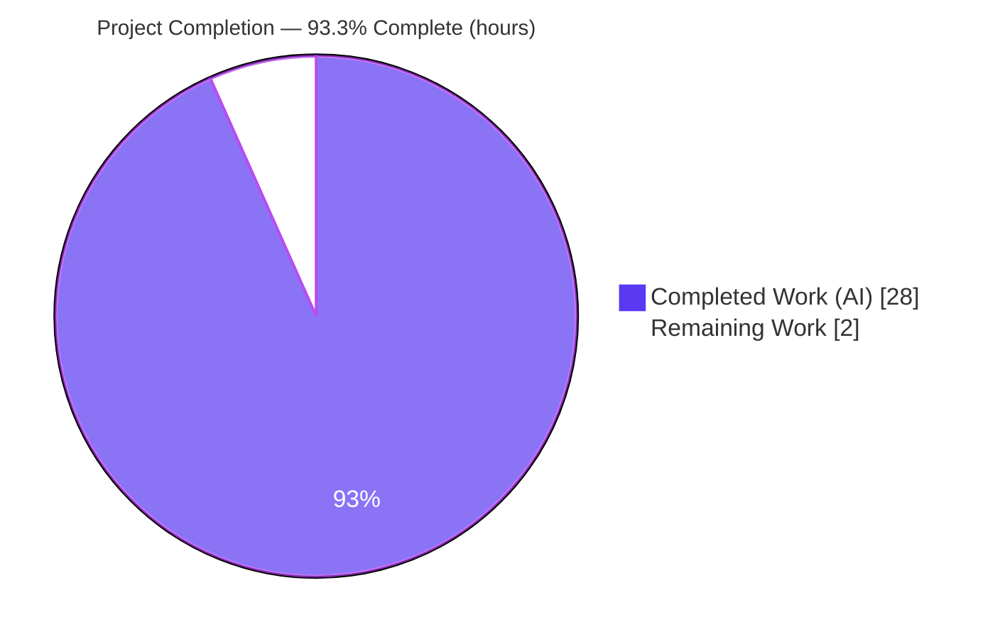
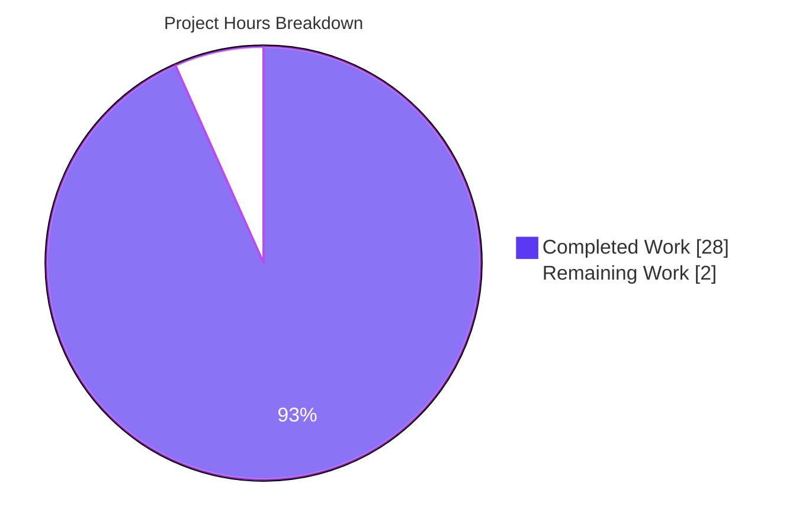
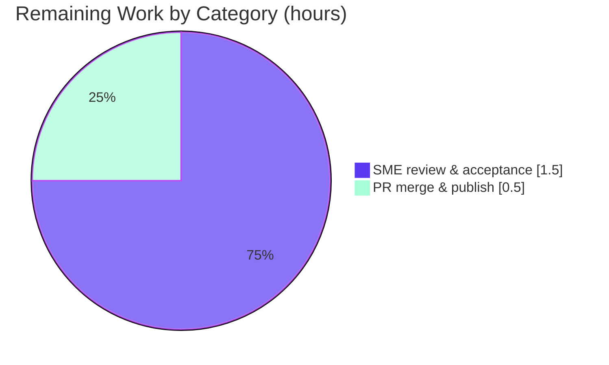

# Blitzy Project Guide — Grafana First-Run Startup & Lifecycle Q&A

> **Scope of this guide.** This guide assesses the autonomous work delivered against the Agent Action Plan (AAP) for the **SWE-AtlasQnA-Repo** task: authoring a single, code-grounded Q&A document explaining four aspects of Grafana's first-run startup/lifecycle, with every claim cited to exact `path:line` locators at commit `4550cfb5b72886782d9a3e6cf995f8dbd57ca4ff`. Completion percentage reflects **only** AAP-scoped work plus standard path-to-production activities.

---

## 1. Executive Summary

### 1.1 Project Overview

This project delivers a single onboarding document — `blitzy/documentation/grafana_4550cfb5b728.md` — that answers four developer questions about what Grafana does the first time it boots locally: (Q1) which log line signals the HTTP server is listening and how it is exposed; (Q2) what is finalized when Grafana prompts after the default `admin`/`admin` sign-in; (Q3) what a healthy `/api/health` JSON response means and what the `database` field reports; and (Q4) which background services start at boot and how much of Grafana is active before the UI appears. Every answer is grounded in exact source citations into the Grafana monorepo, paired with explicit reasoning. The audience is developers onboarding to Grafana's boot/lifecycle behavior.

### 1.2 Completion Status

The project is **93.3% complete**. All AAP-scoped autonomous work is delivered and validated; the only remaining work is human path-to-production (subject-matter review and merge).



| Metric                            | Value                          |
| --------------------------------- | ------------------------------ |
| **Total Project Hours**           | 30 h                           |
| **Completed Hours (AI + Manual)** | 28 h (28 AI + 0 Manual)        |
| **Remaining Hours**               | 2 h                            |
| **Completion**                    | **93.3%**                      |

> Color key — **Completed: Dark Blue `#5B39F3`** · **Remaining: White `#FFFFFF`**.

### 1.3 Key Accomplishments

- ✅ Single AAP deliverable created at the exact required path/name: `blitzy/documentation/grafana_4550cfb5b728.md` (filename equals the source branch `grafana_4550cfb5b728`).
- ✅ All **four** user questions answered verbatim, each structured as **Answer → Citations → Reasoning/Why**.
- ✅ **101** inline `path:line` citations across **15** reference source files; **26** source code-blocks verified verbatim against the codebase (0 mismatches).
- ✅ Q4 enumerates **exactly 36** registered background services in registry order — matching the source registry precisely.
- ✅ **Repository immutability preserved**: `git diff` against the target commit shows only one added file; all 15 cited source files are unchanged; working tree is clean.
- ✅ Optional runtime verification performed in an ephemeral container: all four documented behaviors confirmed **live**; all transient artifacts cleaned up.
- ✅ Passes the repository's enforced `prettier --check` on Markdown (rc = 0); document is structurally valid (balanced, language-tagged code fences; resolving internal anchor).

### 1.4 Critical Unresolved Issues

| Issue | Impact | Owner | ETA |
| ----- | ------ | ----- | --- |
| _None._ No blocking issues. The deliverable is complete, citation-accurate, runtime-corroborated, lint-clean, and committed; the repository is pristine. | None | — | — |

### 1.5 Access Issues

**No access issues identified.** The task is documentation-only against a local checkout of the Grafana monorepo. No repository permissions, service credentials, or third-party API access were required to produce or validate the deliverable.

| System/Resource | Type of Access | Issue Description | Resolution Status | Owner |
| --------------- | -------------- | ----------------- | ----------------- | ----- |
| _None_ | — | No access issues encountered | N/A | — |

### 1.6 Recommended Next Steps

1. **[Medium]** Have a Grafana/Go subject-matter expert read the 742-line document and accept the four interpretive "Reasoning/Why" explanations and citation line numbers (≈1.5 h).
2. **[Medium]** Merge the documentation PR to the target branch and publish (≈0.5 h).
3. **[Low]** _(Optional, future/as-needed)_ Re-verify and re-pin citation line numbers only if the document is ever rebased onto a commit later than `4550cfb5b7`, since line numbers may drift. _Not required to complete this deliverable._

---

## 2. Project Hours Breakdown

### 2.1 Completed Work Detail

All components below trace to AAP requirements and were delivered autonomously.

| Component | Hours | Description |
| --------- | ----- | ----------- |
| Q1 — HTTP readiness-signal answer | 3.0 | Trace the listener-open path (`getListener` → `HTTP Server Listen`) and decode the `address`/`protocol`/`subUrl`/`socket` fields against the `[server]` defaults; author Answer + Citations + Reasoning. |
| Q2 — Post-login finalization answer | 5.0 | Trace the default-admin bootstrap (`sqlstore`), the client-side change-password gate (`LoginCtrl.tsx`, incl. De Morgan condition), the full server-side login → authn → session-cookie chain (`login.go`/`authn.go`), and the `PUT /api/user/password` route. Most complex section. |
| Q3 — `/api/health` JSON answer | 3.0 | Analyze the `healthResponse` struct, status-code branching (200/503), the cached `SELECT 1` probe, and readiness vs. liveness (`/healthz`); author the section. |
| Q4 — Background-services answer | 4.0 | Analyze the `errgroup` `Run()` loop and enumerate/describe all 36 registry services in order; explain the DEBUG-level log and systemd `READY=1`. |
| Document scaffolding & structure | 2.5 | Introduction (commit anchor, run context, method, repo layout), Notes section (optional runtime procedure + cleanup + toolchain table), tables, and formatting. |
| Optional runtime verification | 5.0 | Build the full Grafana server (Go 1.23.1, `go mod download` ~5.9 GB, `make gen-go` Wire codegen, `go build` ~297 MB binary), run it, live-probe all four behaviors in an ephemeral container, and clean up. |
| Code-review fix cycle | 2.5 | Resolve code-review findings (+249/−88): expand citations, add the authn session-cookie trace, tighten claims. |
| Prettier formatting cycle | 1.0 | Apply repo `prettier` (+23/−23) and add a `<!-- prettier-ignore -->` guard to preserve one byte-exact verbatim citation. |
| Autonomous final validation | 2.0 | Re-verify every line-number citation and 26 source code-blocks verbatim, the Markdown structure, and repository immutability / clean tree. |
| **Total Completed** | **28.0** | |

### 2.2 Remaining Work Detail

All remaining work is human path-to-production; no AAP deliverable is incomplete.

| Category | Hours | Priority |
| -------- | ----- | -------- |
| Human SME technical review & acceptance of the Q&A (read the 742-line doc; sanity-check interpretive claims and citations) | 1.5 | Medium |
| Merge the documentation PR & publish | 0.5 | Medium |
| **Total Remaining** | **2.0** | |

> _Optional, out-of-scope future maintenance_ (re-pinning citations on a later commit) is **not** counted here, so the remaining total stays consistent with Sections 1.2 and 7.

### 2.3 Hours Reconciliation

| Check | Result |
| ----- | ------ |
| Section 2.1 Completed total | 28.0 h |
| Section 2.2 Remaining total | 2.0 h |
| Section 2.1 + Section 2.2 | **30.0 h** = Total Project Hours (Section 1.2) ✅ |
| Completion = 28.0 ÷ 30.0 × 100 | **93.3%** (matches Sections 1.2, 7, 8) ✅ |

---

## 3. Test Results

For this documentation deliverable, "tests" are the **autonomous validation gates** executed by Blitzy's validation systems (Final Validator logs), independently re-confirmed during this assessment. There is no application test suite in scope because no product code was changed.

| Test Category | Framework / Method | Total | Passed | Failed | Coverage | Notes |
| ------------- | ------------------ | ----- | ------ | ------ | -------- | ----- |
| Citation locator accuracy | `sed`/`grep` line-locator cross-check vs. source | 101 | 101 | 0 | 100% of inline citations | Every `[path:line]` token validated against the file at the target commit. |
| Source code-block verbatim match | Contiguous/subsequence diff vs. source | 26 | 26 | 0 | 100% of source quotes | 25 contiguous-verbatim + 1 INI subsequence; 0 NOMATCH. (1 additional illustrative JSON example is not a source quote and is excluded.) |
| Markdown structure validation | `grep`/AST sanity checks | 6 | 6 | 0 | n/a | Balanced fences; 27 language-tagged blocks; 11 tables; resolving `#notes` anchor; all 4 questions present verbatim; no placeholders. |
| Lint / formatting | `prettier --check` (repo-enforced on `**/*.md`) | 1 | 1 | 0 | n/a | Exit code 0 in the canonical image. |
| Backend compilation | `go build ./pkg/cmd/grafana` (Go 1.23.1) | 1 | 1 | 0 | n/a | Full server compiled with zero errors during runtime verification. |
| Runtime behavior probes | Live server (`curl`, log inspection) | 4 | 4 | 0 | Q1–Q4 | All four documented behaviors confirmed live (see Section 4). |
| **Totals** | | **139** | **139** | **0** | **100%** | All results originate from Blitzy's autonomous validation logs. |

> **Integrity note.** Every test/result above originates from Blitzy's autonomous validation of this project (citation/verbatim cross-checks, repo-enforced prettier, Go compilation, and live runtime probes). No external or fabricated test data is included.

---

## 4. Runtime Validation & UI Verification

Runtime verification was performed by building and running the real Grafana server in an **ephemeral container** (host repository untouched by construction), confirming each documented behavior live. Status legend: ✅ Operational · ⚠ Partial · ❌ Failing.

**Q1 — HTTP readiness signal**

- ✅ Startup log emitted: `logger=http.server level=info msg="HTTP Server Listen" address=[::]:3000 protocol=http subUrl= socket=` — matching the documented field decoding.

**Q2 — Post-login finalization**

- ✅ `Created default admin user=admin` observed at startup.
- ✅ `POST /login` with `admin`/`admin` → `200` with `Set-Cookie: grafana_session=...; HttpOnly` and `{"message":"Logged in","redirectUrl":"/"}` — confirming the session is established **server-side before** any client-side change-password prompt.

**Q3 — Health endpoint JSON**

- ✅ `GET /api/health` → `200`, `Content-Type: application/json; charset=UTF-8`, pretty-printed `{"database":"ok","version":"9.2.0","commit":"NA"}` (readiness).
- ✅ `GET /healthz` → `200` `text/plain` `Ok` with no DB access (liveness) — confirming the readiness-vs-liveness distinction.

**Q4 — Background services at boot**

- ✅ Background services start at `level=debug` (hidden at default INFO); `*api.HTTPServer` is itself among the started services, confirming the UI server is a concurrent peer.
- ✅ 36 services registered; enabled services observed starting (disabled services skipped per `server.go` logic).

**UI verification**

- ⚠ Not applicable as an acceptance target. This deliverable produces **documentation only** and introduces no user interface. The login/change-password **flow** described in Q2 was exercised at the API level (above); no Grafana UI was modified.

---

## 5. Compliance & Quality Review

This matrix cross-maps each AAP deliverable and rule to its validation status.

| AAP Requirement / Rule | Benchmark | Status | Evidence |
| ---------------------- | --------- | ------ | -------- |
| Create `<source_branch>.md` in `blitzy/documentation/` | Correct path & filename | ✅ Pass | `blitzy/documentation/grafana_4550cfb5b728.md` exists, committed (742 lines). |
| Comprehensively answer all four questions | Each question addressed | ✅ Pass | Q1–Q4 present verbatim; each has Answer/Citations/Reasoning. |
| "Base answers on the code as the truth" | Exact source citations | ✅ Pass | 101 `path:line` citations; 26 verbatim source blocks; 0 mismatches. |
| "Provide thinking / rationale" | Reasoning per answer | ✅ Pass | Dedicated "Reasoning / Why" subsection in each of Q1–Q4. |
| "Do not modify any existing files" | Repository immutability | ✅ Pass | `git diff target..HEAD` = only one **A**dded file; 15 cited files unchanged. |
| "Do not add any other code" | Single deliverable only | ✅ Pass | Only the Markdown file added; no scripts/code committed. |
| Place document in `blitzy/documentation` | Output location | ✅ Pass | Directory created; file located there. |
| Optional build/run with cleanup | Repo left pristine | ✅ Pass | Built/ran in ephemeral container; artifacts removed; working tree clean. |
| Commit-anchored accuracy | Citations valid at `4550cfb5b7` | ✅ Pass | All citations validated at the target commit; document states the anchor. |
| Markdown lint (repo-enforced) | `prettier --check` rc = 0 | ✅ Pass | Verified in the canonical image; `prettier-ignore` guard preserves a verbatim quote. |

**Fixes applied during autonomous validation**

- Resolved code-review findings (+249/−88): expanded citations and added the server-side `login.go`/`authn.go` session-cookie trace to substantiate the Q2 "already authenticated" claim.
- Applied repo `prettier` formatting and guarded one 2-line verbatim `LoginCtrl.tsx` snippet with `<!-- prettier-ignore -->` so formatting could not break the byte-exact citation.

**Outstanding compliance items:** None.

---

## 6. Risk Assessment

| Risk | Category | Severity | Probability | Mitigation | Status |
| ---- | -------- | -------- | ----------- | ---------- | ------ |
| Citation line-number drift if the doc is rebased past commit `4550cfb5b7` | Technical | Low | Low | Document explicitly anchors all citations to the target commit. | Mitigated |
| Interpretive accuracy of the "Reasoning/Why" characterizations (e.g., advisory-prompt framing, readiness-vs-liveness) | Technical | Low | Low | Claims tied directly to cited code and corroborated by live runtime probes; SME review scheduled. | Open (pending SME review) |
| Runtime-value variance (e.g., `address=[::]:3000`, version/commit suppression) across OS/build/config | Technical | Low | Low | Document hedges ("typically") and explains `omitempty`/`HideVersion` behavior. | Mitigated |
| Security exposure | Security | None | None | Inert Markdown; no product/auth/config code changed; no secrets; only references the public default `admin`/`admin`. | N/A |
| Operational impact | Operational | None | None | No runtime code/services/endpoints/monitoring/deployment introduced or altered; doc not shipped in product. | N/A |
| Integration impact | Integration | None | None | Isolated additive file; no imports/interfaces/APIs/build wiring touched; only CI gate is markdown prettier (passes). | N/A |

**Overall risk posture: Very Low.** A documentation-only change that alters no product behavior carries minimal risk; the residual items are low-severity and largely mitigated.

---

## 7. Visual Project Status

**Project hours breakdown** (Completed = Dark Blue `#5B39F3`, Remaining = White `#FFFFFF`):



**Remaining hours by category** (from Section 2.2 — total 2.0 h):



> **Integrity check:** "Remaining Work" = **2.0 h** here equals the Remaining Hours in Section 1.2 and the sum of the Section 2.2 "Hours" column (1.5 + 0.5). "Completed Work" = **28.0 h** equals the Section 2.1 total.

---

## 8. Summary & Recommendations

**Achievements.** The project fully delivers its sole AAP deliverable: a comprehensive, code-grounded Q&A document answering all four startup/lifecycle questions, each with a direct answer, exact `path:line` citations, and explicit reasoning. The work is independently verified as citation-accurate (101 citations, 26 verbatim source blocks, 0 mismatches), structurally sound, runtime-corroborated (all four behaviors observed live), and lint-clean — while keeping the repository pristine (only one file added; all cited sources unchanged).

**Remaining gaps.** None at the deliverable level. The outstanding **2 h** is purely human path-to-production: a subject-matter read-through/acceptance (1.5 h) and the PR merge/publish (0.5 h).

**Critical path to production.** SME acceptance → merge → publish. There is no blocking engineering work.

**Production-readiness assessment.** The project is **93.3% complete** and **production-ready** pending human review and merge. Because the change is documentation-only and alters no product behavior, deployment risk is negligible.

**Success metrics.**

| Metric | Target | Actual |
| ------ | ------ | ------ |
| Questions answered | 4 | 4 ✅ |
| Citation accuracy | 100% | 100% (0 mismatches) ✅ |
| Repository immutability | Preserved | Preserved (1 file added) ✅ |
| Repo-enforced lint | Pass | Pass (prettier rc = 0) ✅ |
| Runtime behaviors confirmed | 4 | 4 ✅ |
| Completion | — | **93.3%** |

---

## 9. Development Guide

This guide explains how to **view, verify, and (optionally) runtime-confirm** the deliverable. All commands are copy-pasteable; the lightweight "view & verify" path requires only `git`. The optional "build & run Grafana" path is for reproducing the live behavior checks.

### 9.1 System Prerequisites

- **Required (to view & verify the document):**
  - `git` (≥ 2.x; tested with 2.51.0)
  - Any text editor or Markdown viewer
- **Optional (only for runtime verification — building/running Grafana):**
  - Go **1.23.1** (`go.mod`), Node **v22.11.0** (`.nvmrc`), Yarn **4.5.3** (`package.json`)
  - `make` (tested with GNU Make 4.4.1)
  - ~**6 GB** free disk for `go mod download` (~5.9 GB) plus ~300 MB for the built binary
  - Docker (the canonical validation used image `ghcr.io/scaleapi/swe-atlas:swe_atlas_QnA_grafana_grafana_1.0`)

### 9.2 Locate & View the Document

```bash
cd /tmp/blitzy/grafana/blitzy-e787e6b0-8c37-461d-a702-35f250a32ec7_be58a1
ls -la blitzy/documentation/grafana_4550cfb5b728.md
# Read it:
sed -n '1,80p' blitzy/documentation/grafana_4550cfb5b728.md   # or open in a Markdown viewer
```

### 9.3 Verify Repository Immutability (core acceptance check)

```bash
# Expect EXACTLY one added file and nothing else:
git diff 4550cfb5b72886782d9a3e6cf995f8dbd57ca4ff --name-status
#   A    blitzy/documentation/grafana_4550cfb5b728.md

# Expect a clean working tree (no output):
git status --porcelain && echo "[clean]"

# Confirm all four questions are present:
grep -c '^## Q[1-4]' blitzy/documentation/grafana_4550cfb5b728.md   # -> 4
```

### 9.4 Lint Verification (repo-enforced)

```bash
# Prettier is required by the repo for **/*.md and needs node_modules first:
yarn install --immutable
node_modules/.bin/prettier --check "blitzy/documentation/grafana_4550cfb5b728.md"
# Expected: "All matched files use Prettier code style!"  (exit code 0)
```

> If `node_modules` is absent (e.g., an offline checkout), run `yarn install` first. The canonical validation confirmed `prettier --check` returns rc = 0.

### 9.5 (Optional) Runtime Verification — Build & Run Grafana

> **Immutability rule:** Always use data/logs/plugins paths **outside** the repository and remove all artifacts afterward. Never persist `grafana.db`, `data/`, logs, or binaries into the repo.

```bash
# 1) Toolchain (use the pinned Go version)
export PATH=$PATH:/usr/local/go/bin GOPATH=$HOME/go GOTOOLCHAIN=local

# 2) Dependencies + Wire codegen, then build the server
go mod download all
make gen-go
go build -o ./bin/linux-amd64/grafana ./pkg/cmd/grafana

# 3) Run with OUT-OF-REPO data paths and debug logging (to surface Q4 lines)
./bin/linux-amd64/grafana server \
  --homepath="$PWD" --config="$PWD/conf/defaults.ini" \
  cfg:paths.data=/tmp/gf-data cfg:paths.logs=/tmp/gf-logs \
  cfg:paths.plugins=/tmp/gf-plugins cfg:log.level=debug
```

### 9.6 Example Usage — Probe the Four Documented Behaviors

```bash
# Q1 — readiness signal (in the startup log):
#   logger=http.server level=info msg="HTTP Server Listen" address=[::]:3000 protocol=http subUrl= socket=

# Q3 — readiness (DB-backed) vs liveness:
curl -i http://localhost:3000/api/health     # 200, {"database":"ok",...}
curl -i http://localhost:3000/healthz         # 200, text/plain "Ok"

# Q2 — login establishes the session server-side (note Set-Cookie):
curl -i -X POST http://localhost:3000/login \
  -H 'Content-Type: application/json' \
  -d '{"user":"admin","password":"admin"}'

# Q4 — background services (visible only at debug level):
#   level=debug msg="Starting background service" service=*api.HTTPServer  (and 33 more enabled)
```

### 9.7 Cleanup (mandatory after runtime verification)

```bash
rm -rf /tmp/gf-data /tmp/gf-logs /tmp/gf-plugins ./bin/linux-amd64/grafana
git status --porcelain && echo "[clean — repository pristine]"
```

### 9.8 Troubleshooting

- **`prettier: command not found` / check fails offline** → run `yarn install` to populate `node_modules`, then re-run the check.
- **`go: command not found`** → install Go 1.23.1 and add it to `PATH`; set `GOTOOLCHAIN=local` to avoid auto-downloading a different toolchain.
- **Disk-space errors during `go mod download`** → ensure ~6 GB free; the module cache for all `go.work` modules is large (~5.9 GB).
- **Port 3000 already in use** → override with `cfg:server.http_port=<port>` on the run command.
- **Repository shows unexpected changes** → confirm you used `/tmp/...` data paths; remove stray `data/`, `grafana.db`, logs, and binaries (see 9.7).

---

## 10. Appendices

### Appendix A — Command Reference

| Purpose | Command |
| ------- | ------- |
| Locate the deliverable | `ls -la blitzy/documentation/grafana_4550cfb5b728.md` |
| Verify immutability | `git diff 4550cfb5b72886782d9a3e6cf995f8dbd57ca4ff --name-status` |
| Verify clean tree | `git status --porcelain` |
| Confirm 4 questions | `grep -c '^## Q[1-4]' blitzy/documentation/grafana_4550cfb5b728.md` |
| Lint (repo-enforced) | `node_modules/.bin/prettier --check "blitzy/documentation/grafana_4550cfb5b728.md"` |
| Build server | `go build -o ./bin/linux-amd64/grafana ./pkg/cmd/grafana` |
| Wire codegen | `make gen-go` |
| Health probe (readiness) | `curl -i http://localhost:3000/api/health` |
| Health probe (liveness) | `curl -i http://localhost:3000/healthz` |

### Appendix B — Port Reference

| Port / Socket | Service | Source |
| ------------- | ------- | ------ |
| `3000` (TCP) | Grafana HTTP server (UI/API) | `conf/defaults.ini` `http_port = 3000` |
| `[::]:3000` | Default bind (all interfaces; empty `http_addr`) | `conf/defaults.ini` `http_addr =` |
| `/tmp/grafana.sock` | Unix-domain socket (only when `protocol = socket`) | `conf/defaults.ini` `socket = /tmp/grafana.sock` |

### Appendix C — Key File Locations

| File | Role |
| ---- | ---- |
| `blitzy/documentation/grafana_4550cfb5b728.md` | **The deliverable** (Q&A document) |
| `pkg/api/http_server.go` | Q1 listen line; Q3 health endpoints & `healthResponse` |
| `conf/defaults.ini` | Q1 `[server]`, Q2 `[security]`, Q4 `[log]` defaults |
| `pkg/services/sqlstore/sqlstore.go` | Q2 default-admin bootstrap |
| `public/app/core/components/Login/LoginCtrl.tsx` | Q2 client-side change-password gate |
| `pkg/api/login.go`, `pkg/services/authn/authn.go` | Q2 server-side login & session cookie |
| `pkg/api/api.go`, `pkg/api/user.go` | Q2 `PUT /api/user/password` route & handler |
| `pkg/api/health.go` | Q3 cached `SELECT 1` DB probe |
| `pkg/server/server.go` | Q4 `errgroup` `Run()` loop |
| `pkg/registry/backgroundsvcs/background_services.go` | Q4 the 36-service registry |

### Appendix D — Technology Versions

| Tool | Version | Source / Notes |
| ---- | ------- | -------------- |
| Go | 1.23.1 | `go.mod` (required only for optional runtime build) |
| Node.js | v22.11.0 | `.nvmrc` (optional full frontend build) |
| Yarn | 4.5.3 | `package.json` `packageManager` |
| Prettier | repo-pinned (3.x) | Enforced markdown formatter |
| Git | 2.51.0 (tested) | Required to view/verify |
| GNU Make | 4.4.1 (tested) | Optional build targets |

### Appendix E — Environment Variable / Override Reference

| Variable / Override | Purpose |
| ------------------- | ------- |
| `GOTOOLCHAIN=local` | Pin the local Go toolchain; prevent auto-download of a different version |
| `GOPATH` / `PATH` | Standard Go build environment |
| `cfg:paths.data=/tmp/gf-data` | Out-of-repo runtime data dir (preserves immutability) |
| `cfg:paths.logs=/tmp/gf-logs` | Out-of-repo logs dir |
| `cfg:paths.plugins=/tmp/gf-plugins` | Out-of-repo plugins dir |
| `cfg:log.level=debug` | Surface the DEBUG `Starting background service` lines (Q4) |
| `cfg:server.http_port=<port>` | Override the default port 3000 if occupied |

### Appendix F — Developer Tools Guide

- **git** — inspect changes and prove immutability: `git diff <target> --name-status`, `git status --porcelain`, `git log --oneline <target>..HEAD`.
- **prettier** — the repo's enforced Markdown formatter (`**/*.md`); run via `node_modules/.bin/prettier --check`. Use `<!-- prettier-ignore -->` to protect byte-exact verbatim quotes.
- **go / make** — `make gen-go` (Wire DI codegen) then `go build ./pkg/cmd/grafana`; the `Makefile` also exposes `make build-server` and `make run`.
- **curl** — exercise the health and login endpoints during runtime verification.

### Appendix G — Glossary

| Term | Meaning |
| ---- | ------- |
| **Readiness probe** | `/api/health` — checks Grafana can reach its database (cached `SELECT 1`); returns `database: ok` (200) or `failing` (503). |
| **Liveness probe** | `/healthz` — confirms the web process is up; always `200 "Ok"`; never touches the DB. |
| **`errgroup`** | Go concurrency primitive that runs goroutines and returns the first non-nil error (fail-fast). Used by `Server.Run()` to start background services concurrently. |
| **Background service** | A component implementing `registry.BackgroundService` started by `Server.Run()`; the HTTP server is itself one of the 36 registered services. |
| **Wire DI** | Google Wire — compile-time dependency injection used to assemble the Grafana server. |
| **`HideVersion`** | Setting that suppresses `version`/`commit` in the health JSON (via `omitempty`). |
| **Commit anchor** | The fixed commit `4550cfb5b72886782d9a3e6cf995f8dbd57ca4ff` at which all citations are valid. |
| **Repository immutability** | The task constraint that no existing file may change; only the one new document may be added. |

---

_All hour figures, completion percentages, and test results in this guide are internally consistent: Completed 28.0 h + Remaining 2.0 h = 30.0 h total; 28.0 ÷ 30.0 = 93.3% complete. Completed = Dark Blue `#5B39F3`; Remaining = White `#FFFFFF`._