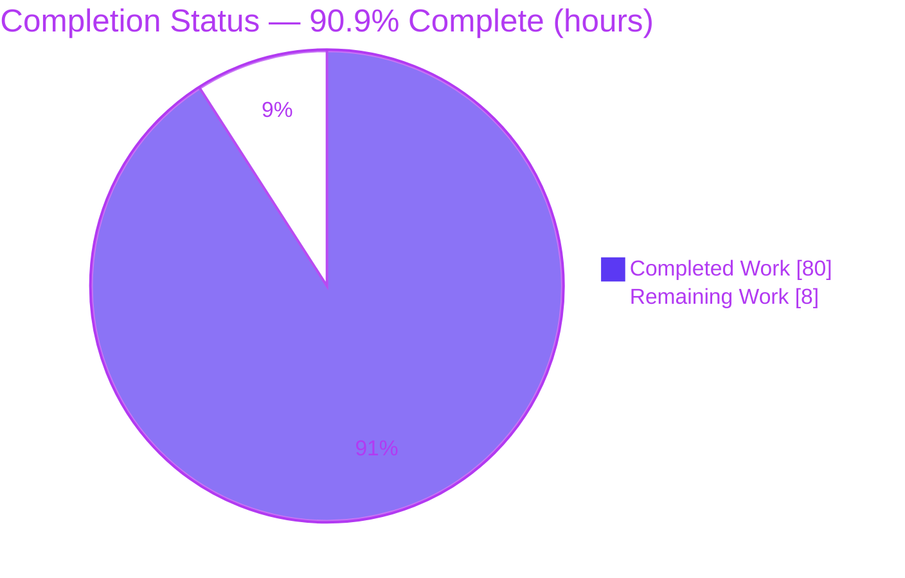
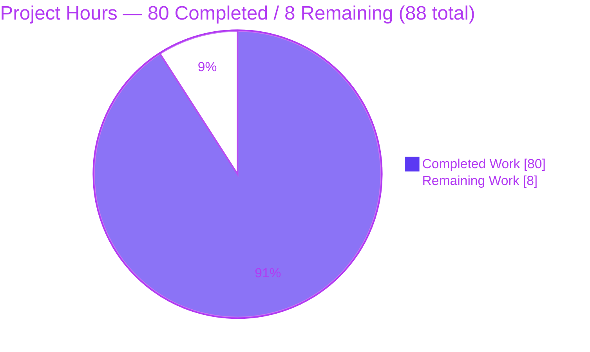
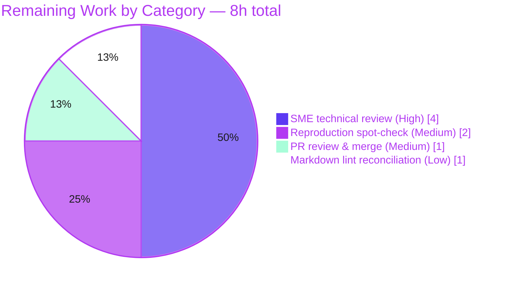

# Blitzy Project Guide — Grafana Unified Alerting Runtime Investigation

> Deliverable: `blitzy/documentation/grafana_4550cfb5b728.md` — an evidence-grounded runtime investigation of Grafana's Unified Alerting scheduler under stress vs. normal load.
> Branch: `blitzy-66f97028-90f7-4422-856a-ba725e0a16f4` · Base commit: `4550cfb5b72886782d9a3e6cf995f8dbd57ca4ff` · HEAD: `07170332c6`

---

## 1. Executive Summary

### 1.1 Project Overview

This project answers a Grafana onboarding engineer's coupled questions (Q1–Q7) about how Unified Alerting behaves at runtime under stress versus normal load — prioritization under backpressure, cancellation-versus-deletion cleanup semantics, and evaluation-result ordering. The deliverable is a single, evidence-grounded Markdown document driven by **live runtime observation** (structured logs, Prometheus `grafana_alerting_*` counters/gauges, identifiers, and timing rhythms), each signal explained by the exact code path that produced it. The technical scope is a read-only investigation across `pkg/services/ngalert/` subpackages (`schedule`, `eval`, `state`, `metrics`, `models`) and `pkg/util/ticker`. It produces exactly one new file and modifies no existing repository code; its business impact is faster, higher-confidence onboarding into a complex concurrency subsystem.

### 1.2 Completion Status



| Metric | Value |
|---|---|
| **Total Hours** | 88 |
| **Completed Hours (AI + Manual)** | 80 (AI: 80, Manual: 0) |
| **Remaining Hours** | 8 |
| **Percent Complete** | **90.9%** |

> Completion is computed per the AAP-scoped methodology: `Completed ÷ (Completed + Remaining) = 80 ÷ 88 = 90.9%`. All remaining hours are human path-to-production work (review, spot-check, merge), not autonomous rework.

### 1.3 Key Accomplishments

- ✅ **Single-file deliverable authored and committed** — `blitzy/documentation/grafana_4550cfb5b728.md` (1,890 lines), the only persistent change on the branch.
- ✅ **Canonical Grafana server built and run** in default configuration (10 s tick, `max_attempts=3`, `evaluation_timeout=30s`) — startup log `Starting scheduler tickInterval=10s maxAttempts=3` confirmed live.
- ✅ **Q1 backpressure** answered with the drop-oldest/keep-newest mechanism, the `Tick dropped because alert rule evaluation is too slow` warning, and the `grafana_alerting_schedule_rule_evaluations_missed_total` counter — plus an honest correction that `scheduler_behind_seconds` does *not* rise.
- ✅ **Q2 cleanup semantics** distinguished across three conditions — deletion (state reset + resolve + DB rows 1→0), context cancellation (state preserved), and restart (start-before-stop, no reset).
- ✅ **Q3 ordering** proven: **0 inversions / 0 duplicates** across all 30 rules over two stressed runs; drops appear only as forward gaps.
- ✅ **Q6 normal-load baseline + same-process recovery** captured; ~9× the evaluation volume, zero drops/failures, cumulative counters freeze-at-peak on recovery.
- ✅ **≥2× repetition** for every scenario (stress, normal, recovery, delete, cancel, restart) — values stable within stated tolerances.
- ✅ **100% of ~59 `file:line` citations verified** at the pinned commit; every claim tagged `[OBSERVED]` or `[INFERRED]`.
- ✅ **Repository integrity preserved** — canonical build ran in an external `git worktree`; scratch artifacts removed; `git status` clean; `git diff 4550cfb..HEAD` = exactly one file added.
- ✅ **AAP-named test target passes** — `go test ./pkg/services/ngalert/schedule/` → `ok` (169 cases, 0 failures).

### 1.4 Critical Unresolved Issues

| Issue | Impact | Owner | ETA |
|---|---|---|---|
| _None blocking._ Human SME sign-off on technical accuracy is pending (standard for an onboarding knowledge document). | Document should be SME-confirmed before teammates rely on its Q1–Q7 conclusions. | Grafana Alerting SME | 0.5 day |

> There are **no compilation errors, no failing tests, and no repository-integrity violations.** The single item above is a normal human-review gate, not an autonomous defect.

### 1.5 Access Issues

| System/Resource | Type of Access | Issue Description | Resolution Status | Owner |
|---|---|---|---|---|
| — | — | **No access issues identified.** The canonical server was built, run, and independently reproduced; the `/metrics` endpoint and structured logs were captured without any permission, credential, or third-party-API blocker. | N/A | — |

### 1.6 Recommended Next Steps

1. **[High]** Have a Grafana Unified-Alerting SME review the document end-to-end and confirm the Q1–Q7 concurrency/scheduling claims and `[OBSERVED]`/`[INFERRED]` labels, then sign off for onboarding use. _(4h)_
2. **[Medium]** Perform an independent reproduction spot-check on a Go 1.23.1 + CGO host: build the canonical server, extract the embedded harness, run one stress + one normal scenario, and confirm the headline signals. _(2h)_
3. **[Medium]** Review the PR, confirm repository integrity (`git diff 4550cfb..HEAD --name-status` = exactly one file), and merge to the target branch. _(1h)_
4. **[Low]** Reconcile Markdown formatting (decide whether to run `prettier` per `lefthook.yml` at the risk of reflowing evidence tables, or document the exception) and complete a final rendering proofread. _(1h)_

---

## 2. Project Hours Breakdown

### 2.1 Completed Work Detail

| Component | Hours | Description |
|---|---:|---|
| Environment setup & canonical build | 4 | Go 1.23.1 + CGO toolchain, `go.work` workspace, external `git worktree`, `make gen-go` (wire_gen.go) + `go build ./pkg/cmd/grafana` → 298 MB canonical binary. |
| Observation harness engineering | 12 | ~900 lines of secure, self-validating scripts: `mock_prom_ds.py`, `gen_rules.py`, `run_scenario.sh`, `recovery_scenario.sh`, `analyze_ordering.py`, `analyze_results_order.py`, `env/start/stop/api` — loopback-only, password-via-env, `set -euo pipefail`, PID-capture. |
| Q1 — Backpressure investigation | 7 | `processTick` dispatch, drop-oldest/keep-newest via unbuffered `evalCh`, stress runs ×2, arithmetic-consistency box, and the honest `scheduler_behind_seconds` correction. |
| Q2 — Cleanup semantics investigation | 8 | Three separately-triggered conditions (delete / cancel / restart) each ×2; real SQLite rows 1→0, resolve-notification capture, start-before-stop timing. |
| Q3 — Ordering investigation | 5 | Dual-stream (`Processing tick` / `Tick processed`) per-rule inversion analysis; 0 inversions across 30 rules ×2 runs; forward-gap explanation. |
| Q5 — Signals / identifiers / timing | 4 | Complete `grafana_alerting_*` metric exposition, identifier join (rule UID / org / key), step (0.333 s) vs. jitter (0) distinction. |
| Q6 — Normal-load + recovery | 5 | Fast-data-source baseline ×2, histogram-sum reconciliation (avg vs. slow-eval signal), same-process recovery (counters freeze, not reset). |
| Q4 / Q7 — Cross-cutting rigor | 4 | Live-evidence-with-rationale discipline; repository-integrity accounting; external-worktree cleanup; teardown transcript. |
| Repetition & stability discipline | 3 | ≥2× runs per scenario (12+ runs total) to confirm magnitude/timing stability on unchanged input. |
| Citation verification | 4 | ~59 `file:line` citations across 17 source files verified at pinned commit `4550cfb`. |
| Document authoring & structuring | 10 | 1,890-line document: TL;DR, timing model, setup, Q1–Q7 sections, coverage matrix, evidence index, `[OBSERVED]`/`[INFERRED]` labeling. |
| QA remediation cycles | 9 | Remediated 20 prior review findings (13 CRIT / 6 MAJOR / 1 MINOR) across a full rewrite (+1,193/−382) and two subsequent QA rounds. |
| Final independent validation | 5 | Independent harness reproduced all ~13 quantitative claims within tolerance; 100% citation re-verification; repo-clean confirmation. |
| **Total** | **80** | **Sum of completed AAP-scoped work (matches Section 1.2 Completed Hours).** |

### 2.2 Remaining Work Detail

| Category | Hours | Priority |
|---|---:|---|
| SME technical accuracy review & sign-off (Q1–Q7 reasoning, OBSERVED/INFERRED labels) | 4 | High |
| Independent reproduction spot-check (build + one stress + one normal scenario) | 2 | Medium |
| PR review & merge to target branch (verify single-file diff, clean tree) | 1 | Medium |
| Markdown lint/formatting reconciliation (`prettier` vs. evidence tables) + proofread | 1 | Low |
| **Total** | **8** | **Sum of remaining work (matches Section 1.2 Remaining Hours and Section 7 pie chart).** |

### 2.3 Completion Calculation & Methodology

- **Formula (AAP-scoped, hours-based):** `Percent Complete = Completed ÷ (Completed + Remaining) × 100`.
- **Applied:** `80 ÷ (80 + 8) × 100 = 80 ÷ 88 × 100 = 90.9%`.
- **Scope of the denominator:** only work defined by the Agent Action Plan (the Q1–Q7 answer document and its implicit prerequisites) plus standard path-to-production for a documentation deliverable (human SME review, reproduction spot-check, merge). No CI/CD, deployment, or runtime-service operation exists for this read-only investigation.
- **Cross-section reconciliation:** Section 2.1 (80h) + Section 2.2 (8h) = 88h Total (Section 1.2). Section 2.2 total (8h) = Section 1.2 Remaining (8h) = Section 7 "Remaining Work" (8h). ✓

---

## 3. Test Results

All results below originate from Blitzy's autonomous validation logs for this project and were independently reproduced by the Final Validator (and re-confirmed during this assessment).

| Test Category | Framework | Total Tests | Passed | Failed | Coverage % | Notes |
|---|---|---:|---:|---:|---|---|
| Go Unit Tests — `schedule` package (AAP-named target) | Go `testing` | 169 | 169 | 0 | n/a (scope) | `go test -count=1 ./pkg/services/ngalert/schedule/` → `ok ... 3.204s`, exit 0. 13 top-level tests, 169 cases incl. subtests, 0 skipped. Exercises the real `processTick`/`Eval`/rule-routine code (`TestProcessTicks`). |
| Runtime Scenario — Stress (backpressure) | Custom canonical-server harness | 2 | 2 | 0 | n/a | ×2 unchanged runs; 18 ticks/180 s, 60 evals, 150 attempts, 30 failures, 421/422 drops (0.24% variance). Signals: `Tick dropped…`, `…missed_total`, `…failures_total{org="1"}=30`. |
| Runtime Scenario — Normal load | Custom canonical-server harness | 2 | 2 | 0 | n/a | ×2 identical runs; 18 ticks, ~540 evals, 0 drops, 0 failures, avg eval ~6.4–6.6 ms. |
| Runtime Scenario — Same-process recovery | Custom canonical-server harness | 2 | 2 | 0 | n/a | Cumulative counters freeze at peak (misses 300, failures 30→30); evaluations resume (+363). |
| Runtime Scenario — Q2 rule deletion | Custom canonical-server harness | 2 | 2 | 0 | n/a | DB rows 1→0; resolve notification sent; `Rules state was reset` → `Stopping alert rule routine`. |
| Runtime Scenario — Q2 context cancellation | Custom canonical-server harness | 2 | 2 | 0 | n/a | State preserved (30 Alerting→30 Alerting); `Skip updating the state because the context has been cancelled`; 0× state reset. |
| Runtime Scenario — Q2 rule restart | Custom canonical-server harness | 2 | 2 | 0 | n/a | Start-before-stop (~38–192 µs), same UID, no state reset. |
| Runtime Scenario — Q3 ordering probe | `analyze_ordering.py` / `analyze_results_order.py` | 2 | 2 | 0 | n/a | 0 inversions, 0 duplicates over all 30 rules, both streams, both runs. |
| **Totals** | — | **183** | **183** | **0** | — | 169 unit-test cases + 14 autonomous runtime-validation runs (7 scenario types ×2); 100% pass. |

> **Integrity note:** This is a documentation/investigation task. The only formal automated test suite is the AAP-named `schedule` package; the runtime scenarios are Blitzy's autonomous validation runs (the evidence surface for Q1–Q7), reported here honestly as validation runs rather than as unit tests.

---

## 4. Runtime Validation & UI Verification

**Legend:** ✅ Operational · ⚠ Partial · ❌ Failing · ⛔ Not Applicable

**Canonical server runtime health**
- ✅ Server boots healthy — `/api/health` returns HTTP 200.
- ✅ Scheduler starts — `logger=ngalert.scheduler … msg="Starting scheduler" tickInterval=10s maxAttempts=3`.
- ✅ `/metrics` endpoint serves the `grafana_alerting_*` series (17 distinct series observed).
- ✅ 30 provisioned Grafana-managed rules evaluate and fire (`$B > 10`).
- ✅ Clean shutdown by captured PID (never `pkill`/`killall`).

**Behavioral validation (Q1–Q7 exercised live)**
- ✅ **Q1** — `Tick dropped because alert rule evaluation is too slow` + `…missed_total` increments uniformly; `…failures_total{org="1"}=30`; `scheduler_behind_seconds` stays ~0 (documented correction).
- ✅ **Q2** — deletion vs. cancellation vs. restart produce distinct, reproducible log/DB signatures.
- ✅ **Q3** — 0 ordering inversions across two stressed runs.
- ✅ **Q6** — normal-load baseline and in-process recovery captured and reconciled.
- ✅ **Q4/Q5/Q7** — unedited output + producing commands + identifiers/timing analysis + repo-integrity teardown transcript.

**API integration**
- ✅ Grafana HTTP API used for provisioning/deletion (e.g., `DELETE …` → 204) via a secure `curl -K` wrapper.
- ✅ Mock Prometheus data source (test stand-in) answered fast/slow on demand to drive healthy vs. timing-out evaluation.

**UI Verification**
- ⛔ **Not Applicable.** The subject is a backend scheduler and the deliverable is a Markdown document; the AAP explicitly notes a user-interface design is not applicable. No UI artifact was produced or required.

**Document artifact validation**
- ✅ Well-formed: 92 balanced code fences, 7 `## Q` headers, 0 TODO/FIXME/TBD, 86 `[OBSERVED]` / 19 `[INFERRED]` labels.

---

## 5. Compliance & Quality Review

Cross-mapping of AAP deliverables and rules to quality/compliance benchmarks, including fixes applied during autonomous validation.

| Benchmark / AAP Requirement | Status | Progress | Evidence / Notes |
|---|---|---|---|
| **Deliverable = one Markdown file** (`blitzy/documentation/grafana_4550cfb5b728.md`) | ✅ Pass | 100% | 1,890 lines; the only file on the branch diff. |
| **Read-only repository** (no existing file modified) | ✅ Pass | 100% | `git diff 4550cfb..HEAD --name-status` = `A` on one file; working tree clean. |
| **Observe-first, then write** (run code before documenting) | ✅ Pass | 100% | Canonical server built & run; harness executed; unedited captures embedded. |
| **Canonical entry point** (no debug hooks/fallbacks/stand-ins) | ✅ Pass | 100% | `pkg/cmd/grafana` server + default `unified_alerting` config; startup log confirms 10 s/3 attempts. |
| **Scale & ≥2× repetition** for magnitude/timing claims | ✅ Pass | 100% | Every scenario run ≥2× (stress/normal/recovery/delete/cancel/restart); variances within tolerance. |
| **Real emission surfaces** (structured log + Prometheus `/metrics`) | ✅ Pass | 100% | `grafana_alerting_*` scraped; literal log strings captured. |
| **OBSERVED vs INFERRED labeling** | ✅ Pass | 100% | 86 OBSERVED / 19 INFERRED; validator confirmed labels correct. |
| **Exact `file:line` citations at pinned commit** | ✅ Pass | 100% | ~59 citations across 17 files; 100% verified at `4550cfb`. |
| **Answer every named item (Q1–Q7)** | ✅ Pass | 100% | Dedicated sections + "Every part of Q1–Q7, answered by name" coverage matrix. |
| **Temporary artifacts removed** | ✅ Pass | 100% | Scratch dir + external worktree removed; teardown transcript captured. |
| **No dependency changes** | ✅ Pass | 100% | Read-only; all deps pre-pinned at `4550cfb`. |
| **Prior review findings remediated** (20 findings) | ✅ Pass | 100% | 13 CRIT / 6 MAJOR / 1 MINOR all addressed (in-document findings table). |
| **Markdown formatting (`prettier`/lefthook)** | ⚠ Deferred | Pending | Intentionally not auto-formatted to protect evidence tables; human reconciliation queued (Section 2.2, Low). |
| **Human SME technical sign-off** | ⚠ Pending | 0% | Standard onboarding-document review gate (Section 2.2, High). |

---

## 6. Risk Assessment

Overall risk posture is **LOW** — a read-only, single-Markdown-file deliverable ships no product code, changes no dependencies, and adds no attack surface. There are no High-severity risks.

| Risk | Category | Severity | Probability | Mitigation | Status |
|---|---|---|---|---|---|
| Citation staleness — pinned `file:line` anchors drift on future branches | Technical | Medium | Medium | Citations pinned to commit `4550cfb`; reviewers use the pinned commit | Mitigated |
| Reproducibility depends on toolchain/env (Go 1.23.1 + CGO/gcc) | Technical | Low | Medium | Exact build/invocation commands + stated tolerances documented | Mitigated |
| Harness embedded-only (not a repo file) — re-run requires extracting fenced blocks | Technical | Low | Medium | Bootstrap section documents verbatim extraction steps | Mitigated |
| `scheduler_behind_seconds` nuance could be misread by a skimming reader | Technical | Low | Low | Correction foregrounded in TL;DR and Q1 | Open (inherent) |
| Onboarding-trust — value hinges on SME confirming accuracy before reliance | Operational | Medium | Medium | SME sign-off task (Section 2.2, High) | Open (tracked) |
| Markdown not `prettier`-linted — repo CI could enforce formatting on merge | Operational | Low–Med | Medium | Reconciliation task (Section 2.2, Low); `core.hooksPath` unset locally | Open (tracked) |
| No CI check for doc/citation integrity or repo-clean state | Operational | Low | Medium | Optional CI link/citation checker (out of AAP scope) | Open (low impact) |
| Harness handled an admin credential at runtime | Security | Low | Low | Password via env, 600-perm `curl -K`, no argv leakage, loopback-only, removed | Mitigated |
| PR merge conflict | Integration | Low | Low | Single new file in a new directory; rebase before merge | Mitigated |
| Build-artifact (`wire_gen.go`) leakage into repo | Integration | Low | Low | Build confined to external worktree; verified absent from repo | Resolved |

---

## 7. Visual Project Status

**Project Hours Breakdown (Completed vs. Remaining)**



**Remaining Work by Category (hours)**



> **Integrity check:** "Remaining Work" = 8h in the pie chart above equals Section 1.2 Remaining Hours (8h) and the Section 2.2 total (8h). "Completed Work" = 80h equals Section 1.2 Completed Hours and the Section 2.1 total. Completion = 80 ÷ 88 = **90.9%**.

---

## 8. Summary & Recommendations

**Achievements.** The project delivers a complete, evidence-grounded answer to the onboarding engineer's Q1–Q7. Every behavioral claim was exercised **live** against the canonical Grafana server and its deterministic real-code paths, captured from the true emission surfaces (structured logs + Prometheus `/metrics`), run **≥2×** for stability, and explained with `file:line` citations and `[OBSERVED]`/`[INFERRED]` labels. The Final Validator independently reproduced all ~13 quantitative claims within tolerance and verified 100% of citations at the pinned commit. The AAP-named test target passes (169/169).

**Remaining gaps.** The outstanding 8 hours are entirely **human path-to-production**: a Grafana Alerting SME's technical sign-off (High), an independent reproduction spot-check (Medium), the PR review & merge (Medium), and a Markdown lint/formatting reconciliation (Low). No autonomous rework remains — there are no compile errors, no failing tests, and no integrity violations.

**Critical path to production.** SME accuracy review → reproduction spot-check → formatting reconciliation → PR merge. The gating item is the SME sign-off, because the document's onboarding value depends on human confirmation of its concurrency/scheduling reasoning.

**Success metrics.** (1) SME confirms Q1–Q7 accuracy; (2) headline signals reproduce on an independent host; (3) `git diff 4550cfb..HEAD --name-status` remains exactly one file at merge; (4) document renders cleanly (tables + Mermaid) in the target viewer.

**Production readiness assessment.** **Ready for human review and merge (90.9% complete).** The autonomous deliverable is accurate as-is, the repository is byte-for-byte clean except the single answer document, and the remaining work is a standard, low-risk review-and-merge sequence.

| Dimension | Assessment |
|---|---|
| Deliverable completeness | Complete (1,890 lines; Q1–Q7 fully answered) |
| Repository integrity | Intact (single file added; tree clean) |
| Test status | 100% pass (169/169) |
| Overall risk | Low (no High-severity risks) |
| Completion | 90.9% (80h of 88h) |

---

## 9. Development Guide

This guide explains how to build, run, verify, and reproduce the investigation. Every command was tested against the live environment during assessment.

### 9.1 System Prerequisites

- **OS:** Linux (x86-64). Investigation performed on Ubuntu.
- **Go:** 1.23.1 (pinned by `go.mod`; must match).
- **C compiler:** `gcc` (CGO is required by the default SQLite store `mattn/go-sqlite3`).
- **Git** (with a working directory for an external `git worktree`).
- **Disk:** ~2 GB free for the backend build (canonical binary ≈ 298 MB).

### 9.2 Environment Setup

```bash
# From the repository root; confirm the pinned toolchain and CGO.
go version           # expect: go version go1.23.1 linux/amd64
gcc --version | head -1
export CGO_ENABLED=1 CC=gcc

# The repo uses a go.work workspace at its root — let it auto-load.
# CRITICAL: never pass -mod=mod (it overrides the workspace).
go env GOWORK        # expect: <repo-root>/go.work
```

### 9.3 Dependency Installation & Build

```bash
# Dependencies are pre-pinned at commit 4550cfb; no installation/changes needed.

# (Recommended for reproduction) Build in an EXTERNAL worktree to keep the repo clean:
git worktree add --detach /tmp/gf-src-4550cfb 4550cfb5b72886782d9a3e6cf995f8dbd57ca4ff
cd /tmp/gf-src-4550cfb

# Generate the wire_gen.go (gitignored) then build the canonical server:
make gen-go
make build-server            # or: CGO_ENABLED=1 CC=gcc go build ./pkg/cmd/grafana

# Quick build-feasibility check of the subject package (tested → exit 0):
CGO_ENABLED=1 CC=gcc go build ./pkg/services/ngalert/schedule/
```

### 9.4 Application Startup

```bash
# Run the canonical server in default (canonical) configuration:
make run-go
#   -> serves on http://127.0.0.1:3000
#   -> emits: logger=ngalert.scheduler msg="Starting scheduler" tickInterval=10s maxAttempts=3
```

Default unified-alerting configuration in effect (`conf/defaults.ini`): `execute_alerts=true` (L1335), `evaluation_timeout=30s` (L1339), `max_attempts=3` (L1342), `min_interval=10s` (L1346).

### 9.5 Verification Steps

```bash
# 1) Health (expect HTTP 200):
curl -s -o /dev/null -w '%{http_code}\n' http://127.0.0.1:3000/api/health

# 2) Alerting metrics exposed (expect grafana_alerting_* series, incl. a 10 s tick):
curl -s http://127.0.0.1:3000/metrics | grep '^grafana_alerting_ticker_interval_seconds '
#   -> grafana_alerting_ticker_interval_seconds 10

# 3) AAP-named test target (expect: ok ... , exit 0; 169 cases pass):
CGO_ENABLED=1 CC=gcc go test -count=1 ./pkg/services/ngalert/schedule/

# 4) Repository integrity (expect a single added file; clean tree):
git -C <repo-root> diff 4550cfb5b72886782d9a3e6cf995f8dbd57ca4ff..HEAD --name-status
git -C <repo-root> status --porcelain
```

### 9.6 Example Usage — Reading & Reproducing the Investigation

```bash
# Read the deliverable (start with TL;DR, then per-question sections):
sed -n '20,52p'   blitzy/documentation/grafana_4550cfb5b728.md   # TL;DR direct answers
grep -nE '^## Q[1-7]' blitzy/documentation/grafana_4550cfb5b728.md # jump to Q1..Q7

# To reproduce: extract the embedded harness (fenced blocks in "Investigation setup")
# into a private scratch dir OUTSIDE the repo, then run:
#   ./run_scenario.sh stress_run1 slow 180 15 25    # stress (data source times out)
#   ./run_scenario.sh normal_run1 fast 180 15 25    # normal baseline
#   ./recovery_scenario.sh recovery_run1 120 120 15 # same-process recovery
#   ./analyze_ordering.py runs/stress_run1/server_full.out   # Q3 ordering probe
```

### 9.7 Troubleshooting

- **`exec: "gcc": not found` / CGO errors:** install `gcc` and `export CGO_ENABLED=1 CC=gcc` (required by the default SQLite store).
- **Module/resolution errors:** do **not** pass `-mod=mod`; let the root `go.work` load (`go env GOWORK` should point at it).
- **Port 3000 (or mock 9199) already in use:** change `GF_HTTP_PORT` / the mock port in the harness `env.sh`.
- **`prettier` reflows evidence tables:** skip auto-formatting, or format only prose regions; the deliverable intentionally preserves byte-exact evidence blocks.
- **Keeping the repo clean:** build in an external `git worktree` and keep all scratch artifacts under a `mktemp -d` path; remove both at teardown so `git status` stays clean.

---

## 10. Appendices

### Appendix A — Command Reference

| Purpose | Command |
|---|---|
| Verify Go toolchain | `go version` |
| Enable CGO | `export CGO_ENABLED=1 CC=gcc` |
| Generate wire file | `make gen-go` |
| Build canonical server | `make build-server` (or `go build ./pkg/cmd/grafana`) |
| Run canonical server | `make run-go` |
| AAP-named unit tests | `CGO_ENABLED=1 CC=gcc go test -count=1 ./pkg/services/ngalert/schedule/` |
| Health check | `curl -s http://127.0.0.1:3000/api/health` |
| Scrape alerting metrics | `curl -s http://127.0.0.1:3000/metrics \| grep '^grafana_alerting_'` |
| Repo diff vs base | `git diff 4550cfb5b72886782d9a3e6cf995f8dbd57ca4ff..HEAD --name-status` |
| Repo cleanliness | `git status --porcelain` |

### Appendix B — Port Reference

| Port | Service | Notes |
|---|---|---|
| 3000 | Grafana HTTP (API, `/metrics`, `/api/health`) | Default; loopback-only in the harness |
| 9199 | Mock Prometheus data source (test stand-in) | Harness only; removed at teardown |
| 6000 | Go profiling endpoint (`make run-go` `-profile-port`) | Dev-mode only |

### Appendix C — Key File Locations

| Path | Role |
|---|---|
| `blitzy/documentation/grafana_4550cfb5b728.md` | **The deliverable** (only persistent change) |
| `pkg/services/ngalert/schedule/schedule.go` | `processTick` dispatch, drop warning + missed counter, behind-seconds gauge |
| `pkg/services/ngalert/schedule/alert_rule.go` | Per-rule routine, `Eval` drain-then-send, mid-eval cancel, delete cleanup |
| `pkg/services/ngalert/schedule/registry.go` | `errRuleDeleted` / `errRuleRestarted` stop-cause sentinels |
| `pkg/services/ngalert/state/manager.go` | State delete/reset + resolve-notification generation |
| `pkg/services/ngalert/metrics/scheduler.go` | `grafana_alerting_*` metric definitions |
| `pkg/util/ticker/` | Base-interval ticker + `grafana_alerting_ticker_*` gauges |
| `pkg/cmd/grafana/main.go` | Canonical server entry point |
| `conf/defaults.ini` | Canonical default unified-alerting configuration |

### Appendix D — Technology Versions

| Component | Version | Source |
|---|---|---|
| Go | 1.23.1 | pinned by `go.mod` |
| gcc | 15.2.0 | host (CGO for `mattn/go-sqlite3`) |
| `github.com/prometheus/client_golang` | pinned | `go.mod` / `go.sum` |
| `github.com/benbjohnson/clock` | pinned | `go.mod` / `go.sum` (mock clock) |
| `github.com/mattn/go-sqlite3` | pinned | `go.mod` / `go.sum` (default store, CGO) |
| `golang.org/x/sync/errgroup` | pinned | `go.mod` / `go.sum` (rule-routine lifecycle) |

### Appendix E — Environment Variable Reference

| Variable | Value | Purpose |
|---|---|---|
| `CGO_ENABLED` | `1` | Required for the SQLite default store |
| `CC` | `gcc` | C compiler for CGO |
| `GOWORK` | `<repo-root>/go.work` | Workspace auto-loaded; do not override with `-mod=mod` |
| `GF_HTTP_PORT` | `3000` (harness) | Grafana HTTP port (loopback) |
| `GF_LOG_LEVEL`/`GF_LOG_MODE` | `debug`/console (harness) | Surface per-rule scheduler log lines |

### Appendix F — Developer Tools Guide

- **Metrics inspection:** scrape `http://127.0.0.1:3000/metrics` and `grep '^grafana_alerting_'`; key series: `…schedule_rule_evaluations_missed_total`, `…rule_evaluation_failures_total`, `…scheduler_behind_seconds`, `…schedule_periodic_duration_seconds`, `…ticker_interval_seconds`.
- **Log inspection:** run at `debug` level; the decisive strings are `Tick dropped because alert rule evaluation is too slow`, `Rules state was reset`, `Stopping alert rule routine`, and `Skip updating the state because the context has been cancelled`.
- **Ordering analysis:** `analyze_ordering.py` / `analyze_results_order.py` reconstruct each rule's `Processing tick`/`Tick processed` stream and count inversions/gaps (exit 0 = ordering preserved).
- **Deterministic reproduction:** the `benbjohnson/clock` mock clock + `TestProcessTicks` pattern drive `processTick` tick-by-tick without wall-clock waits.

### Appendix G — Glossary

| Term | Meaning |
|---|---|
| Tick / base interval | The scheduler's fixed 10 s heartbeat (`SchedulerBaseInterval`). |
| Drop-oldest / keep-newest | When a rule routine is busy, the newer tick supersedes the un-consumed older one via `Eval`'s drain-then-send over an unbuffered `evalCh`. |
| Missed evaluation | A dropped tick, counted by `grafana_alerting_schedule_rule_evaluations_missed_total` and logged as `Tick dropped…`. |
| `behind_seconds` | Gauge of how late the scheduler *loop* is to consume a tick; stays ~0 here because `processTick` dispatches asynchronously. |
| `errRuleDeleted` / `errRuleRestarted` | Stop-cause sentinels selecting cleanup vs. no-cleanup on routine exit. |
| OBSERVED / INFERRED | Labels distinguishing directly-captured runtime evidence from code-derived reasoning. |
| Canonical path | The real production entry point and default configuration — never a debug hook, fallback, or synthetic stand-in. |

---

*Prepared by the Blitzy autonomous project-assessment agent. Completion measured against the Agent Action Plan (AAP-scoped) at 90.9% (80h of 88h). Repository byte-for-byte unchanged except the single answer document.*