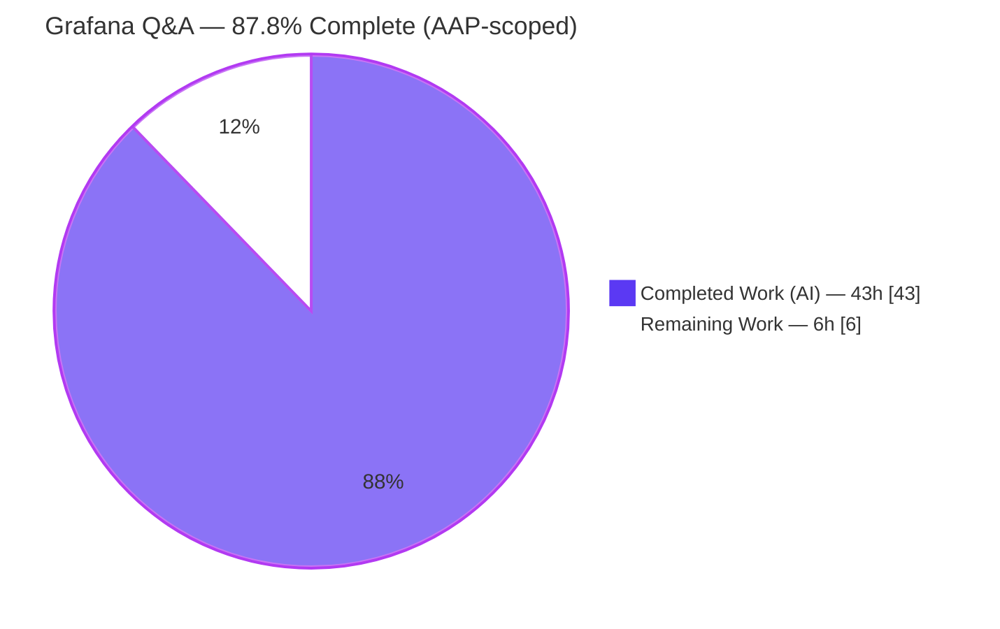
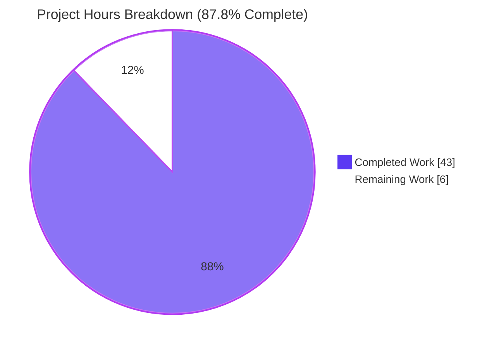
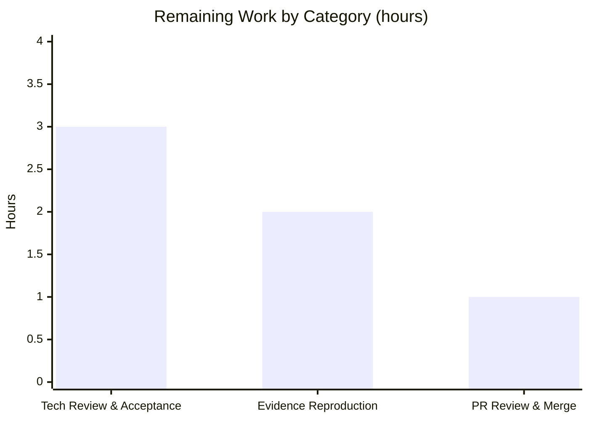

# Blitzy Project Guide — Grafana Runtime-Behavior Q&A (`grafana_4550cfb5b728`)

> **Engagement type:** Documentation-only, read-only investigative Q&A (rule set: **SWE-AtlasQnA-Repo**)
> **Repository:** Grafana (Go backend + TypeScript/React frontend) · product version `11.5.0-pre`
> **Source HEAD:** `4550cfb5b72886782d9a3e6cf995f8dbd57ca4ff` ("Upgrade scenes to v5.32.0")
> **Sole deliverable:** `blitzy/documentation/grafana_4550cfb5b728.md`
> **Brand colors:** Completed / AI Work = Dark Blue `#5B39F3` · Remaining = White `#FFFFFF` · Headings/Accents = Violet-Black `#B23AF2` · Highlight = Mint `#A8FDD9`

---

## 1. Executive Summary

### 1.1 Project Overview

This engagement is a read-only, runtime-grounded investigation of the Grafana observability platform (Go backend + TypeScript/React frontend, `v11.5.0-pre`). Governed by the "SWE-AtlasQnA-Repo" build-and-run-first rule set, it answers five runtime-behavior questions (O1–O5) — idle recurring logs, database-migration confirmation, the API-reported version string, dashboard-scene datasource-picker resolution, and alerting rule-edit query-state population — each backed by **captured evidence** (log lines, HTTP responses, Jest output) and `file:line` citations. The single deliverable is one Markdown answer document; no Grafana source, configuration, or tests are modified. The target audience is the requesting engineer/SME who needs authoritative, evidence-backed answers about Grafana's runtime behavior.

### 1.2 Completion Status

**AAP-scoped completion: `87.8%`** (43 h completed of 49 h total; 6 h remaining). Calculated via PA1 hours methodology over AAP-scoped + path-to-production work only.



| Metric | Value |
| --- | --- |
| **Total Hours** | **49** |
| **Completed Hours (AI + Manual)** | **43** (AI 43 + Manual 0) |
| **Remaining Hours** | **6** |
| **Percent Complete** | **87.8%** |

> Color key — Completed slice = Dark Blue `#5B39F3`; Remaining slice = White `#FFFFFF` (outlined in Violet-Black `#B23AF2` for visibility).

### 1.3 Key Accomplishments

- ✅ **Single deliverable authored and committed** — `blitzy/documentation/grafana_4550cfb5b728.md` (3,830 lines / 431 KB), the only change in the repository.
- ✅ **Canonical, ldflags-stamped Grafana backend built** and run against the unmodified `conf/defaults.ini`; the binary reports the stamped product version `11.5.0-pre`.
- ✅ **All five objectives answered from real runtime evidence** — O1 idle logs (info + debug, ≥22 min, 2 runs), O2 migration boundary (fresh vs restart), O3 API version (canonical + non-canonical contrast), O4 & O5 via Jest+RTL tests.
- ✅ **4/4 autonomous frontend tests pass** — O4 2/2, O5 2/2; the O5 outgoing POST body deep-equals the backend rule definition.
- ✅ **~65+ `file:line` citations byte-verified** against the unchanged source (zero drift); observed-vs-`[INFERRED]` labeling applied throughout.
- ✅ **Read-only scope preserved** — `git status --porcelain` is empty except the one new file; both throwaway tests deleted; build artifacts are git-ignored.
- ✅ **Evidence integrity confirmed** — complete unedited output embedded (including the 29,748-byte settings body); markdown prettier-clean; embedded API body verified free of secrets.

### 1.4 Critical Unresolved Issues

| Issue | Impact | Owner | ETA |
| --- | --- | --- | --- |
| _None — no blocking issues_ | The AAP deliverable is complete, committed, and validated; build succeeds and all in-scope tests pass. No item blocks release or validation. | — | — |
| (Advisory, non-blocking) Build reproduction requires host Go 1.23.1 | The mandated Docker image ships no Go toolchain; reproduction uses host Go (== `go.mod` pin). Does not affect answer correctness. | Reviewer | Within HT-2 (2 h) |
| (Advisory, non-blocking) Point-in-time answers | O1/O2/O3 values are pinned to source HEAD `4550cfb5b728` / `v11.5.0-pre`; they will drift on future Grafana upgrades (by design). | Reviewer | N/A |

### 1.5 Access Issues

| System/Resource | Type of Access | Issue Description | Resolution Status | Owner |
| --- | --- | --- | --- | --- |
| Mandated Docker image (`swe-atlas:...grafana_1.0`) | Build toolchain | Image is Debian 12 with **no Go toolchain** (`go: NOT-FOUND`), so the canonical backend could not be compiled inside it. | **Resolved** — canonical build performed with host **Go 1.23.1** (byte-for-byte the `go.mod:3` pin); documented as an explicit deviation. | Blitzy (done) |
| Grafana `/api/frontend/settings` | Service credentials | Endpoint requires authentication in the default config (anonymous → 401). | **Resolved** — queried with default `admin` credentials via `curl --netrc-file` (kept out of the process list). | Blitzy (done) |
| Repository / target branch | Merge permission | Merging the deliverable requires human write access to the target branch. | **Open** — standard PR merge, human-gated. | Reviewer |

> No repository-permission or third-party API access issues prevented autonomous build validation; the two build/credential items above were resolved during the engagement.

### 1.6 Recommended Next Steps

1. **[High]** Technical SME review & acceptance of the five Q&A answers (O1–O5) and their embedded evidence — confirm each answer fully addresses the original question and sanity-check the observed-vs-`[INFERRED]` labels. (~3 h)
2. **[Medium]** Independently reproduce a subset of the runtime evidence — `source /etc/profile.d/go.sh` → canonical `build-backend` → run → `curl /api/health` (expect `11.5.0-pre`), and/or re-run the embedded O4/O5 tests. (~2 h)
3. **[Medium]** Review the single-file diff, confirm read-only scope (`git status` clean), then approve and merge the PR. (~1 h)

---

## 2. Project Hours Breakdown

### 2.1 Completed Work Detail

All completed work was performed autonomously by Blitzy agents (AI) and traces to a specific AAP requirement.

| Component | Hours | Description |
| --- | --- | --- |
| Canonical build & run harness `[AAP-H1/H2]` | 5.0 | Wire DI codegen (`pkg/server/wire_gen.go`) + `CGO_ENABLED=1 go run build.go build-backend` (ldflags-stamped `main.version=11.5.0-pre`); run `grafana server` against unmodified `conf/defaults.ini` with loopback + PID-captured harness. |
| O1 — Idle recurring logs `[AAP-O1]` | 5.0 | Two ≥22-min `info` runs + `debug` runs; `python3`-measured cadence (~600 s cleanup + `plugins.update.checker`); zero-request proof; honest 60 s negative result; background-service code identification. |
| O2 — Database migration check `[AAP-O2]` | 3.5 | Fresh-vs-restart boundary capture (`performed=626/18` → `performed=0 skipped=626/18`); 644 debug skip lines; migrator code identification. |
| O3 — Build/version via API `[AAP-O3]` | 3.5 | Canonical + non-canonical build; `GET /api/health` (200) and authenticated `GET /api/frontend/settings`; anonymous 401; build-time stamping chain identification. |
| O4 — Datasource picker test `[AAP-O4]` | 4.5 | Authored Jest+RTL test rendering the real `PanelDataQueriesTab`; asserted picker resolves to `testDs1`; captured PASS 2/2; deleted the test; code identification. |
| O5 — Rule-edit query-state test `[AAP-O5]` | 5.5 | Authored Jest+RTL test rendering the real edit route (`ExistingRuleEditor → AlertRuleForm`); captured outgoing POST body deep-equal to backend `ga.data`; PASS 2/2; deleted the test; code identification. |
| Answer document authoring `[AAP-D1]` | 9.0 | Assembled the 3,830-line deliverable: per-objective sections, ~65+ `file:line` citations, observed-vs-`[INFERRED]` labels, coverage & rule-directive tables, methodology preamble. |
| QA / validation / evidence-integrity refinement `[AAP-M1..M6]` | 7.0 | Seven iterative QA commits: citation byte-verification, evidence-integrity fixes, O3 build-metadata alignment, O1 grep fidelity, markdown well-formedness, prettier, read-only/cleanup verification. |
| **Total Completed** | **43.0** | Matches Completed Hours in Section 1.2. |

### 2.2 Remaining Work Detail

All remaining work is human path-to-production; there are **no** outstanding AAP implementation items, compilation errors, or failing tests.

| Category | Hours | Priority |
| --- | --- | --- |
| Technical Review & Acceptance — SME reads and accepts the O1–O5 answers + evidence | 3.0 | High |
| Evidence Reproduction & Verification — rebuild canonically, re-run O3 API check and/or O4/O5 tests, spot-verify citations | 2.0 | Medium |
| PR Review & Merge — review the single-file diff, confirm read-only scope, approve & merge | 1.0 | Medium |
| **Total Remaining** | **6.0** | Matches Remaining Hours in Section 1.2 and the Section 7 pie. |

### 2.3 Total Project Hours & Cross-Section Reconciliation

| Quantity | Hours | Integrity Rule |
| --- | --- | --- |
| Section 2.1 — Completed | 43.0 | = Section 1.2 Completed |
| Section 2.2 — Remaining | 6.0 | = Section 1.2 Remaining = Section 7 "Remaining Work" |
| **Total (2.1 + 2.2)** | **49.0** | = Section 1.2 Total (Rule 2) |
| Completion % = 43 / 49 | **87.8%** | Used identically in Sections 1.2, 7, 8 |

---

## 3. Test Results

All tests below originate from **Blitzy's autonomous validation logs** for this engagement. As a read-only documentation engagement, the only in-scope tests are the two throwaway frontend evidence-capture tests (O4, O5); the existing Grafana suite is out of scope and was neither run nor modified. Both throwaway tests were **deleted after capture** per the read-only directive — their full source and output are preserved verbatim inside the deliverable for reproducibility.

| Test Category | Framework | Total Tests | Passed | Failed | Coverage % | Notes |
| --- | --- | --- | --- | --- | --- | --- |
| UI / Component — O4 datasource picker | Jest + React Testing Library | 2 | 2 | 0 | N/A¹ | Renders real `PanelDataQueriesTab`; picker displays `testDs1`; `Time: 4.104 s`. |
| UI / Component — O5 rule-edit query state | Jest + React Testing Library | 2 | 2 | 0 | N/A¹ | Renders real edit route; captured POST body deep-equals backend `ga.data`; `Time: 10.891 s`. |
| **Total** | — | **4** | **4** | **0** | — | **100% pass rate** |

¹ Coverage is not applicable: these are targeted evidence-capture assertions (boundary before/after state), not coverage-oriented suites. Test-suite results: O4 `Test Suites: 1 passed, 1 total` / `Tests: 2 passed, 2 total`; O5 `Test Suites: 1 passed, 1 total` / `Tests: 2 passed, 2 total`. The six `jest-haste-map: duplicate manual mock` warnings are pre-existing repository stderr notices (not `console.*`) and do not affect pass/fail.

---

## 4. Runtime Validation & UI Verification

Backend runtime validation was performed against a canonically built binary run on unmodified `conf/defaults.ini` (loopback, PID-captured harness). UI verification was performed via React Testing Library render assertions (jsdom) against the real components — not a live browser session.

**Backend / API runtime**

- ✅ **Operational** — Canonical backend build (wire codegen + `CGO_ENABLED=1 build-backend`); binary reports `grafana version 11.5.0-pre`.
- ✅ **Operational** — Server startup against unmodified `conf/defaults.ini`.
- ✅ **Operational** — `GET /api/health` → `200` `{"database":"ok","version":"11.5.0-pre","commit":"f3d1ae504a"}`.
- ✅ **Operational** — `GET /api/frontend/settings` (authenticated) → `200`; `buildInfo.version = 11.5.0-pre`, `versionString = "Grafana v11.5.0-pre (f3d1ae504a)"` (29,748-byte body captured).
- ✅ **Operational** — `GET /api/frontend/settings` (anonymous) → `401 Unauthorized` (expected default-config auth behavior; not a defect).
- ✅ **Operational** — DB migrator: restart on existing DB → `migrations completed performed=0 skipped=626` (+ `resource-migrator performed=0 skipped=18`).
- ✅ **Operational** — Idle background-service logs recur as documented (`cleanup` + `plugins.update.checker` ~600 s at INFO; `ngalert.scheduler` ~10 s + five 60 s emitters at DEBUG).

**UI verification (component-level, RTL/jsdom)**

- ✅ **Operational** — O4: `PanelDataQueriesTab` renders and the datasource picker displays the panel-query datasource (`testDs1`); scene model transitions from `undefined` → resolved.
- ✅ **Operational** — O5: the real edit-route form renders and its query state is populated from the backend rule; the save POST carries `grafana_alert.data` deep-equal to the backend definition (`condition:"A"`, `refId:"A"`, `queryType:"alerting"`, `relativeTimeRange:{from:1000,to:2000}`, `model.expression:"vector(1)"`).
- ⚠ **Partial (by design)** — No live-browser screenshots were captured; UI evidence is via RTL render assertions, which is the canonical, appropriate harness for these component behaviors and satisfies the AAP's "test-script output" requirement for O4/O5.

---

## 5. Compliance & Quality Review

Cross-map of AAP deliverables and the SWE-AtlasQnA-Repo rule set to their verification status. Fixes applied during autonomous validation are noted.

| Benchmark / Rule Directive | Status | Progress | Evidence / Notes |
| --- | --- | --- | --- |
| Deliverable named `<source_branch>.md` in `blitzy/documentation/` | ✅ Pass | 100% | `blitzy/documentation/grafana_4550cfb5b728.md` created. |
| Run-first methodology (write from observed output) | ✅ Pass | 100% | Build → run → capture precedes every section. |
| Timing/frequency: run long enough + ≥2 runs; state duration | ✅ Pass | 100% | O1 ran >22 min at info + debug; cadence confirmed across 2 info runs. |
| Real canonical entry point; no mocks/fallbacks; label non-canonical | ✅ Pass | 100% | Real `grafana server`/endpoints/components; `9.2.0` labelled non-canonical. |
| Version stamped via default canonical build; state build+run commands | ✅ Pass | 100% | ldflag build → `11.5.0-pre`; exact wire+build+run commands recorded. |
| Complete, unedited output with producing command; no elision | ✅ Pass | 100% | Full logs/JSON/Jest embedded (large bodies in `<details>`). |
| Exact `file:line` citations; named functions/structs | ✅ Pass | 100% | ~65+ citations byte-verified; `apiHealthHandler`, `rulerRuleToFormValues`, `loadDataSource`, etc. |
| Answer every part + every named item; coverage pass | ✅ Pass | 100% | O1–O5 coverage table + named-item checklist. |
| Observed-vs-inferred labeling | ✅ Pass | 100% | Only the 24 h `grafana.update.checker` period is `[INFERRED]` (labelled). |
| Read-only scope; add only the answer doc; remove temp scripts | ✅ Pass | 100% | `git status` clean except one file; both throwaway tests deleted. |
| Markdown well-formedness | ✅ Pass | 100% | 84 fence toggles → depth 0; 7 balanced `<details>` pairs; consistent tables. |
| Code style (prettier) | ✅ Pass | 100% | Prettier applied (33 cosmetic lines, 0 inside code fences). |
| Security — no secret leakage in embedded output | ✅ Pass | 100% | Verified `apiKey`/`rudderstackWriteKey`/`publicDashboardAccessToken` all empty. |

**Fixes applied during autonomous validation:** (1) O3 build-metadata alignment (stale commit `efc14a8261` → `f3d1ae504a` + buildstamp/package-iteration tokens); (2) O1 grep-pattern fidelity tightened to reproduce the documented emitter/line counts; (3) prettier normalization to zero lint violations. **Outstanding compliance items:** none.

---

## 6. Risk Assessment

Overall posture: **Low** — the expected profile for a complete, validated, read-only documentation deliverable that introduces no code, authentication, or data-handling.

| Risk | Category | Severity | Probability | Mitigation | Status |
| --- | --- | --- | --- | --- | --- |
| Build reproduction requires host Go (image lacks Go toolchain) | Technical | Low | Medium | Deviation documented with exact commands; host Go 1.23.1 == `go.mod:3` pin (byte-for-byte). | Mitigated |
| O3 `commit`/`buildstamp` reflect build-time HEAD (`f3d1ae504a`), not source HEAD | Technical | Low | Medium | `commit` labelled build-time metadata; the answer `version 11.5.0-pre` is branch-invariant (`package.json:6`). | Mitigated |
| O1 24 h `grafana.update.checker` period not observed at runtime | Technical | Low | Low | Explicitly labelled `[INFERRED]`; all other emitters observed. | Accepted (labelled) |
| Idle cadence is a point-in-time capture (hardware/config dependent) | Technical | Low | Low | Confirmed stable across 2 info runs with sub-second jitter. | Mitigated |
| Embedded `/api/frontend/settings` body could leak secrets | Security | Low | Low | Verified all credential fields empty; credentials kept out of process list via `--netrc-file`. | Resolved |
| Read-only engagement introduces new attack surface | Security | None | — | No code/auth/data-handling added; markdown-only deliverable. | N/A |
| Documentation staleness as Grafana evolves | Operational | Low | Medium (over time) | Answers pinned to exact commit/version; point-in-time by design. | Accepted |
| No CI/CD, deployment, monitoring for the deliverable | Operational | None | — | Markdown artifact; no runtime service to operate. | N/A |
| O4/O5 reproduction depends on Jest harness + warmed `node_modules` | Integration | Low | Low | Exact reproduction commands documented; tests already PASS 2/2. | Mitigated |
| External-service/API-key/network configuration | Integration | None | — | None required for the deliverable. | N/A |
| Stray build artifacts violate read-only scope | Process | Negligible | Low | Artifacts (`wire_gen.go`, `bin/grafana*`) are git-ignored; `git status` clean. | Resolved |

---

## 7. Visual Project Status

**Project hours (AAP-scoped) — Completed vs Remaining**



> Completed = Dark Blue `#5B39F3`; Remaining = White `#FFFFFF`. "Remaining Work" = **6 h**, identical to Section 1.2 and the Section 2.2 total (integrity Rule 1).

**Remaining hours by category (from Section 2.2)**



> Bars sum to 6 h (3 + 2 + 1), matching Section 2.2 and the pie's "Remaining Work" slice.

---

## 8. Summary & Recommendations

**Achievements.** The engagement delivered exactly what the AAP scoped: a single, evidence-grounded Markdown answer document (`blitzy/documentation/grafana_4550cfb5b728.md`) that answers all five runtime-behavior questions from real captured output. A canonical ldflags-stamped Grafana backend was built and run against the default configuration; O1 (idle logs), O2 (migration), and O3 (API version `11.5.0-pre`) were captured from that live instance, while O4 (datasource picker = **YES**) and O5 (rule-edit query state = **YES**) were proven with passing Jest+RTL tests, including an O5 POST body that deep-equals the backend rule definition. Every claim carries a byte-verified `file:line` citation and observed-vs-`[INFERRED]` labeling.

**Remaining gaps.** None within the AAP implementation scope. All 15 AAP-specified items are complete; there are no compilation errors, no failing tests, and no missing configuration. The **6 h remaining is exclusively human path-to-production**: technical review & acceptance of the answers (3 h), independent evidence reproduction (2 h), and PR review & merge (1 h).

**Critical path to production.** (1) SME accepts the O1–O5 answers → (2) optional independent reproduction of a subset of evidence → (3) review the single-file diff and merge. There are no autonomous blockers on this path.

**Success metrics.** Deliverable committed (1 file, +3,830/−0); repository byte-for-byte unchanged otherwise (`git status` clean); 4/4 in-scope tests pass; ~65+ citations byte-accurate; no secrets in embedded output; markdown well-formed and prettier-clean.

**Production-readiness assessment.** The project is **87.8% complete** on an AAP-scoped basis and is in a strong, low-risk state. As a read-only documentation deliverable it is functionally ready; the remaining ~12% is the human acceptance/verification/merge gate that cannot be performed autonomously. Per Blitzy honest-assessment policy, completion is not claimed at 100% prior to human review.

| Metric | Value |
| --- | --- |
| AAP-scoped completion | 87.8% |
| AAP-specified items complete | 15 / 15 |
| In-scope tests passing | 4 / 4 (100%) |
| Files changed | 1 added (+3,830 / −0) |
| Blocking issues | 0 |
| Overall risk posture | Low |

---

## 9. Development Guide

All commands below were tested in the assessment environment. Run from the repository root:
`/tmp/blitzy/grafana/blitzy-0de97a14-ced4-4652-9cb9-337689e950e3_57e27e`.

### 9.1 System Prerequisites

- **OS:** Linux x86-64.
- **Go 1.23.1** — matches `go.mod:3`. Not on the default `PATH`; provided by `/etc/profile.d/go.sh`.
- **Node ≥ 22** (`.nvmrc` pins `v22.11.0`; host `v22.23.1` used — newer, satisfies `engines.node`).
- **Yarn 4.5.3**, **Python 3.13** (JSON extraction; `jq` optional), **gcc** (required — `CGO_ENABLED=1` for the embedded SQLite driver), **curl**.

### 9.2 Environment Setup

```bash
# Go is NOT on PATH by default — source it first
source /etc/profile.d/go.sh
go version          # => go version go1.23.1 linux/amd64

# No .env or secrets are required — the deliverable is Markdown.
# The canonical run uses the UNMODIFIED conf/defaults.ini; overrides are passed as cfg: flags at runtime only.
```

### 9.3 Read the Deliverable (primary output)

```bash
# The single deliverable — open or page it
less blitzy/documentation/grafana_4550cfb5b728.md
# Each objective O1–O5 has: Direct answer · How it was observed · Responsible code (file:line) · Observed vs inferred.
# The Coverage & Cleanup Summary is at the end.
```

### 9.4 Reproduce the Runtime Evidence (optional verification)

**Step 1 — Wire DI codegen** (writes git-ignored `pkg/server/wire_gen.go`; without it the build fails with `undefined: Initialize`):

```bash
source /etc/profile.d/go.sh
go run ./pkg/build/wire/cmd/wire/main.go gen -tags "oss" ./pkg/server
```

**Step 2 — Canonical backend build** (ldflag-stamps `main.version` from `package.json`):

```bash
source /etc/profile.d/go.sh
CGO_ENABLED=1 go run build.go build-backend
./bin/linux-amd64/grafana --version        # => grafana version 11.5.0-pre
```

**Step 3 — Run the server** (loopback, unique data dir, PID-captured; never use `pkill`):

```bash
REPO="$(pwd)"
BIN="$REPO/bin/linux-amd64/grafana"
D="$(mktemp -d /tmp/gf_cap.XXXXXX)"
nohup "$BIN" server --homepath="$REPO" \
    cfg:default.server.http_addr=127.0.0.1 \
    cfg:default.server.http_port=3100 \
    cfg:default.paths.data="$D" \
    cfg:default.paths.logs="$D/log" > "$D/stdout.log" 2>&1 &
PID=$!
# Poll readiness
until [ "$(curl -s -o /dev/null -w '%{http_code}' http://127.0.0.1:3100/api/health)" = 200 ]; do sleep 1; done
```

**Step 4 — Verify O3 (version via API):**

```bash
curl -s http://127.0.0.1:3100/api/health \
  | python3 -c 'import sys,json; print(json.load(sys.stdin)["version"])'   # => 11.5.0-pre
```

**Step 5 — Stop the server (by captured PID only):**

```bash
kill "$PID"; wait "$PID" 2>/dev/null
```

**Step 6 — Re-run the O4/O5 evidence tests** (recreate the test sources from the deliverable, then run non-interactively; delete afterward to preserve read-only scope):

```bash
CI=true yarn jest \
  public/app/features/dashboard-scene/panel-edit/PanelDataPane/PanelDataQueriesTab.o4tmp.test.tsx \
  --ci --watchAll=false --maxWorkers=2      # => Tests: 2 passed, 2 total

CI=true yarn jest \
  public/app/features/alerting/unified/RuleEditorO5.o5tmp.test.tsx \
  --ci --watchAll=false --maxWorkers=2      # => Tests: 2 passed, 2 total
```

### 9.5 Verify Read-Only Scope

```bash
git status --porcelain                       # => empty (clean)
git diff --name-status 4550cfb5b7 HEAD       # => A  blitzy/documentation/grafana_4550cfb5b728.md
git check-ignore pkg/server/wire_gen.go bin/linux-amd64/grafana   # => both listed (git-ignored)
```

### 9.6 Troubleshooting

| Symptom | Cause | Resolution |
| --- | --- | --- |
| `go: command not found` | Go not on `PATH` | `source /etc/profile.d/go.sh` |
| Build error `undefined: Initialize` | Wire codegen not run | Run Step 1 (wire gen) before `build-backend` |
| API reports `9.2.0` instead of `11.5.0-pre` | Non-canonical unstamped `go run` | Use `build.go build-backend` (ldflag-stamped) |
| `/api/frontend/settings` → 401 | Anonymous request (expected) | Authenticate via `curl --netrc-file` (default `admin`) |
| Port `3000` already in use | Default port busy | Use `cfg:default.server.http_port=3100` (or 3101–3104) |
| `jq: command not found` | `jq` not installed | Use `python3` for JSON extraction (as shown) |

---

## 10. Appendices

### A. Command Reference

| Purpose | Command |
| --- | --- |
| Source Go toolchain | `source /etc/profile.d/go.sh` |
| Wire DI codegen | `go run ./pkg/build/wire/cmd/wire/main.go gen -tags "oss" ./pkg/server` |
| Canonical backend build | `CGO_ENABLED=1 go run build.go build-backend` |
| Binary version check | `./bin/linux-amd64/grafana --version` |
| Run server (loopback) | `./bin/linux-amd64/grafana server --homepath="$REPO" cfg:default.server.http_addr=127.0.0.1 cfg:default.server.http_port=3100 …` |
| Health check | `curl -s -i http://127.0.0.1:3100/api/health` |
| Extract version | `curl -s …/api/health \| python3 -c 'import sys,json;print(json.load(sys.stdin)["version"])'` |
| Run a Jest test | `CI=true yarn jest <path> --ci --watchAll=false --maxWorkers=2` |
| Read-only check | `git status --porcelain` |

### B. Port Reference

| Port | Role |
| --- | --- |
| `3000` | Grafana default `http_port` (`conf/defaults.ini:41`) — not used by the harness |
| `3100`–`3104` | Loopback capture-harness ports (avoid colliding with the default) |

### C. Key File Locations

| Area | Path(s) |
| --- | --- |
| **Deliverable** | `blitzy/documentation/grafana_4550cfb5b728.md` |
| O1 idle logs | `pkg/server/server.go` · `pkg/registry/backgroundsvcs/background_services.go` · `pkg/services/cleanup/cleanup.go:80,128` |
| O2 migration | `pkg/services/sqlstore/migrator/migrator.go:247,287` |
| O3 version/API | `pkg/api/http_server.go:710` · `pkg/api/health.go:10,18` · `pkg/api/frontendsettings.go:161` · `pkg/cmd/grafana/main.go:17` · `pkg/cmd/grafana-server/commands/buildinfo.go:20-21` · `pkg/build/cmd.go:247` |
| O4 datasource picker | `public/app/features/dashboard-scene/panel-edit/PanelDataPane/PanelDataQueriesTab.tsx:60,71,101-107` |
| O5 rule-edit state | `public/app/features/alerting/unified/ExistingRuleEditor.tsx` · `.../alert-rule-form/AlertRuleForm.tsx:105` · `.../utils/rule-form.ts:365,916` |
| Config | `conf/defaults.ini` (`app_mode:7`, `http_port:41`) |

### D. Technology Versions

| Component | Version | Source |
| --- | --- | --- |
| Grafana (product) | `11.5.0-pre` | `package.json:6` |
| Go | `1.23.1` | `go.mod:3` (host build matches) |
| Node.js | `.nvmrc` `v22.11.0` (host `v22.23.1`) | `.nvmrc:1` |
| Yarn | `4.5.3` | `package.json` `packageManager` |
| Python (JSON tooling) | `3.13.7` | runtime |
| Test harness | Jest + React Testing Library | repository default |
| Embedded DB | SQLite3 (`mattn/go-sqlite3`, cgo) | `conf/defaults.ini:123` |

### E. Environment Variable Reference

| Variable | Used For | Required? |
| --- | --- | --- |
| `CGO_ENABLED=1` | Backend build (embedded SQLite cgo driver) | Yes — for build |
| `CI=true` | Non-interactive Jest (no watch mode) | Yes — for tests |
| `cfg:default.server.http_port` | Runtime port override (flag, not env) | Optional |
| `cfg:default.log.level=debug` | O1 debug-level capture (flag, not env) | Optional |
| `GF_*` | Grafana env-style config overrides | Not used (defaults preserved) |

> No environment variables are required to consume the deliverable; the table applies only to optional evidence reproduction.

### F. Developer Tools Guide

- **wire** (`google/wire`) — compile-time dependency-injection codegen; produces `pkg/server/wire_gen.go` (git-ignored). Regenerate before building the unified binary.
- **build.go** — Grafana's canonical build orchestrator; `build-backend` compiles and ldflag-stamps `main.version`/`main.commit`/`main.buildstamp`/`main.buildBranch`.
- **Jest + React Testing Library** — frontend component test harness; use `--ci --watchAll=false --maxWorkers=2` for non-interactive runs.
- **curl + python3** — HTTP inspection and JSON extraction (used in place of `jq`).

### G. Glossary

| Term | Meaning |
| --- | --- |
| **AAP** | Agent Action Plan — the authoritative scope for this engagement. |
| **ldflags / stamping** | Go linker flags (`-X main.version=…`) that embed build-time values into the binary; source of the O3 version. |
| **canonical build** | Building the way a release/normal user would (ldflag-stamped), as opposed to an unstamped `go run` (which reports `9.2.0`). |
| **wire** | Compile-time DI codegen tool; generates `wire_gen.go`. |
| **RTL** | React Testing Library — renders real components and asserts on the resulting DOM. |
| **Ruler API** | Grafana's alerting rule CRUD API (`/api/ruler/...`); target of the O5 save POST. |
| **dashboard-scene** | Grafana's scenes-based dashboard architecture; `PanelDataQueriesTab` lives here (O4). |
| **`SceneQueryRunner`** | Scene object holding a panel's query + datasource state; source of the picker's resolved datasource (O4). |
| **migrator** | The xorm-based SQL schema migrator; `performed=0` on restart = schema up to date (O2). |
| **background service / ticker** | `time.Ticker`-driven goroutines launched by `Server.Run()`; source of O1 recurring logs. |
| **`[INFERRED]`** | Label for any claim not directly observed at runtime (only the 24 h update-checker period). |
| **O1–O5** | The five runtime-behavior objectives answered by the deliverable. |