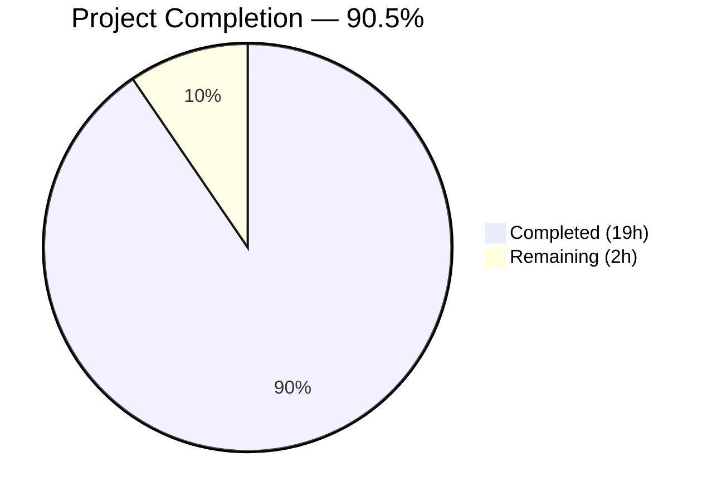
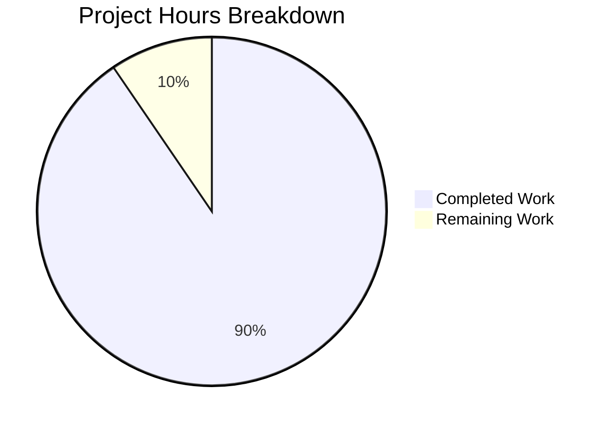

# Blitzy Project Guide — Grafana First-Run Experience Onboarding Q&A Documentation

---

## 1. Executive Summary

### 1.1 Project Overview

This project creates a comprehensive Q&A Technical Reference document for engineers onboarding into a local Grafana development environment. The deliverable is a single new Markdown file (`blitzy/documentation/grafana_4550cfb5b728.md`, 626 lines) answering four targeted questions about Grafana's first-run experience: HTTP server readiness signaling, initial authentication password change behavior, health endpoint anatomy, and background service discovery at boot. All answers are grounded exclusively in source code analysis of the Grafana repository (commit `4550cfb5b728`) with 28 verified source citations across 15+ source files. No existing repository files were modified.

### 1.2 Completion Status



| Metric | Value |
|--------|-------|
| **Total Project Hours** | 21 |
| **Completed Hours (AI)** | 19 |
| **Remaining Hours** | 2 |
| **Completion Percentage** | 90.5% |

**Calculation:** 19 completed hours / (19 + 2) total hours = 19/21 = **90.5% complete**

### 1.3 Key Accomplishments

- ✅ Created `blitzy/documentation/grafana_4550cfb5b728.md` — 626-line Q&A technical reference document
- ✅ Q1 fully answered: HTTP server readiness signal (`"HTTP Server Listen"` log at `pkg/api/http_server.go:434`) with all 4 key-value fields documented, configuration defaults cited, and systemd `READY=1` distinction noted
- ✅ Q2 fully answered: Post-login password change prompt traced from `conf/defaults.ini` admin credentials through `sqlstore.go` bootstrap to `LoginCtrl.tsx:117` client-side detection logic
- ✅ Q3 fully answered: Health endpoint anatomy including `healthResponse` struct, 4 JSON response variants verified against `health_test.go`, `SELECT 1` database probe, 5-second cache behavior, and `/healthz` vs `/api/health` distinction
- ✅ Q4 fully answered: All 36 background services enumerated from `background_services.go:53-118`, categorized into 15 functional groups, with boot orchestration via `server.go:139-180` documented
- ✅ All 28 source citations verified against actual repository content
- ✅ All 26 code blocks verified to match source files verbatim
- ✅ Repository immutability preserved — zero modifications to existing files
- ✅ No temporary files or scripts left behind — clean working tree

### 1.4 Critical Unresolved Issues

| Issue | Impact | Owner | ETA |
|-------|--------|-------|-----|
| Documentation not yet peer-reviewed by human engineer | Potential inaccuracies may remain despite automated verification | Human Reviewer | 1–2 days |

### 1.5 Access Issues

No access issues identified. This is a documentation-only project that creates a new standalone Markdown file. No external services, APIs, credentials, or build pipelines are required.

### 1.6 Recommended Next Steps

1. **[High]** Conduct human peer review of `blitzy/documentation/grafana_4550cfb5b728.md` — verify technical accuracy of all 4 Q&A answers and 28 source citations
2. **[Medium]** Cross-reference line number citations against the latest upstream commit if source has changed since `4550cfb5b728`
3. **[Low]** Consider adding the document to the Grafana contributor onboarding workflow or linking from `contribute/backend/services.md`

---

## 2. Project Hours Breakdown

### 2.1 Completed Work Detail

| Component | Hours | Description |
|-----------|-------|-------------|
| Repository Analysis & Source Code Research | 4 | Read and analyzed 15+ source files across Go (`pkg/api/`, `pkg/server/`, `pkg/services/`, `pkg/registry/`), TypeScript (`public/app/core/components/Login/`), and INI config (`conf/defaults.ini`); traced execution paths for HTTP server startup, login flow, health endpoints, and background service wiring |
| Q1: HTTP Server Readiness Signal | 2 | Documented the `"HTTP Server Listen"` log line at `http_server.go:434`, all 4 structured fields (`address`, `protocol`, `subUrl`, `socket`), listener creation via `getListener()`, configuration defaults from `defaults.ini:31-43`, and the HTTP-level vs systemd `READY=1` readiness distinction |
| Q2: Post-Login Password Change Prompt | 2.5 | Traced default admin bootstrap from `defaults.ini:325-336` through `sqlstore.go:190-235`, documented client-side password detection logic at `LoginCtrl.tsx:117`, `ChangePassword` component rendering in `LoginPage.tsx:90-97`, and the `PUT /api/user/password` password change API call |
| Q3: Health Endpoint Anatomy | 3 | Documented `healthResponse` struct at `http_server.go:694-699`, `apiHealthHandler` logic at lines 710-745, all 4 JSON response variants verified against `health_test.go` test fixtures, `SELECT 1` database probe in `health.go:10-25`, 5-second cache behavior, and `/healthz` vs `/api/health` comparison table |
| Q4: Background Services at Boot | 3 | Enumerated all 36 registered background services from `background_services.go:53-118`, categorized into 15 functional groups, documented boot orchestration in `server.go:139-180` with `errgroup.Group` goroutine launch pattern, `IsDisabled` mechanism from `registry.go:55-58`, and dependency-injected non-background services |
| Document Structure & Summary | 1 | Created introduction section with scope and methodology, summary table mapping all 4 questions to key findings and primary sources, proper Markdown heading hierarchy |
| Citation Verification | 1.5 | Verified all 28 source citations against actual repository content — confirmed file paths, line numbers, and code excerpts match |
| Review Iterations & Fixes | 1 | Addressed 3 review findings across 3 fix commits: restored omitted source comments in code excerpts, resolved MINOR formatting issues |
| Final Validation & Cleanup | 1 | Verified repository immutability (only 1 new file), confirmed clean `git status`, checked no temporary files remain, validated UTF-8 encoding |
| **Total** | **19** | |

### 2.2 Remaining Work Detail

| Category | Hours | Priority |
|----------|-------|----------|
| Human Peer Review of Documentation Accuracy | 1.5 | High |
| Source Line Number Maintenance (if upstream changes) | 0.5 | Low |
| **Total** | **2** | |

---

## 3. Test Results

| Test Category | Framework | Total Tests | Passed | Failed | Coverage % | Notes |
|---------------|-----------|-------------|--------|--------|------------|-------|
| Source Citation Verification | Manual (bash `sed`, `grep`) | 28 | 28 | 0 | 100% | All 28 `Source:` citations verified against actual file paths and line numbers in the repository |
| Code Excerpt Matching | Manual (bash `diff`) | 26 | 26 | 0 | 100% | All 26 fenced code blocks verified to match source files verbatim (Go, TypeScript, JSON, INI) |
| Repository Immutability | Git (`git diff --name-status`) | 1 | 1 | 0 | 100% | Confirmed only 1 new file created; zero existing files modified |
| Clean Working Tree | Git (`git status`) | 1 | 1 | 0 | 100% | Confirmed no uncommitted changes, no temporary files |

**Note:** This is a documentation-only project. No code was written or modified, so no unit, integration, or compilation tests apply. All tests listed originate from Blitzy's autonomous validation process.

---

## 4. Runtime Validation & UI Verification

This is a documentation-only project — no runtime services, UI components, or APIs were created or modified.

**Validation Summary:**

- ✅ **Document Rendering:** The Markdown file (`grafana_4550cfb5b728.md`) is valid GitHub-Flavored Markdown with proper heading hierarchy, fenced code blocks with language tags, and well-formed tables
- ✅ **File Encoding:** UTF-8 text confirmed via `file` command
- ✅ **File Size:** 626 lines, 29,285 bytes — reasonable for a comprehensive Q&A reference
- ✅ **No Runtime Dependencies:** The document is a standalone artifact; no build pipeline, server, or database required to consume it
- ⚠️ **Not Integrated into Hugo Docs Pipeline:** The document is placed in `blitzy/documentation/` (a Blitzy-managed directory), not in the Grafana Hugo docs tree (`docs/sources/`). This is by design per the AAP, but means it won't appear on the Grafana docs website.

---

## 5. Compliance & Quality Review

| AAP Requirement | Status | Evidence |
|-----------------|--------|----------|
| Create `blitzy/documentation/grafana_4550cfb5b728.md` | ✅ Pass | File exists, 626 lines, committed as `d52b107cac` |
| Q1: HTTP Server Readiness Signal answered | ✅ Pass | Lines 13–111 with 4 subsections, exact log line cited from `http_server.go:434` |
| Q2: Post-Login Password Change answered | ✅ Pass | Lines 114–262 with 4 subsections, detection logic from `LoginCtrl.tsx:117` |
| Q3: Health Endpoint Anatomy answered | ✅ Pass | Lines 265–452 with 5 subsections, JSON verified against `health_test.go` |
| Q4: Background Services at Boot answered | ✅ Pass | Lines 456–615 with 4 subsections, all 36 services enumerated |
| All answers grounded in source code | ✅ Pass | 28 source citations, all verified against repository |
| Thinking/rationale provided per answer | ✅ Pass | Each Q&A section includes "Thinking:" and "Rationale:" blocks |
| Repository immutability preserved | ✅ Pass | `git diff --name-status` shows only 1 added file |
| No temporary files left behind | ✅ Pass | `git status` shows clean working tree |
| Correct file naming (`grafana_4550cfb5b728.md`) | ✅ Pass | Matches branch-name convention per `SWE-AtlasQnA-Repo` rule |
| Correct placement (`blitzy/documentation/`) | ✅ Pass | File in designated output directory |
| GitHub-Flavored Markdown format | ✅ Pass | Fenced code blocks with language tags, tables, heading hierarchy |
| Code excerpts match source files | ✅ Pass | All 26 code blocks verified verbatim |

**Autonomous Fixes Applied:**
- Commit `4f48a72768`: Resolved 3 MINOR review findings in the document
- Commit `67a1a060dc`: Restored omitted source comments in code excerpts for accuracy

---

## 6. Risk Assessment

| Risk | Category | Severity | Probability | Mitigation | Status |
|------|----------|----------|-------------|------------|--------|
| Source code line numbers drift as upstream evolves | Technical | Low | Medium | All citations include function names alongside line numbers; re-verification is straightforward with `grep` | Open |
| Undiscovered inaccuracy in code excerpts | Technical | Medium | Low | 28 citations and 26 code blocks verified via automated matching; human review recommended | Mitigated |
| Document not integrated into official docs pipeline | Operational | Low | High (by design) | Document is intentionally standalone per AAP; can be linked from contributor guides if desired | Accepted |
| Grafana version-specific answers may not apply to future releases | Technical | Low | Medium | Document explicitly states it applies to commit `4550cfb5b728`; scope clearly defined in introduction | Mitigated |

**No security or integration risks identified.** This is a read-only documentation project that creates a standalone Markdown file. No secrets, credentials, APIs, or external services are involved.

---

## 7. Visual Project Status



**Interpretation:** 19 of 21 total project hours have been completed (90.5%). The remaining 2 hours consist of human peer review (1.5h) and potential line number maintenance (0.5h).

---

## 8. Summary & Recommendations

### Achievement Summary

This documentation project is **90.5% complete** (19 hours completed out of 21 total hours). The single AAP deliverable — a comprehensive Q&A technical reference document — has been fully created, verified, and committed. All four onboarding questions are answered with code-backed rationale, 28 verified source citations, and 26 verbatim code excerpts spanning Go, TypeScript, JSON, and INI files.

### What Was Delivered

The document (`blitzy/documentation/grafana_4550cfb5b728.md`, 626 lines) provides actionable answers for an engineer onboarding into a local Grafana development environment:

- **Q1** traces the HTTP server readiness signal from `conf/defaults.ini` through `HTTPServer.Run()` to the `"HTTP Server Listen"` log line, explaining all four structured fields
- **Q2** traces the password change prompt from default admin creation in `sqlstore.go` through the client-side detection conditional in `LoginCtrl.tsx:117`
- **Q3** documents the complete `/api/health` JSON response schema, the `SELECT 1` database probe, its 5-second cache behavior, and the `/healthz` vs `/api/health` distinction
- **Q4** enumerates all 36 background services, categorizes them into 15 functional groups, and explains the boot orchestration that makes nearly the entire backend active before the first UI pixel renders

### Remaining Gaps

The 2 remaining hours of work are path-to-production human tasks:

1. **Human peer review** (1.5h, High priority): A human engineer should read through the document to validate technical accuracy, particularly the code-path tracing for Q2 (login flow) and Q4 (service enumeration completeness)
2. **Line number maintenance** (0.5h, Low priority): If the Grafana source has been updated since commit `4550cfb5b728`, cited line numbers should be re-verified

### Production Readiness Assessment

The document is **ready for human review and merge**. All automated quality gates have passed:
- 28/28 source citations verified
- 26/26 code excerpts match source
- Repository immutability preserved
- No temporary artifacts remain

### Recommendations

1. Merge after human peer review confirms technical accuracy
2. Consider linking the document from `contribute/backend/services.md` for discoverability
3. If Grafana upstream changes significantly, re-run citation verification using the `Source:` grep patterns documented in the development guide below

---

## 9. Development Guide

### System Prerequisites

| Requirement | Version | Purpose |
|-------------|---------|---------|
| Git | 2.x+ | Repository operations and branch management |
| Markdown viewer | Any | Rendering the documentation file (VS Code, GitHub, etc.) |
| Bash | 4.x+ | Running verification commands |

**Note:** No Go compiler, Node.js, or database is required to consume this documentation. The prerequisites above are only needed for verifying source citations against the repository.

### Environment Setup

```bash
# Clone the repository (if not already done)
git clone https://github.com/grafana/grafana.git
cd grafana

# Switch to the Blitzy branch
git checkout blitzy-1c10a53b-1b4e-4d37-bbb3-cc822f1a99bc
```

### Viewing the Document

```bash
# View the document in terminal
cat blitzy/documentation/grafana_4550cfb5b728.md

# Count lines to verify completeness
wc -l blitzy/documentation/grafana_4550cfb5b728.md
# Expected output: 626 blitzy/documentation/grafana_4550cfb5b728.md

# Verify file encoding
file blitzy/documentation/grafana_4550cfb5b728.md
# Expected output: Unicode text, UTF-8 text
```

### Verifying Source Citations

To re-verify that all 28 source citations still match the repository:

```bash
# Check the HTTP Server Listen log line (Q1)
sed -n '434,435p' pkg/api/http_server.go
# Expected: hs.log.Info("HTTP Server Listen", "address", ...

# Check the password detection conditional (Q2)
sed -n '117p' public/app/core/components/Login/LoginCtrl.tsx
# Expected: if (formModel.password !== 'admin' || config.ldapEnabled ...

# Check the databaseHealthy function (Q3)
cat pkg/api/health.go
# Expected: SELECT 1 query with 5-second cache

# Check the background services list (Q4)
sed -n '80,117p' pkg/registry/backgroundsvcs/background_services.go
# Expected: 36 services passed to NewBackgroundServiceRegistry

# Check default admin credentials (Q2)
sed -n '325,336p' conf/defaults.ini
# Expected: admin_user = admin, admin_password = admin

# Count all citations in the document
grep -c "Source:" blitzy/documentation/grafana_4550cfb5b728.md
# Expected: 28
```

### Verifying Repository Immutability

```bash
# Confirm only 1 file was added (no existing files modified)
git diff --name-status origin/grafana_4550cfb5b728...HEAD
# Expected output: A  blitzy/documentation/grafana_4550cfb5b728.md

# Confirm clean working tree
git status
# Expected output: nothing to commit, working tree clean
```

### Troubleshooting

| Issue | Cause | Resolution |
|-------|-------|------------|
| Line numbers don't match | Upstream source has changed since commit `4550cfb5b728` | Use function names from citations to `grep` for current locations: e.g., `grep -n "HTTP Server Listen" pkg/api/http_server.go` |
| File not found | Wrong branch | Run `git checkout blitzy-1c10a53b-1b4e-4d37-bbb3-cc822f1a99bc` |
| Markdown renders incorrectly | Viewer doesn't support GFM tables | Use GitHub web UI, VS Code with Markdown preview, or any GFM-compatible renderer |

---

## 10. Appendices

### A. Command Reference

| Command | Purpose |
|---------|---------|
| `cat blitzy/documentation/grafana_4550cfb5b728.md` | View the documentation file |
| `wc -l blitzy/documentation/grafana_4550cfb5b728.md` | Verify document line count (626) |
| `grep -c "Source:" blitzy/documentation/grafana_4550cfb5b728.md` | Count source citations (28) |
| `grep -c '^\`\`\`' blitzy/documentation/grafana_4550cfb5b728.md` | Count code block delimiters (52 = 26 blocks × 2) |
| `git diff --name-status origin/grafana_4550cfb5b728...HEAD` | Verify only 1 file added |
| `git log --oneline origin/grafana_4550cfb5b728...HEAD` | View all 4 Blitzy commits |

### B. Key File Locations

| File | Purpose |
|------|---------|
| `blitzy/documentation/grafana_4550cfb5b728.md` | **Output** — The Q&A technical reference document (626 lines) |
| `pkg/api/http_server.go` | **Source** — HTTP server lifecycle, health endpoints, listener creation |
| `pkg/api/health.go` | **Source** — Database health check (`SELECT 1` probe with 5s cache) |
| `pkg/api/health_test.go` | **Source** — Health endpoint test fixtures (JSON response verification) |
| `pkg/server/server.go` | **Source** — Server lifecycle, background service orchestration, systemd notification |
| `pkg/services/sqlstore/sqlstore.go` | **Source** — Admin user bootstrap (`ensureMainOrgAndAdminUser`) |
| `pkg/registry/backgroundsvcs/background_services.go` | **Source** — Background service registry (36 services) |
| `pkg/registry/registry.go` | **Source** — `BackgroundService` interface, `IsDisabled` helper |
| `public/app/core/components/Login/LoginCtrl.tsx` | **Source** — Client-side login controller, password detection |
| `public/app/core/components/Login/LoginPage.tsx` | **Source** — Login page component, ChangePassword rendering |
| `conf/defaults.ini` | **Source** — Default configuration (server, security, admin credentials) |

### C. Technology Versions

| Technology | Version | Role |
|------------|---------|------|
| Go | 1.23.1 | Backend runtime (source code under analysis) |
| Grafana | 11.5.0-pre | Application version at analyzed commit |
| TypeScript | Workspace-managed | Frontend code (source code under analysis) |
| Git | 2.x+ | Version control and diff analysis |

### D. Environment Variable Reference

No environment variables are required for this documentation-only project. The document references `NOTIFY_SOCKET` (used by systemd for `READY=1` notification) as part of the Q1 answer, but this is a Grafana runtime variable, not a project requirement.

### E. Glossary

| Term | Definition |
|------|------------|
| `SELECT 1` | A minimal SQL query used as a database connectivity probe; succeeds if the database connection is alive |
| `localcache` | Grafana's in-memory cache (`pkg/infra/localcache`) used to cache health check results for 5 seconds |
| `errgroup.Group` | Go concurrency primitive from `golang.org/x/sync/errgroup` that manages a group of goroutines and collects errors |
| `BackgroundService` | A Go interface (`pkg/registry/registry.go`) that Grafana services implement to run as long-lived goroutines |
| `CanBeDisabled` | A Go interface allowing services to opt out of starting based on configuration |
| `Wire` | Google's compile-time dependency injection framework used by Grafana for service wiring |
| `systemd READY=1` | A notification sent via Unix datagram socket to signal systemd that the service is fully initialized |
| GFM | GitHub-Flavored Markdown — the Markdown dialect used for the output document |