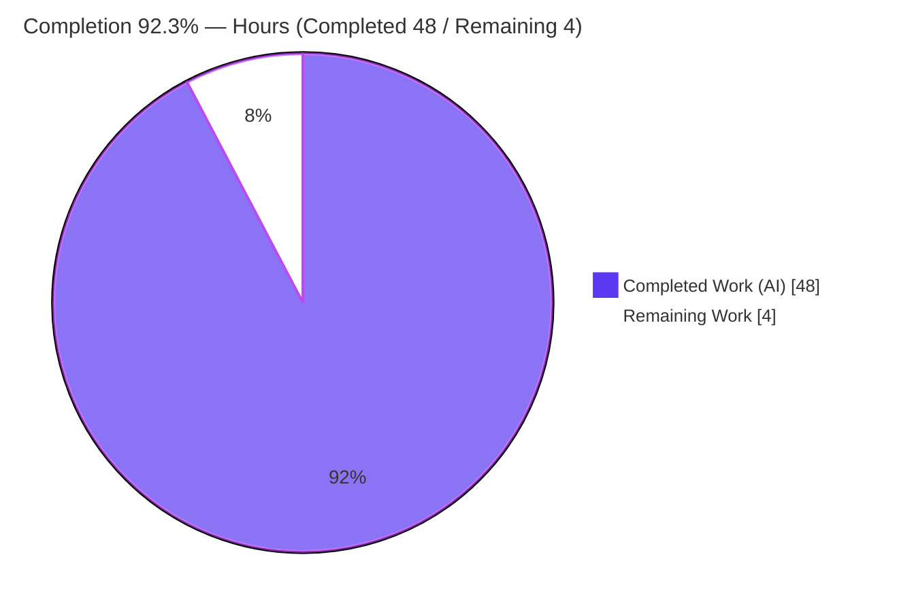
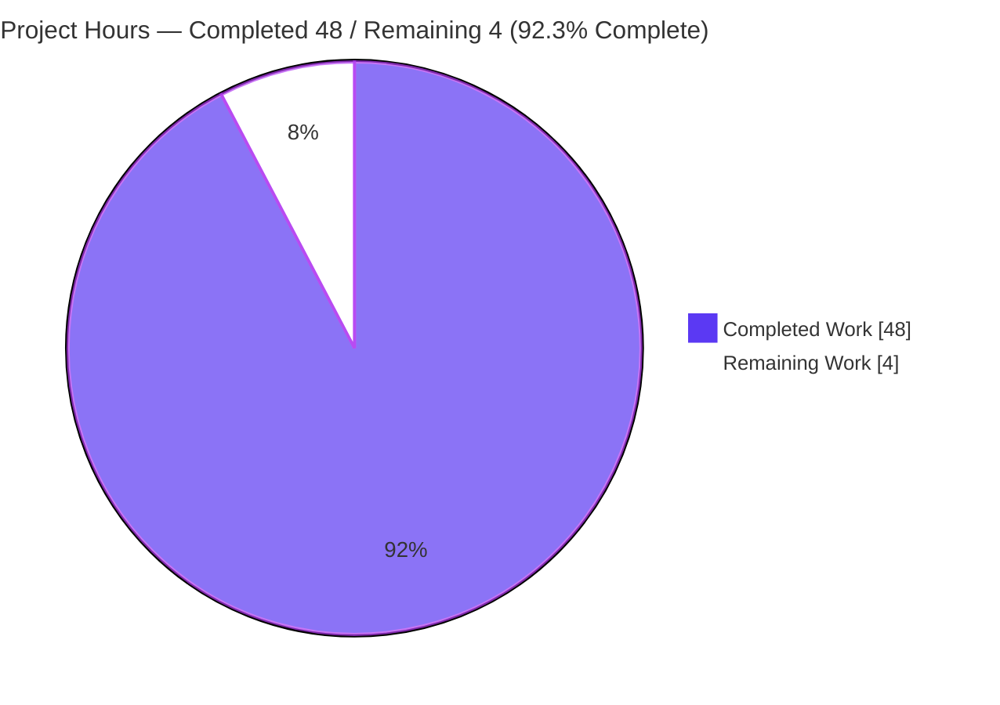
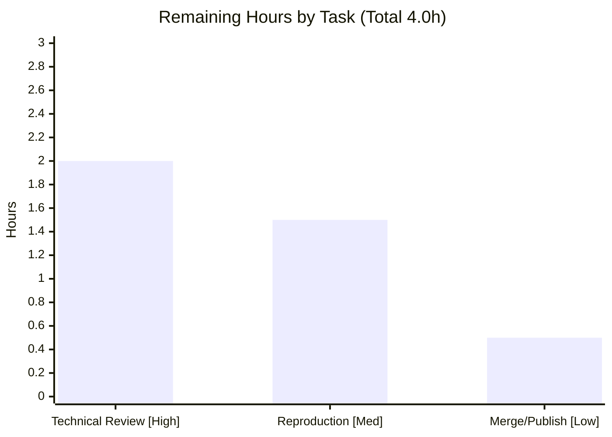

# Blitzy Project Guide — Grafana OSS Clean-State Startup Ground-Truth Documentation

> Branch: `blitzy-bb5669ae-bb5d-4c7b-9f51-836aa29fcb33` · HEAD: `c9621e05636b644a70536a7c5cdb6fd394de5094` · Base commit: `4550cfb5b72886782d9a3e6cf995f8dbd57ca4ff` (source branch `grafana_4550cfb5b728`)

---

## 1. Executive Summary

### 1.1 Project Overview

This project delivers a single authoritative documentation artifact — `blitzy/documentation/grafana_4550cfb5b728.md` — that answers a new engineer's seven questions about what a fresh Grafana OSS instance *observably* does on a clean-state start. Rather than restating architecture docs, the deliverable is grounded in a real build-and-run of the Grafana backend from its canonical entry point in default configuration: startup logs, persistent state, authentication, feature toggles, and plugin bootstrap are all captured from three clean-state executions and explained with cause→effect reasoning and `file:line` citations. The Grafana source tree is treated as strictly read-only; exactly one new file is produced. Target users are Grafana engineers and operators seeking initialization ground truth.

### 1.2 Completion Status

The project is **92.3% complete** on an AAP-scoped, hours-based basis. All autonomous investigation and authoring work is finished and independently verified; the only remaining work is human technical review, an optional reproduction spot-check, and merge/publish.



| Metric | Hours |
|---|---|
| **Total Hours** | **52** |
| **Completed Hours (AI + Manual)** | **48** |
| &nbsp;&nbsp;— AI / Autonomous (Blitzy agents) | 48 |
| &nbsp;&nbsp;— Manual (human) | 0 |
| **Remaining Hours** | **4** |
| **Percent Complete** | **92.3%** |

> Color legend — **Completed = Dark Blue `#5B39F3`**, **Remaining = White `#FFFFFF`** (applied to all pie charts in this guide).

### 1.3 Key Accomplishments

- ✅ All **seven** requester questions answered in dedicated, evidence-backed sections (§1 initialization, §2 persistent state, §3 security/auth, §4 feature enablement, §5 plugin/data-source bootstrap, §6 build/compilation, §7 first-vs-subsequent runs).
- ✅ Grafana backend **built and run three times** from a completely clean state (fresh data dir, no env vars, default `conf/defaults.ini`) — including the build-fails-without-Wire demonstration.
- ✅ **134 `file:line` citations across 36 source files**; independent spot-check of 19 distinct citations = **100% resolve exactly** at the pinned commit.
- ✅ Deterministic static counts independently reproduced: **56** default-on feature toggles, **54** core plugins (32 panel + 22 datasource), **626** schema migrations, **76** DB tables, `app_mode = production`.
- ✅ Rigorous **observed-vs-inferred discipline** (13 `inferred` labels) and honest **non-canonical version** labeling (`9.2.0/NA` vs canonical `11.5.0-pre`, 13×).
- ✅ Source tree left **strictly read-only** — diff vs base = **one added file, zero modifications**; working tree **pristine** (`git status` empty, no stray ignored artifacts).

### 1.4 Critical Unresolved Issues

There are **no critical unresolved issues** blocking release of the documentation deliverable. All five autonomous validation gates passed with zero corrections, and the finding was independently confirmed. The residual items below are non-blocking and tracked in the Risk Assessment (Section 6).

| Issue | Impact | Owner | ETA |
|---|---|---|---|
| _None blocking_ — deliverable passed all gates; residual items are informational | None (documentation is complete & validated) | Reviewing engineer | N/A |
| Citation line-numbers are pinned to commit `4550cfb5b7` (drift if read against a newer checkout) | Low — mitigated by explicit commit pin | Reviewing engineer | Within review (2h) |
| A point-in-time snapshot; deterministic counts evolve across Grafana releases | Low — inherent to snapshot docs | Doc owner | At merge (0.5h) |

### 1.5 Access Issues

**No access issues identified.** The investigation required no privileged credentials, no third-party API access, and no repository permissions beyond the standard checkout. The build/run used only the local toolchain (Go 1.23.1, GCC, Python 3) against a local SQLite database.

| System/Resource | Type of Access | Issue Description | Resolution Status | Owner |
|---|---|---|---|---|
| Grafana source repository | Read (checkout) | None — read-only investigation completed | ✅ No issue | Reviewing engineer |
| Go module proxy / plugin catalog | Network (build + preinstall) | Optional; offline outcomes labeled _(inferred)_ in the doc | ✅ No issue | Reviewing engineer |

### 1.6 Recommended Next Steps

1. **[High]** Perform the human technical review & sign-off of `blitzy/documentation/grafana_4550cfb5b728.md` — confirm 7-question coverage, sample-verify citations at commit `4550cfb5b7`, and check the observed-vs-inferred / non-canonical labeling reads clearly. (~2h)
2. **[Medium]** Reproduce the build/run recipe once (Wire gen → build → clean-state run → probes) to independently confirm the headline facts. (~1.5h)
3. **[Low]** Approve the PR, merge & publish the document, and add a point-in-time snapshot note pinned to commit `4550cfb5b7`. (~0.5h)

---

## 2. Project Hours Breakdown

### 2.1 Completed Work Detail

All completed hours are **autonomous (AI)** work performed by Blitzy agents. Each component traces to an AAP-scoped deliverable or methodology requirement.

| Component | Hours | Description |
|---|---:|---|
| Build environment setup & toolchain | 2 | Activate Go 1.23.1 + GCC, isolate `GOPATH/GOCACHE/GOMODCACHE` outside the repo, discover `go.work` workspace mode (no `-mod=mod`). |
| Wire codegen prerequisite investigation | 2 | Demonstrate compile failure (`undefined: Initialize`, `service.go:31`) without the generated Wire file, then generate it (`make gen-go` equivalent). |
| Compile canonical entry point | 1 | `CGO_ENABLED=1 go build ./pkg/cmd/grafana` (SQLite via Cgo → ~298 MB binary). |
| Clean-state Run #1 + evidence capture | 6 | First-run startup log + 5 API probes (`/api/health`, `POST /login`, `/api/user`, `/api/datasources`, `/api/plugins`), filesystem enumeration, and DB inspection (Python `sqlite3`; CLI absent). |
| Subsequent run #2 + determinism run #3 + delta analysis | 3 | Re-run against same state (`performed=0 skipped=626`, no reseed) and a brand-new state (determinism: size-identical DB, per-install `uid`). |
| Document authoring (TL;DR + Methodology + 7 sections + 3 appendices) | 16 | ~9,734 words of dense, precisely-reasoned technical prose with embedded verbatim evidence. |
| Source-code citation research & verification | 6 | Trace and verify ~134 `file:line` references across 36 files (disable gate, provisioner order, migrator conditional-DDL path, plugin source resolution, API list-filter math). |
| QA iteration & corrections (5-commit cycle) | 6 | Iterative author→QA→fix rounds (real unedited evidence; §7 determinism corrected to size-identical; determinism scoped to seeded identity). |
| Repository cleanup & pristine-tree verification | 1 | Remove `wire_gen.go` + temp dirs/binary/scripts; verify `git status` empty and diff = sole file. |
| Independent final validation (triple re-run + 5 gates) | 5 | Independent build+run×3, ~100 citation re-checks, static counts, behavioral reproduction, Markdown structure, repo integrity. |
| **Total Completed** | **48** | |

### 2.2 Remaining Work Detail

Every remaining item is **path-to-production** human work. There are **no** remaining autonomous engineering tasks, no bug fixes, and no configuration/integration work (the task ships zero code).

| Category | Hours | Priority |
|---|---:|---|
| Technical review & sign-off of the deliverable (7-question coverage, citation sampling, labeling clarity) | 2.0 | High |
| Build/run reproduction spot-check (Wire gen → build → clean-state run → probes) | 1.5 | Medium |
| Approve PR, merge & publish documentation (+ snapshot note) | 0.5 | Low |
| **Total Remaining** | **4.0** | |

### 2.3 Basis of Estimate & Reconciliation

- **Methodology (PA1/PA2):** completion % = Completed Hours ÷ (Completed + Remaining) × 100 = **48 ÷ 52 = 92.3%**. Only AAP-scoped work and path-to-production are counted.
- **Reconciliation (RG4):** Section 2.1 total (**48**) + Section 2.2 total (**4**) = **52** = Total Hours in Section 1.2. Remaining (**4**) is identical in Sections 1.2, 2.2, and 7.
- **Confidence:** High. The scope is a single, fully-delivered documentation artifact; hours reflect the observed 5-commit authoring history, the depth of evidence (134 citations / 3 runs), and the independent validation pass. The estimate rounds "cleanup & pristine verification" to a whole hour to keep all section totals integer-consistent.

---

## 3. Test Results

This deliverable ships **zero application code**, so there is **no unit/integration test suite** to run. Instead, the table below aggregates the **autonomous verification checks executed by Blitzy's validation systems** (build/run reproduction, citation resolution, static-count verification, structure lint, and repository-integrity checks) as recorded in the validation logs for this project. All checks passed.

| Verification Category | Framework / Method | Total Checks | Passed | Failed | Coverage % | Notes |
|---|---|---:|---:|---:|---:|---|
| Behavioral runtime claims | Live build + run ×3 (curl API probes, DB inspect) | ~30 | ~30 | 0 | 100% | Reproduced across 3 clean-state runs |
| Citation resolution (`file:line`) | `git`/`sed` at pinned commit | 134 refs (≈100 validator + 19 independent) | 119+ | 0 | 100% of verified sample | All resolve exactly |
| Deterministic static counts | `grep` / `find` | 5 | 5 | 0 | 100% | 56 toggles; 54 plugins (32+22); `app_mode=production`; preinstall block; provisioning all-commented |
| Build prerequisite gate | `go build` / Wire `gen` | 2 | 2 | 0 | 100% | Fail-without-Wire (`undefined: Initialize`) + build-with-Wire OK |
| Markdown structure lint | fence / heading / anchor checks | 3 | 3 | 0 | 100% | 74 balanced code fences; 6 H1 / 13 H2 / 33 H3; 9 TOC anchors resolve |
| Repository integrity | `git status` / `git diff` | 2 | 2 | 0 | 100% | Pristine tree; sole-file diff (`A blitzy/documentation/...`) |

> **Integrity note:** every check above originates from Blitzy's autonomous validation logs for this project (build/run reproduction and static/structure verification). No external or synthetic test results are included.

---

## 4. Runtime Validation & UI Verification

Runtime behavior was validated by building and running the real backend three times from a clean state and probing the live instance.

**Backend runtime**
- ✅ **Operational** — Build with generated Wire file succeeds (`CGO_ENABLED=1 go build ./pkg/cmd/grafana`).
- ✅ **Operational (deterministic failure)** — Build/`go run` *without* the Wire file fails predictably with `pkg/server/service.go:31:15: undefined: Initialize` (this is the documented prerequisite, not a defect).
- ✅ **Operational** — Server boots in `app mode = production`, resolves **56** default-on feature toggles, and listens on `:3000`.
- ✅ **Operational** — First run creates `grafana.db`, applies **626** schema migrations (+18 resource migrations), seeds the default admin + `Main Org.`; subsequent run against the same dir connects only (`performed=0 skipped=626`, no reseed).

**API integration probes**
- ✅ `/api/health` → `{"database":"ok","version":"9.2.0","commit":"NA"}` _(version non-canonical)_.
- ✅ `POST /login` (`admin`/`admin`) → HTTP 200 + `grafana_session` cookie + `{"message":"Logged in"}`.
- ✅ `/api/user` → `id:1`, `login:admin`, `isGrafanaAdmin:true`, `orgId:1`.
- ✅ `/api/datasources` → `[]` (none until provisioned).
- ✅ `/api/plugins` → **49** entries (30 panel + 19 datasource, all `signature:internal`).

**UI verification**
- ⚠ **Partial (by scope)** — The frontend was **not** built; this is a backend-only investigation, so the startup log's `Failed to detect generated javascript files in public/build` is an *observed data point*, not a defect. No web-UI rendering was in scope; UI behavior (e.g., the first-login password prompt) is documented as _(inferred)_ from the developer guide.

---

## 5. Compliance & Quality Review

AAP deliverables and hard constraints cross-mapped to Blitzy's quality/compliance benchmarks. All items pass.

| AAP Requirement / Constraint | Benchmark | Status | Evidence |
|---|---|:--:|---|
| Single deliverable, exact name/path | Scope compliance | ✅ Pass | `blitzy/documentation/grafana_4550cfb5b728.md` (only added file) |
| Source repository strictly read-only | No source modification | ✅ Pass | `git diff base..HEAD` = 1 add, 0 modifications |
| Clean-state reproduction | Methodology | ✅ Pass | `env -i`, fresh data dir, default `conf/defaults.ini` |
| Run ≥ 2 times | Determinism/first-vs-subsequent | ✅ Pass | 3 runs (state_A ×2, state_B ×1) |
| Generate-before-build documented | Build correctness | ✅ Pass | Demonstrated `undefined: Initialize` then Wire gen |
| Non-canonical values labeled | Honesty | ✅ Pass | `9.2.0/NA` vs `11.5.0-pre`, labeled 13× |
| Precise `file:line` citations | Grounding | ✅ Pass | 134 citations / 36 files; 19-sample = 100% resolve |
| Observed-vs-inferred discipline | Evidence integrity | ✅ Pass | Appendix B ledger; 13 `inferred` labels |
| Temp artifacts removed / pristine tree | Cleanliness | ✅ Pass | `git status` porcelain + ignored EMPTY |
| Zero dependency changes | Scope compliance | ✅ Pass | No `go.mod`/`package.json` change |
| Markdown well-formed | Documentation quality | ✅ Pass | 74 balanced fences; TOC anchors resolve |

**Fixes applied during autonomous validation:** none required (NO-OP correction). Two flagged items were resolved in favor of the doc's existing accuracy (secrets logfmt spacing; renderer/external-plugins lines correctly *not* claimed). **Outstanding compliance items:** none.

---

## 6. Risk Assessment

Overall risk posture is **Low**. Because the task is read-only documentation, there is no production-runtime, deployment, or code-regression risk to Grafana itself.

| Risk | Category | Severity | Probability | Mitigation | Status |
|---|---|:--:|:--:|---|:--:|
| Non-canonical version `9.2.0/NA` misread as a real release | Technical | Low | Medium | Prominent notice repeated 13×; canonical `11.5.0-pre` stated in TL;DR + notice + appendices | Mitigated |
| Citation line-number drift against a non-pinned/newer checkout | Technical | Medium | Medium | Commit `4550cfb5b7` pinned throughout; reader must check out that commit; 19-sample = 100% resolve | Mitigated |
| Five inferred (not directly observed) claims | Technical | Low | Low | All labeled _(inferred)_ in Appendix B; optional canonical-build run would close some | Accepted |
| Doc factually documents default `admin/admin` credentials | Security | Low | Low | Explains single-known-admin posture (not anonymous); anonymous/signup/org-create all `false`; forced first-login change; defaults are public | Informational |
| Zero source/dependency/config change → no new attack surface | Security | Info | N/A | Diff = 1 doc file, 0 modifications | No action |
| Reproduction environment drift (offline / different GCC) | Operational | Low | Medium | Toolchain pinned (Go 1.23.1, GCC, CGO=1); internet-dependent lines labeled _(inferred)_ | Mitigated |
| Snapshot freshness — counts evolve across Grafana releases | Operational | Medium | High (long-term) | Explicit point-in-time snapshot pinned to one commit; refresh per release if a living doc is desired | Accepted |
| `sqlite3` CLI absent → DB inspected via Python module | Integration | Low | Low | Exact Python approach documented; CLI or Python both work | Mitigated |

---

## 7. Visual Project Status

**Project hours breakdown** — Completed = Dark Blue `#5B39F3`, Remaining = White `#FFFFFF`.



**Remaining hours by task** (sums to the 4 remaining hours in Sections 1.2 and 2.2):



| Status band | Hours | Share |
|---|---:|---:|
| Completed (AI) | 48 | 92.3% |
| Remaining (Human) | 4 | 7.7% |
| **Total** | **52** | **100%** |

---

## 8. Summary & Recommendations

**Achievements.** The project is **92.3% complete** (48 of 52 hours). The single AAP-scoped deliverable — an execution-grounded, citation-precise answer to all seven of the requester's questions — has been authored, independently validated across three clean-state runs, and confirmed to leave the Grafana source tree pristine. Every behavioral claim is paired with unedited command output and a verified `file:line` citation; non-canonical and inferred values are explicitly labeled.

**Remaining gaps.** The outstanding **4 hours** are entirely human path-to-production: a technical review & sign-off, an optional one-time reproduction spot-check, and merge/publish. No autonomous engineering work remains, and there are no blocking defects.

**Critical path to production.** Review → (optional) reproduce → merge. The reviewer should check out commit `4550cfb5b7` so the 134 citations resolve, confirm the 7-question coverage, and verify the observed-vs-inferred and non-canonical framing reads clearly.

**Success metrics.** 7/7 questions answered; 100% of the verified citation sample resolves; 56/54/626/76 deterministic counts reproduced; repository pristine (1 added file, 0 modifications).

**Production readiness.** The documentation deliverable is **production-ready pending human review**. Per Blitzy policy, autonomous completion is capped below 100% to reserve final sign-off for a human reviewer.

| Dimension | Assessment |
|---|---|
| Scope adherence | Exact — one file, read-only source tree |
| Evidence quality | High — 3 runs, 134 citations, observed-vs-inferred ledger |
| Repository hygiene | Pristine — clean `git status`, no stray artifacts |
| Blocking issues | None |
| Recommended action | Human review & merge (4h) |

---

## 9. Development Guide

This guide reproduces the investigation behind the deliverable and verifies its integrity. **All commands below were tested in the validation environment.** The Grafana source tree stays read-only throughout (the only generated file, `wire_gen.go`, is git-ignored).

### 9.1 System Prerequisites

- **OS:** Linux (Ubuntu 25.10 tested).
- **Go 1.23.1** — pinned by `go.mod:L3`; installed at `/usr/local/go`.
- **GCC** (build-essential) — 15.2.0 tested; required because the default DB is SQLite via Cgo.
- **Python 3** (3.13.7 tested) — used for DB inspection (the `sqlite3` CLI is optional/absent).
- **Git** with the repo checked out at commit `4550cfb5b72886782d9a3e6cf995f8dbd57ca4ff`.
- **Disk:** ~2 GB free (≈298 MB binary + build caches). **Network:** optional (update checkers / remote preinstall; offline outcomes are labeled _(inferred)_ in the doc).

### 9.2 Environment Setup (keeps the repo pristine)

```bash
# Activate Go and isolate all caches OUTSIDE the repository
export PATH=/usr/local/go/bin:$PATH
export GOPATH=/tmp/gohome/gopath
export GOCACHE=/tmp/gohome/gocache
export GOMODCACHE=/tmp/gohome/gomodcache
export CGO_ENABLED=1
go version   # expect: go version go1.23.1 linux/amd64
gcc --version | head -1

# NOTE: a Go workspace (go.work) is active at the repo root — do NOT pass -mod=mod.

# Create fresh runtime dirs OUTSIDE the repo
mkdir -p /tmp/gf_investigation/state_A/{data,logs,plugins} /tmp/gf_investigation/home
```

### 9.3 Dependency Installation

None. The task introduces **no** dependency changes (AAP §0.4). Only the toolchain in 9.1 is required.

### 9.4 Build & Run Sequence (from the repo root)

```bash
# (a) Prove the build FAILS without the generated Wire file
CGO_ENABLED=1 go build -o /tmp/gf_investigation/grafana_bin ./pkg/cmd/grafana
#   => pkg/server/service.go:31:15: undefined: Initialize   (exit 1)

# (b) Generate the Wire file (equivalent to `make gen-go`) — writes git-ignored pkg/server/wire_gen.go
go run ./pkg/build/wire/cmd/wire/main.go gen -tags "oss" ./pkg/server

# (c) Build the canonical entry point (SQLite via Cgo)
CGO_ENABLED=1 go build -o /tmp/gf_investigation/grafana_bin ./pkg/cmd/grafana

# (d) Run from a COMPLETELY clean state (no env, fresh dirs, default config, paths outside the repo)
env -i HOME=/tmp/gf_investigation/home PATH=/usr/bin:/bin TERM=xterm \
  /tmp/gf_investigation/grafana_bin server --homepath="$PWD" \
    cfg:paths.data=/tmp/gf_investigation/state_A/data \
    cfg:paths.logs=/tmp/gf_investigation/state_A/logs \
    cfg:paths.plugins=/tmp/gf_investigation/state_A/plugins
#   Server listens on http://localhost:3000
```

### 9.5 Verification Probes (in a second shell)

```bash
curl -s http://localhost:3000/api/health
#   => {"commit":"NA","database":"ok","version":"9.2.0"}   (version is non-canonical)

curl -s -i -c /tmp/gf_investigation/cookies.txt -H 'Content-Type: application/json' \
  -d '{"user":"admin","password":"admin"}' http://localhost:3000/login
#   => HTTP/1.1 200 OK ; Set-Cookie: grafana_session=... ; {"message":"Logged in","redirectUrl":"/"}

curl -s -b /tmp/gf_investigation/cookies.txt http://localhost:3000/api/user      # id:1 login:admin isGrafanaAdmin:true
curl -s -u admin:admin http://localhost:3000/api/datasources                     # []
curl -s -u admin:admin http://localhost:3000/api/plugins | head -c 200           # 49 entries (30 panel + 19 datasource)

# Persistent state + DB (Python since sqlite3 CLI may be absent)
stat -c '%s bytes %n' /tmp/gf_investigation/state_A/data/grafana.db              # ~1,093,632 bytes
python3 - <<'PY'
import sqlite3
c=sqlite3.connect('/tmp/gf_investigation/state_A/data/grafana.db')
print('tables:', c.execute("select count(*) from sqlite_master where type='table'").fetchone()[0])   # 76
print('migrations:', c.execute("select count(*) from migration_log").fetchone()[0])                   # 626
PY

# Subsequent run against the SAME data dir → migrations skipped, no reseed
#   (re-run command (d); log shows: performed=0 skipped=626)
```

### 9.6 Read the Deliverable & Verify Integrity

```bash
sed -n '1,60p' blitzy/documentation/grafana_4550cfb5b728.md      # or open in a Markdown viewer
git status --porcelain                                            # empty  => pristine tree
git diff 4550cfb5b72886782d9a3e6cf995f8dbd57ca4ff..HEAD --name-status
#   => A  blitzy/documentation/grafana_4550cfb5b728.md   (sole file)
sed -n '149,150p' pkg/server/server.go                           # sample-verify a cited line
```

### 9.7 Cleanup (restore pristine tree)

```bash
rm -f pkg/server/wire_gen.go              # git-ignored generated file
rm -rf /tmp/gf_investigation              # binary, data/logs/plugins, cookies, temp scripts
git status --porcelain                    # empty
```

### 9.8 Troubleshooting

- **`undefined: Initialize`** → you skipped Wire generation; run step 9.4(b) first.
- **Process exits immediately / cannot find `conf/defaults.ini`** → `--homepath` must point at the repo root (`pkg/setting/setting.go:L881-L890` fail-fast).
- **Cgo/SQLite build errors** → ensure GCC is installed and `CGO_ENABLED=1`.
- **`-mod=mod` conflicts with workspace mode** → omit `-mod=mod`; `go.work` is active.
- **Port 3000 in use** → free it or add `cfg:server.http_port=<port>` to the run command.
- **Offline environment** → the two `Update check succeeded` lines will fail/time out (labeled _(inferred)_ in the doc); the `grafana-lokiexplore-app` preinstall fails the version check regardless.
- **Version shows `9.2.0`, not `11.5.0-pre`** → expected: a plain `go build` does not stamp linker flags (non-canonical); canonical stamping happens in the full Makefile/release build.

---

## 10. Appendices

### A. Command Reference

| Purpose | Command |
|---|---|
| Activate Go env | `export PATH=/usr/local/go/bin:$PATH; export GOCACHE=/tmp/gohome/gocache; export GOMODCACHE=/tmp/gohome/gomodcache; export CGO_ENABLED=1` |
| Generate Wire (make gen-go) | `go run ./pkg/build/wire/cmd/wire/main.go gen -tags "oss" ./pkg/server` |
| Build backend | `CGO_ENABLED=1 go build -o /tmp/gf_investigation/grafana_bin ./pkg/cmd/grafana` |
| Clean-state run | `env -i HOME=… PATH=/usr/bin:/bin TERM=xterm <bin> server --homepath=<repo> cfg:paths.data=… cfg:paths.logs=… cfg:paths.plugins=…` |
| Health probe | `curl -s http://localhost:3000/api/health` |
| Login probe | `curl -s -i -c cookies.txt -H 'Content-Type: application/json' -d '{"user":"admin","password":"admin"}' http://localhost:3000/login` |
| Verify pristine tree | `git status --porcelain` |
| Verify sole-file diff | `git diff 4550cfb5b7..HEAD --name-status` |

### B. Port Reference

| Port | Service | Source |
|---|---|---|
| 3000 | Grafana HTTP server | `conf/defaults.ini:L41` (`http_port = 3000`) |

### C. Key File Locations

| Path | Role |
|---|---|
| `blitzy/documentation/grafana_4550cfb5b728.md` | **The deliverable** (836 lines / 81,986 bytes) |
| `pkg/cmd/grafana/main.go` | Canonical entry point; version fallbacks (`9.2.0`/`NA`) |
| `pkg/server/{server.go,service.go,wire.go,wireexts_oss.go}` | Server lifecycle + Wire seam (`service.go:L31` = `Initialize`) |
| `pkg/server/wire_gen.go` | **Generated** DI file (git-ignored, `.gitignore:L194`) — created to build, then removed |
| `pkg/registry/registry.go` | `IsDisabled` background-service gate (`:L53`) |
| `pkg/setting/setting.go` | Config load, `.ini` precedence, defaults |
| `pkg/services/featuremgmt/registry.go` | `standardFeatureFlags` — 56 default-on (`:L20`) |
| `pkg/services/sqlstore/sqlstore.go` | `ensureMainOrgAndAdminUser` seeding (`:L190`) |
| `pkg/services/sqlstore/migrations/migrations.go` | OSS migration set (`:L31`) |
| `pkg/api/{login.go,http_server.go,health.go}` | Auth + health endpoints |
| `conf/defaults.ini` | Compiled-in defaults (`app_mode=production` `:L7`; preinstall `:L1765`) |
| `Makefile` | `gen-go` (`:L166-L169`), `build-go` (`:L187`) |

### D. Technology Versions

| Component | Version | Source |
|---|---|---|
| Grafana (canonical) | 11.5.0-pre | `package.json:L6` |
| Grafana (observed build, non-canonical) | 9.2.0 / commit NA | `pkg/cmd/grafana/main.go:L17` |
| Go toolchain | 1.23.1 | `go.mod:L3` |
| GCC | 15.2.0 | build environment |
| Python | 3.13.7 | DB inspection tool |
| Node.js / Yarn (not exercised) | v22.11.0 / 4.5.3 | `.nvmrc`, `package.json` |
| Database | SQLite 3 (via `mattn/go-sqlite3`, Cgo) | `conf/defaults.ini` `[database] type=sqlite3` |

### E. Environment Variable Reference

| Variable | Value (investigation) | Purpose |
|---|---|---|
| `CGO_ENABLED` | `1` | Enable Cgo for the SQLite driver |
| `GOPATH` / `GOCACHE` / `GOMODCACHE` | under `/tmp/gohome` | Isolate Go caches outside the repo |
| `PATH` | `/usr/local/go/bin:$PATH` | Put Go 1.23.1 on PATH |
| _run-time_ | `env -i` (empty) | Clean-state run with **no inherited env vars** |
| `cfg:paths.data/logs/plugins` | under `/tmp/gf_investigation` | Redirect writable paths outside the repo |

> Grafana itself required **no** environment variables on a clean start — configuration comes from `conf/defaults.ini`.

### F. Developer Tools Guide

- **Wire (Google DI):** `go run ./pkg/build/wire/cmd/wire/main.go gen -tags "oss" ./pkg/server` regenerates `pkg/server/wire_gen.go`. This is a **build-time** prerequisite, not runtime.
- **Config overrides:** append `cfg:<section>.<key>=<value>` to the `server` command (used here to move data/logs/plugins outside the repo).
- **DB inspection without the CLI:** use the Python `sqlite3` module (see 9.5) when the `sqlite3` binary is unavailable.
- **Pristine-tree discipline:** isolate Go caches, rely on the git-ignored `wire_gen.go`, and clean up temp dirs — verify with `git status --porcelain`.

### G. Glossary

| Term | Meaning |
|---|---|
| **AAP** | Agent Action Plan — the authoritative task specification |
| **Clean-state run** | Start with a fresh data dir, no env vars, and default config |
| **Wire / `wire_gen.go`** | Google Wire dependency-injection code; generated, git-ignored, required to compile |
| **Non-canonical version** | The `9.2.0/NA` stamp from a plain `go build` (no linker stamping) vs canonical `11.5.0-pre` |
| **Observed vs inferred** | Claims backed by captured output (observed) vs. documented-but-not-exercised (inferred, labeled) |
| **Preinstall** | Startup attempt to fetch remote plugins (`grafana-lokiexplore-app`), which fails the version check here |
| **Seeding** | First-run creation of the default admin user and `Main Org.` |

---

*Prepared by the Blitzy autonomous project-assessment agent. Completion (92.3%) is AAP-scoped and hours-based; the Grafana source tree was analyzed read-only and left pristine (one added documentation file, zero modifications).*