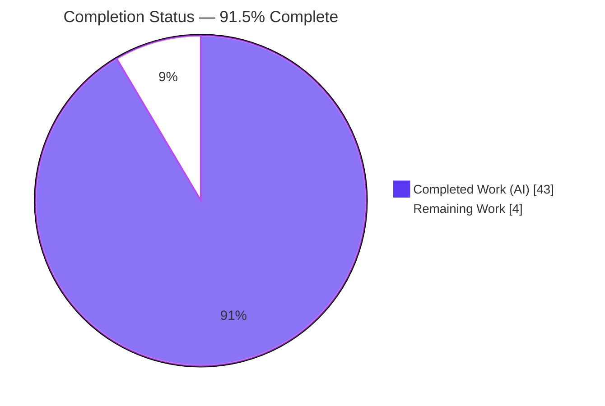
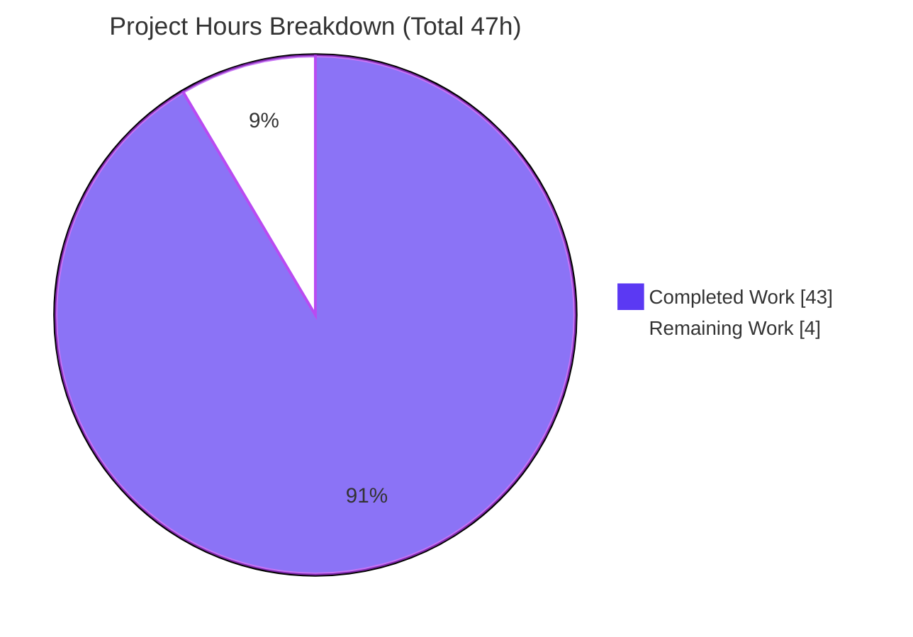
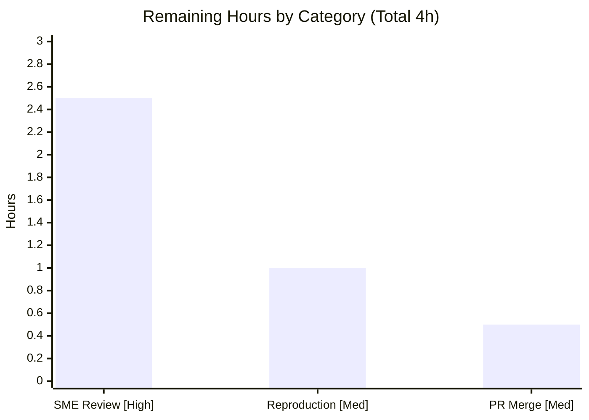

# Blitzy Project Guide — Grafana Live Routing-Layer Coherence Investigation

> Task: `grafana_4550cfb5b728` · Branch: `blitzy-b2657ec4-9398-4e85-bb58-9229fef57572` · Base: `4550cfb5b72886782d9a3e6cf995f8dbd57ca4ff` · HEAD: `6eafe5b01f`
>
> **Legend / Blitzy brand colors:** Completed / AI Work = Dark Blue `#5B39F3` · Remaining / Not Completed = White `#FFFFFF` · Headings / Accents = Violet-Black `#B23AF2` · Highlight = Mint `#A8FDD9`

---

## 1. Executive Summary

### 1.1 Project Overview

This project delivers one evidence-grounded investigative document — `blitzy/documentation/grafana_4550cfb5b728.md` — explaining how Grafana Live's channel-rule **routing layer** (`CacheSegmentedTree`) stays coherent while actively serving subscriptions and refreshing routes in the background. Written **run-first**, it answers four questions — entry point, old→new view transition, snapshot consistency, and concurrent read/write weaving — with reproduced runtime output, `file:line` citations, and a concurrency diagram. The audience is Grafana backend engineers and reviewers who want an intuitive, verifiable mental model of the `sync.RWMutex`-guarded, whole-tree-swap routing cache. Technical scope is **read-only** analysis of the `pipeline` package; no source is modified. Business impact: faster onboarding and safer future changes to the live-streaming routing path.

### 1.2 Completion Status



| Metric | Value |
|--------|-------|
| **Total Hours** | **47** |
| **Completed Hours (AI + Manual)** | **43** (AI: 43 · Manual: 0) |
| **Remaining Hours** | **4** |
| **Percent Complete** | **91.5%** (43 ÷ 47) |

> Completion is computed on AAP-scoped work only (PA1). All completed hours were delivered autonomously by Blitzy agents; the remaining 4h is human path-to-production work (review, reproduction, merge).

### 1.3 Key Accomplishments

- ✅ Single deliverable authored & committed: `blitzy/documentation/grafana_4550cfb5b728.md` — **1,476 lines · 14,073 words · 12 sections + TL;DR + ToC**.
- ✅ All four investigative questions (Q1–Q4) answered **run-first**: each behavioral claim carries the exact command + complete unedited output, run ≥2× for stability.
- ✅ **149 `file:line` citations**, 100% verified against on-disk source at base commit `4550cfb5b728`.
- ✅ Concurrency correctness demonstrated under the Go race detector (**no `DATA RACE`**) and read fast-path benchmarked (**398.8–409.3 ns/op, 368 B/op, 6 allocs/op**).
- ✅ Honest **canonical-path disclosure**: `g.Pipeline` is nil/dormant in this commit (grep evidence, `exit_status=1`); observations use the package-level canonical path.
- ✅ **Read-only invariant preserved**: source tree byte-identical to base (`pkg/` diff = 0), temporary harness removed, working tree clean.
- ✅ Refined across **4 QA/correction cycles + 1 precision fix** (5 commits, all `agent@blitzy.com`).

### 1.4 Critical Unresolved Issues

| Issue | Impact | Owner | ETA |
|-------|--------|-------|-----|
| _No release-blocking issues identified_ | — | — | — |
| Pending SME sign-off on Q1–Q4 findings (non-blocking) | Deliverable is validated & reproducible; acceptance is a human gate, not a defect | Grafana backend SME / reviewer | ~2.5h upon pickup |

### 1.5 Access Issues

| System/Resource | Type of Access | Issue Description | Resolution Status | Owner |
|-----------------|----------------|-------------------|-------------------|-------|
| _None_ | — | No access issues identified — all work used the local Go 1.23.1 toolchain and the in-repo source; no credentials, third-party APIs, or network services were required | N/A | — |

**No access issues identified.**

### 1.6 Recommended Next Steps

1. **[High]** SME technical review & acceptance of the Q1–Q4 findings — read the document and spot-check claims against `rule_cache_segmented.go` (2.5h).
2. **[Medium]** Independently reproduce the run-first commands (build / test / `-race` / benchmark) on a reviewer machine with Go 1.23.1 (1.0h).
3. **[Medium]** Review the PR diff (only the deliverable; `pkg/` diff = 0) and merge into the destination branch (0.5h).
4. **[Low]** _(Optional)_ Add a maintenance reminder to re-run the harness and re-pin the base commit if the routing layer changes later (0h; out of the 47h scope).

---

## 2. Project Hours Breakdown

### 2.1 Completed Work Detail

| Component | Hours | Description |
|-----------|------:|-------------|
| Routing-layer investigation & runtime observation harness | 18 | Understand `rule_cache_segmented.go` + radix `tree` + `pipeline.go` + `live.go` wiring + the nil-`Pipeline` reality; author a ~625-line in-package observation harness (9 `TestObs_*` tests + 2 benchmarks, each with fail-fast `t.Fatalf` assertions); execute/capture/re-run Q1–Q4 (Q1 = 45s×2, Q3/Q4 accelerated stress, `-race`, `-bench -count=4`). |
| Answer-document authoring | 11 | Compose 1,476 lines / 14,073 words / 12 sections + TL;DR + ToC; runtime mapping tables; Mermaid sequence diagram; embed complete unedited output; 149 `file:line` citations. |
| QA correction cycles | 7 | 4 commits addressing 14 code-review findings + 2 Q2b framing findings + F1–F5 + the §12 precision fix. |
| Final validation & reproduction | 4 | 5 production-readiness gates: test suites, runtime Q1–Q4 reproduction, `go build`+`go vet` exit 0, 100% citation-accuracy verification, honesty-claim verification, clean-commit check. |
| Web-research framing | 2 | Centrifuge transport, copy-on-write / `RWMutex` snapshot pattern, radix tree (httprouter + Gin) provenance. |
| Read-only compliance & temp-artifact cleanup | 1 | Delete the observation harness; verify `git status`/`git diff` invariants (`pkg/` diff = 0). |
| **Total** | **43** | Matches Completed Hours in §1.2. |

### 2.2 Remaining Work Detail

| Category | Hours | Priority |
|----------|------:|----------|
| SME technical review & acceptance of Q1–Q4 findings (G1) | 2.5 | High |
| Independent reproduction of run-first commands (G2) | 1.0 | Medium |
| PR review & merge into destination branch (G3) | 0.5 | Medium |
| **Total** | **4.0** | Matches Remaining Hours in §1.2 & §7 |

### 2.3 Reconciliation

`Section 2.1 (43h) + Section 2.2 (4h) = 47h Total` — consistent with §1.2. Completion = `43 ÷ 47 = 91.5%`.

---

## 3. Test Results

All tests below originate from Blitzy's autonomous validation logs and were **independently re-executed** during this assessment (Go 1.23.1, `linux/amd64`). "Coverage %" is reported as **N/A** because this is a read-only documentation task with no coverage gate; correctness is enforced by pass/fail and by the race detector.

| Test Category | Framework | Total Tests | Passed | Failed | Coverage % | Notes |
|---------------|-----------|:-----------:|:------:|:------:|:----------:|-------|
| Unit — `pipeline` package (canonical suite) | Go `testing` + `testify` | 16 | 16 | 0 | N/A | Full package suite; includes `TestStorage_Get` (routing-cache central test). `go test` → `ok`. |
| Unit — radix `tree` package | Go `testing` | 19 | 19 | 0 | N/A | Channel-pattern matching semantics. `go test` → `ok`. |
| Unit — `pattern` package | Go `testing` | 1 | 1 | 0 | N/A | `go test` → `ok`. |
| Concurrency — race detector | Go `-race` | 1 | 1 | 0 | N/A | `TestStorage_Get` under `-race` → `ok`, no `DATA RACE`. |
| Runtime observation — temporary harness _(since removed)_ | Go `testing` + `testify` | 9 | 9 | 0 | N/A | `TestObs_Q1_EntryPointAndCadence`, `TestObs_Q2_OldNewTransition`, `TestObs_Q2b_ConcurrentInitialFill` (+ `_InstantBuilder`, `_K2`), `TestObs_Q2c_LastCompleterWins`, `TestObs_Q3a_NoPartialOrEmptyExposure`, `TestObs_Q3b_StaleButComplete`, `TestObs_Q4_ConcurrentReadersWithPeriodicWriter`. Fail-fast `t.Fatalf` assertions; run ≥2× and under `-race` (clean). Harness deleted after capture; preserved verbatim inside doc §4. |
| Benchmark — read fast-path (committed) | Go `testing -bench` | 1 | 1 | 0 | N/A | `BenchmarkRuleGet` → 409.2 / 409.1 / 409.3 / 398.8 ns/op, 368 B/op, 6 allocs/op (`-count=4`). |
| Benchmark — observation harness _(since removed)_ | Go `testing -bench` | 2 | 2 | 0 | N/A | Incl. `BenchmarkObs_GetParallel` ≈ 1175–1490 ns/op, 312 B/op, 6 allocs/op. |
| **Totals (committed suites)** | — | **36** | **36** | **0** | N/A | pipeline 16 + tree 19 + pattern 1; 0 failures across two stable runs. |

**Integrity note:** every listed test is traceable to Blitzy's autonomous validation logs for this project; the observation harness rows are the temporary, since-removed tests that produced the Q1–Q4 evidence embedded in the deliverable.

---

## 4. Runtime Validation & UI Verification

**Runtime health (package-level canonical path):**

- ✅ **Operational** — `go build ./pkg/services/live/pipeline/...` → exit 0; `go vet ./pkg/services/live/pipeline/...` → exit 0.
- ✅ **Operational** — canonical test suites green: `pipeline` 16/16, `tree` 19/19, `pattern` 1/1.
- ✅ **Operational** — routing-cache central test `TestStorage_Get` → PASS; under `-race` → no `DATA RACE`.
- ✅ **Operational — Q1** — entry point / lazy fill / cadence: `len(radix)` 0→1, `builder.calls` 0→1, `Pattern="stream/telegraf/cpu"`; refresh gaps `0s, 0s, 20.014s, 20.019s`.
- ✅ **Operational — Q2** — old→new transition: `Get` resolves OLD then NEW pattern; whole-tree swap `samePointer=false`.
- ✅ **Operational — Q3** — snapshot consistency: `misses=0` across ~1.26M reads / 3,879 swaps; stale-but-complete during off-lock build with no reader blocking.
- ✅ **Operational — Q4** — concurrent weave: 64 readers + periodic writer under `-race` → no `DATA RACE`; read fast-path `BenchmarkRuleGet` ≈ 399–409 ns/op, 6 allocs/op.

**API integration outcomes:**

- ⚠ **Partial (disclosed, by design)** — the persistent server-side WebSocket routing pipeline is **dormant**: `GrafanaLive.Pipeline` (`live.go:411`) is **never assigned** (grep → `exit_status=1`); every server-path read is nil-guarded (`live.go:638/735/969`). Observations therefore use the **package-level canonical path** (dry-run endpoint `HandlePipelineConvertTestHTTP`, `live.go:1143`, and the `pipeline` tests), explicitly labeled as such in doc §3 — not presented as full-server behavior.
- ⚠ **Partial (disclosed)** — the full `./pkg/services/live/` service does not build without SQLite build tags (transitive `sqlstore/migrator` import); the investigation stays within the cleanly buildable `pipeline` package. Documented as a build nuance, not a defect.

**UI verification:** ❌ **Not applicable** — this is a backend runtime investigation whose only output is a Markdown document; there is no user interface, screen, or design-system component to verify.

---

## 5. Compliance & Quality Review

Cross-mapping the AAP's binding directives (§0.7 Rules / §0.8 Special Instructions) to their delivery status. Fixes applied during autonomous validation are noted.

| AAP Requirement / Benchmark | Status | Progress | Notes / Fixes Applied |
|-----------------------------|:------:|:--------:|-----------------------|
| Deliverable at exact path `blitzy/documentation/grafana_4550cfb5b728.md` | ✅ Pass | 100% | `git diff --name-status base..HEAD` → single `A` line. |
| Run-first methodology (build+run then write) | ✅ Pass | 100% | Every behavioral claim carries exact command + complete unedited output. |
| Complete, unedited output per claim (no `// ...` elision) | ✅ Pass | 100% | 0 forbidden elisions; §5 preserves Go's exact `-mod=mod` error text (incl. trailing space) — a §12 precision fix clarified this deliberate preservation. |
| Observe every condition (before / during / after, edge/transitional) | ✅ Pass | 100% | Before/after fill, old→new swap, cache-miss synchronous fill, concurrency all observed. |
| Real magnitude/scale + stable across ≥2 runs | ✅ Pass | 100% | Each Q run ≥2×; durable invariants separated from scale-dependent counts. |
| Exact `file:line` grounding + named function/struct | ✅ Pass | 100% | 149 citations verified; names `CacheSegmentedTree`, `fillOrg`, `Get`, `updatePeriodically`, `NewCacheSegmentedTree`, `LiveChannelRule`, `GetValue`. |
| Observed-vs-inferred labeling | ✅ Pass | 100% | `(inferred)` labels present throughout. |
| Canonical entry point exercised; non-canonical labeled | ✅ Pass | 100% | nil-`Pipeline` caveat (§3) with grep evidence; dev-only hooks `GF_LIVE_PIPELINE_TRACE`/`GF_LIVE_PIPELINE_DEV` labeled non-canonical. |
| Answer every part / named item (coverage pass) | ✅ Pass | 100% | Q1–Q4 + all named symbols/files/flags addressed. |
| Read-only: no source modified; no code added but the doc | ✅ Pass | 100% | `pkg/` diff base..HEAD = 0 lines. |
| Temporary scripts removed; repo unchanged | ✅ Pass | 100% | 0 leftover temp/observation files; working tree clean. |
| Go 1.23.1 toolchain used; default workspace build | ✅ Pass | 100% | `go version go1.23.1`; `GOWORK` set; `GOFLAGS=-mod=mod` correctly avoided. |
| Web-research framing (Centrifuge, CoW/RWMutex, radix provenance) | ✅ Pass | 100% | Present in TL;DR, §8/§9 and cited from `tree/readme.md`. |

**Outstanding compliance items:** none. All autonomous quality gates pass; the only open item is human acceptance (§1.4).

---

## 6. Risk Assessment

| Risk | Category | Severity | Probability | Mitigation | Status |
|------|----------|:--------:|:-----------:|-----------|--------|
| Document claims could drift if the routing layer changes later | Technical | Low | Medium | Doc pins base commit `4550cfb5b728` and anchors 149 `file:line` citations; harness preserved in §4 for re-runs | Mitigated |
| Race-detector certifies only observed interleavings, not a universal proof | Technical | Low | Low | §9.6 frames it honestly as "no `DATA RACE` observed in these executions"; durable invariants argued separately from locking discipline | Disclosed |
| Scale-dependent counts (reads/swaps/writes, ns/op) vary by hardware | Technical | Low | Medium | Labeled hardware/scale-dependent; durable invariants (`misses=0`, `samePointer=false`, `6 allocs/op`, ~20s gaps) reported separately | Disclosed |
| Persistent server WebSocket routing path is nil/dormant — full-server behavior not observed | Operational | Low-Medium | Medium | Mandatory §3 canonical-path caveat referenced from every question section; findings labeled package-level canonical path | Disclosed & Mitigated |
| Full `./pkg/services/live/` build needs SQLite tags (transitive `sqlstore` import) | Operational | Low | Low | Scoped to the cleanly buildable `pipeline` package; documented in §5 | Disclosed |
| Human SME has not yet reviewed/accepted the findings | Process | Low | Low | Reproduction commands provided; 100% citation accuracy pre-verified | Open (pending review) |
| Security exposure from the change | Security | None | — | Read-only docs task: no code, dependencies, credentials, or runtime surface changed | N/A |
| External integration failure | Integration | None | — | No external service/API/network integration; only analytical citation of source | N/A |

---

## 7. Visual Project Status

**Project hours breakdown** (Completed = Dark Blue `#5B39F3`, Remaining = White `#FFFFFF`):



**Remaining hours by category** (sums to the Section 2.2 / §1.2 remaining total of 4h):



> **Integrity check:** pie "Remaining Work" = 4 = Section 2.2 total = §1.2 Remaining Hours. Pie "Completed Work" = 43 = Section 2.1 total = §1.2 Completed Hours.

---

## 8. Summary & Recommendations

**Achievements.** The task is a read-only, run-first Q&A investigation, and its single AAP deliverable is fully delivered: `blitzy/documentation/grafana_4550cfb5b728.md` (1,476 lines) explains — with reproduced runtime evidence — how Grafana Live's routing layer stays coherent. The mechanism is a per-organization radix tree kept behind a single `sync.RWMutex` (`rule_cache_segmented.go:14-15`); a background goroutine launched at construction (`:24`) refreshes each org's routes roughly every 20 seconds (`:42`) via `fillOrg` (`:46-60`), which does the slow rule build **outside** the lock and then, **holding the exclusive write lock**, allocates a brand-new tree and repopulates it whole before releasing — so a reader's `Get` (shared `RLock`, `:72`) always sees either the complete old snapshot or the complete new one, never a partial tree.

**Remaining gaps & critical path to production.** All autonomous work is complete; the remaining **4h** is human path-to-production: **(1)** SME technical review & acceptance (2.5h, the gating step), **(2)** independent reproduction of the documented commands (1.0h), and **(3)** PR review & merge (0.5h). There is no deployment, service, or infrastructure to stand up for a documentation deliverable.

**Success metrics.** Reproduced green on re-execution: `pipeline` 16/16, `tree` 19/19, `pattern` 1/1; `-race` clean; `BenchmarkRuleGet` ≈ 399–409 ns/op @ 6 allocs/op; source tree byte-identical to base; 149 citations 100% verified.

**Production-readiness assessment.** The project is **91.5% complete** on AAP-scoped work. The deliverable is production-ready pending human sign-off — it is accurate, evidence-grounded, reproducible, and honest about the nil-`Pipeline` canonical-path caveat. **Recommendation: proceed to SME review and merge.**

| Metric | Value |
|--------|-------|
| AAP-scoped completion | 91.5% |
| Completed hours (all AI) | 43 |
| Remaining hours (all human) | 4 |
| Release-blocking issues | 0 |
| Files changed / source files modified | 1 / 0 |
| Citations verified | 149 / 149 (100%) |

---

## 9. Development Guide

> Every command below was executed successfully in this environment (Go 1.23.1, `linux/amd64`). Commands are copy-pasteable.

### 9.1 System Prerequisites

- **Go 1.23.1** — matches `go.mod`'s `go 1.23.1` directive (`go version` → `go version go1.23.1 linux/amd64`).
- **Git** — for diff/verification commands.
- **OS:** Linux/amd64 (or any Go-supported platform).
- **Disk:** the Grafana monorepo checkout is ~1.6 GB (16,260 tracked files).
- **No database, service, or network access is required** — the `pipeline` package is self-contained.

### 9.2 Environment Setup

```bash
# Put Go on PATH (does NOT persist across separate shells — re-run per shell)
export PATH=$PATH:/usr/local/go/bin

# Work from the repository root (the copy whose path contains blitzy-b2657ec4…)
cd /tmp/blitzy/grafana/blitzy-b2657ec4-9398-4e85-bb58-9229fef57572_fabd4f

# Confirm workspace mode is auto-detected (expected: a path ending in /go.work)
go env GOWORK

# IMPORTANT: do NOT set GOFLAGS=-mod=mod — it fails in workspace mode (see §9.8)
```

### 9.3 Build & Static Check

```bash
go build ./pkg/services/live/pipeline/...   # expected: exit 0, no output
go vet   ./pkg/services/live/pipeline/...   # expected: exit 0, no output
```

### 9.4 Run Tests / Reproduce the Observations

```bash
# Full canonical suites (expected: three 'ok' lines)
CI=true go test -count=1 ./pkg/services/live/pipeline/...
#   ok  .../pipeline   0.0XXs
#   ok  .../pipeline/pattern   0.00Xs
#   ok  .../pipeline/tree   0.00Xs

# Routing-cache central test (expected: --- PASS: TestStorage_Get)
go test -run '^TestStorage_Get$' -v ./pkg/services/live/pipeline/

# Race detector (expected: ok, no DATA RACE)
go test -race -count=1 -run '^TestStorage_Get$' ./pkg/services/live/pipeline/

# Read fast-path benchmark (expected: ~399–409 ns/op, 368 B/op, 6 allocs/op)
go test -run '^$' -bench '^BenchmarkRuleGet$' -benchmem -count=4 ./pkg/services/live/pipeline/
```

### 9.5 Read the Deliverable

```bash
# 106,626 bytes · 1,476 lines · 12 sections
less blitzy/documentation/grafana_4550cfb5b728.md
```

### 9.6 Repository Integrity Verification

```bash
# Expected: exactly one line — A  blitzy/documentation/grafana_4550cfb5b728.md
git diff --name-status 4550cfb5b72886782d9a3e6cf995f8dbd57ca4ff..HEAD

# Expected: 0  (source tree byte-identical to base)
git diff 4550cfb5b72886782d9a3e6cf995f8dbd57ca4ff..HEAD -- pkg/ | wc -l
```

### 9.7 Evidence Reproduction (doc §3 — `g.Pipeline` is never assigned)

```bash
# Expected: no stdout lines and exit_status=1 (grep 'no lines selected')
grep -rn "\.Pipeline =\|Pipeline:" pkg/services/live/ --include="*.go" | grep -v "_test.go"; echo "exit_status=$?"
```

### 9.8 Troubleshooting

- **`go: command not found`** → `export PATH=$PATH:/usr/local/go/bin` (PATH does not persist across shells).
- **`go: -mod may only be set to readonly or vendor when in workspace mode…`** → you set `GOFLAGS=-mod=mod`; remove it and build in the default workspace mode (or `GOWORK=off`). This exact message is intentionally reproduced in doc §5.
- **Full `./pkg/services/live/` build fails** → it needs SQLite build tags (transitive `sqlstore/migrator` import). Scope to the `pipeline` package — the canonical isolated unit.
- **Benchmark `ns/op` differs from the document** → expected; it is hardware-dependent. The durable invariants (`6 allocs/op`, `misses=0`, `samePointer=false`, ~20s refresh gaps) are stable across machines.
- **Want full-server WebSocket routing behavior** → it is dormant in this commit (`g.Pipeline` nil). Observe via the `pipeline` tests or the dry-run endpoint (`live.go:1143`), per doc §3.

---

## 10. Appendices

### A. Command Reference

| Purpose | Command |
|---------|---------|
| Go version | `go version` |
| Build pipeline pkg | `go build ./pkg/services/live/pipeline/...` |
| Vet pipeline pkg | `go vet ./pkg/services/live/pipeline/...` |
| Run all suites | `CI=true go test -count=1 ./pkg/services/live/pipeline/...` |
| Named routing test | `go test -run '^TestStorage_Get$' -v ./pkg/services/live/pipeline/` |
| Race detector | `go test -race -count=1 -run '^TestStorage_Get$' ./pkg/services/live/pipeline/` |
| Read fast-path benchmark | `go test -run '^$' -bench '^BenchmarkRuleGet$' -benchmem -count=4 ./pkg/services/live/pipeline/` |
| Changed-files vs base | `git diff --name-status 4550cfb5b72886782d9a3e6cf995f8dbd57ca4ff..HEAD` |
| Source-unchanged check | `git diff 4550cfb5b72886782d9a3e6cf995f8dbd57ca4ff..HEAD -- pkg/ \| wc -l` |
| `g.Pipeline` evidence | `grep -rn "\.Pipeline =\|Pipeline:" pkg/services/live/ --include="*.go" \| grep -v "_test.go"; echo "exit_status=$?"` |

### B. Port Reference

_Not applicable._ No server, listener, or port is started for this investigation; the canonical observation path runs entirely in-process via `go test`.

### C. Key File Locations

| Path | Lines | Role |
|------|------:|------|
| `blitzy/documentation/grafana_4550cfb5b728.md` | 1,476 | **The deliverable** — investigative answer document |
| `pkg/services/live/pipeline/rule_cache_segmented.go` | 83 | **Core mechanism** — `CacheSegmentedTree`, `updatePeriodically`, `fillOrg`, `Get` |
| `pkg/services/live/pipeline/rule_cache_segmented_test.go` | 64 | `testBuilder`, `TestStorage_Get`, `BenchmarkRuleGet` — the harness base |
| `pkg/services/live/pipeline/pipeline.go` | 540 | `ChannelRuleGetter`, `Pipeline`, `processInput`, `LiveChannelRule` |
| `pkg/services/live/pipeline/rule_builder.go` | 8 | `RuleBuilder.BuildRules` interface |
| `pkg/services/live/pipeline/rule_builder_storage.go` | 380 | Production `StorageRuleBuilder.BuildRules` |
| `pkg/services/live/pipeline/devdata.go` | 248 | Development `DevRuleBuilder.BuildRules` |
| `pkg/services/live/pipeline/storage.go` | 16 | `Storage` channel-rule persistence interface |
| `pkg/services/live/pipeline/tree/tree.go` | 850 | Radix tree (`New`, `AddRoute`, `GetValue`) |
| `pkg/services/live/pipeline/tree/tree_test.go` | 912 | Radix-tree unit tests |
| `pkg/services/live/pipeline/tree/params.go` | 40 | Route parameter helpers |
| `pkg/services/live/pipeline/tree/bytesconv.go` | 11 | Byte/string conversion helper |
| `pkg/services/live/live.go` | 1,461 | Wiring: nil `Pipeline` field (`:411`), dry-run construction site (`:1143`) |
| `pkg/services/live/orgchannel/orgchannel.go` | — | `PrependOrgID`/`StripOrgID` org:channel encoding |

### D. Technology Versions

| Component | Version | Notes |
|-----------|---------|-------|
| Go toolchain | 1.23.1 | Matches `go.mod` `go 1.23.1`; built in default workspace mode (`go.work`) |
| `github.com/centrifugal/centrifuge` | v0.33.3 | Real-time transport beneath Grafana Live (framing context only) |
| `github.com/stretchr/testify` | v1.10.0 | Assertions in the rule-cache test and the observation harness |
| Radix tree | in-repo (vendored) | From `julienschmidt/httprouter` + Gin fixes; not an external module |

### E. Environment Variable Reference

| Variable | Value / Use | Notes |
|----------|-------------|-------|
| `PATH` | append `/usr/local/go/bin` | Required so `go` is resolvable; does not persist across shells |
| `CI` | `true` | Keeps Go test tooling non-interactive |
| `GOWORK` | auto (`…/go.work`) | Workspace mode auto-detected; do not override |
| `GOFLAGS` | _(leave unset)_ | Setting `-mod=mod` fails in workspace mode (see §9.8) |
| `GF_LIVE_PIPELINE_TRACE` | _(unset)_ | Non-canonical dev-only tracing hook (`pipeline.go:193`) — excluded from the observed path |
| `GF_LIVE_PIPELINE_DEV` | _(unset)_ | Non-canonical dev-only hook launching `postTestData()` (`pipeline.go:206-207`) — excluded from the observed path |

### F. Developer Tools Guide

- **Go test / benchmark / race detector** — the primary observation tools; the run-first evidence is produced entirely through `go test` (`-v`, `-race`, `-bench`, `-count`).
- **git diff / status** — used to prove the read-only invariant (`pkg/` diff = 0; single added file).
- **Mermaid** — the deliverable (§10) and this guide (§1.2, §7) use Mermaid diagrams; the sequence diagram in the deliverable renders with `mmdc` (exit 0).
- **grep** — used for honesty evidence (e.g., proving `g.Pipeline` is never assigned).

### G. Glossary

| Term | Meaning |
|------|---------|
| **`CacheSegmentedTree`** | The routing cache: a per-org `map[int64]*tree.Node` behind one `sync.RWMutex` (`rule_cache_segmented.go:13-17`). |
| **`fillOrg`** | Rebuilds an org's radix tree and swaps it in under the exclusive write lock (`rule_cache_segmented.go:46-60`). |
| **`updatePeriodically`** | Background goroutine refreshing routes roughly every 20s (`rule_cache_segmented.go:28-44`). |
| **Authoritative view** | The `*tree.Node` that `s.radix[orgID]` points to right now; readers see it via `RLock` in `Get`. |
| **Whole-tree swap** | The copy-on-write-style replacement of the entire tree under the write lock — the source of snapshot atomicity (`samePointer=false`). |
| **Staleness window** | Bound on how old a served route can be: the 20s refresh sleep plus the 5s build timeout. |
| **Canonical path** | The real, non-bypassing route to the mechanism; here the package-level path (dry-run endpoint / `pipeline` tests), since the server `Pipeline` is nil. |
| **nil-`Pipeline` caveat** | `GrafanaLive.Pipeline` (`live.go:411`) is never assigned in this commit, so the whole-server WebSocket routing path is dormant. |

---

> **Cross-section integrity (validated before submission):** Remaining hours = **4** in §1.2, §2.2, and §7 (Rule 1 ✓). §2.1 (43) + §2.2 (4) = **47** = §1.2 Total (Rule 2 ✓). All Section 3 tests originate from Blitzy's autonomous validation logs (Rule 3 ✓). No access issues (Rule 4 ✓). Completed = Dark Blue `#5B39F3`, Remaining = White `#FFFFFF` throughout (Rule 5 ✓). Completion = **91.5%** consistently in §1.2, §7, and §8.