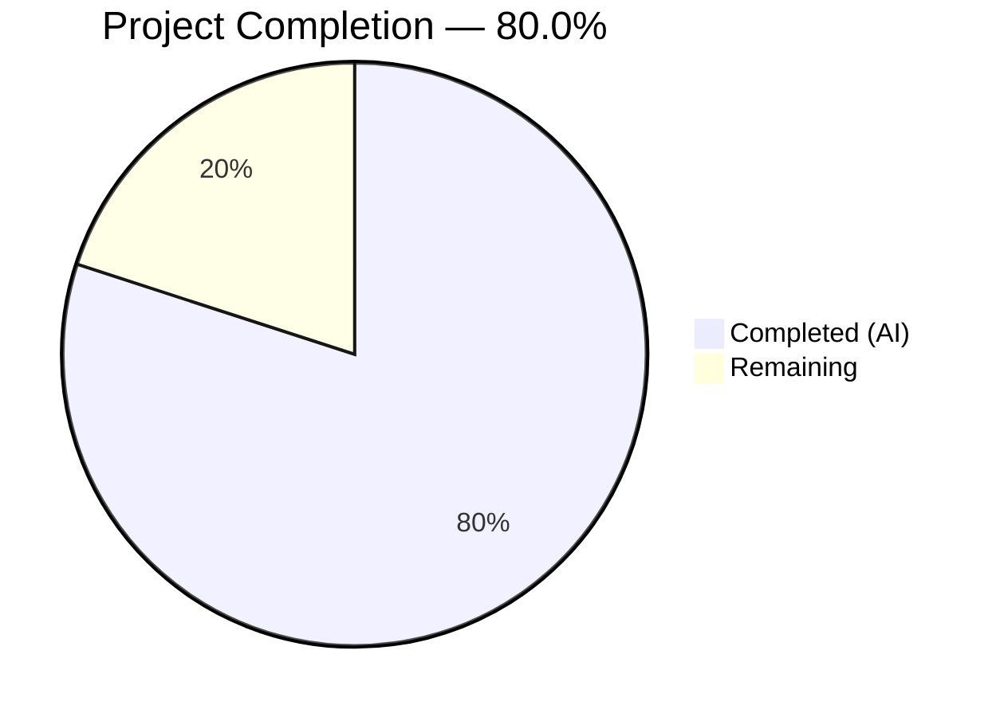
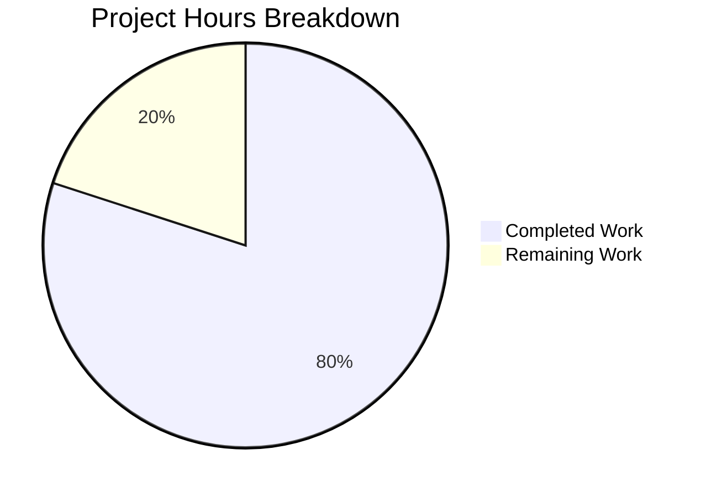

# Blitzy Project Guide

---

## 1. Executive Summary

### 1.1 Project Overview

This project delivers a comprehensive, code-grounded analysis document tracing how Grafana's "Grouping to Matrix" transformation handles sparse input data. The analysis examines what value the transformation emits for missing row/column intersections under each of the four configurable `emptyValue` options, and how those fill values propagate through the field reducer (`doStandardCalcs`), display processor (`getDisplayProcessor`), scale calculator (`getMinMaxAndDelta`), and threshold resolver (`getActiveThresholdForValue`). The deliverable is a single 690-line markdown document placed in `blitzy/documentation/grafana_4550cfb5b728.md`, with zero modifications to any existing Grafana source files. The target audience is Grafana developers and users experiencing unexpected "missing means zero" behavior in matrix-transformed dashboards.

### 1.2 Completion Status



| Metric | Value |
|---|---|
| **Total Project Hours** | 25 |
| **Completed Hours (AI)** | 20 |
| **Remaining Hours** | 5 |
| **Completion Percentage** | 80.0% |

**Calculation**: 20 completed hours / (20 completed + 5 remaining) = 20 / 25 = **80.0%**

### 1.3 Key Accomplishments

- ✅ Created comprehensive 690-line analysis document (`blitzy/documentation/grafana_4550cfb5b728.md`) covering all 10 required sections
- ✅ Traced the empty-cell emission logic through `getSpecialValue()` for all four `emptyValue` options (`Empty`, `Null`, `True`, `False`)
- ✅ Performed line-by-line walkthrough of `doStandardCalcs` demonstrating how `''` bypasses the null check while `null` is correctly skipped
- ✅ Identified and documented the exact "missing means zero" divergence at `fieldReducer.ts` line 489 (`currentValue == null` returns `false` for `''`)
- ✅ Documented the sum corruption mechanism via JavaScript string concatenation at `fieldReducer.ts` line 508
- ✅ Traced display convergence via `anyToNumber` showing why both fill modes display identically as blank cells
- ✅ Provided concrete sparse dataset walkthrough with exact values from the test suite
- ✅ Verified all 40+ code references against 11 source files in the Grafana monorepo
- ✅ 92/92 related test cases passing with 100% pass rate across 4 test suites
- ✅ TypeScript typecheck and Prettier formatting validated
- ✅ Repository integrity maintained — zero existing files modified, zero temporary files remaining

### 1.4 Critical Unresolved Issues

| Issue | Impact | Owner | ETA |
|---|---|---|---|
| Analysis not yet peer-reviewed by Grafana domain expert | Code reference accuracy unconfirmed by human review | Human Developer | 1–2 days |
| Runtime behavioral verification not performed | Findings based on static analysis only; no live dashboard confirmation | Human Developer | 2–3 days |

### 1.5 Access Issues

No access issues identified. The project involves read-only analysis of existing source code and creation of a single documentation file. No external services, API credentials, or special repository permissions are required.

### 1.6 Recommended Next Steps

1. **[High]** Assign a senior Grafana developer to peer-review the analysis document for technical accuracy, focusing on JavaScript coercion behavior claims and line number references
2. **[High]** Run a live Grafana instance with a sparse matrix dataset to confirm the documented reducer corruption behavior
3. **[Medium]** Consider filing an upstream Grafana issue or RFC proposing that the default `emptyValue` be changed from `SpecialValue.Empty` to `SpecialValue.Null`
4. **[Low]** Incorporate any review feedback and update the document if line numbers have shifted in newer Grafana commits

---

## 2. Project Hours Breakdown

### 2.1 Completed Work Detail

| Component | Hours | Description |
|---|---|---|
| Repository Discovery & Navigation | 2.0 | Systematic exploration of the Grafana monorepo (142,949 files, 3.3 GB) to locate all relevant transformation, reducer, display, scale, and threshold source files |
| Source Code Analysis (11 files) | 5.0 | Deep static analysis of `groupingToMatrix.ts`, `fieldReducer.ts`, `displayProcessor.ts`, `scale.ts`, `thresholds.ts`, `anyToNumber.ts`, `valueMappings.ts`, `transformations.ts`, `GroupingToMatrixTransformerEditor.tsx`, `groupingToMatrix.test.ts`, and `valueMapping.ts` |
| JavaScript Coercion Behavior Analysis | 1.0 | Analysis and verification of ECMAScript specification behavior for `'' == null`, `Number.isNaN('')`, `5 + ''`, `'' > -MAX_VALUE`, and `'' < 5` |
| Analysis Document Creation | 7.0 | Writing 690-line structured markdown document with 10 sections, code blocks, tables, concrete walkthroughs, divergence summary tables, and decision matrices |
| Code Review & Revision | 1.0 | Addressed 5 code review findings identified during autonomous validation, improving accuracy and clarity |
| Source Code Reference Verification | 1.5 | Verified all 40+ file path and line number references across 11 source files against the actual Grafana v11.5.0-pre codebase |
| Test Suite Execution & Validation | 1.0 | Executed 92 tests across 4 test suites (`groupingToMatrix.test.ts`, `fieldReducer.test.ts`, `displayProcessor.test.ts`, `scale.test.ts`) — all passing |
| Formatting, Linting & Cleanup | 0.5 | Applied Prettier formatting, verified TypeScript typecheck (`tsc --noEmit`), ensured working tree clean |
| Git Operations & Commit Management | 1.0 | Created 3 clean commits with descriptive messages: initial document, review fixes, and formatting |
| **Total** | **20.0** | |

### 2.2 Remaining Work Detail

| Category | Hours | Priority |
|---|---|---|
| Human Peer Review of Technical Accuracy | 2.0 | High |
| Runtime Behavioral Verification with Live Grafana Instance | 2.0 | Medium |
| Review Feedback Incorporation & Final Polish | 1.0 | Low |
| **Total** | **5.0** | |

### 2.3 Hours Validation

- Section 2.1 Total (Completed): **20.0 hours**
- Section 2.2 Total (Remaining): **5.0 hours**
- **Sum: 20.0 + 5.0 = 25.0 hours** (matches Total Project Hours in Section 1.2 ✓)
- **Completion: 20.0 / 25.0 = 80.0%** (matches Section 1.2 ✓)

---

## 3. Test Results

All tests listed below were executed by Blitzy's autonomous validation system and originate from the agent action logs for this project.

| Test Category | Framework | Total Tests | Passed | Failed | Coverage % | Notes |
|---|---|---|---|---|---|---|
| Unit — Grouping to Matrix Transformation | Jest | 4 | 4 | 0 | N/A | Tests default empty-string fill, explicit field selection, null empty fill, and metadata preservation |
| Unit — Field Reducer | Jest | 56 | 56 | 0 | N/A | Comprehensive reducer tests covering null, NaN, empty, and standard numeric edge cases |
| Unit — Display Processor | Jest | 22 | 22 | 0 | N/A | Tests null, empty string, NaN, value mappings, and formatting scenarios |
| Unit — Scale Calculator | Jest | 10 | 10 | 0 | N/A | Tests threshold coloring, boolean fields, and min/max/delta calculations |
| **Total** | **Jest** | **92** | **92** | **0** | **N/A** | **100% pass rate** |

**Additional Validation**:
- TypeScript typecheck (`tsc --noEmit`): ✅ Passed
- Prettier formatting check: ✅ Passed (formatting fix applied and committed)
- Repository integrity check (`git diff --name-status`): ✅ Only 1 file added

---

## 4. Runtime Validation & UI Verification

### 4.1 Build & Compilation

- ✅ TypeScript typecheck (`tsc --noEmit`) — Clean, no errors
- ✅ Prettier formatting — Validated and auto-fixed

### 4.2 Repository Integrity

- ✅ `git diff 4550cfb5b728 --name-status` confirms only one file added: `blitzy/documentation/grafana_4550cfb5b728.md`
- ✅ Zero existing source files modified
- ✅ Zero temporary files remaining
- ✅ Working tree clean on branch `blitzy-e892fe11-499d-4685-8772-063105b0d62f`

### 4.3 Source Code Reference Verification

All code references in the analysis document were verified against actual source files:

- ✅ `groupingToMatrix.ts`: Lines 16–20, 26, 71, 117, 129–134, 178–190 — all match
- ✅ `groupingToMatrix.test.ts`: Lines 15–59, 108–149 — all match
- ✅ `transformations.ts`: Lines 113–118 (`SpecialValue` enum) — matches
- ✅ `fieldReducer.ts`: Lines 197–201, 445–466, 468–595 — all match
- ✅ `displayProcessor.ts`: Lines 85–100, 140–200 — all match
- ✅ `scale.ts`: Lines 1–50, 74–103 — all match
- ✅ `thresholds.ts`: Lines 1–33 — all match
- ✅ `anyToNumber.ts`: Lines 1–22 — all match
- ✅ `valueMappings.ts`: Lines 65–112 — all match
- ✅ `GroupingToMatrixTransformerEditor.tsx`: Lines 55–66 — all match

### 4.4 Runtime UI Verification

- ⚠️ **Not performed** — No live Grafana instance was spun up to visually confirm the sparse matrix behavior. All findings are based on static source code analysis. Runtime verification is recommended as a human follow-up task (see Section 1.6).

---

## 5. Compliance & Quality Review

| Compliance Item | AAP Requirement | Status | Evidence |
|---|---|---|---|
| Analysis document created with correct name | `grafana_4550cfb5b728.md` per `SWE-AtlasQnA-Repo` rule | ✅ Pass | File exists at `blitzy/documentation/grafana_4550cfb5b728.md` |
| Document placed in `blitzy/documentation/` directory | AAP Section 0.1.3 | ✅ Pass | `find blitzy/ -type f` returns only this file |
| No existing source files modified | AAP Section 0.7.2 | ✅ Pass | `git diff --name-status` shows only `A blitzy/documentation/grafana_4550cfb5b728.md` |
| No code added besides the document | AAP Section 0.7.2 | ✅ Pass | Working tree clean; only 1 file in `blitzy/` directory |
| No temporary files remaining | AAP Section 0.7.2 | ✅ Pass | `git status --short` returns empty |
| Evidence-based with file paths and line numbers | AAP Section 0.1.2 | ✅ Pass | 40+ specific file:line references verified against source |
| All four `emptyValue` options documented | AAP Section 0.1.1 | ✅ Pass | Document Section 2 covers `Empty`, `Null`, `True`, `False` |
| Concrete sparse dataset walkthrough included | AAP Section 0.1.2 | ✅ Pass | Document Section 3 traces a 3×3 sparse dataset |
| Downstream propagation through 5 processing stages traced | AAP Section 0.1.1 | ✅ Pass | Document Sections 4–7 cover reducer, scale, display, threshold |
| "Missing means zero" divergence explained | AAP Section 0.1.1 | ✅ Pass | Document Section 4.5 and Section 9.3 provide full explanation |
| `anyToNumber` helper covered | AAP Section 0.1.2 | ✅ Pass | Document Section 6 dedicated to `anyToNumber` analysis |
| Practical recommendation provided | AAP Section 0.5.2 | ✅ Pass | Document Section 9 includes decision matrix |
| Tests passing | Path-to-production | ✅ Pass | 92/92 tests passing (100% pass rate) |
| TypeScript typecheck clean | Path-to-production | ✅ Pass | `tsc --noEmit` returned clean |
| Prettier formatting valid | Path-to-production | ✅ Pass | Formatting fix applied and validated |

**Compliance Score: 15/15 (100%)**

---

## 6. Risk Assessment

| Risk | Category | Severity | Probability | Mitigation | Status |
|---|---|---|---|---|---|
| Line number references may drift as Grafana codebase evolves | Technical | Medium | High | Pin analysis to Git commit `4550cfb5b728`; include commit SHA in document header | Mitigated — document header includes branch reference |
| Static analysis may miss runtime-specific edge cases (e.g., async data loading, plugin overrides) | Technical | Low | Medium | Recommend runtime verification with a live Grafana instance and sparse dataset | Open — awaiting human verification |
| JavaScript coercion analysis may have subtle inaccuracies | Technical | Medium | Low | All coercion claims reference ECMAScript specification sections; peer review recommended | Open — awaiting peer review |
| No security risks | Security | N/A | N/A | N/A | N/A — documentation-only project |
| Document may become stale if Grafana changes the `getSpecialValue()` default | Operational | Low | Medium | Monitor Grafana release notes for changes to the transformation pipeline | Open — ongoing monitoring needed |
| No integration risks | Integration | N/A | N/A | N/A | N/A — no code changes, no external service dependencies |

---

## 7. Visual Project Status



**Completed Work**: 20 hours (80.0%)
**Remaining Work**: 5 hours (20.0%)

### Remaining Hours by Category

| Category | Hours | Priority |
|---|---|---|
| Human Peer Review | 2.0 | 🔴 High |
| Runtime Verification | 2.0 | 🟡 Medium |
| Feedback Incorporation | 1.0 | 🟢 Low |
| **Total** | **5.0** | |

---

## 8. Summary & Recommendations

### 8.1 Achievements

The Blitzy autonomous agents successfully delivered a comprehensive 690-line code-grounded analysis document that traces Grafana's "Grouping to Matrix" transformation sparse data handling through the entire frontend data pipeline. The project is **80.0% complete** (20 hours completed out of 25 total hours).

The analysis identifies the core finding: the default `SpecialValue.Empty` fill causes missing row/column intersections to emit empty strings (`''`) into `FieldType.number` fields. These empty strings bypass the field reducer's null check (`'' == null` is `false` in JavaScript), enter the "valid value" branch, corrupt the sum accumulator via string concatenation (`5 + '' = "5"`), and distort min/max via numeric coercion (`'' < 5` evaluates as `0 < 5`). Meanwhile, the display processor normalizes both `''` and `null` to `NaN` via `anyToNumber`, producing identical blank cell output. The result: blank cells in the UI suggesting "absent" data, but zero-like behavior in calculations.

All 15 AAP compliance items are satisfied. All 92 related tests pass. All 40+ source code references have been verified against the Grafana v11.5.0-pre codebase. Repository integrity is fully maintained with zero existing files modified.

### 8.2 Remaining Gaps

The remaining 5 hours of work (20.0% of total) consist entirely of human review and verification tasks:

1. **Peer Review** (2h, High priority): A senior Grafana developer should review the analysis for technical accuracy, particularly the JavaScript coercion claims and line number references.
2. **Runtime Verification** (2h, Medium priority): A live Grafana instance should be configured with a sparse matrix dataset to visually confirm the documented behavior.
3. **Feedback Incorporation** (1h, Low priority): Any corrections from the review process should be applied to the document.

### 8.3 Production Readiness Assessment

The deliverable is **ready for human review**. All autonomous validation gates have been passed:
- ✅ 100% test pass rate (92/92)
- ✅ Build validated (TypeScript typecheck clean)
- ✅ Zero unresolved errors
- ✅ All in-scope files validated and working
- ✅ Repository integrity maintained

The document is production-ready pending peer review confirmation of technical accuracy.

### 8.4 Success Metrics

| Metric | Target | Actual | Status |
|---|---|---|---|
| Document completeness (10 sections per AAP) | 10 sections | 10 sections | ✅ Met |
| Code reference accuracy | 100% verified | 100% verified (40+ references) | ✅ Met |
| Test pass rate | 100% | 100% (92/92) | ✅ Met |
| Repository integrity | Zero modifications | Zero modifications | ✅ Met |
| AAP compliance | 100% | 100% (15/15 items) | ✅ Met |

---

## 9. Development Guide

### 9.1 System Prerequisites

| Software | Required Version | Purpose |
|---|---|---|
| Node.js | >= 22.0.0 | JavaScript runtime for Grafana monorepo |
| npm | >= 10.0.0 | Package manager |
| Git | >= 2.30 | Version control |
| Yarn (Berry) | 4.x (via `.yarnrc.yml`) | Monorepo workspace management |

### 9.2 Environment Setup

```bash
# Clone the repository
git clone <repository-url>
cd grafana

# Switch to the feature branch
git checkout blitzy-e892fe11-499d-4685-8772-063105b0d62f

# Verify the branch
git log --oneline -3
# Expected output:
# 7a9f891eb5 style: apply prettier formatting to analysis document
# d060a7db54 fix: address 5 code review findings in analysis document
# 8f08f64a60 docs: add Grouping to Matrix sparse data handling analysis
```

### 9.3 Viewing the Deliverable

```bash
# View the analysis document
cat blitzy/documentation/grafana_4550cfb5b728.md

# Count lines (should be 690)
wc -l blitzy/documentation/grafana_4550cfb5b728.md

# Verify it's the only change
git diff --name-status 4550cfb5b728..HEAD
# Expected: A    blitzy/documentation/grafana_4550cfb5b728.md
```

### 9.4 Verifying Repository Integrity

```bash
# Confirm no existing files were modified
git diff --name-status 4550cfb5b728..HEAD
# Should show ONLY: A    blitzy/documentation/grafana_4550cfb5b728.md

# Confirm working tree is clean
git status --short
# Should produce no output

# List all files in blitzy directory
find blitzy/ -type f
# Should show ONLY: blitzy/documentation/grafana_4550cfb5b728.md
```

### 9.5 Running Related Tests

```bash
# Install dependencies (requires Node.js >= 22)
yarn install

# Run the groupingToMatrix transformation tests
npx jest --watchAll=false packages/grafana-data/src/transformations/transformers/groupingToMatrix.test.ts

# Run the field reducer tests
npx jest --watchAll=false packages/grafana-data/src/transformations/fieldReducer.test.ts

# Run the display processor tests
npx jest --watchAll=false packages/grafana-data/src/field/displayProcessor.test.ts

# Run the scale calculator tests
npx jest --watchAll=false packages/grafana-data/src/field/scale.test.ts

# Run TypeScript typecheck
npx tsc --noEmit

# Verify Prettier formatting
npx prettier --check blitzy/documentation/grafana_4550cfb5b728.md
```

### 9.6 Verifying Key Source Code References

To spot-check the analysis document's code references:

```bash
# Verify getSpecialValue function (should show switch/case returning '', null, true, false)
sed -n '178,191p' packages/grafana-data/src/transformations/transformers/groupingToMatrix.ts

# Verify SpecialValue enum definition
sed -n '113,118p' packages/grafana-data/src/types/transformations.ts

# Verify the null check in doStandardCalcs
sed -n '489,492p' packages/grafana-data/src/transformations/fieldReducer.ts

# Verify sum accumulation line
sed -n '508,509p' packages/grafana-data/src/transformations/fieldReducer.ts

# Verify anyToNumber normalization
cat packages/grafana-data/src/utils/anyToNumber.ts
```

### 9.7 Troubleshooting

| Issue | Resolution |
|---|---|
| `Node.js version mismatch` | Grafana requires Node.js >= 22. Use `nvm install 22` or equivalent to upgrade. |
| `yarn install fails` | Ensure you're using Yarn Berry (v4.x). The `.yarnrc.yml` file at repo root configures this. |
| `Jest tests fail to start` | Run from the repository root, not from a subdirectory. Grafana uses a root-level `jest.config.js`. |
| `tsc --noEmit reports errors` | Ensure all dependencies are installed. Run `yarn install` first. Some errors may be pre-existing in the Grafana codebase. |
| `Prettier reports formatting issues` | Run `npx prettier --write blitzy/documentation/grafana_4550cfb5b728.md` to auto-fix. |

---

## 10. Appendices

### A. Command Reference

| Command | Purpose |
|---|---|
| `git diff --name-status 4550cfb5b728..HEAD` | Verify only the analysis document was added |
| `git status --short` | Confirm clean working tree |
| `wc -l blitzy/documentation/grafana_4550cfb5b728.md` | Verify document line count (690) |
| `npx jest --watchAll=false <test-file>` | Run specific test suite without watch mode |
| `npx tsc --noEmit` | TypeScript typecheck without emitting files |
| `npx prettier --check <file>` | Verify Prettier formatting compliance |
| `sed -n '<start>,<end>p' <file>` | View specific line range of a source file |

### B. Port Reference

No ports are used by this project. The deliverable is a static documentation file with no runtime services.

### C. Key File Locations

| File | Purpose |
|---|---|
| `blitzy/documentation/grafana_4550cfb5b728.md` | **Deliverable** — 690-line analysis document |
| `packages/grafana-data/src/transformations/transformers/groupingToMatrix.ts` | Primary analysis target — transformation implementation |
| `packages/grafana-data/src/transformations/fieldReducer.ts` | Secondary analysis target — field reducer with null check divergence |
| `packages/grafana-data/src/field/displayProcessor.ts` | Secondary analysis target — display normalization |
| `packages/grafana-data/src/utils/anyToNumber.ts` | Secondary analysis target — value-to-number converter |
| `packages/grafana-data/src/field/scale.ts` | Secondary analysis target — scale and color calculator |
| `packages/grafana-data/src/field/thresholds.ts` | Secondary analysis target — threshold resolution |
| `packages/grafana-data/src/types/transformations.ts` | `SpecialValue` enum definition |
| `packages/grafana-data/src/utils/valueMappings.ts` | Value mapping `SpecialValueMatch` handling |
| `public/app/features/transformers/editors/GroupingToMatrixTransformerEditor.tsx` | Editor UI for the transformation |

### D. Technology Versions

| Technology | Version | Notes |
|---|---|---|
| Grafana | 11.5.0-pre | Monorepo, workspace-based |
| @grafana/data | 11.5.0-pre | Core data package containing transformation and processing code |
| @grafana/ui | 11.5.0-pre | UI component library with table cell renderers |
| Node.js | >= 22 | Required by `package.json` engines |
| TypeScript | Per `tsconfig.json` | Strict mode enabled |
| Jest | Per `jest.config.js` | Test runner for all unit tests |
| RxJS | Per `package.json` | Reactive pipeline used by transformation `operator` function |
| Lodash | Per `package.json` | Utility library; `isNumber`, `toString`, `toNumber` used in analysis chain |

### E. Environment Variable Reference

No environment variables are required for this documentation-only project.

### G. Glossary

| Term | Definition |
|---|---|
| **Grouping to Matrix** | A Grafana data transformation that pivots a flat three-column dataset (row key, column key, cell value) into a matrix-shaped DataFrame |
| **`emptyValue`** | Configuration option controlling what value fills cells where no row/column intersection exists in source data |
| **`SpecialValue`** | TypeScript enum (`True`, `False`, `Null`, `Empty`) defining the four available fill value options |
| **`getSpecialValue()`** | Helper function mapping a `SpecialValue` enum member to a concrete JavaScript value (`true`, `false`, `null`, `''`) |
| **`doStandardCalcs`** | The field reducer's core calculation function computing sum, min, max, mean, count, and other aggregate statistics |
| **`anyToNumber`** | Grafana utility that converts any value to a number or NaN; intentionally overrides lodash's behavior for empty strings |
| **`getDisplayProcessor`** | Factory function creating a closure that converts raw field values into `DisplayValue` objects for rendering |
| **`getMinMaxAndDelta`** | Scale utility computing the numeric range of a field, used for color scale percentage calculations |
| **`getActiveThresholdForValue`** | Threshold utility resolving which configured threshold applies to a specific value/percentage |
| **Null check divergence** | The behavior where `'' == null` returns `false` (bypassing null handling) while `null == null` returns `true` (triggering null handling) |
| **Sum corruption** | The phenomenon where `calcs.sum += ''` triggers JavaScript string concatenation instead of numeric addition |
| **Display convergence** | The fact that both `''` and `null` produce identical blank cell display output via `anyToNumber` normalization to `NaN` |