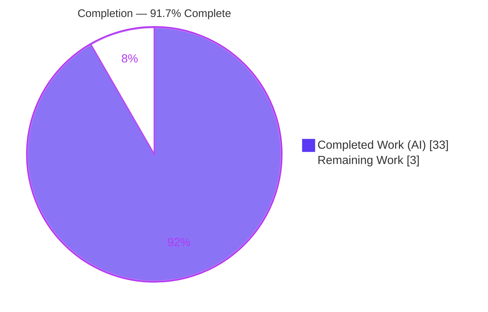
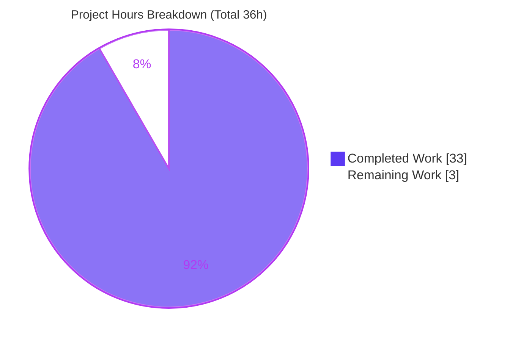
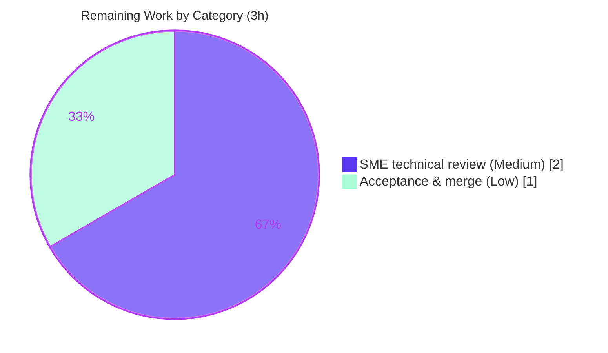

# Blitzy Project Guide

> **Project:** Grafana — "Grouping to matrix" empty-cell emit & downstream behavior investigation
> **Type:** Read-only, runtime-grounded Q&A documentation deliverable
> **Branch:** `blitzy-c5fb97cc-48b1-4f5d-8122-07151346d787` · **Baseline:** `4550cfb5b72886782d9a3e6cf995f8dbd57ca4ff`
> **Grafana version:** `11.5.0-pre`

---

## 1. Executive Summary

### 1.1 Project Overview

This project delivers a single, runtime-grounded investigation document that answers, with observed evidence, exactly what Grafana's **"Grouping to matrix"** transformation emits for the missing `(row × column)` intersections of a sparse input, and how that emitted value is carried forward as a downstream table panel computes totals, thresholds, and color scales. The audience is Grafana engineers and dashboard authors puzzled by the "missing means zero" expectation. The deliverable is a strictly read-only Q&A artifact — no product code is created, modified, or deleted. Business impact: it removes ambiguity about a subtle, path-dependent coercion (`''`) that makes dashboards "feel like they make a different choice somewhere," and it documents the exact configuration to obtain clean zero semantics.

### 1.2 Completion Status

The project is **91.7% complete** on an AAP-scoped hours basis. All 20 AAP-specified requirements are delivered, validated, and committed; the remaining 3 hours are path-to-production activities that require a human (SME review and acceptance/merge).



| Metric | Hours |
| --- | --- |
| **Total Hours** | 36 |
| **Completed Hours (AI + Manual)** | 33 (33 AI autonomous + 0 Manual) |
| **Remaining Hours** | 3 |
| **Percent Complete** | **91.7%** |

*Formula: 33 ÷ (33 + 3) = 33 ÷ 36 = 91.7%.*

### 1.3 Key Accomplishments

- ✅ **Direct answer established at runtime:** the default emit for a missing `(row, column)` cell is the empty string `''` — not `0`, not `null` — captured via the canonical `transformDataFrame` path.
- ✅ **No-Zero fact proven:** the `SpecialValue` enum offers only `True`/`False`/`Null`/`Empty`; "missing means zero" is not selectable.
- ✅ **Four downstream calculation paths traced** with unedited output: SUM totals (raw string concat + table footer re-parse), thresholds (`''→0`), color scale (`''→0`), and per-cell display (`''→NaN→` blank + base color).
- ✅ **Perceived inconsistency reconciled** via a path-dependent coercion table, plus the exact clean "missing means zero" recipe (`emptyValue = Null` + `NullValueMode.AsZero`, with the reducers-only caveat).
- ✅ **17/17 tests pass** (canonical spec 4/4 + reproducible observation harness 13/13); documented output is **byte-for-byte** reproducible (SHA-256 verified).
- ✅ **Read-only compliance:** the source tree is byte-for-byte unchanged; the only file added is the deliverable.

### 1.4 Critical Unresolved Issues

| Issue | Impact | Owner | ETA |
| --- | --- | --- | --- |
| _None._ No blocking issues. All AAP requirements are delivered and validated; 17/17 tests pass; the source tree is unchanged. | — | — | — |

### 1.5 Access Issues

| System/Resource | Type of Access | Issue Description | Resolution Status | Owner |
| --- | --- | --- | --- | --- |
| _No access issues identified._ | — | Repository, toolchain (vendored Yarn 4.5.3), and dependencies (`node_modules`) were all fully accessible; canonical spec and harness ran without credential or network needs. | N/A | — |

### 1.6 Recommended Next Steps

1. **[Medium]** Have a Grafana transformations SME review `blitzy/documentation/grafana_4550cfb5b728.md` for technical accuracy (runtime claims, citations, reconciliation logic). *(≈2h)*
2. **[Low]** Independently re-run the canonical spec (→ 4/4) and, optionally, the §6.3 harness (→ 13/13) to confirm reproducibility before sign-off. *(≈0.5h)*
3. **[Low]** Approve and merge the deliverable to the target branch after confirming the source tree is byte-for-byte unchanged. *(≈0.5h)*

---

## 2. Project Hours Breakdown

### 2.1 Completed Work Detail

All rows below are AAP-scoped autonomous (AI) work, delivered and validated.

| Component | Hours | Description |
| --- | ---: | --- |
| Emit-boundary investigation & runtime capture | 4.5 | Exercised the registered `groupingToMatrix` via `transformDataFrame` on a sparse dataset; captured emit across `emptyValue` = Empty/Null/False/True; documented `SpecialValue` enum (no Zero) and the number-field-holds-string type mismatch. |
| Downstream trace — SUM totals (raw + footer) | 2.5 | Observed raw-reducer string concatenation and position sensitivity (`"05"` vs `"5"`), plus the table footer's numeric re-parse via `getFooterItems`. |
| Downstream trace — thresholds | 1.5 | Observed `'' >= step` coercing `''→0` in `getActiveThreshold`. |
| Downstream trace — color scale | 1.5 | Observed `(value - min)` coercing `''→0`, `percent = 0` in `getScaleCalculator`. |
| Downstream trace — per-cell display & color | 2.5 | Observed `anyToNumber('') = NaN` → blank cell text and base/fallback color via the display processor. |
| Reconciliation + "missing means zero" recipe | 3.0 | Built the path-dependent coercion table; demonstrated the clean recipe (`emptyValue=Null` + `NullValueMode.AsZero`) with the reducers-only caveat. |
| Edge & robustness notes | 2.0 | Duplicate `(row,column)` last-value-wins; mixed-type coercion; `dataplaneFrontendFallback` toggle OFF/ON both emit `''`. |
| Reproducible observation harness engineering | 4.0 | Authored the private-tmp Jest harness (13 tests across 2 suites) reusing the repo's canonical Jest config; strict type-sensitive assertions. |
| Document authoring & structure | 6.0 | Wrote the 1268-line deliverable: direct-answer-first, walkthrough, reconciliation, recipe, edge notes, and appendices. |
| Citation verification + observed/inferred labeling | 2.5 | Verified `file:line` citations across ~26 files (zero corrections); applied 37 `[OBSERVED]` + 7 `[INFERRED]` labels. |
| QA/validation across review iterations | 3.0 | Resolved 14 review findings + QA findings over 3 commits; confirmed 17/17 tests, byte-for-byte output, Prettier gate, and repo integrity. |
| **Total Completed** | **33.0** | |

### 2.2 Remaining Work Detail

All remaining work is path-to-production and requires a human. No AAP-specified content work remains.

| Category | Hours | Priority |
| --- | ---: | --- |
| SME technical review of the deliverable (verify runtime claims, citations, reconciliation, labels) | 2.0 | Medium |
| Stakeholder acceptance & merge to target branch (incl. optional independent reproducibility re-run) | 1.0 | Low |
| **Total Remaining** | **3.0** | |

### 2.3 Hours Reconciliation & Methodology

Completion is measured strictly on AAP-scoped hours (PA1): only requirements defined in the Agent Action Plan plus standard path-to-production activities are counted. The requested product feature — a `Zero` `SpecialValue` (GitHub issue #97632) — is **out of scope** and is excluded from the denominator.

| Quantity | Value | Source |
| --- | ---: | --- |
| Completed Hours (Section 2.1 total) | 33 | Sum of 11 completed components |
| Remaining Hours (Section 2.2 total) | 3 | Sum of 2 path-to-production categories |
| **Total Project Hours** | **36** | 2.1 + 2.2 |
| **Percent Complete** | **91.7%** | 33 ÷ 36 |

Cross-section integrity: Section 2.1 (33) + Section 2.2 (3) = 36 = Total in Section 1.2. Remaining (3) is identical in Sections 1.2, 2.2, and 7. Confidence: **High** — the deliverable is fully authored, validated, and committed, and the scope is bounded.

---

## 3. Test Results

All tests below originate from Blitzy's autonomous validation logs for this project and were independently re-run during this assessment. Because the deliverable is a **behavior investigation** (not a source-code change), the suites are runtime-observation assertions that exercise the real code path; line/branch coverage is not the objective and was not measured (marked N/A).

| Test Category | Framework | Total Tests | Passed | Failed | Coverage % | Notes |
| --- | --- | ---: | ---: | ---: | :---: | --- |
| Canonical transformer spec (`groupingToMatrix.test.ts`) | Jest 29.7.0 | 4 | 4 | 0 | N/A | Exercises `transformDataFrame` on sparse input; asserts the `C2` field is `type=number`, `values: [5, '']`. |
| Observation harness — main suite (`observe.test.ts`, captures A–L) | Jest 29.7.0 | 12 | 12 | 0 | N/A | Real pipeline: `reduceField`, `getActiveThreshold`, `getScaleCalculator`, `getDisplayProcessor`, `getFooterItems`, `getValuePercent`. |
| Observation harness — toggle suite (`toggle.test.ts`) | Jest 29.7.0 | 1 | 1 | 0 | N/A | `dataplaneFrontendFallback` ON path; missing cell still `''`. |
| **Total** | **Jest 29.7.0** | **17** | **17** | **0** | **N/A** | **100% pass.** Output byte-for-byte reproducible (SHA-256 `7315b40…9fbe1`). |

**Notes:**
- Commands ran non-interactive in CI mode (`--watchAll=false --ci`); the repo-root watch-mode `test` script was never used.
- Six `jest-haste-map: duplicate manual mock` warnings appear during runs. They are pre-existing, originate from scanning `public/app`, are unrelated to this transform, and are non-blocking (documented in the deliverable's §6.4).

---

## 4. Runtime Validation & UI Verification

**Runtime health — real code paths exercised via the canonical entry point:**

- ✅ **Transform boundary (`transformDataFrame` + registered `groupingToMatrix`)** — Operational. Default emit `''`; `Null→null`, `False→false`, `True→true`, explicit `Empty→''`. No setting produces `0`.
- ✅ **SUM reducer (`reduceField`)** — Operational. `''` slips past the null-guard and string-concatenates; total is a position-dependent string (`"5"`, `"05"`, `"02"`, `"0"`).
- ✅ **Table footer (`getFooterItems`)** — Operational. Raw string total is re-parsed numerically (`"05" → "5"`).
- ✅ **Thresholds (`getActiveThreshold`)** — Operational. `'' >= step` coerces `''→0` (in isolation).
- ✅ **Color scale (`getScaleCalculator`)** — Operational. `(value - min)` coerces `''→0`, `percent = 0` (in isolation).
- ✅ **Per-cell display (`getDisplayProcessor`)** — Operational. `anyToNumber('') = NaN` → blank text; numeric scaling skipped; base fallback color `#808080`.
- ✅ **Gauge helper (`getValuePercent`)** — Operational. `getValuePercent(NaN, …) = 0`.
- ✅ **`dataplaneFrontendFallback` toggle OFF/ON** — Operational. Missing cell is `''` in both cases.
- ⚠ **Live DOM table cell background painting** — Partial (Inferred). A browser DOM table was not mounted; cell background derivation from `DisplayValue.color` (`getCellColors`/`DefaultCell`) is reasoned from source and explicitly labeled `[INFERRED]` in the deliverable.

**UI verification:** This task introduces **no UI change**, so no browser rendering was required. The transform editor's **"Empty Value"** dropdown (options `Null`/`True`/`False`/`Empty` only) and the absence of a Table `nullValueMode` control were verified by reading the **registered** editors and labeled `[OBSERVED — from registered editors]` / `[INFERRED]` accordingly. No screenshots apply.

---

## 5. Compliance & Quality Review

Cross-map of AAP deliverables and governing rules (the "SWE-AtlasQnA" rule set) to Blitzy's quality benchmarks.

| Benchmark / Rule | Status | Progress | Notes |
| --- | :---: | :---: | --- |
| Run-first methodology via canonical `transformDataFrame` (no synthetic bypass) | ✅ Pass | 100% | Harness registers the real transformer via `mockTransformationsRegistry([groupingToMatrixTransformer])`; 17/17 tests exercise real functions. |
| Exhaustive condition coverage | ✅ Pass | 100% | empty/null/false/true; leading vs trailing empty; toggle OFF/ON; duplicates; mixed types. |
| Observed-vs-inferred discipline | ✅ Pass | 100% | 37 `[OBSERVED]` + 7 `[INFERRED]` labels; inferred items genuinely not observed at runtime. |
| Exact `file:line` citations (grounded precision) | ✅ Pass | 100% | ~26 files verified against source; zero corrections during validation. |
| Actual, unedited output beside each claim | ✅ Pass | 100% | §6.4 pasted output is SHA-256-identical to a live run; diff exit 0. |
| Read-only source repository | ✅ Pass | 100% | `git diff baseline..HEAD` = single `A blitzy/documentation/grafana_4550cfb5b728.md`; source byte-for-byte unchanged. |
| Deliverable at mandated path/name | ✅ Pass | 100% | `blitzy/documentation/grafana_4550cfb5b728.md` (1268 lines) created and committed. |
| Temp-script cleanup / clean working tree | ✅ Pass | 100% | `git status --porcelain` empty before and after validation. |
| Prettier formatting (pre-commit gate) | ✅ Pass | 100% | "All matched files use Prettier code style!" (exit 0). |
| Direct-answer-first structure | ✅ Pass | 100% | The direct answer leads at line 3. |
| SME technical sign-off | ⏳ Pending | 0% | Path-to-production; owned by a human reviewer (Section 2.2). |

**Fixes applied during autonomous validation:** commit `9192f0f57d` addressed 14 review findings; commit `bde48862f7` resolved QA findings (reproducible harness + prose accuracy). **Outstanding items:** none beyond the pending human SME review.

---

## 6. Risk Assessment

Overall posture is **very low**: no source code changed, so there is zero compile/regression risk and backward compatibility is preserved by construction; no dependencies, secrets, or network calls are involved.

| Risk | Category | Severity | Probability | Mitigation | Status |
| --- | --- | :---: | :---: | --- | --- |
| Observations pinned to Grafana `11.5.0-pre`; behavior may differ in other versions | Technical | Low | Low | Version, baseline commit, and `file:line` citations recorded for fast re-verification | Mitigated |
| 7 `[INFERRED]` claims not directly observed (DOM painting, Go boot-data injection, type-copy mechanism, sum empty-input case) | Technical | Low | Low | Explicitly labeled `[INFERRED]`; reasoned from cited source | Accepted |
| 6 `jest-haste-map` duplicate-mock warnings during test runs | Technical | Low | N/A | Pre-existing, unrelated to transform, non-blocking; documented in §6.4 | Accepted |
| Node runtime drift (ran v22.23.1 vs `.nvmrc` v22.11.0) | Technical | Low | Low | Both versions documented; results reproduced byte-for-byte | Accepted |
| No material security exposure (no code/deps/secrets/network; Markdown deliverable) | Security | None | N/A | Read-only investigation; no attack surface introduced | N/A |
| Harness reproducibility depends on installed `node_modules` | Operational | Low | Low | Documented install step; canonical spec is the dependency-light primary path | Mitigated |
| Document staleness if the transform code evolves in future Grafana releases | Operational | Low | Medium | Pinned baseline + `file:line` citations enable quick re-verification | Accepted |
| No external-integration exposure (no services, API keys, or runtime deps) | Integration | None | N/A | Only "integration" is the Jest harness with the repo's own config (verified working) | N/A |
| Stakeholders expecting a code fix for the "no Zero option" gap (issue #97632) | Scope/Process | Low | Low | AAP and deliverable state investigation-only scope; issue #97632 / PR #97642 referenced | Documented |

---

## 7. Visual Project Status

**Project hours breakdown** (Completed = Dark Blue `#5B39F3`, Remaining = White `#FFFFFF`):



**Remaining hours by category** (from Section 2.2, total 3h):



*Integrity check: "Remaining Work" = 3h matches Section 1.2 (Remaining) and Section 2.2 (total). "Completed Work" = 33h matches Section 1.2 (Completed) and Section 2.1 (total).*

---

## 8. Summary & Recommendations

**Achievements.** The project delivers a complete, runtime-grounded answer to a subtle question: Grafana's "Grouping to matrix" transformation emits the **empty string `''`** for missing `(row, column)` cells by default, configurable to `Null`/`True`/`False` — with **no `Zero` option**. The deliverable then traces that `''` through four downstream calculation paths and reconciles precisely why a dashboard "feels like it makes a different choice somewhere": the value is coerced **path-dependently** (string concatenation in raw totals, numeric re-parse in the footer, `''→0` in isolated threshold/scale comparisons, and `''→NaN→` blank + base color in per-cell display). Every behavioral claim is backed by unedited, reproducible runtime output and exact `file:line` citations.

**Remaining gaps.** None in AAP content. The outstanding **3 hours** are path-to-production only: a human SME technical review and stakeholder acceptance/merge.

**Critical path to production.** SME review of the document → optional independent reproducibility re-run → approve & merge. There are no blocking defects; 17/17 tests pass and the source tree is byte-for-byte unchanged.

**Production readiness.** The deliverable is **production-ready** as an artifact. On the AAP-scoped hours basis, the project is **91.7% complete** (33 of 36 hours); the residual reflects human review/acceptance rather than any unfinished autonomous work.

| Success metric | Result |
| --- | --- |
| AAP-specified requirements delivered | 20 / 20 |
| Tests passing | 17 / 17 (100%) |
| Output reproducibility | Byte-for-byte (SHA-256 verified) |
| Source-tree changes outside the deliverable | 0 |
| AAP-scoped completion | 91.7% |

**Recommendation:** proceed with SME review and merge. Note for stakeholders: implementing a `Zero` option (issue #97632) is a separate product change and is intentionally out of scope for this investigation.

---

## 9. Development Guide

This guide reproduces the runtime evidence behind the deliverable. Every command is copy-pasteable and was tested during assessment. Run all commands from the repository root unless noted.

### 9.1 System Prerequisites

- **OS:** Linux or macOS (validated on Ubuntu).
- **Node.js:** `v22.11.0` pinned by `.nvmrc` (validated with `v22.23.1`; behavior identical).
- **Package manager:** Yarn `4.5.3`, **vendored** at `.yarn/releases/yarn-4.5.3.cjs` (`packageManager: yarn@4.5.3`, `nodeLinker: node-modules`). Do not install a different Yarn.
- **Test framework:** Jest `29.7.0`.
- **Git** (+ Git LFS). **Disk:** ~10 GB free (repo ≈ 3.3 GB plus `node_modules`).

### 9.2 Environment Setup

```bash
# From the repository root
node --version                                   # expect v22.x (v22.11.0 pinned; v22.23.1 OK)
node .yarn/releases/yarn-4.5.3.cjs --version      # expect 4.5.3
cat .nvmrc                                        # v22.11.0
```

### 9.3 Dependency Installation

`node_modules` is already present in this checkout — no reinstall is required. Only if dependencies are missing:

```bash
CI=true node .yarn/releases/yarn-4.5.3.cjs install --immutable
```

### 9.4 Run the Canonical Spec (primary verification)

```bash
CI=true node .yarn/releases/yarn-4.5.3.cjs jest \
  packages/grafana-data/src/transformations/transformers/groupingToMatrix.test.ts \
  --watchAll=false --ci
# Expected: Test Suites: 1 passed, Tests: 4 passed, Snapshots: 1 passed
```

### 9.5 Reproduce the Observation Harness (deep verification)

The harness lives in a **private temp directory outside the checkout** so the repository is never touched. Recreate the three files verbatim from the deliverable's **§6.3** (quoted heredocs: `harness.jest.config.js`, `observe.test.ts`, `toggle.test.ts`), then:

```bash
REPO="$(pwd)"
HARNESS_DIR="$(mktemp -d "${TMPDIR:-/tmp}/gtm_harness.XXXXXXXX")"
chmod 700 "$HARNESS_DIR"
# ... write the three files from §6.3 into "$HARNESS_DIR" ...
CI=true REPO="$REPO" HARNESS_DIR="$HARNESS_DIR" \
  node .yarn/releases/yarn-4.5.3.cjs jest \
  --config "$HARNESS_DIR/harness.jest.config.js" --watchAll=false --ci --runInBand
# Expected: Test Suites: 2 passed, Tests: 13 passed
cat "$HARNESS_DIR/out.txt"                       # 68 lines of captured evidence
rm -rf "$HARNESS_DIR"                            # cleanup — keep the repo clean
```

### 9.6 Verification Steps

```bash
# Deliverable exists (1268 lines)
wc -l blitzy/documentation/grafana_4550cfb5b728.md

# Source tree unchanged — expect a single added file
git diff 4550cfb5b72886782d9a3e6cf995f8dbd57ca4ff..HEAD --name-status

# Working tree clean — expect empty output
git status --porcelain

# Prettier gate (pre-commit) — expect "All matched files use Prettier code style!"
CI=true node .yarn/releases/yarn-4.5.3.cjs prettier --check \
  blitzy/documentation/grafana_4550cfb5b728.md
```

### 9.7 Example Usage — read the answer

```bash
# The direct answer (leads the document)
sed -n '1,55p' blitzy/documentation/grafana_4550cfb5b728.md
# The reconciliation table
sed -n '359,389p' blitzy/documentation/grafana_4550cfb5b728.md
# The verified file:line citations
sed -n '1176,1253p' blitzy/documentation/grafana_4550cfb5b728.md
```

### 9.8 Troubleshooting

- **Tests hang / enter watch mode:** never run the repo-root `test` script unguarded. Always pass `--watchAll=false --ci` and set `CI=true`.
- **`jest-haste-map: duplicate manual mock` warnings:** benign and pre-existing (from scanning `public/app`); unrelated to this transform; safe to ignore.
- **`node_modules` missing:** run the immutable install in §9.3.
- **Harness can't resolve modules (e.g., `tslib`):** ensure `modulePaths` points at `$REPO/node_modules` (as in the §6.3 config) and that `REPO`/`HARNESS_DIR` are exported.
- **Keep the repo clean:** always create the harness under `mktemp -d` outside the checkout and `rm -rf` it afterward; verify with `git status --porcelain`.
- **Node version differences:** `v22.23.1` vs the pinned `v22.11.0` does not change results.

---

## 10. Appendices

### Appendix A — Command Reference

| Purpose | Command |
| --- | --- |
| Node version | `node --version` |
| Yarn version (vendored) | `node .yarn/releases/yarn-4.5.3.cjs --version` |
| Install deps (only if missing) | `CI=true node .yarn/releases/yarn-4.5.3.cjs install --immutable` |
| Canonical spec | `CI=true node .yarn/releases/yarn-4.5.3.cjs jest packages/grafana-data/src/transformations/transformers/groupingToMatrix.test.ts --watchAll=false --ci` |
| Harness | `CI=true REPO=$(pwd) HARNESS_DIR=<dir> node .yarn/releases/yarn-4.5.3.cjs jest --config "$HARNESS_DIR/harness.jest.config.js" --watchAll=false --ci --runInBand` |
| Prettier check | `CI=true node .yarn/releases/yarn-4.5.3.cjs prettier --check blitzy/documentation/grafana_4550cfb5b728.md` |
| Source-integrity diff | `git diff 4550cfb5b72886782d9a3e6cf995f8dbd57ca4ff..HEAD --name-status` |
| Working-tree status | `git status --porcelain` |
| Authorship | `git log --author="agent@blitzy.com" 4550cfb5b7..HEAD --oneline` |

### Appendix B — Port Reference

Not applicable. This investigation is Jest-based and starts no server or listening port. (The Grafana dev server default `:3000` is unused by this task.)

### Appendix C — Key File Locations

| File | Role |
| --- | --- |
| `blitzy/documentation/grafana_4550cfb5b728.md` | **The deliverable** (1268 lines). |
| `packages/grafana-data/src/transformations/transformers/groupingToMatrix.ts` | Emit boundary: `:26` default `SpecialValue.Empty`, `:117` `?? getSpecialValue`, `:133` `type: valueField.type`, `:178-189` `getSpecialValue`. |
| `packages/grafana-data/src/transformations/transformers/groupingToMatrix.test.ts` | Canonical spec; `:97-100` asserts `[5, '']` on a `number` field. |
| `packages/grafana-data/src/types/transformations.ts` | `SpecialValue` enum `:113-117` (no `Zero`). |
| `packages/grafana-data/src/transformations/transformDataFrame.ts` | Canonical entry point. |
| `packages/grafana-data/src/transformations/fieldReducer.ts` | Totals: `:489`/`:500` guards, `:508` `+=`, `:201` `nullAsZero`, `:493-494` `= 0`. |
| `packages/grafana-data/src/field/thresholds.ts` | `:15` `value >= threshold.value`. |
| `packages/grafana-data/src/field/scale.ts` | `:32` `percent = (value - min)/delta`. |
| `packages/grafana-data/src/field/displayProcessor.ts` | `:96` `anyToNumber`, `:144` numeric branch, `:188-192` base-color fallback. |
| `packages/grafana-data/src/utils/anyToNumber.ts` | `:13-14` `'' → NaN`. |
| `public/app/features/transformers/editors/GroupingToMatrixTransformerEditor.tsx` | "Empty Value" options `:61-66`, `:100`. |
| `packages/grafana-ui/src/components/Table/{utils,FooterCell,DefaultCell,BarGaugeCell}.tsx` | Footer totals & per-cell render surface. |

### Appendix D — Technology Versions

| Component | Version | Source |
| --- | --- | --- |
| Grafana (monorepo) | `11.5.0-pre` | `package.json` |
| Node.js | `v22.11.0` pinned (`v22.23.1` used) | `.nvmrc` |
| Yarn | `4.5.3` (vendored) | `.yarn/releases/yarn-4.5.3.cjs` |
| Jest | `29.7.0` | dev dependency |
| RxJS | `7.8.1` | operator pipeline behind `transformDataFrame` |

### Appendix E — Environment Variable Reference

| Variable | Purpose |
| --- | --- |
| `CI=true` | Forces non-interactive Jest (no watch mode). |
| `REPO` | Absolute repo root, consumed by the harness Jest config. |
| `HARNESS_DIR` | Private temp directory (outside the checkout) holding the harness files. |
| `TMPDIR` | Optional base for `mktemp -d` (defaults to `/tmp`). |

*Product note: there is **no** Table-panel UI editor for `nullValueMode`; the null-as-zero recipe in the deliverable's §4 is set programmatically via `field.config.nullValueMode` (e.g., a field override in provisioning/JSON), not an environment variable.*

### Appendix F — Developer Tools Guide

- **Jest (CI mode):** `--watchAll=false --ci` for all runs; `--runInBand` for the harness (single worker, deterministic ordering).
- **Prettier:** `prettier --check <file>` is the applicable pre-commit gate for Markdown (`lefthook.yml`).
- **Git diff/log:** verify source integrity (`--name-status` against the baseline) and authorship (`--author="agent@blitzy.com"`).
- **`mktemp -d` + `chmod 700`:** create an owner-only private harness directory outside the checkout so `git status` stays clean.

### Appendix G — Glossary

| Term | Meaning |
| --- | --- |
| **Grouping to matrix** | Transformation that pivots three fields (column, row, value) into a matrix; fills absent `(row,column)` cells with a special value. |
| **`SpecialValue`** | Enum of substitution values for empty cells: `True`, `False`, `Null`, `Empty` (no `Zero`). |
| **Emit boundary** | The point in the transformer where a missing cell is resolved to `getSpecialValue(emptyValue)`. |
| **Raw probe vs table render** | A raw function handed `''` directly (e.g., threshold/scale) may treat it as `0`; the table body instead routes every value through the display processor first. |
| **`NullValueMode.AsZero`** | Field mode that makes the reducers count `null` as `0` (does not affect per-cell display). |
| **`[OBSERVED]` / `[INFERRED]`** | Label discipline: captured from a real run vs reasoned from reading source. |