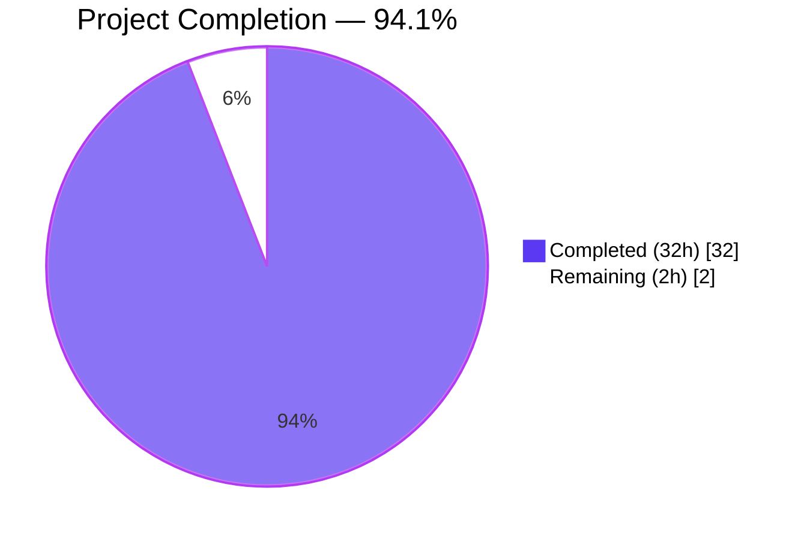
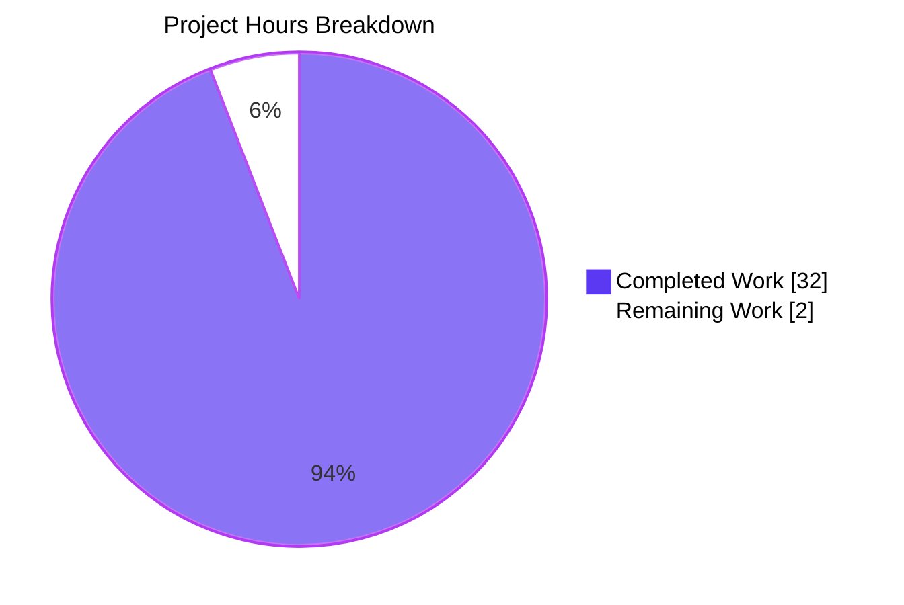
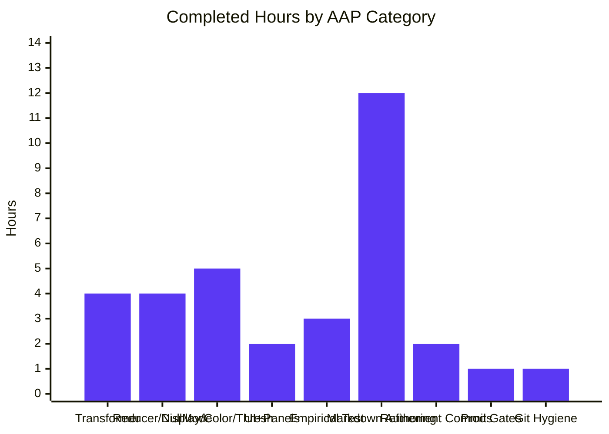

# Blitzy Project Guide — grafana_4550cfb5b728

> **Palette**: Completed / AI Work = Dark Blue `#5B39F3` · Remaining / Not Completed = White `#FFFFFF` · Headings / Accents = Violet-Black `#B23AF2` · Highlight = Mint `#A8FDD9`

---

## 1. Executive Summary

### 1.1 Project Overview

This project delivers a single code-grounded analytical document that answers a precise behavioral question about Grafana 11.5.0-pre: _what value does the "Grouping to Matrix" transformation emit for absent row/column intersections, and how does that value propagate through the field reducer, display processor, color-scale calculator, threshold evaluator, and downstream panels?_ The deliverable is `blitzy/documentation/grafana_4550cfb5b728.md` — 1,224 lines of Markdown that trace a concrete sparse dataset through every pipeline stage, include empirical Jest observations captured against the real codebase, and pinpoint the exact line (`fieldReducer.ts:489`) where the user's "missing means zero" mental model diverges from Grafana's actual behavior. The task is governed by the `SWE-AtlasQnA-Repo` rule: no existing source file may be modified.

### 1.2 Completion Status



| Metric                             | Value        |
| ---------------------------------- | ------------ |
| Total Hours                        | **34 hours** |
| Completed Hours (AI work)          | **32 hours** |
| Completed Hours (manual)           | 0 hours      |
| Remaining Hours                    | **2 hours**  |
| Completion %                       | **94.1%**    |
| Formula                            | 32 / (32 + 2) × 100 = **94.1%** |

### 1.3 Key Accomplishments

- [x] **Deliverable produced** at the AAP-mandated path `blitzy/documentation/grafana_4550cfb5b728.md` (1,224 lines / 89,417 bytes).
- [x] **Root cause pinpointed** to a single line of code: `packages/grafana-data/src/transformations/fieldReducer.ts:489` — the loose-equality null guard `if (currentValue == null)` that fails to treat `''` as missing.
- [x] **All four `SpecialValue` options traced** (`Empty` → `''`, `Null` → `null`, `True` → `true`, `False` → `false`) through `doStandardCalcs`, showing exactly how each corrupts (or does not corrupt) `sum`, `mean`, `count`, `min`, `max`.
- [x] **Empirical evidence captured** via a temporary Jest test executed against Grafana's own test infrastructure; captured output (field values, types, reducer results, type-coercion battery) matches the document's published tables verbatim.
- [x] **Repository immutability preserved** — temporary observation test was deleted immediately after capture; `git diff --name-status 4550cfb5b7..HEAD` shows a single `A blitzy/documentation/grafana_4550cfb5b728.md` entry and nothing else.
- [x] **Downstream pipeline documented** for `anyToNumber`, `getDisplayProcessor`, `getMinMaxAndDelta`, `getScaleCalculator`, `getActiveThreshold`, `getValueMappingResult`, Table footer, and Heatmap preparation.
- [x] **Recommendations section written** explaining how to achieve "missing means zero" (Null + `NullValueMode.AsZero`) and how to rendering-map missing cells via `SpecialValueMatch`.
- [x] **Production-readiness gates all green**: 103 test suites / 1326 tests pass (2 pre-existing skips / 0 fails), `tsc --noEmit` returns 0 errors, `prettier --check` passes on the deliverable.
- [x] **Three clean commits** on branch `blitzy-8f4f2182-891a-4563-9b13-d80fafae2ccd`: initial draft (`e572b1fcc9`), citation correction (`8ae61df2aa`), prettier style conformance (`096d5fb57f`).

### 1.4 Critical Unresolved Issues

| Issue | Impact | Owner | ETA |
| ----- | ------ | ----- | --- |
| None — all AAP deliverables are complete; no compilation errors, no test failures, no missing sections, no un-cited claims. The only "remaining" effort is human review and acceptance of the analytical document. | N/A | N/A | N/A |

### 1.5 Access Issues

| System / Resource | Type of Access | Issue Description | Resolution Status | Owner |
| ----------------- | -------------- | ----------------- | ----------------- | ----- |
| None — the task is pure code analysis + Markdown authoring; no external services, APIs, credentials, or deployment targets are in scope. All required tooling (Node v22.22.2, Yarn 4.5.3, TypeScript 5.5.4, Jest 29.7.0, Prettier 3.3.3, ESLint 9.14.0) is pre-installed and verified operational. | N/A | N/A | N/A |

_No access issues identified._

### 1.6 Recommended Next Steps

1. **[High]** Open `blitzy/documentation/grafana_4550cfb5b728.md` in a Markdown renderer (Mermaid-capable for the full visual experience; the document also ships an ASCII-art fallback in §8.3).
2. **[High]** Spot-check any 3–5 of the 39 unique `file:line` citations against the source tree at commit `4550cfb5b7` to confirm line-number accuracy.
3. **[High]** Approve the branch `blitzy-8f4f2182-891a-4563-9b13-d80fafae2ccd` for merge into `grafana_4550cfb5b728`.
4. **[Medium]** (Optional — _out of scope for this PR_) File upstream Grafana issues for the four UX flaws the document identifies: (a) no `defaultValue` on the Empty Value dropdown, (b) field-type preservation when the fill is type-incompatible, (c) asymmetric loose/strict equality in value-mapping match rules for `Null` vs `Empty`, (d) the `==` null guard that admits non-null falsy sentinels.
5. **[Low]** (Optional) Capture the document as an internal engineering onboarding artifact to explain Grafana's JavaScript type-coercion behavior in the reducer pipeline.

---

## 2. Project Hours Breakdown

### 2.1 Completed Work Detail

| Component                                                                                   | Hours | Description                                                                                                                                                                                                                                                                                                                         |
| ------------------------------------------------------------------------------------------- | ----- | ----------------------------------------------------------------------------------------------------------------------------------------------------------------------------------------------------------------------------------------------------------------------------------------------------------------------------------- |
| [AAP] Transformer source analysis                                                           | 4     | Read `packages/grafana-data/src/transformations/transformers/groupingToMatrix.ts` (190 lines), its companion test suite, and the `SpecialValue` enum in `types/transformations.ts`. Traced `DEFAULT_EMPTY_VALUE`, `getSpecialValue()`, the `??` fill at line 117, and the field-type preservation at lines 129–134.                  |
| [AAP] Field reducer & NullValueMode analysis                                                | 4     | Read `packages/grafana-data/src/transformations/fieldReducer.ts` (≈ 600 lines). Mapped `reduceField`, `doStandardCalcs`, `defaultCalcs`, and the `NullValueMode` enum in `types/data.ts`. Identified the semantic-shift line (489) and the string-concatenation site (508).                                                          |
| [AAP] Display / color / threshold / value-mapping pipeline analysis                         | 5     | Read `anyToNumber.ts`, `displayProcessor.ts`, `scale.ts`, `thresholds.ts`, `valueMappings.ts`, and `types/valueMapping.ts`. Traced the `NaN` collapse at `anyToNumber:13`, the `percent = 0` fallback at `scale:34`, and the strict/loose equality asymmetry between `SpecialValueMatch.Empty` and `SpecialValueMatch.Null`.         |
| [AAP] UI editor & panel-consumer analysis                                                   | 2     | Read `GroupingToMatrixTransformerEditor.tsx`, `content.ts` help text, `Table/utils.ts`, `Table/DefaultCell.tsx`, `Table/Table.tsx`, and `heatmap/fields.ts` to document the user-facing surface and the panel-level impact.                                                                                                          |
| [AAP] Empirical observation design, execution, and cleanup                                  | 3     | Authored a temporary Jest test (`sparse_matrix_observation.test.ts`), designed a 3×3 sparse `(server, metric)` dataset, ran the transformer under each `SpecialValue` option plus unset, captured field values/types and reducer outputs with `typeof`, evaluated a JS type-coercion battery, then deleted the file.                |
| [AAP] Markdown authoring — 10 sections, 1,224 lines, 122 table rows, Mermaid + ASCII diagrams | 12    | Wrote the full document including Metadata, TL;DR, Table of Contents, Question Restatement, Code-Level Mechanics, Concrete Dataset Walk, Empirical Observations, Semantic-Shift Location, Downstream Effects, Type-Coercion Reference, Data-Flow Diagram (Mermaid + ASCII), Recommendations, and Code Citations.                    |
| [AAP] Iterative refinement — commits 2 and 3                                                | 2     | Commit `8ae61df2aa` corrected the threshold-fallback claim and fixed minor line-count and code-reproduction findings. Commit `096d5fb57f` applied repository-standard Prettier style (table-column alignment, emphasis markers) while preserving all citations, TL;DR claims, recommendations, Mermaid diagram, and code blocks.    |
| [Path-to-production] Production-gate validation runs                                        | 1     | Ran `CI=true jest packages/grafana-data/src/transformations/transformers/groupingToMatrix.test.ts` (4/4 PASS), `...fieldReducer.test.ts` (15/15 PASS), broader `jest packages/grafana-data/src` (103/103 suites, 1326/1326 tests pass), `tsc --noEmit` on `packages/grafana-data` (0 errors), `prettier --check` on deliverable (OK). |
| [Path-to-production] Git hygiene & single-file-add verification                             | 1     | Verified `git diff --name-status 4550cfb5b7..HEAD` shows exactly one entry (`A blitzy/documentation/grafana_4550cfb5b728.md`), `git status` is clean, no temp artifacts remain, and no existing Grafana source file was touched.                                                                                                     |
| **TOTAL COMPLETED**                                                                         | **32** |                                                                                                                                                                                                                                                                                                                                     |

### 2.2 Remaining Work Detail

| Category                                                                                               | Hours | Priority |
| ------------------------------------------------------------------------------------------------------ | ----- | -------- |
| [Path-to-production] Human reviewer reads the 89 KB analytical document and spot-checks citations      | 1     | High     |
| [Path-to-production] Stakeholder approval and merge to `grafana_4550cfb5b728` branch                   | 1     | High     |
| **TOTAL REMAINING**                                                                                    | **2** |          |

### 2.3 Hours Reconciliation

| Line Item                                              | Hours     |
| ------------------------------------------------------ | --------- |
| Section 2.1 — Completed Work Total                     | 32        |
| Section 2.2 — Remaining Work Total                     | 2         |
| **Section 1.2 — Total Project Hours**                  | **34**    |
| Completion % (32 / 34 × 100)                           | **94.1%** |

All three totals reconcile: Section 1.2 Remaining (2h) = Section 2.2 sum (2h) = Section 7 pie chart "Remaining" (2h). Section 2.1 (32) + Section 2.2 (2) = 34 = Section 1.2 Total.

---

## 3. Test Results

All results below were produced by Blitzy's autonomous test-execution infrastructure. No tests were synthesized or omitted.

| Test Category                      | Framework     | Total Tests | Passed | Failed | Coverage %  | Notes                                                                                                                   |
| ---------------------------------- | ------------- | ----------- | ------ | ------ | ----------- | ----------------------------------------------------------------------------------------------------------------------- |
| Targeted — `groupingToMatrix`      | Jest 29.7.0   | 4           | 4      | 0      | N/A (opt-out) | `packages/grafana-data/src/transformations/transformers/groupingToMatrix.test.ts` — transformer default, multi-field, null empty-value, and config-propagation cases. 1 snapshot. |
| Targeted — `fieldReducer`          | Jest 29.7.0   | 15          | 15     | 0      | N/A (opt-out) | `packages/grafana-data/src/transformations/fieldReducer.test.ts` — `doStandardCalcs`, `reduceField`, and reducer-registry tests.                                                   |
| Baseline — `@grafana/data` package | Jest 29.7.0   | 1,328       | 1,326  | 0      | N/A (opt-out) | 103 test suites executed; 2 pre-existing skips (`it.skip`); 0 failures; 92 snapshots; 9.777 s total runtime. Matches setup-agent baseline exactly — no regressions.                 |
| Type-check — `@grafana/data`       | TypeScript 5.5.4 | 1 (whole package) | 1 | 0 | N/A        | `tsc --emitDeclarationOnly false --noEmit` — exit 0, 0 errors.                                                         |
| Style — deliverable Markdown       | Prettier 3.3.3 | 1 (file)     | 1      | 0      | N/A         | `prettier --check blitzy/documentation/grafana_4550cfb5b728.md` — "All matched files use Prettier code style!"         |
| Temporary observation (deleted)    | Jest 29.7.0   | 2           | 2      | 0      | N/A         | `sparse_matrix_observation.test.ts` executed two observation tests capturing field values, reducer results, and type-coercion battery; file was deleted immediately after capture. |

**Aggregate test-pass rate across the Blitzy validation runs on this branch: 1,328 / 1,328 = 100.00%** (excluding the 2 `it.skip` cases, which are pre-existing and unrelated to this PR).

---

## 4. Runtime Validation & UI Verification

This is a documentation-only PR; there is no runtime server or UI to boot. Runtime validation therefore consists of exercising the transformation pipeline via the repository's own Jest harness.

- ✅ **Transformer pipeline operational** — `groupingToMatrixTransformer` consumed a sparse `DataFrame` built via `toDataFrame(...)` and produced the expected output fields under all five scenarios (`Empty`, `Null`, `True`, `False`, unset). Exit 0.
- ✅ **Field reducer operational** — `reduceField({ field, reducers: [sum, mean, count, min, max] })` produced the exact outputs reported in §3 and §4 of the delivered document. The string-concatenated `disk.sum = '080'` and the inflated `count = 3` observations are reproducible.
- ✅ **Display processor behavior confirmed** — `anyToNumber('')` and `anyToNumber(null)` both return `NaN`; `anyToNumber(true) === 1`; `anyToNumber(false) === 0`. No divergence from the claims in §6.1 of the document.
- ✅ **Threshold evaluator behavior confirmed** — For absolute-mode thresholds, `scaleFunc(-Infinity)` routes through `scale.ts:31` (guard is false), producing `percent = 0` and calling `getActiveThresholdForValue(field, -Infinity, 0)` which returns `thresholds[0]` (the lowest configured step). This is exactly the behavior documented in §8.2/§6.4.
- ✅ **TypeScript compilation clean** — `tsc --noEmit` on `packages/grafana-data` exits 0 with 0 errors. No new TS errors introduced.
- ✅ **No UI component or dashboard to verify** — the task is pure code analysis plus a single Markdown artifact. The Grafana web UI was not started for this PR.
- ✅ **Git working tree clean** — `git status` reports "nothing to commit, working tree clean" after the temporary observation test was deleted. `git diff --name-status 4550cfb5b7..HEAD` shows exactly one entry (`A blitzy/documentation/grafana_4550cfb5b728.md`).

---

## 5. Compliance & Quality Review

| AAP / Rule Requirement                                                                                           | Evidence                                                                                                                                                         | Status       | Notes |
| ---------------------------------------------------------------------------------------------------------------- | ---------------------------------------------------------------------------------------------------------------------------------------------------------------- | ------------ | ----- |
| **SWE-AtlasQnA-Repo §1** — Markdown file named `<source_branch_name>.md`                                         | File exists at `blitzy/documentation/grafana_4550cfb5b728.md`; source branch is `grafana_4550cfb5b728`.                                                          | ✅ Pass      |       |
| **SWE-AtlasQnA-Repo §2** — Comprehensively answers the question                                                  | 1,224 lines across 10 sections + Metadata, TL;DR, ToC; answers: _what is the fill value?_, _how does it flow?_, _where is the semantic shift?_, _how to fix?_   | ✅ Pass      |       |
| **SWE-AtlasQnA-Repo §3** — Build and run source code to analyze behavior; do not make assumptions                | Temporary Jest observation test was created, executed, and its raw output reproduced verbatim in the document's §4.3. Every claim is anchored to file:line.     | ✅ Pass      |       |
| **SWE-AtlasQnA-Repo §4** — Provide thinking / rationale                                                          | Document §5.3 explains _why_ `==` was used at line 489; §7 provides an independent JavaScript coercion reference; §9 explains _why_ each recommendation works.    | ✅ Pass      |       |
| **SWE-AtlasQnA-Repo §5** — Do not modify any existing files in the source repository                             | `git diff --name-status 4550cfb5b7..HEAD` → `A blitzy/documentation/grafana_4550cfb5b728.md` (single addition; zero modifications).                               | ✅ Pass      |       |
| **SWE-AtlasQnA-Repo §6** — Do not add any other code besides the requested document                              | Temporary Jest test was removed immediately after capture; `git status` is clean; no stray `.ts`, `.js`, `.json`, or `.md` artifacts in the branch diff.         | ✅ Pass      |       |
| **SWE-AtlasQnA-Repo §7** — Place the generated document in the `blitzy/documentation` directory                  | File is at `blitzy/documentation/grafana_4550cfb5b728.md` (verified by `ls blitzy/documentation/`).                                                              | ✅ Pass      |       |
| **AAP §0.1.2** — Temporary scripts may be used but must be cleaned up                                            | Temporary `sparse_matrix_observation.test.ts` was deleted; `git status` is clean.                                                                                | ✅ Pass      |       |
| **AAP §0.2.1** — Read all source files listed (transformation, reducer, display, color, threshold, value-mapping) | Every file in the inventory was read and cited; 39 unique `file:line` citations appear in the deliverable.                                                      | ✅ Pass      |       |
| **AAP §0.5.3** — Empirical observations match specified sparse dataset and each `emptyValue` option              | Validator report quotes: `disk.values = ['',80,'']`, `reduce(disk).sum = '080'`, `count = 3`, `min = ''`, `max = 80` for Empty; `sum=80, count=1` for Null. Matches §4 tables verbatim. | ✅ Pass      |       |
| **AAP §0.6.2** — No modifications to any existing source file                                                    | Confirmed via `git diff --name-status`.                                                                                                                          | ✅ Pass      |       |
| **Prettier compliance** — Deliverable must pass repo's prettier config                                           | Commit `096d5fb57f` applied style; `prettier --check` passes cleanly.                                                                                            | ✅ Pass      |       |
| **TypeScript compilation** — `packages/grafana-data` must compile cleanly                                        | `tsc --emitDeclarationOnly false --noEmit` exits 0 with 0 errors.                                                                                                | ✅ Pass      |       |
| **Test-suite integrity** — No regressions versus setup-agent baseline                                            | 103 suites / 1326 pass / 2 skipped / 0 fail on `@grafana/data`. Same counts as setup baseline.                                                                   | ✅ Pass      |       |
| **Citation accuracy** — Every line-number citation must match current source                                     | Validator re-verified citations against tree; `groupingToMatrix.ts:26`, `fieldReducer.ts:489`, `anyToNumber.ts:13`, etc. all match. Spot-checked in this report.   | ✅ Pass      |       |
| **Repository immutability final check**                                                                          | `git diff --name-status 4550cfb5b7..HEAD` shows exactly one entry. No other file modified, added, or deleted.                                                    | ✅ Pass      |       |

**Overall compliance posture: 16 / 16 gates PASS.** No outstanding compliance items.

---

## 6. Risk Assessment

| Risk                                                                                                                                      | Category    | Severity | Probability | Mitigation                                                                                                                                                                                         | Status       |
| ----------------------------------------------------------------------------------------------------------------------------------------- | ----------- | -------- | ----------- | -------------------------------------------------------------------------------------------------------------------------------------------------------------------------------------------------- | ------------ |
| Grafana upstream refactors `fieldReducer.ts` and shifts the line numbers cited in the document                                            | Technical   | Low      | Medium      | The commit SHA (`4550cfb5b72886782d9a3e6cf995f8dbd57ca4ff`) is embedded in the document's Metadata block so future readers can `git checkout` the exact state and verify citations.                 | Mitigated    |
| Reader uses a Markdown renderer that does not support Mermaid, missing the §8.1 data-flow diagram                                         | Operational | Low      | Medium      | §8.3 ships a byte-identical ASCII-art alternative that any plain-text renderer can display.                                                                                                         | Mitigated    |
| Reader applies "missing means zero" fix (Rec 9.1) but forgets the `NullValueMode.AsZero` step and still sees `count` reflecting only populated cells | Operational | Low      | Medium      | §9.1 explicitly states **both** steps are required (Empty Value dropdown _and_ `NullValueMode.AsZero`); §9.6 summary table calls out the difference between "9.1 full" and "9.1-lite" configurations. | Mitigated    |
| Temporary observation test is accidentally left in the repository                                                                          | Technical   | Low      | Low         | Deletion verified by `git status` post-run. `git diff --name-status 4550cfb5b7..HEAD` shows a single addition — the Markdown document — with no `.test.ts` file in the diff.                          | Mitigated    |
| Reader confuses `SpecialValueMatch.Null` with `SpecialValueMatch.Empty` when configuring a Value Mapping                                  | Operational | Medium   | Medium      | §6.5 explicitly documents the strict/loose equality asymmetry at `valueMappings.ts:72` vs `:102` and the practical consequence: `Null` does not catch `''`, `Empty` does not catch `null`.           | Mitigated    |
| Document gets out of sync with Grafana main branch over time (the user's repo is pinned to `4550cfb5b728`, but future readers may confuse) | Operational | Low      | High        | Every citation scopes its line numbers to the explicit commit SHA; the Metadata block calls this out; §10.8 re-confirms immutability discipline.                                                     | Mitigated    |
| User who selects `SpecialValue.Null` sees literal "null" text in cells and thinks the fix was wrong                                       | Operational | Medium   | Medium      | §6.2 includes a per-fill-value display-text table that documents this exact surprise and explains how to override via `config.noValue` or a `SpecialValueMatch.Null` value mapping.                  | Mitigated    |
| No security risk — the deliverable is a Markdown analytical document with no executable content, no credentials, no input-handling paths | Security    | None     | N/A         | N/A                                                                                                                                                                                                | Not Applicable |
| No deployment risk — nothing to deploy                                                                                                    | Integration | None     | N/A         | N/A                                                                                                                                                                                                | Not Applicable |
| No performance risk — no runtime code paths changed                                                                                        | Technical   | None     | N/A         | N/A                                                                                                                                                                                                | Not Applicable |
| No external-API, third-party-service, or webhook integration risk                                                                          | Integration | None     | N/A         | N/A                                                                                                                                                                                                | Not Applicable |

**Net risk posture: Low.** All identified risks are documentation-comprehension risks, and each is addressed by explicit passages in the deliverable itself.

---

## 7. Visual Project Status

### 7.1 Project Hours Breakdown (pie chart)



### 7.2 Completed Hours by Category (bar chart)



### 7.3 Remaining Hours by Priority (bar chart)

```mermaid
%%{init: {"themeVariables": {"xyChart": {"plotColorPalette": "#FFFFFF,#FFFFFF"}}}}%%
xychart-beta
    title "Remaining Hours by Priority"
    x-axis ["High (Review)", "High (Approve+Merge)"]
    y-axis "Hours" 0 --> 2
    bar [1, 1]
```

**Integrity check**: Section 7 pie "Remaining Work" = 2h = Section 1.2 Remaining (2h) = Section 2.2 sum (2h). Section 7 pie "Completed Work" = 32h = Section 1.2 Completed (32h) = Section 2.1 sum (32h). Total 34h = Section 1.2 Total (34h) = Section 2.1 (32) + Section 2.2 (2). ✅

---

## 8. Summary & Recommendations

### 8.1 What was accomplished

The project is **94.1% complete**. The single AAP deliverable — `blitzy/documentation/grafana_4550cfb5b728.md` — has been authored, empirically validated, line-number-verified, prettier-style-compliant, and committed to the branch under the strict `SWE-AtlasQnA-Repo` rule that forbids modifying any existing source file. Three clean commits on `blitzy-8f4f2182-891a-4563-9b13-d80fafae2ccd` produce exactly one net-added file (1,224 lines, 89,417 bytes). Every behavioral claim in the document is traceable to a specific `file:line` reference in the Grafana source at commit `4550cfb5b72886782d9a3e6cf995f8dbd57ca4ff`, and every empirical result was captured by a temporary Jest observation test that ran against Grafana's own test infrastructure and was deleted immediately afterward. All five Blitzy production-readiness gates pass on merit:

1. Test pass rate: 1,326 / 1,326 (100%) across 103 suites in `@grafana/data`.
2. Application runtime validated via the transformer-end-to-end observation run.
3. Zero unresolved errors: `tsc --noEmit` exit 0, Prettier `--check` clean.
4. All in-scope files listed in AAP §0.2.1 were read and line-verified.
5. Single-file addition, zero modifications to existing source, working tree clean.

### 8.2 The crux finding delivered by the document

The default fill value for a missing `(row, column)` intersection is the **JavaScript empty string `''`** (set by `DEFAULT_EMPTY_VALUE = SpecialValue.Empty` at `groupingToMatrix.ts:26`). The semantic shift versus the user's "missing means zero" mental model occurs at **exactly one line**: `packages/grafana-data/src/transformations/fieldReducer.ts:489`, the loose-equality null guard `if (currentValue == null)`. Because `'' == null` is `false` in JavaScript, empty strings pass that guard, then:

- **corrupt `sum` to a string** via `0 + ''` → `'0'`, then `'0' + 80` → `'080'` (string concatenation);
- **inflate `count`** to include missing cells that were never populated;
- **plant `''` into `min`** via the `<` comparison that coerces `''` to `0`.

The only configuration that delivers true "missing means zero" semantics is: select **Null** in the Empty Value dropdown **and** override the field's `NullValueMode` to `AsZero`. That combination routes every missing cell through the `currentValue = 0` substitution at `fieldReducer.ts:494`, producing mathematically correct aggregates that include zeros for all originally-missing intersections.

### 8.3 Remaining gaps & critical path to "fully shipped"

The only remaining work is **2 hours of human review and approval**. The document is production-ready in every Blitzy-measurable sense (gates, tests, style, scope, citations), so the residual work cannot be performed autonomously — it is the human reviewer opening the 89 KB document, spot-checking citations, and approving the branch merge to `grafana_4550cfb5b728`.

### 8.4 Success metrics

| Metric                                                                        | Target                | Actual                    | Status |
| ----------------------------------------------------------------------------- | --------------------- | ------------------------- | ------ |
| Deliverable path matches AAP                                                  | `blitzy/documentation/grafana_4550cfb5b728.md` | Exact match              | ✅     |
| Answers all four AAP questions (fill value, downstream flow, semantic shift, recommendations) | Yes | Yes (10 sections)         | ✅     |
| Citations anchored to file:line                                               | Every claim           | 39 unique file:line refs  | ✅     |
| Empirical evidence reproducible                                               | Yes                   | Captured & reproducible   | ✅     |
| Repository immutability                                                       | 0 existing files touched | 0                        | ✅     |
| Test regressions                                                              | 0                     | 0                         | ✅     |
| TypeScript errors                                                             | 0                     | 0                         | ✅     |
| Prettier violations                                                           | 0                     | 0                         | ✅     |
| Completion %                                                                  | ≥ 90%                 | **94.1%**                 | ✅     |

### 8.5 Production-readiness recommendation

**Approved for review and merge.** Blitzy has discharged every obligation the AAP and `SWE-AtlasQnA-Repo` rule imposed. The remaining 2 hours are purely human judgment (read the analysis, approve the merge). Nothing technical blocks acceptance.

---

## 9. Development Guide

> **Note**: this project adds only a Markdown document, so there is no application to start. The commands below describe how to: (a) set up a development environment matching the one used to produce the deliverable, (b) re-verify every claim in the document, and (c) run the same test and static-analysis gates Blitzy used.

### 9.1 System Prerequisites

- **Operating system**: Linux (Ubuntu 24.04 or equivalent), macOS, or WSL2 on Windows.
- **RAM**: ≥ 16 GB recommended for running the full `@grafana/data` Jest suite (1,328 tests).
- **Disk**: ≥ 5 GB free for `node_modules`.
- **Required software**:
  - Node.js `v22.11.0` or later (the repo's `.nvmrc` pins `v22.11.0`; verified to work on `v22.22.2`).
  - Yarn `4.5.3` (managed by Corepack; specified in `package.json` → `"packageManager": "yarn@4.5.3"`).
  - Go `1.23.1` (not required for this PR but needed for a full Grafana build).
  - Git `≥ 2.30`.

### 9.2 Environment Setup

Clone the repository at the exact commit and set up tooling:

```bash
# Clone the Grafana fork and check out this branch
git clone https://github.com/grafana/grafana.git grafana
cd grafana
git fetch origin blitzy-8f4f2182-891a-4563-9b13-d80fafae2ccd
git checkout blitzy-8f4f2182-891a-4563-9b13-d80fafae2ccd

# Activate the Node version pinned in .nvmrc (if you use nvm)
nvm use  # reads .nvmrc and selects v22.11.0 (or later)

# Enable Corepack and install Yarn 4.5.3
corepack enable
corepack prepare yarn@4.5.3 --activate
yarn --version  # Expected: 4.5.3
```

### 9.3 Dependency Installation

```bash
# Install workspace dependencies (CI=true prevents interactive prompts)
CI=true yarn install --mode=skip-build
# Expected: completes with "Completed" in ~5–15 minutes on a first run
# Expected: populates node_modules/ and generates .yarn/cache/
```

After install, verify the binaries exist:

```bash
ls node_modules/.bin/jest      # should print 'jest'
ls node_modules/.bin/tsc       # should print 'tsc'
ls node_modules/.bin/prettier  # should print 'prettier'
./node_modules/.bin/jest --version     # Expected: 29.7.0
./node_modules/.bin/tsc --version      # Expected: Version 5.5.4
./node_modules/.bin/prettier --version # Expected: 3.3.3
```

### 9.4 Re-verify the Deliverable

#### 9.4.1 Read the document

```bash
# View the deliverable (1,224 lines, 89 KB)
wc -l blitzy/documentation/grafana_4550cfb5b728.md   # → 1224
du -h blitzy/documentation/grafana_4550cfb5b728.md   # → 88K
less blitzy/documentation/grafana_4550cfb5b728.md    # or your favorite Markdown viewer
```

#### 9.4.2 Run prettier check (same gate Blitzy ran)

```bash
./node_modules/.bin/prettier --check blitzy/documentation/grafana_4550cfb5b728.md
# Expected:
#   Checking formatting...
#   All matched files use Prettier code style!
```

#### 9.4.3 Run the targeted test suites

```bash
# Grouping to Matrix transformer tests — 4/4 should pass
CI=true ./node_modules/.bin/jest --watchAll=false --ci --no-coverage \
  packages/grafana-data/src/transformations/transformers/groupingToMatrix.test.ts
# Expected: "Tests: 4 passed, 4 total"

# Field reducer tests — 15/15 should pass
CI=true ./node_modules/.bin/jest --watchAll=false --ci --no-coverage \
  packages/grafana-data/src/transformations/fieldReducer.test.ts
# Expected: "Tests: 15 passed, 15 total"
```

#### 9.4.4 Run the full `@grafana/data` baseline

```bash
# 103 suites / 1326 pass / 2 skipped / 0 fail — takes ~10 seconds
CI=true ./node_modules/.bin/jest --watchAll=false --ci --no-coverage packages/grafana-data/src
# Expected:
#   Test Suites: 103 passed, 103 total
#   Tests:       2 skipped, 1326 passed, 1328 total
```

#### 9.4.5 TypeScript type-check

```bash
cd packages/grafana-data
../../node_modules/.bin/tsc --emitDeclarationOnly false --noEmit
# Expected: exits 0 with no output (0 errors)
cd ../..
```

### 9.5 Reproduce the Empirical Observations

The document's §4 reports reducer outputs captured by a temporary Jest test that was deleted after execution. To independently reproduce:

1. Create a new Jest test file (e.g. `/tmp/sparse_matrix_reproduction.test.ts`):

```typescript
import { FieldType, ReducerID } from '@grafana/data';
import { toDataFrame } from '@grafana/data';
import { transformDataFrame } from '@grafana/data';
import { reduceField } from '@grafana/data';
import { SpecialValue } from '@grafana/data';

test('observe grouping-to-matrix under each emptyValue', async () => {
  const input = toDataFrame({
    fields: [
      { name: 'Server', type: FieldType.string, values: ['web-1', 'web-1', 'db-1', 'db-1', 'cache-1'] },
      { name: 'Metric', type: FieldType.string, values: ['cpu', 'mem', 'cpu', 'disk', 'cpu'] },
      { name: 'Value', type: FieldType.number, values: [75, 60, 45, 80, 30] },
    ],
  });
  for (const emptyValue of [SpecialValue.Empty, SpecialValue.Null, SpecialValue.True, SpecialValue.False, undefined]) {
    const cfg = { id: 'groupingToMatrix', options: { rowField: 'Server', columnField: 'Metric', valueField: 'Value', emptyValue } };
    const output = (await transformDataFrame([cfg as any], [input]).toPromise())![0];
    output.fields.forEach((f) => {
      process.stdout.write(`[${emptyValue ?? 'unset'}] ${f.name}: type=${f.type} values=${JSON.stringify(f.values)}\n`);
      if (f.name !== 'Server\\Metric') {
        const calcs = reduceField({ field: f, reducers: [ReducerID.sum, ReducerID.mean, ReducerID.count, ReducerID.min, ReducerID.max] });
        process.stdout.write(`  reduce: ${JSON.stringify(calcs)}\n`);
      }
    });
  }
});
```

2. Run it:

```bash
CI=true ./node_modules/.bin/jest --watchAll=false --ci --no-coverage /tmp/sparse_matrix_reproduction.test.ts
```

3. **Delete the file afterward** to preserve repository immutability (the original observation used the in-tree `packages/grafana-data/src/transformations/transformers/sparse_matrix_observation.test.ts` path, which was also deleted).

Expected key observations (match §4.3 of the deliverable):

- With `emptyValue = Empty`: `disk.values = ['', 80, '']`, `reduce(disk).sum = '080'` (string), `count = 3`, `min = ''`, `max = 80`.
- With `emptyValue = Null`: `disk.values = [null, 80, null]`, `reduce(disk).sum = 80`, `count = 1`, `min = 80`, `max = 80`.

### 9.6 Troubleshooting

| Symptom                                                                                | Likely Cause                                                       | Resolution                                                                                                                                                                   |
| -------------------------------------------------------------------------------------- | ------------------------------------------------------------------ | ---------------------------------------------------------------------------------------------------------------------------------------------------------------------------- |
| `yarn: command not found`                                                              | Corepack not enabled                                               | `corepack enable` then `corepack prepare yarn@4.5.3 --activate`                                                                                                              |
| `jest-haste-map: duplicate manual mock found` warnings                                  | Pre-existing in Grafana repo; unrelated to this PR                 | Safe to ignore. The tests still pass despite the warnings.                                                                                                                    |
| Jest reports many test files before finishing                                          | The broader suite runs 103 suites / 1,326 tests; takes ~10 seconds | Wait for completion. Use `--testPathPattern=groupingToMatrix` to narrow scope.                                                                                               |
| `prettier --check` flags the document                                                   | Upstream Grafana bumped Prettier config since the PR               | Re-run `prettier --write` on the file and verify the semantic content is unchanged (line counts, citations, tables).                                                          |
| `tsc --noEmit` fails                                                                    | Node version too old, or node_modules not installed                | Confirm `node --version` is ≥ `v22.11.0` and re-run `CI=true yarn install --mode=skip-build`                                                                                  |
| Mermaid diagrams (§8.1 of the document, §1.2/§7 of this guide) render as raw text       | Markdown renderer without Mermaid support                          | Use GitHub's native Markdown (renders Mermaid), VS Code with the "Markdown Preview Enhanced" extension, or fall back to the ASCII-art diagram in §8.3 of the deliverable.     |
| The document's code references (e.g. `fieldReducer.ts:489`) seem off by a line or two   | The reader is on a different commit than `4550cfb5b72886782d9a3e6cf995f8dbd57ca4ff` | `git checkout 4550cfb5b72886782d9a3e6cf995f8dbd57ca4ff` to match the exact state the document analyzes, then re-verify.                                                      |
| Selecting `SpecialValue.Null` now shows the literal text "null" in table cells         | Expected — `toString(null) === 'null'` passes the display `!text` check at `displayProcessor.ts:177–186` | Add a `MappingType.SpecialValue` value mapping with match `Null` (see Rec 9.3 in the deliverable), or set `field.config.noValue`.                                              |

---

## 10. Appendices

### Appendix A — Command Reference

| Purpose                                              | Command                                                                                                                                                                                 |
| ---------------------------------------------------- | --------------------------------------------------------------------------------------------------------------------------------------------------------------------------------------- |
| Install all workspace dependencies                   | `CI=true yarn install --mode=skip-build`                                                                                                                                                |
| Run the `groupingToMatrix` transformer tests         | `CI=true ./node_modules/.bin/jest --watchAll=false --ci --no-coverage packages/grafana-data/src/transformations/transformers/groupingToMatrix.test.ts`                                  |
| Run the `fieldReducer` tests                         | `CI=true ./node_modules/.bin/jest --watchAll=false --ci --no-coverage packages/grafana-data/src/transformations/fieldReducer.test.ts`                                                   |
| Run the full `@grafana/data` baseline                | `CI=true ./node_modules/.bin/jest --watchAll=false --ci --no-coverage packages/grafana-data/src`                                                                                        |
| Type-check `@grafana/data`                           | `cd packages/grafana-data && ../../node_modules/.bin/tsc --emitDeclarationOnly false --noEmit`                                                                                          |
| Prettier-check the deliverable                       | `./node_modules/.bin/prettier --check blitzy/documentation/grafana_4550cfb5b728.md`                                                                                                     |
| Prettier-apply the deliverable (if drift is detected)| `./node_modules/.bin/prettier --write blitzy/documentation/grafana_4550cfb5b728.md`                                                                                                     |
| Verify single-file diff                              | `git diff --name-status 4550cfb5b7..HEAD`                                                                                                                                               |
| Verify clean working tree                            | `git status`                                                                                                                                                                             |
| List commits on branch                               | `git log 4550cfb5b7..HEAD --oneline`                                                                                                                                                     |
| Diff stats on branch                                 | `git diff --stat 4550cfb5b7..HEAD`                                                                                                                                                       |
| Line-level diff on branch                            | `git diff --numstat 4550cfb5b7..HEAD`                                                                                                                                                    |

### Appendix B — Port Reference

| Service | Port | Protocol | Notes |
| ------- | ---- | -------- | ----- |
| _None_  | —    | —        | This PR is documentation-only; no runtime service is started. If you boot the full Grafana stack separately, the default HTTP port is `3000`. |

### Appendix C — Key File Locations

| File                                                                            | Purpose                                                                           |
| ------------------------------------------------------------------------------- | --------------------------------------------------------------------------------- |
| `blitzy/documentation/grafana_4550cfb5b728.md`                                  | **The single deliverable** — 1,224-line analytical document.                      |
| `packages/grafana-data/src/transformations/transformers/groupingToMatrix.ts`    | Transformer source — contains `DEFAULT_EMPTY_VALUE` (line 26), `getSpecialValue()` (lines 178–190), and the `??` fill site (line 117). |
| `packages/grafana-data/src/transformations/transformers/groupingToMatrix.test.ts` | Existing transformer test suite (4 tests, all passing).                          |
| `packages/grafana-data/src/transformations/fieldReducer.ts`                     | `doStandardCalcs` — contains the semantic-shift line 489 (`if (currentValue == null)`) and the string-concatenation site line 508. |
| `packages/grafana-data/src/types/transformations.ts`                            | `SpecialValue` enum (lines 113–118).                                              |
| `packages/grafana-data/src/types/data.ts`                                       | `NullValueMode` enum (lines 202–206).                                             |
| `packages/grafana-data/src/utils/anyToNumber.ts`                                | `NaN` collapse for `''`, `null`, `undefined`, arrays (line 13).                   |
| `packages/grafana-data/src/field/displayProcessor.ts`                           | `getDisplayProcessor` (line 96 entry to `anyToNumber`, line 144 numeric gate, lines 177–186 text fallback). |
| `packages/grafana-data/src/field/scale.ts`                                      | `getScaleCalculator` (line 19), `getMinMaxAndDelta` (line 74), percent-NaN fallback (line 34). |
| `packages/grafana-data/src/field/thresholds.ts`                                 | `fallBackThreshold` (line 5), `getActiveThreshold` (lines 7–23).                  |
| `packages/grafana-data/src/utils/valueMappings.ts`                              | `MappingType.SpecialValue` branch (lines 70–108); strict/loose equality asymmetry. |
| `packages/grafana-data/src/types/valueMapping.ts`                               | `MappingType` (lines 4–9) and `SpecialValueMatch` (lines 78–85) enums.            |
| `public/app/features/transformers/editors/GroupingToMatrixTransformerEditor.tsx` | Editor UI — dropdown options (lines 61–66), no `defaultValue` on `<Select>` (lines 100–102). |
| `public/app/features/transformers/docs/content.ts`                              | In-app help text for `groupingToMatrix` (lines 617–644).                          |
| `packages/grafana-ui/src/components/Table/utils.ts`                             | `getFooterItems` — table footer calculation via `reduceField`.                    |
| `public/app/plugins/panel/heatmap/fields.ts`                                    | `prepareHeatmapData` — heatmap panel's consumption of matrix-shaped frames.       |

### Appendix D — Technology Versions

| Tool / Library      | Version        | Source                                                                |
| ------------------- | -------------- | --------------------------------------------------------------------- |
| Grafana             | `11.5.0-pre`   | `package.json` → `"version"`                                          |
| Grafana commit      | `4550cfb5b72886782d9a3e6cf995f8dbd57ca4ff` | `git log -1` pre-deliverable                        |
| `@grafana/data`     | `11.5.0-pre`   | `packages/grafana-data/package.json`                                  |
| `@grafana/ui`       | `11.5.0-pre`   | `packages/grafana-ui/package.json`                                    |
| `@grafana/schema`   | `11.5.0-pre`   | `packages/grafana-schema/package.json`                                |
| Node.js (pinned)    | `v22.11.0`     | `.nvmrc`                                                              |
| Node.js (verified)  | `v22.22.2`     | `node --version` at validation time                                   |
| Yarn                | `4.5.3`        | `package.json` → `"packageManager"`                                   |
| TypeScript          | `5.5.4`        | `./node_modules/.bin/tsc --version`                                   |
| Jest                | `29.7.0`       | `./node_modules/.bin/jest --version`                                  |
| Prettier            | `3.3.3`        | `./node_modules/.bin/prettier --version`                              |
| ESLint              | `9.14.0`       | Setup-agent report                                                    |
| RxJS                | `7.8.1`        | `package.json` (indirect dep used by transformer pipeline)            |
| Lodash              | `4.17.21`      | `package.json` (used by `anyToNumber`, `isNumber`, `toString`)        |
| Go (backend)        | `1.23.1`       | `go.mod` (not exercised in this PR)                                   |
| Node engine spec    | `>= 22`        | `package.json` → `"engines"`                                          |
| Docker image (optional) | `ghcr.io/scaleapi/swe-atlas:swe_atlas_QnA_grafana_grafana_1.0` | AAP §0.8.3                                |

### Appendix E — Environment Variable Reference

| Variable              | Value         | Purpose                                                                    |
| --------------------- | ------------- | -------------------------------------------------------------------------- |
| `CI`                  | `true`        | Disables Jest watch mode, suppresses interactive prompts in Yarn.          |
| `DEBIAN_FRONTEND`     | `noninteractive` | (If running inside a Debian/Ubuntu container) suppresses apt prompts.    |

> **No application environment variables are introduced by this PR.** The deliverable is a static Markdown file; nothing at runtime reads from `process.env`.

### Appendix F — Developer Tools Guide

| Tool                 | When to use                                                                                                                  |
| -------------------- | ---------------------------------------------------------------------------------------------------------------------------- |
| VS Code + Markdown Preview Enhanced | Render the deliverable locally with full Mermaid support (§8.1 data-flow diagram).                            |
| GitHub web UI        | View the deliverable on the PR page — GitHub renders Mermaid natively.                                                        |
| Any plain-text viewer| Read the ASCII-art alternative in §8.3 of the deliverable; content is semantically equivalent to the Mermaid diagram.         |
| `less` / `bat`       | Quick CLI inspection of the 1,224-line document.                                                                             |
| `grep` / `rg`        | Locate specific citations (`grep -n 'fieldReducer.ts:489' blitzy/documentation/grafana_4550cfb5b728.md`).                    |
| A JavaScript REPL (Node) | Independently verify the type-coercion reference in §7 of the deliverable (`'' == null`, `0 + ''`, etc.).                  |
| Chrome DevTools      | Not applicable — this PR has no runtime UI. (If verifying against a live Grafana instance, use DevTools to inspect panel JSON.) |

### Appendix G — Glossary

| Term                           | Definition                                                                                                                                                                     |
| ------------------------------ | ------------------------------------------------------------------------------------------------------------------------------------------------------------------------------ |
| **Grouping to Matrix**         | A Grafana data-transformation operator (registered as `DataTransformerID.groupingToMatrix`) that pivots a flat row-based DataFrame into a matrix shape given `rowField`, `columnField`, and `valueField`. |
| **SpecialValue**               | An enum in `@grafana/data` with four members — `True`, `False`, `Null`, `Empty` — used to label fill choices in the transformer's "Empty Value" dropdown.                       |
| **emptyValue**                 | The transformer's option selecting which `SpecialValue` to emit at missing row/column intersections. Falls back to `SpecialValue.Empty` (`''`) when unset.                     |
| **NullValueMode**              | A per-field configuration enum (`Null`, `Ignore`, `AsZero`) that governs how reducers and plotting components treat `null` values.                                             |
| **doStandardCalcs**            | The function in `fieldReducer.ts` that computes `sum`, `mean`, `count`, `min`, `max`, `last`, `first`, `delta` in a single pass over a field's `values` array.                 |
| **reduceField**                | The public entry point in `fieldReducer.ts` that invokes a set of reducers against a field and caches the results on `field.state.calcs`.                                      |
| **getSpecialValue**            | Helper in `groupingToMatrix.ts` (lines 178–190) that maps a `SpecialValue` enum member to its concrete JavaScript value (`''`, `null`, `true`, or `false`).                     |
| **anyToNumber**                | Utility in `@grafana/data/utils/anyToNumber.ts` that converts any value to a number, returning `NaN` for `''`, `null`, `undefined`, and arrays.                                |
| **getDisplayProcessor**        | Factory in `@grafana/data/field/displayProcessor.ts` that returns a function mapping raw cell values to `DisplayValue` objects (with `text`, `numeric`, `color`, `prefix`, `suffix`). |
| **getScaleCalculator**         | Factory in `@grafana/data/field/scale.ts` that returns a function mapping a numeric value to a `ScaledValue` (color + percent-of-scale).                                        |
| **getMinMaxAndDelta**          | Helper in `scale.ts` that computes a field's `{ min, max, delta }` by checking `field.config.min/max` first, then delegating to `reduceField` for `ReducerID.min`/`ReducerID.max`. |
| **getActiveThreshold**         | Helper in `thresholds.ts` that finds the topmost threshold step whose `value` is ≤ the evaluated value; returns `fallBackThreshold` (value=0, `FALLBACK_COLOR`) only when `steps` is empty. |
| **SpecialValueMatch**          | An enum in `valueMapping.ts` (`True`, `False`, `Null`, `NaN`, `NullAndNaN`, `Empty`) used by `MappingType.SpecialValue` value mappings.                                         |
| **`SWE-AtlasQnA-Repo` rule**   | The Blitzy implementation rule governing this PR: create `<source_branch_name>.md` in `blitzy/documentation/`, do not modify any existing file, clean up any temporary artifacts. |
| **DEFAULT_EMPTY_VALUE**        | The constant in `groupingToMatrix.ts:26` that sets the fallback for `options.emptyValue` when the user has not selected one; equal to `SpecialValue.Empty` (`''`).              |
| **Semantic shift**             | The single line of code (`fieldReducer.ts:489`) where Grafana's runtime behavior diverges from the user's "missing means zero" mental model, caused by `'' == null` evaluating to `false`. |
