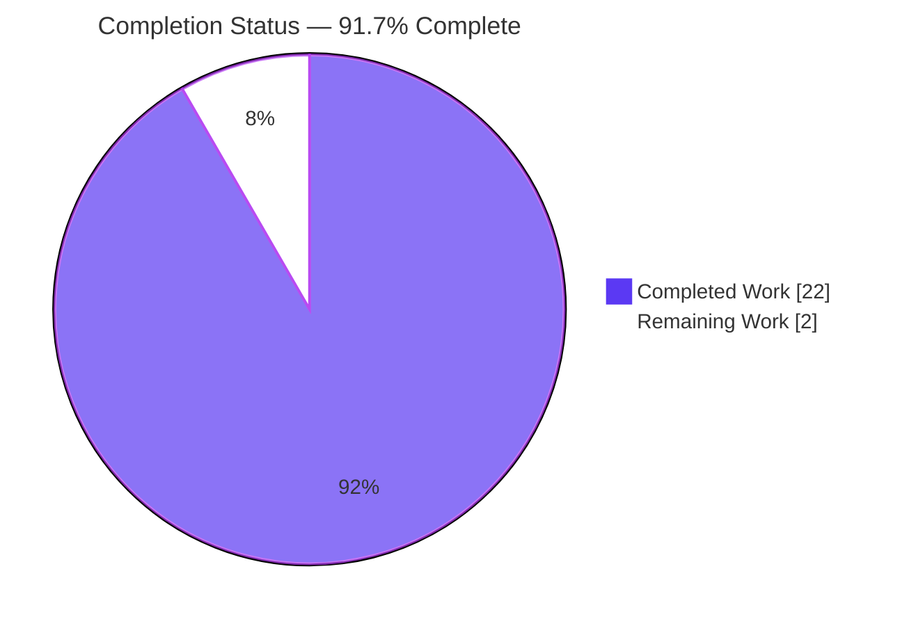

# Blitzy Project Guide

> **Project:** Grafana Live — Channel-Rule Routing Coherence (Code-Grounded Q&A Documentation)
> **Branch:** `blitzy-047ecf91-7907-4261-a00c-f39f93325922` · **Base:** `4550cfb5b728` · **HEAD:** `02e1ca9c7c`
> **Rule Set:** `SWE-AtlasQnA-Repo` (R1–R7)

---

## 1. Executive Summary

### 1.1 Project Overview

This project delivers a single, code-grounded markdown document that explains how Grafana Live's channel-rule routing layer (`CacheSegmentedTree`) remains coherent while its per-organization radix route trees are rebuilt by a periodic background goroutine and clients concurrently subscribe and publish. The target audience is Grafana backend engineers and reviewers reasoning about the live-streaming concurrency model. The technical scope is read-only static analysis of `pkg/services/live/pipeline` with optional behavioral verification via the package test suite. The deliverable answers five precise questions (entry point/convergence, transition authority, incomplete-vs-stale snapshots, the read-mostly concurrency model, and routing integrity) with verbatim citations and explicit rationale, satisfying the documentation-only rule set without modifying any existing source.

### 1.2 Completion Status



| Metric | Value |
|--------|-------|
| **Total Hours** | 24.0 |
| **Completed Hours (AI + Manual)** | 22.0 |
| **Remaining Hours** | 2.0 |
| **Percent Complete** | **91.7%** |

> Completion is computed using the AAP-scoped hours methodology: `Completed ÷ (Completed + Remaining) = 22 ÷ 24 = 91.7%`. The remaining 8.3% is human subject-matter-expert (SME) review and merge — the only path-to-production activity for a documentation artifact. Per Blitzy honest-assessment policy, completion is capped below 100% pending human review.

### 1.3 Key Accomplishments

- ✅ Authored `blitzy/documentation/grafana_4550cfb5b728.md` (502 lines, 31,606 bytes) — filename equals the source branch name per R1/R7.
- ✅ All **4 verbatim user questions** (O1–O4) reproduced exactly, plus the implicit routing-integrity sub-objective — each with an explicit **Rationale** section (6 rationale blocks total).
- ✅ Every substantive claim is code-cited: **133 citation occurrences → 84 unique (file, line-range) references across 14 source files**, all verified in-bounds and accurate (R3).
- ✅ Two required **Mermaid diagrams** (sequence + state) authored and confirmed to render to valid SVG.
- ✅ Code-as-truth verification: `go build`, `go vet`, and `go test -short` on `pkg/services/live/pipeline/...` all exit 0; cited tests `TestStorage_Get` and `BenchmarkRuleGet` pass (R2).
- ✅ Repository immutability preserved: `git diff` vs base = exactly one added file; `go.mod`/`go.sum` untouched; working tree clean (R5/R6).

### 1.4 Critical Unresolved Issues

| Issue | Impact | Owner | ETA |
|-------|--------|-------|-----|
| _None_ — autonomous validation reported zero defects in the in-scope deliverable | None | — | — |

> No compilation errors, no failing tests, no citation inaccuracies, and no broken diagrams were found. There are no blocking issues; the only outstanding work is discretionary human review (Section 2.2).

### 1.5 Access Issues

| System/Resource | Type of Access | Issue Description | Resolution Status | Owner |
|-----------------|----------------|-------------------|-------------------|-------|
| — | — | No access issues identified | N/A | — |

> The task required only read access to the Grafana source tree at commit `4550cfb5b728` and the local Go 1.23.1 toolchain, both available. No repository permissions, service credentials, or third-party API access were required.

### 1.6 Recommended Next Steps

1. **[High]** Conduct an SME technical-accuracy review of the document's concurrency claims and code citations (≈1.5h).
2. **[Medium]** Confirm both Mermaid diagrams render in the team's markdown viewer, then approve and merge the branch (≈0.5h).
3. **[Low]** _(Optional)_ Re-run `go test ./pkg/services/live/pipeline/...` in CI to reconfirm the cited behavioral evidence (0h incremental — already green).
4. **[Low]** _(Optional)_ Add a cross-reference to the document from any internal documentation index, if such an index exists.

---

## 2. Project Hours Breakdown

### 2.1 Completed Work Detail

| Component | Hours | Description |
|-----------|------:|-------------|
| Source-code analysis & concurrency reasoning | 6.0 | Read-only analysis of `rule_cache_segmented.go`, `tree/`, `pipeline.go`, `rule_builder*.go`, `storage*.go`, `models.go`, and `live.go`; deriving the RWMutex/last-writer-wins/bounded-staleness model (AAP O1–O4 + integrity). |
| Five answer sections (O1–O4 + integrity) | 8.0 | Authoring the verbatim question, answer, citations, and explicit rationale for each of the five objectives (AAP §0.5.6). |
| Orientation, synthesis & 2 diagrams | 3.0 | Scope/commit orientation, concurrency-model synthesis section, and the sequence + state Mermaid diagrams (AAP §0.5.2). |
| Citation grounding & accuracy | 3.0 | Producing and verifying 84 unique code citations across 14 files; byte-for-byte verbatim code excerpts (AAP R3, §0.9.1). |
| Behavioral verification | 2.0 | Running `go build`/`go vet`/`go test -short`; confirming `TestStorage_Get` + `BenchmarkRuleGet`; rendering diagrams (AAP R2, §0.9.2). |
| **Total Completed** | **22.0** | Matches Completed Hours in Section 1.2. |

### 2.2 Remaining Work Detail

| Category | Hours | Priority |
|----------|------:|----------|
| SME technical-accuracy review of concurrency claims & citations | 1.5 | High |
| Approve & merge branch + confirm Mermaid diagrams render | 0.5 | Medium |
| **Total Remaining** | **2.0** | — |

> Remaining hours (2.0) match Section 1.2 and the Section 7 pie chart "Remaining Work" value. Section 2.1 (22.0) + Section 2.2 (2.0) = 24.0 Total Project Hours.

---

## 3. Test Results

All tests below originate from Blitzy's autonomous validation logs for this branch, executed with `GOTOOLCHAIN=local` (Go 1.23.1) against the three packages exercising the routing layer.

| Test Category | Framework | Total Tests | Passed | Failed | Coverage % | Notes |
|---------------|-----------|------------:|-------:|-------:|-----------:|-------|
| Unit — pipeline | Go `testing` | 16 | 16 | 0 | n/m | Includes cited `TestStorage_Get` (lazy first-fill + matching precedence). |
| Benchmark — pipeline | Go `testing` (bench) | 1 | 1 | 0 | n/m | Cited `BenchmarkRuleGet` exercises the hot read path. |
| Unit — pattern | Go `testing` | 1 | 1 | 0 | n/m | Channel-pattern helper package. |
| Unit — tree | Go `testing` | 19 | 19 | 0 | n/m | Radix route tree (`AddRoute`/`GetValue`, conflict panics). |
| **Total** | — | **37** | **37** | **0** | — | `go test -short` and `go test -count=1` both exit 0. |

> **Aggregate:** 36 unit tests + 1 benchmark = 37 test entities; **36 `--- PASS` lines (incl. subtests), 0 `--- FAIL`**. `n/m` = not measured (coverage instrumentation was not part of the documentation-only validation; the build/vet/test gates were the prescribed checks per AAP §0.9.2).

---

## 4. Runtime Validation & UI Verification

The routing component is a Go **library** (no standalone server), so "runtime validation" follows the method the AAP prescribes (§0.9.2): compile the module and exercise behavior through its test suite.

- ✅ **Operational** — `go build ./pkg/services/live/...` exits 0 (module compiles cleanly).
- ✅ **Operational** — `go vet ./pkg/services/live/pipeline/...` exits 0 (no vet findings).
- ✅ **Operational** — `go test -short ./pkg/services/live/pipeline/...` exits 0 (pipeline, pattern, tree all `ok`).
- ✅ **Operational** — Lazy first-fill behavior confirmed at runtime via `TestStorage_Get` (cache constructed with no pre-seeded org; first `Get` fills it).
- ✅ **Operational** — Matching precedence (explicit > named-param > catch-all) confirmed via the same test.
- ✅ **Operational** — Fast read path confirmed via `BenchmarkRuleGet`.
- ✅ **Operational** — Both Mermaid diagrams render to valid SVG (markdown UI verification).

**API / Integration:** Not applicable — the deliverable is a markdown document that imports no symbols, exposes no API, and is referenced by no build target. No external integrations exist.

---

## 5. Compliance & Quality Review

Cross-mapping of the `SWE-AtlasQnA-Repo` rule set (R1–R7) and AAP acceptance criteria to autonomous-validation outcomes.

| Requirement | Benchmark | Status | Progress | Notes |
|-------------|-----------|--------|----------|-------|
| R1 | Document named `<source_branch_name>.md` answering all questions | ✅ Pass | 100% | `grafana_4550cfb5b728.md` created. |
| R2 | Build & run source to analyse behavior | ✅ Pass | 100% | `go build`/`go test` exit 0. |
| R3 | Code-as-truth — every claim cited | ✅ Pass | 100% | 84 unique citations across 14 files, all verified. |
| R4 | Provide rationale behind answers | ✅ Pass | 100% | 6 explicit rationale sections. |
| R5 | Do not modify existing files | ✅ Pass | 100% | `git diff` = one added file only. |
| R6 | Add no other code | ✅ Pass | 100% | No source/test/config/script added; temp scripts in `/tmp`. |
| R7 | Place under `blitzy/documentation/` | ✅ Pass | 100% | Correct path confirmed. |
| AAP §0.9.1 | All 5 questions answered w/ rationale | ✅ Pass | 100% | O1–O4 + integrity sub-objective. |
| AAP §0.9.1 | Both diagrams valid Mermaid | ✅ Pass | 100% | Sequence + state render to SVG. |
| AAP §0.9.3 | Working tree = exactly one new file | ✅ Pass | 100% | `git status --porcelain` empty; `/app` never inspected. |

**Fixes applied during autonomous validation:** None required — zero defects found. **Outstanding compliance items:** None.

---

## 6. Risk Assessment

| Risk | Category | Severity | Probability | Mitigation | Status |
|------|----------|----------|-------------|------------|--------|
| Doc claim drifts from code as the routing layer evolves in future commits | Technical | Low | Low | Document is pinned to commit `4550cfb5b728`; citations include exact line ranges for re-verification. | Mitigated |
| Reader's markdown viewer lacks Mermaid support | Operational | Low | Low | Diagrams validated as standard Mermaid; render confirmed via `mmdc` + headless Chrome. | Mitigated |
| Subtle concurrency nuance under-explained for a reviewer | Technical | Low | Low | SME review task (HT-1) scheduled; document already refines AAP "bounded staleness" to the more code-accurate "cadence-limited" framing and notes the `fillOrg` no-`recover` caveat. | Open (review) |
| Security risk | Security | None | None | Additive, read-only documentation; no secrets, code, or dependencies introduced. | N/A |
| Operational/deploy risk | Operational | None | None | No runtime artifact; cannot affect compilation, tests, or production behavior. | N/A |
| Integration risk | Integration | None | None | Document imports nothing and is referenced by no build target. | N/A |

---

## 7. Visual Project Status


**Remaining hours by category (Section 2.2):**

| Category | Hours | Priority |
|----------|------:|----------|
| SME technical-accuracy review | 1.5 | High |
| Approve, merge & confirm diagram render | 0.5 | Medium |
| **Total** | **2.0** | — |

> Integrity: "Remaining Work" = 2 in the pie chart equals Remaining Hours in Section 1.2 and the sum of the Section 2.2 Hours column. "Completed Work" = 22 equals Completed Hours in Section 1.2.

---

## 8. Summary & Recommendations

**Achievements.** The project is **91.7% complete** (22 of 24 hours). The sole AAP deliverable — `blitzy/documentation/grafana_4550cfb5b728.md` — is fully authored: all five routing-coherence questions are answered with verbatim prompts, explicit rationale, 84 verified code citations across 14 files, and two valid Mermaid diagrams. Autonomous validation confirmed the surrounding module compiles, vets, and tests cleanly (37 test entities, 0 failures), and that the change is strictly additive (one new file, clean working tree, `go.mod`/`go.sum` untouched).

**Remaining gaps & critical path to production.** For a documentation artifact, "production" means merge to the target branch after human review. The critical path is: (1) SME technical-accuracy review (1.5h, High), then (2) approve, confirm Mermaid rendering, and merge (0.5h, Medium). No code rework, environment setup, or deployment is required.

**Success metrics.** All AAP acceptance criteria (§0.9.1–§0.9.3) and all seven rules (R1–R7) are satisfied; zero defects outstanding.

**Production readiness assessment.** The deliverable is **ready for human review and merge**. Confidence is **High** — scope is well-defined, the artifact is complete and code-grounded, and validation found no defects. The 8.3% remaining is discretionary human review, consistent with Blitzy's policy of capping autonomous completion below 100% pending sign-off.

| Metric | Value |
|--------|-------|
| AAP requirements completed | 14 / 14 |
| Completion (hours-based) | 91.7% |
| Outstanding defects | 0 |
| Critical path to merge | ~2.0h (review + merge) |

---

## 9. Development Guide

This guide explains how to view the deliverable, reproduce the code-grounded verification, and render the diagrams. All commands are run from the repository root and were tested during validation.

### 9.1 System Prerequisites

- **OS:** Linux/macOS (validated on Ubuntu 25.10).
- **Go:** 1.23.1 (per `go.mod`). Use `GOTOOLCHAIN=local` to pin the local toolchain.
- **Git:** 2.x (validated with 2.51.0).
- **Optional (diagram rendering):** Node.js 20 + `@mermaid-js/mermaid-cli` (`mmdc`) and headless Chrome.

```bash
go version          # expect: go version go1.23.1 ...
git --version       # expect: git version 2.x
```

### 9.2 Environment Setup

No environment variables, services, or credentials are required to view the document. To pin the Go toolchain for verification:

```bash
cd /path/to/grafana-repo
export GOTOOLCHAIN=local
```

### 9.3 View the Deliverable

```bash
# From the repository root:
less blitzy/documentation/grafana_4550cfb5b728.md
wc -l blitzy/documentation/grafana_4550cfb5b728.md   # expect: 502
wc -c blitzy/documentation/grafana_4550cfb5b728.md   # expect: 31606
```

### 9.4 Reproduce Code-as-Truth Verification

```bash
export GOTOOLCHAIN=local

# 1) Module compiles cleanly
go build ./pkg/services/live/...                     # expect: exit 0 (no output)

# 2) Static analysis is clean
go vet ./pkg/services/live/pipeline/...              # expect: exit 0 (no output)

# 3) Full routing-layer test suite passes
go test -count=1 ./pkg/services/live/pipeline/ \
                 ./pkg/services/live/pipeline/pattern/ \
                 ./pkg/services/live/pipeline/tree/   # expect: ok for all three packages

# 4) Cited behavioral evidence (lazy fill + matching precedence)
go test -run TestStorage_Get ./pkg/services/live/pipeline/   # expect: ok
```

### 9.5 Verify Repository Immutability

```bash
git status --porcelain                               # expect: empty (clean tree)
git diff --name-status 4550cfb5b728..HEAD            # expect: A  blitzy/documentation/grafana_4550cfb5b728.md
git diff 4550cfb5b728..HEAD -- go.mod go.sum         # expect: empty (no dependency changes)
```

### 9.6 Render the Mermaid Diagrams (optional)

```bash
# Copy one Mermaid block (from Section 1.2 or 7) into diagram.mmd, then:
npx -y @mermaid-js/mermaid-cli -i diagram.mmd -o diagram.svg \
    -p puppeteer-config.json    # use {"args":["--no-sandbox"]} in a container
# expect: exit 0 and a valid diagram.svg
```

### 9.7 Troubleshooting

- **`go: downloading ...` / network errors:** set `export GOTOOLCHAIN=local` and use the warmed module cache; no network is required for the cited packages.
- **`go test` reports a toolchain mismatch:** ensure `go version` is 1.23.1 and `GOTOOLCHAIN=local` is exported.
- **`mmdc` fails to launch Chrome in a container:** pass `-p puppeteer-config.json` containing `{"args":["--no-sandbox","--disable-dev-shm-usage"]}`.
- **`git diff` shows extra files:** ensure you are on branch `blitzy-047ecf91-7907-4261-a00c-f39f93325922` and have not generated artifacts inside the repo (temporary scripts belong in `/tmp`).

---

## 10. Appendices

### A. Command Reference

| Command | Purpose | Expected Result |
|---------|---------|-----------------|
| `go build ./pkg/services/live/...` | Compile the live module | exit 0 |
| `go vet ./pkg/services/live/pipeline/...` | Static analysis | exit 0 |
| `go test -count=1 ./pkg/services/live/pipeline/...` | Run routing-layer tests | `ok` (pipeline, pattern, tree) |
| `go test -run TestStorage_Get ./pkg/services/live/pipeline/` | Cited lazy-fill evidence | `ok` |
| `git status --porcelain` | Confirm clean tree | empty |
| `git diff --name-status 4550cfb5b728..HEAD` | Confirm single-file change | `A blitzy/documentation/grafana_4550cfb5b728.md` |

### B. Port Reference

Not applicable — the deliverable is a documentation file; no services or ports are involved.

### C. Key File Locations

| Path | Role |
|------|------|
| `blitzy/documentation/grafana_4550cfb5b728.md` | **The deliverable** (502 lines, 31,606 bytes) |
| `pkg/services/live/pipeline/rule_cache_segmented.go` | `CacheSegmentedTree`, `updatePeriodically`, `fillOrg`, `Get` |
| `pkg/services/live/pipeline/tree/tree.go` | Radix route tree ("Not concurrency-safe!", panic-on-conflict) |
| `pkg/services/live/pipeline/tree/readme.md` | Route-tree provenance & matching semantics |
| `pkg/services/live/pipeline/models.go` | `checkRulesValid` conflict pre-validation |
| `pkg/services/live/pipeline/storage_file.go` | Write-time validation call site (L255) |
| `pkg/services/live/pipeline/rule_builder_storage.go` | `BuildRules` mints fresh rule objects each cycle |
| `pkg/services/live/live.go` | Subscribe/publish hot-path callers; cache wiring |
| `pkg/services/live/pipeline/rule_cache_segmented_test.go` | `TestStorage_Get`, `BenchmarkRuleGet` |

### D. Technology Versions

| Component | Version | Source |
|-----------|---------|--------|
| Go toolchain | 1.23.1 | `go.mod:L3` |
| Git | 2.51.0 | Validation environment |
| Mermaid CLI (`mmdc`) | 11.x | Optional diagram rendering |
| Route tree | in-tree copy of `julienschmidt/httprouter` + Gin fixes | `tree/readme.md:L1-L7` |

### E. Environment Variable Reference

| Variable | Value | Purpose |
|----------|-------|---------|
| `GOTOOLCHAIN` | `local` | Pin the local Go 1.23.1 toolchain; avoid toolchain auto-download. |

> No application environment variables are required — the deliverable is a static document.

### F. Developer Tools Guide

- **Go toolchain** — `go build`, `go vet`, `go test` for code-as-truth verification.
- **Git** — `git diff`/`git status` to confirm repository immutability (R5/R6).
- **Mermaid CLI** — optional, to render the sequence and state diagrams to SVG.

### G. Glossary

| Term | Definition |
|------|------------|
| `CacheSegmentedTree` | The channel-rule routing cache holding one radix tree per org behind a single `sync.RWMutex`. |
| Channel rule | A Grafana Live routing rule mapping a channel pattern to processing configuration. |
| Last-writer-wins | The replacement semantics where `fillOrg` swaps in a freshly built tree under the write lock. |
| Bounded / cadence-limited staleness | Readers may see the prior complete rule set between ~20s refresh cycles, but never a torn/partial view. |
| Lazy first-fill | An org's tree is built on the first `Get` cache miss, then refreshed periodically. |
| `checkRulesValid` | Pre-validation that builds a throwaway tree under `recover()` to reject conflicting patterns before persistence. |
