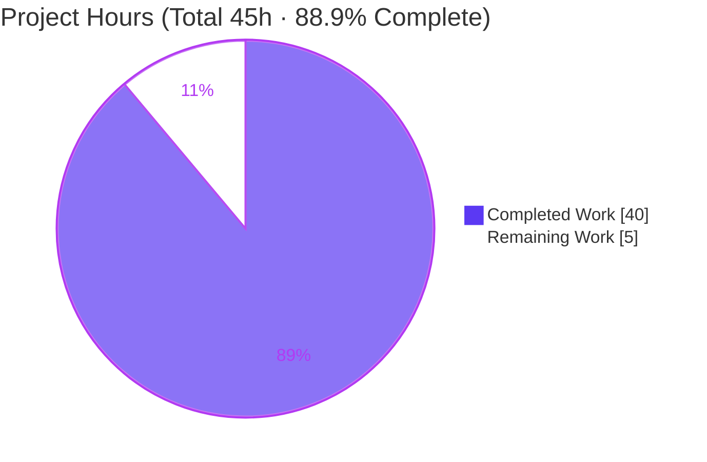
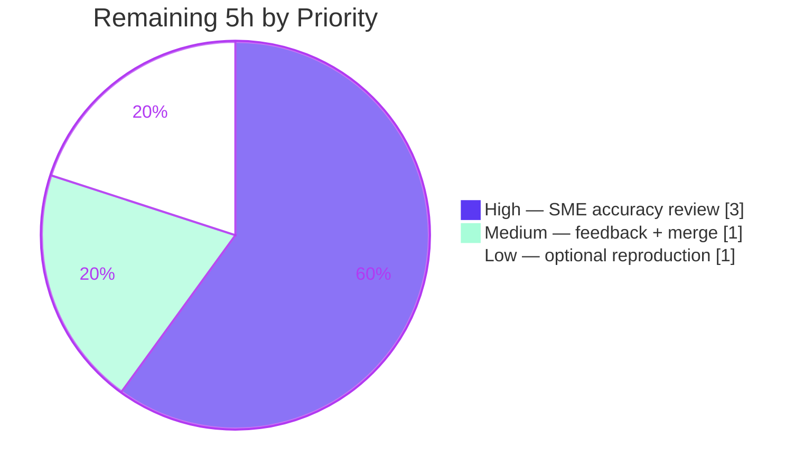

# Blitzy Project Guide — Grafana Unified Alerting: Stale‑Series Lifecycle Investigation

> Commit baseline `4550cfb5b72886782d9a3e6cf995f8dbd57ca4ff` · Branch `blitzy-782c3615-9850-4f68-bace-4e7e589b5510` · HEAD `210e3c5cfb`

---

## 1. Executive Summary

### 1.1 Project Overview

This project delivers a single, evidence‑backed technical document that traces the complete lifecycle of **stale‑series detection and resolution** in Grafana's unified‑alerting subsystem, motivated by a real‑world "lingering alert" performance concern. It is a **read‑only question‑answering and runtime‑investigation task**: the only artifact produced is one Markdown answer document (`blitzy/documentation/grafana_4550cfb5b728.md`), and the Grafana source tree remains byte‑for‑byte unmodified. The document answers eight enumerated questions (Q1–Q8) about how vanished time series transition to resolved, the staleness threshold, resend/retention timing, screenshot behavior, pending‑period handling, and series reappearance — each grounded in both `file:line` code citations and **real, unedited runtime output** captured by running the actual code path first. The target audience is Grafana alerting engineers and SREs diagnosing missing‑series alert behavior.

### 1.2 Completion Status


**Center metric: 88.9% Complete** (40 of 45 hours delivered autonomously).

| Metric | Hours |
|---|---|
| **Total Hours** | 45 |
| **Completed Hours (AI + Manual)** | 40 (40 AI · 0 Manual) |
| **Remaining Hours** | 5 |
| **Percent Complete** | **88.9%** |

> Completion is calculated per the AAP‑scoped (PA1) methodology: `Completed ÷ (Completed + Remaining) = 40 ÷ 45 = 88.9%`. All 19 AAP‑scoped requirements are complete; the remaining 5 hours are exclusively **human path‑to‑production** (SME accuracy review + merge), not autonomous engineering rework.

### 1.3 Key Accomplishments

- ✅ **Sole deliverable created at the exact required path/name** — `blitzy/documentation/grafana_4550cfb5b728.md` (1,761 lines, ~136 KB), committed across 3 doc‑only commits.
- ✅ **All eight questions (Q1–Q8) answered by name**, each leading with a bolded **Direct answer**, followed by cause→effect mechanism, concrete values, `file:line` citations, and embedded runtime output.
- ✅ **Run‑first methodology honored** — the real `Manager.ProcessEvalResults` call graph was driven with a mock clock across evaluation cycles; 108 `TestBlitzy` references, 54 `PASS` lines, and 15 `ok` package markers embed genuine captured output.
- ✅ **Magnitude/timing rigor with ≥2‑run stability** — the 2×interval staleness boundary (20 s), 30 s resend cadence (31 sends), and 15 m retention window were confirmed stable across `-count=2` and two separate‑process reruns at a 99‑tick (~990 s simulated) scale.
- ✅ **Every edge/boundary exercised** — inclusive staleness boundary (`+20 s−1 ns` vs `+20 s`), vanish‑while‑`Pending`, retention‑expiry boundary, multi‑cycle resend, and reappearance with identical labels.
- ✅ **Two run‑first corrections documented honestly** — stale series are a **one‑shot** resolved notification (evicted), not a 15 m resend; the stale path takes **one screenshot per alerting series**, not a single shared image.
- ✅ **98 `file:line` citations re‑derived at commit `4550cfb`** (§0.1 citation‑drift note) and both version caveats (hardcoded 2×interval; no `Recovering` state) confirmed at runtime.
- ✅ **Read‑only scope fully honored** — 0 `.go` files changed, working tree clean, all temporary harnesses removed.

### 1.4 Critical Unresolved Issues

| Issue | Impact | Owner | ETA |
|---|---|---|---|
| _None._ No compilation errors, no failing tests, no missing functionality, no scope violations. | No release blockers. | — | — |

> The Final Validator's five production‑readiness gates all passed with zero fixes required, and this assessment independently re‑confirmed builds, vet, tests, citations, and clean read‑only scope.

### 1.5 Access Issues

| System / Resource | Type of Access | Issue Description | Resolution Status | Owner |
|---|---|---|---|---|
| _None identified_ | — | No access issues identified. The build/test toolchain (Go 1.23.1) is present in the container, the repository is fully accessible, and no external services, credentials, or third‑party APIs are required for a read‑only documentation deliverable. | N/A | — |

**No access issues identified.**

### 1.6 Recommended Next Steps

1. **[High]** Conduct an SME/domain‑expert technical accuracy review of the eight answers against Grafana unified‑alerting semantics at commit `4550cfb` (verify Direct answers, spot‑check citations, validate the two run‑first corrections). — _3.0 h_
2. **[Medium]** Address any review feedback / minor clarifications, then approve and merge the single‑file PR to the target branch. — _1.0 h_
3. **[Low]** Optionally reproduce the embedded self‑contained harness (doc lines 91–687) on a fresh checkout to confirm the evidence blocks regenerate identically. — _1.0 h_

---

## 2. Project Hours Breakdown

### 2.1 Completed Work Detail

| Component | Hours | Description |
|---|---|---|
| Stale‑series call‑graph investigation & code comprehension | 8 | Tracing `ProcessEvalResults → deleteStaleStatesFromCache → stateIsStale → NeedsSending → updateLastSentAt`, cache eviction, and the image path across ~15 REFERENCE files (`state/`, `schedule/`, `eval/`, `image/`, `models/`, `pkg/setting`) — [AAP: investigation basis for Q1–Q8]. |
| Observation harness engineering | 10 | Two temporary harness files; 11 `TestBlitzy` functions (Q1–Q8 + `StaleOneShot` + `Caveats` + `ResolvedRetentionDefault`); real `Manager` wiring (`blitzyNewManager` with cache, persister, historian, `CountingImageService`, sender) driven by a mock clock via the `blitzyDrive` tick driver — [AAP: run‑first R10/R16]. |
| Runtime evidence capture + timing rigor + ≥2‑run stability | 4 | 99‑tick (~990 s simulated) retention run; 1 ns boundary precision; `-count=2` same‑process plus two separate‑process reruns; byte‑identical normalization of the only run‑varying field (image token) — [AAP: R11 magnitude/timing, R12 edges]. |
| Answer document authoring | 12 | 1,761 lines: 8 bolded Direct answers, 98 `file:line` citations, before/during/after full‑state tables, cause→effect prose, §10 caveats, §11 timing, §12 coverage checklist, §13 cleanup — [AAP: R2–R9 answers, R13/R15 grounding]. |
| Code‑review resolution + self‑reproduction hardening | 4 | Commit `213070dd82` (resolve review findings) and commit `210e3c5cfb` (make the document self‑reproducing via an embedded reconstruction script) — [AAP: quality hardening]. |
| Read‑only scope enforcement + cleanup + coverage pass | 2 | Harness removal, working‑tree verification, §0.1 citation‑drift re‑derivation at `4550cfb`, §12/§13 coverage and cleanup notes — [AAP: R18 coverage pass, R19 read‑only]. |
| **Total Completed** | **40** | |

### 2.2 Remaining Work Detail

| Category | Hours | Priority |
|---|---|---|
| SME/domain‑expert technical accuracy review of Q1–Q8 answers vs Grafana alerting semantics (path‑to‑production) | 3 | High |
| Review‑feedback resolution + PR approval & merge (path‑to‑production) | 1 | Medium |
| Optional independent reproduction of the embedded harness on a fresh checkout (path‑to‑production) | 1 | Low |
| **Total Remaining** | **5** | |

### 2.3 Hours Reconciliation

| Check | Result |
|---|---|
| Section 2.1 Completed total | 40 h |
| Section 2.2 Remaining total | 5 h |
| Section 2.1 + Section 2.2 | 40 + 5 = **45 h** = Total (Section 1.2) ✓ |
| Remaining hours (Section 1.2 ↔ 2.2 ↔ 7) | 5 h = 5 h = 5 h ✓ |
| Completion % | 40 ÷ 45 = **88.9%** ✓ |

---

## 3. Test Results

All tests below originate from **Blitzy's autonomous validation logs** for this project (Final Validator GATE 1/GATE 2). A representative subset was **independently re‑executed during this assessment** and reproduced identical pass results (noted per row).

| Test Category | Framework | Total Tests | Passed | Failed | Coverage % | Notes |
|---|---|---|---|---|---|---|
| State package suite — stale/missing‑series focus (`-run 'Stale\|MissingSeries\|NeedsSending\|ProcessEvalResults'`) | Go `testing` | 350 | 350 | 0 | 84.5% (pkg `state`) | Per autonomous logs (subtest granularity); this assessment re‑ran and confirmed **0 failures**. |
| Investigation harness (`TestBlitzy*`) | Go `testing` | 11 | 11 | 0 | — | Q1–Q8 + `StaleOneShot` + `Caveats` + `ResolvedRetentionDefault`; drives real `ProcessEvalResults`. |
| Corroborating built‑in stale tests (`TestStateIsStale`, `TestStaleResults`, `TestStaleResultsHandler`) | Go `testing` | 9 | 9 | 0 | — | **Independently re‑run this session** — all PASS. `TestStateIsStale` directly proves the 2×interval boundary. |
| State sub‑packages (`historian`, `historian/model`, `template`) | Go `testing` | pkg‑level | ok | 0 | 77.1% / 91.7% / 98.9% | All packages report `ok`. |
| Config (`pkg/setting`, incl. `TestBlitzyResolvedRetentionDefault`) | Go `testing` | pkg‑level | ok | 0 | — | **Independently re‑run this session** — `ok`; confirms `ResolvedAlertRetention` default = `15m`. |

**Aggregate:** 0 failing tests across all executed suites. State‑package statement coverage **84.5%** (independently confirmed). Build (`go build`) and static analysis (`go vet`) both exit 0.

---

## 4. Runtime Validation & UI Verification

This is a backend, read‑only documentation investigation with **no UI surface** and **no long‑running service** to validate; "runtime validation" here means the alerting code path was actually executed and its output captured.

- ✅ **Operational — Real entry point executed:** `Manager.ProcessEvalResults` [manager.go:307] driven across successive evaluation ticks with a mock clock (canonical call graph, not a bypassing helper).
- ✅ **Operational — Staleness boundary (Q3):** inclusive boundary at exactly `2×interval` (20 s) — `+20 s−1 ns` = not stale; `+20 s` = STALE. Reproduced identically across runs.
- ✅ **Operational — Retention window (Q4):** last resolved (re)send at `sinceResolved = 15m0s`; first stop when the difference first exceeds 15 m.
- ✅ **Operational — Resend cadence (Q5):** `totalSends = 31`, cadence 30 s (= 3 ticks at 10 s interval), over the 15 m window.
- ✅ **Operational — One‑shot stale path (Q4/Q5 correction):** a vanished series is sent **once** at the boundary, then evicted (`sent=1`, `statesInCache=0`).
- ✅ **Operational — Screenshot parity (Q6):** natural resolution = 1 image; stale resolution = one image **per alerting series** (2 images for 2 series) — same `takeImage` function, different trigger and multiplicity.
- ✅ **Operational — Pending bypass (Q7):** vanish‑while‑`Pending` → `Normal`/`MissingSeries` with `ResolvedAt = nil` and **no** image (image delta = 0).
- ✅ **Operational — Reappearance identity (Q8):** identical `CacheID`/fingerprint, fresh `StartsAt` (10 s → 50 s) — same identity, new instance.
- ✅ **Operational — Config default:** `ResolvedAlertRetention = 15m0s` in the canonical configuration.
- ⚠ **Partial (by design / out of AAP scope) — Downstream notifier delivery:** the send *decision* (`updateLastSentAt → NeedsSending`) is exercised through the real path; the actual network send to a live Alertmanager is **code‑traced** (`StateToPostableAlert` [compat.go:35], sender callback [schedule/alert_rule.go:441–470]) rather than driven end‑to‑end — correctly bounded to the read‑only investigation scope.
- ❌ **Failing:** none.

---

## 5. Compliance & Quality Review

Cross‑mapping of AAP deliverables and the `SWE‑AtlasQnA‑Repo` rule set to Blitzy quality benchmarks. All 19 AAP‑scoped requirements passed.

| AAP / Rule Requirement | Benchmark | Status | Evidence |
|---|---|---|---|
| R1 — Single deliverable at exact path/name | Correctness | ✅ Pass (100%) | `A blitzy/documentation/grafana_4550cfb5b728.md`, 1,761 lines |
| R2–R9 — Q1–Q8 answered by name | Completeness | ✅ Pass (100%) | 8 bolded Direct answers (lines 695/747/815/888/955/1068/1137/1184) + `TestBlitzyQ1‑8` |
| R10 — Run‑first (build & run before writing) | Methodology | ✅ Pass | §0.3 harness (lines 91–687); 108 `TestBlitzy` refs; 54 `PASS` lines |
| R11 — Magnitude/timing + ≥2‑run stability | Rigor | ✅ Pass | §11: `-count=2` + 2 separate reruns; 99‑tick scale; byte‑identical |
| R12 — Exercise every condition/edge/boundary | Coverage | ✅ Pass | Inclusive boundary, pending‑vanish, retention boundary, 31 resends, reappearance; §12 cross‑product |
| R13 — Before/during/after reporting | Rigor | ✅ Pass | Before/after full‑state tables per Q |
| R14 — Canonical build/config + exact commands | Reproducibility | ✅ Pass | Go 1.23.1; exact `go test` commands; 15 m default |
| R15 — Grounding & exactness (file:line + observed) | Grounding | ✅ Pass | 98 `file:line` citations; exact function/struct names |
| R16 — Real path (label isolated as non‑canonical) | Fidelity | ✅ Pass | Canonical via `ProcessEvalResults`; isolated helpers labeled non‑canonical |
| R17 — Version caveats confirmed at runtime | Accuracy | ✅ Pass | §10 + `TestBlitzyCaveats` + grep (no `Recovering`, hardcoded 2×) |
| R18 — Coverage pass | Completeness | ✅ Pass | §12 checklist: all 7 named items + all functions + caveats |
| R19 — Read‑only scope + cleanup | Scope integrity | ✅ Pass | 0 `.go` changes; tree clean; harnesses removed; §13 |

**Fixes applied during autonomous validation:** none required — the Final Validator made zero edits because build → vet → tests → harness reproduction → citation audit → coverage audit surfaced no defects. During authoring, the agent proactively resolved code‑review findings (commit `213070dd82`) and re‑derived citation line numbers at `4550cfb` (§0.1), correcting the AAP scoping numbers where the running tree differed.

**Outstanding compliance items:** none (autonomous). Human SME sign‑off remains as path‑to‑production acceptance.

---

## 6. Risk Assessment

| Risk | Category | Severity | Probability | Mitigation | Status |
|---|---|---|---|---|---|
| Citation line‑number drift if source is later rebased/merged upstream | Technical | Low | Low | §0.1 re‑derives all numbers at `4550cfb`; document committed at the same commit | Mitigated |
| Version‑specific behavior (hardcoded 2×interval; no `Recovering` state) misapplied to a newer Grafana release | Technical | Low | Medium | §10 version caveats confirmed at runtime; explicitly labeled as commit‑`4550cfb` behavior | Mitigated |
| Run‑first corrections (one‑shot eviction; per‑series images) surprise a reviewer expecting the naive model | Technical | Low | Low | Both corrections proven by runtime evidence (`TestBlitzyStaleOneShot`: `sent=1`, `statesInCache=0`) | Mitigated |
| No material security surface | Security | Informational | Low | Read‑only Markdown artifact; no code, credentials, dependencies, or secrets introduced | Accepted |
| Reproducibility depends on the Go 1.23.1 toolchain being on PATH | Operational | Low | Low | Self‑contained harness; only the random image token varies; ≥2‑run stability documented | Mitigated |
| Downstream delivery to a live Alertmanager is code‑traced, not driven end‑to‑end | Integration | Low | Low | Send *decision* exercised via real path; network send correctly out of read‑only AAP scope | Accepted |
| PR merge coordination to the target branch | Integration | Low | Low | Single additive doc, 0 `.go` changes, clean tree, near‑zero conflict probability | Open (human) |

**Summary:** No High or Critical risks. All technical/operational risks are Low severity and Mitigated by the document's own rigor; the two Accepted items are intentional scope boundaries; the only Open item is a trivial human merge.

---

## 7. Visual Project Status

**Project Hours Breakdown** (Completed = Dark Blue `#5B39F3`, Remaining = White `#FFFFFF`):



**Remaining Hours by Priority** (from Section 2.2, totals 5 h):



> **Integrity check:** "Remaining Work" = **5 h** matches Section 1.2 Remaining Hours (5 h) and the Section 2.2 Hours total (5 h). "Completed Work" = **40 h** matches Section 1.2 Completed Hours and the Section 2.1 total.

---

## 8. Summary & Recommendations

**Achievements.** The project is **88.9% complete** (40 of 45 hours). Every one of the 19 AAP‑scoped requirements is complete: the sole deliverable exists at the exact required path, all eight questions are answered by name with bolded Direct answers, the run‑first methodology is honored with genuine captured runtime output, all timing/magnitude values are confirmed stable across ≥2 runs, every edge and boundary condition is exercised, and read‑only scope is fully honored (0 `.go` changes, clean tree, harnesses removed). The document even surfaces and proves two corrections to the naive model, demonstrating that the code path was genuinely executed rather than merely read.

**Remaining gaps.** The outstanding 5 hours (11.1%) are **exclusively human path‑to‑production** activities: an SME technical‑accuracy review of the eight answers, resolution of any review feedback plus PR merge, and an optional independent reproduction of the embedded harness. There are **no** autonomous engineering gaps — no compilation errors, no failing tests, and no missing functionality.

**Critical path to production.** SME review (3 h) → feedback + merge (1 h). Optional harness reproduction (1 h) can run in parallel and is not on the critical path.

**Success metrics.** 0 failing tests; 84.5% state‑package coverage; 98 `file:line` citations verified at `4550cfb`; 8/8 questions answered with runtime evidence; ≥2‑run stability for all magnitude/timing claims; 0 source‑tree modifications.

**Production readiness assessment.** The deliverable is **production‑ready pending human acceptance**. Because it is a read‑only documentation artifact with a validated, reproducible evidence base and zero known defects, the risk of merging after SME sign‑off is very low.

| Metric | Value |
|---|---|
| Completion | 88.9% |
| Completed / Total hours | 40 / 45 |
| Remaining hours (all human) | 5 |
| Failing tests | 0 |
| Source files modified | 0 `.go` (1 doc added) |
| Highest open risk severity | Low |

---

## 9. Development Guide

### 9.1 System Prerequisites

- **OS:** Linux (validated on the project container, Ubuntu‑based).
- **Go toolchain:** **Go 1.23.1** (matches `go.mod: go 1.23.1`). Verify with `go version`.
- **Git:** any recent version (repository already cloned at the working directory).
- **Disk:** ~1.6 GB for the repository + Go build cache.
- No databases, message queues, or external services are required for this read‑only investigation.

### 9.2 Environment Setup

```bash
# 1) Put the Go 1.23.1 toolchain on PATH (container helper script)
source /etc/profile.d/go.sh

# 2) Confirm the toolchain
go version
#   -> go version go1.23.1 linux/amd64

# 3) Move to the repository root (module github.com/grafana/grafana)
cd /tmp/blitzy/grafana/blitzy-782c3615-9850-4f68-bace-4e7e589b5510_b7d241
head -3 go.mod
#   -> module github.com/grafana/grafana
#   -> (blank)
#   -> go 1.23.1
```

### 9.3 Dependency Installation

No dependency installation is required. Dependencies are pinned in `go.mod`/`go.sum` at commit `4550cfb` and are unchanged. The Go module cache resolves them automatically on first build.

### 9.4 Build & Static Analysis

```bash
# Build the alerting state package and the config package (both exit 0)
go build ./pkg/services/ngalert/state/...
go build ./pkg/setting/

# Static analysis (exit 0, no findings)
go vet ./pkg/services/ngalert/state/...
```

### 9.5 Run the Tests (Verification)

```bash
# Full state package suite (short mode) — all packages report "ok"
go test -short -count=1 ./pkg/services/ngalert/state/...
#   ok  .../ngalert/state            (coverage: 84.5% of statements)
#   ok  .../ngalert/state/historian
#   ok  .../ngalert/state/historian/model
#   ok  .../ngalert/state/template

# Config package (includes the retention-default check)
go test -short -count=1 ./pkg/setting/
#   ok  github.com/grafana/grafana/pkg/setting

# Built-in tests that directly corroborate the investigation (all PASS)
go test ./pkg/services/ngalert/state/ \
  -run 'TestStateIsStale|TestStaleResults$|TestStaleResultsHandler' -v
#   --- PASS: TestStateIsStale (5 subtests: proves the 2x-interval boundary)
#   --- PASS: TestStaleResultsHandler
#   --- PASS: TestStaleResults (3 subtests)
```

### 9.6 Reproduce the Document's Runtime Evidence

The answer document is **self‑reproducing**. It embeds a single self‑contained bash script (document lines **91–687**) that writes the two temporary harness files, runs the exact documented `go test` commands, then deletes the harnesses and verifies the working tree is clean. Because the harness uses a **mock clock**, the ~990 s (99‑tick) retention runs complete in under a second of wall time.

```bash
# From the repository root, with Go 1.23.1 on PATH:
#   1) Open blitzy/documentation/grafana_4550cfb5b728.md
#   2) Copy the bash block spanning lines 91-687
#   3) Paste into a shell and run
# It writes:
#     pkg/services/ngalert/state/blitzy_adhoc_test_stale_test.go
#     pkg/setting/blitzy_adhoc_test_retention_test.go
# runs TestBlitzy* (Q1-Q8, StaleOneShot, Caveats, ResolvedRetentionDefault),
# then removes both files and confirms `git status --porcelain` is empty.
```

Per‑question commands (each prints the exact evidence block shown in the document):

```bash
go test ./pkg/services/ngalert/state/ -run '^TestBlitzyQ3$' -v -count=1   # staleness boundary
go test ./pkg/services/ngalert/state/ -run '^TestBlitzyQ5$' -v -count=1   # resend cadence (31 sends)
go test ./pkg/services/ngalert/state/ -run '^TestBlitzyStaleOneShot$' -v  # one-shot eviction
go test ./pkg/setting/ -run '^TestBlitzyResolvedRetentionDefault$' -v     # 15m default
# Stability (>=2 runs), same process:
go test ./pkg/services/ngalert/state/ \
  -run 'TestBlitzyQ3$|TestBlitzyQ4$|TestBlitzyQ5$|TestBlitzyStaleOneShot$' -v -count=2
```

### 9.7 Confirm Read‑Only Scope

```bash
git status --porcelain
#   (empty output = clean working tree)

git diff --name-status 4550cfb5b72886782d9a3e6cf995f8dbd57ca4ff..HEAD
#   A   blitzy/documentation/grafana_4550cfb5b728.md   (the ONLY change)
```

### 9.8 Troubleshooting

- **`go: command not found`** → run `source /etc/profile.d/go.sh` to add Go 1.23.1 to PATH.
- **First build is slow** → the Go build cache (`/root/.cache/go-build`) is cold on first run; subsequent builds are fast and may report `(cached)`.
- **Test appears to hang** → these Go tests are non‑interactive and do not use watch mode; always pass `-count=1` to bypass the test cache when you want a fresh run.
- **Harness files left behind after a manual run** → re‑run the reconstruction script's cleanup (it deletes both `blitzy_adhoc_test_*` files), or remove them manually, then verify with `git status --porcelain`.
- **Image token differs between runs** → expected; `tok=` is a `rand.Int()` from `CountingImageService` and is the only run‑to‑run‑varying field. All state fields are stable.

---

## 10. Appendices

### Appendix A — Command Reference

| Command | Purpose |
|---|---|
| `source /etc/profile.d/go.sh` | Put Go 1.23.1 on PATH |
| `go version` | Verify toolchain (`go1.23.1 linux/amd64`) |
| `go build ./pkg/services/ngalert/state/...` | Build the alerting state packages |
| `go build ./pkg/setting/` | Build the config package |
| `go vet ./pkg/services/ngalert/state/...` | Static analysis |
| `go test -short -count=1 ./pkg/services/ngalert/state/...` | Run state package tests |
| `go test -short -count=1 ./pkg/setting/` | Run config tests |
| `go test ./pkg/services/ngalert/state/ -run '^TestBlitzyQ<N>$' -v -count=1` | Reproduce a per‑question evidence block |
| `git diff --name-status 4550cfb5b7…..HEAD` | Confirm the single added file |
| `git status --porcelain` | Confirm clean working tree |

### Appendix B — Port Reference

Not applicable. This read‑only documentation investigation starts **no** long‑running services and binds **no** ports.

### Appendix C — Key File Locations

| Path | Role |
|---|---|
| `blitzy/documentation/grafana_4550cfb5b728.md` | **The sole deliverable** (answer document, 1,761 lines) |
| `pkg/services/ngalert/state/manager.go` | `ProcessEvalResults` :307, `deleteStaleStatesFromCache` :586, `stateIsStale` :627, `updateLastSentAt` :359, `ResendDelay=30s` :24 |
| `pkg/services/ngalert/state/state.go` | `NeedsSending` :500, `resultAlerting`/pending :316–357, `shouldTakeImage` :581–585, `takeImage`/`NewImage` :589–590, `nextEndsTime` :534 |
| `pkg/services/ngalert/state/cache.go` | `create()` :146, `CacheID`/`Fingerprint` :149, `deleteStates` :244–248, `deleteRuleStates` :255 |
| `pkg/services/ngalert/state/compat.go` | `StateToPostableAlert` :35, resolved `EndsAt` :93 |
| `pkg/services/ngalert/schedule/alert_rule.go` | Per‑rule tick → `ProcessEvalResults` :441; `send()` :461–470 |
| `pkg/services/ngalert/eval/eval.go` | `Results`/`Result`/`State` enum (5 values) :275+ |
| `pkg/services/ngalert/image/service.go` | `ScreenshotImageService`/`ImageCapturer` :49,61 |
| `pkg/services/ngalert/models/alert_rule.go` | `StateReasonMissingSeries = "MissingSeries"` :160 |
| `pkg/setting/setting_unified_alerting.go` | `ResolvedAlertRetention` field :125, `15m` default parse :465 |
| `pkg/services/ngalert/ngalert.go` | Wires `ResolvedAlertRetention` into the state manager :415 |

### Appendix D — Technology Versions

| Technology | Version |
|---|---|
| Go | 1.23.1 (`go.mod: go 1.23.1`) |
| Grafana module | `github.com/grafana/grafana` @ commit `4550cfb5b72886782d9a3e6cf995f8dbd57ca4ff` |
| Test framework | Go standard `testing` (+ `testify` as vendored) |
| Clock | Mockable clock used by the existing state tests (deterministic time advance) |

### Appendix E — Environment Variable Reference

No runtime environment variables are required for the investigation. The only relevant **configuration** value is the unified‑alerting setting `resolved_alert_retention` (default **`15m`**), read at `pkg/setting/setting_unified_alerting.go:465`; the canonical default is used throughout — no override is set.

### Appendix F — Developer Tools Guide

| Tool | Usage |
|---|---|
| `go build` / `go vet` | Compile & statically analyze the alerting packages (both exit 0) |
| `go test -run '^TestBlitzy…$' -v -count=1` | Execute individual investigation harness tests to regenerate evidence |
| `go test -count=2` | Confirm ≥2‑run stability of timing/magnitude values |
| `go test -cover` | Report statement coverage (state package: 84.5%) |
| `git diff --name-status` / `git status --porcelain` | Verify read‑only scope and clean tree |

### Appendix G — Glossary

| Term | Meaning |
|---|---|
| **Stale series** | A time series absent long enough (≥ 2×interval) that its alert state is swept to `Normal`/`MissingSeries`. |
| **`stateIsStale`** | Predicate `evaluatedAt ≥ lastEval + 2×IntervalSeconds` (inclusive boundary) — the staleness cutoff. |
| **`MissingSeries`** | The `StateReason` stamped on a resolved stale instance (`"MissingSeries"`). |
| **Resend delay** | `ResendDelay = 30s` — minimum interval between repeated sends of a still‑resolved state. |
| **Resolved retention** | `ResolvedAlertRetention` (default `15m`) — how long resolved notifications keep being resent on the natural‑resolution path. |
| **`CacheID` / Fingerprint** | Label‑derived key identifying an alert instance in the in‑memory state cache. |
| **One‑shot (stale)** | A vanished series is sent **once** at the staleness boundary then evicted — distinct from the 15 m natural‑resolution resend. |
| **Canonical vs non‑canonical** | "Canonical" = value observed via the real `ProcessEvalResults` call graph; "non‑canonical" = value from an isolated helper call (labeled as such in the document). |

---

*Generated by the Blitzy Platform. Completion (88.9%) reflects AAP‑scoped autonomous work plus path‑to‑production; the sole deliverable is a read‑only documentation artifact and the Grafana source tree is unmodified.*