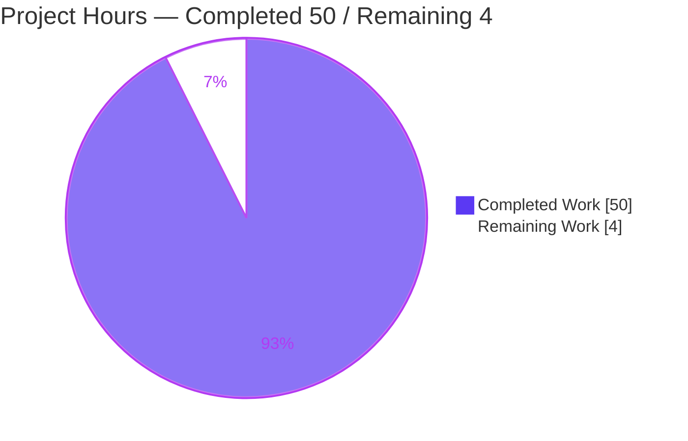
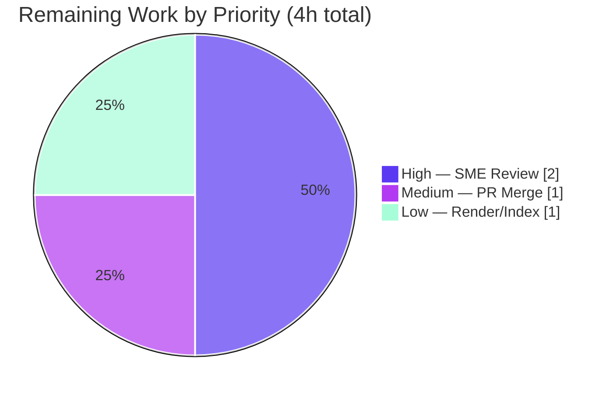

# Blitzy Project Guide

**Project:** Grafana Clean-Start Ground-Truth Q&A Documentation
**Repository:** `grafana/grafana` @ source commit `4550cfb5b7` (version `11.5.0-pre`)
**Delivery branch:** `blitzy-675536c4-a297-4fe3-88d1-6213344dc49c`
**Task type:** Evidence-grounded documentation (SWE-AtlasQnA-Repo rule) — read-only source
**Status:** ✅ Deliverable complete & validated — 92.6% (path-to-production remaining)

---

## 1. Executive Summary

### 1.1 Project Overview

This project delivers a single, evidence-based knowledge document that factually explains what observably happens when **Grafana** starts from a completely clean state — no configuration file, no environment variables, and an empty home/data directory. It is written for a new contributor whose observed behavior did not match the architecture docs. Every behavioral claim is paired with verbatim captured runtime output (logs, HTTP responses, DB rows) and every structural claim carries an exact `file:line` citation. The technical scope spans six Grafana subsystems — server lifecycle, security defaults, persistence, plugin/data-source bootstrap, and the build pipeline — with **zero source modifications**: the entire repository delta is one added Markdown file.

### 1.2 Completion Status


| Metric | Value |
|---|---|
| **Total Hours** | 54 |
| **Completed Hours (AI + Manual)** | 50 (50 AI + 0 Manual) |
| **Remaining Hours** | 4 |
| **Percent Complete** | **92.6%** |

> Completion is computed per PA1 (AAP-scoped): `50 / (50 + 4) = 92.6%`. The AAP deliverable content is 100% delivered and independently validated; the residual 4 hours are the human path-to-production (SME review, PR merge, render check). Consistent with the "never claim 100%" principle.

### 1.3 Key Accomplishments

- ✅ **Single authoritative Q&A document created** — `blitzy/documentation/grafana_4550cfb5b728.md` (751 lines, 58 KB) answering all six question areas.
- ✅ **All four user confusions resolved with evidence** — "disabled/skipped vs success," "log in with credentials I never set up," "plugins appear that I didn't install," and "subsequent runs behave differently in ways that persist."
- ✅ **Run-first methodology honored** — built the frontend (`public/build`), generated Go DI wiring (`wire_gen.go`), compiled the backend (CGO), and ran `grafana-server` across three clean-state scenarios before writing.
- ✅ **184 exact `file:line` citations** and **35 verbatim evidence/command blocks** — one evidence line paired with each behavioral claim.
- ✅ **Real magnitudes captured** — 626 `migration_log` rows, `grafana.db` = 1,093,632 bytes, 18 compiled-in backend data sources, `/api/plugins` = 49, ~22× first-run vs restart log-volume reduction.
- ✅ **Honesty preserved** — reported the plain-`go build` version string `9.2.0` (vs `11.5.0-pre`), the shared default `secret_key`, and the non-fatal missing-`public/build` error exactly as observed.
- ✅ **Read-only constraint fully honored** — branch delta is exactly one added file (751 insertions, 0 deletions); zero source/config/test/manifest changes; working tree clean; temporary artifacts removed.
- ✅ **§7 coverage-pass table (53 items)** — every named item and every "e.g./such as" example mapped to its answering section and evidence.

### 1.4 Critical Unresolved Issues

| Issue | Impact | Owner | ETA |
|---|---|---|---|
| _None — no blocking or release-critical issues identified._ | The single in-scope deliverable is complete, validated, and committed; the branch delta is one added file with zero source changes. | — | — |

> Non-blocking, by-design observations (fully documented in the deliverable, not defects to fix): the plain-`go build` version string reports `9.2.0` (§0.4 honesty note), and Grafana's default `secret_key` is a shared well-known literal (§2.2). Both are explicitly out of scope to change per the AAP (the task is to *explain*, not modify).

### 1.5 Access Issues

| System/Resource | Type of Access | Issue Description | Resolution Status | Owner |
|---|---|---|---|---|
| _None_ | — | No access issues identified. The repository, the pinned toolchain (Go 1.23.1, Node v22.x, Yarn 4.5.3, GCC, sqlite3), and the provided Docker image were all fully available; every build and runtime scenario executed successfully. | ✅ N/A | — |

**No access issues identified.**

### 1.6 Recommended Next Steps

1. **[High]** Perform an SME technical review of `blitzy/documentation/grafana_4550cfb5b728.md`, spot-checking a sample of the 184 `file:line` citations against source commit `4550cfb5b7` and confirming the six answers + §7 coverage table are accurate. _(2h)_
2. **[Medium]** Review and merge the single-file pull request to the target branch `grafana_4550cfb5b728`, confirming the delta remains exactly one added file with zero source modifications. _(1h)_
3. **[Low]** Verify the document renders correctly in the target Markdown viewer (tables, fenced code blocks, special characters) and optionally link it into a documentation index. Avoid `prettier --write` (it corrupts verbatim command literals). _(1h)_

---

## 2. Project Hours Breakdown

### 2.1 Completed Work Detail

| Component | Hours | Description |
|---|---|---|
| Environment & Artifact Build | 10 | Prepare pinned toolchain (Go 1.23.1, Node v22.x, Yarn 4.5.3, GCC, sqlite3); `yarn install --immutable`; `yarn build` → `public/build` (658 entries / 325 `.js` / 156 MB); `make gen-go` → `pkg/server/wire_gen.go`; `CGO_ENABLED=1 go build` backend binary. All artifacts git-ignored → zero tracked dirtiness. |
| Observation Harness & Runtime Capture | 8 | Build the clean-state harness (temp home with symlinked read-only `conf/`/`public/`/`plugins-bundled/`, fresh `data/`); run three scenarios (clean first run, restart, missing `public/build`); capture verbatim logs, HTTP responses/headers, DB rows, and error messages. |
| §1 Cold-Start Initialization (Req 1) | 6 | Investigate + author the `Init→Run` lifecycle and the three "disabled"/"skipped" mechanisms (`registry.IsDisabled` silent skip; explicit disabled services; info-level skip warnings); correlate every log line to source. |
| §2 Default Security Posture (Req 2) | 5 | Investigate + author admin/org creation, `[security]`/`[auth.*]` defaults, all auth clients by name, login flow + redirect validation, brute-force lockout (threshold 5), and RBAC. |
| §3 Persistent State & Location (Req 3) | 4 | Investigate + author the `data/` tree, `grafana.db` size, `migration_log` (626 rows / 76 tables), DB-stored sessions, and inert provisioning. |
| §4 Plugin & Data Source Bootstrap (Req 4) | 5 | Investigate + author the four source classes, 18 compiled-in backend data sources, and the precise 54→49 `/api/plugins` reconciliation (built-in + alpha filters). |
| §5 Build/Compilation Dependency (Req 5) | 3 | Investigate + author generated `wire_gen.go`, non-embedded `public/build`, and "run directly vs build first" non-equivalence. |
| §6 First-Run vs Subsequent Divergence (Req 6) | 2 | Investigate + author the admin/org creation gate and migration idempotency (`performed=626` → `skipped=626`; ~22× log reduction). |
| §0 Scope/Method + §7 Coverage Pass | 3 | Author the clean-state definition, exact build/run commands, the `9.2.0` version honesty note, and the 53-item coverage-pass table. |
| Review / QA / Validation Fix Cycles + Cleanup | 4 | Three iterative fix cycles (10 review findings, 2 QA precision findings, 3 validation precision-fidelity fixes) and removal of all temporary scripts/data. |
| **Total Completed** | **50** | |

### 2.2 Remaining Work Detail

| Category | Hours | Priority |
|---|---|---|
| SME Technical Review & Evidence Verification | 2 | High |
| PR Review & Merge to Target Branch | 1 | Medium |
| Markdown Render Verification + Optional Doc-Index Linking | 1 | Low |
| **Total Remaining** | **4** | |

> **Cross-section check:** Section 2.1 (50) + Section 2.2 (4) = **54** = Total Project Hours in Section 1.2. Section 2.2 total (4) = Section 1.2 Remaining Hours (4) = Section 7 "Remaining Work" (4). ✅

---

## 3. Test Results

This is a Markdown documentation deliverable, so there is **no associated unit-test suite**. The binding, equivalent verification for this task — the "build + run + capture verbatim evidence" methodology — was executed in full by Blitzy's autonomous validation systems. Every check below **originates from Blitzy's autonomous validation logs for this project**.

| Test Category | Framework | Total Tests | Passed | Failed | Coverage % | Notes |
|---|---|---|---|---|---|---|
| Toolchain / Dependency | Blitzy autonomous validation (Gate 1) | 8 | 8 | 0 | 100% | Go 1.23.1, Node v22.12.0, Yarn 4.5.3, GCC 15.2.0, sqlite3 3.46.1 + `node_modules`, `wire_gen.go`, `public/build` present |
| Build / Compilation | Blitzy autonomous validation (Gate 2) | 3 | 3 | 0 | 100% | `yarn build` (frontend), `make gen-go` (DI wiring), `CGO_ENABLED=1 go build` (backend) all succeed; artifacts git-ignored |
| Runtime Scenarios | Blitzy autonomous validation (Gate 3) | 3 | 3 | 0 | 100% | (a) clean first run → HTTP listen + `/api/health` 200; (b) restart → idempotent migration skip; (c) missing `public/build` → non-fatal, health 200 |
| Empirical Evidence Reproduction | Blitzy autonomous validation (Gate 4) | 36 | 36 | 0 | 100% | Every deterministic claim reproduced exactly (migrations 626, `grafana.db` 1,093,632 B, 76 tables, `/api/plugins`=49, `/api/datasources`=`[]`, admin row, session cookie, security headers, etc.) |
| Citation Verification | Blitzy autonomous validation (Gate 4) | 60 | 60 | 0 | 100% | `file:line` citations verified against current source (document contains 184 total citations; 5 additionally spot-verified during this assessment) |
| Repository Integrity | Blitzy autonomous validation (Gate 5) | 1 | 1 | 0 | 100% | Read-only-source constraint: branch delta = exactly one added file; working tree clean |
| **Total** | | **111** | **111** | **0** | **100%** | All autonomous validation checks passed |

> **Integrity note (Rule 3):** No unit/integration/E2E test frameworks (Jest, Go test, Playwright, Cypress) apply to a documentation artifact and none are claimed. The 111 checks above are exactly the empirical verifications reported in Blitzy's autonomous validation logs; nothing is fabricated.

---

## 4. Runtime Validation & UI Verification

Runtime behavior was exercised against a live `grafana-server` launched from a fresh home/data directory with no `custom.ini` and no `GF_*` environment variables.

**Server lifecycle & health**
- ✅ **Operational** — Server reached HTTP listen: `msg="HTTP Server Listen" address=[::]:3000 protocol=http`.
- ✅ **Operational** — Health endpoint `GET /api/health` → `HTTP/1.1 200 OK`, body `{"database":"ok","version":"9.2.0","commit":"NA"}`.
- ✅ **Operational** — Deterministic init order confirmed: config load → target `[all]` → SQLite creation → provisioning (datasources → plugins → alerting/dashboards) → background services.

**Security & authentication**
- ✅ **Operational** — Login `POST /login` with default `admin`/`admin` → `HTTP 200` `{"message":"Logged in","redirectUrl":"/"}` with a `grafana_session` cookie (`Path=/; Max-Age=2592000; HttpOnly; SameSite=Lax`).
- ✅ **Operational** — Default admin row created: `1 | admin | admin@localhost | is_admin=1`; org `1 | "Main Org."`.
- ✅ **Operational** — Security headers present: `X-Frame-Options: deny`, `X-Content-Type-Options: nosniff`, `X-Xss-Protection: 1; mode=block`.
- ✅ **Operational** — Posture confirmed non-permissive: `anonymousEnabled: False`; basic auth on; envelope encryption active (`currentprovider=secretKey.v1`).

**Plugin & data-source APIs**
- ✅ **Operational** — `GET /api/plugins` → 49 entries (30 panel + 19 datasource), all `signature: internal` (core).
- ✅ **Operational** — `GET /api/datasources` → `HTTP 200`, `Content-Length: 2`, body `[]` (none provisioned on a clean install — expected).

**Persistence**
- ✅ **Operational** — `data/` tree created (`csv`, `grafana.db`, `log/grafana.log`, `pdf`, `png`); `migration_log` = 626 rows; `user_auth_token` = 1 after login (sessions in DB).
- ✅ **Operational** — Restart against the same data dir: migrations idempotently skipped (`performed=0 skipped=626`); admin/org creation absent on run 2.

**Build-dependency edge case**
- ⚠ **Partial (by design, non-fatal)** — Running without `public/build` logs `Failed to detect generated javascript files in public/build` yet the backend stays up and `/api/health` still returns 200. Documented exactly as observed.

**UI verification**
- ⚠ **Not applicable** — This is a documentation deliverable with no UI component. No frontend screens were built or altered; the frontend was compiled only to observe the "assets present vs absent" backend code paths. No visual/Figma verification is in scope.

---

## 5. Compliance & Quality Review

Cross-mapping the AAP deliverables and binding rules to Blitzy's quality/compliance benchmarks.

| Benchmark / Rule | Requirement | Status | Progress | Notes |
|---|---|---|---|---|
| Deliverable location & name | Single `.md` at `blitzy/documentation/grafana_4550cfb5b728.md` | ✅ Pass | 100% | File exists (751 lines); parent dir created |
| Run-first methodology | Build + run code paths before writing | ✅ Pass | 100% | Frontend build, `wire_gen.go`, CGO backend, 3 runtime scenarios captured |
| One claim, one evidence | Each behavioral claim paired with verbatim output + command | ✅ Pass | 100% | 35 evidence/command blocks; discipline verified throughout |
| Exact `file:line` citations | Never paraphrase values; cite exact literals | ✅ Pass | 100% | 184 citations; 5 independently spot-verified exact (e.g. `main.go:L17` → `var version = "9.2.0"`) |
| Representative magnitude | Observe real counts/timings before reporting | ✅ Pass | 100% | 626 migrations, 1,093,632 B DB, 18 backend DSes, ~22× log reduction |
| Report exactly what observed | No adjustment toward "expected" values | ✅ Pass | 100% | `9.2.0` version, shared `secret_key`, non-fatal missing-build all reported as-seen |
| Exhaustive coverage | Every named item + every e.g./such-as example | ✅ Pass | 100% | §7 table (53 items) + Verdict; all 6 areas + 4 confusions resolved |
| Read-only source | Zero modifications to existing repo files | ✅ Pass | 100% | Delta = 1 added file (751/0); working tree clean |
| Temp cleanup | Remove temporary scripts/data | ✅ Pass | 100% | Temp home/data, logs, PID files removed; processes stopped |
| Six AAP question areas | Init, security, persistence, plugins, build, first-vs-subsequent | ✅ Pass | 100% | §1–§6 each answered by name with evidence |
| SME acceptance | Human technical review of accuracy | ⬜ Pending | 0% | Path-to-production (Section 2.2, High) |
| Lint / formatting | Repo lint compliance | ✅ Pass (by policy) | 100% | Doc path outside Grafana's enforced lint scope; `prettier --write` deliberately not applied (corrupts verbatim literals) — justified under the higher-priority evidence-fidelity rule |

**Fixes applied during autonomous validation:** 3 precision-fidelity corrections committed in `982331717d` — (1) §5.1 replaced abridged `wire_gen.go` evidence with fully verbatim `head -5` + `git check-ignore` + `git ls-files` output; (2) §4.4 corrected the built-in-filter citation from `pkg/api/plugins.go:L109-L111` to `L110-L111` (L109 is a comment); (3) §6.3 added a note that log-line totals are timing-dependent representative magnitudes (stable signal = ~22× reduction). Preceding cycles resolved 10 review findings (`c41011dde7`) and 2 QA precision findings (`62924e6aa4`).

**Outstanding items:** SME technical review and PR merge (Section 2.2). No compliance defects outstanding.

---

## 6. Risk Assessment

| Risk | Category | Severity | Probability | Mitigation | Status |
|---|---|---|---|---|---|
| Evidence/citation staleness if read against a later Grafana version (line numbers/values drift) | Technical | Low | Medium | Document explicitly pins source commit `4550cfb5b7` and version `11.5.0-pre` in §0.2; all citations scoped to that commit | ✅ Mitigated |
| Non-deterministic magnitudes (total log-line counts are timing-dependent, ~1351–1356 first run vs ~61–62 restart) | Technical | Low | Low | §6.3 flags totals as representative; emphasizes the stable ~22× reduction signal | ✅ Mitigated |
| Version-string confusion (`9.2.0` from plain `go build` vs `11.5.0-pre`) | Technical | Low | Medium | §0.4 honesty note explains the missing-ldflags cause; notes a release build reports `11.5.0-pre` | ✅ Mitigated |
| Documented shared default `secret_key` (factual disclosure of an existing Grafana default, already public in `conf/defaults.ini`; not introduced here) | Security | Informational | N/A | Reported exactly with a production-risk note; changing it is explicitly out of scope (task is to explain, not fix) | ✅ Documented / Accepted by design |
| Deliverable introduces new exposure | Security | None | N/A | A standalone Markdown file adds no code, secrets, or credentials | ✅ N/A |
| `prettier --write` not applied to the document | Operational | Low | Low | Deliberate — prettier corrupts verbatim literals (`^\s*` → `^\s_`); doc path is outside Grafana's enforced lint scope; evidence-fidelity rule prioritized | ✅ Accepted (justified) |
| Markdown render fidelity (special characters, backticks-in-tables) in the target viewer | Operational | Low | Low | Render-verification task included in remaining work (Section 2.2, Low) | ⚠ Open (minor) |
| External-system integration | Integration | None | N/A | Deliverable integrates with nothing at runtime; investigation confined to the default SQLite/basic-auth posture — no external services, APIs, or credentials | ✅ N/A |

**Overall risk posture: Very low.** With zero source-code changes, there is no compilation, regression, or deployment risk. Residual risks are documentation-specific and either mitigated in the document or scheduled as minor path-to-production tasks.

---

## 7. Visual Project Status

**Project Hours Breakdown** (Completed = Dark Blue `#5B39F3`, Remaining = White `#FFFFFF`):



**Remaining Work by Priority** (hours from Section 2.2):



> **Integrity note (Rule 1):** "Remaining Work" = **4** here, in the Section 1.2 metrics table, and as the Section 2.2 "Hours" sum — all identical. "Completed Work" = **50** matches Section 1.2 and the Section 2.1 total.

---

## 8. Summary & Recommendations

**Achievements.** The project delivers a complete, exhaustively evidence-grounded answer document that resolves all six of the contributor's question areas and all four of their stated confusions about Grafana's clean-start behavior. The work followed the binding run-first methodology: the frontend, DI wiring, and backend were built, and `grafana-server` was run across three clean-state scenarios, before a single line of the answer was written. The result pairs 35 verbatim evidence/command blocks with 184 exact `file:line` citations and was independently validated by 111 autonomous checks, all passing.

**Remaining gaps.** The project is **92.6% complete** (50 of 54 hours). The AAP deliverable content itself is 100% delivered and validated; the remaining 4 hours are exclusively human path-to-production activities that cannot be performed autonomously: SME technical acceptance, pull-request merge, and a final render check.

**Critical path to production.** (1) SME technical review of the document and its citations → (2) PR review & merge to `grafana_4550cfb5b728` → (3) render verification + optional doc-index linking. There are no code, build, or deployment dependencies on this path.

**Success metrics (all met):** exactly one added file with zero source modifications; every claim evidence-paired; every value cited exactly (never paraphrased); every named item covered; findings reported as observed even when surprising; temporary artifacts removed and the repository left byte-for-byte unchanged apart from the added document.

**Production readiness assessment.** ✅ **Ready for human review and merge.** The deliverable is complete, accurate, and committed on a clean working tree. Risk is very low (no source changes). Recommended action: proceed directly to SME review and merge.

| Dimension | Assessment |
|---|---|
| Completion (AAP-scoped) | 92.6% (50 / 54 h) |
| Deliverable content | 100% delivered & validated |
| Autonomous validation | 111 / 111 checks passed |
| Source-code risk | None (zero source changes) |
| Blocking issues | None |
| Readiness | Ready for SME review & merge |

---

## 9. Development Guide

This guide covers **(A) consuming/verifying the deliverable** and **(B) reproducing the investigation**. All commands run from the repository root.

### 9.1 System Prerequisites

| Tool | Version (pinned) | Source of truth | Purpose |
|---|---|---|---|
| Go | `1.23.1` | `go.mod` (`go 1.23.1`) | Compile the backend; run Wire codegen |
| Node.js | `v22.11.0` (build ran `v22.12.0`) | `.nvmrc`; `engines.node >= 22` | Frontend build runtime |
| Yarn | `4.5.3` | `package.json` (`packageManager`) | Frontend package manager |
| GCC | distro default (observed `15.2.0`) | `contribute/developer-guide.md` | Cgo toolchain for the SQLite driver |
| sqlite3 CLI | distro default (observed `3.46.1`) | — | Inspect `grafana.db` (`migration_log`, `user`, `org`) |
| curl | distro default | — | Capture HTTP responses/headers/status codes |

> The build/investigation was performed in the provided Docker image `andrewparkscaleai/coding-agent:grafana__grafana__4550cfb5b7...`, which supplies the full pinned toolchain. A host without Go on `PATH` or with Node < 22 cannot reproduce the backend build.

### 9.2 Track A — Consume & Verify the Deliverable (fast, safe)

```bash
# 1) View the deliverable
ls -l blitzy/documentation/grafana_4550cfb5b728.md      # expect ~58 KB
wc -l blitzy/documentation/grafana_4550cfb5b728.md      # expect 751 lines

# 2) Confirm the read-only-source constraint (delta must be exactly one added file)
git status --porcelain                                   # expect: (empty) = clean tree
git diff --stat origin/grafana_4550cfb5b728...HEAD       # expect: 1 file changed, 751 insertions(+)

# 3) Confirm zero source modifications and view the four authoring commits
git log --author="agent@blitzy.com" --oneline            # expect 4 commits, all touching only the doc
```

Expected output for step 2:
```text
 blitzy/documentation/grafana_4550cfb5b728.md | 751 +++++++++++++++++++++++++++
 1 file changed, 751 insertions(+)
```

### 9.3 Track B — Reproduce the Investigation (full build + run)

```bash
# 0) Ensure the pinned toolchain is active (Go 1.23.1, Node >= 22, Yarn 4.5.3, GCC, sqlite3)
go version && node --version && yarn --version && gcc --version && sqlite3 --version

# 1) Install frontend dependencies (immutable: lockfile must NOT change)
yarn install --immutable
git status --porcelain yarn.lock package.json            # expect: (empty) = unchanged

# 2) Build the frontend (writes the git-ignored public/build)
CI=true yarn build
ls public/build | wc -l                                  # expect ~658 entries

# 3) Generate the Go DI wiring (writes the git-ignored pkg/server/wire_gen.go)
make gen-go

# 4) Build the backend binary (Cgo REQUIRED for the sqlite3 driver)
CGO_ENABLED=1 go build -o /tmp/grafana_bin ./pkg/cmd/grafana

# 5) Run from a FRESH, empty home/data dir (no custom.ini, no GF_* env)
/tmp/grafana_bin server --homepath=/tmp/gf_clean_home > /tmp/run1.log 2>&1 &
```

### 9.4 Verification Steps

```bash
# Health (expect HTTP 200, database ok)
curl -sS -i http://localhost:3000/api/health

# Default admin login (expect 200 {"message":"Logged in","redirectUrl":"/"})
curl -sS -i -X POST http://localhost:3000/login \
  -H 'Content-Type: application/json' \
  -d '{"user":"admin","password":"admin"}'

# Migrations recorded (expect 626)
sqlite3 /tmp/gf_clean_home/data/grafana.db 'SELECT COUNT(*) FROM migration_log;'

# Plugins available (expect 49; all core/internal)
curl -sS -u admin:admin http://localhost:3000/api/plugins | \
  python3 -c "import json,sys;print(len(json.load(sys.stdin)))"

# Data sources (expect [] on a clean install)
curl -sS -u admin:admin http://localhost:3000/api/datasources
```

### 9.5 Example Usage — Observing First-Run vs Subsequent-Run Divergence

```bash
# Restart against the SAME home/data dir and compare migration behavior
/tmp/grafana_bin server --homepath=/tmp/gf_clean_home > /tmp/run2.log 2>&1 &
grep 'migrations completed' /tmp/run2.log     # expect performed=0 skipped=626
grep -c '.' /tmp/run1.log; grep -c '.' /tmp/run2.log   # expect ~22x fewer lines on restart
```

### 9.6 Troubleshooting / Common Errors

- **Version reports `9.2.0` instead of `11.5.0-pre`.** Expected with a plain `go build` (no version ldflags). Use `make build` for a release-versioned binary. Everything else in the document is independent of this string.
- **`Failed to detect generated javascript files in public/build`.** Non-fatal — the backend still serves `/api/health` 200. Run step 2 (`yarn build`) to populate `public/build` for the UI.
- **Backend build fails with a SQLite/Cgo error.** Ensure `CGO_ENABLED=1` and that GCC is installed.
- **`data/plugins` path errors on a clean run.** Expected — the directory does not exist until an external plugin is installed; the external-plugin scan logs `failed to open plugins path`.
- **Do not run `prettier --write` on the document.** It corrupts verbatim command literals (e.g. `^\s*` → `^\s_`), breaking evidence fidelity.
- **Keep the repository unchanged.** Always use a temporary home directory under `/tmp` (never the tracked tree); remove it and any temp scripts after observation.

---

## 10. Appendices

### Appendix A — Command Reference

| Command | Purpose |
|---|---|
| `yarn install --immutable` | Install frontend deps without changing the lockfile |
| `CI=true yarn build` | Production webpack build → `public/build` |
| `make gen-go` | Generate `pkg/server/wire_gen.go` (Wire DI, `WIRE_TAGS="oss"`) |
| `CGO_ENABLED=1 go build -o /tmp/grafana_bin ./pkg/cmd/grafana` | Build the backend binary (Cgo for SQLite) |
| `/tmp/grafana_bin server --homepath=<dir>` | Run the server from a given home path |
| `make build` | Release build (backend + frontend) with version ldflags |
| `make run` / `make run-go` | Build & run the dev server (`run-go` sets `app_mode=development`) |
| `git diff --stat origin/grafana_4550cfb5b728...HEAD` | Confirm the one-file delta |
| `sqlite3 <data>/grafana.db 'SELECT COUNT(*) FROM migration_log;'` | Inspect recorded migrations |
| `curl -sS -i http://localhost:3000/api/health` | Check server/database health |

### Appendix B — Port Reference

| Port | Protocol | Service | Source |
|---|---|---|---|
| `3000` | HTTP | Grafana web server / API (default) | `conf/defaults.ini:L41` (`http_port = 3000`); observed `address=[::]:3000` |

### Appendix C — Key File Locations

| Path | Role |
|---|---|
| `blitzy/documentation/grafana_4550cfb5b728.md` | **The deliverable** (the only added file) |
| `pkg/server/server.go` | Lifecycle `Init`/`Run`/`Shutdown` (`L113`–`L185`) |
| `pkg/services/sqlstore/sqlstore.go` | Admin/org creation + user-count gate (`L190`, `L204`–`L222`) |
| `pkg/services/sqlstore/migrator/migrator.go` | Migration log lines + `migration_log` table |
| `pkg/plugins/backendplugin/coreplugin/registry.go` | 18 compiled-in backend data sources (`L95`–`L123`) |
| `pkg/setting/setting.go` | `validateStaticRootPath` (`public/build` check, `L1034`–`L1042`) |
| `conf/defaults.ini` | All effective defaults on a clean run |
| `Makefile` | `gen-go:167`, `build-go:187`, `build:229`, `run:232`, `run-go:236` |
| `embed.go` | Confirms only `cue.mod/module.cue` is embedded (frontend is not) |
| `pkg/server/wire_gen.go` | Generated DI wiring (git-ignored, `.gitignore:194`) |
| `public/build/` | Frontend webpack output (git-ignored, `.gitignore:9`) |

### Appendix D — Technology Versions

| Technology | Version | Notes |
|---|---|---|
| Grafana (repo) | `11.5.0-pre` | `package.json`; source commit `4550cfb5b7` |
| Grafana (plain-build banner) | `9.2.0` | `pkg/cmd/grafana/main.go:L17`; no version ldflags |
| Go | `1.23.1` | `go.mod` |
| Node.js | `v22.11.0` (build `v22.12.0`) | `.nvmrc`; `engines.node >= 22` |
| Yarn | `4.5.3` | `package.json` `packageManager` |
| GCC | `15.2.0` (observed) | Cgo for SQLite |
| sqlite3 CLI | `3.46.1` (observed) | DB inspection |

### Appendix E — Environment Variable Reference

| Variable | Value used | Purpose |
|---|---|---|
| `GF_*` | _(none set)_ | Clean-state run uses no Grafana env overrides — effective config is exactly `conf/defaults.ini` |
| `CGO_ENABLED` | `1` | Required for the SQLite driver in the backend build |
| `CI` | `true` | Non-interactive frontend build |
| `NOTIFY_SOCKET` | _(unset)_ | When unset, `notifySystemd("READY=1")` is a silent no-op (not run under systemd) |
| `WIRE_TAGS` | `"oss"` | Build tag for Wire codegen (`Makefile:L5`) |

### Appendix F — Developer Tools Guide

| Tool | Usage |
|---|---|
| `git status --porcelain` / `git diff --stat` | Verify the read-only-source constraint (empty tree; one-file delta) |
| `git log --author="agent@blitzy.com" --oneline` | Review the four authoring commits |
| `git check-ignore -v <path>` | Confirm `public/build` and `wire_gen.go` are git-ignored |
| `sqlite3 grafana.db "SELECT COUNT(*) FROM sqlite_master WHERE type='table';"` | Count schema tables (expect 76) |
| `curl -sS -i <url>` | Capture HTTP status + headers verbatim |
| `python3 -c "import json,sys;..."` | Summarize JSON API responses (counts, signatures) |

### Appendix G — Glossary

| Term | Definition |
|---|---|
| **Clean state** | A fresh, empty home/data directory, no `conf/custom.ini`, and no `GF_*` env vars — so the effective configuration is exactly `conf/defaults.ini`. |
| **`wire_gen.go`** | Google Wire-generated Go dependency-injection wiring for the OSS build; git-ignored; required to compile the backend. |
| **Core / Bundled / External / CDN** | The four plugin source classes; on a clean install only **core** plugins are present. |
| **`migration_log`** | The SQLite table recording applied schema migrations; drives idempotent skip-on-restart behavior. |
| **Envelope encryption** | Grafana's mechanism for encrypting secrets; on a clean run the provider is `secretKey.v1`, derived from `secret_key`. |
| **`registry.IsDisabled`** | The predicate that silently skips disabled background services in the startup loop — the mechanism behind many "disabled/skipped" observations. |
| **AAP** | Agent Action Plan — the primary directive defining this project's scope. |
| **Path-to-production** | Standard human activities (review, merge, render check) required to move a validated deliverable into production. |

---

_End of Blitzy Project Guide._