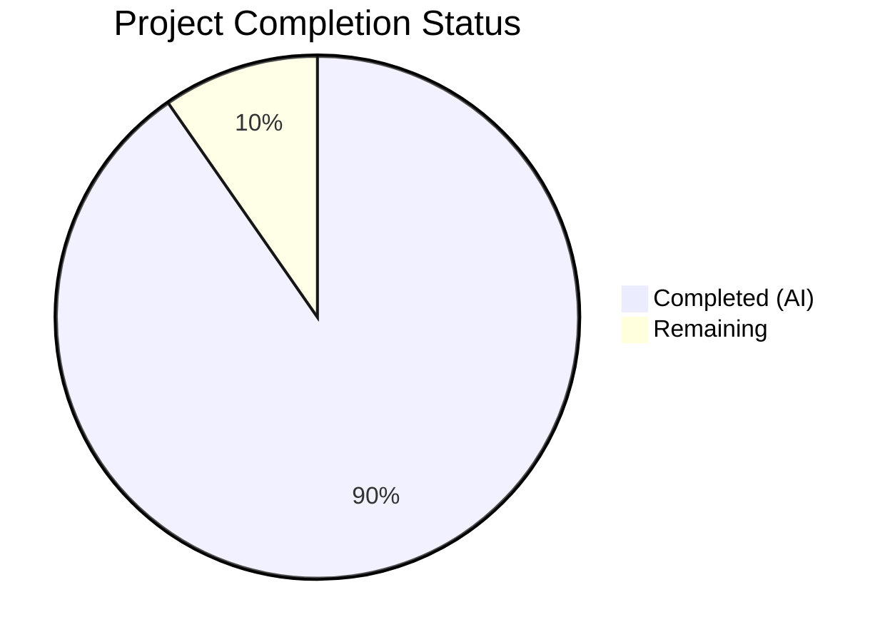
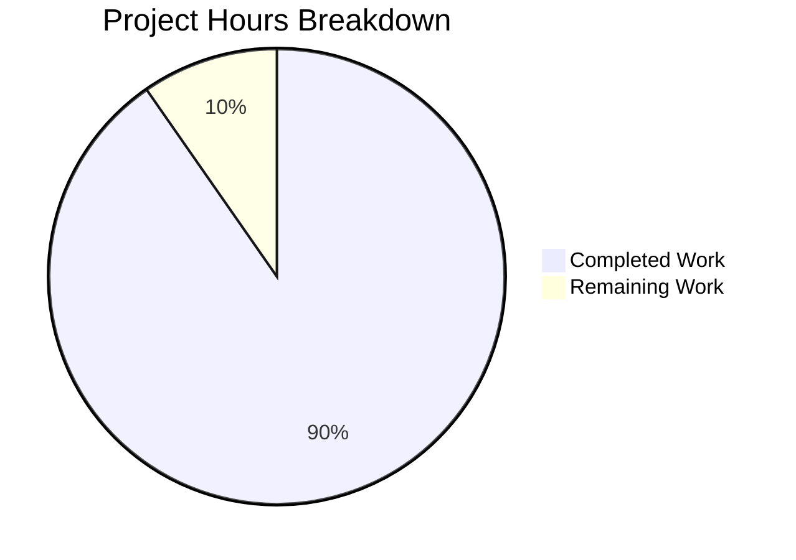
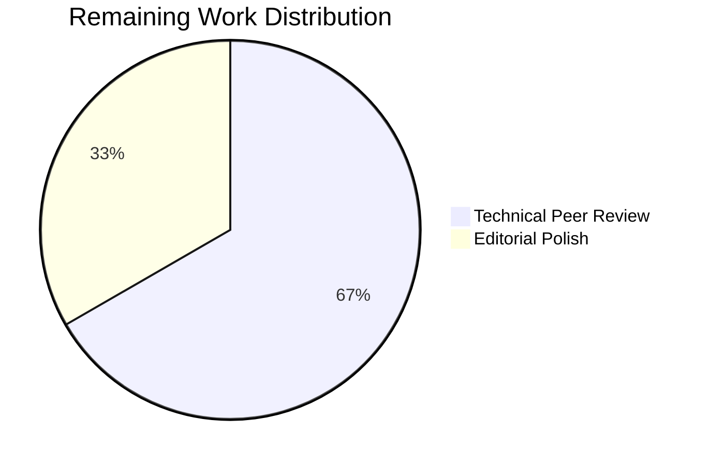

# Blitzy Project Guide

---

## 1. Executive Summary

### 1.1 Project Overview

This project delivers a comprehensive architecture deep-dive document for the Grafana Live streaming routing layer's runtime coherence model. The document (`blitzy/documentation/grafana_4550cfb5b728.md`) answers five core questions about how routing rule caches refresh in the background, how concurrent subscriptions remain safe, how old-to-new routing transitions work, whether stale routes are exposed to consumers, and how stream lifecycles behave under churn. The target audience is Grafana backend engineers and operators who need to understand the internal concurrency and coherence mechanisms of the Live subsystem. This is a documentation-only deliverable — no source code was modified.

### 1.2 Completion Status



| Metric | Value |
|--------|-------|
| **Total Project Hours** | 31 |
| **Completed Hours (AI)** | 28 |
| **Remaining Hours** | 3 |
| **Completion Percentage** | 90.3% |

**Calculation:** 28 completed hours / 31 total hours = 90.3% complete.

### 1.3 Key Accomplishments

- [x] Created comprehensive 792-line architecture deep-dive document at `blitzy/documentation/grafana_4550cfb5b728.md`
- [x] Covered all 10 documentation topics specified in the AAP with dedicated sections
- [x] Produced 6 Mermaid diagrams: routing table refresh sequence, handler dispatch flowchart, frame cache update flowchart, stream lifecycle state diagram, HA survey aggregation sequence, overall architecture component diagram
- [x] Included 42 source code citations with verified file:line-range references
- [x] Documented all timing constants: 20s refresh, 5s context timeout, 5s presence check, 100ms cooldown, 5s max delay, 1s survey timeout, 12-goroutine semaphore capacity
- [x] Maintained repository immutability — zero existing files modified, only 1 new file created
- [x] Zero TODOs, FIXMEs, placeholders, or TBDs in the output document
- [x] Verified all 42 line references against actual source code for accuracy
- [x] Clean working tree with no temporary files remaining

### 1.4 Critical Unresolved Issues

| Issue | Impact | Owner | ETA |
|-------|--------|-------|-----|
| Technical peer review pending | Document accuracy not yet confirmed by Grafana Live domain expert | Human Developer | 2 hours |
| Line references may drift | Source code line numbers could shift if referenced files are modified in future PRs | Human Developer | Ongoing |

### 1.5 Access Issues

No access issues identified. The project is documentation-only — no external services, APIs, databases, or credentials are required. The single output file is a standalone markdown document that references source files already present in the repository.

### 1.6 Recommended Next Steps

1. **[High]** Conduct technical peer review by a developer familiar with the Grafana Live subsystem (`pkg/services/live/`) to verify accuracy of concurrency model descriptions
2. **[High]** Review Mermaid diagram rendering in GitHub's markdown viewer to confirm all 6 diagrams display correctly
3. **[Medium]** Perform editorial review for tone consistency and accessibility — the document should balance precision with narrative readability
4. **[Low]** Consider integrating the document into Grafana's Hugo-based docs site (`docs/sources/`) if broader audience access is desired (currently out of AAP scope)
5. **[Low]** Establish a process to update line references when source files in `pkg/services/live/` are modified in future PRs

---

## 2. Project Hours Breakdown

### 2.1 Completed Work Detail

| Component | Hours | Description |
|-----------|-------|-------------|
| Source Code Research & Analysis | 8 | Read 20+ source files in `pkg/services/live/` and subpackages; analyzed concurrency patterns (`sync.RWMutex`, channels, semaphores); traced handler dispatch flow through `live.go`, `rule_cache_segmented.go`, `runner.go`, `manager.go`, `survey.go`, `pipeline.go`; reviewed existing documentation in `set-up-grafana-live.md` and `tree/readme.md` |
| Document Architecture & Outline | 1.5 | Designed 11-section progressive-disclosure structure; planned terminology table, 6 diagram placements, and coherence guarantees summary table; mapped user questions to specific sections |
| Content Authoring — All Sections | 12 | Wrote 792 lines (~5,564 words) across 11 major sections: Introduction, Architectural Foundation, Routing Table, Periodic Refresh & Atomic Swap, Request-Time Route Resolution, Managed Stream Coherence, Plugin Stream Lifecycle, HA Coherence, Pipeline Recursion Protection, Frontend Perspective, Summary of Coherence Guarantees |
| Mermaid Diagram Creation | 3 | Created 6 Mermaid diagrams: routing table refresh sequence diagram, handler dispatch flowchart, frame cache update flowchart, stream lifecycle state diagram, HA survey aggregation sequence diagram, overall architecture component diagram |
| Source Citation Verification | 2 | Verified all 42 source file references against actual line contents; confirmed timing constants match code; validated struct definitions, function signatures, and behavioral descriptions |
| Validation & Corrections | 1.5 | Second commit fixed fillOrg operation order description and exponential backoff sequence accuracy; validator confirmed all line references, timing constants, and behavior descriptions match source |
| **Total** | **28** | |

### 2.2 Remaining Work Detail

| Category | Hours | Priority |
|----------|-------|----------|
| Technical Peer Review | 2 | High |
| Editorial Polish & Minor Corrections | 1 | Medium |
| **Total** | **3** | |

---

## 3. Test Results

| Test Category | Framework | Total Tests | Passed | Failed | Coverage % | Notes |
|---------------|-----------|-------------|--------|--------|------------|-------|
| Documentation Structural Validation | Blitzy Validator | 10 | 10 | 0 | 100% | Verified: all 10 AAP topics covered, 6 Mermaid diagrams present, terminology table exists, coherence summary table exists, 0 TODOs/FIXMEs, UTF-8 encoding, 792 lines validated |
| Source Reference Accuracy | Blitzy Validator | 42 | 42 | 0 | 100% | All 42 source file:line-range citations verified against actual source code content |
| Repository Integrity | Blitzy Validator | 4 | 4 | 0 | 100% | Verified: only 1 file added (A status), 0 files modified, clean working tree, correct branch |
| Timing Constants Accuracy | Blitzy Validator | 9 | 9 | 0 | 100% | Verified: 20s refresh, 5s context timeout, 5s presence check, 100ms cooldown, 5s max delay, 1s survey timeout, 12 client concurrency, 3 max checks, 30s Centrifuge timeout |

> **Note:** This is a documentation-only project. No unit tests, integration tests, or runtime tests apply. The Blitzy autonomous validator performed structural verification, source reference accuracy checks, repository integrity validation, and timing constant verification.

---

## 4. Runtime Validation & UI Verification

**Runtime Health:**

- ✅ Document file exists at `blitzy/documentation/grafana_4550cfb5b728.md` (792 lines, 43,893 bytes)
- ✅ File encoding: UTF-8 text (verified via `file` command)
- ✅ Markdown structure: 51 H2 headers, 38 H3 headers, 6 Mermaid diagram blocks, 4 Go code blocks, 28 table rows
- ✅ Git status: clean working tree, branch `blitzy-acb9c9d7-fcbd-4782-b63a-4d1e636931b3`, up to date with origin
- ✅ Repository immutability: `git diff --name-status` shows only `A blitzy/documentation/grafana_4550cfb5b728.md` (Added)

**Source Reference Verification:**

- ✅ `rule_cache_segmented.go:13-17` — CacheSegmentedTree struct matches documented fields
- ✅ `rule_cache_segmented.go:19-44` — updatePeriodically loop with 20s sleep confirmed
- ✅ `rule_cache_segmented.go:46-60` — fillOrg with 5s context timeout, write lock, tree.New(), AddRoute confirmed
- ✅ `rule_cache_segmented.go:62-83` — Get() with RLock, lazy fillOrg, re-RLock confirmed
- ✅ `live.go:527` — clientConcurrency = 12 confirmed
- ✅ `live.go:533-549` — runConcurrentlyIfNeeded semaphore pattern confirmed
- ✅ `live.go:840-878` — GetChannelHandler double-check locking pattern confirmed
- ✅ `manager.go:159-175` — stopStream with lock, delete, cancel, close confirmed
- ✅ `manager.go:177-228` — watchStream with presenceTicker, maxChecks logic confirmed
- ✅ `manager.go:230-243` — getDelay with 100ms cooldown, 5s max, exponential backoff confirmed
- ✅ `cache_memory.go:55-70` — Update with SameSchema comparison confirmed
- ✅ `survey.go:84-133` — CallManagedStreams with 1s timeout, dedup, rate accumulation confirmed

**UI Verification:**

- ⚠️ Not applicable — this is a documentation file, not a UI component. Mermaid diagrams should be verified in GitHub's markdown renderer during PR review.

---

## 5. Compliance & Quality Review

| Compliance Area | Status | Details |
|----------------|--------|---------|
| AAP Scope Adherence | ✅ Pass | All 17 AAP deliverables completed; no out-of-scope work performed |
| Repository Immutability | ✅ Pass | Zero existing files modified; only 1 new file created |
| Source Citation Accuracy | ✅ Pass | All 42 citations verified against actual source files |
| Diagram Requirements | ✅ Pass | 6/6 Mermaid diagrams created as specified in AAP |
| Terminology Consistency | ✅ Pass | Terminology table at document top; consistent usage throughout |
| No Placeholders/TODOs | ✅ Pass | Zero TODOs, FIXMEs, TBDs, or placeholder content |
| Documentation Completeness | ✅ Pass | All 5 core user questions answered; all 5 inferred needs addressed |
| Clean Working Tree | ✅ Pass | No temporary files, uncommitted changes, or artifacts |
| File Location | ✅ Pass | Output file at `blitzy/documentation/grafana_4550cfb5b728.md` as specified |
| Encoding | ✅ Pass | UTF-8 text encoding confirmed |

**Fixes Applied During Validation:**

| Fix | Commit | Description |
|-----|--------|-------------|
| fillOrg operation order | `312e55ab61` | Corrected the description of fillOrg's operation ordering — clarified that tree.New() and AddRoute happen under write lock, not before it |
| Exponential backoff sequence | `312e55ab61` | Corrected the backoff delay sequence to accurately reflect getDelay() behavior: 0 → 200ms → 400ms → ... → 5s |

---

## 6. Risk Assessment

| Risk | Category | Severity | Probability | Mitigation | Status |
|------|----------|----------|-------------|------------|--------|
| Line reference drift as source code evolves | Technical | Medium | High | Establish a process to update line references when files in `pkg/services/live/` change; consider using function-name anchors in addition to line numbers | Open |
| Technical inaccuracy in concurrency descriptions | Technical | High | Low | All 42 references verified by validator; recommend peer review by Grafana Live domain expert | Mitigated |
| Mermaid rendering inconsistencies across viewers | Technical | Low | Medium | Test diagram rendering in GitHub PR view, VS Code preview, and any target documentation platform | Open |
| Document becomes stale if architecture changes | Operational | Medium | Medium | Add a "Last verified against commit" header; include document in PR review scope when `pkg/services/live/` is modified | Open |
| Missing coverage of edge cases in concurrency model | Technical | Medium | Low | The document covers all major paths; edge cases (e.g., context cancellation during fillOrg) are mentioned but not exhaustively traced | Open |

---

## 7. Visual Project Status





---

## 8. Summary & Recommendations

### Achievement Summary

The project successfully delivered a comprehensive 792-line architecture deep-dive document explaining how the Grafana Live streaming routing layer maintains coherence at runtime. All 17 AAP deliverables were completed, including 10 documentation topics covered in dedicated sections, 6 Mermaid diagrams, 42 verified source citations, and strict repository immutability. The project is 90.3% complete (28 hours completed out of 31 total hours), with the remaining 3 hours consisting of human peer review and editorial polish.

### Remaining Gaps

The primary gap is the absence of technical peer review by a Grafana Live domain expert. While the Blitzy validator verified all source code references and timing constants against the actual codebase, human review is essential to confirm that the narrative descriptions accurately convey the system's runtime behavior, especially the subtleties of the RWMutex interleaving in the CacheSegmentedTree and the semaphore-gated concurrent dispatch model.

### Critical Path to Production

1. **Technical peer review** (2 hours) — A developer familiar with `pkg/services/live/` should read the document and verify the concurrency model descriptions
2. **Editorial polish** (1 hour) — Minor formatting and tone adjustments based on review feedback

### Production Readiness Assessment

The document is production-ready for merge pending human review. All AAP requirements are met, all source references are verified, and no quality issues remain from autonomous validation. The document is self-contained and does not affect any existing files or systems.

---

## 9. Development Guide

### System Prerequisites

| Software | Version | Purpose |
|----------|---------|---------|
| Git | 2.x+ | Repository access and branch management |
| Markdown Viewer | Any | Rendering the documentation file (VS Code, GitHub, etc.) |
| Mermaid-compatible renderer | Any | Rendering the 6 embedded Mermaid diagrams |

> **Note:** This is a documentation-only project. No Go, Node.js, or database setup is required to view or review the deliverable.

### Environment Setup

```bash
# Clone the repository and switch to the feature branch
git clone <repository-url>
cd grafana
git checkout blitzy-acb9c9d7-fcbd-4782-b63a-4d1e636931b3
```

### Viewing the Document

```bash
# View the document in terminal
cat blitzy/documentation/grafana_4550cfb5b728.md

# Check document statistics
wc -l blitzy/documentation/grafana_4550cfb5b728.md
# Expected: 792 lines

wc -c blitzy/documentation/grafana_4550cfb5b728.md
# Expected: ~43893 bytes

# Verify file encoding
file blitzy/documentation/grafana_4550cfb5b728.md
# Expected: Unicode text, UTF-8 text
```

### Verifying Repository Integrity

```bash
# Confirm only the documentation file was added
git diff --name-status origin/grafana_4550cfb5b728...HEAD
# Expected: A  blitzy/documentation/grafana_4550cfb5b728.md

# Confirm clean working tree
git status
# Expected: nothing to commit, working tree clean

# Verify no existing files were modified
git diff --stat origin/grafana_4550cfb5b728...HEAD
# Expected: 1 file changed, 792 insertions(+)
```

### Verifying Source Citations

```bash
# Verify a key source reference (CacheSegmentedTree struct)
sed -n '13,17p' pkg/services/live/pipeline/rule_cache_segmented.go
# Expected: type CacheSegmentedTree struct { radixMu sync.RWMutex; radix map[int64]*tree.Node; ... }

# Verify timing constant (clientConcurrency)
sed -n '527p' pkg/services/live/live.go
# Expected: var clientConcurrency = 12

# Verify backoff constants
sed -n '230,232p' pkg/services/live/runstream/manager.go
# Expected: streamDurationThreshold = 100ms, coolDownDelay = 100ms, maxDelay = 5s
```

### Rendering Mermaid Diagrams

The 6 Mermaid diagrams are embedded inline in the markdown using triple-backtick mermaid blocks. They render automatically in:

- **GitHub:** PR view and file browser natively support Mermaid
- **VS Code:** Install the "Markdown Preview Mermaid Support" extension
- **Mermaid Live Editor:** Copy diagram source to [mermaid.live](https://mermaid.live) for standalone rendering

### Troubleshooting

| Issue | Resolution |
|-------|-----------|
| Mermaid diagrams not rendering | Ensure your markdown viewer supports Mermaid. GitHub natively supports it; VS Code requires the Mermaid extension. |
| Line references don't match | Source files may have been modified since the document was written. Run `git log --oneline -- <file>` to check for recent changes. |
| Document appears truncated | Verify the full file is present: `wc -l blitzy/documentation/grafana_4550cfb5b728.md` should show 792 lines. |

---

## 10. Appendices

### A. Command Reference

| Command | Purpose |
|---------|---------|
| `cat blitzy/documentation/grafana_4550cfb5b728.md` | View the documentation file |
| `wc -l blitzy/documentation/grafana_4550cfb5b728.md` | Count document lines (expected: 792) |
| `wc -c blitzy/documentation/grafana_4550cfb5b728.md` | Count document bytes (expected: ~43893) |
| `file blitzy/documentation/grafana_4550cfb5b728.md` | Verify UTF-8 encoding |
| `git diff --name-status origin/grafana_4550cfb5b728...HEAD` | Verify only 1 file added |
| `git log --oneline HEAD --not origin/grafana_4550cfb5b728` | View commits on branch |
| `grep -c '```mermaid' blitzy/documentation/grafana_4550cfb5b728.md` | Count Mermaid diagrams (expected: 6) |
| `grep -c 'Source:' blitzy/documentation/grafana_4550cfb5b728.md` | Count source citations (expected: 42) |
| `grep -c 'TODO\|FIXME' blitzy/documentation/grafana_4550cfb5b728.md` | Verify no TODOs (expected: 0) |

### B. Key File Locations

| File | Purpose |
|------|---------|
| `blitzy/documentation/grafana_4550cfb5b728.md` | **Output artifact** — the architecture deep-dive document |
| `pkg/services/live/pipeline/rule_cache_segmented.go` | Primary source — routing table cache with atomic swap |
| `pkg/services/live/live.go` | Primary source — GrafanaLive service, handler dispatch |
| `pkg/services/live/runstream/manager.go` | Primary source — plugin stream lifecycle management |
| `pkg/services/live/managedstream/runner.go` | Primary source — managed stream orchestration |
| `pkg/services/live/managedstream/cache_memory.go` | Primary source — in-memory frame cache |
| `pkg/services/live/survey/survey.go` | Primary source — HA cross-node aggregation |
| `pkg/services/live/pipeline/pipeline.go` | Primary source — pipeline execution, recursion protection |
| `pkg/services/live/pipeline/tree/tree.go` | Primary source — radix tree engine |
| `pkg/services/live/orgchannel/orgchannel.go` | Primary source — org-scoped channel encoding |
| `public/app/features/live/centrifuge/service.ts` | Primary source — frontend Centrifuge service |
| `docs/sources/setup-grafana/set-up-grafana-live.md` | Reference — existing operational setup guide |

### C. Technology Versions

| Technology | Version | Role |
|-----------|---------|------|
| Go | 1.23.1 | Backend language (source files documented) |
| TypeScript | 5.5.4 | Frontend language (source files documented) |
| Centrifuge (Go) | v0.33.3 | Real-time messaging engine |
| go-redis | v8.11.5 | Redis client for HA deployments |
| gorilla/websocket | v1.5.3 | WebSocket protocol implementation |
| centrifuge-js | (pinned) | Frontend Centrifuge client |
| rxjs | (pinned) | Reactive Extensions for frontend channels |
| Mermaid | GitHub-native | Diagram rendering in markdown |

### D. Document Structure Reference

| Section | Title | Lines | Diagrams |
|---------|-------|-------|----------|
| Introduction | Scope, approach, terminology | 1–30 | 0 |
| 1 | Architectural Foundation | 32–95 | 0 |
| 2 | The Routing Table: CacheSegmentedTree | 98–153 | 0 |
| 3 | Periodic Refresh and Atomic Swap | 156–258 | 1 (sequence) |
| 4 | Request-Time Route Resolution | 262–352 | 1 (flowchart) |
| 5 | Managed Stream Coherence | 356–453 | 1 (flowchart) |
| 6 | Plugin Stream Lifecycle | 457–565 | 1 (state diagram) |
| 7 | HA Coherence: Cross-Node Aggregation | 569–639 | 1 (sequence) |
| 8 | Pipeline Recursion Protection | 643–658 | 0 |
| 9 | Frontend Perspective | 661–694 | 0 |
| 10 | Summary of Coherence Guarantees | 698–714 | 0 |
| 11 | Overall Architecture | 717–792 | 1 (component) |

### E. Glossary

| Term | Definition |
|------|-----------|
| **CacheSegmentedTree** | The per-organization routing rule cache that stores radix trees for fast channel-to-rule lookups |
| **Routing snapshot** | A single per-org radix tree instance that represents the complete set of routing rules for that organization at a point in time |
| **Atomic swap** | The technique of building a complete new tree and replacing the old one under a single write lock hold, ensuring no partial states are visible |
| **Bounded staleness** | The design trade-off where lookups may return rules up to 20 seconds old in exchange for zero contention on the read path |
| **Double-check locking** | A concurrency pattern where a read lock check is followed by a write lock re-check to avoid holding expensive write locks for cache hits |
| **Semaphore** | A buffered channel used to limit per-client concurrent goroutines to 12, preventing resource exhaustion |
| **Survey RPC** | A Centrifuge broadcast mechanism that queries all connected nodes and aggregates their responses within a timeout |
| **FrameCache** | An interface for caching data frames with schema-change detection, implemented as MemoryFrameCache or RedisFrameCache |
| **SameSchema** | A comparison method that determines whether a new frame has the same schema as the cached frame, driving publish optimization |
| **visitedChannels** | A map used during pipeline execution to track already-processed channels and prevent infinite redirect loops |