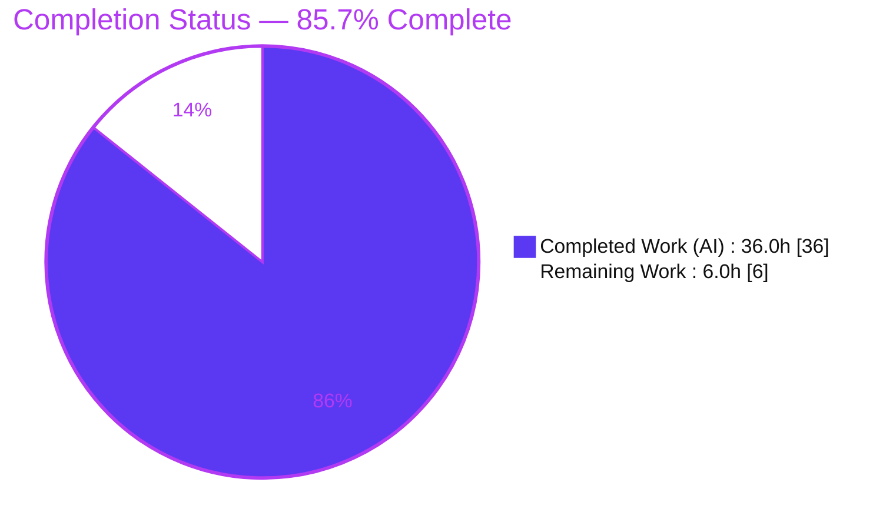
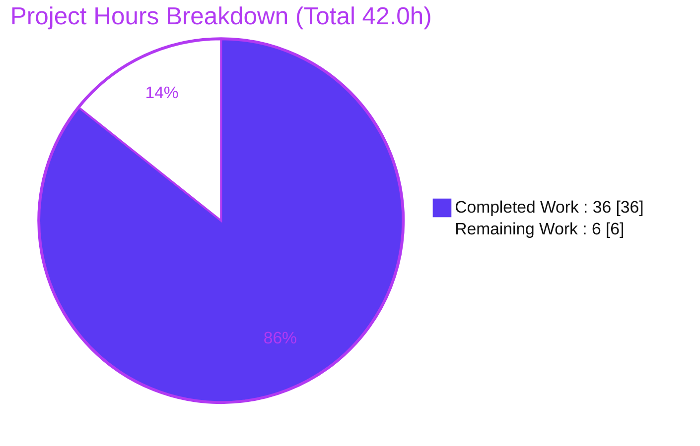
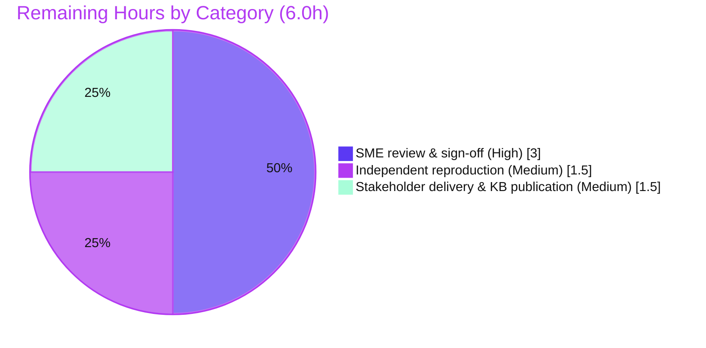

# Blitzy Project Guide

> **Project:** Grafana "Grouping to matrix" — missing-cell semantics investigation
> **Branch:** `blitzy-e38a3b1f-f62c-4035-8bb3-8792efaabd5a` · **Source commit:** `4550cfb5b72886782d9a3e6cf995f8dbd57ca4ff` (branch `grafana_4550cfb5b728`)
> **Task type:** Read-only, run-first **documentation** investigation · **Governing rules:** SWE-AtlasQnA-Repo
>
> **Legend / Blitzy brand colors:** <span style="color:#5B39F3">■</span> **Completed / AI work = Dark Blue `#5B39F3`** · <span style="color:#B23AF2">■</span> Remaining / Not completed = White `#FFFFFF` · Headings/accents = Violet-Black `#B23AF2` · Highlight = Mint `#A8FDD9`

---

## 1. Executive Summary

### 1.1 Project Overview

This project answers an investigative question about Grafana's **"Grouping to matrix"** data transformation: when a row/column intersection is *absent* in sparse input, what value is emitted, and how does that value behave as a panel renders and computes totals, thresholds, and color scales? Rather than reasoning from code alone, the work follows a **run-first** methodology — driving the real `transformDataFrame` entry point and the real field-processing functions of `@grafana/data`, capturing unedited runtime output, and grounding every claim in `file:line` references. The single deliverable is a comprehensive Markdown answer document. The target audience is the dashboard author who hypothesized "missing means zero" and the Grafana engineers who maintain the transformation and field-processing layers.

### 1.2 Completion Status

The completion percentage reflects **only AAP-scoped work plus standard path-to-production activities** (PA1 methodology). All 19 AAP requirements are delivered and validated; the remaining hours are human review and distribution.



**Completion: 85.7%** — calculated as `Completed Hours / Total Hours = 36.0 / 42.0 = 85.7143% → 85.7%`.

| Metric | Hours |
| --- | --- |
| **Total Hours** | **42.0** |
| **Completed Hours (AI + Manual)** | **36.0** (AI 36.0 + Manual 0.0) |
| **Remaining Hours** | **6.0** |
| **Percent Complete** | **85.7%** |

### 1.3 Key Accomplishments

- ✅ Delivered `blitzy/documentation/grafana_4550cfb5b728.md` (2,052 lines / 14,286 words) answering **Q1–Q5** directly, each grounded in runtime output and `file:line`.
- ✅ Exercised the **canonical entry point** `transformDataFrame(groupingToMatrix)` over a deliberately sparse `DataFrame`, and drove the emitted cell through **all four downstream consumers** — `reduceField`, `getActiveThreshold`, `getScaleCalculator`, `getDisplayProcessor` (+`anyToNumber`).
- ✅ Covered **every `emptyValue` variant** (omitted/default, explicit `Empty`, `Null`, `True`, `False`) **plus** a labeled non-canonical numeric-zero control.
- ✅ Proved the finding **deterministically** — the captured value artifact is byte-identical across repeated runs (sha256 `1c820bdd…`, 10,658 bytes; reproduced 3×).
- ✅ Reproduced the **pre-existing regression suite** `groupingToMatrix.test.ts` firsthand: **4 tests + 1 snapshot pass, exit 0**.
- ✅ **Read-only scope perfectly honored:** `git diff --name-status 4550cfb5b728 HEAD` shows only the single added Markdown file; zero edits under `packages/`/`public/`; zero dependency/manifest change.
- ✅ Confirmed **"missing means zero" is FALSE** — the `SpecialValue` enum has no `Zero` member; localized the perceived "different choice" to the downstream divergence.

### 1.4 Critical Unresolved Issues

There are **no unresolved defects** in the deliverable. The only items below are non-blocking, expected-by-design characteristics of a read-only investigation.

| Issue | Impact | Owner | ETA |
| --- | --- | --- | --- |
| §1.1 provenance transcript embeds a captured `HEAD` (`5b9ec9502e`) one commit behind current `HEAD` (`da9213e12a`) | None — non-material; a committed file cannot contain its own hash. `git merge-base --is-ancestor 4550cfb5b728 HEAD` holds and all values reproduce byte-identically | Reviewer (acknowledge only) | n/a |
| Findings are pinned to commit `4550cfb5b728`; a future `@grafana/data` upgrade could shift line numbers/values | Low — refresh by re-running the §1.2 reproducer after any upgrade | Maintainer (on upgrade) | On next dependency bump |
| Investigation is autonomously generated; not yet human-signed-off | Governance — must be reviewed before treated as authoritative | Grafana `@grafana/data` SME | Within remaining 6.0h |

### 1.5 Access Issues

**No access issues identified.** The investigation runs entirely offline against local `@grafana/data` source with a provisioned Node ≥ 22 / yarn 4.5.3 toolchain; no repository permissions, service credentials, or third-party API access are required. External references cited in the document are public prior-art only.

| System/Resource | Type of Access | Issue Description | Resolution Status | Owner |
| --- | --- | --- | --- | --- |
| — | — | No access issues identified | N/A | — |

### 1.6 Recommended Next Steps

1. **[High]** Have a Grafana `@grafana/data` SME review Q1–Q5 for technical correctness against the cited `file:line` anchors.
2. **[High]** Sign off / approve the document as authoritative (record reviewer + PR approval).
3. **[Medium]** Independently reproduce the §1.2 run-first harness on a clean checkout (confirm the byte-identical value artifact and regression exit 0).
4. **[Medium]** Deliver the answer to the requesting user and confirm it resolves their "missing means zero" question; publish to the team knowledge base.
5. **[Low]** *(Optional, out of AAP scope)* Reproduce the divergence in a live panel (table footer / stat / gauge / heatmap) and/or track the upstream "no zero option" gap for roadmap awareness.

---

## 2. Project Hours Breakdown

### 2.1 Completed Work Detail

All completed work was performed autonomously by Blitzy agents (AI). Each component traces to an AAP requirement (investigation, runtime observation, or the answer document itself).

| Component | Hours | Description |
| --- | --- | --- |
| Runtime environment bring-up & toolchain verification | 1.5 | corepack `yarn@4.5.3`, install `@grafana/data` deps, verify Node ≥ 22 / jest 29.7.0 / ts-jest 29.2.5 / tsc 5.5.4 |
| Canonical-path observation harness | 4.5 | Temp colocated Jest spec driving `transformDataFrame` + the four field-processing functions; safe bash reproducer (`set -euo pipefail`, `trap` cleanup, exit capture), two independent runs |
| Q1 — emission + typed-column mismatch | 3.5 | Missing cell `''` in a `FieldType.number` column; every `emptyValue` variant + non-canonical numeric-zero control; field type printed beside value |
| Q2 — render / display path | 2.5 | `getDisplayProcessor` + `anyToNumber('')=NaN` → blank text; `-Infinity` fallback color (not `''`→0) |
| Q3a — totals | 2.0 | `reduceField` / `doStandardCalcs` string-concatenation `"24"` vs clean `Null`=6 |
| Q3b — thresholds | 1.5 | `getActiveThreshold` coerced-`0` step selection |
| Q3c — color scale | 1.5 | `getScaleCalculator` coerced-`0` percent mapping |
| Q4 — end-to-end sparse trace + divergence synthesis | 2.5 | Localizing the "different choice" to the downstream divergence on the identical `''` cell |
| Q5 — hypothesis refutation + editor/docs cross-check | 2.0 | No `Zero` in `SpecialValue`; editor dropdown & in-product docs confirm Null/True/False/Empty only |
| Before/during/after capture + determinism | 2.5 | Sparse input frame, emitted matrix, downstream values; ≥ 2 runs, sha256 byte-identical |
| Grounding & rigor | 3.0 | `file:line` refs, named functions, complete unedited output with adjacent producing commands, coverage pass |
| External corroboration + non-canonical JS aside | 1.0 | Prior-art references labeled secondary; JS coercion demonstration labeled non-canonical |
| Read-only scope enforcement, temp-script cleanup, git verification | 1.0 | `trap`-based cleanup; source-commit diff proof; dependency-baseline check |
| Answer-document authoring & structuring | 4.5 | 2,052 lines of prose, tables, and a Mermaid diagram across 15 sections |
| Code-review + QA final-acceptance revision cycles | 2.5 | Two follow-up commits addressing review and QA findings |
| **Total** | **36.0** | **Matches Completed Hours in Section 1.2** |

### 2.2 Remaining Work Detail

Remaining work is **human path-to-production** for an investigative document (review, reproduction, distribution) — not code rework.

| Category | Hours | Priority |
| --- | --- | --- |
| SME/domain-expert technical review & sign-off of Q1–Q5 correctness | 3.0 | High |
| Independent reproduction of the run-first harness on a clean checkout | 1.5 | Medium |
| Stakeholder delivery & knowledge-base publication | 1.5 | Medium |
| **Total** | **6.0** | **Matches Remaining Hours in Section 1.2 and the §7 pie chart** |

> **Out of scope (not counted above):** a live-panel UI demonstration and filing/tracking the upstream "no zero option" issue are optional follow-ons that AAP §0.3.2 marks out of scope; they are intentionally excluded from the hours to preserve cross-section integrity.

### 2.3 Hours Reconciliation

- **Total Project Hours** = Completed (36.0) + Remaining (6.0) = **42.0**
- **Completion %** = 36.0 / 42.0 = **85.7%**
- **Cross-section check:** Section 2.1 total (36.0) + Section 2.2 total (6.0) = Section 1.2 Total (42.0) ✓; Section 2.2 total (6.0) = Section 1.2 Remaining = Section 7 "Remaining Work" ✓

---

## 3. Test Results

All tests below originate from **Blitzy's autonomous validation logs**; the regression suite was additionally **reproduced firsthand** during this assessment (exit 0). Because the task is read-only documentation, no new product code was written, so traditional new-code coverage targets do not apply; the "Coverage" column describes what each suite exercises.

| Test Category | Framework | Total Tests | Passed | Failed | Coverage % | Notes |
| --- | --- | --- | --- | --- | --- | --- |
| Unit — pre-existing regression (`groupingToMatrix.test.ts`) | Jest 29.7.0 (ts-jest) | 4 (+1 snapshot) | 4 (+1 snapshot) | 0 | n/a — read-only; asserts transformer behavior | Reproduced firsthand: `Test Suites: 1 passed; Tests: 4 passed; Snapshots: 1 passed`, exit 0 (~1.4s) |
| Integration — investigation spec (temporary, run then deleted) | Jest 29.7.0 (ts-jest) | 1 | 1 | 0 | Canonical path: `transformDataFrame` + `reduceField` + `getActiveThreshold` + `getScaleCalculator` + `getDisplayProcessor` + `anyToNumber` | Exhaustive `expect()` assertions covering every documented value; passes only if all documented values hold |
| Determinism — value-artifact reproduction | bash + sha256 | 2 runs (validator: 3) | byte-identical | 0 | sha256 `1c820bdd…`, 10,658 bytes | Value artifact identical across runs; runner transcript volatility disclosed in doc §1.5 |
| **Totals** | — | **5 checks** | **5 pass** | **0** | — | No failing or blocked tests |

> **Note on warnings:** `jest-haste-map` "duplicate manual mock" messages (e.g., `store.navIndex.mock`, `datasource`) are **pre-existing repo-wide noise** under `public/app/**/__mocks__` and are unrelated to this task — they are warnings, not failures; the suite exits 0.

---

## 4. Runtime Validation & UI Verification

**Runtime health — canonical path executed end-to-end:**

- ✅ **Operational** — `transformDataFrame(groupingToMatrix)` emits the sparse matrix; missing cell = `''` in a `FieldType.number` column.
- ✅ **Operational** — `reduceField` / `doStandardCalcs` totals: `''` string-concatenates → `"24"` (numeric would be `6`).
- ✅ **Operational** — `getActiveThreshold`: `''` coerces to `0`, selecting the `value:0` step.
- ✅ **Operational** — `getScaleCalculator`: `percent = (value − min)/delta` coerces `''`→`0` → red `#F2495C` on the direct call.
- ✅ **Operational** — `getDisplayProcessor` + `anyToNumber`: `anyToNumber('')=NaN` → blank text; color from the `-Infinity` fallback (green `#73BF69` under the configured steps), demonstrating the two scale-touching paths disagree.
- ✅ **Operational** — determinism: value artifact byte-identical across repeated runs.

**UI verification:**

- ⚠ **Partial / Not applicable by design** — no UI was built or modified. Q2/Q4 were exercised through the canonical **field-processing layer** (`getDisplayProcessor`) rather than a live rendered panel, exactly as the AAP maps them. The editor's fixed option set (Null/True/False/Empty) was cross-checked from source (`GroupingToMatrixTransformerEditor.tsx:61–66`) and the in-product docs (`docs/content.ts:631`). A live-panel demonstration is an explicitly out-of-scope optional follow-on.

**API / external integration:**

- ✅ **Operational (N/A)** — the investigation runs entirely offline; no external services, APIs, or credentials are involved. External references are public prior-art only.

---

## 5. Compliance & Quality Review

Cross-mapping of the governing **SWE-AtlasQnA-Repo** rules and AAP directives to their status, with fixes applied during autonomous validation.

| Deliverable / Rule | Benchmark | Status | Progress / Evidence |
| --- | --- | --- | --- |
| Deliverable location & name | `blitzy/documentation/grafana_4550cfb5b728.md` | ✅ Pass | File present, git-added (2,052 lines) |
| Run-first methodology | Observe runtime **before** writing | ✅ Pass | §1 reproducer; all §2–§11 values drawn from captured artifact |
| Canonical path only | Real `transformDataFrame` + exported field functions | ✅ Pass | §1, §5; no reimplementation/bypass |
| Cover every condition | Default + `Null`/`True`/`False` + zero control + all consumers | ✅ Pass | §4 six-row matrix; §5.1–§5.4; §12 coverage pass |
| Complete unedited output + adjacent command | No paraphrase/truncation; no code elision | ✅ Pass | `fieldReducer.ts:480–554` quoted in full; per-block commands |
| `file:line` grounding + named functions | Every factual claim grounded | ✅ Pass | Pervasive throughout |
| Determinism | ≥ 2 runs, identical | ✅ Pass | §1.3/§9 sha256 identical; validator 3× |
| Hypothesis handling (Q5) | Test & report honestly | ✅ Pass | "missing means zero" refuted with evidence |
| Coverage pass | Answer every part | ✅ Pass | §12 maps every Q/variant/consumer (all ✅) |
| Read-only scope | No source edits; temp scripts removed | ✅ Pass | `git diff --name-status` → only the `.md`; working tree clean |
| No dependency change | Manifests untouched | ✅ Pass | §14; `package.json`/`yarn.lock` byte-identical source-vs-HEAD |
| Non-canonical items labeled | JS coercion aside & external refs labeled | ✅ Pass | §11 (aside), §13 (prior-art only) |

**Fixes applied during autonomous validation:** two revision commits (`5b9ec9502e`, `da9213e12a`) addressed code-review and QA final-acceptance findings. **Outstanding:** human SME sign-off (tracked in Section 2.2 / Section 6 risk G1).

---

## 6. Risk Assessment

Profile note: this is a **read-only documentation deliverable** — no product code, no dependency change, no external services, no runtime attack surface. Consequently there are **no High or Critical risks**; genuine risks are Low, with a single **Medium governance** item (SME sign-off) that the remaining-work plan directly addresses.

| # | Risk | Category | Severity | Probability | Mitigation | Status |
| --- | --- | --- | --- | --- | --- | --- |
| G1 | Autonomously-generated investigation treated as authoritative without human SME sign-off | Operational / Governance | Medium | Medium | Remaining-work item (SME review & sign-off, 3.0h, High); findings fully reproducible via §1.2 | Open (planned) |
| T1 | §1.1 provenance transcript embeds a captured `HEAD` one commit behind current `HEAD` | Technical (doc accuracy) | Low | High (inherent) | Non-material: `merge-base --is-ancestor` holds; all values reproduce; editing would corrupt a labeled-verbatim transcript | Accepted / Non-material |
| T2 | Findings pinned to commit `4550cfb5b728`; a future upgrade could shift line numbers/values | Technical (versioning) | Low | Medium (over time) | Every claim scoped to this commit with `file:line`; re-run §1.2 after any upgrade | Open (time-dependent) |
| T3 | Standalone `tsc --noEmit` on the transient spec surfaces benign strictness + unrelated pre-existing `System`-namespace items | Technical (type-check) | Low | Low | Never manifests at runtime (ts-jest `isolatedModules`); temp spec deleted; not an in-scope source compile issue | Resolved / Non-blocking |
| T4 | Determinism claim scoped to the value artifact, not the full runner transcript | Technical (reproducibility clarity) | Low | Low | Explicitly disclosed §1.5/§9; value artifact sha256 identical | Mitigated (disclosed) |
| S1 | Pre-existing dependency advisories in the repo baseline | Security | Low (informational) | N/A | Zero dependency change introduced (§14); baseline hygiene outside this read-only doc's scope | Out of scope / Informational |
| O1 | Temp-spec cleanup relies on a bash `trap`; an interrupted run could leave a stray file | Operational | Low | Low | `trap` on normal+error exit; pre-existence guard; source-commit diff is authoritative clean-tree proof | Mitigated |
| O2 | Reproduction requires a full monorepo `yarn install` (~3.3G) + Node ≥ 22 | Operational | Low | Medium | Prerequisites documented (§1.1 + Section 9); node_modules provisioned; regression runs in ~1.4s | Mitigated (documented) |
| I1 | Q2/Q4 exercised via the field-processing layer, not a live panel render | Integration | Low | Low | AAP maps Q2/Q4 to the canonical display path (satisfied); optional live-panel demo listed as out-of-scope | Accepted (by design) |

---

## 7. Visual Project Status

**Project hours breakdown** (Completed = Dark Blue `#5B39F3`, Remaining = White `#FFFFFF`):



**Remaining work by category** (from Section 2.2; sums to 6.0h):



> **Integrity:** the "Remaining Work" value (6) equals Section 1.2 Remaining Hours and the sum of the Section 2.2 "Hours" column. The "Completed Work" value (36) equals Section 1.2 Completed Hours and the Section 2.1 total.

---

## 8. Summary & Recommendations

**Achievements.** The project delivers a rigorous, run-first answer to a subtle data-semantics question. It demonstrates — from live runtime output on this exact commit — that Grafana's "Grouping to matrix" transformation places the **empty string `''`** (not `0`, not `null`) into missing cells **by default**, inside a number-typed column, and that this single `''` cell is then treated **three different ways** by downstream consumers: string-concatenated in totals, coerced to `0` for thresholds and color scale, and rendered blank in the display path (with its color arriving from a `-Infinity` fallback). The user's "missing means zero" hypothesis is refuted with direct evidence, and the perceived "different choice somewhere" is precisely localized to this downstream divergence.

**Remaining gaps & critical path to production.** The deliverable is **85.7% complete**. The remaining **6.0 hours** are entirely human path-to-production: an SME technical review and sign-off (High), an independent reproduction of the run-first harness (Medium), and stakeholder delivery plus knowledge-base publication (Medium). There is **no code rework** outstanding — all 19 AAP requirements are delivered and validated, the pre-existing regression suite passes firsthand (exit 0), and the read-only scope is perfectly honored.

**Success metrics achieved.** Read-only scope preserved (only one file added); determinism proven (byte-identical value artifact); every question, variant, and consumer covered (§12 coverage pass all ✅); every claim grounded in `file:line`.

**Production readiness assessment.** The artifact is **production-ready as an evidence-grounded answer document**, pending human governance sign-off (risk G1). Recommended path: complete the High-priority SME review and sign-off, reproduce the §1.2 harness on a clean checkout to confirm determinism, then deliver and publish. Optional, explicitly out-of-scope follow-ons (a live-panel UI demonstration and upstream-issue tracking) may be pursued separately without affecting this deliverable's completeness.

| Metric | Value |
| --- | --- |
| AAP requirements delivered | 19 / 19 |
| Completion (AAP-scoped) | 85.7% |
| Completed / Remaining / Total hours | 36.0 / 6.0 / 42.0 |
| Tests passing | 5 / 5 (4 unit + 1 snapshot + integration spec; 0 failed) |
| Highest residual risk | G1 (Medium) — SME sign-off |

---

## 9. Development Guide

This guide reproduces the run-first evidence and verifies the read-only scope. All commands were tested during assessment.

### 9.1 System Prerequisites

- **OS:** Linux/macOS (container: Ubuntu). **Disk:** ~4 GB free (monorepo + `node_modules`).
- **Node.js:** `>= 22` (engine constraint). `.nvmrc` pins `v22.11.0`; any Node ≥ 22 reproduces identical values (assessment used `v22.23.1`).
- **Package manager:** `yarn@4.5.3` via **corepack** (corepack `0.34.6` verified). **Git** for scope-verification commands.

### 9.2 Environment Setup

```bash
# From the repository root on the delivery branch
node --version          # expect v22.x (>= 22)      -> tested: v22.23.1
corepack enable         # activates the pinned yarn@4.5.3 (do NOT `npm i -g yarn`)
yarn --version          # expect 4.5.3               -> tested: 4.5.3
```

### 9.3 Dependency Installation

```bash
# Near no-op when node_modules is already provisioned; leaves yarn.lock untouched
CI=true yarn install --immutable
```

### 9.4 Reproduce the Runtime Observations

**Quick — run the pre-existing regression suite** (verified: 4 tests + 1 snapshot pass, exit 0):

```bash
CI=true yarn jest packages/grafana-data/src/transformations/transformers/groupingToMatrix.test.ts --watchAll=false --ci
# Expected tail:
#   Test Suites: 1 passed, 1 total
#   Tests:       4 passed, 4 total
#   Snapshots:   1 passed, 1 total
```

**Full — run the document's own self-contained harness:** copy the bash block from **§1.2** of `blitzy/documentation/grafana_4550cfb5b728.md` and run it. It writes a temporary colocated Jest spec, runs it twice (`/tmp/inv_run1.txt`, `/tmp/inv_run2.txt`), runs the regression suite, `sha256`-compares the two value artifacts (expect **byte-identical**, 10,658 bytes, sha256 `1c820bdd…`), prints the ten `SECTION` blocks, and a `trap` deletes the temporary spec on any exit.

### 9.5 Verification Steps

```bash
# (1) Read-only proof — authoritative (expect only the one added file)
git diff --name-status 4550cfb5b72886782d9a3e6cf995f8dbd57ca4ff HEAD
#   => A	blitzy/documentation/grafana_4550cfb5b728.md

# (2) Zero source edits (expect empty output)
git status --porcelain -- packages public

# (3) Zero dependency/manifest change (expect empty output)
git diff --name-status 4550cfb5b72886782d9a3e6cf995f8dbd57ca4ff HEAD -- package.json yarn.lock '**/package.json'

# (4) Deliverable present
test -f blitzy/documentation/grafana_4550cfb5b728.md && wc -lc blitzy/documentation/grafana_4550cfb5b728.md
#   => 2052 lines, 125506 bytes
```

### 9.6 Example Usage — read the answer

```bash
grep -nE '^## ' blitzy/documentation/grafana_4550cfb5b728.md      # section index
sed -n '1216,1268p' blitzy/documentation/grafana_4550cfb5b728.md   # §2 direct Q1–Q5 answers
```

### 9.7 Troubleshooting

- **Jest hangs (watch mode):** the repo root `test` script defaults to watch — always pass `--watchAll=false --ci` (or `CI=true`).
- **`jest-haste-map` "duplicate manual mock" warnings:** pre-existing repo-wide noise under `public/app/**/__mocks__` — benign; the suite still exits 0.
- **`yarn` missing/old:** run `corepack enable`; do not install yarn globally via npm.
- **Wrong Node version:** ensure Node ≥ 22 (`nvm use` respects `.nvmrc`'s `v22.11.0`).
- **Stray temp artifact after an interrupted run:** the source-commit diff (§9.5 step 1) remains authoritative; manually remove any stray `/tmp/inv_run*.txt` or temp spec.

---

## 10. Appendices

### A. Command Reference

| Purpose | Command |
| --- | --- |
| Node version | `node --version` |
| Enable pinned yarn | `corepack enable` |
| yarn version | `yarn --version` |
| Install deps (immutable) | `CI=true yarn install --immutable` |
| Run regression suite | `CI=true yarn jest packages/grafana-data/src/transformations/transformers/groupingToMatrix.test.ts --watchAll=false --ci` |
| Read-only proof | `git diff --name-status 4550cfb5b72886782d9a3e6cf995f8dbd57ca4ff HEAD` |
| Scoped source check | `git status --porcelain -- packages public` |
| View section index | `grep -nE '^## ' blitzy/documentation/grafana_4550cfb5b728.md` |

### B. Port Reference

Not applicable — this is a read-only, offline investigation; no servers or ports are started.

### C. Key File Locations

| Role | Path |
| --- | --- |
| **Deliverable** | `blitzy/documentation/grafana_4550cfb5b728.md` |
| Transformer under test | `packages/grafana-data/src/transformations/transformers/groupingToMatrix.ts` |
| Pre-existing regression suite | `packages/grafana-data/src/transformations/transformers/groupingToMatrix.test.ts` |
| Canonical entry point | `packages/grafana-data/src/transformations/transformDataFrame.ts` |
| `SpecialValue` enum (no `Zero`) | `packages/grafana-data/src/types/transformations.ts` |
| Totals reducer | `packages/grafana-data/src/transformations/fieldReducer.ts` |
| Color scale | `packages/grafana-data/src/field/scale.ts` |
| Thresholds | `packages/grafana-data/src/field/thresholds.ts` |
| Display processor | `packages/grafana-data/src/field/displayProcessor.ts` |
| `anyToNumber` | `packages/grafana-data/src/utils/anyToNumber.ts` |
| Editor (option set) | `public/app/features/transformers/editors/GroupingToMatrixTransformerEditor.tsx` |
| In-product docs | `public/app/features/transformers/docs/content.ts` |

> **Note:** AAP §0.2.1 listed the reducer under `field/fieldReducer.ts`; it actually resides at `transformations/fieldReducer.ts`. The deliverable cites the **correct** path.

### D. Technology Versions

| Component | Version | Source |
| --- | --- | --- |
| Node.js | v22.23.1 (engine `>= 22`; `.nvmrc` `v22.11.0`) | verified |
| yarn | 4.5.3 | `packageManager` |
| corepack | 0.34.6 | verified |
| Jest | 29.7.0 | devDependency |
| ts-jest | 29.2.5 | devDependency |
| TypeScript | 5.5.4 | devDependency |
| `@grafana/data` | in-repo (commit `4550cfb5b728`) | workspace |

### E. Environment Variable Reference

| Variable | Value | Purpose |
| --- | --- | --- |
| `CI` | `true` | Forces non-interactive Jest/yarn (prevents watch mode) |

No application secrets, credentials, or connection strings are required.

### F. Developer Tools Guide

Not applicable — no browser/UI automation, profiling, or DevTools workflows are involved in this read-only investigation. Reproduction relies solely on the CLI commands in Section 9.

### G. Glossary

| Term | Meaning |
| --- | --- |
| **Grouping to matrix** | A Grafana transformation that pivots long-form series into a column × row matrix |
| **`emptyValue` / `SpecialValue`** | The option (`Empty`/`Null`/`True`/`False`) chosen for a missing intersection; **no `Zero` exists** |
| **`transformDataFrame`** | The canonical pipeline entry point through which the transform must be exercised |
| **`reduceField` / `doStandardCalcs`** | Field reducer computing totals (sum/mean/min/max/count) |
| **`getScaleCalculator` / `getActiveThreshold`** | Field functions mapping a value to a color percent / threshold step |
| **`getDisplayProcessor` / `anyToNumber`** | Display path; `anyToNumber('')` returns `NaN`, yielding a blank cell |
| **Run-first** | Methodology requiring runtime observation captured before writing the answer |
| **Non-canonical** | A value obtained from a bypass/synthetic stand-in (e.g., the hand-made numeric-zero control), labeled as such |
