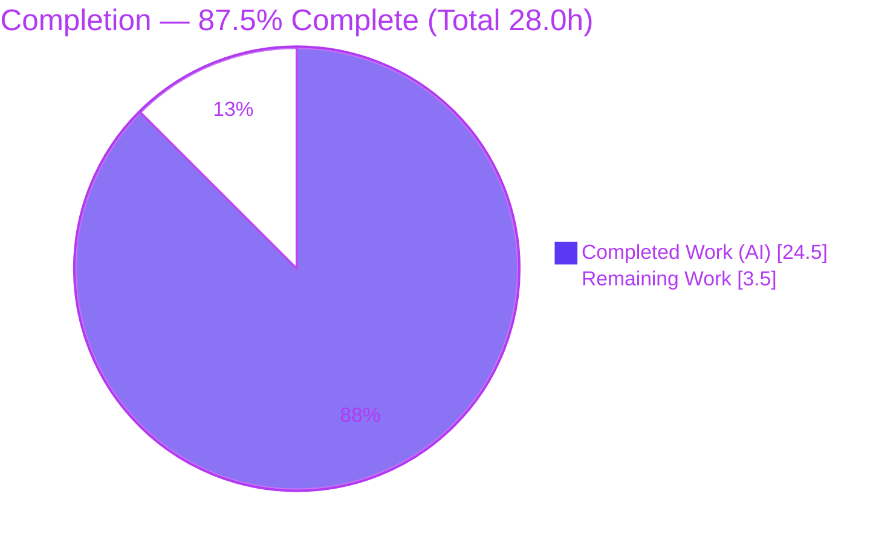
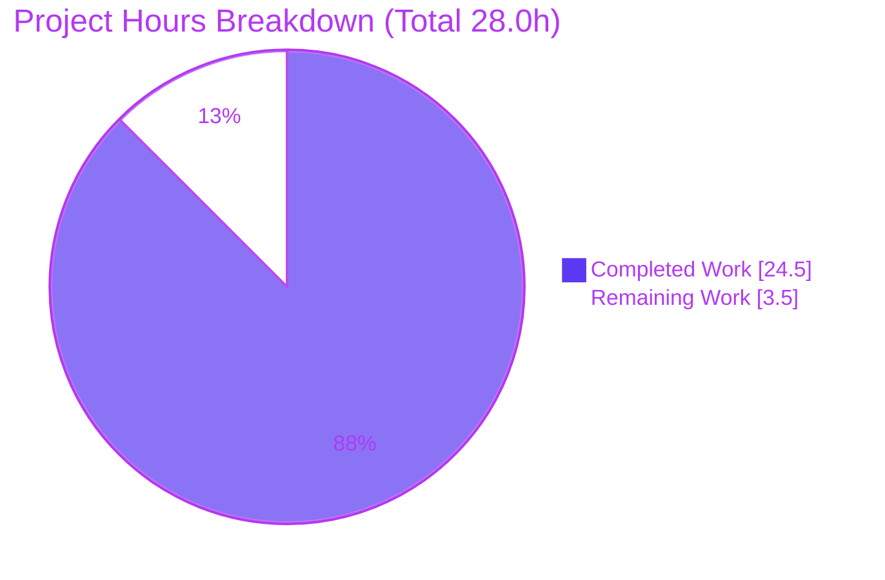
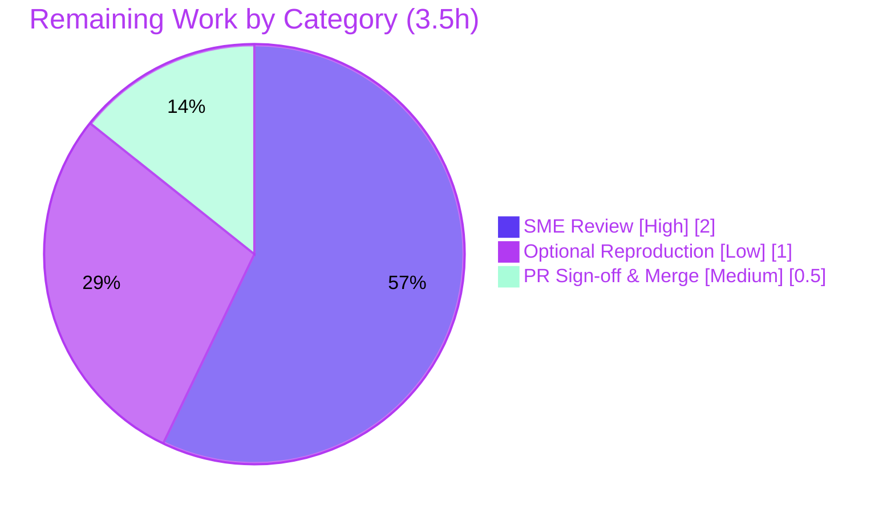

# Blitzy Project Guide

**Project:** Grafana Live Routing-Layer Coherence — Evidence-Backed Technical Q&A
**Repository:** `github.com/grafana/grafana` · **Branch:** `grafana_4550cfb5b728` · **HEAD:** `2f5939ba54`
**Deliverable:** `blitzy/documentation/grafana_4550cfb5b728.md`

---

## 1. Executive Summary

### 1.1 Project Overview

This project delivers a single, evidence-backed technical answer document explaining how Grafana Live's streaming routing layer — the `CacheSegmentedTree` channel-rule cache in `pkg/services/live/pipeline/rule_cache_segmented.go` — stays internally coherent and authoritative while being refreshed on a 20-second background timer and simultaneously queried by subscribers joining/leaving channels. The audience is Grafana backend engineers and reviewers. It is a strictly **read-only investigative Q&A**: the source repository is built and executed for runtime evidence but never modified. The work answers four sub-questions (Q1–Q4) covering the entry point, view handover/authority, stable-vs-partial snapshot behavior, and reader/writer interleaving — each grounded in captured runtime output and `file:line` references.

### 1.2 Completion Status

The completion percentage is computed using the AAP-scoped hours methodology: **Completed Hours ÷ (Completed + Remaining) Hours**. All Agent-Action-Plan (AAP) deliverables and evidence rules are complete and independently validated; the remaining work is exclusively path-to-production human review and merge.



| Metric | Value |
|--------|-------|
| **Total Hours** | **28.0 h** |
| **Completed Hours (AI + Manual)** | **24.5 h** (AI: 24.5 h · Manual: 0.0 h) |
| **Remaining Hours** | **3.5 h** |
| **Percent Complete** | **87.5 %** |

> Color key — 🟦 **Completed / AI Work** = Dark Blue `#5B39F3` · ⬜ **Remaining** = White `#FFFFFF`.

### 1.3 Key Accomplishments

- ✅ Sole deliverable authored: `blitzy/documentation/grafana_4550cfb5b728.md` (786 lines / ~7,484 words), correctly named after source branch `grafana_4550cfb5b728`.
- ✅ All four questions answered (Q1 entry point + lazy fill; Q2 write-locked rebuild-and-swap + authoritative view; Q3 stable-snapshot-never-partial + bounded staleness; Q4 `RWMutex` reader/writer interleaving).
- ✅ **Run-first methodology** honored: two temporary in-package harnesses built, run at scale, and captured — primary (`TestBlitzyObs`) and edge/error (`TestBlitzyObsErrWrap|NoMatch|PeriodicLogContinue`).
- ✅ Atomicity demonstrated two independent ways: portable invariant probe (`missCommon=0` across ~320k rebuild-and-swap cycles vs ~4M reads) **and** a clean Go `-race` run (zero data-race reports).
- ✅ Stability confirmed across ≥2 runs (3 primary runs + 2 edge runs); run scale explicitly stated.
- ✅ Canonical entry point exercised (`NewCacheSegmentedTree` + `Get` + real `updatePeriodically` goroutine); wiring finding documented (`g.Pipeline` never assigned in production).
- ✅ Idiomatic-pattern web validation included with quote discipline (§7 of the deliverable).
- ✅ **Read-only integrity verified**: source tree byte-identical to base `4550cfb5b7`; both temporary harnesses deleted; working tree clean.
- ✅ Every behavioral claim carries its command, complete unedited output, `file:line`, and function/struct name.

### 1.4 Critical Unresolved Issues

| Issue | Impact | Owner | ETA |
|-------|--------|-------|-----|
| _None_ — no compilation errors, no failing tests, no stubs or placeholders. The deliverable is complete, internally consistent, and fully reproducible. | None | — | — |

### 1.5 Access Issues

**No access issues identified.** The investigation uses only the local Go toolchain (Go 1.23.1), the in-repository source, and the Go standard library. No external services, credentials, registries, or network resources are required; the module cache resolves entirely offline.

| System/Resource | Type of Access | Issue Description | Resolution Status | Owner |
|-----------------|----------------|-------------------|-------------------|-------|
| _None_ | — | No access issues identified | N/A | — |

### 1.6 Recommended Next Steps

1. **[High]** Have a Grafana Live-familiar Go engineer perform an SME technical-accuracy review of the answer document against the live source (Q1–Q4 reasoning, `file:line` references, invariant interpretation). — 2.0 h
2. **[Medium]** Approve and merge the single-file pull request; reconfirm read-only integrity (source byte-identical to base, no leftover harness files). — 0.5 h
3. **[Low]** _(Optional)_ Independently reproduce the runtime evidence on the reviewer's host by reconstructing the temporary harness from Appendix §10.1/§10.4 and confirming the invariants (`radixLenBeforeFirstGet=0`, `missCommon=0`). — 1.0 h

---

## 2. Project Hours Breakdown

### 2.1 Completed Work Detail

All completed work was performed autonomously by Blitzy agents (AI). Each component traces to a specific AAP requirement.

| Component | Hours | Description |
|-----------|-------|-------------|
| Environment setup & canonical build verification | 1.5 | Confirm Go 1.23.1 (matches `go.mod:3`); run canonical `go build`, `go vet`, `go test` in the `go.work` workspace. |
| Source-code investigation & wiring finding | 3.5 | Analyze `CacheSegmentedTree` concurrency semantics, `tree`/`pipeline`/`rule_builder`, sibling components (`runstream`, `managedstream`), and `live.go` wiring — including the repo-wide grep proving `g.Pipeline` is never assigned in production. |
| Primary observation harness authoring | 3.0 | Build `TestBlitzyObs`: alternating-ruleset `RuleBuilder`, OBS-A lazy-fill probe, OBS-B atomic-handover invariant probe (`rebuilds`/`reads`/`sawA`/`sawB`/`missCommon`). |
| Edge/error/transitional harness authoring | 3.0 | Build `TestBlitzyObsErrWrap|NoMatch|PeriodicLogContinue`: `Get` fill-error wrap (L69), no-match `(nil,false,nil)` (L79-80), and periodic log-and-continue via the real `updatePeriodically` goroutine + console logger. |
| Runtime observation runs at scale + `-race` + output capture | 2.0 | 3 primary runs (3 s each, ~4M reads vs ~320k rebuilds) + 2 edge runs + `-race` variant; complete unedited output captured; stability confirmed. |
| Web research — idiomatic-pattern validation | 1.5 | Validate the map+`RWMutex` rebuild-and-swap pattern against authoritative Go `sync` docs and practitioner sources with quote discipline (§7). |
| Answer document authoring | 6.0 | Author the 786-line / 10-section deliverable: Q1–Q4 answers, mechanism diagrams, sibling contrast, coverage checklist, honesty notes, verbatim appendices. |
| Final validation pass | 4.0 | Re-run all 5 gates; reconstruct both harnesses verbatim and run (incl. `-race`); audit ~87 `file:line` references; fix off-by-one (`updatePeriodically` 28-43 → 28-44); cleanup; commit. |
| **Total Completed** | **24.5** | |

### 2.2 Remaining Work Detail

All remaining work is path-to-production human activity. No AAP deliverable is outstanding.

| Category | Hours | Priority |
|----------|-------|----------|
| SME technical-accuracy review of the answer document vs live source | 2.0 | High |
| Optional independent reproduction of runtime evidence on reviewer host | 1.0 | Low |
| PR review sign-off & merge (with read-only integrity reconfirmation) | 0.5 | Medium |
| **Total Remaining** | **3.5** | |

> **Cross-section check:** Section 2.1 (24.5 h) + Section 2.2 (3.5 h) = **28.0 h** = Total Hours in Section 1.2. ✓

---

## 3. Test Results

All tests below originate from Blitzy's autonomous validation logs for this project and were independently re-executed during this assessment. The canonical repository suites and the two temporary run-first observation harnesses all pass; the temporary harnesses were deleted after evidence capture (read-only mandate).

| Test Category | Framework | Total Tests | Passed | Failed | Coverage % | Notes |
|---------------|-----------|-------------|--------|--------|-----------|-------|
| Regression — pipeline package (existing suite) | Go `testing` | 16 | 16 | 0 | See per-function ↓ | `go test ./pkg/services/live/pipeline/` → `ok`. **Includes the canonical `TestStorage_Get`** (`rule_cache_segmented_test.go:33`) — the model for the observation harness. |
| Regression — tree package (existing suite) | Go `testing` | 19 | 19 | 0 | — | `go test ./pkg/services/live/pipeline/tree/` → `ok`. |
| Concurrency invariant (temporary, run-first) | Go `testing` | 1 | 1 | 0 | — | `TestBlitzyObs` — 3 runs + `-race` clean (0 data races); `missCommon=0`, `radixLenBeforeFirstGet=0`. Harness removed after use. |
| Edge / error / transitional (temporary, run-first) | Go `testing` | 3 | 3 | 0 | — | `TestBlitzyObsErrWrap`, `TestBlitzyObsNoMatch`, `TestBlitzyObsPeriodicLogContinue` — 2 runs each. Harness removed after use. |
| **Total** | | **39** | **39** | **0** | | 100 % pass rate; 0 failures. (Canonical `TestStorage_Get` is counted once, within the pipeline suite.) |

**Routing-file function coverage** (from canonical `TestStorage_Get`, `go tool cover -func`):

| Function | `file:line` | Coverage |
|----------|-------------|----------|
| `NewCacheSegmentedTree` | `rule_cache_segmented.go:19` | 100.0 % |
| `updatePeriodically` | `rule_cache_segmented.go:28` | 90.9 % |
| `fillOrg` | `rule_cache_segmented.go:46` | 90.9 % |
| `Get` | `rule_cache_segmented.go:62` | 81.2 % |

> The temporary harnesses (now removed) additionally exercised `fillOrg`'s error path, the `Get` no-match branch, and the full `updatePeriodically` log-and-continue loop. A package-wide statement percentage is not meaningful here (the `pipeline` package spans ~48 files while this task targets one 83-line file), so per-function coverage of the routing file is reported instead.

---

## 4. Runtime Validation & UI Verification

This is a backend, read-only documentation task — there is **no UI component**. Runtime validation covers the routing code paths exercised through their canonical entry point.

**Build & static analysis**
- ✅ **Operational** — `go build ./pkg/services/live/pipeline/ ./pkg/services/live/pipeline/tree/` → exit 0, empty output.
- ✅ **Operational** — `go vet ./pkg/services/live/pipeline/` → exit 0.

**Routing runtime behaviors (via `NewCacheSegmentedTree` + `Get` + real `updatePeriodically`)**
- ✅ **Operational** — Q1 lazy fill: `radixLenBeforeFirstGet=0` then `get(a/x)->ok=true` (constructor does no eager fill; first `Get` inserts the org).
- ✅ **Operational** — Q2 atomic handover: `sawA` and `sawB` both large & comparable (~650k each) → authoritative view flips wholesale between rebuilds.
- ✅ **Operational** — Q3 stable snapshot: `missCommon=0` across ~320k rebuild-and-swap cycles vs ~4M reads → no reader ever observed a torn/partial tree; corroborated by a clean `-race` run.
- ✅ **Operational** — Q4 interleaving: ~12:1 reads:rebuilds sustained with zero integrity loss under `sync.RWMutex`.
- ✅ **Operational** — Edge (a): `Get` lazy-fill error wrapped — `err="error filling org: boom: …"` (`rule_cache_segmented.go:69`).
- ✅ **Operational** — Edge (b): unmatched channel returns `(nil,false,nil)` (`rule_cache_segmented.go:79-80`).
- ✅ **Operational** — Edge (c): periodic `BuildRules` failure logged and loop continues — two real `logger.Error` lines ~20 s apart (`rule_cache_segmented.go:38-40,42`); failed org keeps serving its previous (stale-but-complete) rule.

**API / service wiring**
- ⚠ **Partial (by design, documented finding)** — the production service field `g.Pipeline` (`live.go:411`) is never assigned, so the cache is inactive on the default subscriber path (`live.go:638`). The canonical drivers are therefore direct construction (as the unit test does) or the `HandlePipelineConvertTestHTTP` dry-run endpoint (`live.go:1143`). This is documented as a finding, not a defect to fix (out of scope).

---

## 5. Compliance & Quality Review

Cross-mapping of AAP deliverables and mandated rules to their delivery status. Fixes applied during autonomous validation are noted.

| AAP / Rule Requirement | Benchmark | Status | Progress | Notes |
|------------------------|-----------|--------|----------|-------|
| Deliverable at `blitzy/documentation/grafana_4550cfb5b728.md` | Correct path/name from branch | ✅ Pass | 100% | 786 lines; git shows one added file. |
| Q1 — entry point + settling | Answered w/ evidence + `file:line` | ✅ Pass | 100% | §4 Q1; OBS-A. |
| Q2 — handover + authority | Answered w/ evidence + `file:line` | ✅ Pass | 100% | §4 Q2; OBS-B `sawA`/`sawB`. |
| Q3 — stable vs partial | Answered w/ evidence + `file:line` | ✅ Pass | 100% | §4 Q3; `missCommon=0` + `-race`. |
| Q4 — reader/writer interleaving | Answered w/ evidence + `file:line` | ✅ Pass | 100% | §4 Q4; ~12:1 ratio. |
| Run-first methodology | Build/run before writing | ✅ Pass | 100% | Temp harnesses §10.1/§10.4; outputs §10.3/§10.5. |
| Observe at scale, stable ≥2 runs | Scale stated; ≥2 stable runs | ✅ Pass | 100% | 3 primary + 2 edge runs; 3 s scale stated. |
| Canonical real entry point + labeling | No bypass; label non-canonical | ✅ Pass | 100% | §5 wiring finding; matches `TestStorage_Get:34`. |
| Complete unedited output per claim | Command + output + `file:line` + name | ✅ Pass | 100% | 87 core-file refs; full appendix outputs. |
| Edge/error/transitional coverage | Secondary states exercised | ✅ Pass | 100% | OBS-C/D/E. |
| Web-search idiomatic validation | Authoritative sources, quote discipline | ✅ Pass | 100% | §7. |
| Coverage checklist / final pass | Each item confirmed | ✅ Pass | 100% | §9 checklist. |
| Read-only integrity | No source change; temp scripts removed | ✅ Pass | 100% | Source byte-identical to base; git clean; core file 83L. |
| Zero dependency changes | `go.mod`/`go.sum`/`go.work` untouched | ✅ Pass | 100% | Confirmed unchanged. |
| **Fix applied during validation** | Internal consistency of `file:line` | ✅ Pass | 100% | `updatePeriodically` corrected 28-43 → **28-44** (function closes at L44). |
| SME technical-accuracy review | Human sign-off | ⬜ Pending | 0% | Path-to-production (Section 2.2). |

---

## 6. Risk Assessment

Overall risk profile is **very low** — a read-only documentation task with zero source and dependency changes and nothing deployed. No High or Critical risks exist.

| Risk | Category | Severity | Probability | Mitigation | Status |
|------|----------|----------|-------------|------------|--------|
| Observed integer counts (`rebuilds`/`reads`/`sawA`/`sawB`) are host/timing-dependent and differ per machine | Technical | Low | High | Answer relies on qualitative invariants (`missCommon=0`, `radixLenBeforeFirstGet=0`) and labels counts as observed/host-specific (§4, §8). | Mitigated |
| Documentation drift — `file:line` refs are pinned to HEAD `4550cfb5b7`; a future refactor of the 83-line file could invalidate them | Technical | Low | Medium | Deliverable pins the commit hash and names each symbol so refs are re-locatable. | Open (accepted) |
| `-race` reproduction requires cgo/gcc; a host without cgo cannot run the corroborating race proof | Operational | Low | Medium | Primary atomicity proof (invariant probe) is portable and cgo-free; §8 corrects the AAP's no-cgo assumption. | Mitigated |
| OBS-E periodic-log observation needs ~24 s and console-logger setup (default logger discards output) | Operational | Low | Medium | §8 documents `log.SetupConsoleLogger("info")` and the wait; the code path itself is unmodified. | Mitigated |
| Read-only mandate — risk of a leftover temporary harness artifact | Process/Compliance | Low | Low | Verified `git status` clean, source byte-identical, core file still 83 lines, no `*blitzy*` files remain. | Closed |
| Security surface | Security | None | — | No code, dependencies, credentials, or network access introduced. | N/A |
| External integration | Integration | None | — | No external services, API keys, or network dependencies; harnesses deleted. | N/A |

---

## 7. Visual Project Status



**Remaining hours by category** (Section 2.2 — sums to 3.5 h):



> Color key — 🟦 Completed `#5B39F3` · ⬜ Remaining `#FFFFFF`.
> **Integrity:** pie "Remaining Work" = 3.5 h = Section 1.2 Remaining Hours = Section 2.2 total. ✓

---

## 8. Summary & Recommendations

**Achievements.** The project is **87.5% complete** (24.5 of 28.0 hours). 100% of the AAP-scoped work — the single answer document and every methodology/evidence rule — is delivered and independently validated. The deliverable answers all four questions about how `CacheSegmentedTree` stays coherent: it takes shape in `NewCacheSegmentedTree` (which launches the periodic refresher) with subscriber reads entering at `Get`; the old view "loosens its hold" at the single write-locked `radix[orgID] = tree.New()` assignment in `fillOrg`, with authority defined positionally by the map entry observed under `radixMu`; consumers always receive a complete snapshot (never partial) with only bounded staleness; and fast reads interleave with the periodic writer via `sync.RWMutex` with the heavy build performed off-lock. Every claim is backed by a command, complete unedited output, and `file:line` reference, and atomicity is proven both by a portable invariant probe (`missCommon=0`) and a clean `-race` run.

**Remaining gaps.** The remaining **3.5 hours (12.5%)** are entirely path-to-production human activities: SME technical-accuracy review (2.0 h), optional independent reproduction (1.0 h), and PR sign-off & merge (0.5 h). There is no outstanding code, no failing test, and no stub or placeholder.

**Critical path to production.** SME review → PR approval → merge. The optional reproduction can proceed in parallel and is not blocking.

**Success metrics.** Canonical build exit 0; 39/39 tests pass (0 failures); routing-file functions covered 81–100% by the canonical test; source tree byte-identical to base (read-only mandate honored); working tree clean.

**Production readiness assessment.** The deliverable is **ready for human review and merge**. As a documentation artifact with no runtime footprint and no dependency changes, it carries very low risk. Recommended disposition: approve after SME review and merge.

| Metric | Value |
|--------|-------|
| Completion | 87.5% (24.5 / 28.0 h) |
| Tests passed | 39 / 39 (0 failed) |
| Source files modified | 0 (read-only) |
| Files added | 1 (the deliverable) |
| Blocking issues | 0 |

---

## 9. Development Guide

### 9.1 System Prerequisites

- **Go 1.23.1** exactly (matches `go.mod:3`; `go version` → `go version go1.23.1 linux/amd64`).
- **git** (to inspect the branch/changeset).
- **Disk:** ~168 MB working tree (excluding `.git`).
- **Optional:** a C toolchain (`gcc`) with `CGO_ENABLED=1` to run the corroborating `-race` proof. On this host: `gcc (Ubuntu 15.2.0-4ubuntu4) 15.2.0`, `CGO_ENABLED=1` — so `-race` runs. If absent, rely on the portable invariant probe.

### 9.2 Environment Setup

```bash
# From the repository root (a Go workspace, go.work, is already present).
cd <repo-root>            # e.g. the checkout of branch grafana_4550cfb5b728
go version                # expect: go version go1.23.1 linux/amd64
```

> **Note:** the repository uses a Go workspace (`go.work`). Do **not** pass `-mod=mod` — it errors in workspace mode.

### 9.3 Build (canonical default)

```bash
go build ./pkg/services/live/pipeline/ ./pkg/services/live/pipeline/tree/
```

Expected: empty output, exit code `0` (packages compile cleanly).

### 9.4 Verify Tests

```bash
# Full canonical suites for the routing packages
go test -count=1 ./pkg/services/live/pipeline/ ./pkg/services/live/pipeline/tree/
# Expected:
#   ok  github.com/grafana/grafana/pkg/services/live/pipeline        0.0Xs
#   ok  github.com/grafana/grafana/pkg/services/live/pipeline/tree   0.0Xs

# The canonical model test (harness pattern) — verbose
go test -count=1 -v -run TestStorage_Get ./pkg/services/live/pipeline/
# Expected: --- PASS: TestStorage_Get

# Static analysis
go vet ./pkg/services/live/pipeline/       # exit 0
```

### 9.5 Reproduce the Runtime Evidence (optional — human task HT-3)

The observation harnesses were temporary and removed after use (read-only mandate). To reproduce:

```bash
# 1. Recreate the primary harness VERBATIM from deliverable Appendix §10.1 into:
#    pkg/services/live/pipeline/blitzy_obs_test.go   (package pipeline)
# 2. Run it (three times to confirm stability):
go test -count=1 -v -run TestBlitzyObs ./pkg/services/live/pipeline/
#    Confirm invariants (exact integer counts are host/timing-specific):
#      OBS-A ... radixLenBeforeFirstGet=0 ... ok=true
#      OBS-B ... missCommon=0    (sawA and sawB both large)

# 3. Optional corroborating race proof (requires cgo/gcc):
CGO_ENABLED=1 go test -race -count=1 -v -run TestBlitzyObs ./pkg/services/live/pipeline/
#    Expected: PASS, zero DATA RACE reports, missCommon=0

# 4. Edge/error harness — recreate VERBATIM from Appendix §10.4, then:
go test -count=1 -v -run 'TestBlitzyObsErrWrap|TestBlitzyObsNoMatch|TestBlitzyObsPeriodicLogContinue' ./pkg/services/live/pipeline/

# 5. CLEANUP — delete the harness(es) to preserve read-only integrity:
rm pkg/services/live/pipeline/blitzy_obs_test.go
rm pkg/services/live/pipeline/blitzy_adhoc_test_edge_test.go
git status --porcelain     # expect blank (clean)
```

### 9.6 Read the Deliverable

```bash
less blitzy/documentation/grafana_4550cfb5b728.md
```

### 9.7 Verify Read-Only Integrity

```bash
git diff --stat 4550cfb5b7 HEAD -- pkg/ go.mod go.sum go.work   # expect blank (source unchanged)
git diff --name-status 4550cfb5b7 HEAD                          # expect: A blitzy/documentation/grafana_4550cfb5b728.md
git status --porcelain                                          # expect blank (clean)
```

### 9.8 Troubleshooting

- **`-mod=mod` errors** → the repo is in workspace mode (`go.work`); omit that flag.
- **OBS-E logger produces no output** → the default root logger writes to `io.Discard`; route it with `log.SetupConsoleLogger("info")` as the harness (Appendix §10.4) does.
- **`-race` unavailable** → requires cgo/gcc; if absent, the portable invariant probe (`missCommon=0`) is the primary proof and needs no C toolchain.
- **Leftover harness file** → always delete temporary `*_test.go` harnesses before committing to preserve the read-only mandate; re-check with `git status`.

---

## 10. Appendices

### Appendix A — Command Reference

| Purpose | Command |
|---------|---------|
| Go version | `go version` |
| Canonical build | `go build ./pkg/services/live/pipeline/ ./pkg/services/live/pipeline/tree/` |
| Canonical tests | `go test -count=1 ./pkg/services/live/pipeline/ ./pkg/services/live/pipeline/tree/` |
| Canonical unit test (verbose) | `go test -count=1 -v -run TestStorage_Get ./pkg/services/live/pipeline/` |
| Static analysis | `go vet ./pkg/services/live/pipeline/` |
| Primary harness (temporary) | `go test -count=1 -v -run TestBlitzyObs ./pkg/services/live/pipeline/` |
| Race corroboration (temporary) | `CGO_ENABLED=1 go test -race -count=1 -v -run TestBlitzyObs ./pkg/services/live/pipeline/` |
| Edge harness (temporary) | `go test -count=1 -v -run 'TestBlitzyObsErrWrap\|TestBlitzyObsNoMatch\|TestBlitzyObsPeriodicLogContinue' ./pkg/services/live/pipeline/` |
| Read-only integrity | `git diff --stat 4550cfb5b7 HEAD -- pkg/ go.mod go.sum go.work` |

### Appendix B — Port Reference

Not applicable. The investigation runs Go unit tests only; no server is started and no port is bound. (For completeness, Grafana's default HTTP port is `3000`, but it is not used by this task.)

### Appendix C — Key File Locations

| Path | Role |
|------|------|
| `blitzy/documentation/grafana_4550cfb5b728.md` | **The deliverable** (sole added file). |
| `pkg/services/live/pipeline/rule_cache_segmented.go` | Core mechanism — `CacheSegmentedTree` (83 lines). |
| `pkg/services/live/pipeline/rule_cache_segmented_test.go` | Canonical test harness (`TestStorage_Get` L33, `BenchmarkRuleGet` L56). |
| `pkg/services/live/pipeline/rule_builder.go` | `RuleBuilder.BuildRules` interface (L6-8). |
| `pkg/services/live/pipeline/pipeline.go` | `LiveChannelRule` (`OrgId` L127, `Pattern` L133), `ChannelRuleGetter`, `Pipeline.Get`. |
| `pkg/services/live/pipeline/tree/tree.go` | Radix matcher — `New` L70, `AddRoute` L116, `GetValue` L384. |
| `pkg/services/live/live.go` | Wiring — `Pipeline` field L411, nil-guard L638, `Get` L639, construction L1143. |
| `pkg/services/live/runstream/manager.go`, `managedstream/runner.go` | Sibling components (in-place mutation contrast). |
| `go.mod` | Module + `go 1.23.1`. |

### Appendix D — Technology Versions

| Technology | Version |
|------------|---------|
| Go toolchain | `go1.23.1 linux/amd64` (matches `go.mod:3`) |
| Module | `github.com/grafana/grafana` |
| gcc (optional, for `-race`) | `Ubuntu 15.2.0-4ubuntu4` (15.2.0) |
| Test framework | Go standard `testing` |
| Key stdlib packages | `sync` (`RWMutex`), `context`, `time`, `fmt`, `sync/atomic` |
| In-repo dependency | `pkg/services/live/pipeline/tree` (radix route tree) |

### Appendix E — Environment Variable Reference

| Variable | Value | Purpose |
|----------|-------|---------|
| `CGO_ENABLED` | `1` (default on this host) | Enables the optional `-race` detector build. Set to `0` to force pure-Go; the invariant probe still works. |
| `CC` | `gcc` | C compiler used when cgo is enabled (for `-race`). |

No application/service environment variables are required — the task starts no server and reads no configuration.

### Appendix F — Developer Tools Guide

| Tool | Use |
|------|-----|
| `go build` | Compile the routing packages (canonical default build). |
| `go test` | Run canonical suites and (temporarily) the observation harnesses; `-run` filters, `-count=1` disables caching, `-v` for verbose. |
| `go test -race` | Corroborating atomicity proof (requires cgo). |
| `go tool cover -func` | Per-function coverage of the routing file. |
| `go vet` | Static correctness checks. |
| `git diff` / `git status` | Verify read-only integrity and the single-file changeset. |

### Appendix G — Glossary

| Term | Meaning |
|------|---------|
| **`CacheSegmentedTree`** | The routing-layer cache: a per-organization radix route tree guarded by a single `sync.RWMutex`, rebuilt on a 20 s timer. |
| **Rebuild-and-swap** | Building a fresh `tree.New()` off-lock, then under one write-lock hold replacing the whole per-org tree and repopulating it — an atomic view handover. |
| **Bounded staleness** | Readers may see routes up to one refresh interval (20 s) old, but always a *complete* (never partial) snapshot. |
| **Invariant probe** | The portable atomicity test: a pattern present in every ruleset (`common/z`) must never be missed (`missCommon=0`), proving no torn tree is ever observed. |
| **Lazy fill** | On a `Get` cache miss, `Get` calls `fillOrg` to build the org's tree before serving. |
| **Wiring finding** | `g.Pipeline` is never assigned in production, so the cache is inactive on the default subscriber path; direct construction is the canonical driver. |
| **AAP** | Agent Action Plan — the primary directive defining project scope. |

---

*Colors used throughout — Completed/AI Work: Dark Blue `#5B39F3` · Remaining: White `#FFFFFF` · Headings/Accents: Violet-Black `#B23AF2` · Highlight: Mint `#A8FDD9`.*