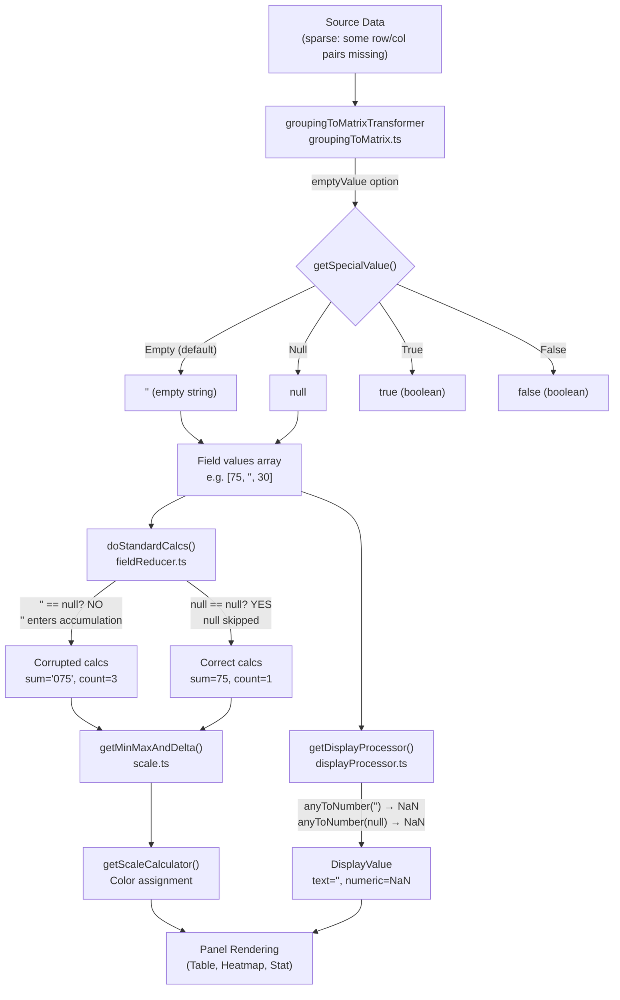

# Technical Specification

# 0. Agent Action Plan

## 0.1 Intent Clarification

### 0.1.1 Core Feature Objective

Based on the prompt, the Blitzy platform understands that the new feature requirement is to **produce a comprehensive analytical document** that traces a concrete sparse dataset through Grafana's "Grouping to Matrix" transformation and its downstream visualization pipeline, answering specific behavioral questions about how missing row/column intersections are represented, carried forward, and consumed by panels.

The specific requirements are:

- **Investigate the transformation's sparse-data semantics** — determine exactly what value (empty string, `null`, `0`, or something else) the "Grouping to Matrix" transformer emits for row/column pairings that do not exist in the source data.
- **Trace the emitted fill value through the downstream rendering pipeline** — document how the chosen fill value interacts with the `doStandardCalcs` field reducer (sum, mean, count, min, max), color-scale calculations (`getMinMaxAndDelta`, `getScaleCalculator`), threshold evaluation (`getActiveThreshold`), and the display processor (`getDisplayProcessor` → `anyToNumber`).
- **Identify the semantic shift** — the user observes that "missing means zero" is their human intent, but the dashboard appears to make a different choice. The document must pinpoint exactly where and why the semantics diverge.
- **Build and run temporary observation scripts** against the real codebase to produce empirical evidence, then clean up all temporary artifacts so the repository remains unmodified.
- **Deliver findings as a Markdown document** placed in `blitzy/documentation/grafana_4550cfb5b728.md`.

### 0.1.2 Special Instructions and Constraints

- **CRITICAL — Repository immutability**: The user explicitly requires that the repository itself should remain unchanged. Temporary scripts may be used for observation, but must be cleaned up afterward. The only net addition to the repository is the final Markdown document in `blitzy/documentation/`.
- **Implementation rule `SWE-AtlasQnA-Repo`**: Create a new markdown document named `<source_branch_name>.md` that comprehensively answers the question(s) posed in the prompt. Build and run the source code to analyse the repository behavior as needed. Do not make assumptions — base answers on the code as the truth. Provide thinking / rationale behind the answers. Do not modify any existing files in the source repository. Place the generated document in the `blitzy/documentation` directory in the destination repo.
- **No design system or UI component work** is required — this is a pure code-analysis and documentation task.
- **No Figma assets** are referenced or applicable.

### 0.1.3 Technical Interpretation

These feature requirements translate to the following technical implementation strategy:

- To **answer the sparse-data question**, we will read and analyze the `groupingToMatrixTransformer` operator in `packages/grafana-data/src/transformations/transformers/groupingToMatrix.ts`, focusing on the fill logic at the line `const value = matrixValues[columnName][rowName] ?? getSpecialValue(emptyValue);` and the `getSpecialValue()` helper that resolves the `SpecialValue` enum (`Empty` → `''`, `Null` → `null`, `True` → `true`, `False` → `false`).
- To **trace downstream effects**, we will analyze `doStandardCalcs` in `packages/grafana-data/src/transformations/fieldReducer.ts`, specifically the `currentValue == null` guard (line ~489) and the `currentValue != null && !Number.isNaN(currentValue)` gate (line ~498) that controls accumulation into sum, min, max, and count.
- To **identify the semantic shift**, we will document the critical JavaScript type-coercion behavior: `'' == null` evaluates to `false`, meaning empty strings pass through null guards and corrupt numeric aggregations via string concatenation (`0 + '' → '0'`), whereas `null == null` evaluates to `true`, causing nulls to be properly skipped.
- To **produce empirical evidence**, we will create and execute a temporary Jest test file that feeds a sparse dataset through the transformer under each `emptyValue` setting and logs field values, reducer outputs, and type information, then remove the temporary file.
- To **deliver the document**, we will create `blitzy/documentation/grafana_4550cfb5b728.md` containing the full analysis with code references, traced data tables, and actionable recommendations.

## 0.2 Repository Scope Discovery

### 0.2.1 Comprehensive File Analysis

The investigation spans the entire data-transformation and field-processing pipeline within the Grafana monorepo (commit `4550cfb5b72886782d9a3e6cf995f8dbd57ca4ff`, version `11.5.0-pre`). All files listed below were read and analyzed; **none will be modified** per the repository-immutability constraint.

**Core transformation files inspected:**

| File Path | Purpose | Relevance |
|---|---|---|
| `packages/grafana-data/src/transformations/transformers/groupingToMatrix.ts` | Implements the "Grouping to Matrix" transformer operator | **Primary** — contains the sparse-cell fill logic via `getSpecialValue()` |
| `packages/grafana-data/src/transformations/transformers/groupingToMatrix.test.ts` | Unit tests for the transformer including empty-value scenarios | **Primary** — confirms default `''` behavior and `SpecialValue.Null` behavior |
| `packages/grafana-data/src/types/transformations.ts` | Defines `SpecialValue` enum (`True`, `False`, `Null`, `Empty`) | **Primary** — enumerates the four possible fill-value choices |
| `public/app/features/transformers/editors/GroupingToMatrixTransformerEditor.tsx` | UI editor exposing the "Empty Value" dropdown selector | Supporting — shows user-facing options |

**Field reducer and calculation pipeline:**

| File Path | Purpose | Relevance |
|---|---|---|
| `packages/grafana-data/src/transformations/fieldReducer.ts` | `doStandardCalcs()` — computes sum, mean, min, max, count, etc. | **Primary** — the null guard `currentValue == null` and accumulation logic are the site of the semantic shift |
| `packages/grafana-data/src/types/data.ts` | Defines `NullValueMode` enum (`Null`, `Ignore`, `AsZero`) | Supporting — governs how reducers treat null values |

**Display and color-scale pipeline:**

| File Path | Purpose | Relevance |
|---|---|---|
| `packages/grafana-data/src/field/displayProcessor.ts` | `getDisplayProcessor()` — converts raw values to `DisplayValue` objects for rendering | **Primary** — calls `anyToNumber()` which maps both `''` and `null` to `NaN` |
| `packages/grafana-data/src/utils/anyToNumber.ts` | Converts any value to a numeric representation | **Primary** — explicitly returns `NaN` for both `''` and `null` |
| `packages/grafana-data/src/field/scale.ts` | `getMinMaxAndDelta()` and `getScaleCalculator()` — drives color scales | Supporting — relies on reducer output for min/max range |
| `packages/grafana-data/src/field/thresholds.ts` | `getActiveThreshold()` — evaluates threshold steps against a numeric value | Supporting — threshold matching uses the numeric value from the display processor |

**Value mapping and special value handling:**

| File Path | Purpose | Relevance |
|---|---|---|
| `packages/grafana-data/src/utils/valueMappings.ts` | `getValueMappingResult()` — matches values against user-defined mappings | Supporting — `SpecialValueMatch.Null` uses `value == null` (skips `''`), `SpecialValueMatch.Empty` uses `value === ''` |
| `packages/grafana-data/src/types/valueMapping.ts` | Defines `SpecialValueMatch` enum and `MappingType` | Supporting |

**Panel rendering files inspected:**

| File Path | Purpose | Relevance |
|---|---|---|
| `packages/grafana-ui/src/components/Table/utils.ts` | `getFooterItems()` — computes table footer totals via `reduceField()` | Supporting — footer totals are affected by the fill-value choice |
| `packages/grafana-ui/src/components/Table/DefaultCell.tsx` | Renders individual table cells via `field.display!(cell.value)` | Supporting — display rendering path |
| `public/app/plugins/panel/heatmap/fields.ts` | Heatmap data preparation | Supporting — heatmap panels consuming matrix data |
| `packages/grafana-ui/src/components/Table/Table.tsx` | Table panel component with `noValue` display | Supporting |

**Documentation and registration:**

| File Path | Purpose | Relevance |
|---|---|---|
| `public/app/features/transformers/docs/content.ts` | In-app help text for the "Grouping to matrix" transformation | Supporting — describes intended behavior |
| `packages/grafana-data/src/transformations/transformers/ids.ts` | Transformer ID registry (`groupingToMatrix`) | Supporting |
| `packages/grafana-data/src/transformations/transformers.ts` | Transformer barrel export | Supporting |

### 0.2.2 Integration Point Discovery

The "Grouping to Matrix" transformation connects to the broader Grafana system at these key integration boundaries:

- **Transformation pipeline entry** — registered in `packages/grafana-data/src/transformations/transformers.ts` and invoked via the RxJS `operator` pattern by `transformDataFrame()`.
- **Field reducer** — any panel that computes aggregates (table footers, stat panels, bar gauge) calls `reduceField()` in `packages/grafana-data/src/transformations/fieldReducer.ts`, which feeds the values array produced by the matrix transformer directly into `doStandardCalcs()`.
- **Display processor** — every cell value passes through `getDisplayProcessor()` in `packages/grafana-data/src/field/displayProcessor.ts`, which calls `anyToNumber()` to determine the numeric representation and then `getScaleCalculator()` for color assignment.
- **Color scale and thresholds** — `getMinMaxAndDelta()` in `packages/grafana-data/src/field/scale.ts` computes the field's numeric range by calling `reduceField({ reducers: ['min', 'max'] })`, so corrupted min/max values from the reducer propagate into all percentage-based color scales and threshold evaluations.

### 0.2.3 Web Search Research Conducted

No external web searches were required. All behavioral analysis is grounded exclusively in the source code at commit `4550cfb5b72886782d9a3e6cf995f8dbd57ca4ff` and empirical test execution against the repository's own Jest test infrastructure.

### 0.2.4 New File Requirements

A single new file will be created:

| File Path | Type | Purpose |
|---|---|---|
| `blitzy/documentation/grafana_4550cfb5b728.md` | Markdown document | Comprehensive analytical answer documenting the sparse-data behavior of the "Grouping to Matrix" transformation, including code-traced data flow, empirical observations, and recommendations |

## 0.3 Dependency Inventory

### 0.3.1 Key Packages Relevant to Analysis

No new dependencies are introduced. The analysis operates entirely within the existing dependency graph. The following packages are relevant to the transformation and rendering pipeline under investigation:

| Package Registry | Name | Version | Purpose |
|---|---|---|---|
| Workspace | `@grafana/data` | `11.5.0-pre` | Core data types, transformation framework, field reducers, display processors — contains the primary transformation code |
| Workspace | `@grafana/ui` | `11.5.0-pre` | Table component, cell renderers, footer calculation — downstream consumer of matrix output |
| Workspace | `@grafana/schema` | `11.5.0-pre` | Panel configuration schemas and cell display mode definitions |
| npm | `rxjs` | `7.8.1` | Reactive extensions — the transformation pipeline uses `source.pipe(map(...))` |
| npm | `lodash` | `4.17.21` | `isNumber`, `toString`, `toNumber` — utility functions used in reducers and display processor |
| npm | `jest` | `29.7.0` | Test runner — used for executing observation scripts during analysis |
| npm | `typescript` | `5.5.4` | Type system — all transformation code is TypeScript |
| Go module | `github.com/grafana/grafana` | `go 1.23.1` | Backend module (not directly involved in this frontend transformation analysis) |

### 0.3.2 Dependency Updates

No dependency updates are required. This task produces only a documentation artifact. All analysis uses the existing installed packages at their current versions as specified in `package.json` and `yarn.lock`.

### 0.3.3 Import and External Reference Updates

No imports, external references, configuration files, or build files require modification. The repository remains unchanged per the explicit user constraint and the `SWE-AtlasQnA-Repo` implementation rule.

## 0.4 Integration Analysis

### 0.4.1 Existing Code Touchpoints

The analysis traces data flow through the following integration chain. No modifications are made; these touchpoints are documented to show how the sparse-data fill value propagates through the system.

**Transformation Layer → Field Reducer:**

- `packages/grafana-data/src/transformations/transformers/groupingToMatrix.ts` — The `operator` function produces a new `DataFrame` where each column field's `values` array contains the actual data values at populated intersections and the fill value (`''`, `null`, `true`, or `false`) at missing intersections. The field's `type` property is set to the source `valueField.type` (typically `FieldType.number`), regardless of whether the fill value is type-compatible.
- `packages/grafana-data/src/transformations/fieldReducer.ts` — The `doStandardCalcs()` function iterates over the field's `values` array. The critical gate is at line ~489: `if (currentValue == null)`. This uses JavaScript's loose equality, which means `null` and `undefined` pass through but `''` (empty string), `false`, and `true` do **not**. After the null gate, the accumulation gate at line ~498 is `if (currentValue != null && !Number.isNaN(currentValue))` — empty strings pass both checks because `'' != null` is `true` and `Number.isNaN('')` is `false`.

**Field Reducer → Color Scale Pipeline:**

- `packages/grafana-data/src/field/scale.ts` — `getMinMaxAndDelta()` calls `reduceField({ reducers: [ReducerID.min, ReducerID.max] })`. If the reducer returns a corrupted min (e.g., `''` from the empty-string path), then `isNumber(min)` (lodash) returns `false` for the string `''`, causing the function to re-calculate — but the `reduceField` call itself returns the corrupted value from the cached calcs, creating a circular dependency on the reducer's accuracy.
- `packages/grafana-data/src/field/thresholds.ts` — `getActiveThreshold(value, thresholds)` compares the numeric value against threshold step values using `value >= threshold.value`. If the value arriving here is `NaN` (from the display processor's `anyToNumber('')` conversion), the comparison `NaN >= threshold.value` always evaluates to `false`, causing the fallback to the base threshold.

**Display Processor → Cell Rendering:**

- `packages/grafana-data/src/field/displayProcessor.ts` — `getDisplayProcessor()` calls `anyToNumber(value)` for every cell value. The function in `packages/grafana-data/src/utils/anyToNumber.ts` explicitly returns `NaN` for both `''` and `null`. This means that at the **display** layer, both fill values are visually equivalent — both produce `NaN`, which causes the text to fall through to `toString(value)` and then to the `config.noValue` fallback.
- `packages/grafana-ui/src/components/Table/DefaultCell.tsx` — Calls `field.display!(cell.value)` which triggers the display processor. The returned `DisplayValue.text` for `''` is `''` (empty string), and for `null` is `''` (via `toString(null)` → `'null'` → but since `!text` check passes for empty string, it falls to `config.noValue`).

### 0.4.2 Data Flow Through the Pipeline

The following diagram illustrates how a missing intersection's fill value flows through the system:

### 0.4.3 The Semantic Shift — Precise Location

The semantic shift the user experiences occurs at **exactly one point** in the pipeline:

**Location:** `packages/grafana-data/src/transformations/fieldReducer.ts`, function `doStandardCalcs()`, line containing `if (currentValue == null)`.

**Mechanism:** The default `emptyValue` setting is `SpecialValue.Empty`, which resolves to the JavaScript empty string `''`. When `doStandardCalcs` encounters this value:

- `'' == null` evaluates to `false` (JavaScript spec: only `null` and `undefined` are loosely equal to `null`)
- The empty string is therefore **not** treated as missing data
- It proceeds to the accumulation block where `'' != null` is `true` and `Number.isNaN('')` is `false`
- The field is typed as `FieldType.number`, so it enters the `isNumberField` branch
- `calcs.sum += ''` triggers JavaScript string concatenation: `0 + '' → '0'`, and subsequent numeric additions become string concatenations (`'0' + 75 → '075'`)
- `calcs.count++` increments even though the value represents a missing intersection
- `'' > calcs.max` and `'' < calcs.min` evaluate to `true` due to JavaScript's type coercion in comparisons with numbers, potentially setting `''` as the min value

When `emptyValue` is set to `SpecialValue.Null` (resolving to JavaScript `null`), the behavior is correct:

- `null == null` evaluates to `true`
- With the default `NullValueMode.Ignore`, the reducer executes `continue`, skipping the missing intersection entirely
- Sum, count, mean, min, and max reflect only the actually-present values

## 0.5 Technical Implementation

### 0.5.1 File-by-File Execution Plan

This task produces a single deliverable file. No existing files are modified.

- **CREATE: `blitzy/documentation/grafana_4550cfb5b728.md`** — The comprehensive analytical document answering the user's questions about sparse-data behavior in the "Grouping to Matrix" transformation. This document will contain:
  - A clear restatement of the question
  - The transformation's code-level mechanics with specific line references
  - A concrete sparse dataset walked through each `emptyValue` option
  - Empirical test results showing exact field values and reducer outputs
  - A precise identification of where and why the semantic shift occurs
  - Recommendations for users who need "missing means zero" semantics
  - Code citations grounding every claim in the source

### 0.5.2 Implementation Approach

The document will be constructed using the following methodology:

- **Establish the code truth** by reading the `groupingToMatrixTransformer` operator, `getSpecialValue()`, and the `SpecialValue` enum directly from the source files to document exactly what value each setting emits.
- **Trace through the reducer** by analyzing `doStandardCalcs()` line-by-line, documenting how each possible fill value interacts with the `currentValue == null` guard and the subsequent numeric accumulation logic, including JavaScript type-coercion behaviors.
- **Produce empirical evidence** by authoring a temporary Jest test file (`sparse_matrix_observation.test.ts`) that creates a sparse 3×3 dataset (servers × metrics with missing intersections), runs it through the transformer under each `emptyValue` setting, calls `reduceField()` on the output fields, and captures the exact values, types, and calculation results. The test file is removed after observation.
- **Analyze the display pipeline** by tracing through `anyToNumber()`, `getDisplayProcessor()`, and `getMinMaxAndDelta()` to document how the fill value affects visual rendering, color scales, and threshold evaluation.
- **Synthesize findings** into a structured Markdown document with tables, code-block examples, and clear recommendations.

### 0.5.3 Empirical Observation Results

The following observations were obtained by running a temporary Jest test against the repository's test infrastructure. The test used this sparse input dataset:

| Server | Metric | Value |
|---|---|---|
| web-1 | cpu | 75 |
| web-1 | mem | 60 |
| db-1 | cpu | 45 |
| db-1 | disk | 80 |
| cache-1 | cpu | 30 |

Missing combinations: (web-1, disk), (db-1, mem), (cache-1, mem), (cache-1, disk).

**Default `emptyValue` (Empty → `''`):**

| Field | Values | `sum` | `mean` | `count` | `min` | `max` |
|---|---|---|---|---|---|---|
| cpu | `[75, 45, 30]` | `150` | `50` | `3` | `30` | `75` |
| mem | `[60, '', '']` | `60` (string) | `20` | `3` | `''` | `60` |
| disk | `['', 80, '']` | `'080'` (string) | `26.67` | `3` | `''` | `80` |

**`emptyValue` = Null → `null`:**

| Field | Values | `sum` | `mean` | `count` | `min` | `max` |
|---|---|---|---|---|---|---|
| cpu | `[75, 45, 30]` | `150` | `50` | `3` | `30` | `75` |
| mem | `[60, null, null]` | `60` | `60` | `1` | `60` | `60` |
| disk | `[null, 80, null]` | `80` | `80` | `1` | `80` | `80` |

**Key empirical findings:**

- With the default `Empty` setting, the `sum` for the `disk` field is the **string** `'080'` (not the number `80`), produced by string concatenation: `0 + '' → '0'`, then `'0' + 80 → '080'`.
- The `count` is `3` for all fields under the default setting, because empty strings are not filtered out by the null guard.
- The `min` is set to `''` (empty string) because `'' < Number.MAX_VALUE` evaluates to `true` in JavaScript's mixed-type comparison.
- With `Null`, the `count` correctly reflects only populated cells, and `sum`/`mean`/`min`/`max` are accurate.

### 0.5.4 JavaScript Type-Coercion Analysis

The root cause of the semantic shift is JavaScript's type-coercion rules, which behave differently for `==` (loose equality), arithmetic `+`, and comparison operators:

| Expression | Result | Explanation |
|---|---|---|
| `'' == null` | `false` | Only `null` and `undefined` are loosely equal to `null` |
| `null == null` | `true` | Null equals null and undefined |
| `'' != null` | `true` | Empty string passes the "not null" guard in `doStandardCalcs` |
| `Number.isNaN('')` | `false` | `Number.isNaN` does not coerce; `''` is not `NaN` |
| `0 + ''` | `'0'` (string) | The `+` operator prefers string concatenation when one operand is a string |
| `'' > -Number.MAX_VALUE` | `true` | Comparison operators coerce `''` to `0`, and `0 > -1.7976e+308` is true |
| `'' < Number.MAX_VALUE` | `true` | Coerces `''` to `0`, and `0 < 1.7976e+308` is true |

## 0.6 Scope Boundaries

### 0.6.1 Exhaustively In Scope

- **Deliverable document:**
  - `blitzy/documentation/grafana_4550cfb5b728.md` — the sole artifact produced

- **Source files analyzed (read-only, not modified):**
  - `packages/grafana-data/src/transformations/transformers/groupingToMatrix.ts` — transformation logic
  - `packages/grafana-data/src/transformations/transformers/groupingToMatrix.test.ts` — existing test suite
  - `packages/grafana-data/src/types/transformations.ts` — `SpecialValue` enum definition
  - `packages/grafana-data/src/transformations/fieldReducer.ts` — `doStandardCalcs()`, `reduceField()`, `defaultCalcs`
  - `packages/grafana-data/src/types/data.ts` — `NullValueMode` enum
  - `packages/grafana-data/src/field/displayProcessor.ts` — `getDisplayProcessor()`, display value resolution
  - `packages/grafana-data/src/utils/anyToNumber.ts` — numeric coercion utility
  - `packages/grafana-data/src/field/scale.ts` — `getMinMaxAndDelta()`, `getScaleCalculator()`
  - `packages/grafana-data/src/field/thresholds.ts` — `getActiveThreshold()`
  - `packages/grafana-data/src/utils/valueMappings.ts` — `getValueMappingResult()`, `SpecialValueMatch` handling
  - `packages/grafana-data/src/types/valueMapping.ts` — `SpecialValueMatch` enum
  - `public/app/features/transformers/editors/GroupingToMatrixTransformerEditor.tsx` — UI editor
  - `public/app/features/transformers/docs/content.ts` — in-app documentation
  - `packages/grafana-ui/src/components/Table/utils.ts` — table footer calculations
  - `packages/grafana-ui/src/components/Table/DefaultCell.tsx` — cell rendering
  - `packages/grafana-ui/src/components/Table/Table.tsx` — table panel `noValue` handling
  - `public/app/plugins/panel/heatmap/fields.ts` — heatmap data preparation

- **Temporary files (created then removed during analysis):**
  - `packages/grafana-data/src/transformations/transformers/sparse_matrix_observation.test.ts` — observation test (cleaned up)

### 0.6.2 Explicitly Out of Scope

- **No modifications to any existing source file** — the repository remains unchanged
- **No new features, bug fixes, or refactoring** of the transformation or reducer code
- **No backend (Go) code changes** — the "Grouping to Matrix" transformation is entirely frontend TypeScript
- **No CI/CD, Docker, or deployment configuration changes**
- **No dependency version changes or new package installations** beyond what was needed for environment setup
- **No UI component work or design system changes**
- **No Figma assets or visual design work**
- **No performance optimization work**
- **No changes to panels, dashboards, or alerting configurations**

## 0.7 Rules for Feature Addition

The user has specified the following rules and constraints that must be strictly followed:

- **`SWE-AtlasQnA-Repo` rule**: Create a new markdown document named `<source_branch_name>.md` that comprehensively answers the question(s) posed in the prompt. The source branch name is `grafana_4550cfb5b728`, so the file must be named `grafana_4550cfb5b728.md`.
- **Build and run the source code** to analyse the repository behavior as needed — do not make assumptions; base answers on the code as the truth.
- **Provide thinking / rationale** behind the answers — every claim in the document must be traceable to a specific line of code or an empirical test result.
- **Do not modify any existing files** in the source repository — only the new markdown document may be added.
- **Do not add any other code** in the source repository besides the requested document.
- **Place the generated document** in the `blitzy/documentation` directory in the destination repo.
- **Temporary scripts may be used for observation** but the repository itself should remain unchanged and anything temporary should be cleaned up afterward.

## 0.8 References

### 0.8.1 Codebase Files and Folders Searched

The following files and folders were directly retrieved, read, and analyzed to derive the conclusions in this action plan:

**Primary transformation source:**
- `packages/grafana-data/src/transformations/transformers/groupingToMatrix.ts` — full file read; contains `groupingToMatrixTransformer` operator, `getSpecialValue()`, `findKeyField()`, `uniqueValues()`
- `packages/grafana-data/src/transformations/transformers/groupingToMatrix.test.ts` — full file read; four test cases covering default, multi-field, null empty-value, and config propagation scenarios
- `packages/grafana-data/src/types/transformations.ts` — lines 113–119 read; `SpecialValue` enum definition
- `packages/grafana-data/src/transformations/transformers/ids.ts` — grep for `groupingToMatrix` ID

**Field reducer and calculations:**
- `packages/grafana-data/src/transformations/fieldReducer.ts` — lines 1–600 read; `ReducerID` enum, `doStandardCalcs()`, `defaultCalcs`, `reduceField()`, `fieldReducers` registry
- `packages/grafana-data/src/types/data.ts` — lines 195–215 read; `NullValueMode` enum

**Display and rendering pipeline:**
- `packages/grafana-data/src/field/displayProcessor.ts` — lines 1–220 read; `getDisplayProcessor()`, display value assembly, `noValue` fallback logic
- `packages/grafana-data/src/utils/anyToNumber.ts` — full file read; explicit `NaN` returns for `''`, `null`, `undefined`
- `packages/grafana-data/src/field/scale.ts` — lines 1–130 read; `getMinMaxAndDelta()`, `getScaleCalculator()`
- `packages/grafana-data/src/field/thresholds.ts` — full file read; `getActiveThreshold()`, `fallBackThreshold`

**Value mappings:**
- `packages/grafana-data/src/utils/valueMappings.ts` — lines 1–130 read; `getValueMappingResult()`, `SpecialValueMatch` handling for Null, Empty, NaN
- `packages/grafana-data/src/types/valueMapping.ts` — lines 1–40 read; `MappingType`, `SpecialValueMatch` enums

**UI components:**
- `public/app/features/transformers/editors/GroupingToMatrixTransformerEditor.tsx` — full file read; editor UI with Empty Value dropdown
- `public/app/features/transformers/docs/content.ts` — lines 617–650 read; in-app help text
- `packages/grafana-ui/src/components/Table/utils.ts` — lines 1–50 and 336–420 read; `getFooterItems()`, `getFormattedValue()`
- `packages/grafana-ui/src/components/Table/DefaultCell.tsx` — lines 1–60 read; cell rendering via `field.display!(cell.value)`
- `packages/grafana-ui/src/components/Table/Table.tsx` — grep for noValue, null handling
- `public/app/plugins/panel/heatmap/fields.ts` — lines 1–100 read; `prepareHeatmapData()`

**Configuration and dependency manifests:**
- `package.json` — version `11.5.0-pre`, engine `node >= 22`, key dependency versions
- `packages/grafana-data/package.json` — version `11.5.0-pre`
- `go.mod` — Go `1.23.1`
- `.nvmrc` — Node `v22.11.0`

**Registration and barrel exports:**
- `packages/grafana-data/src/transformations/transformers.ts` — import and registration of `groupingToMatrixTransformer`
- `public/app/features/transformers/standardTransformers.ts` — grep for registration

### 0.8.2 Attachments

No attachments were provided with this project. No Figma URLs or external design assets are referenced.

### 0.8.3 Environment Context

| Property | Value |
|---|---|
| Repository | `grafana/grafana` |
| Commit | `4550cfb5b72886782d9a3e6cf995f8dbd57ca4ff` |
| Branch | `grafana_4550cfb5b728` |
| Version | `11.5.0-pre` |
| Node.js | `v22.11.0` (from `.nvmrc`) |
| Go | `1.23.1` (from `go.mod`) |
| Test framework | Jest `29.7.0` |
| Docker image | `ghcr.io/scaleapi/swe-atlas:swe_atlas_QnA_grafana_grafana_1.0` |

