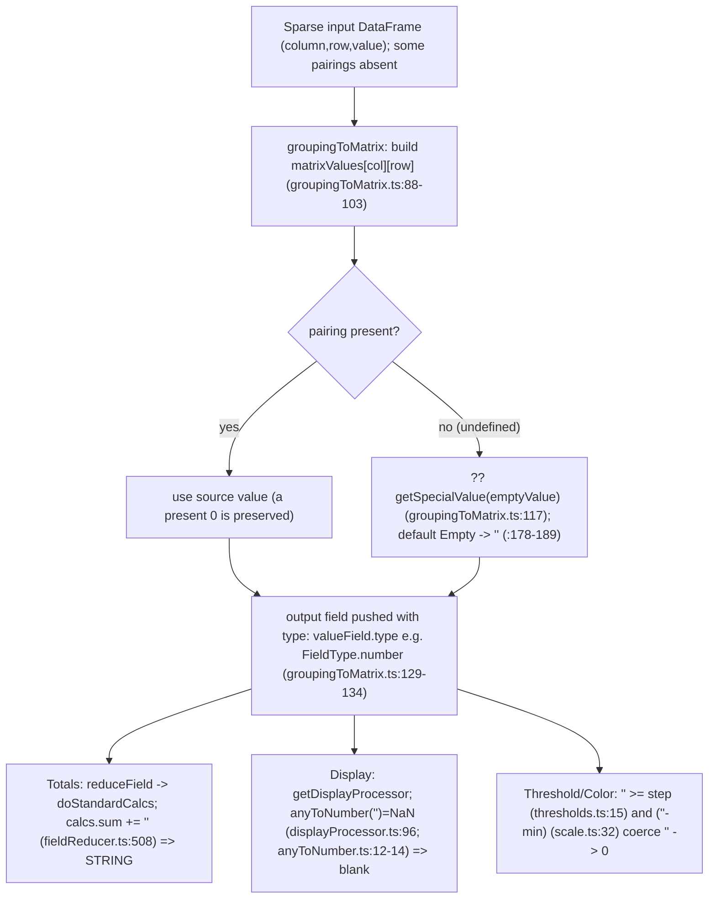

# Grouping to matrix + sparse data: what a missing (column, row) combination emits, and how that value travels through a downstream table visualization

> **Question answered:** How does Grafana's **"Grouping to matrix"** transformation behave when the source series is _sparse_ and some `(column, row)` pairings never appear? Specifically, when a combination does not exist in the input, what does the transformation **emit** (empty cell, null, or zero); how is that value **carried forward as the panel renders**; how does it affect **totals**, **thresholds**, and **color scales**; and where — if anywhere — do the semantics shift away from the human intent "missing means zero"?

| Field                           | Value                                                                                                                                                                   |
| ------------------------------- | ----------------------------------------------------------------------------------------------------------------------------------------------------------------------- |
| Deliverable                     | `blitzy/documentation/grafana_4550cfb5b728.md`                                                                                                                          |
| Repository / HEAD commit        | `grafana/grafana` @ `4550cfb5b72886782d9a3e6cf995f8dbd57ca4ff` (branch `grafana_4550cfb5b728`)                                                                          |
| Package under investigation     | `@grafana/data@11.5.0-pre` (frontend TypeScript — **no** backend/Go code is involved)                                                                                   |
| Downstream visualization traced | The **Table panel** (`public/app/plugins/panel/table/**` + `packages/grafana-ui/src/components/Table/**`)                                                               |
| Toolchain                       | Node `v22.11.0` (`.nvmrc`), Yarn `4.5.3`, Jest `29.7.0`                                                                                                                 |
| Method                          | Read-only investigation. The relevant code paths were **run first** with a temporary Jest harness; this document is written from the captured, verbatim runtime output. |

---

## TL;DR (one-paragraph answer)

By default, a missing `(column, row)` combination is emitted as an **empty string `''`** — the value of `SpecialValue.Empty` (`packages/grafana-data/src/transformations/transformers/groupingToMatrix.ts:26`, `:117`, `:178-189`) — and that `''` is placed into an output field whose `type` is **inherited from the value field** (usually `FieldType.number`) at `groupingToMatrix.ts:133`. There is **no "Zero" fill option**: the `SpecialValue` enum offers only `True`/`False`/`Null`/`Empty` (`packages/grafana-data/src/types/transformations.ts:113-118`), so the intent "missing means zero" is **not directly expressible** — the closest selectable option is `Null`. That single `''` then behaves **three different ways** as it flows downstream: it **corrupts totals into a string** via concatenation (`fieldReducer.ts:508` `calcs.sum += currentValue`), it renders as a **blank** cell because `anyToNumber('')` returns `NaN` (`displayProcessor.ts:96` + `anyToNumber.ts:12-14`), and it is treated as **zero** by thresholds and color scales because the relational/arithmetic operators coerce `'' → 0` (`thresholds.ts:15` `value >= threshold.value`; `scale.ts:32` `(value - min)`). That path-dependent split — one value meaning "corrupt string" in totals, "blank" on screen, and "zero" in threshold/color — is exactly the "semantic shift" the user senses. Crucially, a **genuine present `0` is preserved** as numeric `0` (the fill uses `??`, which replaces `undefined` or `null` — and `0` is neither), so "absent" (`''`, a string) and "present-zero" (`0`, a number) are represented **differently**.

## Data-flow diagram



---

## How the investigation was run (methodology)

Per the controlling rule set ("SWE-AtlasQnA-Repo"), the code paths were **built and run first**, and this answer is written from the captured output — not from reading alone.

- **Harness pattern:** a temporary Jest spec was created at `packages/grafana-data/src/transformations/transformers/zz_blitzy_observe.test.ts` (later **deleted** — see the closing note). It stubbed the registry with `mockTransformationsRegistry([groupingToMatrixTransformer])`, built sparse input frames with `toDataFrame(...)`, ran `transformDataFrame([{ id: DataTransformerID.groupingToMatrix, options }], [input])`, and read the emitted frames inside `.toEmitValuesWith((received) => { ... })`. The emitted field was then driven through the downstream calculation paths: `reduceField` (totals), `getDisplayProcessor` (cell display), `getActiveThreshold` (thresholds), and `getScaleCalculator` (color scales).
- **Output discipline:** because `public/test/setupTests.ts` enables `jest-fail-on-console`, output was written with `process.stdout.write(...)` rather than `console.log(...)`. Each observed line is prefixed with an `OBS-*` marker so it can be quoted verbatim next to the claim it supports.
- **Exact run command and result** (quoted verbatim):

```
Command: node_modules/.bin/jest packages/grafana-data/src/transformations/transformers/zz_blitzy_observe.test.ts --no-coverage --silent=false
PASS packages/grafana-data/src/transformations/transformers/zz_blitzy_observe.test.ts
Test Suites: 1 passed, 1 total
Tests:       7 passed, 7 total
Snapshots:   0 total
Time:        1.503 s, estimated 2 s
```

> Honest note on the run: an initial attempt that used `console.log` was reported as **FAILED** purely by Grafana's `jest-fail-on-console` policy ("Expected test not to call console.log()") — this was **not** a code error. Switching the harness to `process.stdout.write` produced the passing run quoted above with identical values.

Every behavioral claim below is paired with the specific observed line that demonstrates it (one claim, one piece of evidence), and every code fact is grounded with a `file:line` citation.

---

## Q1 — What is emitted for a missing combination?

**Answer: an empty string `''` by default** — _not_ a null, and _not_ a zero.

### The code path that produces it

1. The default fill is `SpecialValue.Empty`:
   - `packages/grafana-data/src/transformations/transformers/groupingToMatrix.ts:26` — `const DEFAULT_EMPTY_VALUE = SpecialValue.Empty;`
2. The fill is applied with the **nullish-coalescing** operator `??`, so it replaces values that resolve to `undefined` **or** `null`; absent matrix intersections resolve to `undefined`, and a source value that is actually `null` would also trigger the configured fill (a genuine present `0` is preserved):
   - `groupingToMatrix.ts:117` — `const value = matrixValues[columnName][rowName] ?? getSpecialValue(emptyValue);`
3. `getSpecialValue` maps the enum to a primitive; `Empty` (and the `default` case) returns the empty string:
   - `groupingToMatrix.ts:178-189` — `case SpecialValue.False: return false;` / `case SpecialValue.True: return true;` / `case SpecialValue.Null: return null;` / `case SpecialValue.Empty: default: return '';`
4. The filled value is pushed into an output field whose `type` is **inherited from the value field** (commonly `FieldType.number`):
   - `groupingToMatrix.ts:129-134` — the `fields.push({ name, values, config, type: valueField.type })`; the field type is set at line **133** (`type: valueField.type`).

### There is no "Zero" fill option

The `SpecialValue` enum contains exactly four members — **no Zero**:

- `packages/grafana-data/src/types/transformations.ts:113-118` —
  `export enum SpecialValue { True = 'true', False = 'false', Null = 'null', Empty = 'empty' }`

Therefore the human intent **"missing means zero" is not directly expressible** through this transformation's configuration. The closest selectable option is `Null` (which yields `null`, not `0`). The four selectable fills are surfaced by the editor:

- `public/app/features/transformers/editors/GroupingToMatrixTransformerEditor.tsx:61-66` — `specialValueOptions` with labels/descriptions `{ label: 'Null', ... description: 'Null value' }`, `{ label: 'True', ... 'Boolean true value' }`, `{ label: 'False', ... 'Boolean false value' }`, `{ label: 'Empty', ... 'Empty string' }`; rendered by `<Select ... />` at `:101`.
- In-app help documents the same four options and shows **blank** cells for missing combinations: `public/app/features/transformers/docs/content.ts` — `groupingToMatrix` entry at `:617`, `getHelperDocs` at `:619` ("...you can select which value to display between: **Null**, **True**, **False**, or **Empty**.").

### Supporting identifiers and a path correction

- Transformer id: `packages/grafana-data/src/transformations/transformers/ids.ts:36` — `groupingToMatrix = 'groupingToMatrix'`.
- **Path correction:** the registry that lists this transformer is `packages/grafana-data/src/transformations/transformers.ts` (import at `:13` — `import { groupingToMatrixTransformer } from './transformers/groupingToMatrix';`; list entry at `:56` — `groupingToMatrixTransformer,`). Note that the path `.../transformations/transformers/transformers.ts` **does not exist**; cite `transformations/transformers.ts`.
- Single-frame constraint: `groupingToMatrix.ts:74` — `if (data.length !== 1) { return data; }`. Observation datasets are therefore single `DataFrame`s.

### Observed evidence (verbatim)

This is the canonical in-repo "generates Matrix with default fields" case (from `groupingToMatrix.test.ts:15`) reproduced live — input `Time = [1000, 1001, 1002]`, `Value = [1, 2, 3]`, default options:

```
OBS-A_FIELDS=[{"name":"Time\\Time","type":"string","values":[1000,1001,1002]},{"name":"1000","type":"number","values":[1,"",""]},{"name":"1001","type":"number","values":["",2,""]},{"name":"1002","type":"number","values":["","",3]}]
```

Reading this line: each numeric column (`"type":"number"`) carries its value only on its own diagonal and holds `""` (an **empty string**) for every absent pairing — e.g. column `"1000"` is `[1,"",""]`, column `"1001"` is `["",2,""]`, column `"1002"` is `["","",3]`. This is the direct, in-repo confirmation that **absent combinations become empty strings inside number-typed fields** — answering Q1 unambiguously: the emitted value is an empty string `''`, not a null and not a zero.

---

## Q2 — How is the emitted value carried forward as the panel renders each cell?

**Answer: the emitted `''` renders as a visually blank cell** in the downstream Table panel — it does _not_ render as `0`.

### The render code path (Table panel)

1. Each table cell runs its value through the field's display processor:
   - `packages/grafana-ui/src/components/Table/DefaultCell.tsx:23` — `const displayValue = field.display!(cell.value);`
   - `packages/grafana-ui/src/components/Table/DefaultCell.tsx:50` — `value = formattedValueToString(displayValue);`
2. The display processor coerces the value to a number and gates numeric formatting on the result:
   - `packages/grafana-data/src/field/displayProcessor.ts:42` — `getDisplayProcessor(...)`.
   - `packages/grafana-data/src/field/displayProcessor.ts:96` — `let numeric = isStringUnit ? NaN : anyToNumber(value);`
   - `packages/grafana-data/src/field/displayProcessor.ts:144` — `if (!Number.isNaN(numeric)) { ... }` gates the numeric-formatting branch.
3. The key detail: `anyToNumber('')` returns **`NaN`**, _not_ `0`:
   - `packages/grafana-data/src/utils/anyToNumber.ts:12-14` — `if (value === '' || value === null || value === undefined || Array.isArray(value)) { return NaN; // lodash calls them 0 }`. The in-code comment explicitly notes that lodash would call these `0`, but this function deliberately returns `NaN`. Because `numeric` is `NaN`, the numeric-formatting gate at `displayProcessor.ts:144` fails, so no numeric text is produced and the cell is blank.

### Observed evidence (verbatim)

`getDisplayProcessor` on a number-typed field, applied to `''`, a present `0`, `30`, and `null`:

```
OBS-D_DISPLAY input="" -> text="" numeric=null
OBS-D_DISPLAY input=30 -> text="30" numeric=30
OBS-D_DISPLAY input=0 -> text="0" numeric=0
OBS-D_DISPLAY input=null -> text="" numeric=null
```

Reading these lines, one claim per line:

- The emitted `''` produces `text=""` and `numeric=null` (`OBS-D_DISPLAY input="" -> text="" numeric=null`) — i.e. a **visually blank** cell.
- A genuine present `0` produces `text="0"` and `numeric=0` (`OBS-D_DISPLAY input=0 -> text="0" numeric=0`) — i.e. it renders as the digit **0**.
- So on screen an **absent** cell looks blank, **not** like a zero — the opposite of what "missing means zero" would imply visually.

### Footer/empty-cell wiring (for completeness)

The Table panel also has an explicit empty-cell path in its footer, and wires the footer through panel options:

- `packages/grafana-ui/src/components/Table/FooterRow.tsx:60` — `getFooterValue(...)`; it returns the `EmptyCell` component at `:62` and `:67` when there is no footer value for a column.
- `packages/grafana-ui/src/components/Table/FooterCell.tsx:47` — `export const EmptyCell = () => { ... }`.
- `public/app/plugins/panel/table/TablePanel.tsx:65` — `footerOptions={options.footer}` (the panel passes footer options into the table).

---

## Q3 — How does the emitted value affect downstream calculations?

The user named three calculations explicitly. Each is answered by name below, with its own verbatim evidence. The headline result is that the **same** empty cell behaves **differently** in each: it corrupts **totals** into a string, but is treated as **zero** by **thresholds** and **color scales**.

### Q3.1 — Totals

**Answer: the total becomes a _string_ via JavaScript concatenation** — not a number.

The Table footer computes totals by calling `reduceField` on each field, which dispatches to the standard reducers:

- `packages/grafana-ui/src/components/Table/utils.ts:404` — `const fieldCalcValue = reduceField({ field, reducers: reducer })[calc];` (inside `getFooterItems` at `:336`; `reduceField` imported at `:21`).
- `packages/grafana-data/src/transformations/fieldReducer.ts:159` — `export function reduceField(options: ReduceFieldOptions): FieldCalcs` → `doStandardCalcs`.

The exact reducer lines that let `''` corrupt the sum:

- `fieldReducer.ts:198` — the default `nullValueMode` is `Ignore` (`const { nullValueMode = NullValueMode.Ignore } = field.config;`).
- `fieldReducer.ts:478` — `const isNumberField = field.type === FieldType.number || field.type === FieldType.time;` — the sparse output field is number-typed, so `isNumberField` is `true`.
- `fieldReducer.ts:489` — `if (currentValue == null)` uses loose `==`, so `''` is **not** treated as null and is **not** skipped (`'' == null` is `false`).
- `fieldReducer.ts:500` — the numeric gate `if (currentValue != null && !Number.isNaN(currentValue))` — `''` **passes** because `Number.isNaN('') === false`.
- `fieldReducer.ts:508` — `calcs.sum += currentValue;` — adding `''` to the numeric running sum (initialised to `sum: 0` at `fieldReducer.ts:446`) triggers JavaScript **string coercion**.

#### Observed evidence (verbatim)

Per-column `sum` from the canonical example (each column contains `''` cells):

```
OBS-A_SUM col='1000' values=[1,"",""] sum="1" typeof=string
OBS-A_SUM col='1001' values=["",2,""] sum="02" typeof=string
OBS-A_SUM col='1002' values=["","",3] sum="03" typeof=string
```

And from the custom sparse dataset (see Q5), under the default `Empty` fill:

```
OBS-B_SUM col='A' values=[10,20,""] sum="30" typeof=string
OBS-B_SUM col='B' values=["",30,0] sum="0300" typeof=string
```

Reading these lines:

- Column `'1000' = [1,"",""]` sums to `"1"` with `typeof=string` (`OBS-A_SUM col='1000' ... sum="1" typeof=string`) — the total is a **string**, not the number `1`.
- Column `'1001' = ["",2,""]` sums to `"02"` (`OBS-A_SUM col='1001' ... sum="02" typeof=string`) — the leading `0` is the tell-tale of `0 + '' → "0"` then `"0" + 2 → "02"`.
- Column `B = ["",30,0]` sums to `"0300"` (`OBS-B_SUM col='B' ... sum="0300" typeof=string`). Step-by-step coercion: the running sum starts at numeric `0` (`defaultCalcs.sum = 0`, `fieldReducer.ts:446`), then `0 + '' = "0"`, then `"0" + 30 = "030"`, then `"030" + 0 = "0300"` — hence `sum="0300"` (`typeof=string`).

The visible symptom is exactly the leading-zero / concatenation artifacts (`"02"`, `"03"`, `"0300"`), and the total's type has silently changed from number to **string**.

### Q3.2 — Thresholds

**Answer: `''` activates the same threshold step as a genuine `0`** — for thresholds, the empty cell behaves like **zero**.

- `packages/grafana-data/src/field/thresholds.ts:7` — `export function getActiveThreshold(value, thresholds)`.
- `packages/grafana-data/src/field/thresholds.ts:15` — `if (value >= threshold.value) { active = threshold; }` — the descending comparison selects the active step.
- `packages/grafana-data/src/field/thresholds.ts:25` — `getActiveThresholdForValue(...)`.

The relevant JavaScript coercion is relational: `'' >= 0` evaluates to `true`.

#### Observed evidence (verbatim)

Threshold steps `[-Infinity → red, 0 → green, 50 → blue]`:

```
OBS-E_THRESHOLD input="" -> step.value=0 color=green  ( ''>=0 is true )
OBS-E_THRESHOLD input=0 -> step.value=0 color=green  ( ''>=0 is true )
OBS-E_THRESHOLD input=-5 -> step.value=-Infinity color=red  ( ''>=0 is true )
OBS-E_THRESHOLD input=30 -> step.value=0 color=green  ( ''>=0 is true )
```

Reading these lines:

- `''` selects `step.value=0` / `color=green` (`OBS-E_THRESHOLD input="" -> step.value=0 color=green`) — the **same** step as a genuine `0` (`OBS-E_THRESHOLD input=0 -> step.value=0 color=green`), because `'' >= 0` coerces to `true`.
- So for thresholds, the empty cell behaves like **zero** — the _opposite_ of the blank display seen in Q2.

### Q3.3 — Color scales

**Answer: `''` produces the same percent, threshold, and color as a genuine `0`** — for color scales, the empty cell is colored like **zero**.

- `packages/grafana-data/src/field/scale.ts:19` — `export function getScaleCalculator(field, theme)`.
- `packages/grafana-data/src/field/scale.ts:32` — `percent = (value - info.min!) / info.delta;` — the subtraction `('' - min)` coerces `''` to `0`.
- `packages/grafana-data/src/field/scale.ts:34-36` — the `Number.isNaN(percent)` → `percent = 0` guard.
- `packages/grafana-data/src/field/scale.ts:39` — `const threshold = getActiveThresholdForValue(field, value, percent);`
- `packages/grafana-data/src/field/scale.ts:44` — `color: getColor(value, percent, threshold),`.
- Color mode resolution: `packages/grafana-data/src/field/fieldColor.ts:44` (the `FieldColorModeId.Thresholds` mode) and `:233` (`getFieldColorModeForField` defaults to `Thresholds`).

#### Observed evidence (verbatim)

Thresholds color mode, same steps:

```
OBS-F_SCALE input="" -> percent=0 threshold.value=0 color=#73BF69
OBS-F_SCALE input=0 -> percent=0 threshold.value=0 color=#73BF69
OBS-F_SCALE input=-5 -> percent=-0.16666666666666666 threshold.value=-Infinity color=#F2495C
OBS-F_SCALE input=30 -> percent=1 threshold.value=0 color=#73BF69
```

Reading these lines:

- `''` yields `percent=0`, `threshold.value=0`, `color=#73BF69` (`OBS-F_SCALE input="" -> percent=0 threshold.value=0 color=#73BF69`) — identical to a genuine `0` (`OBS-F_SCALE input=0 -> percent=0 threshold.value=0 color=#73BF69`), because `('' - min)` coerces to `0`.
- A negative value shows a distinct color and percent (`OBS-F_SCALE input=-5 -> percent=-0.16666666666666666 threshold.value=-Infinity color=#F2495C`), confirming the scale is genuinely value-sensitive — `''` just happens to coerce to the same result as `0` (green `#73BF69`).
- So for color scales, the empty cell is colored like **zero**.

---

## Q4 — Where do the semantics shift?

**Answer: the shift originates at the transformation and then manifests _differently_ along each downstream code path.** The user's instinct is correct — the dashboard _is_ making a different choice than "missing means zero", and it makes a _different_ different choice depending on which calculation the value flows into.

### Origin (root cause)

`groupingToMatrix.ts:129-134` pushes the fill into a field with `type: valueField.type` (line **133**). So a **string `''` sits inside a number-typed field** — a type/semantics mismatch introduced at the transformation itself. Every downstream divergence flows from this one mismatch.

### The three divergent manifestations

- **Totals shift → string.** `fieldReducer.ts:508` `calcs.sum += currentValue`. Because `''` passes the null test (loose `==` at `:489`) and the NaN gate (`Number.isNaN('') === false` at `:500`), the numeric `+` becomes **string concatenation** and the total becomes a **string**.
- **Display shift → blank.** `displayProcessor.ts:96` uses `anyToNumber('')`, which returns **`NaN`** (`anyToNumber.ts:12-14`), so the numeric-formatting gate at `:144` fails and the cell renders **blank**.
- **Threshold/color shift → zero.** `thresholds.ts:15` (`value >= threshold.value`) and `scale.ts:32` (`(value - min)`) use relational/arithmetic operators that coerce `''` to **`0`**.

### Pure-JavaScript coercion proofs (verbatim)

These captured lines explain _why_ the three paths diverge — the same `''` is treated differently by `+`, by `==`, and by `>=`/`-`:

```
OBS-G_isNaN_emptyString=false
OBS-G_emptyString_looseEq_null=false
OBS-G_number_plus_emptyString typeof=string value="0"
OBS-G_simulated_sum_emptyFirst values=["",30,0] result="0300" typeof=string
OBS-G_simulated_sum_emptyLast values=[10,20,""] result="30" typeof=string
```

Reading these lines, one claim per line:

- `Number.isNaN('')` is `false` (`OBS-G_isNaN_emptyString=false`) — this is why `''` **passes** the numeric gate at `fieldReducer.ts:500`.
- `'' == null` is `false` (`OBS-G_emptyString_looseEq_null=false`) — this is why `''` is **not** skipped as null at `fieldReducer.ts:489`.
- `0 + ''` is the string `"0"` (`OBS-G_number_plus_emptyString typeof=string value="0"`) — this is the concatenation that corrupts the sum at `fieldReducer.ts:508`.
- A leading empty produces `"0300"` (`OBS-G_simulated_sum_emptyFirst values=["",30,0] result="0300" typeof=string`) and a trailing empty produces `"30"` (`OBS-G_simulated_sum_emptyLast values=[10,20,""] result="30" typeof=string`) — the position of the `''` even changes the _shape_ of the corrupted string.

### Conclusion

The **same** empty cell means **three different things** depending on where it flows: a **corrupting string** in totals, a **blank** in display, and a **zero** in thresholds/color scales. The human intent "missing means zero" is only _accidentally_ matched in the threshold/color path (via JavaScript coercion of `'' → 0`); it is **never** matched in totals (which become a string) or in display (which is blank), and it is **never** an actual configurable `0` (no such option exists — see Q1).

---

## Q5 — End-to-end trace of one concrete sparse dataset

We trace a single, concrete dataset through the transformation and then through the downstream Table panel.

**The dataset.** One frame with:

- `Col = ['A', 'A', 'B', 'B']`
- `Row = ['R1', 'R2', 'R2', 'R3']`
- `Val = [10, 20, 30, 0]`

This deliberately **omits** the pairings `(A, R3)` and `(B, R1)`, and includes a **genuine present `0`** at `(B, R3)`.

### Step 1 — through the transformation (default `Empty` fill)

Observed (verbatim):

```
OBS-B_FIELDS=[{"name":"Row\\Col","type":"string","values":["R1","R2","R3"]},{"name":"A","type":"number","values":[10,20,""]},{"name":"B","type":"number","values":["",30,0]}]
```

Reading this line:

- Absent `(A, R3)` → `""` at column `A`, index 2 (`"name":"A","type":"number","values":[10,20,""]`).
- Absent `(B, R1)` → `""` at column `B`, index 0 (`"name":"B","type":"number","values":["",30,0]`).
- Present `(B, R3) = 0` → preserved numeric `0` at column `B`, index 2 (same line — the trailing `0`, unquoted, is a number).

### Step 2 — through the downstream table footer totals (`reduceField`)

Observed (verbatim), from Q3.1:

```
OBS-B_SUM col='A' values=[10,20,""] sum="30" typeof=string
OBS-B_SUM col='B' values=["",30,0] sum="0300" typeof=string
```

Both column totals are now **strings** (`typeof=string`): column `A` yields `"30"` and column `B` yields `"0300"` — the footer total the user reads is corrupted by the single `''` cell in each column.

### Step 3 — through cell display

Observed (verbatim), from Q2:

```
OBS-D_DISPLAY input="" -> text="" numeric=null
OBS-D_DISPLAY input=0 -> text="0" numeric=0
```

On screen, the absent `''` cells render **blank** (`text=""`), while the present `0` at `(B, R3)` renders as `"0"` — visually distinguishable in the grid.

### Step 4 — through thresholds and color

Observed (verbatim), from Q3.2 / Q3.3:

```
OBS-E_THRESHOLD input="" -> step.value=0 color=green  ( ''>=0 is true )
OBS-F_SCALE input="" -> percent=0 threshold.value=0 color=#73BF69
```

For the same `''` cells, thresholds and color scales treat the value as **zero**: the `0 → green` step is activated and the color is `#73BF69` (green) — identical to a genuine `0`.

### Step 5 — contrast with the `Null` fill option (closest to "missing means zero")

Re-running with `emptyValue: SpecialValue.Null`. Observed (verbatim):

```
OBS-C_FIELDS=[{"name":"Row\\Col","type":"string","values":["R1","R2","R3"]},{"name":"A","type":"number","values":[10,20,null]},{"name":"B","type":"number","values":[null,30,0]}]
OBS-C_SUM col='A' values=[10,20,null] sum=30 typeof=number
OBS-C_SUM col='B' values=[null,30,0] sum=30 typeof=number
```

Reading these lines:

- With `Null` fill, absent pairings become `null` instead of `''` (`OBS-C_FIELDS ... "A" ... [10,20,null]`, `"B" ... [null,30,0]`).
- Totals become **numeric** again: column `A` sums to `30` and column `B` sums to `30`, both `typeof=number` (`OBS-C_SUM col='A' ... sum=30 typeof=number`, `OBS-C_SUM col='B' ... sum=30 typeof=number`) — because `nullValueMode = Ignore` (`fieldReducer.ts:198`) skips `null` values (the loose `null == null` test at `:489` matches, so they are ignored).

**Honest subtlety:** `Null` means "ignored/skipped", **not** "counted as zero". For a **sum**, ignoring nulls yields the same numeric result as adding zeros (`30` either way), so `Null` _looks_ like it implements "missing = 0" here. But that equivalence is coincidental to the `sum` reducer: for reducers where a skipped value differs from an added `0` (for example `count`, `mean`, or `min`), `Null` and a true `0` would diverge. So even the closest available option does **not** implement a genuine "missing = 0"; it merely avoids the string corruption.

### Run proof (verbatim)

```
Command: node_modules/.bin/jest packages/grafana-data/src/transformations/transformers/zz_blitzy_observe.test.ts --no-coverage --silent=false
PASS packages/grafana-data/src/transformations/transformers/zz_blitzy_observe.test.ts
Test Suites: 1 passed, 1 total
Tests:       7 passed, 7 total
Snapshots:   0 total
Time:        1.503 s, estimated 2 s
```

---

## Absent vs present-zero (explicit)

Because the fill uses the nullish-coalescing operator `??` (`groupingToMatrix.ts:117`), which replaces **only** `undefined`/`null`, a **genuine `0` present in the source is preserved** as numeric `0`, while an **absent** pairing becomes `''`. The evidence is one and the same output line:

```
OBS-B_FIELDS=[{"name":"Row\\Col","type":"string","values":["R1","R2","R3"]},{"name":"A","type":"number","values":[10,20,""]},{"name":"B","type":"number","values":["",30,0]}]
```

In column `B = ["",30,0]`:

- **index 0** is `""` — an **absent** pairing `(B, R1)`, represented as a **string**.
- **index 2** is `0` — a **present zero** `(B, R3)`, represented as a **number**.

They are represented **differently**: `''` (string, absent) vs `0` (number, present). This distinction is central to the user's confusion — a dashboard that shows both "blank" and "0" in the same grid is faithfully reflecting two _different_ source conditions, not one.

---

## External corroboration

These are supporting references only; the authoritative evidence remains the observed runtime output above.

- **Official Grafana "Transform data" documentation** confirms that Grouping to matrix combines the Column, Row, and Cell-value fields to build a matrix, and that for the remaining cells you choose among four values — quoting the docs, "you can select which value to display between: `Null, True, False, or Empty`". No "Zero" is offered. URL: `https://grafana.com/docs/grafana/latest/panels-visualizations/query-transform-data/transform-data/`
- **GitHub issue grafana/grafana #97632** — "Transformations: Grouping to matrix doesn't support 0 for undefined combinations" (references PR **#97642**) — mirrors the user's exact question. The report states cells are "empty, rather than having 0" and that this "causes issues when visualizing with Bar Chart grouping", with the expectation being "For the cells to have 0." URL: `https://github.com/grafana/grafana/issues/97632`. **Version note:** at HEAD `4550cfb5b728` the `SpecialValue` enum still has **no** Zero member (`packages/grafana-data/src/types/transformations.ts:113-118`), so the "support 0" change is **not present at this commit**.
- **Grafana community forum** thread on blank columns causing string concatenation in addition corroborates the totals coercion; the reporter notes that "addition [should] be numeric rather than string concat". URL: `https://community.grafana.com/t/transform-grouping-to-matrix-issue/74645`
- **Peripheral context** (column-header naming, not the sparse-fill question): issues #106631 and #87332. URLs: `https://github.com/grafana/grafana/issues/106631`, `https://github.com/grafana/grafana/issues/87332`.

---

## Coverage-pass checklist

Every named item from the question is addressed by name, with a pointer to where and the evidence used:

- [x] **empty cells** — Q1 / Q2: the emitted value is an empty string `''`, and it renders blank — OBS-A_FIELDS, OBS-D_DISPLAY.
- [x] **nulls** — Q5, Step 5: the `Null` fill emits `null` (the closest option to "missing means zero") — OBS-C_FIELDS / OBS-C_SUM.
- [x] **zeros** — Absent-vs-present-zero (present `0` preserved) plus the threshold/color zero-coercion of `''` — OBS-B_FIELDS, OBS-E_THRESHOLD, OBS-F_SCALE.
- [x] **totals** — Q3.1: string coercion via `calcs.sum += ''` — OBS-A_SUM, OBS-B_SUM.
- [x] **thresholds** — Q3.2: `'' >= 0` selects the `0` step — OBS-E_THRESHOLD.
- [x] **color scales** — Q3.3: `('' - min)` coerces to `0`, same color as `0` — OBS-F_SCALE.
- [x] **the transformation** — Q1: `groupingToMatrix.ts:26/117/133/178-189` produce `''` into a number-typed field — OBS-A_FIELDS.
- [x] **a downstream visualization** — Q2 / Q3.1: the **Table panel** footer totals (`utils.ts:404` → `reduceField`) and cell render (`DefaultCell.tsx:23/50`) — OBS-B_SUM, OBS-D_DISPLAY.
- [x] **absent vs present-zero** — Absent-vs-present-zero section: `''` (string) vs `0` (number) in the same column — OBS-B_FIELDS.
- [x] **no "Zero" fill option exists** — Q1: `SpecialValue` has only `True`/`False`/`Null`/`Empty` — `packages/grafana-data/src/types/transformations.ts:113-118`.

---

## Read-only / cleanup note

This was a strictly read-only investigation. No existing repository file was modified and no code was added to the repository. The temporary observation harness `packages/grafana-data/src/transformations/transformers/zz_blitzy_observe.test.ts` was used only to capture the evidence above and was **deleted** afterward. The only durable artifact of this task is this documentation file, `blitzy/documentation/grafana_4550cfb5b728.md`; a final `git status` shows only this new file as added, with the rest of the working tree unchanged at HEAD `4550cfb5b72886782d9a3e6cf995f8dbd57ca4ff`.
