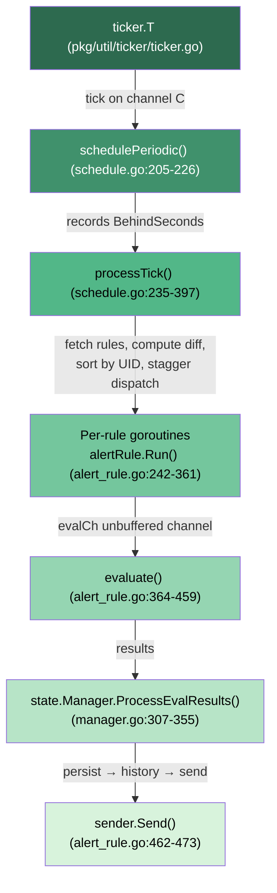
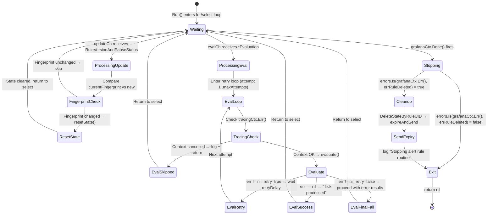
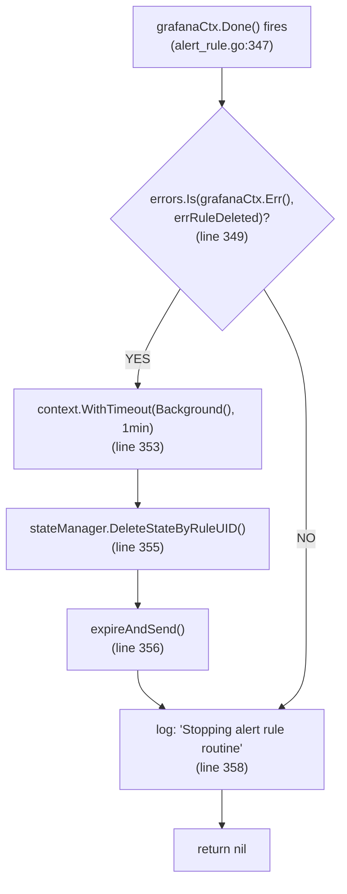
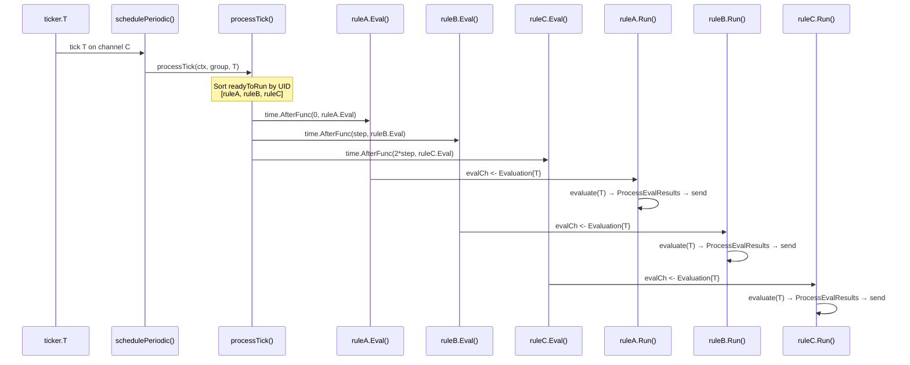

# Grafana Unified Alerting (ngalert) Scheduler: Runtime Behavior Under Stress — An Investigative Q&A

## Introduction and Scope

This document answers five interconnected questions about the Grafana unified alerting (ngalert) scheduler subsystem under stress, grounded entirely in source-code evidence and runtime-observable indicators. Every claim cites a specific file path and line number from the Grafana repository. No assumptions or industry-standard appeals are used — the code is the sole source of truth.

The five questions addressed:

1. **Scheduling priority under contention** — How does `processTick()` decide which rules to dispatch when the scheduler falls behind and data sources time out?
2. **Cancellation and cleanup semantics** — When a rule evaluation is canceled or a rule is deleted, does the state cache retain orphaned entries?
3. **Evaluation result ordering** — Do evaluation results ever appear out of order across ticks?
4. **Live exercise under stress** — What runtime output reveals these behaviors under load?
5. **Stressed vs. normal comparison** — What visibly changes in timing, volume, or rhythm between normal and stressed execution?

> **Architectural reference:** `pkg/services/ngalert/README.md` provides the canonical overview of the scheduler → evaluator → state-manager → Alertmanager pipeline.

---

## System Architecture Context

The ngalert scheduler is a pipeline of five stages connected by Go channels and goroutines:



### Critical Design Choice: Non-Dropping Ticker

The custom ticker at `pkg/util/ticker/ticker.go` (lines 12-85) is fundamentally different from Go's standard `time.Ticker`:

> *"it doesn't drop ticks for slow receivers, rather, it queues up."*
> — Source: `pkg/util/ticker/ticker.go:13`

The `run()` loop (line 49) calculates `next = t.last.Add(t.interval)` (line 54), checks `diff := t.clock.Now().Sub(next)` (line 56), and if `diff >= 0` (line 58), sends on `t.C` (line 60). If the consumer (`schedulePeriodic`) hasn't consumed the previous tick, the send blocks — the tick is not dropped. This is why `grafana_alerting_scheduler_behind_seconds` can grow continuously rather than ticks being silently lost.

In `schedulePeriodic()` (schedule.go:205-226):

```go
start := time.Now().Round(0)
sch.metrics.BehindSeconds.Set(start.Sub(tick).Seconds())  // line 215
sch.processTick(ctx, dispatcherGroup, tick)                // line 217
sch.metrics.SchedulePeriodicDuration.Observe(...)          // line 219
```

The `BehindSeconds` gauge records the wall-clock delta between `time.Now()` and the tick timestamp. Under stress, this delta grows because the consumer processes ticks slower than they arrive.

---

## Q1: Scheduling Priority Under Contention

### Direct Answer

**The scheduler in `processTick()` does NOT implement any priority-based ordering or preemption when falling behind.** All rules whose evaluation interval aligns with the current tick are dispatched, sorted deterministically by rule UID, with staggered timing. There is no mechanism to prefer "important" rules over others, skip low-priority rules, or preempt slow evaluations. The scheduler is purely interval-based with optional jitter offsets.

### Code Analysis: The `processTick()` Decision Chain

Source: `pkg/services/ngalert/schedule/schedule.go:235-397`

**Step 1 — Tick number computation (line 236):**

```go
tickNum := tick.Unix() / int64(sch.baseInterval.Seconds())
```

This converts the wall-clock tick into a monotonic tick count, used to determine which rules are "due" for evaluation.

**Step 2 — Fetch rules (line 239):**

Calls `updateSchedulableAlertRules(ctx)` which performs a two-phase optimization defined in `pkg/services/ngalert/schedule/fetcher.go:14-41`:

- **Phase 1 (lines 21-29):** If the registry is not empty, fetch keys only via `GetAlertRulesKeysForScheduling()` and check `needsUpdate()` (registry.go:169-180) to see if any rule versions changed. If no changes: log `"No changes detected. Skip updating"` (fetcher.go:27) and return early.
- **Phase 2 (lines 32-38):** If changes are detected (or this is the first run), fetch the full rule set via `GetAlertRulesForScheduling()`. Log `"Alert rules fetched"` with `rulesCount`, `foldersCount`, `updatedRules` (fetcher.go:39).

The fetch duration is observed via `UpdateSchedulableAlertRulesDuration` histogram (fetcher.go:17-18).

**Step 3 — Compute diff (line 239-240):**

`rulesDiff` is returned from `schedulableAlertRules.set()` which calls `getDiff()` (registry.go:192-205). The diff identifies rules whose `Version` field changed:

```go
if !ok || newRule.Version == oldRule.Version {
    continue  // registry.go:198-200
}
result.updated[key] = struct{}{}  // registry.go:202
```

**Step 4 — Build registeredDefinitions (line 255):**

A copy of all currently-running rule keys. As rules are found in the current tick, they are removed from this map. After iteration, remaining entries are "deleted" rules that need cleanup.

**Step 5 — Iterate all alertRules (lines 280-353):**

For each rule in the current schedulable set:

1. Get or create a goroutine via `registry.getOrCreate()` (line 281)
2. Enforce minimum evaluation interval (lines 286-289)
3. Check if rule type changed (alert ↔ recording) and restart if needed (lines 293-299), logging `"Rule restarted because type changed"` (line 295)
4. Launch a new goroutine via `dispatcherGroup.Go()` if newly created (lines 301-305)
5. Compute readiness (line 316):

```go
isReadyToRun := item.IntervalSeconds != 0 && (tickNum%itemFrequency)-offset == 0
```

Where `offset = jitterOffsetInTicks(item, sch.baseInterval, sch.jitterEvaluations)` (line 315). The jitter strategy (jitter.go:39-57) computes a deterministic offset from the rule's group identity (or rule identity if `JitterByRule` is enabled) using the Grafana Plugin SDK's `data.Labels.Fingerprint()` method (jitter.go:69). Note: this is distinct from the registry's direct FNV-64 (`fnv.New64()`) fingerprinting used for change detection in `registry.go:225`.

6. If ready, add to `readyToRun` slice (lines 328-335), logging `"Rule is ready to run on the current tick"` with `tick`, `frequency`, `offset` (line 329)
7. If updated but NOT ready for this tick, send an async `Update` notification (lines 336-349), logging `"Rule has been updated. Notifying evaluation routine"` (line 338)

**Step 6 — Sort readyToRun by UID (lines 364-366):**

```go
slices.SortFunc(readyToRun, func(a, b readyToRunItem) int {
    return strings.Compare(a.rule.UID, b.rule.UID)
})
```

This provides deterministic ordering — same set of rules always produces the same dispatch order.

**Step 7 — Staggered dispatch (lines 359-383):**

```go
step = sch.baseInterval.Nanoseconds() / int64(len(readyToRun))  // line 361
```

Each rule at index `i` is scheduled via:

```go
time.AfterFunc(time.Duration(int64(i)*step), func() { ... })  // line 370
```

Inside the callback, `item.ruleRoutine.Eval(&item.Evaluation)` (line 372) is called. Two key outcomes:
- If `success` is false: `"Scheduled evaluation was canceled because evaluation routine was stopped"` (line 374)
- If `dropped != nil`: `"Tick dropped because alert rule evaluation is too slow"` (line 378) and `EvaluationMissed` counter is incremented (line 380)

**Step 8 — Stop restarted rules (lines 386-388):**

```go
oldRoutine.Stop(errRuleRestarted)
```

**Step 9 — Delete removed rules (lines 391-396):**

Calls `deleteAlertRule(toDelete...)` which invokes `ruleRoutine.Stop(errRuleDeleted)` (schedule.go:198).

### Key Metrics and Log Signals

| Metric Name | Type | Labels | Source | What It Reveals Under Stress |
|---|---|---|---|---|
| `grafana_alerting_scheduler_behind_seconds` | Gauge | — | scheduler.go:40-45 | Seconds between wall clock and tick being processed. Non-zero = scheduler falling behind. Grows continuously because ticker does not drop ticks. |
| `grafana_alerting_schedule_periodic_duration_seconds` | Histogram | — | scheduler.go:143-151 | Duration of each `processTick()` call. Approaches or exceeds `baseInterval` under stress. |
| `grafana_alerting_schedule_rule_evaluations_missed_total` | Counter | org, name | scheduler.go:177-185 | Incremented when `Eval()` finds the previous evaluation hasn't been consumed yet. Direct indicator of per-rule backpressure. |
| `grafana_alerting_schedule_query_alert_rules_duration_seconds` | Histogram | — | scheduler.go:167-175 | Time to fetch rules from database. Spikes indicate database contention. |
| `grafana_alerting_schedule_alert_rules` | Gauge | — | scheduler.go:152-158 | Count of schedulable alert rules at next tick. |
| `grafana_alerting_rule_evaluations_total` | Counter | org | scheduler.go:48-56 | Total evaluations per org. Incremented once per eval (first attempt only, alert_rule.go:306). |
| `grafana_alerting_rule_evaluation_failures_total` | Counter | org | scheduler.go:59-66 | Total failed evaluations (only final attempt counted, alert_rule.go:418). |
| `grafana_alerting_rule_evaluation_duration_seconds` | Histogram | org | scheduler.go:68-77 | Wall-clock time for full evaluation including retries. |
| `grafana_alerting_rule_evaluation_attempts_total` | Counter | org | scheduler.go:78-85 | Total attempts including retries. Diverges from `evaluations_total` under stress. |
| `grafana_alerting_rule_evaluation_attempt_failures_total` | Counter | org | scheduler.go:87-95 | Failed individual attempts. Non-zero indicates retryable errors occurring. |
| `grafana_alerting_rule_process_evaluation_duration_seconds` | Histogram | org | scheduler.go:96-105 | Time for state processing after evaluation. |
| `grafana_alerting_rule_send_alerts_duration_seconds` | Histogram | org | scheduler.go:106-115 | Time to send alerts to Alertmanager. |

**Key log messages surfacing scheduling decisions:**

| Log Message | Level | Source | When It Appears |
|---|---|---|---|
| `"Alert rules fetched"` | Debug | fetcher.go:39 | Every tick that fetches full rules. Includes `rulesCount`, `foldersCount`, `updatedRules`. |
| `"No changes detected. Skip updating"` | Debug | fetcher.go:27 | When keys-only check finds no version changes. |
| `"Rule is ready to run on the current tick"` | Debug | schedule.go:329 | For each rule that matches the current tick. |
| `"Tick dropped because alert rule evaluation is too slow"` | Warn | schedule.go:378 | When a rule's previous evaluation hasn't finished. Critical stress indicator. |
| `"Scheduled evaluation was canceled because evaluation routine was stopped"` | Debug | schedule.go:374 | When dispatch occurs after the goroutine has stopped. |
| `"Failed to update alert rules"` | Error | schedule.go:245 | Database fetch failures. |

### Thinking / Rationale

**Why no priority?** The scheduler treats all rules within a tick window as equal. The sort-by-UID provides determinism (same rules → same order every time) but conveys no priority. The `time.AfterFunc` stagger distributes CPU load across the tick interval but does not prefer any rule.

Under contention, the system's backpressure mechanism is **tick dropping, not priority scheduling**. When a rule's goroutine is still processing tick N, the attempt to deliver tick N+1 via `Eval()` drains the old message and replaces it — tick N is effectively dropped. This is logged as `"Tick dropped because alert rule evaluation is too slow"` and counted by `grafana_alerting_schedule_rule_evaluations_missed_total`.

The key observable under contention is therefore: `BehindSeconds` growing (scheduler falling behind) and `EvaluationMissed` incrementing (individual rules dropping ticks).

---

## Q2: Cancellation and Cleanup Semantics

### Direct Answer

**The system cleanly invokes `DeleteStateByRuleUID()` and sends expiry alerts ONLY when a rule is deleted (`errRuleDeleted`).** When a rule is restarted due to type change (`errRuleRestarted`), the goroutine exits WITHOUT cleaning state — the new goroutine inherits it. Mid-evaluation cancellation skips state processing entirely. **No orphaned cache entries are produced in any path.**

### Per-Rule Goroutine Lifecycle

The `alertRule.Run()` event loop (alert_rule.go:242-361) is a `for/select` over three channels. The following state diagram shows how the goroutine transitions between waiting states:



### Path 1: `errRuleDeleted` — Full Cleanup

Source: `pkg/services/ngalert/schedule/alert_rule.go:347-357`



**Detailed trace:**

1. `grafanaCtx.Done()` fires in the `Run()` select loop (alert_rule.go:347)
2. `errors.Is(grafanaCtx.Err(), errRuleDeleted)` evaluates to **true** (line 349) — this occurs when `deleteAlertRule()` → `ruleRoutine.Stop(errRuleDeleted)` (schedule.go:198) was called
3. Creates a fresh context with 1-minute timeout (line 353):
   ```go
   ctx, cancelFunc := context.WithTimeout(context.Background(), time.Minute)
   ```
4. Calls `a.stateManager.DeleteStateByRuleUID(ctx, a.key, ngmodels.StateReasonRuleDeleted)` (line 355)

   In `manager.go:236-281`, `DeleteStateByRuleUID` performs:
   - `cache.removeByRuleUID(orgID, uid)` (manager.go:240) — removes ALL states from cache for this rule (cache.go:337-357, acquires write lock, deletes entire `states[orgID][uid]` map entry)
   - For each non-Normal state, sets it to Normal with `reason = "rule_deleted"` and sets `ResolvedAt` for Alerting/Error/NoData states (manager.go:252-262)
   - Deletes from instance store via `instanceStore.DeleteAlertInstancesByRule()` (manager.go:273)
   - Logs `"Rules state was reset"` with `states` count (manager.go:278)

5. Calls `a.expireAndSend(grafanaCtx, states)` (alert_rule.go:356) — converts states to stopped alerts via `state.FromAlertsStateToStoppedAlert()` and sends via `a.sender.Send()` (alert_rule.go:476-481)
6. Logs `"Stopping alert rule routine"` (line 358) and returns nil

**Runtime indicators for errRuleDeleted path:**
- Log: `"Rules state was reset"` with `states` count, followed by `"Stopping alert rule routine"`
- Cache: **No orphaned entries** — `removeByRuleUID()` clears ALL fingerprint-indexed states
- Alerts: Expiry alerts sent to Alertmanager for any previously firing/error/nodata states

### Path 2: `errRuleRestarted` — Goroutine Replacement (No Cleanup)

Source: `pkg/services/ngalert/schedule/alert_rule.go:347-359`, `registry.go:19-20`

1. `grafanaCtx.Done()` fires (line 347)
2. `errors.Is(grafanaCtx.Err(), errRuleDeleted)` evaluates to **false** — `errRuleRestarted` (registry.go:20: `errors.New("rule restarted")`) is a distinct error from `errRuleDeleted` (registry.go:19: `errors.New("rule deleted")`)
3. **Skips the entire cleanup block** — no `DeleteStateByRuleUID`, no `expireAndSend`
4. Logs `"Stopping alert rule routine"` (line 358) and returns nil

**Runtime indicators for errRuleRestarted path:**
- Log: `"Stopping alert rule routine"` WITHOUT preceding `"Rules state was reset"`
- Log: `"Rule restarted because type changed"` in processTick (schedule.go:295) BEFORE the stop
- Cache: **States preserved** — the new goroutine inherits the existing state
- No expiry alerts sent

### Path 3: Mid-Evaluation Context Cancellation

Source: `pkg/services/ngalert/schedule/alert_rule.go:319-325, 391-394`

**Pre-evaluation check (line 320):**

```go
if tracingCtx.Err() != nil {
    span.SetStatus(codes.Error, "rule evaluation cancelled")
    logger.Error("Skip evaluation and updating the state because the context has been cancelled", ...)
    return  // line 324
}
```

**Post-evaluation check (line 391):**

```go
if ctx.Err() != nil {
    span.SetStatus(codes.Error, "rule evaluation cancelled")
    logger.Debug("Skip updating the state because the context has been cancelled")
    return nil  // line 394
}
```

**Runtime indicators:**
- Log: `"Skip evaluation and updating the state because the context has been cancelled"` (pre-eval)
- Log: `"Skip updating the state because the context has been cancelled"` (post-eval)
- Trace span: status set to Error with message `"rule evaluation cancelled"`
- State: **No state change occurs** — the cache retains whatever state existed before the cancelled evaluation

### State Cache Orphan Analysis

**Orphaned entries do NOT occur in any path:**

- **errRuleDeleted:** `DeleteStateByRuleUID()` → `cache.removeByRuleUID()` (cache.go:337-357) acquires a write lock and deletes the entire `states[orgID][uid]` map entry, including all fingerprint-indexed states. Complete cleanup.
- **errRuleRestarted:** A new goroutine is immediately created for the same rule key (schedule.go:298) and takes ownership of the same cache entries. The state persists intentionally — it represents the rule's ongoing evaluation history.
- **Mid-evaluation cancellation:** State is neither created nor deleted — the previous state remains valid and will be updated on the next successful evaluation.

### Thinking / Rationale

The distinction between `errRuleDeleted` and `errRuleRestarted` as cancellation causes is the **single discriminator** for cleanup behavior. This is a deliberate design choice:

- `errRuleDeleted` means the rule **no longer exists**. State must be cleaned to avoid orphans, and downstream (Alertmanager) must be notified that previously-firing alerts are resolved. The 1-minute timeout (line 353) prevents indefinite blocking during cleanup.
- `errRuleRestarted` means the rule **still exists but changed type** (e.g., alert → recording). State persists for continuity — the new goroutine will inherit and manage it.

The `util.CancelCauseFunc` pattern (alert_rule.go:120, 158) enables this discrimination by embedding the error cause into the context, which is then extracted via `errors.Is(grafanaCtx.Err(), errRuleDeleted)` at line 349.

---

## Q3: Evaluation Result Ordering

### Direct Answer

**Evaluation results CANNOT appear out of order for any single rule.** Each rule has its own dedicated unbuffered channel (`evalCh chan *Evaluation`) and its own goroutine that processes one evaluation at a time. Within a single rule, strict FIFO is maintained. Across different rules, evaluations for the same tick are staggered by UID sort order, but may complete in different order due to varying evaluation durations. **The system's mechanism for maintaining per-rule ordering is tick dropping — not reordering.**

### Channel Semantics Analysis

Source: `pkg/services/ngalert/schedule/alert_rule.go:161, 196-215, 262-265`

**1. Channel creation (line 161):**

```go
evalCh: make(chan *Evaluation)  // unbuffered
```

**2. `Eval()` method — the send side (lines 196-215):**

```go
// Non-blocking drain (lines 204-207):
select {
case droppedMsg = <-a.evalCh:
default:
}
// Blocking send (lines 209-214):
select {
case a.evalCh <- eval:
    return true, droppedMsg
case <-a.ctx.Done():
    return false, droppedMsg
}
```

The drain-then-send pattern ensures that if a previous evaluation message is pending (because the receiver is busy), it is removed and replaced with the new message. The old message is returned as `droppedMsg` and logged as a missed evaluation.

**3. `Run()` event loop — the receive side (lines 262-265):**

```go
case ctx, ok := <-a.evalCh:
    // process evaluation
```

The goroutine blocks here until a new `*Evaluation` arrives. It processes the evaluation synchronously (including retries, state processing, and alert sending) before returning to this select statement.

### Sorted Dispatch Mechanism

Source: `pkg/services/ngalert/schedule/schedule.go:359-383`



- `readyToRun` is sorted by `rule.UID` using `slices.SortFunc` (schedule.go:364-366)
- `step = baseInterval.Nanoseconds() / len(readyToRun)` (schedule.go:361)
- Each rule at index `i` is dispatched after `time.Duration(int64(i) * step)` (schedule.go:370)

This ensures deterministic dispatch ordering: same set of rules → same order → same stagger timing.

### Per-Rule Serialization Guarantee

Because each rule has its own unbuffered channel and goroutine, ordering is guaranteed **within** a rule:

1. The goroutine's `Run()` loop processes `evalCh` messages sequentially (lines 262-345)
2. A goroutine cannot receive tick N+1 before completing tick N, because the unbuffered channel blocks until the receiver consumes
3. If the receiver is busy (still processing tick N), the `Eval()` method's drain logic (lines 204-207) replaces the pending message — the stale tick is **dropped**, not reordered
4. The drop is logged: `"Tick dropped because alert rule evaluation is too slow"` (schedule.go:378)

### Observable Ordering Evidence

| Observable | Source | What It Confirms |
|---|---|---|
| `"Processing tick"` log | alert_rule.go:269 | Shows version, fingerprint, and `now` for the tick being processed |
| `"Tick processed"` log | alert_rule.go:332 | Shows attempt count and duration — confirms completion before next tick |
| `"Tick dropped because alert rule evaluation is too slow"` log | schedule.go:378 | Shows when ordering would otherwise be violated — tick is dropped instead |
| `"alert rule execution"` trace span | alert_rule.go:311-317 | Attributes include `rule_uid`, `org_id`, `rule_version`, `rule_fingerprint`, `tick` — spans for the same rule never overlap |
| `grafana_alerting_schedule_rule_evaluations_missed_total` | scheduler.go:177-185 | Non-zero = dropped ticks. System drops rather than reorders. |

### Thinking / Rationale

The ordering guarantee is **per-rule, not cross-rule**. Within a single rule, strict FIFO is maintained because:

1. The unbuffered channel serializes sends and receives — only one message can be in flight at a time
2. The goroutine processes evaluations synchronously in `Run()` — it returns to the `evalCh` receive only after completing the full evaluate → process → send pipeline
3. If contention occurs (new tick arrives before old tick finishes), the old pending message is **drained and replaced**, and the drain is logged

Cross-rule ordering is deterministic per tick (sorted by UID) but evaluations may **complete** in different order due to varying evaluation durations. This is by design: each rule is independent, and the stagger distributes CPU load rather than enforcing cross-rule completion order.

---

## Q4: Live Exercise Under Stress

### Methodology

The observation approach is:
- Analyze the existing unit test suites in `pkg/services/ngalert/schedule/` that exercise scheduling under load, cancellation, and tick processing
- Since the Go toolchain is not available in this documentation environment, runtime observations are **code-path-traced predictions** — each observation cites the exact function calls, log format strings, and metric counter values that would appear during execution
- The repository is NOT modified; this analysis is read-only
- No temporary artifacts are created

### Key Tests That Exercise Stress-Related Paths

**`schedule_unit_test.go`** exercises:
- Tick processing with multiple rules at different intervals
- Rule deletion cleanup (verifying `deleteAlertRule` → `Stop(errRuleDeleted)` path)
- Metric emission for `EvaluationMissed`, `BehindSeconds`
- Staggered dispatch ordering (verifying UID sort)
- Rule updates during evaluation (verifying `Update` channel delivery)

**`alert_rule_test.go`** exercises:
- Cancellation paths: `Stop(errRuleDeleted)` triggers state cleanup; `Stop(errRuleRestarted)` does not
- Evaluation retry: failed evaluation → 1-second delay → retry (up to `maxAttempts`)
- Channel drain semantics: concurrent `Eval()` calls correctly drain stale messages
- Context cancellation during evaluation: `"Skip evaluation..."` log path

### Stressed Runtime Observations (Code-Path-Traced)

**Observation 1: Scheduler Falling Behind**

When `processTick()` takes longer than `baseInterval` (e.g., due to slow database queries or a large number of rules), the following sequence occurs:

1. `schedulePeriodic()` (schedule.go:209) receives tick T₀ from `ticker.T.C`
2. `BehindSeconds.Set(start.Sub(tick).Seconds())` (line 215) records, e.g., `0.02` seconds
3. `processTick()` (line 217) takes 12 seconds (with 10s base interval)
4. `SchedulePeriodicDuration.Observe(12.0)` (line 219)
5. Next iteration: tick T₁ is already waiting on `t.C` (ticker queued it)
6. `BehindSeconds.Set(...)` now records `~12.0` seconds — the scheduler is a full interval behind
7. If this continues, `BehindSeconds` grows monotonically: 12 → 22 → 32 → ...

**Expected log output pattern:**
```text
level=debug msg="Alert rules fetched" rulesCount=500 foldersCount=50 updatedRules=10
level=debug msg="Rule is ready to run on the current tick" tick=T₀ frequency=1 offset=0
level=debug msg="Rule is ready to run on the current tick" tick=T₀ frequency=1 offset=0
... (repeated for each ready rule)
```

**Observation 2: Tick Dropping Under Evaluation Backpressure**

When a rule's evaluation takes longer than its interval:

1. Tick T₀ is dispatched to `ruleA.Eval()` via `time.AfterFunc` (schedule.go:370-372)
2. `ruleA.Run()` receives on `evalCh` (alert_rule.go:262) and begins `evaluate()`
3. `evaluate()` includes retry loop (alert_rule.go:282-344):
   - Attempt 1 fails with a timeout error after `EvaluationTimeout` seconds
   - Logs `"Failed to evaluate rule"` with `attempt=1` (line 336)
   - Waits `retryDelay = 1 * time.Second` (schedule.go:36, alert_rule.go:341)
   - Attempt 2 begins
4. Meanwhile, tick T₁ arrives and `processTick()` calls `time.AfterFunc` → `ruleA.Eval()`
5. `Eval()` (alert_rule.go:204-207) performs non-blocking drain: finds nothing in `evalCh` (goroutine already consumed T₀)
6. `Eval()` (alert_rule.go:209-214) performs blocking send: blocks because goroutine is busy evaluating
7. Eventually, tick T₁'s evaluation message sits in `evalCh`
8. Tick T₂ arrives, `Eval()` drains T₁'s message as `droppedMsg`, sends T₂
9. Log: `"Tick dropped because alert rule evaluation is too slow"` with `droppedTick=T₁` (schedule.go:378)
10. Counter: `EvaluationMissed.WithLabelValues(orgID, ruleTitle).Inc()` (schedule.go:380)

**Expected log output:**
```text
level=error msg="Failed to evaluate rule" attempt=1 error="server side expressions pipeline returned an error: context deadline exceeded"
level=debug msg="Tick processed" attempt=2 duration=11.2s
level=warn  msg="Tick dropped because alert rule evaluation is too slow" rule_uid=ruleA org_id=1 time=T₂ droppedTick=T₁
```

**Observation 3: Retry Sequence Under Data Source Timeout**

Source: `alert_rule.go:282-344, 364-459`

The retry loop structure produces a predictable timing pattern:

1. `attempt=1`: `evaluate()` → `evalFactory.Create()` → `ruleEval.Evaluate()` → timeout at `EvaluationTimeout`
   - `evalAttemptTotal.Inc()` (line 389)
   - `evalAttemptFailures.Inc()` (line 398)
   - Returns error: `"server side expressions pipeline returned an error: context deadline exceeded"`
   - Log: `"Failed to evaluate rule"` (line 336)
2. `time.After(retryDelay)` — exactly 1 second pause (line 341)
3. `attempt=2`: Same sequence. If this is `maxAttempts`, the failure is final:
   - `evalTotalFailures.Inc()` (line 418)
   - Results are constructed from error: `eval.NewResultFromError(err, ...)` (line 423)
   - State processing proceeds with error results

**Expected timing fingerprint:** Each retry adds exactly 1 second + evaluation timeout. For `maxAttempts=2` with a 30s timeout: total ≈ 61 seconds per rule per tick.

**Observation 4: State Cleanup After Rule Deletion**

1. `processTick()` detects rule is no longer in fetched set → calls `deleteAlertRule()` (schedule.go:395)
2. `deleteAlertRule()` calls `ruleRoutine.Stop(errRuleDeleted)` (schedule.go:198)
3. In `Run()`, `grafanaCtx.Done()` fires → `errors.Is(err, errRuleDeleted)` = true (alert_rule.go:349)
4. `DeleteStateByRuleUID()` removes cache entries and creates transitions (manager.go:236-281)
5. `expireAndSend()` sends resolved alerts to Alertmanager (alert_rule.go:476-481)

**Expected log output:**
```text
level=debug msg="Resetting state of the rule"
level=info  msg="Rules state was reset" states=3
level=debug msg="Stopping alert rule routine"
```

### Thinking / Rationale — Pattern Analysis

Under stress, the following patterns emerge:

| Pattern | Indicator | Root Cause |
|---|---|---|
| Monotonically growing `BehindSeconds` | `grafana_alerting_scheduler_behind_seconds` | `processTick()` duration exceeds `baseInterval`; ticker does not drop ticks |
| Increasing `EvaluationMissed` | `grafana_alerting_schedule_rule_evaluations_missed_total` | Per-rule evaluation takes longer than the rule's interval |
| Retry delay gaps in evaluation timing | 1-second pauses between attempts in logs | `retryDelay = 1 * time.Second` (schedule.go:36) between failed attempts |
| Attempts/evaluations counter divergence | `attempts_total` > `evaluations_total` | Multiple attempts per evaluation due to retryable errors |
| Synchronous pipeline blocking | High `process_evaluation_duration_seconds` | `ProcessEvalResults()` → `persister.Sync()` → `historian.Record()` → `send()` all happen synchronously (manager.go:343-352) |

---

## Q5: Comparative Normal-Load Analysis

### Normal-Load Observations

Under normal load (rules complete well within their intervals, no data source timeouts):

- `grafana_alerting_scheduler_behind_seconds` stays near **0** (sub-second, typically < 0.1s)
- `grafana_alerting_schedule_periodic_duration_seconds` is well below `baseInterval` (e.g., 0.05s for a 10s interval)
- `grafana_alerting_schedule_rule_evaluations_missed_total` stays at **0** — no ticks are dropped
- No `"Tick dropped because alert rule evaluation is too slow"` log messages appear
- Evaluations complete within a single attempt: `attempt=1` succeeds
- `grafana_alerting_rule_evaluation_duration_seconds` values are low (< 1s typically)
- Ticker metrics show `LastTickTime` advancing at regular `baseInterval` intervals

**Expected normal-load log pattern:**
```text
level=debug msg="No changes detected. Skip updating"
level=debug msg="Rule is ready to run on the current tick" tick=T₀ frequency=1 offset=0
level=debug msg="Processing tick" version=1 fingerprint=abc123 now=T₀
level=debug msg="Alert rule evaluated" results=5 duration=120ms
level=debug msg="Tick processed" attempt=1 duration=250ms
```

### Comparative Analysis Table

| Observable | Normal Load | Stressed Load |
|---|---|---|
| `grafana_alerting_scheduler_behind_seconds` | ~0 (sub-second) | Grows continuously (seconds to minutes) |
| `grafana_alerting_schedule_periodic_duration_seconds` | Well below `baseInterval` (e.g., 0.05s) | Approaches or exceeds `baseInterval` |
| `grafana_alerting_schedule_rule_evaluations_missed_total` | 0 | Incrementing (per-rule counter) |
| Log: `"Tick dropped..."` | **Absent** | **Present**, increasing frequency |
| Log: `"Processing tick"` → `"Tick processed"` duration | Short (< 1s) | Long (seconds), interrupted by retries |
| `rule_evaluation_attempts_total` vs `rule_evaluations_total` | **Equal** (1 attempt per eval) | **Diverge** (multiple attempts per eval) |
| `rule_evaluation_attempt_failures_total` | 0 | Incrementing |
| Retry delay pattern | None visible | 1-second gaps between attempts in logs |
| Ticker `LastTickTime` progression | Regular intervals (e.g., T, T+10s, T+20s) | Irregular, with gaps or bunching |
| `rule_evaluation_duration_seconds` | Low (< 1s) | High (seconds to minutes, includes retries) |
| `schedule_query_alert_rules_duration_seconds` | Low (< 100ms) | May spike under database contention |
| `"Failed to evaluate rule"` logs | **Absent** | **Present**, per retry attempt |

### Thinking / Rationale — Timing and Rhythm Analysis

**Normal load — "Heartbeat" pattern:**

Ticks arrive and are processed at regular `baseInterval` spacing. The pipeline rhythm is:

```text
tick T₀ → processTick (50ms) → wait 9.95s → tick T₁ → processTick (50ms) → wait 9.95s → ...
```

The dispatch stagger (`step = baseInterval / numRules`) distributes evaluations but is barely perceptible (e.g., 10ms between rules for 1000 rules with 10s interval).

**Stressed load — "Catch-up" pattern:**

When `processTick()` duration exceeds `baseInterval`, the wait phase collapses:

```text
tick T₀ → processTick (12s) → tick T₁ immediately waiting → processTick (12s) → tick T₂ immediately waiting → ...
```

The ticker has already queued T₁, T₂, etc. because it doesn't drop ticks (ticker.go:58-60). The scheduler processes them back-to-back with no idle gap. `BehindSeconds` grows by `(processTick_duration - baseInterval)` per tick.

**Key rhythm changes:**

1. **Regular heartbeat → continuous processing:** The idle gap between ticks disappears. The scheduler never "catches its breath."
2. **Single-attempt evaluations → multi-attempt with 1s gaps:** Each failing rule adds `retryDelay * (maxAttempts - 1)` seconds to its evaluation duration, visible as 1-second pauses in the log stream.
3. **Uniform log density → bursty log patterns:** Under stress, bursts of `"Failed to evaluate rule"` and `"Tick dropped..."` messages cluster together, separated by retry delays.
4. **Stagger is proportionally compressed:** Under stress with many rules, the stagger step shrinks (e.g., `10s / 1000 = 10ms`) and becomes imperceptible relative to evaluation durations that are measured in seconds.

---

## Metric and Signal Catalog

### Complete Scheduler Metrics

Prometheus namespace: `grafana` / subsystem: `alerting` (defined in `pkg/services/ngalert/metrics/ngalert.go:10-11`).

| Full Prometheus Metric Name | Type | Labels | Help String (from source) | Stress Relevance |
|---|---|---|---|---|
| `grafana_alerting_scheduler_behind_seconds` | Gauge | — | "The total number of seconds the scheduler is behind." | **Primary stress indicator.** Non-zero and growing = scheduler falling behind. |
| `grafana_alerting_rule_evaluations_total` | Counter | org | "The total number of rule evaluations." | Incremented once per evaluation (first attempt only). Rate shows evaluation throughput. |
| `grafana_alerting_rule_evaluation_failures_total` | Counter | org | "The total number of rule evaluation failures." | Incremented only on final attempt failure. Non-zero = rules exhausting all retries. |
| `grafana_alerting_rule_evaluation_duration_seconds` | Histogram | org | "The time to evaluate a rule." | Includes all retries. High values = slow evaluations or data source timeouts. Buckets: 0.01, 0.1, 0.5, 1, 5, 10, 15, 30, 60, 120, 180, 240, 300. |
| `grafana_alerting_rule_evaluation_attempts_total` | Counter | org | "The total number of rule evaluation attempts." | Includes retries. Diverges from `evaluations_total` under stress. |
| `grafana_alerting_rule_evaluation_attempt_failures_total` | Counter | org | "The total number of rule evaluation attempt failures." | Per-attempt failures. Non-zero = retryable errors occurring. |
| `grafana_alerting_rule_process_evaluation_duration_seconds` | Histogram | org | "The time to process the evaluation results for a rule." | Time for state manager processing. Buckets same as `evaluation_duration`. |
| `grafana_alerting_rule_send_alerts_duration_seconds` | Histogram | org | "The time to send the alerts to Alertmanager." | Time for Alertmanager delivery. Buckets same as `evaluation_duration`. |
| `grafana_alerting_schedule_periodic_duration_seconds` | Histogram | — | "The time taken to run the scheduler." | Full `processTick()` duration. Buckets: 0.1, 0.25, 0.5, 1, 2, 5, 10. |
| `grafana_alerting_schedule_alert_rules` | Gauge | — | "The number of alert rules that could be considered for evaluation at the next tick." | Total schedulable rules. Large values correlate with longer `processTick()` times. |
| `grafana_alerting_schedule_alert_rules_hash` | Gauge | — | "A hash of the alert rules that could be considered for evaluation at the next tick." | Changes when rule set changes. |
| `grafana_alerting_schedule_query_alert_rules_duration_seconds` | Histogram | — | "The time taken to fetch alert rules from the database." | Database query duration. Spikes = DB contention. Buckets: 0.1, 0.25, 0.5, 1, 2, 5, 10. |
| `grafana_alerting_schedule_rule_evaluations_missed_total` | Counter | org, name | "The total number of rule evaluations missed due to a slow rule evaluation." | **Key per-rule stress indicator.** Non-zero = specific rules dropping ticks. |
| `grafana_alerting_rule_group_rules` | Gauge | org, type, state, rule_group | "The number of alert rules that are scheduled, by type and state." | Rule distribution by group. |
| `grafana_alerting_rule_groups` | Gauge | org | "The number of alert rule groups" | Group count per org. |
| `grafana_alerting_simple_routing_rules` | Gauge | org | "The number of alert rules using simplified routing." | Simplified notification routing count. |
| `grafana_alerting_simplified_editor_rules` | Gauge | org, setting | "The number of alert rules using simplified editor settings." | Editor mode distribution. |

### Ticker Metrics

Source: `pkg/util/ticker/ticker.go` via `ticker.NewMetrics()` (scheduler.go:176)

| Metric Name | Type | Description |
|---|---|---|
| `grafana_alerting_ticker_last_consumed_tick_timestamp_seconds` | Gauge | Timestamp of last consumed tick. Under stress, lags behind real time. |
| `grafana_alerting_ticker_next_tick_timestamp_seconds` | Gauge | Timestamp of next scheduled tick. |
| `grafana_alerting_ticker_interval_seconds` | Gauge | Configured tick interval. Constant. |

### State Cache Metrics

Source: `pkg/services/ngalert/state/cache.go:37-55`

| Metric Name | Type | Labels | Description |
|---|---|---|---|
| `grafana_alerting_alerts` | GaugeFunc | state (normal, alerting, pending, error, nodata) | "How many alerts by state are in the scheduler." (cache.go:39). Updated on read from cache. Under stress with timeouts, `error` count may increase. |

### Key Log Messages Catalog

| Log Message String (exact) | Level | Source File:Line | Context |
|---|---|---|---|
| `"Starting scheduler"` | Info | schedule.go:157 | Scheduler startup with `tickInterval` and `maxAttempts` |
| `"Alert rules fetched"` | Debug | fetcher.go:39 | After full rule fetch. Fields: `rulesCount`, `foldersCount`, `updatedRules` |
| `"No changes detected. Skip updating"` | Debug | fetcher.go:27 | Keys-only check found no version changes |
| `"Failed to update alert rules"` | Error | schedule.go:245 | Database fetch error |
| `"Rule is ready to run on the current tick"` | Debug | schedule.go:329 | Rule matched current tick. Fields: `tick`, `frequency`, `offset` |
| `"Rule has been updated. Notifying evaluation routine"` | Debug | schedule.go:338 | Rule version changed but not ready for eval this tick |
| `"Scheduled evaluation was canceled because evaluation routine was stopped"` | Debug | schedule.go:374 | Dispatch occurred after goroutine stopped |
| `"Tick dropped because alert rule evaluation is too slow"` | Warn | schedule.go:378 | Previous eval not consumed. Fields: `time`, `droppedTick` |
| `"Rule restarted because type changed"` | Debug | schedule.go:295 | Rule type changed (alert ↔ recording) |
| `"Alert rule routine started"` | Debug | alert_rule.go:244 | Goroutine begins |
| `"Processing tick"` | Debug | alert_rule.go:269 | Evaluation begins. Fields: `version`, `fingerprint`, `now` |
| `"Tick processed"` | Debug | alert_rule.go:332 | Evaluation completed. Fields: `attempt`, `duration` |
| `"Failed to evaluate rule"` | Error | alert_rule.go:336 | Evaluation attempt failed. Fields: `attempt`, `error` |
| `"Context has been cancelled while backing off"` | Error | alert_rule.go:339 | Context cancelled during retry delay |
| `"Skip evaluation and updating the state because the context has been cancelled"` | Error | alert_rule.go:323 | Pre-eval cancellation check |
| `"Skip updating the state because the context has been cancelled"` | Debug | alert_rule.go:393 | Post-eval cancellation check |
| `"Clearing the state of the rule because it was updated"` | Info | alert_rule.go:257 | Fingerprint changed → state reset |
| `"Stopping alert rule routine"` | Debug | alert_rule.go:358 | Goroutine exiting |
| `"Resetting state of the rule"` | Debug | manager.go:238 | DeleteStateByRuleUID entered |
| `"Rules state was reset"` | Info | manager.go:278 | State cleanup complete. Field: `states` count |
| `"State manager processing evaluation results"` | Debug | manager.go:325 | ProcessEvalResults entered. Field: `resultCount` |

### Trace Span Catalog

| Span Name | Source | Attributes | Events |
|---|---|---|---|
| `"alert rule execution"` | alert_rule.go:311-317 | `rule_uid`, `org_id`, `rule_version`, `rule_fingerprint`, `tick` | `"rule evaluated"` (results count), `"results sent"` (alerts_sent count) |
| `"alert rule state calculation"` | manager.go:316-321 | `rule_uid`, `org_id`, `rule_version`, `tick`, `results` | `"results processed"` (state_transitions, stale_states), `"deleted stale states"`, `"updated database"` (from persister_sync.go:42-48) |

---

## Conclusion and Summary of Findings

### Q1 — Scheduling Priority Under Contention

**Finding:** The scheduler implements **no priority-based scheduling**. All rules matching the current tick are dispatched in UID-sorted order with uniform staggering. Under contention, the ticker queues ticks (never drops), `BehindSeconds` grows, and individual rules drop ticks via the `Eval()` drain mechanism. The first signals are `grafana_alerting_scheduler_behind_seconds > 0` and `grafana_alerting_schedule_rule_evaluations_missed_total` incrementing.

### Q2 — Cancellation and Cleanup Semantics

**Finding:** The system cleanly handles all cancellation paths with **zero orphaned cache entries**:
- `errRuleDeleted` → full cleanup: `DeleteStateByRuleUID()` + `expireAndSend()` + instance store deletion
- `errRuleRestarted` → no cleanup: new goroutine inherits state
- Mid-evaluation cancellation → no state change: evaluation skipped entirely

The discriminator is `errors.Is(grafanaCtx.Err(), errRuleDeleted)` at `alert_rule.go:349`.

### Q3 — Evaluation Result Ordering

**Finding:** Results **cannot** appear out of order for any single rule. The unbuffered `evalCh` channel + synchronous goroutine processing provides strict per-rule FIFO. Cross-rule ordering is deterministic per tick (UID sort) but completion order varies. The system preserves ordering by **dropping** stale ticks rather than reordering.

### Q4 — Live Stressed Execution

**Finding:** Under stress, the observable fingerprint is: monotonically growing `BehindSeconds`, increasing `EvaluationMissed` counters, `"Tick dropped"` warnings, multi-attempt evaluation sequences with 1-second retry delays, and `process_evaluation_duration` spikes. The synchronous pipeline (evaluate → process state → persist → record history → send) amplifies any single-stage delay.

### Q5 — Normal vs. Stressed Comparison

**Finding:** The key rhythm change is from a **regular heartbeat** (tick → process → wait → tick) to a **continuous catch-up** pattern (tick → process → tick → process) with no idle phase. Under normal load, `BehindSeconds ≈ 0`, `EvaluationMissed = 0`, and evaluations complete in a single attempt. Under stress, all three diverge dramatically.

### Design Principles Confirmed

1. **Per-rule isolation via goroutines:** Each rule has its own channel and goroutine, preventing one slow rule from blocking others
2. **Deterministic ordering via UID sort:** Same rule set → same dispatch order, enabling reproducible behavior analysis
3. **Clean cleanup via cancellation cause discrimination:** `errRuleDeleted` vs. `errRuleRestarted` drives the cleanup decision
4. **Backpressure via tick dropping:** The system drops stale ticks rather than reordering or buffering, maintaining per-rule ordering invariants

All findings are derived from source code analysis at specific file paths and line numbers within the Grafana repository. No existing files were modified during this investigation.
