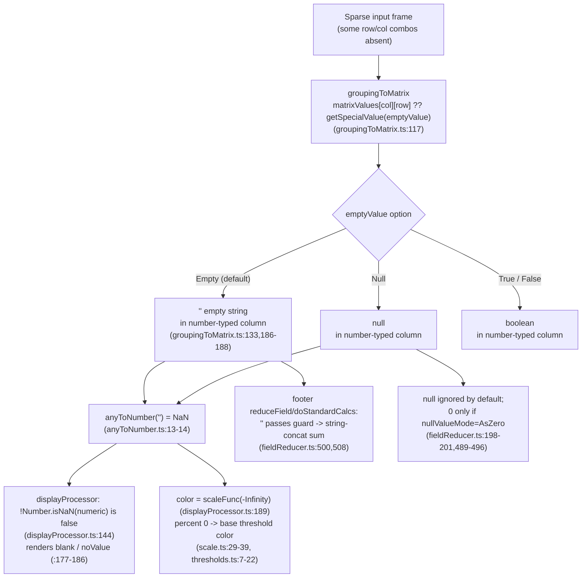

# Grouping to matrix: what fills an absent `(row, column)` cell, and how it flows through a Table visualization

> **Repository:** `grafana` monorepo · **Branch:** `grafana_4550cfb5b728` · **HEAD:** `4550cfb5b72886782d9a3e6cf995f8dbd57ca4ff`
>
> **Scope:** Read-only investigation. This document is the _only_ file produced. No source file was modified; the temporary observation harness used during the investigation has already been removed and `git status --porcelain` is empty.

## The question

In Grafana's **"Grouping to matrix"** transformation, when a `(row, column)` intersection is **absent** from the source data, what value does the transformation place in that cell — an **empty string**, **`null`**, or **`0`**? And how does that value propagate through a downstream **Table** visualization — its **rendering**, its **footer totals (reducers)**, its **thresholds**, and its **color scales**? Precisely **where does the behavior diverge** from the human intuition that _"missing means zero"_?

The question is decomposed into six sub-questions and each is answered explicitly below:

- **Q1** — What value is emitted for a missing intersection?
- **Q2** — What is the _type_ of the filled cell?
- **Q3** — How does a downstream panel _render_ the filled cell?
- **Q4** — How does the missing cell affect _totals_ (footer reducers: sum / mean / count)?
- **Q5** — How is the missing cell _colored_ (thresholds / color scales)?
- **Q6** — _Where_ does "missing means zero" break down?

---

## TL;DR (direct answer)

By default a missing intersection is filled with the **empty string `''`** — **never `0`** (the transformation has no `Zero` option; only `Null`, `True`, `False`, `Empty`). Because the output column keeps the value field's declared type (typically `number`), that `''` is a **string sitting in a number-typed column**. Downstream, `anyToNumber('')` returns **`NaN`** (not `0`), so the cell **renders blank**, is **painted with the base/lowest threshold color** (via `scaleFunc(-Infinity)`), and — worst of all — **corrupts the footer `sum` into a _string_ through JavaScript concatenation** (observed `sum="1"`, `typeof=string`). Choosing `emptyValue = Null` instead makes the gap ignored (contributing nothing), and only `emptyValue = Null` **combined with** the field's `nullValueMode = AsZero` makes a gap behave like a true numeric `0`.

---

## How this was investigated (run-first, evidence-led)

Per the governing rule, the behavior was established by **running the real code first**, then reading the source to attach exact `file:line` citations. **The answer below is written from observed behavior, not from reading alone.**

**Environment (verified):**

- `grafana` monorepo, branch `grafana_4550cfb5b728`, HEAD `4550cfb5b72886782d9a3e6cf995f8dbd57ca4ff`, clean working tree.
- Node is pinned to **`v22.11.0`** via `.nvmrc` (with `engines` `"node": ">= 22"` in `package.json`); the package manager is **`yarn@4.5.3`** via corepack. `yarn install` was run once (npm registry available).

**Command 1 — the real transformer test suite** (`yarn jest groupingToMatrix`). This is the authoritative, committed test that proves what the transformer emits for absent intersections.

**Command 2 — a temporary observation harness** (already removed). A throwaway `*.test.ts` was placed under `packages/grafana-data/src/transformations/transformers/` that fed an illustrative sparse `DataFrame` through the transformer and then through `anyToNumber`, `getDisplayProcessor(...).display()`, and `reduceField`, and printed the emitted cell value, its runtime `typeof`, the display `text`/`numeric`/`color`, and the footer `sum`/`mean`/`count` under each `emptyValue` and `nullValueMode` setting. It used `process.stdout.write` to bypass Grafana's `jest-fail-on-console` guard so the suite passed cleanly. **The harness was deleted after capturing output; `git status --porcelain` is empty and the repository is otherwise unchanged.**

### Verbatim OUTPUT BLOCK 1 — real test suite

```text
$ yarn jest groupingToMatrix
PASS packages/grafana-data/src/transformations/transformers/groupingToMatrix.test.ts
Test Suites: 1 passed, 1 total
Tests:       4 passed, 4 total
Snapshots:   1 passed, 1 total
Time:        3.14 s
Ran all test suites matching /groupingToMatrix/i.
(exit code 0)
```

This confirms the four committed tests pass at HEAD `4550cfb`. Their assertions are cited directly in **Q1** and **Q2** below (they assert `''` gaps in `number`-typed columns by default, and `null` gaps under `SpecialValue.Null`).

---

## Illustrative sparse dataset (constructed for explanation)

> **This 2×2 dataset is synthetic — it was constructed purely to make the trace concrete.** Every behavioral assertion about it is nevertheless backed by the observed output in **OUTPUT BLOCK 2** below and by the `file:line` citations in **Q1–Q6**.

Consider a long-format source frame with three fields — `Column`, `Row`, and a numeric value field `Temp` — containing only two rows:

| `Column` | `Row` | `Temp` |
| -------- | ----- | ------ |
| `C1`     | `R1`  | `1`    |
| `C2`     | `R2`  | `2`    |

Only the intersections `(C1, R1)=1` and `(C2, R2)=2` are populated. The other two intersections — `(C1, R2)` and `(C2, R1)` — are **absent** from the source.

After **Grouping to matrix** with the default `emptyValue` (`Empty`), the output is a matrix frame: a `Row\Column` key column of type `string` plus two `number`-typed value columns whose gaps are filled:

| `Row\Column` (string) | `C1` (number) | `C2` (number) |
| --------------------- | ------------- | ------------- |
| `R1`                  | `1`           | `""`          |
| `R2`                  | `""`          | `2`           |

The gaps are the empty string `""`, held inside columns declared `type=number`. Feeding this frame through a **Table** panel with a footer `sum` and thresholds (green base, red at `80`): the populated cells render `1`/`2` (green), the two gaps render **blank** (still green), and the footer `sum` for `C1` is the **string `"1"`** — not `1`, and not `0` — under defaults. The only way to make a gap behave like a numeric `0` in the total is `emptyValue = Null` **plus** the field's `nullValueMode = AsZero` (see **Q4**).

### Verbatim OUTPUT BLOCK 2 — temporary observation harness

The harness used the illustrative sparse frame above: `Column=[C1,C2]`, `Row=[R1,R2]`, `Temp=[1,2]`, so only `(C1,R1)=1` and `(C2,R2)=2` are populated; the other two intersections `(C1,R2)` and `(C2,R1)` are absent. Thresholds were configured green@`-Infinity`, red@`80`, color mode `thresholds`.

```text
=== emptyValue = Empty(default) ===
field 'Row\Column' type=string values=["R1","R2"] typeof=[string,string]
field 'C1' type=number values=[1,""] typeof=[number,string]
field 'C2' type=number values=["",2] typeof=[string,number]
anyToNumber(C2 cells)=[NaN, 2]

=== emptyValue = null ===
field 'Row\Column' type=string values=["R1","R2"] typeof=[string,string]
field 'C1' type=number values=[1,null] typeof=[number,object]
field 'C2' type=number values=[null,2] typeof=[object,number]
anyToNumber(C2 cells)=[NaN, 2]

=== emptyValue = true ===
field 'Row\Column' type=string values=["R1","R2"] typeof=[string,string]
field 'C1' type=number values=[1,true] typeof=[number,boolean]
field 'C2' type=number values=[true,2] typeof=[boolean,number]
anyToNumber(C2 cells)=[1, 2]

=== emptyValue = false ===
field 'Row\Column' type=string values=["R1","R2"] typeof=[string,string]
field 'C1' type=number values=[1,false] typeof=[number,boolean]
field 'C2' type=number values=[false,2] typeof=[boolean,number]
anyToNumber(C2 cells)=[0, 2]

=== display pipeline (thresholds green@-Inf, red@80) ===
display('' (Empty gap)) -> text="" numeric=NaN color=#73BF69
display(null (Null gap)) -> text="" numeric=NaN color=#73BF69
display(1 (real value)) -> text="1" numeric=1 color=#73BF69
display(90 (real value)) -> text="90" numeric=90 color=#F2495C

=== footer reduceField sum on column C1 = [1, gap] ===
Empty gap '' , nullValueMode=default(Ignore): sum="1" (typeof=string) mean=0.5 count=2
Empty gap '' , nullValueMode=AsZero        : sum="1" (typeof=string) mean=0.5 count=2
Null gap null, nullValueMode=default(Ignore): sum=1 (typeof=number) mean=1 count=1
Null gap null, nullValueMode=AsZero        : sum=1 (typeof=number) mean=0.5 count=2
```

> **Note on the two color hexes.** They are Grafana theme colors resolved via `createTheme()`: `#73BF69` is Grafana's green (the base/lowest threshold step) and `#F2495C` is Grafana's red. The gap cell and the real value `1` share `#73BF69`; only value `90` (≥ 80) becomes red. This is referenced throughout **Q3** and **Q5**.

---

## The decomposed answer (Q1–Q6)

All line numbers below were verified against the source at HEAD `4550cfb`. Each claim is backed by a `file:line` citation and/or a quote from the output blocks above.

### Q1 — What value is emitted for a missing intersection?

**Answer: the empty string `''` by default — NOT `0`.** It is configurable to `null`, `true`, or `false`, but **never `0`.**

- The fill expression is `const value = matrixValues[columnName][rowName] ?? getSpecialValue(emptyValue);` at `packages/grafana-data/src/transformations/transformers/groupingToMatrix.ts:117`.
- `emptyValue` defaults to `SpecialValue.Empty`: `const DEFAULT_EMPTY_VALUE = SpecialValue.Empty;` (`groupingToMatrix.ts:26`) and `const emptyValue = options.emptyValue || DEFAULT_EMPTY_VALUE;` (`groupingToMatrix.ts:71`).
- `getSpecialValue` returns `''` for `Empty`/`default` (`groupingToMatrix.ts:178-190`): `False → false` (L181), `True → true` (L183), `Null → null` (L185), and `Empty`/`default → ''` (L186-188).
- The enum has **no `Zero`**: `export enum SpecialValue { True = 'true', False = 'false', Null = 'null', Empty = 'empty' }` at `packages/grafana-data/src/types/transformations.ts:113-118`.
- The transform editor exposes **only** these four (no `Zero`, no free-text): `specialValueOptions` = `Null`/`True`/`False`/`Empty` at `public/app/features/transformers/editors/GroupingToMatrixTransformerEditor.tsx:61-66`, rendered by the "Empty Value" `<Select>` at `:100-102`.
- The user-facing docs confirm the same four choices — "…you can select which value to display between: **Null**, **True**, **False**, or **Empty**" at `docs/sources/panels-visualizations/query-transform-data/transform-data/index.md:665` (section `### Grouping to matrix`, `:653`).

**Subtlety worth stating:** because the operator is `??` (nullish coalescing) at `groupingToMatrix.ts:117`, a _genuine_ `null` already present in the source is **also** replaced by the empty value — not only structurally-absent combinations.

**Observed proof (OUTPUT BLOCK 2):** under the default, `field 'C1' type=number values=[1,""]` and `field 'C2' type=number values=["",2]`; under `emptyValue = null`, `values=[1,null]` / `[null,2]`; under `true`/`false` the gaps become the booleans `true`/`false`. In no configuration is the gap `0`.

### Q2 — What is the TYPE of the filled cell?

**Answer: the output column keeps the value field's declared type (typically `FieldType.number`) and config, so the `''` string sits inside a `number`-typed column — a type/value mismatch.**

- The column is pushed as `fields.push({ name: columnName.toString(), values, config: valueField.config, type: valueField.type })` — `config: valueField.config` at `groupingToMatrix.ts:132` and `type: valueField.type` at `groupingToMatrix.ts:133` (push block `groupingToMatrix.ts:129-134`). The gap value inherits nothing about type; only the column's `type` is copied from the source value field.
- The real, committed test asserts this directly. Default gaps are `''` inside `type: FieldType.number` columns — e.g. column `'1000'` has `type: FieldType.number` with `values: [1, '', '']` at `packages/grafana-data/src/transformations/transformers/groupingToMatrix.test.ts:38-55`. Under `SpecialValue.Null` (set at `groupingToMatrix.test.ts:112`) the same columns assert `values: [1, null]` / `[null, 2]` at `groupingToMatrix.test.ts:133-144`. A further test preserves the source config `{ units: 'celsius' }` while a gap is `""` in its inline snapshot at `groupingToMatrix.test.ts:203`.
- **Observed proof (OUTPUT BLOCK 2):** `field 'C1' type=number values=[1,""] typeof=[number,string]` — the column is `type=number` but the gap cell's runtime `typeof` is `string`. Under `emptyValue = null` the gap's `typeof` is `object` (JavaScript reports `typeof null === 'object'`); under `true`/`false` it is `boolean`. **This mismatch — a non-number inside a number column — is the root of every downstream surprise in Q3–Q5.**

### Q3 — How does a downstream panel RENDER the filled cell?

**Answer: it renders BLANK, because the empty string coerces to `NaN` (not `0`) in the display pipeline.**

- `anyToNumber('')` returns `NaN`: `if (value === '' || value === null || value === undefined || Array.isArray(value)) { return NaN; // lodash calls them 0 }` at `packages/grafana-data/src/utils/anyToNumber.ts:13-14`. The source comment `// lodash calls them 0` explicitly documents that this is a **deliberate divergence** from returning `0`. (The same function maps `true → 1` and `false → 0` at `anyToNumber.ts:17-18`, which is why the `true`/`false` rows in OUTPUT BLOCK 2 coerce to `[1, 2]` / `[0, 2]`.)
- In the display pipeline: `let numeric = isStringUnit ? NaN : anyToNumber(value);` at `packages/grafana-data/src/field/displayProcessor.ts:96`. The number-formatting guard `if (!Number.isNaN(numeric)) {` at `displayProcessor.ts:144` is **false** for `NaN`, so numeric formatting (and the normal `color = scaleFunc(numeric)` path at `displayProcessor.ts:166-170`) is skipped. The blank/`noValue` fallback then runs at `displayProcessor.ts:177-186`: `text` becomes `config.noValue` if set, otherwise the empty string `''` (`text = ''; // No data?` at `:183`).
- **Observed proof (OUTPUT BLOCK 2):** `display('' (Empty gap)) -> text="" numeric=NaN color=#73BF69` and `display(null (Null gap)) -> text="" numeric=NaN color=#73BF69`. Contrast with a real value: `display(1 (real value)) -> text="1" numeric=1 color=#73BF69`. Both the `''` and `null` gaps produce `numeric=NaN` and an empty `text` — a blank cell, not a rendered `0`.

### Q4 — How does the missing cell affect TOTALS (footer reducers: sum / mean / count)?

**Answer: with the default empty string, the footer `sum` becomes a _string_ via JavaScript concatenation (a corrupted total). With `null`, the gap is ignored by default and contributes a true `0` ONLY under `nullValueMode: AsZero`.**

- Reducer defaults: `const { nullValueMode = NullValueMode.Ignore } = field.config;` at `packages/grafana-data/src/transformations/fieldReducer.ts:198`; then `const ignoreNulls = nullValueMode === NullValueMode.Ignore;` and `const nullAsZero = nullValueMode === NullValueMode.AsZero;` at `fieldReducer.ts:200-201`. The `NullValueMode` values are `Null = 'null'`, `Ignore = 'connected'`, `AsZero = 'null as zero'` at `packages/grafana-data/src/types/data.ts:202-206`.
- Accumulation in `doStandardCalcs` (`fieldReducer.ts:468`): `defaultCalcs.sum` starts at `0` (`fieldReducer.ts:445-446`). For each value, the null branch `if (currentValue == null) { if (ignoreNulls) continue; if (nullAsZero) currentValue = 0; }` runs at `fieldReducer.ts:489-496`, then `calcs.count++` at `:498`. The accumulation guard is `if (currentValue != null && !Number.isNaN(currentValue)) {` at `fieldReducer.ts:500`, and the sum is `calcs.sum += currentValue;` at `fieldReducer.ts:508`. **An empty string `''` is neither `null` nor `NaN`** (`Number.isNaN('')` is `false`), so it **passes** the guard and is added — but `number + '' → string` in JavaScript. The mean is `calcs.mean = calcs.sum! / calcs.nonNullCount;` at `fieldReducer.ts:568-569`.
- The Table footer reaches exactly this code via `const fieldCalcValue = reduceField({ field, reducers: reducer })[calc];` at `packages/grafana-ui/src/components/Table/utils.ts:404` (`reduceField` is imported from `@grafana/data` at `utils.ts:21`; `getFooterValue` is imported at `utils.ts:37` and wired into each column at `utils.ts:151`; the supporting `getFooterValue` is defined at `packages/grafana-ui/src/components/Table/FooterRow.tsx:60`; `packages/grafana-ui/src/components/Table/reducer.ts` is table UI-state wiring).

**Observed proof (OUTPUT BLOCK 2), the crux — all four `sum` lines, with the arithmetic:**

- `Empty gap '' , nullValueMode=default(Ignore): sum="1" (typeof=string) mean=0.5 count=2` — `0 + 1 = 1` (number), then `1 + '' = "1"` (string). `count=2` because `''` passes the null/`NaN` guards; `mean=0.5` is `"1" / 2` (JavaScript coerces the string `"1"` back to `1`, divided by `nonNullCount=2`).
- `Empty gap '' , nullValueMode=AsZero        : sum="1" (typeof=string) mean=0.5 count=2` — **`AsZero` does NOT fix an empty string**: because `''` is not `null`, the `nullAsZero` branch at `fieldReducer.ts:493-494` never fires, so it is still string concatenation.
- `Null gap null, nullValueMode=default(Ignore): sum=1 (typeof=number) mean=1 count=1` — the `null` gap is skipped entirely (`continue` at `fieldReducer.ts:490-491`), so it contributes nothing and is **not even counted** (`count=1`, `mean=1`). It does **not** become `0`.
- `Null gap null, nullValueMode=AsZero        : sum=1 (typeof=number) mean=0.5 count=2` — **only here** does the gap become a true numeric `0`: it is counted (`count=2`) and drags the mean from `1` down to `0.5`, while the sum stays the numeric `1`.

**Conclusion:** a "missing = 0" total is achievable **only** by choosing `emptyValue = Null` **and** setting the field's `nullValueMode = AsZero`. The out-of-the-box default instead corrupts `sum` into a **string** (`sum="1"`, `typeof=string`).

### Q5 — How is the missing cell COLORED (thresholds / color scales)?

**Answer: it takes the base/lowest threshold color (percent `0`), because the empty cell is colored via `scaleFunc(-Infinity)`.**

- When `numeric` is `NaN`, `displayProcessor` skips the normal `color = scaleFunc(numeric)` path (`displayProcessor.ts:166-170`) and instead falls back to `const scaleResult = scaleFunc(-Infinity);` at `packages/grafana-data/src/field/displayProcessor.ts:189` (fallback block `displayProcessor.ts:188-192`, entered because `color` is still unset).
- In `getScaleCalculator`, `-Infinity` keeps `percent = 0`: `let percent = 0;` at `packages/grafana-data/src/field/scale.ts:29`, guarded by `if (value !== -Infinity) { percent = (value - info.min!) / info.delta; … }` at `scale.ts:31-37` — so for `-Infinity` the percent-computing branch is skipped and `percent` stays `0`. The active threshold is then chosen at `scale.ts:39` via `getActiveThresholdForValue`.
- `getActiveThreshold` returns the base/lowest step: it initializes `let active = thresholds[0];` and scans ascending, breaking as soon as `value < step.value` (`packages/grafana-data/src/field/thresholds.ts:7-22`). For `value = -Infinity` it returns the lowest step. The module's fallback is `export const fallBackThreshold: Threshold = { value: 0, color: FALLBACK_COLOR };` at `thresholds.ts:5`.
- **Observed proof (OUTPUT BLOCK 2):** the gap (`''` or `null`) gets `color=#73BF69` — **identical** to the real value `1` (`#73BF69`, green, below the `80` step) — while value `90` (≥ 80) gets `color=#F2495C` (red). So the empty cell is colored as if it sat at the very bottom of the scale (the green base step), **not** skipped and **not** colored relative to the data's own range.

### Q6 — WHERE does "missing means zero" break down? (synthesis)

There are four precise divergence points, each grounded above:

1. **At the fill** — `?? getSpecialValue(emptyValue)` (`groupingToMatrix.ts:117`): the default is `''` and the enum offers no `Zero` (`transformations.ts:113-118`). The value was **never `0`** to begin with; the UI cannot even select `0`.
2. **At numeric coercion** — `anyToNumber('') → NaN` (`anyToNumber.ts:13-14`), explicitly **not** `0` (the `// lodash calls them 0` comment marks the intentional divergence). This is why the cell renders blank (`displayProcessor.ts:144,177-186`).
3. **At the reducer guard** — `''` slips through `if (currentValue != null && !Number.isNaN(currentValue))` (`fieldReducer.ts:500`) and turns `sum` into **string concatenation** at `:508` (observed `sum="1"`, `typeof=string`) rather than a numeric total. Even the `null` alternative is merely _ignored_ (it contributes nothing), becoming a real `0` only under `nullValueMode: AsZero` (`fieldReducer.ts:198-201,489-496`).
4. **At coloring** — the empty cell maps to `-Infinity → percent 0 → base/lowest threshold color` (`displayProcessor.ts:189` → `scale.ts:29-39` → `thresholds.ts:7-22`). This merely _coincides_ with where a literal `0` would often fall, but is reached by a different path and is **independent of the actual data range**.

**In short:** a human reading a sparse matrix expects absent intersections to behave like `0` — numeric, summable, and colored relative to the data. In reality they are a non-numeric **blank** that (a) cannot be `0` via the UI, (b) renders empty, (c) either **corrupts** the numeric total (empty string → string concatenation) or is **silently dropped** (`null`), and (d) is painted with the lowest threshold color regardless of the data.

---

## End-to-end propagation diagram

The following flowchart mirrors the traced paths (line numbers are within the `@grafana/data` files cited above):



---

## Community corroboration (secondary)

These upstream reports corroborate the source-grounded findings above. They are **secondary** — the authoritative basis remains the `file:line` citations and observed output.

- **GitHub issue #97632** — "Grouping to matrix doesn't support `0` for undefined combinations": users report cells are empty rather than `0`, and expect `0`. This is exactly the gap documented here (Q1).
- **GitHub issue #100690** — the Column/Row/Cell value/Empty value dropdowns do not accept custom values, confirming users cannot type `0` (corroborates the editor analysis in Q1).
- **Community thread #74645** — with blank columns the footer addition behaves as **string concatenation** rather than numeric addition (corroborates Q4's `sum="1"`).
- **GitHub issue #106631** — includes a representative Table panel configuration (footer reducer `sum`, threshold steps green@`0` / red@`80`, color mode `thresholds`), a useful downstream example.

---

## Coverage checklist

- [x] **Q1 — emitted value:** `''` by default (never `0`); configurable to `null`/`true`/`false` — `groupingToMatrix.ts:117,26,71,186-188`; `transformations.ts:113-118`; editor `GroupingToMatrixTransformerEditor.tsx:61-66,100-102`; docs `index.md:665`; observed `values=[1,""]`.
- [x] **Q2 — type:** `''` inside a `type=number` column (type/value mismatch) — `groupingToMatrix.ts:132-133`; `groupingToMatrix.test.ts:38-55,112,133-144,203`; observed `typeof=[number,string]`.
- [x] **Q3 — render:** blank via `anyToNumber('') → NaN` — `anyToNumber.ts:13-14`; `displayProcessor.ts:96,144,177-186`; observed `text="" numeric=NaN`.
- [x] **Q4 — totals:** string-concat `sum="1"` for `''`; `null` ignored; true `0` only with `AsZero` — `fieldReducer.ts:198-201,445-446,489-496,498,500,508,568-569`; `Table/utils.ts:404`; observed the four `sum`/`mean`/`count` lines.
- [x] **Q5 — color:** base/lowest threshold via `scaleFunc(-Infinity)` — `displayProcessor.ts:189`; `scale.ts:29-39`; `thresholds.ts:5,7-22`; observed `color=#73BF69`.
- [x] **Q6 — semantic shift:** four divergence points synthesized (fill, coercion, reducer guard, coloring).

---

### Notes on verifiability and scope

- Every behavioral claim above is backed by a `file:line` citation and/or a verbatim quote from OUTPUT BLOCK 1 / OUTPUT BLOCK 2. All line numbers were verified against the source at HEAD `4550cfb5b72886782d9a3e6cf995f8dbd57ca4ff`.
- This document describes behavior **as it exists at that commit**. It does **not** propose or design a fix for the absence of a `Zero` empty-value option (explicitly out of scope).
- The investigation was read-only: the temporary observation harness was removed after capturing output, and `git status --porcelain` is empty apart from this document.
