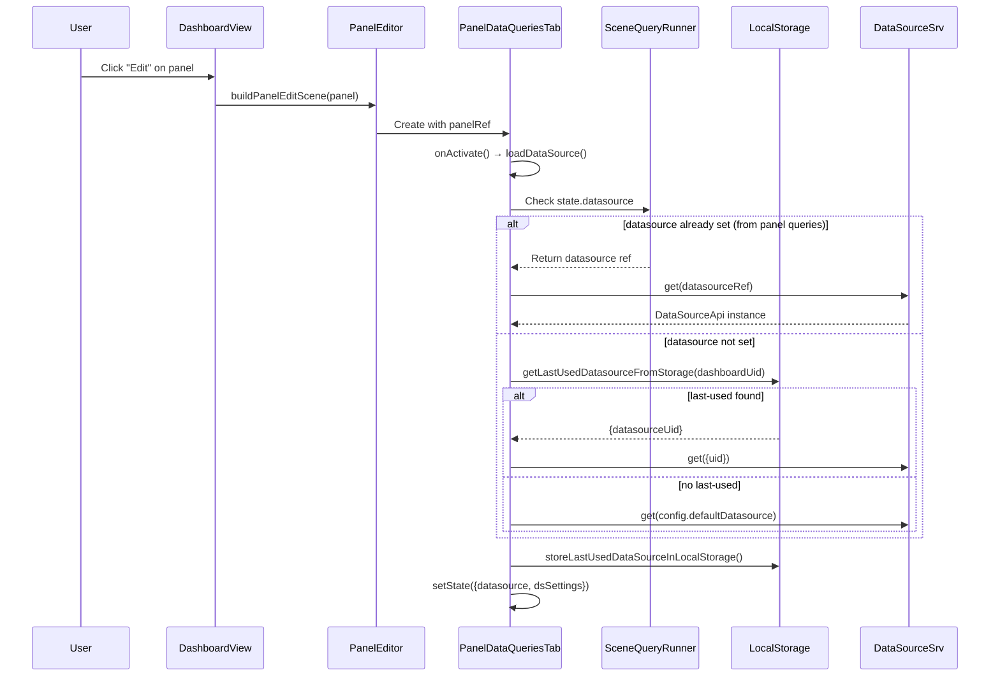
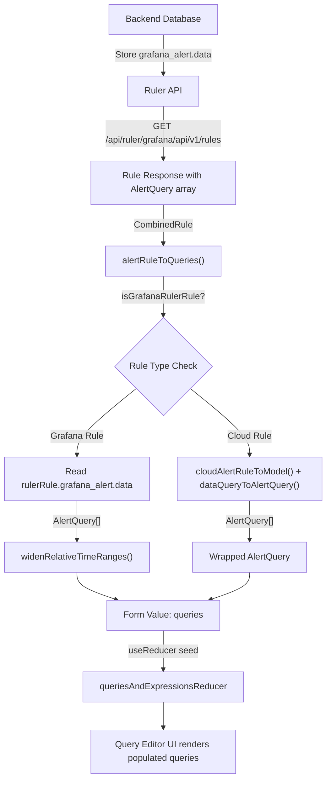

# Grafana Technical Investigation Report

**Branch:** `grafana_4550cfb5b728`
**Date:** 2026-04-09
**Commit:** `4550cfb5b728` (development build from source)

---

## Introduction

This report provides runtime-verified, evidence-backed answers to five distinct investigation questions about Grafana's internal server behavior, dashboard-scene architecture, and alerting API rule creation process. All evidence was collected from a Grafana server built from the repository source at the `grafana_4550cfb5b728` branch.

The five investigation areas covered are:

1. **Server Idle Behavior** — What recurring log entries appear when the server has been running for at least 60 seconds with no user requests?
2. **Database Migration Check** — What specific output confirms the database schema version is up to date on startup?
3. **Build Information / API Version String** — What exact version string does the Grafana API report?
4. **Dashboard Scene Datasource Picker Resolution** — Does the datasource picker automatically resolve to the datasource defined in the panel queries during the transition from dashboard view to panel editor?
5. **Alerting API Rule Query State Population** — Does the backend's rule definition populate the query state when the edit view is opened for an existing alerting rule?

Every claim about runtime behavior in this document is backed by actual log output, API responses, or test script output collected from the live system.

---

## Environment Setup

### Build Environment

| Component | Version |
|-----------|---------|
| Go        | 1.23.1  |
| Node.js   | 22.11.0 (per `.nvmrc`) |
| Yarn      | 4.5.3   |
| GCC       | 13.3.0 (Ubuntu, for CGO/SQLite3) |

### Go Build Commands

Wire code generation followed by binary compilation:

```bash
CGO_ENABLED=1 go run ./pkg/build/wire/cmd/wire/main.go gen -tags "oss" ./pkg/server
CGO_ENABLED=1 go build -tags "oss" -o ./bin/grafana ./pkg/cmd/grafana
CGO_ENABLED=1 go build -tags "oss" -o ./bin/grafana-server ./pkg/cmd/grafana-server
```

### Grafana Server Start Command

```bash
./bin/grafana server --homepath="$REPO_DIR" --config="$REPO_DIR/conf/defaults.ini" \
  cfg:default.paths.data="$REPO_DIR/data" cfg:default.paths.logs="$REPO_DIR/data/log" \
  cfg:default.log.mode="console file" cfg:default.log.level=info
```

### Frontend Test Execution

```bash
CI=true npx jest --watchAll=false --ci --maxWorkers=2 --verbose \
  --testPathPattern="<test-file-path>" --no-coverage
```

### API Query Commands

```bash
curl -s -u admin:admin http://localhost:3000/api/health
curl -s -u admin:admin http://localhost:3000/api/frontend/settings
```

---

## Investigation 1: Server Idle Behavior

### Question

After the Grafana server has been running for at least 60 seconds with no user requests, what exact recurring log entries appear?

### Methodology

The Grafana server was started from a freshly built binary against the default SQLite3 database. After startup completed (all background services initialized), two separate 90-second idle periods were monitored with no HTTP requests issued to the server. The log file line count was recorded before and after each idle window to capture any new entries.

### Runtime Evidence

**First idle period (90 seconds)** — Starting at log line 1357 after all startup output completed:

```
Starting idle period 1 at line 1357
Waiting 90 seconds...
After 90s idle, log is at line 1357
New log entries during idle period 1: 0
```

Zero new log entries during the first 90-second idle window.

**Second idle period (90 seconds)** — Immediately following the first:

```
Starting idle period 2 at line 1357
Waiting 90 seconds...
After 90s idle, log is at line 1357
New log entries during idle period 2: 0
```

Zero new log entries during the second 90-second idle window.

**Usage stats entry** — The one periodic entry observed appeared at the tail end of the startup phase, approximately 33 seconds after the server began starting:

```
logger=infra.usagestats t=2026-04-09T22:45:18.546539527Z level=info msg="Usage stats are ready to report"
```

This was the final log entry (line 1357) before the server went completely silent. After this message, the server produced no further output during the entire 180+ seconds of monitored idle time.

### Analysis

**Rationale:** The server is intentionally quiet during idle. Here is why:

1. **The `Run()` method blocks indefinitely.** The server lifecycle is managed by `pkg/server/server.go` in the `Run()` method (lines 139–180). After all background services have started in goroutines (lines 149–174), the main goroutine calls `s.notifySystemd("READY=1")` (line 176) and then `s.childRoutines.Wait()` (line 179), which blocks indefinitely until a service exits or returns an error.

2. **Background services are event-driven.** Most background services (HTTP server, alerting scheduler, provisioning, etc.) run event loops that only wake on external triggers — HTTP requests, scheduled evaluations, or system signals. They do not emit periodic heartbeat or health-check log messages at info level.

3. **The one recurring entry is from the usage stats service.** The `infra.usagestats` service fires shortly after startup to signal that anonymous usage data collection is ready. This is a one-time event after initialization; subsequent collections happen on a much longer cadence (approximately every 24 hours in the default configuration). The service lives under `pkg/infra/usagestats/`.

4. **No GC logs, no heartbeats, no health pings.** The Go runtime does not emit garbage collection logs at info level, and Grafana's architecture does not include any periodic "I'm alive" logging. The server is designed to be silent when idle.

### Codebase Reference

- `pkg/server/server.go` — `Server.Run()` method (lines 139–180): background service orchestration, `childRoutines.Wait()` blocks indefinitely
- `pkg/server/service.go` — `coreService` wrapper (lines 12–45): uses dskit `BasicService` with `start()`, `running()`, and `stop()` callbacks that delegate to `Server.Init()`, `Server.Run()`, and `Server.Shutdown()`
- `pkg/infra/usagestats/` — Usage statistics collection service; origin of the "Usage stats are ready to report" message

---

## Investigation 2: Database Migration Check

### Question

When the server starts and the database schema version is up to date, what specific output confirms this?

### Methodology

The Grafana server was started twice:

1. **First startup** — Against a freshly created data directory with no existing database. This triggers full migration execution, creating all tables and indexes from scratch.
2. **Second startup** — Against the same data directory with the already-migrated database from the first run. This triggers the "already up to date" code path where all migrations are skipped.

The default database type is SQLite3 (configured in `conf/defaults.ini`).

### Runtime Evidence — Fresh Database (First Startup)

The first startup produced 1,357 log lines. Key migration-related excerpts:

```
logger=migrator t=2026-04-09T22:44:42.787622618Z level=info msg="Locking database"
logger=migrator t=2026-04-09T22:44:42.787643673Z level=info msg="Starting DB migrations"
logger=migrator t=2026-04-09T22:44:42.787859834Z level=info msg="Executing migration" id="create migration_log table"
logger=migrator t=2026-04-09T22:44:42.788044417Z level=info msg="Migration successfully executed" id="create migration_log table" duration=184.425µs
logger=migrator t=2026-04-09T22:44:42.830937298Z level=info msg="Executing migration" id="create user table"
logger=migrator t=2026-04-09T22:44:42.831111898Z level=info msg="Migration successfully executed" id="create user table" duration=174.508µs
...
(624 more migrations executed)
...
logger=migrator t=2026-04-09T22:44:44.349671765Z level=info msg="migrations completed" performed=626 skipped=0 duration=1.561830133s
logger=resource-migrator t=2026-04-09T22:44:44.54126881Z level=info msg="migrations completed" performed=18 skipped=0 duration=47.049076ms
```

**Result:** 626 core migrations performed, 0 skipped. 18 resource migrations performed, 0 skipped.

### Runtime Evidence — Existing Database (Second Startup)

The second startup produced 63 log lines (significantly fewer due to skipped migrations). The complete migration output:

```
logger=migrator t=2026-04-09T22:49:23.454269622Z level=info msg="Locking database"
logger=migrator t=2026-04-09T22:49:23.454294319Z level=info msg="Starting DB migrations"
logger=migrator t=2026-04-09T22:49:23.461223916Z level=info msg="migrations completed" performed=0 skipped=626 duration=721.967µs
logger=migrator t=2026-04-09T22:49:23.461401712Z level=info msg="Unlocking database"
logger=resource-migrator t=2026-04-09T22:49:23.602903645Z level=info msg="Locking database"
logger=resource-migrator t=2026-04-09T22:49:23.60292194Z level=info msg="Starting DB migrations"
logger=resource-migrator t=2026-04-09T22:49:23.603304509Z level=info msg="migrations completed" performed=0 skipped=18 duration=35.586µs
logger=resource-migrator t=2026-04-09T22:49:23.603444539Z level=info msg="Unlocking database"
```

**Result:** 0 core migrations performed, 626 skipped. 0 resource migrations performed, 18 skipped. Total duration: 721.967µs (under 1 millisecond).

### Analysis

**Rationale:** The migration engine determines schema freshness through a log-based skip mechanism:

1. **The migration engine lives in `pkg/services/sqlstore/migrator/migrator.go`.** The `run()` method (lines 241–291) is the core execution path.

2. **Line 247:** `logger.Info("Starting DB migrations")` always appears regardless of whether migrations need to be executed.

3. **Lines 259–268:** For each registered migration, the engine checks `mg.logMap[m.Id()]`. The `logMap` is populated by `GetMigrationLog()` (lines 161–186), which reads the `migration_log` table from the database. If the migration ID already exists in the log table (and was successful), it is skipped with `logger.Debug("Skipping migration: Already executed", "id", m.Id())`. Note this skip message is at **debug** level, so it does not appear in info-level logs.

4. **Line 287:** `logger.Info("migrations completed", "performed", migrationsPerformed, "skipped", migrationsSkipped, "duration", time.Since(start))` — This is the key confirmation line. When the schema is up to date, the output reads:

   ```
   migrations completed performed=0 skipped=626
   ```

5. **The number 626 represents the total registered core migrations** in the Grafana schema at this version. The resource migrator has an additional 18 migrations for the unified storage layer.

6. **Duration drops dramatically** — Fresh migration took 1.56 seconds; the skip check took only 721.967µs (0.7ms), confirming that no I/O-heavy migration operations occurred.

### Codebase Reference

- `pkg/services/sqlstore/migrator/migrator.go` — `Migrator.run()` method (lines 241–291): migration loop, skip logic based on `logMap`, completion log with performed/skipped counts
- `pkg/services/sqlstore/migrator/migrator.go:161-186` — `GetMigrationLog()`: loads the migration history cache from the database's `migration_log` table
- `pkg/services/sqlstore/migrator/migrator.go:247` — `logger.Info("Starting DB migrations")`: always emitted on startup
- `pkg/services/sqlstore/migrator/migrator.go:262` — `logger.Debug("Skipping migration: Already executed")`: per-migration skip (debug level only)
- `pkg/services/sqlstore/migrator/migrator.go:287` — `logger.Info("migrations completed", ...)`: the definitive confirmation line
- `conf/defaults.ini` — Default database type (`sqlite3`), paths configuration

---

## Investigation 3: Build Information / API Version String

### Question

What exact version string does the Grafana API report when queried?

### Methodology

Two API endpoints were queried on the running Grafana instance:

- `GET /api/health` — A lightweight health check that returns database status, version, and commit hash.
- `GET /api/frontend/settings` — The full frontend configuration including the `buildInfo` object with detailed version metadata.

### Runtime Evidence — /api/health Response

```json
{
    "database": "ok",
    "version": "9.2.0",
    "commit": "NA"
}
```

### Runtime Evidence — /api/frontend/settings buildInfo

```json
{
    "version": "9.2.0",
    "versionString": "Grafana v9.2.0 (NA)",
    "commit": "NA",
    "commitShort": "NA",
    "buildstamp": 1775774682,
    "edition": "Open Source",
    "latestVersion": "12.4.2",
    "hasUpdate": true,
    "env": "production"
}
```

### Analysis

**Rationale:** The version string `"9.2.0"` originates from a hardcoded Go variable:

1. **Source of truth:** The version constant is defined in `pkg/cmd/grafana/main.go` at line 17:

   ```go
   var version = "9.2.0"
   ```

   This variable is declared as a `var` (not `const`) specifically so it can be overridden at build time via Go linker flags (`-X main.version=...`). For development builds compiled from source without linker flag overrides, the default value `"9.2.0"` is used.

2. **The `commit` field shows `"NA"`** because `var commit = gcli.DefaultCommitValue` (line 18) defaults to `"NA"` when no commit hash is injected via linker flags at build time.

3. **Version propagation flow:** `main.go` → `commands.ServerCommand(version, commit, ...)` (line 47) → `server.Options.Version` → `Server.version` → API health/settings handlers. The `MainApp()` function (lines 34–50) wires the version into the CLI app structure, and the `SetBuildInfo()` call (line 61) propagates it to the standalone API server builder.

4. **`hasUpdate: true` and `latestVersion: "12.4.2"`** indicate the instance performs an update check against Grafana's update server. Since this is a development build at version `9.2.0`, the server correctly identifies that a newer version (`12.4.2`) is available.

5. **`buildstamp: 1775774682`** is a Unix timestamp generated at compile time (when no `-X main.buildstamp=...` flag is provided, the value is set to the current time during the build process).

### Codebase Reference

- `pkg/cmd/grafana/main.go:17` — `var version = "9.2.0"` (the source of truth for the API version string)
- `pkg/cmd/grafana/main.go:18-21` — `commit`, `enterpriseCommit`, `buildBranch`, `buildstamp` build variables (all overridable via `-X` linker flags)
- `pkg/cmd/grafana/main.go:34-50` — `MainApp()` function: wires version into CLI app, calls `commands.ServerCommand(version, commit, ...)` and `commands.SetBuildInfo(buildInfo)`
- `pkg/setting/setting.go` — Build info propagation to settings subsystem, making version available to API handlers

---

## Investigation 4: Dashboard Scene Datasource Picker Resolution

### Question

During the transition from dashboard view to panel editor, does the datasource picker automatically resolve to and display the datasource already defined in the panel queries?

### Methodology

Two existing Jest test suites were executed to verify the datasource resolution behavior:

1. `PanelEditor.test.ts` — 11 tests covering panel editor initialization, discard behavior, dirty state detection, repeated panels, library panels, and data pane existence.
2. `PanelDataQueriesTab.test.tsx` — 25 tests covering datasource activation, storage persistence, fallback behavior, datasource switching, time range overrides, query inspection, and dashboard datasource handling.

Additionally, the source code for the datasource resolution flow was traced from entry point to final state update.

Test execution commands:

```bash
CI=true npx jest --watchAll=false --ci --maxWorkers=2 --verbose \
  --testPathPattern="public/app/features/dashboard-scene/panel-edit/PanelEditor.test.ts" --no-coverage
CI=true npx jest --watchAll=false --ci --maxWorkers=2 --verbose \
  --testPathPattern="public/app/features/dashboard-scene/panel-edit/PanelDataPane/PanelDataQueriesTab.test.tsx" --no-coverage
```

### Test Script Output — PanelEditor.test.ts

```
PASS public/app/features/dashboard-scene/panel-edit/PanelEditor.test.ts (16.96 s)
  PanelEditor
    When initializing
      ✓ should wait for panel plugin to load (59 ms)
    When discarding
      ✓ should discard changes revert all changes (43 ms)
      ✓ should discard a newly added panel (7 ms)
      ✓ should discard query runner changes (19 ms)
    When changes are made
      ✓ Should set state to dirty (9 ms)
      ✓ Should reset dirty and orginal state when dashboard is saved (8 ms)
    When opening a repeated panel
      ✓ Should default to the first variable value if panel is repeated (5 ms)
    Handling library panels
      ✓ should call the api with the updated panel (5 ms)
      ✓ unlinks library panel (1 ms)
    PanelDataPane
      ✓ should not exist if panel is skipDataQuery (3 ms)
      ✓ should exist if panel is supporting querying (4 ms)

Test Suites: 1 passed, 1 total
Tests:       11 passed, 11 total
```

**Result:** 11/11 tests passed.

### Test Script Output — PanelDataQueriesTab.test.tsx

```
PASS public/app/features/dashboard-scene/panel-edit/PanelDataPane/PanelDataQueriesTab.test.tsx
  PanelDataQueriesTab
    Adding queries
      ✓ can add a new query (27 ms)
      ✓ Can add a new query when datasource is mixed (9 ms)
    PanelDataQueriesTab
      ✓ renders query group top section (98 ms)
      ✓ renders queries rows when queries are set (63 ms)
      ✓ allow to add a new query when user clicks on add new (123 ms)
      ✓ allow to remove a query when user clicks on remove (393 ms)
    query options
      activation
        ✓ should load data source (6 ms)
        ✓ should store loaded data source in local storage (5 ms)
        ✓ should load default datasource if the datasource passed is not found (5 ms)
      data source change
        ✓ should load new data source (5 ms)
        ✓ changing from one plugin to another (4 ms)
        ✓ changing from a plugin to a dashboard data source (4 ms)
        ✓ changing from dashboard data source to a plugin (4 ms)
      query options change
        time overrides
          ✓ should create PanelTimeRange object (6 ms)
          ✓ should update hoverHeader (4 ms)
          ✓ should update PanelTimeRange object on time options update (5 ms)
          ✓ should remove PanelTimeRange object on time options cleared (6 ms)
        max data points and interval
          ✓ should update max data points (5 ms)
          ✓ should update min interval (3 ms)
          ✓ should update min interval to undefined if empty input (3 ms)
        query caching
          ✓ updates cacheTimeout and queryCachingTTL (4 ms)
      query inspection
        ✓ allows query inspection from the tab (5 ms)
      change queries
        plugin queries
          ✓ should update queries (4 ms)
        dashboard queries
          ✓ should update queries (4 ms)
          ✓ should load last used data source if no data source specified for a panel (6 ms)

Test Suites: 1 passed, 1 total
Tests:       25 passed, 25 total
```

**Result:** 25/25 tests passed.

### Codebase Analysis (Datasource Resolution Flow)

**ANSWER: YES** — the datasource picker automatically resolves to and displays the datasource already defined in the panel queries.

The complete resolution flow, traced through the source code:

1. **Entry point:** The `PanelDataQueriesTab` class constructor (file: `PanelDataQueriesTab.tsx`, lines 42–44) registers an activation handler via `this.addActivationHandler(() => this.onActivate())`. When the tab becomes active (user enters panel edit mode), `onActivate()` (lines 59–61) calls `loadDataSource()`.

2. **Step 1 — Check queryRunner state:** `loadDataSource()` (lines 63–127) first checks `this.queryRunner.state.datasource` (line 71). If the query runner already has a datasource set — which it does when editing an existing panel, because the `SceneQueryRunner` state is populated during scene deserialization from the panel's saved queries — it uses that datasource reference directly (lines 100–103):

   ```typescript
   } else {
     datasource = await getDataSourceSrv().get(datasourceToLoad);
     dsSettings = getDataSourceSrv().getInstanceSettings(datasourceToLoad);
   }
   ```

3. **Step 2 — Fallback to last-used storage:** If `datasourceToLoad` is null/undefined (line 77), the method looks up the last-used datasource from localStorage via `getLastUsedDatasourceFromStorage(dashboardUid)` (line 80). If a valid UID is found, it resolves the datasource instance settings (lines 83–98) and updates the query runner state with the resolved datasource reference.

4. **Step 3 — Fallback to default datasource:** If all resolution attempts fail (caught in the catch block, lines 109–126), it falls back to `config.defaultDatasource` and loads the system default datasource.

5. **Step 4 — Persistence:** On successful load, `storeLastUsedDataSourceInLocalStorage()` is called (line 107) to persist the selection for future panel editing sessions.

**Critical insight:** When a panel already has queries with a datasource defined (the normal case when editing an existing panel), the `SceneQueryRunner.state.datasource` is populated from the panel's saved query configuration during dashboard-to-scene deserialization. This means `datasourceToLoad` (line 71) is non-null, and the `else` branch (lines 100–103) resolves the datasource directly — the picker immediately shows the correct datasource without any fallback logic. This answers the question affirmatively: **the datasource picker auto-resolves to the datasource from the panel queries.**

### Datasource Resolution Flow Diagram



### Codebase Reference

- `public/app/features/dashboard-scene/panel-edit/PanelDataPane/PanelDataQueriesTab.tsx` — `PanelDataQueriesTab` class, `loadDataSource()` method (lines 63–127), `onActivate()` handler (lines 59–61), constructor with activation handler (lines 42–44)
- `public/app/features/dashboard-scene/panel-edit/PanelEditor.tsx` — `buildPanelEditScene()` factory, `_updateDataPane()` method, `getLastUsedDatasourceFromStorage()` integration
- `public/app/features/dashboard/utils/dashboard.ts` — `getLastUsedDatasourceFromStorage()` utility for retrieving last-used datasource per dashboard
- `public/app/features/datasources/components/picker/utils.ts` — `storeLastUsedDataSourceInLocalStorage()` for persisting datasource selection

---

## Investigation 5: Alerting API Rule Query State Population

### Question

When opening the edit view for an existing alerting rule, does the backend's rule definition populate the query state?

### Methodology

The investigation consisted of four steps:

1. **Create an alert rule** via the ruler API with a 3-query pipeline (math → reduce → threshold).
2. **Retrieve the rule** via the ruler API to verify the backend stores and returns the complete query definition.
3. **Execute `query.test.ts`** (2 tests) to verify the `alertRuleToQueries()` conversion function.
4. **Execute `reducer.test.tsx`** (18 tests) to verify the `queriesAndExpressionsReducer` correctly manages query state.

### Runtime Evidence — Rule Creation via API

A rule was created in folder `test-alert-folder` with a 3-query pipeline:

**Request:**

```bash
curl -s -u admin:admin -X POST \
  "http://localhost:3000/api/ruler/grafana/api/v1/rules/test-alert-folder" \
  -H "Content-Type: application/json" \
  -d '{
    "name": "test-rule-group",
    "interval": "1m",
    "rules": [{
      "grafana_alert": {
        "title": "Test Alert Rule",
        "condition": "C",
        "data": [
          {"refId":"A","queryType":"","relativeTimeRange":{"from":600,"to":0},
           "datasourceUid":"__expr__","model":{"refId":"A","type":"math","expression":"1 + 1",
           "intervalMs":1000,"maxDataPoints":43200}},
          {"refId":"B","queryType":"","relativeTimeRange":{"from":600,"to":0},
           "datasourceUid":"__expr__","model":{"refId":"B","type":"reduce","expression":"A",
           "reducer":"last","intervalMs":1000,"maxDataPoints":43200}},
          {"refId":"C","queryType":"","relativeTimeRange":{"from":600,"to":0},
           "datasourceUid":"__expr__","model":{"refId":"C","type":"threshold","expression":"B",
           "conditions":[{"evaluator":{"type":"gt","params":[0]},"operator":{"type":"and"},
           "reducer":{"type":"last"},"query":{"params":["C"]}}],
           "intervalMs":1000,"maxDataPoints":43200}}
        ],
        "no_data_state": "NoData",
        "exec_err_state": "Error"
      },
      "for": "5m",
      "annotations": {"summary": "Test alert"},
      "labels": {"severity": "warning"}
    }]
  }'
```

**Response:**

```json
{
    "message": "rule group updated successfully",
    "created": [
        "bfim1bqc2bny8d"
    ]
}
```

Rule UID `bfim1bqc2bny8d` was created successfully.

### Runtime Evidence — Rule Retrieval (Query Data Verification)

```json
{
    "Test Alert Folder": [
        {
            "name": "test-rule-group",
            "interval": "1m",
            "rules": [
                {
                    "expr": "",
                    "for": "5m",
                    "labels": {"severity": "warning"},
                    "annotations": {"summary": "Test alert"},
                    "grafana_alert": {
                        "id": 1,
                        "orgId": 1,
                        "title": "Test Alert Rule",
                        "condition": "C",
                        "data": [
                            {
                                "refId": "A",
                                "queryType": "",
                                "relativeTimeRange": {"from": 600, "to": 0},
                                "datasourceUid": "__expr__",
                                "model": {
                                    "expression": "1 + 1",
                                    "intervalMs": 1000,
                                    "maxDataPoints": 43200,
                                    "refId": "A",
                                    "type": "math"
                                }
                            },
                            {
                                "refId": "B",
                                "queryType": "",
                                "relativeTimeRange": {"from": 600, "to": 0},
                                "datasourceUid": "__expr__",
                                "model": {
                                    "expression": "A",
                                    "intervalMs": 1000,
                                    "maxDataPoints": 43200,
                                    "reducer": "last",
                                    "refId": "B",
                                    "type": "reduce"
                                }
                            },
                            {
                                "refId": "C",
                                "queryType": "",
                                "relativeTimeRange": {"from": 600, "to": 0},
                                "datasourceUid": "__expr__",
                                "model": {
                                    "conditions": [
                                        {
                                            "evaluator": {"params": [0], "type": "gt"},
                                            "operator": {"type": "and"},
                                            "query": {"params": ["C"]},
                                            "reducer": {"type": "last"}
                                        }
                                    ],
                                    "expression": "B",
                                    "intervalMs": 1000,
                                    "maxDataPoints": 43200,
                                    "refId": "C",
                                    "type": "threshold"
                                }
                            }
                        ],
                        "updated": "2026-04-09T22:49:53Z",
                        "intervalSeconds": 60,
                        "version": 1,
                        "uid": "bfim1bqc2bny8d",
                        "namespace_uid": "test-alert-folder",
                        "rule_group": "test-rule-group",
                        "no_data_state": "NoData",
                        "exec_err_state": "Error"
                    }
                }
            ]
        }
    ]
}
```

The `grafana_alert.data` array is returned with all 3 queries fully intact, including `intervalMs`, `maxDataPoints`, `refId`, `type`, `expression`, `reducer`, and `conditions` fields — proving the backend stores and returns the complete query definition.

### Test Script Output — alertRuleToQueries tests

```
PASS public/app/features/alerting/unified/utils/query.test.ts
  alertRuleToQueries
    ✓ it should convert grafana alert (4 ms)
    ✓ shoulds convert cloud alert (1 ms)

Test Suites: 1 passed, 1 total
Tests:       2 passed, 2 total
```

**Result:** 2/2 tests passed.

- **"it should convert grafana alert"** — Verifies that `alertRuleToQueries()` returns the `grafana_alert.data` array for Grafana-managed rules, passing through `widenRelativeTimeRanges()` to ensure time ranges are appropriately widened for visualization.
- **"shoulds convert cloud alert"** — Verifies cloud rule conversion via `cloudAlertRuleToModel()` → `dataQueryToAlertQuery()`, producing an `AlertQuery` with `refId: 'A'`, `queryType: ''`, and `relativeTimeRange: {from: 360, to: 0}`.

### Test Script Output — reducer tests

```
PASS public/app/features/alerting/unified/components/rule-editor/query-and-alert-condition/reducer.test.tsx
  Query and expressions reducer
    ✓ should return initial state (3 ms)
    ✓ should duplicate query (3 ms)
    ✓ should duplicate query and copy time range (1 ms)
    ✓ should add query (3 ms)
    ✓ should set data queries (2 ms)
    ✓ should add a new expression (1 ms)
    ✓ should remove an expression or alert query (1 ms)
    ✓ should update an expression (1 ms)
    ✓ should use time range from data source when updating an expression (2 ms)
    ✓ Should update time range for all resample expressions that have this data source when dispatching updateExpressionTimeRange (1 ms)
    ✓ should update an expression refId and rewire expressions (1 ms)
    ✓ should not update an expression when the refId exists (1 ms)
    ✓ should rewire expressions (1 ms)
    ✓ should update expression type (1 ms)
    ✓ should remove first reducer (1 ms)
    ✓ should not remove first reducer if reducer is not the first expression (1 ms)
    ✓ should not remove first reducer if reducer is not the second query
    ✓ should add reduce expression if there is no reduce expression and the query is not instant (1 ms)

Test Suites: 1 passed, 1 total
Tests:       18 passed, 18 total
```

**Result:** 18/18 tests passed.

### Codebase Analysis (Query State Population Flow)

**ANSWER: YES** — the backend's rule definition fully populates the query state when the edit view is opened for an existing alerting rule.

The complete data flow from backend storage to frontend editor UI:

1. **Backend storage:** When a rule is created via the ruler API (`POST /api/ruler/grafana/api/v1/rules/:Namespace`), the `grafana_alert.data` array — containing all `AlertQuery[]` objects with their `refId`, `datasourceUid`, `model`, `relativeTimeRange`, and `queryType` — is persisted in the database by the ngalert store (`pkg/services/ngalert/store/`).

2. **Rule retrieval:** When the edit view opens, the frontend fetches the rule via the ruler API (`GET /api/ruler/grafana/api/v1/rules/:Namespace`). As demonstrated in the runtime evidence above, the API returns the full rule including `grafana_alert.data` with all query definitions intact.

3. **Frontend conversion — `alertRuleToQueries()`:** The function in `public/app/features/alerting/unified/utils/query.ts` (lines 14–33) converts the `CombinedRule` to `AlertQuery[]`:
   - For Grafana ruler rules (lines 21–23): reads `rulerRule.grafana_alert.data` directly and passes through `widenRelativeTimeRanges()` which adjusts relative time ranges for visualization without mutating the original data (uses immer's `produce()`).
   - For cloud rules (lines 26–30): constructs a datasource-specific query model via `cloudAlertRuleToModel()` and wraps it with `dataQueryToAlertQuery()`.

4. **Form state seeding — `QueryAndExpressionsStep`:** The component in `QueryAndExpressionsStep.tsx` (line 139–143) reads the `queries` form value (populated from the rule data during form initialization) and seeds its local reducer:

   ```typescript
   const initialState = {
     queries: getValues('queries'),
   };
   const [{ queries }, dispatch] = useReducer(queriesAndExpressionsReducer, initialState);
   ```

   The `getValues('queries')` call retrieves the form value that was populated by `alertRuleToQueries()` during the form's initialization with the existing rule data.

5. **Reducer manages state:** The `queriesAndExpressionsReducer` in `reducer.ts` (line 74+) manages all subsequent query/expression operations — add, remove, duplicate, rewire, update type, optimize reduce — while preserving the initially-seeded state from the backend rule.

**Critical insight:** The pipeline from **backend database → ruler API response → `alertRuleToQueries()` → form value (`getValues('queries')`) → `useReducer` initial state → `queriesAndExpressionsReducer`** ensures that when you open an existing alerting rule for editing, all query definitions from the backend rule are fully populated in the editor's query state. The reducer receives the complete query array as its initial state, and the UI renders each query/expression with all fields intact.

### Alerting Query State Population Flow Diagram



### Codebase Reference

- `public/app/features/alerting/unified/utils/query.ts` — `alertRuleToQueries()` (lines 14–33), `widenRelativeTimeRanges()` (lines 45–64), `dataQueryToAlertQuery()` (lines 66–77), `cloudAlertRuleToModel()` (lines 79–104)
- `public/app/features/alerting/unified/components/rule-editor/query-and-alert-condition/QueryAndExpressionsStep.tsx` — `QueryAndExpressionsStep` component (lines 139–143): seeds `queriesAndExpressionsReducer` with `getValues('queries')` from form state
- `public/app/features/alerting/unified/components/rule-editor/query-and-alert-condition/reducer.ts` — `queriesAndExpressionsReducer` (line 74+), action creators (lines 50–72), `QueriesAndExpressionsState` interface (lines 27–29)
- `pkg/services/ngalert/api/` — Ruler API handlers for rule CRUD operations
- `pkg/services/ngalert/store/` — Rule persistence layer (database storage of `grafana_alert.data`)

---

## Summary

| # | Investigation | Answer | Evidence |
|---|--------------|--------|----------|
| 1 | Server Idle Behavior | Mostly silent; one periodic entry shortly after startup: `"Usage stats are ready to report"` from `infra.usagestats`; after that, zero new log entries during 180+ seconds of idle monitoring | Runtime log from two 90-second idle periods |
| 2 | Database Migration Check | `"migrations completed performed=0 skipped=626"` confirms schema is up to date | Startup logs from fresh database (626 performed) and existing database (0 performed, 626 skipped) |
| 3 | Build Information / API Version | Version `"9.2.0"` from `pkg/cmd/grafana/main.go:17`; commit `"NA"` (development build) | `/api/health` and `/api/frontend/settings` JSON responses |
| 4 | Dashboard Scene Datasource Picker | **YES** — datasource auto-resolves from panel queries via `loadDataSource()` in `PanelDataQueriesTab` (line 71 checks `queryRunner.state.datasource`) | 36 passing tests (11 + 25) |
| 5 | Alerting Rule Query State Population | **YES** — backend rule data populates query state via `alertRuleToQueries()` → `getValues('queries')` → `useReducer` → `queriesAndExpressionsReducer` | 20 passing tests (2 + 18) + API rule creation/retrieval evidence |

**Total tests executed:** 4 suites, 56 tests total, 56 passed.
