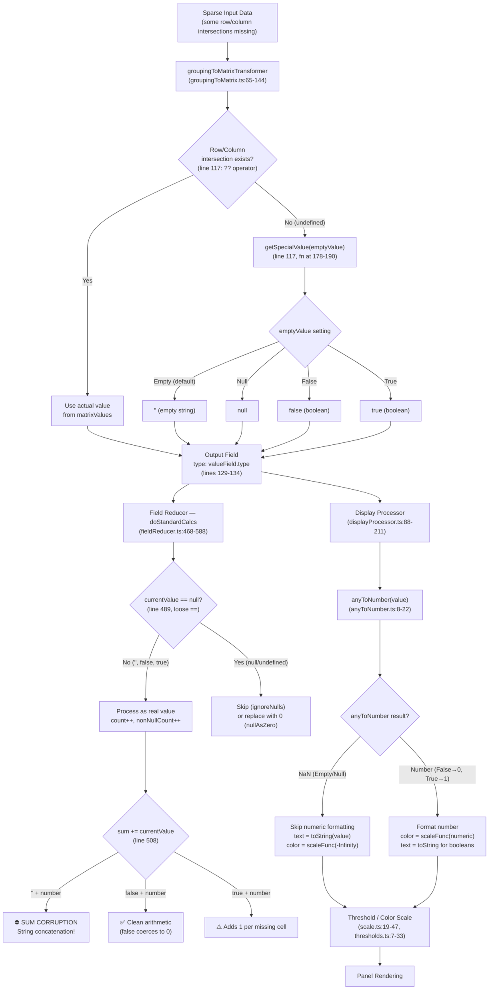
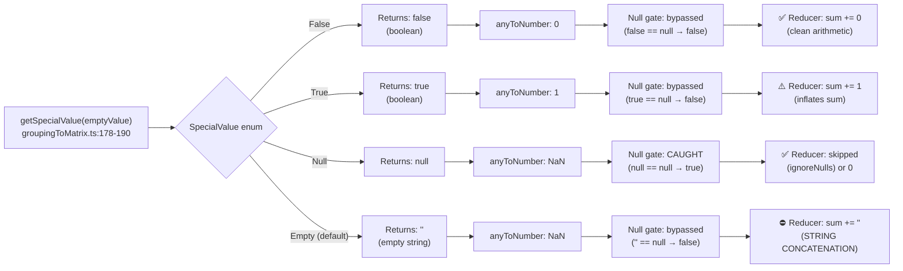

# Grafana Grouping to Matrix: Sparse Data Fill-Value Semantics — An Investigative Analysis

## Table of Contents

- [1. Overview and Question Framing](#1-overview-and-question-framing)
- [2. The Transformation: How the Matrix Is Built](#2-the-transformation-how-the-matrix-is-built)
  - [2.1 Input Requirements and Field Resolution](#21-input-requirements-and-field-resolution)
  - [2.2 Matrix Construction Algorithm](#22-matrix-construction-algorithm)
  - [2.3 The getSpecialValue Fill Logic](#23-the-getspecialvalue-fill-logic)
- [3. SpecialValue Enum: Runtime Values](#3-specialvalue-enum-runtime-values)
- [4. Tracing a Concrete Sparse Dataset](#4-tracing-a-concrete-sparse-dataset)
  - [4.1 Input Data](#41-input-data)
  - [4.2 Output with SpecialValue.Empty (default)](#42-output-with-specialvalueempty-default)
  - [4.3 Output with SpecialValue.Null](#43-output-with-specialvaluenull)
  - [4.4 Output with SpecialValue.False](#44-output-with-specialvaluefalse)
  - [4.5 Output with SpecialValue.True](#45-output-with-specialvaluetrue)
- [5. Downstream: Display Processing](#5-downstream-display-processing)
  - [5.1 anyToNumber Coercion](#51-anytonumber-coercion)
  - [5.2 getDisplayProcessor Flow](#52-getdisplayprocessor-flow)
  - [5.3 Display Value Comparison Table](#53-display-value-comparison-table)
- [6. Downstream: Field Reducer (Calculations)](#6-downstream-field-reducer-calculations)
  - [6.1 The Null Gate (line 489)](#61-the-null-gate-line-489)
  - [6.2 Sum Corruption with Empty Strings](#62-sum-corruption-with-empty-strings)
  - [6.3 Clean Handling with Null](#63-clean-handling-with-null)
  - [6.4 Calculation Comparison Table](#64-calculation-comparison-table)
- [7. Downstream: Threshold and Color Scale](#7-downstream-threshold-and-color-scale)
  - [7.1 Scale Calculator Behavior for NaN](#71-scale-calculator-behavior-for-nan)
  - [7.2 Color Assignment for Each Fill Type](#72-color-assignment-for-each-fill-type)
- [8. The Semantic Gap: "Missing Means Zero"](#8-the-semantic-gap-missing-means-zero)
  - [8.1 Why No SpecialValue Produces Zero](#81-why-no-specialvalue-produces-zero)
  - [8.2 SpecialValue.False: The Closest Approximation](#82-specialvaluefalse-the-closest-approximation)
  - [8.3 Practical Recommendations](#83-practical-recommendations)
- [9. Mermaid Diagrams](#9-mermaid-diagrams)
  - [9.1 Data Pipeline Flowchart](#91-data-pipeline-flowchart)
  - [9.2 getSpecialValue Decision Tree](#92-getspecialvalue-decision-tree)
- [10. Source Citations](#10-source-citations)

---

## 1. Overview and Question Framing

### The Core Question

When a user applies the **"Grouping to Matrix"** transformation to sparse data — data where not every row has a value for every column — **what value does the transformation emit for the missing row/column intersections?** And how does that fill value propagate through Grafana's downstream visualization pipeline: display formatting, field reducers, threshold/color-scale evaluation, and panel rendering?

### The Semantic Mismatch

Users frequently interpret "missing" as "zero." A dashboard author building a heatmap or table from sparse time series data may assume that absent intersections are numerically equivalent to `0`. This assumption is incorrect. **No `SpecialValue` option in the Grouping to Matrix transformation actually emits the JavaScript number `0`.** The four available options — `Empty`, `Null`, `True`, and `False` — each emit a distinct JavaScript primitive (`''`, `null`, `true`, `false`), and each of these primitives has radically different behavior when processed by downstream Grafana systems.

### What the Existing Docs Say

The existing Grafana documentation for this transformation, located at `docs/sources/panels-visualizations/query-transform-data/transform-data/index.md` (lines 653–675), describes the Column/Row/Cell Value workflow and presents a before/after table example. It mentions the four empty-cell options in a single sentence:

> "For the rest of the cells, you can select which value to display between: **Null**, **True**, **False**, or **Empty**."

The existing documentation does **not** cover:

- What runtime JavaScript value each option produces
- How those values interact with `FieldType.number` arrays
- The type-coercion behavior when empty strings appear in numeric field arrays
- Any guidance on which option to choose for different downstream use cases

> **Source:** `docs/sources/panels-visualizations/query-transform-data/transform-data/index.md:653-675`

### Methodology

This document uses a **code-as-truth** methodology. Every behavioral claim is traced to a specific source file and line number in the Grafana repository. No assumptions are made. No "typically" or "probably" statements appear. All conclusions are derivable by reading the cited code.

---

## 2. The Transformation: How the Matrix Is Built

### 2.1 Input Requirements and Field Resolution

The `groupingToMatrixTransformer` is defined in `packages/grafana-data/src/transformations/transformers/groupingToMatrix.ts`. It exports the `GroupingToMatrixTransformerOptions` interface (lines 16–21) which accepts four optional fields:

```typescript
export interface GroupingToMatrixTransformerOptions {
  columnField?: string;
  rowField?: string;
  valueField?: string;
  emptyValue?: SpecialValue;
}
```

> **Source:** `packages/grafana-data/src/transformations/transformers/groupingToMatrix.ts:16-21`

**Default values** are defined at lines 23–26:

```typescript
const DEFAULT_COLUMN_FIELD = 'Time';
const DEFAULT_ROW_FIELD = 'Time';
const DEFAULT_VALUE_FIELD = 'Value';
const DEFAULT_EMPTY_VALUE = SpecialValue.Empty;
```

> **Source:** `packages/grafana-data/src/transformations/transformers/groupingToMatrix.ts:23-26`

**Thinking/rationale:** The default `emptyValue` is `SpecialValue.Empty`, which maps to the JavaScript empty string `''`. This is the most dangerous default because, as demonstrated in Section 6, it silently corrupts numeric aggregations via JavaScript type coercion.

The transformer requires exactly one input DataFrame. At line 74, the code checks `data.length !== 1` and returns the data unmodified if the check fails:

```typescript
if (data.length !== 1) {
  return data;
}
```

> **Source:** `packages/grafana-data/src/transformations/transformers/groupingToMatrix.ts:74`

**Field resolution** uses the `findKeyField` function (lines 157–176). This function iterates over `frame.fields` and matches fields by display name. If the `dataplaneFrontendFallback` feature toggle is enabled, it uses `FieldMatcherID.byName` instead. The function returns `null` if no match is found, and the transformer returns the input data unmodified if any of the three required fields (column, row, value) cannot be resolved (line 84).

> **Source:** `packages/grafana-data/src/transformations/transformers/groupingToMatrix.ts:157-176`

### 2.2 Matrix Construction Algorithm

The matrix is built in two phases within the `operator` function (lines 65–144).

**Phase A — Populate the matrix lookup object (lines 91–103):**

```typescript
const matrixValues: { [key: string]: { [key: string]: unknown } } = {};

for (let index = 0; index < valueField.values.length; index++) {
  const columnName = keyColumnField.values[index];
  const rowName = keyRowField.values[index];
  const value = valueField.values[index];

  if (!matrixValues[columnName]) {
    matrixValues[columnName] = {};
  }

  matrixValues[columnName][rowName] = value;
}
```

This creates a nested object where `matrixValues[columnName][rowName]` stores the cell value. **Only intersections present in the input data get populated.** Absent combinations produce `undefined` when accessed, because accessing a non-existent key in a JavaScript object returns `undefined`.

> **Source:** `packages/grafana-data/src/transformations/transformers/groupingToMatrix.ts:91-103`

**Phase B — Construct output fields (lines 105–135):**

The first output field is the row-label field (`rowColumnField`), typed as `FieldType.string`, whose values are the unique row values:

```typescript
const fields: Field[] = [
  {
    name: rowColumnField,
    values: rowValues,
    type: FieldType.string,
    config: {},
  },
];
```

For each unique column value, a new field is created. **The critical fill-value logic is at line 117:**

```typescript
const value = matrixValues[columnName][rowName] ?? getSpecialValue(emptyValue);
```

> **Source:** `packages/grafana-data/src/transformations/transformers/groupingToMatrix.ts:114-117`

**Thinking/rationale:** The nullish coalescing operator (`??`) evaluates to the right-hand operand when the left-hand operand is `null` or `undefined`. Since accessing a non-existent key in `matrixValues[columnName]` returns `undefined`, every missing row/column intersection triggers `getSpecialValue(emptyValue)`.

**Note:** The `??` operator also triggers for source data values that are explicitly `null`, not only for missing intersections (which produce `undefined`). If `valueField.values[index]` is `null` for a row/column pair that does exist in the input, `matrixValues[columnName][rowName]` will be `null`, and `null ?? getSpecialValue(emptyValue)` will replace that `null` with the fill value. This means intentional null data points in the source will be overwritten by the fill value. For `SpecialValue.Null`, this is harmless (replacing `null` with `null`), but for `SpecialValue.Empty`, `SpecialValue.False`, or `SpecialValue.True`, intentional nulls in the source data will be silently replaced with `''`, `false`, or `true` respectively, potentially masking real data.

Each output column field inherits the type and config of the value field (lines 129–134):

```typescript
fields.push({
  name: columnName.toString(),
  values: values,
  config: valueField.config,
  type: valueField.type,
});
```

> **Source:** `packages/grafana-data/src/transformations/transformers/groupingToMatrix.ts:129-134`

**This creates a critical type inconsistency:** If the value field is `FieldType.number`, the output field is typed as `FieldType.number` — but its values array may contain strings (`''`), booleans (`true`/`false`), or `null`, depending on the `emptyValue` setting. The field metadata says "this is a number field" while the actual data says otherwise.

### 2.3 The getSpecialValue Fill Logic

The `getSpecialValue` function (lines 178–190) is a switch statement that maps the `SpecialValue` enum to JavaScript runtime primitives:

```typescript
function getSpecialValue(specialValue: SpecialValue) {
  switch (specialValue) {
    case SpecialValue.False:
      return false;
    case SpecialValue.True:
      return true;
    case SpecialValue.Null:
      return null;
    case SpecialValue.Empty:
    default:
      return '';
  }
}
```

> **Source:** `packages/grafana-data/src/transformations/transformers/groupingToMatrix.ts:178-190`

**Key insight:** The function returns JavaScript runtime primitives, **NOT** the enum's string labels. `SpecialValue.False` has the enum string value `'false'`, but `getSpecialValue` returns the boolean `false`. `SpecialValue.Empty` has the enum string value `'empty'`, but `getSpecialValue` returns the empty string `''`. This distinction is critical because all downstream Grafana code operates on the runtime values, not the enum strings.

---

## 3. SpecialValue Enum: Runtime Values

The `SpecialValue` enum is defined in `packages/grafana-data/src/types/transformations.ts` at lines 113–118:

```typescript
export enum SpecialValue {
  True = 'true',
  False = 'false',
  Null = 'null',
  Empty = 'empty',
}
```

> **Source:** `packages/grafana-data/src/types/transformations.ts:113-118`

The editor UI presents these as four dropdown options (lines 61–66 of the editor component):

```typescript
const specialValueOptions: Array<SelectableValue<SpecialValue>> = [
  { label: 'Null', value: SpecialValue.Null, description: 'Null value' },
  { label: 'True', value: SpecialValue.True, description: 'Boolean true value' },
  { label: 'False', value: SpecialValue.False, description: 'Boolean false value' },
  { label: 'Empty', value: SpecialValue.Empty, description: 'Empty string' },
];
```

> **Source:** `public/app/features/transformers/editors/GroupingToMatrixTransformerEditor.tsx:61-66`

### Complete Runtime Mapping Table

| SpecialValue Enum | Enum String Value | `getSpecialValue()` Runtime Return | `typeof` Result | Inserted into `FieldType.number` Array? |
|---|---|---|---|---|
| `SpecialValue.True` | `'true'` | `true` | `'boolean'` | Yes — creates mixed `(number\|boolean)[]` array |
| `SpecialValue.False` | `'false'` | `false` | `'boolean'` | Yes — creates mixed `(number\|boolean)[]` array |
| `SpecialValue.Null` | `'null'` | `null` | `'object'` | Yes — creates `(number\|null)[]` array |
| `SpecialValue.Empty` | `'empty'` | `''` (empty string) | `'string'` | Yes — creates mixed `(number\|string)[]` array |

**Thinking/rationale:** The enum values (`'true'`, `'false'`, `'null'`, `'empty'`) are TypeScript discriminator strings used for serialization to JSON (e.g., in dashboard JSON models) and option selection in the UI. The `getSpecialValue` function converts these discriminators into JavaScript runtime primitives. This two-layer design means the serialized form and the runtime form are different types, which is why understanding the runtime mapping is essential for predicting downstream behavior.

---

## 4. Tracing a Concrete Sparse Dataset

### 4.1 Input Data

The following sparse dataset is modeled after the test at lines 72–79 of `packages/grafana-data/src/transformations/transformers/groupingToMatrix.test.ts`:

```
Column: ['C1', 'C1', 'C2']    (FieldType.string)
Row:    ['R1', 'R2', 'R1']    (FieldType.string)
Temp:   [10,   20,   30 ]     (FieldType.number)
```

As a table:

| Column | Row | Temp |
|---|---|---|
| C1 | R1 | 10 |
| C1 | R2 | 20 |
| C2 | R1 | 30 |

This data is **sparse**: the intersection C2×R2 has no value in the input. There are 2 unique columns (C1, C2) and 2 unique rows (R1, R2), giving a 2×2 matrix with one cell (C2×R2) absent.

> **Source:** `packages/grafana-data/src/transformations/transformers/groupingToMatrix.test.ts:72-79`

### 4.2 Output with SpecialValue.Empty (default)

When `emptyValue` is not set (or set to `SpecialValue.Empty`), the output matrix is:

| Row\Column | C1 | C2 |
|---|---|---|
| R1 | `10` | `30` |
| R2 | `20` | `''` |

The output fields are:

| Field Name | Type | Values |
|---|---|---|
| `Row\Column` | `FieldType.string` | `['R1', 'R2']` |
| `C1` | `FieldType.number` | `[10, 20]` |
| `C2` | `FieldType.number` | `[30, '']` |

**The field `C2` is declared as `FieldType.number` but its values array `[30, '']` is a mixed `(number|string)[]` array.** This type inconsistency is the root cause of downstream corruption.

The test file confirms this behavior at lines 96–101, where the C2 field in the default-fill test has `values: [5, '']`:

```typescript
{
  name: 'C2',
  type: FieldType.number,
  values: [5, ''],
  config: {},
},
```

> **Source:** `packages/grafana-data/src/transformations/transformers/groupingToMatrix.test.ts:96-101`

### 4.3 Output with SpecialValue.Null

When `emptyValue` is set to `SpecialValue.Null`, the output matrix is:

| Row\Column | C1 | C2 |
|---|---|---|
| R1 | `10` | `30` |
| R2 | `20` | `null` |

The output fields are:

| Field Name | Type | Values |
|---|---|---|
| `Row\Column` | `FieldType.string` | `['R1', 'R2']` |
| `C1` | `FieldType.number` | `[10, 20]` |
| `C2` | `FieldType.number` | `[30, null]` |

**The field `C2` has `type: FieldType.number` and values `[30, null]` — a standard nullable numeric array.** This is the cleanest representation because `null` is the conventional JavaScript sentinel for "absent value" and is specifically handled by downstream Grafana code.

The test file confirms this at lines 134–138:

```typescript
{
  name: '1000',
  type: FieldType.number,
  values: [1, null],
  config: {},
},
```

> **Source:** `packages/grafana-data/src/transformations/transformers/groupingToMatrix.test.ts:108-149`

### 4.4 Output with SpecialValue.False

| Row\Column | C1 | C2 |
|---|---|---|
| R1 | `10` | `30` |
| R2 | `20` | `false` |

The output fields are:

| Field Name | Type | Values |
|---|---|---|
| `Row\Column` | `FieldType.string` | `['R1', 'R2']` |
| `C1` | `FieldType.number` | `[10, 20]` |
| `C2` | `FieldType.number` | `[30, false]` |

**The field `C2` is declared as `FieldType.number` but values are `[30, false]` — a mixed `(number|boolean)[]` array.** While `false` coerces cleanly to `0` in JavaScript arithmetic, the field is still type-inconsistent.

### 4.5 Output with SpecialValue.True

| Row\Column | C1 | C2 |
|---|---|---|
| R1 | `10` | `30` |
| R2 | `20` | `true` |

The output fields are:

| Field Name | Type | Values |
|---|---|---|
| `Row\Column` | `FieldType.string` | `['R1', 'R2']` |
| `C1` | `FieldType.number` | `[10, 20]` |
| `C2` | `FieldType.number` | `[30, true]` |

**The field `C2` is declared as `FieldType.number` but values are `[30, true]` — a mixed `(number|boolean)[]` array.** The boolean `true` coerces to `1` in arithmetic, which adds a phantom value of 1 for every missing cell.

---

## 5. Downstream: Display Processing

### 5.1 anyToNumber Coercion

The `anyToNumber` function (`packages/grafana-data/src/utils/anyToNumber.ts:8-22`) converts any value to a number, returning `NaN` for values that have no meaningful numeric representation:

```typescript
export function anyToNumber(value: unknown): number {
  if (typeof value === 'number') {
    return value;
  }

  if (value === '' || value === null || value === undefined || Array.isArray(value)) {
    return NaN; // lodash calls them 0
  }

  if (typeof value === 'boolean') {
    return value ? 1 : 0;
  }

  return toNumber(value);
}
```

> **Source:** `packages/grafana-data/src/utils/anyToNumber.ts:8-22`

**Thinking/rationale:** The function explicitly catches empty strings, `null`, and `undefined` at line 13 and returns `NaN` before lodash's `toNumber` can process them. The inline comment `// lodash calls them 0` documents why: lodash's `toNumber('')` returns `0` and `toNumber(null)` returns `0`, which would silently convert "absent" into "zero." The Grafana team deliberately overrides this to preserve the distinction between "absent" and "zero." Booleans are handled at lines 17–18 via a ternary: `true` maps to `1`, `false` maps to `0`.

### Fill-Value Coercion Table

| Fill Value | `typeof` | `anyToNumber()` Result | Reasoning (cite line) |
|---|---|---|---|
| `''` (Empty) | `'string'` | `NaN` | Line 13: `value === ''` is true → returns `NaN` |
| `null` (Null) | `'object'` | `NaN` | Line 13: `value === null` is true → returns `NaN` |
| `false` (False) | `'boolean'` | `0` | Lines 17–18: `typeof value === 'boolean'` is true → `false ? 1 : 0` → returns `0` |
| `true` (True) | `'boolean'` | `1` | Lines 17–18: `typeof value === 'boolean'` is true → `true ? 1 : 0` → returns `1` |

> **Source:** `packages/grafana-data/src/utils/anyToNumber.ts:13-14` (empty/null), `packages/grafana-data/src/utils/anyToNumber.ts:17-18` (booleans)

### 5.2 getDisplayProcessor Flow

The `getDisplayProcessor` function (`packages/grafana-data/src/field/displayProcessor.ts:42-211`) returns a closure that converts raw field values into `DisplayValue` objects containing `text`, `numeric`, `color`, and `percent` properties.

For a field with `type: FieldType.number`, no special unit, and no value mappings, the flow is:

**Step 1 — Numeric conversion (line 96):**

```typescript
let numeric = isStringUnit ? NaN : anyToNumber(value);
```

For a number field, `isStringUnit` is `false`, so `anyToNumber(value)` is called.

> **Source:** `packages/grafana-data/src/field/displayProcessor.ts:96`

**Step 2 — Numeric formatting block (lines 144–171):**

```typescript
if (!Number.isNaN(numeric)) {
  if (text == null && !isBoolean(value)) {
    // ... format numeric value into text ...
  }

  if (color == null) {
    const scaleResult = scaleFunc(numeric);
    color = scaleResult.color;
    percent = scaleResult.percent;
  }
}
```

This block executes only when `numeric` is a valid number (not NaN). Inside, text formatting is skipped when `isBoolean(value)` is `true` (line 145), because boolean values should display as `'true'`/`'false'`, not as formatted numbers.

> **Source:** `packages/grafana-data/src/field/displayProcessor.ts:144-171`

**Step 3 — Text fallback (lines 177–186):**

```typescript
if (text == null) {
  text = toString(value);
  if (!text) {
    if (config.noValue) {
      text = config.noValue;
    } else {
      text = ''; // No data?
    }
  }
}
```

If text was not set by the formatting block (because `numeric` was `NaN` or because the value is a boolean), lodash `toString(value)` is used. If that produces an empty/falsy string, the `config.noValue` fallback is used, or `''` as the final fallback.

> **Source:** `packages/grafana-data/src/field/displayProcessor.ts:177-186`

**Step 4 — Color fallback (lines 188–192):**

```typescript
if (!color) {
  const scaleResult = scaleFunc(-Infinity);
  color = scaleResult.color;
  percent = scaleResult.percent;
}
```

If no color was set (because the numeric formatting block was skipped due to NaN), the display processor calls `scaleFunc(-Infinity)` to obtain the base threshold color. The `-Infinity` value is specifically handled by the scale calculator to return the first/base threshold.

> **Source:** `packages/grafana-data/src/field/displayProcessor.ts:188-192`

### Tracing Each Fill Value Through the Display Processor

**Empty string `''`:**
1. `anyToNumber('')` → `NaN` (line 96)
2. `Number.isNaN(NaN)` → `true` — skip formatting block entirely (line 144)
3. `text = toString('')` → `''` (line 178)
4. `!text` → `true` (empty string is falsy) → `text = config.noValue || ''` (lines 179–184)
5. `!color` → `true` → `scaleFunc(-Infinity)` → base threshold color (lines 188–191)
6. **Result:** `{ text: '', numeric: NaN, color: <base threshold color> }`

**Null `null`:**
1. `anyToNumber(null)` → `NaN` (line 96)
2. `Number.isNaN(NaN)` → `true` — skip formatting block (line 144)
3. `text = toString(null)` → `''` (lodash `toString(null)` returns `''`) (line 178)
4. `!text` → `true` → `text = config.noValue || ''` (lines 179–184)
5. `!color` → `true` → `scaleFunc(-Infinity)` → base threshold color (lines 188–191)
6. **Result:** `{ text: '', numeric: NaN, color: <base threshold color> }`

**Thinking/rationale:** Empty string and null produce identical display output. Both result in `NaN` numeric, blank text (or the `noValue` fallback), and the base threshold color. From a display-only perspective, they are indistinguishable. The critical difference emerges in the field reducer (Section 6).

**Boolean `false`:**
1. `anyToNumber(false)` → `0` (line 96)
2. `Number.isNaN(0)` → `false` — enter formatting block (line 144)
3. `text == null && !isBoolean(false)` → `true && false` → `false` — skip text formatting (line 145). Reasoning: `isBoolean(false)` returns `true`, so `!isBoolean(false)` is `false`.
4. `color == null` → `true` → `scaleFunc(0)` → threshold color for value 0, percent for value 0 (lines 166–170)
5. `text == null` → `true` (text was never set) → `text = toString(false)` → `'false'` (line 178)
6. `!text` → `false` (`'false'` is truthy) — keep `text = 'false'` (line 179)
7. `!color` → `false` — skip color fallback (line 188)
8. **Result:** `{ text: 'false', numeric: 0, color: <threshold color for 0>, percent: <percent for 0> }`

**Boolean `true`:**
1. `anyToNumber(true)` → `1` (line 96)
2. `Number.isNaN(1)` → `false` — enter formatting block (line 144)
3. `text == null && !isBoolean(true)` → `true && false` → `false` — skip text formatting (line 145)
4. `color == null` → `true` → `scaleFunc(1)` → threshold color for value 1, percent for value 1 (lines 166–170)
5. `text == null` → `true` → `text = toString(true)` → `'true'` (line 178)
6. `!text` → `false` — keep `text = 'true'` (line 179)
7. `!color` → `false` — skip color fallback (line 188)
8. **Result:** `{ text: 'true', numeric: 1, color: <threshold color for 1>, percent: <percent for 1> }`

### 5.3 Display Value Comparison Table

| Fill Value | `numeric` | `text` | `color` | `percent` |
|---|---|---|---|---|
| `''` (Empty) | `NaN` | `''` (or `config.noValue`) | Base threshold color (via `scaleFunc(-Infinity)`) | From `-Infinity` path |
| `null` (Null) | `NaN` | `''` (or `config.noValue`) | Base threshold color (via `scaleFunc(-Infinity)`) | From `-Infinity` path |
| `false` (False) | `0` | `'false'` | Threshold color for value `0` (via `scaleFunc(0)`) | Computed percent for `0` |
| `true` (True) | `1` | `'true'` | Threshold color for value `1` (via `scaleFunc(1)`) | Computed percent for `1` |

**Thinking/rationale:** The boolean fills (`true`/`false`) produce valid numeric values and are processed through the normal numeric formatting and color-scale pipeline. The display text is `'true'`/`'false'` (not `'1'`/`'0'`) because the `isBoolean` check at line 145 explicitly prevents numeric text formatting for boolean values — the text falls through to `toString(value)` at line 178 instead. The `Empty` and `Null` fills produce `NaN` and take the "no data" display path (blank text, base threshold color).

---

## 6. Downstream: Field Reducer (Calculations)

The `doStandardCalcs` function in `packages/grafana-data/src/transformations/fieldReducer.ts:468-588` computes standard statistical calculations (sum, mean, count, min, max, etc.) for a field's values. This function is called by `reduceField` whenever panels or queries request aggregated statistics.

### 6.1 The Null Gate (line 489)

The most critical line in the entire reducer, for the purpose of this analysis, is line 489:

```typescript
if (currentValue == null) {
```

> **Source:** `packages/grafana-data/src/transformations/fieldReducer.ts:489`

**Thinking/rationale:** This uses JavaScript **loose equality** (`==`), not strict equality (`===`). The distinction is essential:

| Expression | Result | Reason |
|---|---|---|
| `null == null` | `true` | Nullish equality |
| `null == undefined` | `true` | Nullish equality (the only other value `null` is loosely equal to) |
| `null == ''` | **`false`** | Empty string is NOT nullish |
| `null == false` | **`false`** | Boolean false is NOT nullish |
| `null == true` | **`false`** | Boolean true is NOT nullish |
| `null == 0` | **`false`** | Zero is NOT nullish |

This means:
- **`null` (from `SpecialValue.Null`)** → **caught** by the gate → handled cleanly via `ignoreNulls` (skip) or `nullAsZero` (treat as 0)
- **`''` (from `SpecialValue.Empty`)** → **bypasses** the gate → processed as a real value
- **`false` (from `SpecialValue.False`)** → **bypasses** the gate → processed as a real value
- **`true` (from `SpecialValue.True`)** → **bypasses** the gate → processed as a real value

When `ignoreNulls` is `true` (the default), the gate triggers `continue` at line 491, which skips the current iteration entirely — including `calcs.count++` at line 498. This means null values do not contribute to any calculation.

> **Source:** `packages/grafana-data/src/transformations/fieldReducer.ts:489-496`

### 6.2 Sum Corruption with Empty Strings

When `SpecialValue.Empty` produces `''` and that empty string bypasses the null gate, the following chain of events occurs:

**Step 1 — Count increment (line 498):**

```typescript
calcs.count++;
```

The empty string is counted as a real value.

> **Source:** `packages/grafana-data/src/transformations/fieldReducer.ts:498`

**Step 2 — Not-null-not-NaN gate (line 500):**

```typescript
if (currentValue != null && !Number.isNaN(currentValue))
```

- `'' != null` → `true` (empty string is not nullish)
- `!Number.isNaN('')` → `true` (`Number.isNaN` returns `true` only for the actual `NaN` value; it does NOT coerce its argument, so `Number.isNaN('')` returns `false`)

**The empty string passes this gate and enters the "valid value" processing block.**

> **Source:** `packages/grafana-data/src/transformations/fieldReducer.ts:500`

**Step 3 — Sum accumulation (line 508):**

```typescript
if (isNumberField) {
  calcs.sum += currentValue;
```

Since `isNumberField` is `true` (the field's type is still `FieldType.number` from the transformation output — see line 478), this executes:

```javascript
calcs.sum += ''  // where calcs.sum is initially 0 (from defaultCalcs, line 446)
```

**THE CORRUPTION:** In JavaScript, the `+` operator between a number and a string triggers **string concatenation**, not numeric addition:

```javascript
0 + ''     // → '0' (string!)
10 + ''    // → '10' (string!)
'10' + 30  // → '1030' (string concatenation!)
```

> **Source:** `packages/grafana-data/src/transformations/fieldReducer.ts:507-508`

**Concrete example** — For the field C2 with values `[30, '']` (from our sparse dataset with default fill):

| Iteration | `currentValue` | `calcs.sum` before | Operation | `calcs.sum` after | `typeof sum` |
|---|---|---|---|---|---|
| i=0 | `30` | `0` | `0 + 30` | `30` | `number` |
| i=1 | `''` | `30` | `30 + ''` | `'30'` | **`string`** |

The sum is now the string `'30'` instead of the number `30`. If there were additional numeric values, they would be string-concatenated:

| Iteration | `currentValue` | `calcs.sum` before | Operation | `calcs.sum` after |
|---|---|---|---|---|
| i=0 | `10` | `0` | `0 + 10` | `10` |
| i=1 | `''` | `10` | `10 + ''` | `'10'` |
| i=2 | `30` | `'10'` | `'10' + 30` | `'1030'` |

**Step 4 — NonNullCount (line 510):**

```typescript
calcs.nonNullCount++;
```

The empty string is counted as a non-null value.

> **Source:** `packages/grafana-data/src/transformations/fieldReducer.ts:510`

**Step 5 — Min/Max corruption (lines 535–541):**

```typescript
if (currentValue > calcs.max) {
  calcs.max = currentValue;
}

if (currentValue < calcs.min) {
  calcs.min = currentValue;
}
```

When `currentValue` is `''` (empty string) and `calcs.min` is a number, JavaScript coerces `''` to `0` for numeric comparison: `'' < 10` evaluates as `0 < 10` → `true`. This causes `calcs.min` to be set to `''` (the string itself, not 0), further corrupting the calcs object with a string value where a number is expected.

> **Source:** `packages/grafana-data/src/transformations/fieldReducer.ts:535-541`

**Step 6 — Mean calculation (line 568–569):**

```typescript
if (calcs.nonNullCount > 0) {
  calcs.mean = calcs.sum! / calcs.nonNullCount;
}
```

If `calcs.sum` is the string `'1030'`, then `'1030' / 3` evaluates to `343.33...` in JavaScript (the division operator coerces strings to numbers). The mean is a numerically valid but **completely incorrect** value, making this corruption particularly insidious — it produces a plausible-looking result with no error or warning.

> **Source:** `packages/grafana-data/src/transformations/fieldReducer.ts:568-569`

### 6.3 Clean Handling with Null

When `SpecialValue.Null` produces `null`, the processing is clean:

**With `ignoreNulls = true` (default):**
1. Line 489: `null == null` → `true` — enters the null gate
2. Line 490–491: `if (ignoreNulls) { continue; }` — skips the entire iteration
3. `calcs.count` is NOT incremented (line 498 is skipped)
4. `calcs.sum` is NOT modified
5. `calcs.nonNullCount` is NOT incremented

> **Source:** `packages/grafana-data/src/transformations/fieldReducer.ts:489-491`

**With `nullAsZero = true`:**
1. Line 489: `null == null` → `true` — enters the null gate
2. Line 493–494: `if (nullAsZero) { currentValue = 0; }` — replaces null with numeric 0
3. Processing continues with `currentValue = 0`, which is a clean number

> **Source:** `packages/grafana-data/src/transformations/fieldReducer.ts:493-494`

**`false` fill is also arithmetically clean:**
1. Line 489: `false == null` → `false` — bypasses the null gate
2. Line 508: `calcs.sum += false` → `sum + false` evaluates as `sum + 0` in JavaScript (booleans coerce to numbers in arithmetic with the `+=` operator when the left operand is a number)
3. No type corruption occurs — the sum remains a number

**`true` fill is arithmetically clean but semantically wrong:**
1. Line 489: `true == null` → `false` — bypasses the null gate
2. Line 508: `calcs.sum += true` → `sum + true` evaluates as `sum + 1`
3. Each missing cell adds 1 to the sum, inflating all aggregations

### 6.4 Calculation Comparison Table

For the field C2 with values `[30, <fill>]` from our sparse dataset:

| Calculation | `''` (Empty) | `null` (Null, ignoreNulls=true) | `false` (False) | `true` (True) |
|---|---|---|---|---|
| `count` | `2` | `1` | `2` | `2` |
| `nonNullCount` | `2` | `1` | `2` | `2` |
| `sum` | `'30'` (string!) | `30` | `30` | `31` |
| `mean` | `15` (wrong derivation!) | `30` | `15` | `15.5` |
| `min` | `''` (string!) | `30` | `false` (boolean!) | `true` (boolean!) |
| `max` | `30` | `30` | `30` | `30` |
| `allIsNull` | `false` | `false` | `false` | `false` |
| `allIsZero` | `false` | `false` | `false` | `false` |

**Thinking/rationale for the Empty column:** With values `[30, '']`:
- `sum`: starts at `0`, then `0 + 30 = 30`, then `30 + '' = '30'` (string). The sum is the string `'30'`.
- `mean`: `'30' / 2 = 15` (JavaScript coerces `'30'` to `30` for division). The mean appears correct by coincidence for this specific example, but the underlying sum is corrupted. For a three-value field like `[10, '', 30]`, the sum would be `'1030'` and mean would be `'1030' / 3 = 343.33` — wildly incorrect.
- `min`: `'' < 30` → `0 < 30` → `true` → `calcs.min = ''` (the string, not 0). This is a corrupted string value in a calcs slot that should be numeric.

**For a three-value example `[10, '', 30]`** (e.g., the full C2 column if three rows existed), the corruption is more dramatic:

| Calculation | `''` (Empty) | `null` (Null) | `false` (False) | `true` (True) |
|---|---|---|---|---|
| `sum` | `'1030'` (string!) | `40` | `40` | `41` |
| `mean` | `343.33` (wrong!) | `20` | `13.33` | `13.67` |
| `count` | `3` | `2` | `3` | `3` |
| `nonNullCount` | `3` | `2` | `3` | `3` |

> **Source:** All calculations trace through `packages/grafana-data/src/transformations/fieldReducer.ts:468-588`, with `defaultCalcs` initialized at lines 445-466.

---

## 7. Downstream: Threshold and Color Scale

### 7.1 Scale Calculator Behavior for NaN

The `getScaleCalculator` function (`packages/grafana-data/src/field/scale.ts:19-47`) returns a closure that computes a `ColorScaleValue` for any numeric input. The key computation is the percent normalization at lines 28–37:

```typescript
return (value: number) => {
  let percent = 0;

  if (value !== -Infinity) {
    percent = (value - info.min!) / info.delta;

    if (Number.isNaN(percent)) {
      percent = 0;
    }
  }

  const threshold = getActiveThresholdForValue(field, value, percent);

  return {
    percent,
    threshold,
    color: getColor(value, percent, threshold),
  };
};
```

> **Source:** `packages/grafana-data/src/field/scale.ts:28-46`

**For `NaN` input** (from Empty/Null fills after `anyToNumber`):

1. `NaN !== -Infinity` → `true` — enters the percent computation block (line 31)
2. `percent = (NaN - info.min!) / info.delta` → `NaN` (any arithmetic with NaN produces NaN)
3. `Number.isNaN(NaN)` → `true` → `percent = 0` (line 34–35)
4. `getActiveThresholdForValue(field, NaN, 0)` is called (line 39)

**For `-Infinity` input** (from the display processor's color fallback at displayProcessor.ts:189):

1. `value !== -Infinity` → `false` — skip percent computation, `percent` stays `0` (line 31)
2. `getActiveThresholdForValue(field, -Infinity, 0)` is called (line 39)

> **Source:** `packages/grafana-data/src/field/scale.ts:31-39`

### 7.2 Color Assignment for Each Fill Type

The `getActiveThresholdForValue` function (`packages/grafana-data/src/field/thresholds.ts:25-33`) delegates to `getActiveThreshold`:

```typescript
export function getActiveThresholdForValue(field: Field, value: number, percent: number): Threshold {
  const { thresholds } = field.config;

  if (thresholds?.mode === ThresholdsMode.Percentage) {
    return getActiveThreshold(percent * 100, thresholds?.steps);
  }

  return getActiveThreshold(value, thresholds?.steps);
}
```

> **Source:** `packages/grafana-data/src/field/thresholds.ts:25-33`

The `getActiveThreshold` function (`packages/grafana-data/src/field/thresholds.ts:7-23`) iterates through sorted thresholds and returns the last one where `value >= threshold.value`:

```typescript
export function getActiveThreshold(value: number, thresholds: Threshold[] | undefined): Threshold {
  if (!thresholds || thresholds.length === 0) {
    return fallBackThreshold;
  }

  let active = thresholds[0];

  for (const threshold of thresholds) {
    if (value >= threshold.value) {
      active = threshold;
    } else {
      break;
    }
  }

  return active;
}
```

> **Source:** `packages/grafana-data/src/field/thresholds.ts:7-23`

**Thinking/rationale for NaN values:** When `value` is `NaN`, the comparison `NaN >= threshold.value` is **always `false`** in JavaScript — any comparison involving NaN returns false. This means the loop in `getActiveThreshold` never updates `active` beyond `thresholds[0]`, and the function returns the first (base) threshold. This is effectively the "no data" threshold.

When `value` is `-Infinity`, the comparison `-Infinity >= threshold.value` is also **always `false`** (unless a threshold has value `-Infinity`, which is not a standard configuration). The result is the same: the base threshold is returned.

### Threshold Color Assignment Table

| Fill Value | `anyToNumber` Result | Threshold Input (absolute mode) | `NaN >= threshold.value` | Threshold Result |
|---|---|---|---|---|
| `''` (Empty) | `NaN` | `NaN` | Always `false` | Returns base threshold (`thresholds[0]`) |
| `null` (Null) | `NaN` | `NaN` | Always `false` | Returns base threshold (`thresholds[0]`) |
| `false` (False) | `0` | `0` | Normal comparison | Normal threshold resolution for value `0` |
| `true` (True) | `1` | `1` | Normal comparison | Normal threshold resolution for value `1` |

**Practical implication:** With `Empty` or `Null` fills, missing cells always get the base threshold color — the first threshold in the configured threshold steps, or the `FALLBACK_COLOR` of `#808080` (gray) if no thresholds are configured (Source: `packages/grafana-data/src/types/fieldColor.ts:40` and `packages/grafana-data/src/field/thresholds.ts:5`). With `False` fill, missing cells get the threshold color appropriate for value `0`. With `True` fill, missing cells get the threshold color for value `1`. Only `Null` correctly represents "no data" without injecting a phantom numeric value into the threshold evaluation.

> **Source:** `packages/grafana-data/src/field/thresholds.ts:5` (fallBackThreshold definition), `packages/grafana-data/src/field/thresholds.ts:7-23` (getActiveThreshold logic)

---

## 8. The Semantic Gap: "Missing Means Zero"

### 8.1 Why No SpecialValue Produces Zero

The `SpecialValue` enum defines exactly four variants:

```typescript
export enum SpecialValue {
  True = 'true',
  False = 'false',
  Null = 'null',
  Empty = 'empty',
}
```

> **Source:** `packages/grafana-data/src/types/transformations.ts:113-118`

None of these variants causes `getSpecialValue` to return the number `0`:

| SpecialValue | `getSpecialValue()` Return | `anyToNumber()` Result | Is it zero? |
|---|---|---|---|
| `Empty` | `''` | `NaN` | No |
| `Null` | `null` | `NaN` | No |
| `True` | `true` | `1` | No |
| `False` | `false` | `0` | **Closest** — but the runtime value is `false`, not `0` |

There is no `SpecialValue.Zero` variant. The `getSpecialValue` switch statement (lines 178–190) has no case that returns the number `0`. The enum was designed to offer four distinct sentinel types (boolean true, boolean false, null, empty string), not to provide numeric fill values.

> **Source:** `packages/grafana-data/src/transformations/transformers/groupingToMatrix.ts:178-190`

### 8.2 SpecialValue.False: The Closest Approximation

`SpecialValue.False` is the closest approximation to "missing means zero" because:

1. **`anyToNumber(false)` returns `0`** — The display processor treats it as numeric zero. (Source: `packages/grafana-data/src/utils/anyToNumber.ts:17-18`)
2. **`calcs.sum += false` is clean** — JavaScript evaluates `number + false` as `number + 0`, preserving numeric type. (Source: `packages/grafana-data/src/transformations/fieldReducer.ts:508`)
3. **Threshold evaluation uses value `0`** — The scale calculator processes it through normal numeric thresholds. (Source: `packages/grafana-data/src/field/scale.ts:39`)

**However, there are important caveats:**

- **Display text is `'false'`, not `'0'`**: Because `isBoolean(false)` is `true` (Source: `packages/grafana-data/src/field/displayProcessor.ts:145`), the numeric formatter is skipped and `toString(false)` → `'false'` is used for display text. In a table panel, missing cells show "false" rather than "0".
- **Missing cells are counted as present**: `false` bypasses the null gate (Source: `packages/grafana-data/src/transformations/fieldReducer.ts:489`), so `calcs.count` and `calcs.nonNullCount` both include the missing cell. This changes the denominator for mean calculations: `mean = sum / nonNullCount`, where `nonNullCount` includes phantom zeros.
- **`allIsZero` is set to `false` even for boolean fills (despite `false` coercing to 0 in arithmetic)**: Unlike `''` (where `'' !== 0` is `true`, forcing `allIsZero = false`), `false !== 0` is also `true` in JavaScript (strict inequality — different types), so `allIsZero` will be set to `false` even for `false` fill values. (Source: `packages/grafana-data/src/transformations/fieldReducer.ts:548`)

### 8.3 Practical Recommendations

| User Intent | Recommended `SpecialValue` | Rationale |
|---|---|---|
| **"Missing means absent / no data"** | **`Null`** | Cleanest semantics: `anyToNumber` → `NaN`; skipped by the reducer's null gate (`ignoreNulls`); displayed as blank or `config.noValue`; threshold returns base color. No sum corruption. No phantom values in aggregations. |
| **"Missing means zero"** | **`False`** | Closest numeric approximation: `anyToNumber` → `0`; clean arithmetic in reducer (`sum += false` = `sum + 0`); threshold evaluates for value 0. **Caveats:** display text is `'false'` (not `'0'`); missing cells counted as present in `count`/`nonNullCount`, affecting mean. |
| **"Missing should be visually blank"** | **`Empty`** (default) | Shows blank cells in tables. **WARNING:** silently corrupts `sum`, `mean`, `min` via JavaScript type coercion (string concatenation). Use only if no downstream calculations are applied to the field. |
| **Avoid in most cases** | **`True`** | Adds `1` for each missing cell via `anyToNumber(true) → 1`. Inflates sum and distorts mean. Almost never the desired semantics for sparse numeric data. |

**Key recommendation:** For most use cases involving numeric data with downstream calculations (sum, mean, min, max, or threshold-based coloring), **`Null` is the safest choice**. It is the only option that cleanly represents "this data point does not exist" without injecting phantom values or corrupting arithmetic.

The current default (`Empty`) is the **most dangerous** choice for numeric fields because it silently corrupts sums via JavaScript string concatenation — producing wrong values that look plausible, with no error or warning.

---

## 9. Mermaid Diagrams

### 9.1 Data Pipeline Flowchart



### 9.2 getSpecialValue Decision Tree



---

## 10. Source Citations

All source citations used in this document, sorted by file path and line number:

```
docs/sources/panels-visualizations/query-transform-data/transform-data/index.md:653-675
    — Existing Grafana documentation for the Grouping to Matrix transformation

packages/grafana-data/src/field/displayProcessor.ts:42-46
    — getDisplayProcessor function signature

packages/grafana-data/src/field/displayProcessor.ts:88-211
    — Display value assembly closure (the returned function)

packages/grafana-data/src/field/displayProcessor.ts:96
    — let numeric = isStringUnit ? NaN : anyToNumber(value);

packages/grafana-data/src/field/displayProcessor.ts:144-171
    — Numeric formatting and color block (!Number.isNaN check)

packages/grafana-data/src/field/displayProcessor.ts:145
    — text == null && !isBoolean(value) — boolean text formatting skip

packages/grafana-data/src/field/displayProcessor.ts:166-170
    — color == null → scaleFunc(numeric) for color and percent

packages/grafana-data/src/field/displayProcessor.ts:177-186
    — Text fallback: toString(value), noValue config, empty string default

packages/grafana-data/src/field/displayProcessor.ts:188-192
    — Color fallback: scaleFunc(-Infinity) for "no data" color path

packages/grafana-data/src/field/scale.ts:19-47
    — getScaleCalculator function definition

packages/grafana-data/src/field/scale.ts:28-37
    — Percent computation: (value - min) / delta, NaN fallback to 0

packages/grafana-data/src/field/scale.ts:31
    — value !== -Infinity guard for percent computation

packages/grafana-data/src/field/scale.ts:34-35
    — Number.isNaN(percent) → percent = 0

packages/grafana-data/src/field/scale.ts:39
    — getActiveThresholdForValue(field, value, percent) invocation

packages/grafana-data/src/field/scale.ts:74-103
    — getMinMaxAndDelta function (computes range for scale)

packages/grafana-data/src/field/thresholds.ts:5
    — fallBackThreshold definition: { value: 0, color: FALLBACK_COLOR }

packages/grafana-data/src/field/thresholds.ts:7-23
    — getActiveThreshold function: iterates thresholds, returns last where value >= threshold.value

packages/grafana-data/src/field/thresholds.ts:14-19
    — Threshold comparison loop: if (value >= threshold.value) { active = threshold; }

packages/grafana-data/src/field/thresholds.ts:25-33
    — getActiveThresholdForValue: dispatches to percentage or absolute mode

packages/grafana-data/src/transformations/fieldReducer.ts:445-466
    — defaultCalcs initial values (sum: 0, max: -MAX_VALUE, min: MAX_VALUE, etc.)

packages/grafana-data/src/transformations/fieldReducer.ts:468-588
    — doStandardCalcs function (complete)

packages/grafana-data/src/transformations/fieldReducer.ts:478
    — isNumberField = field.type === FieldType.number || field.type === FieldType.time

packages/grafana-data/src/transformations/fieldReducer.ts:489
    — Null gate: if (currentValue == null) — LOOSE equality

packages/grafana-data/src/transformations/fieldReducer.ts:490-491
    — if (ignoreNulls) { continue; }

packages/grafana-data/src/transformations/fieldReducer.ts:493-494
    — if (nullAsZero) { currentValue = 0; }

packages/grafana-data/src/transformations/fieldReducer.ts:498
    — calcs.count++

packages/grafana-data/src/transformations/fieldReducer.ts:500
    — if (currentValue != null && !Number.isNaN(currentValue))

packages/grafana-data/src/transformations/fieldReducer.ts:502-505
    — firstNotNull assignment

packages/grafana-data/src/transformations/fieldReducer.ts:507-508
    — if (isNumberField) { calcs.sum += currentValue; }

packages/grafana-data/src/transformations/fieldReducer.ts:509
    — calcs.allIsNull = false

packages/grafana-data/src/transformations/fieldReducer.ts:510
    — calcs.nonNullCount++

packages/grafana-data/src/transformations/fieldReducer.ts:535-541
    — Min/max comparison: if (currentValue > calcs.max) / if (currentValue < calcs.min)

packages/grafana-data/src/transformations/fieldReducer.ts:548-550
    — allIsZero check: if (currentValue !== 0) { calcs.allIsZero = false; }

packages/grafana-data/src/transformations/fieldReducer.ts:568-569
    — Mean calculation: calcs.mean = calcs.sum! / calcs.nonNullCount

packages/grafana-data/src/transformations/transformers/groupingToMatrix.ts:16-21
    — GroupingToMatrixTransformerOptions interface

packages/grafana-data/src/transformations/transformers/groupingToMatrix.ts:23-26
    — Default constants (DEFAULT_COLUMN_FIELD, DEFAULT_ROW_FIELD, DEFAULT_VALUE_FIELD, DEFAULT_EMPTY_VALUE)

packages/grafana-data/src/transformations/transformers/groupingToMatrix.ts:65-144
    — operator function (transformation pipeline)

packages/grafana-data/src/transformations/transformers/groupingToMatrix.ts:74
    — Single-query guard: if (data.length !== 1) { return data; }

packages/grafana-data/src/transformations/transformers/groupingToMatrix.ts:84
    — Null field guard: if (!keyColumnField || !keyRowField || !valueField) { return data; }

packages/grafana-data/src/transformations/transformers/groupingToMatrix.ts:91-103
    — Matrix value population loop

packages/grafana-data/src/transformations/transformers/groupingToMatrix.ts:105-135
    — Output field construction

packages/grafana-data/src/transformations/transformers/groupingToMatrix.ts:114-117
    — Empty-cell fill: matrixValues[columnName][rowName] ?? getSpecialValue(emptyValue)

packages/grafana-data/src/transformations/transformers/groupingToMatrix.ts:129-134
    — Output field type and config inheritance from valueField

packages/grafana-data/src/transformations/transformers/groupingToMatrix.ts:157-176
    — findKeyField function

packages/grafana-data/src/transformations/transformers/groupingToMatrix.ts:178-190
    — getSpecialValue switch statement

packages/grafana-data/src/transformations/transformers/groupingToMatrix.test.ts:15-59
    — Test: default fields (Empty fill), showing values: [1, '', ''] for sparse columns

packages/grafana-data/src/transformations/transformers/groupingToMatrix.test.ts:62-106
    — Test: multiple fields (Empty fill, sparse), showing values: [5, ''] for C2

packages/grafana-data/src/transformations/transformers/groupingToMatrix.test.ts:96-101
    — Test evidence: C2 field with type: FieldType.number and values: [5, '']

packages/grafana-data/src/transformations/transformers/groupingToMatrix.test.ts:108-149
    — Test: null empty entries (SpecialValue.Null), showing values: [1, null]

packages/grafana-data/src/transformations/transformers/groupingToMatrix.test.ts:134-138
    — Test evidence: field with type: FieldType.number and values: [1, null]

packages/grafana-data/src/transformations/transformers/groupingToMatrix.test.ts:151-209
    — Test: value type and config preservation (units: 'celsius')

packages/grafana-data/src/types/transformations.ts:113-118
    — SpecialValue enum definition: True='true', False='false', Null='null', Empty='empty'

packages/grafana-data/src/utils/anyToNumber.ts:8-22
    — anyToNumber function (complete)

packages/grafana-data/src/utils/anyToNumber.ts:13-14
    — Empty string / null / undefined / array → NaN (with comment: "lodash calls them 0")

packages/grafana-data/src/utils/anyToNumber.ts:17-18
    — Boolean handling: value ? 1 : 0

public/app/features/transformers/editors/GroupingToMatrixTransformerEditor.tsx:61-66
    — specialValueOptions UI dropdown definition
```
