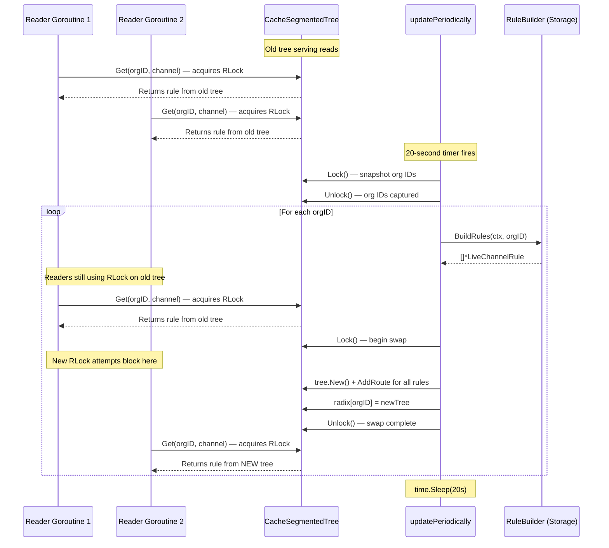
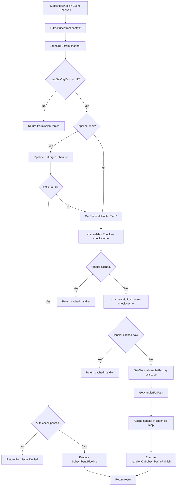
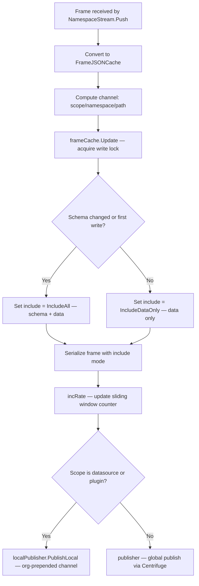
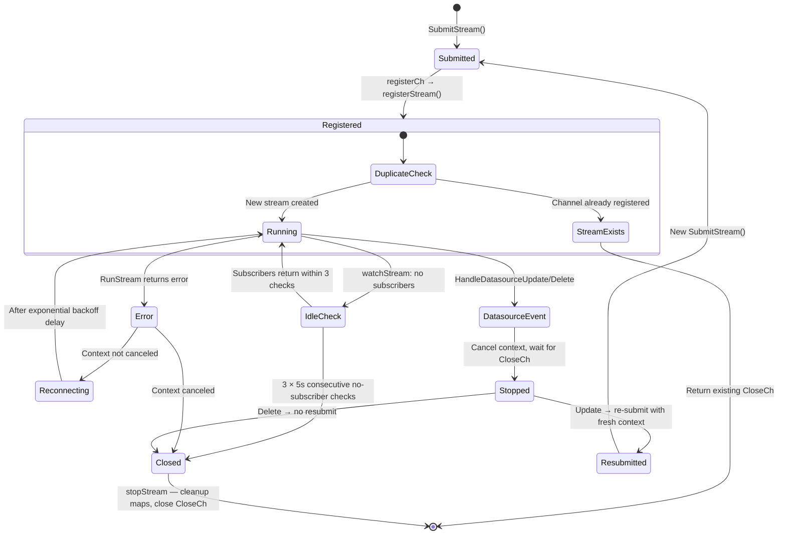
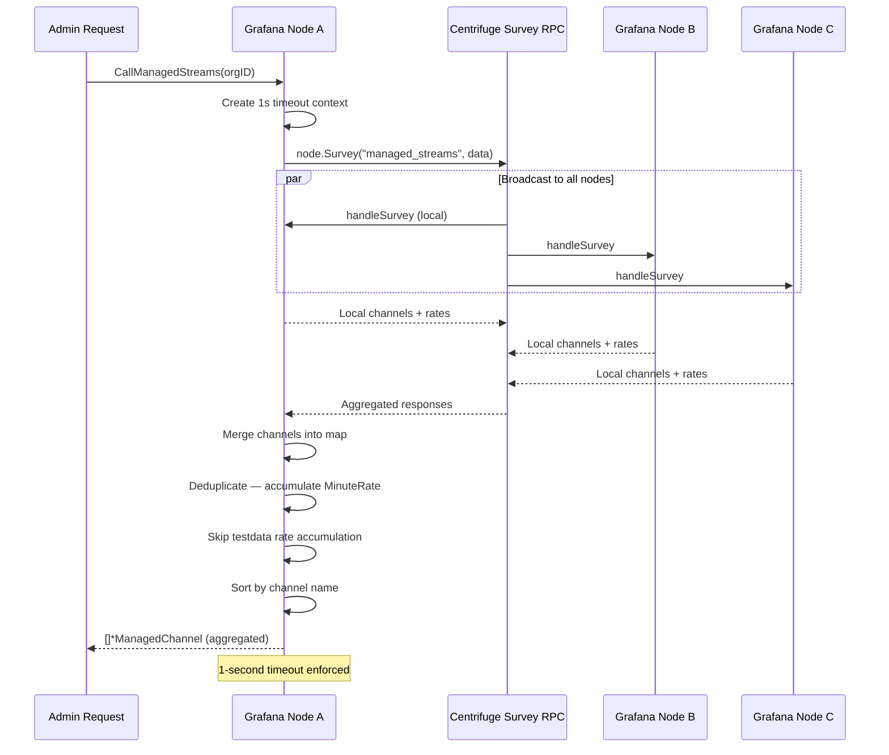
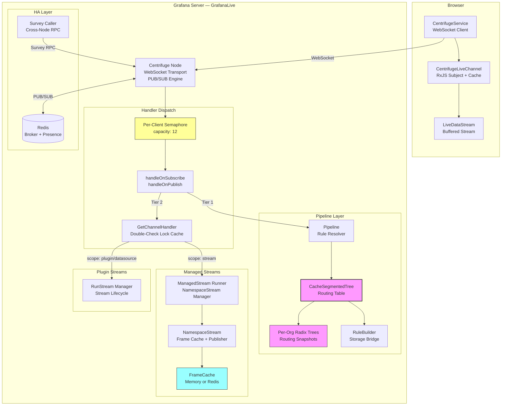

# Grafana Live Streaming Routing Layer: Runtime Coherence Deep-Dive

## Introduction

Grafana Live is the real-time streaming subsystem that pushes live data — dashboard updates, plugin telemetry, datasource query streams — to connected browsers over WebSocket. Under the hood, a **routing layer** maps every incoming channel address to a handler or pipeline rule, and a set of concurrency primitives ensures that this mapping stays coherent even as:

- The **routing rule cache** refreshes in the background every 20 seconds while hundreds of goroutines concurrently resolve channels.
- Users **join and leave channels** at arbitrary rates, each subscription triggering handler lookups against the in-memory routing table.
- **Old routing views** are atomically replaced by new ones, so that every read sees either the complete previous snapshot or the complete new snapshot — never a partially-constructed intermediate.
- **Stale routes** are deliberately served during the refresh window (bounded staleness), trading perfect freshness for zero contention on the hot read path.
- Plugin **streams start, reconnect, and shut down** in response to subscriber presence, datasource changes, and transient errors.

This document traces through the source code to explain precisely how each of these guarantees is achieved, what design trade-offs were made, and what consumers can expect at runtime. Every technical claim cites a specific source file and line range.

---

## Terminology

| Term | Definition | Source |
|------|-----------|--------|
| **Routing table** | `CacheSegmentedTree` — the per-organization cache of channel-to-rule radix trees | `pkg/services/live/pipeline/rule_cache_segmented.go` |
| **Routing snapshot** | A single per-org radix tree (`*tree.Node`) that maps channel patterns to rules | `pkg/services/live/pipeline/tree/tree.go` |
| **Rule** | `LiveChannelRule` — an in-memory representation of a channel processing rule with subscribers, converters, processors, and outputters | `pkg/services/live/pipeline/pipeline.go:125-165` |
| **Handler** | `ChannelHandler` — the interface (`OnSubscribe`, `OnPublish`) that processes channel events | `pkg/services/live/model/model.go` |
| **Managed stream** | `NamespaceStream` — holds state for a managed stream scope, including frame cache, publisher, and rate tracking | `pkg/services/live/managedstream/runner.go:134-144` |
| **Plugin stream** | A stream managed by `runstream.Manager` — bridges a plugin's `RunStream` method to local subscribers via a lifecycle of registration, watch, run, and idle shutdown | `pkg/services/live/runstream/manager.go:50-64` |

> **Companion resource:** For operational setup of Grafana Live (WebSocket configuration, Redis HA engine, connection limits, proxy configuration), see `docs/sources/setup-grafana/set-up-grafana-live.md`.

---

## 1. Architectural Foundation

### 1.1 Live Service Bootstrap and Component Wiring

When Grafana starts, the Live subsystem is assembled through dependency injection in `ProvideService()`. This single function wires together every component discussed in this document.

**Centrifuge Node creation.** At the core is a Centrifuge `Node` — the real-time messaging engine that manages WebSocket connections, PUB/SUB channels, and presence tracking. It is created with `centrifuge.New()` with a 4 MB client queue and a 7-day history meta TTL.

*Source: `pkg/services/live/live.go:112-122`*

**HA Redis engine.** When `LiveHAEngine` is configured, `setupRedisLiveEngine()` creates Redis-backed shards, a `RedisBroker` for cross-node PUB/SUB, and a `RedisPresenceManager` for global subscriber counting. The `keyPrefix` (`gf_live` by default) provides Redis namespace isolation.

*Source: `pkg/services/live/live.go:128-139, 334-372`*

**Managed stream runner.** Depending on Redis availability, a `managedstream.Runner` is created with either a `RedisFrameCache` (for HA deployments) or a `MemoryFrameCache` (single-node). The runner manages `NamespaceStream` instances that cache frames and detect schema changes.

*Source: `pkg/services/live/live.go:157-169`*

**Plugin stream manager.** A `runstream.Manager` is created to manage the lifecycle of plugin-backed streams — serializing registrations, detecting duplicates, watching subscriber presence, and handling exponential backoff on reconnection.

*Source: `pkg/services/live/live.go:176`*

**Survey caller.** A `survey.Caller` is created for HA cross-node channel aggregation and registers its handlers on the Centrifuge node.

*Source: `pkg/services/live/live.go:190-191`*

**Per-client semaphore.** The `OnConnect` handler creates a per-client semaphore (a buffered channel of capacity `clientConcurrency = 12`) that bounds the number of concurrent goroutines processing events for any single client. All `OnSubscribe`, `OnPublish`, and `OnRPC` callbacks are routed through `runConcurrentlyIfNeeded()`, which either dispatches to a new goroutine (consuming a semaphore slot) or runs inline if the semaphore capacity is 1.

*Source: `pkg/services/live/live.go:200-256, 527, 533-549`*

**Background services.** `Run()` uses `errgroup.Group` to start concurrent background services: a stats sampler (every 30 minutes) and the `runStreamManager` event loop.

*Source: `pkg/services/live/live.go:449-474`*

### 1.2 Channel Address Model

Every Grafana Live channel is addressed as a `scope/namespace/path` triplet, parsed by `live.ParseChannel()`. The four recognized scopes route to different handler factories:

| Scope | Handler Factory | Purpose |
|-------|----------------|---------|
| `grafana` | `handleGrafanaScope` | Core features (dashboard, broadcast) |
| `plugin` | `handlePluginScope` | Plugin-provided channel handlers |
| `datasource` | `handleDatasourceScope` | Datasource-backed streaming |
| `stream` | `handleStreamScope` | Managed stream (push-based) channels |

`GetChannelHandlerFactory()` at lines 880–895 performs this scope-based dispatch, returning a `ChannelHandlerFactory` whose `GetHandlerForPath()` method yields the concrete `ChannelHandler` for the given path.

*Source: `pkg/services/live/live.go:880-895`*

### 1.3 Organization-Scoped Channel Isolation

Multi-tenancy is enforced at the channel address level. Every channel transmitted through Centrifuge carries an organization ID prefix:

- `PrependOrgID(orgID, channel)` formats the channel as `"<orgID>/<channel>"` using `strconv.FormatInt(orgID, 10) + "/" + channel`.
- `StripOrgID(channel)` splits on the first `/`, parses the orgID, and returns both the numeric org ID and the bare channel string.

*Source: `pkg/services/live/orgchannel/orgchannel.go:9-29`*

The code comment at lines 15–19 explains the rationale: each organization can have identically named channels that must not overlap, so the orgID prefix prevents cross-tenant route confusion within Centrifuge's global channel namespace.

In `handleOnSubscribe`, after stripping the org ID, the handler immediately validates `user.GetOrgID() != orgID` and returns `ErrorPermissionDenied` if there is a mismatch — a hard guard against cross-tenant access.

*Source: `pkg/services/live/live.go:629-632`*

---

## 2. The Routing Table: CacheSegmentedTree

### 2.1 Data Structure

The `CacheSegmentedTree` is the central routing cache that gives fast access to channel rule configurations:

```go
type CacheSegmentedTree struct {
    radixMu     sync.RWMutex
    radix       map[int64]*tree.Node
    ruleBuilder RuleBuilder
}
```

The `radix` map is keyed by organization ID, with each value being an independent radix tree (a `*tree.Node`). This segmentation means that organizations have completely isolated routing namespaces — a rule in org 1 never interferes with a rule in org 2.

*Source: `pkg/services/live/pipeline/rule_cache_segmented.go:13-17`*

### 2.2 The Radix Tree Engine

The radix tree implementation originates from `julienschmidt/httprouter`, with improvements from the Gin web framework. The key APIs are:

- **`tree.New()`** returns a fresh, empty `*Node` — a root node ready to receive routes.
- **`Node.AddRoute(path, handler)`** inserts a route into the tree. This method is explicitly **not concurrency-safe** (as documented in the comment at line 127 of `tree.go`).
- **`Node.GetValue(path, unescape)`** walks the tree and returns a `NodeValue` whose `Handler` field contains the matched rule.

*Source: `pkg/services/live/pipeline/tree/tree.go:70-72, 116-127, 384-388`*

The fact that `AddRoute` is not concurrency-safe is a critical design constraint — it means that route construction and route lookup **cannot** happen concurrently on the same tree instance. The `CacheSegmentedTree` solves this by building a fresh tree and swapping it in atomically (see Section 3).

### 2.3 Pattern Matching Semantics

The tree supports three kinds of route segments:

- **Static segments:** Exact literal matches like `stream/metrics/cpu`
- **Named parameters (`:param`):** Match a single segment — `stream/metrics/:metric` matches `stream/metrics/cpu` and `stream/metrics/mem`
- **Catch-all parameters (`*rest`):** Match all remaining segments — `stream/metrics/*rest` matches everything under `stream/metrics/`

A channel path matches **exactly one route or none** — there is no ambiguity or priority ordering. However, this means certain pattern combinations are forbidden: for example, `stream/:scope/cpu` and `stream/metrics/:metric` cannot coexist because they would create a conflict in the underlying tree structure.

*Source: `pkg/services/live/pipeline/tree/readme.md`*

### 2.4 How Rules Are Materialized

The `RuleBuilder` interface provides the bridge between persistent storage and the in-memory routing tree:

```go
type RuleBuilder interface {
    BuildRules(ctx context.Context, orgID int64) ([]*LiveChannelRule, error)
}
```

When `CacheSegmentedTree` needs to populate (or refresh) an org's routing snapshot, it calls `ruleBuilder.BuildRules(ctx, orgID)` to retrieve all rules for that organization from storage. Each returned `LiveChannelRule` has a `Pattern` field, and routes are inserted into the tree as `"/" + ch.Pattern`.

*Source: `pkg/services/live/pipeline/rule_builder.go:5-8`, `pkg/services/live/pipeline/rule_cache_segmented.go:49-58`*

---

## 3. Periodic Refresh and Atomic Swap

This section answers the user's primary question: **how does the routing rule cache refresh in the background while users concurrently join and leave channels?**

### 3.1 The 20-Second `updatePeriodically` Loop

When `NewCacheSegmentedTree()` creates the routing table, it immediately launches a background goroutine:

```go
go s.updatePeriodically()
```

This goroutine runs an infinite loop that:

1. **Snapshots current org IDs** under write lock (`radixMu.Lock()`), collecting all org IDs that already have trees in the map.
2. **Releases the lock immediately** after capturing the org ID list.
3. **Iterates over org IDs**, calling `fillOrg(orgID)` for each to rebuild that org's routing snapshot from storage.
4. **Sleeps 20 seconds** before repeating.

The critical detail: the write lock is held **only during the org ID snapshot** (lines 31–35), not during the entire rebuild process. This means readers are blocked only for the brief moment it takes to copy map keys — not for the potentially expensive storage queries.

*Source: `pkg/services/live/pipeline/rule_cache_segmented.go:19-44`*

### 3.2 `fillOrg`: Build-Then-Replace Under Write Lock

The `fillOrg()` method is where the atomic swap happens:

1. Creates a **5-second context timeout** to bound the storage query duration.
2. Calls `ruleBuilder.BuildRules(ctx, orgID)` to fetch all rules from storage — this happens **outside** any lock.
3. **Acquires the write lock** (`radixMu.Lock()`).
4. Creates a **fresh tree** with `tree.New()`.
5. **Populates** the fresh tree with all routes via `AddRoute("/"+ch.Pattern, ch)`.
6. **Assigns** the new tree to `s.radix[orgID]`, atomically replacing whatever was there before.
7. **Releases the write lock** via `defer s.radixMu.Unlock()`.

*Source: `pkg/services/live/pipeline/rule_cache_segmented.go:46-60`*

The key coherence insight: The storage query (step 2) runs outside the lock, but tree construction and assignment (steps 4–6) happen under a single write lock hold. Because `AddRoute` is not concurrency-safe, the fresh tree is built **entirely within the write lock** — but since it is a brand-new tree that no reader can see yet, there is no contention with the old tree's readers. The old tree continues serving `RLock`-protected reads until the assignment in step 6 replaces it.

### 3.3 Why Readers Never See a Partial Tree

The snapshot-replacement model guarantees that **there is never a partially-constructed tree visible to readers**. Here is why:

- Any in-flight `Get()` call that acquired `RLock` **before** `fillOrg()` acquired the write lock sees the **complete old tree**. The `RLock` ensures the old map entry remains valid throughout their read.
- Any `Get()` call that acquires `RLock` **after** `fillOrg()` releases the write lock sees the **complete new tree** — the one that was fully populated with all routes before the assignment.
- During the brief period when `fillOrg()` holds the write lock, any new `Get()` calls attempting to acquire `RLock` will **block** until the write lock is released. They then see the complete new tree.

There is **no state** where a reader sees a tree with some routes added but not others.

*Source: `pkg/services/live/pipeline/rule_cache_segmented.go:53-59, 62-83`*

### 3.4 Bounded Staleness as a Design Trade-Off

Between refresh cycles (up to 20 seconds), the **previous routing snapshot** continues serving all lookups. This means:

- If a rule is added or modified in persistent storage, it will not be reflected in the in-memory routing table until the next `fillOrg()` call — up to 20 seconds later.
- If a rule is deleted, the old tree still contains it until the next refresh.

This is a **deliberate design choice**: bounded staleness in exchange for zero contention on the hot read path. The read path uses `RLock` (lines 63, 72), which allows **unlimited concurrent readers** with no mutual exclusion. Only during the brief `fillOrg()` write-lock period do readers block, and this duration is proportional to the number of rules for a single org (typically fast).

**First-org lazy initialization:** When `Get()` is called for an org that has never been seen, the org's tree does not yet exist in the map. In this case, `fillOrg(orgID)` is called **synchronously** — the first request for a new org pays the cost of a storage query (bounded by a 5-second context timeout), and subsequent requests for the same org benefit from the cached tree.

*Source: `pkg/services/live/pipeline/rule_cache_segmented.go:62-83`*

### 3.5 Routing Table Refresh Sequence



---

## 4. Request-Time Route Resolution

### 4.1 Two-Tier Handler Dispatch

When a client subscribes to or publishes on a channel, Grafana Live uses a **two-tier resolution** strategy. The `handleOnSubscribe()` method illustrates this:

1. **Extract user context** via `livecontext.GetContextSignedUser(client.Context())`.
2. **Strip org ID** from the Centrifuge channel via `orgchannel.StripOrgID(e.Channel)`.
3. **Validate org match** — reject if `user.GetOrgID() != orgID`.
4. **Tier 1 — Pipeline rules:** If `g.Pipeline != nil`, call `g.Pipeline.Get(orgID, channel)`. If a matching rule is found:
   - Check `SubscribeAuth` for authorization.
   - Execute each `Subscriber` in the rule's `Subscribers` list sequentially.
5. **Tier 2 — Fallback handler:** If no pipeline rule is found (`!ruleFound`), fall back to `g.GetChannelHandler(ctx, user, channel)`, which resolves a `ChannelHandler` through the scope-based factory system.

The same two-tier pattern is used in `handleOnPublish()` at lines 714–814.

*Source: `pkg/services/live/live.go:613-712, 714-814`*

### 4.2 Lazy Org Initialization on First `Get()`

The `CacheSegmentedTree.Get()` method handles the case where an org's routing snapshot does not yet exist:

1. Acquires `RLock`, checks if the org exists in the `radix` map.
2. If **not found**, releases `RLock` and calls `fillOrg(orgID)` **synchronously** — this acquires the write lock internally, fetches rules from storage (with a 5-second timeout), builds a fresh tree, and installs it.
3. After `fillOrg` returns, re-acquires `RLock` and looks up the channel in the now-populated tree.
4. Returns the matched `*LiveChannelRule` cast from `nodeValue.Handler`.

This ensures that the first subscription for any org triggers immediate rule materialization, with subsequent requests benefiting from the cached tree.

*Source: `pkg/services/live/pipeline/rule_cache_segmented.go:62-83`*

### 4.3 Double-Check Locking in `GetChannelHandler`

When the Pipeline tier does not find a matching rule, `GetChannelHandler()` resolves a handler through the scope-based factory, using a **double-check locking** pattern to avoid holding the write lock for the common cache-hit case:

1. **First check (read lock):** Acquire `channelsMu.RLock()`, look up the channel in the `channels` map. If found, return the cached handler immediately.
2. **Second check (write lock):** Acquire `channelsMu.Lock()`, re-check the map — as the comment at line 858 notes: `"may have filled in while locked"`. If found now, return it.
3. **Create and cache:** If still not found, call `GetChannelHandlerFactory()` → `GetHandlerForPath()` to create the handler, then cache it in `g.channels[channel]`.

This pattern ensures that the expensive write lock (which blocks all readers) is only held when a handler is actually being created for the first time.

*Source: `pkg/services/live/live.go:840-878`*

### 4.4 Concurrent Client Dispatch via Semaphore

Each connected client has a bounded concurrency slot managed by a per-client semaphore:

- `clientConcurrency = 12` — a package-level constant.
- In the `OnConnect` handler, a `chan struct{}` with capacity 12 is created for each client.
- All `OnSubscribe`, `OnPublish`, and `OnRPC` events pass through `runConcurrentlyIfNeeded()`.

The `runConcurrentlyIfNeeded()` function:
- If semaphore capacity > 1: sends to the semaphore channel (blocking if 12 goroutines are already active for this client), then runs the callback in a **new goroutine** with a deferred semaphore release.
- If capacity ≤ 1: runs the callback **inline** (no goroutine overhead).

This bounds per-client goroutine proliferation to 12, preventing a single client from overwhelming the server with concurrent subscription/publish requests during a burst.

*Source: `pkg/services/live/live.go:527, 533-549, 210-213, 228-247`*

### 4.5 Handler Dispatch Flowchart



---

## 5. Managed Stream Coherence

### 5.1 NamespaceStream Lazy Creation

The `Runner.GetOrCreateStream()` method provides thread-safe, lazy initialization of managed streams:

1. Acquires the write lock (`r.mu.Lock()`).
2. If the org has no stream map yet, creates one.
3. Computes the stream prefix as `scope + "/" + namespace`.
4. If no `NamespaceStream` exists for this prefix, creates one via `NewNamespaceStream()`.
5. Returns the (potentially newly created) stream.

This follows the same "check-then-create under lock" pattern used elsewhere in the codebase.

*Source: `pkg/services/live/managedstream/runner.go:118-132`*

### 5.2 Frame Cache and Schema-Change Detection

The `FrameCache` interface defines three operations for managing cached frame data:

```go
type FrameCache interface {
    GetActiveChannels(orgID int64) (map[string]json.RawMessage, error)
    GetFrame(ctx context.Context, orgID int64, channel string) (json.RawMessage, bool, error)
    Update(ctx context.Context, orgID int64, channel string, frameJson data.FrameJSONCache) (bool, error)
}
```

*Source: `pkg/services/live/managedstream/cache.go:11-18`*

The `MemoryFrameCache.Update()` method is the key coherence mechanism:

1. Acquires the write lock (`c.mu.Lock()`).
2. Checks if the channel already has a cached frame.
3. Compares schemas: `schemaUpdated := !exists || !cachedJsonFrame.SameSchema(&jsonFrame)`.
4. Stores the new frame in the cache.
5. Returns `schemaUpdated` — `true` if this is the first write or if the schema has changed.

The `SameSchema()` comparison is crucial: it determines whether downstream subscribers need a full frame (schema + data) or just the data portion. This is how the system detects schema evolution at runtime without requiring explicit versioning.

*Source: `pkg/services/live/managedstream/cache_memory.go:55-70`*

### 5.3 Schema-Aware Publish in `NamespaceStream.Push()`

When a new frame arrives, `Push()` makes a publish routing decision based on schema change detection:

1. Converts the frame to `FrameJSONCache` via `data.FrameToJSONCache(frame)`.
2. Computes the full channel string from `scope/namespace/path`.
3. Calls `frameCache.Update()` — receives the `isUpdated` flag.
4. **If schema changed** (`isUpdated == true`): publishes with `data.IncludeAll` — both schema and data.
5. **If schema unchanged**: publishes with `data.IncludeDataOnly` — only the data payload (smaller, faster).
6. Routes the publish based on scope:
   - For `ScopeDatasource` or `ScopePlugin`: uses `localPublisher.PublishLocal()` with the org-prepended channel — keeping traffic local to the node.
   - For other scopes: uses the global `publisher()` — propagating across nodes in HA setups.

This schema-aware publish optimization significantly reduces bandwidth: most frames have stable schemas, so only the data portion is transmitted.

*Source: `pkg/services/live/managedstream/runner.go:174-203`*

### 5.4 Subscription Replay from Cache

When a new subscriber connects to a managed stream channel, `OnSubscribe()` replays the latest cached frame:

1. Calls `frameCache.GetFrame(ctx, orgID, channel)` to retrieve the most recent complete frame.
2. If a cached frame exists, includes it as the `reply.Data` — the subscriber receives it as part of the subscription acknowledgment.

This ensures that new subscribers immediately see the latest state without waiting for the next publish cycle.

*Source: `pkg/services/live/managedstream/runner.go:242-252`*

### 5.5 Per-Path Minute Rate Tracking

Each `NamespaceStream` tracks message rates per path using a 60-slot sliding window:

- `incRate(path, nowUnix)` writes to a `[60]rateEntry` array keyed by `now.Second() % 60`. Each slot records a timestamp and count; expired slots are reset on the next write.
- `minuteRate(path)` sums all entries within the last 60 seconds under `RLock`.

This provides O(1) rate increment and O(60) rate query, with minimal lock contention since the read and write paths use `sync.RWMutex`.

*Source: `pkg/services/live/managedstream/runner.go:205-236`*

### 5.6 Frame Cache Update Flowchart



---

## 6. Plugin Stream Lifecycle

### 6.1 Serialized Registration via `registerCh`

The `runstream.Manager` uses a **single event loop** pattern for stream registration:

- `Manager.Run()` listens on the `registerCh` channel in an infinite loop. Each incoming `submitRequest` spawns a `go s.registerStream(ctx, sr)` goroutine.
- `SubmitStream()` constructs a `submitRequest` with a response channel, sends it to `registerCh`, and blocks until a response arrives — effectively serializing the registration decision through a single coordination point.

*Source: `pkg/services/live/runstream/manager.go:365-376, 408-459`*

The `registerStream()` method then:

1. **Acquires write lock** (`s.mu.Lock()`).
2. **Checks for existing stream** — if a stream for this channel already exists, returns `StreamExists: true` with the existing `CloseCh` for notification.
3. **Creates context with cancel**, a `CloseCh` channel, and stores the stream context in the `streams` map.
4. **Tracks datasource mapping** — if the stream has `DataSourceInstanceSettings`, records the channel in `datasourceStreams[dsKey]`.
5. **Releases the lock** and sends the response.
6. **Launches `watchStream`** in a goroutine and **runs `runStream`** inline.

*Source: `pkg/services/live/runstream/manager.go:335-362`*

### 6.2 Duplicate Detection

Stream uniqueness is enforced at registration time: `registerStream()` checks `s.streams[sr.streamRequest.Channel]`. If a stream already exists for the requested channel, the request immediately returns `StreamExists: true` along with the existing stream's `CloseCh`, which the caller can use to receive notification when the existing stream closes.

This prevents duplicate stream connections for the same channel, avoiding wasted resources and conflicting data flows.

*Source: `pkg/services/live/runstream/manager.go:337-340`*

### 6.3 Subscriber-Driven Idle Shutdown

The `watchStream()` goroutine monitors whether a stream still has active consumers:

- **Presence ticker** fires every `checkInterval` (5 seconds by default).
- On each tick, calls `presenceGetter.GetNumLocalSubscribers(sr.Channel)`.
- If subscribers > 0: resets the `numNoSubscribersChecks` counter.
- If no subscribers: increments the counter.
- After `maxChecks` (3) consecutive no-subscriber checks — a total of **15 seconds** of idle time — calls `stopStream()` to shut down the stream.

A **datasource ticker** fires every 1 minute to check if the underlying datasource context has changed (e.g., credentials updated). If it detects a change, it triggers a `HandleDatasourceUpdate()` to stop and re-establish the stream.

*Source: `pkg/services/live/runstream/manager.go:177-228`*

The `stopStream()` method acquires the write lock, removes the stream from both `streams` and `datasourceStreams` maps, cancels its context, and closes `CloseCh` — providing a clean signal to any waiters.

*Source: `pkg/services/live/runstream/manager.go:159-175`*

### 6.4 Exponential Backoff Reconnection

When `runStream()` encounters an error (and the context is not canceled), it marks `isReconnect = true` and re-enters the run loop:

- If the stream ran for less than `streamDurationThreshold` (100ms), it is considered a **fast failure**: `numFastErrors` is incremented and `delay` is calculated via `getDelay()`.
- `getDelay(numErrors)` computes `coolDownDelay * 2^numErrors`, capped at `maxDelay`:
  - `coolDownDelay = 100ms`
  - `maxDelay = 5s`
  - So: 100ms → 200ms → 400ms → 800ms → 1.6s → 3.2s → 5s → 5s → ...
- If the stream ran longer than 100ms (a "successful" run), the delay and error counter are reset to zero.
- On reconnection, a fresh `PluginContext` is resolved to pick up any configuration changes.

*Source: `pkg/services/live/runstream/manager.go:230-325`*

### 6.5 Datasource Update/Delete Handling

External events (datasource configuration changes or deletions) trigger atomic stream lifecycle transitions:

- `HandleDatasourceUpdate(orgID, dsUID)` and `HandleDatasourceDelete(orgID, dsUID)` both delegate to `handleDatasourceEvent()`.
- The method:
  1. Finds all streams associated with the datasource key.
  2. **Cancels** each stream's context (triggering shutdown).
  3. **Waits** for all streams to stop (blocking on each `CloseCh`).
  4. If `resubmit` is true (update, not delete): **re-submits** each stream with a fresh plugin context.

This stop-then-resubmit pattern ensures that no stream runs with stale configuration and that all streams are cleanly shut down before new ones are started.

*Source: `pkg/services/live/runstream/manager.go:103-153`*

### 6.6 Stream Lifecycle State Diagram



---

## 7. HA Coherence: Cross-Node Aggregation

### 7.1 Redis-Backed Broker and Presence

In HA deployments, `setupRedisLiveEngine()` configures cross-node communication:

1. Creates `RedisShards` from the configured address and password.
2. Creates a `RedisBroker` with the `keyPrefix` for namespace isolation, and sets it on the Centrifuge node — enabling cross-node PUB/SUB.
3. Creates a `RedisPresenceManager` with the same shards and prefix, and sets it on the node — enabling global subscriber counting across all Grafana instances.

*Source: `pkg/services/live/live.go:334-372`*

### 7.2 Survey RPC for Managed Channel Discovery

The `survey.Caller` enables any Grafana node to query all other nodes for their managed channels:

- `NewCaller()` takes the `managedStreamRunner` and the Centrifuge `node`.
- `SetupHandlers()` registers a `node.OnSurvey()` handler that dispatches by operation name.
- When the operation is `"managed_streams"`, `handleManagedStreams()` deserializes the request and calls `managedStreamRunner.GetManagedChannels(req.OrgID)` — returning the local node's managed channels with their schemas and rates.

*Source: `pkg/services/live/survey/survey.go:17-82`*

### 7.3 `CallManagedStreams`: Cross-Node Aggregation with Deduplication

`CallManagedStreams()` aggregates channel information across all nodes:

1. Marshals a `NodeManagedChannelsRequest` with the target org ID.
2. Creates a **1-second context timeout** — bounding the maximum wait for responses from all nodes.
3. Calls `c.node.Survey()` — a Centrifuge Survey RPC that broadcasts to all connected nodes and collects their responses.
4. **Deduplicates** results: iterates over all responses, merging channels into a map.
   - For duplicate channels: **accumulates `MinuteRate`** from each node (line 116).
   - Exception: testdata channels (prefixed with `plugin/testdata/`) skip rate accumulation since their rates are hardcoded.
5. Sorts the final result by channel name for deterministic ordering.

*Source: `pkg/services/live/survey/survey.go:84-133`*

### 7.4 HA Survey Aggregation Sequence



---

## 8. Pipeline Recursion Protection

### 8.1 The `visitedChannels` Guard

When pipeline rules chain to other channels (e.g., a `DataOutputter` returns a `ChannelData` with a different channel, or a `FrameOutputter` returns a `ChannelFrame` targeting a different channel), there is a risk of **infinite redirect loops** — Channel A routes to Channel B, which routes back to Channel A.

The pipeline prevents this with a `visitedChannels` map:

- In `processInput()`, if `visitedChannels` is nil (first call), it is initialized as an empty map.
- In `processChannelDataList()` (lines 316–340): before processing each channel data item, the method checks `if _, ok := visitedChannels[nextChannel]; ok`. If the channel has already been visited, it returns `errChannelRecursion` (defined as `errors.New("channel recursion")` at line 314). Otherwise, it adds the channel to the visited set and proceeds.
- In `processChannelFrames()` (lines 342–367): the same guard is applied — check for the channel in `visitedChannels`, return `errChannelRecursion` if found, add it if not, then recurse.

This O(1) set-membership check provides immediate recursion detection with minimal overhead, preventing any channel from being processed more than once in a single input processing chain.

*Source: `pkg/services/live/pipeline/pipeline.go:238-278, 314-367`*

---

## 9. Frontend Perspective

### 9.1 CentrifugeService Connection Lifecycle

On the browser side, `CentrifugeService` manages the WebSocket connection to Grafana Live:

- Converts the application URL from HTTP/HTTPS to WS/WSS scheme and appends an `auth_token`.
- Creates a `Centrifuge` client instance with a 30-second timeout.
- Connects when live is enabled and the user's org role is available.
- Exposes a `BehaviorSubject<boolean>` for connection state observation.
- A `connectionBlocker` promise resolves on first successful connection, allowing callers to await readiness before performing RPCs.
- Registers listeners for `connected`, `connecting`, `disconnected`, and `publication` events.

*Source: `public/app/features/live/centrifuge/service.ts`*

### 9.2 Channel Caching and Shutdown Cleanup

`getChannel()` derives a stable channel ID from the org ID and channel address. It returns a cached `CentrifugeLiveChannel` if one exists, or creates a new one:

- `CentrifugeLiveChannel` wraps a Centrifuge `Subscription` into an RxJS `Subject<LiveChannelEvent>`.
- It caches the latest schema-bearing payload so that new subscribers can immediately receive the current state via `getStream()`, which replays the latest status and cached schema message.
- `disconnectIfNoListeners()` implements delayed disconnect — when no observers remain, the channel waits before actually unsubscribing, avoiding unnecessary reconnection churn.
- Shutdown cleanup removes the channel from the local map and the Centrifuge subscription registry.

*Source: `public/app/features/live/centrifuge/channel.ts`*

### 9.3 LiveDataStream Buffering Model

- `getDataStream()` generates or reuses a subscription key for deduplication.
- `getLiveDataStream()` creates streams with a **5-second shutdown delay** (`dataStreamShutdownDelayInMs`) — keeping the underlying subscription alive briefly after the last consumer disconnects, in case a new consumer connects quickly.
- Streams are wired to channel events, subscriber readiness, and default frame options.
- `getQueryData()` forwards RPC requests to `centrifuge.rpc('grafana.query', ...)` after the `connectionBlocker` promise resolves — ensuring the WebSocket connection is established before attempting any query.

*Source: `public/app/features/live/centrifuge/service.ts`*

---

## 10. Summary of Coherence Guarantees

| Concern | Mechanism | Guarantee | Bound |
|---------|-----------|-----------|-------|
| Routing table freshness | 20s periodic `updatePeriodically` loop | Bounded staleness — previous snapshot serves reads until refresh completes | Up to 20 seconds |
| Routing snapshot atomicity | `sync.RWMutex` write lock around `tree.New()` + `AddRoute` + map assignment in `fillOrg()` | No partially-constructed tree is ever visible to readers | Absolute |
| First-org latency | Synchronous `fillOrg()` on first `Get()` call for unknown org | Immediate materialization with timeout | 5-second context timeout |
| Handler cache coherence | Double-check locking with `channelsMu` RWMutex in `GetChannelHandler()` | Thread-safe, single-initialization handler caching | One initialization per channel |
| Per-client concurrency | Buffered channel semaphore with capacity `clientConcurrency` | Bounded goroutine count per WebSocket client | 12 concurrent operations |
| Frame cache schema detection | `SameSchema()` comparison in `MemoryFrameCache.Update()` | Schema-change-aware publish — full frame on change, data-only otherwise | Per-update check |
| Stream uniqueness | `registerStream()` duplicate check against `streams` map | No duplicate plugin streams for the same channel | Immediate detection |
| Stream idle cleanup | `watchStream()` with `presenceTicker` every `checkInterval` | Auto-cleanup of idle streams after `maxChecks` consecutive empty checks | 3 × 5s = 15-second idle threshold |
| Stream reconnection | Exponential backoff via `getDelay()` in `runStream()` | Resilient reconnection with bounded delay | 100ms base, 5s max delay |
| HA channel aggregation | Centrifuge Survey RPC via `CallManagedStreams()` | Cross-node managed channel discovery with deduplication | 1-second timeout |
| Channel recursion safety | `visitedChannels` map in `processChannelDataList()` / `processChannelFrames()` | No infinite redirect loops in pipeline rule chaining | Immediate detection |
| Tenant isolation | `orgchannel.PrependOrgID()` / `StripOrgID()` + org validation in `handleOnSubscribe` | No cross-tenant route confusion or channel access | Absolute |

---

## 11. Overall Live Routing Architecture



### How to Read This Diagram

1. **Browser → Centrifuge Node:** WebSocket connection carries subscribe, publish, and RPC messages.
2. **Centrifuge Node → Semaphore → Handler Dispatch:** Each client event passes through the per-client semaphore (capacity 12) before reaching `handleOnSubscribe`/`handleOnPublish`.
3. **Tier 1 Resolution:** The handler first checks the Pipeline, which queries `CacheSegmentedTree` for a matching rule in the per-org radix tree.
4. **Tier 2 Resolution:** If no pipeline rule matches, `GetChannelHandler` (with double-check locking) resolves a handler via the scope-based factory — routing `stream` scope to `ManagedStream.Runner` and `plugin`/`datasource` scope to `RunStream.Manager`.
5. **HA Layer:** In multi-node deployments, Redis provides cross-node PUB/SUB and presence, while the Survey Caller enables cross-node managed channel discovery.

---

*This document was generated from analysis of the Grafana source code. All citations reference the repository at its current state. For operational deployment guidance, see `docs/sources/setup-grafana/set-up-grafana-live.md`.*
