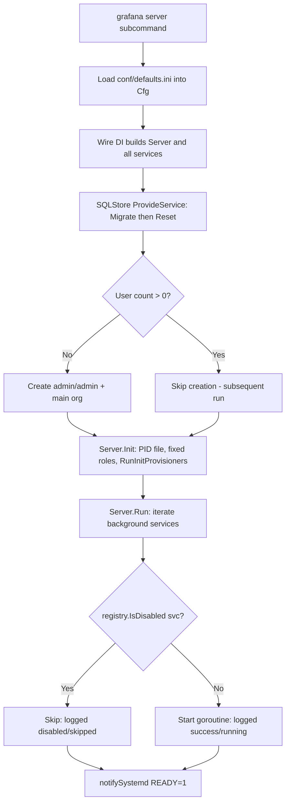

# What Grafana Actually Does on a Clean Start — An Empirically-Verified Q&A

> **Subject:** Grafana **v11.5.0-pre**
> **Commit:** `4550cfb5b72886782d9a3e6cf995f8dbd57ca4ff`
> **Repository:** `grafana/grafana` (OSS monorepo)
> **Scope:** Behavior on a **completely clean start** — no `conf/custom.ini`, no `GF_*` environment variables, and no pre-existing `data/` directory, so that `conf/defaults.ini` is the **sole** configuration source.

---

## Why this document exists

A new team member followed the developer-facing setup in `contribute/developer-guide.md`, ran the server, and noticed a gap between what the documentation *describes* and what the running system *actually does*. This document closes that gap. It answers six concrete questions, and for **every** answer it provides three things:

1. **Empirical evidence** — a real excerpt from the startup log, a read-only database query, or a filesystem diff captured by building and running this exact commit.
2. **A governing code citation** — a precise `file:line` reference in the source tree, because **the code is the ground truth**.
3. **The rationale** — why the observed behavior follows from that code.

Authoritative Grafana web documentation is cited only to *corroborate* the code, never to substitute for it.

### "Completely clean state" — precise definition

A clean start, as used throughout this document, means **all four** of the following artifacts are **absent** before the server is launched, and the server is started with **no `custom.ini` and no environment variables**:

| Artifact | Why its absence matters |
|----------|-------------------------|
| `data/` (and therefore `data/grafana.db`) | No persisted users, orgs, dashboards, or migration history exist yet — this is what makes the *first* run special. |
| `conf/custom.ini` | No configuration overlays `conf/defaults.ini`. |
| `GF_*` environment variables | No environment overrides are applied. |
| `pkg/server/wire_gen.go` | The generated dependency-injection initializer — required before the backend can even compile (see Q5). |
| `bin/`, `public/build` | No compiled binary and no frontend bundle yet (see Q5). |

All four were independently verified absent in a pristine checkout of this commit. The runtime evidence below was then gathered by building and running the source inside the project's pinned toolchain.

---

## Clean-state reproduction methodology

So that every finding can be re-verified, the evidence was produced with the following disciplined, defaults-only procedure. The build/run requires a C toolchain (the default SQLite driver `mattn/go-sqlite3` is Cgo-based) plus the project's pinned Go/Node/Yarn, so it was performed inside the project's container image (`Go 1.23.1`, `Yarn 4.5.3`, `gcc 12.2.0`, `CGO_ENABLED=1`).

**Pinned toolchain (cited so the build is reproducible):**

| Pin | Value | Source |
|-----|-------|--------|
| Go | `go 1.23.1` | `go.mod` |
| Node | `>= 22` (engines); `v22.11.0` (nvm) | `package.json` `engines`, `.nvmrc` |
| Yarn | `yarn@4.5.3` | `package.json` `packageManager` |

**Procedure (A–D):**

- **A — Baseline.** Confirm `git rev-parse HEAD == 4550cfb5b72886782d9a3e6cf995f8dbd57ca4ff`; confirm `data/`, `bin/`, `public/build`, `pkg/server/wire_gen.go` are absent; snapshot the filesystem to a temp file **outside** the repo.
- **B — Build.** `make gen-go` (generates `pkg/server/wire_gen.go`) → `make build-go` (needs Cgo/gcc). **Output-path nuance:** a plain *non-dev* `make build-go` on Linux/amd64 emits the binary under an OS/arch subdirectory, `bin/linux-amd64/grafana` (`pkg/build/cmd.go:166`, `:169-170`); the *dev*/BRA path — `GO_BUILD_DEV=1 make build-go`, i.e. the `-dev` flag (`.bra.toml:3`, `Makefile:17`) — emits `bin/grafana` directly. (In the evidence container, `bin/grafana` is a symlink to `bin/linux-amd64/grafana`.) Optionally `yarn install --immutable && yarn build` for the full UI bundle.
- **C — First run.** Start the freshly built binary from the clean tree with **no `custom.ini` and no env vars**; capture the full startup log; re-snapshot the filesystem and **diff** against the baseline; inspect `data/grafana.db` **read-only** (open with `mode=ro` or against a copy).
- **D — Subsequent run.** Restart the **same** binary **without** deleting `data/`; capture the second startup log; show the behavioral delta.

**Methodological guarantees:** defaults-only (no `custom.ini`/env); **read-only** database inspection (never written during evidence-gathering); before/after snapshot-and-diff so every created file and every database row is attributed to the correct run; and all temporary helper scripts deleted afterward. The build artifacts and the runtime `data/` directory are **gitignored byproducts**, not repository modifications (proven in the [Appendix](#appendix-b--build-artifacts-are-gitignored-byproducts-not-repo-modifications)).

**Runtime banner captured (proves the version/commit under test):**

```
logger=settings level=info msg="Starting Grafana" version=11.5.0-pre commit=4550cfb5b72 branch=HEAD compiled=2024-12-13T14:22:02Z
```

**Configuration provenance captured (proves defaults.ini is the sole source):**

```
logger=settings level=info msg="Config loaded from" file=/app/conf/defaults.ini
logger=settings level=info msg="Path Home" path=/app
logger=settings level=info msg="Path Data" path=/app/data
logger=settings level=info msg="Path Logs" path=/app/data/log
logger=settings level=info msg="Path Plugins" path=/app/data/plugins
logger=settings level=info msg="Path Provisioning" path=/app/conf/provisioning
logger=settings level=info msg="App mode production"
```

The loader reads `conf/defaults.ini` first, then *would* overlay a `custom.ini` and environment variables if present:

| Step | Code |
|------|------|
| Load defaults first | `pkg/setting/setting.go:883` (`loadConfiguration` at `:881`) |
| Overlay specified/custom config | `pkg/setting/setting.go:906` (`customInitPath = "conf/custom.ini"` at `:57`) |
| Apply env overrides | `pkg/setting/setting.go:917` (`applyEnvVariableOverrides` defined at `:666`) |

With no `--config`/`custom.ini` and no env vars, only the first step contributes — `defaults.ini` is authoritative.

---

## Q1 — Initialization ground truth

> **Question (verbatim):** "What decisions does the system make automatically on a fresh start, and why do some subsystems report `disabled`/`skipped` while others report `success` even with zero user configuration?"

### Empirical evidence

On a fresh start the server makes a fixed sequence of decisions and then launches its long-running ("background") services concurrently. At the **default Info log level**, the *success* side is visible as each subsystem's own initialization line:

```
logger=plugin.angulardetectorsprovider.dynamic level=info msg="Restored cache from database" duration=199.968µs
logger=plugin.store level=info msg="Plugins loaded" count=54 duration=36.6ms
logger=grafanaStorageLogger level=info msg="Storage starting"
logger=provisioning.alerting level=info msg="starting to provision alerting"
logger=ngalert.multiorg.alertmanager level=info msg="Starting MultiOrg Alertmanager"
logger=ngalert.scheduler level=info msg="Starting scheduler" tickInterval=10s
logger=plugins.registration level=info msg="Plugin registered" pluginId=...
logger=plugin.angulardetectorsprovider.dynamic level=info msg="Patterns update finished" duration=93.2ms
logger=http.server level=info msg="HTTP Server Listen" address=[::]:3000 protocol=http
```

The *disabled* side is **not** a global "permissive mode" — it is a per-service opt-out. The `Server.Run()` gate applies specifically to **registered background services**: a service is skipped only if it implements the optional `CanBeDisabled` interface *and* its `IsDisabled()` returns `true`. One such registered background service was observed **not** to start under defaults:

- **`searchV2` (`StandardSearchService`)** — a genuine registered background service (it implements both `Run()` at `pkg/services/searchV2/service.go:124` and `CanBeDisabled` via `IsDisabled()` at `:120-121`); its `IsDisabled()` returns `!features.IsEnabledGlobally(FlagPanelTitleSearch)`, and the `panelTitleSearch` feature flag is off by default → the `Server.Run()` gate skips it.

> **A different disable mechanism — `quota` (do not conflate).** It is tempting to cite `quota` as a gate skip because it *does* have an `IsDisabled()` method (`pkg/services/quota/quotaimpl/quota.go:78-79`, returning `!s.Cfg.Quota.Enabled`, with `[quota] enabled = false` by default). But `quota` is **not** skipped by the background-service gate: the `quota.Service` interface has **no** `Run(ctx)` method (`pkg/services/quota/quota.go:9-28`), so it is **not** a `registry.BackgroundService`, and it is **not** registered in `pkg/registry/backgroundsvcs/background_services.go`. Instead it is disabled at the **provider level** — `ProvideService` returns a no-op `&serviceDisabled{}` implementation when `IsDisabled()` is true (`quotaimpl/quota.go:60`, `:72`). So `quota` never enters the `Server.Run()` background-service loop at all; its "disabled" is a *separate* path from the `CanBeDisabled` gate.

When the same first run is repeated at `--log.level=debug`, the generic gate lines become visible and the contrast is unambiguous: **34** background services emit `"Starting background service"` while `searchV2.StandardSearchService` emits **zero** such lines (`quota`, not being a background service, never appears in that loop).

> **Log-level nuance (important):** the generic `"Starting background service"` line (`pkg/server/server.go:162`) and the normal-path `"Stopped background service"` line (`:171`) are emitted at **Debug** level, so they do **not** appear at the default Info level. (The *failure-path* `"Stopped background service"` line at `:168` is **Error** level — it lives inside the `if err != nil && !errors.Is(err, context.Canceled)` branch at `:167` — and would therefore surface even at Info, but only if a background service returns a non-cancel error, which does not happen on a clean healthy start.) To see the disabled-vs-success contrast at default verbosity you must read each subsystem's **own** Info-level line, not the generic gate lines.

### Governing code citation

| Decision | Code |
|----------|------|
| Entry point registers the `server` subcommand | `pkg/cmd/grafana/main.go:47` (`commands.ServerCommand(...)`; imports at `:11`/`:12`, `MainApp` at `:34`, `Commands` at `:45`) |
| `Server.Init()` sequence | `pkg/server/server.go:113` → `writePIDFile` `:122` → `metrics.SetEnvironmentInformation` `:126` → `roleRegistry.RegisterFixedRoles` `:130` → `provisioningService.RunInitProvisioners` `:134` |
| `Server.Run()` iterates background services | `pkg/server/server.go:139`; per-service gate `if registry.IsDisabled(svc) { continue }` at `:150`; each survivor launched via `s.childRoutines.Go` at `:156`; `notifySystemd("READY=1")` at `:176`; `childRoutines.Wait()` at `:179` |
| **The enable/disable mechanism** | `pkg/registry/registry.go`: `CanBeDisabled` is an **optional** interface (`:18`, method `IsDisabled() bool` at `:20`); `BackgroundService` at `:25`; `func IsDisabled(srv BackgroundService) bool` at `:53-56` returns `ok && canBeDisabled.IsDisabled()` (`:55`) |
| Generic gate log lines (Debug — invisible at default Info) | `pkg/server/server.go:162` (`"Starting background service"`), `:171` (`"Stopped background service"`, normal path) |
| Failure-path background-service log (Error — would surface at Info, but only if a service returns a non-cancel error) | `pkg/server/server.go:168` (`"Stopped background service"`), inside the `if err != nil && !errors.Is(err, context.Canceled)` branch at `:167` |
| Background-service gate skip (example) | `pkg/services/searchV2/service.go:120-121` (`IsDisabled() = !IsEnabledGlobally(FlagPanelTitleSearch)`), `:124` (`Run()`); registered in `pkg/registry/backgroundsvcs/background_services.go` (passed as `searchService`) |
| Provider-level disabled (a **different** mechanism — *not* a `Server.Run()` skip) | `pkg/services/quota/quotaimpl/quota.go:60` (`ProvideService`), `:72` (returns `&serviceDisabled{}`), `:78-79` (`IsDisabled() = !Cfg.Quota.Enabled`); `quota.Service` has no `Run()` (`pkg/services/quota/quota.go:9-28`), not registered as a background service; `conf/defaults.ini:1165` (`[quota] enabled = false`) |

### Rationale

`Server.Run()` walks the list of registered background services and, for each one, calls `registry.IsDisabled(svc)`. The function at `pkg/registry/registry.go:53-56` performs a **type assertion**: it checks whether the service *also* implements the optional `CanBeDisabled` interface, and only if it does **and** that service's `IsDisabled()` returns `true` is the service skipped. A service that does **not** implement `CanBeDisabled` therefore **always** runs. This is why, with zero user configuration, most services report success (they have no opt-out, or their opt-out evaluates to `false`) while a small set — those whose `IsDisabled()` reads a default-off config flag or feature toggle — report disabled/skipped. There is **no permissive global mode**; "disabled" is an explicit, per-service opt-in to being switchable, governed entirely by the defaults in `conf/defaults.ini` and the default feature toggles.

The full first-run decision flow is summarized in the [startup decision-flow diagram](#appendix-a--startup-decision-flow) in the appendix.

---

## Q2 — Persistent state

> **Question (verbatim):** "What state gets created and remembered between runs? What gets written where, and why? Why do subsequent runs differ from the first run, and why do those differences persist across stop/restart?"

### Empirical evidence

**Filesystem diff (baseline → after first run).** The first run created exactly **one** new top-level entry — `data/` — containing:

```
data/
├── grafana.db                         # SQLite database (the durable state)
├── log/grafana.log                    # file log sink
├── png/                               # rendered-image cache
├── pdf/                               # rendered-PDF cache
├── csv/                               # CSV export cache
└── plugins/grafana-lokiexplore-app/   # a preinstalled app (see Q4)
```

**Database creation (Info log).** The SQLite file is created on first connect:

```
logger=sqlstore level=info msg="Connecting to DB" dbtype=sqlite3
logger=sqlstore level=info msg="Creating SQLite database file" path=/app/data/grafana.db
```

**Read-only database inspection** (the file was copied to a temp location and opened `mode=ro`; never written):

| Table | Row(s) observed |
|-------|-----------------|
| `user` | `id=1, login=admin, email=admin@localhost, is_admin=1, is_disabled=0`; `password` is a **100-char hash**, `salt` is 10 chars, `rands` is 10 chars (no plaintext) |
| `org` | `id=1, name='Main Org.'` |
| `org_user` | `org_id=1, user_id=1, role=Admin` |
| `migration_log` | **626 rows, all `success=1`** (matches the log line `migrations completed performed=626 skipped=0`) |
| `data_source` | **0 rows** (no data source *instances* — see Q4) |

### Governing code citation

| Behavior | Code |
|----------|------|
| Default DB path is `data/grafana.db` | `pkg/services/sqlstore/database_config.go:111` (`MustString("data/grafana.db")`) |
| Relative DB path joined to the data dir | `pkg/services/sqlstore/database_config.go:193` (`filepath.Join(cfg.DataPath, dbCfg.Path)`) |
| The data directory is created | `pkg/services/sqlstore/database_config.go:195` (`os.MkdirAll(path.Dir(...), 0o750)`) |
| SQLite DB file **explicitly created** (source of the quoted log) | `pkg/services/sqlstore/sqlstore.go:255` (`Connecting to DB`); existence check `:258` (`fs.Exists`); `:264` (`if !exists`); `:265` (Info `"Creating SQLite database file"`); `:266` (`os.OpenFile(path, os.O_CREATE`&#124;`os.O_RDWR, 0640)`) |
| Connection string also carries the create flag (supporting context) | `pkg/services/sqlstore/database_config.go:199` (`file:%s?cache=%s&mode=rwc`; `rwc` = read-write-create) |
| Schema migrations run, then state is reset | `pkg/services/sqlstore/sqlstore.go:69` (`Migrate(...)`), `:73` (`Reset()`); both invoked from `ProvideService` at `:56` |
| `data` dir and DB defaults | `conf/defaults.ini:15` (`data = data`), `:123` (`type = sqlite3`), `:164` (`path = grafana.db`) — relative path ⇒ effective `data/grafana.db` |
| Data path resolution | `pkg/setting/setting.go:934` (`DataPath`) |

### Rationale

On a clean start there is no `data/` directory. After `os.MkdirAll` (`database_config.go:195`) creates the parent directory, SQLStore checks whether the database file already exists (`sqlstore.go:258`) and, finding it absent, logs `"Creating SQLite database file"` (`:265`) and **explicitly creates** it via `os.OpenFile(path, os.O_CREATE|os.O_RDWR, 0640)` (`:266`) — *before* the xorm connection is opened (whose string also carries `mode=rwc`, read-write-create, as a backstop, `database_config.go:199`). Because that creation is gated by the `if !exists` check (`:264`), the `"Creating SQLite database file"` log appears **only on the first run**: on subsequent runs the file already exists, the guard is false, and no creation log is emitted (confirmed at runtime). The schema migrator then applies the full migration set and records each step in the `migration_log` table (`sqlstore.go:69`). Because all of this lives **inside the SQLite file under `data/`**, it is durable: stopping and restarting the process does not erase it. That durability is precisely *why* subsequent runs differ from the first — the next run finds a populated database (one user, one org, a full `migration_log`) and therefore takes different branches (see Q3 and Q6). The `png/`, `pdf/`, and `csv/` subdirectories are caches for server-side rendering/exports; `data/plugins/` holds externally-installed plugins (Q4). None of these are committed to the repository — they are gitignored byproducts (see Appendix B).

---

## Q3 — Security posture of the default configuration

> **Question (verbatim):** "How can I log in with credentials I never set up? Does the system auto-create accounts, or is it running in a permissive mode? What auth/security defaults are actually in effect?"

### Empirical evidence

**The admin account is auto-created on the first run** (Info log lines, present on run 1 only):

```
logger=sqlstore level=info msg="Created default admin" user=admin
logger=sqlstore level=info msg="Created default organization"
```

**The credentials work, and Grafana immediately demands a change.** Logging in with `admin`/`admin` succeeds and redirects to a forced password-change screen warning that *"Continuing to use the default password exposes you to security risks."*

| Observed UI state | What it shows |
|---|---|
| **Login page (basic auth)** | A single centered card with **Email or username** and **Password** fields and a **Log in** button — **no** anonymous-access entry and **no** sign-up link. The footer reads `Grafana v11.5.0-pre (4550cfb5b7)`, matching the startup banner. |
| **First-login password-change prompt** | After logging in with `admin`/`admin`, Grafana redirects to a forced **"Update your password"** screen (New password / Confirm new password fields) carrying the warning *"Continuing to use the default password exposes you to security risks."* |

The login page footer reads `Grafana v11.5.0-pre (4550cfb5b7)`, matching the banner; the page presents a **username/password** form only (no anonymous entry, no sign-up).

**Passwords are stored salted + hashed, never in plaintext.** The read-only DB inspection showed the `user.password` column is a 100-character hash with a 10-character per-user `salt` (e.g. `salt=A4n0mK5shZ`, `password` begins `210549a106af30f7…`) — *not* the literal string `admin`.

### Governing code citation

| Default in effect | Code |
|-------------------|------|
| Initial admin creation **enabled** (not disabled) | `conf/defaults.ini:325` (`disable_initial_admin_creation = false`); bound at `pkg/setting/setting.go:1580` (`MustBool(false)`) |
| Default admin username / password / email | `conf/defaults.ini:328` (`admin_user = admin`), `:331` (`admin_password = admin`), `:334` (`admin_email = admin@localhost`); bound at `pkg/setting/setting.go:1581-1583` |
| Brute-force protection **on** | `conf/defaults.ini:352` (`disable_brute_force_login_protection = false`) |
| Self sign-up **off** | `conf/defaults.ini:483` (`[users] allow_sign_up = false`) |
| Anonymous access **off** | `conf/defaults.ini:650` (`[auth.anonymous] enabled = false`) |
| Basic auth **on** | `conf/defaults.ini:875` (`[auth.basic] enabled = true`) |
| The auto-creation itself | `pkg/services/sqlstore/sqlstore.go:190` (`ensureMainOrgAndAdminUser`); gated by `if !ss.cfg.DisableInitAdminCreation` at `:210`; `createUser(...)` at `:213-219`; Info `"Created default admin"` at `:222`; `getOrCreateOrg(sess, mainOrgName)` at `:226`; Info `"Created default organization"` at `:230` |
| Org name constant | `pkg/services/sqlstore/user.go:16` (`mainOrgName = "Main Org."`) |
| Salted + hashed password | `pkg/services/sqlstore/user.go:77` (`salt, _ := util.GetRandomString(10)`), stored at `:81`; `rands` at `:82`/`:86`; `util.EncodePassword(args.Password, usr.Salt)` at `:89` |
| Forced-password-change route | `pkg/api/api.go:91` (`/.well-known/change-password`); login workflow in `pkg/api/login.go` (`LoginView:92`, `LoginPost:230`) |

### Rationale

You can "log in with credentials you never set up" because Grafana **auto-creates** them. `ensureMainOrgAndAdminUser` (`sqlstore.go:190`) runs during store provisioning, and because `disable_initial_admin_creation` defaults to `false` (`defaults.ini:325`), the `if !ss.cfg.DisableInitAdminCreation` branch at `:210` is taken on a clean database. It creates a user from the `[security]` defaults — `admin` / `admin` / `admin@localhost` — and a `Main Org.`, then makes that user an Admin member of that org. The password is **not** stored as `admin`: `createUser` generates a random 10-char salt and stores `util.EncodePassword(password, salt)` (`user.go:77-89`), which is why the DB shows a hash. This is **not** a permissive mode — quite the opposite: anonymous access and self sign-up are both **off** and basic auth is **on**, so a credentialed login is *required*; the only "permissiveness" is the well-known bootstrap credential, which Grafana immediately tries to retire via the forced password-change prompt (`api.go:91`). Crucially, these defaults are applied **only on the first run** (the user-count gate in Q6), which is the subtlety behind the documentation-vs-runtime gap discussed in the closing summary.


---

## Q4 — Plugin and data source bootstrap

> **Question (verbatim):** "What is the relationship between bundled, discovered-at-runtime, and API-exposed plugins/data sources? Why do plugins appear in the UI that I never installed — are they compiled-in, loaded from disk, or fetched remotely?"

### Empirical evidence

**Plugins load with no install step** (Info log):

```
logger=plugin.store level=info msg="Plugins loaded" count=54 duration=36.6ms
```

That count of **54** equals the **32** core panel directories plus the **22** core data source directories shipped on disk under `public/app/plugins/` in the clean tree.

**Three distinct mechanisms were all observed:**

1. **Compiled-in (in the binary).** The core data source *backends* are Go packages imported into the binary — `pkg/plugins/backendplugin/coreplugin/registry.go` imports exactly **18** `pkg/tsdb/*` backends (azuremonitor, cloud-monitoring, cloudwatch, elasticsearch, grafana-postgresql-datasource, grafana-pyroscope-datasource, grafana-testdata-datasource, grafanads, graphite, influxdb, loki, mssql, mysql, opentsdb, parca, prometheus, tempo, zipkin).
2. **Loaded from disk.** The core panels and data source frontends live under `public/app/plugins/{panel,datasource}/` and are discovered as the `Core` plugin source class at startup.
3. **Fetched remotely (yes — one, by default!).** A preinstalled app is downloaded from the catalog on first run:

```
logger=plugin.backgroundinstaller level=info msg="Installing plugin" pluginId=grafana-lokiexplore-app
logger=installer.fs level=info msg="Downloaded and extracted grafana-lokiexplore-app v1.0.10 zip successfully to /app/data/plugins/grafana-lokiexplore-app"
logger=plugin.backgroundinstaller level=info msg="Plugin successfully installed" pluginId=grafana-lokiexplore-app duration=682.0ms
```

**Data source *TYPES* vs *INSTANCES* (the key distinction).** Via the API on a clean install (basic auth `admin:admin`):

```
GET /api/plugins?type=datasource   →  19 data source TYPES available out of the box
GET /api/datasources               →  []  (0 INSTANCES configured)
```

The "Add data source" page confirms it visually — ~19 types each badged **"Core"** (Prometheus, Graphite, InfluxDB, OpenTSDB, Loki, Elasticsearch, Jaeger, Tempo, Zipkin, Grafana Pyroscope, Parca, MySQL, Microsoft SQL Server, PostgreSQL, Azure Monitor, CloudWatch, Google Cloud Monitoring, Alertmanager, TestData), each selectable immediately with **no install step** (no "Install now" action), whereas Enterprise-only data sources are listed separately behind an **"Install"** call-to-action.

### Governing code citation

| Mechanism | Code |
|-----------|------|
| **Plugins-loaded** count log (the Info line quoted above) | `pkg/services/pluginsintegration/pluginstore/store.go:37` (logger `log.New("plugin.store")`) and `:50` (`logger.Info("Plugins loaded", "count", totalPlugins, "duration", ...)`) — emitted by `plugin.store`, not `plugin.loader` |
| Plugin **source classes** enumerated | `pkg/plugins/manager/sources/sources.go:24` (`List`); **Core** at `:26` (`NewLocalSource(plugins.ClassCore, corePluginPaths(...))`); **Bundled** at `:27` (`NewLocalSource(plugins.ClassBundled, []string{...BundledPluginsPath})`); **External** appended at `:29` (`externalPluginSources()` at `:34`, reading `PluginsPath`) |
| Core plugin **on-disk paths** | `pkg/plugins/manager/sources/sources.go:64` (`corePluginPaths`): `<StaticRootPath>/app/plugins/datasource` (`:65`) and `/app/plugins/panel` (`:66`) |
| **Compiled-in** core backends | `pkg/plugins/backendplugin/coreplugin/registry.go` (18 `pkg/tsdb/*` imports; `ProvideCoreRegistry` at `:95`; `NewPlugin` factory at `:204`) |
| Path settings | `pkg/setting/setting.go:1096` (`PluginsPath`), `:1097` (`BundledPluginsPath = "plugins-bundled"`), `:1868` (`StaticRootPath`) |
| **Remote preinstall** default list | `pkg/setting/setting_plugins.go:30-33` (`defaultPreinstallPlugins` map; `"grafana-lokiexplore-app"` at `:32`), applied at `:54-56` unless `preinstall_disabled` (read at `:49`); async flag at `:79` |
| Preinstall config keys | `conf/defaults.ini:1740` (`[plugins]`), `:1766` (`preinstall =`, empty), `:1768` (`preinstall_async = true`), `:1770` (`preinstall_disabled = false`); comment at `:1765` documents the default `grafana-lokiexplore-app` |
| External plugins land here | `data/plugins/` (the `ClassExternal` directory) |
| No data source **instances** auto-created | The `datasources`, `dashboards`, `plugins`, and `alerting` samples under `conf/provisioning/*/sample.yaml` each have only `apiVersion: 1` active (every concrete instance entry is commented), so no data-source/dashboard/plugin *instances* are defined; the `access-control` sample has **no** active lines at all (its `apiVersion: 2` is also commented). Provisioning dir `conf/defaults.ini:27` |

### Rationale

The plugin manager classifies every plugin into one of three **source classes** (`sources.go:24-29`): **Core** (frontends on disk under `public/app/plugins/`, with their data source backends compiled into the binary via `coreplugin/registry.go`), **Bundled** (`plugins-bundled/`), and **External** (`data/plugins/`). This is why panels and data source types "you never installed" appear: they are part of the build and the static assets — not a remote fetch. The one genuine exception is the **preinstall** path: the default list hardcoded at `setting_plugins.go:32` contains `grafana-lokiexplore-app`, and because `preinstall_disabled` defaults to `false`, that single app *is* downloaded from the catalog into `data/plugins/` on first run.

The most important clarification is **TYPES vs INSTANCES**. Having a data source *type* available (a `Core`-class plugin like Prometheus) is **not** the same as having a configured data source *instance*. The clean install ships ~19 types but **zero** instances, because the relevant provisioning samples (`datasources`, `dashboards`, `plugins`, and `alerting`) under `conf/provisioning/` define no instances — each has only `apiVersion: 1` active, with every concrete entry commented out (the `access-control` sample has no active lines at all). `GET /api/plugins?type=datasource` therefore returns 19, while `GET /api/datasources` returns `[]`.

---

## Q5 — Build / compilation aspect

> **Question (verbatim):** "What generated files does the runtime depend on? Does running the server directly produce the same behavior as building first? Which artifacts must exist before certain code paths work?"

### Empirical evidence

**The backend will not compile without the generated Wire initializer.** With `pkg/server/wire_gen.go` removed, a normal build fails:

```
$ go build ./pkg/cmd/grafana-server/commands/
# github.com/grafana/grafana/pkg/server
pkg/server/service.go:31:15: undefined: Initialize
```

Running `make gen-go` regenerates it and the build then succeeds:

```
$ make gen-go
go run ./pkg/build/wire/cmd/wire/main.go gen -tags "oss" ./pkg/server
wire: github.com/grafana/grafana/pkg/server: wrote /app/pkg/server/wire_gen.go
$ go build ./pkg/cmd/grafana-server/commands/    # exit 0
```

The generated file's header is the **inverse** build constraint of the hand-written `wire.go`:

```go
// pkg/server/wire_gen.go (generated)
// Code generated by Wire. DO NOT EDIT.
//go:build !wireinject

// pkg/server/wire.go (hand-written)
//go:build wireinject
```

**The frontend bundle is *not* required for the backend to start.** When `public/build` is absent, startup logs an **Error**-level message but **continues** (non-fatal):

```
logger=settings level=error msg="Failed to detect generated javascript files in public/build"
```

The server still binds `:3000` and serves the API; only the generated UI JavaScript is missing.

### Governing code citation

| Fact | Code |
|------|------|
| Wire injector **stubs** compile only under `wireinject` | `pkg/server/wire.go:1` (`//go:build wireinject`), `:2` (`// +build wireinject`); stubs `Initialize` `:444` (body `wire.Build(wireExtsSet)` `:445`), `InitializeForTest` `:449`, `InitializeForCLI` `:454`, `InitializeForCLITarget` `:461`, `InitializeModuleServer` `:468` |
| Real injector implementations are **generated** | `pkg/server/wire_gen.go` (header `//go:build !wireinject`) — **absent** in the clean tree; injector is called from `pkg/server/service.go:31` (`Initialize(...)`) |
| `gen-go` generates it | `Makefile:167` (`gen-go:`) → `go run ./pkg/build/wire/cmd/wire/main.go gen -tags "oss" ./pkg/server` |
| `build-go` **depends on** `gen-go` | `Makefile:187` (`build-go: gen-go update-workspace`) |
| Missing `public/build` is **non-fatal** | `pkg/setting/setting.go:1034-1044` (`validateStaticRootPath`): `os.Stat(.../build)` at `:1039`, Error log at `:1040`, but **`return nil`** at `:1043`; called at `:1870` |
| `make run` builds **backend only** | `.bra.toml:3` (`["GO_BUILD_DEV=1","make","build-go"]`), `:5` (`["./bin/grafana","server",...]`); `make run` at `Makefile:232`, `run-go` at `:236`; full `build: build-go build-js` at `:229` (`build-js` at `:211`) |
| Build wrapper | `build.go:1` (`// +build ignore`) produces the `grafana` binary (`bin/grafana` in dev mode, else `bin/<goos>-<goarch>/grafana` — see the output-path nuance in the methodology) |

### Rationale

The runtime depends on **one generated Go file**, `pkg/server/wire_gen.go`. The hand-written `wire.go` only contains injector *stubs* guarded by `//go:build wireinject`, a tag that is **not** set during a normal build; the runnable implementations live in `wire_gen.go` under the inverse `//go:build !wireinject` tag. So a plain `go build` (or `make build-go`) **must** be preceded by `make gen-go` — which is exactly why `Makefile:187` declares `build-go: gen-go`. This is proven empirically above: the build fails with `undefined: Initialize` until the file is generated. The generated file is deterministic (regenerating it produced a byte-identical result to the prebuilt one).

"Running directly" is **not** equivalent to "building first" **for the UI**. `make run` (via the BRA watcher in `.bra.toml`) runs `make build-go` only — the **backend**. It never runs `build-js`, so it does not produce `public/build`. The backend tolerates the missing bundle: `validateStaticRootPath` logs an Error but `return nil` (`setting.go:1043`), so the process starts and serves the API regardless. To get the full UI you must separately run `yarn build` (or `make build-js`). That is the crux of the developer's confusion: the server "starts fine" yet the UI assets may be absent unless the frontend was built too.


---

## Q6 — First run versus subsequent runs

> **Question (verbatim):** "How does behavior change between the first run and subsequent runs?"

### Empirical evidence

Run 1 (clean `data/`) and run 2 (same binary, `data/` left intact) differ sharply. The most visible signal is the log size: **run 1 produced ~1360 lines; run 2 produced ~60**.

| Signal | First run | Subsequent run |
|--------|-----------|----------------|
| `Created default admin` / `Created default organization` Info lines | **present (2)** | **absent (0)** |
| Migrations | `migrations completed performed=626 skipped=0` | `migrations completed performed=0 skipped=626` (`Executing migration` count = 0) |
| `migration_log` rows (read-only) | 626 | 626 (unchanged) |
| `user` / `org` counts (read-only) | 1 / 1 | 1 / 1 (unchanged) |

Run 2 startup excerpt (note the absence of any "Created default …" lines and the all-skipped migration summary):

```
logger=migrator level=info msg="Executing migration" id="" count=0
logger=migrator level=info msg="migrations completed" performed=0 skipped=626 duration=...
logger=http.server level=info msg="HTTP Server Listen" address=[::]:3000 protocol=http
```

### Governing code citation

| Behavior | Code |
|----------|------|
| **First-run gate** (the heart of the difference) | `pkg/services/sqlstore/sqlstore.go:200` (`SELECT COUNT(id) ... FROM "user"`) then `:204-206` (`if stats.Count > 0 { return nil }`) |
| Admin/org creation only past the gate | `pkg/services/sqlstore/sqlstore.go:210-230` |
| Migrations recorded once, then idempotent | `pkg/services/sqlstore/sqlstore.go:69` (`Migrate`); each step tracked in `migration_log` |

### Rationale

`ensureMainOrgAndAdminUser` begins by counting existing users (`sqlstore.go:200`). On the first run the count is `0`, so execution falls through to create the admin and org. On **every** subsequent run the count is `≥ 1`, so the guard at `:204-206` (`if stats.Count > 0 { return nil }`) returns **immediately**, skipping creation entirely — which is why the two `Created default …` Info lines appear once and never again. The migrator behaves analogously: it consults `migration_log` and re-applies only migrations not already recorded; on run 2 all 626 are already present, so it performs 0 and skips 626. These differences **persist across stop/restart** for the same reason given in Q2: the state lives in `data/grafana.db`, which survives process restarts. The only way to return to first-run behavior is to delete `data/` (returning to the clean state).

---

## Closing summary — reconciling the documentation-vs-runtime gap

The new team member's perceived "gap" between `contribute/developer-guide.md` and the running system is real but explainable. Each surprise maps to a specific, default-driven code path:

- **"I logged in with `admin`/`admin` that I never set."** The developer guide lists these credentials (`contribute/developer-guide.md:129`) and a first-login password prompt (`:131`). The code shows *why*: `ensureMainOrgAndAdminUser` auto-creates the account from the `[security]` defaults — **but only on the first run**, because of the user-count gate (`sqlstore.go:204-206`). The configured `admin_password` is therefore applied **once**; changing it in config after the first run has no effect. This first-run-only behavior is corroborated by the official configuration docs, which describe `admin_password` as "Set once on first-run. Default is admin," and by the official sign-in docs, which note that a successful first login prompts a password change. A long-standing upstream issue (#19322) confirms the same subtlety: the config parameter is ineffective after first start.

- **"Subsystems say `disabled`/`skipped` even though I configured nothing."** This is **not** a permissive mode. For **registered background services** it is the opt-in `CanBeDisabled` mechanism (`registry.go:53-56`): `Server.Run()` skips such a service only if it implements that interface *and* its `IsDisabled()` returns `true` (e.g. `searchV2`, because its `panelTitleSearch` feature flag is off by default). Everything else runs. A separate set of services — `quota` is the classic example — is disabled at the **provider level** instead: their `ProvideService` returns a no-op implementation and they are never registered as background services, so they never enter the `Server.Run()` loop at all. And the generic `"Starting background service"` and normal-path `"Stopped background service"` gate lines are **Debug-level**, so they are simply invisible at the default Info verbosity — another source of apparent "silence."

- **"Plugins I never installed are already there."** They are **compiled-in** (18 core data source backends) and **loaded from disk** (32 panels + 22 data sources under `public/app/plugins/`) — not remote fetches — with **one** real exception: the default preinstall list (`setting_plugins.go:32`) downloads `grafana-lokiexplore-app` from the catalog on first run. And a data source **type** being present is not a configured **instance**: the clean install has 19 types but 0 instances (provisioning samples are commented).

- **"The server starts but the UI looks off / it built differently than I expected."** `make run` builds the **backend only** (`.bra.toml`), and a missing `public/build` is **non-fatal** (`setting.go:1043`). The UI requires a separate `yarn build`. Also, the backend cannot even compile until `make gen-go` has produced `pkg/server/wire_gen.go` — the single generated file the runtime build depends on.

In short: every "surprise" is a deterministic consequence of `conf/defaults.ini` plus a handful of governing code paths. The system is doing exactly what the code says — most of it simply happens silently, once, on the first run.

---

## Appendix A — Startup decision flow



## Appendix B — Build artifacts are gitignored byproducts, not repo modifications

The clean-state build/run produces `pkg/server/wire_gen.go`, `bin/grafana`, optionally `public/build`, and the runtime `data/` directory. None of these are repository modifications — they are **gitignored**. This was verified two ways: `git status --porcelain` was **empty** even with those artifacts present, and `git check-ignore -v` attributed each to a specific rule:

| Artifact | `.gitignore` rule | Line |
|----------|-------------------|------|
| `public/build` | `/public/build` | `.gitignore:9` |
| `data/*` (incl. `data/grafana.db`) | `/data/*` | `.gitignore:72` |
| `bin/*` (incl. `bin/grafana`) | `/bin/*` | `.gitignore:73` |
| `pkg/server/wire_gen.go` | `**/wire_gen.go` | `.gitignore:194` |

The only committed deliverable of this investigation is this single Markdown document; no tracked source file was modified.

## Appendix C — Evidence and citation index

**Runtime evidence captured (defaults-only, this commit):** full first-run startup log (~1360 lines), subsequent-run log (~60 lines), a Debug-level run showing the **34** started background services versus the skipped `searchV2.StandardSearchService` (and confirming `quota` never appears in the background-service loop), the before/after filesystem snapshots, and read-only queries of `user`, `org`, `org_user`, `migration_log`, and `data_source`. UI behavior (the basic-auth login page, the forced first-login password-change prompt, and the "Core"-badged data-source types on the Add-data-source page) was corroborated directly in the running instance and is described textually in Q3 and Q4; this document is intentionally **self-contained** and embeds no external image files.

**Primary source files cited (all in this checkout, `4550cfb5b72886782d9a3e6cf995f8dbd57ca4ff`):**

| Area | File |
|------|------|
| Lifecycle / DI | `pkg/server/server.go`, `pkg/server/wire.go`, `pkg/server/service.go`, `pkg/registry/registry.go`, `pkg/cmd/grafana/main.go` |
| Persistence / migrations | `pkg/services/sqlstore/sqlstore.go`, `pkg/services/sqlstore/database_config.go`, `pkg/services/sqlstore/user.go` |
| Configuration | `pkg/setting/setting.go`, `pkg/setting/setting_plugins.go`, `conf/defaults.ini` |
| Plugins | `pkg/plugins/manager/sources/sources.go`, `pkg/plugins/backendplugin/coreplugin/registry.go`, `public/app/plugins/{panel,datasource}/`, `conf/provisioning/*/sample.yaml` |
| Auth / API | `pkg/api/api.go`, `pkg/api/login.go`, `pkg/services/quota/quotaimpl/quota.go`, `pkg/services/searchV2/service.go` |
| Build / run | `Makefile`, `build.go`, `.bra.toml`, `go.mod`, `package.json`, `.nvmrc`, `.gitignore` |
| Docs corroborated | `contribute/developer-guide.md` |

**Web corroboration (used only to confirm the code, never to substitute):** the official Grafana configuration documentation (`admin_password` "Set once on first-run. Default is admin"), the official sign-in documentation (first successful login prompts a password change), and upstream issue grafana/grafana#19322 (the config `admin_password` is ineffective after first start). The authoritative basis for every claim above remains the source code at this commit.

