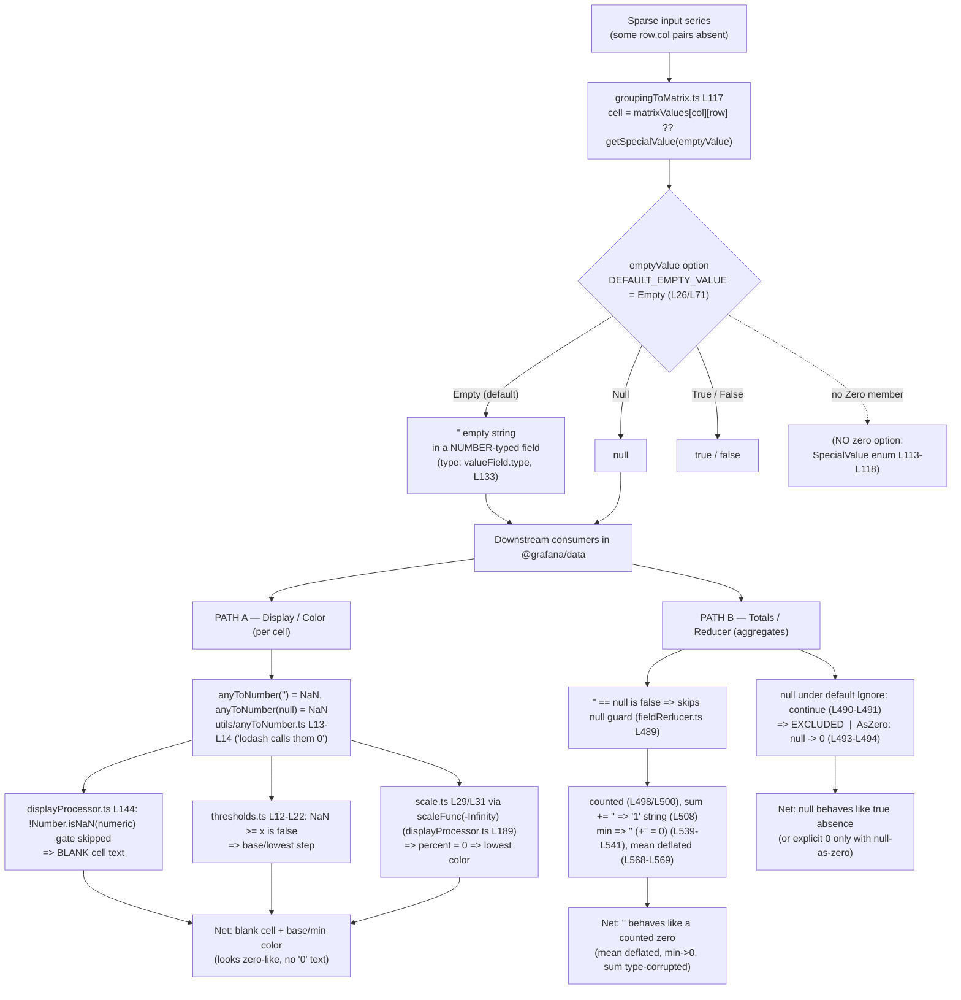

# Grouping to Matrix — Behavior on Sparse Input (Empty Intersections)

> **Investigative, source-code-grounded Q&A report.**
> Deliverable name derives from the source branch `grafana_4550cfb5b728`
> (resolved via `git rev-parse --abbrev-ref HEAD`).

---

## Section A — Title, Scope & Commit Pinning

**Subject:** Grafana's **"Grouping to matrix"** data transformation, and specifically *what value it
emits for a `(row, column)` intersection that never appears in a sparse input series*, plus *how that
value is carried forward* when a panel computes totals (field reducers), thresholds, and color scales.

**Pinned commit / branch (fidelity statement).** Every conclusion and every `path:line` citation in this
document is valid **as of HEAD commit `4550cfb5b72886782d9a3e6cf995f8dbd57ca4ff`** (branch
`grafana_4550cfb5b728`). The behavior described here — and in particular the *absence of a built-in
"zero" option* — is a property of this commit. The upstream limitation is tracked in GitHub issue
**grafana/grafana#97632** and **may be resolved in later commits**; if you are reading the code at a
different revision, re-verify the cited lines.

### TL;DR (the thesis)

The transformation **never emits `0`**. For a missing intersection, its **default** emit is an
**empty string `''`**, and that `''` is placed into a field that is **typed as a number** (it inherits the
value field's type). The user-selectable options are exactly **`Null`, `True`, `False`, `Empty`** — **there is
no `Zero` option**. The "missing → effectively zero" behavior an operator observes is therefore *not*
produced by the transformation; it is produced **downstream**, and it **differs by code path**:

- **Display / color path:** `''` (and `null`) coerce to `NaN`, so the cell renders **blank** and receives
  the **base/lowest color**. It *looks* like a zero cell but the text is empty, not `"0"`.
- **Totals / reducer path:** `''` is **silently counted** (the reducer's null guard does not catch it), so it
  behaves like a counted zero in aggregates — deflating the mean, dragging `min` to `''` (which numerically
  coerces to `0`), and type-corrupting `sum` into a string. By contrast, `null` under the default
  null-handling mode is **excluded**.

The structural root of the confusion (the "where", objective O3) is exactly this mismatch: a
**number-typed column holding a non-numeric empty-string sentinel**.

### Methodology — "code as truth"

This report is grounded in the source code at the pinned commit. **Every substantive claim ends with an
exact `path:line` citation.** External documentation (official Grafana docs, AWS Managed Grafana docs) and
the project's own issue tracker are cited only as **secondary corroboration** — they never override the
source. Behavioral claims were additionally confirmed by (a) running the transformation's existing Jest
suite and (b) executing an ephemeral, repository-external probe that calls the **real** `@grafana/data`
functions (`anyToNumber`, `reduceField`/`doStandardCalcs`). See **Section G** for the reproduction and its
observed values. No source file was modified; the repository tree is left unchanged aside from this
document, which lives under `blitzy/documentation/` (outside the source tree).

> **Path note (important for verification).** The coercion helper `anyToNumber` lives at
> **`packages/grafana-data/src/utils/anyToNumber.ts`** — *not* under `field/`. The `field/anyToNumber.ts`
> path does not exist; `displayProcessor` imports it from `../utils/anyToNumber`
> (`packages/grafana-data/src/field/displayProcessor.ts:L13`). All citations below use the `utils/` path.

---

## Section B — The Question (verbatim)

> *"When the 'Grouping to matrix' transformation receives sparse series where some (row, column) pairings
> never appear, what does it emit for the empty intersections — an empty cell, a null, or a zero — and how
> is that value carried forward when the panel computes totals, thresholds, or color scales? The intent is
> 'missing means zero,' but the dashboard appears to choose differently; identify where the semantics
> shift."*

This decomposes into three sub-objectives, answered explicitly below:

| Objective | Question | Answered in |
|-----------|----------|-------------|
| **O1 — Emit value** | What goes into a never-seen `(row, column)` cell? | Section C (+ D) |
| **O2 — Downstream propagation** | How is that value carried through totals, thresholds, color scales? | Section F (+ G) |
| **O3 — Locus of the shift** | Where does "absent/blank" become an effective numeric value? | Section E (+ H) |

---

## Section C — O1: What value is emitted for an empty intersection?

**Direct answer:** By default, a never-seen `(row, column)` intersection receives an **empty string
`''`**. The only configurable alternatives are `null`, `true`, or `false`. **It is never `0`.**

The reasoning, traced through the code in logical order:

**1. The matrix is built from the rows that *do* exist, then every cell is filled with nullish
coalescing.** The transformation first records each input `(column, row) → value` it actually observes
(`packages/grafana-data/src/transformations/transformers/groupingToMatrix.ts:L102`). It then iterates over
the full Cartesian product of unique columns × unique rows and fills each cell as follows:

```ts
const value = matrixValues[columnName][rowName] ?? getSpecialValue(emptyValue);
```

(`packages/grafana-data/src/transformations/transformers/groupingToMatrix.ts:L117`). The `??` (nullish
coalescing) is the crux: **if** the `(column, row)` pairing existed in the input, its real value is used;
**otherwise** — i.e., for a sparse/missing intersection — the configured *empty value* is substituted via
`getSpecialValue(emptyValue)`.

**2. The default empty value is `SpecialValue.Empty`.** The constant is
`const DEFAULT_EMPTY_VALUE = SpecialValue.Empty;`
(`packages/grafana-data/src/transformations/transformers/groupingToMatrix.ts:L26`), and it is applied
whenever the user has not chosen otherwise:
`const emptyValue = options.emptyValue || DEFAULT_EMPTY_VALUE;`
(`packages/grafana-data/src/transformations/transformers/groupingToMatrix.ts:L71`). The option itself is
declared as `emptyValue?: SpecialValue` on the transformer's options interface
(`packages/grafana-data/src/transformations/transformers/groupingToMatrix.ts:L20`).

**3. `getSpecialValue` maps the enum to concrete runtime values.** The mapping is a simple switch:

```ts
function getSpecialValue(specialValue: SpecialValue) {
  switch (specialValue) {
    case SpecialValue.False:  return false;   // L180–L181
    case SpecialValue.True:   return true;    // L182–L183
    case SpecialValue.Null:   return null;    // L184–L185
    case SpecialValue.Empty:
    default:                  return '';      // L186–L188  (empty string)
  }
}
```

(`packages/grafana-data/src/transformations/transformers/groupingToMatrix.ts:L178-L190`). So the default
(`Empty`) — and indeed any unrecognized value via the `default` branch — yields the **empty string `''`**,
`Null` yields `null`, and `True`/`False` yield the booleans.

**4. There is no `Zero`. The option set is exactly four values.** The `SpecialValue` enum is defined as:

```ts
export enum SpecialValue {
  True = 'true',
  False = 'false',
  Null = 'null',
  Empty = 'empty',
}
```

(`packages/grafana-data/src/types/transformations.ts:L113-L118`). There is **no `Zero` member** — which
directly answers the user's "…or a zero?" question: **No.** The transformation cannot emit a numeric `0`
for a missing cell at this commit, because no enum value maps to `0` and the cell-fill expression only ever
substitutes `getSpecialValue(emptyValue)`
(`packages/grafana-data/src/transformations/transformers/groupingToMatrix.ts:L117`).

**Conclusion for O1.** The emitted value for a missing intersection is, by default, the **empty string
`''`**; the selectable alternatives are `null`, `true`, and `false`. It is **never `0`**, and it is **not
`null` unless the user explicitly selects `Null`**
(`packages/grafana-data/src/transformations/transformers/groupingToMatrix.ts:L26,L71,L117,L178-L190`;
`packages/grafana-data/src/types/transformations.ts:L113-L118`).

---

## Section D — Authoritative behavioral confirmation (the unit tests)

The co-located test file encodes this behavior precisely, making it the primary ground-truth artifact.

**Default options produce a number-typed field whose missing cells are empty strings.** With `options: {}`
over a single series of three time points, the expected output fields are typed `FieldType.number` and hold
empty strings in the missing positions:

- `name: '1000'`, `type: FieldType.number`, `values: [1, '', '']`
  (`packages/grafana-data/src/transformations/transformers/groupingToMatrix.test.ts:L41`)
- `name: '1001'`, `type: FieldType.number`, `values: ['', 2, '']`
  (`packages/grafana-data/src/transformations/transformers/groupingToMatrix.test.ts:L47`)
- `name: '1002'`, `type: FieldType.number`, `values: ['', '', 3]`
  (`packages/grafana-data/src/transformations/transformers/groupingToMatrix.test.ts:L53`)

A second test with multiple fields shows the same pattern — a missing cell becomes `''` inside a
number-typed column: `name: 'C2'`, `values: [5, '']`
(`packages/grafana-data/src/transformations/transformers/groupingToMatrix.test.ts:L99`).

**Selecting `emptyValue: SpecialValue.Null` produces `null` instead of `''`.** With
`options: { emptyValue: SpecialValue.Null }`
(`packages/grafana-data/src/transformations/transformers/groupingToMatrix.test.ts:L112`), the expected
number-typed output is:

- `name: '1000'`, `type: FieldType.number`, `values: [1, null]`
  (`packages/grafana-data/src/transformations/transformers/groupingToMatrix.test.ts:L136`)
- `name: '1001'`, `type: FieldType.number`, `values: [null, 2]`
  (`packages/grafana-data/src/transformations/transformers/groupingToMatrix.test.ts:L142`)

**No test anywhere produces `0` for a missing cell.** Across the entire suite, the only missing-cell values
are `''` (default) and `null` (when `Null` is selected) — corroborating, from the project's own tests, that
no zero behavior exists (`packages/grafana-data/src/transformations/transformers/groupingToMatrix.test.ts:L41,L47,L53,L99,L136,L142`).
Running this suite (Section G) passes unchanged.

---

## Section E — O3: The root mismatch (a number-typed field holding `''`)

**The generated matrix column inherits the *type* of the value field, but its missing cells hold `''`.**
When the transformation pushes each generated column, it copies the value field's configuration and **type**
verbatim:

```ts
fields.push({
  name: columnName.toString(),   // L130
  values: values,                // L131  (contains real values and '' for missing cells)
  config: valueField.config,     // L132
  type: valueField.type,         // L133  ← inherits the value field's type
});
```

(`packages/grafana-data/src/transformations/transformers/groupingToMatrix.ts:L129-L134`). When the value
field is numeric (`FieldType.number`), the **new column is therefore declared `number`-typed**
(`packages/grafana-data/src/transformations/transformers/groupingToMatrix.ts:L133`) — *yet* its missing
cells contain the empty string `''` produced at
`packages/grafana-data/src/transformations/transformers/groupingToMatrix.ts:L117`.

**Why this is the locus of the semantic shift (the answer to O3).** A field declared `number` that contains
a **non-numeric empty-string sentinel** is the structural contradiction at the heart of the user's
question. The transformation itself does *not* decide that "missing = zero"; it merely writes `''` into a
number-typed slot. The shift from "absent/blank" to an *effective numeric value* happens **downstream**,
where consumers that trust the `number` type must reinterpret that `''`:

- the per-cell display/color pipeline coerces it (Section F, Path A), and
- the field reducers aggregate over it as if it were a number (Section F, Path B).

This is confirmed empirically: a faithful call to the real reducer over a number-typed `[1, '', '']`
treats the field as numeric because `isNumberField` is `true`
(`packages/grafana-data/src/transformations/fieldReducer.ts:L478`), which is precisely why the `''` is
allowed to enter the numeric sum/min/max branch (Section F, Path B; Section G). **The semantics shift
downstream of the transformation, not inside it.**

---

## Section F — O2: Downstream propagation along TWO divergent paths

Once the transformation has emitted `''` (default) into a number-typed column, that sentinel flows into the
panel-agnostic value-processing layer of `@grafana/data`. **It is treated differently by two distinct
paths**, which is why a blanket answer to O2 would be wrong:

- **Path A — per-cell display & color** (what each cell *shows* and *what color* it gets).
- **Path B — aggregate totals & reducers** (sum/mean/min/max/count for footers, scale ranges, etc.).

### Path A — Display / Color (per cell)

**A1. The display processor coerces the raw cell value to a number via `anyToNumber`.** `displayProcessor`
imports the helper from the `utils/` path
(`import { anyToNumber } from '../utils/anyToNumber';` —
`packages/grafana-data/src/field/displayProcessor.ts:L13`) and computes:

```ts
let numeric = isStringUnit ? NaN : anyToNumber(value);
```

(`packages/grafana-data/src/field/displayProcessor.ts:L96`).

**A2. The decisive coercion: `anyToNumber('') === NaN` — deliberately, not `0`.** The helper returns `NaN`
for empty string, `null`, `undefined`, and arrays:

```ts
export function anyToNumber(value: unknown): number {
  if (typeof value === 'number') {
    return value;                                   // L9–L11
  }
  if (value === '' || value === null || value === undefined || Array.isArray(value)) {
    return NaN; // lodash calls them 0              // L13–L14
  }
  if (typeof value === 'boolean') {
    return value ? 1 : 0;                           // L17–L18
  }
  return toNumber(value);                           // L21
}
```

(`packages/grafana-data/src/utils/anyToNumber.ts:L8-L22`). The inline comment **`// lodash calls them 0`**
(`packages/grafana-data/src/utils/anyToNumber.ts:L14`) is the linchpin of Path A: Grafana **deliberately
diverged from lodash**, whose `toNumber('') === 0`, and chose `NaN` instead. This single decision is *why a
missing cell is not rendered as `0`.* (The empirical confirmation — `anyToNumber('') === NaN`,
`anyToNumber(null) === NaN`, `anyToNumber(true) === 1` — is in Section G.)

**A3. `NaN` gates out numeric formatting → the cell text is blank.** Numeric formatting is performed only
inside `if (!Number.isNaN(numeric)) { ... }`
(`packages/grafana-data/src/field/displayProcessor.ts:L144`). Because `numeric` is `NaN` for a `''` cell,
this block is skipped, so no formatted numeric text is produced and the cell renders **blank** (not the
string `"0"`).

**A4. Threshold evaluation returns the base/lowest step.** `getActiveThreshold` starts at the first
(lowest) step and walks upward only while `value >= threshold.value`:

```ts
let active = thresholds[0];                  // L12  (base step)
for (const threshold of thresholds) {
  if (value >= threshold.value) {            // L15
    active = threshold;
  } else {
    break;                                   // L18
  }
}
return active;                               // L22
```

(`packages/grafana-data/src/field/thresholds.ts:L12-L22`). Since the cell coerces to `NaN`, and **`NaN >= x`
is always `false`**, the loop never advances past the first step — the cell is assigned the **base/lowest**
threshold step.

**A5. The color scale yields `percent = 0` (lowest color) for the no-color case.** When no explicit color is
present, `displayProcessor` calls the scale function with `-Infinity`:
`const scaleResult = scaleFunc(-Infinity);`
(`packages/grafana-data/src/field/displayProcessor.ts:L189`, inside `if (!color)` at
`packages/grafana-data/src/field/displayProcessor.ts:L188`). The scale calculator initializes
`let percent = 0;` (`packages/grafana-data/src/field/scale.ts:L29`) and only recomputes the percentage
inside `if (value !== -Infinity) { ... }` (`packages/grafana-data/src/field/scale.ts:L31`). For
`-Infinity`, the guard is false, so `percent` stays `0` → the **lowest** color on the scale. (The scale's
own min/max range is itself derived from the field's reducers via
`reduceField({ field, reducers: [ReducerID.min, ReducerID.max] })` —
`packages/grafana-data/src/field/scale.ts:L85`, range block
`packages/grafana-data/src/field/scale.ts:L79-L96` — which links Path A's color range back to Path B's
reducer behavior.)

**Net effect for Path A.** A missing cell renders as a **blank cell that receives the base/lowest color**.
Visually it can resemble a "zero" cell, but it contains **no `"0"` text** — the appearance comes from `NaN`
gating out formatting (`packages/grafana-data/src/field/displayProcessor.ts:L144`) and from the base step /
`percent = 0` color (`packages/grafana-data/src/field/thresholds.ts:L12-L22`;
`packages/grafana-data/src/field/scale.ts:L29-L31`).

### Path B — Totals / Reducer (aggregates)

Field reductions flow through `reduceField`
(`packages/grafana-data/src/transformations/fieldReducer.ts:L159`), which delegates the standard statistics
to `let values = doStandardCalcs(field, ignoreNulls, nullAsZero);`
(`packages/grafana-data/src/transformations/fieldReducer.ts:L214`). The signature is
`doStandardCalcs(field, ignoreNulls, nullAsZero)`
(`packages/grafana-data/src/transformations/fieldReducer.ts:L468`), seeded from `defaultCalcs` with
`sum: 0` (`:L446`), `max: -Number.MAX_VALUE` (`:L447`), `min: Number.MAX_VALUE` (`:L448`), `mean: null`
(`:L450`), and `nonNullCount: 0` (`:L456`)
(`packages/grafana-data/src/transformations/fieldReducer.ts:L445-L458`).

The number-typed matrix column matters here too: `const isNumberField = field.type === FieldType.number ||
field.type === FieldType.time;` (`packages/grafana-data/src/transformations/fieldReducer.ts:L478`) is
**`true`** for the generated column (its type was inherited at
`packages/grafana-data/src/transformations/transformers/groupingToMatrix.ts:L133`). Now follow a `''` cell
through the per-value loop:

**B1. The null guard does *not* catch `''`.** The only null handling is gated on `== null`:

```ts
if (currentValue == null) {     // L489
  if (ignoreNulls) {
    continue;                   // L490–L491  (default Ignore: drop the value)
  }
  if (nullAsZero) {
    currentValue = 0;           // L493–L494  (AsZero: null → 0)
  }
}
```

(`packages/grafana-data/src/transformations/fieldReducer.ts:L489-L496`). Because **`'' == null` is `false`**
in JavaScript, an empty string **skips this entire block** — it is neither ignored nor converted. (`==`
against `null` matches only `null`/`undefined`.) Consequently the `nullAsZero` conversion at
`packages/grafana-data/src/transformations/fieldReducer.ts:L493-L494` is **unreachable for `''`** — it only
ever converts `null`.

**B2. Every value (including `''`) increments `count`.** Immediately after the null block:
`calcs.count++;` (`packages/grafana-data/src/transformations/fieldReducer.ts:L498`). So `''` is counted.

**B3. `''` passes the aggregation gate.** The numeric aggregation is guarded by:
`if (currentValue != null && !Number.isNaN(currentValue)) { ... }`
(`packages/grafana-data/src/transformations/fieldReducer.ts:L500`). For `''`: `'' != null` is `true` and
`Number.isNaN('')` is `false` (note: `Number.isNaN` does **not** coerce — it only returns `true` for an
actual `NaN`), so **`''` enters the aggregation body**.

**B4. `sum` is type-corrupted into a string.** Inside the `if (isNumberField)` branch
(`packages/grafana-data/src/transformations/fieldReducer.ts:L507`), the running total is updated with
`calcs.sum += currentValue;` (`packages/grafana-data/src/transformations/fieldReducer.ts:L508`). Starting
from `sum: 0` (`:L446`), once a `''` is added JavaScript performs **string concatenation**
(`0 + 1 + '' → "1"`), so `sum` becomes the **string** `"1"` — numerically still "1" but **type-corrupted**.
(Community report #74645 describes exactly this: "addition shud be numeric rather than string concat".)

**B5. `min` is dragged to `''` (which coerces to `0`).** `min` starts at `Number.MAX_VALUE` (`:L448`) and is
updated by:

```ts
if (currentValue > calcs.max) { calcs.max = currentValue; }   // L535–L536
if (currentValue < calcs.min) { calcs.min = currentValue; }   // L539–L541
```

(`packages/grafana-data/src/transformations/fieldReducer.ts:L535-L541`). Since **`'' < 1` is `true`** (the
empty string coerces to `0` in a relational comparison), `min` becomes `''`. That `''` **numerically coerces
to `0`** elsewhere (e.g. `+'' === 0`), so it behaves like a zero minimum. The `max` comparison is
unaffected because `'' > <positive>` is `false`.

**B6. `mean` is deflated as if blanks were zeros.** After the loop, the mean divides the (type-corrupted)
sum by the inflated count: `calcs.mean = calcs.sum! / calcs.nonNullCount;`
(`packages/grafana-data/src/transformations/fieldReducer.ts:L568-L569`), where `nonNullCount` (`:L456`,
incremented at `:L510`) counts each `''`. Because the blanks bloat the denominator without adding to the
numerator, the mean is **deflated** — exactly the result one would get if the blanks were zeros.

**B7. Contrast: `null` under the default `Ignore` mode is *excluded*.** A `null` cell *does* hit the null
guard (`currentValue == null` is `true` at
`packages/grafana-data/src/transformations/fieldReducer.ts:L489`), so under the default Ignore mode it is
dropped via `if (ignoreNulls) { continue; }`
(`packages/grafana-data/src/transformations/fieldReducer.ts:L490-L491`) and never reaches `count`, `sum`,
`min`, or `mean`. Only when the field's null-value mode is `AsZero` is a `null` converted to `0`
(`packages/grafana-data/src/transformations/fieldReducer.ts:L493-L494`) — and even then, that conversion
applies to `null` only, **never** to `''`.

**Net effect for Path B.** Under the default `Empty` setting, the empty-string sentinel behaves like a
**counted zero** in totals/mean/min (deflating the mean, dragging `min` toward `0`, and type-corrupting
`sum`). Under `Null`, the missing cell behaves like a **true absence** in the default Ignore mode (excluded
from aggregates), or like an explicit `0` only if null-as-zero is enabled
(`packages/grafana-data/src/transformations/fieldReducer.ts:L489-L500,L508,L539-L541,L568-L569`).

---

## Section G — Empirical reproduction (read-only)

All findings were confirmed against the real code at the pinned commit. The repository was left unchanged:
the only probe lived **outside** the source tree (under `/tmp`) and was deleted afterward, and
`git status --porcelain` for the source tree is empty.

### G1 — Emit values via the existing Jest suite (in-repo, read-only run)

Run the transformation's own test **without watch mode** (the root `test` script uses `--watch`, which hangs
non-interactively — invoke Jest directly instead):

```bash
# Node v22 (engines ">= 22"; repo pins 22.11.0 via .nvmrc), Yarn 4.5.3, after `yarn install`.
CI=true yarn jest packages/grafana-data/src/transformations/transformers/groupingToMatrix.test.ts \
  --watchAll=false --ci
```

**Observed result:** the suite **passes** — `Test Suites: 1 passed`, `Tests: 4 passed`,
`Snapshots: 1 passed`. This confirms the emit values asserted in Section D: `[1, '', '']` (default) and
`[1, null]` / `[null, 2]` (when `emptyValue: SpecialValue.Null`)
(`packages/grafana-data/src/transformations/transformers/groupingToMatrix.test.ts:L41,L136,L142`). (Jest may
print pre-existing `jest-haste-map: duplicate manual mock` warnings about unrelated datasource mocks
elsewhere in the monorepo; these are not errors and do not affect this suite.)

### G2 — Downstream coercion & reducer semantics via an ephemeral out-of-repo probe

A standalone script under `/tmp` imported the **real** `@grafana/data` functions (`anyToNumber`,
`reduceField`/`doStandardCalcs`, `ReducerID`, `FieldType`) directly from the repository source (transpiled
on the fly) — i.e., these are *actual code outputs*, not a re-implementation — and was deleted after use.

**Raw JavaScript coercion facts (language-level truth underpinning the code):**

| Expression | Observed |
|------------|----------|
| `'' == null` | `false` (so the reducer's `== null` guard misses `''`) |
| `Number.isNaN('')` | `false` (so `''` passes the aggregation gate) |
| `0 + 1 + '' + ''` | `"1"` — `typeof` is `string` (so `sum` is type-corrupted) |
| `'' < 1` | `true` (so `min` is dragged to `''`) |
| `+''` | `0` (so `''` numerically coerces to zero) |
| `'1' / 3` | `0.3333333333333333` (string sum still divides numerically → deflated mean) |

**Real `anyToNumber(...)` outputs** (`packages/grafana-data/src/utils/anyToNumber.ts:L8-L22`):
`anyToNumber('') === NaN`, `anyToNumber(null) === NaN`, `anyToNumber(undefined) === NaN`,
`anyToNumber([1,2]) === NaN`, `anyToNumber(true) === 1`, `anyToNumber(false) === 0`,
`anyToNumber('3.5') === 3.5`, `anyToNumber(7) === 7`.

**Real `doStandardCalcs` over a number-typed field** (`packages/grafana-data/src/transformations/fieldReducer.ts:L468`):

| Input (number-typed) | `count` | `nonNullCount` | `sum` | `mean` | `min` | `max` |
|----------------------|:-------:|:--------------:|:-----:|:------:|:-----:|:-----:|
| `[1, '', '']` (default `Empty`) | `3` | `3` | `"1"` *(string!)* | `0.3333…` *(deflated)* | `''` *(`+min === 0`)* | `1` |
| `[1, null, null]` (default `Ignore`) | `1` | `1` | `1` *(number)* | `1` *(correct)* | `1` | `1` |

The public `reduceField(...)` path (`packages/grafana-data/src/transformations/fieldReducer.ts:L159`) returns
the same values via `ReducerID` (`[1,'','']` → `mean = 0.333`, `min = ''`, `sum = "1"`, `count = 3`;
`[1,null,null]` → `mean = 1`, `min = 1`, `sum = 1`, `count = 1`).

> **Phrasing caution (do not overclaim).** `min` is the empty string `''` that *numerically coerces to 0*
> (e.g. `+'' === 0`); it is **not** the display text `"0"`. The per-cell display path coerces `'' → NaN`
> (`packages/grafana-data/src/utils/anyToNumber.ts:L13-L14`) and would render the cell **blank**
> (`packages/grafana-data/src/field/displayProcessor.ts:L144`). The "0-like" behavior in aggregates is a
> coercion/aggregation artifact, not display text.

---

## Section H — Resolution of "missing means zero," path-by-path

The user's mental model — "missing means zero" — is **partially and conditionally** realized, and **never by
the transformation itself** (which emits `''`/`null`/`true`/`false`, never `0` —
`packages/grafana-data/src/transformations/transformers/groupingToMatrix.ts:L117,L178-L190`;
`packages/grafana-data/src/types/transformations.ts:L113-L118`):

| Path / framing | "Missing = zero"? | Why (cited) |
|----------------|-------------------|-------------|
| **Aggregate totals / mean** (default `Empty`) | **Effectively TRUE** | `''` slips past the `== null` guard (`packages/grafana-data/src/transformations/fieldReducer.ts:L489`) and is counted (`:L500`), so blanks behave like zeros — deflating the mean (`:L568-L569`) and dragging `min` to `''`/`0` (`:L539-L541`). |
| **Per-cell display text** | **FALSE** | `anyToNumber('') === NaN` (`packages/grafana-data/src/utils/anyToNumber.ts:L13-L14`) gates out numeric formatting (`packages/grafana-data/src/field/displayProcessor.ts:L144`) → the cell renders **blank**, not `"0"`. |
| **Explicit zero** | **Only via `Null` + null-as-zero** | Set `emptyValue = Null` so cells are `null` (`packages/grafana-data/src/transformations/transformers/groupingToMatrix.ts:L184-L185`), then the field's null-value mode `AsZero` converts `null → 0` in the reducer (`packages/grafana-data/src/transformations/fieldReducer.ts:L493-L494`). |

**Where the semantics shift (O3, restated).** Not in the transformation — which faithfully writes `''` into
a number-typed field (`packages/grafana-data/src/transformations/transformers/groupingToMatrix.ts:L117,L133`)
— but **downstream**, where the number-typed reducers and the display-coercion logic must reinterpret that
empty-string sentinel (`packages/grafana-data/src/transformations/fieldReducer.ts:L489,L500`;
`packages/grafana-data/src/utils/anyToNumber.ts:L13-L14`). The display path turns it into `NaN` (blank +
base color); the totals path counts it as a zero-like value. **That divergence is the "different choice" the
dashboard appears to make.**

---

## Section I — Recommendation & upstream tracking

- **To make "missing" behave as a *true absence*** (excluded from totals/mean): set **`emptyValue = Null`**.
  Under the default Ignore null mode, the reducer drops nulls
  (`packages/grafana-data/src/transformations/fieldReducer.ts:L489-L491`), so the mean is computed over only
  the real values (empirically: `[1, null, null] → mean = 1`, Section G). Avoid the default `Empty` if you do
  not want blanks silently counted as zeros.
- **To make "missing" an explicit `0`:** there is **no built-in option at this commit** — the `SpecialValue`
  enum has no `Zero` (`packages/grafana-data/src/types/transformations.ts:L113-L118`). The practical
  workarounds are (a) select `emptyValue = Null` and enable the field's **null-as-zero** mode, which converts
  `null → 0` in the reducer (`packages/grafana-data/src/transformations/fieldReducer.ts:L493-L494`), or
  (b) add a downstream calculation/override that maps the blank to `0`.
- **Upstream tracking (secondary corroboration).** This exact limitation is reported in **GitHub issue
  grafana/grafana#97632 — "Transformations: Grouping to matrix doesn't support 0 for undefined
  combinations"** (opened 2024-12-09, label `area/transformations`, since closed). The reporter observed that
  cells come out empty rather than `0`, which "causes issues when visualizing with Bar Chart grouping," and
  expected the cells to contain `0`. This independently confirms — from the project's own tracker — that **no
  built-in zero behavior exists at/around this commit.** *(External source; corroboration only, secondary to
  the code above.)*

---

## Section J — UI, in-app docs, registration & external corroboration (context)

**Editor exposes exactly four options, defaulting to `Empty`.** The transformer's editor defines:

```ts
const specialValueOptions: Array<SelectableValue<SpecialValue>> = [
  { label: 'Null',  value: SpecialValue.Null,  description: 'Null value' },
  { label: 'True',  value: SpecialValue.True,  description: 'Boolean true value' },
  { label: 'False', value: SpecialValue.False, description: 'Boolean false value' },
  { label: 'Empty', value: SpecialValue.Empty, description: 'Empty string' },
];
```

(`public/app/features/transformers/editors/GroupingToMatrixTransformerEditor.tsx:L61-L66`). The "Empty
Value" `Select` binds to `options.emptyValue`
(`public/app/features/transformers/editors/GroupingToMatrixTransformerEditor.tsx:L101`); when left unset,
the transformer falls back to `DEFAULT_EMPTY_VALUE = SpecialValue.Empty`
(`packages/grafana-data/src/transformations/transformers/groupingToMatrix.ts:L26,L71`). There is **no
"Zero" entry** in the dropdown.

**In-app help text shows blank cells for missing combinations.** The bundled documentation states that for
the remaining cells "you can select which value to display between: **Null**, **True**, **False**, or
**Empty**" (`public/app/features/transformers/docs/content.ts:L631`), and its worked example renders the
missing combinations as **blank cells** in the output table
(`public/app/features/transformers/docs/content.ts:L635-L639`, within the help block
`public/app/features/transformers/docs/content.ts:L617-L642`) — no `0`.

**Registration chain (for completeness).** The transformer is identified by
`groupingToMatrix = 'groupingToMatrix'`
(`packages/grafana-data/src/transformations/transformers/ids.ts:L36`), imported and registered in the
standard registry (`packages/grafana-data/src/transformations/transformers.ts:L13` and `:L56`), and surfaced
in the UI as a registry item (`public/app/features/transformers/standardTransformers.ts:L16` and `:L63`;
exported at `public/app/features/transformers/editors/GroupingToMatrixTransformerEditor.tsx:L108`).

**Panel viewers are panel-agnostic for this question.** Panels such as
`public/app/plugins/panel/{table,barchart,heatmap,stat}/` merely *render* the matrix; the semantic decisions
about `''`/`null` live in the shared `@grafana/data` display, reduce, threshold, and scale modules cited
throughout this document — not in the panels themselves.

**External corroboration (secondary to source).** The official Grafana "Transform data" documentation and
the AWS Managed Grafana documentation both describe the same four options — *select which value to display
between Null, True, False, or Empty* — and **neither lists a "Zero" choice**, matching the code's
`SpecialValue` enum (`packages/grafana-data/src/types/transformations.ts:L113-L118`). These external sources
are used only to corroborate the source-derived conclusion; the code at the pinned commit is authoritative.

---

## Section K — Pipeline diagram



---

## Section L — Per-claim citation index

Every substantive claim above maps to one or more exact `path:line` locators, listed here for verification
at commit `4550cfb5b72886782d9a3e6cf995f8dbd57ca4ff`.

### Origin of the empty-cell value (O1) + root mismatch (O3)

| Finding | Citation |
|---------|----------|
| Cell fill `... ?? getSpecialValue(emptyValue)` | `packages/grafana-data/src/transformations/transformers/groupingToMatrix.ts:L117` |
| Input rows recorded into `matrixValues` | `packages/grafana-data/src/transformations/transformers/groupingToMatrix.ts:L102` |
| `emptyValue?` option declared | `packages/grafana-data/src/transformations/transformers/groupingToMatrix.ts:L20` |
| `DEFAULT_EMPTY_VALUE = SpecialValue.Empty` | `packages/grafana-data/src/transformations/transformers/groupingToMatrix.ts:L26` |
| Default resolution `options.emptyValue \|\| DEFAULT_EMPTY_VALUE` | `packages/grafana-data/src/transformations/transformers/groupingToMatrix.ts:L71` |
| `getSpecialValue` mapping (False→false, True→true, Null→null, Empty/default→`''`) | `packages/grafana-data/src/transformations/transformers/groupingToMatrix.ts:L178-L190` |
| Output column inherits value field type (`type: valueField.type`) | `packages/grafana-data/src/transformations/transformers/groupingToMatrix.ts:L133` (push block `:L129-L134`) |
| `SpecialValue` enum = {True, False, Null, Empty}; **no Zero** | `packages/grafana-data/src/types/transformations.ts:L113-L118` |
| Default output `[1,'','']` / `['',2,'']` / `['','',3]`, number-typed | `packages/grafana-data/src/transformations/transformers/groupingToMatrix.test.ts:L41,L47,L53` |
| Multi-field missing cell `[5,'']` | `packages/grafana-data/src/transformations/transformers/groupingToMatrix.test.ts:L99` |
| `emptyValue: SpecialValue.Null` → `[1,null]` / `[null,2]` | `packages/grafana-data/src/transformations/transformers/groupingToMatrix.test.ts:L112,L136,L142` |

### Display / color path (O2-A)

| Finding | Citation |
|---------|----------|
| `anyToNumber` imported from `../utils/anyToNumber` | `packages/grafana-data/src/field/displayProcessor.ts:L13` |
| `numeric = isStringUnit ? NaN : anyToNumber(value)` | `packages/grafana-data/src/field/displayProcessor.ts:L96` |
| `anyToNumber` returns `NaN` for `''`/`null`/`undefined`/array (`// lodash calls them 0`) | `packages/grafana-data/src/utils/anyToNumber.ts:L8-L22` (esp. `:L13-L14`) |
| boolean → 1/0; else `toNumber(value)` | `packages/grafana-data/src/utils/anyToNumber.ts:L17-L18,L21` |
| Numeric-format gate `if (!Number.isNaN(numeric))` → blank when NaN | `packages/grafana-data/src/field/displayProcessor.ts:L144` |
| Threshold: base step, `value >= threshold.value`, `NaN >= x` false | `packages/grafana-data/src/field/thresholds.ts:L12-L22` |
| No-color call `scaleFunc(-Infinity)` (inside `if (!color)`) | `packages/grafana-data/src/field/displayProcessor.ts:L188-L189` |
| Scale `let percent = 0` and `if (value !== -Infinity)` → percent stays 0 | `packages/grafana-data/src/field/scale.ts:L29,L31` |
| Scale min/max range via `reduceField([min,max])` | `packages/grafana-data/src/field/scale.ts:L85` (block `:L79-L96`) |

### Totals / reducer path (O2-B)

| Finding | Citation |
|---------|----------|
| `reduceField` entry | `packages/grafana-data/src/transformations/fieldReducer.ts:L159` |
| Delegates to `doStandardCalcs(field, ignoreNulls, nullAsZero)` | `packages/grafana-data/src/transformations/fieldReducer.ts:L214` |
| `doStandardCalcs` signature | `packages/grafana-data/src/transformations/fieldReducer.ts:L468` |
| `defaultCalcs` (sum:0, max:-MAX, min:MAX, mean:null, nonNullCount:0) | `packages/grafana-data/src/transformations/fieldReducer.ts:L446,L447,L448,L450,L456` |
| `isNumberField` true for number/time field | `packages/grafana-data/src/transformations/fieldReducer.ts:L478` |
| Null guard `if (currentValue == null)` misses `''` | `packages/grafana-data/src/transformations/fieldReducer.ts:L489` |
| Default Ignore → `continue` (null excluded) | `packages/grafana-data/src/transformations/fieldReducer.ts:L490-L491` |
| `AsZero` → `currentValue = 0` (null only) | `packages/grafana-data/src/transformations/fieldReducer.ts:L493-L494` |
| `calcs.count++` counts `''` | `packages/grafana-data/src/transformations/fieldReducer.ts:L498` |
| Aggregation gate `!= null && !Number.isNaN` — `''` passes | `packages/grafana-data/src/transformations/fieldReducer.ts:L500` |
| `calcs.sum += currentValue` type-corrupts to string | `packages/grafana-data/src/transformations/fieldReducer.ts:L508` |
| `max` / `min` comparisons; `'' < 1` → min becomes `''` | `packages/grafana-data/src/transformations/fieldReducer.ts:L535-L536,L539-L541` |
| `mean = sum / nonNullCount` (deflated) | `packages/grafana-data/src/transformations/fieldReducer.ts:L568-L569` |

### UI / docs / registration (context) + external

| Finding | Citation |
|---------|----------|
| Editor: four `specialValueOptions`, `Empty = 'Empty string'` | `public/app/features/transformers/editors/GroupingToMatrixTransformerEditor.tsx:L61-L66` |
| Editor "Empty Value" select binds `options.emptyValue` | `public/app/features/transformers/editors/GroupingToMatrixTransformerEditor.tsx:L101` |
| Editor registry item export | `public/app/features/transformers/editors/GroupingToMatrixTransformerEditor.tsx:L108` |
| In-app docs options text (Null/True/False/Empty) | `public/app/features/transformers/docs/content.ts:L631` |
| In-app docs worked-example blank-cell output table | `public/app/features/transformers/docs/content.ts:L635-L639` (block `:L617-L642`) |
| Transformer id `groupingToMatrix` | `packages/grafana-data/src/transformations/transformers/ids.ts:L36` |
| Standard-registry import + registration | `packages/grafana-data/src/transformations/transformers.ts:L13,L56` |
| UI registry import + item | `public/app/features/transformers/standardTransformers.ts:L16,L63` |
| External (secondary): Grafana & AWS docs list four options, no Zero | Grafana "Transform data" docs; AWS Managed Grafana docs |
| External (secondary): upstream limitation | GitHub issue grafana/grafana#97632 |

---

### Appendix — answer summary

- **O1 (emit value):** default **`''`** (empty string) into a number-typed field; options `null`/`true`/`false`; **never `0`** (`packages/grafana-data/src/transformations/transformers/groupingToMatrix.ts:L117,L26,L178-L190`; `packages/grafana-data/src/types/transformations.ts:L113-L118`).
- **O2 (propagation):** **Path A** display/color — `'' → NaN` → blank cell + base color (`packages/grafana-data/src/utils/anyToNumber.ts:L13-L14`; `packages/grafana-data/src/field/displayProcessor.ts:L144`; `packages/grafana-data/src/field/thresholds.ts:L12-L22`; `packages/grafana-data/src/field/scale.ts:L29-L31`). **Path B** totals/reducer — `''` counted (`packages/grafana-data/src/transformations/fieldReducer.ts:L489,L500`), deflating mean and dragging min to `0`; `null` excluded under default Ignore (`packages/grafana-data/src/transformations/fieldReducer.ts:L490-L491`).
- **O3 (locus):** the shift is **downstream**, rooted in a number-typed column holding `''` (`packages/grafana-data/src/transformations/transformers/groupingToMatrix.ts:L133,L117`), reinterpreted by numeric-typed reducers and coercion logic.

*Conclusions valid as of commit `4550cfb5b72886782d9a3e6cf995f8dbd57ca4ff`; the upstream limitation may be addressed in later commits (see issue #97632).*

