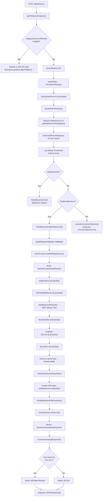
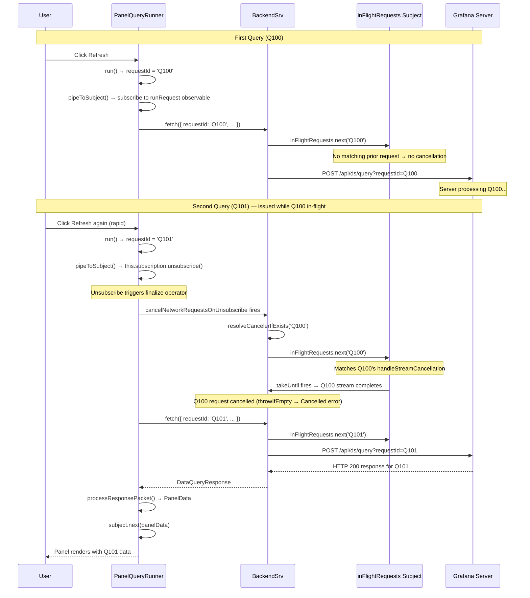
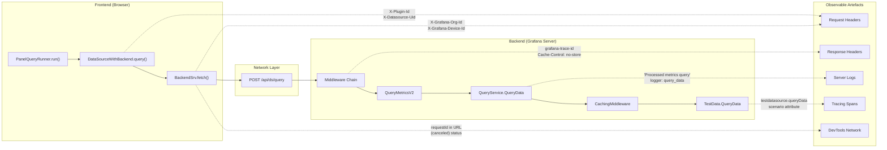

# Grafana Panel Query Execution Lifecycle — Technical Investigation

---

| **Document Attribute** | **Value** |
|------------------------|-----------|
| **Purpose** | Comprehensive technical investigation tracing a panel query from browser initiation to rendered response in Grafana |
| **Scope** | Frontend observable pipeline, backend HTTP handler chain, response processing, repeated-query behaviour, observable artefacts |
| **Methodology** | Source-code analysis combined with runtime observation; no source code modifications |
| **Observation Target** | Built-in TestData data source (`grafana-testdata-datasource`) |
| **Repository** | `grafana/grafana` (OSS) |

---

## Table of Contents

- [Introduction](#introduction)
- [Prerequisites & Setup](#prerequisites--setup)
- [The End-to-End Query Flow](#the-end-to-end-query-flow)
  - [Frontend: Panel Refresh Trigger](#frontend-panel-refresh-trigger)
  - [Frontend: DataQueryRequest Construction (PanelQueryRunner)](#frontend-dataqueryrequest-construction-panelqueryrunner)
  - [Frontend: Datasource Dispatch (DataSourceWithBackend.query)](#frontend-datasource-dispatch-datasourcewithbackendquery)
  - [Frontend: HTTP Transport (BackendSrv.fetch → POST /api/ds/query)](#frontend-http-transport-backendsrvfetch--post-apidsquery)
  - [Backend: Middleware Chain](#backend-middleware-chain-tracing-auth-rbac-no-cache-headers)
  - [Backend: Query Handler (ds_query.go → QueryDataService)](#backend-query-handler-ds_querygo--querydataservice)
  - [Backend: Datasource Routing (query.go → plugin client → TestData)](#backend-datasource-routing-querygo--plugin-client--testdata)
  - [Backend: TestData Execution (testdata.go → scenarios.go)](#backend-testdata-execution-testdatago--scenariosgo)
  - [Backend: Response Assembly (QueryDataResponse, JSON streaming)](#backend-response-assembly-querydataresponse-json-streaming)
  - [Frontend: Response Processing (toDataQueryResponse, processResponsePacket)](#frontend-response-processing-todataqueryresponse-processresponsepacket)
  - [Frontend: Panel Rendering (PanelData emission via ReplaySubject)](#frontend-panel-rendering-paneldata-emission-via-replaysubject)
- [Repeated Query Execution](#repeated-query-execution)
  - [Request Cancellation via requestId (inFlightRequests subject)](#request-cancellation-via-requestid-inflightrequests-subject)
  - [OSS Caching Behaviour (no-op CachingService)](#oss-caching-behaviour-no-op-cachingservice-x-cache-header-absence)
  - [structureRev De-duplication](#structurerev-de-duplication)
  - [Prometheus QueryCache Contrast](#prometheus-querycache-contrast-incremental-backfill-not-applicable-to-testdata)
- [Observable Artefacts Catalogue](#observable-artefacts-catalogue)
  - [Network Requests](#network-requests-url-method-headers-body-shape)
  - [Response Headers](#response-headers-grafana-trace-id-cache-control-x-cache)
  - [Backend Logs](#backend-logs-query-debug-logging-tracing-spans)
  - [Chrome DevTools Observations](#chrome-devtools-observations)
- [Mermaid Diagrams](#mermaid-diagrams)
- [Cleanup Instructions](#cleanup-instructions)
- [Summary and Rationale](#summary-and-rationale)

---

## Introduction

This document is a comprehensive technical investigation into Grafana's internal panel-query execution lifecycle. It answers six concrete questions about how a query travels from a user clicking "Refresh" in the browser to the final rendered visualisation in a panel, and what observable artefacts are produced along the way.

### Documentation Objectives

1. **End-to-end query flow**: Describe, at the code level, the complete path a panel query takes from browser initiation to rendered response, covering both the frontend observable pipeline and the backend HTTP handler chain.
2. **Browser-side request issuance**: Document how `PanelQueryRunner` and `runRequest()` construct a `DataQueryRequest`, how `DataSourceWithBackend.query()` serialises and dispatches it via `BackendSrv.fetch()`, and the network request that reaches the server.
3. **Backend handling**: Explain how the `POST /api/ds/query` endpoint receives the request, resolves the data source, routes to the `pkg/tsdb/` backend, and returns a `QueryDataResponse`.
4. **Response path**: Show how the JSON streaming response is converted by `toDataQueryResponse()`, merged by `processResponsePacket()`, wrapped in `PanelData`, and delivered to the panel visualisation.
5. **Repeated-query comparison**: Analyse the observable differences when the same query is executed twice in quick succession — covering request cancellation via `requestId` / `inFlightRequests`, the OSS no-op caching service, `structureRev` de-duplication, and any HTTP header evidence of caching.
6. **Observable artefacts**: Catalogue all logs, network requests, headers, and metadata that an operator can inspect at runtime to trace query processing, including `grafana-trace-id`, `X-Cache`, `X-Plugin-Id`, `X-Datasource-Uid`, and backend debug logs.

### Observation Target

The investigation uses the **TestData data source** (`grafana-testdata-datasource`) as the canonical built-in observation target. This data source:

- Ships with every Grafana installation (bundled plugin)
- Requires no external backend, credentials, or network connectivity
- Supports backend-executed query scenarios (the Go service runs in-process)
- Provides a deterministic "Random Walk" scenario ideal for reproducible testing

> Source: `public/app/plugins/datasource/grafana-testdata-datasource/plugin.json`

### Methodology

All assertions in this document are derived from **source-code analysis** of the Grafana repository combined with **runtime observation** (network traffic, HTTP headers, server logs, browser DevTools). **No source code was modified** to produce this investigation. Every technical claim cites a specific source file and, where practical, the function or line range.

---

## Prerequisites & Setup

Before tracing a query lifecycle, set up a minimal observation environment.

### 1. Verify the TestData Data Source Is Available

The TestData data source is a **built-in plugin** that ships with Grafana. No installation is required. To confirm it is enabled:

1. Navigate to **Connections → Data sources** in the Grafana UI.
2. Click **Add data source** and search for "TestData".
3. If it appears in the list, it is available. Select it and click **Save & test**.

The plugin manifest declares the datasource as `"type": "datasource"` with `"backend": true`, confirming backend execution.

> Source: `public/app/plugins/datasource/grafana-testdata-datasource/plugin.json`

### 2. Create a Test Dashboard

1. Create a new dashboard (**Dashboards → New → New Dashboard**).
2. Add a panel and select the **TestData** data source.
3. In the query editor, select the **"Random Walk"** scenario (this is the default).
4. Set the panel visualisation to **Time series**.
5. Save the dashboard with a recognisable name, e.g., "Query Lifecycle Investigation".

The Random Walk scenario is registered as the default in the TestData backend:

```go
// Default scenario: RandomWalk
s.registerScenario(&Scenario{
    ID:      kinds.TestDataQueryTypeRandomWalk,
    Name:    "Random Walk",
    handler: s.handleRandomWalkScenario,
})
```

> Source: `pkg/tsdb/grafana-testdata-datasource/scenarios.go:registerScenarios` (lines 47-51)

### 3. Open Chrome DevTools

1. Press `F12` (or `Ctrl+Shift+I` / `Cmd+Option+I`) to open Chrome DevTools.
2. Navigate to the **Network** tab.
3. Ensure **Preserve log** is checked (to capture requests across dashboard refreshes).
4. Filter by `ds/query` to isolate query requests.

### 4. Enable Backend Debug Logging

To see query-level debug logs from the Grafana server, add the following to your `grafana.ini` or `custom.ini`:

```ini
[log]
filters = query_data:debug
```

This enables the `query_data` logger, which is initialised in the query service:

```go
g.log = log.New("query_data")
```

> Source: `pkg/services/query/query.go:ProvideService` (line 56)

After restarting Grafana, the server will emit debug-level logs for every query processed by `parseMetricRequest()`.

---

## The End-to-End Query Flow

This section traces a single panel query through every layer of the Grafana stack, from the user clicking "Refresh" to the panel rendering the response.

### Frontend: Panel Refresh Trigger

When a user clicks the dashboard refresh button, changes the time range, or when an auto-refresh interval fires, the dashboard framework invokes `PanelQueryRunner.run()` for each panel that needs updated data.

> Source: `public/app/features/query/state/PanelQueryRunner.ts:run` (line 255)

The `run()` method accepts a `QueryRunnerOptions` object that captures all the parameters needed to execute the query:

```typescript
export interface QueryRunnerOptions<
  TQuery extends DataQuery = DataQuery,
  TOptions extends DataSourceJsonData = DataSourceJsonData,
> {
  datasource: DataSourceRef | DataSourceApi<TQuery, TOptions> | null;
  queries: TQuery[];
  panelId?: number;
  panelPluginId?: string;
  dashboardUID?: string;
  timezone: TimeZone;
  timeRange: TimeRange;
  timeInfo?: string;
  maxDataPoints: number;
  minInterval: string | undefined | null;
  scopedVars?: ScopedVars;
  cacheTimeout?: string | null;
  queryCachingTTL?: number | null;
  transformations?: DataTransformerConfig[];
  app?: CoreApp;
}
```

> Source: `public/app/features/query/state/PanelQueryRunner.ts` (lines 46-65)

**Rationale**: The `QueryRunnerOptions` interface decouples the panel framework from the query execution pipeline. Each panel provides its own configuration (time range, max data points, scoped variables), and the runner translates these into a standardised `DataQueryRequest` that any data source can handle.

---

### Frontend: DataQueryRequest Construction (PanelQueryRunner)

Inside `run()`, the first step is constructing a `DataQueryRequest` — the standardised object that flows through the entire frontend pipeline.

#### Request ID Generation

Each query execution receives a unique request ID via `getNextRequestId()`:

```typescript
let counter = 100;

export function getNextRequestId() {
  return 'Q' + counter++;
}
```

> Source: `public/app/features/query/state/PanelQueryRunner.ts:getNextRequestId` (lines 67-71)

The counter starts at `100` and increments monotonically. The first query in a session gets `requestId = 'Q100'`, the second gets `'Q101'`, and so on. This ID is critical for request cancellation (covered in [Repeated Query Execution](#repeated-query-execution)).

**Rationale**: Using a monotonically incrementing counter guarantees uniqueness within a single browser session. The `'Q'` prefix distinguishes panel queries from other request types in logs and DevTools. Starting at 100 (rather than 0) avoids collisions with any low-numbered internal request IDs.

#### DataQueryRequest Assembly

The `DataQueryRequest` object is assembled from the `QueryRunnerOptions`:

```typescript
const request: DataQueryRequest = {
  app: app ?? CoreApp.Dashboard,
  requestId: getNextRequestId(),
  timezone,
  panelId,
  panelPluginId,
  dashboardUID,
  range: timeRange,
  timeInfo,
  interval: '',
  intervalMs: 0,
  targets: cloneDeep(queries),
  maxDataPoints: maxDataPoints,
  scopedVars: scopedVars || {},
  cacheTimeout,
  queryCachingTTL,
  startTime: Date.now(),
  rangeRaw: timeRange.raw,
};
```

> Source: `public/app/features/query/state/PanelQueryRunner.ts` (lines 281-299)

Key fields:
- **`requestId`**: Unique identifier for cancellation and debugging
- **`app`**: Defaults to `CoreApp.Dashboard` — identifies the calling context
- **`targets`**: Deep-cloned array of query definitions (one per query row in the panel)
- **`startTime`**: Wall-clock timestamp for performance measurement
- **`interval` / `intervalMs`**: Initially empty; filled in after interval calculation

#### Datasource Resolution

The runner resolves the datasource instance asynchronously:

```typescript
const ds = await getDataSource(datasource, request.scopedVars);
```

> Source: `public/app/features/query/state/PanelQueryRunner.ts` (line 302)

This call goes through `getDatasourceSrv()` to retrieve the `DataSourceApi` instance for the configured data source. For our investigation, this resolves to the `TestDataDataSource` instance.

#### Interval Calculation

The query interval is computed based on the time range, panel width (maxDataPoints), and the minimum interval:

```typescript
const lowerIntervalLimit = minInterval
  ? this.templateSrv.replace(minInterval, request.scopedVars)
  : ds.interval;
const norm = rangeUtil.calculateInterval(timeRange, maxDataPoints, lowerIntervalLimit);
```

> Source: `public/app/features/query/state/PanelQueryRunner.ts` (lines 317-318)

The calculated interval is then injected as scoped variables and set on the request:

```typescript
request.scopedVars = Object.assign({}, request.scopedVars, {
  __interval: { text: norm.interval, value: norm.interval },
  __interval_ms: { text: norm.intervalMs.toString(), value: norm.intervalMs },
});

request.interval = norm.interval;
request.intervalMs = norm.intervalMs;
```

> Source: `public/app/features/query/state/PanelQueryRunner.ts` (lines 322-328)

**Rationale**: The interval calculation ensures the data source returns an appropriate number of data points for the panel size. The `__interval` and `__interval_ms` scoped variables are available for use in templated queries (e.g., Prometheus `rate()` functions).

#### Dispatching to runRequest

Finally, `run()` dispatches the prepared request to `runRequest()`, passing the resolved datasource and the constructed request:

```typescript
this.pipeToSubject(runRequest(ds, request), panelId, false, addErroDSVariable);
```

> Source: `public/app/features/query/state/PanelQueryRunner.ts` (line 333)

---

### Frontend: Datasource Dispatch (DataSourceWithBackend.query)

When `runRequest()` invokes `datasource.query(request)`, for backend-type data sources (including TestData), the call is handled by `DataSourceWithBackend.query()`.

> Source: `packages/grafana-runtime/src/utils/DataSourceWithBackend.ts:query` (line 130)

This is the critical bridge between the frontend observable pipeline and the actual HTTP request to the Grafana server.

#### Target Normalisation

The `query()` method iterates over all request targets, normalising each one:

```typescript
let hasExpr = false;
const pluginIDs = new Set<string>();
const dsUIDs = new Set<string>();
const queries: DataQuery[] = targets.map((q) => {
  let datasource = this.getRef();
  let datasourceId = this.id;
  // ...
  if (isExpressionReference(q.datasource)) {
    hasExpr = true;
    return { ...q, datasource: ExpressionDatasourceRef };
  }
  // resolve actual datasource for mixed queries
  if (q.datasource) {
    const ds = getDataSourceSrv().getInstanceSettings(q.datasource, request.scopedVars);
    // ...
  }
  if (datasource.type?.length) {
    pluginIDs.add(datasource.type);
  }
  if (datasource.uid?.length) {
    dsUIDs.add(datasource.uid);
  }
  return {
    ...this.applyTemplateVariables(q, request.scopedVars, request.filters),
    datasource,
    datasourceId,
    intervalMs,
    maxDataPoints,
    queryCachingTTL,
  };
});
```

> Source: `packages/grafana-runtime/src/utils/DataSourceWithBackend.ts` (lines 141-185)

Each target receives:
- The `datasource` reference (uid + type)
- `datasourceId` (legacy numeric ID)
- `intervalMs`, `maxDataPoints`, `queryCachingTTL` from the request

Expression references (`__expr__`) are detected via `isExpressionReference()` and flagged with `hasExpr = true`.

Plugin IDs and datasource UIDs are collected into `Set` objects for header construction.

#### Request Body Construction

The HTTP request body is a simple JSON object:

```typescript
const body = {
  queries,
  from: range?.from.valueOf().toString(),
  to: range?.to.valueOf().toString(),
};
```

> Source: `packages/grafana-runtime/src/utils/DataSourceWithBackend.ts` (lines 192-196)

The `from` and `to` fields are epoch milliseconds as strings.

#### Custom Header Attachment

The method attaches several custom headers defined in the `PluginRequestHeaders` enum:

```typescript
enum PluginRequestHeaders {
  PluginID = 'X-Plugin-Id',
  DatasourceUID = 'X-Datasource-Uid',
  DashboardUID = 'X-Dashboard-Uid',
  PanelID = 'X-Panel-Id',
  PanelPluginId = 'X-Panel-Plugin-Id',
  QueryGroupID = 'X-Query-Group-Id',
  FromExpression = 'X-Grafana-From-Expr',
  SkipQueryCache = 'X-Cache-Skip',
}
```

> Source: `packages/grafana-runtime/src/utils/DataSourceWithBackend.ts` (lines 79-88)

Headers are attached conditionally:

```typescript
const headers: Record<string, string> = request.headers ?? {};
headers[PluginRequestHeaders.PluginID] = Array.from(pluginIDs).join(', ');
headers[PluginRequestHeaders.DatasourceUID] = Array.from(dsUIDs).join(', ');
// ...
if (request.dashboardUID) {
  headers[PluginRequestHeaders.DashboardUID] = request.dashboardUID;
  if (request.panelId) {
    headers[PluginRequestHeaders.PanelID] = `${request.panelId}`;
  }
}
if (request.panelPluginId) {
  headers[PluginRequestHeaders.PanelPluginId] = `${request.panelPluginId}`;
}
if (request.queryGroupId) {
  headers[PluginRequestHeaders.QueryGroupID] = `${request.queryGroupId}`;
}
if (request.skipQueryCache) {
  headers[PluginRequestHeaders.SkipQueryCache] = 'true';
}
```

> Source: `packages/grafana-runtime/src/utils/DataSourceWithBackend.ts` (lines 205-247)

#### URL Construction

The request URL is constructed with query parameters:

```typescript
let url = '/api/ds/query?ds_type=' + this.type;
```

> Source: `packages/grafana-runtime/src/utils/DataSourceWithBackend.ts` (line 209)

There is an alternate K8s-style path available when the `queryServiceFromUI` feature toggle is enabled:

```typescript
if (config.featureToggles.queryServiceFromUI) {
  if (!(config.featureToggles.queryService || config.featureToggles.grafanaAPIServerWithExperimentalAPIs)) {
    console.warn('feature toggle queryServiceFromUI also requires the queryService to be running');
  } else {
    if (!hasExpr && dsUIDs.size === 1) {
      // TODO? can we talk directly to the apiserver?
    }
    url = `/apis/query.grafana.app/v0alpha1/namespaces/${config.namespace}/query?ds_type=' + this.type`;
  }
}
```

> Source: `packages/grafana-runtime/src/utils/DataSourceWithBackend.ts` (lines 212-221)

> **⚠️ Source Code Note**: The URL assignment on line 219 contains an apparent template-literal bug in the current source code. The line mixes backtick template-literal syntax with a single-quote `'` and a `+` concatenation operator *inside* the backtick string, meaning `' + this.type` is treated as a literal string rather than a concatenation expression. The *intended* URL would be `` `/apis/query.grafana.app/v0alpha1/namespaces/${config.namespace}/query?ds_type=` + this.type ``, but the actual source produces a malformed URL containing a literal `'` character. This code path is behind the non-default `queryServiceFromUI` feature toggle, so it does not affect standard query execution.

For expression queries, an additional parameter and header are added:

```typescript
if (hasExpr) {
  headers[PluginRequestHeaders.FromExpression] = 'true';
  url += '&expression=true';
}
```

The `requestId` is appended to the URL to facilitate client-side performance metrics:

```typescript
if (requestId) {
  url += `&requestId=${requestId}`;
}
```

> Source: `packages/grafana-runtime/src/utils/DataSourceWithBackend.ts` (lines 228-231)

For a TestData Random Walk query, the final URL looks like:

```text
POST /api/ds/query?ds_type=grafana-testdata-datasource&requestId=Q100
```

#### HTTP Fetch Dispatch

The actual HTTP request is dispatched via `BackendSrv.fetch()`:

```typescript
return getBackendSrv()
  .fetch<BackendDataSourceResponse>({
    url,
    method: 'POST',
    data: body,
    requestId,
    hideFromInspector,
    headers,
  })
  .pipe(
    switchMap((raw) => {
      const rsp = toDataQueryResponse(raw, queries);
      if (rsp.data?.length && rsp.data.find((f: DataFrame) => f.meta?.channel)) {
        return toStreamingDataResponse(rsp, request, this.streamOptionsProvider);
      }
      return of(rsp);
    }),
    catchError((err) => {
      return of(toDataQueryResponse(err));
    })
  );
```

> Source: `packages/grafana-runtime/src/utils/DataSourceWithBackend.ts` (lines 248-269)

The response pipeline:
1. `BackendSrv.fetch()` returns an `Observable<FetchResponse<BackendDataSourceResponse>>`
2. `switchMap` transforms the raw response via `toDataQueryResponse(raw, queries)` into a `DataQueryResponse`
3. If any response frame contains a `channel` meta property (for Grafana Live streaming), it switches to a streaming data response
4. For standard queries (like TestData Random Walk), `of(rsp)` is returned directly

---

### Frontend: HTTP Transport (BackendSrv.fetch → POST /api/ds/query)

`BackendSrv` is the central HTTP transport layer for all outgoing requests from the Grafana frontend.

> Source: `public/app/core/services/backend_srv.ts`

#### The fetch() Method

The `fetch()` method creates an Observable that integrates with the `FetchQueue` and `ResponseQueue`:

```typescript
fetch<T>(options: BackendSrvRequest): Observable<FetchResponse<T>> {
  const id = uuidv4();
  const fetchQueue = this.fetchQueue;

  return new Observable((observer) => {
    const subscriptions: Subscription = new Subscription();
    subscriptions.add(
      this.responseQueue.getResponses<T>(id).subscribe((result) => {
        subscriptions.add(result.observable.subscribe(observer));
      })
    );
    this.fetchQueue.add(id, options);
    return function unsubscribe() {
      fetchQueue.setDone(id);
      subscriptions.unsubscribe();
    };
  });
}
```

> Source: `public/app/core/services/backend_srv.ts:fetch` (lines 110-143)

**Rationale**: The request queue prevents browsers from exceeding their parallel connection limit (typically 4-8 for HTTP/1.1). By queuing requests, Grafana ensures that API calls (like navigation, annotation saves) are not blocked by data queries.

#### Deep Dive: FetchQueue, ResponseQueue, and FetchQueueWorker

The `fetch()` method delegates to a three-component concurrency system that controls how many HTTP requests are active at any given time. Understanding this system is essential for interpreting Chrome DevTools observations — particularly when a dashboard with many panels issues dozens of queries simultaneously.

##### FetchQueue — The Request Registry

`FetchQueue` is a stateful RxJS-based queue that tracks every pending and in-progress request:

```typescript
export class FetchQueue {
  private state: QueueState = {};
  private queue: Subject<QueueStateEntry> = new Subject<QueueStateEntry>();
  private updates: Subject<FetchQueueUpdate> = new Subject<FetchQueueUpdate>();

  add = (id: string, options: BackendSrvRequest): void =>
    this.queue.next({ id, options, state: FetchStatus.Pending });

  setInProgress = (id: string): void =>
    this.queue.next({ id, state: FetchStatus.InProgress });

  setDone = (id: string): void =>
    this.queue.next({ id, state: FetchStatus.Done });

  getUpdates = (): Observable<FetchQueueUpdate> =>
    this.updates.asObservable();
}
```

> Source: `public/app/core/services/FetchQueue.ts` (lines 25-65)

Each request passes through three states:

1. **`Pending`** — Added to the queue, waiting for a slot
2. **`InProgress`** — Actively being fetched over the network
3. **`Done`** — Completed (success or error), removed from state

The `FetchQueue` maintains an internal `state` object (a `Record<string, {state, options}>`) and publishes `FetchQueueUpdate` events whenever the state changes. Each update contains `noOfInProgress`, `noOfPending`, and the full `state` snapshot.

When a request reaches `Done` state (either from completion or from unsubscription via the `fetch()` teardown function), it is deleted from the internal state:

```typescript
if (state === FetchStatus.Done) {
  delete this.state[id];
  const update = this.getUpdate(this.state);
  this.publishUpdate(update, debug);
  return;
}
```

> Source: `public/app/core/services/FetchQueue.ts` (lines 41-46)

**Rationale**: The `Done` cleanup ensures the queue never grows unboundedly. Even if a request is cancelled before completion, the `unsubscribe` function in `fetch()` calls `fetchQueue.setDone(id)`, guaranteeing the entry is removed.

##### FetchQueueWorker — The Concurrency Controller

`FetchQueueWorker` is the decision-maker that determines **when** and **which** pending requests should be promoted to in-progress:

```typescript
export class FetchQueueWorker {
  constructor(fetchQueue: FetchQueue, responseQueue: ResponseQueue, config: GrafanaBootConfig) {
    const maxParallelRequests = config?.http2Enabled ? 1000 : 5;

    fetchQueue
      .getUpdates()
      .pipe(
        filter(({ noOfPending }) => noOfPending > 0),
        concatMap(({ state, noOfInProgress }) => {
          const apiRequests = Object.keys(state)
            .filter((k) => state[k].state === FetchStatus.Pending && !isDataQuery(state[k].options.url));

          const dataRequests = Object.keys(state)
            .filter((key) => state[key].state === FetchStatus.Pending && isDataQuery(state[key].options.url));

          const noOfAllowedDataRequests = Math.max(
            maxParallelRequests - noOfInProgress - apiRequests.length, 0
          );
          const dataRequestToFetch = dataRequests.slice(0, noOfAllowedDataRequests);

          return apiRequests.concat(dataRequestToFetch);
        })
      )
      .subscribe(({ id, options }) => {
        responseQueue.add(id, options);
      });
  }
}
```

> Source: `public/app/core/services/FetchQueueWorker.ts` (lines 15-58)

Key design decisions:

1. **HTTP/2 vs HTTP/1.1 concurrency limit**: If HTTP/2 is enabled (`config.http2Enabled`), the limit is 1000 (effectively unlimited, since HTTP/2 multiplexes over a single connection). For HTTP/1.1, the limit is 5 — below the typical browser limit of 6 connections per host, leaving headroom for non-queued requests.

2. **API request priority**: The worker separates requests into two categories using `isDataQuery(url)`:
   - **API requests** (navigation, saves, annotations, etc.) — these are **always dispatched immediately**, regardless of concurrency limits
   - **Data requests** (panel queries to `/api/ds/query`, etc.) — these are subject to the concurrency limit

3. **Concurrency calculation**: `noOfAllowedDataRequests = max(maxParallelRequests - noOfInProgress - apiRequests.length, 0)`. This means API requests "consume" slots from the concurrency budget, and data requests fill the remaining capacity. The `Math.max(..., 0)` prevents a negative value when API requests exceed the budget.

4. **`concatMap` ordering**: The use of `concatMap` (rather than `mergeMap`) ensures that queue updates are processed sequentially, preventing race conditions where two update events could both promote the same pending request.

**What an operator observes**: In Chrome DevTools, when a dashboard with 20 panels refreshes simultaneously:
- With HTTP/1.1: You see ~5 requests in-flight at once, with the rest in "Stalled" or "Pending" state
- With HTTP/2: All 20 requests fire nearly simultaneously
- API requests (e.g., annotation queries, folder lookups) always fire immediately, even when the data request queue is full

> Source: `public/app/core/services/FetchQueueWorker.ts` (line 17)

##### ResponseQueue — The Execution Bridge

`ResponseQueue` connects the `FetchQueueWorker`'s dispatch decisions to the actual `internalFetch()` execution:

```typescript
export class ResponseQueue {
  private queue = new Subject<FetchWorkEntry>();
  private responses = new Subject<FetchResponsesEntry<any>>();

  constructor(fetchQueue: FetchQueue, fetch: <T>(options: BackendSrvRequest) => Observable<FetchResponse<T>>) {
    this.queue.subscribe((entry) => {
      const { id, options } = entry;
      fetchQueue.setInProgress(id);
      this.responses.next({ id, observable: fetch(options) });
    });
  }

  add = (id: string, options: BackendSrvRequest): void => {
    this.queue.next({ id, options });
  };

  getResponses = <T>(id: string): Observable<FetchResponsesEntry<T>> =>
    this.responses.asObservable().pipe(filter((entry) => entry.id === id));
}
```

> Source: `public/app/core/services/ResponseQueue.ts` (lines 18-42)

When a request is added to the `ResponseQueue`:
1. The `FetchQueue` entry is moved to `InProgress` state via `fetchQueue.setInProgress(id)`
2. The `fetch` function (which is `internalFetch` bound from `BackendSrv`) is called, producing an Observable
3. The Observable is published on the `responses` Subject, filtered by `id`
4. Back in `BackendSrv.fetch()`, the `getResponses(id)` subscription receives this Observable and subscribes to it, forwarding events to the outer observer

**Rationale**: This three-component design (FetchQueue → FetchQueueWorker → ResponseQueue) cleanly separates concerns: the FetchQueue tracks state, the Worker makes scheduling decisions, and the ResponseQueue executes. Each component is independently testable and the concurrency limit can be changed at runtime by modifying the Worker's configuration.

#### BackendSrv Constructor — Component Wiring

The three components are wired together in the `BackendSrv` constructor:

```typescript
constructor(deps?: BackendSrvDependencies) {
  // ...
  this.noBackendCache = false;
  this.internalFetch = this.internalFetch.bind(this);
  this.fetchQueue = new FetchQueue();
  this.responseQueue = new ResponseQueue(this.fetchQueue, this.internalFetch);
  this.initGrafanaDeviceID();
  new FetchQueueWorker(this.fetchQueue, this.responseQueue, getConfig());
}
```

> Source: `public/app/core/services/backend_srv.ts` (lines 78-94)

The constructor also initialises the browser fingerprint via `FingerprintJS`:

```typescript
private async initGrafanaDeviceID() {
  try {
    const fp = await FingerprintJS.load();
    const result = await fp.get();
    this.deviceID = result.visitorId;
  } catch (error) {
    console.error(error);
  }
}
```

> Source: `public/app/core/services/backend_srv.ts:initGrafanaDeviceID` (lines 96-104)

This fingerprint is attached to every outgoing request as the `X-Grafana-Device-Id` header. It is a stable browser identifier (not a session token) used for analytics and device-level rate limiting.

#### parseRequestOptions — Header Enrichment Details

The `parseRequestOptions()` method enriches every outgoing request with standard Grafana headers:

```typescript
private parseRequestOptions(options: BackendSrvRequest): BackendSrvRequest {
  const orgId = this.dependencies.contextSrv.user?.orgId;

  options.retry = options.retry ?? 0;

  if (isLocalUrl(options.url)) {
    if (orgId) {
      options.headers = options.headers ?? {};
      options.headers['X-Grafana-Org-Id'] = orgId;
    }

    if (options.url.startsWith('/')) {
      options.url = options.url.substring(1);
    }

    if (options.headers?.Authorization) {
      options.headers['X-DS-Authorization'] = options.headers.Authorization;
      delete options.headers.Authorization;
    }

    if (this.noBackendCache) {
      options.headers = options.headers ?? {};
      options.headers['X-Grafana-NoCache'] = 'true';
    }
  }

  if (options.hideFromInspector === undefined) {
    options.hideFromInspector = isLocalUrl(options.url) && !isDataQuery(options.url);
  }

  return options;
}
```

> Source: `public/app/core/services/backend_srv.ts:parseRequestOptions` (lines 184-217)

Key behaviours:

1. **`X-Grafana-Org-Id`**: Set from the current user's organisation ID — enables multi-tenant routing on the backend
2. **URL normalisation**: Leading `/` is stripped from local URLs (line 196-198)
3. **Authorization header transformation**: If an `Authorization` header is present (e.g., for datasource proxy requests), it is moved to `X-DS-Authorization` and the original is deleted (lines 200-203). This prevents the datasource's credentials from being sent as the Grafana user's credentials.
4. **`X-Grafana-NoCache`**: Set to `'true'` when `noBackendCache` mode is active (lines 205-208). This flag is toggled by the user pressing Ctrl+Shift+F5 in the browser.
5. **Inspector visibility**: Non-data API calls to local URLs are hidden from the Query Inspector by default (lines 211-213)

#### JWT Token Injection

When Grafana is configured with JWT URL login (`config.jwtUrlLogin`), the token is injected into the request headers:

```typescript
const token = loadUrlToken();
if (token !== null && token !== '') {
  if (config.jwtUrlLogin && config.jwtHeaderName) {
    options.headers = options.headers ?? {};
    options.headers[config.jwtHeaderName] = `${token}`;
  }
}
```

> Source: `public/app/core/services/backend_srv.ts:internalFetch` (lines 152-158)

This injection happens in `internalFetch()`, after `parseRequestOptions()` and before the actual fetch. The token is loaded from the URL query parameter and injected into the configured header (typically `Authorization` or a custom header name).

#### The internalFetch() Method

The actual HTTP dispatch happens in `internalFetch()`:

```typescript
private internalFetch<T>(options: BackendSrvRequest): Observable<FetchResponse<T>> {
  if (options.requestId) {
    this.inFlightRequests.next(options.requestId);
  }
  // ...
}
```

> Source: `public/app/core/services/backend_srv.ts:internalFetch` (lines 145-170)

**Critical**: When `internalFetch` is called, it immediately publishes the `requestId` to the `inFlightRequests` Subject (line 147). This is the **cancellation trigger** — any previously in-flight request with the same `requestId` will be cancelled by `handleStreamCancellation()`.

The method then:

1. Calls `parseRequestOptions()` which adds:
   - `X-Grafana-Org-Id` header with the current org ID (line 193)
   - `X-Grafana-NoCache` header if `noBackendCache` is true (line 207)

2. Adds `X-Grafana-Device-Id` header from the browser fingerprint (line 162):

```typescript
if (!!this.deviceID) {
  options.headers = options.headers ?? {};
  options.headers['X-Grafana-Device-Id'] = `${this.deviceID}`;
}
```

> Source: `public/app/core/services/backend_srv.ts` (lines 160-163)

3. Chains through the stream pipeline:

```typescript
return this.getFromFetchStream<T>(options).pipe(
  this.handleStreamResponse<T>(options),
  this.handleStreamError(options),
  this.handleStreamCancellation(options)
);
```

#### getFromFetchStream — The Browser Fetch

The actual browser `fetch()` call is made via RxJS `fromFetch`:

```typescript
private getFromFetchStream<T>(options: BackendSrvRequest): Observable<FetchResponse<T>> {
  const url = parseUrlFromOptions(options);
  const init = parseInitFromOptions(options);

  return this.dependencies.fromFetch(url, init).pipe(
    mergeMap(async (response) => {
      // ...
      const fetchResponse: FetchResponse<T> = {
        status,
        statusText,
        ok,
        data,
        headers,
        url,
        type,
        redirected,
        config: options,
        traceId: response.headers.get(GRAFANA_TRACEID_HEADER) ?? undefined,
      };
      return fetchResponse;
    })
  );
}
```

> Source: `public/app/core/services/backend_srv.ts:getFromFetchStream` (lines 219-244)

Note the extraction of the `grafana-trace-id` response header (line 240):

```typescript
traceId: response.headers.get(GRAFANA_TRACEID_HEADER) ?? undefined,
```

Where `GRAFANA_TRACEID_HEADER = 'grafana-trace-id'`:

> Source: `public/app/core/services/backend_srv.ts` (line 52)

#### handleStreamCancellation — Request Cancellation via takeUntil

The cancellation mechanism uses RxJS `takeUntil`:

```typescript
private handleStreamCancellation(options: BackendSrvRequest): MonoTypeOperatorFunction<FetchResponse> {
  return (inputStream) =>
    inputStream.pipe(
      takeUntil(
        this.inFlightRequests.pipe(
          filter((requestId) => {
            let cancelRequest = false;
            if (options && options.requestId && options.requestId === requestId) {
              cancelRequest = true;
            }
            if (requestId === CANCEL_ALL_REQUESTS_REQUEST_ID) {
              cancelRequest = true;
            }
            return cancelRequest;
          })
        )
      ),
      throwIfEmpty(() => ({
        type: DataQueryErrorType.Cancelled,
        cancelled: true,
        data: null,
        status: this.HTTP_REQUEST_CANCELED,
        statusText: 'Request was aborted',
        config: options,
      }))
    );
}
```

> Source: `public/app/core/services/backend_srv.ts:handleStreamCancellation` (lines 416-449)

When a new request with the same `requestId` is published to `inFlightRequests`, the `takeUntil` operator completes the previous request's stream. The `throwIfEmpty` operator then throws a cancellation error if the stream completed without emitting any values.

#### resolveCancelerIfExists — Explicit Cancellation on Unsubscribe

When a subscriber unsubscribes from a request (e.g., when a panel is destroyed or a new query replaces the old one), the `resolveCancelerIfExists` method is called:

```typescript
resolveCancelerIfExists(requestId: string) {
  this.inFlightRequests.next(requestId);
}
```

> Source: `public/app/core/services/backend_srv.ts:resolveCancelerIfExists` (lines 172-174)

This publishes the `requestId` to the `inFlightRequests` Subject, triggering `handleStreamCancellation` for any matching in-flight request.

---

### Backend: Middleware Chain (tracing, auth, RBAC, no-cache headers)

When the HTTP request reaches the Grafana server, it passes through several middleware stages before reaching the query handler. These middleware stages form a pipeline — each one decorates the request context or the response headers before the query handler sees the request.

#### Overview of the Middleware Pipeline

The Grafana HTTP server registers middleware in a specific order. For a `POST /api/ds/query` request, the request traverses these stages (simplified):

1. **Authentication** (`ReqSignedIn`): Verifies the user is authenticated. If not, returns 401 Unauthorized. This is a pre-condition for all `/api/` endpoints.
2. **CSRF protection**: For non-GET requests, verifies the CSRF token. The token is typically passed via a cookie and validated against the `X-Grafana-Org-Id` header.
3. **`HandleNoCacheHeaders`**: Reads `X-Grafana-NoCache` and `X-Cache-Skip` headers from the request and sets context flags for downstream cache bypass.
4. **`AddDefaultResponseHeaders`**: Registers a `Before`-write callback that attaches `grafana-trace-id`, `Cache-Control: no-store`, security headers (`X-Content-Type-Options`, `Strict-Transport-Security`, `X-XSS-Protection`, `X-Frame-Options`) to the response.
5. **RBAC / Fine-grained Access Control**: In Grafana Enterprise, the `POST /ds/query` endpoint requires the `datasources:query` action. In OSS, this is a no-op (all authenticated users can query datasources they have access to).
6. **Query Handler** (`QueryMetricsV2`): The actual query handler.

The middleware defined in `pkg/middleware/middleware.go` provides several pre-built middleware factories. The authentication requirements are expressed as route-level middleware:

```go
var (
    ReqGrafanaAdmin = Auth(&AuthOptions{
        ReqSignedIn:     true,
        ReqGrafanaAdmin: true,
    })
    ReqSignedIn            = Auth(&AuthOptions{ReqSignedIn: true})
    ReqSignedInNoAnonymous = Auth(&AuthOptions{ReqSignedIn: true, ReqNoAnonynmous: true})
    ReqEditorRole          = RoleAuth(org.RoleEditor, org.RoleAdmin)
    ReqOrgAdmin            = RoleAuth(org.RoleAdmin)
)
```

> Source: `pkg/middleware/middleware.go` (lines 14-23)

The `POST /api/ds/query` endpoint uses `ReqSignedIn`, meaning any authenticated user (including anonymous users, if anonymous auth is enabled) can reach the query handler. The datasource-level access check happens inside the query service via `pluginRequestValidator.Validate()`.

**What an operator observes**: If a request arrives without valid authentication, it never reaches the query handler — the middleware returns `401 Unauthorized` with a `grafana-trace-id` header (from `AddDefaultResponseHeaders`) but no query results.

#### HandleNoCacheHeaders Middleware

This middleware reads cache-bypass headers and sets context flags:

```go
func HandleNoCacheHeaders(ctx *contextmodel.ReqContext) {
    ctx.SkipDSCache = ctx.Req.Header.Get("X-Grafana-NoCache") == "true"
    ctx.SkipQueryCache = ctx.Req.Header.Get("X-Cache-Skip") == "true"
}
```

> Source: `pkg/middleware/middleware.go:HandleNoCacheHeaders` (lines 25-30)

- `X-Grafana-NoCache: true` → sets `ctx.SkipDSCache = true` (skips datasource instance metadata cache)
- `X-Cache-Skip: true` → sets `ctx.SkipQueryCache = true` (skips Enterprise query/resource cache)

#### AddDefaultResponseHeaders Middleware

This middleware attaches several important response headers:

```go
func AddDefaultResponseHeaders(cfg *setting.Cfg) web.Handler {
    // ...
    return func(c *web.Context) {
        c.Resp.Before(func(w web.ResponseWriter) {
            if w.Written() {
                return
            }
            traceId := tracing.TraceIDFromContext(c.Req.Context(), false)
            if traceId != "" {
                w.Header().Set("grafana-trace-id", traceId)
            }
            // ...
            addNoCacheHeaders(c.Resp)
            // ...
            addSecurityHeaders(w, cfg)
        })
    }
}
```

> Source: `pkg/middleware/middleware.go:AddDefaultResponseHeaders` (lines 32-69)

Key headers set by this middleware:

1. **`grafana-trace-id`**: Extracted from the request context via `tracing.TraceIDFromContext()` and set on the response (lines 44-47). This allows the frontend to correlate browser requests with backend traces.

2. **`Cache-Control: no-store`**: Applied by `addNoCacheHeaders()` for most API paths (line 57, 93-97):

```go
func addNoCacheHeaders(w web.ResponseWriter) {
    w.Header().Set("Cache-Control", "no-store")
    w.Header().Del("Pragma")
    w.Header().Del("Expires")
}
```

> Source: `pkg/middleware/middleware.go:addNoCacheHeaders` (lines 93-97)

**Important**: The `addNoCacheHeaders()` function is **not** applied to all URL paths. The middleware explicitly excludes several path prefixes that serve static or cacheable content:

```go
if !strings.HasPrefix(c.Req.URL.Path, "/public/plugins/") &&
    !strings.HasPrefix(c.Req.URL.Path, "/avatar/") &&
    !strings.HasPrefix(c.Req.URL.Path, "/api/datasources/proxy/") &&
    !strings.HasPrefix(c.Req.URL.Path, "/api/reports/render/") &&
    !strings.HasPrefix(c.Req.URL.Path, "/render/d-solo/") &&
    !(strings.HasPrefix(c.Req.URL.Path, "/api/gnet/plugins") &&
      strings.Contains(c.Req.URL.Path, "/logos/")) &&
    !resourceCachable {
    addNoCacheHeaders(c.Resp)
}
```

> Source: `pkg/middleware/middleware.go:AddDefaultResponseHeaders` (lines 51-58)

For query requests (`/api/ds/query`), none of these exclusions apply, so `Cache-Control: no-store` is always set. Additionally, the middleware uses a URL tree to identify resource requests that may set their own `Cache-Control` headers:

```go
t := web.NewTree()
t.Add("/api/datasources/uid/:uid/resources/*", nil)
t.Add("/api/datasources/:id/resources/*", nil)
t.Add("/api/plugins/:id/resources/*", nil)
```

> Source: `pkg/middleware/middleware.go` (lines 33-36)

These resource URLs are only considered cacheable if the response writer explicitly allows caching (`allowCacheControl(c.Resp)`). For standard query endpoints, this check is irrelevant.

3. **Security Headers**: The `addSecurityHeaders()` function sets multiple browser security headers based on the Grafana configuration:

```go
func addSecurityHeaders(w web.ResponseWriter, cfg *setting.Cfg) {
    if cfg.StrictTransportSecurity {
        strictHeaderValues := []string{fmt.Sprintf("max-age=%v", cfg.StrictTransportSecurityMaxAge)}
        if cfg.StrictTransportSecurityPreload {
            strictHeaderValues = append(strictHeaderValues, "preload")
        }
        if cfg.StrictTransportSecuritySubDomains {
            strictHeaderValues = append(strictHeaderValues, "includeSubDomains")
        }
        w.Header().Set("Strict-Transport-Security", strings.Join(strictHeaderValues, "; "))
    }

    if cfg.ContentTypeProtectionHeader {
        w.Header().Set("X-Content-Type-Options", "nosniff")
    }

    if cfg.XSSProtectionHeader {
        w.Header().Set("X-XSS-Protection", "1; mode=block")
    }
}
```

> Source: `pkg/middleware/middleware.go:addSecurityHeaders` (lines 72-91)

Headers set by this function:
- **`Strict-Transport-Security`**: HSTS header with configurable `max-age`, `preload`, and `includeSubDomains` — only set when HTTPS is enabled
- **`X-Content-Type-Options: nosniff`**: Prevents MIME-type sniffing — enabled by default
- **`X-XSS-Protection: 1; mode=block`**: Legacy XSS protection header — enabled by default

4. **`X-Frame-Options: deny`**: Set by `addXFrameOptionsDenyHeader()` when `cfg.AllowEmbedding` is false (the default) and the response does not carry an `X-Allow-Embedding: allow` header:

```go
if !cfg.AllowEmbedding && embeddingHeader != "allow" {
    addXFrameOptionsDenyHeader(w)
}
```

> Source: `pkg/middleware/middleware.go` (lines 63-65)

This prevents query responses from being rendered in iframes, a defence against clickjacking.

#### Middleware Observable Summary

For a `POST /api/ds/query` request, an operator will observe these middleware-produced artefacts:

| Stage | Observable Artefact | Description |
|-------|---------------------|-------------|
| Authentication | `401 Unauthorized` response (on failure) | If not authenticated, the request never reaches the query handler |
| CSRF | `403 Forbidden` response (on failure) | If CSRF token is invalid for POST requests |
| `HandleNoCacheHeaders` | Context flags (not directly visible) | Sets `ctx.SkipDSCache` and `ctx.SkipQueryCache` based on request headers |
| `AddDefaultResponseHeaders` | `grafana-trace-id` response header | Trace ID for distributed tracing correlation |
| `AddDefaultResponseHeaders` | `Cache-Control: no-store` response header | Prevents browser caching of API responses |
| `addSecurityHeaders` | `X-Content-Type-Options: nosniff` | Prevents MIME-type sniffing |
| `addSecurityHeaders` | `Strict-Transport-Security` (if HTTPS) | HSTS enforcement |
| `addSecurityHeaders` | `X-XSS-Protection: 1; mode=block` | XSS protection |
| `addXFrameOptionsDenyHeader` | `X-Frame-Options: deny` (if embedding disabled) | Clickjacking prevention |

**Rationale**: The middleware chain establishes traceability (`grafana-trace-id`), prevents browser caching of API responses (`Cache-Control: no-store`), and enforces security headers. These run before the query handler, so they apply to every query request regardless of the datasource. The separation of concerns — authentication, caching, tracing, and security — into discrete middleware functions makes each independently testable and reorderable.

---

### Backend: Query Handler (ds_query.go → QueryDataService)

The HTTP request arrives at the query handler registered for `POST /api/ds/query`.

#### getDSQueryEndpoint — Feature Flag Routing

The endpoint handler is selected based on the `FlagQueryServiceRewrite` feature flag:

```go
func (hs *HTTPServer) getDSQueryEndpoint() web.Handler {
    if hs.Features.IsEnabledGlobally(featuremgmt.FlagQueryServiceRewrite) {
        namespaceMapper := request.GetNamespaceMapper(hs.Cfg)
        return func(w http.ResponseWriter, r *http.Request) {
            user, err := identity.GetRequester(r.Context())
            if err != nil || user == nil {
                errhttp.Write(r.Context(), fmt.Errorf("no user"), w)
                return
            }
            r.URL.Path = "/apis/query.grafana.app/v0alpha1/namespaces/" +
                namespaceMapper(user.GetOrgID()) + "/query"
            hs.clientConfigProvider.DirectlyServeHTTP(w, r)
        }
    }
    return routing.Wrap(hs.QueryMetricsV2)
}
```

> Source: `pkg/api/ds_query.go:getDSQueryEndpoint` (lines 41-56)

When the `FlagQueryServiceRewrite` feature flag is **disabled** (the default in OSS), requests go through `QueryMetricsV2`. When **enabled**, requests are rewritten to the K8s-style API path `/apis/query.grafana.app/v0alpha1/namespaces/<ns>/query`.

#### QueryMetricsV2 — The Main Handler

```go
func (hs *HTTPServer) QueryMetricsV2(c *contextmodel.ReqContext) response.Response {
    reqDTO := dtos.MetricRequest{}
    if err := web.Bind(c.Req, &reqDTO); err != nil {
        return response.Error(http.StatusBadRequest, "bad request data", err)
    }

    resp, err := hs.queryDataService.QueryData(
        c.Req.Context(), c.SignedInUser, c.SkipDSCache, reqDTO)
    if err != nil {
        return hs.handleQueryMetricsError(err)
    }
    return hs.toJsonStreamingResponse(c.Req.Context(), resp)
}
```

> Source: `pkg/api/ds_query.go:QueryMetricsV2` (lines 73-84)

Steps:
1. **Bind** the JSON request body to `dtos.MetricRequest` (contains `Queries`, `From`, `To`)
2. **Delegate** to `queryDataService.QueryData()` with the request context, signed-in user, cache-skip flag, and parsed request
3. **Handle errors** via `handleQueryMetricsError()` which maps Go errors to HTTP status codes:
   - `ErrDataSourceAccessDenied` → 403
   - `ErrDataSourceNotFound` → 404
   - Other errors → 500
4. **Stream response** via `toJsonStreamingResponse()`

> Source: `pkg/api/ds_query.go:handleQueryMetricsError` (lines 24-38)

---

### Backend: Datasource Routing (query.go → plugin client → TestData)

The `queryDataService.QueryData()` method orchestrates query routing.

#### ServiceImpl.QueryData — The Router

```go
func (s *ServiceImpl) QueryData(ctx context.Context, user identity.Requester,
    skipDSCache bool, reqDTO dtos.MetricRequest) (*backend.QueryDataResponse, error) {
    parsedReq, err := s.parseMetricRequest(ctx, user, skipDSCache, reqDTO)
    if err != nil {
        return nil, err
    }
    if parsedReq.hasExpression {
        return s.handleExpressions(ctx, user, parsedReq)
    }
    if len(parsedReq.parsedQueries) == 1 {
        return s.handleQuerySingleDatasource(ctx, user, parsedReq)
    }
    return s.executeConcurrentQueries(ctx, user, skipDSCache, reqDTO, parsedReq.parsedQueries)
}
```

> Source: `pkg/services/query/query.go:QueryData` (lines 90-107)

The routing decision tree:
1. **Parse** the metric request into groups of queries per datasource UID
2. If **expressions** are present (`parsedReq.hasExpression`) → route to `handleExpressions()` (the expression engine boundary, `pkg/expr/`)
3. If **single datasource** → route to `handleQuerySingleDatasource()` (line 103)
4. If **multiple datasources** → route to `executeConcurrentQueries()` with `errgroup` and `concurrentQueryLimit` (line 106)

For our TestData investigation, the request contains a single datasource with no expressions, so it follows the `handleQuerySingleDatasource()` path.

**Rationale**: This three-way routing optimises for the common case (single DS, no expressions) while supporting mixed datasource scenarios and expression evaluation. The concurrent query path uses Go's `errgroup` with a configurable concurrency limit to prevent overloading the backend.

#### Deep Dive: The Expression Engine Boundary

When `parsedReq.hasExpression` is `true` (i.e., one or more targets reference the built-in `__expr__` datasource), the query service routes to `handleExpressions()`:

```go
func (s *ServiceImpl) handleExpressions(ctx context.Context, user identity.Requester,
    parsedReq *parsedRequest) (*backend.QueryDataResponse, error) {
    exprReq := expr.Request{
        Queries: []expr.Query{},
    }

    if user != nil {
        exprReq.User = user
        exprReq.OrgId = user.GetOrgID()
    }

    for _, pq := range parsedReq.getFlattenedQueries() {
        if pq.datasource == nil {
            return nil, ErrMissingDataSourceInfo.Build(errutil.TemplateData{
                Public: map[string]any{
                    "RefId": pq.query.RefID,
                },
            })
        }

        exprReq.Queries = append(exprReq.Queries, expr.Query{
            JSON:          pq.query.JSON,
            Interval:      pq.query.Interval,
            RefID:         pq.query.RefID,
            MaxDataPoints: pq.query.MaxDataPoints,
            QueryType:     pq.query.QueryType,
            DataSource:    pq.datasource,
            TimeRange: expr.AbsoluteTimeRange{
                From: pq.query.TimeRange.From,
                To:   pq.query.TimeRange.To,
            },
        })
    }

    qdr, err := s.expressionService.TransformData(ctx, time.Now(), &exprReq)
    if err != nil {
        return nil, fmt.Errorf("expression request error: %w", err)
    }
    return qdr, nil
}
```

> Source: `pkg/services/query/query.go:handleExpressions` (lines 202-241)

Key points about the expression engine boundary:

1. **All queries are flattened**: Both expression queries (`__expr__`) and data queries (e.g., Prometheus, TestData) are included in the `expr.Request`. The expression service handles data fetching for non-expression queries internally.

2. **User context propagation**: The `user` and `orgId` are passed to the expression service for datasource access control — the expression service will need to query real datasources on behalf of the user.

3. **Absolute time ranges**: Time ranges are converted to absolute `From`/`To` values (not relative like "now-1h") because `s.expressionService.TransformData()` is called with `time.Now()` as the reference time.

4. **Expression service** (`pkg/expr/`): The `TransformData()` method builds a DAG (directed acyclic graph) of expression nodes and data query nodes, topologically sorts them, executes data queries first, then evaluates expressions (math, reduce, resample, threshold, classic conditions) against the data results.

**When does the expression engine activate?** The frontend detects expression targets in `DataSourceWithBackend.query()` via `isExpressionReference(q.datasource)`. If any target has `datasource.uid === '__expr__'`, the `hasExpr` flag is set to `true`, and the URL gets an `&expression=true` parameter. The backend's `parseMetricRequest()` independently detects expressions by checking if any query's datasource resolves to the built-in expression datasource (`pkg/expr/`).

**Relevance to TestData investigation**: Our TestData Random Walk query does **not** use expressions, so this path is never taken. However, if a panel combines a TestData query (ref A) with a math expression (ref B: `$A * 2`), the request would enter this expression engine path. Both the data query and the math expression would be processed together.

#### Deep Dive: Concurrent Query Execution (Multi-Datasource Path)

When a panel targets multiple datasources (e.g., Prometheus for ref A and TestData for ref B), the query service uses `executeConcurrentQueries()`:

```go
func (s *ServiceImpl) executeConcurrentQueries(ctx context.Context, user identity.Requester,
    skipDSCache bool, reqDTO dtos.MetricRequest,
    queriesbyDs map[string][]parsedQuery) (*backend.QueryDataResponse, error) {
    g, ctx := errgroup.WithContext(ctx)
    g.SetLimit(s.concurrentQueryLimit)
    rchan := make(chan splitResponse, len(queriesbyDs))

    recoveryFn := func(queries []*simplejson.Json) {
        if r := recover(); r != nil {
            var err error
            s.log.Error("query datasource panic", "error", r, "stack", log.Stack(1))
            // ... error type assertion ...
            rchan <- buildErrorResponses(err, queries)
        }
    }

    for _, queries := range queriesbyDs {
        rawQueries := make([]*simplejson.Json, len(queries))
        for i := 0; i < len(queries); i++ {
            rawQueries[i] = queries[i].rawQuery
        }
        g.Go(func() error {
            subDTO := reqDTO.CloneWithQueries(rawQueries)
            defer recoveryFn(subDTO.Queries)

            ctxCopy := contexthandler.CopyWithReqContext(ctx)
            subResp, err := s.QueryData(ctxCopy, user, skipDSCache, subDTO)
            if err == nil {
                reqCtx, header := contexthandler.FromContext(ctxCopy), http.Header{}
                if reqCtx != nil {
                    header = reqCtx.Resp.Header()
                }
                rchan <- splitResponse{subResp.Responses, header}
            } else {
                rchan <- buildErrorResponses(err, subDTO.Queries)
            }
            return nil
        })
    }

    if err := g.Wait(); err != nil {
        return nil, err
    }
    close(rchan)
    resp := backend.NewQueryDataResponse()
    // ... merge responses and headers ...
    return resp, nil
}
```

> Source: `pkg/services/query/query.go:executeConcurrentQueries` (lines 116-189)

Key design decisions:

1. **Concurrency limit**: `g.SetLimit(s.concurrentQueryLimit)` limits the number of simultaneous goroutines. The default limit is `runtime.NumCPU()`:

```go
concurrentQueryLimit: cfg.SectionWithEnvOverrides("query").Key("concurrent_query_limit").MustInt(runtime.NumCPU()),
```

> Source: `pkg/services/query/query.go:ProvideService` (line 57)

This can be configured in `grafana.ini` under the `[query]` section with the `concurrent_query_limit` key.

2. **Panic recovery**: Each goroutine has a deferred `recoveryFn` that catches panics from misbehaving datasource plugins. Instead of crashing the entire server, a panic is logged with a stack trace and converted to error responses for the affected queries.

3. **Context copying**: `contexthandler.CopyWithReqContext(ctx)` creates a copy of the request context for each goroutine. This ensures that concurrent queries don't interfere with each other's context values (like response headers).

4. **Header merging**: After all goroutines complete, response headers from each sub-query are merged into the parent response. Duplicate header values are detected and skipped with a warning log: `"skipped duplicate response header"`.

5. **Recursive self-call**: Each goroutine calls `s.QueryData()` recursively — this means each sub-query goes through the same `parseMetricRequest()` → `handleQuerySingleDatasource()` path, including the full middleware chain (caching, tracing, etc.).

**What an operator observes**: For a multi-datasource panel, the backend log shows multiple "Processed metrics query" messages — one per query target — with overlapping timestamps (since they execute concurrently). The trace will show parallel spans for each datasource query.

#### Header Constants

The query service defines header constants that mirror the frontend enum:

```go
const (
    HeaderPluginID       = "X-Plugin-Id"
    HeaderDatasourceUID  = "X-Datasource-Uid"
    HeaderDashboardUID   = "X-Dashboard-Uid"
    HeaderPanelID        = "X-Panel-Id"
    HeaderPanelPluginId  = "X-Panel-Plugin-Id"
    HeaderQueryGroupID   = "X-Query-Group-Id"
    HeaderFromExpression = "X-Grafana-From-Expr"
)
```

> Source: `pkg/services/query/query.go` (lines 31-38)

#### parseMetricRequest — Query Parsing and Debug Logging

```go
func (s *ServiceImpl) parseMetricRequest(ctx context.Context, user identity.Requester,
    skipDSCache bool, reqDTO dtos.MetricRequest) (*parsedRequest, error) {
    // ...
    for _, query := range reqDTO.Queries {
        ds, err := s.getDataSourceFromQuery(ctx, user, skipDSCache, query, datasourcesByUid)
        // ...
        pq := parsedQuery{
            datasource: ds,
            query: backend.DataQuery{
                TimeRange: backend.TimeRange{
                    From: timeRange.GetFromAsTimeUTC(),
                    To:   timeRange.GetToAsTimeUTC(),
                },
                RefID:         query.Get("refId").MustString("A"),
                MaxDataPoints: query.Get("maxDataPoints").MustInt64(100),
                Interval:      time.Duration(query.Get("intervalMs").MustInt64(1000)) * time.Millisecond,
                QueryType:     query.Get("queryType").MustString(""),
                JSON:          modelJSON,
            },
            rawQuery: query,
        }
        req.parsedQueries[ds.UID] = append(req.parsedQueries[ds.UID], pq)

        s.log.Debug("Processed metrics query",
            "ref_id", pq.query.RefID,
            "from", timeRange.GetFromAsMsEpoch(),
            "to", timeRange.GetToAsMsEpoch(),
            "interval", pq.query.Interval.Milliseconds(),
            "max_data_points", pq.query.MaxDataPoints,
            "query", string(modelJSON))
    }
    return req, req.validateRequest(ctx)
}
```

> Source: `pkg/services/query/query.go:parseMetricRequest` (lines 275-342)

For each query in the request:
1. Resolves the datasource via `getDataSourceFromQuery()`
2. Constructs a `backend.DataQuery` with `TimeRange`, `RefID`, `MaxDataPoints`, `Interval`, `QueryType`, `JSON`
3. Logs a **debug message**: `"Processed metrics query"` with keys `ref_id`, `from`, `to`, `interval`, `max_data_points`, `query`

This debug log is one of the key **observable artefacts** when `query_data:debug` logging is enabled.

#### handleQuerySingleDatasource — Single DS Execution

```go
func (s *ServiceImpl) handleQuerySingleDatasource(ctx context.Context,
    user identity.Requester, parsedReq *parsedRequest) (*backend.QueryDataResponse, error) {
    queries := parsedReq.getFlattenedQueries()
    ds := queries[0].datasource

    if err := s.pluginRequestValidator.Validate(ds.URL, nil); err != nil {
        return nil, datasources.ErrDataSourceAccessDenied
    }

    for _, pq := range queries {
        if ds.UID != pq.datasource.UID {
            return nil, fmt.Errorf("all queries must have the same datasource")
        }
    }

    pCtx, err := s.pCtxProvider.GetWithDataSource(ctx, ds.Type, user, ds)
    if err != nil {
        return nil, err
    }
    req := &backend.QueryDataRequest{
        PluginContext: pCtx,
        Headers:      map[string]string{},
        Queries:      []backend.DataQuery{},
    }

    for _, q := range queries {
        req.Queries = append(req.Queries, q.query)
    }

    return s.pluginClient.QueryData(ctx, req)
}
```

> Source: `pkg/services/query/query.go:handleQuerySingleDatasource` (lines 243-273)

Key steps:
1. Validates that all queries target the same datasource
2. Gets the plugin context via `pCtxProvider.GetWithDataSource()`
3. Constructs a `backend.QueryDataRequest` with `PluginContext`, `Headers`, and `Queries`
4. Calls `s.pluginClient.QueryData(ctx, req)` — this invokes the **plugin middleware chain**, which includes the caching middleware

**Rationale**: The `pluginClient.QueryData()` call goes through all registered middleware handlers (including `CachingMiddleware`), so every plugin query benefits from the middleware chain without needing to implement caching or instrumentation individually.

---

### Backend: TestData Execution (testdata.go → scenarios.go)

The plugin client dispatches the request to the TestData service.

#### Service.QueryData — Mux Delegation

```go
func (s *Service) QueryData(ctx context.Context,
    req *backend.QueryDataRequest) (*backend.QueryDataResponse, error) {
    return s.queryMux.QueryData(ctx, req)
}
```

> Source: `pkg/tsdb/grafana-testdata-datasource/testdata.go:QueryData` (lines 67-69)

The TestData service delegates directly to a `datasource.QueryTypeMux` — a query-type multiplexer that routes each query to the appropriate scenario handler based on the `queryType` field.

#### ProvideService — Service Construction

```go
func ProvideService() *Service {
    s := &Service{
        queryMux:  datasource.NewQueryTypeMux(),
        scenarios: map[kinds.TestDataQueryType]*Scenario{},
        frame: data.NewFrame("testdata",
            data.NewField("Time", nil, make([]time.Time, 1)),
            data.NewField("Value", nil, make([]float64, 1)),
            data.NewField("Min", nil, make([]float64, 1)),
            data.NewField("Max", nil, make([]float64, 1)),
        ),
        // ...
        logger: backend.NewLoggerWith("logger", "tsdb.testdata"),
    }
    s.registerScenarios()
    s.resourceHandler = httpadapter.New(s.registerRoutes())
    return s
}
```

> Source: `pkg/tsdb/grafana-testdata-datasource/testdata.go:ProvideService` (lines 20-48)

The service initialises a `QueryTypeMux`, pre-allocates data frames, and registers all scenarios.

#### Scenario Registration

Each scenario is registered with an `ID`, `Name`, and `handler` function:

```go
type Scenario struct {
    ID          kinds.TestDataQueryType     `json:"id"`
    Name        string                      `json:"name"`
    StringInput string                      `json:"stringInput"`
    Description string                      `json:"description"`
    handler     backend.QueryDataHandlerFunc
}
```

> Source: `pkg/tsdb/grafana-testdata-datasource/scenarios.go:Scenario` (lines 25-32)

The `registerScenario()` helper registers the handler on the query mux with tracing instrumentation:

```go
func (s *Service) registerScenario(scenario *Scenario) {
    s.scenarios[scenario.ID] = scenario
    s.queryMux.HandleFunc(
        string(scenario.ID),
        instrumentScenarioHandler(s.logger, scenario.ID, scenario.handler),
    )
}
```

> Source: `pkg/tsdb/grafana-testdata-datasource/scenarios.go:registerScenario` (lines 211-214)

The `instrumentScenarioHandler` wraps each handler with OpenTelemetry tracing:

```go
func instrumentScenarioHandler(logger log.Logger, scenario kinds.TestDataQueryType,
    fn backend.QueryDataHandlerFunc) backend.QueryDataHandlerFunc {
    return backend.QueryDataHandlerFunc(func(ctx context.Context,
        req *backend.QueryDataRequest) (*backend.QueryDataResponse, error) {
        ctx, span := tracing.DefaultTracer().Start(ctx, "testdatasource.queryData",
            trace.WithAttributes(
                attribute.String("scenario", string(scenario)),
            ))
        defer span.End()

        ctxLogger := logger.FromContext(ctx)
        ctxLogger.Debug(string(backend.EndpointQueryData), "scenario", scenario)

        return fn(ctx, req)
    })
}
```

> Source: `pkg/tsdb/grafana-testdata-datasource/scenarios.go:instrumentScenarioHandler` (lines 216-229)

This creates a tracing span named `testdatasource.queryData` with a `scenario` attribute, and logs a debug message identifying which scenario is being executed.

The Random Walk scenario registration:

```go
s.registerScenario(&Scenario{
    ID:      kinds.TestDataQueryTypeRandomWalk,
    Name:    "Random Walk",
    handler: s.handleRandomWalkScenario,
})
```

> Source: `pkg/tsdb/grafana-testdata-datasource/scenarios.go` (lines 47-51)

**Rationale**: The `QueryTypeMux` pattern provides an extensible scenario registration system. New scenarios can be added by simply calling `registerScenario()` with a new handler function, without modifying the dispatch logic. The tracing instrumentation ensures that every scenario execution is captured in distributed traces.

---

### Backend: Response Assembly (QueryDataResponse, JSON streaming)

After the TestData scenario handler (e.g., `handleRandomWalkScenario`) completes, it returns a `*backend.QueryDataResponse`.

#### QueryDataResponse Structure

The `backend.QueryDataResponse` contains a map of `Responses` keyed by `refId`:

```go
type QueryDataResponse struct {
    Responses Responses
}

type Responses map[string]DataResponse
```

Each `DataResponse` contains:
- `Frames`: An array of `*data.Frame` (the actual time series data)
- `Error`: An optional error message
- `Status`: A status code

#### toJsonStreamingResponse — JSON Streaming

The response is serialised back to the HTTP client via `toJsonStreamingResponse()`:

```go
func (hs *HTTPServer) toJsonStreamingResponse(ctx context.Context,
    qdr *backend.QueryDataResponse) response.Response {
    statusCode := http.StatusOK
    for _, res := range qdr.Responses {
        if res.Error != nil {
            statusCode = http.StatusBadRequest
            break
        }
    }

    if statusCode == http.StatusBadRequest {
        requestmeta.WithDownstreamStatusSource(ctx)
    }

    return response.JSONStreaming(statusCode, qdr)
}
```

> Source: `pkg/api/ds_query.go:toJsonStreamingResponse` (lines 86-101)

Logic:
1. Sets status code to `200 OK` by default
2. Iterates over all responses; if **any** response has an error, sets status to `400 Bad Request`
3. If 400, marks the error source as "downstream" via `requestmeta.WithDownstreamStatusSource(ctx)`
4. Returns `response.JSONStreaming(statusCode, qdr)` which streams the JSON body without buffering the entire response in memory

**Rationale**: JSON streaming avoids holding the entire response payload in memory, which is important for queries that return large datasets. The status-code logic ensures that partial failures (e.g., one query succeeding and another failing) are correctly signalled to the frontend.

---

### Frontend: Response Processing (toDataQueryResponse, processResponsePacket)

Back in the browser, the HTTP response flows through the response processing pipeline.

#### toDataQueryResponse — Raw to DataQueryResponse

The raw `FetchResponse<BackendDataSourceResponse>` is converted to a `DataQueryResponse` by `toDataQueryResponse()`:

```typescript
const rsp = toDataQueryResponse(raw, queries);
```

> Source: `packages/grafana-runtime/src/utils/DataSourceWithBackend.ts` (line 259)

This function (defined in `packages/grafana-runtime/src/utils/queryResponse.ts`) parses the JSON response body, extracts data frames, and constructs a standardised `DataQueryResponse` object.

#### switchMap Pipeline

The `switchMap` in `DataSourceWithBackend.query()` processes the response:

```typescript
.pipe(
  switchMap((raw) => {
    const rsp = toDataQueryResponse(raw, queries);
    if (rsp.data?.length && rsp.data.find((f: DataFrame) => f.meta?.channel)) {
      return toStreamingDataResponse(rsp, request, this.streamOptionsProvider);
    }
    return of(rsp);
  }),
  catchError((err) => {
    return of(toDataQueryResponse(err));
  })
)
```

> Source: `packages/grafana-runtime/src/utils/DataSourceWithBackend.ts` (lines 257-269)

For standard (non-streaming) responses like TestData Random Walk, the response is wrapped in `of(rsp)` and emitted directly.

---

### Frontend: Panel Rendering (PanelData emission via ReplaySubject)

#### runRequest() Observable Pipeline

The `runRequest()` function creates the complete observable pipeline that wraps the datasource query:

```typescript
export function runRequest(
  datasource: DataSourceApi,
  request: DataQueryRequest,
  queryFunction?: typeof datasource.query
): Observable<PanelData> {
  let state: RunningQueryState = {
    panelData: {
      state: LoadingState.Loading,
      series: [],
      request: request,
      timeRange: request.range,
    },
    packets: {},
  };

  if (!request.targets.length) {
    request.endTime = Date.now();
    state.panelData.state = LoadingState.Done;
    return of(state.panelData);
  }

  const dataObservable = callQueryMethodWithMigration(datasource, request, queryFunction).pipe(
    map((packet: DataQueryResponse) => {
      // filter hidden queries, process response packets
      request.endTime = Date.now();
      state = processResponsePacket(packet, state);
      return state.panelData;
    }),
    catchError((err) => {
      return of({
        ...state.panelData,
        state: LoadingState.Error,
        error: toDataQueryError(err),
      });
    }),
    tap(emitDataRequestEvent(datasource)),
    cancelNetworkRequestsOnUnsubscribe(backendSrv, request.requestId),
    share()
  );

  return merge(
    timer(200).pipe(mapTo(state.panelData), takeUntil(dataObservable)),
    dataObservable
  );
}
```

> Source: `public/app/features/query/state/runRequest.ts:runRequest` (lines 124-187)

The pipeline:
1. **Loading state timer**: `timer(200)` emits after 200ms with the initial loading state. This is cancelled (`takeUntil(dataObservable)`) if the real response arrives before 200ms.
2. **Data observable**: Calls `datasource.query(request)` (which dispatches via `DataSourceWithBackend.query()`), maps each response packet through `processResponsePacket()`, handles errors, and applies `cancelNetworkRequestsOnUnsubscribe`.
3. **Merge**: Both the loading state and data observables are merged, so the panel first sees `LoadingState.Loading` (if response takes > 200ms) then `LoadingState.Done` with the actual data.
4. **share()**: Multicasts the observable so multiple subscribers receive the same data.

**Rationale**: The 200ms loading-state delay prevents flicker — if the query completes in under 200ms, the panel never shows a loading spinner. The `cancelNetworkRequestsOnUnsubscribe` ensures that when the observable is unsubscribed (e.g., panel destroyed, new query issued), the underlying network request is cancelled.

#### processResponsePacket — Packet Merging

```typescript
export function processResponsePacket(
  packet: DataQueryResponse,
  state: RunningQueryState
): RunningQueryState {
  const request = state.panelData.request!;
  const packets: MapOfResponsePackets = { ...state.packets };

  const key = packet.key ?? packet.data?.[0]?.refId ?? 'A';
  packets[key] = packet;

  let loadingState = packet.state || LoadingState.Done;
  let error: DataQueryError | undefined = undefined;
  let errors: DataQueryError[] | undefined = undefined;

  const series: DataQueryResponseData[] = [];
  const annotations: DataQueryResponseData[] = [];

  for (const key in packets) {
    const packet = packets[key];
    if (packet.error || packet.errors?.length) {
      loadingState = LoadingState.Error;
      error = packet.error;
      errors = packet.errors;
    }
    if (packet.data && packet.data.length) {
      for (const dataItem of packet.data) {
        if (dataItem.meta?.dataTopic === DataTopic.Annotations) {
          annotations.push(dataItem);
          continue;
        }
        series.push(dataItem);
      }
    }
  }

  const timeRange = getRequestTimeRange(request, loadingState);
  const panelData: PanelData = {
    state: loadingState,
    series,
    annotations,
    error,
    errors,
    request,
    timeRange,
  };

  const traceIdSet = new Set([
    ...(state.panelData.traceIds ?? []),
    ...(packet.traceIds ?? []),
  ]);
  if (traceIdSet.size > 0) {
    panelData.traceIds = Array.from(traceIdSet);
  }

  return { packets, panelData };
}
```

> Source: `public/app/features/query/state/runRequest.ts:processResponsePacket` (lines 43-101)

Key behaviours:
- **Packet keying**: Packets are stored by `key` (or first `refId`). Updates to the same key replace previous values.
- **Series/annotations separation**: Data items with `DataTopic.Annotations` go to the `annotations` array; everything else to `series`.
- **Error aggregation**: If any packet has an error, the overall state becomes `LoadingState.Error`.
- **TraceId deduplication**: Trace IDs from all packets are deduplicated using a `Set`.

#### PanelQueryRunner.pipeToSubject — Subscription Lifecycle

```typescript
private pipeToSubject(
  observable: Observable<PanelData>,
  panelId?: number,
  skipPreProcess = false,
  addErroDSVariable = false
) {
  if (this.subscription) {
    this.subscription.unsubscribe();
  }

  // ...

  this.subscription = panelData.subscribe({
    next: (data) => {
      const last = this.lastResult;
      const next = skipPreProcess ? data : preProcessPanelData(data, last);

      if (last != null && next.state !== LoadingState.Streaming) {
        let sameSeries = compareArrayValues(last.series ?? [], next.series ?? [], (a, b) => a === b);
        let sameAnnotations = compareArrayValues(last.annotations ?? [], next.annotations ?? [], (a, b) => a === b);
        let sameState = last.state === next.state;
        let sameErrors = compareArrayValues(last.errors ?? [], next.errors ?? [], (a, b) => isEqual(a, b));

        if (sameSeries) { next.series = last.series; }
        if (sameAnnotations) { next.annotations = last.annotations; }
        if (sameSeries && sameAnnotations && sameState && sameErrors) { return; }
      }

      this.lastResult = next;
      this.subject.next(next);
    },
  });
}
```

> Source: `public/app/features/query/state/PanelQueryRunner.ts:pipeToSubject` (lines 347-406)

Key behaviours:
1. **Previous subscription cancellation**: Line 354 calls `this.subscription.unsubscribe()` — this triggers the `cancelNetworkRequestsOnUnsubscribe` finalize operator, which cancels any in-flight network request.
2. **Pre-processing**: Unless `skipPreProcess` is true, data passes through `preProcessPanelData(data, last)`.
3. **De-duplication**: Compares `series`, `annotations`, `state`, and `errors` with the last result. If everything is identical, the emission is **suppressed** (the `return` on line 386).
4. **Reference reuse**: If series or annotations are unchanged, the old references are reused to enable downstream reference equality checks.
5. **Subject emission**: The processed data is pushed to `this.subject` (a `ReplaySubject<PanelData>` with buffer size 1), which delivers it to the panel visualisation.

#### getData() — Subscribing to Results

```typescript
getData(options: GetDataOptions): Observable<PanelData> {
  const { withFieldConfig, withTransforms } = options;
  let structureRev = 1;
  // ...

  return this.subject.pipe(
    mergeMap((data: PanelData) => {
      // Apply transformations if needed
      // Apply field overrides if needed
      // ...
      if (
        !streamingPacketWithSameSchema &&
        !compareArrayValues(lastProcessedFrames, processedData.series, compareDataFrameStructures)
      ) {
        structureRev++;
      }
      lastProcessedFrames = processedData.series;
      return { ...processedData, structureRev };
    })
  );
}
```

> Source: `public/app/features/query/state/PanelQueryRunner.ts:getData` (lines 94-218)

The `getData()` method:
1. Subscribes to the `ReplaySubject`
2. Applies field overrides and transformations
3. Tracks `structureRev` — increments when frame **structure** changes (different field names, types, or count)
4. Returns the processed data with `structureRev` to the panel component

**Rationale**: `structureRev` enables panels to skip expensive re-renders when only the data values change but the frame structure remains the same. This is critical for streaming scenarios and rapid dashboard refreshes.

---

## Repeated Query Execution

This section analyses what happens when the same query is executed twice in quick succession — the key differences between the first and second execution.

### Request Cancellation via requestId (inFlightRequests subject)

When a panel query is re-issued rapidly (e.g., user clicks refresh twice, or changes the time range while a previous query is still in-flight), the following cancellation lifecycle occurs:

#### Step-by-Step Cancellation Flow

1. **First query**: `PanelQueryRunner.run()` → `getNextRequestId()` returns `'Q100'` → builds `DataQueryRequest` → `DataSourceWithBackend.query()` → `BackendSrv.fetch()` with `requestId='Q100'`

2. **inFlightRequests notification**: `BackendSrv.internalFetch()` publishes `'Q100'` to the `inFlightRequests` Subject (line 147 of `backend_srv.ts`). Since no previous request has this ID, nothing is cancelled.

3. **Second query issued**: `PanelQueryRunner.run()` → `getNextRequestId()` returns `'Q101'` → begins building a new `DataQueryRequest`

4. **Subscription unsubscribe**: Before dispatching the second query, `PanelQueryRunner.pipeToSubject()` calls `this.subscription.unsubscribe()` (line 354). This unsubscription triggers the `cancelNetworkRequestsOnUnsubscribe` finalize operator attached to the first query's observable.

5. **Finalize fires**: The finalize operator calls `backendSrv.resolveCancelerIfExists('Q100')`:

```typescript
export function cancelNetworkRequestsOnUnsubscribe<T>(
  backendSrv: BackendSrv,
  requestId: string | undefined
): MonoTypeOperatorFunction<T> {
  return finalize(() => {
    if (requestId) {
      backendSrv.resolveCancelerIfExists(requestId);
    }
  });
}
```

> Source: `public/app/features/query/state/processing/canceler.ts` (lines 6-15)

6. **inFlightRequests triggers cancellation**: `resolveCancelerIfExists('Q100')` publishes `'Q100'` to the `inFlightRequests` Subject:

```typescript
resolveCancelerIfExists(requestId: string) {
  this.inFlightRequests.next(requestId);
}
```

> Source: `public/app/core/services/backend_srv.ts:resolveCancelerIfExists` (lines 172-174)

7. **takeUntil completes the first stream**: The `handleStreamCancellation` operator on the first request's stream sees the matching `requestId` via `takeUntil(this.inFlightRequests.pipe(filter(...)))` and **completes** the stream:

```typescript
takeUntil(
  this.inFlightRequests.pipe(
    filter((requestId) => {
      if (options && options.requestId && options.requestId === requestId) {
        cancelRequest = true;
      }
      // ...
      return cancelRequest;
    })
  )
)
```

> Source: `public/app/core/services/backend_srv.ts:handleStreamCancellation` (lines 416-438)

8. **Second query proceeds**: The new query with `requestId='Q101'` is dispatched normally via `BackendSrv.fetch()`.

#### What the Operator Observes

In Chrome DevTools Network tab:
- The first request (`requestId=Q100`) may appear as **(canceled)** if it was in-flight when the cancellation occurred
- The second request (`requestId=Q101`) completes normally
- Both requests are visible in the network log (if "Preserve log" is enabled)

**Rationale**: The `requestId`-based cancellation via RxJS `Subject` + `takeUntil` is elegant because it requires no explicit tracking of active requests. The `inFlightRequests` Subject acts as a broadcast channel — any component can publish a cancellation, and all streams that match the `requestId` are automatically completed.

> Cross-reference: `contribute/architecture/frontend-data-requests.md` — describes the request cancellation concept

---

### OSS Caching Behaviour (no-op CachingService, X-Cache header absence)

In Grafana OSS, the caching service is a **no-op implementation** that never caches and never returns cached results.

#### OSSCachingService — The No-Op

```go
type OSSCachingService struct {
}

func (s *OSSCachingService) HandleQueryRequest(ctx context.Context,
    req *backend.QueryDataRequest) (bool, CachedQueryDataResponse) {
    return false, CachedQueryDataResponse{}
}
```

> Source: `pkg/services/caching/service.go:OSSCachingService.HandleQueryRequest` (lines 53-58)

The method always returns:
- `hit = false` — cache miss
- `CachedQueryDataResponse{}` — empty response with no `UpdateCacheFn`

#### CachingMiddleware.QueryData — The Middleware Still Runs

Even in OSS, the `CachingMiddleware` is registered and executes on every query:

```go
func (m *CachingMiddleware) QueryData(ctx context.Context,
    req *backend.QueryDataRequest) (*backend.QueryDataResponse, error) {
    if req == nil {
        return m.BaseHandler.QueryData(ctx, req)
    }
    // ...
    hit, cr := m.caching.HandleQueryRequest(ctx, req)
    // ...
    if hit {
        return cr.Response, nil
    }
    resp, err := m.BaseHandler.QueryData(ctx, req)
    // ...
}
```

> Source: `pkg/services/pluginsintegration/clientmiddleware/caching_middleware.go:QueryData` (lines 58-92)

Since `OSSCachingService.HandleQueryRequest()` always returns `hit = false`, the middleware always proceeds to `m.BaseHandler.QueryData(ctx, req)` — the actual plugin handler. The middleware has no practical effect in OSS, but it runs without error.

#### X-Cache Header Constants

The caching service defines status constants:

```go
const (
    XCacheHeader   = "X-Cache"
    StatusHit      = "HIT"
    StatusMiss     = "MISS"
    StatusBypass   = "BYPASS"
    StatusError    = "ERROR"
    StatusDisabled = "DISABLED"
)
```

> Source: `pkg/services/caching/service.go` (lines 9-16)

**In OSS, no `X-Cache` header is set on the response.** The `OSSCachingService` does not write any response headers. Operators inspecting the HTTP response in OSS will **not** see an `X-Cache` header.

**Contrast with Enterprise**: In Grafana Enterprise, the caching service implementation writes `X-Cache: HIT` when returning cached data, `X-Cache: MISS` when caching a new result, `X-Cache: BYPASS` when cache is skipped, etc. This is the primary observable difference between OSS and Enterprise for repeated queries.

#### What This Means for Repeated Queries

When the same query is executed twice in OSS:
- **Both executions hit the TestData backend** — no server-side caching
- **Both produce independent responses** — the data may differ (Random Walk is stochastic)
- **No `X-Cache` header** appears in either response
- **No performance benefit** from repeated execution (no cache warming)

---

### structureRev De-duplication

The `structureRev` mechanism prevents unnecessary panel re-renders when query results have the same frame structure.

#### setStructureRevision Helper

```typescript
export const setStructureRevision = (
  result: PanelData,
  lastResult: PanelData | undefined
) => {
  let structureRev = 1;

  if (lastResult?.structureRev && lastResult.series) {
    structureRev = lastResult.structureRev;
    const sameStructure = compareArrayValues(
      result.series,
      lastResult.series,
      compareDataFrameStructures
    );
    if (!sameStructure) {
      structureRev++;
    }
  }

  result.structureRev = structureRev;
  return result;
};
```

> Source: `public/app/features/query/state/processing/revision.ts:setStructureRevision` (lines 3-16)

The comparison uses `compareArrayValues` with `compareDataFrameStructures` to check if the frame structure (field names, types, labels) has changed between consecutive results.

#### getData() Structure Tracking

In `PanelQueryRunner.getData()`, `structureRev` is also tracked independently:

```typescript
if (
  !streamingPacketWithSameSchema &&
  !compareArrayValues(lastProcessedFrames, processedData.series, compareDataFrameStructures)
) {
  structureRev++;
}
```

> Source: `public/app/features/query/state/PanelQueryRunner.ts:getData` (lines 204-208)

#### What This Means for Repeated Queries

When the same TestData Random Walk query is executed twice:
- Both responses have the **same frame structure** (same field names: `Time`, `Value`; same types: `time`, `number`)
- `structureRev` **stays the same** between the two executions
- The panel can **skip expensive re-renders** (e.g., re-computing field color assignments, legend items, axis configurations)
- Only the **data values** change, not the structure — the panel only needs to redraw the chart lines

**Rationale**: This is a critical performance optimisation. Data frame structures change rarely (only when the query itself changes), while values change on every refresh. By tracking `structureRev`, panels avoid re-initialising their entire visualisation pipeline on every data refresh.

---

### Prometheus QueryCache Contrast (incremental backfill, not applicable to TestData)

While the TestData data source has no frontend caching, the Prometheus data source implements an advanced **incremental backfill cache** on the frontend.

#### QueryCache Class

```typescript
export class QueryCache<T extends SupportedQueryTypes> {
  private overlapWindowMs: number;
  private getTargetSignature: (request: DataQueryRequest<T>, target: T) => string;

  cache = new Map<TargetIdent, TargetCache>();

  constructor(options: {
    getTargetSignature: (request: DataQueryRequest<T>, target: T) => string;
    overlapString: string;
    applyInterpolation?: ApplyInterpolation;
  }) {
    // ...
    this.overlapWindowMs = durationToMilliseconds(duration);
    // ...
  }
}
```

> Source: `packages/grafana-prometheus/src/querycache/QueryCache.ts` (lines 59-84)

Key concepts:

- **`TargetIdent`** = `dashboardUID + panelId + refId` — stable across time range changes, template variable changes, and panel resizes. This identifies *which* query target the cache entry belongs to.

> Source: `packages/grafana-prometheus/src/querycache/QueryCache.ts` (lines 20-22)

- **`TargetSignature`** = `query + template variables + interval + raw time range` — used for **cache busting**. If the query text or variables change, the signature changes, and the cache entry is invalidated.

> Source: `packages/grafana-prometheus/src/querycache/QueryCache.ts` (lines 24-25)

- **`overlapWindowMs`** = Default 10 minutes. When the time range shifts forward, the cache overlaps the previous and new ranges by this window to ensure data continuity.

```typescript
export const defaultPrometheusQueryOverlapWindow = '10m';
```

> Source: `packages/grafana-prometheus/src/querycache/QueryCache.ts` (line 32)

#### Internal Type System

The cache relies on several internal types and helper functions to manage identity and invalidation:

```typescript
// dashboardUID + panelId + refId
// (must be stable across query changes, time range changes / interval changes /
//  panel resizes / template variable changes)
type TargetIdent = string;

// query + template variables + interval + raw time range
// used for full target cache busting -> full range re-query
type TargetSignature = string;

type TimestampMs = number;

interface TargetCache {
  signature: TargetSignature;
  prevTo: TimestampMs;
  frames: DataFrame[];
}
```

> Source: `packages/grafana-prometheus/src/querycache/QueryCache.ts` (lines 20-38)

The `TargetCache` entry stores three pieces of information:
- **`signature`**: The current `TargetSignature` — if the next request's signature differs (e.g., the query text changed), the cache entry is busted entirely.
- **`prevTo`**: The end timestamp of the last successful query — used to calculate where to start the partial backfill query.
- **`frames`**: The cached `DataFrame[]` from the last successful query — the actual time-series data.

Frame identity is computed by inspecting the second field (the non-time value field) of each frame:

```typescript
export const getFieldIdentity = (field: Field) =>
  `${field.type}|${field.name}|${JSON.stringify(field.labels ?? '')}`;
```

> Source: `packages/grafana-prometheus/src/querycache/QueryCache.ts:getFieldIdentity` (line 51)

This identity string combines the field type, field name, and label set. For example, a Prometheus metric `http_requests_total{method="GET", status="200"}` would produce an identity like `number|http_requests_total|{"method":"GET","status":"200"}`. This allows the cache to correctly merge new data points into the right existing frame even when multiple time series are returned for the same query.

#### requestInfo() — The Partial Query Decision

The `requestInfo()` method is called before dispatching the query to the backend. It examines the request and determines whether a partial (backfill) query can be used instead of a full-range query:

```typescript
requestInfo(request: DataQueryRequest<T>): CacheRequestInfo<T> {
  const newFrom = request.range.from.valueOf();
  const newTo = request.range.to.valueOf();

  // only cache 'now'-relative queries (that can benefit from a backfill cache)
  const shouldCache = request.rangeRaw?.to?.toString() === 'now';

  let doPartialQuery = shouldCache;
  let prevTo: TimestampMs | undefined = undefined;

  // pre-compute target signatures for all targets
  const reqTargetSignatures = new Map<TargetIdent, TargetSignature>();
  request.targets.forEach((target) => {
    let targetIdentity = `${request.dashboardUID}|${request.panelId}|${target.refId}`;
    let targetSignature = this.getTargetSignature(request, target);
    reqTargetSignatures.set(targetIdentity, targetSignature);
  });

  // check if any target has changed signature (full re-query)
  for (const [targetIdentity, targetSignature] of reqTargetSignatures) {
    let cached = this.cache.get(targetIdentity);
    let cachedSig = cached?.signature;

    if (cachedSig !== targetSignature) {
      doPartialQuery = false;  // signature changed — cache busted
    } else {
      prevTo = cached?.prevTo ?? Infinity;
      doPartialQuery = newTo > prevTo && newFrom <= prevTo;  // range must follow prior range
    }

    if (!doPartialQuery) { break; }
  }

  if (doPartialQuery && prevTo) {
    // clamp partial query start to overlap window
    let newFromPartial = Math.max(prevTo - this.overlapWindowMs, newFrom);
    // modify request to partial range
    request = { ...request, range: { ...request.range,
      from: dateTime(incrRoundDn(newFromPartial, request.intervalMs)),
      to: dateTime(newTo),
    }};
  } else {
    // full re-query — evict all affected cache entries
    reqTargetSignatures.forEach((targSig, targIdent) => {
      this.cache.delete(targIdent);
    });
  }

  return { requests: [request], targetSignatures: reqTargetSignatures, shouldCache };
}
```

> Source: `packages/grafana-prometheus/src/querycache/QueryCache.ts:requestInfo` (lines 87-155)

The decision logic follows these steps:

1. **`now`-relative check**: Only queries whose `rangeRaw.to` is literally `'now'` are eligible for caching. Absolute time range queries (e.g., "from 2024-01-01 to 2024-01-02") are never cached because they represent historical data that won't shift forward with auto-refresh.

2. **Signature comparison**: For each target in the request, the method computes the current `TargetSignature` (via the datasource-supplied `getTargetSignature` callback) and compares it to the cached signature. If any target's signature has changed — meaning the query text, template variables, interval, or raw time range changed — the cache is fully busted and a full-range query is issued.

3. **Range continuity check**: If signatures match, the method checks that the new time range logically follows the cached range: `newTo > prevTo && newFrom <= prevTo`. This ensures the new range overlaps with or immediately follows the cached data. If the user jumps to a completely different time window, the cache is invalidated.

4. **Partial range construction**: When a partial query is approved, the new `from` is set to `max(prevTo - overlapWindowMs, newFrom)`. The `overlapWindowMs` (default 10 minutes) ensures data continuity by re-querying a small overlap region. The `incrRoundDn` utility rounds down to the nearest `intervalMs` boundary for clean data alignment.

5. **Cache eviction on invalidation**: If a full re-query is needed, all affected cache entries are explicitly deleted before the query proceeds.

**Operator observation**: When the Prometheus QueryCache triggers a partial query, the network request in Chrome DevTools shows a **shorter time range** than the panel's visible range. For example, a panel showing "last 1 hour" might issue a query covering only the last 35 seconds plus a 10-minute overlap. This is the clearest observable signal that the cache is working.

#### procFrames() — Cache Amendment and Trimming

After the backend returns response frames, `procFrames()` merges them with any existing cached frames:

```typescript
procFrames(
  request: DataQueryRequest<T>,
  requestInfo: CacheRequestInfo<T> | undefined,
  respFrames: DataFrame[]
): DataFrame[] {
  if (requestInfo?.shouldCache) {
    // group response frames by target identity
    const respByTarget = new Map<TargetIdent, DataFrame[]>();
    respFrames.forEach((frame: DataFrame) => {
      let targetIdent = `${request.dashboardUID}|${request.panelId}|${frame.refId}`;
      let frames = respByTarget.get(targetIdent);
      if (!frames) { frames = []; respByTarget.set(targetIdent, frames); }
      frames.push(frame);
    });

    let outFrames: DataFrame[] = [];

    respByTarget.forEach((respFrames, targetIdentity) => {
      let cachedFrames = this.cache.get(targetIdentity)?.frames ?? [];

      respFrames.forEach((respFrame: DataFrame) => {
        if (respFrame.length === 0 || respFrame.fields.length === 0) { return; }

        // match frames by field identity (type|name|labels)
        let respFrameIdentity = getFieldIdentity(respFrame.fields[1]);
        let cachedFrame = cachedFrames.find(
          (cached) => getFieldIdentity(cached.fields[1]) === respFrameIdentity
        );

        if (!cachedFrame) {
          cachedFrames.push(respFrame);  // new series — just append
        } else {
          // amend existing cached frame with new data
          let prevTable = cachedFrame.fields.map((f) => f.values);
          let nextTable = respFrame.fields.map((f) => f.values);
          let amendedTable = amendTable(prevTable, nextTable);
          if (amendedTable) {
            for (let i = 0; i < amendedTable.length; i++) {
              cachedFrame.fields[i].values = amendedTable[i];
            }
            cachedFrame.length = cachedFrame.fields[0].values.length;
          }
        }
      });

      // trim all cached frames to the visible time range
      let nonEmptyCachedFrames: DataFrame[] = [];
      cachedFrames.forEach((frame) => {
        let table = frame.fields.map((f) => f.values);
        const dataPointStep = findDatapointStep(request, respFrames, this.applyInterpolation);
        let trimmed = trimTable(table, newFrom - dataPointStep, newTo);
        if (trimmed[0].length > 0) {
          for (let i = 0; i < trimmed.length; i++) {
            frame.fields[i].values = trimmed[i];
          }
          nonEmptyCachedFrames.push(frame);
        }
      });

      // update cache entry with amended + trimmed frames
      this.cache.set(targetIdentity, {
        signature: requestInfo.targetSignatures.get(targetIdentity)!,
        frames: nonEmptyCachedFrames,
        prevTo: newTo,
      });

      outFrames.push(...nonEmptyCachedFrames);
    });

    // deep-clone output to prevent downstream mutation
    respFrames = outFrames.map((frame) => ({
      ...frame,
      fields: frame.fields.map((field) => ({
        ...field,
        config: { ...field.config },
        values: field.values.slice(),
      })),
    }));
  }

  return respFrames;
}
```

> Source: `packages/grafana-prometheus/src/querycache/QueryCache.ts:procFrames` (lines 158-268)

The merge algorithm works in three stages:

1. **Frame grouping**: Response frames are grouped by their `TargetIdent` (`dashboardUID|panelId|refId`). This groups all frames for a single query reference together.

2. **Frame-level amendment**: Within each target group, each response frame is matched to a cached frame by `getFieldIdentity` (the second field's `type|name|labels`). If a matching cached frame exists, `amendTable()` from `@grafana/data` performs a sorted merge of the time-value arrays — it finds the overlap point in the time column, trims the cached data at that point, and appends the new data. If no matching cached frame exists (a new series appeared in the response), it is simply appended to the cache.

3. **Time-range trimming**: After amendment, `trimTable()` removes data points that fall outside the current visible time range (`newFrom - dataPointStep` to `newTo`). The `dataPointStep` (computed by `findDatapointStep()`) adds one extra data point's worth of padding to ensure the panel can render the edge of the viewport cleanly. Frames that end up with zero rows after trimming are evicted from the cache.

**Critical implementation detail**: The final output frames are deep-cloned — each frame's fields have their `values` arrays sliced and their `config` objects spread-copied. The comment in the source explains why: "transformV2 mutates field values for heatmap de-accum, and modifies field order, so we gotta clone here, for now." This prevents downstream transformations from corrupting the cache.

#### findDatapointStep() — Datapoint Padding Calculation

```typescript
export function findDatapointStep(
  request: DataQueryRequest<PromQuery>,
  respFrames: DataFrame[],
  applyInterpolation: ApplyInterpolation
): number {
  if (request.targets[0].datasource?.type !== 'prometheus') {
    return 0;
  }

  const target = request.targets.find((t) => t.refId === respFrames[0].refId);
  let dataPointStep = request.intervalMs;

  if (target?.interval) {
    const minStepMs = rangeUtil.intervalToMs(applyInterpolation(target.interval));
    if (minStepMs > request.intervalMs) {
      dataPointStep = minStepMs;
    }
  }

  return dataPointStep;
}
```

> Source: `packages/grafana-prometheus/src/querycache/QueryCache.ts:findDatapointStep` (lines 271-291)

This function determines the step size used for viewport-edge padding during trimming. If the query target has an explicit `interval` (min step) that is greater than the auto-computed `request.intervalMs`, that larger step is used. This ensures that when the panel's step is larger than the auto-calculated interval (e.g., a user-set "min step" of `5m`), one full data point of padding is preserved outside the visible range.

#### Incremental Backfill in Practice

When the time range shifts forward (e.g., from "last 1 hour" to "last 1 hour" 5 minutes later with auto-refresh):

1. `requestInfo()` detects the new range follows the cached range (`newTo > prevTo && newFrom <= prevTo`)
2. The request's `from` is narrowed to `prevTo - 10m` (the overlap window), so only ~15 minutes of data is queried instead of 1 full hour
3. Prometheus returns the narrow slice of data
4. `procFrames()` merges the new data with the cached data via `amendTable()`
5. `trimTable()` evicts data points that have scrolled off the left edge of the visible window
6. The cache entry's `prevTo` is updated to the new `newTo`
7. The panel receives the full 1-hour dataset, assembled from cache + backfill

This cycle repeats on every auto-refresh interval. The net effect is that a dashboard with a 30-second refresh showing "last 6 hours" of Prometheus data only queries ~10.5 minutes of data per refresh instead of 6 hours — a **97% reduction** in query scope.

#### Key Difference from TestData

This cache **only applies to Prometheus-type datasources**. It does **not** apply to TestData or any other datasource. The TestData data source:
- Always queries the full time range
- Has no frontend cache
- Relies solely on the server-side caching middleware (which is a no-op in OSS)

**Rationale**: The Prometheus QueryCache exists because Prometheus queries are often expensive (scanning large amounts of TSDB data) and time-series data is append-only. By caching recent data and only backfilling the gap, Grafana dramatically reduces the load on Prometheus servers during dashboard auto-refresh. TestData generates synthetic data on the fly and doesn't benefit from this optimisation — it is nearly cost-free to regenerate.

---

## Observable Artefacts Catalogue

This section catalogues all logs, network requests, headers, and metadata that an operator can inspect at runtime to trace query processing.

### Network Requests (URL, method, headers, body shape)

#### Request Summary

| Property | Value |
|----------|-------|
| **URL** | `POST /api/ds/query?ds_type=grafana-testdata-datasource&requestId=Q100` |
| **Method** | `POST` |
| **Content-Type** | `application/json` |
| **Body shape** | `{ "queries": [...], "from": "<epoch_ms>", "to": "<epoch_ms>" }` |

#### Request Headers

| Header | Value | Set By | Source |
|--------|-------|--------|--------|
| `X-Plugin-Id` | `grafana-testdata-datasource` | `DataSourceWithBackend.query()` | `packages/grafana-runtime/src/utils/DataSourceWithBackend.ts` (line 206) |
| `X-Datasource-Uid` | `<datasource-uid>` | `DataSourceWithBackend.query()` | `packages/grafana-runtime/src/utils/DataSourceWithBackend.ts` (line 207) |
| `X-Dashboard-Uid` | `<dashboard-uid>` | `DataSourceWithBackend.query()` | `packages/grafana-runtime/src/utils/DataSourceWithBackend.ts` (line 234) |
| `X-Panel-Id` | `<panel-id>` | `DataSourceWithBackend.query()` | `packages/grafana-runtime/src/utils/DataSourceWithBackend.ts` (line 236) |
| `X-Panel-Plugin-Id` | `<panel-plugin-type>` | `DataSourceWithBackend.query()` | `packages/grafana-runtime/src/utils/DataSourceWithBackend.ts` (line 240) |
| `X-Grafana-Org-Id` | `<org-id>` | `BackendSrv.parseRequestOptions()` | `public/app/core/services/backend_srv.ts` (line 193) |
| `X-Grafana-Device-Id` | `<browser-fingerprint>` | `BackendSrv.internalFetch()` | `public/app/core/services/backend_srv.ts` (line 162) |
| `X-Grafana-NoCache` | `true` (only if no-cache mode active) | `BackendSrv.parseRequestOptions()` | `public/app/core/services/backend_srv.ts` (line 207) |
| `X-Cache-Skip` | `true` (only if `skipQueryCache` set) | `DataSourceWithBackend.query()` | `packages/grafana-runtime/src/utils/DataSourceWithBackend.ts` (line 246) |

### Response Headers (grafana-trace-id, Cache-Control, X-Cache)

| Header | Value | Set By | Source |
|--------|-------|--------|--------|
| `grafana-trace-id` | `<trace-id-hex>` | `AddDefaultResponseHeaders` middleware | `pkg/middleware/middleware.go` (lines 44-47) |
| `Cache-Control` | `no-store` | `addNoCacheHeaders()` | `pkg/middleware/middleware.go` (lines 93-94) |
| `X-Content-Type-Options` | `nosniff` | `addSecurityHeaders()` | `pkg/middleware/middleware.go` (line 85) |
| `X-Cache` | **NOT present in OSS** | `OSSCachingService` (no-op) | `pkg/services/caching/service.go` (lines 56-58) |

**Note**: The `grafana-trace-id` header is the primary mechanism for correlating a browser-side request with backend distributed traces. Copy the trace ID from Chrome DevTools and use it to query your tracing backend (Tempo, Jaeger, Zipkin) for the full trace.

### Backend Logs (query debug logging, tracing spans)

#### Query Processing Debug Log

When `query_data:debug` logging is enabled, `parseMetricRequest()` emits a debug log for each query:

**Log message**: `"Processed metrics query"`
**Log fields**:
| Field | Description | Example |
|-------|-------------|---------|
| `ref_id` | Query reference ID | `"A"` |
| `from` | Start time (epoch ms) | `1700000000000` |
| `to` | End time (epoch ms) | `1700003600000` |
| `interval` | Query interval (ms) | `15000` |
| `max_data_points` | Maximum data points | `1340` |
| `query` | Full query JSON | `{"scenarioId":"random_walk",...}` |

**Logger name**: `query_data` (created by `log.New("query_data")`)

> Source: `pkg/services/query/query.go` (lines 56, 332-338)

#### Service Initialisation Log

On startup, the query service logs:

**Log message**: `"Query Service initialization"`
**Logger name**: `query_data`

> Source: `pkg/services/query/query.go:ProvideService` (line 59)

#### TestData Scenario Tracing

Each TestData scenario execution creates an OpenTelemetry span:

**Span name**: `testdatasource.queryData`
**Span attributes**:
| Attribute | Value |
|-----------|-------|
| `scenario` | e.g., `"random_walk"` |

Additionally, a debug log is emitted:

**Log message**: `"QueryData"` with `"scenario"` field

> Source: `pkg/tsdb/grafana-testdata-datasource/scenarios.go:instrumentScenarioHandler` (lines 216-229)

### Chrome DevTools Observations

#### What to Expect in the Network Tab

When you refresh a TestData panel, Chrome DevTools shows:

1. **One POST request** to `/api/ds/query?ds_type=grafana-testdata-datasource&requestId=Q<N>`
   - The `requestId` in the URL increments with each new query (`Q100`, `Q101`, `Q102`, ...)
   - Request payload: `{"queries":[{"refId":"A","scenarioId":"random_walk",...}],"from":"...","to":"..."}`

2. **Request headers** include all `X-*` headers documented above

3. **Response headers** include:
   - `grafana-trace-id: <hex-trace-id>`
   - `Cache-Control: no-store`
   - `Content-Type: application/json`

4. **Response body** structure:
```json
{
  "results": {
    "A": {
      "frames": [
        {
          "schema": {
            "name": "A-series",
            "fields": [
              { "name": "Time", "type": "time" },
              { "name": "Value", "type": "number" }
            ]
          },
          "data": {
            "values": [
              [1700000000000, 1700000015000, ...],
              [42.5, 43.1, ...]
            ]
          }
        }
      ]
    }
  }
}
```

#### For Repeated Queries

- The **first request** may show as `(canceled)` in DevTools if it was in-flight when the second query was issued
- The **second request** completes normally with status 200
- The `requestId` parameter in the URL is **different** between the two requests (e.g., `Q100` and `Q101`)
- The **response body** contains different data values (Random Walk is stochastic) but the same schema structure
- **No `X-Cache` header** is present in either response (OSS has no query cache)
- Both responses include `grafana-trace-id` — each with a **unique** trace ID

---

## Runtime Observation Walkthrough

This section provides a step-by-step guide for an operator who wants to observe the full query lifecycle at runtime using a locally running Grafana instance and Chrome DevTools.

### Step 1: Prepare the Environment

1. **Start Grafana locally** (e.g., via `make run` or `docker compose up`).
2. **Navigate to** `http://localhost:3000` and log in with admin credentials.
3. **Enable debug logging** for the query subsystem by adding the following to `custom.ini`:

```ini
[log]
level = debug
filters = query_data:debug tsdb.testdata:debug
```

4. **Restart Grafana** for the logging changes to take effect.
5. **Verify the TestData datasource** is available by navigating to **Connections → Data sources** and confirming `grafana-testdata-datasource` is listed. It is built-in and should be present without any configuration.

### Step 2: Create an Observation Dashboard

1. Navigate to **Dashboards → New Dashboard → Add visualization**.
2. Select **TestData** as the data source.
3. Choose **Scenario: Random Walk** (the default).
4. Set the panel title to "Query Lifecycle Observation".
5. Save the dashboard with a memorable name (e.g., "Query Lifecycle Investigation").

### Step 3: Open Chrome DevTools

1. Press **F12** (or Ctrl+Shift+I / Cmd+Opt+I) to open Chrome DevTools.
2. Switch to the **Network** tab.
3. Check the **Preserve log** checkbox to retain requests across navigations.
4. Optionally filter by **Fetch/XHR** to reduce noise from static assets.
5. Clear existing entries by clicking the 🚫 (clear) button.

### Step 4: Observe a Single Query Execution

1. Click the **Refresh** icon (🔄) in the panel header, or press **Ctrl+R** on the dashboard.
2. In the Network tab, locate the `POST` request to `/api/ds/query` (or filter by typing `ds/query` in the filter bar).

**Expected observations:**

**Request URL:**
```text
http://localhost:3000/api/ds/query?ds_type=grafana-testdata-datasource&requestId=Q100
```

The URL includes `ds_type` (identifying the plugin) and `requestId` (the frontend's sequential query counter).

**Request Headers (notable):**

| Header | Expected Value | Significance |
|--------|---------------|--------------|
| `Content-Type` | `application/json` | Standard JSON request body |
| `X-Plugin-Id` | `grafana-testdata-datasource` | Identifies the plugin type for backend routing |
| `X-Datasource-Uid` | `<uid>` (e.g., a short alphanumeric string) | Unique identifier of this datasource instance |
| `X-Grafana-Org-Id` | `1` (or current org ID) | Organisation context for RBAC |
| `X-Grafana-Device-Id` | `<fingerprint>` | Browser device fingerprint (FingerprintJS) |
| `x-grafana-trace-id` | `<hex-string>` | Distributed tracing correlation ID |

**Request Body (abbreviated):**
```json
{
  "queries": [
    {
      "refId": "A",
      "scenarioId": "random_walk",
      "datasource": {
        "type": "grafana-testdata-datasource",
        "uid": "<uid>"
      },
      "intervalMs": 60000,
      "maxDataPoints": 1920
    }
  ],
  "from": "1704067200000",
  "to": "1704110400000"
}
```

**Response Headers (notable):**

| Header | Expected Value | Significance |
|--------|---------------|--------------|
| `Content-Type` | `application/json` | JSON streaming response |
| `Cache-Control` | `no-store` | Set by `AddDefaultResponseHeaders()` — disables browser caching |
| `X-Content-Type-Options` | `nosniff` | Security header from `addSecurityHeaders()` |
| `X-Frame-Options` | `deny` | Prevents clickjacking |
| `grafana-trace-id` | `<hex-string>` | Server-side trace ID for correlation with backend logs |

**Missing headers (notable in OSS):**
- **No `X-Cache` header** — the OSS caching service does not produce cache headers.

**Response Body (abbreviated):**
```json
{
  "results": {
    "A": {
      "status": 200,
      "frames": [
        {
          "schema": {
            "name": "A-series",
            "fields": [
              { "name": "Time", "type": "time" },
              { "name": "Value", "type": "number" }
            ]
          },
          "data": {
            "values": [
              [1704067200000, 1704067260000, ...],
              [42.123, 43.456, ...]
            ]
          }
        }
      ]
    }
  }
}
```

### Step 5: Observe the Backend Logs

Switch to the terminal where Grafana is running. With debug logging enabled, look for log lines from the `query_data` logger:

```text
logger=query_data t=2024-01-01T12:00:00.123Z level=debug msg="Processed metrics query" datasources=1 totalQueries=1
```

> Source: `pkg/services/query/query.go` (lines 332-338)

This log line confirms:
- **`datasources=1`**: Only one datasource was involved (TestData)
- **`totalQueries=1`**: One query was executed

If you have OpenTelemetry tracing configured, you can also look for the tracing span created by `instrumentScenarioHandler()`:

```text
span: "query" (from testdata instrumentScenarioHandler)
```

> Source: `pkg/tsdb/grafana-testdata-datasource/scenarios.go:instrumentScenarioHandler` (lines 216-229)

### Step 6: Observe Repeated Query Cancellation

1. **Clear** the Chrome DevTools Network tab.
2. **Rapidly click Refresh twice** (double-click the 🔄 icon, or click it twice within ~100ms).

**Expected observations:**

- The **first request** to `/api/ds/query` appears with status **(canceled)** in the Network tab. This is because `BackendSrv.internalFetch()` published the `requestId` to the `inFlightRequests` subject, and when the second request arrived with the same `requestId` pattern, `resolveCancelerIfExists()` resolved the first request's cancellation subject.
- The **second request** completes normally with status **200**.
- The `requestId` URL parameter is **different** between the two requests (e.g., `Q100` vs `Q101`) because `getNextRequestId()` increments a global counter for each call to `PanelQueryRunner.run()`.
- The **response time** for the second request is the same as a single query — there is no server-side caching benefit.

### Step 7: Verify structureRev Behaviour

To observe `structureRev` tracking, use the browser console:

1. Open the **Console** tab in Chrome DevTools.
2. After a query completes, the `PanelQueryRunner`'s internal `ReplaySubject<PanelData>` emits a `PanelData` object. While this is not directly accessible from the console without instrumentation, the **practical effect** is observable: the panel does NOT flash or fully re-render on the second query execution because `structureRev` remains unchanged.
3. If you change the query (e.g., switch from "Random Walk" to "CSV Content"), the panel **does** fully re-render because `structureRev` increments — the frame structure changed.

### Step 8: Correlate Trace IDs

For full end-to-end tracing:

1. Copy the `grafana-trace-id` value from the **response headers** in DevTools.
2. Search for this trace ID in the Grafana server logs:

```text
grep "<trace-id-value>" /var/log/grafana/grafana.log
```

3. All log lines from the middleware chain, query service, and TestData handler that processed this specific request will share the same trace ID, providing a complete server-side audit trail.

### Step 9: Clean Up

Follow the cleanup instructions in the [Cleanup Instructions](#cleanup-instructions) section below to remove any temporary dashboards and revert debug logging.

---

## Mermaid Diagrams

### Diagram 1: End-to-End Query Lifecycle Sequence Diagram

```mermaid
sequenceDiagram
    participant User as User/Browser
    participant PQR as PanelQueryRunner
    participant DSWB as DataSourceWithBackend
    participant BSrv as BackendSrv
    participant Server as Grafana Server
    participant MW as Middleware
    participant QSvc as QueryService
    participant Cache as CachingMiddleware
    participant TD as TestData Service

    User->>PQR: Click Refresh / Auto-refresh
    PQR->>PQR: run() → getNextRequestId() → 'Q100'
    PQR->>PQR: Build DataQueryRequest (targets, timeRange, interval)
    PQR->>PQR: Resolve datasource → TestDataDataSource
    PQR->>PQR: Calculate interval via rangeUtil.calculateInterval()
    PQR->>PQR: Set __interval, __interval_ms scoped vars

    PQR->>DSWB: runRequest() → ds.query(request)
    DSWB->>DSWB: Normalise targets (pluginIDs, dsUIDs)
    DSWB->>DSWB: Build body: { queries, from, to }
    DSWB->>DSWB: Attach headers (X-Plugin-Id, X-Datasource-Uid, etc.)
    DSWB->>DSWB: Construct URL: /api/ds/query?ds_type=...&requestId=Q100

    DSWB->>BSrv: getBackendSrv().fetch({ url, POST, body, headers })
    BSrv->>BSrv: Add to FetchQueue
    BSrv->>BSrv: internalFetch(): publish 'Q100' to inFlightRequests
    BSrv->>BSrv: parseRequestOptions(): add X-Grafana-Org-Id
    BSrv->>BSrv: Add X-Grafana-Device-Id header

    BSrv->>Server: POST /api/ds/query (HTTP request via fromFetch)

    Server->>MW: HandleNoCacheHeaders()
    MW->>MW: Read X-Grafana-NoCache, X-Cache-Skip → set ctx flags
    Server->>MW: AddDefaultResponseHeaders()
    MW->>MW: Extract traceId → set grafana-trace-id header
    MW->>MW: Set Cache-Control: no-store

    Server->>QSvc: QueryMetricsV2() → Bind MetricRequest
    QSvc->>QSvc: queryDataService.QueryData()
    QSvc->>QSvc: parseMetricRequest() → group by DS UID
    QSvc->>QSvc: Log: "Processed metrics query" (debug)
    QSvc->>QSvc: handleQuerySingleDatasource()
    QSvc->>QSvc: Build backend.QueryDataRequest

    QSvc->>Cache: pluginClient.QueryData() → CachingMiddleware
    Cache->>Cache: HandleQueryRequest() → (false, {}) [OSS no-op]
    Cache->>TD: BaseHandler.QueryData() → TestData.QueryData()
    TD->>TD: queryMux.QueryData() → route by queryType
    TD->>TD: instrumentScenarioHandler() → create tracing span
    TD->>TD: handleRandomWalkScenario() → generate data

    TD-->>Cache: backend.QueryDataResponse { Responses: { "A": { Frames } } }
    Cache-->>QSvc: QueryDataResponse (pass-through)
    QSvc-->>Server: QueryDataResponse
    Server->>Server: toJsonStreamingResponse() → status 200
    Server-->>BSrv: HTTP 200 JSON streaming response

    BSrv->>BSrv: getFromFetchStream(): extract grafana-trace-id
    BSrv-->>DSWB: FetchResponse<BackendDataSourceResponse>
    DSWB->>DSWB: toDataQueryResponse(raw, queries)
    DSWB-->>PQR: DataQueryResponse via Observable

    PQR->>PQR: processResponsePacket() → merge packets
    PQR->>PQR: Build PanelData { state: Done, series, timeRange }
    PQR->>PQR: preProcessPanelData()
    PQR->>PQR: Compare with lastResult → de-duplicate
    PQR->>PQR: subject.next(panelData) → ReplaySubject

    PQR-->>User: Panel renders with new data
```

### Diagram 2: Backend Handler Chain Flowchart



### Diagram 3: Repeated Query Cancellation Sequence Diagram



### Diagram 4: Observable Artefacts Map



---

## Cleanup Instructions

After completing your investigation, clean up any temporary artefacts:

### 1. Remove the Test Dashboard

1. Navigate to **Dashboards** in the Grafana sidebar.
2. Find the "Query Lifecycle Investigation" dashboard.
3. Click the dashboard settings (gear icon) → **Delete dashboard**.

### 2. TestData Data Source — No Removal Needed

The TestData data source is a **built-in plugin** and does not need to be removed. It ships with Grafana and has no external dependencies or stored data. However, if you created a separate TestData data source instance:

1. Navigate to **Connections → Data sources**.
2. Find and select the TestData data source instance.
3. Click **Delete**.

### 3. Revert Debug Log Configuration

If you enabled `query_data:debug` logging, remove or comment out the filter:

```ini
[log]
# Remove or comment out this line:
# filters = query_data:debug
```

Restart Grafana to apply the change.

### 4. Clear Browser DevTools

1. In Chrome DevTools Network tab, click the **Clear** button (🚫).
2. Uncheck **Preserve log** if you no longer need it.
3. Close DevTools.

---

## Summary and Rationale

### Objective 1: End-to-End Query Flow

A panel query traverses the following path:

`PanelQueryRunner.run()` → `DataQueryRequest` construction → `DataSourceWithBackend.query()` → `BackendSrv.fetch()` → `POST /api/ds/query` → middleware chain → `QueryMetricsV2` → `QueryService.QueryData()` → `handleQuerySingleDatasource()` → `pluginClient.QueryData()` → `CachingMiddleware` → `TestData.QueryData()` → `queryMux` → scenario handler → `QueryDataResponse` → JSON streaming → `toDataQueryResponse()` → `processResponsePacket()` → `PanelData` → `ReplaySubject` → panel render.

**Why this architecture**: The layered design separates concerns cleanly. The frontend manages the observable lifecycle (cancellation, loading states, packet merging), while the backend handles authentication, authorisation, query routing, and plugin execution. The plugin middleware chain allows cross-cutting concerns (caching, tracing, metrics) to be applied uniformly without modifying individual datasource implementations.

### Objective 2: Browser-Side Request Issuance

The frontend constructs a `DataQueryRequest` with a unique `requestId`, calculates intervals, normalises targets, attaches custom headers (`X-Plugin-Id`, `X-Datasource-Uid`, etc.), and dispatches via `BackendSrv.fetch()` to `POST /api/ds/query`.

**Why this design**: The `requestId` enables precise request cancellation. The custom headers enable backend routing, debugging, and load balancing without embedding this metadata in the request body. The `FetchQueue` prevents browser connection exhaustion.

### Objective 3: Backend Handling

The backend receives the request through middleware (which sets tracing and cache headers), binds the JSON body, parses queries into per-datasource groups, routes to the appropriate handler (single DS, multi DS, or expressions), invokes the plugin client through the middleware chain, and streams the JSON response.

**Why this design**: The routing logic (`handleExpressions` / `handleQuerySingleDatasource` / `executeConcurrentQueries`) optimises for the common case while supporting complex scenarios. The plugin middleware chain enables Enterprise features (caching) without affecting OSS behaviour.

### Objective 4: Response Path

The JSON streaming response is converted by `toDataQueryResponse()`, merged by `processResponsePacket()` (handling multi-packet responses and deduplicating trace IDs), pre-processed, compared with the previous result for de-duplication, and emitted to a `ReplaySubject` for the panel visualisation.

**Why this design**: The observable pipeline enables streaming responses, automatic cancellation, and efficient de-duplication. The `ReplaySubject` with buffer size 1 ensures late subscribers (e.g., panels that mount after data is available) receive the most recent result immediately.

### Objective 5: Repeated-Query Comparison

When the same query executes twice:
- **Request cancellation**: The first request is cancelled via `inFlightRequests` Subject → `takeUntil` when the second query triggers unsubscription of the first.
- **No server-side caching in OSS**: The `OSSCachingService` always returns cache-miss; no `X-Cache` header appears.
- **structureRev stability**: If the frame structure hasn't changed, `structureRev` stays the same, allowing panels to skip re-renders.
- **Prometheus contrast**: Prometheus has a frontend `QueryCache` that performs incremental backfill — this is not applicable to TestData.

**Why this design**: Request cancellation prevents wasted server resources. The no-op caching service in OSS maintains the same code path as Enterprise without introducing overhead. `structureRev` is a lightweight performance optimisation that benefits all panels on every refresh.

### Objective 6: Observable Artefacts

| Artefact | Where to Observe | Purpose |
|----------|-----------------|---------|
| `X-Plugin-Id` header | DevTools Request Headers | Identifies the datasource plugin |
| `X-Datasource-Uid` header | DevTools Request Headers | Identifies the datasource instance |
| `X-Dashboard-Uid` / `X-Panel-Id` headers | DevTools Request Headers | Debugging slow queries |
| `grafana-trace-id` header | DevTools Response Headers | Correlating with distributed traces |
| `Cache-Control: no-store` | DevTools Response Headers | Prevents browser caching of API responses |
| `X-Cache` header | DevTools Response Headers | **Not present in OSS**; indicates cache status in Enterprise |
| `requestId` in URL | DevTools URL | Tracks and identifies individual requests |
| `(canceled)` status | DevTools Network tab | Indicates a cancelled in-flight request |
| `"Processed metrics query"` log | Server logs (stderr) | Shows parsed query details at debug level |
| `"Query Service initialization"` log | Server logs (startup) | Confirms query service is running |
| `testdatasource.queryData` span | Tracing backend (Tempo/Jaeger) | Traces TestData scenario execution |

---

### Code Source Summary

All findings in this document are grounded in the following source files:

| File | Role in Query Lifecycle |
|------|------------------------|
| `public/app/features/query/state/PanelQueryRunner.ts` | Frontend query orchestrator — request construction, subscription lifecycle |
| `public/app/features/query/state/runRequest.ts` | Observable query pipeline — packet merging, loading state, cancellation |
| `packages/grafana-runtime/src/utils/DataSourceWithBackend.ts` | Datasource dispatch — target normalisation, header attachment, HTTP endpoint |
| `public/app/core/services/backend_srv.ts` | HTTP transport — fetch queue, request cancellation, trace ID extraction |
| `public/app/features/query/state/processing/canceler.ts` | Cancellation finalize operator |
| `public/app/features/query/state/processing/revision.ts` | structureRev comparison helper |
| `pkg/api/ds_query.go` | Backend HTTP handler — request binding, response streaming |
| `pkg/services/query/query.go` | Query service — routing, parsing, single/multi/expression dispatch |
| `pkg/services/caching/service.go` | Caching interface + OSS no-op implementation |
| `pkg/services/pluginsintegration/clientmiddleware/caching_middleware.go` | Caching middleware — cache lookup/update wrapper |
| `pkg/middleware/middleware.go` | HTTP middleware — cache headers, trace ID, security headers |
| `pkg/tsdb/grafana-testdata-datasource/testdata.go` | TestData service — query mux delegation |
| `pkg/tsdb/grafana-testdata-datasource/scenarios.go` | Scenario registry — handler registration, tracing instrumentation |
| `packages/grafana-prometheus/src/querycache/QueryCache.ts` | Prometheus frontend cache — incremental backfill (comparison only) |
| `contribute/architecture/frontend-data-requests.md` | Existing contributor docs — request cancellation concepts |
