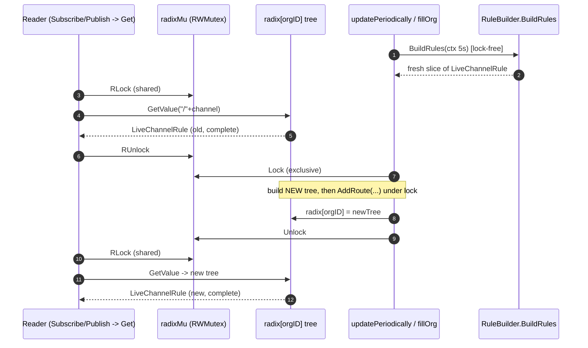
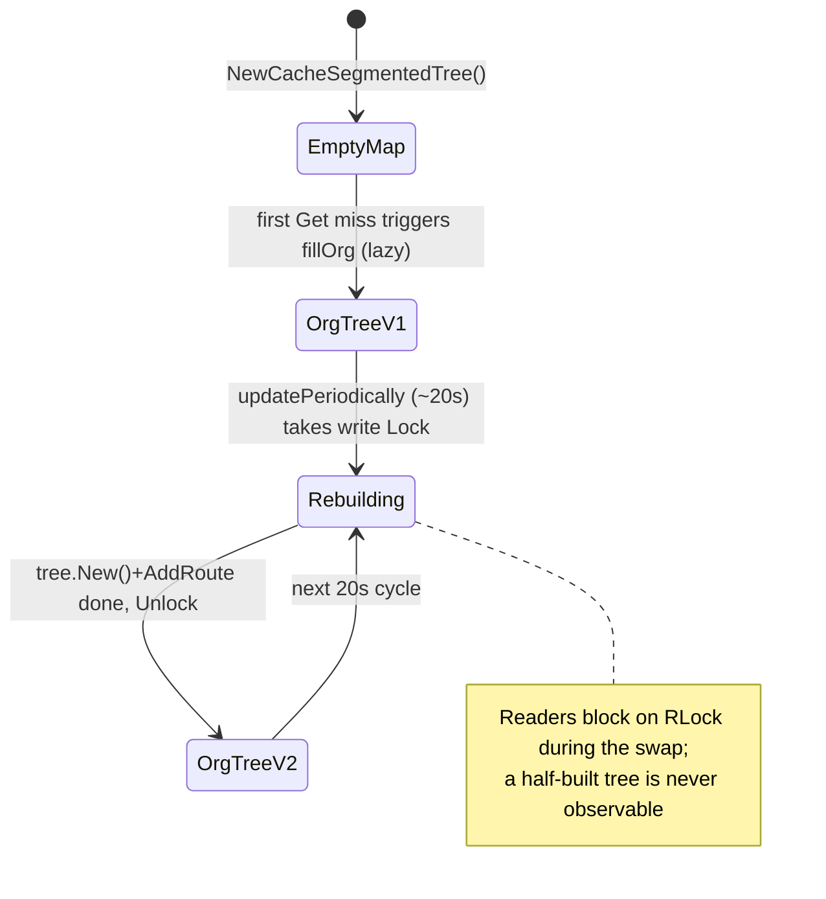

# Grafana Live — Channel-Rule Routing Coherence

> A code-grounded analysis of how Grafana Live's channel-rule routing layer stays
> internally consistent while it is actively serving lookups *and* rebuilding its
> set of live routes in the background.

---

## Orientation

**Scope.** This document answers how the *channel-rule routing layer* of Grafana Live
remains coherent when two activities overlap: (a) clients constantly subscribing to and
publishing on channels, each of which triggers a routing lookup, and (b) a periodic
background job that rebuilds the per-organization set of routing rules. The analysis is
confined to the channel-rule routing layer and its direct collaborators; adjacent Grafana
Live subsystems (stream lifecycle, frame caching, websocket transport, output destinations)
are out of scope and are mentioned, if at all, only for one-line contrast.

**Commit analyzed.** Every claim below is grounded in the Grafana source at commit
`4550cfb5b72886782d9a3e6cf995f8dbd57ca4ff`, on branch `grafana_4550cfb5b728`. The build
target is Go 1.23.1 `[go.mod:L3]`.

**Mapping the prompt to the code.** The user's "live streaming routing layer" and "set of
live routes" map precisely to the **`CacheSegmentedTree`**, which the source documents as the
component that *"provides a fast access to channel rule configuration"*
`[pkg/services/live/pipeline/rule_cache_segmented.go:L12]`. It holds **one radix tree per
organization** behind a single mutex `[pkg/services/live/pipeline/rule_cache_segmented.go:L15]`.
The user's "routing rules change quickly" maps to Grafana's **channel rules** — the
`*LiveChannelRule` objects keyed by channel `Pattern`
`[pkg/services/live/pipeline/pipeline.go:L128-L133]`.

The cache is the concrete implementation of the `ChannelRuleGetter` interface
`[pkg/services/live/pipeline/pipeline.go:L173-L175]`, and the routing structure itself is a
radix tree whose matching semantics are *"very similar to HTTP router functionality but …
adapted for Grafana Live channels"* using *"a modified version of
github.com/julienschmidt/httprouter"* `[pkg/services/live/pipeline/pipeline.go:L128-L133]`.

**Method (R3/R4).** This is a **read-only** analysis: it describes *existing* behavior and
proposes no change to the runtime (no change to the locking strategy, the refresh interval,
or anything else). Every substantive claim carries a `[path:locator]` citation to the source
at the commit above, and every answer section ends with an explicit **Rationale** explaining
*why* the cited mechanism produces the stated guarantee.

**The structure at the center of everything.** The whole discussion turns on one small struct.
The following is a **verbatim excerpt** of the source
`[pkg/services/live/pipeline/rule_cache_segmented.go:L13-L17]`:

```go
type CacheSegmentedTree struct {
	radixMu     sync.RWMutex
	radix       map[int64]*tree.Node
	ruleBuilder RuleBuilder
}
```

Reading it field-by-field: `radixMu` is the single `sync.RWMutex` that guards the routing map;
`radix` is the one per-org map of radix route trees (`map[int64]*tree.Node`); and `ruleBuilder`
is the collaborator that produces a fresh rule set on demand. There is exactly one
`sync.RWMutex` (`radixMu`
`[pkg/services/live/pipeline/rule_cache_segmented.go:L14]`) and one shared map keyed by
`orgID` `[pkg/services/live/pipeline/rule_cache_segmented.go:L15]`. Holding those two facts in
mind makes every guarantee below follow directly.

---

## O1 — Where the flow first takes shape, and how activity settles into consistency

> **User Question (verbatim):** "...how does all of that activity settle into something consistent, and where does that flow first take shape?"

**Answer.** The routing layer is constructed in `NewCacheSegmentedTree`, which does two things
and then returns: it seeds an **empty** per-org map (`radix: map[int64]*tree.Node{}`
`[pkg/services/live/pipeline/rule_cache_segmented.go:L21]`) and **immediately launches the
background refresher goroutine** (`go s.updatePeriodically()`
`[pkg/services/live/pipeline/rule_cache_segmented.go:L24]`), all within
`[pkg/services/live/pipeline/rule_cache_segmented.go:L19-L26]`.

Crucially, a *given organization's* routing view does **not** exist at construction time. It
**first materializes lazily, on demand**, the first time anyone looks up a channel for that
org. In `Get`, the code takes a read lock and checks whether the org is present; on a **miss**
it calls `fillOrg` **synchronously** to build that org's tree before serving the lookup
`[pkg/services/live/pipeline/rule_cache_segmented.go:L62-L71]`. From that point on, the
~20-second background loop keeps the org refreshed
`[pkg/services/live/pipeline/rule_cache_segmented.go:L28-L44]`.

The lookup path is reached from client activity. Three call sites invoke `Pipeline.Get`, and
each is **guarded by an `if g.Pipeline != nil` check** before the call:

- `handleOnSubscribe` calls `g.Pipeline.Get(...)` `[pkg/services/live/live.go:L639]` under the guard at `[pkg/services/live/live.go:L638]` (function defined at `[pkg/services/live/live.go:L613]`).
- `handleOnPublish` calls `g.Pipeline.Get(...)` `[pkg/services/live/live.go:L736]` under the guard at `[pkg/services/live/live.go:L735]` (function defined at `[pkg/services/live/live.go:L714]`).
- `HandleHTTPPublish` calls `g.Pipeline.Get(...)` `[pkg/services/live/live.go:L970]` under the guard at `[pkg/services/live/live.go:L969]` (function defined at `[pkg/services/live/live.go:L955]`).

`Pipeline.Get` is a thin delegate straight to the cache —
`return p.ruleGetter.Get(orgID, channel)`
`[pkg/services/live/pipeline/pipeline.go:L213-L215]`.

**Where the cache is constructed in this commit — and an important caveat.** In the source at
commit `4550cfb5b72886782d9a3e6cf995f8dbd57ca4ff`, the **only** place a `CacheSegmentedTree` is
constructed is the **dry-run conversion/test** handler `HandlePipelineConvertTestHTTP`
`[pkg/services/live/live.go:L1123]`. That handler builds a `StorageRuleBuilder`
`[pkg/services/live/live.go:L1136-L1142]` over an in-request `DryRunRuleStorage`
`[pkg/services/live/live.go:L1082-L1120]` (constructed at
`[pkg/services/live/live.go:L1133-L1135]`), then calls
`channelRuleGetter := pipeline.NewCacheSegmentedTree(builder)`
`[pkg/services/live/live.go:L1143]` and `pipeline.New(channelRuleGetter)`
`[pkg/services/live/live.go:L1144]`. This is the concrete, code-grounded illustration of *how*
a cache is built and reached through `Pipeline.Get`, but it is **not** production hot-path
wiring: there is **no `g.Pipeline = ...` assignment anywhere in `pkg/services/live` at this
commit**, which is precisely why each hot-path caller above is gated by `if g.Pipeline != nil`
`[pkg/services/live/live.go:L638]`, `[pkg/services/live/live.go:L735]`,
`[pkg/services/live/live.go:L969]` — when `g.Pipeline` is nil, the pipeline lookup is simply
skipped. The routing-coherence analysis below describes the behavior of the
`CacheSegmentedTree` itself (the routing layer), independent of where in the wider service it
is instantiated.

**Rationale.** "All that activity" settles into consistency because it is **funneled through a
single shared structure**. Three design facts combine:

1. **Construction guarantees the refresher exists for the cache's whole lifetime.** Because
   `NewCacheSegmentedTree` launches `updatePeriodically` before returning
   `[pkg/services/live/pipeline/rule_cache_segmented.go:L24]`, there is never a window in which
   the cache is live but unmaintained.
2. **Lazy first-fill materializes an org's tree on demand.** The first `Get` for an org that is
   not yet present triggers a synchronous `fillOrg`
   `[pkg/services/live/pipeline/rule_cache_segmented.go:L66-L71]`; once a fill has **succeeded**,
   the org is present in the map and subsequent readers hit an already-built in-memory tree. The
   background loop thereafter refreshes only orgs that are *already present* — it snapshots the
   existing keys under the lock `[pkg/services/live/pipeline/rule_cache_segmented.go:L30-L35]`.
   This materialization is **not** strictly exactly-once under concurrency: `Get` releases its
   probing `RLock` `[pkg/services/live/pipeline/rule_cache_segmented.go:L63-L65]` *before*
   entering the miss branch, and `fillOrg` runs `BuildRules` *before* acquiring the write lock
   `[pkg/services/live/pipeline/rule_cache_segmented.go:L49]`,
   `[pkg/services/live/pipeline/rule_cache_segmented.go:L53]`; there is no singleflight and no
   post-lock double-check. Several concurrent first readers for the same missing org can
   therefore each observe the miss and run competing `fillOrg` calls. That is harmless: each
   `fillOrg` finishes by **wholesale-replacing** `radix[orgID]` under the one write lock
   `[pkg/services/live/pipeline/rule_cache_segmented.go:L55]`, so the competing calls simply
   **converge on a last-writer-wins result** rather than corrupting state — and from then on
   every reader hits the in-memory tree.
3. **One map keyed by `orgID` is the single rendezvous point.** Every reader and the refresher
   operate on the *same* `radix` map under the *same* `radixMu`, so there is exactly one place
   where "the current routes for org N" is defined.

This lazy-first-fill behavior is not an inference — it is exercised directly by the in-repo
test, which constructs a cache with **no pre-seeded org** and observes that the very first
`Get` succeeds `[pkg/services/live/pipeline/rule_cache_segmented_test.go:L33-L54]`.

---

## O2 — How transitions are handled, and which view is authoritative

> **User Question (verbatim):** "...so how are those transitions handled, and what decides which view is authoritative at any given instant?"

**Answer.** A transition is a **wholesale replacement of an org's entire tree**, performed by
`fillOrg`. The following is a **verbatim excerpt** of the source
`[pkg/services/live/pipeline/rule_cache_segmented.go:L46-L60]`; the sequence is deliberate:

```go
func (s *CacheSegmentedTree) fillOrg(orgID int64) error {
	ctx, cancel := context.WithTimeout(context.Background(), 5*time.Second)
	defer cancel()
	channels, err := s.ruleBuilder.BuildRules(ctx, orgID)
	if err != nil {
		return err
	}
	s.radixMu.Lock()
	defer s.radixMu.Unlock()
	s.radix[orgID] = tree.New()
	for _, ch := range channels {
		s.radix[orgID].AddRoute("/"+ch.Pattern, ch)
	}
	return nil
}
```

The expensive rule fetch (`BuildRules`) happens **before** the lock is taken
`[pkg/services/live/pipeline/rule_cache_segmented.go:L49]`. Then, under the **exclusive write
lock** (`Lock` at `[pkg/services/live/pipeline/rule_cache_segmented.go:L53]`,
`defer Unlock` at `[pkg/services/live/pipeline/rule_cache_segmented.go:L54]`), it assigns a
**brand-new** `tree.New()` to `radix[orgID]`
`[pkg/services/live/pipeline/rule_cache_segmented.go:L55]` and repopulates it via `AddRoute`
`[pkg/services/live/pipeline/rule_cache_segmented.go:L56-L58]`. It never mutates the live tree
in place across the I/O boundary.

The **authoritative view at any instant is simply whatever `radix[orgID]` points to, observed
under `radixMu`.** The most recent successful `fillOrg` wins — **last-writer-wins**. The
previous tree is dropped and becomes eligible for garbage collection once no in-flight reader
still holds a reference to it.

**Rationale.** Authority is unambiguous because the swap at
`[pkg/services/live/pipeline/rule_cache_segmented.go:L55]` is a **single pointer assignment
into the map performed under the exclusive lock**. There is exactly one winner per cycle and
no blending of old and new state: a reader never observes a mixture of "some new rules, some
old rules." Because readers are gated by the *same* mutex (see O4), they always observe a
fully-formed pointer to a fully-built tree. Thus the question "which view is authoritative?"
reduces to a trivially decidable one: "whatever the map holds under the lock right now." The
state diagram in the synthesis section visualizes these transitions.

---

## O3 — Incomplete vs. stale routes, and the snapshot guarantee

> **User Question (verbatim):** "...does the system ever briefly expose an incomplete or stale route, or does it take a different approach to preserve a stable snapshot for consumers?"

**Answer — Incomplete: never.** The new tree is created and **fully populated entirely inside
the write lock** `[pkg/services/live/pipeline/rule_cache_segmented.go:L53-L58]`, and **every
reader must acquire `RLock`** before touching the map
`[pkg/services/live/pipeline/rule_cache_segmented.go:L72-L82]`. Because the empty
`tree.New()` and all of its `AddRoute` calls happen while the writer holds the exclusive lock,
no reader can be inside `Get` observing the map at the same time. A reader therefore sees
**either the entire old tree or the entire new tree** — never a transient empty or half-filled
one.

**Answer — Stale: cadence-limited (not strictly bounded) but always coherent.** A reader may
receive the **prior** rule set in two situations: between refresh passes and in the instants
around a swap. The background loop processes every currently-known org and *then* sleeps
`time.Sleep(20 * time.Second)` `[pkg/services/live/pipeline/rule_cache_segmented.go:L42]` before
starting the next pass `[pkg/services/live/pipeline/rule_cache_segmented.go:L28-L44]`. That makes
~20 seconds a **refresh cadence, not a hard freshness bound**: the time before a given org is
next re-filled also includes the time to process the other orgs in the pass — each `BuildRules`
may run up to its 5-second timeout `[pkg/services/live/pipeline/rule_cache_segmented.go:L47]` —
and, critically, if `fillOrg` returns an error the prior tree is **left in place**. On a
`BuildRules` error `fillOrg` returns *before* touching the lock
`[pkg/services/live/pipeline/rule_cache_segmented.go:L49-L51]`, and the loop merely logs the
error and moves on `[pkg/services/live/pipeline/rule_cache_segmented.go:L38-L40]`, so that org
keeps serving its previous snapshot until some later pass succeeds. What *is* guaranteed
regardless of timing is that whatever a reader receives is always a **complete, internally
consistent snapshot** — never a torn one. Moreover,
`StorageRuleBuilder.BuildRules` mints **fresh** rule objects on every cycle
`[pkg/services/live/pipeline/rule_builder_storage.go:L302-L379]`: it allocates a new slice
(`rules := make([]*LiveChannelRule, 0, len(channelRules))`
`[pkg/services/live/pipeline/rule_builder_storage.go:L313]`) and a newly-allocated
`rule := &LiveChannelRule{...}` per entry
`[pkg/services/live/pipeline/rule_builder_storage.go:L315-L320]` before appending and returning
them `[pkg/services/live/pipeline/rule_builder_storage.go:L376]`,
`[pkg/services/live/pipeline/rule_builder_storage.go:L379]`. Consequently, a consumer that has
already received a `*LiveChannelRule` from `Get` holds an **immutable snapshot**: a later swap
installs *different* objects in a *different* tree and never mutates the pointer the consumer
is holding.

**Answer — Design stance.** The layer deliberately favors a **stable, complete** view over
strict freshness: it provides **eventual consistency with coherent (never torn) snapshots,
refreshed on a best-effort ~20-second cadence** — not a hard staleness bound.

**Rationale.** Two properties combine to make this work:

- *No partial reads.* The RWMutex makes the "build new tree + swap pointer" critical section
  **atomic with respect to readers** `[pkg/services/live/pipeline/rule_cache_segmented.go:L53-L58]`
  vs. `[pkg/services/live/pipeline/rule_cache_segmented.go:L72-L73]`. Partial state is simply
  not observable, so an "incomplete route" cannot be exposed.
- *Staleness is the deliberate price of cheap reads.* Doing the slow I/O (`BuildRules`)
  **outside** the lock `[pkg/services/live/pipeline/rule_cache_segmented.go:L49]` is what keeps
  reads fast (O4), and the cost of that choice is a staleness window governed by the refresh
  **cadence** — ~20 seconds between passes `[pkg/services/live/pipeline/rule_cache_segmented.go:L42]`
  plus per-pass processing time, and extended further whenever a refresh errors until the next
  successful pass `[pkg/services/live/pipeline/rule_cache_segmented.go:L49-L51]`. Because each
  cycle allocates **new** objects rather than mutating shared ones
  `[pkg/services/live/pipeline/rule_builder_storage.go:L313-L320]`, there is no aliasing hazard
  for a consumer still holding a rule from a previous cycle.

---

## O4 — Weaving fast-moving requests with periodic updates

> **User Question (verbatim):** "I want to understand how the live layer weaves together fast moving requests and periodic updates without losing track of routing integrity."

**Answer.** A single **read-mostly `sync.RWMutex`** (`radixMu`
`[pkg/services/live/pipeline/rule_cache_segmented.go:L14]`) arbitrates everything:

- **Reads take a shared `RLock`.** The lazy-fill probe acquires and releases an `RLock`
  `[pkg/services/live/pipeline/rule_cache_segmented.go:L63-L65]`, and the actual lookup runs
  under another `RLock` (`defer ...RUnlock()`)
  `[pkg/services/live/pipeline/rule_cache_segmented.go:L72-L73]`, performing
  `t.GetValue("/"+channel, true)` `[pkg/services/live/pipeline/rule_cache_segmented.go:L78]`.
  Many readers proceed concurrently.
- **The rebuild takes an exclusive `Lock`.** Only the swap section is exclusive
  `[pkg/services/live/pipeline/rule_cache_segmented.go:L53]`.
- **The slow work is lock-free.** `BuildRules`, bounded by a 5-second context
  `[pkg/services/live/pipeline/rule_cache_segmented.go:L47]`, runs **before** the lock is taken
  `[pkg/services/live/pipeline/rule_cache_segmented.go:L49]`, so the exclusive critical section
  is only the **fast, in-memory tree build**
  `[pkg/services/live/pipeline/rule_cache_segmented.go:L53-L58]`.
- **The cadence** of the background loop is `time.Sleep(20 * time.Second)` between cycles
  `[pkg/services/live/pipeline/rule_cache_segmented.go:L42]`.

**Rationale.** This "weaves" cleanly for three reasons:

1. **An RWMutex matches the workload.** Subscribe/publish lookups are the overwhelmingly common
   case, and `RWMutex` allows **unbounded concurrent readers**; the writer only briefly excludes
   them, and only during the swap `[pkg/services/live/pipeline/rule_cache_segmented.go:L53]`.
2. **Slow I/O outside the lock keeps the exclusive window tiny.** Because `BuildRules` runs
   before `Lock` `[pkg/services/live/pipeline/rule_cache_segmented.go:L49]`, the time a reader
   might stall waiting for the writer is just the in-memory tree rebuild, not a database/storage
   round-trip.
3. **Integrity is never "lost track of"** because all mutation is serialized through the one
   writer (see the Integrity section). The net result is high read throughput — exercised by
   `BenchmarkRuleGet` `[pkg/services/live/pipeline/rule_cache_segmented_test.go:L56-L64]` — with
   periodic, atomic refreshes.

---

## Integrity sub-objective — *why* integrity holds for a non-concurrency-safe tree

> **Implicit question (surfaced from the code):** The route tree is explicitly *"Not
> concurrency-safe!"* and it **panics** (rather than returning an error) on conflicting patterns
> or duplicate handlers. So *why* does routing integrity hold? The design must serialize all
> tree mutations and validate rule sets before they are ever applied.

**Answer.** The radix tree is, by its own documentation, unsafe to mutate concurrently —
`// addRoute adds a Node with the given handle to the path.` / `// Not concurrency-safe!`
`[pkg/services/live/pipeline/tree/tree.go:L126-L127]` — and it **panics** on a wide range of
pattern conflicts and duplicate-handler registrations
`[pkg/services/live/pipeline/tree/tree.go:L222-L340]`, including the duplicate-handler case
*"handler are already registered for path ..."*
`[pkg/services/live/pipeline/tree/tree.go:L235]`. Integrity nonetheless holds, for two
independent reasons:

1. **Serialization removes the data race.** Every `AddRoute` against a live tree happens under
   the exclusive write lock `[pkg/services/live/pipeline/rule_cache_segmented.go:L53]`, so the
   tree is only ever built single-threaded. The author's "not concurrency-safe" warning is
   respected because there is never concurrent mutation.
2. **Pre-validation removes the content hazard on the file-backed persistence path.** On the
   file-backed channel-rule storage, a rule set is validated by `checkRulesValid` *before* it is
   persisted. That function builds a **throwaway** tree
   (`t := tree.New()` `[pkg/services/live/pipeline/models.go:L133]`), wraps the population loop
   in `defer func(){ if r := recover(); r != nil { reason = ...; ok = false } }()`
   `[pkg/services/live/pipeline/models.go:L134-L139]`, and `AddRoute`s every applicable rule
   `[pkg/services/live/pipeline/models.go:L142]`; if any insertion panics on a conflict,
   `recover()` converts the panic into `ok=false` plus a human-readable reason, and the function
   returns `ok=true` `[pkg/services/live/pipeline/models.go:L145]` only when the whole set builds
   cleanly. `FileStorage.saveChannelRules` refuses to persist an invalid set: it calls
   `ok, reason := checkRulesValid(orgID, rules.Rules)`
   `[pkg/services/live/pipeline/storage_file.go:L255]` and returns an error when `!ok`
   `[pkg/services/live/pipeline/storage_file.go:L254-L258]`. When the cache's `RuleBuilder` is a
   `StorageRuleBuilder` backed by that file storage, the rules `BuildRules` reads back
   `[pkg/services/live/pipeline/rule_builder.go:L5-L8]` via `ListChannelRules`
   `[pkg/services/live/pipeline/storage.go:L12]` (declared in
   `[pkg/services/live/pipeline/storage.go:L5-L16]`) were therefore validated at save time.

   **Scope of this guarantee (precise).** This pre-validation is a property of the *file-backed
   save path*, **not** of every cache. `NewCacheSegmentedTree` accepts **any** `RuleBuilder`
   `[pkg/services/live/pipeline/rule_cache_segmented.go:L19]`, and `checkRulesValid` is invoked
   **only** from `FileStorage.saveChannelRules`
   `[pkg/services/live/pipeline/storage_file.go:L255]`. A `RuleBuilder` whose rules do not flow
   through that save path is not covered: the package test uses a `testBuilder` that returns
   rules directly `[pkg/services/live/pipeline/rule_cache_segmented_test.go:L12-L31]`, and the
   dry-run handler feeds request-supplied rules through a `DryRunRuleStorage` whose
   `ListChannelRules` returns them verbatim `[pkg/services/live/live.go:L1118-L1120]` with no
   `checkRulesValid` step. On those paths it is the caller's responsibility to supply
   conflict-free patterns.

**Important caveat (stated explicitly).** `fillOrg` itself does **not** `recover`
`[pkg/services/live/pipeline/rule_cache_segmented.go:L46-L60]`. There is no `recover()` around
its `AddRoute` loop `[pkg/services/live/pipeline/rule_cache_segmented.go:L56-L58]`, so a
conflicting rule set that reached `fillOrg` *would* panic the background goroutine — nothing in
the cache itself prevents that. The protection lives **upstream, and only on the file-backed
save path**: `checkRulesValid` at save time `[pkg/services/live/pipeline/models.go:L132-L147]`,
`[pkg/services/live/pipeline/storage_file.go:L255]`. Thus for a `StorageRuleBuilder` backed by
file storage, conflicts are rejected when rules are *written*, and by the time they are *read
back* and replayed into the live tree they are already known to be conflict-free. For any other
`RuleBuilder` — for example the dry-run or test builders noted above — that property is **not**
guaranteed by this validation and depends instead on the caller supplying valid patterns.

**Rationale.** The two mechanisms are complementary and, together, sufficient:

- *Serialization* eliminates the **concurrency** hazard the tree's author warned about
  `[pkg/services/live/pipeline/tree/tree.go:L126-L127]` — the unguarded `AddRoute` is only ever
  run by one goroutine at a time.
- *Pre-validation* eliminates the **content** hazard (pattern conflicts) before it can reach the
  unguarded `fillOrg` path — **on the file-backed save path**, where `checkRulesValid` runs
  `[pkg/services/live/pipeline/models.go:L132-L147]`,
  `[pkg/services/live/pipeline/storage_file.go:L255]`. Builders that bypass that path (e.g. the
  dry-run/test builders) are not covered by it.

Combined, on the file-backed channel-rule path the panic-prone, non-thread-safe structure is
used in a **safe, single-writer, pre-validated** regime. The matching discipline it enforces is httprouter's
*"Only explicit matches"* rule `[pkg/services/live/pipeline/tree/readme.md:L15]` (the tree is
*"a tree code from https://github.com/julienschmidt/httprouter with … fixes/improvements made
inside [Gin]"* `[pkg/services/live/pipeline/tree/readme.md:L1-L7]`), which is precisely why
certain pattern combinations are defined as conflicts — e.g. `stream/:scope/cpu` together with
`stream/metrics/:metric` `[pkg/services/live/pipeline/tree/readme.md:L30-L31]`. The full
resolution spectrum is documented in the tree's README — explicit patterns, named-parameter
patterns, and catch-all (`*rest`) patterns, with "a version without named parameter ...
preferred when matching" `[pkg/services/live/pipeline/tree/readme.md:L23-L26]`. The **in-repo
cache test** specifically demonstrates the **explicit-over-named** precedence and
longer-pattern matching: explicit `stream/telegraf/cpu`
`[pkg/services/live/pipeline/rule_cache_segmented_test.go:L38]` is preferred over the named
`stream/telegraf/:metric` `[pkg/services/live/pipeline/rule_cache_segmented_test.go:L43]`; a
deeper channel matches the longer named pattern `stream/telegraf/:metric/:extra`
`[pkg/services/live/pipeline/rule_cache_segmented_test.go:L48]`; and a mid-segment named
parameter `stream/boom:er` matches `stream/booms`
`[pkg/services/live/pipeline/rule_cache_segmented_test.go:L53]`. That cache test does **not**
exercise a catch-all route; catch-all matching is a documented capability of the tree
`[pkg/services/live/pipeline/tree/readme.md:L26]` exercised separately in the tree's own tests
(e.g. the `/src/*filepath` pattern `[pkg/services/live/pipeline/tree/tree_test.go:L207-L208]`).
The matcher returns its result
in a `NodeValue` `[pkg/services/live/pipeline/tree/tree.go:L377]` whose `Handler` (a `Handler`
alias for `any` `[pkg/services/live/pipeline/tree/tree.go:L68]`) is type-asserted back to
`*LiveChannelRule` in `Get` `[pkg/services/live/pipeline/rule_cache_segmented.go:L82]`, with
any matched route parameters carried as `Params`
`[pkg/services/live/pipeline/tree/params.go:L17]` of `Param`
`[pkg/services/live/pipeline/tree/params.go:L9-L12]`.

---

## Concurrency-model synthesis

Putting the pieces together: the channel-rule routing layer is a **read-mostly cache** guarded by
**one `sync.RWMutex`** `[pkg/services/live/pipeline/rule_cache_segmented.go:L14]` over **one
per-org map of radix trees** `[pkg/services/live/pipeline/rule_cache_segmented.go:L15]`. Fast
subscribe/publish lookups take a shared `RLock` and read an already-built tree
`[pkg/services/live/pipeline/rule_cache_segmented.go:L72-L82]`. A background goroutine, launched
at construction `[pkg/services/live/pipeline/rule_cache_segmented.go:L24]`, re-fills each
already-known org on a best-effort **~20-second cadence** (the loop sleeps 20s between passes
`[pkg/services/live/pipeline/rule_cache_segmented.go:L42]`) by doing the slow rule fetch
**lock-free** `[pkg/services/live/pipeline/rule_cache_segmented.go:L49]` and then performing a
**wholesale, last-writer-wins pointer swap** of the whole tree under an exclusive `Lock`
`[pkg/services/live/pipeline/rule_cache_segmented.go:L53-L58]`. Because the build-and-swap is
atomic with respect to readers, there are **no torn reads** (a reader sees the whole old tree or
the whole new tree); each snapshot a reader receives is **always coherent**, refreshed on that
~20-second cadence rather than within a hard staleness bound — a failed or slow refresh simply
leaves the prior snapshot in place
`[pkg/services/live/pipeline/rule_cache_segmented.go:L49-L51]`; and because
each cycle allocates **fresh rule objects**
`[pkg/services/live/pipeline/rule_builder_storage.go:L302-L379]`, any rule pointer a consumer
already holds is an **immutable snapshot**. Routing integrity over the explicitly
non-concurrency-safe, panic-on-conflict tree
`[pkg/services/live/pipeline/tree/tree.go:L126-L127]`,
`[pkg/services/live/pipeline/tree/tree.go:L222-L340]` is preserved by **serializing all
mutations** under the write lock and, on the **file-backed channel-rule path**, by
**validating rule sets at save time** with `checkRulesValid`
`[pkg/services/live/pipeline/models.go:L132-L147]`,
`[pkg/services/live/pipeline/storage_file.go:L255]` (builders that bypass that save path are not
covered by that validation, and `fillOrg` itself does not `recover`).

### Sequence — a reader and the refresher interleaving



### State — an org's tree across refresh cycles



---

## Verification

The behavioral claims in this document are backed by the package's own test, which is
executable evidence rather than assertion:

- `TestStorage_Get` `[pkg/services/live/pipeline/rule_cache_segmented_test.go:L33-L54]`
  constructs the cache with **no pre-seeded org** and shows the first `Get` lazily fills it
  (O1), then asserts **explicit-over-named** precedence plus longer- and mid-segment named-pattern
  matching (Integrity section) — explicit `stream/telegraf/cpu`, named `stream/telegraf/:metric`,
  the longer `stream/telegraf/:metric/:extra`, and `stream/boom:er`. (This test does not exercise
  a catch-all route.)
- `BenchmarkRuleGet` `[pkg/services/live/pipeline/rule_cache_segmented_test.go:L56-L64]`
  exercises the shared-read lookup path repeatedly (O4).

These can be reproduced (optional) inside the provided Go 1.23.1 container
(`go 1.23.1` per `[go.mod:L3]`) with:

```
go test ./pkg/services/live/pipeline/...
```

This step is **optional**; the analysis above is grounded entirely in direct reading of the
source at commit `4550cfb5b72886782d9a3e6cf995f8dbd57ca4ff`. Per the task's rules, **no
temporary script is left in the repository** — any scratch files used for observation live
outside the repository tree (e.g., under `/tmp`) and are removed afterward, leaving the working
tree unchanged except for this single document.
